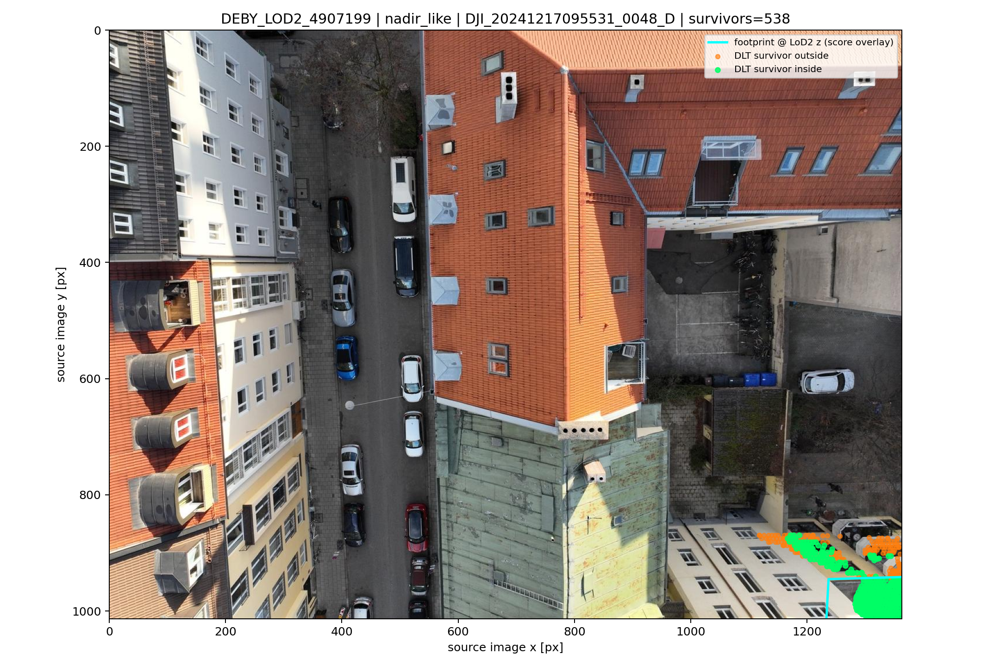
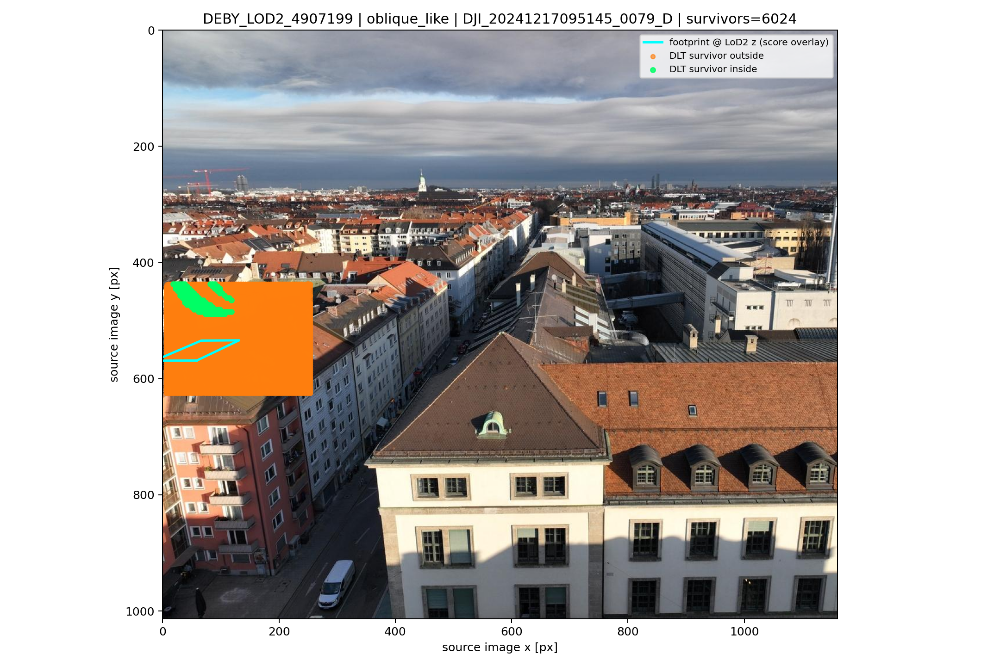
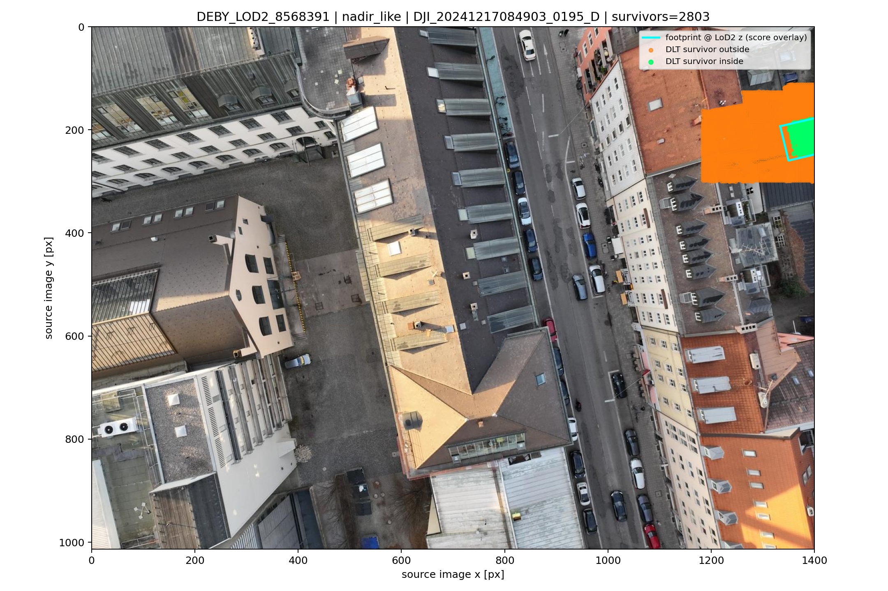
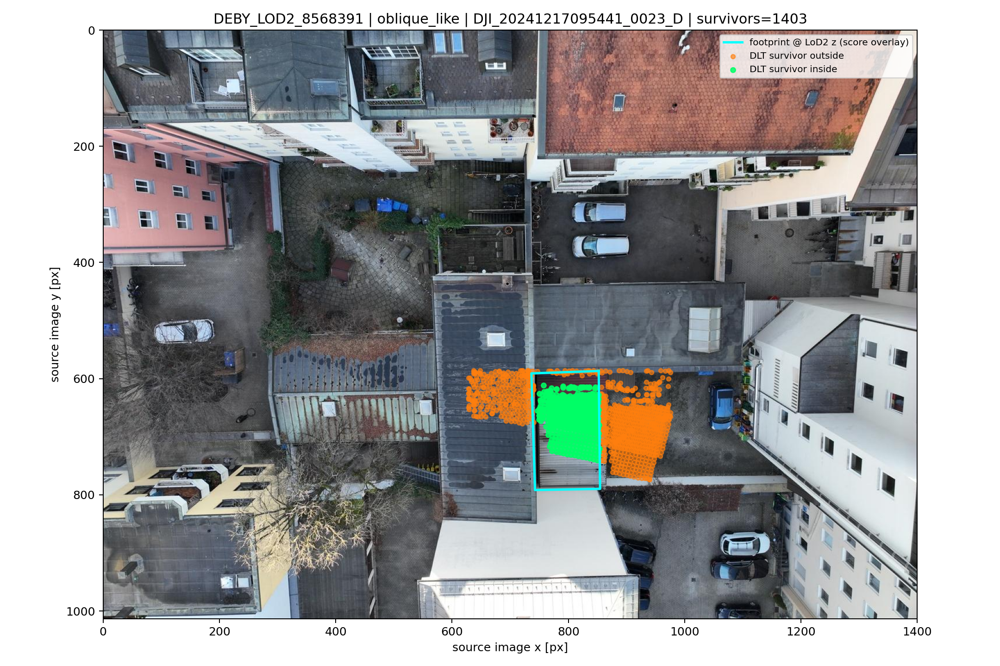
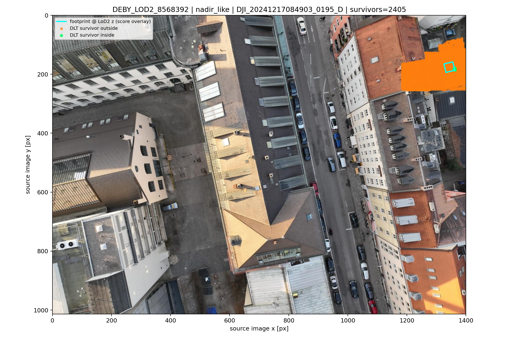
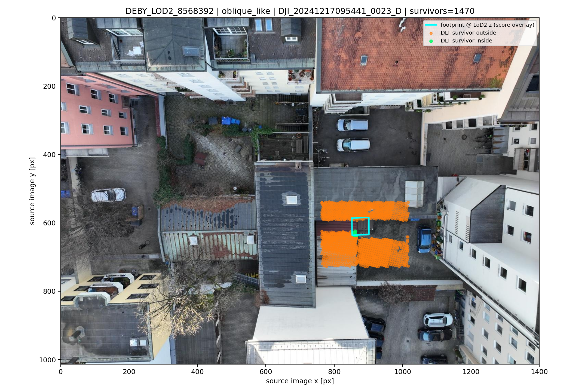

# W — E5 C001 S3-A′ FM 고정 포즈 재삼각측량 (2026-07-14)

> 학습 0회. MASt3R 2D reciprocal 대응점만 사용. MASt3R 3D·crop gauge·유사변환 미사용.
> 발자국과 LoD2 지붕 z는 고정 COLMAP DLT가 끝난 뒤 채점·오버레이에만 사용.

## 잠금 규칙

- DLT: 원본 픽셀 + 고정 COLMAP `K[R|t]`, float64 선형 SVD.
- 필터: 양 카메라 cheirality + 각 뷰 재투영 오차 최대 `2.0px`.
- 기선 축퇴 사전 라벨: 카메라 중심 거리 `<= 0.06m`; 건물 요약에서 제외.
- 원인 분류: 비축퇴 요약에서 신법 지붕 후보 >=1, 신·구 |Δz| 유한, 신법 |Δz|가 구법보다 작으면 `recovered`; 그 외 `still_bad`.

## 구법–신법 건물 요약

| 건물 | 쌍 선택/완료/비축퇴 | 구법 안/지붕/|Δz|/유출 | 신법 안/지붕/|Δz|/쌍간 MAD/유출 | 분류 |
|---|---:|---|---|---|
| DEBY_LOD2_4907199 | 10/10/7 | 0.000000/0.000000/—/1.000000 | 0.000000/0.000000/—/—/0.306691 | `still_bad_after_fixed_pose_retriangulation` |
| DEBY_LOD2_8568391 | 3/3/3 | 118.000000/118.000000/10.438459/0.473214 | 200.000000/0.000000/—/—/0.700234 | `still_bad_after_fixed_pose_retriangulation` |
| DEBY_LOD2_8568392 | 3/3/3 | 0.000000/0.000000/—/1.000000 | 3.000000/0.000000/—/—/0.996236 | `still_bad_after_fixed_pose_retriangulation` |

## 발자국 투영·생존 대응점

## 한 줄 관찰

0/3 회복·3/3 여전 실패·축퇴 쌍 제외
