# W — E5 C001 S3-A′ FM 재삼각측량 재채점 (2026-07-15)

> 학습 0회·신규 MASt3R 추론 0회. 기존 고정-COLMAP DLT 캐시만 재사용한다.
> LoD2 지붕 높이·평면과 ALS 높이는 등록 QA·채점·오버레이에만 사용한다. 발주 입력 `footprints_aoi` 형상은 발자국 안/밖·커버리지 공간 마스크에도 사용한다.

## 1파 — 인식 QA·등록 확인

- 실제 CityGML `RoofSurface` 평면과 `GroundSurface` footprint를 `z_local=z_DHHN2016+45.7-world_offset_z`로 변환하고 고정 `K[R|t]`로 투영했다.
- 판독 가능: 화면 안 지붕 면적 ≥256 px 및 8 px 안전 프레임 내 외곽 ≥0.70. 앵커: ≥1024 px 및 ≥0.90. 프레임 절단 뷰는 건물 투표에서 제외했다.
- 기존 semantic mask/IoU는 LoD2 계보 자기일치라 등록 판정값으로 재사용하지 않았다.

| 건물 | 앵커 | 등록 분류 | 판독 가능/전체 뷰 | 등록 확인 1줄 |
|---|---|---|---:|---|
| DEBY_LOD2_4907199 | `MULTIVIEW_CONSENSUS` | **앉음** | 5/6 | 09:51 사선 4뷰와 09:54 정사 0023에서 RoofSurface 외곽이 같은 낮은 지붕 패치에 겹침; 0048은 frame-clipped로 투표 제외 |
| DEBY_LOD2_8568391 | `DJI_20241217095441_0023_D` | **앉음** | 1/3 | 0023 완전 앵커가 골함석 지붕 외곽에 앉음; 0195 투영 대상은 주황 기와가 아니라 우측 끝 어두운 골함석이며 외곽 44.0%만 보여 투표 제외 |
| DEBY_LOD2_8568392 | `DJI_20241217095441_0023_D` | **앉음** | 3/3 | 0023 완전 앵커가 작은 부속 지붕 외곽에 앉고 0194·0195의 판독 가능 크롭도 같은 부속 지붕을 가리킴 |

### 뷰별 관측 품질

| 건물 | 뷰 | 면적(px) | 안전 외곽 | 품질 | 투표 |
|---|---|---:|---:|---|---|
| DEBY_LOD2_4907199 | `DJI_20241217095141_0077_D` | 2161.3 | 0.736 | `reviewable_nonanchor` | no |
| DEBY_LOD2_4907199 | `DJI_20241217095145_0079_D` | 2321.7 | 0.847 | `reviewable_nonanchor` | no |
| DEBY_LOD2_4907199 | `DJI_20241217095147_0080_D` | 2316.6 | 0.840 | `reviewable_nonanchor` | no |
| DEBY_LOD2_4907199 | `DJI_20241217095149_0081_D` | 2314.4 | 0.831 | `reviewable_nonanchor` | no |
| DEBY_LOD2_4907199 | `DJI_20241217095441_0023_D` | 44582.2 | 0.704 | `reviewable_nonanchor` | no |
| DEBY_LOD2_4907199 | `DJI_20241217095531_0048_D` | 8919.2 | 0.182 | `frame_clipped_or_too_small` | no |
| DEBY_LOD2_8568391 | `DJI_20241217084901_0194_D` | 6146.1 | 0.594 | `frame_clipped_or_too_small` | no |
| DEBY_LOD2_8568391 | `DJI_20241217084903_0195_D` | 4111.8 | 0.440 | `frame_clipped_or_too_small` | no |
| DEBY_LOD2_8568391 | `DJI_20241217095441_0023_D` | 22988.9 | 1.000 | `anchor` | yes |
| DEBY_LOD2_8568392 | `DJI_20241217084901_0194_D` | 899.2 | 1.000 | `reviewable_nonanchor` | no |
| DEBY_LOD2_8568392 | `DJI_20241217084903_0195_D` | 904.0 | 1.000 | `reviewable_nonanchor` | no |
| DEBY_LOD2_8568392 | `DJI_20241217095441_0023_D` | 2477.0 | 1.000 | `anchor` | yes |

### 원 프레임 + 중심 크롭

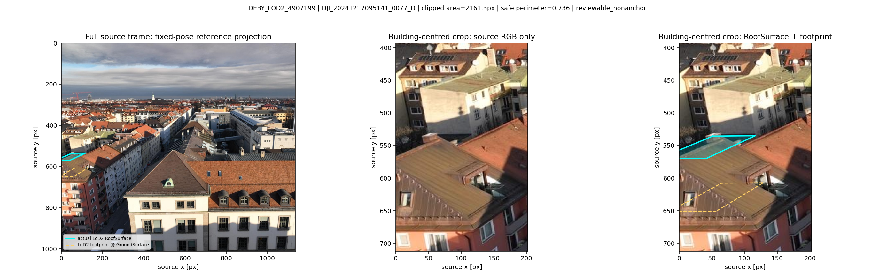
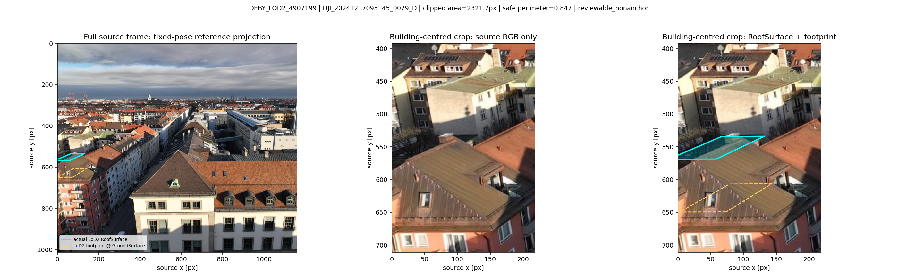
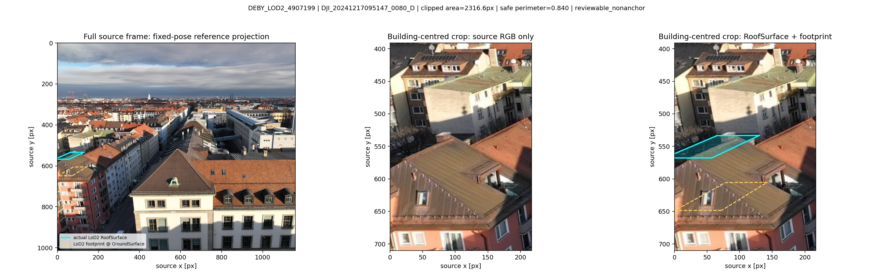
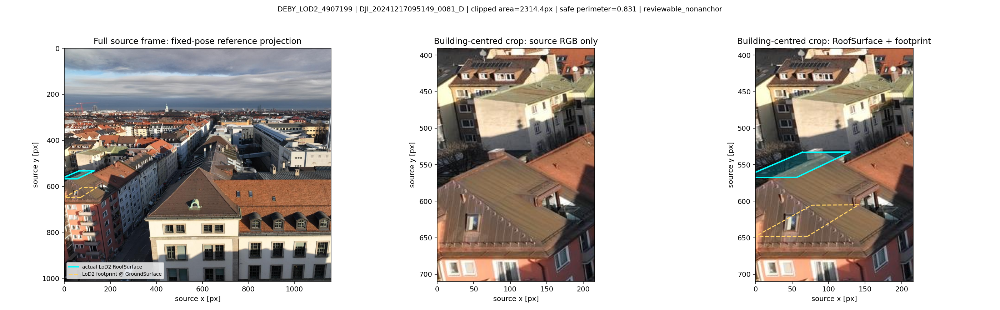
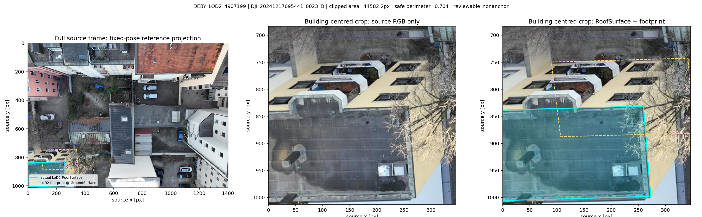
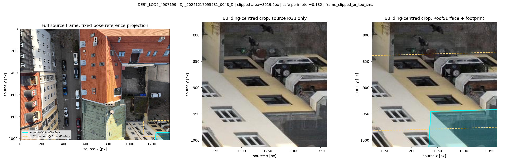
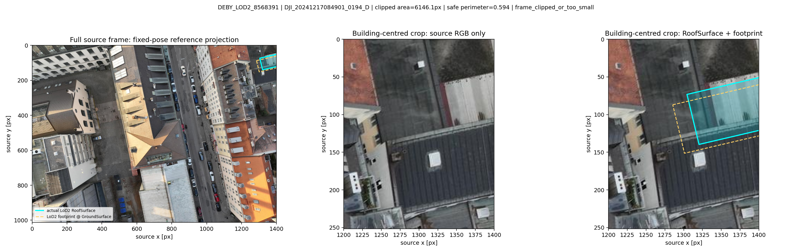
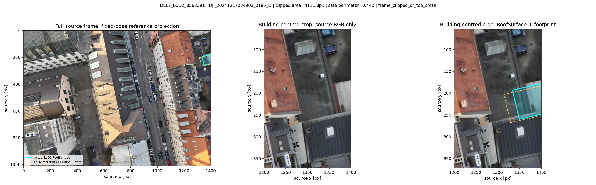
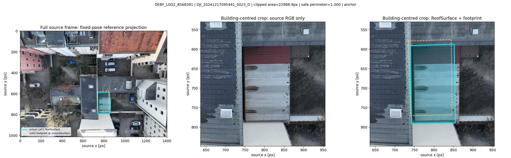
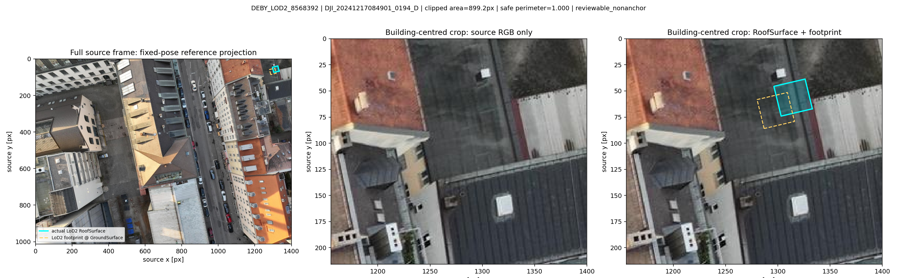
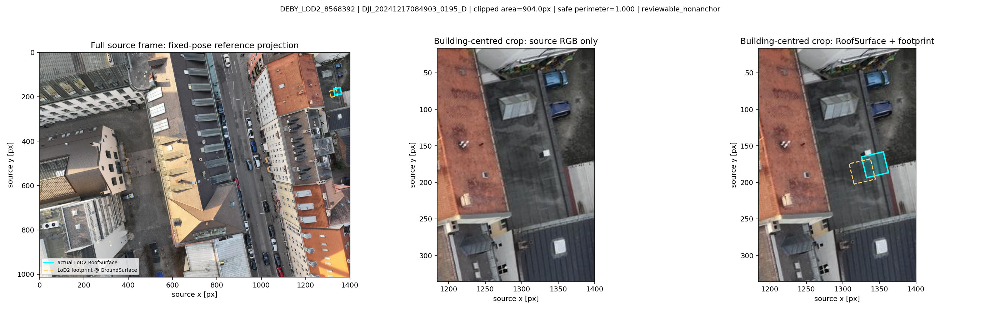
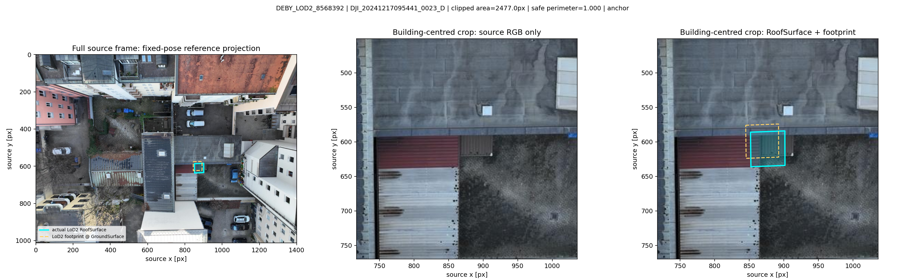

## 2파 — 높이·평면·경계표

- 이번 파도 후보 생성·추론 없음. 기존 NPZ의 cheirality·재투영 ≤2 px DLT 생존점 중 발자국 XY 안의 **모든 점**을 높이 필터 전에 재채점했다. 캐시는 원 실행의 frozen T0-1 oracle-address 크롭 계보를 그대로 상속한다.
- 건물 요약은 acquisition-minute block이 다른 쌍이면서 기선 >0.06 m인 쌍의 안 점을 풀링한다. 쌍별 행은 제외 쌍과 0점 쌍도 보존한다.
- 지면 **높이 표본**은 관측 SfM+밀집 초기점만 썼다. 발주 입력 `footprints_aoi` 형상으로 표적 2–15 m 바깥과 모든 발자국 1 m buffer를 공간 마스킹하고, 1 m 셀 q10의 0.5 m 하부 모드 중앙값을 냈다. LoD2 지붕 높이·평면과 ALS 높이는 쓰지 않았다.
- 평면은 안 점 전체에 결정적 RANSAC(잔차 0.30 m, seed 20260715); 커버리지는 발자국과 교차하는 0.5 m 셀 중 점이 있는 셀의 비율이다.

### 건물 요약·수치 경계

| 건물 | 교차쌍 안 점(쌍 중앙/최대·rank) | z 중앙±MAD | 중앙 abs(Δz) | 점→LoD2 RMS | 적합면→LoD2 RMS | inlier | 커버리지 | 수치 분류 |
|---|---:|---:|---:|---:|---:|---:|---:|---|
| DEBY_LOD2_4907199 | 373 (0.000000/373·r1) | -34.347425±0.022915 | 0.024917 | 1.862681 | 0.019847 | 0.731903 | 0.125000 | **(ii) 높이 근처·흩어짐/저커버** |
| DEBY_LOD2_8568391 | 456 (228.000000/256·r1) | -40.667009±0.032179 | 0.115291 | 0.135647 | 0.122544 | 0.993421 | 0.471698 | **(i) 지붕 평면 적합 양호+발자국 덮음** |
| DEBY_LOD2_8568392 | 6 (3.000000/3·r1) | -40.570602±0.069191 | 0.356398 | 0.430961 | 0.428577 | 1.000000 | 0.108108 | **(ii) 높이 근처·흩어짐/저커버** |

### 단일 비영점 쌍 보존

- DEBY_LOD2_4907199: 요약 대상 7쌍 중 비영점 1쌍; r1 `DJI_20241217095441_0023_D × DJI_20241217095531_0048_D` = 373점; 0048은 1파 frame-clipped·비투표 뷰.

### 지면 재추정

| 건물 | 지면 z(local m) | MAD | 관측점 | 셀/모드 셀 | 방식 |
|---|---:|---:|---:|---:|---|
| DEBY_LOD2_4907199 | -43.342000 | 0.152001 | 1572 | 170/76 | clean exterior 1m-cell q10 lower-mode median |
| DEBY_LOD2_8568391 | -43.178000 | 0.100549 | 3073 | 317/144 | clean exterior 1m-cell q10 lower-mode median |
| DEBY_LOD2_8568392 | -43.157000 | 0.055001 | 1916 | 204/101 | clean exterior 1m-cell q10 lower-mode median |

### 뷰쌍별 모든 안 점

| 건물·rank | 관계/기선(m) | 요약 포함 | 안 점 | z 중앙±MAD | 중앙 abs(Δz) | 평면 RMS | inlier | 커버리지 |
|---|---|---|---:|---:|---:|---:|---:|---:|
| DEBY_LOD2_4907199·r1 | cross_acquisition_block/54.491666 | true | 373 | -34.347425±0.022915 | 0.024917 | 0.019847 | 0.731903 | 0.125000 |
| DEBY_LOD2_4907199·r2 | cross_acquisition_block/87.474074 | true | 0 | — |  |  |  | 0.000000 |
| DEBY_LOD2_4907199·r3 | cross_acquisition_block/135.118101 | true | 0 | — |  |  |  | 0.000000 |
| DEBY_LOD2_4907199·r4 | cross_acquisition_block/87.451028 | true | 0 | — |  |  |  | 0.000000 |
| DEBY_LOD2_4907199·r5 | cross_acquisition_block/135.108209 | true | 0 | — |  |  |  | 0.000000 |
| DEBY_LOD2_4907199·r6 | same_acquisition_block/0.057419 | false | 17 | -23.488052±0.828575 | 10.844948 | 10.727199 | 0.941176 | 0.031250 |
| DEBY_LOD2_4907199·r7 | cross_acquisition_block/87.494419 | true | 0 | — |  |  |  | 0.000000 |
| DEBY_LOD2_4907199·r8 | cross_acquisition_block/135.143828 | true | 0 | — |  |  |  | 0.000000 |
| DEBY_LOD2_4907199·r9 | same_acquisition_block/0.032560 | false | 125 | -25.123063±1.699930 | 9.209937 | 9.318612 | 0.576000 | 0.243304 |
| DEBY_LOD2_4907199·r10 | same_acquisition_block/0.051219 | false | 0 | — |  |  |  | 0.000000 |
| DEBY_LOD2_8568391·r1 | cross_acquisition_block/56.074255 | true | 256 | -40.672248±0.031518 | 0.110485 | 0.114944 | 0.996094 | 0.411321 |
| DEBY_LOD2_8568391·r2 | cross_acquisition_block/54.041667 | true | 200 | -40.661833±0.030803 | 0.120770 | 0.133130 | 0.990000 | 0.301887 |
| DEBY_LOD2_8568391·r3 | same_acquisition_block/9.916932 | false | 108 | -40.694788±0.031580 | 0.087212 | 0.102406 | 0.990741 | 0.203774 |
| DEBY_LOD2_8568392·r1 | cross_acquisition_block/56.074255 | true | 3 | -40.509866±0.015921 | 0.417134 | 0.386596 | 1.000000 | 0.054054 |
| DEBY_LOD2_8568392·r2 | cross_acquisition_block/54.041667 | true | 3 | -40.631338±0.063797 | 0.295662 | 0.471167 | 1.000000 | 0.081081 |
| DEBY_LOD2_8568392·r3 | same_acquisition_block/9.916932 | false | 2 | -40.711082±0.003885 | 0.215918 |  |  | 0.054054 |

### 높이 색·평면도

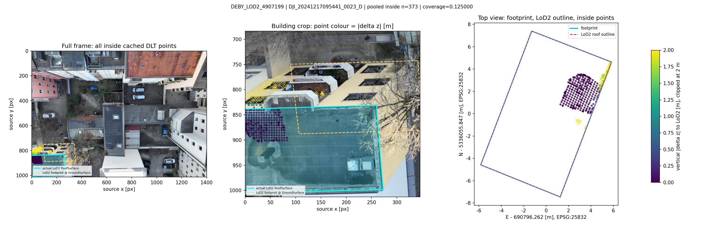
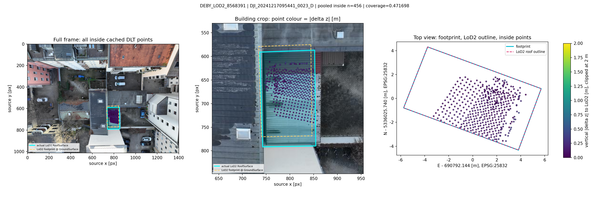
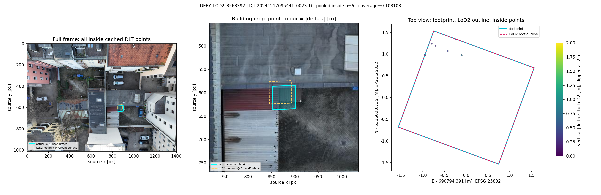

### 경계 판독표

| 건물 | 등록 | 기계 분류 코드 | 수치 사유 |
|---|---|---|---|
| DEBY_LOD2_4907199 | `seated` | `ii_near_height_scattered_or_low_coverage` | coverage<0.25_or_NA |
| DEBY_LOD2_8568391 | `seated` | `i_seed_usable` | n>=20; median_abs_dz<=1.0m; plane RMS<=1.0m; inlier>=0.50; coverage>=0.25 |
| DEBY_LOD2_8568392 | `seated` | `ii_near_height_scattered_or_low_coverage` | n<20;coverage<0.25_or_NA |

## 한 줄 관찰

4907199=ii_near_height_scattered_or_low_coverage · 8568391=i_seed_usable · 8568392=ii_near_height_scattered_or_low_coverage
