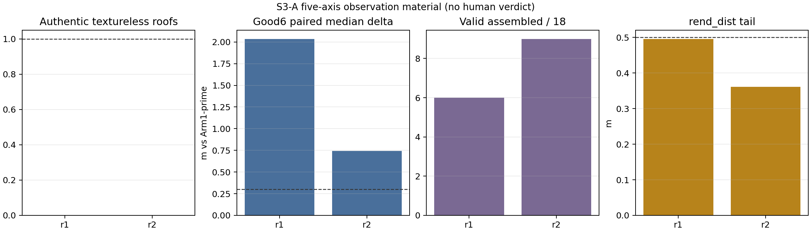
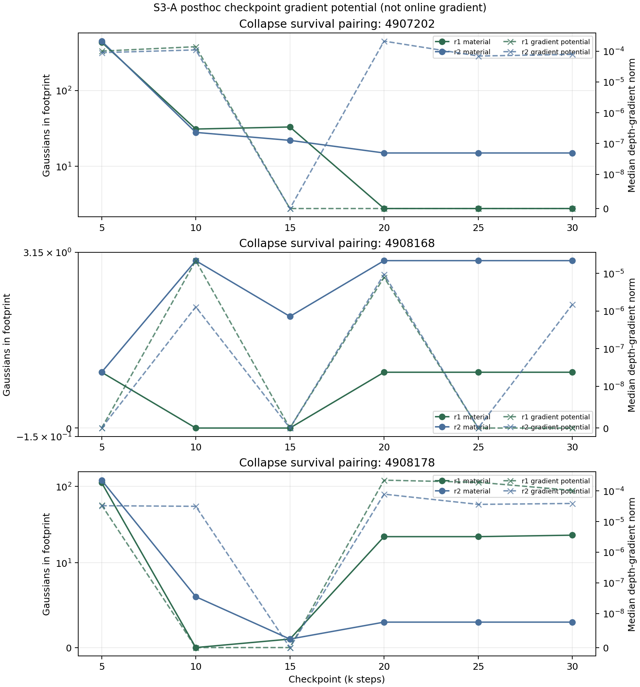
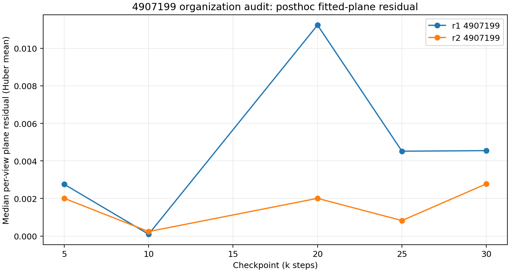

# W_E5_C001 S3-A 의미-유도 기하 정칙화

> **판정 0 · 관찰 자료.** 판정자는 김휘영이다. 정본 S0–S2p 산출물은 변경하지 않는다.
> 본 파도는 **S3-A = 참조 LoD2 레이캐스트 class+instance oracle을 쓰는 정답급 라벨·정답ID 주소 기제 상한 시험**이다.
> 결과가 답하는 범위는 “class와 건물 인스턴스 주소가 정확할 때 의미-유도 평활·평면이 침묵 영역 기하를 세울 수 있는가”의 상한에 한정된다. ID는 `R`의 주소로만 쓰고 높이·깊이 값 감독으로는 쓰지 않는다. FM 라벨·무모델 논문 본 주장은 별도 S3-B에서만 판독하며, **S3-B에서는 정답 building ID를 주소로 쓰지 않는다.**
> **정보 회수 런 주장 경계(07-14):** 무늬없음 3채 전원이 씨앗 부재 갈래(P-L)로 동결되어 합격선 (i) 충족 기대는 사전적으로 낮다. 본 2런의 주 산출은 붕괴 3동의 생존, 4907199의 조직화, 양쪽 성공 6동의 안전이며 결과는 씨딩 재설계의 입력이다.

## 기술 요약

절반 가중 셀 2런은 모두 30k까지 유한 손실로 끝났고, 정본 base 점군화→Roofer 조립→405 수리본→5축·8way 채점까지 완료했다. **잠긴 두 합격선의 기계 관찰 재료는 어느 런에서도 문턱에 닿지 않았다.** 무늬없음 3채 정품 조립은 r1/r2 모두 `0/3`이고, 양쪽 성공 6동의 Arm 1′ 짝 델타는 가용 짝이 각각 `4/6`뿐인 가운데 중앙 `+2.0362/+0.7444 m`, 파국 `3/2`다. 이는 김휘영의 판정을 대신하지 않으며 `human_verdict=not_assigned`를 유지한다.

주 관찰 3종은 다음과 같다.

1. **생존:** 4907202의 5k→10k 재료 비율은 r1 `432→31=7.18%`, r2 `446→28=6.28%`로 S2p `38/463=8.21%`보다 낮다. r2는 고정 뷰 사후 기울기 잠재량이 20–30k에도 0이 아니지만 재료는 15개에 머물렀다. 4908168은 0–3개, 4908178은 재등장이 있으나 5k 재고를 회복하지 못했다.
2. **조직화:** 4907199는 r1 `129→513`, r2 `380→591`개로 재료가 늘고 자기 적합 평면 잔차도 작은 구간이 있으나, 깊이 닻 중앙은 전 시점 0이고 z 중앙은 약 578–579 m의 잘못된 층에 남았다. 최종 RMS/유효성은 r1 `9.0790 m/무효`, r2 `5.7497 m/무효`다.
3. **안전:** 청소 관찰선은 두 런 모두 유지했다(`N=542,205/541,070`, `rend_dist=0.4957/0.3606`). 경사 회복(P-K) 조건은 r1의 60098, r2의 4907185에서 각각 관찰됐으나 두 건물의 단안 법선 prior가 모두 `>30°` 오차라 독립 형상 회복으로 단정하지 않는다. 정확도 비퇴행선은 위 짝 델타·파국 수치상 관찰되지 않았다.

핵심 한계는 네 가지다. 본 파도는 class+instance oracle 상한이고, 재료 수는 동일 개체 추적 생존율이 아니라 발자국 안 중심 개수이며, 체크포인트 기울기는 온라인 optimizer-time 유입이 아닌 고정 뷰 사후 잠재량이고, 4907199 평면 잔차는 시점별 유효 픽셀이 달라지는 자기 적합 잔차다. 따라서 이 결과를 FM·무모델 논문 주장이나 실제 씨딩 효과로 확장하지 않는다.

## 0. 사전 잠금

- 진입: T0-1은 자기일치 참고 측정이며 관문이 아니다. Track A 진입은 **T0-2 완료 + T0-4 1k 게이트 통과**로 잠근다.
- base: Arm 1′ 그대로(`w_distort=100`, `w_normal=0.05`, `w_nc=0.05`, `prune_opa=0.05`, final prune 없음, seed 2001, 30k, dense C001 18동).
- S3 delta: 절반 가중 이관 `0.125·L_smooth + 0.125·L_plane + 0.01·L_nb`, 첫 투입 iter 1,500. 단안 깊이는 0이다.
- 1k 게이트 당락: iter 0–2,499 프로브의 1,500–2,499 = 신규 손실 1,000 active update에서 **총손실 유한 + 결합 `L_semdepth`·`L_nb` 각 기울기 노름 비중 `<=0.40`**이다. 신호 도달(P-I)은 예측 대조용 측정이며 당락이 아니다.
- 초과 시 해당 가중만 절반 1회 재게이트한다. `L_semdepth`는 항 1·2를 비례 절반한다. 두 번째도 초과하면 해당 손실을 제외하고 Track A를 보류한다.
- 본 셀은 동일 seed·config의 비결정성 반복 2런. 합격선 (i)·(ii)는 **두 런 모두** 충족해야 충족이다.
- 주소: 고정 class mask의 실원천 `ζ=48.0/shift_z=556.0` raycast building ID를 `R`에만 사용한다. 공식 45.7은 audit-only, 깊이·높이 감독은 금지다.
- P-J/P-L: 1k gate의 가시 뷰별 `alpha>=0.5 AND L_depth valid` 픽셀 수의 건물 중앙값이 `>=64` P-J, `<64` P-L이다. `32..128`은 경계 사례로 병기하고 커밋 후 바꾸지 않는다.
- 기존 기계 `gate_status`는 당시 구현이 P-I를 포함해 낸 값을 고치지 않는다. 사람 판정은 별도 `human_verdict`·`human_verdict_reason`으로 기록하며, 연구 판정자는 김휘영이다.

### 사전 예측

| 쉬운 이름(코드) | 잠금 예측 | 관찰 |
|---|---|---|
| 신호 도달(P-I) | 1k 게이트에서 무늬없음 3채 픽셀에 `L_semdepth` 기울기가 0이 아님 | **부분 적중**: 4907199 적중(max 6,595 px), 8568392 근소 적중(12→189 px), 8568391 빗나감(0/8; P-L 실측) |
| 재료 형성(P-J) | 씨앗이 있는 무늬없음 채에서 5k 지붕 재료 수십 개 이상 | **잠금 대상 없음**: attempt 1에서 무늬없음 3채 모두 P-L로 동결. 4907199의 잘못된 +8 m 재료는 정품 형성으로 세지 않음 |
| 경사 회복(P-K) | `4907185` 또는 `60098`의 경사 모드 `>=1`, 방위각 참조 `±25°` | **두 런 조건 관찰**: r1 60098(mode 1, `20.9°`), r2 4907185(mode 1, `13.6°`). r2 4907185는 Arm 1′도 이미 조건 안이어서 신규 회복으로 단정하지 않으며, prior 오차 `43.1°/35.5°` 주의 |
| 씨앗 부재 갈래(P-L) | 게이트 깊이 닻 픽셀 중앙 `<64`인 채는 무반응 관찰. 의미 영역 씨딩 원칙 심사 재료로만 기록 | 무늬없음 3채 모두 중앙 0 px로 동결. 최종 재료는 8568391 `5/0`, 8568392 `0/0`; 4907199는 잘못된 +8 m 층 `513/591` 유지 |
| 잠긴 관전: 202 생존 | `4907202` 5k→10k 재료 비율이 S2p `38/463=8.21%`보다 오르는가 | r1 `7.18%`, r2 `6.28%`; 두 런 모두 기준보다 낮음 |

## 1. Track 0

### T0-1 의미 라벨 정합(참고 측정)

현행 라벨과 참조가 같은 LoD2 뿌리이므로 GO/기각에 쓰지 않는다. 레이캐스트·크롭·datum 결함 감사와 후속 S3-B FM 대조 기준값이 목적이다.

| 항목 | 상태 |
|---|---|
| 핵심 9동 × 가시 뷰 `>=3` IoU·파편·경계 오프셋 | **완료: 27뷰 + 9동 중앙값, output QA pass** |
| 영문 오버레이 갤러리 | **완료: 27 full + 9 priority crop + 3×3 contact sheet** |
| 정답ID 주소 영역 캐시 428뷰 | **완료: 428/428, 570 regions, strict loader preflight pass** |
| 레이캐스트 building-id 오배정률 | **실원천 48.0 조건부 0/7,109,646 = 0** |
| 정답ID 지붕↔고정 class 지붕 보충 | **완료: 428뷰·경계 1 px 제외, binary agreement 0.999740·roof IoU 0.999349** |
| 우선 9장 정답ID 경계 | **실제 lime 경계 8장 + ID 무관측 명시 1장, 합성 경계 0** |

**계보 preflight(결과 확정 전):** 현 C001 clean mask는 공식 `ζ=45.7 m`(`shift_z=558.3`) 재레이캐스트 첫 sample과 class agreement `0.908274`, roof IoU `0.879068`이며, 실제 원천 `ζ=48.0 m`(`shift_z=556.0`)과는 exact다. T0-1 참조 투영은 45.7을 쓴다. B 판정 뒤 실원천 raycast building ID는 `R`의 인스턴스 주소로만 허용하며 ray 거리·교점 XYZ·LoD2 깊이·높이·평면 값은 저장·감독하지 않는다. 공식 45.7 ID와 과거 발자국 규칙은 audit-only다.

**첫 428뷰 실행 정지 기록(보정 전):** 정답ID 주소 cache 428개는 생성됐지만, producer가 파편 측정용 `64 px` 지지선을 가시 뷰 조건으로도 잘못 재사용해 `8568392`를 2뷰로 판독하며 CSV·갤러리·manifest 작성 전 fail-fast했다. 손실 주소·가중·게이트 규칙은 바꾸지 않고, T0-1에서만 `official P_ref > 0`을 가시성, `>=64 px`을 파편 측정 지지로 분리했다. 선택된 `<64 px` 뷰는 `LOW SUPPORT / audit-only`로 CSV·오버레이에 남기고, 경계가 없어 오프셋을 구할 수 없으면 대체값 없이 `null+사유`로 보존한다. 보정 전·후 모두 T0-4 게이트와 학습은 시작하지 않았다.

#### T0-1 건물 중앙값(참고 측정)

| 건물 | 가시 뷰 재고 | 선택 뷰 `P_ref` px 중앙 | IoU 중앙 | 파편 `>=64px` 중앙 | 경계 오프셋 px / m 중앙 | 저지원 선택 뷰 |
|---|---:|---:|---:|---:|---:|---:|
| 8568391 | 5 | 3,436 | 0.3547 | 1 | 10.815 / 0.864 | 0 |
| 8568392 | 5 | 955 | 0.1482 | 1 | 12.825 / 0.852 | **1** (`P_ref=34px`, audit-only) |
| 4907199 | 8 | 6,351 | 0.6295 | 1 | 18.000 / 0.756 | 0 |
| 4907184 | 120 | 422,205 | 0.8796 | 1 | 21.000 / 0.596 | 0 |
| 4907185 | 68 | 58,473 | 0.6444 | 1 | 10.000 / 0.249 | 0 |
| 4907198 | 59 | 40,022 | 0.5171 | 1 | 14.815 / 0.421 | 0 |
| 4907202 | 10 | 53,407 | 0.8121 | 2 | 3.000 / 0.109 | 0 |
| 4908168 | 10 | 7,277 | 0.6567 | 1 | 6.000 / 0.209 | 0 |
| 4908178 | 9 | 25,228 | 0.7035 | 1 | 12.000 / 0.572 | 0 |

육안 쌍인 `docs/figs/e5_c001_s3/semantic_gate/priority/textureless3_contact_sheet.png`에서 고정 clean roof는 무늬없음 3채의 지붕 픽셀을 모두 덮는다. 다만 `8568392` 3순위는 표적이 34 px인 저지원 뷰이고, 관측 후보 중 프레임 경계에 걸린 뷰도 갤러리에 그대로 표시했다. IoU·오프셋은 clean 48.0 원천과 공식 45.7 참조 투영의 datum 계보 차이를 포함한 자기일치 감사값이며, 게이트 판정에 쓰지 않는다.

#### 정답ID 지붕↔고정 class 지붕 보충(07-14)

실원천 `48.0/556.0` raycast를 428뷰에서 독립 재생하고, `ID-roof = class 1 AND valid building ID`를 고정 class 지붕과 비교했다. 두 마스크의 지붕 전이 1 px 대역을 대칭 제외한 291,476,677 px에서 binary agreement는 **0.999739842**, roof IoU는 **0.999348697**다. raw class replay는 296,775,467 px 중 161,311 px 불일치(agreement 0.999456454)였고, producer-process inventory는 123,232 px 불일치(0.999584764)다. 독립 replay가 inventory와 bit-exact인 뷰는 358/428이다. 이 차이는 입력 계보 변경으로 단정하지 않는다. source manifest·producer·datum·mesh·고정 PNG 428개·주소 cache 428개·container digest는 계속 fail-closed로 검증하고, 독립 Open3D replay의 픽셀 delta만 비차단 측정으로 원값을 보존했다.

우선 9장 중 8장은 실제 target ID 경계를 lime으로 덧그렸다. `8568392` rank 2(`DJI_20241217095439_0022_D`)는 공식 `P_ref`가 frame edge에서 보이지만 실원천 target ID 픽셀이 0이라 선을 만들지 않고 **`TARGET ID NOT RAYCAST-VISIBLE | no boundary drawn`**으로 표시했다. 합성 경계는 0건이다. 구조화 수치는 `docs/e5_c001_s3_idmap_class_agreement.csv`, 개별 9장·contact·CSV 해시와 8/1 상태는 `docs/e5_c001_s3_idmap_class_agreement_manifest.json`에 결박했다. durable manifest SHA-256은 `45dae195a081c2a68d9098a3be243898d5ae96b5bd2828e1493da1882dc08bc6`, 비순환 output-set SHA-256은 `a40f1e96019899b8adfedcd2a60fa8d10326f435948ec93005b244b36252f0c4`다.

#### 발자국 분할 3뷰 선행 smoke — B 판정 전 결손 기록

형식 계약은 통과했다: C00118 고정, class1 8-연결 `>=256`, `int32` region id, 정확한 절단선 7+7 px, LoD2 높이 미사용, raycast ID audit-only, loader 3/3·29영역 통과. 그러나 건물별 주소의 실제 배정에서 두 요구를 동시에 만족하지 못했다.

| 실제 라벨 원천(48.0) 기준 | eligible px | correct | wrong | cutline | zero-source veto | 관찰 |
|---|---:|---:|---:|---:|---:|---|
| 4907199 | 37,999 | 24,291 | 2,402 | 1,238 | 10,068 | assigned coverage 0.70247; 양의 영역 2개·24,488 px |
| 4908179 | 22,029 | 0 | **12,771** | 1,475 | 7,783 | 배정된 픽셀의 오배정률 1.0; 전부 108247349로 귀속 |
| 60098 | 18,642 | 15,905 | 1,046 | 1,691 | 0 | wrong의 전부가 4907185로 귀속 |

- pooled 3뷰: assigned coverage `0.952776`, 조건부 오배정률 `0.025439`. pooled 값만으로는 4908179의 건물별 파국이 가려지므로 건물값을 주 자료로 둔다.
- 첫 smoke에서 영역 생성기가 float32 지역 좌표에 큰 UTM offset을 더하며 Y를 최대 0.25 m 양자화한 것을 발견했다. T0-2와 같이 offset 복원 전 float64로 승격하도록 고친 후, 씨앗 6동 계수가 정본 `2+30, 0+9, 0+29, 70+955, 2+91, 24+395`와 모두 일치함을 확인하고 smoke를 재생성했다. 이 표는 정정 후 값만 쓴다.
- inactive footprint의 +20 m 투영을 먼저 전부 veto하면 4908179 wrong은 0이 되지만 4907199의 37,999 px도 전부 veto되어 P-I 주소가 사라졌다.
- active/inactive를 같은 최근접 경쟁에 넣으면 4907199는 위와 같이 살아나지만, 4908179 12,771 px가 이웃 active 건물로 넘어간다.
- 기존 `L_depth` 유효점으로 component를 seed하는 대안은 두 표적 component 모두 depth seed 0이었다. 초기 3D점을 실제 XYZ로 투영해 component 안에서만 전파하는 보수 대안은 wrong 0을 만들지만, 4907199는 `2,402/37,999=6.32%`만 주소가 생기고 4908179는 `22,029/22,029` 미배정이다.
- LoD2 raycast building ID 또는 roof z를 주소 입력으로 쓰면 완전 분할은 가능하지만, 발주의 “ID는 1회 검증만·class label 조건”을 넘어 정답 기하/인스턴스 주소를 추가하는 범위 변경이다.

따라서 현재 규칙으로 만든 428뷰 cache는 기제 상한을 깨끗하게 격리하지 못한다. 진단 스크립트는 전수 실행을 hard-block하고 `--view-stems/--limit` smoke만 허용한다. 산출은 `phases/p2-gsjso/runs/20260713_e5_c001_s3_track0/smoke_c00118_{docs,run}/`이며, 428뷰 생성·T0-4 프로브·Track A 학습은 시작하지 않았다.

**재개에 필요한 주소 규칙 판정:** (A) class-only/GT-ID audit-only 경계를 유지하고 초기 3D점→동일 component 전파로 바꿔 미배정 93.68%를 P-L형 보수 갈래로 수용할지, (B) S3-A를 class+instance oracle 상한으로 한 단계 더 넓혀 raycast building ID를 `R` 주소에 허용할지, (C) 별도의 비-GT 투영 규칙을 지정할지 선택이 필요하다. 어느 갈래도 기존 발주 문면과 완전히 동일하지 않으므로 임의로 선택하지 않았다.

**재개 판정 수신(07-13 밤): B 정답ID안.** 위 3뷰 표는 정답ID 대비 발자국 규칙의 결손 기록으로 보존한다. 활성 `R`은 고정 class mask와 실원천 `ζ=48.0/shift_z=556.0` raycast building ID의 교집으로 생성하며, ID는 오직 주소이고 높이·깊이 감독이 아니다. 기존 hard-block은 이 신규 규격의 전수 cache·provenance 검증을 통과하는 조건으로 해소한다.

#### 구현·문헌 확인(재개 전)

1. ∇²는 중앙+상하좌우 전체가 같은 positive region·finite depth/α·`alpha>=0.5`·cutline 밖일 때만 쓴다(`src/stage2/loss/semantic_guided.py:407-465`).
2. edge-aware는 꺼져 있다. 함수에 RGB/영상 기울기 입력이 없고 `semantic_guided.py:450-465`는 비가중 5점 Laplacian만 계산한다.
3. AlignGS는 전 화면 `I\M` Pearson + 경계 횡단 렌더 법선쌍 발산이고, 우리는 oracle `R` 평활·평면 + 5 px class 밴드의 렌더→Omnidata 법선 정합이다(`semantic_guided.py:720-734`).
4. 0048뷰 점 전파 분자와 최근접 오배정의 2,402 px은 동일 집합이다(XOR=0, SHA256=`4b9e02a34d6e8c2135f946a67b73db14a7c1ed182c83bc6634c77b78b3074428`).

### T0-2 씨앗 재고

| 건물 | 군 | SfM | dense init | 0-iter 가우시안 |
|---|---|---:|---:|---:|
| 4907199 | 무늬없음·관측 | 2 | 30 | 32 |
| 8568391 | 무늬없음·관측 | 0 | 9 | 9 |
| 8568392 | 무늬없음·관측 | 0 | 29 | 29 |
| 4907202 | 붕괴 | 70 | 955 | 1,025 |
| 4908168 | 붕괴 | 2 | 91 | 93 |
| 4908178 | 붕괴 | 24 | 395 | 419 |

- 초기 전체 = SfM `44,016` + dense init `201,625` = `245,641`.
- 계수 = EPSG:25832 정확 발자국 polygon `contains_xy`, buffer 없음, 경계점 제외·별도 기록. 독립 잠금 수치와 6/6 일치.
- 산출: `docs/e5_c001_s3_seed_inventory.csv`, `phases/p2-gsjso/runs/20260713_e5_c001_s3_track0/t0_2_t0_3_manifest.json`.

### T0-3 단안 법선 다중 뷰 채점

| 건물 | 뷰 | abs-dot 각도 중앙(°) | 잠금 구간 |
|---|---:|---:|---|
| 4907184 | 5 | 19.6345 | 15–30 |
| 4907185 | 5 | 35.5068 | >30 |
| 4907198 | 5 | 17.0084 | 15–30 |
| 4907202 | 5 | 5.6172 | <15 |
| 4908168 | 5 | 28.5712 | 15–30 |
| 4908178 | 5 | 9.3716 | <15 |
| 4907199 | 5 | 29.8616 | 15–30 |
| 8568391 | 5 | 5.5832 | <15 |
| 8568392 | 5 | 1.6595 | <15 |
| 60098 | 5 | 43.1204 | >30 |
| 4907186 | 5 | 46.7058 | >30 |
| 4907188 | 5 | 37.7617 | >30 |
| 4907194 | 5 | 29.2820 | 15–30 |
| 4907195 | 5 | 30.9342 | >30 |

- 14동 × 5뷰 = 70행. 건물값 = 뷰 중앙값의 중앙, 중앙 64% 크롭, LoD2 지붕면 법선 중 최대 abs-dot.
- 구간 분포 = `<15°` 4동 / `15–30°` 5동 / `>30°` 5동.
- P-K 주 표적 `4907185`와 참고 `60098`이 모두 `>30°`이므로 `L_nb`는 나쁜 prior 증폭 위험과 함께 읽는다.
- 산출: `docs/e5_c001_s3_normal_multiview.csv`.

### T0-4 신규 손실 구현·1k 게이트

**문헌 계보 대조:** AlignGS 원형은 단안 깊이에 대한 **전 화면 `I\M` Pearson**과 경계 횡단 렌더 법선쌍 발산을 쓰고, DN-Splatter도 단안 PearsonDepth 계열이다. S3-A는 단안 깊이를 일절 쓰지 않고 고정 oracle 지붕 주소 안의 렌더 기대깊이에 경계·alpha 마스킹 평활 + 자유방향 강건 평면 잔차를 건다. 우리 `L_nb`는 기존 Omnidata 법선을 클래스 경계 밴드에 추가 정합하는 다른 꼴이다.

| 구현 항목 | 파일 | 상태 |
|---|---|---|
| 5점 `nabla^2 depth` · same-region · cutline 제외 · 창 모든 픽셀 `alpha>=0.5` · edge-aware OFF | `src/stage2/loss/semantic_guided.py` | 구현·11 loss unit tests 통과 |
| 영역별 IRLS/Huber 자유방향 평면, `n,d` detach, 500 iter 재적합, `<64` skip | 같은 파일 | 구현·unit tests 통과 |
| 실제 출력 폭 5 px인 클래스 경계의 동일 Omnidata 법선 추가 정합 | 같은 파일 | 구현·인스턴스 cutline 미사용 test 통과 |
| 실원천 정답ID 주소·7+7px·8-연결 원 성분 256px·값 side-channel 금지·비유한 총손실 hard stop | `semantic_regions.py`·`semantic_guided.py`·`train.py` | 구현·3뷰 v3 loader 통과 |
| P-J/P-L 가시뷰 0행 포함·중앙값 64px·경계 32..128·attempt 1 동결 | `train.py`·`e5_c001_s3_semantic_guided.py` | 구현·attempt 2 진단 전용 |
| exact base·cache/input hash·raw dtype/shape·create-only half-once·raw audit 재계산 | `e5_c001_s3_semantic_guided.py` | 구현·전체 S3 관련 50 tests 통과 |
| 사람 판정 입장·기계 장부 보존·절반 가중 full config 동기화 | `e5_c001_s3_human_admission.py` | 기계 오케스트레이터 byte 불변·S3 묶음 54 tests 통과 |
| 1k 게이트 실행·CSV | `docs/e5_c001_s3_loss_gate_audit.csv` | **attempt 1+half-once 834행 완료: 기계 `gate_status=fail` 보존, `human_verdict=pass_by_kim_20260714`로 Track A 승인** |

게이트 기울기 비중은 primary `grad_norm` 합에서 독립 재계산하며, 결합 semdepth와 boundary-normal의 100-step 표본 11점+final 최대를 쓴다. 비유한 총손실은 전 active update hard-stop 로그로 보완한다. smooth/plane 분리 share는 audit-only라 상쇄 시 1을 넘을 수 있고 당락 상한으로 쓰지 않는다. 절반 재게이트는 유효한 분모에서 실제 `>0.40`인 항만 정확히 한 번 허용하며, 통과 가중은 두 full config에도 그대로 이관하도록 잠갔다.

#### T0-4 attempt 1 기계 판독(1,500–2,499; active update 1,000)

| 항목 | 관측 | 게이트/측정 상태 |
|---|---:|---|
| 총손실 | nonfinite 0, train return 0 | pass |
| `L_semdepth` 기울기 비중 p50 / p95 / max | 0.0000 / 0.38822 / **0.64322** | `>0.40`, fail |
| `L_nb` 기울기 비중 p50 / p95 / max | 0.00107 / 0.00234 / 0.00240 | pass |
| P-I 4907199 | 양수 region 8/25, max share 0.36157, nonzero px max 1,575 | 측정: 적중 |
| P-I 8568391 | 양수 region 0/8, max share 0, nonzero px max 0 | 측정: 빗나감·P-L 실측 |
| P-I 8568392 | 양수 region 1/14, max share 0.99987, nonzero px max 12 | 측정: 근소 적중 |

attempt 1은 당락 기준에서 `L_semdepth` 상한을 초과했다. 8568391 P-I 0은 별도 예측 측정이다. 사전 규칙대로 `L_smooth/L_plane` 둘만 0.25/0.25→0.125/0.125로 비례 절반한 attempt 2를 한 번 실행했고, `L_nb=0.01`은 유지했다.

#### T0-4 attempt 2 half-once 기계 판독

| 항목 | 관측 | 게이트/측정 상태 |
|---|---:|---|
| 총손실 | nonfinite 0, train return 0 | pass |
| `L_semdepth` 기울기 비중 p50 / p95 / max | 0.0000 / 0.17334 / **0.30118** | pass |
| `L_nb` 기울기 비중 max | 0.00328 | pass |
| P-I 4907199 | 양수 region 7/25, max share 0.98110, nonzero px max 6,595 | 측정: 적중 |
| P-I 8568391 | 양수 region 0/8, max share 0, nonzero px max 0 | 측정: 빗나감·P-L 실측 |
| P-I 8568392 | 양수 region 2/14, max share 0.97333, nonzero px max 189 | 측정: 근소 적중 |

- 이 재판정은 게이트 결과를 본 뒤에 내려졌다.
- 근거 = ① 신호 도달을 당락으로 잠근 문면이 없음.
- ② "3채 전부 신호 통과" 요구는 씨앗 부재 갈래의 사전 등록과 논리 충돌(무반응이 예측인 건물의 무반응이 게이트를 죽이는 구조) ③ 비중 기준은 통과.

attempt 2는 당락 기준인 총손실 유한·`L_semdepth<=0.40`·`L_nb<=0.40`을 모두 통과했다. 기존 기계 `gate_status=fail`과 P-I 사유는 고치지 않고, 김휘영 사람 판정 `pass_by_kim_20260714`·사유 `P-I reclassified as measurement`를 별도 기록해 Track A를 승인한다. 이관 가중은 `0.125/0.125/0.01`이며 추가 조절은 없다.

#### P-J/P-L attempt 1 사전 동결표

| 건물 | 가시 학습 뷰 | `alpha>=0.5 AND L_depth valid` px 중앙 | 분류 | 32–128 경계 |
|---|---:|---:|---|---|
| 4907199 | 6 | 0 | **P-L** | 아님 |
| 8568391 | 3 | 0 | **P-L** | 아님 |
| 8568392 | 3 | 0 | **P-L** | 아님 |
| 4907202 | 사전 고정 | — | **P-J** | 아님 |
| 4908168 | 사전 고정 | — | **P-J** | 아님 |
| 4908178 | 사전 고정 | — | **P-J** | 아님 |

무늬없음 3채의 분류는 attempt-1 raw SHA-256과 `docs/e5_c001_s3_loss_gate_audit.csv`에 결박했다. attempt 2의 sweep 값은 diagnostic-only이며 위 분류를 바꾸지 않는다.

### T0-5 계보 확인(읽기 전용)

#### 정본 base 점군화→405 수리

**결론:** 발자국 crop만이 아니다. 2D PNG를 하류에서 다시 읽지는 않지만, 그 라벨로 학습한 checkpoint `sem_logits`를 깊이와 같은 뷰에 렌더하고 voxel-majority class로 융합한 뒤 Roof/Wall만 LAS building(6)으로 통과시킨다. S0–S2p GS 조립에는 **학습단 semantic CE 약결합 + 하류 GS-semantic hard filter** 두 접점이 있다.

| 단계 | 의미 개입 | file:line |
|---|---|---|
| Arm 1′ | `w_sem=0.1`, `sem_detach_geometry=false` | `configs/tum_mob/e5_s2p_interaction/gs_e5_C001_s2p_arm1p_dense_r1.yaml:48-50` |
| checkpoint→점군 | extractor에 `--no-sem` 없음 | `phases/p2-gsjso/scripts/e5_c001_readout_ablation.py:226-267` |
| 의미 렌더·융합 | `sem_logits` alpha-composite→argmax→voxel majority | `phases/p2-gsjso/scripts/e5_c001_readout_extract_ablation.py:208-223,270-324,341-378` |
| LAS 분류 | `P_class_clean` 필수, Roof/Wall→BUILDING, Terrain→GROUND, BG drop | `phases/p2-gsjso/scripts/_mob_prep_las_gssem.py:71-77,108-136` |
| 발자국 | bbox+buffer crop·Roofer 입력·평가, class 배정자 아님 | `_mob_prep_las_gssem.py:79-89,151-164`; `e5_c001_readout_ablation.py:327-388` |
| 405 수리 | boundary ring reverse만, 점군·좌표·의미 재생성 없음 | `phases/p2-gsjso/scripts/e5_c001_405_repair.py:110-128` |

#### legacy 분할 생성기

`legacy/planarsplat_ref/generate_segmentation.py`는 성수동 예비실험용 **Grounding-DINO + SAM2.1 + MVS 법선·깊이 + DJI pitch** 하이브리드 class-map 생성기이며 FM-only가 아니다.

| 항목 | 조사 결과 |
|---|---|
| 모델 | `IDEA-Research/grounding-dino-tiny`, `facebook/sam2.1-hiera-large` (`generate_segmentation.py:69-74,113-127,601-603`) |
| weight 계보 | `from_pretrained(model_id)`; revision·checksum pin 없음. 현 로컬 cache는 과거 런 binding 증거가 아님 |
| 최종 class | FM 제안만으로 결정하지 않고 MVS normal/depth·DJI pitch·height rule로 roof/wall/ground 결정 (`:185-313,362-510,647-799`) |
| 출력 | 0/1/2/3 class PNG·overlay. instance ID·confidence·run manifest 없음 (`:544-582,801-815`) |
| active 연결 | 현 `configs/src/phases/scripts` import·호출 0. Docker/requirements에도 runtime 잠금 없음 |
| 재현성 결손 | mutable dependency, unseeded `np.random.choice`(`:723-725`), model/input/args hash 미기록 |

따라서 S3-B 투입은 금지하고 후보 재료로만 기록한다. legacy README의 `mIoU=0.81`은 생성 라벨의 독립 외부 GT 품질 검증이 아니므로 T0-1 품질 근거로 쓰지 않는다.

### 기하 FM 씨드 사전점검(학습·추론 0)

본 학습을 먼저 띄운 뒤 읽기 전용으로 점검했다. 로컬 Hugging Face cache에는 `naver/MASt3R_ViTLarge_BaseDecoder_512_catmlpdpt_metric` snapshot `06e7259f34c3060f322df5cb0c7b9094f57e41fc`의 metric weight가 완전하게 있다. `model.safetensors`는 2,754,661,648 byte, SHA-256 `0a615eb05fa9db654050aa655945ee5696e7c6c1b7f93f1ee8c37249010f6feb`; `config.json` SHA-256은 `718eb93dc4f9e4332b60cc0041af962d712cbd346d7770ce35c5b22cff68eae4`다.

그러나 repo·host·`jointbuildgs:dev`에 MASt3R/DUSt3R/CroCo 실행 코드와 잠긴 전용 환경이 없고 DUSt3R fallback weight도 없다. host cache도 현재 컨테이너에 mount되지 않았으며 GPU 0/1은 r1/r2가 점유한다. 재현 가능한 코드 commit·Docker digest·pose-constrained metric alignment를 1시간 안에 준비할 수 있다고 증명할 수 없어, 지시대로 **설치·다운로드·추론 없이 사전점검에서 중단**했다. 구조화 기록은 `docs/e5_c001_s3_geometric_fm_preflight.csv`에 둔다. 후속 측정은 기존 5뷰/건물 선택과 COLMAP pose를 쓰고, LoD2/footprint는 정합이 아니라 평가에만 사용한다.

## 2. Track A 완료·주 관찰

본 셀은 **정보 회수 런**이다. 관찰 우선순위는 (1) 4907202·4908168·4908178의 5k 간격 생존과 의미-유도 기울기, (2) 4907199의 +8 m 재료 조직화와 평면 잔차, (3) 양쪽 성공 6동의 Arm 1′ 대비 비퇴행이다.

| 셀 | seed | max iter | S3 delta | 종료 상태 |
|---|---:|---:|---|---|
| gate attempt 1 | 2001 | 2,500 | 0.25 smooth + 0.25 plane + 0.01 nb @1.5k | semdepth max 0.64322, half-once 실행 |
| gate attempt 2 | 2001 | 2,500 | 0.125 smooth + 0.125 plane + 0.01 nb @1.5k | 당락 비중 통과·기계 fail 보존·게이트 사람 pass |
| S3-A r1 | 2001 | 30,000 | 0.125 smooth + 0.125 plane + 0.01 nb @1.5k | return 0·84.8분·`N=542,205`; final SHA `706c9947b480e93f…` |
| S3-A r2 | 2001 | 30,000 | 0.125 smooth + 0.125 plane + 0.01 nb @1.5k | return 0·83.4분·`N=541,070`; final SHA `1d817037cf1b69ea…` |

두 full config의 effective hash는 같고(`9c24e27f…`), launch HEAD는 `cad4c39`, Docker image ID는 `sha256:926b2fd5…`다. 단안 깊이 map·가중은 0이며, 명시된 두 full cell 외 학습은 없었다.

### 2파 — r1 5천 스텝 조기 신호

`step_005000.pt` SHA-256은 `23282ebc56b4cfaa479b144417e8c4612b3748b588d7cb59a15ae8e1ee7cb3e4`다. 잠긴 집계는 **정확한 발자국 안 모든 Gaussian 중심 수**이고 의미 class·지붕 높이 필터는 없다. 조기 수치는 붕괴 4907202/4908168/4908178=`432/1/112`, 무늬없음 4907199/8568391/8568392=`129/14/1`, 참고 4907184=`13,951`로 즉시 커밋했다. 이는 정품·높이·동일 개체 생존 판정이 아닌 재료 재고다.

### 관찰 1 — 붕괴 3동 생존과 기울기 짝

| 건물 | r1 재료 수 5/10/15/20/25/30k | r2 재료 수 5/10/15/20/25/30k | z p50 5→30k 이동 r1/r2 | 관찰 |
|---|---|---|---:|---|
| 4907202 | `432/31/33/5/5/5` | `446/28/22/15/15/15` | `+7.983/+0.852 m` | 5→10k `7.18%/6.28%`, S2p 8.21%보다 낮음 |
| 4908168 | `1/0/0/1/1/1` | `1/3/2/3/3/3` | `+12.593/+14.614 m` | 0–3개 수준의 미형성; 재등장은 생존 증거가 아님 |
| 4908178 | `112/0/1/22/22/23` | `121/6/1/3/3/3` | `+11.570/+4.059 m` | densify 뒤 재등장하나 5k 재고·높이 회복 없음 |

4907202에는 densify가 계속 있었다. 0–5/5–10/10–15/15–20k 구간 이벤트는 r1 `150/136/83/92`, r2 `125/225/93/102`인데 발자국 안 재료 수는 회복하지 않았다. 고정 뷰 사후 의미-깊이 기울기 노름 중앙은 r1이 5/10k `1.01e-4/1.40e-4` 뒤 15–30k 0, r2가 `8.96e-5/1.10e-4/0/2.12e-4/6.95e-5/7.85e-5`다. 따라서 r1 후반은 **재료 빈약+고정 뷰 잠재량 0**, r2 후반은 **재료 빈약+잠재량 비영**으로 갈린다. 후자는 기울기가 존재할 수 있는 상태에서도 생존 재고가 회복되지 않은 관찰이지만, 사후 잠재량을 실제 온라인 유입으로 바꾸어 말하지 않는다.

### 관찰 2 — 4907199 조직화

| 런 | 재료 수 5→30k | z p50 5→30k | 사후 평면 잔차 5/10/15/20/25/30k | 깊이 닻 중앙 | 최종 조립 |
|---|---|---|---|---:|---|
| r1 | `129→513` | `578.13→579.00 m` | `.002760/.000096/NA/.011234/.004518/.004548` | 0 px | RMS 9.0790 m·무효·완전성 0 |
| r2 | `380→591` | `578.45→578.80 m` | `.002011/.000239/NA/.002008/.000824/.002782` | 0 px | RMS 5.7497 m·무효·완전성 1 |

재료가 늘고 시점별 자기 적합 평면 잔차가 작은 구간은 있으나 +8 m 잘못된 층이 없어지지 않았다. 잔차는 비단조이고 5k→30k가 오히려 r1 `+64.8%`, r2 `+38.3%`다. z 표준편차도 r1은 `1.172→0.903 m`로 줄지만 r2는 `0.492→0.992 m`로 약 2배가 되어 두 런에 일관된 정리 개선이 아니다. 15k는 3뷰 모두 유효 잔차가 없어 `NA`이며, 고정 뷰 alpha 유효 비율도 최종 r1/r2 `0.191/0.092`로 희소하다. 즉 **국소적으로 한 판에 가까운 구간**과 **일관된 조직화·높이 회복의 부재**를 분리해 기록한다.

Arm 1′에서는 두 런 모두 4907199가 `no_planes`였고 S3-A에서는 두 런 모두 지붕면 1개가 생겼다. 이것은 조직화 흔적이지만 r1은 완전성/정확성 `0/0`, r2는 `1/1·IoU 0.9998`이어도 두 shell 모두 error 302와 큰 높이 오차를 가져 정품 조립과 분리한다.

### full-run 손실 안전 감사

두 런 총손실은 끝까지 유한했다. 잠긴 5k 간격 단일 무작위 뷰 표본에서 결합 의미-깊이 기울기 비중 최대는 r1 `0.467029@20k`, r2 `0.339822@20k`였고, 원시 500-step audit 전체 최대는 r1 `0.847824@7.5k`, r2 `0.894032@4k`였다. 경계 법선 전체 최대는 `0.030624/0.027510`이다. 이 희소 표본은 잠긴 1k half-once 게이트의 재실행이 아니므로 새 당락을 만들지 않지만, **full-run 전 구간이 0.40 이하였다는 주장은 하지 않는다.** 추가 가중 조절이나 학습 셀은 만들지 않았다.

## 3. 5축 채점표와 합격선

| # | 축 | S3-A 합격선 | r1 | r2 |
|---|---|---|---|---|
| 1 | 완전성 | **(i) 무늬없음 3채 중 `>=1` 정품 조립** | `0/3`, 관찰선 미도달 | `0/3`, 관찰선 미도달 |
| 2 | 정확도 | **(ii) good6 짝 delta 중앙 `<=+0.3m`, 파국 `>+1.5m` 0** | 4/6짝·중앙 `+2.0362m`·파국 3, 관찰선 미도달 | 4/6짝·중앙 `+0.7444m`·파국 2, 관찰선 미도달 |
| 3 | 형상 | 합격선 없음. 모드·방위각 관찰 | P-K: 60098 mode 1·오차 `20.9°` | P-K: 4907185 mode 1·오차 `13.6°` |
| 4 | 유효성 | 합격선 없음. 유효 조립·302 추이 | 조립 9·유효 6·무효 3; 405 수리본 잔존 302=6 | 조립 11·유효 9·무효 2; 잔존 302=4 |
| 5 | 청소 | 합격선 없음. `N<=1,150,636`, `rend_dist<=0.5` | `542,205`, `0.4957`; 두 관찰선 유지 | `541,070`, `0.3606`; 두 관찰선 유지 |

두 런 집계에서 (i)와 (ii)는 각각 `false`, 결합도 `false`인 기계 관찰 재료다. 최종 연구 판정은 배정하지 않았다.

### 완전성 축 — 무늬없음 3채

| 건물 | r1 RMS / 유효 / 완전성 | r2 RMS / 유효 / 완전성 | 정품 수 |
|---|---|---|---:|
| 4907199 | `9.0790 / false / 0.0` | `5.7497 / false / 1.0` | 0 |
| 8568391 | 미조립 / 출력 없음 / 0.0 | 미조립 / 출력 없음 / 0.0 | 0 |
| 8568392 | 미조립 / 출력 없음 / 0.0 | 미조립 / 출력 없음 / 0.0 | 0 |

CSV의 미조립 행 `valid=true`는 “검사할 shell이 없어 오류가 없음”이라는 하류 관례라 정품 유효로 세지 않는다. 4907199 r2의 완전성 1도 RMS와 val3dity가 문턱을 통과하지 않아 정품이 아니다.

### 정확도 축 — good6 건물별 Arm 1′ 짝

| 건물 | Arm1′ r1→S3 r1 RMS(delta m) | Arm1′ r2→S3 r2 RMS(delta m) |
|---|---|---|
| 4907184 | `0.3276→1.9110 (+1.5834)` | `0.3334→1.9556 (+1.6222)` |
| 4907185 | `3.2180→4.2081 (+0.9901)` | `4.1026→3.9691 (-0.1335)` |
| 4907198 | `1.9936→4.4825 (+2.4889)` | `1.6261→3.8269 (+2.2008)` |
| 4907202 | 양쪽 미조립·짝 없음 | `6.2353→1.3001 (-4.9352)` |
| 4908168 | `8.8290→미조립`, 짝 없음 | 양쪽 미조립·짝 없음 |
| 4908178 | `0.6587→12.1106 (+11.4519)` | Arm1′ 미조립·짝 없음 |

짝 결손을 좋은 값으로 대치하지 않았다. 원 S1 dense r1 대비 가용 짝 중앙 델타도 r1/r2 `+2.6944/+2.1623 m`다.

### 형상·유효성·청소 보조 판독

| 표적 | r1 | r2 | T0-3 prior 오차 |
|---|---|---|---:|
| 4907185 | mode 0 | mode 1·azimuth 235.2°·참조 오차 13.6° | 35.5° |
| 60098 | mode 1·azimuth 269.8°·참조 오차 20.9° | mode 1·azimuth 301.3°·참조 오차 52.4° | 43.1° |

Arm 1′ r1의 60098도 mode 1이었지만 참조 오차 34.8°였고 S3 r1에서 20.9°로 문턱 안에 들어왔다. 반면 Arm 1′ r2의 4907185는 이미 mode 1·오차 4.5°였으므로 S3 r2의 13.6°를 신규 회복으로 세지 않는다. 60098 r2는 Arm 1′ 2.6°에서 S3 52.4°로 문턱 밖으로 갔다. 또한 4907184는 Arm 1′ 두 런 mode 4에서 S3 두 런 mode 1로 줄었다. 조립 지붕면 수 `4/6`만으로 놓칠 수 있는 형상 변화다.

405 수리는 ring 방향만 바꾸는 overlay이며 이번 두 런에서는 원본과 수리본 issue code가 같고 `removed_405=false`다. 위 302의 `6/4`는 “수리 성공 수”가 아니라 **수리본에 남은 error 302 occurrence 수**다. 동일 Arm 1′ 런의 잔존 수는 `6/8`, 델타는 `0/-4`다.

유효 조립은 r1 `6`으로 Arm 1′ r1 `7`보다 1 적고, r2 `9`로 Arm 1′ r2 `6`보다 3 많아 런 사이 방향이 갈린다. 전역 관찰에서 S3-A 36 building-run은 유효 조립 15로 Arm 1′의 13보다 2개 많지만, post-SOR cover `0.1318 vs 0.1578`, correctness `0.4589 vs 0.7283`, RMS 중앙 `7.3519 vs 4.4294 m`다. 조립 수만 늘어난 것을 품질 회복으로 읽지 않는다.

Arm 1′의 N/`rend_dist`는 r1 `557,900/0.3152`, r2 `589,550/0.2988`이다. S3-A도 잠긴 관찰선 안이지만 `rend_dist`는 base 대비 `+0.1805/+0.0618 m`이고 r1은 0.5까지 여유가 0.0043 m뿐이다. 플로터 대역 595–615 m 재료는 S3 r1/r2 `92,333/65,099`로 Arm 1′ `119,405/118,186`보다 적지만, 655–670 m 대역은 `1,125/1,254` 대 `1,031/390`으로 일관된 청소가 아니다. 잠긴 청소 축 당락은 N과 `rend_dist`만 쓴다.

## 4. 인접 대조·정성 짝

S3-A의 유일한 인접 대조는 같은 clean label을 쓴 Arm 1′이다. 라벨·seed·깊이·법선·걸러내기·모으기를 고정하고 유도 항만 달라진다.

| 항목 | Arm 1′ base | S3-A r1 | S3-A r2 |
|---|---|---|---|
| 무늬없음 3채 정품 조립 | 0 | 0 | 0 |
| good6 짝 델타 | 0(대조축) | 4/6짝·중앙 `+2.0362`·파국 3 | 4/6짝·중앙 `+0.7444`·파국 2 |
| P-K 조건 표적 | base CSV 보존 | 60098 | 4907185 |
| 4907202 5→10k 재료 비율 | `463→38=8.21%` | `432→31=7.18%` | `446→28=6.28%` |
| 36행 유효 조립 / correctness / RMS 중앙 | `13 / 0.7283 / 4.4294m` | S3 두 런 합계 `15 / 0.4589 / 7.3519m` | 왼쪽 S3 합산값과 같음 |

마지막 행의 S3 값은 r1+r2 합산이라 개별 런 열을 합쳐 읽는다.

### 8way 정성 대조

| 건물 | S3-A 관찰 | 정량 짝 |
|---|---|---|
| 4907202 | r1 점·모델 없음; r2 4,477점·한 지붕면의 국소 조립 | r2 RMS 1.3001 m·유효지만 r1 재현 없음 |
| 4908168 | 두 런 모두 점·모델 없음 | 미형성 지속 |
| 4907185 | r1 한 평면, r2 두 면으로 박공성 일부 회복 | r2 P-K 관찰, RMS 3.9691 m |
| 4907184 | 두 런 모두 dense; r1/r2 지붕면 4/6(참조 4), 방향 mode는 모두 1 | Arm 1′은 두 런 roof 4·mode 4; RMS도 두 런 파국 |
| 60098 | 988/872점, 두 런 조립 shell은 한 지붕면(참조 2) | r1 normal-mode P-K와 shell 한 면·RMS 9.3647/9.4395 m를 함께 기록 |
| 8568392 | 두 런 모두 점·모델 없음 | 씨앗 부재 갈래(P-L) 무반응 |

패널은 `docs/figs/e5_c001_s3/8way_panels/`의 6장, source inventory는 6동×10열=60행이다. 4907199·8568391은 패널 대상이 아니므로 이 6장을 무늬없음 3채 전체의 정성 근거로 과장하지 않는다. `jointbuildgs:dev`에는 LAZ backend가 없어 첫 시도가 panel 쓰기 전에 정지했고, 고정 P0 tools image의 `laspy 2.6.1 + LazrsParallel/Lazrs`에서 동일 명령으로 생성했다. 데이터·source 선택은 바꾸지 않았다.

## 5. 해석 한계·다음 판정 재료

- **oracle 경계:** class와 instance 주소 모두 정답급이다. S3-B에서 정답 ID를 쓰지 않으며, 본 결과는 FM 라벨 성능이나 무모델 주장을 말하지 않는다.
- **생존 정의:** 시계열은 체크포인트마다 발자국 안 Gaussian 중심을 다시 센 재고다. 개체 ID를 추적하지 않아 168·178의 재등장은 생존이 아니라 새 densify일 수 있다.
- **기울기 정의:** 붕괴 3동의 짝은 결과를 보지 않고 정한 고정 oracle-address 상위 3뷰의 사후 autograd 잠재량이다. fresh detached plane fit이며 optimizer step의 실제 온라인 기울기가 아니다.
- **평면 잔차 정의:** 자기 렌더에 다시 맞춘 평면의 잔차라 정답 높이·정답 방향 오차가 아니다. 4907199처럼 높이가 틀린 평판도 작은 값을 가질 수 있다.
- **재현성:** 같은 seed/config인데 4907202 조립과 P-K 표적이 런 사이에서 갈렸다. 두 런 모두 조건을 요구한 잠금 이유와 정합한다.
- **후속 입력:** 재료·눈금이 있던 4907202에서도 r2는 비영 기울기 잠재량과 빈약한 생존이 함께 관찰됐다. 반면 4907199는 닻 0에서 잘못된 평판을 유지했다. 씨딩 재설계에서는 “재료 공급”, “절대 높이 닻”, “증식·생존 동역학”을 한 레버로 묶지 않고 각각 심사할 재료다. S3-B나 추가 학습은 이 보고서가 자동 개시하지 않는다.
- **표 대조 주의:** `e5_c001_s3_tradeoff.csv`의 delta 0은 S3 readout 내부 `base` 설정에 대한 자기 기준이며 Arm 1′ 델타가 아니다. 본문의 인접 수치는 S3와 S2p summary·building score를 직접 맞춘 값이다.

## 6. 산출·버전·이슈

- 기존 Track 0 계보: T0-2/3 `c540d79`, 신규 손실 `0ab0120`, S3-A 잠금 `191ea47`, 주소 진단 `ffc9b6e`, UTM 정밀도 `af9b8aa`, gate hardening `2360303`, 하류 adapter `5aaf5e3`, 정답ID 주소 `a1d4cc0`, T0-1 보정·428뷰 `70cd0ca/7251860`, attempt-1/half-once `fd4c855/d0081e4`.
- 이번 재판정 이후 태스크 커밋: 사람 입장 `cad4c39`, Track A launch `b5864e3`, FM preflight STOP `fe391f9`, 2파 `ca9a451`, ID/class 보충 `fd09293`, 고정 뷰 감사 `57b23f4`, 30k 감사 `bdc76be`, 생존-기울기 짝 `ff6c669`, 점군화 fingerprint `a878842`, 405·5축·8way `10392d5`, 최종 이슈 `afb14d7`, inventory `8901543`.
- **`docs/issues.md` repo commit = `afb14d7`**. 게이트 사후 재판정 정직 기록, full-run 기울기 표본, 고정 뷰 선택 복구, LAZ 환경 복구를 포함한다.
- 핵심 CSV: `e5_c001_s3_{loss_gate_audit,timeline_roofcrop,checkpoint_gradient_pairing,densify_log,405_rescore_building,gable_mode,rend_dist,global_z_hist,sheet_opacity_dist,arm_cells,inventory,issues}.csv`와 T0-1/2/3 보충 CSV가 있다.
- 핵심 그림: semantic gate 갤러리, 7동 timeline, 생존-기울기 짝, 4907199 평면 잔차, 전역 z·층/opacity, 5축 재료, 8way 6장이다.
- `phases/p2-gsjso/runs/20260713_e5_c001_s3_semantic_guided/{train_fingerprints.csv,readout_fingerprints.csv,downstream_versions.txt}`가 두 학습·점군화·하류 산출의 config/checkpoint/image/hash를 결박한다.
- 최종 inventory는 62 downstream artifact를 검증했고 계약 이슈 0, 수동 이슈 4행을 보존했다. `check-contracts`도 통과했다.
- MASt3R는 완전한 local metric checkpoint만 해시 확인했다. 고정 실행 코드·Docker·DUSt3R fallback이 없어 설치·다운로드·추론·씨드 생성 없이 중단했으며, 본 학습 입력에는 쓰지 않았다.
