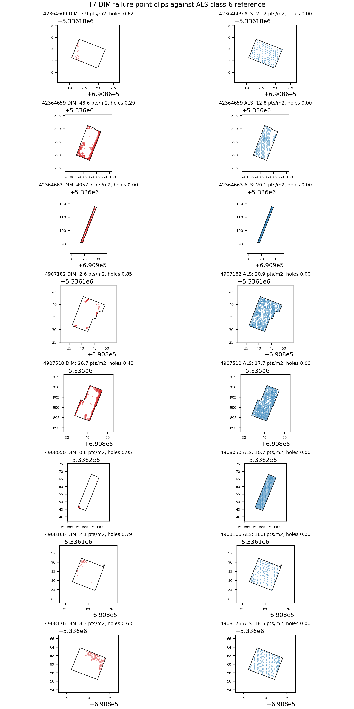
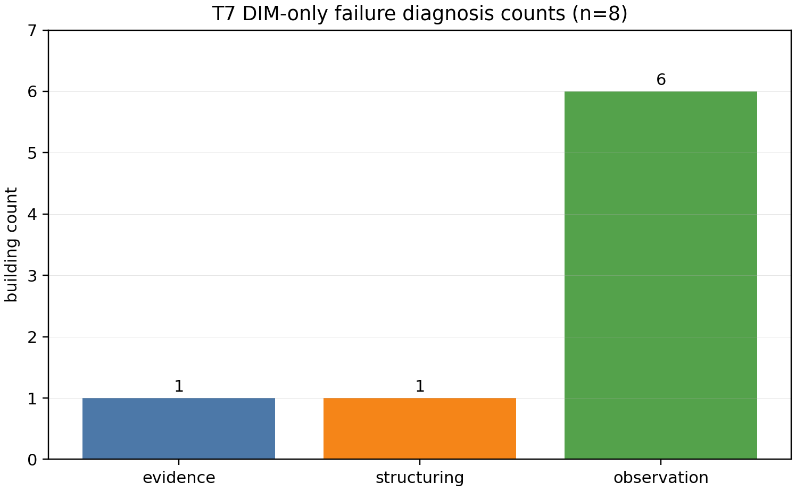

# W3 Failure Diagnosis (T7)

- Run ID: t7_failure_diagnosis_20260615_134149
- Run directory: runs/t7_failure_diagnosis_20260615_134149
- Canonical input: `w3_2b_roofer_repeatability_20260612_220747/run_2`
- Building metrics CSV: `docs/W3_failure_diagnosis_building_metrics.csv`
- Control summary CSV: `docs/W3_failure_diagnosis_control_summary.csv`
- Threshold CSV: `docs/W3_failure_diagnosis_thresholds.csv`
- Metrics JSON: `data/work/diagnose/t7_failure_diagnosis_metrics.json`
- CRS: EPSG:25832 numeric UTM32 for footprints, ALS/DIM LAZ, and camera centers after T2 OPF scene-reference transform.
- Scope: automatic classification/observation only. P0 acceptance/rejection remains a human G1/E5 decision.

## Failure Building Classification

| building_id | dim_density_pts_m2 | dim_hole_ratio | dim_plane_rmse_m | view_count | median_incidence_deg | classification | surface_forming_recoverable |
| --- | --- | --- | --- | --- | --- | --- | --- |
| DEBY_LOD2_42364609 | 3.892 | 0.625 | 0.070 | 290 | 57.70 | 관측부족 | no |
| DEBY_LOD2_42364659 | 48.576 | 0.288 | 0.830 | 222 | 67.38 | 관측부족 | no |
| DEBY_LOD2_42364663 | 4057.681 | 0.000 | 1.483 | 394 | 59.79 | 구조화부족 | no |
| DEBY_LOD2_4907182 | 2.558 | 0.845 | 0.308 | 290 | 32.21 | 관측부족 | no |
| DEBY_LOD2_4907510 | 26.725 | 0.433 | 0.739 | 260 | 58.99 | 증거부족 | yes |
| DEBY_LOD2_4908050 | 0.585 | 0.955 | 0.059 | 272 | 60.36 | 관측부족 | no |
| DEBY_LOD2_4908166 | 2.063 | 0.793 | 0.066 | 281 | 61.97 | 관측부족 | no |
| DEBY_LOD2_4908176 | 8.310 | 0.629 | 0.024 | 312 | 57.61 | 관측부족 | no |

## Control Summary

| metric | n | median | p10 | p25 | p75 | p90 |
| --- | --- | --- | --- | --- | --- | --- |
| DIM density pts/m2 | 71 | 341.331 | 70.518 | 145.479 | 635.620 | 835.887 |
| DIM hole ratio | 71 | 0.000 | 0.000 | 0.000 | 0.006 | 0.092 |
| DIM plane RMSE m | 71 | 0.652 | 0.059 | 0.355 | 1.087 | 2.083 |
| ALS density pts/m2 | 71 | 19.295 | 12.845 | 17.252 | 20.094 | 21.685 |
| ALS hole ratio | 71 | 0.000 | 0.000 | 0.000 | 0.000 | 0.000 |
| ALS plane RMSE m | 71 | 0.663 | 0.057 | 0.240 | 1.077 | 1.604 |
| View count | 71 | 289.000 | 183.000 | 228.500 | 376.000 | 395.000 |
| Median incidence deg | 71 | 60.644 | 56.096 | 57.691 | 63.380 | 68.075 |
| Occlusion-risk view fraction | 71 | 0.045 | 0.000 | 0.000 | 0.286 | 0.549 |

## Adopted Thresholds

| threshold | value | source | interpretation |
| --- | --- | --- | --- |
| density_min_pts_m2 | 70.518 | control_success_71 DIM density p10 | DIM building points are sufficient when value is >= threshold |
| hole_ratio_max | 0.092 | control_success_71 DIM hole ratio p90 | DIM footprint holes are small when value is <= threshold |
| plane_rmse_max_m | 2.083 | control_success_71 DIM plane RMSE p90 | DIM roof plane residual is control-like when value is <= threshold |
| view_count_min | 183.000 | control_success_71 view count p10 | T2 pose visibility is sufficient when value is >= threshold |
| incidence_max_deg | 68.075 | min(control_success_71 incidence p90, 75 deg grazing cap) | View angle is not grazing when value is <= threshold |
| occlusion_risk_max_fraction | 0.500 | fixed approximate occlusion-risk cap | Approximate occlusion risk is acceptable when value is <= threshold |

## Figures

## Observations

- Surface-formation recovery candidates: 1 / 8. Observation-limited cases: 6 / 8.
- Classification counts: 증거부족 1, 구조화부족 1, 관측부족 6.
- `surface_forming_recoverable=yes` means the case has sufficient projected views but DIM class-6 density/hole/residual evidence falls below the control-success threshold.
- `구조화부족` means DIM class-6 surface indicators are already control-like, so the observed failure is not attributed to image-based surface formation in this T7 table.
- `관측부족` means T2 pose visibility, grazing angle, or approximate footprint occlusion is below the adopted control-success threshold.
- Occlusion is a footprint/ALS-height line-of-sight approximation, not an image-depth proof.
- E5 confirmation is still required before using these T7 categories as a method-level conclusion.
