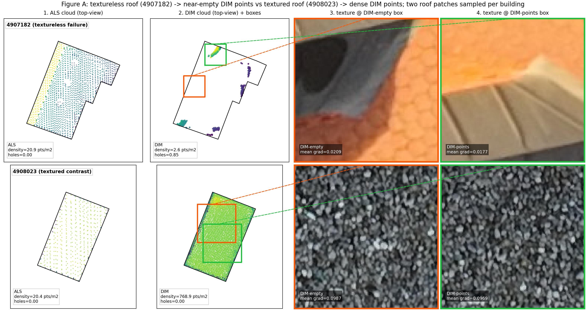
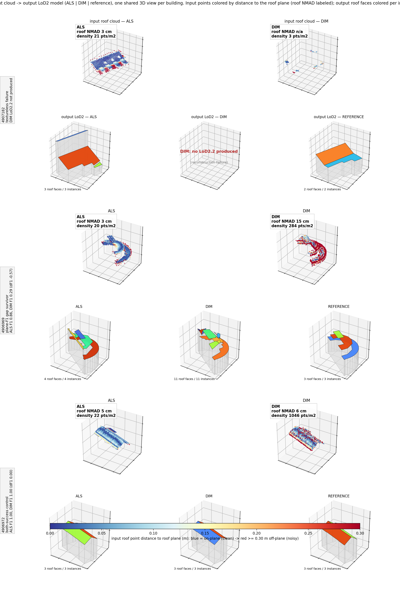

# W3 — Qualitative Comparison: texture->points and points->model (T14)

- Run ID: `t14_qualitative_figures_v2`
- Task: T14 — two qualitative figures from one run (visualization only, no judgement).
- Canonical models: `runs/w3_2b_roofer_repeatability_20260612_220747/cityjson/run_2/als_default.city.json`, `runs/w3_2b_roofer_repeatability_20260612_220747/cityjson/run_2/dim_default.city.json` (LoD2.2 Solid, run_2).
- Reference LoD2: `data/raw/lod2/690_5334.gml`, `690_5336.gml` (CityGML 1.0).
- Inputs: T3 ALS/DIM LAZ, T5 footprint GPKG, T2 images + COLMAP poses.
- CRS: EPSG:25832 (numeric UTM32) for clouds, footprints, CityJSON/CityGML, and
  camera centers after the T2 OPF scene-reference transform.
- Toolchain (rule 8): rendered inside the P0 `tools` docker service with host user
  mapping; versions in `runs/t14_qualitative_figures_v2/versions.txt`. **Visual/qualitative only.**

## Figure A — textureless roof -> empty DIM points

For 4907182 (textureless failure) two same-size roof patches are sampled -- one
over a DIM-empty area, one over a DIM-points area -- each projected to a near-nadir
image (no footprint overlay on the photo) and tied by colored boxes to the DIM
top-view. A second row adds 4908023 (textured, DIM full) as contrast.

| building | DIM-empty box mean-grad | DIM-points box mean-grad | DIM pts in points-box |
| --- | --- | --- | --- |
| 4907182 | 0.0209 | 0.0177 | 100 |
| 4908023 | 0.0987 | 0.0969 | 6395 |

- The 4907182 roof is **uniformly low-texture**: both sampled patches have mean
  image-gradient ~0.018-0.021 (DIM-empty 0.0209, DIM-points 0.0177), near the
  T9 textureless reference (~0.021), and DIM is near-empty across the whole footprint
  (243 points). The DIM-points patch is **not** more textured than the DIM-empty one
  -- within this building, sparse DIM point presence does not track a local texture
  difference; the roof is textureless globally.
- 4908023 (textured contrast): both patches are ~5x more textured (mean gradient
  0.0987 / 0.0969) and DIM is dense everywhere (16849 points).
- The texture->points signal is therefore the **cross-building** contrast
  (textureless 4907182 -> near-empty DIM vs textured 4908023 -> dense DIM), not a
  within-4907182 gradient -- the failure building is uniformly textureless. Texture
  proxy = mean image-gradient magnitude over the patch crop (grayscale [0,1]); a
  coarse indicator, not a calibrated metric.

## Figure B — input point cloud -> output LoD2 model

Every panel of a building shares ONE 3D viewpoint and cubic box, so input and
output are directly comparable: the input row shows the roof point cloud (ALS |
DIM) in the same frame as the output LoD2 models (ALS | DIM | reference). Input
roof points are colored by perpendicular distance to the reference roof plane they
sit under -- blue = on-plane (clean), red >= 0.30 m off-plane (noisy) -- so
roughness reads from color at the building scale (a shared colorbar gives the
metres); the robust roof NMAD (1.4826*MAD, tail-resistant, as in the W3 height
NMAD) is labeled per panel. Output roof faces are colored per instance. The
noisy-input / fragmented-output pair is shown side by side; the causal reading is
left to the viewer (no arrow). `dens(fp)` is whole-footprint point density.

| building | role | ALS dens(fp) | DIM dens(fp) | ALS roof NMAD(cm) | DIM roof NMAD(cm) | ALS faces | DIM faces | ref faces | plane-F1 |
| --- | --- | --- | --- | --- | --- | --- | --- | --- | --- |
| 4907182 | textureless failure | 21 | 3 | 3 | n/a | 3 | — | 2 | DIM LoD2.2 not produced |
| 4906969 | plane-F1 gap survivor | 20 | 284 | 3 | 15 | 4 | 11 | 3 | ALS F1 0.86, DIM F1 0.29 (dF1 -0.57) |
| 4906972 | both-success control | 22 | 1046 | 5 | 6 | 3 | 3 | 3 | ALS F1 1.00, DIM F1 1.00 (dF1 0.00) |

- **4907182**: near-empty DIM roof cloud (DIM 3 vs ALS 21 pts/m2)
  -> no DIM LoD2.2 model; ALS and reference reconstruct a closed shell.
- **4906969**: the DIM roof points scatter thickly about the plane (roof NMAD
  15 cm, mostly red) while ALS hugs it (NMAD 3 cm, blue);
  alongside, the DIM output is segmented into 11 roof faces vs ALS
  4 (reference 3).
- **4906972**: the two roof clouds have similar roughness (ALS NMAD 5 cm,
  DIM NMAD 6 cm) and ALS, DIM, reference agree on the roof partition
  (3/3/3) -- comparable input gives clean output on both.

## Notes / limitations

- Per-instance roof colors visualize segmentation granularity; not a matched
  correspondence between ALS, DIM, and reference.
- Two/three illustrative buildings only; population statistics are in W3-2c.
- Reference LoD2 (CityGML 1.0) is shown for visual context, not a read-out input.
- Visuals/counts only; no GO/NO-GO judgement is made.

## Files

- Figure A: `docs/figs/w3_t14_figA_texture_to_points.png`
- Figure B: `docs/figs/w3_t14_figB_input_to_output.png`
- Report: `docs/W3_qualitative_compare.md`
