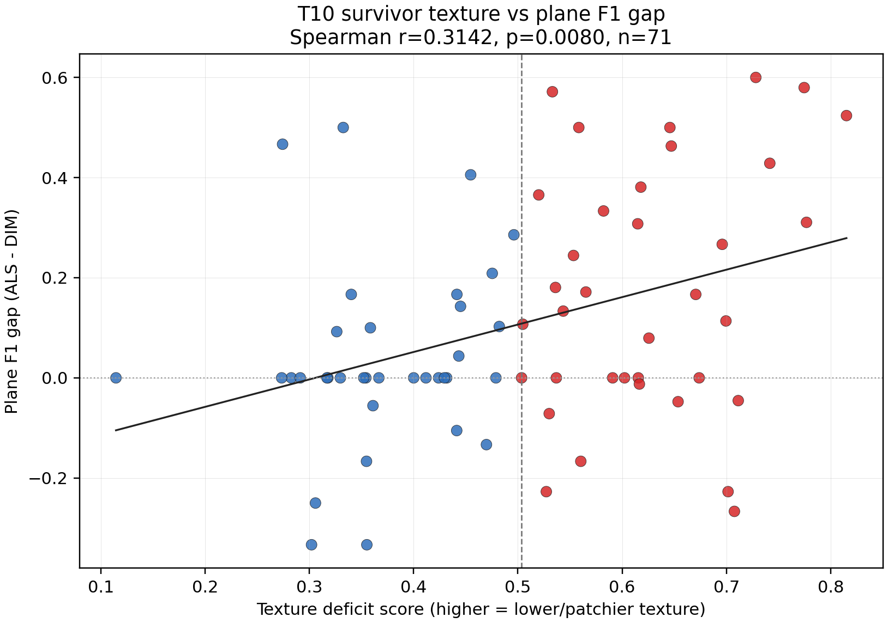

# W3 Survivor Texture Gap (T10)

- Run ID: t10_survivor_texture_gap_20260615_204851
- Run directory: runs/t10_survivor_texture_gap_20260615_204851
- Canonical input: `w3_2b_roofer_repeatability_20260612_220747/run_2`
- Building metrics CSV: `docs/W3_survivor_texture_gap_building_metrics.csv`
- Correlation CSV: `docs/W3_survivor_texture_gap_correlations.csv`
- Strata CSV: `docs/W3_survivor_texture_gap_strata.csv`
- Metrics JSON: `data/work/diagnose/t10_survivor_texture_gap_metrics.json`
- Inputs: T7 survivor 71 IDs, canonical W3 paired quality metrics, DIM LAZ, T5 footprint GPKG, and original UAV images.
- CRS: EPSG:25832 numeric UTM32 for footprints, DIM LAZ, and camera centers after T2 scene-reference transform.
- Scope: correlation/stratified observation only. P0 acceptance/rejection remains outside this T10 output.

## Observation

- 텍스처 결손 점수 vs ALS-DIM ΔF1 Spearman r=0.314, p=0.0080; 저텍스처 strata ΔF1 중앙값 0.150, 고텍스처 0.000 -> 통합 메커니즘 지지 관찰(판정 아님, E5 확증 필요).

## Correlations

| predictor | target | n | spearman_r | p_value | predictor_note |
| --- | --- | --- | --- | --- | --- |
| texture_deficit_score | dim_plane_f1 | 71 | -0.3733 | 0.0017 | higher means lower/patchier DIM or image texture |
| texture_deficit_score | delta_plane_f1_als_minus_dim | 71 | 0.3142 | 0.0080 | higher means lower/patchier DIM or image texture |
| texture_deficit_score | dim_internal_boundary_hausdorff_m | 35 | 0.3039 | 0.0781 | higher means lower/patchier DIM or image texture |
| dim_hole_ratio | dim_plane_f1 | 71 | -0.2854 | 0.0178 | higher means more empty footprint grid cells |
| dim_hole_ratio | delta_plane_f1_als_minus_dim | 71 | 0.2789 | 0.0190 | higher means more empty footprint grid cells |
| dim_hole_ratio | dim_internal_boundary_hausdorff_m | 35 | 0.1257 | 0.4613 | higher means more empty footprint grid cells |
| dim_density_cv | dim_plane_f1 | 71 | -0.3134 | 0.0076 | higher means more uneven local DIM point density |
| dim_density_cv | delta_plane_f1_als_minus_dim | 71 | 0.1416 | 0.2366 | higher means more uneven local DIM point density |
| dim_density_cv | dim_internal_boundary_hausdorff_m | 35 | 0.0955 | 0.5862 | higher means more uneven local DIM point density |
| dim_plane_rmse_m | dim_plane_f1 | 71 | -0.3070 | 0.0088 | higher means rougher DIM roof plane fit |
| dim_plane_rmse_m | delta_plane_f1_als_minus_dim | 71 | 0.2515 | 0.0317 | higher means rougher DIM roof plane fit |
| dim_plane_rmse_m | dim_internal_boundary_hausdorff_m | 35 | 0.1591 | 0.3586 | higher means rougher DIM roof plane fit |
| image_texture_gradient_median | dim_plane_f1 | 70 | -0.1622 | 0.1858 | higher means more image roof texture |
| image_texture_gradient_median | delta_plane_f1_als_minus_dim | 70 | 0.0362 | 0.7661 | higher means more image roof texture |
| image_texture_gradient_median | dim_internal_boundary_hausdorff_m | 35 | -0.0555 | 0.7452 | higher means more image roof texture |

## Texture Strata

| stratum | n | texture_deficit_cutoff | texture_deficit_median | delta_plane_f1_median | delta_plane_f1_p25 | delta_plane_f1_p75 | dim_plane_f1_median | dim_internal_hausdorff_median_m |
| --- | --- | --- | --- | --- | --- | --- | --- | --- |
| low_texture_high_deficit | 36 | 0.5036 | 0.6160 | 0.1500 | 0.0000 | 0.3693 | 0.5000 | 1.9205 |
| high_texture_low_deficit | 35 | 0.5036 | 0.3585 | 0.0000 | 0.0000 | 0.1013 | 0.6667 | 1.6153 |

## Figure

## Notes

- Texture deficit score averages rank-normalized DIM hole ratio, DIM local density CV, DIM plane RMSE, inverse DIM density, and inverse near-nadir image gradient.
- Spearman p-values use a deterministic 9999-permutation two-sided test with seed 20260615.
- Internal Hausdorff correlations use only survivor buildings with measurable DIM internal boundaries.
- This table tests whether survivor degradation follows the same texture mechanism as the T9 failure extreme; it is not a method-level conclusion.
