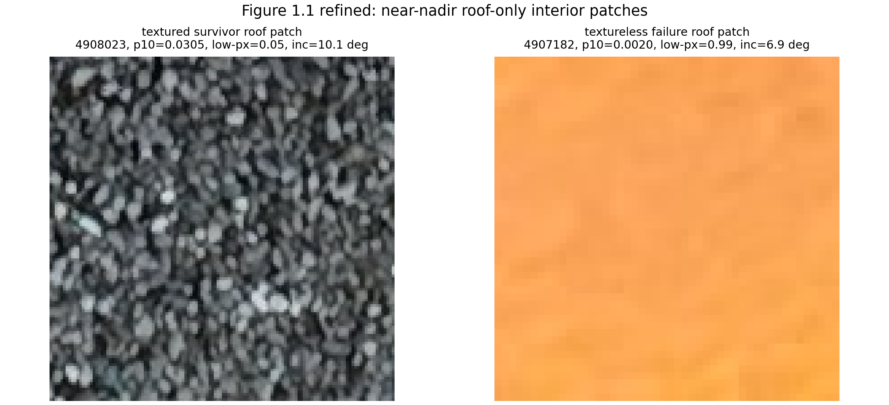
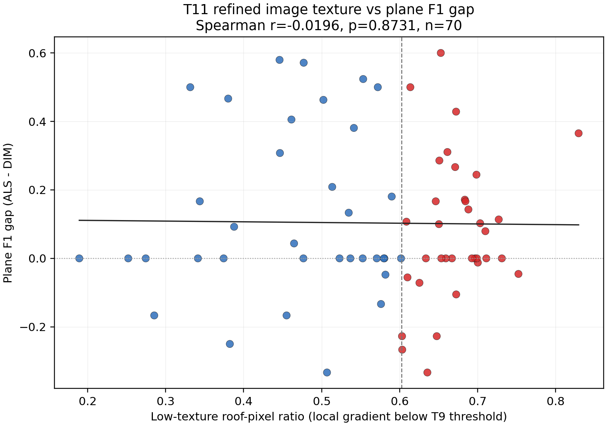

# W3 Survivor Texture Refine (T11)

- Run ID: t11_survivor_texture_refine_20260615_213358
- Run directory: runs/t11_survivor_texture_refine_20260615_213358
- Canonical input: `w3_2b_roofer_repeatability_20260612_220747/run_2`
- Building metrics CSV: `docs/W3_survivor_texture_refine_building_metrics.csv`
- Correlation CSV: `docs/W3_survivor_texture_refine_correlations.csv`
- Strata CSV: `docs/W3_survivor_texture_refine_strata.csv`
- Threshold CSV: `docs/W3_survivor_texture_refine_thresholds.csv`
- Metrics JSON: `data/work/diagnose/t11_survivor_texture_refine_metrics.json`
- Inputs: T7 survivor 71 IDs, canonical W3 paired quality metrics, T9 thresholds/failure class, original UAV images, T2 COLMAP poses, T5 footprint GPKG, and T3 DIM LAZ.
- CRS: EPSG:25832 numeric UTM32 for footprints, DIM LAZ, and camera centers after T2 scene-reference transform.
- Scope: direct image-texture correlation/stratified observation only. P0 acceptance/rejection remains outside this T11 output.

## Observation

- 날카로운 텍스처 지표로 survivor ΔF1 상관 r=-0.020, p=0.8731; 저텍스처 strata ΔF1 중앙값 0.000, 고텍스처 0.000 -> 통합 메커니즘 불지지/약함 관찰(판정 아님, E5 확증 필요).

## Refined Correlations

| predictor | target | n | spearman_r | p_value | predictor_note |
| --- | --- | --- | --- | --- | --- |
| sharp_low_texture_pixel_ratio | dim_plane_f1 | 70 | 0.0920 | 0.4452 | higher means more roof pixels below the T9 low-gradient threshold |
| sharp_low_texture_pixel_ratio | delta_plane_f1_als_minus_dim | 70 | -0.0196 | 0.8731 | higher means more roof pixels below the T9 low-gradient threshold |
| sharp_low_texture_pixel_ratio | dim_internal_boundary_hausdorff_m | 35 | -0.0420 | 0.8093 | higher means more roof pixels below the T9 low-gradient threshold |
| sharp_gradient_p10 | dim_plane_f1 | 70 | -0.0966 | 0.4311 | higher means stronger worst-decile near-nadir roof texture |
| sharp_gradient_p10 | delta_plane_f1_als_minus_dim | 70 | 0.0184 | 0.8762 | higher means stronger worst-decile near-nadir roof texture |
| sharp_gradient_p10 | dim_internal_boundary_hausdorff_m | 35 | 0.0794 | 0.6453 | higher means stronger worst-decile near-nadir roof texture |
| sharp_gradient_median | dim_plane_f1 | 70 | -0.0786 | 0.5101 | higher means stronger median near-nadir roof texture |
| sharp_gradient_median | delta_plane_f1_als_minus_dim | 70 | 0.0204 | 0.8639 | higher means stronger median near-nadir roof texture |
| sharp_gradient_median | dim_internal_boundary_hausdorff_m | 35 | 0.0742 | 0.6731 | higher means stronger median near-nadir roof texture |

## Texture Strata

| stratum | n | low_texture_pixel_ratio_cutoff | low_texture_pixel_ratio_median | sharp_gradient_p10_median | delta_plane_f1_median | delta_plane_f1_p25 | delta_plane_f1_p75 | dim_plane_f1_median | dim_internal_hausdorff_median_m |
| --- | --- | --- | --- | --- | --- | --- | --- | --- | --- |
| low_texture_high_lowgrad_share | 35 | 0.6024 | 0.6711 | 0.00392 | 0.0000 | -0.0062 | 0.1690 | 0.5714 | 1.8245 |
| high_texture_low_lowgrad_share | 35 | 0.6024 | 0.4770 | 0.00555 | 0.0000 | 0.0000 | 0.3443 | 0.5000 | 1.6153 |

## Adopted Thresholds

| threshold | value | source | interpretation |
| --- | --- | --- | --- |
| near_nadir_incidence_max_deg | 20.000 | fixed T9 definition | view is near-nadir when incidence angle is <= threshold |
| local_gradient_low_threshold | 0.02137 | docs/W3_failure_surface_cause_thresholds.csv texture_gradient_low_max | roof pixel is low-texture when local grayscale gradient is below this value |
| max_survivor_near_nadir_views | 8 | T10/T11 fixed sampling cap | nearest-nadir survivor views used for per-building image texture |
| figure_textureless_failure_id | DEBY_LOD2_4907182 | T9 threshold-confirmed texture failure | failure crop used for regenerated Figure 1.1 |

## Figure 1.1 Crop Selection

| panel | building_id | image_name | gradient_p10 | low_texture_pixel_ratio | incidence_deg | mask_pixel_count | patch_size_px |
| --- | --- | --- | --- | --- | --- | --- | --- |
| textured_survivor | DEBY_LOD2_4908023 | DJI_20241217103013_0032_D.JPG | 0.03054 | 0.0523 | 10.08 | 16384 | 128 |
| textureless_failure | DEBY_LOD2_4907182 | DJI_20241217084841_0184_D.JPG | 0.00196 | 0.9887 | 6.92 | 2304 | 48 |

## Scatter

## Notes

- `sharp_low_texture_pixel_ratio` is the footprint-mask roof-pixel fraction whose local grayscale gradient is below the T9 control-success low-gradient threshold.
- `sharp_gradient_p10` is computed from all selected near-nadir roof-mask pixels per building, not from view-level medians.
- Spearman p-values use a deterministic 9999-permutation two-sided test with seed 20260615.
- Internal Hausdorff correlations use only survivor buildings with measurable DIM internal boundaries.
- Figure 1.1 selects high-coverage interior patches from the projected footprint roof polygon, so the displayed crops exclude visible walls/windows outside the footprint.
- This T11 output tests whether survivor degradation follows the same texture mechanism as the T9 failure extreme; it is not a method-level conclusion.
