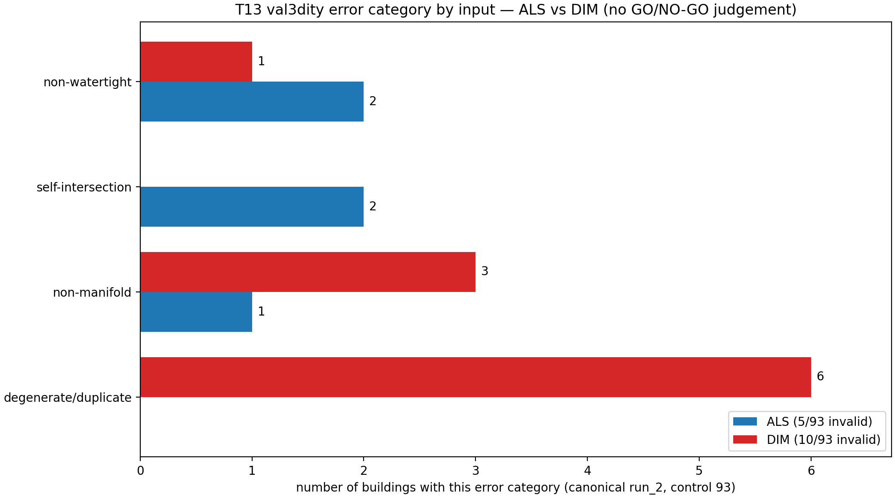

# W3 — val3dity Validity-Error Breakdown (T13)

- Run ID: `t13_validity_error_breakdown_20260616_214359`
- Task: T13 — parse the canonical `run_2` val3dity reports and aggregate the
  93-building validity errors by input and by geometric error category.
- Canonical val3dity reports: `runs/w3_2b_roofer_repeatability_20260612_220747/val3dity/run_2/als_default.json`, `runs/w3_2b_roofer_repeatability_20260612_220747/val3dity/run_2/dim_default.json` (val3dity 2.6.0).
- Paired status: `docs/W3_2c_canonical_paired_status.csv` (`coverage_control_population == yes` = 93 buildings).
- CRS: EPSG:25832 (numeric UTM32); inherited from the canonical CityJSON inputs.
  This task parses validity reports only and produces no new spatial product.
- val3dity parameters: overlap_tol=-1.0, planarity_d2p_tol=0.01, planarity_n_tol=20.0, snap_tol=0.001.
- Toolchain (rule 8): parsing/plotting executed inside the P0 `tools` docker service via `env/docker-compose.p0.yml`; tool versions recorded in `runs/t13_validity_error_breakdown_20260616_214359/versions.txt`. No geometry tool was re-run — the val3dity reports are pre-existing run_2 outputs.
- **Aggregation/observation only — no GO/NO-GO judgement.**

## 0. Scope

| input | features (Building) | valid | invalid | val3dity codes present |
| --- | --- | --- | --- | --- |
| ALS | 93 | 88 | 5 | 104, 302, 303, 306 |
| DIM | 93 | 83 | 10 | 102, 302, 303 |

Building-level validity rate: ALS 88/93 (94.6%), DIM 83/93 (89.2%); drop = 5.4 pp (matches W3-2c `validity_rate_drop_pp`).

## 1. Error type × input aggregation ①

Building counts (a building is counted once per category it exhibits) and raw
val3dity error-instance counts.

| error category | val3dity codes | ALS buildings | DIM buildings | ALS err-inst | DIM err-inst |
| --- | --- | --- | --- | --- | --- |
| 비폐합 (non-watertight) | 302 | 2 | 1 | 3 | 1 |
| 자기교차 (self-intersection) | 104, 306 | 2 | 0 | 8 | 0 |
| 비다양체 (non-manifold) | 303 | 1 | 3 | 6 | 9 |
| 중복·퇴화 면 (degenerate/duplicate) | 102 | 0 | 6 | 0 | 12 |
| **total invalid buildings** |  | **5** | **10** | 17 | 22 |

## 2. Per-building error codes (union of validity failures) ①

| building | invalid in | ALS error codes | DIM error codes |
| --- | --- | --- | --- |
| 108580335 | DIM_only_invalid | — | 102×2 CONSECUTIVE_POINTS_SAME |
| 4906965 | ALS_only_invalid | 303×6 NON_MANIFOLD_CASE | — |
| 4906967 | both_invalid | 104×1 RING_SELF_INTERSECTION | 303×3 NON_MANIFOLD_CASE |
| 4906975 | both_invalid | 306×7 SHELL_SELF_INTERSECTION | 303×3 NON_MANIFOLD_CASE |
| 4906985 | DIM_only_invalid | — | 102×2 CONSECUTIVE_POINTS_SAME |
| 4907025 | DIM_only_invalid | — | 303×3 NON_MANIFOLD_CASE |
| 4907184 | ALS_only_invalid | 302×1 SHELL_NOT_CLOSED | — |
| 4907520 | DIM_only_invalid | — | 102×2 CONSECUTIVE_POINTS_SAME |
| 4907521 | DIM_only_invalid | — | 102×2 CONSECUTIVE_POINTS_SAME |
| 4908354 | DIM_only_invalid | — | 302×1 SHELL_NOT_CLOSED |
| 4959326 | DIM_only_invalid | — | 102×2 CONSECUTIVE_POINTS_SAME |
| 4959753 | ALS_only_invalid | 302×2 SHELL_NOT_CLOSED | — |
| 60042 | DIM_only_invalid | — | 102×2 CONSECUTIVE_POINTS_SAME |

## 3. Representative cases ②

| case | building | detail |
| --- | --- | --- |
| DIM dominant type | 108580335 | code 102 CONSECUTIVE_POINTS_SAME on 6 DIM-only buildings (108580335, 4906985, 4907520, 4907521, 4959326, 60042) |
| both inputs invalid, different error | 4906967 | ALS 104×1 RING_SELF_INTERSECTION vs DIM 303×3 NON_MANIFOLD_CASE |
| both inputs invalid, different error | 4906975 | ALS 306×7 SHELL_SELF_INTERSECTION vs DIM 303×3 NON_MANIFOLD_CASE |
| ALS most error instances | 4906975 | 306×7 SHELL_SELF_INTERSECTION (7 instances) |

## 4. Quality-pair exclusion attribution ③

The clean quality comparison uses the 71 `both_success` survivor buildings.
Validity failures are attributed by input below; the union of distinct
validity-failing buildings equals the W3-2c `validity` priority bucket (13).

| group | n | buildings (id suffix) |
| --- | --- | --- |
| ALS invalid (total) | 5 | 4906965, 4906967, 4906975, 4907184, 4959753 |
| DIM invalid (total) | 10 | 108580335, 4906967, 4906975, 4906985, 4907025, 4907520, 4907521, 4908354, 4959326, 60042 |
| ALS-only invalid | 3 | 4906965, 4907184, 4959753 |
| DIM-only invalid | 8 | 108580335, 4906985, 4907025, 4907520, 4907521, 4908354, 4959326, 60042 |
| invalid in both inputs | 2 | 4906967, 4906975 |
| **union of validity failures** | **13** | 108580335, 4906965, 4906967, 4906975, 4906985, 4907025, 4907184, 4907520, 4907521, 4908354, 4959326, 4959753, 60042 |
| validity failures inside quality-71 | 0 | — |

- DIM invalid 10 = 8 DIM-only + 2 both.
- ALS invalid 5 = 3 ALS-only + 2 both.
- All 13 validity-failing buildings fall **outside** the quality-71 survivor set
  (0 inside) — the 71 paired survivors are val3dity-valid in both inputs.

## 5. Observation

- DIM 무효 주 유형은 **중복·퇴화 면 (degenerate/duplicate)** (6/10 buildings, codes 102);
  these are zero-length-edge / degenerate-ring failures consistent with noisy dense image-derived points.
- ALS는 단일 우세 유형이 없이 분산: 비폐합 2, 자기교차 2, 비다양체 1 (buildings).
- 두 입력이 같은 건물(4906967, 4906975)에서 모두 무효이나 **오류 코드는 서로 다르다**
  (ALS=self-intersection, DIM=non-manifold) — 같은 footprint에서도 입력별로 실패 기하가 갈린다.
- 절대 수가 작다(ALS 5 / DIM 10 / union 13); 단일 장면·단일 footprint 집합 한정.

## 6. Limitations

- Single canonical run (`w3_2b_roofer_repeatability_20260612_220747/run_2`); W3-2b repeatability is ±0.5 pp by half-range.
- val3dity feature-level (Building) validity is reported here; primitive-level (Solid)
  counts differ (ALS Solid 87/92 valid, DIM Solid 91/101 valid).
- Categories are an analyst grouping of val3dity codes; the code+description in the
  per-building table is the ground truth.
- Counts only; recovery/severity is not assessed and no GO/NO-GO judgement is made.

## Files

- Report: `docs/W3_validity_error_breakdown.md`
- Per-building errors: `docs/W3_validity_error_breakdown_building_errors.csv`
- Error type × input: `docs/W3_validity_error_breakdown_type_by_input.csv`
- Quality-pair attribution: `docs/W3_validity_error_breakdown_quality_attribution.csv`
- Figure: `docs/figs/w3_t13_validity_error_breakdown.png`
