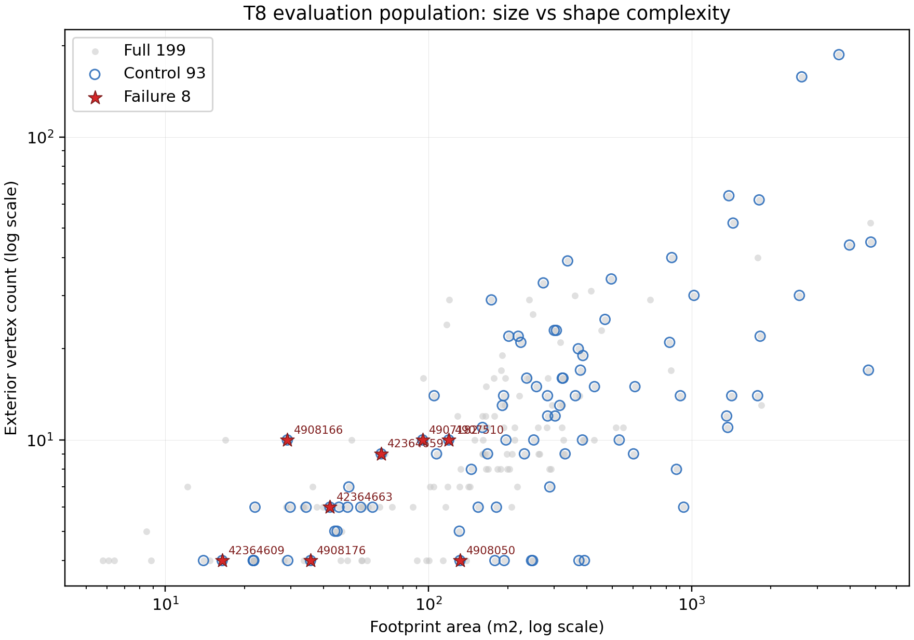

# W4b Population Profile (T8)

- Run ID: t8_population_profile_20260615_143004
- Run directory: runs/t8_population_profile_20260615_143004
- Canonical input: `w3_2b_roofer_repeatability_20260612_220747/run_2`
- Building metrics CSV: `docs/W4b_population_profile_building_metrics.csv`
- Population summary CSV: `docs/W4b_population_profile_summary.csv`
- Metrics JSON: `data/work/diagnose/t8_population_profile_metrics.json`
- Inputs: T5 footprint GPKG, LoD2 reference CityGML, canonical paired-status CSV.
- CRS: EPSG:25832 was checked from the T5 GPKG CRS tag and numeric UTM32 coordinate bounds.
- Scope: distribution/profile observation only. P0 acceptance/rejection remains outside this T8 output.

## Population Summary

| population | n | area_m2_median_iqr | perimeter_m_median_iqr | complexity_vertices_median_iqr | height_m_median_iqr |
| --- | --- | --- | --- | --- | --- |
| full_199 | 199 | 190.789 [67.160-324.883] | 58.568 [40.114-82.403] | 9.000 [6.000-15.000] | 17.760 [5.252-21.786] |
| control_93 | 93 | 251.199 [105.059-495.180] | 67.641 [50.839-102.217] | 10.000 [6.000-19.000] | 18.164 [7.134-22.610] |
| failure_8 | 8 | 54.159 [33.987-101.094] | 39.392 [23.611-51.598] | 7.500 [4.000-10.000] | 2.914 [2.751-4.109] |

Median/IQR cells are formatted as `median [p25-p75]`.

## Failure 8 Building Metrics

| building_id | area_m2 | perimeter_m | exterior_vertices | height_m | dim_failure_bucket_v1 |
| --- | --- | --- | --- | --- | --- |
| DEBY_LOD2_42364609 | 16.45 | 16.45 | 4 | 2.76 | roof_matching_assembly_failure |
| DEBY_LOD2_42364659 | 66.10 | 35.34 | 9 | 2.73 | roof_matching_assembly_failure |
| DEBY_LOD2_42364663 | 42.22 | 60.31 | 6 | 19.65 | roof_matching_assembly_failure |
| DEBY_LOD2_4907182 | 95.00 | 43.44 | 10 | 7.13 | roof_matching_assembly_failure |
| DEBY_LOD2_4907510 | 119.36 | 49.27 | 10 | 3.10 | roof_matching_assembly_failure |
| DEBY_LOD2_4908050 | 131.67 | 58.57 | 4 | 2.86 | roof_matching_assembly_failure |
| DEBY_LOD2_4908166 | 29.09 | 22.55 | 10 | 2.63 | roof_matching_assembly_failure |
| DEBY_LOD2_4908176 | 35.62 | 23.96 | 4 | 2.97 | roof_matching_assembly_failure |

## Figure

## Observations

- 통제 93/전체 199 중앙값 비율은 면적 1.32배, 꼭짓점 1.11배, 높이 1.02배로 기록된다.
- 실패 8동은 면적-복잡도 기준 통제 93 IQR 내부가 1/8이고, 중앙값 비율은 면적 0.22배·꼭짓점 0.75배로 면적은 통제 IQR보다 작고 복잡도는 통제 IQR 내부라 소형 건물 쪽 치우침은 있으나 크기-복잡도 동시 군집은 제한적이다.
- Height is measured as LoD2 CityGML per-building z-range; shape complexity is the exterior footprint vertex count.
- These are profile observations only; representativeness or P0 recovery decisions require human G1/E5 interpretation.
