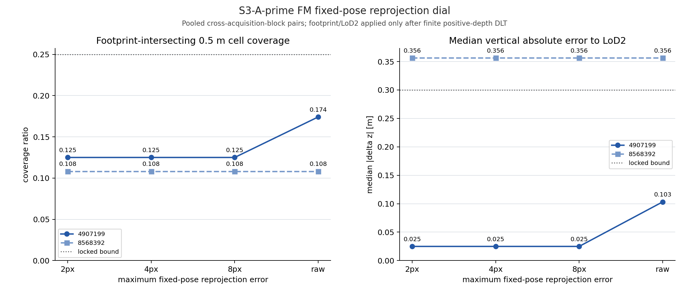
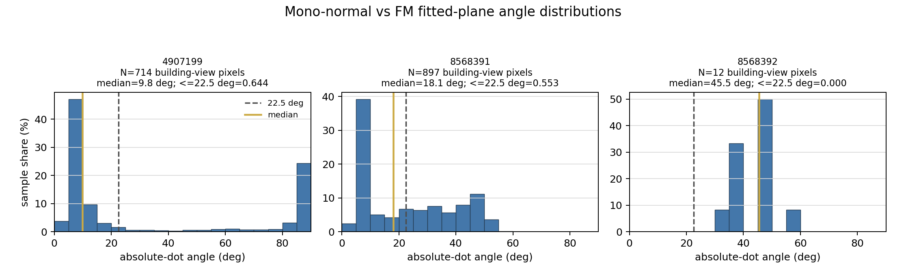
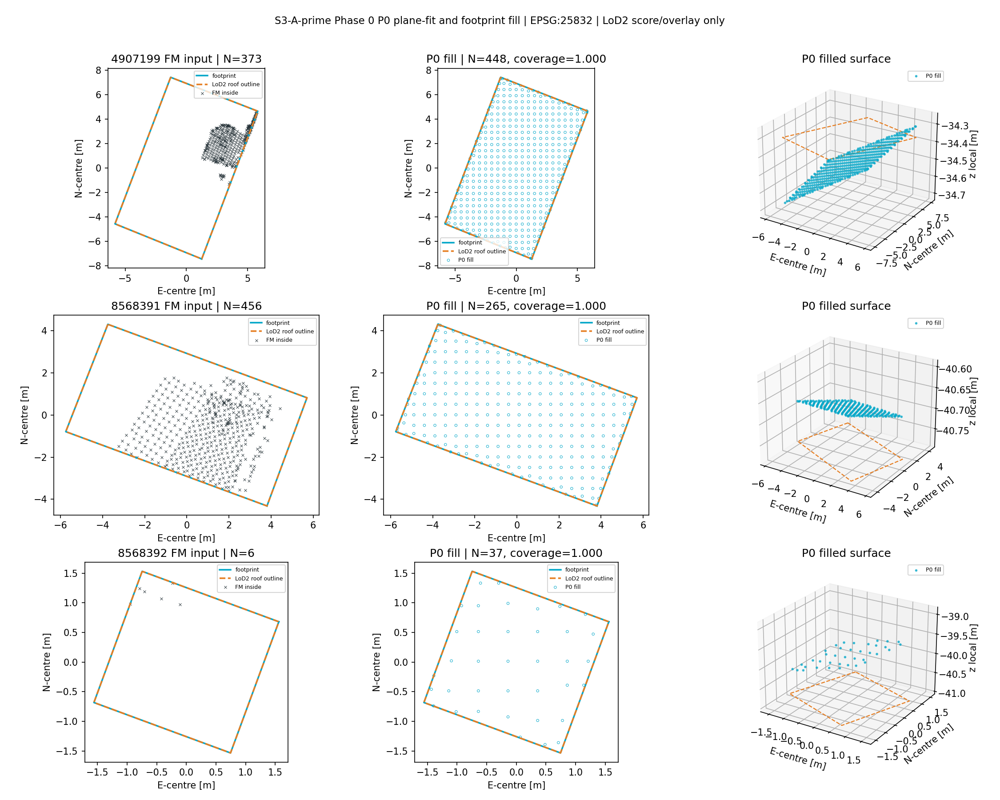
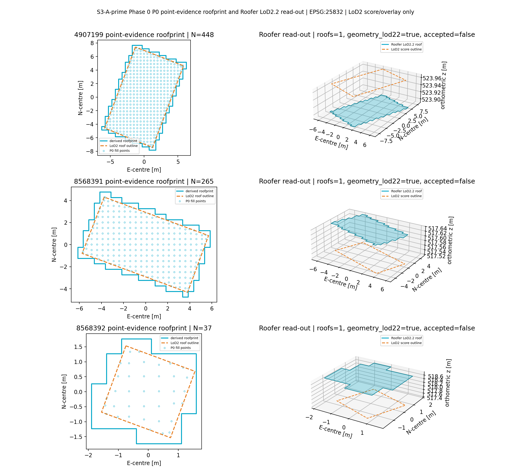
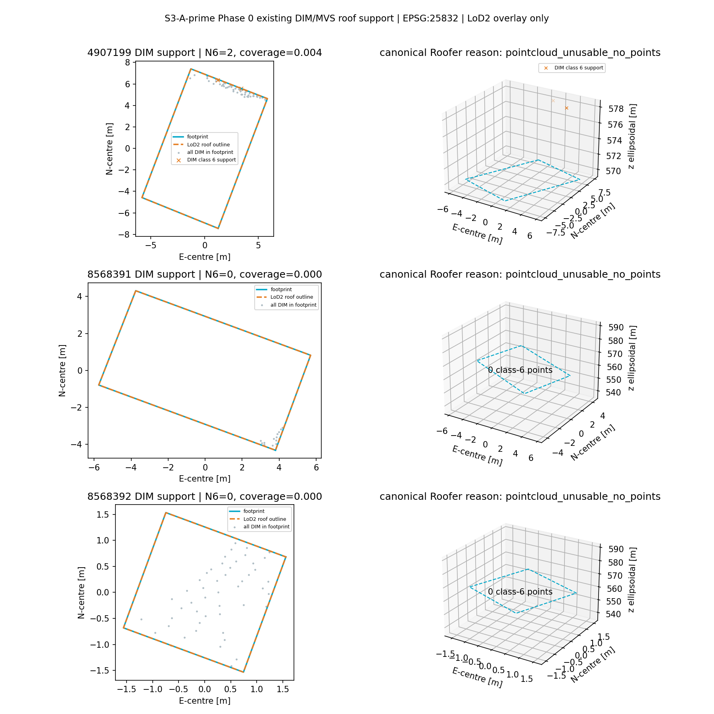

# E5 C001 S3-A′ Phase 0 측정표 — FM 씨앗·mono-normal·P0/MVS (2026-07-15)

> **측정 전용.** 학습 0회. 아래 표는 수치·규칙 기반 분류만 기록하며 승패·채택 판정을 포함하지 않는다. LoD2는 높이·RMS·완전도 채점과 오버레이에만 사용했다. `footprints_aoi`는 발자국 안/밖, 커버리지, P0 연장 마스크에만 사용했다. CRS는 EPSG:25832다.

## 1. FM 씨앗 점 확정

391은 잠긴 2 px 재채점 캐시를 그대로 썼다. 199·392만 잠긴 다이얼 `2 → 4 → 8 px → raw`로 신규 MASt3R 추론했다. 건물값은 교차 취득 블록이며 고정 COLMAP 카메라 중심 기선이 0.06 m보다 큰 쌍의 발자국 안 DLT점을 합친 값이다.

| 건물 | 다이얼 | 발자국 안점 | 0.5 m 커버리지 | LoD2 \|Δz\| 중앙 (m) | 잠금 조건 충족 | 기록 분류 |
|---|---|---:|---:|---:|---|---|
| 8568391 (391) | 고정 2 px | 456 | 0.471698 | 0.115291 | B-a 스윕 대상 아님 | 고정 캐시 |
| 4907199 (199) | 2 px | 373 | 0.125000 | 0.024917 | false | `INSUFFICIENT_INSIDE_POINTS` |
| 4907199 (199) | 4 px | 373 | 0.125000 | 0.024917 | false | `INSUFFICIENT_INSIDE_POINTS` |
| 4907199 (199) | 8 px | 373 | 0.125000 | 0.024917 | false | `INSUFFICIENT_INSIDE_POINTS` |
| 4907199 (199) | raw | 498 | 0.174107 | 0.103233 | false | `INSUFFICIENT_INSIDE_POINTS` |
| 8568392 (392) | 2 px | 6 | 0.108108 | 0.356398 | false | `INSUFFICIENT_INSIDE_POINTS` |
| 8568392 (392) | 4 px | 6 | 0.108108 | 0.356398 | false | `INSUFFICIENT_INSIDE_POINTS` |
| 8568392 (392) | 8 px | 6 | 0.108108 | 0.356398 | false | `INSUFFICIENT_INSIDE_POINTS` |
| 8568392 (392) | raw | 6 | 0.108108 | 0.356398 | false | `INSUFFICIENT_INSIDE_POINTS` |

잠금 조건은 `커버리지 ≥ 0.25 ∧ LoD2 |Δz| 중앙 ≤ 0.30 m`이다. 199·392에서 이를 만족한 B-a 동작점은 0개다. 신규 MASt3R 추론은 13개 뷰쌍, 학습은 0회이며, 2 px 결과는 기존 캐시 13/13과 정확히 재현됐다.

원자료: `e5_c001_s3ap_fm_dense_dial.csv`; 실행 장부: `../phases/p2-gsjso/runs/e5_c001/20260715_e5_c001_s3ap_phase0_fm_dense/manifest.json`.

## 2. Mono-normal 진단

FM 평면 법선은 LoD2·ALS 없이, 발자국 안 DLT 생존점 전부에 deterministic RANSAC을 다시 맞춰 만들었다. 각 점은 원래 뷰쌍의 두 endpoint에만 귀속했고, 건물-뷰 안 정수 픽셀 중복을 제거했다. 22.5°는 기록 축이며 게이트로 쓰지 않았다.

| 건물 | FM 안점 | RANSAC inlier 비율 | endpoint 표본 수 | 각도 중앙 (°) | 각도 MAD (°) | ≤22.5° 비율 |
|---|---:|---:|---:|---:|---:|---:|
| 8568391 (391) | 456 | 0.993421 | 897 | 18.110811 | 11.769224 | 0.552954 |
| 4907199 (199) | 373 | 0.731903 | 714 | 9.805431 | 4.163171 | 0.644258 |
| 8568392 (392) | 6 | 1.000000 | 12 | 45.463270 | 5.323839 | 0.000000 |

모델은 Omnidata `surface_normal_dpt_hybrid_384`, revision `152cf1465313b68cdf5d47bb09568a9357c57086`, weights SHA256 `1af4506385ef4c828af559309ec89428833c005d7ecbcf921c4b12f84c2f62df`다. 428뷰 캐시 중 잠긴 8개 파일을 재사용해 신규 mono-normal 추론은 0회다.

방법 장부: 이 진단의 법선은 sklearn RANSAC(`min_samples=30%`) 평면을 썼고, §3 P0 씨앗면은 자체 3점 RANSAC 뒤 전체 FM z 중앙으로 절편을 재고정했다. 199에서 두 평면 법선 차이는 1.9607°이며, Phase 1 씨앗면 좌표는 §3 P0 평면을 사용한다.

원자료: `mononormal_diag.csv`; 실행 장부: `../phases/p2-gsjso/runs/e5_c001/20260715_e5_c001_s3ap_phase0_mononormal/manifest.json`.

## 3. P0 평면적합+채움 baseline

RANSAC은 기울기 `a,b`만 정하고, 절대 높이 절편은 모든 발자국 안 FM점에 대해 `c = median(z) - median(a·x+b·y)`로 다시 맞췄다. 0.5 m 격자로 footprint를 채운 뒤에만 LoD2를 열어 채점했다.

| 건물 | FM 안점 | inlier 비율 | 채움점 | 커버리지 | LoD2 \|Δz\| 중앙 (m) | LoD2 RMS (m) |
|---|---:|---:|---:|---:|---:|---:|
| 8568391 (391) | 456 | 0.993421 | 265 | 1.000000 | 0.100236 | 0.107120 |
| 4907199 (199) | 373 | 0.731903 | 448 | 1.000000 | 0.154905 | 0.194579 |
| 8568392 (392) | 6 | 1.000000 | 37 | 1.000000 | 1.055800 | 1.179759 |

### Roofer 조립 기록

Roofer에는 공급 footprint 파일을 직접 넘기지 않았다. P0 채움점이 차지한 0.5 m 셀의 합집합으로 roofprint를 만들었으며, P0 채움점 자체는 공급 footprint 연장 마스크에 간접 의존한다. `geometry_has_lod22`는 파일 안 형식 geometry 존재, `has_lod22`는 잠긴 정품 필터 통과 여부로 분리했다.

| 건물 | geometry LoD2.2 | Roofer 상태 | extrusion | roof planes | val3dity | 유효 `has_lod22` | 정품 필터 | 완전도 | 지붕 RMS (m) |
|---|---|---|---|---:|---|---|---|---:|---:|
| 8568391 (391) | true | failure | `lod11_fallback` | `None` | true | false | false | 1.000000 | 0.120000 |
| 4907199 (199) | true | failure | `lod11_fallback` | `None` | true | false | false | 1.000000 | 0.076000 |
| 8568392 (392) | true | failure | `lod11_fallback` | `None` | true | false | false | 1.000000 | 1.380000 |

정품 필터는 canonical Roofer success, 비-fallback extrusion, roof plane 1개 이상, raw LoD2.2 geometry, val3dity valid, 완전도 ≥0.5, 지붕 RMS ≤3.0 m를 모두 요구한다.

원자료: `planefit_baseline.csv`; 실행 장부: `../phases/p2-gsjso/runs/e5_c001/20260715_e5_c001_s3ap_phase0_baselines/manifest.json`.

## 4. 기존 DIM/MVS 지붕 지지

| 건물 | footprint 안 DIM 전점 | class-6 지붕점 | class-6 커버리지 | 직접 0점 | canonical Roofer 사유 |
|---|---:|---:|---:|---|---|
| 8568391 (391) | 14 | 0 | 0.000000 | true | `pointcloud_unusable_no_points` |
| 4907199 (199) | 57 | 2 | 0.004464 | false | `pointcloud_unusable_no_points` |
| 8568392 (392) | 49 | 0 | 0.000000 | true | `pointcloud_unusable_no_points` |

원자료: `mvs_hole_check.csv`.

## 5. 실행·분리 장부

| 항목 | 값 |
|---|---|
| 측정 기준 커밋 | `bd9abe6dc46fcf68eaeec261612891e4b5c6c9e3` |
| 브랜치 | `exp/3b-surface-restore-corrected` |
| 학습 | 0회 |
| 신규 MASt3R | FM dense dial 13쌍만 |
| 신규 mono-normal | 0회, 검증된 캐시 재사용 |
| P0 후보 생성 | FM DLT점 + supplied footprint 공간 마스크 |
| GT 역할 | P0/FM 높이·RMS·완전도 채점과 그림 오버레이만 |
| Roofer 입력 roofprint | P0 채움점의 0.5 m occupied-cell union |
| 지오 산출 CRS | EPSG:25832 |

세부 입력·출력 SHA256, Docker image ID, 모델 revision, 점별 캐시 경로는 각 실행 manifest에 기록했다.
