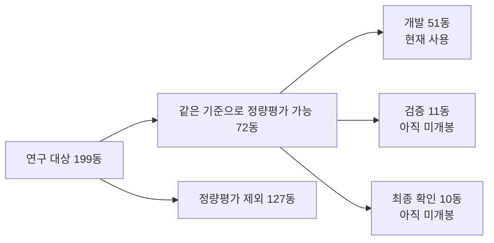

# P2 실험 진행 현황

- 마지막 확인일: 2026-08-03
- 저장소 커밋: `64877904c95440b01b2992b5552b4a9c42db7110`
- 현재 writer: Work Host
- 과학적 판정: `null`

이 문서는 P2의 현재 상태를 사람이 빠르게 확인하기 위한 한글 기록이다. 검증기에
필요한 receipt의 영문 필드명과 기존 Return Packet은 바꾸지 않는다. 이후 사람용
진행 보고서와 결과 설명은 한글로 작성한다.

## 한 줄 현황

C1/C2의 개발 51동 기술평가와 C3의 30,000회 학습은 끝났지만, C3를 건물별
지붕 모델로 변환하여 Roofer와 G3/G4로 평가하는 단계는 아직 실행되지 않았다.
따라서 C1/C2/C3의 최종 성공 건물 수 비교는 아직 없다.

## 단계별 진행 상태

| 순서 | 작업 | 상태 | 현재 결과 |
|---:|---|---|---|
| 1 | 공통 입력과 사전 점검 | 완료 | 공통 영상/pose와 개발 51동 범위 확인 |
| 2 | C1/C2 개발 51동 평가 | 완료 | C1 51건, C2 51건 계산 |
| 3 | 937장 semantic 생성 | 완료 | 937/937 완료 |
| 4 | C3 전체 장면 학습 | 완료 | seed 0, 30,000/30,000회 완료 |
| 5 | 동일 51동 C1/C2/C3 최종 비교 | 미완료 | C3 표면 추출·건물 분리·Roofer·G3/G4가 남음 |
| 6 | R4 반환과 writer 회수 | 완료 | Experiment Host 종료, Work Host로 반환 |

## 현재 정량 결과

| 조건 | 입력 충분 | Roofer 실행 | 3D 형상 유효 | 지붕 구조 | 위치·높이 | 최종 성공 수 |
|---|---:|---:|---:|---:|---:|---:|
| C1 현재 UAS LiDAR | 51/51 | 51/51 | 독립평가 아님 | 미평가 | 미평가 | 미산출 |
| C2 현재 영상 MVS | 50/51 | 50/51 | 50/51, 1동 미산출 | 미평가 | 미평가 | 미산출 |
| C3 영상 기반 GS | 학습 완료 | 0/51 | 0/51 | 미평가 | 미평가 | 미산출 |

C3의 `0/51`은 실패 건물 수가 아니다. 건물별 평가 과정이 아직 실행되지 않았다는
뜻이다. 현재 C3 모델은 593,852개 초기 Gaussian으로 시작해 30,000회 학습을
완료했으며, 최종 모델에는 406,337개 Gaussian이 있다.

이 결과의 의미는 다음과 같다.

- **C1:** 51동 모두 입력부터 Roofer 출력까지 기술적으로 생성됐다. 다만 C1의
  UAS LiDAR가 상한 기준과 같은 계보이므로, 이 숫자를 독립적인 지붕 정확도로
  해석할 수 없다.
- **C2:** 51동 중 50동은 MVS 입력이 연결되고 Roofer 출력과 유효한 3D 형상까지
  생성됐다. `DEBY_LOD2_4907183` 한 동은 연결할 MVS 건물 성분이 없어 첫 입력
  단계에서 멈췄다.
- **현재 말할 수 있는 것:** 현재 영상 MVS가 이 개발셋에서 건물 모델을 만드는
  기술적 성공률은 `50/51`이다.
- **아직 말할 수 없는 것:** 만들어진 지붕 모양이 맞는지, 위치와 높이가 충분히
  정확한지, C1보다 C2 또는 C3가 좋은지는 아직 판정할 수 없다. 이를 G3/G4와
  최종 성공 수가 답해야 한다.

세부 기계판독 표는
[`c1_c2_g2_c3_first_wave_recovery_r4_v1/stage_counts_v1.csv`](c1_c2_g2_c3_first_wave_recovery_r4_v1/stage_counts_v1.csv)에 있다.

## 현재 정성 결과

C1/C2에 대해서는 개발 51동의 고정 시점 이미지 자료가 있다. 건물별 입력 점군,
범위 상자와 생성 결과를 눈으로 확인하기 위한 자료이며, 현재 단계에서는 최종
성공/실패 판정 자료가 아니다.

- 자료 목록과 건물별 이미지 링크:
  [`c1_c2_qualitative_evaluator_backfill_v1/C1_C2_QUALITATIVE_EVALUATOR_SUPPLEMENT_v1.md`](c1_c2_qualitative_evaluator_backfill_v1/C1_C2_QUALITATIVE_EVALUATOR_SUPPLEMENT_v1.md)
- 로컬 PNG 폴더:
  `C:\Users\Hwiyoung\ChatGPTWork\Projects\JointBuildGS-artifacts\p2\c1_c2_qualitative_evaluator_backfill_v1`
- 대표 일반 사례: `DEBY_LOD2_4906981_fixed_views_v1.png`
- MVS 부분 관측 사례: `DEBY_LOD2_4906965_fixed_views_v1.png`
- MVS 성분이 비어 있는 사례: `DEBY_LOD2_4907183_fixed_views_v1.png`
- C3 정성 결과: 아직 없음
- 최종 C1/C2/C3 성공·실패 비교판: 아직 없음

건물별 PNG의 왼쪽 열은 독립 UAS 기준자료, 가운데는 C1 UAS LiDAR, 오른쪽은
C2 MVS이다. 위에서부터 평면, 비스듬한 3D 시점, 단면을 같은 범위로 보여준다.

5단계가 끝나면 이 문서에 다음 두 결과를 추가한다.

1. 동일 51동에서 C1/C2/C3의 단계별 통과 수와 최종 성공 수
2. 대표 성공·실패 건물의 입력, 중간 표면, Roofer 결과와 한 줄 원인

## 199동 중 일부만 정량평가하는 이유



72동은 단순히 UAS가 한 번이라도 지나간 건물이 아니다. 독립 UAS 기준자료가
지붕을 채점할 만큼 충분하고, 공통 영상·MVS 등 비교에 필요한 입력도 같은 규칙을
통과한 건물의 교집합이다. 나머지 127동은 UAS 기준자료 또는 비교 입력 중 하나
이상이 같은 정량 기준에 부족하다. 이들은 실패 건물이 아니며, 향후 정성·진단
대상으로는 사용할 수 있다.

세부 수는
[`c1_c2_g2_c3_first_wave_recovery_r4_v1/population_scope_v1.csv`](c1_c2_g2_c3_first_wave_recovery_r4_v1/population_scope_v1.csv)에 있다.

## 진행 현황 확인 방법

가장 간단한 확인 위치는 이 문서이다. 각 계산 단계가 끝날 때 이 표와 한 줄 현황을
갱신한다. Experiment Host 실행 중에는 다음 세 가지만 보고한다.

- 현재 실행 단계
- 완료 수/전체 수
- 정상 진행 또는 중단 원인

모델 토큰을 쓰지 않고 현재 Experiment Host 상태만 확인하려면 저장소 루트에서
다음을 실행한다.

```powershell
powershell -ExecutionPolicy Bypass -File scripts/repository/show_experiment_host_progress.ps1
```

원격 저장소의 최신 반환 여부는 다음 명령으로 확인할 수 있다.

```powershell
ssh innopam@192.168.10.203 "cd /media/innopam/InnoPAM-8TB/hwiyoung/code/JointBuildGS-operator && git log -1 --oneline && git status --short"
```

현재 R4 원문 기록은 다음에 있다.

- [R4 기술 결과 보고서](c1_c2_g2_c3_first_wave_recovery_r4_v1/TECHNICAL_RETURN_REPORT_v1.md)
- [R4 Return Packet](../../handoffs/returns/P2_C2W_C1_C2_G2_C3_FIRST_WAVE_RECOVERY_R4_RETURN_v1.md)
