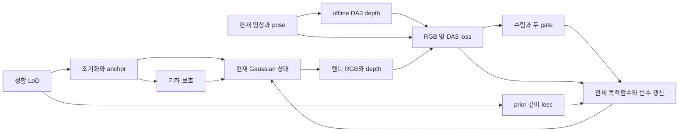

# 완성 알고리즘의 설계 이유·상호작용·성과·잔여 문제

- 작성일: 2026-09-10
- task_id: PHD-FULL-METHOD-ANALYSIS-20260910
- 상태: `LITERATURE_AND_DESIGN_ANALYSIS / NO_NEW_EXPERIMENT`
- scientific_verdict: null

## 1. 분석 단위의 수정

앞선 [원인별 분석](CAUSAL_MECHANISMS_ko_v1.md)은 가능한 오류 경로를 구별하는 보조 자료다. 다섯 원인이 모든 방법에 실제로 발생한다는 증거도, 각 논문이 그중 한 원인만 다룬다는 뜻도 아니다. 각 방법은 여러 오류와 제약을 함께 고려한 알고리즘이다. 이 문서는 **완성법 단위**로 다음을 연결한다.

> 실제 입력·관측 조건 → 함께 해결하려는 문제 → 요소 도입 이유와 상호작용 → 학습 중 바뀌는 것과 feedback → 완성법의 성과 → 해결된 ablation과 구별되는 잔여 → 개선할 설계의 정확한 대상.

가령 “GeoGS에 국소 신뢰도 재판정이 없다”는 기능 비교만으로 부족을 주장하지 않는다. 그 대신 **DA3·구조 anchoring·보호·adaptive 가중의 조합이 이미 무엇을 달성하며, 그 조합의 가정이 어느 조건에서 충분하지 않은가**를 묻는다. 요소 제거 ablation은 나머지 요소가 있는 상태에서의 기여이며 모든 상호작용이나 유일 원인을 입증하지 않는다.

기존 기하/원영상 O·X의 네 조건은 평가 조건으로 유지한다. 세부 원인·혼합영역은 그 안에서 구분한다. 기존 계약·결과·파일을 보존하며 새 탐색에 ALS·LoD2·GS·명시적 소스 선택을 필수로 가져오지 않는다. GT는 평가 전용이다.

## 2. GeoGS — 희소 영상에서 구조 확보와 세부·외관 정제의 충돌을 함께 제어

### 2.1 출발 조건과 설계 의도

출판 원문은 **정합된 LoD2와 보정된 camera pose가 있는 희소 영상 복원**을 다룬다. 희소 영상에서는 SfM 초기점과 영상에 따른 기하 최적화가 모두 불안정할 수 있다. 반면 LoD2는 지도화된 건물 구조를 제공하지만 실제 세부·건물 밖 표면을 충분히 나타내지 못한다. 따라서 원방법은 LoD와 영상을 서로 대체하는 입력으로 두지 않고 다른 부족을 보완하도록 설계했다. 이는 GeoGS의 LoD 조건에 대한 역할 설정이며 우리 연구의 모든 LiDAR·LoD·DSM 입력에 고정하는 역할이 아니다.

| 설계상 맞닥뜨린 문제 | 구체 설계 | 다른 요소와 함께 작동하는 이유 |
|---|---|---|
| 희소 관측에서 SfM 초기점이 불완전하거나 불안정 | 정합 LoD mesh에서 점을 샘플링하고 가시성 확인 후 Gaussian 초기화 | 초기화만 바꾸면 이후 RGB fitting으로 다시 잘못될 수 있으므로 지속적인 기하 감독이 필요 |
| 영상만으로 결정하기 어려운 표면·구조 | LoD raycast 깊이로 anchor 단계 기하 감독 | 원영상 구속이 약한 곳에 metric 구조 기준을 제공. 이후 세부 복원을 위해 강도를 완화 |
| LoD가 생략한 실제 세부와 건물 외부 기하 | pose-conditioned DA3 깊이를 offline 추정해 refinement에 도입 | 직접 RGB loss보다 조밀한 기하 방향을 제공하고 카메라 척도로 활용. DA3도 부정확할 수 있으므로 구조 기준을 함께 유지 |
| 상세 영상 depth가 기존 scaffold를 흔들거나, 처음부터 두 깊이를 강하게 강제하면 충돌 | anchor 후 refinement; prior 근접 Gaussian의 기하 gradient 감쇠·생성/삭제 보호와 작은 LoD loss 유지 | 세부를 추가하는 자유도와 구조 drift 방지를 함께 제공. prior 깊이 가중과 보호는 다른 제어 |
| 기하가 안정된 뒤에도 고정 depth 강도가 외관 정제를 제한 | DA3 공통 가중치를 loss 추세에 따라 점진적으로 감소 | 무조건 감소하면 기하 제약이 너무 일찍 사라질 수 있어 depth 안정성과 RGB 개선을 함께 검사 |
| 렌더링 적합성이 곧 일관된 표면은 아님 | planar Gaussian과 기반 표현의 기하 regularizer, 이후 TSDF 표면 추출 | 입력 감독·변수 제어 외에도 표면 형성·추출을 포함하는 전체 복원 알고리즘 |

근거: [첨부 출판 전문 §§3.1–3.4](/home/innopam/.codex/attachments/74f36af2-99b5-411a-93e5-7fa2ce39fe8d/1-s2.0-S0924271626003588-main.pdf). 기존 추출 텍스트에서 해당 절을 다시 읽었다. 원문의 2DGS 구현과 우리 저장소의 gsplat 운영 규칙은 별개이며 이번에 구현·실행을 도입하지 않는다.

### 2.2 왜 DA3인가

GeoGS가 밝힌 이유는 **조밀한 영상 유래 기하, 다중영상과 알려진 pose의 활용, camera metric scale과의 연결**이다. 일반 단안 depth를 별도 scale/shift 정합해 쓰는 부담을 줄이려는 선택이다. DA3 자체도 pose conditioning을 지원한다. [DA3 원문 §§3.2·7.2.3](https://arxiv.org/html/2511.10647v1), [공식 구현 설명](https://github.com/ByteDance-Seed/Depth-Anything-3).

이 선택이 모든 지역의 DA3 깊이가 정확하거나 엄밀히 다중시점 일관적임을 보장하지는 않는다. GeoGS §6도 희소·가림 조건에서 영상 depth의 잔여와 pose 정확성의 중요성을 설명한다. 또한 **DA3 제거 ablation은 영상 depth의 기여를 보이며, DA3가 다른 모든 depth 추정기보다 필수·최선임을 입증하는 비교는 아니다.** 우리 연구에서 다른 감독을 비교할 여지는 이 구분에서 출발한다.

### 2.3 왜 adaptive 가중인가 — 무엇을 보고 무엇을 바꾸는가

논문 §3.4.2의 의도는 기하 감독을 초기에는 충분히 유지하고, 안정화 이후 외관 정제를 위한 자유도를 점진적으로 주는 것이다. 조절 대상은 **DA3 visual-depth loss의 시간 가변 공통 계수**다. LoD loss는 단계에 따라 다른 가중을 쓰며, 보호 제어는 별도로 남는다.

1. DA3 깊이 loss가 수렴하는 상태를 확인한다.
2. 최근 depth loss가 급증하지 않는지 검사한다: **Depth Guard**.
3. 최근 RGB loss가 개선되는지 검사한다: **Photometric Benefit**.
4. 조건을 만족할 때 DA3 가중을 낮추고 하한을 둔다.

이것은 실제 feedback이다. 현재 기하·외관 → 렌더 loss → 가중 변화 → 다음 기하·외관으로 되먹임한다. 동시에 offline DA3 target과 LoD/pose 자체를 다시 추정하는 순환과는 다르다. RGB 개선의 관측으로 decay를 결정하는 규칙이며, 감소하지 않았을 가상 실행과 비교해 감소의 인과적 이득을 매번 검증하는 절차는 아니다.

**논문·공식 코드·실행을 구분한다.** 논문은 gate 불만족 때 감쇠를 중단하는 수식과 설명을 제공한다. 고정 공식 `train.py`는 INITIAL→CONVERGED→DECAYING→LOCKED 상태를 쓰며, depth guard 실패 시 현재 가중을 LOCKED로 고정하는 경로가 있다. 해당 상태에서 이후 추세로 감쇠를 재개하는 전이는 확인되지 않는다. 이는 코드의 보수적 제어 범위이지 실제 실패의 증거가 아니다. [공식 controller L879–961](https://github.com/zqlin0521/GeoGS/blob/db40c95c657ec03ff21c83cb99cf39f4e90247a6/train.py#L879).

논문 visual-depth 식의 mask는 binary valid mask다. 별도 공식 옵션은 미리 읽은 DA3 confidence를 평균 정규화해 depth 항에 곱한다. 이것을 adaptive 공통 가중과 같은 제어로 읽지 않는다. [confidence 로딩·적용 L719–815](https://github.com/zqlin0521/GeoGS/blob/db40c95c657ec03ff21c83cb99cf39f4e90247a6/train.py#L719).

### 2.4 이 전체 설계는 실제로 무엇을 개선했는가

아래는 원문 Table6의 **Region1, K=13, TSDF mesh 평가**다. M3C2는 낮을수록, F1과 PSNR은 높을수록 좋다. 서로 다른 표면표현·데이터의 타 논문 수치와 합쳐 순위를 만들지 않는다.

| 비교 | PSNR | M3C2(m) | F1@0.5m | 이 비교가 지지하는 해석 |
|---|---:|---:|---:|---|
| Vanilla 2DGS | 14.001 | .411 | .713 | 비교 출발점 |
| 2DGS의 초기점만 LoD로 교체 | 14.772 | .643 | .617 | 초기 기하가 바뀌는 것만으로 전체 설계의 효과를 재현하지 못함 |
| GeoGS에서 DA3 제거 | 15.067 | .394 | .772 | 나머지 구조 제어가 있어도 영상 depth의 추가 이득이 있음 |
| GeoGS에서 구조 보호 제거 | 16.165 | .389 | .775 | DA3와 depth loss만으로 완성법의 성과를 재현하지 못함 |
| GeoGS에서 adaptive 가중 제거 | 16.250 | .380 | .786 | 이 조건에서는 adaptive의 추가 이득이 특히 PSNR에 나타나며 기하 지표 차이는 작음 |
| **완성 GeoGS** | **16.654** | **.378** | **.788** | 초기화·감독·보호·완화가 함께 작동한 결과 |

Depth Guard 또는 Photometric Benefit을 따로 제거하면 LPIPS는 완성법 .266에서 각각 .378/.377로 악화했다. 이것이 두 gate를 함께 둔 저자의 근거다. 다만 한 지역의 제거 ablation으로 모든 국소 보존·교정 상황을 검증한 것은 아니다. 반복 변동과 모든 요소 간 interaction도 이 표만으로 확정하지 않는다.

성과도 지표별로 읽는다. Table6의 PGSR standard는 F1@0.2m .512, 완성 GeoGS는 .469여서 **모든 정밀도 지표에서 GeoGS가 최고는 아니다.** 위 표는 실제 설계의 효용을 보이는 것이며 무조건적인 우열표가 아니다. 근거: [출판 전문 §5.4/Table6](/home/innopam/.codex/attachments/74f36af2-99b5-411a-93e5-7fa2ce39fe8d/1-s2.0-S0924271626003588-main.pdf).

### 2.5 그럼에도 남은 문제와 개선 질문

| 구분 | 현재 근거 | 전체 설계 이후의 정확한 질문 |
|---|---|---|
| **완성법에서 평가된 잔여** | Table7의 LoD 높이·수평 오차에서 큰 구조 지표는 비교적 안정적이나 외관·국소 정합 영향이 남음. 결합 pose noise에서는 기하도 악화 | 이 정도는 허용 가능한 강건성인가, 우리 목표에서 중요한 특정 면의 교정 부족인가? 표만으로 후자를 확정하지 않음 |
| **저자가 명시한 한계** | 큰 pose/LoD 오정합, LoD 외부 요소의 불완전성, 전체 도시 규모 실행 | 입력 정합·초기 지원·관측의 문제를 새 confidence의 필요성으로 바로 연결하지 않음 |
| **우리 조건에서의 미평가** | 정밀한 기존 세부와 잘못된 기존 면이 혼재하고 DA3 타당성도 국소적으로 다름 | 완성법과 충분히 조정한 기존 제어가 같은 영역에서 교정·보존을 함께 달성하는가? |
| **controller에 관한 우리 가설** | depth loss는 DA3 target과의 차이를 보고 공통 계수를 바꿈 | 좋은 구조가 무너져 residual이 증가하는 경우와, 편향된 DA3에서 올바른 표면으로 벗어나며 residual이 증가하는 경우를 구별할 필요가 실제로 있는가? |
| **감독·보호 결합에 관한 우리 가설** | 가중은 바뀌어도 prior target·보호가 다른 기준으로 남음 | 국소 감독 제어만으로 충분한가, 해당 면의 수정 자유도·표면 기여까지 함께 바꿔야 하는가? |

위 controller 가설은 guard가 반드시 교정을 막는다는 뜻이 아니다. 남은 RGB·prior·다른 시선과 가중 수준에 따라 교정이 가능하다. 원문 Table7의 강건성과 기존 P2의 큰 형상 수정 성공을 함께 포함해 충분성을 검사해야 한다. **“adaptive가 없다”가 아니라 “이 adaptive가 관찰하는 신호와 조절하는 변수가 우리 혼합 조건에서도 충분한가”가 연구 질문이다.**

기존 [P1/P2/P3 제어 기록](../geogs_p1p2p3_v1/CONTROL_TRAJECTORIES_ko_v1.md)에서 P1/P2 native .005/.0005 쌍은 기록된 DA3 가중이 모두 .05다. Adaptive 코드가 있다는 사실과 실제로 decay가 발생했다는 사실은 다르다. 해당 형상 차이를 그 쌍 사이 DA3 decay 차이로 설명하지 않는다. 다른 실행에서는 decay가 기록됐으므로 “실제 adaptive가 전혀 작동하지 않았다”는 주장도 하지 않는다. Native confidence 비활성, 실제 expected depth, ALS 적응 입력의 계보도 유지한다.

## 3. 다른 완성 알고리즘과의 대조

다음 절은 각 방법의 전체 설계와 검증 범위를 같은 형식으로 기록한다. 외부 기존 기하 없이 단안 감독을 쓰는 방법은 구성요소 도입·원인 설명 후보이며 직접 입력 동등성을 가정하지 않는다.

### 3.1 AGS-Mesh — 센서 깊이와 단안 법선의 오류를 서로 보완하고 학습·추출까지 연결

**입력과 문제.** 동기화된 실내 RGB·sensor depth·단안 normal을 사용한다. 센서 depth의 metric 위치는 유용하지만 경계·얇은 물체·먼 곳의 오차가 있고, 단안 normal은 방향·경계 단서를 주지만 항상 정확하거나 시점 간 일관적이지 않다. 한 소스의 감독을 일괄 강화하는 것으로는 두 문제를 함께 해결하기 어렵다는 출발점이다. [원문 §§3–4](https://arxiv.org/html/2411.19271v2).

| 연결된 설계 | 도입 이유와 의존 관계 |
|---|---|
| Sensor depth + monocular normal | 위치와 표면 방향의 상보적 기하 감독을 RGB에 추가 |
| DNC | sensor depth에서 만든 normal과 단안 normal의 불일치로 부정확할 수 있는 depth를 거름 |
| 초기 감독 후 ANR | 먼저 확보한 기하에서 렌더 depth normal을 계산하고 단안 normal과 비교해 그 감독의 사용을 갱신 |
| RGB·depth·normal·기반 기하 regularizer와 생성/삭제 | 선택된 감독이 실제 GS 기하·방향·표현 용량으로 전달되도록 함께 최적화 |
| 렌더 depth/normal → adaptive TSDF·IsoOctree | 카메라 거리·방향·표본밀도를 고려해 학습 결과를 mesh로 읽어냄 |

**실제 feedback.** DNC는 사전에 파일로 저장한 고정 입력 검사다. ANR는 sampled view마다 현재 기하로 다시 계산하고 이전 거절을 영구 누적하지 않으므로 재포함 가능하다. 공식 2DGS trainer는 depth를 초기에는 raw로, 이후 DNC mask로 사용하고 normal 감독과 ANR를 순차 활성화한다. Mesh 추출이 학습으로 되돌아가는 경로는 확인되지 않는다. [DNC 구현 L99–170](https://github.com/XuqianRen/AGS_Mesh/blob/93fda851a20cf0bd5fce642c46da0c83c637165e/depth_normal_consistency.py#L99), [학습·ANR L127–183](https://github.com/XuqianRen/AGS_Mesh/blob/93fda851a20cf0bd5fce642c46da0c83c637165e/train.py#L127), [추출 L408–480](https://github.com/XuqianRen/AGS_Mesh/blob/93fda851a20cf0bd5fce642c46da0c83c637165e/isooctree_dn.py#L408).

**전체 성과.** Table3 F1은 base .6345→depth .8861→both .8880→DNC .9061→ANR .9092→IsoOctree .9157이다. Normal-only는 .6342다. 이는 metric depth·법선·필터·추출의 조건부 누적 효과이며 ANR 단독의 일반 효과가 아니다. [원문 §5.3/Table3](https://arxiv.org/html/2411.19271v2#S5.SS3).

**그래도 남는 것.** Appendix A/Table5에서 TSDF→IsoOctree의 F1 .9030→.9028처럼 추출의 지표 간 trade-off가 있다. Appendix E도 전체 품질 향상이 일관적이지 않다고 밝힌다. 반면 “normal 검사로 평행이동을 못 잡음”은 **단일 검사에 관한 우리 추론**이다. RGB·depth·생성 경로를 갖춘 완성법도 실패한다는 근거는 아니다.

**개선할 정확한 질문.** 독립 기존 기하가 방향은 맞고 위치가 틀렸거나 초기 감독들이 같은 세부를 생략할 때, 완성 AGS의 RGB·재판정·생성이 이를 이미 복구하는가? 복구하지 못할 때만 입력 검사, 초기 감독으로 만들어진 판정 기준, 표면 추출 중 병목을 가른다. 단순 재포함 기능을 신규 요소로 제안하지 않는다. 논문 각도 10°와 공식 DNC 기본 20°·ANR 0.1rad의 차이는 설정 계보 문제로 기록하며 성능 원인으로 단정하지 않는다.

### 3.2 DebSDF — 잘못된 감독 제거 이후 세부를 실제로 학습할 조건까지 마련

**입력과 문제.** Posed RGB와 단안 depth/normal에서 무텍스처 면은 prior가 필요하지만 얇은 세부는 prior 오류, 적은 ray 표집, 평활화, volume rendering 편향의 영향을 함께 받는다. 따라서 “prior를 덜 믿으면 세부가 생긴다”로 끝나지 않는다.

| 연결된 설계 | 전체 목적에서의 이유 |
|---|---|
| 잔차 기반 uncertainty와 감독 filtering | 부정확한 단안 감독이 형상을 강제하는 영향 완화 |
| 같은 uncertainty로 중요한 ray를 더 표집 | 감독을 제외한 어려운 영역에 RGB로 학습할 기회를 제공 |
| 같은 uncertainty로 smoothness 완화 | 세부 학습을 평활화가 다시 지우는 경로 제어 |
| 곡률·광선 각도를 고려한 SDF→density 보정 | 앞의 제어 뒤에도 렌더링 편향이 얇은 구조를 줄이는 현상 완화 |
| uncertainty와 진행도에 따른 warm-up | 초기의 부정확한 기하·곡률에서 보정 자체가 불안정해지는 문제 제어 |

이처럼 uncertainty는 필터 하나가 아니라 **감독·학습 기회·평활화·변환 도입 속도**를 연결한다. [원문 §§III-B–E](https://arxiv.org/html/2308.15536v3).

**실제 feedback.** 현재 기하·렌더 잔차가 uncertainty 학습에 영향을 주며 저장 uncertainty map을 갱신해 후속 ray 표집에 사용한다. 공식 trainer의 기본 refresh 값은 40k/100k이고 epoch로 환산된다. 모든 run이 동일한 값이라는 뜻은 아니다. [debsdf_train.py L36·L298–302·L519–552](https://github.com/DavidXu-JJ/DebSDF/blob/4580c8e1c9872e65f6cb9fc55607162f57ab7a54/code/training/debsdf_train.py#L519), [scene_dataset.py L277–285](https://github.com/DavidXu-JJ/DebSDF/blob/4580c8e1c9872e65f6cb9fc55607162f57ab7a54/code/datasets/scene_dataset.py#L277). Original prior target은 고정이다. 직접 감독의 detach/mask를 모든 기하 gradient의 차단으로 넓히지 않는다.

**전체 성과와 남는 것.** TableIV에서 filtering 이후 sampling·smooth·변환을 더해 세부 성능이 개선되고, 마지막 변환 추가는 ScanNet F-score 77.30→78.54다. 이것은 완성법이 해결한 ablation이다. §V는 prior 품질 의존과 384×384 입력/감독 해상도 한계를 남긴다. 단순 고해상도 확대도 효과적이지 않았다는 저자 관찰이 있다. [원문 TableIV·§V](https://arxiv.org/html/2308.15536v3#S5).

**개선할 정확한 질문.** 단안 감독의 오류가 늘면 이 전체 uncertainty 기반 제어가 실제 세부에 학습량을 배분하는가, 공통 오답과 유효 소수 감독을 반대로 배분하는가? 후자는 현재 미평가 질문이다. 어려운 곳의 감독을 끄는 것뿐 아니라 표집·정규화·변환까지 이미 연동한다는 점을 유지해 비교해야 한다. 고해상도 감독·기존 보정의 도입으로 해결되면 새로운 uncertainty 원리의 필요성은 줄어든다.

### 3.3 ND-SDF — 감독을 단순히 버리지 않고 보정하되 유효한 원감독도 유지

**입력과 문제.** Posed RGB와 단안 기하 감독에서, 오류가 있는 normal을 그대로 강제하면 세부가 억제되고 단순 제외하면 유용한 제약도 사라진다. 한편 보정 자유도만 늘리면 잘못된 형상도 보정된 normal로 설명할 수 있다. ND-SDF는 이 두 방향의 문제를 함께 다룬다.

| 연결된 설계 | 전체 목적에서의 이유 |
|---|---|
| Normal deflection field | 현재 표면 법선을 학습 회전으로 보정해 편향된 단안 normal과의 관계를 설명 |
| 원래/보정 normal loss의 angle 기반 상보 가중 | 보정이 필요한 곳은 유연하게, 그 외에는 유효한 원감독의 제약을 유지 |
| 같은 angle로 depth 영향·RGB 학습·ray 표집 조정 | 편향이 큰 세부에서 잘못된 prior의 영향과 학습 자원 부족을 함께 제어 |
| angle 기반 부분 unbias와 warm-up | 세부에서 렌더링 편향을 줄이면서 평면·초기 기하의 수렴 안정성을 고려 |

**실제 feedback.** 기하와 회전 field를 공동 학습하고 현재 deflection angle은 다음 감독 가중과 cache를 갱신한다. cache는 후속 sampling·부분 unbias에 쓰인다. Current step에서 angle의 gradient를 끊어도 다음 step의 feedback이 없어지는 것은 아니다. [system.py L152–221](https://github.com/zju3dv/ND-SDF/blob/f58f29466a5f43e80dedb0cd155f57dae7569347/models/system.py#L152), [loss.py L187–190·L302–344·L433–449](https://github.com/zju3dv/ND-SDF/blob/f58f29466a5f43e80dedb0cd155f57dae7569347/models/loss.py#L302), [exp_runner.py L297–350](https://github.com/zju3dv/ND-SDF/blob/f58f29466a5f43e80dedb0cd155f57dae7569347/exp_runner.py#L297).

**전체 성과와 남는 것.** Table6에서 deflection만 쓴 ModelA의 평면 주름은 adaptive prior를 추가해 개선됐고 F1은 .632→.679다. 이후 sampling/photo·unbias까지 포함한 완성법은 .686이다. 그러나 ModelC→full의 recall은 .740→.728로 낮아져 모든 지표가 함께 좋아지지는 않는다. §5의 낮은 피복/local optimum은 완성법의 한계다. [원문 §4.2/Table6·§5](https://arxiv.org/html/2408.12598v3).

**개선할 정확한 질문.** 학습된 angle은 보정 요구를 여러 제어에 전달하므로 잘못 해석되면 영향을 공유할 수 있다. 그러나 전체 알고리즘의 adaptive 원감독·RGB가 그 문제를 이미 제어할 수도 있다. 이때 새 연구는 단순 normal 회전이나 adaptive 가중 추가가 아니라, **독립 metric 기존 기하와 영상 파생 감독의 오류가 다른 경우 이 공유 신호·보정 제약이 충분한가**를 물어야 한다. 단안 depth와 normal의 공통 편향 가정을 LiDAR 위치 오차에 그대로 적용하지 않는다.

### 3.4 SenFuNet — 이종 관측을 분리 보존한 뒤 누적 특징으로 결합·기각

**입력과 문제.** 서로 다른 noise·거리·해상도·피복·시점을 가진 depth stream을 보정된 pose로 결합한다. Stereo RGB도 특징으로 사용한다. 초기에 섞으면 좋은 관측과 나쁜 관측의 출처가 사라지고, 한 센서만 본 곳에서는 상대 비교도 어렵다.

| 연결된 설계 | 전체 목적에서의 이유 |
|---|---|
| 센서별 TSDF·관측 횟수·feature grid 분리 누적 | 서로 다른 품질과 출처를 유지하고 비동기 관측을 공통 3D 공간에 모음 |
| 센서별 feature network | 관측 횟수만으로 설명되지 않는 depth/RGB의 국소 신뢰 단서 학습 |
| 3D late fusion | 서로 겹친 영역에서 누적된 후보와 맥락을 보고 혼합/선택 |
| 단일센서용 별도 inlier/outlier 감독 | 해당 TSDF를 그대로 통과시키는 영역에서는 fusion 출력 오차로 α를 학습할 수 없으므로 별도 신뢰 학습 필요 |
| Optional denoising과 최종 outlier 추출 mask | 잡음 완화와 표면 소실의 균형. Denoising을 필수로 고정하지 않음 |

마지막 단일센서 감독의 필요성은 **다른 모듈이 만든 감독 공백을 메우는 의존 관계**다. 따라서 fusion network만 따로 떼어 완성법을 설명하면 목적을 놓친다. [원문 §3/Fig.2·§4](https://arxiv.org/html/2204.03353v2).

**실제 feedback.** 다음 프레임은 이전 센서별 상태를 읽는다. 학습 중 현재 feature/weight 경로는 갱신되지만 과거 누적 tensor는 detach 저장된다. 최종 fused volume은 센서별 TSDF·원 depth·pose를 다시 교정하는 경로가 아니다. 공개 test 함수는 누적 후 filter를 부른다. 이를 근거로 논문의 온라인 처리 가능성 전체를 부정하지 않는다. [fuse_pipeline.py L468–560](https://github.com/eriksandstroem/SenFuNet/blob/43c1682e29c700df4577d9dcf0ac3b8ebdd8f496/modules/fuse_pipeline.py#L468), [filter_pipeline.py L294–389](https://github.com/eriksandstroem/SenFuNet/blob/43c1682e29c700df4577d9dcf0ac3b8ebdd8f496/modules/filter_pipeline.py#L294). 공개 Replica config는 RGB 특징을 쓰며 원 stereo 대응 재추정은 하지 않는 구성이다. 논문 run과 예제 config의 동일성은 미확인이다.

**전체 성과와 남는 것.** 센서 불균형·비동기·raw/denoised 조합의 성공과 full loss·feature·outlier 제어의 이득이 보고된다. 그럼에도 AppendixJ/Fig.17은 매끄럽지만 덜 정확한 표면 선호, 경계 평균화, 양쪽 outlier를 남긴다. 처음 두 현상의 데이터·목적함수·최적화 원인은 완전히 분리되지 않았다. [원문 Tables7·9·14·15 및 AppendixJ](https://arxiv.org/html/2204.03353v2#A10).

**개선할 정확한 질문.** 양쪽 관측의 출력은 convex 혼합이고 learned rejection은 single-sensor에 적용된다. 같은 방향의 두 오답을 수정할 수 있는 출력이 없을 수 있다. 이는 충분히 학습한 weighting만으로도 해결되지 않는 경우의 구조적 근거다. [filtering_net.py L193–223](https://github.com/eriksandstroem/SenFuNet/blob/43c1682e29c700df4577d9dcf0ac3b8ebdd8f496/modules/filtering_net.py#L193), [test_fusion.py L190–227](https://github.com/eriksandstroem/SenFuNet/blob/43c1682e29c700df4577d9dcf0ac3b8ebdd8f496/test_fusion.py#L190). 그러나 기존 절대 validity 검사·후보 개선으로 충분한지부터 봐야 한다. 단일센서 처리를 새로 발명했다고 하지 않는다. 원방법의 GT TSDF 학습은 우리 대상 장면의 평가 GT로 수행하지 않는다.

### 3.5 CoMe — 외관 모델·신뢰도·생성·primitive 제약을 함께 조절

**입력과 문제.** Posed RGB에서 조명·시선 의존 외관, photometric–geometry 경쟁, 과도한 생성, alpha 합성의 모호성이 함께 작동한다. 하나의 RGB 오차가 서로 다른 원인에서 발생하고 생성 gradient까지 바꿀 수 있다.

**연결된 설계.** Appearance 보정과 D-SSIM 성분 분리로 조명 잔차를 다루고, 학습 confidence로 광도 항의 영향을 조절한다. 같은 confidence로 clone/split 문턱을 바꿔 loss 변화와 density control을 맞춘다. Color/normal variance는 최종 합성만 맞추고 개별 primitive가 부정확한 해를 제한한다. 이 모두를 최적화한 뒤 mesh로 추출한다. [원문 §§3–4](https://arxiv.org/html/2603.24725v2).

**실제 feedback.** 현재 렌더 잔차가 confidence·기하·외관 학습에 영향을 주고, confidence가 다음 loss와 생성 결정을 바꾼다. Variance는 개별 색·법선·alpha에 gradient를 제공한다. 이 경로는 confidence 출력을 위해 opacity를 직접 조절하는 것과 다르다. [train.py L203–290](https://github.com/r4dl/CoMe/blob/caf62f6402dd82a301f7aa9d43350209f7309911/train.py#L203), [gaussian_model.py L779–826](https://github.com/r4dl/CoMe/blob/caf62f6402dd82a301f7aa9d43350209f7309911/scene/gaussian_model.py#L779), [CUDA backward](https://github.com/r4dl/CoMe/blob/caf62f6402dd82a301f7aa9d43350209f7309911/submodules/diff-gaussian-rasterization/cuda_rasterizer/stopthepop/hierarchical_render.cuh#L1626).

**전체 성과와 남는 것.** Table3의 누적, Table4의 appearance, Table5의 density 비교가 이 결합을 뒷받침한다. 그러나 DTU Table7에서 confidence까지의 Chamfer .64가 variance/full에서는 .65다. §5의 심한 가림·미관측 구멍도 남는다. [원문 Tables3–5·7 및 §5](https://arxiv.org/html/2603.24725v2). 이 결과는 모든 제약을 많이 넣을수록 좋다는 주장을 지지하지 않는다. 외부 기존 기하의 보존·수정은 직접 검증 범위가 아니다.

**개선할 정확한 질문.** 우리 목표에서 RGB 잔차를 줄이면서 실제 현재 표면을 수정해야 하는 위치와, 외관만 바꾸며 기존 기하를 지켜야 하는 위치가 혼재할 때 완성된 이 제어가 충분한가? 기존 appearance·variance의 도입으로 충분하면 추가 복잡성을 방법 기여로 주장하지 않는다.

## 4. 완성법을 대조해 남기는 연구 질문

| 완성법이 이미 하는 것 | 우리 조건에서 남길 수 있는 질문 | 먼저 대조할 기존 해법 |
|---|---|---|
| GeoGS: 구조 기준을 유지하며 조밀 depth를 넣고 수렴에 따라 완화 | 동일 residual 변화가 안정성 손실과 필요한 편향 교정에서 모두 생길 때, 현재 두 gate와 보호가 충분한가? | 적절한 고정/원 adaptive, 선택적 DA3 confidence, prior 가중과 보호의 독립 조정 |
| AGS: 초기 기하로부터 normal 감독을 재판정하고 생성·추출까지 수행 | 방향은 맞고 위치가 틀린 기하, 두 감독이 함께 생략한 세부를 다른 경로가 복구하는가? | 완성 DNC+ANR와 RGB/depth, 기존 위치·다중시점 검사, 추출 |
| DebSDF: filtering 이후 학습량·smooth·표현 전달까지 조절 | 공통 오답과 유효한 소수 관측을 uncertainty가 잘못 해석할 때 연동 제어는 회복하는가? | 기존 감독 개선·다중시점 검사·고해상도 처리와 완성 uncertainty 제어 |
| ND-SDF: 감독을 보정하면서 원감독의 제약도 유지 | 서로 독립적인 기존 기하·영상 감독의 오류에도 동일 angle 기반 제어가 충분한가? | 원감독/보정의 기존 adaptive 결합, metric depth와 normal의 제어 분리 |
| SenFuNet: 후보를 보존하고 특징을 학습해 혼합·기각 | 후보 값의 범위 밖 교정이나 양쪽 기각이 필요한 경우 어디서 새 정보를 써야 하는가? | 기존 absolute validity 검사·후보 재추정·surface 목적 |
| CoMe: 외관·confidence·density·variance를 연결 | 현재 기하 교정과 외관 갱신이 서로를 대신 설명하는 일이 완성 제어 뒤에도 남는가? | 기존 appearance 분리·variance와 표현별 생성 규칙 |

이 질문들은 확인된 공통 실패 목록이 아니다. 완성법의 실제 잔여와 우리 입력 조건의 차이를 바탕으로 한 **검증할 가정**이다. 사용 가능한 정보가 없는 XX, 원영상에 정보는 있지만 파생 감독에서 놓친 OO-3/XO-3, 유효 prior를 지켜야 하는 OX를 같은 잔여로 합치지 않는다.

## 5. GeoGS를 출발점으로 하는 최소 비교와 조건부 설계

**첫 비교 대상은 완성 GeoGS다.** 요소를 제거해 일부러 약하게 만든 모델을 주 경쟁으로 삼지 않는다. 현상 확인 후 그 현상을 구별하는 데 필요한 부분만 조정한다. 전체 입력·초기 구조·감독 정보·정합·추출·계산 예산을 통제하고 새 정보가 추가되면 모든 비교군의 접근권과 비용을 맞춘다.

원래 LoD2 입력의 GeoGS와, 동일 알고리즘에 ALS·DSM 등 이종 prior를 넣은 adaptation은 이름과 계보를 분리한다. 입력을 바꾼 adaptation의 결과를 원논문 재현으로 부르지 않는다. 새 제어의 효과는 같은 입력·adapter·초기 구조를 쓰는 adaptation 내부에서 구별한다.

| 질문 | 최소 비교·관찰 | 개선 설계로 이어지는 조건 | 기각·축소 조건 |
|---|---|---|---|
| Adaptive가 무엇 때문에 완화/유지하는가? | 완성법의 DA3/RGB loss 추세·실현 가중과 동일 영역의 현재 표면 교정·유효 면 손상을 대응. 기존 고정 계수와 원 adaptive를 대조 | 원신호가 필요한 교정과 손상을 구별하지 못하는 상황이 반복되고 결과에 중요할 때, gate의 관측 근거를 개선할 후보 | 충분히 조정한 고정/원 adaptive가 같은 교정-손상을 달성하면 새 controller 필요성 축소 |
| 공간별 감독 타당성 조절로 충분한가? | 같은 DA3·anchor에서 공식 optional confidence 또는 적합한 기존 consistency 제어만 도입 | 완성법 뒤의 잔여가 줄고도 특정 감독 편향이 남을 때 기존 보정과 비교 | 기존 confidence 도입만으로 해결되면 새 원리 대신 기존 요소 채택 |
| target 자체가 편향됐는가, 보호가 수정을 제한하는가? | 위 기존 제어를 유지한 채 감독 보정과 prior weight×보호의 필요한 최소 대비를 분리 | target 보정만/보호 변경만으로 회복하는 영역을 구별해 해당 원리를 설계 | 기존 target 개선·전역 조정으로 충분하면 추가 국소 수정법 필요성 축소 |
| 출력 표면이 감독 변화에 맞게 갱신되는가? | 입력 target→렌더 depth→표면 기여→mesh의 대응을 유지하고 기존 surface/추출 제어 대조 | 신호 선택이 맞아도 표면 교정이 다른 변수로 흡수된다면 표면 수준 제약 검토 | 기존 표현 제약/추출로 충분하면 신뢰도·source decision 기여 주장 축소 |

**방법 구상의 현재 형태:** GeoGS의 “수렴에 따른 감독 완화”를 출발점으로, 실제 잔여가 확인되면 **어떤 관측 변화가 필요한 기하 교정을 지지하는지에 따라 감독 target·영향력·수정 제약 중 필요한 대상을 조절하는 규칙**을 구체화한다. 이 문구 자체는 새 알고리즘이 아니다. 기존 confidence, ND식 보정, CoMe식 전달 제어와 무엇이 다른지를 수식·변수·효과 수준에서 특정해야 한다. 원인 완전 입증을 기다릴 필요는 없지만 각 후보에 해당 잔여·대안·기각 조건을 붙인다.

구조 보존·잘못된 면 수정·결손/관측 가능 세부·외관·계산량을 별도로 보고하고, 같은 물리 영역의 교정과 손상을 함께 평가한다. P2의 정성적 형상 개선을 평균 F1로 부정하지 않으며 정확도·완전성·참조 피복을 분리한다. P3 저가중 악화는 미검증 가설이다. GT를 감독·confidence·정합·파라미터 선택에 전달하지 않는다.

## 6. 차별성과 검증 기여의 현재 평가

- **문제 설정:** 이종 기존 기하와 현재 관측의 불균일한 타당성을 다루는 범위는 연구 가치가 있지만 보존·수정의 동시 요구만으로 신규성은 성립하지 않는다.
- **원인 설명:** 완성 알고리즘이 복합 원인을 어떻게 억제하는지와 그 후 가정이 깨지는 조건을 설명하는 것이 중요하다. 단일 모듈 약점만으로 완성법 실패를 주장하지 않는다.
- **방법:** 현재 adaptive·filtering·bias correction·표현 제어는 모두 강한 선행이다. 남는 가정의 한계를 겨냥한 하나의 새로운 추정·제약 규칙도 충분히 구체화되면 기여 후보가 된다. 모듈 수나 단순 결합은 근거가 아니다.
- **검증:** 충분히 구성한 완성법의 성공과 실패, 제안법의 악화, 같은 영역의 교정-손상을 함께 보는 검증은 가치가 있다. 지표를 나누는 것 자체는 방법 신규성이 아니다.

## 7. 출처·검토·보존 기록

- GeoGS 전문: 기존 첨부 PDF와 기존 추출 텍스트 `/tmp/jbgs-geogs-attached-fulltext-20260907.txt`의 §§3.1–3.4·4.3·5.4–5.5·6을 다시 읽었다. PDF 계보·hash는 [근접 감사 §7](NEARBY_METHODS_ko_v1.md#7-출처와-검토-범위)를 따른다. 출판사 웹 접근은 403이어서 보존된 전문으로 확인했다. 전문 미확보 상태가 아니다.
- 공식 구현은 각 링크의 commit으로 고정했다. 코드 controller의 LOCKED와 논문의 감쇠 중단 설명, optional confidence와 실제 native 설정, 논문 median과 개발 expected depth를 분리한다. 논문 Table6 PartD의 default F1@.2는 다른 Part의 default와 표기 차이가 있으므로 이 문서의 비교는 PartA/B에 한정하고 해당 차이의 원인은 단정하지 않는다.
- AGS-Mesh의 논문 각도와 공식 기본값 차이는 §3.1에 기록했다. SenFuNet의 공개 loss에 대한 앞선 정적 의심점은 [원인 감사 §13](CAUSAL_MECHANISMS_ko_v1.md#13-감사-범위정정예외)에 보존하며 논문 성능의 원인으로 사용하지 않는다.
- 독립 분담은 AGS-Mesh/CoMe, SenFuNet, DebSDF/ND-SDF의 전체 설계를 검토했다. DebSDF/ND-SDF 담당의 한 차례 모델 용량 오류가 있었고, 후속으로 확인 완료된 코드 위치를 회수하여 원문·공식 코드와 대조했다. 이 과정에서 프로젝트 실행은 하지 않았다.
- 통합 문서의 GeoGS 설명·조건부 설계·GT 경계에 대한 독립 읽기 검토도 완료했다. 원방법과 이종 prior adaptation의 계보 구분을 §5에 보완했다.
- 존재하지 않는 `geogs_p1p2p3_v1/IMPLEMENTATION_NOTES_ko_v1.md` 검색은 파일 부재를 반환했다. 해당 추정 경로에 의존하지 않고 실제 제어 기록과 공식 `train.py`를 사용했다.
- 이번 작업은 이 파일만 추가했다. 기존 tracked 변경·다른 분석 파일·코드·입력·payload·서비스를 수정하지 않았다. 새 학습·추론·렌더·재구성·방법 실험·프로젝트 도구/테스트·commit은 수행하지 않았다. 문헌/코드 읽기와 문서 작성만 수행했다.

`scientific_verdict: null`
