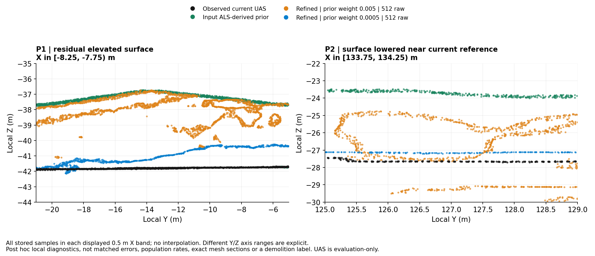
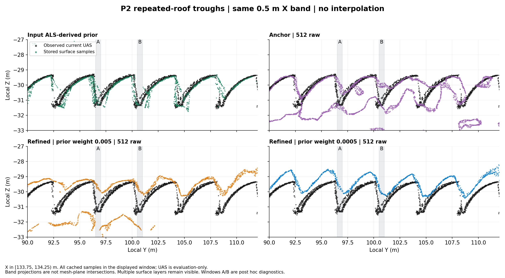

# P1·P2의 변화 반영 차이, P2 골, DA3와 수정 마스크의 원인 검토

2026-09-10 · PHD-GEOGS-CAUSAL-FOLLOWUP-v1 · scientific_verdict: null

## 1. 질문과 이번 답변의 기준

사용자가 비교한 것은 **P2에서는 지붕의 큰 변화가 반영됐는데 비슷한 수정 요구가 있는 P1에서는 왜 낡은 꺾쇠형 윤곽이 남는가**이다. 앞선 답변은 P2의 골 보존 문제를 이 비교의 중심으로 옮겼다. 이번에는 다음 세 대상을 분리한다.

1. P1: 높은 기존 형상이 낮은 현재 바닥으로 충분히 수정되지 않는 부분.
2. P2: 높은 기존 지붕이 낮은 현재 지붕 쪽으로 수정되는 성공 부분.
3. P2: 그 성공과 함께 남는 반복 지붕 골의 국소 형상 차이.

**이번에는 입력 감독부터 학습된 합성 깊이·최종 표면까지의 대응을 확인했다.** P1에서 DA3는 prior보다 현재 바닥 쪽이지만 정확한 현재 깊이에는 못 미친다. prior를 약화하면 같은 DA3 입력에서도 현재 바닥 쪽으로 이동한다. P2 변화부에서도 DA3가 현재 방향을 지지하며, 일부 시선에서는 현재 깊이에 더 가깝다. P2 골에서는 DA3와 최종 합성 깊이가 현재 골보다 얕은 방향에 있지만, 가림·픽셀 규약·복수 표면을 분리하지 않았으므로 DA3를 단독 원인으로 확정하지 않는다. 직접 제어 대비로 뒷받침한 영향은 prior 깊이 가중치 변경이다.

새 학습·DA3 추론·장면 렌더·메쉬 추출·정합·새 거리 질의는 하지 않았다. 기존 표본의 그림, 기존 학습 깊이 TIFF·입력 NPY의 조회, 봉인 trace의 재확인만 수행했다. 진행 중 다른 학습·서비스·기존 산출물은 변경하지 않았다.

## 2. P1과 P2의 큰 변화 반영을 같은 제어에서 비교

검정은 현재 UAS, 초록은 prior, 주황은 .005 native, 파랑은 .0005 native다. 같은 512 raw 메쉬의 원 표면 표본을 사용했다. 지역별 표시 범위는 다르며 축에 명시했다.

- **P1:** .005는 prior의 높은 꺾쇠 윤곽을 상당 부분 남긴다. .0005는 크게 낮추지만 Y≈−11…−5m에서 현재 바닥보다 약 1–1.5m 높은 부분이 남는다. “전혀 바뀌지 않는다”보다 “수정은 되지만 충분하지 않다”가 정확하다.
- **P2:** .0005는 prior 약 −23.7m의 높은 면을 약 −27.13m까지 내려 현재 UAS 약 −27.65m 부근으로 옮긴다. 이 구간에도 약 0.53m 차이는 남지만 큰 형상 수정은 실현됐다. .005에서는 높은 별도 면이 함께 남는다.
- 따라서 P2의 완화 조건과 P1의 원설정만 비교해 지역 차이로 해석하지 않는다. 각 지역의 .005와 .0005를 모두 보아야 한다.

[원 표본](analysis/change_samples.csv) · [전체 Y구간 통계](analysis/change_bins.csv) · [12개 원파일 SHA·동일 참조·512 계보](analysis/change_receipt.json).

폭 0.5m 띠의 표본 투영이며 정확한 메쉬–평면 교선이나 동일 표면의 대응점 오차가 아니다. 실제 변화의 원인이 철거인지 원 prior 오류인지 이번에 확정하지 않는다.

## 3. P2 깊은 골이 얕아진다는 근거

모든 패널에서 검정이 같은 현재 UAS다. 좌상 prior는 여러 깊은 골 부근에 표본이 있고, 우하 .0005 최종 메쉬는 검정의 급격한 하강을 충분히 따르지 못한다. 골의 위치·높이·곡률이 달라지므로 전체 외형이 정돈됐다는 관찰과 구분한다.

| 사후 진단 창 | UAS Z 중앙값 | prior Z 중앙값 | .0005 final512 Z 중앙값 | 최종–UAS 중앙값 차이 |
|---|---:|---:|---:|---:|
| A: X=[133.75,134.25), Y=[96.5,97.0) | −31.215m (77점) | −30.952m (38점) | −29.612m (30점) | +1.603m |
| B: 같은 X, Y=[100.5,101.0) | −31.168m (71점) | −31.265m (13점) | −30.076m (37점) | +1.092m |

공통 표시 Z는 [−33,−27)m다. A의 .0005 표본 최저값도 −29.949m여서, 이 띠의 현재 골 약 −31.2m까지 내려오지 않는다. 수치는 선택된 같은 XY 띠의 표본 분포 차이이며, 대응점 RMSE나 건물 전체 정확도 점수가 아니다.

**앞선 해석을 좁혀야 할 점:** anchor 메쉬에도 이미 얕은 상부층과 낮은 별도 층이 섞여 있다. 따라서 “anchor까지 정확한 골이 보존되다가 refinement에서만 처음 손실됐다”는 주장은 지지되지 않는다. DA3는 anchor의 손실에 사용되지 않으므로 anchor 단계 산출물의 이 잔여를 DA3의 유일한 결과로 설명할 수 없다. .005의 하부 별도 면을 골 복구라고 세어서도 안 된다.

[두 골 확대 중첩](figures/valley_zooms.png) · [창별 통계](analysis/valley_windows.csv) · [모든 Y bin](analysis/valley_bins.csv) · [표시한 원 표본과 ID](analysis/valley_samples.csv) · [영수증](analysis/valley_receipt.json).

## 4. refinement 문제이면 DA3 문제인가

**refinement는 DA3 단독 단계가 아니다.** 실제로 RGB, prior 깊이, DA3 깊이, 법선 제약, Gaussian 변수 보호와 개수 변경이 함께 작동한다. 실제 설정의 distortion 가중치는 0이며, 단순히 공식 코드에 regularizer가 있다는 이유로 활성이라고 쓰지 않는다. DA3 confidence 기능도 존재하지만 해당 native 실행에는 활성 인자가 없었다.

### 같은 입력·같은 기록된 DA3 가중치에서 prior만 약화한 대비

기존 control summary가 봉인한 trace와 train receipt를 SHA로 다시 대조했다. 아래는 각 조건 8,100–30,000회의 100회 간격 220개 기록이다.

| 지역·native 조건 쌍 | 입력 manifest | DA3 가중치 | 보호 Gaussian 수 | prior 깊이 가중치 |
|---|---|---|---:|---|
| P1 .005 / .0005 | 같은 SHA | 모두 .05 | 모두 236,015 | .005 / .0005 |
| P2 .005 / .0005 | 같은 SHA | 모두 .05 | 모두 114,521 | .005 / .0005 |

따라서 이 대비의 결과 차이를 **DA3 입력 교체나 관측된 DA3 가중치 감쇠** 때문이라고 설명할 수 없다. P1 높은 형상의 감소에는 prior 깊이 제약을 약화한 영향이 있음을 뒷받침한다. 이것은 DA3가 정확하다는 뜻, 보호된 각 Gaussian이 같은 실제 표면을 나타냈다는 뜻, prior가 유일 원인이라는 뜻은 아니다. 국소 gradient·가시성·opacity는 이 trace에 없다.

[실제 재검사 결과](analysis/control_audit/receipt.json) · [코드](../../../../scripts/phd/geogs_causal_followup_v1/control_audit.py) · [설정](../../../../configs/phd/geogs_causal_followup_v1/control_audit.json).

### 실제 학습 시선의 입력→anchor→최종 깊이

[DA3 상세 감사](DA3_INPUT_AUDIT_ko_v1.md)의 규약 보완 결과를 사용한다. 아래는 **camera-Z 단위 m**이며 각 행 내에서 같은 영상 배열 픽셀을 읽었다. 큰 값은 카메라에서 더 멀리 있는 깊이다.

| 진단 시선 | 해당 UAS 점의 camera-Z | prior | DA3 | anchor | final .005 | final .0005 | final D0 release |
|---|---:|---:|---:|---:|---:|---:|---:|
| P1 바닥 / train0100, (819,478) | 74.671 | 69.974 | 72.093 | 70.057 | 70.453 | 72.927 | 73.168 |
| P2 큰 변화 / train0144, (995,442) | 60.404 | 56.104 | 58.389 | 56.043 | 58.233 | 58.777 | 58.558 |
| P2 큰 변화 / train0145, (1007,594) | 60.217 | 55.800 | 58.359 | 55.834 | 57.724 | 58.378 | 58.335 |
| P2 큰 변화 / train0110, (1043,500) | 60.461 | 56.946 | 59.731 | 56.357 | 58.401 | 59.761 | 59.795 |
| P2 골 / train0147, (844,469) | 63.939 | 62.910 | 62.047 | 63.204 | 62.533 | 62.470 | 62.401 |

이 표는 입력·단계에 따른 깊이 차이를 보여주기 위한 선택 행이다. 선택한 3개 위치×화면 내 투영 후보 3카메라×6소스 **54행 전체**와 카메라 선택 규칙은 [규약 보완 CSV](analysis/da3_convention_corrected_v2/da3_probe_depths.csv), [JSON](analysis/da3_convention_corrected_v2/da3_evidence.json)에 보존했다. 결과를 보고 유리한 카메라만 계산한 것이 아니다. 카메라는 대상점을 화면 안에 포함한 train 중 하향 시선 성분이 큰 순으로 선정한 사후 진단이며 실제 가시성을 보장하지 않는다.

관찰과 추론을 다음처럼 나눈다.

- **P1 관찰:** train0100의 지정 픽셀에는 열린 포장바닥이 보인다. prior는 현재 참조보다 4.697m 얕고, DA3도 2.578m 얕다. 원설정 합성 깊이는 prior 가까이에 남고, prior를 약화하면 2.474m 깊어진다. **우리 추론:** 부정확한 현재 깊이 감독과 오래된 구조의 제약이 함께 잔여를 만드는 설명이 유력해졌다. 정확한 gradient별 원인 기여율은 미확인이다.
- **P2 큰 변화 관찰:** 세 시선에서 DA3는 prior보다 현재 방향이다. train0110에서는 현재 참조와 차이가 .730m이고, .0005 결과도 .701m 차이까지 이동한다. 다른 두 시선의 .0005 최종 깊이에는 약 1.6–1.8m 차이가 남는다. P2의 성공은 모든 시선에서 정확한 깊이를 회복했다는 뜻이 아니다.
- **P2 골 관찰:** train0147에서 DA3는 anchor보다 얕고, 최종 합성 깊이도 anchor보다 .67–.80m 얕아진다. 다른 선정 시선에서도 같은 방향이 관찰된다. **우리 추론:** 잔여가 TSDF 이후에만 처음 생긴다는 설명은 약해지고, 입력 감독과 합성 깊이 형성도 조사해야 한다. 다만 골/수직면 경계에서 UAS 최저점의 직접 가시성은 확정되지 않았다.
- **P1 다른 두 시선:** 지정 바닥의 화면 투영 위치에는 전경 지붕이 있으며, 입력·GS가 그 앞면을 나타낸다. 해당 표의 큰 바닥 대비 깊이차를 DA3의 40m 오류로 해석하지 않는다. 화면 안에 투영되는 것과 실제로 보이는 것은 다르다. 이 관찰을 P1의 전체 유효 관측 수로 확대하지 않는다.

### 깊이 비교의 중요한 제한

1. prior는 camera-Z지만 Open3D ray의 픽셀 중심이 u+0.5,v+0.5이고, GS는 정수 u,v를 사용한다. 같은 배열 인덱스가 정확히 동일 ray라는 뜻은 아니다. 특히 골 경계에서는 차이가 중요하다.
2. 실제 저장 GS `surf_depth`는 depth_ratio=0의 **alpha로 정규화된 expected depth**다. 여러 Gaussian의 합성값이며 물리적 첫 표면 깊이 또는 Gaussian 좌표 그 자체가 아니다.
3. 동일 train 사진의 원 JPG와 저장 gt PNG가 픽셀 단위로 같은지 검사해 사진 번호와 depth TIFF의 대응을 확인했다. normalized PNG를 metric 깊이로 사용하지 않았다.
4. UAS는 진단·평가용 목표점이며 학습·정합·마스크 생성에 사용하지 않았다. 정확한 해당 시선의 first-hit visibility는 raycast로 새로 검증하지 않았다.
5. 서로 다른 배치의 DA3 값 차이를 scale 하나의 오류로 귀속할 수 없다. 기존 API 감사에서는 wrapper의 척도 역수 오류가 확인되지 않았고, 내부 척도 인자·교체 전 예측 pose 일부는 당시 미저장이다.
6. 같은 XY 단면 메쉬와 한 시선의 합성 깊이는 같은 측정량이 아니다. 위 깊이값을 TSDF 표면 높이로 복사하지 않는다.

이 범위에서 “refinement 오류=DA3 오류”, “TSDF만 고치면 된다”, “보호 mask가 유일 원인”은 모두 근거보다 강하다.

## 5. GeoGS에 유지·수정 제어가 없는가

GeoGS에는 **prior와 가까운 Gaussian을 보호하는 mask**가 이미 있다. 공식 코드의 stage 전환에서 prior 점과 거리 <.2m인 대상을 정하고 위치·회전·크기 gradient를 .01배로 감쇠하며 clone/split/prune를 제한한다. 이후 현재 관측으로 그 prior가 맞는지 재판정하는 제어는 아니다.

따라서 현재 확인한 설계 차이는 다음과 같다.

- 이미 있는 것: prior 근접성에 근거한 구조 보호, prior/RGB/DA3 감독과 가중치, 허용된 Gaussian의 변경.
- 아직 구분되지 않은 것: 현재 증거가 특정 구조의 유지·수정·추가·삭제를 얼마나 지지하는지에 따른 감독과 변수별 제어.
- 보존 수의 한계: 보호 Gaussian 수나 위치가 같아도 SH·opacity·주변 Gaussian·합성 깊이·추출이 바뀌면 최종 표면은 달라질 수 있다.

[공식 소스·실제 실행·선행연구 상세](MASK_DESIGN_AUDIT_ko_v1.md). 위 동작은 가능한 오류 경로를 설명하지만 해당 P1 Gaussian이 실제로 그 이유로 남았다는 추적은 아직 아니다.

## 6. 업데이트 마스크는 합리적인 후보인가

**후보로 검토할 가치가 있다. 다만 이진 영역 mask 하나로 전부 고정/해제하기 전에 무엇을 제어할지 정해야 한다.**

| 제어할 대상 | 사용자 기대와의 연결 | 피해야 할 실패 |
|---|---|---|
| prior 깊이 손실 | 틀린 구조로 당기는 힘을 국소적으로 줄임 | 기하만 풀고 잘못된 prior 감독을 계속 남김 |
| DA3 깊이 손실 | 현재 영상 유래 깊이가 불확실한 부분의 영향 제한 | DA3를 껐다는 이유로 맞는 형상이 자동 생성된다고 기대 |
| 위치·방향·크기 | 유효한 큰 구조는 유지하며 필요한 변형 허용 | 구조가 맞는 영역에 필요한 미세 형상 보완까지 금지 |
| 외관·opacity | 현재 외관 복원과 불필요한 표면 기여 감소 | 전역 고정으로 외관 갱신 차단, 또는 외관으로만 오류 형상 설명 |
| 생성·분할·삭제 | 결손·새 세부 생성과 불필요한 구조 제거 | 이동만 허용하고 생성·삭제를 막아 복원 요구 미충족 |

같은 면에서도 큰 위치는 맞고 세부가 부족할 수 있다. “정확한 영역=모든 변수 고정”으로 나누면 이 두 요구가 충돌한다. 사용자의 알고리즘 의도를 유지하려면 **현재 관측으로 지지되는 수정의 종류·방향·강도를 제한한다**는 설계가 더 정확하다. 오류 원인의 이름을 반드시 먼저 분류하거나 매 영역의 소스를 하나만 고를 필요는 없다.

가장 가까운 선행 해결책도 이미 있다. [CL-Splats §3·§9.2](https://arxiv.org/html/2506.21117v2)는 변경 mask와 국소 갱신·비변경 보존, mask 과소검출의 얇은 구조 실패를 다룬다. [GaussianUpdate §3.2·§4.3](https://arxiv.org/html/2508.08867v1)는 외관·기하 갱신을 나누고 mask가 없으면 사라진 물체의 차이가 외관으로 흡수될 수 있는 ablation을 제시한다. **업데이트 개념·마스크 자체의 추가는 신규성 근거가 아니다.** 두 연구의 기존 색 있는 GS와 우리 무색/이종 prior 및 이미 현재 영상에 맞춘 anchor는 입력 가정이 다르므로 단순 이식의 성공·실패를 확인해야 한다.

## 7. 다음 원인 검증과 기각 조건

새 실험을 이번 범위에서 시작하지 않았다. 다음 순서는 이번 관찰에서 도출한 설계·검증 후보이며 실행 승인이나 학위 기여 확정이 아니다.

1. **P1과 P2 큰 변화부의 실제 관측 차이부터 좁힌다.** 지금의 3개 후보 시선 밖에서도 current surface의 가시성·입력 깊이·photo consistency를 추적한다. 동일 위치의 가림·정합·batch 민감도를 분리한다.
2. **P2 골의 형상/합성깊이 차이를 구분한다.** prior→초기점→anchor의 복수 면 발생, 보호 membership, opacity, 기대 깊이 합성과 추출의 경로를 연결한다. 기대 깊이가 얕아진 것을 곧 Gaussian 위치 이동으로 해석하지 않는다.
3. **수정 권한이 병목이라는 근거가 있으면 작은 비교로 시험한다.** 같은 입력·anchor에서 전역 가중치/전역 보호 해제, 감독만 국소 조절, 기하·생성삭제만 국소 조절, 필요한 조합을 비교한다. 정답 영역을 사용하는 진단은 달성 가능한 효과의 상한이며 배포 방법 결과가 아니다.
4. **P1 수정·P2 큰 변화·P2 골·P3 성공 구조를 함께 평가한다.** 변경 면의 개선과 유지 면의 손상, 신규 세부, 외관, raw/post를 분리한다. P2 큰 형상 성공을 되돌리거나 P3 측벽 보완을 잃으면 개선으로 단순 요약하지 않는다.
5. **기존 대안을 포함해 기각한다.** 입력 깊이 보정·confidence·기존 가중치·추출 설정으로 해결되면 별도 업데이트법의 필요성이 낮아진다. 이상적인 mask에서도 개선되지 않으면 영역 선택이 핵심 병목이라는 가설을 접는다. 실제 mask가 변경을 놓치면 정답 mask의 효과로 신규성을 대신하지 않는다.

## 8. 자료와 실행 기록

- [DA3·저장 깊이 감사](DA3_INPUT_AUDIT_ko_v1.md)
- [보호·수정 mask 감사](MASK_DESIGN_AUDIT_ko_v1.md)
- [valley receipt](analysis/valley_receipt.json), [change receipt](analysis/change_receipt.json), [control receipt](analysis/control_audit/receipt.json), [depth trace receipt v2](analysis/da3_convention_corrected_v2/da3_evidence.json)
- 그림/분석의 script와 config는 신규 scripts/phd/geogs_causal_followup_v1 및 configs/phd/geogs_causal_followup_v1에 있다. 각 원자료는 읽기 전용 Docker에서 처리했고 입력 SHA와 출력 계보를 기록했다.
- 첫 깊이 조회 결과를 지우지 않고 규약 보완 v2를 별도 저장했다. 본 문서의 깊이 해석은 v2를 따른다.
- 결과의 상세 제한·실행 중 예외는 [이슈 기록](ISSUES_ko_v1.md)에 남긴다. scientific_verdict는 null이다.
