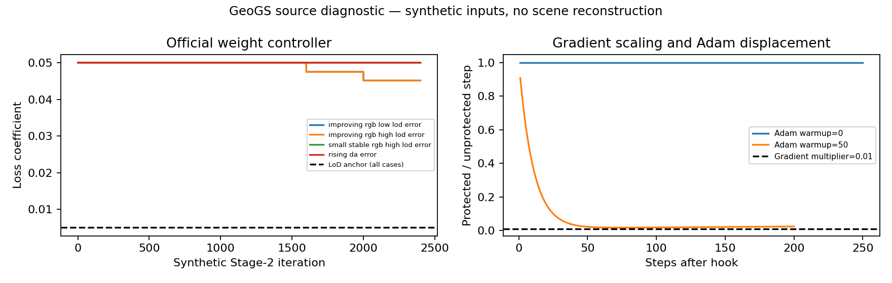

# GeoGS 중심 기여 탐색 — 원코드 진단과 선행 해결 범위

> 2026-09-07 · `PHD-GEOGS-CONTRIBUTION-v1` · 비확증 기술 진단 · `scientific_verdict: null`
> 사용자의 “진행해보자”에 따른 기여 탐색. 목적을 변경하지 않는다. GeoGS는 **기여 탐색의 중심 비교 논문**이며, 우리 전체 조건에서 최고 성능이 검증된 SOTA라는 뜻은 아니다. 기존 E1–E6 계약·Wu 결과를 재정의하지 않는다.

## 1. 이번에 구체화한 결론

**기여 후보의 초점은 ‘prior를 추가한다’에서 ‘기존 오류 배제 후 남은 선택 오류가 구조 보호와 재구성에 어떻게 이어지는가’로 좁혀졌다.** 이 문제가 실제로 남는지는 아직 검증하지 않았다. 단순한 오류 제거 후 GeoGS 연결로 해결된다면 그것을 넘어서는 방법 기여를 주장할 수 없다.

GeoGS의 전체 구조·관측 세부·외관 복원 목표는 우리의 목표와 직접 겹친다. 다만 공식 구현의 구조 보호는 LoD2의 현재 적합성을 검정하는 장치가 아니다. 이 구분을 원코드의 실제 동작으로 확인했다. **구조 보호의 존재와 올바른 구조를 보호한다는 판단은 서로 다른 검증 대상이다.**

이번 실행은 공식 코드 일부의 CPU 제어 진단이다. 실제 장면 학습·렌더·표면 추출은 각각 **0회**다. P1/P2/P3의 GeoGS 성능, 기존 조합의 실패, 우리의 우위는 아직 결과가 없다. 이전 Wu 원문 기반 구현의 결과를 GeoGS의 성능으로 옮기지 않는다.

## 2. 원문과 코드의 확인 범위

- [GeoGS 출판사 초록](https://www.sciencedirect.com/science/article/pii/S0924271626003588), [고정 공식 구현](https://github.com/zqlin0521/GeoGS/tree/db40c95c657ec03ff21c83cb99cf39f4e90247a6)을 확인했다. 커밋은 `db40c95c657ec03ff21c83cb99cf39f4e90247a6`이다.
- 전문 공개 경로: ScienceDirect HTML/PDF 403, Elsevier FULL 응답 401, KIT 다운로드 URL 없음, TUM 기록은 DOI 연결. 공식 저장소에 전문 없음. 접근 영수증을 외부 패키지 `sources/fulltext_access/`에 보존했다.
- 따라서 **저자가 본문에서 시간차·잡음 실험을 하지 않았다고 확정할 수 없다.** 실제 비교표와 Discussion/Future work를 읽었다고 표시하지 않는다. 아래는 고정 공식 구현의 동작이다.
- 재현 입력은 정합된 LoD2 mesh·영상/pose·LoD2 깊이·DA3 깊이이며, 원 ALS 점군을 그대로 받는 방식이 아니다. ALS에서 만든 표면/깊이를 넣는 실험은 **입력 변경 실험**으로 별도 명명해야 한다.

| 공식 코드의 확인 내용 | 코드 근거 | 해석 경계 |
|---|---|---|
| Stage1 LoD2 계수 0.08, Stage2 0.005 유지 | [train.py:873](https://github.com/zqlin0521/GeoGS/blob/db40c95c657ec03ff21c83cb99cf39f4e90247a6/train.py#L873) | 적응 제어가 LoD2 계수를 계속 줄이는 구조가 아님 |
| 적응 제어는 DA3 깊이 손실 추세와 RGB 손실 추세를 검사하고 DA3 계수를 감쇠/고정 | [train.py:879](https://github.com/zqlin0521/GeoGS/blob/db40c95c657ec03ff21c83cb99cf39f4e90247a6/train.py#L879) | LoD2의 현재성·정확성을 판정하는 기능으로 부를 수 없음 |
| 기본 8000회 갱신 뒤 LoD2 점군까지 거리 <0.2m로 보호 마스크를 한 번 생성 | [train.py:368](https://github.com/zqlin0521/GeoGS/blob/db40c95c657ec03ff21c83cb99cf39f4e90247a6/train.py#L368), [1081](https://github.com/zqlin0521/GeoGS/blob/db40c95c657ec03ff21c83cb99cf39f4e90247a6/train.py#L1081) | 가까움이 현재 유효성을 증명하지 않음. 생성 뒤 현재성 재판정 루프는 기본 경로에 없음 |
| 보호 Gaussian의 clone/split/prune 제외, 위치·회전·크기 gradient 감쇠 | [gaussian_model.py:372](https://github.com/zqlin0521/GeoGS/blob/db40c95c657ec03ff21c83cb99cf39f4e90247a6/scene/gaussian_model.py#L372), [train.py:603](https://github.com/zqlin0521/GeoGS/blob/db40c95c657ec03ff21c83cb99cf39f4e90247a6/train.py#L603) | SH·opacity 최적화와 비영 위치 갱신은 계속된다. 낡은 구조가 반드시 보이거나 수정 불가능하다고 단정할 수 없음 |
| LoD2 깊이는 유한·양수 마스크의 L1 감독. 선택적 confidence는 DA3에 적용 | [train.py:278](https://github.com/zqlin0521/GeoGS/blob/db40c95c657ec03ff21c83cb99cf39f4e90247a6/train.py#L278), [806](https://github.com/zqlin0521/GeoGS/blob/db40c95c657ec03ff21c83cb99cf39f4e90247a6/train.py#L806) | 기존 자산의 오류 배제와 감독 가중을 구분해야 함 |

## 3. 실제 실행한 진단

[실행 스크립트](../../../../scripts/phd/geogs_contribution_v1/probe.py)와 [설정](../../../../configs/phd/geogs_contribution_v1/probe_v1.json)으로 공식 `train.py`의 AST 노드를 **수정 없이 추출·실행**했다. 원본 SHA-256을 검사했다. 모델 학습 의존 모듈을 흉내 낸 대체 알고리즘이 아니라 해당 제어 코드의 계산만 실행하며, 장면 재구성의 다른 단계는 실행하지 않는다.

### 3.1 적응 제어의 대상

Stage2를 가정한 2,400회의 **합성 손실 시계열**을 제공했다. 공식 기본 window·threshold·가중치를 사용했다. 표의 LoD2 잔차는 **렌더 깊이와 prior 깊이의 불일치**이며, 독립 참조로 측정한 prior의 실제 오류가 아니다.

| 합성 입력 | 최종 DA3 계수 | 최종 LoD2 계수 | 관찰 |
|---|---:|---:|---|
| RGB 개선, LoD2 잔차 0.1 | 0.045125 | 0.005 | DA3 가중 감소 |
| 동일 RGB·DA3 시계열, LoD2 잔차 10 | 0.045125 | 0.005 | LoD2 잔차 변화가 gate 결정에 영향을 주지 않음 |
| 작고 일정한 RGB 잔차 0.001, LoD2 잔차 10 | 0.05 | 0.005 | 작은 절대 RGB 잔차가 감쇠를 유발하지 않음 |
| 수렴 후 DA3 깊이 손실 증가 | 0.05 | 0.005 | DA3 가중을 현재값에 고정 |

근접도 함수에 prior 높이 10, Gaussian 높이 10/12/10.1의 합성 좌표를 주면 보호 마스크는 `[true, false, true]`다. 이 함수에는 현재 시점 참조나 prior 유효성 입력이 없다. **이 결과만으로 실제 GeoGS의 잘못된 보존을 입증한 것은 아니다.**

### 3.2 보호 계수의 구현 의미

공식 hook은 gradient에 0.01을 곱하며 Adam의 파라미터별 learning rate를 0.01배로 바꾸는 코드가 아니다. 같은 합성 선형 gradient를 받는 두 파라미터를 비교했다(공식과 같은 Adam `eps=1e-15`, 합성 LR=0.001).

- 초기 상태부터 hook 적용: gradient 비율은 0.01이나, 실제 한 step 이동량 비율은 약 **1.0**이었다.
- Adam 50회 후 hook 적용: 첫 이동량 비율 **0.909728**, 이후 200회가 지난 마지막 비율 **0.023532**였다.

따라서 ‘보호 대상은 실제로 1/100만 이동한다’고 설명하면 안 된다. 효과는 Adam의 누적 상태·gradient 변화에 의존한다. 이는 **구현 의미의 진단**이며 실제 장면에서 보호 실패가 입증됐다는 뜻은 아니다. 이 차이를 수정하는 일만으로 연구의 주 기여를 삼지 않는다.

왼쪽의 낮은/높은 LoD2 잔차 곡선은 정확히 겹친다. 오른쪽은 실제 파라미터 이동량이며, 합성 입력을 사용한 국소 진단이다. [벡터 그림](figures/control_diagnostic.svg)

## 4. 이미 해결된 부분을 제외한 기여 후보

| 주장 | 선행 해결 | 현재 판정 |
|---|---|---|
| 잘못된 prior를 버리고 현재 기하를 복원 | **SRDM §3.2.3**은 약한 LiDAR 유도 stereo와 2px 이상 불일치 prior를 제거하고, §3.2.4 식22는 잔여 prior 비용도 절단한다. 실제 시간차·경계 blunder·가림을 검사했다 | 이 기능 자체를 새 기여로 채택하지 않음 |
| ALS로 영상의 잡음·결손 보완 | **SRDM §4.3**의 지붕·그림자·반복 텍스처 복원, **Zhou §3.1–3.2**의 LiDAR 유도 및 변화 영역 image-only 재매칭 | 현재 목표와 이미 겹침. 새 이름이나 GS 연결만으로 기여 확정 불가 |
| 정합·LiDAR 잡음에 강함 | SRDM의 정합, Zhou의 탐색 구간, **ARSGaussian §3.2·§4.2.5**의 정합·잡음·결손 평가 | ‘기존 방법은 오류를 무시’라는 공백 기각 |
| 유효 prior의 잘못된 배제 또는 부적합 prior의 잔존이 이후 구조 보호로 이어짐 | 기존 방법은 이미 오류 배제와 강한 재구성을 각각 제공 | **우선 검증 후보.** 강한 기존 처리를 거친 뒤에도 남는지, 결과가 진단과 일치하는지 확인해야 함 |

원문: [SRDM](https://cpb-us-w2.wpmucdn.com/u.osu.edu/dist/4/28638/files/2018/07/LiDAR_and_Image_paper-V3_close_to_final-28lqxo6.pdf), [Zhou](https://repository.tudelft.nl/file/File_5e70c9f8-1674-49ab-b4a5-fa3085f3dd77), [ARSGaussian](https://arxiv.org/pdf/2412.18380v2).

특히 **Zhou §4.2.3/Table3**은 Assen에서 누락된 12개 건물 중 10개를 두 번째 매칭의 저텍스처·그림자 복원 실패로 설명한다. 이 지점은 논문이 실제 관찰한 한계다. GeoGS를 연결하면 해소되는지, 유효 prior 손실이 남는지가 구체적 비교 질문이다. ‘후처리 없는 MVS–ALS 차이 필터’를 SRDM/Zhou 재현이라고 부르지 않는다.

## 5. 비교를 실행 가능한 조건으로 연결

공식 공개 예제 **963,110,591 bytes**를 Docker에서 다운로드하고 ZIP 내부 목록·카메라 메타데이터를 검사했다. SHA-256은 `572e83a09d9204c26af174f38c184e3cdae45cdb2687549028e640642f7aad44`이며, 저자 배포 체크섬과 대조한 값이 아닌 로컬 바이트 식별자다. RGB 15개, COLMAP pose 15개, LoD2 깊이 15개, DA3 깊이 15개, 보호 점군 1개, 평가 참조 1개가 있다. 영상과 두 종류 깊이의 파일 stem이 일치한다. 압축 전체를 풀거나 깊이·점군·참조 배열을 학습에 읽지 않았다.

원코드의 `--eval` 및 기본 `llffhold=8`을 적용하면 **학습 13뷰/평가 2뷰**다. 이는 코드 기본값에서 유도한 분할이며 저자 실험 영수증은 아니다. 예제에는 실제 실행 인자 기록·DA3 추론 입력 기록·원 LoD2 mesh가 없으므로, 제공된 파생 입력에서 학습을 시작하는 것과 원 전처리 전체를 재현하는 것을 구별한다. 자세한 파일·분할 목록은 외부 패키지 `example_source/input_manifest.json`에 있다.

추가 검사에서 `sparse_lod/0/images.txt`의 15개 카메라 헤더와 `sparse/0/images.bin`의 이미지 집합·회전·이동은 정확히 같았다(최대 차이 0). 따라서 LoD2 초기화 경로에서도 위 기본 분할이 동일하다. 20.3 MB 텍스트의 점 관측행은 해석하지 않았고, 카메라 메타데이터만 스트리밍 확인했다. 원 다운로드 영수증은 보존하고 `example_source/camera_inspection_r2/receipt.json`에 추가 기록했다.

다음 실행의 입력·참조 분리·원 구현 구분·남은 검사를 [기계 판독용 재현 조건](../../../../configs/phd/geogs_contribution_v1/native_example_conditions_v1.json)에 고정했다. 예제는 저자의 local transformed frame이며 ZIP만으로 EPSG 연결을 확인하지 못했다. 이를 자동으로 우리 EPSG:25832 자료에 정합됐다고 취급하지 않는다.

1. **원 GeoGS 예제 실행 조건:** 확보한 15뷰 example과 고정 공식 설정으로 실행 환경·학습·렌더·표면 추출을 확인한다. 원문의 LoD2 입력 성능과 ALS 입력 변경 실험을 구별한다. 공식 예제는 코드 작동·입력 계약 확인용이며 우리의 P1/P2/P3 성능으로 취급하지 않는다.
2. **공통 입력 연결:** SRDM/Zhou의 출력은 점군/깊이이며 GeoGS는 LoD2 표면을 사용한다. 점군→표면/구조 깊이의 전환 방법, 공백·잘못된 면 연결, 해상도를 독립적으로 기록한다. 동일 전환을 모든 해당 arm에 적용한다. 이 전환을 숨긴 ‘원방법 직접 비교’는 만들지 않는다.
3. **최소 비교:** 동일 prior 재구성에 (a) 기존 기본 입력, (b) SRDM 또는 Zhou의 원 처리 결과, (c) 남은 원인에 대한 수정 결과를 공급한다. 먼저 기존 처리에서 남는 실패가 확인되어야 (c)의 변경을 정당화할 수 있다. 조합은 우리가 구성한 비교군이며 발표된 SOTA가 아니다.
4. **지역과 평가:** 이미 고정한 P3에서 유효 자산의 활용을 먼저 개발 확인하고, P1/P2의 변화 사례로 잘못된 유지 여부를 대조한다. 유리한 하위 영역만 사후 선택하지 않는다. 동일 UAS는 평가 전용, 현재 영상 평가 membership은 별도 고정한다. Gaussian 중심·추출 표면·실제 렌더를 분리해서 측정한다.
5. **기여 채택 조건:** 기존 강한 처리+재구성에도 남는 구체적 오배제/오보존을 줄이고, 그 효과가 최종 기하·외관에서 확인돼야 한다. 다른 영역의 손실도 함께 본다. 기존 조합으로 해결되면 해당 기여 후보를 폐기·축소한다.

DA3 전처리의 입력 이미지 전체 목록도 고정해야 한다. 공식 전처리에는 자체 train/eval 필터가 없으므로 평가 이미지가 기하 prior 생성에 사용됐는지 별도로 확인한다. 이것을 확인하기 전 저자의 평가 누출을 단정하지 않는다. 새 전처리에서 visibility 예외 fallback이 발동했는지도 기록한다.

## 6. 산출물·재실행·보존

- 외부 패키지: `../JointBuildGS-artifacts/phase-payloads/phd/geogs_contribution_v1/PHD-GEOGS-CONTRIBUTION-v1/`
- 공식 source snapshot 55파일, commit/SHA manifest; 전문 접근 영수증; 진단 CSV·PNG·SVG·JSON; 공식 예제 ZIP과 입력 목록·분할 메타데이터.
- 실행: `bash scripts/phd/geogs_contribution_v1/run_probe.sh` (Docker CPU, network none). 출력이 이미 있으면 실패하도록 하여 덮어쓰기를 막는다. 재실행 시 새 output_root 설정을 사용한다.
- 실행 전 저장소 6,459파일 hash, 기존 수정·미추적 439파일 별도 archive. 기존 인계문은 원문 전체를 남긴 채 새 상태를 머리에 추가한다. Git stage/commit/push는 수행하지 않는다.
- GeoGS 전문 및 실제 예제 확인 상태는 [이슈 기록](ISSUES_ko_v1.md), 최종 무결성은 [manifest](../../../../artifacts/manifests/phd/geogs_contribution_v1/technical_result_manifest_v1.json)에 기록한다.
