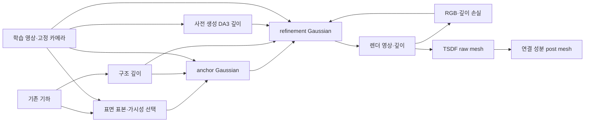

# GeoGS가 실현한 기대와 입력 정보의 최종 복원 전달 감사

2026-09-10 · PHD-GEOGS-EXPECTATION-AUDIT-v1 · 개발 자료의 기술적 분석 · scientific_verdict: null

## 1. 확인 결과

**GeoGS는 큰 구조 유지, 잘못된 형상의 일부 수정, 부족한 면의 보완, 영상 외관 개선을 이미 실현했다. 네 기능 자체를 우리 연구의 신규성으로 삼을 수 없다.** 논문이 각 기능을 같은 부분의 입력→출력 변화로 모두 분리 검증한 것은 아니지만, 그 검증 부족을 곧 방법의 실패로 바꾸어서는 안 된다.

이번에 더 구체적으로 확인한 관계는 **P2에서 큰 불일치는 줄어들지만, prior에 들어 있던 현재 참조와 가까운 반복 지붕 골은 최종 메쉬에서 얕게 남는 것**이다. 해당 높이대의 prior 표본 일부가 실제 초기화 PLY까지 전달된 것도 확인했다. 학습 사진에는 반복 지붕 형상이 보인다. 따라서 단순히 “어느 입력에도 정보가 없었다”로 끝낼 사례는 아니다.

다만 **정보의 일부가 입력에 존재했다는 확인과, 정확한 복원에 충분한 정보가 있었는데 GeoGS의 특정 기제가 이를 막았다는 설명은 다르다.** 골별 초기화 밀도, 해당 시선의 prior/DA3 깊이, 학습된 표면 깊이, TSDF 전달을 아직 연결하지 않았다. 가장 유망한 원인 추적 사례를 확보한 상태이며 새 방법의 필요성·신규성은 미확정이다.

독립적으로, P2의 저장된 raw→post 메쉬에서 현재 참조에 가까운 기하 지원이 일부 사라지는 것은 확인했다. 이 단계는 학습 이후의 연결 성분 필터링이다. 이미 존재하는 raw 산출물을 쓰는 단순 대안부터 검토해야 하므로 박사학위 기여로 바로 승격하지 않는다.

## 2. 범위와 판정 언어

이번 질문은 “정확한 구조는 남고, 틀린 구조는 바뀌고, 부족한 세부는 생기며, 외관은 현재 영상에 맞아진다”의 실현 범위다. 원래 연구질문을 지붕 골 또는 ALS에 한정하는 결정이 아니다. prior는 ALS·LoD2·DSM 등일 수 있고, 시간차는 입력 오차·정합·관측 부족과 함께 검토할 조건이다.

[연구 헌장](../../../research/00_RESEARCH_CHARTER.md), [DEC-P1-025](../../../research/06_DECISION_LOG.md), 기존 필요성·공백·기여 감사·P1/P2/P3 검토·Wu–Vallet 종합은 맥락과 탐색 색인으로 사용했다. 사용자의 현재 지시에 따라 명시적 원인 분류, 소스 선택, 공동 최적화, GS의 필요성을 전제하지 않는다. E1–E6 정본과 기존 문서를 수정하지 않았다.

| 표기 | 의미 |
|---|---|
| 원문 사실 | 논문 또는 공식 구현에서 직접 확인한 설계·표·그림 |
| 저자 해석 | 논문의 원인 설명 또는 제한사항. 별도 인과 검증과 구별 |
| 기존 실행 관찰 | 저장된 우리 입력·학습 결과·단면·평가 배열에서 확인 |
| 우리 추론 | 위 사실로부터 제안한 설명 후보. 원인 확정 아님 |
| 미평가 | 그 효과를 분리하는 비교·측정이 없음 |
| 미확인 | 필요한 자료 연결 또는 직접 검사가 아직 없음 |
| 적용 조건 차이 | 공식 LoD2·희소영상 조건과 ALS 표면화 개발 조건의 차이. 그 자체로 신규성 아님 |

관측 UAS는 평가 전용이다. 실제 표면의 국소 현재성·완전성이 전부 인증된 참조로 확대하지 않는다. 단면은 폭 0.5m 띠의 전체 평가 표본 투영이며, 정확한 삼각형–평면 교선은 아니다. 좌표 판독은 근삿값이다.

## 3. 원문·공식 구현 근거 카드

- 논문: Qilin Zhang, Olaf Wysocki, Boris Jutzi, *GeoGS: Geometric Prior-Guided Gaussian Splatting for robust urban reconstruction from sparse views*, ISPRS JPRS 240 (2026), 184–201.
- [DOI](https://doi.org/10.1016/j.isprsjprs.2026.07.011) · [검토한 최종판 PDF](/home/innopam/.codex/attachments/74f36af2-99b5-411a-93e5-7fa2ce39fe8d/1-s2.0-S0924271626003588-main.pdf).
- PDF SHA256: `21342911a9f5db6aba9be155a1e06cb4d36d7a2e27780235acb111f8e91c28c4`.
- [공식 저장소의 검토 버전](https://github.com/zqlin0521/GeoGS/tree/db40c95c657ec03ff21c83cb99cf39f4e90247a6): `db40c95c657ec03ff21c83cb99cf39f4e90247a6`.
- 아래 페이지는 인쇄 페이지다. PDF 1쪽=인쇄 184쪽. 옛 “전문 미확보·실제 실행 없음”을 현재 상태로 재사용하지 않는다.
- 논문·공식 코드·호환 패치가 있는 로컬 실행·ALS 입력 적응·실제 개발 결과는 서로 다른 근거 계보다. 수치를 혼합하지 않는다.

### 입출력·기여·고정 및 수정 변수

실제 관측은 보정된 RGB 영상이다. LoD2는 외부 구조 prior이며, 구조 깊이는 prior와 카메라로부터 만든 파생 감독이다. DA3는 사전학습 모델에 영상·카메라를 넣어 만든 파생 깊이로, 독립 센서 관측이나 정답이 아니다. 목표 산출물은 새로운 시점 영상과 복원 기하이며 Gaussian 중심과 TSDF 메쉬를 별도로 평가한다.

| 요소 | 기여의 위치 | 고정·수정과 피드백 | 근거 |
|---|---|---|---|
| 입력·전처리 | LoD2를 초기점·구조 깊이로 연결하는 전체 설계의 일부. 표면 표본화·ray casting 자체는 기존 연산 사용 | 원 prior와 선택된 입력 영상은 고정. 가시성 필터로 표본을 선택하므로 원 자산 전체가 초기화로 보존되는 것은 아님 | §3.2–3.3, pp187–188 |
| 좌표·카메라·정합 | 주어진 보정 카메라·정합 prior 사용. 공동 pose 추정의 새 기여 없음 | 렌더 잔차가 Gaussian을 수정하지만 카메라·원 prior 정합을 다시 추정하는 경로는 확인되지 않음 | §3, §6 p200 |
| 표현 | planar 2D Gaussian은 기존 표현 사용 | 중심·방향·크기·opacity·SH 계수 추정. 보호 대상의 일부 기하 자유도와 개체 수 변경을 제한 | §3.1, §3.4 |
| 관측모형·렌더링 | 미분 가능 Gaussian 렌더링 사용 | 현재 영상과 렌더의 차이가 기하·외관에 전달. 렌더 오차 감소와 실제 표면 개선의 일대일 관계를 보장하지 않음 | §3.1, §3.4 |
| 감독·제약 | 구조 깊이+영상 유래 깊이, 구조 보호와 적응 visual-depth 제어가 핵심 제안 | 사전 생성 깊이 값은 재사용. 적응 가중치는 DA3 감독의 영향력을 바꾸며 prior의 현재성·정확성을 직접 판정하지 않음 | §3.3–3.4, Eq13–19, pp188–190 |
| 초기화·최적화·모델 변경 | prior anchor→보호를 동반한 정제 설계 | 영상은 처음부터 사용. refinement가 anchor에서 시작한 Gaussian을 수정할 수 있음. 보호는 위치·회전·크기 gradient 감쇠와 clone/split/prune 제한이며 모든 속성의 완전 고정이 아님 | §3.4, Table6; train.py |
| 추출·후처리 | TSDF 및 연결 성분 필터링 사용. 추출 자체의 새 기여 확인 안 됨 | 학습된 렌더 깊이→raw 메쉬→post 메쉬. 추출 오차를 학습으로 되돌리는 경로 확인 안 됨 | §4.2; render.py; utils/mesh_utils.py |

“새 기여”는 저자가 제안한 전체 설계에서의 위치이며 각 연산이 문헌 최초임을 인증한 말이 아니다. 초기화→anchor→정제라는 단계가 있어도, 후단 영상이 앞단에서 얻은 Gaussian을 바꿀 수 있으므로 이를 단순 단방향 재구성으로 분류하지 않는다.

공식 구현 근거: [기하 gradient hook](https://github.com/zqlin0521/GeoGS/blob/db40c95c657ec03ff21c83cb99cf39f4e90247a6/train.py#L603), [기본 prior 깊이 계수](https://github.com/zqlin0521/GeoGS/blob/db40c95c657ec03ff21c83cb99cf39f4e90247a6/train.py#L1267), [Gaussian 개체 수 제어](https://github.com/zqlin0521/GeoGS/blob/db40c95c657ec03ff21c83cb99cf39f4e90247a6/scene/gaussian_model.py#L396), [메쉬 후처리](https://github.com/zqlin0521/GeoGS/blob/db40c95c657ec03ff21c83cb99cf39f4e90247a6/utils/mesh_utils.py#L23). Gradient 0.01배를 Adam의 실제 변위 1/100 보장으로 해석하지 않는다. 선택된 제약을 풀면 수정 자유도가 커지지만, 기존 성공 구조의 드리프트·파편·부가면도 가능하므로 결과로 판정해야 한다.

### 네 기대의 실현 범위

| 기대 | 원문에서 이미 입증한 범위 | 우리 기존 실행에서 확인한 성공 | 남은 구분 |
|---|---|---|---|
| 정확한 구조가 남는다 | 건물 규모 면·윤곽 안정. Table6B p198: 보호 제거 시 M3C2 .378→.389m, F1@.5 .788→.775 | P3의 prior와 UAS가 가까운 곡면 지붕이 원설정과 일부 완화 조건에서 유지 | **처음부터 정확한 개별 면의 비열화**는 원문에서 별도 측정하지 않음. P2 골은 국소 잔여 후보 |
| 틀린 구조가 바뀐다 | Table7 p199: 높이 +.25/.5/1m, 수평 .5m, 부분 결손에서도 최종 지표가 비교적 안정. +1m M3C2 .378→.387, F1@.5 .788→.787 | P1 높은 윤곽이 낮아짐. P2 높은 추가 윤곽 감소·상단 위치 개선. 원설정도 큰 불일치를 일부 줄임 | 교란 내성과 **오류 부분의 실제 교정량**은 다름. 실제 철거·증축의 현재화는 분리 미평가 |
| 부족한 세부가 생긴다 | Table6B: DA3 제거 시 PSNR 16.654→15.067, F1@.2 .469→.454. Fig11 p196 창문 등 렌더 세부 개선 | P3 prior에서 부족했던 측벽 범위가 원설정부터 보완 | Fig11 확대창은 Rendered Image임. 창문 홈·돌출의 metric 3D 생성 증거로 바꾸지 않음. P3 면 보완도 미세 형상까지 보장하지 않음 |
| 외관이 현재 영상에 맞아진다 | Tables1–2, Figs7–8·11의 held-out NVS. TUM2TWIN 평균 PSNR은 최상 비교군 대비 +1.13dB | P2 prior 완화의 평가 영상 평균 품질 개선. 일부 시점·세부는 남는 오차 | 영상 분포에 대한 NVS 성공. 모든 표면의 현재성 또는 실제 과거 외관의 업데이트 시험과는 다름 |

원문은 TUM2TWIN·oblique aerial 자료, 희소뷰 조건, LiDAR 기하 참조, 독립 시점 렌더 지표를 사용한다. RGB train/eval을 언급하지만 DA3의 정확한 입력 ID membership은 전문만으로 확인되지 않는다. 이를 저자의 평가 누출로 단정하지 않는다. Table7은 교란 후 초기점·구조 깊이를 다시 만드는 실험으로, 동일 anchor의 refinement 가중치만 바꾼 우리 실행과 다르다.

Table3 p195의 TUM2TWIN R9에서 GeoGS Gaussian 점군 F1@.5=.896, 메쉬=.531, 2DGS 메쉬=.748이며 R6 메쉬 F1@.2는 GeoGS=.364, 2DGS=.448이다. 평균 우위가 모든 지역·표면 정밀도에서의 우위는 아니다. 다만 점군과 메쉬의 표본·표면 정의가 다르므로 숫자 차이를 바로 TSDF의 정보 손상량으로 해석하지 않는다.

§6 p200의 큰 pose/model 오정합, prior 밖 ground·vegetation 등의 덜 완전한 복원은 저자도 기술했다. joint pose refinement·adaptive LoD2 correction은 저자 후속 제안이므로 우리만의 새 발상으로 제시할 수 없다. Table5의 단일 Region1 실행 시간은 체계적인 city-scale 시간·메모리 검증이 아니다.

## 4. P2: 정보가 실제 입력에 들어갔는가

모든 실제 자료는 [PHD-GEOGS-P1P2P3-v1](/media/innopam/InnoPAM-8TB/hwiyoung/code/JointBuildGS-artifacts/phase-payloads/phd/geogs_p1p2p3_v1/PHD-GEOGS-P1P2P3-v1) 아래에 있다. 경로의 LoD 명칭이 입력 센서를 증명하지 않는다. 이 실행은 **ALS_SURFACE_ADAPTATION_WITH_EXPLICIT_CALIBRATION**이며 공식 논문의 LoD2 조건과 구별한다.

| 자료 | 실제 역할·이번 확인 | 이 사실로 말할 수 없는 것 |
|---|---|---|
| ALS 원점·prior 메쉬 | 저장 단면 X=134m, Y≈90–112m에서 반복 골의 낮은 부분이 관측 UAS 근처 local Z≈−31…−32m에 존재 | 모든 prior 표면이 현재·정확하다는 보장 |
| 실제 초기화 | 고정 진단 창 X=[133.75,134.25), Y=[90,112), Z=[−33,−30)m의 52개 원 표면 표본 중 **50개가 가시성 선택을 통과해 실제 trainer PLY에 도달** | 모든 골의 충분한 밀도, 연속 표면 보존, 렌더 깊이 감독에의 기여까지 입증하지 않음 |
| 실제 학습 사진 | P2 57 train/9 eval을 분리. image67·294는 train이며 반복 지붕 형상이 보임 | 같은 골 점의 다중시점 대응·삼각측량 정밀도·깊이 식별성은 미확인 |
| prior 깊이·DA3 깊이 | 입력 manifest상 각각 57개이고 train 이름과 정확히 일치 | 해당 골 픽셀의 깊이가 정확한지는 이번에 읽지 않음. 파일 수 일치는 감독 내용 검증이 아님 |
| MVS 비교군 | historical common-base OpenMVS의 all-view 산출물. 현재 낮은 형상 근거 일부 존재 | 이 prior 초기화 GeoGS의 dense 기하 입력이 아니며 57 train과 동일 정보 조건도 아님 |
| 현재 UAS | 평가 전용 현재 표면 근접 근거 | GeoGS에 제공된 관측이 아님 |
| 평가 image656/index8 | 저장 렌더 오차 비교에 사용 | 사진에 보인다는 사실만으로 해당 표면이 학습에도 충분히 관측됐다고 말하지 않음 |

전체 prior 표본 100,000개 중 93,497개가 유지됐다. retained IDs가 가리킨 좌표와 실제 `scene/sparse_lod/0/points3D.ply`를 직접 대조한 최대 좌표 차이는 **7.63×10⁻⁶m**로 저장 float 정밀도 수준이다. 보호 PLY와 trainer PLY의 SHA도 같다. 단, 이 진단 창의 Y=[106,108), [110,112)m에는 선택한 Z 범위의 원 표본이 0개다. “전체 골의 정보가 충분히 제공됐다”고 확대하면 안 된다.

진단 창은 기존 결과 단면을 보고 정한 **사후 원인 추적 범위**다. 학습 마스크·정답 특징·독립 확인 집합이 아니다. 숫자는 [감사 JSON](analysis/evidence.json)의 `p2_initialization_window`에 저장했다.

원 근거: [ALS 단면](/media/innopam/InnoPAM-8TB/hwiyoung/code/JointBuildGS-artifacts/phase-payloads/phd/geogs_p1p2p3_v1/PHD-GEOGS-P1P2P3-v1/evaluation/viewer/P2/als_points.sections.png), [prior 단면](/media/innopam/InnoPAM-8TB/hwiyoung/code/JointBuildGS-artifacts/phase-payloads/phd/geogs_p1p2p3_v1/PHD-GEOGS-P1P2P3-v1/evaluation/viewer/P2/prior_mesh.sections.png), [anchor512 단면](/media/innopam/InnoPAM-8TB/hwiyoung/code/JointBuildGS-artifacts/phase-payloads/phd/geogs_p1p2p3_v1/PHD-GEOGS-P1P2P3-v1/evaluation/viewer/P2/D005_Pnative.anchor_512.raw.sections.png), [초기화 receipt](/media/innopam/InnoPAM-8TB/hwiyoung/code/JointBuildGS-artifacts/phase-payloads/phd/geogs_p1p2p3_v1/PHD-GEOGS-P1P2P3-v1/inputs/P2/initialization/receipt.json), [실제 학습 사진294](/media/innopam/InnoPAM-8TB/hwiyoung/code/JointBuildGS-artifacts/phase-payloads/phd/geogs_p1p2p3_v1/PHD-GEOGS-P1P2P3-v1/inputs/P2/scene/images/DJI_20241217091125_0105_D.JPG), [학습/평가 split](/media/innopam/InnoPAM-8TB/hwiyoung/code/JointBuildGS-artifacts/phase-payloads/phd/geogs_p1p2p3_v1/PHD-GEOGS-P1P2P3-v1/inputs/P2/scene/split_manifest_da3_v2.json).

## 5. P2: 전달되지 않은 결과와 아직 모르는 원인

**관찰:** prior와 anchor 단면에는 현재 참조의 깊은 골 부근 표본이 있지만 final512에서는 여러 골이 얕게 연결된다. 기존 6개 제어 조건을 모두 직접 확인했으며, 시험한 prior 깊이·보호 제어만으로 충분한 골 복구가 확인된 조건은 없다.

| 기존 final512 raw 조건 | 반복 골 X=134m, Y≈90–112m의 관찰 |
|---|---|
| [D005_Pnative](/media/innopam/InnoPAM-8TB/hwiyoung/code/JointBuildGS-artifacts/phase-payloads/phd/geogs_p1p2p3_v1/PHD-GEOGS-P1P2P3-v1/evaluation/viewer/P2/D005_Pnative.mesh_512.raw.sections.png) | 여러 골이 현재 UAS보다 얕게 이어짐 |
| [D0005_Pnative](/media/innopam/InnoPAM-8TB/hwiyoung/code/JointBuildGS-artifacts/phase-payloads/phd/geogs_p1p2p3_v1/PHD-GEOGS-P1P2P3-v1/evaluation/viewer/P2/D0005_Pnative.mesh_512.raw.sections.png) | 큰 상단·추가 윤곽 개선과 얕은 골의 잔여가 공존 |
| [D0_Pnative](/media/innopam/InnoPAM-8TB/hwiyoung/code/JointBuildGS-artifacts/phase-payloads/phd/geogs_p1p2p3_v1/PHD-GEOGS-P1P2P3-v1/evaluation/viewer/P2/D0_Pnative.mesh_512.raw.sections.png) | 주요 연속 윤곽이 깊은 골보다 높게 이어짐 |
| [D005_Prelease](/media/innopam/InnoPAM-8TB/hwiyoung/code/JointBuildGS-artifacts/phase-payloads/phd/geogs_p1p2p3_v1/PHD-GEOGS-P1P2P3-v1/evaluation/viewer/P2/D005_Prelease.mesh_512.raw.sections.png) | 얕은 골 잔여. 아래 일부 파편은 정확한 연속 골 복구 근거로 부족 |
| [D0005_Prelease](/media/innopam/InnoPAM-8TB/hwiyoung/code/JointBuildGS-artifacts/phase-payloads/phd/geogs_p1p2p3_v1/PHD-GEOGS-P1P2P3-v1/evaluation/viewer/P2/D0005_Prelease.mesh_512.raw.sections.png) | 얕은 골 잔여 |
| [D0_Prelease](/media/innopam/InnoPAM-8TB/hwiyoung/code/JointBuildGS-artifacts/phase-payloads/phd/geogs_p1p2p3_v1/PHD-GEOGS-P1P2P3-v1/evaluation/viewer/P2/D0_Prelease.mesh_512.raw.sections.png) | 깊은 골을 충분히 따라가지 못하는 윤곽 잔여 |

이것은 여섯 단면의 정성 비교이며 골별 수치 순위나 독립 반복 검증이 아니다. D0/release에도 prior 초기화·공통 anchor의 이력은 남으므로 image-only 조건이 아니다. 512와 1024 메쉬 결과를 같은 결과로 혼용하지 않는다. 별도 [SfM 초기화·anchor 생략 인계](../geogs_p1p2p3_v1/SFM_NO_ANCHOR_HANDOFF_ko_v1.md)는 진행 중인 다른 작업으로, 이번 비교에 완료 품질 결과로 포함하지 않았다. 그 결과가 확보되면 초기화·anchor 경로로 설명 가능한지를 함께 검토해야 한다.

**P2 개선도 유지:** prior 깊이 .005→.0005에서 높은 추가 윤곽과 파편이 줄고 현재 상단 면의 위치·형상이 개선됐다. 같은 512 raw에서 전체 예측→UAS 평균 거리는 .6511→.5834m, P@.5는 .5490→.5809로 좋아졌다. 전체 R@.5는 .5209→.3804로 낮아졌으며 지면 높이대의 영향이 크다. 이 전체 F1 감소를 건물 기하 악화로 읽은 앞선 해석은 사용하지 않는다. [P2 재분석](../p2_geometry_reassessment_v1/REASSESSMENT_ko_v1.md).

### 정보 흐름과 피드백

P2에서 **prior→실제 초기점 전달은 부분 확인**, **prior/anchor 근방 표본과 final raw 골 형상의 차이는 관찰**했다. 그러나 anchor의 표면 표본이 특정 Gaussian 계보를 증명하지는 않는다. refinement의 렌더 깊이가 이미 얕은지, 정확한 학습 깊이가 TSDF에서 얕아지는지는 미확인이다. 고정 카메라·원 prior·사전 깊이를 최종 메쉬가 수정하는 피드백은 확인되지 않는다.

| 원인 후보 | 필요한 확인 | 후보를 약화·기각하는 관찰 |
|---|---|---|
| 표면화·가시성 선택·초기점 밀도 | 원 ALS→prior→실제 초기점의 같은 골별 밀도·위치 | 충분한 해당 형상 표본과 초기 렌더 깊이가 모두 남으면 초기 입력 누락 설명 약화 |
| prior/DA3 깊이의 부정확·평활화·충돌 | 같은 train 카메라의 해당 ray 깊이·mask·scale·불확실성 | 둘 다 같은 올바른 골을 강하게 지지하면 감독 자체의 정보 부재 설명 약화 |
| 표현·손실·최적화가 유효 골을 바꿈 | 저장 anchor/final의 렌더 깊이·기하 속성·화상 잔차 | final 깊이는 맞고 raw만 틀리면 학습 원인 설명 약화 |
| TSDF 깊이 결합·해상도·가시성 | 같은 골의 학습 깊이→raw512/raw1024 | 두 raw가 학습 깊이와 일치하면 추출에서 처음 생긴 오류 설명 약화 |
| 카메라/정합 또는 현재 참조 문제 | 해당 표면의 이미지 투영·독립 현시점 증거·참조 피복 | 정합 오차로 차이가 설명되면 국소 세부 최적화 기여 가설 축소 |

각 행은 **우리 추론**이며 관측된 실패 원인의 확정 목록이 아니다. 원인별 검출기를 설계하라는 요구도 아니다. 실제 손실 발생 위치를 확인한 뒤 필요한 수정 변수·감독·추출 제어를 고르기 위한 경쟁 설명이다.

## 6. P2 raw→post: 단계가 분리되는 추가 관계

기존 1024 raw/post 거리 배열의 동일 UAS 좌표·원 인덱스 **572,214개**를 대응시켰다. 새 거리 질의는 수행하지 않았다. 기존 .1/.2/.25/.5/1/2m 기준을 모두 보존했고 아래는 .5m이다.

| 조건 | raw의 .5m 이내 참조 점 | post의 .5m 이내 참조 점 | 가까운 표면 지원을 잃은 참조 점 / 얻은 점 | P@.5 raw→post | R@.5 raw→post |
|---|---:|---:|---:|---:|---:|
| D005_Pnative | 356,906 | 320,399 | **36,507 / 0** | .6048→.6510 | .6237→.5599 |
| D0005_Pnative | 270,845 | 263,062 | **7,783 / 0** | .5862→.6015 | .4733→.4597 |

[모든 문턱의 대응 CSV](analysis/raw_post_reference_transitions.csv) · [배열 동일성·SHA·실행 기록](analysis/evidence.json).

**확인된 관계:** raw에 있던 참조 근접 지원 일부가 post에는 없다. 두 조건 모두 후처리 후 남은 표면의 참조 근접 비율은 올라가고, 참조점에서 가까운 표면을 찾는 비율은 줄어든다. 제거된 면이 실제 허위 면인지 유효한 면인지는 별도 확인이 필요하다. F1@.5는 각각 .6141→.6020, .5238→.5211이며 이 단일 지표로 raw 전체를 채택하지 않는다.

공식 `post_process_mesh`는 연결된 삼각형 성분의 크기 순위와 최소 50삼각형 기준으로 제거한다. local runtime에서도 [mesh_utils.py:23](/media/innopam/InnoPAM-8TB/hwiyoung/code/JointBuildGS-artifacts/phase-payloads/phd/geogs_p1p2p3_v1/PHD-GEOGS-P1P2P3-v1/sources/GeoGS/utils/mesh_utils.py:23), [render.py:138](/media/innopam/InnoPAM-8TB/hwiyoung/code/JointBuildGS-artifacts/phase-payloads/phd/geogs_p1p2p3_v1/PHD-GEOGS-P1P2P3-v1/sources/GeoGS/render.py:138)를 확인했다. 개별 제거 성분이 실제 유효 면인지, 골 문제와 같은 위치인지까지는 아직 연결하지 않았다. **이 결과로 “유효 건물 구조 36,507점이 파괴됐다”거나 “지붕 골의 원인은 post다”라고 쓰면 틀린다.** 지붕 골의 잔여는 이미 raw에서 관찰된다.

연구 기여 후보로 보려면 단순 raw 사용·성분 크기 조정 등으로 정확한 표면과 artifact 제거를 함께 달성할 수 있는지 먼저 비교해야 한다. 기존 출력 선택으로 해결되면 학습 방법론 공백에서 제외한다.

## 7. 다른 지역의 성공·잔여와 입력 조건

입력 manifest를 재확인한 train/eval 수는 P1=98/15, P2=57/9, P3=137/20이다. 각 지역의 prior/DA3 깊이 이름 집합은 train과 일치했다. 이것은 깊이 파일의 생성 영상 계보 전체를 새로 독립 검증했다는 뜻은 아니다.

| 조건·가정 | 이미 확인한 성공 | 관측 잔여·최종 영향 | 정보·원인 상태 |
|---|---|---|---|
| P3: prior 곡면 지붕이 현재 UAS와 가까움 | 원설정에서 지붕 유지. Y=−15m, X≈−48m의 부족했던 측벽 Z≈−23…−41m 보완. 완화 조건에서도 일부 유지 | 지붕 끝 접힘, 곡면–측벽 접속 변형, X≈−22…−23m 높은 수직면 결손 | 높은 벽의 충분한 train/DA3 정보 미확인. UAS에 존재한다는 것만으로 방법 공백 확정 불가 |
| P1: 높은 prior 윤곽과 낮은 현재 참조의 불일치 | X=−8m에서 Z≈−37…−39m 윤곽이 낮은 prior 깊이로 Z≈−41m 부근까지 내려옴 | Y≈−13…2m에서 UAS≈−42m 대비 약 .5–1.5m 높이차. 일부 북측 근접면은 띠가 갈라짐 | 실제 시간 변화인지 원 prior 오차인지 분리 안 됨. 국소 train 정보와 원인 미확인 |
| P1/P3 평가 영상의 작은 선·장비·포장 | 일부 큰 구조 및 평균 영상 개선과 공존 | P1 index0·P3 index19의 일부 세부가 완화 조건에서 더 흐림 | 관측된 평가 렌더 잔여. 학습 정보 충분성 미확인 |
| P2 반복 골 | 큰 불일치·추가 윤곽 개선 | prior에 있던 낮은 반복 골이 final512 raw에서 얕음 | 실제 초기점 전달 부분 확인. 원인 위치 미확인 |
| P2 raw→post | 남은 예측 표면의 참조 근접 비율 상승 | 가까운 참조 지원 감소 | 단계는 확인. 개별 제거 면의 유효성과 최적 대안 미확인 |

P3 근거: [prior](/media/innopam/InnoPAM-8TB/hwiyoung/code/JointBuildGS-artifacts/phase-payloads/phd/geogs_p1p2p3_v1/PHD-GEOGS-P1P2P3-v1/evaluation/viewer/P3/prior_mesh.sections.png), [원설정](/media/innopam/InnoPAM-8TB/hwiyoung/code/JointBuildGS-artifacts/phase-payloads/phd/geogs_p1p2p3_v1/PHD-GEOGS-P1P2P3-v1/evaluation/viewer/P3/D005_Pnative.final.raw.sections.png), [D0 release](/media/innopam/InnoPAM-8TB/hwiyoung/code/JointBuildGS-artifacts/phase-payloads/phd/geogs_p1p2p3_v1/PHD-GEOGS-P1P2P3-v1/evaluation/viewer/P3/D0_Prelease.final.raw.sections.png).
P1 근거: [원설정](/media/innopam/InnoPAM-8TB/hwiyoung/code/JointBuildGS-artifacts/phase-payloads/phd/geogs_p1p2p3_v1/PHD-GEOGS-P1P2P3-v1/evaluation/viewer/P1/D005_Pnative.final.raw.sections.png), [.0005 native](/media/innopam/InnoPAM-8TB/hwiyoung/code/JointBuildGS-artifacts/phase-payloads/phd/geogs_p1p2p3_v1/PHD-GEOGS-P1P2P3-v1/evaluation/viewer/P1/D0005_Pnative.final.raw.sections.png), [D0 release](/media/innopam/InnoPAM-8TB/hwiyoung/code/JointBuildGS-artifacts/phase-payloads/phd/geogs_p1p2p3_v1/PHD-GEOGS-P1P2P3-v1/evaluation/viewer/P1/D0_Prelease.final.raw.sections.png).
평가 사진·렌더: [P1 index0](/media/innopam/InnoPAM-8TB/hwiyoung/code/JointBuildGS-artifacts/phase-payloads/phd/geogs_p1p2p3_v1/PHD-GEOGS-P1P2P3-v1/evaluation/renders/P1/D0005_Pnative/final/montages/00000_fixed_prism_projected_bbox.png), [P3 index19](/media/innopam/InnoPAM-8TB/hwiyoung/code/JointBuildGS-artifacts/phase-payloads/phd/geogs_p1p2p3_v1/PHD-GEOGS-P1P2P3-v1/evaluation/renders/P3/D0005_Pnative/final/montages/00019_fixed_prism_projected_bbox.png).

현재 P3 실제 결과도 존재한다. 옛 검토 문서의 “진행 중”을 현재 상태로 복사하지 않는다. P3 내부 띠가 실제로 없는 잘못된 면인지는 UAS 부재만으로 확정하지 않는다.

## 8. 공백으로 제외할 것과 남길 후보

**이미 해결된 범위에 포함:** prior로 구조를 만들고 영상으로 정제하기, 구조 보호 자체, dual-depth 감독, visual-depth 가중치 적응, Gaussian 추가·제거 자체, 제한된 부정확 prior와 결손에 대한 강건성, prior에서 부족한 일부 면 보완, 실제 P2의 단순 prior 가중치 완화 성공.

**이번에 가장 먼저 검토할 관계:**

> 큰 기하 불일치를 수정하면서, 입력 prior에 이미 있고 현재 관측과 양립하는 국소 기하를 최종 표면까지 유지하지 못하는 경우가 왜 생기는가? 그 손실은 감독·최적화·추출 중 어디에서 발생하며, 기존 제어로 설명·해결할 수 있는가?

이는 기존 연구목적 안의 우선 진단 질문이다. ALS·반복 지붕만 다루는 학위 주제로 확정한 것이 아니다. 이 사례는 “prior=큰 구조, 영상=세부”라는 고정 역할 분담이 부족할 수 있음을 보여 준다. **상대적으로 정밀한 세부가 prior 쪽에 있을 수도 있다.** 그렇다고 region별 소스 선택 모듈의 필요성이 자동으로 따라오지는 않는다.

| 후보 | 현재 성격 | 가장 가까운 해결책·최소 비교 | 새 방법 필요성의 기각·축소 조건 |
|---|---|---|---|
| 유효 국소 기하 유지와 큰 불일치 수정의 동시 달성 | 관측 잔여+부분 입력 연결. 공식 LoD2와 ALS 적용 조건 차이도 포함 | 기존 6개 제어의 성공/잔여를 같은 골·상단에서 비교. prior→init→anchor→final 깊이→raw를 대응. 먼저 입력 품질·단순 제어 확인 | 기존 합리적 제어·입력 보정으로 둘 다 해결; 정보 자체가 불충분; 참조/정합으로 차이가 설명됨 |
| 학습/추출된 정보를 최종 post 표면으로 전달 | raw→post 참조 지원 손실 확인. 유효 면의 의미 검증은 미완 | raw/post, 성분 크기, 관측 지지에 따른 기존 필터 대안. GeoGS·2DGS 계열 추출 선행연구와 경쟁 | raw 선택/기존 필터 설정만으로 요구 품질 충족. 학습 신규성에서 제외 |
| prior 밖 관측 표면 복원 | 원문 한계+P3 결손 관찰. 입력 충분성 미확인 | 동일 train 사진·깊이로 가시성 확인 후 단순 image-derived 초기화 보완과 비교 | 실제 관측 부족; 단순 초기화 보완으로 해결 |
| 영상 오차를 pose·형상·외관이 나눠 흡수하는 관계 | 원문이 이미 다루는 제한사항. 현재 사례 원인으로는 미확인 | 기존 pose/registration 최적화와 prior correction 선행연구 우선 대조 | 정합 전처리만으로 해결; 기존 joint pose 방법과 차별성 없음 |

이번 결론은 기능 빈칸이나 새로운 조합에서 도출하지 않았다. 반대로 모든 가까운 논문에서 공통 실패를 찾아야만 필요성이 성립하는 것도 아니다. 중요한 사용 조건에서 요구되는 결과, 이미 제공된 정보, 그 정보가 전달되지 않는 기제, 기존 대안의 한계를 연결해야 한다. **공식 GeoGS의 적용 한계인지, ALS 입력 적응 문제인지, 기존 파라미터 조정 문제인지는 아직 열려 있다.**

## 9. 다음 세션 인계

1. **P2 골의 기존 자료 연결을 먼저 완성한다.** 위 진단 창을 고정하고 기존 표본 ID·train 카메라·prior 깊이·DA3 깊이·anchor/final의 저장 깊이 여부를 조사한다. 모든 골이 동일하게 관측된 것으로 묶지 않는다. 저장 깊이가 없다면 미확인으로 기록하며 새 장면 렌더를 자동 실행하지 않는다.
2. **성공과 잔여를 함께 판정한다.** 같은 조건에서 개선된 상단·추가 윤곽, 유지할 국소 골, 주변 손실을 별도로 대조하고 전체 prism 지표도 유지한다. 새 방법은 골만 맞추려고 성공한 큰 형상 수정을 되돌려서는 안 된다.
3. **학습과 추출을 분리한다.** final 깊이부터 얕으면 감독·자유도·최적화를, 깊이는 맞고 raw부터 틀리면 추출을 우선 조사한다. post 손실은 별도 연결 성분·원 삼각형 추적으로 확인한다.
4. **원인이 좁혀진 뒤 경쟁 문헌을 추가한다.** 구조/세부의 주파수별 prior 활용, 깊이 불확실성·강건 감독, 관측을 이용한 표면 추출·성분 필터 중 실제 원인과 직접 경쟁하는 방법을 선택한다. AGS-Mesh 등은 메쉬 추출/감독 대안, GaussianUpdate 등은 업데이트 조건·입출력 차이를 확인한 뒤 직접 비교 또는 구성요소 참고로 구분한다.
5. **추가 실험은 별도 범위로 제안한다.** 이번에는 새 학습·장면 렌더·추출·정합·방법 실험 0회. 독립 실제 장면과 반복성 없이는 일반화·학위 신규성을 확정하지 않는다.

## 10. 실행·보존 기록

[설정](../../../../configs/phd/geogs_expectation_audit_v1/audit.json) · [정적 감사 코드](../../../../scripts/phd/geogs_expectation_audit_v1/audit.py) · [Docker 실행기](../../../../scripts/phd/geogs_expectation_audit_v1/run.sh).

실행 결과 `PASS_STATIC_EVIDENCE_AUDIT`: 23개 입력 파일 SHA, split·깊이 이름 집합, 실제 초기화 좌표, 동일 참조 점 대응, 12개 문턱별 raw/post 행을 검사했다. Docker image ID·Git HEAD·스크립트/설정 SHA·Python/NumPy 버전은 [evidence.json](analysis/evidence.json)에 기록했다. 원 입력과 repo는 read-only mount, 새 보고 경로만 쓰기 가능했다. 실행기는 기존 analysis 경로가 있으면 중단하므로 재실행 때 기존 결과를 덮어쓰지 않는다.

이는 저장 자료의 연결과 산술 일관성 검사이며 전체 producer·훈련의 재현성 인증이나 과학적 판정이 아니다. 기존 파일 보존·열람 도구 예외와 논문 표의 주의점은 [ISSUES](ISSUES_ko_v1.md)에 남겼다.
