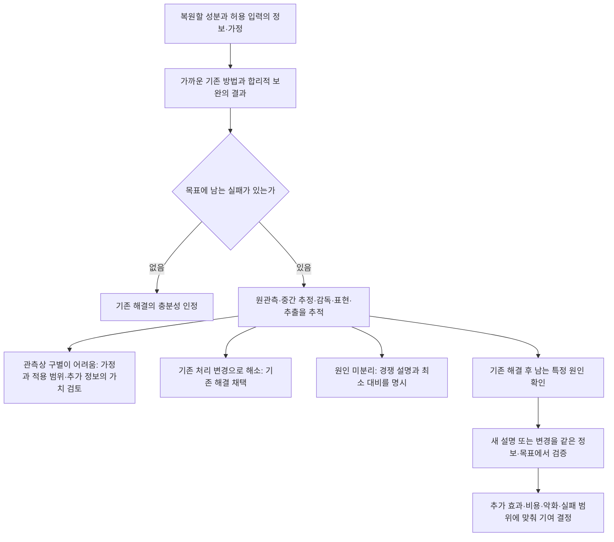

# 연구 필요성과 기여 후보로 이어지는 논증

2026-09-09 · 논증 초안/문헌 근거의 범위 · `scientific_verdict: null`

## 1. 이번 작업에서 연결한 결론

**기존 3D와 현재 영상이 서로 보완할 정보가 있고, 기존 방법이 이미 그 일부를 복원에 사용하며, 특정 조건에서 실패가 남고, 일부 처리 요소를 바꾸면 결과가 달라진다는 연결은 문헌으로 뒷받침된다.** 다만 이는 서로 다른 연구 조건에서 확인된 개별 연결이며, 하나의 동일 입력·방법 비교에서 전 경로가 실증됐다는 뜻은 아니다. 그 다음의 '가장 가까운 기존 설명·해결로도 남는 원인이 있으며, 추가 분석 또는 방법 변경이 기여할 수 있다'는 연결은 아직 확정되지 않는다.

이 지점에서 논증을 멈추거나 미확인을 성공으로 채우는 대신, 가능한 원인과 결과를 분기해 연구 필요성과 기여의 지위를 명확히 한다. **논리의 연결을 완성하는 것과 새 방법의 우위를 실증하는 것은 다른 작업**이다. 아래는 원래 목적을 유지한 현재의 완결된 조건부 논증이다.

## 2. 연구 필요성에 사용할 수 있는 여섯 문단

**① 두 입력은 서로 다른 복원 요구를 조건부로 보완한다.** 기존 측량 기하·모델은 위치·방향·연결·피복을 지지하고, 현재 영상은 관측된 외관과 다중뷰 대응·경계·가림을 통한 기하 제약을 제공한다. 어떤 자료가 어느 부분을 더 잘 지지하는지는 계보·오차·형상 규모·관측 조건에 달려 있다. 그러므로 상보성은 자료 이름의 고정된 우열이 아니라 특정 복원 성분에 대한 관계다. [입력 정보 §2–4](01_INPUT_INFORMATION_ko_v1.md)

**② 그 관계를 이용하는 방법은 이미 존재한다.** 기존 기하로 영상 대응을 제한하는 SRDM/Zhou, 품질·피복을 고려한 Wu의 선택·접합, 구조 감독과 visual refinement의 GS4B/GeoGS, 표준 texturing과 국소 GS 갱신은 서로 다른 경로로 상보성을 실현한다. 따라서 이 연구의 필요성은 융합·기각·보존·갱신·반복이라는 기능의 부재에서 나오지 않는다. [고전](CLASSICAL_CHAIN_ko_v1.md), [기하](GEOMETRY_CHAIN_ko_v1.md), [외관/현재성](APPEARANCE_VALIDITY_CHAIN_ko_v1.md)

**③ 정보가 입력에 존재하는 것과 최종 결과에 유효하게 남는 것은 구별해야 한다.** 영상의 무늬가 형상 깊이를 모두 결정하지 않으며, 단순화된 면이 그 위의 작은 형상까지 정확히 제한하지도 않는다. 원영상의 관측 제약, 파생 depth/mesh, 사용된 감독, 수정할 수 있는 표현, 추출 결과는 서로 다른 단계다. 각 단계의 변환이 유효 정보를 활용하거나 손실·오해할 가능성을 만든다. 원자료를 고정했다는 이유로 모든 추정을 고정했다고 보거나, 반복했다는 이유로 독립 증거가 늘었다고 볼 수 없다. [입력 정보 §3–4](01_INPUT_INFORMATION_ko_v1.md)

**④ 실제 문헌의 성공과 실패는 이 구별이 결과에 관계됨을 보여준다.** Wu의 감독 label 정제, VCR의 위치 감독, DebSDF의 렌더링 보정, HelixSurf의 앞단 재추정 등은 처리 요소에 개입한 선행 해결이다. 반면 Zhou의 재매칭 누락, GeoGS의 지역 악화, CL의 얇은 변화 영역 누락은 각각 다른 잔여 문제다. 일부는 실패 단계가 확인되고 일부는 원인도 미분리다. 이들을 하나의 고정 prior·소스 판단·단방향 처리 문제로 묶을 근거는 없다. [근거–원인 §2–3](02_EVIDENCE_TO_CAUSE_ko_v1.md)

**구체적으로 연결된 사례:** Wu2026은 낡은 LiDAR 시차가 신축 영상의 학습 label에 들어가 매칭이 실패한 사례와, SGM 불일치 label을 제거·재학습한 뒤의 개선을 제시한다. `기존 기하 → 잘못된 감독 → 복원 오류 → 기존 정제책으로 개선`은 여기까지 실제 사례로 연결된다. 이 결과는 기존 label 정제를 기본 비교에 넣어야 한다는 근거다. 이후 남은 벽 오탐에서는 matching·pose·meshing·ray 판단의 원인이 분리되지 않았으므로 별도 규명 대상이 된다. 이는 정성 사례이며 원인별 효과 크기나 일반 실패율의 확정은 아니다. [Wu2026 §4.2/Fig8·§4.3.2/Fig15(b), PDF pp4–6](https://isprs-annals.copernicus.org/articles/XI-2-2026/385/2026/isprs-annals-XI-2-2026-385-2026.pdf)

**⑤ 따라서 추가로 규명할 것은 '정보가 부족한 경우'와 '주어진 정보·가정을 사용하는 방식이 성과를 제한하는 경우'의 조건과 차이다.** 이를 위해 같은 복원 목표에서 가까운 기존 방법과 합리적 정합·정제·감독·추출 조정을 먼저 고려한다. 남은 오류가 입력으로 구별하기 어려운 것인지, 중간 추정·증거 사용·표현·추출의 특정 가정으로 설명되는지 확인해야 한다. 관측이 불충분해도 명시한 형상/학습 가정으로 기대 성능을 높이는 접근은 가능하지만, 그 성능을 관측에 의한 현재 형상 보증으로 바꾸지는 않는다. 이것이 현재 자료로 정당화할 수 있는 연구 질문이며, 어떤 새 모듈의 필요성을 전제하지 않는다.

**⑥ 기여는 그 규명 결과에 따라 정한다.** 기존 처리로 요구를 충족하면 그 성공 범위와 한계를 채택한다. 기존 처리 이후에도 특정 원인이 반복적으로 남고, 허용한 입력·가정 안에서 이를 설명하거나 줄일 수 있다면 그 원인에 대한 새 분석 또는 추정 방식의 기여를 검증한다. 최종 기하·피복·현재성·관측 세부·외관의 개선과 손상을 함께 확인하여 어느 정보의 이용이 어느 성과를 만들었는지 밝힌다. 특정 GS·판단 모듈·반복·시간차 조건은 이 과정에서 근거가 생길 때 선택한다.

## 3. 이 논증에서 연구 질문을 구체화하는 방식

현재 사용할 수 있는 **검증 질문의 틀**은 다음과 같다. 새 정본 채택이나 학위 방법 확정이 아니다.

> **오차와 표현 수준이 다른 기존 3D 기하와 현재 영상이 제공하는 복원 정보는 어떤 조건에서 서로 보완되며, 가까운 기존 방법에서 남는 복원 오류는 정보의 부족과 처리 과정의 어떤 가정으로 설명되는가? 기존 해결을 적용한 뒤에도 남는 원인을 설명하거나 수정하여, 유효한 정보의 보존과 기하·관측 가능한 세부·외관의 복원을 개선할 수 있는가?**

이 틀은 이전 질문보다 학위 범위를 특정 부위로 줄이지 않고 **무엇을 밝혀야 하는지**를 명시한다. 한 연구/논문으로 착수할 때는 아래 사례 중 실제 근거가 있는 조건·원인 하나를 정해야 한다. 선택에는 입력 정보와 원인을 추적할 근거, 원래 복원 목적에서의 실질적 중요성, 현상의 반복성을 함께 고려한다. 조사하기 쉬운 부위라는 이유만으로 핵심 문제로 정하지 않는다.

| 구체적 질문 후보 | 현재 출발 근거 | 아직 채워야 하는 마지막 연결 | 가까운 기존 해결이 충분하면 |
|---|---|---|---|
| **매칭/중간 기하:** 기존 기하를 이용·제외한 뒤 남는 결손은 원영상의 제약 부족 때문인가, guidance/label/interpolation/matching 처리 때문인가? | SRDM·Zhou·Wu·LGSM/FusionX3. 실제 서로 다른 정보 이용 경로와 잔여 문제 있음 | 같은 허용 입력에서 원인별 기존 변경이 어떤 결손을 회복하고 어떤 오류를 남기는지 | 해당 조건에는 기존 재매칭/정제를 사용. 새 판단·반복 필요 주장 축소 |
| **형상 정보의 전달:** 위치·방향·작은 형상에 대한 서로 다른 지지가 최종 표면까지 남지 못하는 원인은 감독, 수정 자유도, 표현/렌더링, 추출 중 무엇인가? | GS4B/GeoGS의 성과·잔여, AGS/VCR/DN-Splatter/DebSDF의 개입, Helix의 재추정 | 기존 보정을 포함해 같은 증거의 개선/손실이 어느 단계에서 달라지는지. 단순 원인 하나로 합치지 않음 | 새 representation/controller보다 기존 제어 또는 추출 변경 채택 |
| **수정 범위와 목표 성분:** 현재 관측의 차이가 외관·기하·갱신 범위로 전달될 때, 실제 지지하는 성분과 후속 수정이 어디에서 어긋나는가? | 표준 texturing, GaussianUpdate의 해결된 간섭 사례, CL의 full 갱신 누락 | 기존 mask/appearance/visibility 조정 뒤에도 잘못된 수정·누락이 남는지 | 기존 처리로 충족된 외관/갱신을 추가 기여에서 제외 |

세 후보는 서로 배타적이지 않지만 처음부터 한 알고리즘의 세 모듈로 고정하지 않는다. 형상 정보의 전달에는 구조 보존도 포함되지만 그것만으로 목적을 축소하지 않는다. 현재성은 실제 시기 차이가 관련된 조건에서 다루고, 모든 실패의 이름으로 쓰지 않는다.

## 4. 결과에 따라 끝까지 연결되는 분기

이 분기는 판정 알고리즘의 출력 상태가 아니다. 연구 논증과 증거 지위를 구분하는 도식이다. 분기들은 서로 다른 위치·형상 성분에서 함께 나타날 수 있다.

| 가능한 결과 | 정당화되는 산출 | 자동으로 정당화되지 않는 것 |
|---|---|---|
| 기존 방법/조합이 충분 | 재사용할 방법, 적용 조건, 비교 근거 | 새 알고리즘 신규성 |
| 관측·가정이 특정 형상을 구별하지 못함 | 식별/적용 조건 분석, 필요한 정보의 가치, 가정 기반 성능의 범위 | 관측되지 않은 현시점 형상을 정확히 복원했다는 주장 |
| 기존 방법의 특정 규칙이 실패를 유발하며 기존 수정으로 해결 | 원인 재현과 기존 해결의 조건 | 그 원인 또는 해결을 처음 제시했다는 주장 |
| 기존 수정 뒤에도 새로운 조건 의존성/원인이 남음 | 검증 가능한 설명 가설, 구체적인 방법 변경 후보 | 새 조건을 시험했다는 이유만으로 학위 기여 확정 |
| 새 원인 설명/변경이 기존 설명/방법보다 추가 예측·개선 제공 | 독립 검증에 따른 지식 또는 방법 기여 후보 | 모든 영역·출력·예산의 보편적 우위 |

## 5. '새 설명'과 '새 방법'의 입증 부담

**새 설명의 기여**는 관찰 목록이나 민감도 표만으로 정해지지 않는다. 기존 설명이 예측하지 못한 실패 조건을 구체적으로 설명하고, 해당 요인에 개입했을 때 예측한 방향으로 결과가 바뀌며, 조사한 사례 밖에서도 설명력이 있는지 확인해야 한다. 기존 이론의 단순 재확인이라면 그 지위에 맞춰 보고한다. 이러한 분석의 학술적 충분성도 별도 평가 대상이다.

**새 방법의 기여**는 이미 있는 부품의 포함 여부로 정해지지 않는다. 새롭게 바꾼 가정/추정 규칙이 같은 허용 정보에서 어떤 추가 복원을 만들고 어떤 비용·손상을 발생시키는지 분리해야 한다. 기존 방법의 기본값 한 점만 이기거나, 입력·사전학습·계산량·추출을 함께 바꾼 결과는 해당 요소의 효과로 분해한다. 실질적으로 중요한 조건에서 더 나은 성과를 보여야 하며, 모든 입력/출력에서 무조건 우월할 필요는 없다.

**현재 가능한 실마리**는 '상보 정보를 최종 복원에 전달하는 과정에서 어떤 가정이 어느 조건의 병목이 되는가'이다. 이 관점 자체를 새 이론이라고 부르지 않는다. 원인 후보는 correspondence, interpolation, supervision target, 수정 가능 범위, geometry/appearance의 설명, surface extraction 등으로 구체화됐고, 각각의 선행 해결과 기각 조건도 [근거–원인 문서](02_EVIDENCE_TO_CAUSE_ko_v1.md)에 연결했다. 아직 확인되지 않은 단 하나의 공통 병목을 발명해 학위 기여로 채우지 않는다.

## 6. 유지하는 연구계약

현재 사용자의 상위 목적을 우선하고, [헌장](../../../research/00_RESEARCH_CHARTER.md)과 [DEC-P1-025](../../../research/06_DECISION_LOG.md)은 계보·참조 분리·가설과 verdict 구별의 맥락으로 읽었다. 지붕·GS·명시 판단·공동/반복을 이 문서의 필요조건으로 재도입하지 않는다. 기존 E1–E6/C 계보 및 개발/독립 검증 구분을 보존한다.

기존 코드·문서·결과·서비스는 변경하지 않았다. 새 학습·렌더·방법 실험은 수행하지 않았다. 이번 문서는 특정 실험·임계값·학위 기여를 채택한 승인 문서가 아니다. `scientific_verdict: null`.
