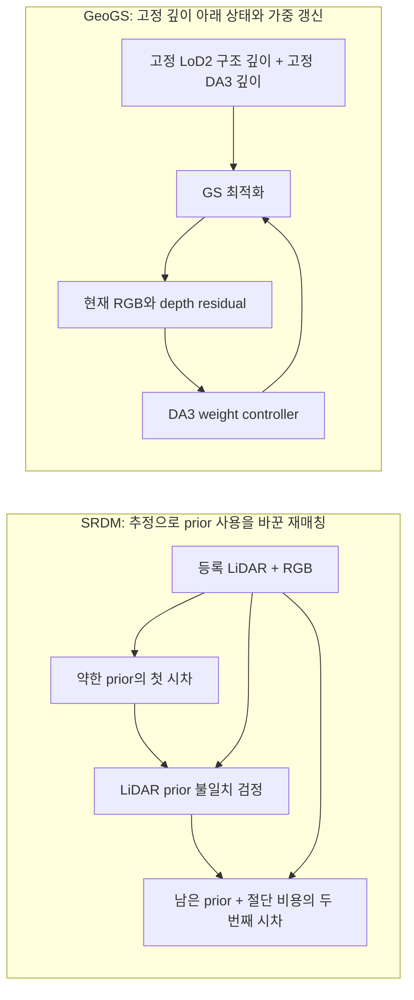
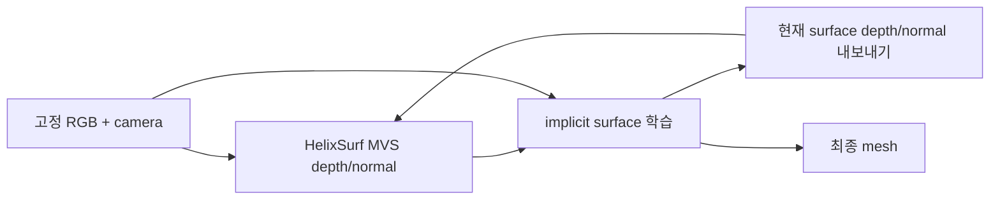

# 가까운 방법의 정보 흐름과 피드백

2026-09-09 · `scientific_verdict: null`

**후단의 예측이 바뀌는 것과 새로운 관측을 얻는 것은 다르다.** 같은 RGB를 이용해 가시성·대응·깊이를 다시 계산하면 새로운 추정 정보를 얻을 수 있지만 독립 센서 증거를 얻은 것은 아니다. 그 반복도 실제로 유용할 수 있으므로 단순 재사용이라는 이유로 무효화하지 않는다. 아래 경로는 원문/공식 코드의 범위이며, 한 방법이 여러 경로를 가질 수 있다.

## 핵심 경로 비교

| 방법·근거 | 정보 흐름 | 후단에서 다시 수정하는 대상 | 반복에도 그대로인 정보·경계 |
|---|---|---|---|
| [SRDM §3.2](cards/srdm.md) | 등록 LiDAR→약한 stereo prior→1차 disparity→prior 검정→강한/절단 prior→2차 disparity | prior membership·매칭 결과 | 원 LiDAR·RGB·등록 camera. 외부 자산 좌표 갱신/무한 재판정 루프는 아님 |
| [Zhou §3](cards/zhou_2020.md) | ALS 후보→D1→change→ALS 배제 D2→D1과 비교→change/search 확장→재매칭→정제 | disparity·change/search region | 입력 ALS plane·camera. 변화 검출 성공 뒤 재매칭 실패도 가능 |
| [Wu 2023 §III–V](cards/wu_2023.md) | sensor mesh·viewpoint→ray comparison/시계열 지속성→change/quality→QPBO 선택→stitch | 선택 label·seam·시기별 persistence | 정합 mesh geometry. 새 시계열 관측을 처리하는 것과 동일 자료 내 feedback을 구분 |
| [Wu 2026 §3–4](cards/wu_vallet_2026.md) | LiDAR label→stereo 학습→noisy label 정제/재학습; sensor meshes→ray label→region filter→점 갱신 | matcher 훈련/label은 갱신; 최종 update가 앞단을 바꾸는 경로는 미확인 | 갱신 단계의 mesh/pose. label 정제 반복이 있다고 map update 전체가 joint인 것은 아님 |
| [GS4Buildings §3.3, 코드](cards/gs4buildings.md) | LoD2+camera→points/depth/normal/mask→GS; rendered depth→median scale·loss→GS | GS와 depth 비교용 scale | LoD2·camera. 현 code normal default/일정은 논문 full arm과 구분 |
| [GeoGS §3.4, 코드](cards/geogs.md) | LoD2 초기화/depth→anchor→protection; RGB+pose→offline DA3; GS residual→DA3 weight→GS | Gaussian 상태/수와 visual weight | LoD2 mesh·structural depth·DA3 depth·pose, 기본 보호 근거. residual은 현재성 GT 아님 |
| [ARSGaussian §3](cards/arsgaussian.md) | RGB/LiDAR→BA→depth completion/ACMH→GS; LiDAR 근접도→prune/split | 앞단 내부 pose/depth, GS 내부 상태 | GS residual이 BA/ACMH를 재호출하는 시점/경로는 미확인; 코드 미공개 |
| [AGS-Mesh §4](cards/ags_mesh.md) | sensor depth↔mono normal 비교→DNC; GS rendered normal↔mono normal→ANR→GS | ANR supervisor 선택·GS | DNC confidence/원 depth·mono normal. 두 필터가 모두 매회 입력 재추론은 아님 |
| [VCR-GauS §3.3](cards/vcr_gaus.md) | GS depth→D-Normal→normal loss→GS 위치/방향; rendered normal→confidence | GS geometry와 감독 가중 | prior normal·camera. 법선 일치와 절대 높이오차는 다름 |
| [NeuRIS §3.3](cards/neuris.md) | 현재 SDF 표면→사진 patch NCC→normal prior 기각→SDF | 감독 membership·SDF | normal estimator·RGB/pose, 기각 prior의 재채택 제한 |
| [HelixSurf §4.1–4.2 및 train.py](cards/helixsurf.md) | MVS depth/normal→implicit surface→rendered depth/normal→다음 MVS 초기값/정제→surface | **앞단 MVS depth/normal을 실제 재계산** | RGB·camera. surface가 새 ray/깊이 추정에 영향을 주지만 새 사진은 아님 |
| [SpotLessSplats §4](cards/spotlesssplats.md) | GS RGB residual→semantic inlier label/MLP→mask→GS; utilization→prune | classifier·mask·histogram·GS | pretrained feature/기본 camera. 취득시점 변화의 별도 판정은 아님 |
| [CL-Splats §3](cards/cl_splats.md) | 기존 GS 렌더/새 RGB 특징→3D change support→국소 GS 갱신↔dynamic reprojection | 현재 렌더 계산 support·GS | 초기 change evidence와 static GS; dynamic reprojection을 change 재검출로 확대하지 않음 |
| [GaussianUpdate §3](cards/gaussianupdate.md) | appearance adaptation→신규 geometry 학습→appearance+신규 GS 공동 refinement→removal | stage3에서 앞단 appearance와 신규 GS | stage별 old geometry/opacity 제약. 별도 단계여도 변수 재방문이 있음 |
| [BayesRays §3](cards/bayesrays.md) | frozen NeRF/training rays→spatial uncertainty→density filter | 출력 사용/제거 범위 | 원 NeRF parameters. post-hoc 진단을 앞단 geometry 최적화로 분류하지 않음 |
| [SceneEdited §6](cards/sceneedited_2026.md) | RGB 5장→predictor→GT unchanged 대응의 scale/align→추가; old map+GT change mask+visibility→삭제/보존 | 예측 geometry·정합·추가/삭제 membership | GT-mask oracle baseline; fused map→mask/predictor 재추정은 미확인 |

## prior를 다시 검정하는 경우와 감독의 영향만 바꾸는 경우

두 방법 모두 기존 추정이 후속 계산에 영향을 준다. SRDM의 LiDAR 기각과 GeoGS의 visual-depth 가중 갱신은 대상이 다르다. GeoGS에 기각 모듈을 추가하면 필연적으로 좋아지는 것이 아니라, 원래 유효한 구조와 약관측 영역의 지원을 잃을 가능성도 비교해야 한다.

## 앞단 추정의 실제 재계산과 감독 선택의 재계산

HelixSurf의 official training은 학습된 depth/normal을 다음 MVS 입력으로 넘긴다. 이 경로와 달리 NeuRIS는 현재 surface로 사진을 비교하여 고정 normal prior의 사용 여부를 바꾼다. 둘은 가까운 경쟁 대안이며 “후단 결과로 앞단을 수정한다”라는 한 문장만으로 학위의 독창성을 주장할 수 없다.

## 연구 질문에 필요한 피드백 비교

다음은 문헌 사실이 아니라 **향후 최소 비교 설계**다. 같은 evidence·수정 가능한 변수·허용 preprocessing·출력·계산 예산 아래 비교해야 한다.

| 대비 | 실제로 분리하려는 것 | 결과가 같을 때의 해석 |
|---|---|---|
| 기존 정합/매칭→기존 강건 선택→기존 표면/texture | 강한 순차 조합이 충분한가 | 충분하면 새 joint 구조를 추가할 이유 없음 |
| 고정 supervisor vs 현재 모델에서 supervisor 갱신 | 재가중/기각의 효과 | 반복 회수 자체의 필요성 없음 |
| 1회 정확한 판단 vs 같은 판단의 재적용 | 동일 정보의 재평가 이득 | 결과 동등하면 1회로 단순화 |
| 같은 근거 재사용 vs 실제 MVS/pose 재추정 | 새로운 추정이 제공하는 변화 | 앞단 갱신 없이 동등하면 더 단순한 경로 채택 |
| 독립 검증 사진/증거 vs 학습 residual만 사용 | 공유 오차·자기확증의 영향 | 추가 정보의 효과와 알고리즘 효과를 구분 |
| 동일 geometry에서 mesh+texture vs GS+추출 | 표현/재최적화의 추가 가치 | 비GS가 충족하면 GS 필수 주장 기각 |

독립 사진을 추가한 arm이 좋아졌다고 재판단 알고리즘의 우위가 증명되지는 않는다. 새 관측은 모든 해당 비교군에 공평하게 제공해야 한다. 반대로 같은 사진을 다시 썼다는 이유만으로 계산을 통해 얻은 개선을 무시하지 않는다. 최종 판단은 실제 정확도·완전성·현재성·관측 세부·외관·비악화와 계산량에서 한다.
