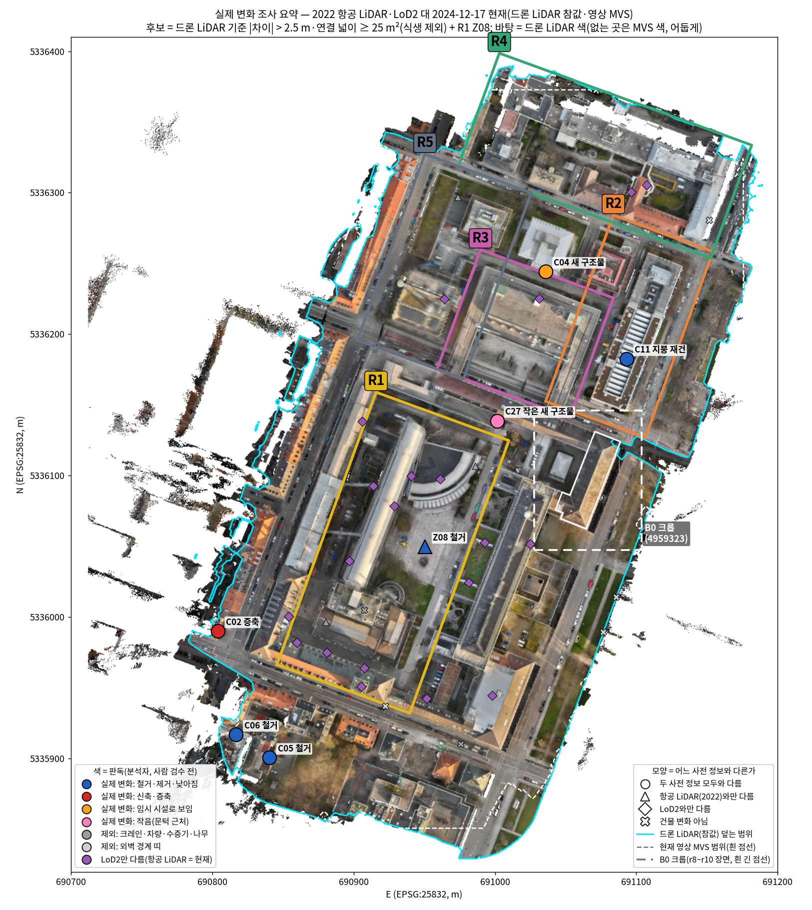
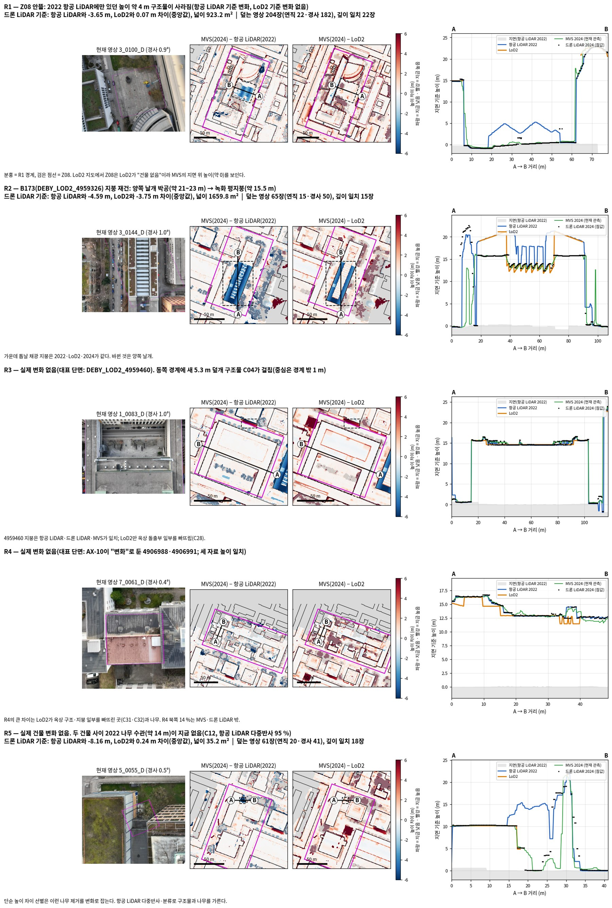
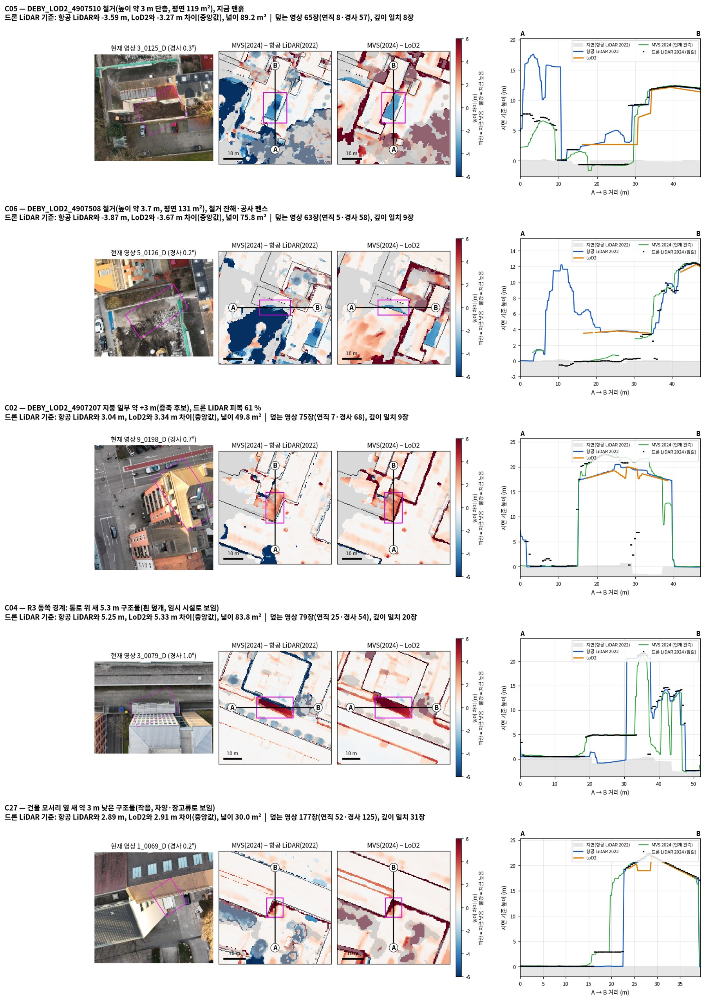
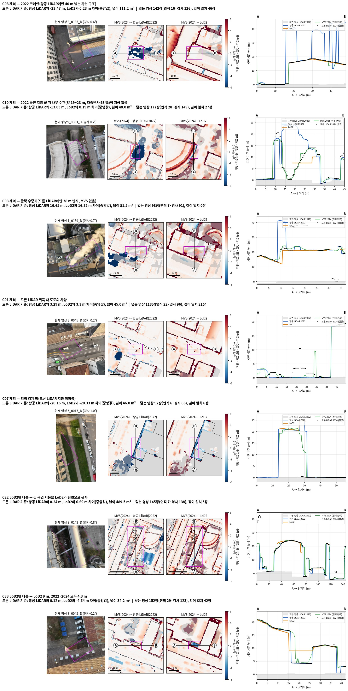
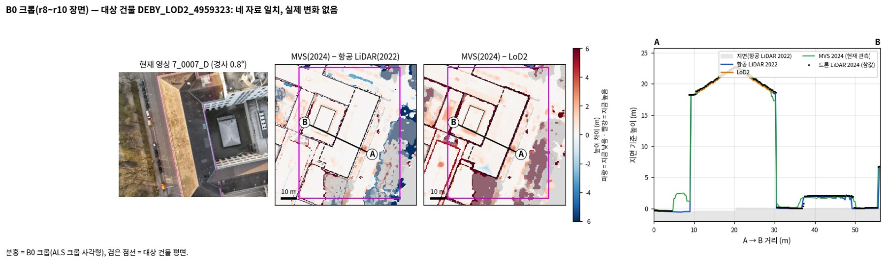

<!-- PHD-MAIN-DESIGN-REALCHANGE-SURVEY-v1 -->
# 본 실험 설계를 위한 실제 변화 지역 조사 — 보고서 v1

- 작업: `PHD-MAIN-DESIGN-REALCHANGE-SURVEY-v1` (2026-10-02). `scientific_verdict: null`.
- 지킨 것: 학습 없음, 새 자료 내려받기 없음, 기존 산출·코드 수정 없음. 계산은 모두 Docker(`jointbuildgs:dev`, CPU, 네트워크 없음, 입력 읽기 전용)에서 했다.
- 새 산출 위치: 작업 폴더 `../JointBuildGS-artifacts/phase-payloads/phd/main_design_realchange_survey_v1/PHD-MAIN-DESIGN-REALCHANGE-SURVEY-v1/`, 스크립트 `scripts/phd/main_design_realchange_survey_v1/`, 설정 `configs/phd/main_design_realchange_survey_v1/`, 그림 `figures/`(이 문서 옆).
- 후보의 '실제 변화 / 제외' 구분은 **분석자(에이전트)의 판독**이다. 근거(사진·단면·수치)는 모두 그림과 표에 있다. 사람 검수 전이다.

말의 뜻:

- **항공 LiDAR**: 사전 정보 1. 바이에른 측량청 항공 LiDAR, 2022-02-27 취득.
- **LoD2**: 사전 정보 2. 바이에른 측량청 LoD2 건물 모델.
- **현재 관측**: 2024-12-17 현재 영상 937장으로 만든 MVS.
- **참값**: 2024-12-17 드론 LiDAR. 영상에서 만든 것이 아니다.
- **높이 차이**: 0.5 m 칸마다 '현재 − 사전 정보'의 표면 높이. 파랑은 지금 낮아진 곳, 빨강은 지금 높아진 곳이다.

---

## 1. 답 먼저

| 지역 | 건물 (LoD2, 반 넘게 안 + 걸침) | 시점 수 (연직·경사) | 항공 LiDAR 기준 변화 | LoD2 기준 변화 | 참값 | 본 실험에 쓸 수 있는가와 그 까닭 |
|---|---|---|---|---|---|---|
| **R1** | 16 + 3동 | 672 (233·439) | **있음.** Z08 안뜰 구조물이 철거됐다. 2022년에는 높이 약 4 m였고, 지금은 923 m²가 지면이다. | **없음.** 그 자리에 LoD2 건물이 원래 없다(Z08의 1 %만 LoD2 평면). | 드론 LiDAR 99.8 % 피복, 1,373점/m² | **예(항공 LiDAR 쪽).** 넓고 단단한 '철거' 사례다. 시점이 많고 참값이 있다. LoD2 쪽에는 시간 변화가 없다. 다만 LoD2 일반화 불일치 11곳이 있어 'LoD2 사전 정보의 오류' 시험에는 쓸 수 있다. 크레인·수증기·나무 자리는 평가에서 빼야 한다. |
| **R2** | 3 + 1동 | 253 (119·134) | **있음.** B173(4959326)의 지붕을 다시 지었다. 박공 약 21~23 m가 평지붕 약 15.5 m로 바뀌었다. 차이 −4.6 m, 넓이 1,660 m². | **있음.** 같은 B173이다. 차이 −3.75 m, 넓이 1,046 m². | 99.4 %, 1,450점/m² | **예(두 사전 정보 모두).** 지붕의 높이와 모양이 함께 바뀐 사례다. 참값과 사진이 일치한다. B173을 덮는 영상은 65장(연직 15)이다. |
| **R3** | 1동 (4959460) | 347 (167·180) | **건물 변화 없음.** 동쪽 경계에 새 5.3 m 덮개 구조물(C04)이 걸쳐 있다. 그 중심은 경계 밖 1 m다. | **건물 변화 없음.** LoD2 일반화 1곳. | 100 %, 2,550점/m² | **예(비변화 대조).** 네 자료가 같은 큰 평지붕이다. C04를 쓰려면 상자를 넓혀야 하고, 임시 시설일 수 있다. |
| **R4** | 27 + 11동 | 117 (63·54) | **없음** | **없음.** LoD2 일반화 2곳. | 85.1 % (북쪽 약 15 % 비어 있음), 968점/m² | **조건부(비변화 대조).** 시점과 MVS가 가장 적다. 북쪽은 참값과 영상 범위 밖이다. |
| **R5** | 4 + 1동 | 289 (147·142) | **건물 변화 없음.** 2022년의 나무가 사라진 자리 1곳(C12)이 있다. | **없음.** LoD2 일반화 2곳. | 99.7 %, 2,116점/m² | **예(비변화 대조).** C12는 나무여서 건물 변화로 쓰면 안 된다. |
| B0 (참고) | 5 + 3동 | 저자 15장 (0·15). 공통 937장 중 대상 건물을 덮는 영상은 109장 (8·101). | 없음 | 없음 | gt_clean. 드론 LiDAR 계열이고 대상 건물만 덮는다. | 실제 변화가 없다. 합성 변화 장면으로만 쓴다. |

'시점 수'는 9월 15일 감사(`region_view_support_v1`)의 지역 후보 영상 수다. 포즈 투영과 MVS 지지 규칙으로 셌으며, 가시성 검사는 아니다. 연직은 광축이 수직에서 20° 이내인 영상이다. 학습·평가 나눔은 2.1~2.5절 카드에 있다.

**한 줄 결론**

1. **사용자 기억이 맞다.** 항공 LiDAR 기준 변화는 R1·R2, LoD2 기준 변화는 R2다. R3~R5에는 건물 변화가 없다.
2. **R1이 LoD2 기준 변화가 아닌 까닭.** 사라진 Z08 구조물이 LoD2에 처음부터 없다. 이 LoD2의 평면 현재성은 2025-02-17이다. 2022 항공 LiDAR도 이 구조물을 건물(분류 6)이 아닌 분류 20으로 분류했다. LoD2 일반화에 가려질 크기도 아니다.
3. **실제 변화 후보를 더 찾았다(R1~R5 밖).**
   - 철거 2동: 4907510, 4907508. 두 사전 정보 모두와 다르다.
   - 증축 후보 1동: 4907207.
   - 새 구조물: R3 경계의 덮개 구조물(C04), 작은 구조물 1곳(C27).
4. **기존 '실제 변화' 목록을 그대로 쓰면 안 된다.** AX-10의 사용자 조정 '변화' 20동 가운데, 이번 측정에서 2022→2024 건물 변화가 보이는 것은 3동(B173·4907510·4907508)이다. 13동은 세 자료의 높이가 일치하고, 3동은 LoD2만 다르며, 1동은 참값이 없다.
5. **단순한 높이 차이 선별은 건물이 아닌 것도 변화로 잡는다.**
   - 나무 제거: C10, C12.
   - 크레인: C08.
   - 수증기: C03.
   - 차량: C01.

   드론 LiDAR 참값에도 수증기와 차량 반사가 들어 있다. 평가 전에 정리해야 한다.

---

## 2. 지역 카드

### 2.0 다섯 지역에 공통인 자료

| 항목 | 내용 |
|---|---|
| 현재 영상 | DJI Matrice 350 RTK + Zenmuse L2 내장 RGB(5280×3956), **2024-12-17 하루**. 공개 962장 중 포즈가 있는 937장. 광축 경사(포즈에서 계산): **연직(≤ 20°) 392장, 경사 545장**(20~45° 249장, 45° 초과 296장). `flight_meta_summary.md`와 같은 수다. 파일명 시각은 08:42:39~10:36:51인데 시간대 표기가 없다. 파일명 끝은 모두 `_D`라 연직·경사를 이름으로 가를 수 없다. |
| MVS 깊이 | COLMAP 기하 깊이 지도가 **937장 모두 있다**(1024×741, 카메라 Z). 일관성 그래프는 비어 있다. 조밀 점군은 OpenMVS 43,926,567점이다. 이 보고서의 높이 차이 지도는 이 점군을 쓴다(0.5 m 칸 90 % 분위, 3×3 중앙값). 이 MVS는 만들 때 평가 영상까지 썼다(9-15 감사 기록). |
| 관측 신뢰도 마스크 | **B0의 15장에만 있다**(`stage1_conf_tol_conflict_v1/.../out/conf`). R1~R5에는 없다. |
| 항공 LiDAR | 바이에른 측량청(LDBV) 'Laserpunkte' 1 km 타일 4장(690_5335, 690_5336, 691_5335, 691_5336). **GPS 시각은 2022-02-27 17:56~18:52 UTC**이고, 타일 헤더의 생성일은 2022-06-16이다. 타일 밀도는 20.2~22.8점/m²(모든 분류). 분류는 2(지면)·6(건물)·7(잡음)·20·22다. 20·22의 정의 문서는 저장소에 없다. 다만 20에 나무와 일부 비건물 구조물이 들어간다(R1 Z08이 그 예). 높이는 DHHN2016이고, 이어받은 다리 상수 +45.7 m로 작업 틀에 맞췄다. |
| LoD2 | LDBV CityGML 2 km 타일 2장. 격자 안에 472동이 있다. `creationDate`는 몇몇 날짜에 몰려 있다(격자 안 기준): 2021-04-20 171동, 2025-04-04 93동, 2015-09-24 91동, 2023-06-29 90동, 2018년 21동, 2024-05-21 4동, 2025-01-02 2동. 평면 현재성 `Grundrissaktualitaet`은 **472동 모두 2025-02-17**이다. `creationDate`는 모델을 만든 날이지 지붕 높이 자료의 시기가 아니다. 예를 들어 B173은 creationDate가 2025-01-02인데도 2022 이전의 박공 지붕을 가지고 있다. 지붕 높이 출처 코드 `DatenquelleDachhoehe`는 1000이 438동, 5000이 25동, 6000이 5동, 3000이 4동이다. **코드의 뜻은 확인하지 못했다**(저장소에 코드표 없음). |
| 참값 | TUM2TWIN 드론 LiDAR nadir `TUM_Downtown_ULS_20241217_nadir.laz`. 177,981,904점이고, **GPS 시각은 2024-12-17 07:42:37~08:12:54 UTC**다. 분류는 없고(전부 0) 색이 있다. **영상과 같은 기체(Zenmuse L2)로 같은 날 찍었다.** 영상에서 만든 것이 아니므로 영상 재구성과는 독립이다. 그러나 궤적과 좌표틀을 공유하므로 공통 위치 오차까지 독립은 아니다. 영상 파일명 시각이 중앙유럽 표준시라면 영상의 첫 30분이 이 비행과 겹친다(확인 못 함). 같은 폴더의 사진측량 점군(Pix4Dmatic)은 영상에서 만든 것이라 참값으로 쓸 수 없다. |
| 정합 상태(이번에 잼, 표 2.0-1) | **수직:** 항공 LiDAR·LoD2는 현재 틀보다 약 10~12 cm 낮다. 이 자료에서는 다리 상수가 약 45.82 m인 셈이다. 변화 크기(≥ 2.5 m)를 가리는 데는 영향이 없지만, 정밀 시험에서는 보정해야 한다. **수평:** 드론 LiDAR와 항공 LiDAR는 80 m 구역 27개 대부분에서 최적 평행 이동이 0이다(0.5 m 격자 한계 안). LoD2는 구역마다 0.5~3 m씩 다른 방향으로 어긋난다. LoD2의 벽이 처마 없는 지적 평면이고 지붕이 일반화되어 있어서, 한 번의 이동으로는 맞출 수 없다. |

**표 2.0-1 수직 맞음 (중앙값 / NMAD, m)**

맨땅은 항공 LiDAR 지면점(분류 2)이 있는 칸 가운데, 건물 밖이고 단단하며 나무가 없는 97,498칸이다. 평지붕은 LoD2 지붕 가운데 경사 5° 미만이고 가장자리에서 1.5 m 안쪽인 칸이다.

| 비교 | 전체 | R1 | R2 | R3 | R4 | R5 | B0 크롭 |
|---|---|---|---|---|---|---|---|
| 맨땅: 드론 LiDAR − 항공 LiDAR | +0.12 / 0.03 | +0.13 | +0.09 | +0.14 | +0.09 | +0.16 | +0.10 |
| 맨땅: MVS − 드론 LiDAR | +0.04 / 0.10 | +0.03 | +0.03 | +0.04 | +0.04 | +0.03 | +0.05 |
| 평지붕: 드론 LiDAR − LoD2 | +0.10 / 0.12 | +0.23 | +0.00 | +0.01 | +0.11 | +0.16 | +0.07 |
| 평지붕: 항공 LiDAR − LoD2 | −0.02 / 0.10 | | | | | | |

평지붕 값에는 실제 변화가 있는 칸도 섞여 있다. 그래서 정합 어긋남의 상한으로 읽는다.

### 2.1 R1 — 중앙 안뜰·연결동·곡면지붕

| 항목 | 내용 |
|---|---|
| 범위 | 객체축 u −135~70 m, v −65~35 m(205 × 100 m = **20,500 m²**). EPSG:25832 꼭짓점: (690845.75, 5335966.37) (690915.86, 5336159.01) (691009.83, 5336124.81) (690939.72, 5335932.17). **LoD2 16동이 반 넘게 들어 있다:** 4906967, 104586480, 4906968, 4906969, 4906975, 4908023, 4908024, 4908025, 4908026, 4908027, 4908028, 42364663, 4906970, 42364667, 42364665, 4906965(0.60). **걸친 동:** 4906972(0.25), 60042(0.03), 108580336(0.02). **B0 크롭과는 겹치지 않는다**(크롭까지 17.8 m, B0 건물까지 47.6 m). 옛 P1·P3를 포함한다. |
| 현재 영상 | 2024-12-17. 지역 후보 **672장(연직 233·경사 439, 그중 45° 초과 261)**. 학습 588장(204·384), 평가 84장(29·55). MVS 깊이 있음. 관측 신뢰도 마스크 없음. MVS 밀도 521점/m². Z08을 덮는 영상은 204장(연직 22·경사 182)이고, 그중 MVS 깊이가 현재 지면과 1 m 안에서 맞는 영상은 22장으로 모두 연직이다. |
| 사전 정보 | 항공 LiDAR: 2022-02-27, 이 지역 21.9점/m²(지면 7.2, 건물 8.0). LoD2(반 넘게 안 16동): creationDate 2025-04-04 11동, 2023-06-29 4동, 2021-04-20 1동. 평면 현재성 2025-02-17. 정합은 표 2.0-1. |
| 참값 | 드론 LiDAR nadir 2024-12-17. 칸 피복 99.8 %, 1,373점/m²(모든 반사). **굴뚝 수증기 반사(C03)가 들어 있어** 평가 전에 빼야 한다. |
| 실제 변화 | **항공 LiDAR 기준: 있음 — Z08 안뜰 구조물 철거.** 2022년에는 높이 2.5 m 넘는 칸이 1,266 m²였다. 높이 중앙값은 4.1 m이고, 단면에서는 박공 두 개 모양의 4~5 m다. 그 가운데 **923 m²가 지금 지면**이다(드론 LiDAR 높이 중앙값 0.1 m, MVS 0.3 m). 2022 항공 LiDAR 점은 **분류 20이 95 %**이고, 다중반사가 9 %라 단단한 표면이다(나무 수관은 87~99 %). 사진(0100_D)에는 포장 광장과 작은 물체만 보인다. **LoD2 기준: 시간 변화 없음.** Z08 자리에 LoD2 건물이 없다(3절). **건물 변화가 아닌 것:** 2022 크레인(C08, 4906967 위의 40 m 넘는 가는 구조), 2022 나무 수관 제거(C10, 곡면 지붕 끝), 2024 굴뚝 수증기(C03). **LoD2만 다른 곳 11곳**(4906965·4906968·4906975·60042 등)이 있다. 곡면 지붕을 평면으로 근사했거나, 옥상 구조를 빠뜨렸거나, 지붕 모양이 다른 경우다. 이 자리에서는 2022 항공 LiDAR와 현재가 일치한다(\|차이\| 중앙값 0.1~0.6 m). 그래서 2022~2024 변화가 아니라 LoD2 일반화나 모델 차이다. 2022 이전 변화일 가능성은 이 자료로 가를 수 없다. **작은 것:** 104586480은 LoD2 평면 14.8 m², 높이 3 m, 용도 코드 51009_1610이다. 2022와 2024 모두 지면으로 측정되므로 LoD2만 가진 작은 구조물이다. 7월 문서의 '신축 후보(UAV·LoD2에 +17 m)'와 기록이 다르다. |
| 9월 18일의 쓰임 | 9-15에 옛 P1(철거→지면)·P3(곡면 지붕)를 담도록 채택됐다. 9-16에 Z00~Z13 구역을 판정했다. 9-17~18의 6화면 비교에서 **Z08을 보정 구역으로 시험했다**(prior 해제 2,342,258픽셀, 99장). 드론 LiDAR 평가에서 Z08은 0.210 m, Z06은 0.080 m였다(MVS-GeoGS). 오차 위치 검토에서는 **Z07**을 보존 실패 검토 사례로 골랐다(prior 0.122 m, GS 1.608 m). 9-18 밤 사진 검사에서는 유리·격자 지붕에서 LiDAR와 광학이 다르게 잰다는 가설이 나왔다. Z06에서는 168 m 플로터를 진단했다. |

### 2.2 R2 — P2 긴 건물 전체와 주변

| 항목 | 내용 |
|---|---|
| 범위 | u 105~245 m, v 50~125 m(140 × 75 m = **10,500 m²**). 꼭짓점: (691035.90, 5336152.57) (691083.78, 5336284.12) (691154.26, 5336258.47) (691106.37, 5336126.92). **LoD2:** 4959326(B173, 1.00), 108580335(1.00), 4959325(0.78). **걸친 동:** 4959460(0.20). **B0 크롭과 460 m² 겹친다.** B0 대상 건물은 R2 밖이고, 거리는 8.2 m다. 옛 P2를 포함한다. |
| 현재 영상 | 지역 후보 **253장(연직 119·경사 134, 45° 초과 108)**. 학습 221장(104·117), 평가 32장(15·17). MVS 깊이 있음, 관측 신뢰도 마스크 없음. MVS 밀도 169점/m²(다섯 지역 가운데 둘째로 낮다). B173을 덮는 영상은 65장(연직 15·경사 50)이고, 깊이가 맞는 영상은 15장(모두 연직)이다. |
| 사전 정보 | 항공 LiDAR 17.3점/m²(지면 6.7, 건물 6.1). LoD2 creationDate: 4959326은 2025-01-02, 108580335·4959325는 2025-04-04. |
| 참값 | 칸 피복 99.4 %, 1,450점/m². |
| 실제 변화 | **항공 LiDAR 기준: 있음 — B173 지붕 재건.** 양쪽 날개의 박공 지붕(약 21~23 m)이 녹화 평지붕(약 15.5 m)으로 바뀌었다. 가운데 톱날 채광 지붕은 2022, LoD2, 2024 모두 같다. \|차이\| > 2.5 m인 넓이는 1,660 m²이고 중앙값은 −4.59 m다. 평면 1,822 m²의 높이 중앙값이 20.1 m에서 15.6 m로 낮아졌다. **LoD2 기준: 있음 — 같은 B173.** LoD2 기준 넓이는 1,046 m², 중앙값은 −3.75 m다. LoD2를 2025년에 만들었는데도 지붕은 공사 전 것이다. 근거는 세 가지다. 단면에서 항공 LiDAR·LoD2는 박공, 드론 LiDAR·MVS는 평면이다. 사진(0144_D)에는 양쪽 녹화 평지붕과 가운데 흰 채광 띠가 보인다. 8월의 판독 기록('B173 평지붕 vs LoD2 박공')과도 같다. 그 밖에 LoD2만 다른 곳이 1곳 있다(C28, 4959460의 옥상 돌출부. R2·R3·R5에 걸친다). |
| 9월 18일의 쓰임 | 옛 P2(낮아진 지붕)를 포함한다. 보정 구역은 Z05·Z06 평지붕 띠였다(prior 해제 1,193,651픽셀, 46장). 드론 LiDAR 평가에서 Z05는 0.129 m, Z06은 0.042 m였다(MVS-GeoGS). 개선 위치 검토(9-18 위치 'C03', Z06 녹화 평지붕)에서 prior와 현재가 3.6 m 차이 났다. 이것이 이번의 B173 날개다. 9-19에는 Z07(태양광 패널 옆에서 광학 표면이 0.85 m 위)과 Z04(채광 지붕, 비평면)를 검토했다. DA3와 국소 prior 0 조건은 약 14,800회에서 OOM이 나서 분할 렌더로 복구했다. |

### 2.3 R3 — 중앙 오른쪽 장방형동·중정

| 항목 | 내용 |
|---|---|
| 범위 | u 100~190 m, v −30~70 m(90 × 100 m = **9,000 m²**). 꼭짓점: (690959.01, 5336175.23) (690989.79, 5336259.80) (691083.76, 5336225.60) (691052.98, 5336141.03). **LoD2:** 4959460(0.99, 평면 4,699 m²의 큰 한 동). B0 크롭과 41 m² 겹친다. |
| 현재 영상 | **347장(연직 167·경사 180, 45° 초과 124)**. 학습 303장(146·157), 평가 44장(21·23). MVS 450점/m². 4959460을 덮는 영상은 85장(25·60)이고, 깊이가 맞는 영상은 26장이다. |
| 사전 정보 | 항공 LiDAR 16.1점/m²(지면 6.5, 건물 7.4). LoD2 creationDate 2025-04-04. |
| 참값 | 칸 피복 100 %, 2,550점/m². |
| 실제 변화 | **두 사전 정보 모두 건물 변화 없음.** 4959460 평면의 높이 중앙값은 항공 LiDAR 15.35, 드론 LiDAR 15.51, MVS 15.47, LoD2 15.39 m다. **동쪽 경계**(Z07 외곽 통로)에 새 구조물 **C04**가 있다. 높이 5.3 m, 84 m²이고, 흰 덮개를 씌웠으며, 2022년에는 지면이었다. 중심이 경계 밖 1.1 m라 지역 안의 몫은 작다. LoD2만 다른 곳이 1곳 있다(C28: 옥상 돌출부 누락, +3.65 m, 115 m²). |
| 9월 18일의 쓰임 | 옛 P가 없는 비교 지역이다. 보정 구역의 prior 해제는 82픽셀·5장뿐이라 사실상 개입이 없었다. 개선 위치(9-18 'C04', Z04 넓은 자갈 평지붕)에서 prior와 MVS는 같은 지붕을 따르는데 DA3만 1.1 m 높았다. 그래서 DA3 실패와 prior 보존 사례로 쓰였다. |

### 2.4 R4 — 오른쪽 연결동·중정형 건물

| 항목 | 내용 |
|---|---|
| 범위 | u 240~325 m, v −65~125 m(85 × 190 m = **16,150 m²**). 꼭짓점: (690974.00, 5336318.76) (691003.08, 5336398.63) (691181.62, 5336333.65) (691152.55, 5336253.77). **LoD2 27동이 반 넘게 들어 있다:** 60043, 4906986, 4906987, 4906988, 4906991, 4906993, 4908032, 4908033, 4908034, 4959327, 4959336, 4959340, 4959463, 4959464, 4959465, 4959466, 4959753, 4959794, 8568362, 8568363, 8573847, 8573848, 8573849, 42364657, 42364659, 42364661, 108250120. **걸친 동:** 4959754(0.48), 4906990(0.35), 4906994(0.31), 4906992(0.29), 4906989(0.26), 4959762(0.13), 4959759(0.11), 4959758(0.06), 4909459(0.05), 4959342(0.02), 4959760(0.01). B0 크롭과는 겹치지 않는다. |
| 현재 영상 | **117장(연직 63·경사 54, 경사는 모두 45° 초과)**. 학습 102장(55·47), 평가 15장(8·7). 다섯 지역 가운데 가장 적다. 영상 범위 안은 86 %이고, MVS는 94점/m²로 가장 낮다. 대표로 본 4906988·4906991을 덮는 영상은 51장(7·44)이고, 깊이가 맞는 영상은 7장이다. |
| 사전 정보 | 항공 LiDAR 21.2점/m²(지면 5.9, 건물 8.3). LoD2 creationDate: 2023-06-29 13동, 2021-04-20 6동, 2025-04-04 6동, 2015-09-24 2동. 지붕 높이 출처 코드는 1000이 24동, 3000이 2동, 5000이 1동이다. |
| 참값 | 칸 피복 **85.1 %**로, 북쪽 약 15 %가 비어 있다. 968점/m². |
| 실제 변화 | **건물 변화 없음.** AX-10이 '변화'로 둔 4906988·4906991·42364659도 세 자료의 높이가 일치한다. 예를 들어 4906988은 항공 LiDAR 12.11, 드론 LiDAR 12.19, LoD2 12.15 m다. LoD2만 다른 곳이 2곳 있다(C31·C32: LoD2가 박공 지붕 일부를 낮은 부속물로 모델링). 외벽 띠 1곳(C30)과 나무 변화 여러 곳은 제외했다. |
| 9월 18일의 쓰임 | 영상이 가장 적은 지역이다(학습 102장). prior 해제는 2,329픽셀·30장이었다. 개선 위치(9-18 'C05', Z08 자갈 지붕)에서는 조사한 5장 가운데 MVS 깊이가 유효한 영상이 1장뿐이었다. 9-19에는 Z09를 '확인된 필요성 사례 1건'으로 기록했다. MVS가 희소하고(4/33장) 0.7 m 가라앉았지만, prior와 드론 LiDAR는 1 cm 안에서 일치했다. |

### 2.5 R5 — 오른쪽 위 독립동·L자형동

| 항목 | 내용 |
|---|---|
| 범위 | u 100~240 m, v −90~−10 m(140 × 80 m = **11,200 m²**). 꼭짓점: (690902.63, 5336195.75) (690950.51, 5336327.31) (691025.69, 5336299.95) (690977.81, 5336168.39). **LoD2:** 4906982, 4906983, 4906984, 4906985. **걸친 동:** 4959460(0.21). B0 크롭과는 겹치지 않는다. |
| 현재 영상 | **289장(연직 147·경사 142, 45° 초과 103)**. 학습 252장(129·123), 평가 37장(18·19). MVS 285점/m². |
| 사전 정보 | 항공 LiDAR 15.3점/m²(지면 6.5, 건물 5.0). LoD2 creationDate는 4동 모두 2025-04-04이고, 지붕 높이 출처 코드는 1000이 2동, 5000이 2동이다. |
| 참값 | 칸 피복 99.7 %, 2,116점/m². |
| 실제 변화 | **건물 변화 없음.** 4906984 옆 두 건물 사이에 2022년에는 높이 약 14 m의 덩어리가 있었는데 지금은 없다(**C12**). 2022 항공 LiDAR 점의 **다중반사가 95 %**이고, 분류는 20이 69 %, 6이 15 %다. 따라서 **나무 수관**이다. 사진(0055_D)에는 공조기가 있는 낮은 틈이 보인다. 건물 높이는 세 자료가 일치한다(4906984 평면 중앙값: 항공 LiDAR 4.94, 드론 LiDAR 5.10, LoD2 4.87 m). LoD2만 다른 곳이 2곳 있다(C29 옥상 유리 돔 누락, C28). |
| 9월 18일의 쓰임 | prior 해제는 1픽셀·1장이었다. 개선 위치(9-18 'C06' Z03 긴 녹화 지붕, 'C07' Z01 태양광 패널 옆 옥상)에서는 prior와 MVS가 일치하고 DA3가 1.1~1.2 m 높았다. 그래서 DA3 실패와 재현성 검토에 쓰였다. |

### 2.6 B0 — r8~r10 장면 (대상 건물 DEBY_LOD2_4959323)

| 항목 | 내용 |
|---|---|
| 범위 | 1단계의 항공 LiDAR 크롭 사각형: E 691027.68~691103.73, N 5336047.49~5336146.18(76.1 × 98.7 m = 7,505 m²). **LoD2:** 4959322, **4959323(대상)**, 4959324, 4959793, 4959459(0.59). **걸친 동:** 4959458(0.38), 108580336(0.08), 4959460(0.01). **R2와 460 m², R3와 41 m² 겹친다.** 대상 건물 자체는 어느 R에도 들지 않는다(R2까지 8.2 m, R3 20.3 m, R1 47.6 m). |
| 현재 영상 | 저자 예제 15장(13장 학습, 2장 시험)으로, 파일명 시각이 10:12:59~10:13:59인 1분 구간이다. **광축 경사가 45.3~75.2°라 모두 경사 영상이다**(연직 0). 공통 937장 가운데 대상 건물을 덮는 영상은 109장(연직 8·경사 101)이고, 깊이가 맞는 영상은 28장이다. MVS 깊이(15장)와 **관측 신뢰도 마스크(15장)가 있다.** |
| 사전 정보 | 항공 LiDAR: 크롭 22.1점/m²(모든 분류). 1단계의 분류 2·6 TIN은 16.0점/m²다. LoD2 4959323: creationDate 2025-04-04, 평면 현재성 2025-02-17. 정합: 1단계에서 항공 LiDAR(L)는 +1.9 cm, LoD2 복구 메시(M)는 +12.2 cm를 더해 저자 배열 틀에 맞췄다. 이번 측정으로는 맨땅에서 드론 LiDAR − 항공 LiDAR가 +0.10 m, 평지붕에서 드론 LiDAR − LoD2가 +0.07 m다. |
| 참값 | gt_cropped와 gt_clean은 `r1_b1_sub002_transformed.ply`(4,709,500점, 색 있음, 저자 국소 틀)에서 나왔다. GeoGS 논문은 이를 "provided highly accurate dense UAV-borne LiDAR point clouds"라고 적었다. **이번 대조:** 국소 z + 603.95 m가 드론 LiDAR 높이와 같다. 0.5 m 칸 최대 높이 차이의 NMAD는 3.6 cm이고, 73 %가 5 cm 안이다. 같은 캠페인의 드론 LiDAR로 보인다. 그러나 **우리 nadir 파일과 같은 바이트는 아니다**(밀도 3,471점/m² 대 약 1,219점/m², 색 상관 0.38). 정확히 어느 제품·판인지는 확인하지 못했다. 덮는 곳은 점이 있는 칸 1,357 m²로, 대상 건물 평면(1,359 m²)과 거의 같다. gt_clean은 여기서 가림 새어듦을 지우고 지면 기준으로 −7.46 cm 옮긴 것이다. |
| 실제 변화 | **없음.** 대상 건물 평면의 높이 중앙값은 항공 LiDAR 20.53, 드론 LiDAR 20.69, MVS 20.67, LoD2 20.41 m다. 크롭 안의 강한 변화 덩어리는 LoD2만 다른 C21 하나뿐이다(108580336의 옥상 구조, 크롭 가장자리). |
| 쓰임 | r8~r10은 이 장면에 합성 변화(본지붕 3396을 +1 m)를 넣은 통제 시험이다. |

---

## 3. 사용자 기억 대조

| 기억 | 자료로 본 결과 | 근거 |
|---|---|---|
| R1은 항공 LiDAR 기준 변화 지역 | **맞음** | Z08 구조물 철거. 2022년에는 높이 약 4 m로 1,266 m²가 2.5 m를 넘었고, 그 가운데 923 m²가 지금 지면이다(그림 2 첫 줄). |
| R2는 항공 LiDAR 기준 변화 지역 | **맞음** | B173 지붕 재건, −4.6 m, 1,660 m²(그림 2 둘째 줄). |
| R2는 LoD2 기준 변화 지역 | **맞음** | 같은 B173, −3.75 m, 1,046 m². |
| (R1은 LoD2 기준으로는 변화가 아님) | **맞음** | 아래 까닭. |
| R3~R5에는 실제 변화가 없음 | **건물 변화는 없음 — 맞음** | R3 경계 밖 1 m에 새 덮개 구조물(C04)이 있다. R5에서 사라진 것(C12)은 나무다. R4는 북쪽 15 %에 참값이 없다. |

**R1이 LoD2 기준으로 변화가 아닌 까닭**

1. **LoD2에는 Z08 자리에 건물이 없다.** Z08에서 LoD2 평면이 차지하는 몫은 1 %이고, 그것도 이웃 건물의 가장자리다. LoD2 평면은 지적(ALKIS)에서 오며, 이 파일의 평면 현재성은 472동 모두 2025-02-17이다. 그래서 LoD2는 Z08에서 이미 현재(지면)와 같다.
2. **LoD2가 처음부터 이 구조물을 갖지 않았는지, 갱신하면서 뺐는지는 가를 수 없다.** 디스크에 LoD2가 한 판뿐이기 때문이다.
3. **2022 항공 LiDAR도 이 구조물을 건물로 보지 않았다.** 사라진 칸의 점은 95 %가 분류 20이고, 건물(6)은 거의 없다(0~1.4 %). 그러면서 다중반사는 9 %로 나무가 아닌 단단한 표면이다. 정규 지적 건물이 아니라 임시 구조물이었을 가능성과 맞는다. 다만 2022년 사진이 없어 성격은 확인하지 못했다.
4. **LoD2 일반화에 가려진 변화가 아니다.** 높이 약 4 m, 넓이 약 900~1,300 m²는 LoD2가 표현하는 규모다. LoD2에 건물이 있었다면 지붕면이 생겼을 것이다.

덧붙임: R1에는 **LoD2만 다른 곳이 11곳** 있다(곡면 지붕 근사, 옥상 구조 누락, 지붕 모양). 2022 항공 LiDAR와 현재가 일치하므로 2022~2024의 시간 변화는 아니다. 그래도 LoD2 사전 정보의 실제 오류이므로 "사전 정보의 오류가 번지지 않는가"를 LoD2로 시험하는 자리로 쓸 수 있다.

**R3~R5의 확인 방법.** 지역 안의 모든 LoD2 건물과 건물 밖 칸을 같은 선별 규칙(4.1)으로 봤다.

- R3: 건물 변화가 없다. 4959460의 네 자료가 0.2 m 안에서 일치한다.
- R4: 건물 변화가 없다(드론 LiDAR가 덮는 85 % 안에서).
- R5: 건물 변화가 없다. C12는 나무다.

세 지역의 큰 차이는 LoD2 일반화(C28·C29·C31·C32), 외벽 띠(C30), 나무 변화뿐이다.

---

## 4. 실제 변화 후보 더 찾기

### 4.1 찾은 방법과 쓴 기준

이 기준들은 결과를 보기 전에 설정 파일에 적어 둔 기술용 선별이다. 합격 기준이 아니다.

1. **높이 격자.** 0.5 m 칸을 썼다.
   - 항공 LiDAR: 분류 7·18을 뺀 최댓값.
   - 드론 LiDAR: 모든 반사의 최댓값.
   - MVS: 90 % 분위.
   - 세 표면 모두 3×3 중앙값을 적용했다.
   - LoD2: 지붕면의 평면 높이(가장 높은 면).
   - 지면: 2022 항공 LiDAR 분류 2의 평균. 빈 곳은 가장 가까운 값으로 채우고 5×5 중앙값을 적용했다.
2. **선별 (영상 MVS 범위 안).** 현재(드론 LiDAR, 또는 MVS)와 사전 정보(항공 LiDAR 표면, 또는 LoD2)의 차이가 다음을 모두 만족하는 칸을 모았다. 8방향으로 이어진 넓이가 25 m² 이상인 덩어리만 남겼다.
   - \|차이\| > 2.5 m(보조로 1.0 m).
   - 같은 부호.
   - 식생 아님: 드론 LiDAR 다중반사 30 % 이하, 그리고 '항공 LiDAR 분류 20이 50 % 넘고 분류 6이 없음'이 아님.
   - LoD2는 평면 밖을 '건물 없음 = 지면'으로 본다.
3. **식생 규칙이 가린 것 따로 찾기.** R1 Z08은 항공 LiDAR 분류 20이라 2번 규칙에 걸려 빠졌다. 그래서 '2022 높이 > 2.5 m, 지금 < 1 m, 분류 20'인 덩어리를 따로 찾았다. 16개가 나왔다. 단단한 표면(다중반사 9 %)은 Z08 하나였고, 나머지 15개는 다중반사 87~99 %인 나무였다(`qa/masked_removals.json`).
4. **확인.** 덩어리마다 그림 한 줄(현재 영상 크롭, 두 높이 차이 지도, 단면)을 만들어 봤다. 덩어리 안의 항공 LiDAR 다중반사 비율로 단단한 구조물(0.09~0.26)과 나무 수관(0.87~0.99)을 갈랐다. 드론 LiDAR에만 있고 MVS·사진에 없는 것은 한 시기에만 있던 물체로 봤다(차량·수증기).
5. **시점 수.**
   - 덮는 시점: 덩어리의 표본점이 50 % 넘게 영상 틀 안에, 카메라 앞에 들어오는 영상. 포즈 투영이며 가시성 검사는 아니다.
   - 깊이 일치 시점: 그중 COLMAP 깊이가 현재 표면(드론 LiDAR)의 카메라 Z와 1 m 안에서 맞는 표본이 30 % 넘는 영상. 실제로 그 표면을 잰 영상이다.

드론 LiDAR 기준 강한 덩어리는 35개였다(두 사전 정보 합집합, 6 m 안은 하나로 셈). 여기에 Z08을 더해 36개를 판독했다.

| 판독 | 수 | 예 |
|---|---|---|
| 실제 변화 | 5 | Z08, C11(B173), C05, C06, C02 |
| 실제 변화, 임시 시설로 보임 | 1 | C04 |
| 실제 변화, 작음 | 1 | C27 |
| 건물 변화 아님: 크레인·차량·수증기·나무 | 5 | C08 크레인, C01 차량, C03 수증기, C10·C12 나무 |
| 건물 변화 아님: 외벽 경계 띠 | 4 | C07·C09(드론 LiDAR가 지붕을 덮지 않음), C14·C30(LoD2 평면 밖 처마) |
| LoD2만 다름(항공 LiDAR = 현재) | 20 | C22 곡면 지붕 근사, C33 LoD2만 9 m 등 |

### 4.2 실제 변화 후보 표

차이는 '드론 LiDAR − 사전 정보'의 덩어리 안 중앙값이다. 넓이는 \|차이\| > 2.5 m인 칸의 넓이다.

| ID | 위치 E, N (u, v; 지역) | 종류 | 크기 | 다른 사전 정보 | 근거 | 참값 | 덮는 시점 (연직·경사) / 깊이 일치 |
|---|---|---|---|---|---|---|---|
| **Z08** | 690950, 5336050 (−21, 5; **R1**) | 철거(구조물 제거) | 항공 LiDAR −3.65 m. 2022년 높이 중앙값 4.1 m(단면 4~5 m). 지금 지면 923 m²(2022년에 2.5 m 넘던 칸 1,266 m²). | **항공 LiDAR만**(LoD2에는 원래 없음) | 단면, 사진 0100_D, 다중반사 9 % | 있음 | 204 (22·182) / 22 |
| **C11** | 691093, 5336183 (153, 93; **R2**) | 지붕 재건(박공 → 평지붕) | 항공 LiDAR −4.59 m, LoD2 −3.75 m. 1,660 m²(LoD2 기준 1,046 m²). 평면 높이 20.1 → 15.6 m. | **둘 다** | 단면, 사진 0144_D, 8월 판독 | 있음 | 65 (15·50) / 15 |
| **C05** | 690841, 5335901 (−199, −47; 밖·R1 서쪽) | 철거(약 3 m 단층) | −3.59 m / −3.27 m. 89 m²(평면 119 m², DEBY_LOD2_4907510). 지면이 2022년보다 약 0.5 m 낮다. | 둘 다 | 단면, 사진 0123_D(맨흙) | 있음 | 65 (8·57) / 8 |
| **C06** | 690817, 5335917 (−191, −75; 밖) | 철거(약 3.7 m) | −3.87 m / −3.67 m. 76 m²(평면 131 m², 4907508). 옆 나무 일부가 섞였다. | 둘 다 | 단면, 사진 0126_D(잔해·공사 펜스) | 있음 | 63 (5·58) / 9 |
| **C02** | 690804, 5335990 (−127, −112; 밖) | 증축 후보(지붕 일부 +3 m) | +3.04 m / +3.34 m. 50 m²(4907207). | 둘 다 | 단면, 사진 0198_D | **드론 LiDAR 피복 61 %** | 75 (7·68) / 9 |
| **C04** | 691036, 5336244 (191, 18; **R3 경계 밖 1 m**) | 새 구조물(흰 덮개) | +5.25 m / +5.33 m. 84 m². 2022년에는 지면(통로). | 둘 다 | 단면, 사진 0079_D. 드론 LiDAR와 MVS가 99.7 % 일치. | 있음 | 79 (25·54) / 20 |
| **C27** | 691002, 5336139 (80, 22; 밖·R1과 R3 사이) | 작은 새 구조물(약 3 m) | +2.89 m / +2.91 m. 30 m²(문턱 근처). | 둘 다 | 단면, 사진 0069_D(차양·창고류로 보임) | 있음 | 177 (52·125) / 31 |

변화 종류별로 보면 이렇다.

- **철거:** Z08(항공 LiDAR만), C05·C06(둘 다).
- **높이·모양 변화:** C11(둘 다).
- **증축:** C02(둘 다, 참값 일부).
- **신축:** C04(임시로 보임), C27(작음).

이 자료에서 **넓은 신축 건물은 찾지 못했다.**

### 4.3 기존 '실제 변화' 목록과의 대조

범위 주석: 목적은 기존 목록을 본 실험의 실제 변화 정답으로 그대로 쓸 수 있는지 확인하는 것이다. 합격 기준이 아니다.

AX-10(8월)의 '변화' 등급은 저널1 단계에서 E1(Roofer 입력용으로 처리한 드론 LiDAR)과 LoD2 지붕의 일치도로 만들었다. 이번에는 원 드론 LiDAR의 표면 높이를 쓴다. 표의 수는 평면 안쪽(1 m 들임)의 높이 중앙값(m, 지면 기준)이며, 순서는 드론 LiDAR / 항공 LiDAR / LoD2다.

| AX-10 사용자 조정 '변화' 20동 | 이번 측정 |
|---|---|
| **4959326**(B173) 15.57 / 20.25 / 19.50 | **실제 변화**(C11) |
| **4907510** −0.55 / 3.27 / 2.65 | **실제 변화**(철거, C05) |
| **4907508** −0.02 / 3.77 / 3.68 | **실제 변화**(철거, C06) |
| 104586480 0.15 / 0.01 / 2.99 | LoD2만 다름(14.8 m² 작은 구조, 2022·2024 모두 지면) |
| 4906973 4.33 / 4.19 / 8.97 | LoD2만 다름(C33) |
| 42364663 20.90 / 19.99 / 18.43 | LoD2만 1.5~2.5 m 낮음 |
| 104583447, 42364659, 42364667, 4906984, 4906988, 4906991, 4907519, 42364665, 4906977, 4906980, 4908025, 4908026, 4959324 | **세 자료 높이 일치(13동)**. 예: 4906988은 12.19 / 12.11 / 12.15. |
| 8568403 | 참값 없음(드론 LiDAR 밖) |

저널1 199동 등급 전체도 봤다. A등급(강한 불일치) 49동 가운데 24동은 드론 LiDAR 피복이 30 % 미만이라 참값이 없다. 20동은 세 자료가 일치한다. 실제 변화는 위의 3동과 증축 후보 4907207이다. 등급의 '불일치'에는 **E1 처리 결과(분류 구멍·피복 없음)가 섞여 있다**(`crosscheck_199.csv`).

### 4.4 MVS로만 찾은 후보

현재 관측(MVS)으로 같은 규칙을 돌리면 강한 덩어리가 79개다.

- 34개는 드론 LiDAR 범위 밖(서쪽 끝 등, 모두 R1~R5 밖)이라 참값으로 확인할 수 없다. 영상 가장자리라 MVS 잡음일 가능성도 크다.
- 9개는 드론 LiDAR가 변화를 보이지 않는 MVS 단독 덩어리다. 그중 3개가 R1에 있다(4906975·4906968 지붕 위). MVS 오류이며, "현재 관측의 오류가 번지지 않는가"를 시험할 재료다.

---

## 5. 그림과 읽는 법

### 그림 1. 요약 지도

- 바탕은 드론 LiDAR 점의 색이다. 드론 LiDAR가 없는 곳은 MVS 색을 어둡게 썼다.
- 하늘색 선은 참값(드론 LiDAR)이 덮는 범위, 흰 점선은 현재 영상 MVS 범위, 흰 긴 점선은 B0 크롭이다.
- 색은 판독 결과다.
  - 파랑: 철거·제거·낮아짐.
  - 빨강: 신축·증축.
  - 주황: 임시 시설로 보임.
  - 분홍: 작음.
  - 회색: 크레인·차량·수증기·나무, 그리고 외벽 띠.
  - 보라: LoD2만 다름.
- 모양은 어느 사전 정보와 다른지를 뜻한다. 동그라미는 둘 다, 세모는 항공 LiDAR만, 마름모는 LoD2만, X는 건물 변화 아님이다.
- 읽을 것 ①: 실제 변화(큰 표식)는 R1 Z08, R2 B173, 그리고 R1~R5 밖 남서쪽의 철거 2동·증축 1동이다.
- 읽을 것 ②: 보라 마름모(LoD2만 다름)는 R1에 몰려 있다.
- 읽을 것 ③: R4 북쪽 띠는 참값 범위 밖이다.

### 그림 2. 지역마다 한 줄 (R1~R5)

- 한 줄은 왼쪽부터 네 칸이다.
  - ① 현재 영상 크롭: 연직 영상(≤ 20°) 가운데 대상이 가장 많이 들어오는 영상. 분홍 선은 대상의 테두리다.
  - ② MVS(2024) − 항공 LiDAR(2022).
  - ③ MVS(2024) − LoD2. LoD2 평면 밖은 LoD2가 '건물 없음'이라고 보므로, MVS의 지면 위 높이가 그대로 나온다.
  - ④ 단면 A→B: 파랑 = 항공 LiDAR, 주황 = LoD2, 초록 = MVS, 검은 점 = 드론 LiDAR(참값), 회색 = 2022 지면.
- 지도에서 분홍은 지역 경계, 검은 점선은 단면 대상 건물이나 구역, 검은 가는 선은 LoD2 평면, 회색 칸은 나무로 보이는 곳이다.
- 읽는 법: ②가 파랗고 ③이 하얀 곳은 항공 LiDAR만 낡은 곳이다(R1 Z08). ②와 ③이 모두 파란 곳은 두 사전 정보가 모두 낡은 곳이다(R2 B173). 단면에서 검은 점(참값)이 어느 선을 따르는지 보면, 어느 자료가 현재와 맞는지 알 수 있다.
- R3·R4는 실제 변화가 없어 대표 건물을 지나는 단면을 그렸다. 네 선이 겹치는 것이 '변화 없음'의 근거다.
- R5 줄은 나무 제거(C12)가 높이 차이만으로는 변화처럼 보이는 예다.

### 그림 3. 실제 변화 후보 (R1~R5 밖과 R3 경계)

- C05·C06: 단면에서 항공 LiDAR와 LoD2에 있던 3~4 m 상자가 드론 LiDAR와 MVS에서는 지면이다. 사진에는 맨흙과 철거 잔해가 보인다.
- C02: 지붕 일부에서 참값이 사전 정보보다 2~3 m 위다. 드론 LiDAR가 건물의 61 %만 덮는다.
- C04: 2022년 통로 자리에 5.3 m 평평한 구조물이 있다. 사진에는 흰 덮개가 보인다.
- C27: 3 m의 낮은 구조물이다.

### 그림 4. 제외한 예 (건물 변화가 아닌 것)

| 줄 | 판독 | 근거 |
|---|---|---|
| C08 | 2022 크레인 | 40 m 넘는 가는 구조가 항공 LiDAR에만 있다. |
| C10 | 2022 나무 수관(곡면 지붕 끝) | 항공 LiDAR 다중반사 93 % |
| C03 | 굴뚝 수증기 | 드론 LiDAR에만 38 m 반사가 있고, 사진에 수증기 기둥이 보인다. |
| C01 | 차량 | 드론 LiDAR에만 있다. |
| C07 | 외벽 띠 | 드론 LiDAR가 그 지붕을 덮지 않는다. |
| C22·C33 | LoD2만 다름 | 2022와 2024는 일치하고 LoD2만 다르다. |

### 그림 5. B0

- 대상 건물 4959323의 단면에서 네 선이 겹친다. 실제 변화가 없다.

---

## 6. 확인 못 한 것, 본 실험에 쓰려면 더 필요한 자료

**확인 못 한 것**

1. **LoD2 속성 코드의 뜻:** `DatenquelleDachhoehe`(1000·3000·5000·6000), `Methode`(1000·2000·3100·3220·9999). 저장소에 코드표가 없다. 출처는 AdV·LDBV의 LoD2 제품 문서다(받지 않음).
2. **LoD2 지붕 높이 자료의 시기.** 파일에 건물별 출처 시기가 없다. 그래서 'LoD2만 다름' 20곳이 일반화·모델 오차인지 2022 이전 변화인지 가를 수 없다. 2022 이전 항공 LiDAR나 LDBV 계보 자료가 있어야 한다.
3. **2022년 구조물의 성격.** Z08 구조물(분류 20, 단단한 표면, 박공 두 개 모양)과 C08(크레인으로 보임) 모두 2022년 사진이 없어 확인하지 못했다. 바이에른 디지털 정사영상(DOP)의 2022년 전후 판으로 확인할 수 있다(받지 않음).
4. **드론 LiDAR와 영상이 같은 비행인지.** 드론 LiDAR의 GPS 시각(07:42~08:12 UTC)은 안다. 그러나 영상 파일명 시각의 시간대를 모른다. EXIF/XMP의 GPS 시각이나 비행 기록이 필요하다.
5. **B0 참값(`r1_b1_sub002`)의 정확한 출처.** 같은 캠페인 드론 LiDAR와 높이가 맞는 것까지만 확인했다. 어느 비행·판(TUM2TWIN v1.2?)인지와 'sub002'의 뜻은 확인하지 못했다.
6. **20·22 분류 코드의 정의**(LDBV).
7. **수평 정합.** 0.5 m 격자 해상도까지만 확인했다. LoD2는 하나의 이동으로 표현되지 않는다.
8. **수직 다리 상수.** 이번 맨땅 비교는 드론 LiDAR − 항공 LiDAR(+45.7 m) = +0.12 m, MVS − 항공 LiDAR = +0.16 m다. P0 기록(`datum_tie.md`: Δ +0.060 ± 0.050 m, 유효 상수 45.76 m)과 다르다. 비교 대상과 자리가 다르기 때문으로 보이지만, 원인은 확인하지 못했다.

**본 실험에 쓰려면 더 필요한 것** (모두 기존 자료로 만들 수 있다. 내려받을 것은 위 1~3뿐이다.)

1. **R1·R2의 1단계 산출.** 관측 신뢰도 마스크, 허용 오차, 충돌 지도가 지금은 B0 15장에만 있다. 지역마다 다시 만들어야 한다. B0처럼 15장만 고를지, 지역 후보 전체(R1 588장, R2 221장)를 쓸지 정해야 한다.
2. **지역별 참값 정리.** gt_clean 방식(가림 새어듦 제거, 지면 기준 높이 맞춤)을 따른다. 이번에 잰 어긋남은 드론 LiDAR − 항공 LiDAR +0.12 m, MVS − 드론 LiDAR +0.04 m다. 여기에 **수증기(C03)·차량(C01) 반사 제거**와 R4 북쪽 미피복 표시가 더 필요하다.
3. **평가에서 뺄 자리 미리 고정.** R1의 크레인(C08)·나무(C10)·수증기(C03), R5의 나무(C12)는 높이 차이로는 변화처럼 보인다. 결과를 보기 전에 목록을 고정해야 한다.
4. **실제 변화 정답 목록.** AX-10 목록 대신 4.2의 7곳과 4.3 대조를 쓴다. 넓은 신축이 없으므로 '신축'은 합성 변화로 채워야 한다.
5. **지역 상자 조정.** C04를 쓰려면 R3 동쪽을 약 10 m 넓혀야 한다. C05·C06·C02를 쓰려면 R1 서남쪽에 새 상자가 필요하다. 이 셋은 연직 시점이 5~8장으로 적다.

---

## 7. 걸린 시간

시작 15:36, 끝 16:36(KST). 각 단계 시간은 산출 파일의 시각과 영수증에서 모았다.

| 단계 | 시간 |
|---|---|
| 자료 찾기·기존 문서 읽기(9-18 페이지·설정·기억 카드). 출처 조사는 보조 에이전트가 병행했다(약 11.5분). | 약 12분 (15:36–15:48) |
| 스크립트 작성, 높이 격자(s1: LoD2 파싱 8.3초, 항공 LiDAR 43.7초, 드론 LiDAR 74.1초, MVS 40.4초), 건물·지역 통계(s2, 7.4초) | 약 7분 (15:48–15:55) |
| 변화 덩어리(s3, 약 10초), 시점·크롭(s4, 937장 깊이 지도 한 번 읽기, 26초), 후보 판독(그림 줄 37개, 생성 약 12초 + 눈으로 확인) | 약 22분 (15:55–16:17) |
| 추가 검사(수평 정합, 기존 기록과 다른 건물, B0 참값, 가려진 철거, 나무와 구조물 구분), 라벨 확정, 최종 그림 | 약 9분 (16:17–16:26) |
| 보고서·매니페스트·영수증 | 약 10분 (16:26–16:36) |
| **합계** | **약 1시간** (계산 약 5분) |

---

## 8. 산출물과 재현

- 작업 폴더(`PHD-MAIN-DESIGN-REALCHANGE-SURVEY-v1/`):
  - `s1/`: 격자, LoD2 목록, 영수증.
  - `derived.npz`
  - `offsets.json`
  - `buildings.csv`: 398동.
  - `change_components.csv`: 418덩어리.
  - `candidates.csv`: 36개, 판독 포함.
  - `crosscheck_199.csv`
  - `regions.json`, `region_views.json`
  - `targets_views.json`, `image_tilts.json`, `crops/`
  - `rows/`, `rows_final/`, `figures/`
  - `qa/`: 수평 정합, B0 참값 대조, 가려진 철거, 후보 다중반사, 훑어보기 지도.
  - `receipt_task.json`: 커밋, Docker 이미지 ID, 스크립트·설정·입력 해시, 단계 시간.
- 매니페스트: `artifacts/manifests/phd/main_design_realchange_survey_v1/manifest_v1.yaml`.
- 다시 돌리기: `scripts/phd/main_design_realchange_survey_v1/`의 s1→s8과 보조 탐침 p1~p7. 모두 `docker run --network none --user 1000:1000`이며, 입력은 읽기 전용 `/art`, 출력은 `/out`이다. 판독 라벨은 `configs/.../visual_labels_v1.json`(사람 검수 대기)이다.
- 기존 산출(9-18 비교·평가, 1·2단계, AX-10)은 읽기만 했다. 커밋은 하지 않았다.

<!-- END PHD-MAIN-DESIGN-REALCHANGE-SURVEY-v1 -->
