<!-- PHD-MAIN-PREP-DISCARD-RULE-v1 -->
# 옛 자료를 버리는 기준 — 보고서 v1

- 작업: `PHD-MAIN-PREP-DISCARD-RULE-v1` (본 실험 준비 측정 2, 2026-10-05). `scientific_verdict: null`.
- **규칙 추천과 사례 판독은 분석자(에이전트)의 판단이다.** 근거 그림을 함께 두었다. 사람 검수 전이다.
- 지킨 것:
  - 가우시안 학습은 하지 않았다. MVS 다시 만들기는 했다(GPU 두 대).
  - 학습 코드는 초기화까지만 돌렸다. 보호와 벌점 함수는 가우시안 40개짜리 시험 장면과 시험 값으로만 계산했다.
  - 계산은 Docker(`jointbuildgs:dev`, 학습 코드는 `jointbuildgs:geogs-conf-guided-v1`)와 준비 측정과 같은 다이제스트의 COLMAP GPU 이미지로 했다. 네트워크는 쓰지 않았고 입력은 읽기 전용으로 붙였다. 동시 실행은 셋 이하였다.
  - 참값은 v5 규칙 그대로, 평가 제외 칸은 준비 측정 v1.1의 파일 그대로 썼다.
  - 커밋하지 않았다.
- **설정은 결과 전에 적었고 바꾸지 않았다.**
  - `discard_v1.json`과 `sites_v1.json`은 10월 5일 01:41에 저장했다(파일 시각). 이 작업의 첫 결과는 05:09에 나왔다.
  - 해시가 진행 기록에 적은 값과 같다(08a85ceb6e27, ef8c3ad069a0). 설정 안의 작성 시각 칸에는 '01:5x'로 적혀 있는데, 실제 저장 시각은 01:41이다. 어느 쪽이든 결과 전이다.
  - 설정에는 후보 규칙, k, 세는 항목, 고르는 곳과 확인하는 곳, 관측의 양 조건의 영상 고르는 규칙, 대표 자리가 들어 있다.
- **결과를 본 뒤 바꾼 것은 그림과 표의 표현뿐이다.** 규칙, 기준, 세는 항목은 그대로다.
  - 대표 자리 그림의 자르기와 단면 위치를 고쳤다. 사진 고르는 규칙은 그대로다.
  - 맞바꿈 그림에 겹치는 점의 설명을 더했다.
  - B0 관측의 양 표의 집계 오류를 고쳤다. '지킴' 수가 행의 영역과 면에 한정되지 않았었다.
  - 허용 오차·정합 그림, 벌점 함수 그림, 상자 다시 채점 비교표를 더했다.
- 산출 위치:
  - 작업 폴더: `../JointBuildGS-artifacts/phase-payloads/phd/main_prep_discard_rule_v1/PHD-MAIN-PREP-DISCARD-RULE-v1/`
  - 공용 모듈 `src/phd/prior_propagation_v5/`, 스크립트 `scripts/phd/main_prep_discard_rule_v1/`, 설정 `configs/phd/main_prep_discard_rule_v1/`, 시험 `tests/phd/test_prior_propagation_v5.py`, 그림 `figures/`(이 문서 옆)
  - 매니페스트: `artifacts/manifests/phd/main_prep_discard_rule_v1/manifest_v1.yaml`

**말의 뜻**

- **버림:** 지지 패치의 표가 충돌이거나, 결측 패치의 전파 판정이 충돌인 것이다. 그 패치에서는 사전 정보 깊이 항이 꺼지고, 결측 패치의 점은 초기화에서 심지 않는다.
- **지킴:** 일치, 혼재, 근거 부족이다. 사전 정보를 심고 이어받는다.
- **잰 곳 / 재지 못한 곳:** 지지 패치 / 결측 패치다. 비가시 패치는 어느 규칙에서도 같아서 따로 적는다.
- **맞게 버림 / 잘못 버림 / 맞게 지킴 / 잘못 지킴:** 버림·지킴을 참 라벨(참 충돌·참 일치)과 견준 것이다. 참 라벨의 허용 오차는 늘 새로 잰 기준 τ다. 규칙의 배율과는 상관없다.
- **고르는 곳:** 일곱 범위에서 상자 넷의 평가 범위를 뺀 곳이다. 범위가 겹치는 곳은 한 번만 센다(B0, R1, R2, R3E, R4, R5, SW 차례).
- **확인하는 곳:** 상자 넷의 평가 범위다(상자 MVS, 새 고정값).

**후보 규칙** (설정 `discard_v1.json`, 결과 전)

| 규칙 | 뜻 |
|---|---|
| 지금 규칙 (`current`) | 준비 측정과 같다. 일치·충돌 표시의 문턱이 τ다 |
| 여유 규칙(모두) k (`margin_all_k`) | 표시의 문턱을 kτ로 올린다. 잰 패치의 표와 전파가 모두 이 표시를 쓴다 |
| 여유 규칙(전파만) k (`margin_prop_k`) | 잰 패치의 표는 그대로 둔다. 전파할 때, 충돌인 지지 패치는 잔차 크기의 중앙값이 kτ를 넘을 때만 충돌 증거로 센다. 그 아래면 모은 수에는 넣되 어느 쪽 증거로도 세지 않는다. 중앙값은 지지 시점들의 신뢰도 1 픽셀을 모두 모아 잰다 |
| 비대칭 규칙 (`asymmetric`) | 전파는 일치만 빌려준다. 충돌 쪽 결측 패치는 혼재가 되어 이어받는다 |
| 허용 오차 0.5배·2배 (`tau_0.5`, `tau_2`) | 지금 규칙에서 τ만 바꾼다. 허용 오차 2배는 판정이 여유 규칙(모두) 2와 같다 |

k는 1.5, 2, 3이다.

## 1. 답 먼저

### 1.1 요약

- **지금 규칙으로 버린 것 가운데 LoD2는 대부분 맞았고, 항공 LiDAR는 대부분 틀렸다.** 고르는 곳 지붕의 잰 곳에서 LoD2는 버린 98,470개 가운데 75,354개(77 %)가 참 충돌이었다. 항공 LiDAR는 버린 43,865개 가운데 6,621개(15 %)만 참 충돌이었다.
- **문턱을 올리면 두 잘못이 맞바뀐다.** 여유 규칙(모두)은 잘못 버림을 줄이는 만큼 잘못 지킴을 늘린다. 잘못 버림 하나를 줄일 때 늘어나는 잘못 지킴은 항공 LiDAR가 약 0.1개, LoD2가 1.6~2.8개다.
- **전파만 바꾸는 규칙은 재지 못한 곳만 바꾼다.** 여유 규칙(전파만)과 비대칭 규칙이 그렇다. 재지 못한 곳은 고르는 곳 패치의 2~4 %다.
- **분석자 추천(1.4):** 항공 LiDAR는 여유 규칙(전파만) k = 2, LoD2는 지금 규칙이다. 항공 LiDAR의 잰 곳에 여유 규칙(모두) k = 2를 쓸지는 맞바꿈을 받아들일지의 문제다. 그래서 사용자 결정으로 남긴다.
- 확인하는 곳(상자 넷)에서도 방향이 같았다(3절).

### 1.2 규칙별 두 잘못 (고르는 곳)

괄호 안은 지금 규칙 대비 증감이다. 수는 패치 수다. 범위·면·사전 정보별 전체 표와 잘못 지킴의 크기별 표는 `tables/report_tables.md`(T1)에 있다.

**잰 곳(지지 패치)**

| 규칙 | LoD2 지붕 잘못 버림 | LoD2 지붕 잘못 지킴 | LoD2 벽 잘못 버림 | LoD2 벽 잘못 지킴 | 항공 LiDAR 지붕 잘못 버림 | 항공 LiDAR 지붕 잘못 지킴 |
|---|---|---|---|---|---|---|
| 지금 규칙 | 23,116 | 22,993 | 14,528 | 9,518 | 37,244 | 3,992 |
| 여유(모두) 1.5 | 10,892 (−53 %) | 46,095 (+100 %) | 8,919 (−39 %) | 18,294 (+92 %) | 22,092 (−41 %) | 5,482 (+37 %) |
| 여유(모두) 2 | 7,529 (−67 %) | 59,329 (+158 %) | 6,137 (−58 %) | 24,459 (+157 %) | 15,291 (−59 %) | 6,250 (+57 %) |
| 여유(모두) 3 | 5,170 (−78 %) | 73,690 (+220 %) | 3,890 (−73 %) | 27,448 (+188 %) | 9,982 (−73 %) | 7,132 (+79 %) |
| 여유(전파만) 1.5 | 23,116 (+0 %) | 22,993 (+0 %) | 14,528 (+0 %) | 9,518 (+0 %) | 37,244 (+0 %) | 3,992 (+0 %) |
| 여유(전파만) 2 | 23,116 (+0 %) | 22,993 (+0 %) | 14,528 (+0 %) | 9,518 (+0 %) | 37,244 (+0 %) | 3,992 (+0 %) |
| 여유(전파만) 3 | 23,116 (+0 %) | 22,993 (+0 %) | 14,528 (+0 %) | 9,518 (+0 %) | 37,244 (+0 %) | 3,992 (+0 %) |
| 비대칭 | 23,116 (+0 %) | 22,993 (+0 %) | 14,528 (+0 %) | 9,518 (+0 %) | 37,244 (+0 %) | 3,992 (+0 %) |
| 허용 오차 0.5배 | 87,277 (+278 %) | 7,043 (−69 %) | 39,611 (+173 %) | 4,868 (−49 %) | 108,995 (+193 %) | 1,876 (−53 %) |
| 허용 오차 2배 | 7,529 (−67 %) | 59,329 (+158 %) | 6,137 (−58 %) | 24,459 (+157 %) | 15,291 (−59 %) | 6,250 (+57 %) |

(LoD2 지붕: 패치 388,332, 참 충돌 98,347, 지금 규칙 맞게 버림 75,354; LoD2 벽: 패치 223,425, 참 충돌 29,880, 지금 규칙 맞게 버림 20,362; 항공 LiDAR 지붕: 패치 318,469, 참 충돌 10,613, 지금 규칙 맞게 버림 6,621)

**재지 못한 곳(결측 패치)**

| 규칙 | LoD2 지붕 잘못 버림 | LoD2 지붕 잘못 지킴 | LoD2 벽 잘못 버림 | LoD2 벽 잘못 지킴 | 항공 LiDAR 지붕 잘못 버림 | 항공 LiDAR 지붕 잘못 지킴 |
|---|---|---|---|---|---|---|
| 지금 규칙 | 945 | 565 | 1,329 | 507 | 1,541 | 316 |
| 여유(모두) 1.5 | 624 (−34 %) | 715 (+27 %) | 905 (−32 %) | 662 (+31 %) | 1,085 (−30 %) | 324 (+3 %) |
| 여유(모두) 2 | 557 (−41 %) | 819 (+45 %) | 610 (−54 %) | 728 (+44 %) | 720 (−53 %) | 329 (+4 %) |
| 여유(모두) 3 | 424 (−55 %) | 1,186 (+110 %) | 434 (−67 %) | 773 (+52 %) | 421 (−73 %) | 342 (+8 %) |
| 여유(전파만) 1.5 | 509 (−46 %) | 774 (+37 %) | 792 (−40 %) | 651 (+28 %) | 699 (−55 %) | 326 (+3 %) |
| 여유(전파만) 2 | 474 (−50 %) | 908 (+61 %) | 552 (−58 %) | 724 (+43 %) | 515 (−67 %) | 330 (+4 %) |
| 여유(전파만) 3 | 425 (−55 %) | 1,164 (+106 %) | 394 (−70 %) | 772 (+52 %) | 409 (−73 %) | 339 (+7 %) |
| 비대칭 | 0 (−100 %) | 1,657 (+193 %) | 0 (−100 %) | 829 (+64 %) | 0 (−100 %) | 398 (+26 %) |
| 허용 오차 0.5배 | 1,770 (+87 %) | 470 (−17 %) | 2,631 (+98 %) | 364 (−28 %) | 2,818 (+83 %) | 289 (−9 %) |
| 허용 오차 2배 | 557 (−41 %) | 819 (+45 %) | 610 (−54 %) | 728 (+44 %) | 720 (−53 %) | 329 (+4 %) |

(LoD2 지붕: 패치 7,943, 참 충돌 1,657, 지금 규칙 맞게 버림 1,092; LoD2 벽: 패치 9,307, 참 충돌 829, 지금 규칙 맞게 버림 322; 항공 LiDAR 지붕: 패치 6,787, 참 충돌 398, 지금 규칙 맞게 버림 82)

- 여유 규칙(전파만)과 비대칭 규칙은 잰 곳의 표를 바꾸지 않는다. 그래서 잰 곳의 수가 지금 규칙과 같다.
- 허용 오차 2배와 여유 규칙(모두) 2는 판정이 같다. 둘 다 2τ에서 표시하기 때문이며, 설정에 미리 적어 두었다. 학습에서는 손실의 허용 구간이 달라지지만, 여기서는 세지 않는다.
- 잘못 지킴의 크기를 나누어 보면 이렇다. 항공 LiDAR 잰 곳에서 여유 규칙(모두) 2가 더한 잘못 지킴 2,258개 가운데 1,395개는 참 차이가 1~2τ였다. 4τ를 넘는 큰 충돌은 634개였다(T1).

### 1.3 맞바꿈 그림

그림 세 장은 같은 방식이다. 점 하나가 규칙 하나다. 왼쪽으로 멀리 가면서 위로는 거의 오르지 않는 점이 찾는 규칙이다. 왼쪽 칸은 잰 곳, 가운데 칸은 재지 못한 곳, 오른쪽 칸은 둘을 합친 것이다.

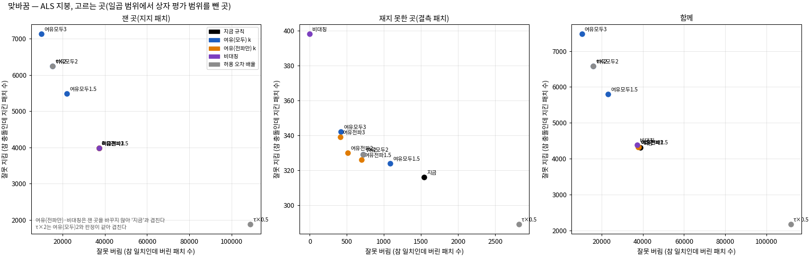

*읽는 법:* 재지 못한 곳(가운데)에서 여유(전파만) 2·3은 왼쪽으로 크게 가면서 거의 오르지 않는다. 잰 곳(왼쪽)에서는 여유(모두)만 움직이며, 왼쪽으로 가는 만큼 위로도 오른다.

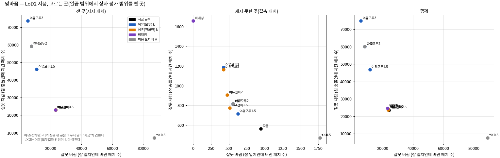

*읽는 법:* LoD2 지붕의 잰 곳에서 여유(모두)는 잘못 버림을 1.2만~1.8만 줄이는 대신 잘못 지킴을 2.3만~5.1만 늘린다. 재지 못한 곳에서도 잘못 버림을 줄이는 대안은 모두 위로 오른다.

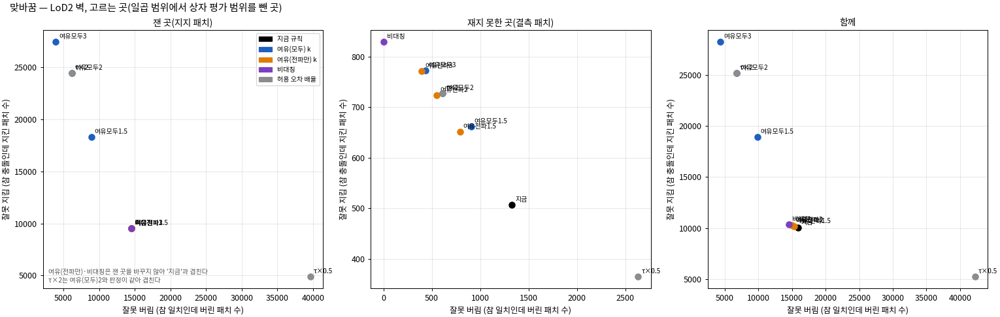

*읽는 법:* LoD2 벽도 지붕과 같은 모양이다. 재지 못한 곳에서는 지금 규칙의 버림 1,651개 가운데 1,329개가 잘못 버림이라 대안들이 이를 크게 줄이지만, 잘못 지킴도 28~64 % 는다.

### 1.4 분석자 추천 (에이전트 판단, 사람 검수 전)

설정에 미리 적은 기준은 '잘못 버림이 크게 줄면서 잘못 지킴은 거의 늘지 않는' 규칙과 k다.

- **항공 LiDAR, 재지 못한 곳: 여유 규칙(전파만) k = 2.**
  - 잘못 버림이 1,541개에서 515개로 67 % 준다. 잘못 지킴은 316개에서 330개로 14개 는다.
  - k = 3도 거의 같다(409개, 339개). 더 작은 k로 대부분의 이득을 얻으므로 2를 고른다.
  - 이 이득의 대부분은 R1의 반투명 지붕 홀에서 나온다. R1 재지 못한 곳의 잘못 버림이 1,128개에서 305개로 준다(2절 R1 긴 홀 그림).
- **항공 LiDAR, 잰 곳: 기준을 채우는 규칙이 없다(사용자 결정).**
  - 여유 규칙(모두) k = 2를 쓰면 잘못 버림이 37,244개에서 15,291개로 59 % 준다. 대신 잘못 지킴이 3,992개에서 6,250개로 57 % 는다.
  - 늘어난 잘못 지킴 가운데 1,395개는 참 차이가 1~2τ(항공 LiDAR τ는 8~16 cm)다. 4τ를 넘는 큰 충돌은 634개다.
  - 여유 규칙(모두)을 고르면 재지 못한 곳도 함께 바뀐다(720개, 329개). 여유 규칙(전파만) 2와 비슷하다.
  - 이 맞바꿈을 받아들일지는 사용자가 정한다. 근거 그림은 R4·R3E 평지붕(2절)과 상자 B173·R1 지도(3절)다.
- **LoD2: 지금 규칙.**
  - 여유 규칙(모두)은 잰 곳에서 잘못 버림 하나를 줄일 때 잘못 지킴이 1.6~2.8개 는다. 예를 들어 지붕 k = 1.5는 잘못 버림을 12,224개 줄이고 잘못 지킴을 23,102개 늘린다.
  - 재지 못한 곳의 여유 규칙(전파만) 1.5도 지붕에서 잘못 버림 436개를 줄이며 잘못 지킴 209개를 늘린다(+37 %).
  - 그래서 '거의 늘지 않는' 기준을 채우지 못한다.
- **비대칭 규칙과 허용 오차 0.5배는 추천하지 않는다.**
  - 비대칭은 심지 않을 점을 0으로 만든다. 대신 맞게 버린 결측 패치를 모두 지킴으로 돌린다(LoD2 지붕 1,092개, 벽 322개, 항공 LiDAR 82개).
  - 허용 오차 0.5배는 잘못 버림을 1.8~3.8배로 늘린다.
- 사전 정보마다 다른 규칙을 쓰는 것은 새 규칙이 아니다. 첫째 단계가 사전 정보마다 따로 돌기 때문이다. 다만 한 사전 정보 안에서 잰 곳과 재지 못한 곳에 다른 k를 섞는 조합은 미리 적은 후보에 없다. 그래서 견주지 않았고 추천하지도 않는다.

## 2. 대표 자리

- 발주가 정한 여덟 자리를 사전 정보별로 그렸다(그림 13장).
  - 자리의 패치는 설정에 결과 전에 적은 LoD2 면이다(`sites_v1.json`). 항공 LiDAR는 그 LoD2 패치 중심에서 평면 0.5 m 안의 패치로 정했다.
  - 'LoD2 면'은 위치를 정하는 데에만 썼고, 맞고 틀림은 참 라벨로 셌다.
- 자리의 파일 이름은 B173 양 날개(`B173_wings`), B173 가운데(`B173_middle`), R1 긴 홀(`R1_hall`), R3 벽(`R3_wall`), R4 평지붕(`R4_flat`), R3E 평지붕(`R3E_flat`), R5 벽 앞 나무(`R5_wall_trees`), B0 정면(`B0_facade`)이다.
- 표의 칸은 '잘못 버림 / 잘못 지킴'이다. 잰 곳과 재지 못한 곳을 합쳤다. 열 가지 규칙의 전체 수는 `tables/report_tables.md`(T4)에 있다.

| 자리 · 사전 정보 | 발주의 맞는 판단 | 참 라벨 패치 | 참 충돌 몫 | 지금 규칙 | 여유(모두) 1.5 | 여유(모두) 2 | 여유(모두) 3 | 여유(전파만) 2 | 여유(전파만) 3 | 비대칭 |
|---|---|---|---|---|---|---|---|---|---|---|
| B173 양 날개 · LoD2 | 버림 | 18,299 | 100 % | 0 / 0 | 0 / 0 | 0 / 0 | 0 / 0 | 0 / 0 | 0 / 0 | 0 / 8 |
| B173 양 날개 · 항공 LiDAR | 버림 | 17,191 | 100 % | 14 / 16 | 12 / 23 | 11 / 38 | 9 / 57 | 14 / 17 | 14 / 17 | 13 / 27 |
| B173 가운데 · LoD2 | 지킴 | 13,399 | 61 % | 1,647 / 4,080 | 1,111 / 5,314 | 739 / 6,248 | 239 / 7,471 | 1,646 / 4,081 | 1,640 / 4,082 | 1,620 / 4,084 |
| B173 가운데 · 항공 LiDAR | 버림 | 8,440 | 40 % | 2,692 / 36 | 1,629 / 59 | 1,289 / 94 | 760 / 202 | 2,687 / 38 | 2,686 / 38 | 2,676 / 41 |
| R1 긴 홀 · LoD2 | 버림 | 5,142 | 64 % | 1,468 / 243 | 1,313 / 469 | 1,178 / 745 | 919 / 1,017 | 1,332 / 507 | 1,321 / 541 | 1,091 / 821 |
| R1 긴 홀 · 항공 LiDAR | 지킴 | 6,334 | 0 % | 3,866 / 0 | 3,025 / 0 | 2,421 / 0 | 1,559 / 0 | 3,390 / 0 | 3,353 / 0 | 3,178 / 0 |
| R3 벽 · LoD2 | 버림 | 2,154 | 100 % | 0 / 41 | 0 / 262 | 0 / 495 | 0 / 1,133 | 0 / 44 | 0 / 46 | 0 / 86 |
| R4 평지붕 · LoD2 | 지킴 | 10,811 | 6 % | 385 / 134 | 113 / 159 | 73 / 187 | 37 / 277 | 318 / 134 | 317 / 134 | 317 / 135 |
| R4 평지붕 · 항공 LiDAR | 지킴 | 10,328 | 3 % | 2,130 / 141 | 1,255 / 169 | 406 / 184 | 170 / 205 | 1,988 / 143 | 1,950 / 144 | 1,948 / 144 |
| R3E 평지붕 · LoD2 | 지킴 | 22,548 | 39 % | 1,422 / 4,199 | 100 / 6,627 | 51 / 6,945 | 20 / 7,228 | 1,335 / 4,212 | 1,335 / 4,219 | 1,335 / 4,243 |
| R3E 평지붕 · 항공 LiDAR | 지킴 | 23,216 | 2 % | 634 / 381 | 285 / 407 | 136 / 421 | 64 / 435 | 633 / 381 | 633 / 381 | 633 / 381 |
| R5 벽 앞 나무 · LoD2 | 지킴 | 1,061 | 0 % | 750 / 0 | 599 / 0 | 416 / 0 | 242 / 0 | 579 / 0 | 488 / 0 | 319 / 0 |
| B0 정면 · LoD2 | 판단만 | 18,805 | 11 % | 752 / 1,002 | 354 / 1,505 | 6 / 2,067 | 6 / 2,068 | 750 / 1,003 | 750 / 1,003 | 749 / 1,003 |

**발주의 '맞는 판단'과 참 라벨이 갈리는 자리(분석자 판독).** 네 자리에서 참 라벨이 자리 전체의 기대와 다르다. 자리 안에 참 충돌과 참 일치가 섞여 있으면, 어떤 규칙도 자리 전체를 한쪽으로 판단해서는 맞을 수 없다.

- B173 가운데의 LoD2(기대 지킴): 참 충돌이 61 %다. 톱니의 꼭대기와 골 자리가 참값과 조금씩 어긋나 있다.
- B173 가운데의 항공 LiDAR(기대 버림): 참 충돌이 40 %다. 대부분이 지금 톱니 지붕과 맞는다.
- R1 긴 홀의 LoD2(기대 버림): 참 충돌이 64 %다. 홀 지붕이 고르게 1 m 높지는 않다.
- R3E 평지붕의 LoD2(기대 지킴): 참 충돌이 39 %다. LoD2 평지붕이 0.2~0.4 m 높은 곳이 많다.

**그림 읽는 법(공통).**

- 윗줄은 규칙과 상관없는 세 칸이다. 연직 사진(자홍 선 = 이 자리, 하늘색 A–B = 단면 위치), 관측 신뢰도(노랑 = 1), 단면(사전 정보 선, 이 시점의 신뢰도 1 MVS = 초록 점, 참값 ±0.25 m = 검은 점)이다.
- 아래 두 줄은 규칙별로 바뀌는 두 칸이다.
  - 가운데 줄은 일치·충돌 표시다(초록 = 일치, 빨강 = 충돌, 회색 = 관측 또는 사전 정보 없음).
  - 아랫줄은 패치 상태와 판정이다. 연초록은 지지·지킴, 연주황은 지지·버림이다. 진초록은 결측→일치, 진빨강은 결측→충돌(버림, 심지 않음), 노랑은 결측→미판정(지킴)이다. 파랑은 비가시, 회색은 패치 밖이다.
  - 칸 아래 수는 이 자리에서 버린 패치 수다.
- 발주의 다섯 칸 가운데 규칙과 상관없는 셋(사진, 신뢰도, 단면)은 맨 위에 한 번만 두었다. 사진은 준비 측정 v1.1의 규칙(지붕 = 자리를 가장 많이 담은 연직 학습 영상, 벽 = 자리를 가장 많이 담은 영상)으로 골랐다.

#### 버려야 맞는 곳

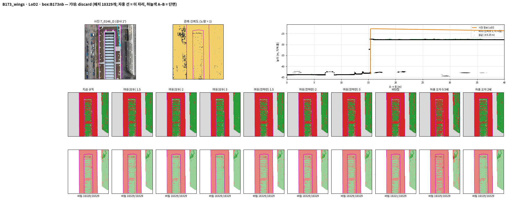

*읽는 법:* 단면에서 LoD2 지붕(주황)이 참값(검정)과 MVS(초록)보다 약 5 m 높다(옛 박공). 모든 규칙이 자리 패치를 다 버린다(18,329개 중 18,329개, 비대칭만 18,321개).

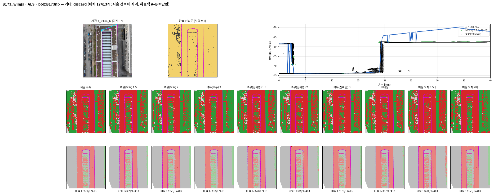

*읽는 법:* 항공 LiDAR(파랑)도 지붕이 참값보다 3~8 m 높은 옛 박공을 담고 있다. 모든 규칙이 거의 다 버린다(17,413개 중 17,332~17,400개).

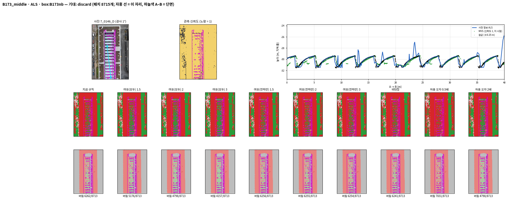

*읽는 법:* 항공 LiDAR(파랑)는 대부분 지금 톱니 지붕과 맞고(참 충돌 40 %), 어긋남은 톱니 사이의 뾰족한 튐에 몰려 있다. 지금 규칙은 8,713개 중 6,262개를 버려 잘못 버림이 2,692개이고, 여유(모두) 3에서 760개로 준다.

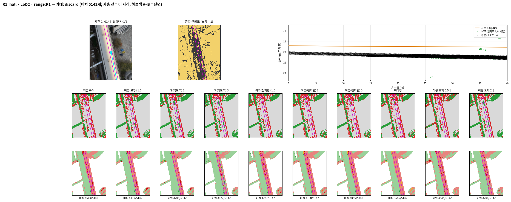

*읽는 법:* LoD2 지붕(주황)이 참값보다 약 0.9 m 높고, 반투명 지붕이라 MVS가 거의 없다(신뢰도 칸의 검은 띠). 지금 규칙은 5,142개 중 4,500개를 버리며, 재지 못한 1,371개 가운데 955개는 빌려 온 충돌로 버린다.

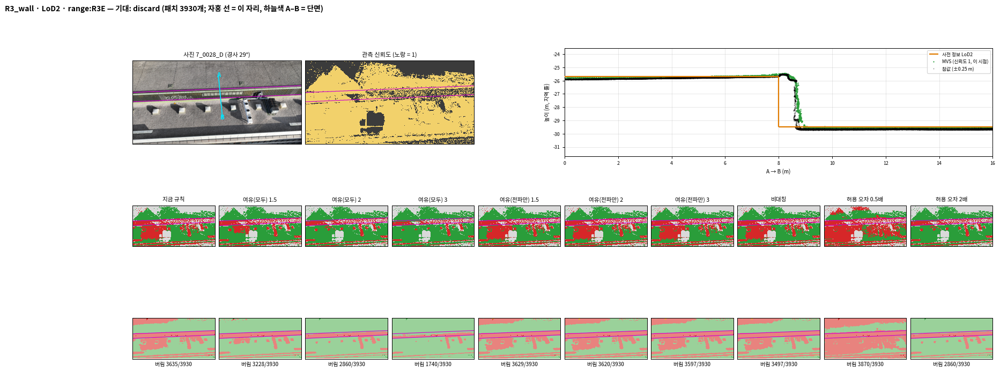

*읽는 법:* 단면에서 LoD2 벽(주황)이 참값·MVS 벽보다 0.6~0.7 m 안쪽에 있다. 지금 규칙은 라벨이 있는 2,154개 가운데 2,113개를 맞게 버리고, 여유(모두) 3에서는 1,133개를 잘못 지킨다.

#### 지켜야 맞는 곳

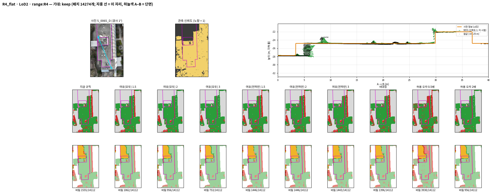

*읽는 법:* 넓은 평지붕에서 LoD2(주황), 참값, MVS가 거의 같은 높이이고(참 충돌 6 %), 왼쪽 위의 노랑은 MVS가 비어 미판정으로 이어받는 곳이다. 지금 규칙의 잘못 버림 385개가 여유(모두) 2에서 73개로 준다.

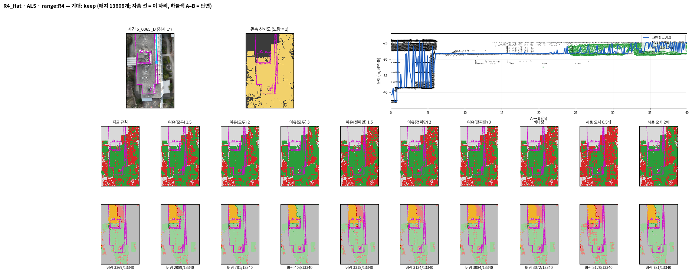

*읽는 법:* 항공 LiDAR는 평지붕에서 참값과 맞는데(참 충돌 3 %), 지금 규칙은 13,340개 중 3,369개를 버린다(잘못 버림 2,130개). 여유(모두) 2는 잘못 버림을 406개로 줄이고, 전파 규칙들은 거의 줄이지 못한다(1,948~1,988개).

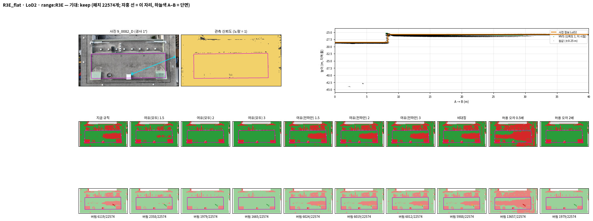

*읽는 법:* 지금 규칙은 평지붕의 오른쪽 절반을 버리는데, 참값으로는 LoD2가 그만큼 높은 곳이 많다(잘못 버림 1,422개, 잘못 지킴 4,199개). 여유(모두) 2는 잘못 버림을 51개로 줄이는 대신 잘못 지킴을 6,945개로 늘린다.

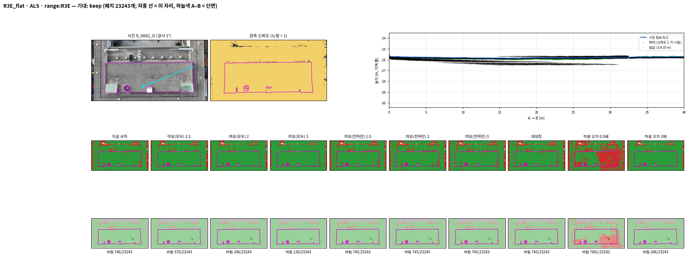

*읽는 법:* 항공 LiDAR, 참값, MVS가 평지붕에서 거의 겹친다(참 충돌 2 %). 지금 규칙의 버림은 23,243개 중 746개로 적고(잘못 버림 634개), 여유(모두) 2에서 잘못 버림이 136개로 준다.

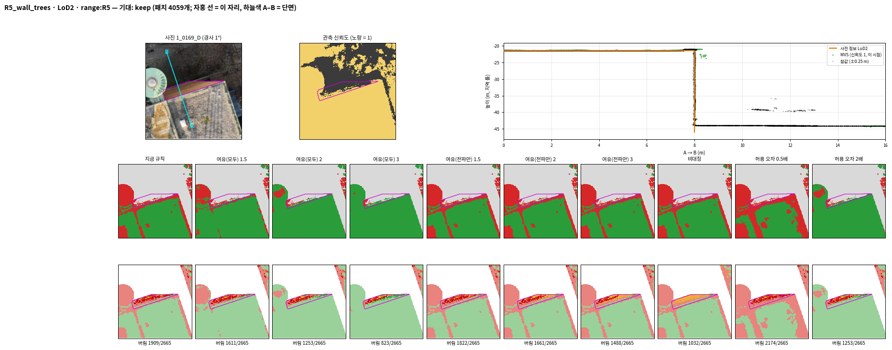

*읽는 법:* 단면에서 LoD2 벽과 참값 벽이 겹치는데(참 충돌 0 %), 벽 앞 나무를 잰 MVS 때문에 잰 패치가 충돌로 읽히고(1,377개 중 1,032개 버림), 재지 못한 패치는 그 충돌을 빌려 온다(진빨강). 버림은 지금 규칙 1,909개에서 여유(모두) 3은 823개, 비대칭은 1,032개로 준다.

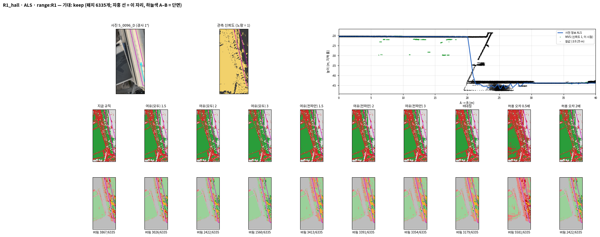

*읽는 법:* 항공 LiDAR(파랑)는 참값과 맞는데(참 충돌 0 %), MVS(초록)는 반투명 지붕 아래를 재어 1~10 m 낮게 찍힌다. 라벨이 있는 버림 3,866개가 모두 잘못 버림이며, 재지 못한 곳의 버림은 여유(전파만) 2에서 688개 → 212개, 비대칭에서 0개로 준다.

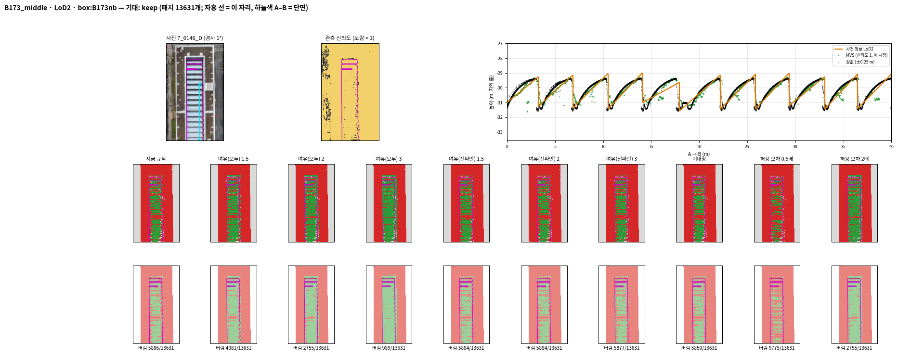

*읽는 법:* LoD2(주황)는 톱니 모양을 따르지만 꼭대기와 골 자리가 참값과 조금씩 어긋나, 패치의 61 %가 참 충돌이다. 여유(모두)가 커질수록 지키는 곳이 늘어(버림 5,886개 → 989개) 잘못 지킴이 4,080개에서 7,471개로 는다.

#### 크기로 가르기 어려운 곳

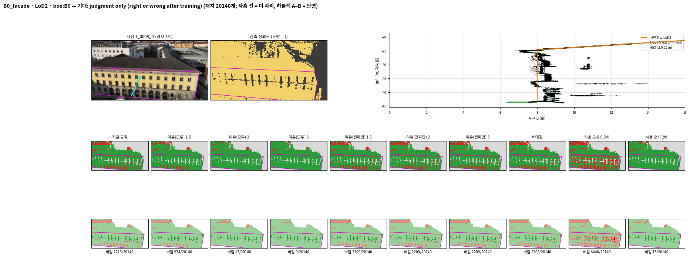

*읽는 법:* 단면에서 LoD2 벽(주황)은 참값 정면(창과 돌출로 약 1.5 m 폭)의 바깥쪽에 있고, 창은 MVS가 재지 못한다(신뢰도 칸의 검은 창 무늬). 지금 규칙은 20,140개 중 2,213개를 버리고, 여유(모두) 2 이상에서는 거의 버리지 않는다(13개 이하).

## 3. 상자 넷 확인

- 여기 수는 확인하는 곳에서 센 것이다. 확인하는 곳은 상자 넷의 평가 범위이고, 상자 MVS와 4절의 새 고정값을 썼다. 규칙을 고르는 데에는 쓰지 않았고 보고만 한다.
- 상자 이름은 B0(`B0_b10`), B173과 이웃(`B173nb_b10`), B173만(`B173_b0`), R1 부채꼴(`R1rep_b10`)이다. 괄호 안은 산출 파일의 이름이다.
- 표의 칸은 '잘못 버림 / 잘못 지킴 (심지 않을 점)'이다. 잰 곳과 재지 못한 곳을 합쳤다. 열 가지 규칙의 맞고 틀린 수 전체는 `tables/report_tables.md`(T3)에 있다.

| 상자 · 사전 정보 | 참 라벨 패치 | 참 충돌 몫 | 지금 규칙 | 여유(모두) 1.5 | 여유(모두) 2 | 여유(모두) 3 | 여유(전파만) 2 | 여유(전파만) 3 | 비대칭 |
|---|---|---|---|---|---|---|---|---|---|
| B0 · LoD2 | 65,130 | 11 % | 3,851 / 2,354 (673) | 2,599 / 3,448 (639) | 2,047 / 4,686 (605) | 1,943 / 5,538 (593) | 3,836 / 2,359 (619) | 3,835 / 2,363 (597) | 3,743 / 2,376 (0) |
| B0 · 항공 LiDAR | 23,104 | 1 % | 802 / 247 (3) | 547 / 264 (3) | 431 / 277 (3) | 320 / 288 (3) | 799 / 247 (0) | 799 / 247 (0) | 799 / 247 (0) |
| B173과 이웃 · LoD2 | 65,859 | 45 % | 2,334 / 6,076 (978) | 1,389 / 8,201 (795) | 880 / 9,456 (700) | 300 / 10,695 (585) | 2,302 / 6,093 (602) | 2,294 / 6,094 (492) | 2,278 / 6,102 (0) |
| B173과 이웃 · 항공 LiDAR | 30,930 | 60 % | 1,873 / 34 (23) | 912 / 55 (20) | 695 / 92 (20) | 416 / 155 (17) | 1,869 / 34 (20) | 1,868 / 34 (19) | 1,860 / 43 (0) |
| B173만 · LoD2 | 50,035 | 60 % | 4,353 / 5,695 (681) | 3,493 / 7,813 (575) | 2,999 / 9,109 (499) | 2,492 / 10,719 (447) | 4,334 / 5,708 (402) | 4,328 / 5,708 (347) | 4,313 / 5,716 (0) |
| B173만 · 항공 LiDAR | 22,047 | 85 % | 1,510 / 74 (10) | 1,006 / 109 (8) | 831 / 143 (8) | 597 / 219 (7) | 1,510 / 74 (8) | 1,510 / 74 (8) | 1,509 / 79 (0) |
| R1 부채꼴 · LoD2 | 42,110 | 38 % | 8,501 / 1,203 (623) | 7,727 / 3,407 (574) | 7,619 / 5,005 (534) | 7,410 / 6,351 (476) | 8,456 / 1,244 (488) | 8,451 / 1,268 (419) | 8,396 / 1,343 (0) |
| R1 부채꼴 · 항공 LiDAR | 22,936 | 3 % | 8,148 / 51 (88) | 6,496 / 90 (87) | 5,644 / 138 (87) | 4,654 / 197 (86) | 8,134 / 51 (68) | 8,133 / 51 (66) | 8,092 / 66 (0) |

분석자 판독(사람 검수 전):

- **항공 LiDAR는 고르는 곳과 같은 방향이다.**
  - 여유 규칙(모두)이 잘못 버림을 크게 줄이고 잘못 지킴은 조금 늘린다.
  - k = 2에서 잘못 버림은 B0 802개 → 431개, B173과 이웃 1,873개 → 695개, B173만 1,510개 → 831개, R1 부채꼴 8,148개 → 5,644개로 줄었다. 잘못 지킴은 상자마다 30~87개 늘었다.
- **LoD2도 같은 방향이다.** 여유 규칙(모두)은 잘못 지킴을 크게 늘린다. k = 2에서 B0 2,354개 → 4,686개, B173과 이웃 6,076개 → 9,456개, B173만 5,695개 → 9,109개, R1 부채꼴 1,203개 → 5,005개였다.
- **전파만 바꾸는 규칙은 상자에서 거의 차이가 없다.** 상자 안 재지 못한 곳이 적어, 여유 규칙(전파만)과 비대칭 규칙의 맞고 틀린 수가 지금 규칙과 거의 같다. 비대칭은 심지 않을 점이 0이다.
- **R1 부채꼴 항공 LiDAR는 어떤 규칙에서도 잘못 버림이 크다.** 참 충돌 몫이 3 %인데, 지금 규칙에서 맞게 버림 699개, 잘못 버림 8,148개다. 여유 규칙(모두) 3에서도 4,654개가 남는다.

아래 지도 여덟 장은 모두 같은 방식으로 그렸다. 칸 하나가 규칙 하나이고, 점선 안이 평가 범위다. 칸 제목의 수는 상자 전체(맥락 띠 포함)의 수이며, 색은 패치 상태와 판정이다.

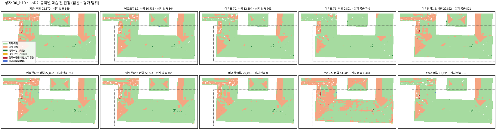

*읽는 법:* 주황(지지·버림)의 큰 덩어리(오른쪽 날개, 삼각 지붕면)는 모든 규칙에서 남는다. 여유(모두)가 커질수록 왼쪽 아래의 주황 조각이 준다.

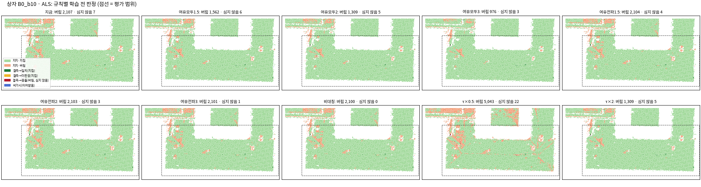

*읽는 법:* 항공 LiDAR의 버림은 지붕 가장자리와 작은 조각이며, 여유(모두)가 커질수록 준다(상자 전체 2,107개 → 976개). 전파 규칙들은 지금 규칙과 거의 같다.

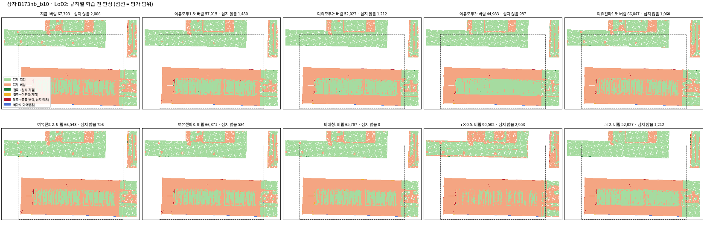

*읽는 법:* B173 건물(아래)의 바깥 띠는 모든 규칙에서 버려진다. 가운데 톱니 지붕(초록 줄무늬)은 여유(모두)가 커질수록 지키는 곳이 넓어진다.

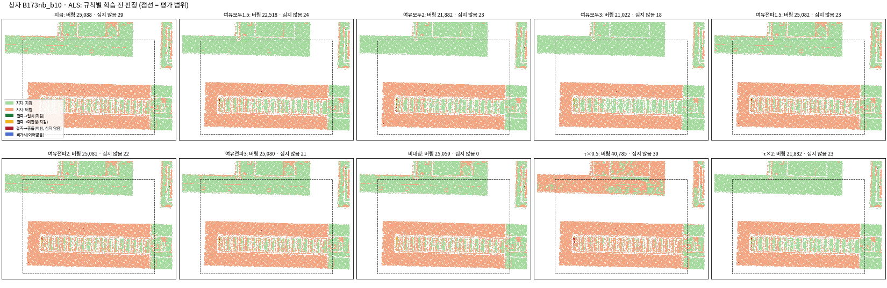

*읽는 법:* B173 건물은 모든 규칙에서 대부분 버려진다(평가 범위의 참 충돌 60 %). 이웃 건물(위)의 작은 주황 조각은 여유(모두)에서 줄고, 허용 오차 0.5배에서 크게 는다.

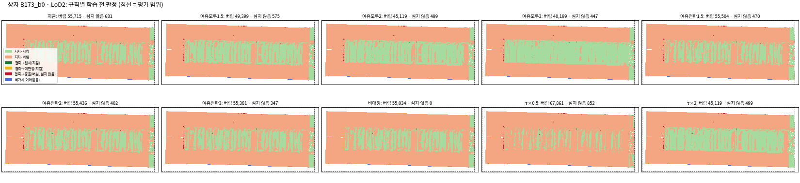

*읽는 법:* 같은 건물을 맥락 띠 없이 본 것이다. B173과 이웃의 지도와 같은 모양이다.

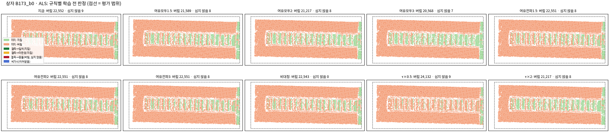

*읽는 법:* 건물 대부분이 버려지고(참 충돌 85 %), 가운데 톱니 지붕의 일부만 지킨다. 여유(모두) 3에서 가운데의 초록이 조금 넓어진다.

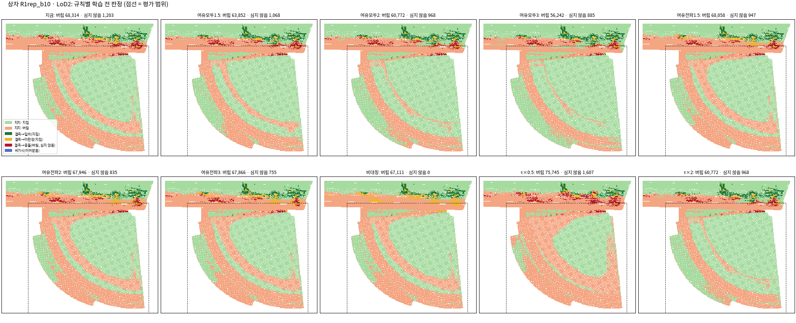

*읽는 법:* 부채꼴 지붕의 고리 띠가 버려지고, 위쪽 긴 홀(대부분 평가 범위 밖)에는 재지 못한 곳(빨강 = 빌려 온 충돌, 진초록 = 빌려 온 일치)이 모여 있다. 비대칭은 빨강을 모두 노랑(미판정)으로 바꾼다.

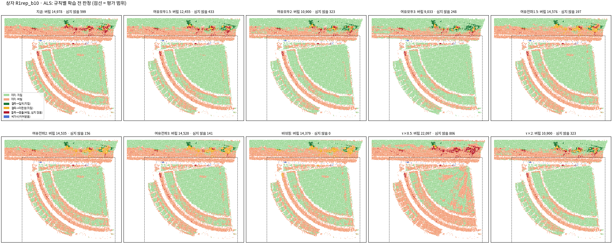

*읽는 법:* 부채꼴 지붕의 고리 띠와 위쪽 긴 홀이 버려지는데, 평가 범위에서는 대부분 잘못 버림이다(참 충돌 3 %). 여유(모두)가 커질수록 고리 띠의 주황이 준다.

## 4. 허용 오차와 정합 다시 재기

### 4.1 학습 영상만으로 다시 만든 MVS

- 일곱 범위의 MVS를 학습 영상만으로 다시 만들었다. COLMAP 이미지(같은 다이제스트), 해상도, 설정은 준비 측정과 같다. GPU 두 대로 01:32부터 05:08까지 3시간 36분 걸렸다.
- 깊이 지도가 나오지 않은 영상이 R1 588장 중 6장, R4 102장 중 4장, R5 252장 중 2장 있었다. 나머지 범위는 모두 나왔다. 이 영상들은 첫째 단계에서 관측이 없는 시점으로 빠진다.
- 범위마다 두 사전 정보로 첫째 단계를 다시 돌렸다(14건). 참값은 v5 규칙 그대로 새 MVS에 높이만 다시 맞췄다.
- 평가 제외 칸은 준비 측정 v1.1 파일을 그대로 썼다. 새 MVS로 다시 계산해 보니 일곱 범위 모두 같았다.

### 4.2 준비 측정 v1.1 값과 새 값

| 범위 | 사전 정보 | 영상 v1.1 | 영상 새 | τ 지붕 v1.1 | τ 지붕 새 | τ 벽 v1.1 | τ 벽 새 | 정합 v1.1 | 정합 새 | 참값 맞춤 v1.1 | 참값 맞춤 새 |
|---|---|---|---|---|---|---|---|---|---|---|---|
| R1 | LoD2 | 588 | 582 | 0.682 | 0.683 | 0.731 | 0.725 | [0.0, 0.0, 0.0] | [0.0, 0.0, 0.0] | -0.054 | -0.050 |
| R1 | 항공 LiDAR | 588 | 582 | 0.099 | 0.103 | 0.099 | 0.103 | [0.0, 0.0, 0.0] | [0.0, 0.0, 0.0] | -0.054 | -0.050 |
| R2 | LoD2 | 221 | 221 | 0.186 | 0.176 | 0.220 | 0.228 | [0.0, 0.0, 0.0] | [0.0, 0.0, 0.0] | -0.044 | -0.053 |
| R2 | 항공 LiDAR | 221 | 221 | 0.158 | 0.147 | 0.158 | 0.147 | [0.0, 0.0, 0.0] | [-0.056, 0.063, 0.0] | -0.044 | -0.053 |
| R3E | LoD2 | 311 | 311 | 0.162 | 0.159 | 0.186 | 0.188 | [0.0, 0.0, 0.0] | [0.0, 0.0, 0.0] | -0.050 | -0.054 |
| R3E | 항공 LiDAR | 311 | 311 | 0.118 | 0.113 | 0.118 | 0.113 | [-0.015, 0.026, 0.063] | [-0.013, 0.027, 0.063] | -0.050 | -0.054 |
| R4 | LoD2 | 102 | 98 | 0.378 | 0.367 | 0.780 | 0.788 | [0.0, 0.0, 0.0] | [0.0, 0.0, 0.0] | -0.086 | -0.083 |
| R4 | 항공 LiDAR | 102 | 98 | 0.168 | 0.163 | 0.168 | 0.163 | [0.002, 0.018, 0.0] | [0.005, 0.037, 0.0] | -0.086 | -0.083 |
| R5 | LoD2 | 252 | 250 | 0.219 | 0.236 | 0.176 | 0.182 | [0.0, 0.0, 0.0] | [0.0, 0.0, 0.0] | -0.056 | -0.041 |
| R5 | 항공 LiDAR | 252 | 250 | 0.108 | 0.119 | 0.108 | 0.119 | [0.003, 0.018, 0.073] | [-0.002, 0.021, 0.073] | -0.056 | -0.041 |
| SW | LoD2 | 266 | 266 | 0.849 | 0.851 | 0.475 | 0.475 | [0.0, 0.0, 0.0] | [0.0, 0.0, 0.0] | -0.079 | -0.075 |
| SW | 항공 LiDAR | 266 | 266 | 0.082 | 0.084 | 0.082 | 0.084 | [0.0, 0.0, 0.0] | [0.0, 0.0, 0.0] | -0.079 | -0.075 |
| B0 | LoD2 | 272 | 272 | 0.203 | 0.198 | 0.551 | 0.547 | [0.0, 0.0, 0.0] | [0.0, 0.0, 0.0] | -0.030 | -0.035 |
| B0 | 항공 LiDAR | 272 | 272 | 0.128 | 0.127 | 0.128 | 0.127 | [-0.046, 0.046, 0.0] | [-0.048, 0.043, 0.0] | -0.030 | -0.035 |

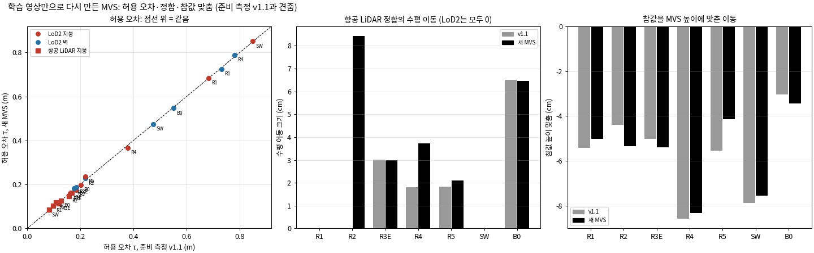

*읽는 법:* 왼쪽 그림에서 모든 점이 점선(같음)에 붙어 있어 허용 오차가 거의 바뀌지 않았다. 가운데(항공 LiDAR 정합의 수평 이동)에서는 R2만 새로 이동이 생겼고, 오른쪽(참값 높이 맞춤)은 모든 범위에서 비슷하다.

- **허용 오차는 거의 같다.** 가장 크게 바뀐 곳은 R5 LoD2 지붕(0.219 → 0.236 m)과 R5 항공 LiDAR(0.108 → 0.119 m)다. 나머지는 1.1 cm 이하로 바뀌었다.
- **정합은 R2 항공 LiDAR만 결과가 바뀌었다.**
  - 관문 바로 옆의 경우다. 정합은 다시 렌더한 높이 차이 NMAD가 줄 때만 이동을 받는다.
  - v1.1에서는 같은 걸음이 NMAD를 0.0881에서 0.0883으로 늘려 거절되었다. 새 MVS에서는 0.0846에서 0.0845로 줄어 받아들여졌다(수평 8.4 cm).
  - 영상 오차의 작은 차이가 받을지 말지를 갈랐다.
  - R4 항공 LiDAR의 수평 이동은 1.8 cm에서 3.7 cm로 바뀌었다. 나머지는 1 cm 안에서 같다. LoD2는 v1.1처럼 모든 범위에서 이동이 없다.
- **참값 높이 맞춤**은 −3.5 ~ −8.3 cm였다. v1.1과의 차이는 1.5 cm 이하(가장 큰 곳 R5)다.

### 4.3 상자 넷 다시 채점

새 값으로 고정해 상자 넷을 다시 채점했다. B0 상자에는 B0 크롭 값을 썼다. B173과 이웃, B173만에는 R2 값을, R1 부채꼴에는 R1 값을 썼다. 상자 MVS는 준비 측정의 것(학습 영상만)을 그대로 썼다. 아래는 지금 규칙으로 평가 범위 안을 센 것이다.

| 상자 | 사전 정보 | τ 지붕 (m) | 수평 정합 (m) | 참 라벨 패치 | 맞게 버림 | 잘못 버림 | 맞게 지킴 | 잘못 지킴 | 심지 않을 점 |
|---|---|---|---|---|---|---|---|---|---|
| B0 | LoD2 | 0.203 → 0.198 | [0.0, 0.0] → [0.0, 0.0] | 65,130 → 65,130 | 4,960 → 5,016 | 3,816 → 3,851 | 54,037 → 53,909 | 2,317 → 2,354 | 672 → 673 |
| B0 | 항공 LiDAR | 0.128 → 0.127 | [-0.046, 0.046] → [-0.048, 0.043] | 23,105 → 23,106 | 86 → 84 | 789 → 802 | 21,990 → 21,971 | 238 → 247 | 4 → 3 |
| B173과 이웃 | LoD2 | 0.186 → 0.176 | [0.0, 0.0] → [0.0, 0.0] | 65,884 → 65,884 | 23,554 → 23,700 | 2,357 → 2,334 | 33,854 → 33,749 | 6,094 → 6,076 | 1,005 → 978 |
| B173과 이웃 | 항공 LiDAR | 0.158 → 0.147 | [0.0, 0.0] → [-0.056, 0.063] | 31,047 → 30,931 | 18,644 → 18,616 | 1,933 → 1,873 | 10,441 → 10,407 | 29 → 34 | 19 → 23 |
| B173만 | LoD2 | 0.186 → 0.176 | [0.0, 0.0] → [0.0, 0.0] | 50,064 → 50,064 | 24,068 → 24,263 | 4,404 → 4,353 | 15,880 → 15,724 | 5,683 → 5,695 | 687 → 681 |
| B173만 | 항공 LiDAR | 0.158 → 0.147 | [0.0, 0.0] → [-0.056, 0.063] | 22,159 → 22,049 | 18,623 → 18,655 | 1,703 → 1,510 | 1,781 → 1,808 | 52 → 74 | 8 → 10 |
| R1 부채꼴 | LoD2 | 0.682 → 0.683 | [0.0, 0.0] → [0.0, 0.0] | 42,126 → 42,126 | 14,586 → 14,599 | 8,513 → 8,501 | 17,815 → 17,807 | 1,196 → 1,203 | 623 → 623 |
| R1 부채꼴 | 항공 LiDAR | 0.099 → 0.103 | [0.0, 0.0] → [0.0, 0.0] | 22,948 → 22,948 | 796 → 699 | 8,317 → 8,148 | 13,764 → 14,038 | 59 → 51 | 88 → 88 |

- 바뀐 폭은 작다. 가장 큰 변화는 항공 LiDAR에서 나왔다.
  - B173만: R2 정합 이동이 새로 들어가 잘못 버림이 1,703개에서 1,510개로 줄었다.
  - R1 부채꼴: τ가 0.099 m에서 0.103 m로 커졌다. 잘못 버림이 8,317개에서 8,148개로, 맞게 버림이 796개에서 699개로 줄었다.
- B173 두 상자의 항공 LiDAR 참 라벨 패치 수도 조금 바뀌었다(31,047개 → 30,931개). 정합 이동으로 사전 정보가 옮겨져 패치와 라벨이 다시 만들어졌기 때문이다.
- 상자의 규칙별 수는 3절에 있다.

## 5. 관측의 양

### 5.1 일곱 조건

| 조건 | 학습 영상 | 고른 방법 | MVS |
|---|---|---|---|
| COVER | 209장 (연직 40, 경사 169) | B0를 덮는 공통 영상(준비 측정 그대로) | 준비 측정 것 |
| A15 · A9 · A3 | 13 · 8 · 2장 (모두 경사) | 저자 15·9·3장 조건(준비 측정 v1.1과 같은 영상) | 준비 측정 것 |
| N13 · N8 | 13 · 8장 (연직 2 + 경사 11, 연직 2 + 경사 6) | COVER 학습 영상에서 결과 전에 적은 규칙으로 고름 | 새로 만듦. N8은 8장 중 7장만 깊이 지도가 나옴 |
| N2 | 2장 (연직 1 + 경사 1) | 같은 규칙 | **만들 수 없었다**(함께 보는 성긴 점 17개, 깊이 지도 0장) |

- 연직 포함 조건의 규칙은 설정에 결과 전에 적었다(`discard_v1.json`의 `b0_conditions`). 연직 영상 수는 COVER의 비율(40/209)에 맞춰 max(1, round(n × 40/209))로 정했다. 대상 건물의 LoD2 패치를 가장 많이 새로 덮는 영상을 연직부터, 다음에 경사 순으로 더했다. 덮는 몫(사전 정보를 렌더해 본 몫이며 MVS와 무관하다)은 N13 98 %, N8 98 %, N2 65 %다. 저자 조건은 58 %, 49 %, 37 %다.
- 허용 오차와 정합은 4절의 B0 크롭 새 값으로 고정했다(LoD2 지붕 0.198 m, 벽 0.547 m, 항공 LiDAR 0.127 m와 수평 이동 (−0.048, 0.043) m).
- 세는 영역은 대상 건물 + 2 m다(준비 측정 사례 6과 같다). 크롭 전체의 표는 `tables/report_tables.md`(T6-crop)에 있다.
- '이어받는 몫'은 판정 없이 사전 정보를 그대로 쓰는 패치의 몫이다(비가시 + 결측 가운데 혼재·근거 부족). '이어받음·참 충돌'은 그 가운데 옛 자료가 실제로 틀린 패치의 수다.

| 조건 | 학습 영상 | 사전 정보·면 | 지지 / 결측 / 비가시 | 이어받는 몫 | 지지 중 충돌 | 잘못 버림 | 잘못 지킴 | 이어받음·참 충돌 |
|---|---|---|---|---|---|---|---|---|
| COVER | 209 | LoD2 지붕 | 1.00 / 0.00 / 0.00 | 0.00 | 0.15 | 409 | 361 | 1 |
| COVER | 209 | LoD2 벽 | 0.92 / 0.07 / 0.01 | 0.03 | 0.13 | 2,155 | 1,745 | 0 |
| COVER | 209 | 항공 LiDAR 지붕 | 1.00 / 0.00 / 0.00 | 0.00 | 0.04 | 374 | 229 | 2 |
| A15 | 13 | LoD2 지붕 | 0.55 / 0.05 / 0.40 | 0.43 | 0.16 | 402 | 116 | 1,013 |
| A15 | 13 | LoD2 벽 | 0.44 / 0.12 / 0.44 | 0.49 | 0.12 | 1,107 | 1,276 | 591 |
| A15 | 13 | 항공 LiDAR 지붕 | 0.58 / 0.06 / 0.36 | 0.40 | 0.08 | 913 | 36 | 244 |
| A9 | 8 | LoD2 지붕 | 0.51 / 0.08 / 0.41 | 0.45 | 0.16 | 487 | 138 | 1,028 |
| A9 | 8 | LoD2 벽 | 0.39 / 0.17 / 0.44 | 0.56 | 0.12 | 896 | 1,308 | 663 |
| A9 | 8 | 항공 LiDAR 지붕 | 0.54 / 0.09 / 0.37 | 0.42 | 0.09 | 1,126 | 41 | 249 |
| A3 | 2 | LoD2 지붕 | 0.23 / 0.29 / 0.48 | 0.63 | 0.27 | 2,134 | 446 | 1,476 |
| A3 | 2 | LoD2 벽 | 0.30 / 0.26 / 0.44 | 0.58 | 0.26 | 5,487 | 1,344 | 963 |
| A3 | 2 | 항공 LiDAR 지붕 | 0.24 / 0.31 / 0.45 | 0.60 | 0.34 | 3,637 | 19 | 255 |
| N13 | 13 | LoD2 지붕 | 0.12 / 0.86 / 0.01 | 0.79 | 0.10 | 260 | 2,317 | 2,134 |
| N13 | 13 | LoD2 벽 | 0.04 / 0.90 / 0.06 | 0.91 | 0.14 | 389 | 2,827 | 2,765 |
| N13 | 13 | 항공 LiDAR 지붕 | 0.12 / 0.87 / 0.00 | 0.79 | 0.10 | 223 | 248 | 167 |
| N8 | 7 | LoD2 지붕 | 0.03 / 0.96 / 0.01 | 0.92 | 0.28 | 235 | 2,440 | 2,358 |
| N8 | 7 | LoD2 벽 | 0.01 / 0.93 / 0.06 | 0.98 | 0.58 | 113 | 2,835 | 2,818 |
| N8 | 7 | 항공 LiDAR 지붕 | 0.03 / 0.96 / 0.00 | 0.92 | 0.34 | 246 | 244 | 222 |

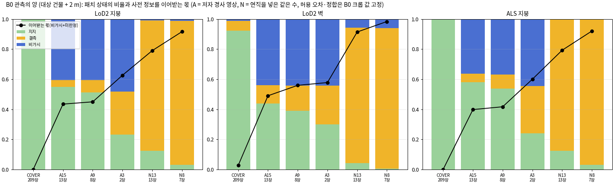

*읽는 법:* 막대는 대상 건물 패치의 상태(초록 지지, 노랑 결측, 파랑 비가시)이고, 검은 선은 이어받는 몫이다. 저자 조건(A)은 13장과 8장이 비슷하고 2장에서 지지가 크게 준다. 연직 포함 조건(N)은 거의 다 보이지만(파랑 거의 없음) 대부분이 결측이다.

### 5.2 영상 수의 효과 (같은 시점 구성 안에서 수만 바꿈)

- **저자 경사 영상(A15 → A9 → A3).** LoD2 지붕의 지지 몫이 0.55 → 0.51 → 0.23으로 줄고, 이어받는 몫이 0.43 → 0.45 → 0.63으로 는다. 13장과 8장은 비슷하고, 2장에서 크게 바뀐다.
- **2장에서는 잰 곳의 질도 떨어진다.**
  - 지지 패치 가운데 충돌의 몫이 LoD2 지붕 0.16 → 0.27, 항공 LiDAR 0.08 → 0.34로 는다.
  - 그래서 잘못 버림이 크게 는다(항공 LiDAR 913 → 1,126 → 3,637개, LoD2 지붕 402 → 487 → 2,134개).
- **옛 자료가 틀렸는데 재지 못해 그대로 쓰는 패치(이어받음·참 충돌)도 는다.** LoD2 지붕은 1,013 → 1,028 → 1,476개, LoD2 벽은 591 → 663 → 963개다.
- **연직 포함(N13 → N8)도 수가 줄면 지지가 준다.** LoD2 지붕 0.12 → 0.03이다. 다만 두 조건 모두 지지가 매우 적다(5.3).

### 5.3 시점 방향의 효과 (같은 수에서 경사만 대 연직 포함)

- **연직을 넣으면 대상 건물이 거의 다 보인다.** 비가시 몫이 LoD2 지붕 0.40 → 0.01(13장), 0.41 → 0.01(8장)로 준다.
- **그러나 잰 곳은 오히려 준다.**
  - 지지 몫이 0.55 → 0.12, 0.51 → 0.03이다. 대부분이 결측(0.86, 0.96)이 되어 이어받는 몫이 0.43 → 0.79, 0.45 → 0.92로 커진다.
  - 이어받음·참 충돌도 LoD2 지붕 1,013 → 2,134개, 1,028 → 2,358개로 커진다.
- **분석자 판단:** 고른 영상끼리 겹침이 적어 MVS가 성겼기 때문으로 읽힌다. 함께 보는 성긴 점이 N13 3,874개(A15 6,146개), N8 1,388개(A9 3,532개)였다. 그래서 이 비교에는 '시점 방향'과 '영상끼리 겹침'이 섞여 있다. 이것이 7.2의 2에서 고르는 규칙을 여쭙는 까닭이다.
- 2장 비교(A3 대 N2)는 N2 MVS 실패로 비어 있다.

## 6. 공용 모듈 옮기기, 같은 판정 확인, 장치 끄기 스위치

### 6.1 옮긴 것

공용 모듈 `src/phd/prior_propagation_v5`를 새로 만들었다. v4는 바이트 그대로 둔다. r10 계보가 v3·v4를 쓰기 때문이다.

| 파일 | 내용 |
|---|---|
| v4에서 복사(바이트 동일) | conversion, faces, orientation, outlines, rule, seat, surfaces, tolerance |
| locations.py | v4에 함수 하나(`k_nearest_support_ids`)를 더했다. 전파와 같은 방식으로 모은 지지 패치의 번호를 돌려준다. 규칙 비교에 쓴다 |
| registration.py (옮김) | Nuth·Kääb 수평 이동, 다시 렌더한 높이 차이 NMAD 관문, 수직 이동 규칙, 전체 건물 면 NMAD 마지막 확인, 정해진 값으로 고정해 돌리기 |
| caps.py (옮김) | 맞댄 벽 틈을 막는 얇은 덮개 면과 탐지면 |
| tallies.py (옮김 + 새 출력) | 시점별 패치 집계와 패치 상태·표. (패치, 시점)마다 \|r\| ≤ tτ인 신뢰도 1 픽셀 수를 새로 센다(t = 0.5, 1, 1.5, 2, 3) |
| rules.py (새) | 버리는 규칙 열 가지. 설정으로 고르고, 기본값은 지금 규칙이다 |
| switches.py (새) | 스위치 일곱의 이름과 기본값(모두 켬), 판정 단계의 스위치 |

- 측정 스크립트(`s02_meshes.py`, `s03_stage1.py`)는 이 모듈을 부른다. 바뀐 것은 코드의 자리뿐이고 계산은 같다.
- 학습 코드 r11은 r10이 이 모듈을 부르도록 바꾼 것이다(`jbgs_judgment.py`). 측정이 내보낸 시점별 지도(신뢰도, 패치 번호, 표시 코드)를 읽는다. 그다음 상태·표·전파·심지 않을 점을 이 모듈로 다시 계산한다. 규칙(`--jbgs_rule`)과 스위치(`--jbgs_sw_<이름>`)를 설정으로 고른다.
- r10과 바뀌지 않아야 할 함수 15개와 메서드 35개를 대조했고, 다른 것은 없었다(6.5).
- 단위 시험 `tests/phd/test_prior_propagation_v5.py` 6건이 통과했다.

### 6.2 같은 판정 확인 1 (측정 코드)

- 옮긴 모듈로 준비 측정 v1.1의 찾기 범위 여덟 곳과 상자 넷을 그때와 같은 입력으로 다시 돌렸다(01:49–02:08).
- 메시, 패치 저장소, 허용 오차, 정합, 패치 상태, 표, 전파 판정, 패치 판정, 심지 않을 점, 피복, 틈을 원소 단위로 대조했다. **모두 같았다**(`eq1/compare.json`).

| 범위/상자 | 메시·저장소 | LoD2 첫째 단계 | 항공 LiDAR 첫째 단계 |
|---|---|---|---|
| R1 범위 | 1 | 1 | 1 |
| R2 범위 | 1 | 1 | 1 |
| R3 범위 | 1 | 1 | 1 |
| R3E 범위 | 1 | 1 | 1 |
| R4 범위 | 1 | 1 | 1 |
| R5 범위 | 1 | 1 | 1 |
| SW 범위 | 1 | 1 | 1 |
| B0 범위 | 1 | 1 | 1 |
| B0 상자 | 1 | 1 | 1 |
| B173과 이웃 상자 | 1 | 1 | 1 |
| B173만 상자 | 1 | 1 | 1 |
| R1 부채꼴 상자 | 1 | 1 | 1 |

(1 = 원소 단위로 같음.)

### 6.3 같은 판정 확인 2 (학습 코드 r11, 초기화까지만)

- r11을 학습 없이 초기화까지만 돌렸다. 상자 넷 × 사전 정보 둘이고, 입력은 4절의 새 고정값으로 낸 측정 산출이다.
- 패치 상태, 표, 전파 판정, 패치 판정, 심지 않을 점이 측정과 **모두 같았다**.

| 상자/사전 정보 | 상태 | 표 | 전파 판정 | 패치 판정 | 심지 않을 점 | 개수 (포크, 측정) |
|---|---|---|---|---|---|---|
| B0 · LoD2 | 1 | 1 | 1 | 1 | 1 | [921, 921] |
| B0 · 항공 LiDAR | 1 | 1 | 1 | 1 | 1 | [6, 6] |
| B173과 이웃 · LoD2 | 1 | 1 | 1 | 1 | 1 | [2427, 2427] |
| B173과 이웃 · 항공 LiDAR | 1 | 1 | 1 | 1 | 1 | [23, 23] |
| B173만 · LoD2 | 1 | 1 | 1 | 1 | 1 | [684, 684] |
| B173만 · 항공 LiDAR | 1 | 1 | 1 | 1 | 1 | [10, 10] |
| R1 부채꼴 · LoD2 | 1 | 1 | 1 | 1 | 1 | [1266, 1266] |
| R1 부채꼴 · 항공 LiDAR | 1 | 1 | 1 | 1 | 1 | [673, 673] |

(1 = 같음. 마지막 열은 심지 않을 점의 수다. 상자 전체를 세어 3절 표(평가 범위만)와 수가 다르다.)

### 6.4 장치 끄기 스위치 일곱

스위치를 하나씩 끄고 초기화까지만 돌려(상자 넷 × 사전 정보 둘 = 8회씩), 모두 켠 설정과 견주었다. **일곱 모두 '끄면 바뀌는 것' 밖의 변화가 없었다**(예상 밖 0).

| 스위치 | 끄면 바뀌어야 하는 것 | 실제로 바뀐 것 | 확인 항목 (8회 중) |
|---|---|---|---|
| 관측 신뢰도 마스크 | 신뢰도 지도, 패치 상태, 표, 판정, 심지 않을 점, 사전 정보 점, 판정 지도, 첫 오차, 보호 | 왼쪽 칸과 같음(MVS 깊이 지도는 따로 대조하지 않음) | 깊이가 있는 픽셀의 관측 가중이 모두 1: 8/8. 결측 패치가 모두 지지로 바뀜(지지 몫 0.78~1.00 → 0.82~1.00, 비가시는 그대로) |
| 판정 | 표, 판정, 심지 않을 점, 사전 정보 점, 판정 지도, 보호 | 왼쪽 칸과 같음 | 모든 판정이 일치: 8/8, 심지 않을 점 0: 8/8, 사전 정보 깊이 항이 꺼지는 픽셀 0 |
| 판정 빌려 오기 | 전파 판정, 패치 판정, 심지 않을 점, 사전 정보 점, 판정 지도, 보호 | 왼쪽 칸과 같음 | 결측 패치가 모두 근거 부족: 8/8, 심지 않을 점 0: 8/8 |
| 사전 정보 당김의 구간 | 벌점 함수(시험 값) | 초기화 출력은 바뀌지 않음 | 벌점 함수의 모양이 바뀜(그림 6) |
| 보호 | 보호 대상 목록, 보호 동작(시험 장면) | 보호 대상 목록 | 보호 대상 0: 8/8. 시험 장면에서 보호 배율이 풀림(6.5) |
| 초기화에서 빼기 | 심지 않을 점, 사전 정보 점 | 왼쪽 칸과 같음 | 심지 않을 점 0이고 판정은 그대로: 8/8 |
| 사전 정보 | 사전 정보 점, 사전 정보 깊이 항, 판정 지도, 보호, 심지 않을 점 | 왼쪽 칸과 같음 | 사전 정보 점 0, 사전 정보 깊이 항의 가중 0: 8/8 (사전 정보가 없어 상태·판정은 계산되지 않음) |

전체 대조는 `fork_checks/s52.json`과 `tables/report_tables.md`(T9)에 있다.

### 6.5 학습 중에만 작동하는 장치의 코드 시험

실제 자료가 아닌 시험 장면(가우시안 40개)과 시험 값으로 한 번만 계산했다(`gpu_tests_r11.json`). 실험용 학습이 아니다.

- **바뀌지 않아야 할 코드.** r10과 견주어 함수 15개, 메서드 35개가 같았고, 학습 루프와 가우시안 모델도 같았다.
- **기본값.** 스위치는 모두 켬, 규칙은 지금 규칙이다.
- **벌점 함수.** 켬일 때는 τ 안에서 0이고, τ~4τ에서 |r|−τ, 4τ를 넘으면 3τ로 고정된다. 끔일 때는 |r|로, 크기와 상관없이 늘 당긴다(그림 6).
- **보호.** 켬일 때 보호된 가우시안 15개의 움직임이 자유 가우시안의 0.010배였다. 가지치기와 불투명도 재설정 뒤에도 15개가 남았다. 끔일 때는 1.0배, 남은 것 0개였다.

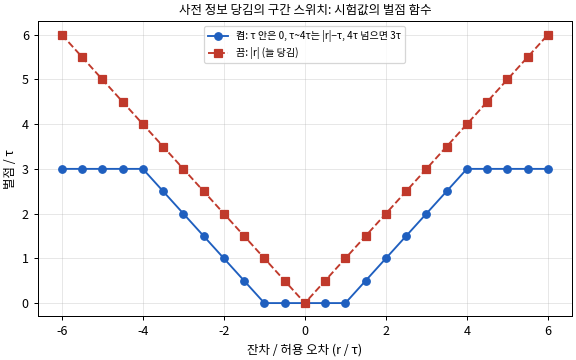

*읽는 법:* 가로축은 잔차를 허용 오차로 나눈 값이고, 세로축은 벌점이다. 파란 선(켬)은 τ 안에서 평평하고 4τ 넘어서 다시 평평하며, 빨간 선(끔)은 어디서나 당긴다.

## 7. 확인 못 한 것, 본 실험 전에 정할 것

### 7.1 확인 못 한 것

1. **B0 연직 포함 2장 조건(N2)은 MVS를 만들 수 없었다.**
   - 고른 두 장(연직 1, 경사 1)이 함께 보는 성긴 점이 17개뿐이라 깊이 지도가 하나도 나오지 않았다. 저자 3장 조건(A3, 학습 2장)의 두 장은 29개였다.
   - 그래서 시점 방향의 효과를 13장과 8장에서만 견줬고, 2장은 비어 있다(5절).
   - 이것은 멈춤 조건이라 진행 중에 여쭈었고, 아직 답을 받지 못했다(7.2의 2).
2. **N13·N8은 MVS가 성겨 대부분이 결측이다(5절).**
   - 분석자 판단으로 읽은 이유는 이렇다. 미리 적은 고르기 규칙은 대상 건물을 덮는 몫만 보고 영상끼리 겹치는지는 보지 않았다. 그래서 서로 다른 비행의 영상이 뽑혔다.
   - 함께 보는 성긴 점이 N13은 3,874개(A15는 6,146개), N8은 1,388개(A9는 3,532개)였다.
   - 그래서 시점 방향의 효과가 '영상끼리 겹치는 정도'와 섞여 있다.
3. **4절의 규칙과 구현의 차이(패치 저장소 어긋남, 고치지 않음).**
   - 첫째 단계는 정합으로 옮긴 사전 정보의 광선 교점을, 옮기지 않은 사전 정보로 만든 패치 저장소에서 찾는다.
   - 그래서 정합 이동이 있는 항공 LiDAR 범위에서는 사전 정보 픽셀의 일부가 이웃 패치로 들어간다. 준비 측정 입력에서 범위에 따라 8~33 %였다(B0 33 %, R3E 15 %, R3 13 %, R5 8 %, R4 8 %; `diag/store_shift.json`).
   - 이동을 되돌려 찾아 보니 버림 판단이 B0에서 618개(41,705개 중 1.5 %), R3E에서 365개(74,687개 중 0.5 %) 바뀌었다. 잘못의 수는 거의 같았다. B0의 잘못 버림은 313개에서 309개, 잘못 지킴은 220개에서 219개였다. R3E는 3,533개에서 3,504개, 732개에서 731개였다(`diag/store_shift_effect.json`).
   - 새 MVS에서는 R2 항공 LiDAR에도 이동이 생겨 같은 일이 일어난다.
   - 발주의 멈춤 조건에 따라 고치지 않고 차이를 적어 여쭌다(7.2의 3).
4. **확인하는 곳(상자)에서는 여유 규칙(전파만)의 k를 가를 수 없다.** 상자 안 재지 못한 곳의 버림이 적다. 그래서 k = 2와 k = 3에서 맞고 틀린 수의 차이가 상자마다 24개 이하다. 심지 않을 점은 LoD2에서 22~110개 차이가 난다(3절).
5. **보호와 벌점 함수는 시험 장면과 시험 값에서만 확인했다(6절).** 학습 중의 실제 동작은 본 실험에서 처음 본다.
6. **대표 자리 가운데 넷은 발주의 '맞는 판단'과 참 라벨이 갈린다(2절).**
   - B173 가운데(LoD2·항공 LiDAR), R1 긴 홀(LoD2), R3E 평지붕(LoD2)이다.
   - 자리 전체에 대한 기대와 패치 단위의 참 라벨이 다르다. 그래서 이 자리들에서는 '맞는 판단' 열보다 참 라벨로 센 수를 보아야 한다.

### 7.2 본 실험 전에 정할 것 (사용자)

1. **버리는 규칙과 k (사전 정보별).**
   - 분석자 추천은 항공 LiDAR에 여유 규칙(전파만) k = 2, LoD2에 지금 규칙이다(1.4).
   - 항공 LiDAR 잰 곳에 여유 규칙(모두) k = 2를 쓸지(잘못 버림 −59 %, 잘못 지킴 +57 %)는 맞바꿈의 판단이다.
2. **B0 연직 포함 조건의 영상 고르는 규칙.** 결과(N2 MVS 실패)를 본 뒤 규칙을 바꾸는 일이라 여쭌다.
   - (가) 지금 규칙을 둔다. N2는 'MVS 불가'로 기록하고, 시점 방향의 2장 비교는 비워 둔다.
   - (나) N2만 바꾼다. 함께 보는 성긴 점이 29개 이상인 (연직, 경사) 쌍 가운데 대상 건물을 가장 많이 덮는 쌍을 고른다. 덮는 몫은 39 %이고, A3는 37 %다.
   - (다) 분석자 권고: 세 조건을 모두 다시 고른다. (나)의 쌍에서 시작해, 이미 고른 영상과 성긴 점을 29개 이상 함께 보는 영상만 덮는 몫 순으로 더한다. 설정 v2로 결과 전에 적고 MVS부터 다시 만든다. 이 규칙으로 덮는 몫을 미리 재지는 않았다. 첫 연직 영상에서 시작한 같은 규칙은 N13·N8에서 60 %였다(A15 58 %, `diag/n_options.json`).
3. **패치 저장소 어긋남(7.1의 3)을 본 실험 전에 고칠지.** 고치면 정합 이동이 있는 범위에서 버림 판단이 0.5~1.5 % 바뀐다(준비 측정 입력 기준).
4. **공용 모듈 v5와 학습 코드 r11을 커밋할지.**
   - 공용 모듈 `src/phd/prior_propagation_v5/`, 시험 `tests/phd/test_prior_propagation_v5.py`, 이 작업의 스크립트와 설정, 학습 코드 r11 생성 파일(`scripts/phd/main_prep_discard_rule_v1/fork_r11/`)이 커밋되지 않았다.
   - 학습 코드 r11 본체는 작업 폴더 `sources/`에 있다.
5. (알림) 본 실험에서 어느 스위치 조합을 돌릴지는 발주대로 이 작업에서 정하지 않았다.

## 8. 걸린 시간

- 처음 예상(시작 때 진행 기록에 적음): 약 20시간(벽시계, 겹침 포함). MVS는 4시간으로 잡고, 그 두 배(8시간)를 넘을 것 같으면 멈추기로 했다.
- 실제: 00:3x에 시작해 07:10에 보고서를 마쳤다(약 6시간 40분). MVS를 만드는 3시간 36분 동안 다른 단계를 겹쳐 했다.

| 단계 | 시각 | 걸린 시간 |
|---|---|---|
| 발주 읽기, 계획, 설정 v1 | 00:3x–01:41 | 약 1시간 10분 |
| MVS 일곱 범위 (GPU 두 대) | 01:32–05:08 | 3시간 36분. GPU 시간 합은 6시간 52분이다(R1 2시간 2분, R3E 65분, B0 55분, SW 53분, R5 52분, R2 44분, R4 20분) |
| 공용 모듈 v5 옮기기, 단위 시험 | 01:3x–01:47 | MVS와 겹침 |
| 같은 판정 확인 1 (메시·저장소 12건, 첫째 단계, 대조) | 01:47–02:08 | 21분 |
| 학습 코드 r11 만들기, GPU 코드 시험 | 01:52–01:58 | 약 6분 |
| B0 연직 포함 조건 고르기와 MVS (N13 4분 24초, N8 2분 54초, N2 1초에 실패) | 02:00–02:09 | 약 9분 |
| 학습 코드 미리 확인 (B173, v1.1 값, 16회) | 02:11–02:23 | 12분 |
| 진단 (패치 저장소 어긋남, N 조건 대안) | 02:15–02:19, 04:2x | 약 15분 |
| 새 MVS 첫째 단계 14건 | 05:09–05:21 | 12분 |
| 참값 높이 다시 맞춤과 라벨 (일곱 범위) | 05:21–05:32 | 11분 |
| 상자 넷 다시 채점과 상자 참 라벨 | 05:32–05:52 | 20분 |
| B0 조건 첫째 단계와 라벨 | 05:52–05:56 | 4분 |
| 학습 코드 입력 만들기 | 05:56 | 25초 |
| 학습 코드 초기화 64회 (GPU 두 대) | 05:57–06:36 | 39분 |
| 같은 판정 확인 2와 스위치 표 | 06:36 | 12초 |
| 규칙 열 가지 세기 | 06:36–06:38 | 2분 22초 |
| 그림 (맞바꿈, 상자 지도, 허용 오차, B0, 벌점) | 06:38 | 15초 |
| 대표 자리 그림 (처음 한 번 + 고쳐 그림 다섯 번) | 06:38–07:04 | 1분 46초~4분 45초씩 |
| 보고서 표, 상자 비교, 보고서, 매니페스트, 영수증 | 06:10–07:10 | 다른 단계와 겹침 |

## 9. 산출물과 재현

### 9.1 산출물

작업 폴더는 `../JointBuildGS-artifacts/phase-payloads/phd/main_prep_discard_rule_v1/PHD-MAIN-PREP-DISCARD-RULE-v1/`이다.

| 폴더·파일 | 내용 |
|---|---|
| `mvs/<범위>/`, `mvs/B0_N13`, `B0_N8`, `B0_N2` | 학습 영상만으로 다시 만든 MVS와 COLMAP 영수증 |
| `mvs_lists/` | MVS에 쓴 영상 목록 |
| `s02/`, `s02_box/` | 공용 모듈 v5로 다시 만든 메시·패치 저장소(준비 측정과 원소 단위로 같음) |
| `eq1/` | 같은 판정 확인 1(준비 측정 입력으로 다시 돌림, `eq1/compare.json`) |
| `s52/s03/<범위>/<사전 정보>/` | 새 MVS의 첫째 단계(새 허용 오차·정합, 패치 상태·판정, (패치, 시점) 집계, 모은 지지 패치 번호 `knn.npz`) |
| `s52/gt/<범위>/` | 새 MVS로 높이를 맞춘 참값과 참 라벨(v5 규칙, 평가 제외 칸은 준비 측정 파일) |
| `s52/box/`, `s52/box_maskoff/`, `s52/box_gt/` | 상자 넷 다시 채점(새 고정값), 신뢰도 마스크를 끈 판, 상자 참 라벨 |
| `s52/export/`, `s52/export_maskoff/` | 학습 코드가 읽는 시점별 지도(신뢰도, MVS 깊이, 사전 정보 깊이, τ, 패치 지도, 표시, 표시 코드) |
| `s53/<조건>/`, `s53_gt/<조건>/` | B0 관측의 양 조건의 첫째 단계와 참 라벨 |
| `b0_conditions.json` | B0 일곱 조건의 영상과 고른 순서 |
| `sources/GeoGS-conf-guided-v1-r11/`, `provenance/` | 학습 코드 r11(빌드 기록, r10과의 차이) |
| `fork_inputs/s52/<상자>/` | r11 입력(장면, 나눔, 지도 연결, 저장소, 좌석, 법선) |
| `fork_runs/s52/` | r11 초기화(모두 켬, 스위치 하나씩 끔; 상자 넷 × 사전 정보 둘 × 8) |
| `fork_checks/s52.json` | 같은 판정 확인 2와 스위치 표 |
| `gpu_tests_r11.json` | r11 GPU 코드 시험(바뀌지 않은 함수, 기본값, 벌점 함수, 보호) |
| `rules/` | 규칙 열 가지의 수(`counts.json`, `counts_long.csv`), 패치별 버림 판단(`decisions/`), 대표 자리(`sites.json`) |
| `tables/` | 보고서 표(`report_tables.md`), 허용 오차·정합(`tau_registration`), 상자 다시 채점(`box_rescore`), B0 조건(`b0_conditions`), 맞바꿈 점(`tradeoff.csv`) |
| `figs/` | 그림 원본(이 문서의 `figures/`에 복사) |
| `diag/` | 진단(관찰만): 패치 저장소 어긋남(`store_shift*.json`), N 조건 대안(`n_options.json`) |
| `logs/` | 진행 기록(`progress.md`), 대기열(`queue.log`), 단계별 로그 |
| `receipt_task.json` | 커밋, Docker 이미지 ID, COLMAP 다이제스트, 스크립트·설정·입력 해시, 단계별 시간 |

### 9.2 재현

스크립트 폴더는 `scripts/phd/main_prep_discard_rule_v1/`, 설정은 `configs/phd/main_prep_discard_rule_v1/`(`discard_v1.json`, `sites_v1.json`)이다.

1. `run_mvs_all.sh`로 일곱 범위 MVS를 만든다. `b0_select.py` → `run_mvs_b0.sh`로 B0 연직 포함 조건의 MVS를 만든다.
2. `run_eq1.sh`로 같은 판정 확인 1을 한다(`s02_meshes.py`, `s03_stage1.py`, `eq1_compare.py`).
3. `make_fork_r11_files.py` → `build_fork_r11.py`로 학습 코드 r11을 만들고, `gpu_tests_r11.py`로 시험한다.
4. `run_after_mvs.sh`를 돌린다. 차례는 `run_52.sh`(범위, 참값, 상자, 상자 참값, B0 조건, 학습 코드 입력) → `run_fork.py`(모두 켬과 스위치 일곱) → `fork_checks.py`, `rules_eval.py` → `site_rows.py`, `figs_main.py`다.
5. `box_compare.py`, `report_tables.py`를 돌리고 `copy_figures.sh`로 그림을 이 문서 옆에 복사한다. 진단은 `diag_store_shift.py`, `diag_store_shift_effect.py`, `diag_n_options.py`로 한다. 영수증은 `receipt.py`로 만든다.

- 공유 서버라 Docker 동시 실행은 셋 이하로 했다(`run_queue.sh`). GPU는 MVS와 초기화에만 썼다.
- 단위 시험은 `python -m unittest tests.phd.test_prior_propagation_v5`(6건)다.
