<!-- PHD-MAIN-PREP-MEASURE-v1 -->
# 본 실험 준비 측정 — 보고서 v1.1

- 작업: `PHD-MAIN-PREP-MEASURE-v1` (2026-10-02 20:38 ~ 10-03). `scientific_verdict: null`.
- 판: v1.1 (2026-10-04, 사용자 검토 뒤). v1(`준비측정_보고서_v1.md`)은 그대로 둔다. 기준값, 판정, 참 라벨, 표의 수치는 바뀌지 않았다. 고친 것과 발주와 남은 차이는 8.4절에 있다.
- 지킨 것:
  - 가우시안 학습은 하지 않았다. MVS 다시 만들기는 학습이 아니므로 했다(GPU 0·1).
  - 계산은 Docker(`jointbuildgs:dev`, 네트워크 없음, 입력 읽기 전용)와 다이제스트를 고정한 COLMAP GPU 이미지(`colmap/colmap@sha256:187ca5ec…`, COLMAP 4.0.4)로 했다. 이 이미지는 사용자 승인(20:45) 뒤 한 번 받았다. 그 밖의 자료는 내려받지 않았다.
  - 기존 산출과 코드는 고치지 않았고, 커밋하지 않았다.
- 새 산출 위치:
  - 작업 폴더 `../JointBuildGS-artifacts/phase-payloads/phd/main_prep_measure_v1/PHD-MAIN-PREP-MEASURE-v1/`
  - 스크립트 `scripts/phd/main_prep_measure_v1/`, 설정 `configs/phd/main_prep_measure_v1/`, 그림 `figures/`(이 문서 옆)
  - 매니페스트 `artifacts/manifests/phd/main_prep_measure_v1/manifest_v1.yaml`
- **사례의 종류를 붙이는 판독과 상자 추천은 분석자(에이전트)의 판단이다.** 근거 그림을 함께 두었다. 사람 검수 전이다.
- **설정은 다섯 판이다.** 모두 남겼고, 이 보고서의 수치는 v5 기준이다. 결과를 본 뒤 고친 이유는 판마다 설정 파일과 8절에 있다.

  | 판 | 시각 | 바뀐 것 |
  |---|---|---|
  | v1 | 20:55, 결과 전 | 모든 기준값 |
  | v2 | 21:50 | 정합: 다시 렌더한 NMAD 관문, 전체 건물 면 NMAD 마지막 확인 |
  | v3 | 22:35 | 참값 높이 맞춤을 gt_clean 방식으로, 일시 반사 단위 오류 수정. 같은 판에 23:02 사용자 결정(상자) 기록 |
  | v4 | 23:20 | 벽 참값 점을 수직면으로 제한, 사례 분석 다듬기(경우 3·5) |
  | v5 | 23:45 | 벽 참값 점을 단일 반사로도 제한(나무) |

말의 뜻:

- **현재 관측:** 2024-12-17 영상으로 만든 MVS. 찾기 단계는 공통 937장 MVS를 그대로 쓰고, 상자와 B0 조건은 학습 영상만으로 다시 만든 MVS를 쓴다.
- **관측 신뢰도 1:** COLMAP 기하 일관성 검사를 통과해 깊이가 남은 픽셀(r10 그대로).
- **사전 정보:** 항공 LiDAR(2022-02-27, 분류 2·6 삼각망)와 LoD2. 둘은 따로 쓰고 함께 쓰지 않는다.
- **참값:** 드론 LiDAR(2024-12-17, 연직). B0는 gt_clean이다. 영상에서 만든 것이 아니다.
- **허용 오차(τ):** 정합 뒤 건물 면 잔차에서 잰 폭이다(NMAD 2.5배). 사전 정보마다 지붕과 벽에 하나씩 둔다.
- **패치:** 사전 정보 면을 0.25 m 간격으로 나눈 작은 면이다.
  - 지지: 본 시점의 절반 이상이 신뢰도 1로 받친 패치다.
  - 결측: 찍혔지만 재지 못한 패치다.
  - 비가시: 어느 학습 시점도 보지 못한 패치다.
- **전파 판정:** 결측 패치가 같은 표면의 지지 패치에서 받는 판정이다. 일치, 충돌, 혼재, 근거 부족 가운데 하나다.
- **참 일치 / 참 충돌:** 패치에서 참값과 사전 정보의 차이가 τ 이하인지 넘는지다. 점이 모자라면 '참값 없음'이다.

## 1. 답 먼저

### 1.1 상자와 물음

상자 넷은 사용자가 23:02에 정한 추천 묶음이다. 상자 = 평가 범위 + 맥락 띠 10 m이고, τ와 정합은 찾기 범위 값으로 고정했으며, 상자 MVS는 학습 영상만으로 다시 만들었다. 칸의 숫자는 그 상자 평가 범위 안의 패치 수다(v5 참값, 고정 τ).

| 상자 | 실행 | 물음 1: LoD2 |차|/τ ≤1/1~2/2~4/>4 | 물음 2: LoD2 전파 맞음/틀림 | 물음 2: 항공 전파 맞음/틀림 | 물음 3: 신뢰도 1 오측정 덩어리(지붕형) | 물음 4: 비가시 이어받음 맞음/틀림 | 물음 5: 참 충돌 방향 | 물음 8: 1~2배 지붕/벽 | 물음 6 | 물음 7 | 물음 9 |
|---|---|---|---|---|---|---|---|---|---|---|---|
| B0 | B0_b10 | 45,755 / 3,568 / 685 / 1,103 | 1,811/88 (충돌→맞음 9, 일치→맞음 1,802, 혼재 87) | 7/0 | 54개 551 m² | LoD2 0/0 · 항공 0/2 | LoD2 앞 3,755 뒤 1,601 · 항공 앞 158 뒤 107 | 900 / 2,668 | B0 네 조건 |  |  |
| B173nb | B173nb_b10 | 36,215 / 8,257 / 1,681 / 19,731 | 1,098/117 (충돌→맞음 28, 일치→맞음 1,070, 혼재 281) | 8/12 | 54개 1067 m² | LoD2 4/21 · 항공 0/0 | LoD2 앞 22,729 뒤 6,940 · 항공 앞 18,424 뒤 249 | 5,933 / 2,324 |  |  |  |
| B173 | B173_b0 | 20,291 / 6,826 / 3,387 / 19,560 | 362/58 (충돌→맞음 21, 일치→맞음 341, 혼재 139) | 5/2 | 32개 1139 m² | LoD2 7/22 · 항공 0/0 | LoD2 앞 21,584 뒤 8,189 · 항공 앞 18,348 뒤 327 | 4,522 / 2,304 |  | 대부분 변한 장면 |  |
| R1rep | R1rep_b10 | 26,329 / 6,275 / 4,231 / 5,291 | 210/108 (충돌→맞음 140, 일치→맞음 70, 혼재 63) | 16/55 | 18개 114 m² | LoD2 1/15 · 항공 1/11 | LoD2 앞 4,288 뒤 11,509 · 항공 앞 52 뒤 814 | 4,794 / 1,481 |  |  | R1 80 m 구역 |

| 상자 | 사전 정보 | 학습 영상(깊이 지도 있음) | 깊이 지도 없는 영상 | MVS 시간 (s) | 쓴 τ 지붕/벽 (찾기 범위) | 쓴 정합 이동 | 상자 자체 τ 지붕/벽 (참고) | 상자 자체 정합 (참고) | 지지 중 충돌 |
|---|---|---|---|---|---|---|---|---|---|
| B0_b10 | LoD2 | 243 | 0 | 2968 | 0.203 / 0.552 | (+0.000, +0.000, +0.000) | 0.168 / 0.488 | (+0.000, +0.000, +0.000) | 20.0 % |
| B0_b10 | ALS | 243 | 0 | 2968 | 0.128 / 0.128 | (-0.046, +0.046, +0.000) | 0.115 / 0.115 | (-0.076, +0.020, +0.000) | 6.7 % |
| B173nb_b10 | LoD2 | 203 | 0 | 2444 | 0.186 / 0.220 | (+0.000, +0.000, +0.000) | 0.179 / 0.241 | (+0.000, +0.000, +0.000) | 40.6 % |
| B173nb_b10 | ALS | 203 | 0 | 2444 | 0.158 / 0.158 | (+0.000, +0.000, +0.000) | 0.129 / 0.129 | (+0.000, +0.000, +0.000) | 51.3 % |
| B173_b0 | LoD2 | 140 | 0 | 1648 | 0.186 / 0.220 | (+0.000, +0.000, +0.000) | 3.647 / 0.637 | (+0.000, +0.000, -4.231) | 61.4 % |
| B173_b0 | ALS | 140 | 0 | 1648 | 0.158 / 0.158 | (+0.000, +0.000, +0.000) | 2.857 / 2.857 | (+0.000, +0.000, -4.618) | 88.7 % |
| R1rep_b10 | LoD2 | 333 | 5 | 4145 | 0.682 / 0.731 | (+0.000, +0.000, +0.000) | 0.560 / 2.463 | (+0.000, +0.000, +0.000) | 70.7 % |
| R1rep_b10 | ALS | 333 | 5 | 4145 | 0.099 / 0.099 | (+0.000, +0.000, +0.000) | 0.117 / 0.117 | (+0.007, -0.046, +0.000) | 46.4 % |

물음마다 가장 뚜렷하게 보이는 상자(분석자 판단):

| 물음 | 상자 | 근거 (2절 그림) |
|---|---|---|
| 1 표현 차이(LoD2) | R1rep | 부채꼴 건물: LoD2는 12 m 평면, 실제는 0.3~1.3 m 위로 기운 지붕과 더 넓은 옥상 구조 |
| 2 판정의 전파 | B0, B173+이웃, R1rep | 벽의 일치 전파(B0 정면 창, B173+이웃의 벽 두 면), R1rep의 결측 판정(맞음 210 / 틀림 108) |
| 3 영상이 틀린 곳 | R1rep, B0 | 넓은 지붕의 τ 언저리 어긋남, B0 어두운 지붕(참값도 빔) |
| 4 못 본 곳 | B173+이웃 | B173 남쪽 날개 벽(옛 박공 벽의 윗부분) |
| 5 변화의 방향 | B173+이웃(앞), R1rep(뒤) | B173 지붕 −4 m(사전 정보가 앞), 부채꼴 지붕(사전 정보가 뒤) |
| 6 관측의 양 | B0 | 네 조건(COVER 209장, 저자 13·8·2장) |
| 7 대부분 변한 장면 | B173만 | 상자 자체 정합이 변화를 흡수(−4.2~−4.6 m) |
| 8 허용 오차 경계 | B0(벽), R1rep | B0 정면: LoD2가 실제보다 20 cm 바깥(τ 0.55 m 안) |
| 9 정합 차이 | 찾기 범위 R1·R4 | 80 m 구역 점검 |

### 1.2 추천 상자 묶음

**B0 + B173·이웃 + B173만 + R1rep** (네 상자). 결정은 사용자가 한다. 아홉 물음을 모두 덮는다. 경우 9는 상자가 아니라 찾기 범위의 구역 점검으로 답한다.

### 1.3 상자마다 크기, 허용 오차, 영상 수

| 상자 | 사전 정보 | 학습 영상(깊이 지도 있음) | 깊이 지도 없는 영상 | MVS 시간 (s) | 쓴 τ 지붕/벽 (찾기 범위) | 쓴 정합 이동 | 상자 자체 τ 지붕/벽 (참고) | 상자 자체 정합 (참고) | 지지 중 충돌 |
|---|---|---|---|---|---|---|---|---|---|
| B0_b10 | LoD2 | 243 | 0 | 2968 | 0.203 / 0.552 | (+0.000, +0.000, +0.000) | 0.168 / 0.488 | (+0.000, +0.000, +0.000) | 20.0 % |
| B0_b10 | ALS | 243 | 0 | 2968 | 0.128 / 0.128 | (-0.046, +0.046, +0.000) | 0.115 / 0.115 | (-0.076, +0.020, +0.000) | 6.7 % |
| B173nb_b10 | LoD2 | 203 | 0 | 2444 | 0.186 / 0.220 | (+0.000, +0.000, +0.000) | 0.179 / 0.241 | (+0.000, +0.000, +0.000) | 40.6 % |
| B173nb_b10 | ALS | 203 | 0 | 2444 | 0.158 / 0.158 | (+0.000, +0.000, +0.000) | 0.129 / 0.129 | (+0.000, +0.000, +0.000) | 51.3 % |
| B173_b0 | LoD2 | 140 | 0 | 1648 | 0.186 / 0.220 | (+0.000, +0.000, +0.000) | 3.647 / 0.637 | (+0.000, +0.000, -4.231) | 61.4 % |
| B173_b0 | ALS | 140 | 0 | 1648 | 0.158 / 0.158 | (+0.000, +0.000, +0.000) | 2.857 / 2.857 | (+0.000, +0.000, -4.618) | 88.7 % |
| R1rep_b10 | LoD2 | 333 | 5 | 4145 | 0.682 / 0.731 | (+0.000, +0.000, +0.000) | 0.560 / 2.463 | (+0.000, +0.000, +0.000) | 70.7 % |
| R1rep_b10 | ALS | 333 | 5 | 4145 | 0.099 / 0.099 | (+0.000, +0.000, +0.000) | 0.117 / 0.117 | (+0.007, -0.046, +0.000) | 46.4 % |

### 1.4 그 밖의 한 줄 결론 (분석자 판독, 사람 검수 전)

1. **판정의 전파(핵심):**
   - 일치의 전파는 대체로 맞는다. LoD2: B0 2,098/11, R1 3,103/53(맞음/틀림).
   - 충돌의 전파는 자주 틀린다. 항공 LiDAR: R1 22/1,108, R4 2/150.
   - 틀린 충돌의 출처는 현재 관측의 작은 계통 오차다: 반투명 지붕, 넓은 평지붕의 20~30 cm 어긋남, 벽 앞 나무.
2. **허용 오차는 상자 크기로 수렴하지 않는다.** 담기는 건물 구성을 따른다. 대부분 변한 상자를 상자 자체로 재면 정합이 변화를 흡수해 곱게 무너지지 않는다.
3. **참값은 결과를 본 뒤 네 번 고쳤다(v2 → v5).** 고친 것은 높이 맞춤(gt_clean 방식), 일시 반사, 벽 점(수직면·단일 반사)이다. 본 실험 평가에 바로 영향을 주므로 사용자 확인이 필요하다(8절).
4. **B0는 GeoGS 영역 1과 겹친다**(근사). 저자 15장은 모두 경사 영상이다.

## 2. 물음별 사례

찾기 범위 여덟 곳의 패치를 v5 참값으로 매긴 결과다. 범위마다의 전체 표는 작업 폴더의 `tables_v1.md`에, 목록은 `step05/<범위>/` CSV에 있다. 그림 줄 한 줄에는 다섯 칸이 있다.

1. 사진(v1.1): 지붕 사례는 연직 시점(경사 20° 이하) 가운데 그 사례를 가장 많이 본 학습 시점, 벽 사례는 그 사례를 가장 많이 본 학습 시점이다(연직 시점은 벽을 거의 보지 못함). 시점이 정해지지 않는 사례(경우 3, 없는 구조, 비가시)는 중심을 담은 가장 연직인 시점이다. 나머지 칸도 같은 시점이다.
2. 관측 신뢰도(노랑 = 1)
3. 일치·충돌 표시
4. 패치 상태와 판정
5. 단면: 사전 정보 메시와 단면 평면의 교선(주황 LoD2, 파랑 항공 LiDAR), 그 시점의 신뢰도 1 MVS(초록), 단면 ±0.25 m 안의 참값 점(검정)

종류 이름과 '무엇이 일어났나'는 분석자 판독이다.

### 2.1 현재 관측의 오류 (경우 3: 영상이 틀린 곳)

**물음:** 현재 관측의 오류가 번지지 않는가.

| 범위 | 신뢰도 1 픽셀 | (가) 틀림 | 그 가운데 사전 정보 참 일치(잘못 충돌로 읽힘) | 신뢰도 0·광도 깊이 있음 | (나) 틀림 | 덩어리 (가)/(나) |
|---|---|---|---|---|---|---|
| R1 | 5,954,770 | 272,259 (4.6 %) | 74,794 (27.5 %) | 718,737 | 476,390 (66.3 %) | 240 / 148 |
| R2 | 4,134,778 | 297,247 (7.2 %) | 71,696 (24.1 %) | 193,123 | 119,325 (61.8 %) | 221 / 122 |
| R3 | 6,957,709 | 484,604 (7.0 %) | 152,935 (31.6 %) | 474,272 | 386,224 (81.4 %) | 253 / 132 |
| R3E | 6,636,738 | 425,471 (6.4 %) | 137,779 (32.4 %) | 255,759 | 120,822 (47.2 %) | 223 / 114 |
| R4 | 4,243,173 | 184,808 (4.4 %) | 85,000 (46.0 %) | 127,545 | 87,290 (68.4 %) | 254 / 124 |
| R5 | 6,243,369 | 347,090 (5.6 %) | 110,603 (31.9 %) | 219,097 | 169,301 (77.3 %) | 225 / 138 |
| SW | 4,843,018 | 155,172 (3.2 %) | 27,710 (17.9 %) | 341,828 | 200,299 (58.6 %) | 201 / 115 |
| B0 | 660,123 | 48,190 (7.3 %) | 10,176 (21.1 %) | 57,237 | 43,380 (75.8 %) | 44 / 24 |

- 위 표는 모든 건물 면 수치다. 참값이 비는 벽 때문에 부풀어 있다(8.2). 지붕형 면만 세면 다음과 같다.
  - 신뢰도 1인데 참값에서 τ 넘게 벗어난 픽셀: **1.4~7.8 %**
  - 그 가운데 사전 정보가 참 일치인 곳('잘못 충돌로 읽힌 곳'): **15~59 %**
  - 신뢰도 0으로 걸러진 광도 깊이 가운데 틀린 것: **34~82 %**. 걸러내기는 대체로 틀린 깊이를 뺐다.
- **덩어리 판독(분석자):**
  - 가장 흔한 것은 넓은 평지붕·박공 지붕에서 0.25~0.5 m 어긋난 경우다(R2·R3·R5·B0의 1위). 큰 오측정이라기보다, MVS가 넓은 지붕에서 τ(0.16~0.22 m)를 조금 넘게 흔들린 것이다.
  - **반투명 지붕(R1 긴 홀):** MVS가 지붕 아래를 일관되게 재서 신뢰도 1인데 수 m 틀린다. 같은 자리의 드론 LiDAR 반사도 비어 있어, 참값만으로 '영상 오류'라고 단정하지는 못한다.
  - **어두운 지붕(B0 일부):** MVS 신뢰도는 0이고 드론 LiDAR 반사도 없다. v3의 2차원 덩어리 556 m²(오차 7.25 m)는 참값 구멍을 뒤쪽 점이 채운 것이었다. v4부터 지붕형 면만 따로 세고 3차원 칸으로 묶어 이런 덩어리를 걸렀다.

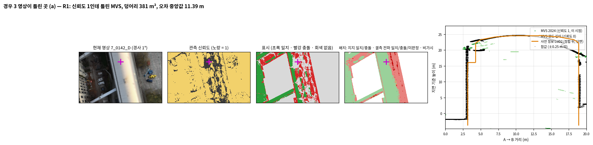

읽는 법: R1 반투명 긴 홀 지붕이다. 신뢰도 1 MVS(초록)가 지붕 아래 3~4 m를 재고, 지붕 가운데에는 참값 점이 거의 없다.

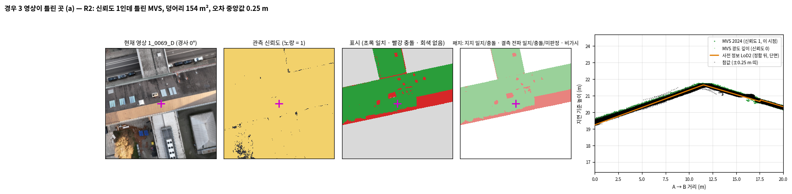

읽는 법: 박공 지붕에서 MVS·참값·LoD2가 거의 겹친다. 빨간 띠는 0.2~0.3 m 어긋남이 τ(0.19 m)를 넘은 곳이다.

### 2.2 사전 정보의 오류 (경우 1 표현 차이, 경우 5 변화의 방향)

**물음:** 사전 정보의 오류가 번지지 않는가, 충돌하면 강한 증거를 따르는가(경우 1). 사전 정보가 실제보다 앞에 있든 뒤에 있든 고쳐지는가(경우 5).

| 범위 | 면 | 참값 있는 패치 | ≤1배 | 1~2배 | 2~4배 | >4배 |
|---|---|---|---|---|---|---|
| R1 | roof | 132,818 | 100,719 (75.8 %) | 12,978 (9.8 %) | 5,562 (4.2 %) | 13,559 (10.2 %) |
| R1 | wall | 107,436 | 88,838 (82.7 %) | 13,330 (12.4 %) | 5,268 (4.9 %) | 0 (0.0 %) |
| R2 | roof | 70,430 | 37,070 (52.6 %) | 8,385 (11.9 %) | 3,345 (4.7 %) | 21,630 (30.7 %) |
| R2 | wall | 46,441 | 40,358 (86.9 %) | 3,425 (7.4 %) | 1,238 (2.7 %) | 1,420 (3.1 %) |
| R3 | roof | 73,708 | 54,378 (73.8 %) | 12,829 (17.4 %) | 1,527 (2.1 %) | 4,974 (6.7 %) |
| R3 | wall | 32,036 | 27,519 (85.9 %) | 1,040 (3.2 %) | 2,632 (8.2 %) | 845 (2.6 %) |
| R3E | roof | 78,854 | 56,945 (72.2 %) | 14,616 (18.5 %) | 1,953 (2.5 %) | 5,340 (6.8 %) |
| R3E | wall | 34,432 | 29,414 (85.4 %) | 1,301 (3.8 %) | 2,775 (8.1 %) | 942 (2.7 %) |
| R4 | roof | 87,524 | 68,675 (78.5 %) | 6,590 (7.5 %) | 5,893 (6.7 %) | 6,366 (7.3 %) |
| R4 | wall | 37,687 | 32,221 (85.5 %) | 3,744 (9.9 %) | 1,722 (4.6 %) | 0 (0.0 %) |
| R5 | roof | 69,180 | 52,160 (75.4 %) | 11,527 (16.7 %) | 2,303 (3.3 %) | 3,190 (4.6 %) |
| R5 | wall | 46,870 | 44,367 (94.7 %) | 1,146 (2.4 %) | 659 (1.4 %) | 698 (1.5 %) |
| SW | roof | 58,801 | 44,888 (76.3 %) | 6,251 (10.6 %) | 5,144 (8.7 %) | 2,518 (4.3 %) |
| SW | wall | 22,781 | 18,751 (82.3 %) | 2,435 (10.7 %) | 1,572 (6.9 %) | 23 (0.1 %) |
| B0 | roof | 17,919 | 15,367 (85.8 %) | 900 (5.0 %) | 549 (3.1 %) | 1,103 (6.2 %) |
| B0 | wall | 33,192 | 30,381 (91.5 %) | 2,668 (8.0 %) | 143 (0.4 %) | 0 (0.0 %) |

| 범위 | 곡면 | 벽 위치 | 처마 | 옥상 구조 | 기타 | 경우 8: 1~2배 |
|---|---|---|---|---|---|---|
| R1 | 25,200 | 18,598 | 4,693 | 691 | 1,515 | 26,308 |
| R2 | 24,371 | 6,083 | 2,568 | 0 | 6,421 | 11,810 |
| R3 | 19,330 | 4,517 | 0 | 0 | 0 | 13,869 |
| R3E | 21,825 | 5,018 | 84 | 0 | 0 | 15,917 |
| R4 | 15,137 | 5,466 | 1,831 | 37 | 1,844 | 10,334 |
| R5 | 16,522 | 2,503 | 197 | 301 | 0 | 12,673 |
| SW | 13,815 | 4,030 | 82 | 15 | 1 | 8,686 |
| B0 | 1,394 | 2,811 | 660 | 139 | 359 | 3,568 |

- **LoD2 지붕 패치의 53~86 %가 τ 안이고, 4τ를 넘는 것은 4~31 %다.** 31 %는 B173 변화가 있는 R2다.
- **자동 종류**(설정의 규칙, 판독 전):
  - '곡면'은 면 안 참값의 평면 맞춤 RMS가 0.15 m를 넘는 면이다. 실제 곡면(R1 긴 홀의 원통형 지붕, 부채꼴 건물), 옥상 설비가 큰 면, B173의 톱니 지붕이 함께 들어간다.
  - '처마'는 면 경계 1 m 안의 지붕 참 충돌이다.
- **판독 예(분석자):**
  - B0의 '처마' 1위는 LoD2가 박공 마루(21.3 m)로 그린 지붕이 실제로는 평평한 꼭대기(20.0 m)인 경우다.
  - R1 긴 홀 옆 벽은 LoD2가 18 m 위를 1.1 m 안쪽으로 물려 그렸다. 실제 벽은 23 m까지 곧게 선다('벽 위치').

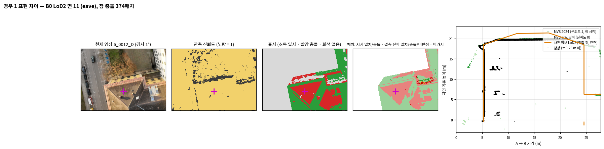

읽는 법: B0 지붕 단면이다. LoD2(주황)는 가운데가 21.3 m인 마루, 참값(검정)은 20.0 m 평평한 꼭대기로, 1.3 m 차이다.

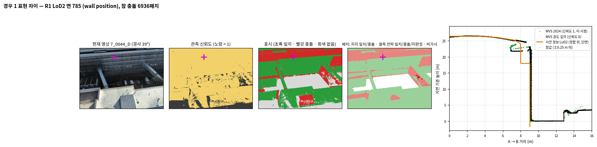

읽는 법: 벽을 가로지른 단면이다. 참값 벽은 x = 9.1 m에서 23 m까지 곧게 서 있고, LoD2는 18 m 위를 x = 8 m로 물려 그렸다.

| 범위 | 사전 정보 | 참 충돌 | 사전 정보가 앞 | 사전 정보가 뒤 | 사전 정보에 없는 구조(덩어리) |
|---|---|---|---|---|---|
| R1 | LoD2 | 50,697 | 15,268 (954 m²) | 35,429 (2214 m²) | 89개 971 m² |
| R1 | ALS | 3,440 | 290 (25 m²) | 3,150 (243 m²) | 67개 509 m² |
| R1 | LoD2 원인 | 지붕 참 충돌 32,099 | 표현 차이(항공 LiDAR가 참값과 맞음) 19,370 | 시간 변화 후보(항공 LiDAR도 다름) 12,729 | 항공 LiDAR 없음 0 |
| R2 | LoD2 | 39,443 | 25,644 (1603 m²) | 13,799 (862 m²) | 44개 293 m² |
| R2 | ALS | 19,388 | 18,454 (1229 m²) | 934 (65 m²) | 22개 82 m² |
| R2 | LoD2 원인 | 지붕 참 충돌 33,360 | 표현 차이(항공 LiDAR가 참값과 맞음) 8,456 | 시간 변화 후보(항공 LiDAR도 다름) 24,904 | 항공 LiDAR 없음 0 |
| R3 | LoD2 | 23,847 | 14,125 (883 m²) | 9,722 (608 m²) | 34개 220 m² |
| R3 | ALS | 985 | 542 (36 m²) | 443 (33 m²) | 14개 94 m² |
| R3 | LoD2 원인 | 지붕 참 충돌 19,330 | 표현 차이(항공 LiDAR가 참값과 맞음) 16,318 | 시간 변화 후보(항공 LiDAR도 다름) 3,012 | 항공 LiDAR 없음 0 |
| R3E | LoD2 | 26,927 | 15,425 (964 m²) | 11,502 (719 m²) | 38개 334 m² |
| R3E | ALS | 1,165 | 630 (43 m²) | 535 (40 m²) | 15개 172 m² |
| R3E | LoD2 원인 | 지붕 참 충돌 21,909 | 표현 차이(항공 LiDAR가 참값과 맞음) 18,289 | 시간 변화 후보(항공 LiDAR도 다름) 3,620 | 항공 LiDAR 없음 0 |
| R4 | LoD2 | 24,315 | 8,698 (544 m²) | 15,617 (976 m²) | 74개 991 m² |
| R4 | ALS | 1,549 | 647 (51 m²) | 902 (65 m²) | 57개 458 m² |
| R4 | LoD2 원인 | 지붕 참 충돌 18,849 | 표현 차이(항공 LiDAR가 참값과 맞음) 14,017 | 시간 변화 후보(항공 LiDAR도 다름) 4,832 | 항공 LiDAR 없음 0 |
| R5 | LoD2 | 19,523 | 4,222 (264 m²) | 15,301 (956 m²) | 58개 604 m² |
| R5 | ALS | 1,942 | 1,396 (96 m²) | 546 (41 m²) | 36개 373 m² |
| R5 | LoD2 원인 | 지붕 참 충돌 17,020 | 표현 차이(항공 LiDAR가 참값과 맞음) 13,511 | 시간 변화 후보(항공 LiDAR도 다름) 3,509 | 항공 LiDAR 없음 0 |
| SW | LoD2 | 17,943 | 1,055 (66 m²) | 16,888 (1056 m²) | 42개 499 m² |
| SW | ALS | 3,265 | 475 (37 m²) | 2,790 (220 m²) | 37개 298 m² |
| SW | LoD2 원인 | 지붕 참 충돌 13,913 | 표현 차이(항공 LiDAR가 참값과 맞음) 8,932 | 시간 변화 후보(항공 LiDAR도 다름) 4,981 | 항공 LiDAR 없음 0 |
| B0 | LoD2 | 5,363 | 3,762 (235 m²) | 1,601 (100 m²) | 6개 167 m² |
| B0 | ALS | 282 | 166 (12 m²) | 116 (9 m²) | 2개 127 m² |
| B0 | LoD2 원인 | 지붕 참 충돌 2,552 | 표현 차이(항공 LiDAR가 참값과 맞음) 2,097 | 시간 변화 후보(항공 LiDAR도 다름) 455 | 항공 LiDAR 없음 0 |

- **방향:**
  - LoD2: R1·R4·R5·SW에서는 사전 정보가 뒤(실제가 위)인 패치가 많다. 옥상 구조와 낮게 그린 지붕 때문이다. R2·R3·R3E·B0에서는 앞이 많다.
  - 항공 LiDAR: R2에서 앞 18,454 / 뒤 934로 크게 갈린다. B173 지붕이 4 m 낮아졌기 때문이다.
- **원인(LoD2 지붕 참 충돌, 같은 자리 항공 LiDAR로 가름):** R2는 시간 변화 후보가 표현 차이보다 많다(B173). 다른 범위는 표현 차이가 2~5배 많다.
- **R1 부채꼴 건물(R1rep 상자):** LoD2는 12 m 평면이고, 실제 지붕은 0.3~1.3 m 높게 기울며 옥상 구조도 더 넓다. 사전 정보가 뒤인 표현 차이다. 연직 시점에서는 지붕 대부분이 신뢰도 1이고, MVS가 참값과 같은 기운 지붕과 옥상 구조를 잰다(v1은 경사 시점 그림 줄만 보고 '신뢰도가 대부분 0'이라고 잘못 적었다).
- **사전 정보에 없는 구조(자동 후보 → 조사 v1 후보와 위치 대조, 분석자):**
  - R3E 1위(103 m², 5.3 m) = **C04 새 덮개 구조물**. LoD2·항공 LiDAR 모두에서 1위다.
  - SW의 덩어리 = **C02 증축** 자리.
  - R1·R4·R5·SW의 여러 덩어리 = 조사 v1의 'LoD2만 다름' 자리(C16·C17·C26·C35 등, LoD2 일반화).
  - 1위 덩어리 가운데에는 건물 정면·처마 점이 길 쪽 삼각망 위에 놓인 것도 있다(B0 항공 LiDAR 1위, 18.5 m). 구조물이 아니므로 후보 목록은 판독을 거쳐야 쓸 수 있다.

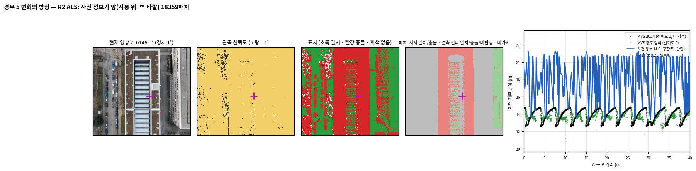

읽는 법: B173 지붕이다. 2022 항공 LiDAR(파랑)는 꼭대기 20~21 m의 옛 지붕이고 참값과 MVS는 12.5~14.7 m의 지금 톱니 지붕이라, 사전 정보가 '앞'이다.

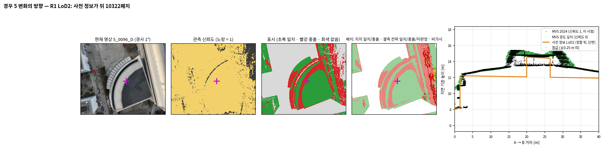

읽는 법: R1 부채꼴 건물이다. LoD2(주황)는 12 m 평면과 좁은 상자인데 참값(검정)과 MVS(초록)는 12.3~13.3 m로 기운 지붕과 넓은 옥상 구조를 보아, 사전 정보가 '뒤'다.

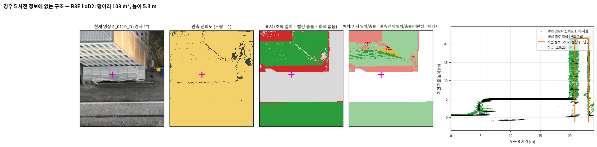

읽는 법: 흰 덮개 구조물(C04)이다. 참값과 MVS는 5 m 지붕을 보는데 LoD2에는 면이 없다(오른쪽은 이웃 건물 벽).

### 2.3 둘 다 옳은 곳, 재지 못한 곳, 못 본 곳 (경우 2 판정의 전파, 경우 4, 경우 6)

**물음:**
- 찍혔지만 재지 못한 곳에서 틀린 사전 정보는 놓이고(충돌의 전파) 옳은 사전 정보는 지켜지는가(경우 2)?
- 영상이 못 본 곳은 사전 정보를 이어받는가(경우 4)?
- 영상이 줄면 사전 정보에 기대는 몫이 알맞게 늘어나는가(경우 6)?

| 범위 | 사전 정보 | 결측 패치 | 충돌 전파: 참 충돌 / 참 일치 | 일치 전파: 참 일치 / 참 충돌 | 혼재 | 근거 부족 | 맞음 / 틀림 | 결측 까닭(패치 수) | 혼재 있는 표면/표면 |
|---|---|---|---|---|---|---|---|---|---|
| R1 | LoD2 | 15,363 | 1,338 / 1,063 | 3,103 / 53 | 1,622 | 3,620 | 4,441 / 1,116 | 무늬 없음 3,020 · 그림자 3,579 · 비스듬함 2,614 · 기타 6,150 | 69/135 |
| R1 | ALS | 2,885 | 22 / 1,108 | 841 / 18 | 637 | 223 | 863 / 1,126 | 무늬 없음 107 · 그림자 180 · 비스듬함 960 · 기타 1,638 | 12/22 |
| R2 | LoD2 | 5,032 | 73 / 52 | 1,213 / 81 | 568 | 564 | 1,286 / 133 | 무늬 없음 208 · 그림자 792 · 비스듬함 307 · 기타 3,725 | 37/57 |
| R2 | ALS | 163 | 2 / 19 | 84 / 6 | 42 | 9 | 86 / 25 | 무늬 없음 8 · 그림자 2 · 비스듬함 5 · 기타 148 | 3/6 |
| R3 | LoD2 | 3,057 | 280 / 84 | 342 / 30 | 321 | 68 | 622 / 114 | 무늬 없음 38 · 그림자 703 · 비스듬함 1,083 · 기타 1,233 | 11/13 |
| R3 | ALS | 173 | 0 / 0 | 167 / 3 | 3 | 0 | 167 / 3 | 무늬 없음 16 · 그림자 0 · 비스듬함 0 · 기타 157 | 2/2 |
| R3E | LoD2 | 6,968 | 407 / 111 | 567 / 51 | 675 | 1,081 | 974 / 162 | 무늬 없음 100 · 그림자 1,267 · 비스듬함 1,163 · 기타 4,438 | 27/32 |
| R3E | ALS | 218 | 0 / 24 | 175 / 4 | 14 | 1 | 175 / 28 | 무늬 없음 26 · 그림자 0 · 비스듬함 0 · 기타 192 | 5/6 |
| R4 | LoD2 | 22,985 | 35 / 169 | 874 / 39 | 1,682 | 11,742 | 909 / 208 | 무늬 없음 3,279 · 그림자 704 · 비스듬함 4,694 · 기타 14,226 | 87/187 |
| R4 | ALS | 4,659 | 2 / 150 | 83 / 6 | 310 | 3,524 | 85 / 156 | 무늬 없음 98 · 그림자 61 · 비스듬함 304 · 기타 4,159 | 15/31 |
| R5 | LoD2 | 8,725 | 51 / 455 | 295 / 47 | 807 | 2,244 | 346 / 502 | 무늬 없음 137 · 그림자 1,467 · 비스듬함 3,860 · 기타 3,254 | 55/71 |
| R5 | ALS | 6 | 0 / 0 | 6 / 0 | 0 | 0 | 6 / 0 | 무늬 없음 0 · 그림자 0 · 비스듬함 0 · 기타 6 | 0/2 |
| SW | LoD2 | 62,680 | 223 / 157 | 822 / 108 | 2,286 | 37,319 | 1,045 / 265 | 무늬 없음 10,816 · 그림자 4,824 · 비스듬함 20,425 · 기타 26,551 | 87/172 |
| SW | ALS | 13,925 | 56 / 34 | 9 / 2 | 630 | 9,863 | 65 / 36 | 무늬 없음 878 · 그림자 1,406 · 비스듬함 4,198 · 기타 7,404 | 13/35 |
| B0 | LoD2 | 7,201 | 5 / 31 | 2,098 / 11 | 335 | 924 | 2,103 / 42 | 무늬 없음 2,242 · 그림자 306 · 비스듬함 560 · 기타 4,093 | 22/36 |
| B0 | ALS | 225 | 0 / 1 | 36 / 0 | 19 | 1 | 36 / 1 | 무늬 없음 42 · 그림자 2 · 비스듬함 2 · 기타 179 | 3/3 |

**이 발주의 핵심 결과 (분석자 요약):**

1. **일치의 전파는 대체로 맞다.**
   - LoD2(맞음/틀림): R1 3,103/53, R2 1,213/81, B0 2,098/11, R4 874/39
   - 항공 LiDAR: R1 841/18, R3 167/3
   - LoD2의 맞은 일치 전파는 대부분 벽에서 일어났다(맞음 가운데 벽: R2 1,156/1,213, B0 2,077/2,098, R1 1,680/3,103). B0 정면의 창처럼 MVS가 재지 못한 벽이 같은 벽의 잰 부분에서 일치를 받아 지켜졌다(v1은 R2 그림 줄을 '회색 평지붕'으로 잘못 읽었다, 8.4).
   - 항공 LiDAR에는 벽 패치가 없어 일치 전파는 모두 지붕이다. 벽의 참 라벨은 지붕보다 약하다(벽 피복 0.1~0.4, 5.3절).
2. **충돌의 전파는 자주 틀린다. 항공 LiDAR에서 특히 그렇다.**
   - 항공 LiDAR(맞음/틀림): R1 22/1,108, R4 2/150, R3E 0/24
   - LoD2에서는 범위에 따라 갈린다. R1 1,338/1,063, R3 280/84는 맞음이 많다. R4 35/169, R5 51/455, B0 5/31은 틀림이 많다.
3. **틀린 충돌 전파의 출처는 현재 관측의 작은 계통 오차다(경우 3과 이어짐).**
   - R1 반투명 긴 홀: 신뢰도 1 MVS가 지붕 아래를 재서 맞는 항공 LiDAR 지붕이 충돌로 읽혔다.
   - R4·R3E 넓은 평지붕: MVS가 참값보다 0.15~0.3 m 낮다. 항공 LiDAR τ는 0.17 m, LoD2 τ는 0.16 m다.
   - R5 벽: 벽 앞 나무 가지를 MVS가 벽보다 앞에서 잰다.
   - τ가 좁을수록 이런 작은 오차가 충돌이 된다. 그 충돌은 3분의 2 규칙으로 같은 표면의 결측 패치 대부분에 번진다.
4. **충돌의 전파가 맞은 곳은 사전 정보가 τ보다 크게 틀린 곳이다.** R1 긴 홀의 LoD2 지붕은 약 1 m 높고, R3의 LoD2 벽은 0.6 m 안쪽이다.
5. **혼재는 안전한 쪽이었다.** R1 긴 홀처럼 일치와 충돌이 섞인 표면에서는 혼재 → 사전 정보 이어받기가 되었고, 그 사전 정보(항공 LiDAR)가 맞았다.
6. **결측 까닭 지표**(밝기 < 60, 국소 질감 < 6, 시선 각 > 70°, 결과 전 설정)는 결측의 절반 이상을 '기타'로 남겼다. 밝기와 질감만으로는 결측을 설명하지 못한다.

읽는 법: R1 긴 홀의 유리 능선을 따라 자른 단면으로, 항공 LiDAR(파랑)와 참값(검정)이 겹친다. 연직 시점에서도 능선은 대부분 신뢰도 0(결측)이고 둘레 지지 패치의 충돌이 능선의 결측 패치(진빨강)로 번졌다(v1의 경사 시점 그림 줄에서는 신뢰도 1 MVS가 유리 아래를 쟀다).

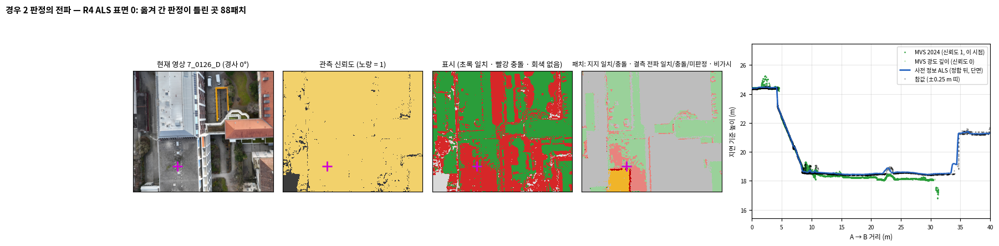

읽는 법: 넓은 평지붕에서 MVS(초록)가 참값·항공 LiDAR보다 20~30 cm 낮다(τ 0.17 m). 지지 패치의 충돌이 결측 패치로 번졌다.

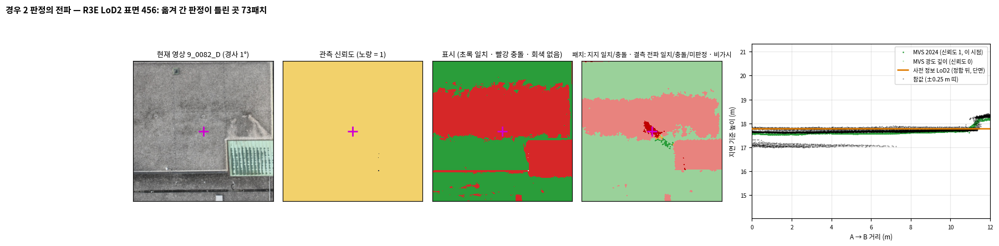

읽는 법: R3 큰 평지붕이다. LoD2와 참값은 5~10 cm 안에서 맞는데, MVS가 τ(0.16 m) 언저리로 낮아 생긴 충돌 띠가 결측 패치로 번졌다.

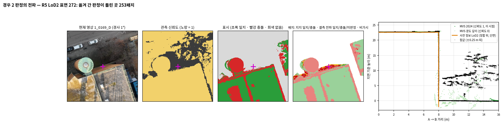

읽는 법: 벽 앞의 나무 가지(검정 흩어진 점)를 MVS가 벽보다 앞에서 재서, 맞는 LoD2 벽이 충돌이 되고 결측 패치로 번졌다.

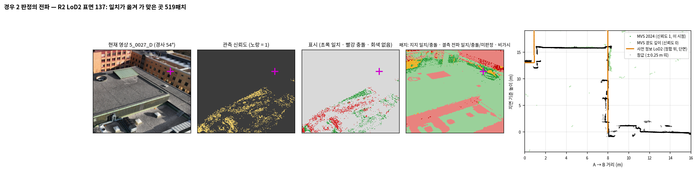

읽는 법: R2 건물의 벽(표면 137)을 가로지른 단면이다(사진 앞쪽의 회색 평지붕이 아니다). MVS가 거의 재지 못한 이 벽의 결측 패치가 같은 벽의 일치를 받았고, 참값 벽(x = 8 m)도 LoD2 벽과 겹친다.

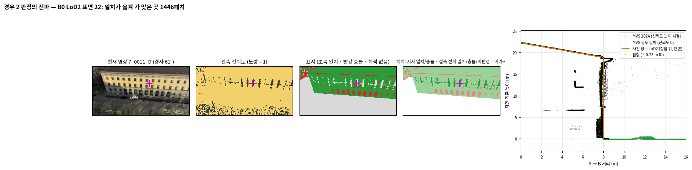

읽는 법: B0 정면이다. 창(신뢰도 0)이 결측 → 일치(진초록)가 되었고, 참값 정면은 LoD2보다 약 20 cm 안쪽이지만 τ(0.55 m) 안이다.

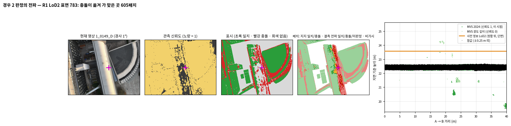

읽는 법: R1 긴 홀 지붕이다. LoD2(주황)가 참값보다 약 1 m 높고, 유리 능선(신뢰도 0)이 충돌을 받아 맞았다.

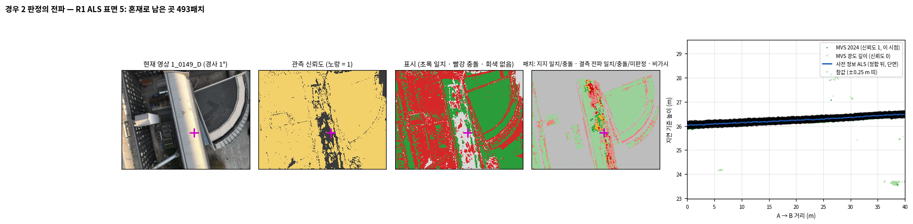

읽는 법: 같은 지붕(표면 5)의 다른 자리다. 일치·충돌이 섞여 혼재(주황) → 사전 정보 이어받기가 되었고, 단면에서 그 사전 정보(파랑)는 참값과 겹친다.

| 범위 | 사전 정보 | 비가시 패치 (범위 패치 중) | 참값 있음 | 이어받으면 맞음 / 틀림 |
|---|---|---|---|---|
| R1 | LoD2 | 2,103 (0.5 %) | 5 | 4 / 1 |
| R1 | ALS | 107 (0.1 %) | 90 | 3 / 87 |
| R2 | LoD2 | 23,171 (11.3 %) | 49 | 18 / 31 |
| R2 | ALS | 0 (–) | 0 | 0 / 0 |
| R3 | LoD2 | 17 (0.0 %) | 4 | 0 / 4 |
| R3 | ALS | 0 (–) | 0 | 0 / 0 |
| R3E | LoD2 | 16 (0.0 %) | 4 | 0 / 4 |
| R3E | ALS | 0 (–) | 0 | 0 / 0 |
| R4 | LoD2 | 94,120 (25.3 %) | 1,284 | 230 / 1,054 |
| R4 | ALS | 7,820 (7.9 %) | 90 | 4 / 86 |
| R5 | LoD2 | 10,354 (5.6 %) | 239 | 200 / 39 |
| R5 | ALS | 7 (0.0 %) | 7 | 0 / 7 |
| SW | LoD2 | 59,334 (18.4 %) | 167 | 49 / 118 |
| SW | ALS | 11,461 (13.7 %) | 7 | 0 / 7 |
| B0 | LoD2 | 1,046 (0.7 %) | 0 | 0 / 0 |
| B0 | ALS | 15 (0.0 %) | 2 | 0 / 2 |

- **못 본 곳은 대부분 벽이다. 참값이 덮는 비가시 패치는 적다**(연직 드론 LiDAR). LoD2 비가시 가운데 벽은 R4 88 %, SW 86 %, 나머지 범위 99~100 %다. 참값이 있는 것은 LoD2: R1 5, R2 49, R4 1,284, R5 239패치다.
- R4 LoD2(1,284)는 이어받으면 대부분 틀린다(230/1,054). 그림 줄의 덩어리는 LoD2가 실제보다 0.7 m 낮게 그린 지붕이었다. 다만 왜 비가시가 되었는지는 이번에 가려내지 못했다(8.2).
- R5(239)는 대부분 맞다(200/39).
- v3에서 '이어받으면 틀림'이 많았던 R2 비가시 벽(1,476)은 벽 라벨 오염이었다(5.3). v5에서는 49패치만 참값이 있다.

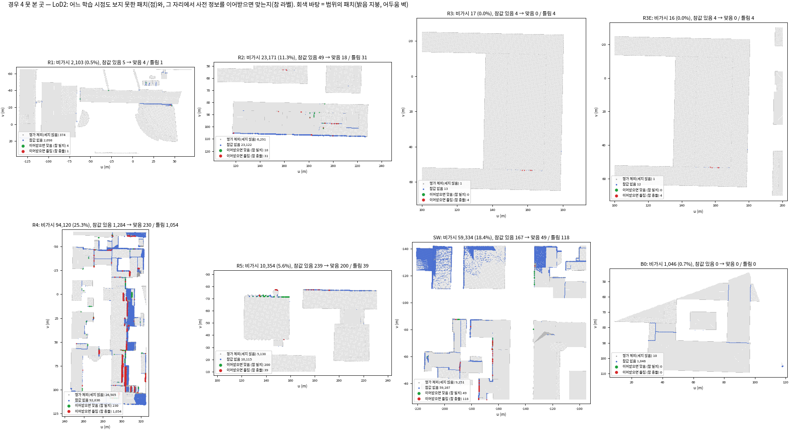

읽는 법: LoD2의 비가시 패치는 대부분 벽(선)이고, 참값이 덮는 것은 적다(초록·빨강 점). R4의 '이어받으면 틀림'(빨강)은 가운데 건물 줄을 따라 몰리고, R4·SW의 파란 면은 참값이 덮지 않는 지붕이다.

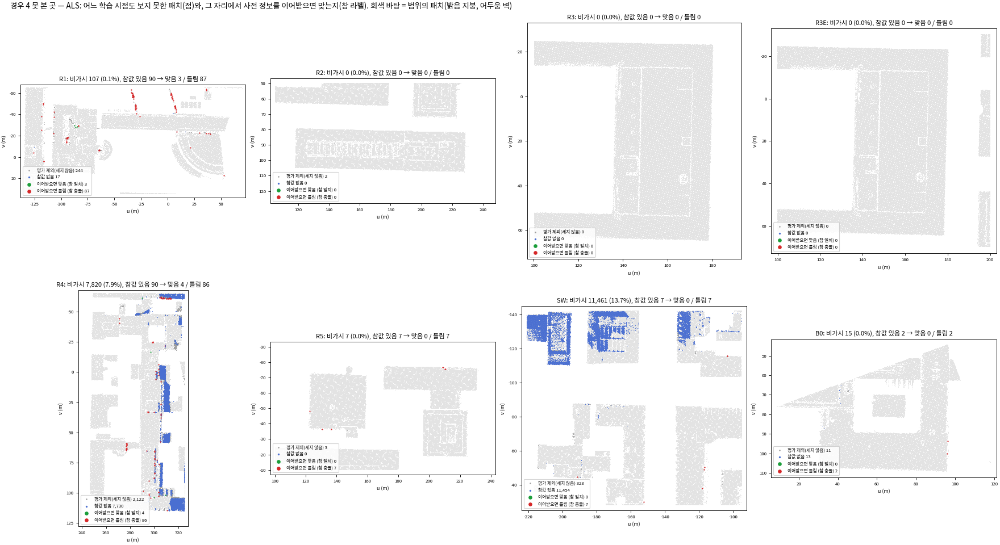

읽는 법: 항공 LiDAR에는 벽 패치가 없어 비가시는 모두 지붕이다. 참값이 있는 R1·R4의 비가시는 거의 다 '이어받으면 틀림'(빨강, R1 87/90, R4 86/90)이고, R4·SW의 파란 면은 참값이 덮지 않는다.

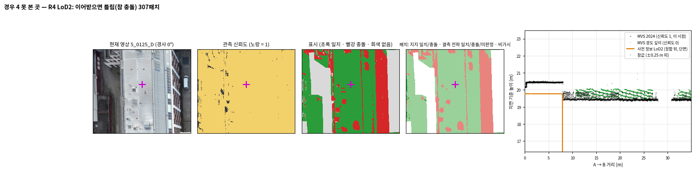

읽는 법: R4에서 '이어받으면 틀림'인 비가시 덩어리(307패치)를 지나는 단면이다. 0~8 m에서 LoD2(주황)는 참값(검정, 20.45 m)보다 0.7 m 낮고 8 m 너머에서는 그림 아래로 내려가는데, 왜 비가시가 되었는지는 가려내지 못했다(8.2).

#### 경우 6 관측의 양 (B0 네 조건, 대상 건물 + 2 m)

| 조건/사전 정보 | 면 | 학습 영상 | τ 지붕 | τ 벽 | 지지 | 결측 | 비가시 | 지지 중 충돌 | 이어받는 몫(비가시+미판정) | 지지 표: 맞음/틀림 | 전파: 맞음/틀림 | 이어받음: 참 일치/참 충돌 |
|---|---|---|---|---|---|---|---|---|---|---|---|---|
| COVER/LoD2 | roof | 209 | 0.184 | 0.525 | 99.7 % | 0.3 % | 0.0 % | 16.4 % | 0.1 % | 17114 / 787 | 14 / 3 | 1 / 0 |
| COVER/LoD2 | wall | 209 | 0.184 | 0.525 | 92.6 % | 6.3 % | 1.1 % | 13.2 % | 2.6 % | 27449 / 3986 | 1684 / 49 | 24 / 0 |
| COVER/ALS | roof | 209 | 0.113 | 0.113 | 99.8 % | 0.2 % | 0.0 % | 5.1 % | 0.1 % | 14772 / 685 | 2 / 8 | 4 / 2 |
| A15/LoD2 | roof | 13 | 0.080 | 0.431 | 54.4 % | 5.1 % | 40.6 % | 28.5 % | 43.8 % | 10796 / 1353 | 291 / 123 | 3711 / 1664 |
| A15/LoD2 | wall | 13 | 0.080 | 0.431 | 42.3 % | 11.5 % | 46.2 % | 17.3 % | 50.9 % | 16080 / 2162 | 2577 / 447 | 10867 / 1082 |
| A15/ALS | roof | 13 | 0.041 | 0.041 | 57.8 % | 5.5 % | 36.7 % | 23.2 % | 40.0 % | 8651 / 2460 | 116 / 270 | 3362 / 614 |
| A9/LoD2 | roof | 8 | 0.081 | 0.488 | 50.7 % | 8.6 % | 40.6 % | 28.8 % | 45.5 % | 10062 / 1298 | 520 / 312 | 4102 / 1643 |
| A9/LoD2 | wall | 8 | 0.081 | 0.488 | 37.2 % | 16.5 % | 46.2 % | 14.7 % | 58.0 % | 14556 / 1908 | 1827 / 268 | 13659 / 998 |
| A9/ALS | roof | 8 | 0.042 | 0.042 | 53.7 % | 9.2 % | 37.1 % | 21.5 % | 41.8 % | 8257 / 2130 | 169 / 649 | 3546 / 683 |
| A3/LoD2 | roof | 2 | 0.130 | 0.781 | 23.0 % | 28.7 % | 48.2 % | 30.8 % | 62.7 % | 4139 / 1258 | 1802 / 1332 | 7368 / 2020 |
| A3/LoD2 | wall | 2 | 0.130 | 0.781 | 28.5 % | 25.2 % | 46.3 % | 21.8 % | 59.5 % | 9911 / 2824 | 2016 / 3052 | 15178 / 211 |
| A3/ALS | roof | 2 | 0.072 | 0.072 | 24.1 % | 31.1 % | 44.9 % | 37.7 % | 59.7 % | 3077 / 1820 | 845 / 2200 | 4378 / 3144 |

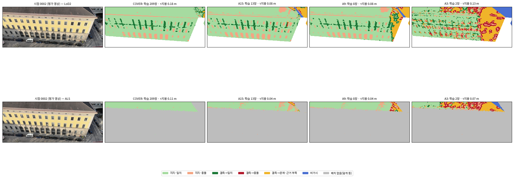

읽는 법: 같은 평가 시점 0002에서 조건마다 패치 상태를 칠했다. 영상이 줄수록 주황(혼재·근거 부족)과 파랑(비가시)이 늘어 사전 정보를 이어받는 몫이 커진다.

- **영상이 줄면 사전 정보를 이어받는 몫이 늘어난다.** LoD2 지붕 기준 0.1 % → 43.8 % → 45.5 % → 62.7 %(COVER 209장 → 저자 13 → 8 → 2장)다. 신뢰도 마스크가 모두 0이 되는 조건은 없었다. 2장에서도 지붕의 23 %가 지지된다.
- **이어받은 자리가 맞는지는 사전 정보에 달렸다.** LoD2 지붕을 이어받은 패치의 참 충돌은 A15 31 %, A3 22 %다. 이 건물에서는 LoD2 지붕이 대부분 맞기 때문이다.
- **영상이 적을수록 전파가 자주 틀린다.** 항공 LiDAR 지붕 전파는 A15 116/270, A3 845/2,200이다.
  - A15의 항공 LiDAR τ는 0.04 m로 매우 좁다.
  - 경사 영상 13장의 MVS 잡음만으로도 지지 패치가 충돌이 되고, 그 충돌이 번진다. 경우 2와 같은 모양이다.
- 저자 15장은 모두 경사 영상이다(연직 0장). 지붕의 41 %는 어느 학습 시점도 보지 못한다.

### 2.4 충돌과 허용 오차 경계 (경우 8)

**물음:** 어느 크기부터 영상을 따르기 시작하는가.

- LoD2의 1~2τ 패치는 범위마다 3,568(B0)~26,308(R1)개다. 면별 목록은 `case8_boundary_LoD2.csv`에 있다(지지 패치의 충돌 표 비율 포함).
- **B0의 벽(정면, 면 22):**
  - 참값 − LoD2 중앙값은 **−0.204 m**다. 실제 정면이 LoD2보다 20 cm 안쪽이다. r9의 '벽 잔차 중앙값 +21 cm'와 같은 크기다.
  - 이번 B0의 LoD2 벽 τ는 0.55 m(B0 크롭)다. 저자 13장 조건은 0.43 m, COVER는 0.53 m다. 그래서 정면 패치의 89 %가 '일치'로 남는다.
  - r9의 벽 τ 0.195 m였다면 58 %가 충돌이다. **경계가 어디냐는 τ에 달렸고, τ는 영상과 범위에 달렸다.**

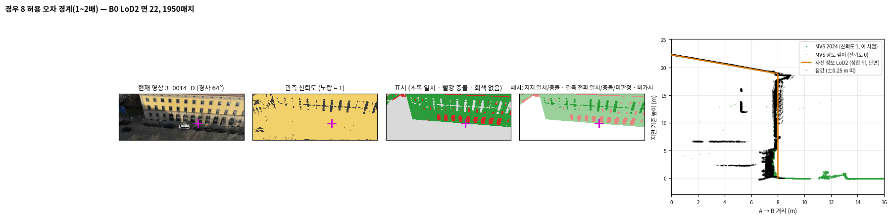

읽는 법: B0 정면을 가로지른 단면이다. 참값 정면(검정)은 LoD2 벽(주황, x = 8 m)보다 0.2~0.4 m 안쪽이고, 1층(0~5 m)은 더 안쪽이다.

### 2.5 전제가 어긋날 때 (경우 7, 경우 9)

#### 경우 7 대부분이 변한 장면 (B173만 담은 상자)

| 실행/사전 정보 | 학습 영상 | τ 지붕/벽 | 정합 이동 | 걸러낸 비율(지붕) | 지지 중 충돌 | 참 충돌 비율 | 지지 표 맞음/틀림 | 전파 맞음/틀림 |
|---|---|---|---|---|---|---|---|---|
| B173상자_고정τ/LoD2 | 140 | 0.186 / 0.220 | (+0.00, +0.00, +0.00) | 8.1 % | 61.4 % | 59.5 % | 39546/10015 | 362/58 |
| B173상자_고정τ/ALS | 140 | 0.158 / 0.158 | (+0.00, +0.00, +0.00) | 9.2 % | 89.0 % | 84.3 % | 20399/1752 | 5/2 |
| B173상자_자체τ/LoD2 | 140 | 3.859 / 0.590 | (+0.00, +0.00, -4.25) | 6.4 % | 20.1 % | 0.0 % | –/– | –/– |
| B173상자_자체τ/ALS | 140 | 2.888 / 2.888 | (+0.00, +0.00, -4.64) | 12.9 % | 28.6 % | 0.0 % | –/– | –/– |
| R2찾기범위/LoD2 | 221 | 0.186 / 0.220 | (+0.00, +0.00, +0.00) | 21.7 % | 33.6 % | 33.7 % | 101331/13712 | 1286/133 |
| R2찾기범위/ALS | 221 | 0.158 / 0.158 | (+0.00, +0.00, +0.00) | 19.8 % | 42.6 % | 33.9 % | 52586/4391 | 86/25 |

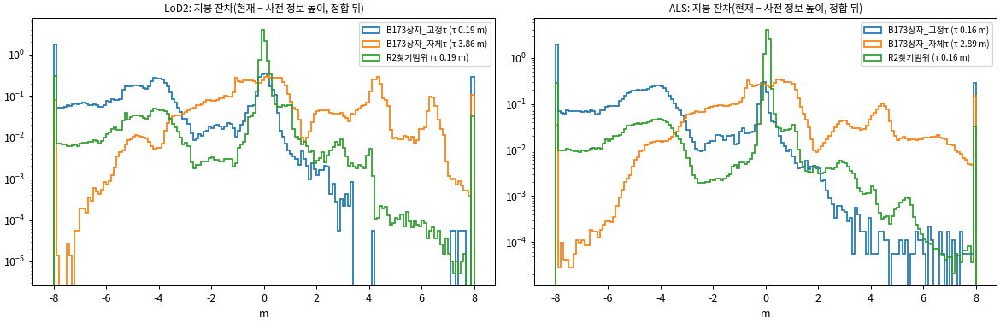

읽는 법: 지붕 잔차(현재 높이 − 사전 정보 높이)의 분포다. 파랑(결정대로 R2 값 고정)은 변한 지붕이 −4 m에 몰리고, 주황(상자 자체 정합)은 −4.2~−4.6 m 이동이 변화를 흡수해 0과 +4 m 두 덩어리가 된다.

- **상자 자체로 재면 곱게 무너지지 않는다.**
  - 변한 지붕이 상자의 대부분이면, 수직 정합('중앙값이 NMAD보다 크면 옮김')이 사전 정보를 4 m 아래로 옮긴다.
  - 그 결과 τ는 2.9~3.9 m로 부풀고, 지지 패치의 충돌은 20~29 %뿐이다. 변하지 않은 부분은 오히려 +4 m 어긋난다.
- **R2 값으로 고정하면 변화가 드러난다.** 지지 패치의 충돌은 LoD2 61 %, 항공 LiDAR 89 %다. 지지 표는 참 라벨과 대부분 맞는다(LoD2 39,546/10,015, 항공 LiDAR 20,399/1,752).
- **B173의 LoD2는 반만 낡았다.** 가운데 톱니 채광창 부분은 지금 지붕과 맞고, 양쪽 날개는 옛 박공으로 약 4 m 높다(상자 지도).

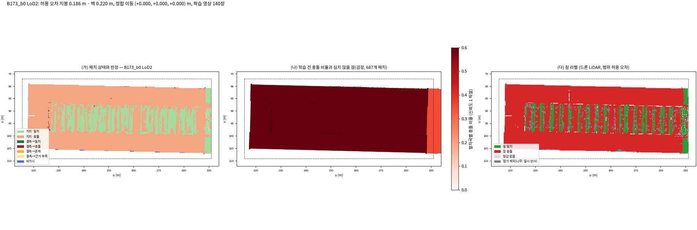

읽는 법: (가) 패치 상태, (나) 학습 전 충돌, (다) 참 라벨이다. 양쪽 날개(위·아래 띠)는 충돌·참 충돌이고, 가운데 톱니 부분은 일치와 충돌이 줄무늬로 섞인다.

#### 경우 9 정합 차이 (R1·R4의 80 m 구역)

| 범위 | 사전 정보 | 구역 | 맞춤 픽셀 | 수평 추정 가능 | 구역 이동 − 범위 이동 (m) | 지붕 높이차 NMAD 범위 이동→구역 이동 | 전체 건물 면 NMAD 범위 이동→구역 이동 |
|---|---|---|---|---|---|---|---|
| R1 | LoD2 | [1, 1] | 53,971 | 아니오 | 0.000 | 0.208 → 0.208 | 0.245 → 0.246 |
| R1 | LoD2 | [1, 2] | 18,584 | 아니오 | 0.000 | 1.201 → 1.201 | 0.579 → 0.582 |
| R1 | LoD2 | [2, 1] | 530,473 | 예 | 0.000 | 0.218 → 0.218 | 0.259 → 0.259 |
| R1 | LoD2 | [2, 2] | 464,124 | 예 | 0.044 | 0.320 → 0.318 | 0.433 → 0.422 |
| R1 | LoD2 | [2, 3] | 390,995 | 예 | 0.000 | 0.229 → 0.229 | 0.352 → 0.352 |
| R1 | LoD2 | [3, 1] | 10,798 | 아니오 | 0.000 | 0.375 → 0.375 | 0.267 → 0.267 |
| R1 | LoD2 | [3, 2] | 13,621 | 예 | 0.183 | 0.108 → 0.106 | 0.240 → 0.397 |
| R1 | LoD2 | [3, 3] | 42,994 | 아니오 | 0.000 | 0.554 → 0.554 | 0.481 → 0.489 |
| R1 | ALS | [1, 1] | 49,240 | 예 | 0.000 | 0.051 → 0.051 | 0.051 → 0.051 |
| R1 | ALS | [1, 2] | 24,474 | 예 | 0.040 | 0.108 → 0.103 | 0.108 → 0.103 |
| R1 | ALS | [2, 1] | 508,074 | 예 | 0.000 | 0.039 → 0.039 | 0.039 → 0.039 |
| R1 | ALS | [2, 2] | 454,096 | 예 | 0.028 | 0.056 → 0.054 | 0.056 → 0.054 |
| R1 | ALS | [2, 3] | 350,294 | 예 | 0.036 | 0.052 → 0.043 | 0.052 → 0.043 |
| R1 | ALS | [2, 4] | 11,010 | 예 | 0.000 | 0.121 → 0.121 | 0.121 → 0.121 |
| R1 | ALS | [3, 1] | 12,901 | 예 | 0.000 | 0.037 → 0.037 | 0.037 → 0.037 |
| R1 | ALS | [3, 2] | 29,977 | 예 | 0.000 | 0.021 → 0.021 | 0.021 → 0.021 |
| R1 | ALS | [3, 3] | 241,577 | 예 | 0.000 | 0.100 → 0.100 | 0.099 → 0.099 |
| R4 | LoD2 | [3, 6] | 65,279 | 예 | 0.590 | 0.201 → 0.182 | 0.310 → 0.375 |
| R4 | LoD2 | [4, 5] | 42,720 | 예 | 0.532 | 0.211 → 0.159 | 0.218 → 0.298 |
| R4 | LoD2 | [4, 6] | 26,752 | 예 | 0.000 | 0.164 → 0.164 | 0.216 → 0.216 |
| R4 | LoD2 | [5, 5] | 54,381 | 예 | 0.034 | 0.134 → 0.133 | 0.150 → 0.147 |
| R4 | LoD2 | [5, 6] | 17,122 | 예 | 0.000 | 0.482 → 0.482 | 0.683 → 0.680 |
| R4 | ALS | [3, 6] | 51,670 | 예 | 0.000 | 0.057 → 0.057 | 0.057 → 0.057 |
| R4 | ALS | [4, 5] | 37,043 | 예 | 0.022 | 0.061 → 0.060 | 0.061 → 0.059 |
| R4 | ALS | [4, 6] | 44,741 | 예 | 0.000 | 0.065 → 0.065 | 0.065 → 0.065 |
| R4 | ALS | [5, 5] | 48,861 | 예 | 0.030 | 0.055 → 0.054 | 0.055 → 0.054 |
| R4 | ALS | [5, 6] | 22,443 | 예 | 0.006 | 0.088 → 0.088 | 0.087 → 0.088 |

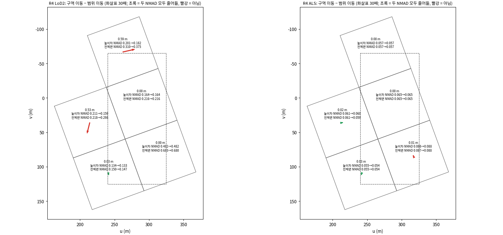

읽는 법: 화살표는 구역 이동 − 범위 이동(30배)이다. 초록은 지붕 높이차 NMAD와 전체 건물 면 NMAD가 둘 다 준 구역이고, 빨강은 아닌 구역이다.

- 항공 LiDAR: 구역 이동과 범위 이동의 차이는 4 cm 이하이고, 두 NMAD는 거의 그대로다. 한 번의 평행 이동으로 맞는다.
- LoD2: 세 구역(R1 1, R4 2)에서 0.18~0.59 m 구역 이동이 나왔다. 지붕 높이차 NMAD는 줄었지만, 전체 건물 면 NMAD는 셋 다 늘었다(예: R4 [4, 5] 0.218 → 0.298 m). LoD2 표현 차이가 만든 가짜 이동이다.

## 3. 사례 상자 카드

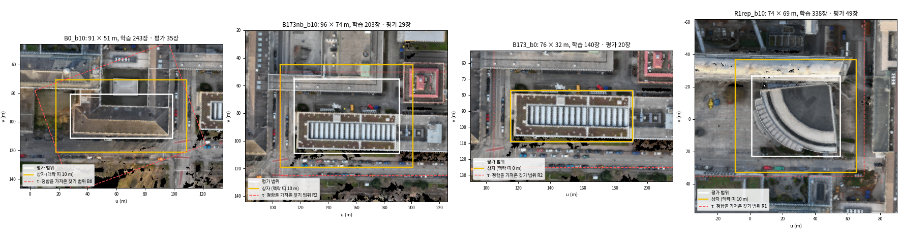

읽는 법: 흰 선은 평가 범위, 노랑은 맥락 띠 10 m를 더한 상자, 빨간 점선은 τ·정합을 가져온 찾기 범위다. 제목에 크기와 영상 수(학습·평가)가 있다.

### 3.0 크기 규칙과 사용자 결정

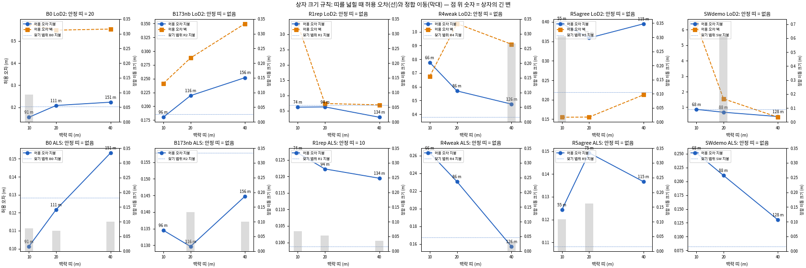

읽는 법: 띠를 10 → 20 → 40 m로 넓히면 허용 오차(선)가 계속 움직인다. 막대는 정합 이동의 크기, 점 위 숫자는 상자의 긴 변이다.

| 상자_띠 | 사전 정보 | 크기 (m) | 학습 영상 | 평가 영상 | τ 지붕 | τ 벽 | 정합 이동 | 표본 지붕/벽 |
|---|---|---|---|---|---|---|---|---|
| B0_b10 | LoD2 | 91 × 51 | 243 | 35 | 0.155 | 0.578 | (-0.012, -0.092, +0.000) | 2,003,296 / 2,402,811 |
| B0_b10 | ALS | 91 × 51 | 243 | 35 | 0.101 | 0.101 | (-0.071, +0.032, +0.000) | 1,870,933 / 0 |
| B0_b20 | LoD2 | 111 × 71 | 272 | 39 | 0.208 | 0.549 | (+0.000, +0.000, +0.000) | 2,369,062 / 2,639,263 |
| B0_b20 | ALS | 111 × 71 | 272 | 39 | 0.122 | 0.122 | (-0.060, +0.033, +0.000) | 2,303,415 / 0 |
| B0_b40 | LoD2 | 151 × 111 | 308 | 44 | 0.223 | 0.554 | (+0.000, +0.000, +0.000) | 3,648,546 / 4,563,498 |
| B0_b40 | ALS | 151 × 111 | 308 | 44 | 0.153 | 0.153 | (-0.094, +0.031, +0.000) | 3,525,861 / 0 |
| B173nb_b10 | LoD2 | 96 × 74 | 203 | 29 | 0.180 | 0.241 | (+0.000, +0.000, +0.000) | 1,732,809 / 1,892,445 |
| B173nb_b10 | ALS | 96 × 74 | 203 | 29 | 0.135 | 0.135 | (+0.000, +0.000, +0.000) | 1,696,581 / 0 |
| B173nb_b20 | LoD2 | 116 × 94 | 245 | 35 | 0.219 | 0.288 | (+0.000, +0.000, +0.000) | 2,192,748 / 2,203,645 |
| B173nb_b20 | ALS | 116 × 94 | 245 | 35 | 0.130 | 0.130 | (-0.090, -0.071, +0.066) | 2,130,638 / 0 |
| B173nb_b40 | LoD2 | 156 × 134 | 349 | 50 | 0.252 | 0.350 | (+0.000, +0.000, +0.000) | 3,560,396 / 4,254,593 |
| B173nb_b40 | ALS | 156 × 134 | 349 | 50 | 0.145 | 0.145 | (-0.097, +0.024, +0.000) | 3,451,197 / 0 |
| B173_b0 | LoD2 | 76 × 32 | 140 | 20 | 3.859 | 0.590 | (+0.000, +0.000, -4.251) | 730,402 / 1,065,823 |
| B173_b0 | ALS | 76 × 32 | 140 | 20 | 2.888 | 2.888 | (+0.000, +0.000, -4.639) | 714,900 / 0 |
| R1rep_b10 | LoD2 | 74 × 69 | 338 | 49 | 0.612 | 3.346 | (+0.000, +0.000, +0.000) | 2,328,638 / 2,486,235 |
| R1rep_b10 | ALS | 74 × 69 | 338 | 49 | 0.127 | 0.127 | (-0.005, -0.068, +0.000) | 2,097,633 / 0 |
| R1rep_b20 | LoD2 | 94 × 89 | 399 | 58 | 0.622 | 0.732 | (+0.000, +0.000, +0.000) | 3,174,917 / 4,463,411 |
| R1rep_b20 | ALS | 94 × 89 | 399 | 58 | 0.122 | 0.122 | (+0.033, -0.042, +0.000) | 2,731,078 / 0 |
| R1rep_b40 | LoD2 | 134 × 129 | 479 | 69 | 0.282 | 0.687 | (+0.000, +0.000, +0.000) | 6,512,547 / 6,572,435 |
| R1rep_b40 | ALS | 134 × 129 | 479 | 69 | 0.119 | 0.119 | (+0.024, -0.026, +0.000) | 5,958,387 / 0 |
| R4weak_b10 | LoD2 | 66 × 44 | 61 | 9 | 0.777 | 0.676 | (+0.000, +0.000, +0.000) | 209,278 / 276,400 |
| R4weak_b10 | ALS | 66 × 44 | 61 | 9 | 0.263 | 0.263 | (+0.000, +0.000, +0.000) | 202,294 / 0 |
| R4weak_b20 | LoD2 | 86 × 64 | 67 | 10 | 0.570 | 1.060 | (+0.000, +0.000, +0.000) | 282,895 / 409,368 |
| R4weak_b20 | ALS | 86 × 64 | 67 | 10 | 0.230 | 0.230 | (+0.000, +0.000, +0.000) | 277,216 / 0 |
| R4weak_b40 | LoD2 | 126 × 104 | 82 | 12 | 0.474 | 0.910 | (+0.241, -0.116, +0.000) | 609,415 / 773,660 |
| R4weak_b40 | ALS | 126 × 104 | 82 | 12 | 0.157 | 0.157 | (-0.029, +0.015, +0.000) | 593,378 / 0 |
| R5agree_b10 | LoD2 | 53 × 55 | 111 | 16 | 0.396 | 0.155 | (+0.000, +0.000, +0.304) | 480,001 / 781,766 |
| R5agree_b10 | ALS | 53 × 55 | 111 | 16 | 0.124 | 0.124 | (+0.040, +0.054, +0.085) | 446,814 / 0 |
| R5agree_b20 | LoD2 | 73 × 75 | 136 | 20 | 0.359 | 0.155 | (+0.000, +0.000, +0.000) | 774,758 / 861,164 |
| R5agree_b20 | ALS | 73 × 75 | 136 | 20 | 0.149 | 0.149 | (+0.143, -0.032, +0.070) | 759,780 / 0 |
| R5agree_b40 | LoD2 | 113 × 115 | 164 | 24 | 0.395 | 0.213 | (+0.000, +0.000, +0.000) | 1,771,930 / 1,245,548 |
| R5agree_b40 | ALS | 113 × 115 | 164 | 24 | 0.137 | 0.137 | (+0.000, +0.000, +0.000) | 1,768,422 / 0 |
| SWdemo_b10 | LoD2 | 41 × 68 | 116 | 17 | 0.864 | 6.398 | (+0.000, +0.000, +0.000) | 544,609 / 508,638 |
| SWdemo_b10 | ALS | 41 × 68 | 116 | 17 | 0.251 | 0.251 | (+0.000, +0.000, +0.000) | 421,814 / 0 |
| SWdemo_b20 | LoD2 | 61 × 88 | 136 | 20 | 0.675 | 1.546 | (-0.523, -0.323, +0.000) | 691,549 / 769,896 |
| SWdemo_b20 | ALS | 61 × 88 | 136 | 20 | 0.211 | 0.211 | (+0.000, +0.000, +0.000) | 650,773 / 0 |
| SWdemo_b40 | LoD2 | 101 × 128 | 207 | 30 | 0.400 | 0.353 | (+0.000, +0.000, +0.000) | 1,499,355 / 2,447,535 |
| SWdemo_b40 | ALS | 101 × 128 | 207 | 30 | 0.130 | 0.130 | (+0.000, +0.000, +0.000) | 1,278,564 / 0 |

| 상자 | 사전 정보 | 띠 비교 (m) | τ 지붕 차 | τ 벽 차 | 이동 차 (m) | 안정 |
|---|---|---|---|---|---|---|
| B0 | LoD2 | 10 → 20 | 25.6 % | 5.3 % | 0.093 | 아니오 |
| B0 | LoD2 | 20 → 40 | 6.7 % | 0.9 % | 0.000 | 예 |
| B0 | ALS | 10 → 20 | 16.9 % | 16.9 % | 0.010 | 아니오 |
| B0 | ALS | 20 → 40 | 20.6 % | 20.6 % | 0.034 | 아니오 |
| B173nb | LoD2 | 10 → 20 | 17.9 % | 16.2 % | 0.000 | 아니오 |
| B173nb | LoD2 | 20 → 40 | 13.0 % | 17.8 % | 0.000 | 아니오 |
| B173nb | ALS | 10 → 20 | 3.8 % | 3.8 % | 0.132 | 아니오 |
| B173nb | ALS | 20 → 40 | 10.4 % | 10.4 % | 0.116 | 아니오 |
| R1rep | LoD2 | 10 → 20 | 1.6 % | 356.9 % | 0.000 | 아니오 |
| R1rep | LoD2 | 20 → 40 | 120.6 % | 6.6 % | 0.000 | 아니오 |
| R1rep | ALS | 10 → 20 | 4.0 % | 4.0 % | 0.046 | 예 |
| R1rep | ALS | 20 → 40 | 2.4 % | 2.4 % | 0.018 | 예 |
| R4weak | LoD2 | 10 → 20 | 36.4 % | 36.2 % | 0.000 | 아니오 |
| R4weak | LoD2 | 20 → 40 | 20.2 % | 16.4 % | 0.267 | 아니오 |
| R4weak | ALS | 10 → 20 | 14.1 % | 14.1 % | 0.000 | 아니오 |
| R4weak | ALS | 20 → 40 | 46.7 % | 46.7 % | 0.033 | 아니오 |
| R5agree | LoD2 | 10 → 20 | 10.2 % | 0.3 % | 0.304 | 아니오 |
| R5agree | LoD2 | 20 → 40 | 9.2 % | 27.0 % | 0.000 | 아니오 |
| R5agree | ALS | 10 → 20 | 16.7 % | 16.7 % | 0.134 | 아니오 |
| R5agree | ALS | 20 → 40 | 9.3 % | 9.3 % | 0.162 | 아니오 |
| SWdemo | LoD2 | 10 → 20 | 27.9 % | 313.9 % | 0.615 | 아니오 |
| SWdemo | LoD2 | 20 → 40 | 68.9 % | 337.8 % | 0.615 | 아니오 |
| SWdemo | ALS | 10 → 20 | 19.4 % | 19.4 % | 0.000 | 아니오 |
| SWdemo | ALS | 20 → 40 | 61.6 % | 61.6 % | 0.000 | 아니오 |

- **규칙(설정, 결과 전):** τ(지붕·벽)가 다음 크기와 10 % 안, 정합 이동이 5 cm 안, 표본이 충분한 가장 작은 띠를 고른다. 위 한계는 한 변 100 m다.
- **결과:** 일곱 상자 가운데 두 사전 정보가 모두 안정되는 크기가 100 m 안에 없었다.
  - B0 LoD2만 20 m(한 변 111 m)에서 안정된다.
  - R1rep 항공 LiDAR만 10 m에서 안정된다.
- 표본은 상자마다 지붕 20만~650만 픽셀로 충분했다. τ는 담기는 건물 구성을 따른다.
- 같은 참값으로 띠별 τ를 쓰면 참 충돌 수가 크게 바뀐다(R1rep LoD2 12,607 / 19,117 / 24,459).
- 발주 8절에 따라 멈추고 물었다. **23:02 사용자 결정:**
  - τ·정합은 상자를 담은 찾기 범위 값으로 고정한다(B0 → B0 크롭, B173+이웃·B173 → R2, R1rep → R1).
  - 상자는 평가 범위 + 10 m로 한다.
  - 추천 묶음만 상자 산출을 낸다.
- **분석자 판단으로 뺀 후보:** 이 셋의 사례는 2절(찾기 범위)에 남는다.
  - SWdemo: 평가 범위가 철거된 두 동뿐이라 '대부분 변한 상자는 하나'에 걸린다.
  - R4weak: 평가 범위 패치의 24 %만 참값이 덮는다.
  - R5agree: '둘 다 옳은 곳'은 B0가 함께 보인다.

### 3.1 상자 단위 산출 (학습 영상만으로 다시 만든 MVS, 고정 τ·정합)

| 상자 | 크기 (평가 범위) | 학습 / 평가 영상 | 고정 τ 지붕/벽 (출처) | 패치 지지 / 결측 / 비가시 (LoD2) | 지지 중 충돌 LoD2 / 항공 | 벽 피복 | MVS |
|---|---|---|---|---|---|---|---|
| **B0** (대상 건물 4959323) | 91 × 51 m = 4,608 m² (2,178 m²) | 243 / 35 | LoD2 0.203 / 0.552 m, 항공 0.128 m (B0 크롭) | 96.0 / 3.5 / 0.5 % | 20.0 / 6.7 % | 0.46 (gt_clean) | 2,968 s |
| **B173+이웃** (4959326 + 4959460 남쪽 띠) | 96 × 74 m = 7,084 m² (4,090 m²) | 203 / 29 | LoD2 0.186 / 0.220 m, 항공 0.158 m (R2) | 83.2 / 5.5 / 11.3 % | 40.6 / 51.3 % | 0.31 | 2,444 s |
| **B173만** | 76 × 32 m = 2,419 m² (같음) | 140 / 20 | LoD2 0.186 / 0.220 m, 항공 0.158 m (R2) | 78.7 / 4.3 / 17.1 % | 61.4 / 88.7 % | 0.25 | 1,648 s |
| **R1rep** (부채꼴 4906975) | 74 × 69 m = 5,156 m² (2,682 m²) | 338(깊이 지도 333) / 49 | LoD2 0.682 / 0.731 m, 항공 0.099 m (R1) | 95.7 / 2.6 / 1.7 % | 70.7 / 46.4 % | 0.31 | 4,145 s |

- **B0:** 일치 전파가 거의 다 맞다(1,802 맞음). 참값이 있는 곳의 충돌 전파는 대부분 틀렸다(맞음 9 / 틀림 87). 정면은 LoD2가 20 cm 바깥인데 벽 τ 0.55 m 안이어서 '일치'로 남는다(경우 8). 상자 자체로 잰 τ(0.168 / 0.488 m)는 고정값보다 조금 좁다.
- **B173+이웃:** B173 지붕 변화로 사전 정보 '앞'이 많다(LoD2 22,729, 항공 18,424). 일치 전파 맞음 1,070은 거의 모두 벽이다(표면 99·69, 벽 1,069). 비가시 LoD2 패치는 11 %이고, 참값이 있는 25패치 가운데 21이 이어받으면 틀린다(남쪽 날개의 옛 벽).
- **B173만:** 경우 7 그대로다(2.5절). 상자 자체로 재면 τ 3.6 / 2.9 m, 정합 −4.2 / −4.6 m로 무너진다. 고정값이면 충돌이 61 / 89 %다.
- **R1rep:** 사전 정보 '뒤'가 많다(LoD2 11,509 대 앞 4,288). 실제 지붕이 LoD2보다 위다. 고정 τ가 0.68 m로 넓은데도, 학습 영상만의 MVS에서는 지지 패치의 71 %가 충돌이다. 상자 자체 벽 τ는 2.46 m로 부풀었다. 전파는 맞음 210(충돌 140, 일치 70) / 틀림 108이다. 깊이 지도가 없는 영상 5장(COLMAP이 원본 영상을 찾지 못해 건너뜀)은 기록하고 뺐다.
- 상자마다 지도: `figures/maps/box_<상자>_<사전 정보>.png`. 사례 목록: `step06/box_cases/<상자>/`.

| 상자 | 15장 (촬영 순서) | 규칙을 만족한 창 수 | 마스크 1 비율: 지금 MVS | 마스크 1 비율: 학습 13장 MVS | 평가로 뗀 2장 |
|---|---|---|---|---|---|
| B173nb | 20241217091109_ ~ 20241217091141_ | 13 | 0.981 | 0.958 | 9_0097_D, 9_0107_D |
| B0 | 20241217101309_ ~ 20241217101341_ | 15 | 0.937 | 0.900 | 9_0007_D, 7_0016_D |

- 연속 15장 후보는 그 상자의 학습 후보(띠 10 m, 이름 = 촬영 순서)에서 골랐다. 규칙: 15장 모두가 평가 범위 건물 면을 5,000픽셀 이상 보아야 하고, 그 가운데 신뢰도 1 비율이 가장 큰 창을 고른다.
- B0 후보(101309_0007~101341_0023)는 저자 15장과 같은 비행 구간이다.
- 본 실험에 넣을지는 사용자가 정한다.

## 4. 찾기 범위의 첫째 단계 요약과 정합 점검

### 4.1 범위와 영상

- **찾기 범위 8곳:** R1~R5(조사 v1 `regions.json`), B0 크롭, 남서 범위(SW: C05·C06·C02 평면 + 15 m), R3E(R3를 동쪽으로 10 m 넓힌 것, C04용). 그림 `fig_geogs_regions_map`에 모두 그렸다.
- **영상:** 9월 15일 감사 규칙(`region_view_support_v1`)으로 후보를 뽑고, 이름 순으로 여덟 장에 한 장을 평가용으로 떼었다. R1~R5의 후보 목록은 9월 15일 동결 목록과 정확히 같다.
- 찾기 단계는 지금 MVS(평가 영상을 포함해 만든 것)를 그대로 썼다. 사례를 찾는 일이지 방법을 평가하는 일이 아니기 때문이다.
- **B0 저자 15장:** 공통 937장에 그대로 들어 있다. 두 포즈는 같은 틀이고, 차이는 평행 이동 (−2.00, 29.00, 0.003) m뿐이다(회전 0.03° 이하).
- **9장·3장 부분집합:** GeoGS 코드와 예제에는 목록이 없다. 논문은 15·12·9·6·3장을 썼다고만 적었다(4.1절). 그래서 15장에서 고르게 골랐다(이름 순 round(linspace(0, 14, 9)), round(linspace(0, 14, 3))). 시험 영상은 GeoGS 규칙(llffhold = 8)대로 첫 장 0002다(9장 = 8 + 1, 3장 = 2 + 1).
- **B0 덮는 영상(COVER):** 대상 건물 평면을 후보 규칙으로 덮는 공통 영상 239장이다(학습 209 = 연직 40·경사 169, 평가 30).

### 4.2 정합, 허용 오차, 학습 전 판정

| 범위 | 사전 정보 | 학습 영상 | 정합 이동 (x, y, z) m | 받아들임 | 전체면 확인 | 수평 추정 가능 | 건물 면 NMAD 앞→뒤 (m) | τ 지붕 (m) | 지붕 표본 | 정합 뒤 중앙값 | NMAD 걸러내기 앞→뒤 | 걸러낸 비율 | τ 벽 (m) | 벽 표본 | 지붕 정확도 기준과 견줌 |
|---|---|---|---|---|---|---|---|---|---|---|---|---|---|---|---|
| R1 | LoD2 | 588 | (+0.000, +0.000, +0.000) | 없음 | 통과 | 예 | 0.404 → 0.403 | 0.682 | 7,967,001 | -0.084 | 0.344 → 0.273 | 15.7 % | 0.731 | 8,640,032 | 1.0 m: 안 넘음 |
| R1 | ALS | 588 | (+0.000, +0.000, +0.000) | 없음 | 통과 | 예 | 0.055 → 0.055 | 0.099 | 7,448,828 | -0.031 | 0.051 → 0.040 | 15.6 % | 0.099 | 지붕 값 | 0.12 m: 안 넘음 |
| R2 | LoD2 | 221 | (+0.000, +0.000, +0.000) | 없음 | 통과 | 예 | 0.162 → 0.162 | 0.186 | 1,973,568 | 0.019 | 0.104 → 0.074 | 21.7 % | 0.220 | 2,022,712 | 1.0 m: 안 넘음 |
| R2 | ALS | 221 | (+0.000, +0.000, +0.000) | 없음 | 통과 | 예 | 0.093 → 0.092 | 0.158 | 1,935,686 | -0.076 | 0.088 → 0.063 | 19.8 % | 0.158 | 지붕 값 | 0.12 m: 넘음 |
| R3 | LoD2 | 303 | (+0.000, +0.000, +0.000) | 없음 | 통과 | 아니오 | 0.090 → 0.090 | 0.159 | 3,532,493 | 0.045 | 0.072 → 0.063 | 8.8 % | 0.187 | 3,199,831 | 1.0 m: 안 넘음 |
| R3 | ALS | 303 | (-0.020, +0.015, +0.067) | 수평·수직 | 통과 | 예 | 0.052 → 0.051 | 0.119 | 3,510,094 | 0.001 | 0.050 → 0.048 | 4.1 % | 0.119 | 지붕 값 | 0.12 m: 안 넘음 |
| R3E | LoD2 | 311 | (+0.000, +0.000, +0.000) | 없음 | 되돌림 | 예 | 0.100 → 0.100 | 0.162 | 3,633,558 | 0.045 | 0.075 → 0.065 | 10.3 % | 0.186 | 3,405,472 | 1.0 m: 안 넘음 |
| R3E | ALS | 311 | (-0.015, +0.026, +0.063) | 수평·수직 | 통과 | 예 | 0.052 → 0.052 | 0.119 | 3,607,639 | -0.002 | 0.050 → 0.047 | 5.2 % | 0.119 | 지붕 값 | 0.12 m: 안 넘음 |
| R4 | LoD2 | 102 | (+0.000, +0.000, +0.000) | 없음 | 통과 | 예 | 0.463 → 0.461 | 0.378 | 967,869 | 0.012 | 0.205 → 0.151 | 18.7 % | 0.780 | 1,065,158 | 1.0 m: 안 넘음 |
| R4 | ALS | 102 | (+0.002, +0.018, +0.000) | 수평 | 통과 | 예 | 0.082 → 0.080 | 0.168 | 963,150 | -0.010 | 0.075 → 0.067 | 9.8 % | 0.168 | 지붕 값 | 0.12 m: 넘음 |
| R5 | LoD2 | 252 | (+0.000, +0.000, +0.000) | 없음 | 통과 | 아니오 | 0.131 → 0.131 | 0.219 | 2,744,191 | 0.026 | 0.114 → 0.088 | 12.6 % | 0.176 | 3,001,580 | 1.0 m: 안 넘음 |
| R5 | ALS | 252 | (+0.003, +0.018, +0.073) | 수평·수직 | 통과 | 예 | 0.049 → 0.049 | 0.108 | 2,699,707 | 0.006 | 0.047 → 0.043 | 6.7 % | 0.108 | 지붕 값 | 0.12 m: 안 넘음 |
| SW | LoD2 | 266 | (+0.000, +0.000, +0.000) | 없음 | 통과 | 예 | 0.469 → 0.469 | 0.849 | 3,512,343 | -0.192 | 0.464 → 0.339 | 16.6 % | 0.475 | 3,482,805 | 1.0 m: 안 넘음 |
| SW | ALS | 266 | (+0.000, +0.000, +0.000) | 없음 | 통과 | 예 | 0.051 → 0.051 | 0.082 | 3,293,234 | -0.029 | 0.043 → 0.033 | 16.4 % | 0.082 | 지붕 값 | 0.12 m: 안 넘음 |
| B0 | LoD2 | 272 | (+0.000, +0.000, +0.000) | 없음 | 통과 | 예 | 0.238 → 0.238 | 0.203 | 2,508,675 | -0.073 | 0.112 → 0.081 | 18.5 % | 0.552 | 2,585,533 | 1.0 m: 안 넘음 |
| B0 | ALS | 272 | (-0.046, +0.046, +0.000) | 수평 | 통과 | 예 | 0.077 → 0.066 | 0.128 | 2,438,090 | -0.026 | 0.060 → 0.051 | 9.4 % | 0.128 | 지붕 값 | 0.12 m: 넘음 |

- **LoD2는 어느 범위에서도 옮기지 않았다.** R3E에서는 기운 지붕 하나(맞춤 픽셀의 83 %)에 끌린 1.06 m 수평 이동이 지붕 관문을 통과했다. 전체 건물 면 NMAD가 0.100 → 0.194 m로 두 배가 되어 마지막 확인에서 되돌렸다(고침 4).
- **항공 LiDAR**는 B0·R3·R3E·R4·R5에서 수평 ≤ 7 cm, R3·R3E·R5에서 수직 6~7 cm를 옮겼다. 모두 전체 건물 면 NMAD가 줄었다(B0 0.077 → 0.066 m).
- R3·R5의 LoD2는 기운 면이 네 방향에 고루 있지 않아 수평 이동을 추정하지 않았다(수직만 검토, 기록).
- **항공 LiDAR τ = 0.08~0.17 m.** 기관 기준 0.12 m를 R2(0.158)·R4(0.168)·B0(0.128)가 넘는다. 기준은 하한으로 쓰지 않고 견주어 적기만 했다.
- **LoD2 지붕 τ = 0.16~0.85 m**(R1 0.68, SW 0.85, R4 0.38). 일반화가 넓게 퍼진 범위에서는 잔차가 넓게 퍼져 τ가 크다. 그런 곳에서는 0.7~0.85 m보다 작은 LoD2 오류가 '일치'로 읽힌다.
- LoD2 벽 τ = 0.18~0.78 m다. 벽 표본은 모든 범위에서 2,000을 넘었다.

| 범위 | 사전 정보 | 패치 넓이 | 지지 | 결측 | 비가시 | 지지 중 충돌 | 결측 전파: 일치/충돌/혼재/근거 부족 (m²) | 패치 없는 픽셀(학습 시점 합): 이어받음/일치/충돌 | 심지 않을 점 |
|---|---|---|---|---|---|---|---|---|---|
| R1 | LoD2 | 31998 | 95.5 % | 4.1 % | 0.5 % | 28.3 % | 432 / 441 / 168 / 258 | 255 / 352 / 171 | 7,055패치 (441 m²) |
| R1 | ALS | 7918 | 97.0 % | 2.7 % | 0.3 % | 27.8 % | 63 / 90 / 46 / 19 | 16,545,744 / 33,790,833 / 57,257,604 | 1,420점 (점 310,498) |
| R2 | LoD2 | 15652 | 84.0 % | 4.2 % | 11.8 % | 33.6 % | 223 / 122 / 50 / 263 | 1 / 15 / 24 | 1,956패치 (122 m²) |
| R2 | ALS | 4128 | 99.6 % | 0.4 % | 0.0 % | 43.7 % | 8 / 2 / 4 / 1 | 1,907,968 / 6,336,450 / 6,259,361 | 26점 (점 134,659) |
| R3 | LoD2 | 11106 | 97.8 % | 2.2 % | 0.0 % | 22.3 % | 144 / 67 / 26 / 8 | 0 / 0 / 0 | 1,067패치 (67 m²) |
| R3 | ALS | 4425 | 99.7 % | 0.3 % | 0.0 % | 4.4 % | 12 / 0 / 0 / 0 | 3,129,915 / 19,703,780 / 10,156,158 | 0점 (점 125,045) |
| R3E | LoD2 | 13681 | 94.8 % | 5.2 % | 0.0 % | 23.6 % | 382 / 157 / 67 / 104 | 0 / 0 / 0 | 2,515패치 (157 m²) |
| R3E | ALS | 4756 | 99.7 % | 0.3 % | 0.0 % | 6.5 % | 12 / 2 / 1 / 0 | 3,624,542 / 19,666,251 / 11,200,164 | 16점 (점 133,531) |
| R4 | LoD2 | 27558 | 66.0 % | 6.7 % | 27.4 % | 24.3 % | 474 / 249 / 117 / 1004 | 9 / 94 / 118 | 3,989패치 (249 m²) |
| R4 | ALS | 7247 | 85.4 % | 5.3 % | 9.3 % | 18.2 % | 27 / 41 / 24 / 291 | 935,631 / 5,144,758 / 6,343,484 | 753점 (점 228,953) |
| R5 | LoD2 | 15399 | 87.4 % | 6.3 % | 6.3 % | 25.8 % | 326 / 301 / 100 / 247 | 0 / 15 / 19 | 4,814패치 (301 m²) |
| R5 | ALS | 4167 | 100.0 % | 0.0 % | 0.0 % | 8.3 % | 0 / 0 / 0 / 0 | 2,878,811 / 10,332,359 / 11,361,500 | 0점 (점 128,671) |
| SW | LoD2 | 23005 | 60.6 % | 20.8 % | 18.6 % | 23.7 % | 1051 / 569 / 156 / 3004 | 639 / 1,548 / 222 | 9,106패치 (569 m²) |
| SW | ALS | 6397 | 70.6 % | 16.8 % | 12.6 % | 38.5 % | 17 / 228 / 45 / 783 | 4,695,946 / 13,045,252 / 18,172,324 | 4,162점 (점 236,042) |
| B0 | LoD2 | 9618 | 94.2 % | 5.2 % | 0.7 % | 20.0 % | 352 / 54 / 25 / 64 | 96 / 561 / 471 | 864패치 (54 m²) |
| B0 | ALS | 2835 | 99.3 % | 0.6 % | 0.1 % | 8.7 % | 13 / 3 / 1 / 0 | 3,967,253 / 8,666,990 / 12,338,991 | 33점 (점 120,381) |

- 학습 전 판정: 지지 61~100 %, 결측 0~21 %(SW 최대), 비가시 0~27 %(R4 LoD2, 대부분 벽).
- 범위·사전 정보마다 지도 그림은 `step09/<범위>/map_<사전 정보>.png`에 있다(아래는 R1 LoD2).

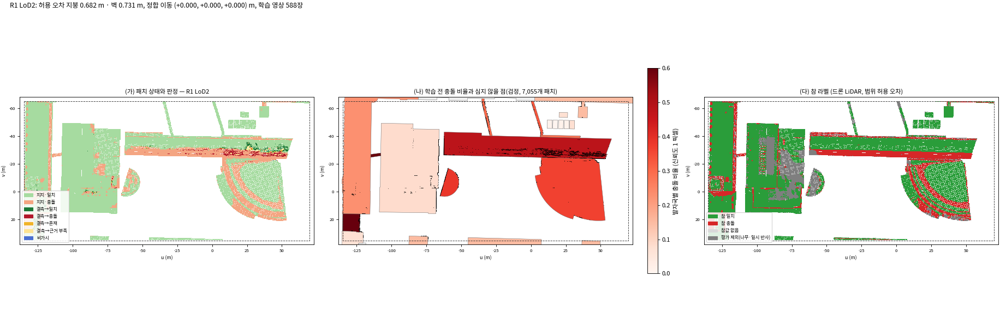

읽는 법: (가) 패치 상태와 판정(긴 홀 능선의 진빨강 = 결측 → 충돌), (나) 발자국별 학습 전 충돌 비율과 심지 않을 점(검정), (다) 참 라벨(회색 = 평가 제외)이다.

### 4.3 구역별 정합 점검 (경우 9)

2.5절에 적었다. 항공 LiDAR는 한 번의 이동으로 충분하고, LoD2 구역 이동은 가짜였다.

## 5. 참값 정리와 평가 제외 목록

| 범위 | 드론 LiDAR 점 | 일시 반사 지운 점 | 높이 맞춤 (m) (v2 값) | 맞춘 뒤 MVS−참값: 지면 / 건물 (m) | 제외 칸: 나무 / 일시 반사 / 사전 쪽 나무 | LoD2 지붕 참값 덮음 | LoD2 벽 피복 | LoD2 참 충돌 지붕 / 벽 | 항공 LiDAR 참 충돌 지붕 |
|---|---|---|---|---|---|---|---|---|---|
| R1 | 83,907,816 | 1,241,180 | -0.054 (+0.033) | -0.000 / -0.015 | 19,527 / 6,164 / 3,084 | 98.3 % | 0.390 | 36,752 / 22,776 | 7,488 (6.7 %) |
| R2 | 49,645,206 | 614,852 | -0.044 (+0.028) | 0.000 / 0.005 | 7,661 / 2,493 / 2,021 | 99.2 % | 0.342 | 35,060 / 7,211 | 20,808 (33.5 %) |
| R3 | 63,383,245 | 645,646 | -0.044 (+0.038) | -0.000 / -0.009 | 3,551 / 1,758 / 395 | 99.8 % | 0.394 | 19,655 / 5,032 | 1,150 (1.7 %) |
| R3E | 67,607,818 | 704,910 | -0.050 (+0.040) | 0.000 / -0.004 | 4,856 / 2,133 / 573 | 99.7 % | 0.335 | 22,649 / 5,751 | 1,583 (2.1 %) |
| R4 | 37,638,462 | 425,370 | -0.086 (+0.035) | 0.000 / 0.022 | 14,689 / 1,808 / 2,120 | 71.3 % | 0.140 | 21,291 / 6,529 | 3,029 (3.9 %) |
| R5 | 63,873,179 | 481,038 | -0.056 (+0.030) | -0.000 / -0.003 | 6,684 / 2,397 / 905 | 99.6 % | 0.362 | 17,651 / 4,010 | 2,393 (3.7 %) |
| SW | 22,657,854 | 407,140 | -0.079 (+0.010) | -0.000 / -0.005 | 8,918 / 1,438 / 1,245 | 51.4 % | 0.103 | 14,888 / 4,216 | 3,845 (9.2 %) |
| B0 | 21,533,506 | 201,138 | -0.030 (+0.052) | -0.038 / -0.037 | 6,151 / 1,001 / 408 | 36.4 % | 0.336 | 2,577 / 2,912 | 306 (2.0 %) |

### 5.1 높이 맞춤: gt_clean 방식 (설정 v3부터)

- **처음(v2)에는 조사 v1의 칸 방식으로 맞췄다.** 0.5 m 칸 최댓값 DSM의 MVS − 드론 LiDAR 중앙값이다. 그랬더니 R1과 SW에서 항공 LiDAR 지붕 패치의 87~95 %가 '참 충돌'로 나왔다.
- **원인:** 잡음이 있는 MVS 칸의 최댓값은 위로 치우친다. 그래서 드론 LiDAR가 8~10 cm 높게 놓였다.
  - 시점마다 픽셀로 재면 맨땅에서 MVS − 참값이 R1 −9.7, R3 −8.2, SW −8.7 cm였다.
  - B0의 같은 지붕 패치에서 드론 LiDAR가 gt_clean보다 10.9 cm 높았다. 항공 LiDAR와 견주면 gt_clean은 +1.0 cm, 드론 LiDAR는 +11.7 cm였다.
- **고친 것:** 발주 5.6은 'gt_clean과 같은 방식'을 정했지만, v1·v2는 그 방식을 구현하지 않았다. v3부터 9월 25일 승인된 gt_clean 방식으로 맞춘다.
  1. 학습 시점 최대 40장에서 참값을 z-버퍼로 투영한다(9 × 9 새어듦 거름).
  2. 맨땅 픽셀에서 MVS 깊이 − 참값 깊이를 연직 차이로 바꾼다.
  3. 그 중앙값만큼 옮긴다. 이것을 두 번 되풀이한다.
- **결과:**
  - 맞춘 값은 −3.0(B0 보충 드론 LiDAR) ~ −8.6 cm(R4)다. v2 값은 +1.0~+5.2 cm였다.
  - 맞춘 뒤 맨땅 차이는 모든 범위에서 0.0 cm이고, 건물 위 차이는 −1.5~+2.2 cm다.
  - R1 항공 LiDAR 지붕의 참 충돌은 94.5 % → 6.7 %가 되었다.
  - B0에서 드론 LiDAR − gt_clean은 +10.9 → +2.7 cm가 되었다.
- B0의 주 참값은 발주대로 gt_clean을 그대로 쓴다. gt_clean은 MVS 맨땅보다 3.8 cm 높다(기록만 함).

### 5.2 일시 반사 지우기

- **규칙(설정, 결과 전):** 드론 LiDAR DSM이 MVS DSM과 항공 LiDAR DSM 둘 다보다 1.5 m 넘게 높은 0.5 m 칸을 찾는다. 그 칸에서 max(MVS, 항공 LiDAR) + 0.75 m보다 높은 점을 지운다.
- v2에는 점 검사에서 국소 높이와 절대 높이를 견주는 단위 오류가 있어 모든 범위에서 0점을 지웠다. v3에서 고쳤다.
- **결과:** 범위마다 20만~124만 점(0.75~1.8 %), 칸 1,001~6,164개를 지웠다.
  - **C03(R1 굴뚝 수증기):** 12 m 상자의 214,043점 가운데 76,340점(36 %)을 지웠다.
  - **C04(R3E 덮개 구조물, 실제 구조물):** 5점만 지웠다. 남겨야 할 것을 남겼다.
  - **C01(차량):** 여덟 범위 밖이다.

### 5.3 패치 참값과 벽 피복

- **지붕 패치:** 패치 칸을 지나는 연직선 위 참값 점 가운데 맨 위 1 m 층의 '참값 − 사전 정보' 높이 중앙값이다(점 5개 이상).
- **벽 패치(v5):** 수직면 위의 단일 반사 점만 쓴다. 0.5 m 복셀 PCA에서 가장 작은 분산 방향의 |n_z|가 0.5보다 작은 면을 수직면으로 본다. 그 가운데 벽 법선 방향 투영이 패치 칸 안이고 평면 ±2 m 안인 점의 바깥쪽 거리 중앙값을 쓴다(점 5개 이상).
  - **v3까지의 문제 1:** 벽에 맞닿은 낮은 지붕·지면의 점이 벽 패치에 들어왔다. R2 비가시 벽 1,675패치 가운데 1,476이 '참 충돌'이었다. 점의 82 %가 평면에서 0.5 m 넘게 떨어졌고, 패치마다 점의 높이 폭은 0.14 m였다.
  - **v4까지의 문제 2:** 길가 나무 점이 벽 패치에 들어왔다. 남은 R2 비가시 '참 충돌' 벽의 점 81 %가 다중반사였다(참 일치 벽은 5 %).
  - 고친 뒤 벽 참 충돌 비율: R2 32 → 15 %(v4), R1 22.6 → 16.2 %, R3 26.7 → 12.4 %(v5).
- **벽 피복**(벽 패치 가운데 참값 점 5개 이상인 비율)은 T5의 'LoD2 벽 피복' 열에 있다. 항공 LiDAR 사전 정보에는 벽 패치가 없다(가파른 삼각형에는 표면 번호가 없다, 발주 4.1). 그래서 벽 피복은 LoD2만 적는다. 대략 0.1~0.4로, R4·SW는 낮아 벽 평가 근거가 약하다.
- B0의 gt_clean은 점의 58 %가 수직면이어서(저자 제품) 벽을 비교적 잘 잰다.
- **참값이 덮지 않는 곳:**
  - LoD2 지붕 패치 가운데 참값이 있는 비율은 R1·R3·R3E·R5에서 98~100 %다. R4는 71 %(북쪽이 참값 밖), SW는 51 %다.
  - B0는 gt_clean이 대상 건물만 덮는다. B0 크롭의 나머지는 드론 LiDAR 보충 라벨(`labels_uls_*`)로 본다.

### 5.4 평가 제외 목록 (본 실험 결과 전에 고정)

- 0.5 m 칸 단위로 범위·상자마다 `exclusion_cells.npz`에 고정했다. 칸 수는 T5에 있다.
  - 나무: 드론 LiDAR 다중반사 비율 > 0.3, 또는 항공 LiDAR 분류 20 + 다중반사
  - 일시 반사 칸: 5.2절
  - 사전 정보 쪽 나무: 항공 LiDAR 분류 6이 섞였는데 다중반사가 많은 칸(C12 같은 경우). 항공 LiDAR 패치에만 적용한다.
- 본 실험 평가에서는 이 칸에 중심이 있는 패치를 뺀다.

## 6. 구현 확인

| 범위 | 시점 | 맞댄 벽 겹침 | 덮개 수 | 틈 시선 막기 전 | 막은 뒤 | 틈 있는 시점 앞 | 뒤 |
|---|---|---|---|---|---|---|---|
| R1 | 588 | 3 | 144 | 348 | 25 | 156 | 21 |
| R2 | 221 | 3 | 85 | 88 | 0 | 22 | 0 |
| R3 | 303 | 3 | 83 | 42 | 1 | 24 | 1 |
| R3E | 311 | 3 | 83 | 44 | 1 | 25 | 1 |
| R4 | 102 | 3 | 541 | 73 | 0 | 18 | 0 |
| R5 | 252 | 3 | 90 | 35 | 5 | 12 | 4 |
| SW | 266 | 3 | 225 | 1,971 | 2 | 71 | 2 |
| B0 | 272 | 3 | 81 | 839 | 0 | 53 | 0 |

| 범위 | 항공 LiDAR 점 | 패치에 앉은 점 | 앉지 않은 점 | 앉지 않은 점: 분류 2 / 6 | 처음 방향−패치 법선 최대 (°) | 비교: 꼭짓점 법선−패치 법선 중앙값/95 % (°) |
|---|---|---|---|---|---|---|
| R1 | 310,498 | 134,199 | 176,299 | 146,507 / 29,792 | 3.0e-14 | 4.0 / 21.6 |
| R2 | 134,659 | 60,369 | 74,290 | 70,286 / 4,004 | 3.0e-14 | 3.2 / 19.2 |
| R3 | 125,045 | 62,825 | 62,220 | 58,071 / 4,149 | 2.9e-14 | 3.1 / 18.4 |
| R3E | 133,531 | 66,725 | 66,806 | 62,597 / 4,209 | 3.1e-14 | 3.1 / 18.4 |
| R4 | 228,953 | 119,730 | 109,223 | 95,331 / 13,892 | 3.1e-14 | 3.9 / 23.6 |
| R5 | 128,671 | 51,956 | 76,715 | 73,227 / 3,488 | 3.0e-14 | 3.2 / 19.9 |
| SW | 236,042 | 111,643 | 124,399 | 107,776 / 16,623 | 3.0e-14 | 4.2 / 23.7 |
| B0 | 120,381 | 48,219 | 72,162 | 64,618 / 7,544 | 2.5e-14 | 3.7 / 17.7 |

### 6.1 맞댄 벽 틈 막기

- 틈으로 들어가 건물 안쪽을 보는 시선은 여덟 범위 합계 **3,440 → 34**로 줄었다(B0 839 → 0, SW 1,971 → 2).
- **남은 34는 목표 0에 못 미친다.**
  - 16: 덮개와 탐지면이 같은 선을 공유해 생긴 수치상 동률(깊이 차 < 2 mm)
  - 11: R1의 한 모서리(틈 5 mm)에서 입구로 최대 7.4 mm 들어간 시선
  - 7: 틈을 지나 뒤에 면이 없는 시선(R5 5, R3 1, R3E 1)

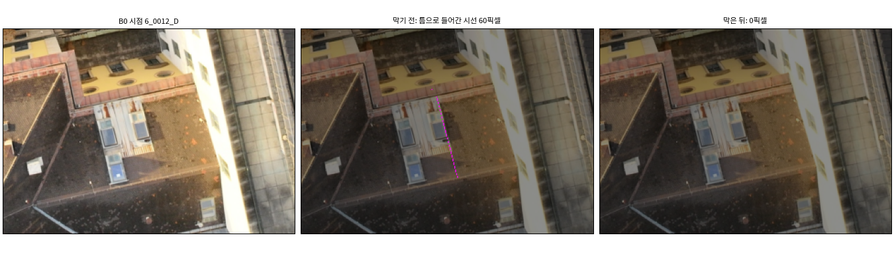

읽는 법: 자홍은 틈으로 들어간 시선이다. 막기 전 60픽셀이 막은 뒤 0이다(B0, 틈이 가장 많던 시점).

### 6.2 항공 LiDAR 칸 방식

- 처음 방향과 앉은 패치 면 법선의 각도는 모든 점에서 0이다(최대 3e-14°, 계산 오차). 비교로 꼭짓점 법선을 쓰면 중앙값 3.9°, 95 % 23.6°였다(R4).
- 패치에 앉지 않은 점은 범위마다 6.2만~17.6만 점이다. 그 가운데 83~96 %가 분류 2(지면)다. 나머지는 분류 6(건물)이지만 가파른 삼각형에만 닿은 점이다.

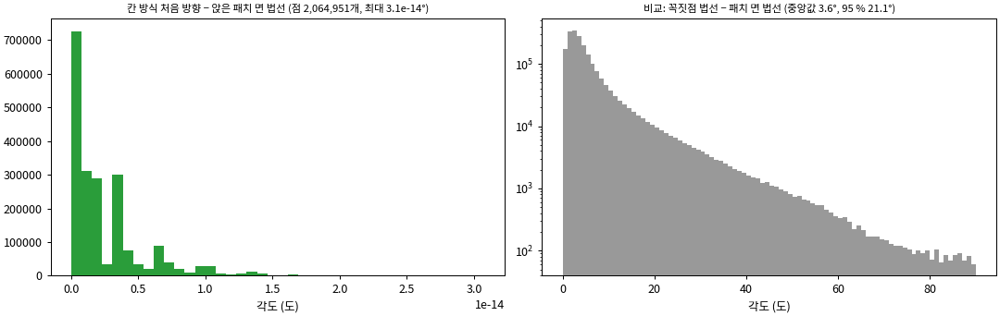

읽는 법: 왼쪽은 칸 방식의 처음 방향 − 패치 법선(모두 0)이다. 오른쪽은 비교용 꼭짓점 법선의 각도(로그 축)다.

## 7. GeoGS 영역

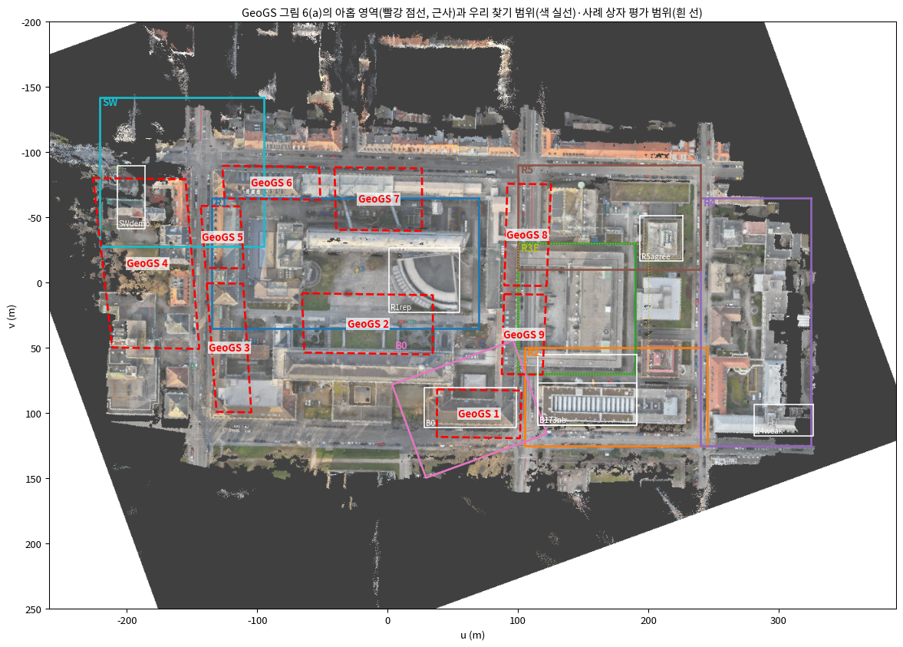

읽는 법: 빨강 점선은 그림 6(a)의 아홉 영역(근사), 색 실선은 찾기 범위, 흰 선은 사례 상자의 평가 범위다.

| 영역 | 크기 u × v (m) | 넓이 (m²) | 겹침(영역 넓이 중 5 % 이상) |
|---|---|---|---|
| 1 | 65 × 38 | 2350 | B0 100 %, B0BLD 51 %, eval B0 76 % |
| 2 | 101 × 47 | 4520 | R1 58 %, eval R1rep 10 % |
| 3 | 34 × 99 | 2691 | R1 32 % |
| 4 | 82 × 131 | 8938 | SW 39 %, eval SWdemo 9 % |
| 5 | 33 × 48 | 1417 | R1 78 %, SW 65 % |
| 6 | 75 × 26 | 1852 | SW 42 % |
| 7 | 67 × 49 | 3181 | R1 52 % |
| 8 | 36 × 78 | 2569 | R3 29 %, R5 61 %, R3E 29 % |
| 9 | 34 × 62 | 1950 | R2 15 %, R3 63 %, B0 17 %, R3E 63 % |

- 저장소 문서(`PAPER_AUDIT_ko_v1.md`)가 가리키는 로컬 논문 PDF에서 그림 6(a)를 꺼냈다. sha256 `21342911…c28c4`이고, 그림은 `step08/inputs/`에 출처와 함께 두었다. 아홉 영역은 빨간 점선 상자(벡터)다.
- 그림은 비스듬한 시점이다. 블록 둘레 교차로 네 곳을 기준점으로 지면 사영변환을 맞추어 상자를 우리 좌표로 옮겼다. 분석자가 손으로 고른 점이고 지붕은 위로 기울어 보이므로 **근사**다(수 m).
- **영역 1이 B0 대상 건물(DEBY_LOD2_4959323)을 덮는다.** 영역 1의 76 %가 B0 평가 범위와 겹친다. 예제 참값 이름 `r1_b1_sub002`('영역 1의 건물 1')와 맞는다. 다만 이름에 근거한 판독이며, 저자에게 확인하지는 않았다.
- 영역의 크기는 한 변 26~131 m다(영역 1은 65 × 38 m). 건물 한두 동을 중심으로 잡았고, 사례 상자의 평가 범위(한 변 21~76 m)와 비슷한 규모다.

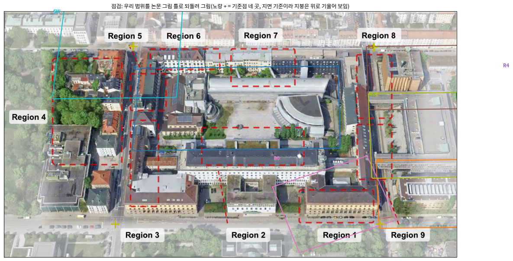

읽는 법: 우리 범위를 논문 그림 틀로 되돌려 그렸다(노랑 + = 기준점 네 곳). 지면 기준이라 지붕은 위로 기울어 보인다.

## 8. 확인 못 한 것, 본 실험 전에 정해야 할 것

### 8.1 결과를 본 뒤 고친 것 (사용자 확인 필요)

| 고침 | 무엇이 문제였나 | 어떻게 고쳤나 | 앞판 산출 |
|---|---|---|---|
| 정합 관문 (v2) | R2 LoD2에서 평면 근사 NMAD는 줄었지만 B173 지붕 변화에 끌려 4 m 수평 이동이 나왔다(다시 렌더한 NMAD 0.16 → 2.0 m). | 한 걸음마다 다시 렌더한 높이 차이 NMAD(학습 시점 40장)가 줄 때만 받아들인다. | `superseded/step03_ungated_*` |
| 정합 마지막 확인 (v2) | R3E LoD2에서 지붕 관문이 1.06 m 가짜 이동을 통과시켰다(전체 건물 면 NMAD 0.100 → 0.194 m). | v1 설정에 적었던 '전체 건물 면 NMAD가 줄지 않으면 되돌림'을 수평 이동에 되살렸다. | `superseded/step03_config_v1_gate_*` |
| 참값 높이 맞춤 (v3) | 칸 최댓값 DSM 방식이 참값을 8~10 cm 높게 놓아, 항공 LiDAR 지붕 패치의 87~95 %를 거짓 '참 충돌'로 만들었다. | 발주가 이름 붙인 gt_clean 방식(시점별 픽셀, 맨땅, 두 번)으로 바꿨다. | `superseded/step04_config_v2_*` |
| 일시 반사 (v3) | 점 검사가 국소 높이와 절대 높이를 견주어 한 점도 지우지 않았다. | 같은 틀로 견준다. | 같은 곳 |
| 벽 참값 점: 수직면 (v4) | 벽에 맞닿은 수평면 점이 벽 패치 라벨을 만들었다(R2 비가시 벽 1,476 '참 충돌'). | 벽 패치에는 수직면 위 점만 쓴다. | `superseded/step04_config_v3_*` |
| 사례 분석 (v4) | 경우 3: 드론 LiDAR가 빈 벽·어두운 지붕을 뒤쪽 점이 채웠고, 덩어리가 거리 건너 합쳐졌다. 경우 5: 처마 가파른 삼각망 면 위 점과 차량이 '없는 구조'로 셌다. | 경우 3은 지붕형 면만 따로 세고 3차원 칸으로 묶었다. 없는 구조는 완만한 비건물 삼각형 위 2 m 넘는 점만 센다. | `superseded/step05_*` |
| 벽 참값 점: 단일 반사 (v5) | 남은 R2 비가시 '참 충돌' 벽의 점 81 %가 나무 다중반사였다. | 벽 패치에는 단일 반사 점만 쓴다(설정의 나무 규칙). | `superseded/step04_config_v4_*` |

- 기준값(τ 규칙, 판정 규칙의 2/3·5곳·1 m, 경우의 문턱)은 하나도 바꾸지 않았다.
- 이 밖에 처리 오류 셋을 기록한다.
  - 공유 서버 전역 메모리 부족 두 번(21:58, 22:03). 두 번째에 사용자 Chrome 프로세스 2개가 종료되었다. 이후 동시 실행을 셋 이하로 하고 참값 계산을 400만 점 단위로 나눴다.
  - 상자 B173 첫째 단계의 마지막 로그 줄 오류(rc = 1, 산출은 온전함).
  - 도는 중인 상자 스크립트를 고쳐 생긴 줄 어긋남. B0에서 'command not found' 한 줄이 나왔고, R1rep는 다시 돌렸다.

### 8.2 확인 못 한 것

- **GeoGS 영역:** 손으로 고른 기준점 네 곳으로 옮긴 근사다. 'r1_b1 = 영역 1 건물 1'은 이름 판독이다.
- **B0 참값:** gt_clean의 정확한 제품·판은 확인하지 못했다. gt_clean은 MVS 맨땅보다 3.8 cm 높다.
- **벽 평가:** 연직 드론 LiDAR라 벽 피복이 낮다(대략 0.1~0.4). 벽의 참 라벨은 지붕보다 약하다.
- **경우 3의 참값 구멍:** 어두운 지붕·반투명 지붕·벽에서는 드론 LiDAR 반사가 비고, 그 픽셀을 뒤쪽 점이 채운다. 지붕형 면 수치를 함께 냈지만, 덩어리마다 판독이 필요하다.
- **경우 4 R4:** 지붕 비가시 패치(이어받으면 대부분 틀림)가 왜 비가시가 되었는지 가려내지 못했다.
- **틈 막기:** 남은 34시선(6.1).
- **C01(차량):** 여덟 범위 밖이다.
- **B173 LoD2:** 가운데 톱니 부분만 새 지붕이다(상자 지도로 읽음). LoD2의 갱신 시점은 확인하지 못했다.

### 8.3 본 실험 전에 정해야 할 것

1. 8.1의 고침을 받아들일지. 특히 참값 높이 맞춤과 벽 참값은 평가 결과를 직접 바꾼다.
2. **고정한 τ·정합의 출처.** 지금 값은 평가 영상이 섞인 지금 MVS로 잰 찾기 범위 값이다. 그대로 둘지, 찾기 범위를 학습 영상만으로 다시 재서 고정할지 정한다.
3. **R1의 LoD2 τ = 0.68 m, B0의 LoD2 벽 τ = 0.55 m.** 이보다 작은 LoD2 오류는 '일치'로 남는다(예: B0 정면 20 cm). 그대로 둘지 정한다.
4. **벽을 평가에 넣을지.** 피복이 낮은 범위(R4·SW)를 뺄지, 지붕만 평가할지 정한다.
5. **틀린 충돌 전파(핵심 결과)를 방법에서 다룰지.** 반투명 지붕, 넓은 평지붕의 τ 언저리 MVS 오차, 벽 앞 나무가 출처다(2.3).
6. **경우 6의 조건.** 저자 15장은 모두 경사 영상이라(연직 0장) 영상 수와 시점 각도가 함께 바뀐다. 또 B0 네 조건은 τ를 조건마다 쟀다(항공 LiDAR τ: COVER 0.113 m → 저자 13장 0.041 m). 상자는 τ를 고정했으므로 규칙이 어긋난다. 연직을 넣은 같은 수의 조건을 더할지, τ를 B0 크롭 값으로 고정할지 정한다.
7. 연속 15장 후보(3.1)를 본 실험에 넣을지.
8. 경우 9: LoD2 구역 정합은 가짜 이동이었고, 항공 LiDAR는 한 번의 이동으로 충분했다. 정합 규칙은 바꾸지 않아도 된다고 본다.
9. **본 실험의 상자 확정.** 23:02의 '추천 묶음만'은 이번 작업에서 산출을 낼 상자를 고른 것이다. 1.2절의 추천안을 본 실험 영역으로 할지 정한다.
10. **첫째 단계의 새 구현을 본 실험 학습 코드로 옮기는 방식.** 정합(4.1 Nuth·Kääb, v2 관문과 마지막 확인), 맞댄 벽 틈 막기, τ·정합 고정 실행은 이 작업의 스크립트에만 있다. r10 학습 코드는 수직 이동 고정값만 쓰고 틈을 막지 않는다. 공용 모듈 `src/phd/prior_propagation_v4`도 아직 커밋 전이다.

### 8.4 발주와 다른 점 (v1.1)

v1을 사용자가 검토한 뒤(10-04) 발주와 한 항목씩 다시 대조했다. 기준값, 판정, 참 라벨, 표의 수치는 바꾸지 않았다.

v1.1에서 고친 것:

| 발주 | v1 | v1.1 |
|---|---|---|
| 5.4 대표 그림 줄의 첫 칸은 연직 사진 크롭 | 그 사례를 가장 많이 본 학습 시점을 썼다(경사일 수 있음). 보고서에 적지 않았다 | 지붕 사례는 연직 시점(경사 20° 이하) 가운데 그 사례를 가장 많이 본 시점으로 다시 그렸다(161줄 가운데 82줄). 벽 사례 38줄은 가장 많이 본 시점을 그대로 둔다(연직 시점은 벽을 거의 보지 못함). 보고서에 실린 줄 가운데 4줄의 시점이 바뀌었다 |
| 5.4 경우 4: 범위별 비율과 자리 그림 | 자리 그림이 없었다 | 사전 정보마다 범위별 자리 그림과 그림 줄 하나를 더했다(2.3절) |
| 0 산출: 표(CSV) | 커버리지 표가 JSON이었다 | 모든 커버리지 표(70건 × 3)를 같은 자리에 CSV로도 냈다 |
| 6 그림마다 읽는 법 두 줄 이내 | 세 줄 이상인 것이 있었다 | 모두 두 문장 이내로 줄였다 |
| 5.6 벽 피복을 사전 정보마다 | LoD2만 적고 이유를 적지 않았다 | 항공 LiDAR에는 벽 패치가 없다는 것을 적었다(5.3절) |
| 사례 판독(분석자) | R2의 '일치가 옮겨 가 맞은 곳' 그림 줄을 '회색 평지붕'으로 읽었다. 같은 말이 1.1·2.3·3.1절에 있었다 | 그 표면(137)은 벽이다. 다시 세어 보니 LoD2의 맞은 일치 전파는 대부분 벽이다(R2 1,156/1,213, B0 2,077/2,098, B173+이웃 상자 1,069/1,070, `step14/agree_check.json`). 세 절의 문장을 고쳤다 |
| 사례 판독(분석자) | R1 부채꼴 지붕을 '어두워 MVS 신뢰도가 대부분 0'이라고 적었다(경사 시점 그림 줄로 읽음) | 연직 시점에서는 지붕 대부분이 신뢰도 1이고, MVS가 참값과 같은 지붕을 잰다. 문장을 고쳤다(2.2절) |
| 10.1 그림 줄 수 | 165줄로 적었다 | 161줄이다 |

남은 차이:

1. **절차(발주 8절):** 결과를 본 뒤 분석 기준을 새로 만들었다. 경우 5의 '없는 구조'를 '완만한 비건물 삼각형 위 2 m 넘는 점'으로 정했고(v4), 벽 참값 점을 수직면(v4)과 단일 반사(v5)로 걸렀다. 판을 올려 기록했지만(발주 2절), 그때 멈춰 묻지 않았다. 8.1과 8.3-1에서 확인을 요청한다.
2. **시점별 배열(발주 5.2):** 일치·충돌 표시와 학습 전 충돌 지도 그림은 범위·사전 정보마다 8개 시점만 저장했다(`figviews/`). 패치 단위 산출(상태, 판정, 시점-패치 쌍)은 모두 있다. 신뢰도 마스크는 따로 저장하지 않았고, COLMAP 기하 깊이 지도(있음 = 1)로 남아 있다. 모든 시점의 배열이 필요하면 첫째 단계의 셋째 패스를 다시 돌려야 한다.
3. **판독(발주 5.4):** 경우 1의 '기타' 면과 경우 3 덩어리의 재질은 대표 몇 개만 읽었다.

## 9. 걸린 시간

- 시작 20:38, 보고서 마침 10-03 02:30 무렵(약 5시간 50분). 처음 예상은 약 11시간이었다(구현 4~5 h, 계산 2~3 h, 사례·그림 2~3 h, 보고서 1.5 h).
- 계산 예상은 22:12에 약 4.5 h로 고쳐 적었다(B0 '덮는 영상' MVS가 장당 13.8 s). MVS 다시 만들기는 GPU 시간으로 약 4.1 h(B0 조건 3,262 s, 연속 15장 370 s, 상자 넷 11,205 s), GPU 두 대로 벽시계 약 2.8 h였다. 멈춤 기준(처음 예상의 두 배)은 넘지 않았다.
- **01:00 ~ 02:20 약 80분은 낭비였다.** 마지막 연쇄의 대기 조건을 잘못 써서, 끝난 상자를 기다리기만 하다 2시간 제한에 걸렸다(8.1).

| 단계 | 시각 | 걸린 시간 | 비고 |
|---|---|---|---|
| 질문·설정·COLMAP 이미지 | 20:38–20:55 | 17분 | 사용자 결정 4건 |
| 범위·영상·B0 조건(5.1) | 20:55–21:05 | 10분 | |
| 메시·첫째 단계 구현, 단위 시험 | 21:05–21:24 | 19분 | 고침 1·2(결과 전) |
| B0 조건 MVS 4개 | 21:24–22:12 | A15 186 s, A9 124 s, A3 65 s, COVER 2,887 s | GPU |
| 찾기 범위 첫째 단계 16건 | 21:28–21:54 | 한 판 약 9분(세 판) | 고침 3·4 |
| 참값 v2, 메모리 부족, 나눠 계산 | 21:54–22:19 | | 전역 OOM 두 번 |
| 상자 띠 메시·첫째 단계 38건 | 22:09–22:35 | 26분 | |
| 참값 v3·사례·지도·경우 6·9·GeoGS·구현 확인 | 22:37–23:02 | 25분 | 고침 5 |
| 상자 결정 질문 → 답 | 23:02 | | 8절 멈춤 |
| 상자 4개: MVS·첫째 단계·참값·사례 | 23:03–01:00 | MVS 1,648~4,145 s | GPU 두 대 |
| 참값 v4·v5와 그 뒤 단계, 그림 줄 | 23:14–00:15 | 약 1시간 | 고침 6·7 |
| (대기 조건 오류로 멈춤) | 01:00–02:20 | 80분 | |
| 표·그림·영수증, 보고서 | 02:20–02:30 | | |
| v1.1 고침(사용자 검토 뒤) | 10-04 23:45 무렵 – 10-05 00:30 무렵 | 계산 7분(그림 줄 161줄 4분 40초, 경우 4 그림·점검·CSV 16초), 나머지는 판독 확인과 보고서 고침 | 학습 없음 |

단계별 작업 시간(초)은 `logs/queue.log`와 `receipt_task.json`의 `queue_jobs`에 있다(작업 272건).

## 10. 산출물과 재현

### 10.1 산출물 (작업 폴더 `../JointBuildGS-artifacts/phase-payloads/phd/main_prep_measure_v1/PHD-MAIN-PREP-MEASURE-v1/`)

| 폴더·파일 | 내용 |
|---|---|
| `step01/` | 범위(`ranges.json`), 영상 나눔(`views.json`), B0 조건(`b0.json`) |
| `step02/<범위>/` | LoD2·항공 LiDAR 메시, 패치 저장소, 발자국, 맞댄 벽 덮개·탐지면 |
| `step03/<범위>/<사전 정보>/` | 첫째 단계: 정합, 허용 오차, 패치 상태·판정(`units.npz`), 커버리지 표, 시점별 표시(`figviews/`), 틈 시선 |
| `step03_b0cond/<조건>/B0/` | B0 네 조건의 첫째 단계 |
| `step04/<범위>/` | 참값 정리(v5): 맞춤, 일시 반사, 제외 칸(`exclusion_cells.npz`, 본 실험 전 고정), 패치 참 라벨, 시점별 참값 깊이 |
| `step05/<범위>/` | 경우 1~5·8 표와 CSV(면 목록, 표면 목록, 덩어리 목록, 없는 구조 후보) |
| `step06/` | 상자 정의(`boxes_v1.json`), 띠별 범위·영상·메시·첫째 단계, 크기 규칙(`box_stability.json`), 연속 15장, 상자 산출(`box_stage1/`, `box_gt/`, `box_cases/`, `box_maps/`) |
| `step08/` | GeoGS 영역(`geogs_regions.json`, 입력 그림과 출처) |
| `step09/<범위>/` | 학습 전 판정 지도 |
| `step10/` | 경우 6·7·9 |
| `step11/` | 구현 확인 |
| `figrows/v1/`, `figrows/v1_1/` | 대표 그림 줄 전체(161줄)와 선정 규칙(`spec_v1.json`; v1.1은 `spec_v1_1.json`, 지붕 사례를 연직 시점으로) |
| `step14/` | v1.1 추가: 경우 4 자리 그림(`fig_case4_*.png`, `case4_locations.json`), 일치 전파 자리 점검(`agree_check.json`), CSV 목록(`coverage_csv.json`) |
| `step03/…/coverage_*.csv` 등 | v1.1 추가: 모든 커버리지 표의 CSV(70건 × 3, JSON 옆) |
| `mvs/` | 학습 영상만으로 다시 만든 MVS(B0 네 조건, 상자 넷, 연속 15장 둘)와 COLMAP 영수증 |
| `tables_v1.md` | 보고서의 모든 표(자동 생성) |
| `superseded/` | 고치기 전 산출 전부 |
| `logs/` | 진행 기록(`progress.md`), 대기열 기록(`queue.log`), 단계별 로그 |
| `receipt_task.json` | 커밋, Docker 이미지 ID, COLMAP 다이제스트, 스크립트·설정·입력 해시, 단계별 시간 |

### 10.2 재현 (작업 폴더를 `/out`, 산출 저장소를 `/art`로 붙이고 `scripts/phd/main_prep_measure_v1/`에서)

1. `step01_ranges_views.py`
2. `step02_meshes.py <범위>` (범위 8)
3. `step03_stage1.py <범위> <LoD2|ALS>` (R1·R4는 `--tile`)
4. `step04_gt.py <범위>`, `step05_cases.py <범위>`, `step09_maps.py <범위>`
5. B0 조건:
   - `colmap_subset.py B0_<조건> mvs_lists/B0_<조건>.json`
   - `bash run_colmap.sh B0_<조건> <gpu>`
   - `step03 … --views-list … --mvs mvs/B0_<조건> --out-sub step03_b0cond/<조건>`
   - `step04 …`, `step05 …`, `step10_case69.py case6`
6. 상자:
   - `step06a_box_views.py step06/boxes_v1.json`
   - 띠별 `step02 --ranges-file step06/box_ranges.json --margin 0`, `step03 --views-file step06/box_views.json`
   - `step06b_box_stability.py`, `step06c_box_figs.py`
   - 결정 뒤 `bash box_pipeline.sh <상자> <gpu> <찾기 범위 첫째 단계>`, `step06d_box_cases.py --mode box …`, `step06e_consecutive15.py`, `step06f_box_ranges_fig.py`
7. `step07a_select_rows.py`, `step07_rows.py`, `step08_geogs_regions.py`, `step10_case69.py case7|case9`, `step11_checks.py`, `step12_tables.py`, `step13_receipt.py`
8. v1.1: `step07a_select_rows.py --per-case 1 --photo-rule nadir-roof --out figrows/spec_v1_1.json --split`, `step07_rows.py figrows/spec_v1_1_<범위>.json --out-sub figrows/v1_1`, `step14_v1_1.py case4-fig|agree-check|coverage-csv`

- 공유 서버라 동시 실행을 셋 이하로 제한했다(`run_queue.sh`).
- 단위 시험: `tests/phd/test_main_prep_measure_v1.py` 3건(Nuth·Kääb 부호, 희소 상태, 틈 덮개).
