<!-- PHD-MAIN-STAGE0-v1 -->
# 본 실험 준비와 첫 시험 학습(0단계) — 보고서 v1

- 작업: `PHD-MAIN-STAGE0-v1` (발주 2026-10-06, 실행 2026-10-06 13:38 ~). `scientific_verdict: null`.
- 판독과 추천은 분석자(에이전트)의 판단이다. 근거 그림을 함께 두었다. 사람 검수 전이다.
- 일한 곳: 본 실험용 브랜치 `exp/main-experiment`, 별도 폴더 `/media/innopam/InnoPAM-8TB/hwiyoung/code/JointBuildGS-exp`. 원래 작업 폴더(`JointBuildGS-operator`)의 파일은 고치지 않았다.
- 산출 위치: 페이로드 `../JointBuildGS-artifacts/phase-payloads/phd/main_stage0_v1/PHD-MAIN-STAGE0-v1/`, 그림은 이 문서 옆 `figures/`.
- 기준값은 결과 전에 적었다. 설정 `configs/phd/main_stage0_v1/stage0_v1.json`을 10월 6일 13:39에 저장했다(sha256 `f1e03da676fe…`). 이 작업의 첫 계산(13:4x의 모듈 시험, 첫 측정은 13:46)보다 앞선다. 그 뒤 바꾸지 않았다.

## 0. 전체 과정에서의 위치

| 큰 단계 | 하는 일 | 상태 |
|---|---|---|
| 가. 실험 설계 | 실제 변화 지역 조사, 자료와 장면, 첫째·둘째 준비 측정, 비교 짜임 | 끝남 |
| 나. 저장소 정리 | 보존용 브랜치와 본 실험용 브랜치 | 끝남 (이번에 원격에 올림) |
| 다. 본 실험 준비와 첫 시험 학습 | 규칙을 코드에 넣기, B0 영상 수 조건, 일치 영역, 0단계 시험 학습 4회(두 묶음) | **이번 발주로 끝남** (10월 6일; 결과는 1·5절) |
| 라. 평가 지표와 반복 수 | 결과를 무엇으로 재고 몇 번 돌릴지 | 사용자가 정할 차례 (반복 수의 근거는 5.8절) |
| 마. 본 실험 1단계 | 핵심 비교 22회 | 다음 |
| 바. 본 실험 2·3단계 | 장치 빼기 9회, 영상 수 줄이기 18회 | 그다음 |
| 사. 넓히기 | 찾기 범위 여덟 곳 | 1단계 결과를 보고 정함 |
| 아. 결과 정리와 논문 | 7장 결과와 고찰, 전체 정리 | 마지막 |

## 1. 답 먼저

1. **코드는 준비되었다.** 모듈 v6와 학습 코드 r12의 시험 10건이 통과했고, r12의 판정은 v6 측정과 같고(12건), LoD2는 r11과 원소 단위로 같으며, 스위치 일곱의 예상 밖 변화는 0이다. 저장소 고침은 버림 판단의 1.2~2.1 %를 바꿨다(멈춤 기준 3 % 안).
2. **0단계 네 학습이 30,000회를 끝까지 돌았다.** 첫 묶음 항공 LiDAR의 처음 실행만 15,000회에서 GPU 메모리 부족으로 멈췄고, 사용자 결정대로 메모리 할당 설정만 바꿔 다시 돌렸다.
3. **한 번에 64~68분**(GPU 한 대), GPU 메모리 최대 약 15 GB(설정을 켰을 때)였다. 나머지 47회는 GPU 두 대로 약 25~35시간으로 본다.
4. **지붕 투명화 같은 이상은 없었다**(사전 정보 출신 불투명도 중앙값이 가장 낮을 때 0.29, 기준 0.05). 바뀐 곳(B173 날개)에서 결과는 옛 자료가 아니라 지금 지붕을 따랐다(참값 점의 96~97 %가 0.2 m 안).
5. **같은 조건의 흔들림**: 넓은 나눔은 씨앗을 바꿔도 0.1 cm·0.2 %p 안에서 같았다. 점이 적은 나눔(못 잰 일치, 못 본 곳)은 10~20 cm·5~20 %p 흔들렸다.
6. **1단계로 가도 된다고 본다(분석자 의견).** 다만 모든 학습에 메모리 설정을 두고 학습 영상이 가장 많은 R1rep을 먼저 돌려 메모리를 확인할 것, 못 본 곳과 못 잰 일치를 재는 법을 정할 것을 권한다(5.9). 결정은 사용자가 한다.

## 2. 공용 모듈 v6와 학습 코드 r12 (발주 5.1)

### 2.1 바뀐 것

**공용 모듈 v6** (`src/phd/prior_propagation_v6`): v5를 그대로 복사하고 두 파일에 함수만 덧붙였다. 나머지 열두 파일은 v5와 바이트까지 같다. v5와 r11은 그대로 남아 있어 준비 측정의 결과를 다시 낼 수 있다.

| 바뀐 것 | 내용 |
|---|---|
| 패치 저장소 고침 (`locations.move_store`) | 정합으로 사전 정보를 옮기면 패치 저장소도 같은 만큼 옮긴다. 옮긴 사전 정보 위의 점(광선 교점, 심지 않을 점, 참 라벨의 참값 점, 학습 중 가우시안 자리, 다시 읽기의 칸 표본점)은 모두 옮긴 저장소에서 찾는다. 칸, 면, 넓이, 전파는 그대로다. 옮긴 양은 저장소에 `frame_shift`로 남는다 |
| 버리는 규칙 기본값 (`rules.default_rule`) | 사전 정보의 종류마다 기본값을 둔다. LoD2는 지금 규칙, 항공 LiDAR와 수치표면모델은 여유(모두) 2다. 설정으로 바꿀 수 있다(측정 `--rule`, 학습 `--jbgs_rule`; `auto`가 기본값) |

- 전파 거리는 옮기기 전 저장소로 잰다. 거리는 옮겨도 같지만, 옮긴 좌표로 다시 재면 반올림 때문에 같은 거리의 칸들 순서가 바뀔 수 있다. 그래서 v5와 비트 단위로 같은 거리를 쓴다.

**학습 코드 r12** (`src/phd/forks/GeoGS-conf-guided-v1-r12`): 저장소에 커밋된 r11에서 빌드 스크립트(`scripts/phd/main_stage0_v1/build_fork_r12.py`)로 만든다. 저장소만으로 다시 만들 수 있다. 빌드 보고서는 `docs/experiments/phd/main_stage0_v1/provenance/build_report_r12.json`이다. r11과 다른 파일은 `jbgs_judgment.py`, `train.py`, 그리고 새로 넣은 모듈 v6 열네 파일뿐이다(`only_expected_changes: true`). 손실, 보호, 밀도 제어, 장치 끄기 스위치 일곱은 r11 그대로다.

| r12에서 바뀐 것 | 내용 |
|---|---|
| 규칙 기본값 | `--jbgs_rule auto`가 기본이다. 사전 정보의 종류는 `--jbgs_prior_kind` 또는 저장소의 `prior_kind`로 안다. 어느 규칙이든 첫째 단계의 집계에서 판정을 다시 계산하고, 상태가 측정과 같은지 확인한다 |
| 옮긴 저장소 | 측정 v6가 낸 옮긴 저장소를 쓴다. `--jbgs_prior_shift`와 저장소의 옮긴 양이 다르면 멈춘다 |
| 씨앗 | `--jbgs_seed`(0이면 r11과 같은 씨앗) |
| 기록만 더함 | 초기화 시간, 다시 읽기마다 걸린 시간, 기록용 렌더 시간, 사전 정보 출신 가우시안 가운데 불투명도 0.5 이상의 몫, GPU 메모리 예약 최대값 |

빌드하면서 고친 것이 둘 있다. 첫 시험 초기화에서 바로 드러났다(13:59). 하나는 기록 사전의 이름 겹침(`rule` → `discard_rule`)이고, 다른 하나는 저장소의 글자 항목(`prior_kind`)을 GPU 배열로 옮기려던 것이다. 둘 다 계산과 무관한 코드 오류였다.

### 2.2 확인 결과

| 확인 (발주 5.1) | 결과 |
|---|---|
| 1. 시험 코드 | 10건 모두 통과했다. v6 시험 4건(복사한 파일이 v5와 같음, 옮긴 저장소의 찾기가 '옮기기 전 저장소에서 X − 이동'과 같음[평면·삼각망], 규칙 기본값)과 v5 시험 6건이다 |
| 2. 실험 지역 넷 × 사전 정보 둘의 r12 초기화 | r12의 패치 상태, 표, 전파 판정, 패치 판정, 심지 않을 점이 v6 측정과 모두 같았다(12건: 기본 규칙 8 + 항공 LiDAR 지금 규칙 4). LoD2 넷은 r11 초기화와 원소 단위까지 같았다(상자마다 비교한 배열 602~1,374개) |
| v5 대비 판정 변화 | 저장소 고침은 이동이 있는 항공 LiDAR 셋에서만 판정을 바꿨다. 버림 판단이 바뀐 패치는 판정 패치의 1.24~2.10 %였다. 멈춤 기준(3 %) 안이다 |
| 3. 참 라벨로 본 변화 | 저장소 고침만으로는 잘못의 수가 거의 같았다. 규칙 기본값은 항공 LiDAR의 잘못 버림을 크게 줄이고(−31~−63 %), 잘못 지킴을 조금 늘렸다(+25~+87개) |
| 4. 스위치 일곱 (B173nb_b10, 두 사전 정보) | 14건 모두 '끄면 바뀌어야 하는 것' 밖의 변화가 없었다(예상 밖 0) |

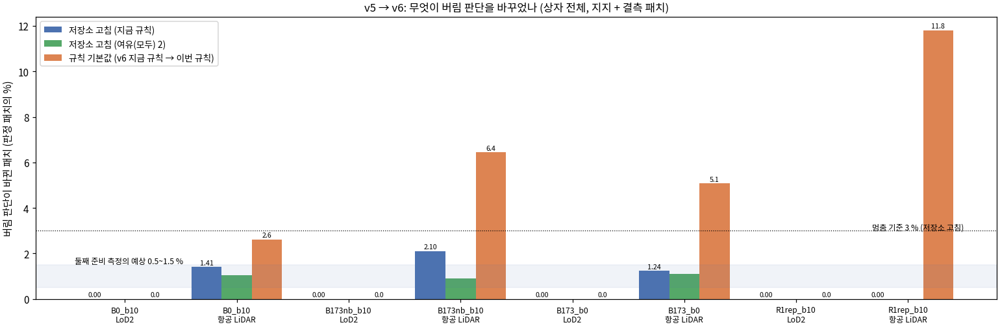

*읽는 법:* 파랑과 초록은 저장소 고침이 바꾼 버림 판단의 몫이고, 주황은 규칙 기본값이 바꾼 몫이다. LoD2와 이동이 없는 R1rep 항공 LiDAR에서는 저장소 고침의 변화가 0이다.

**v5 대비 판정 변화 (상자 전체, 판정 패치 = 지지 + 결측)**

| 상자 | 사전 정보 | 정합 이동 (m) | 판정 패치 | 저장소 고침: 버림 판단 바뀜 (지금 규칙) | 그 가운데 상태 / 표 / 전파 판정 | 저장소 고침 (여유(모두) 2에서) | 규칙 기본값: 버림 판단 바뀜 |
|---|---|---|---:|---|---|---|---|
| B0_b10 | LoD2 | 없음 | 112,939 | 0 | 0 / 0 / 0 | 0 | 0 (지금 규칙 그대로) |
| B0_b10 | 항공 LiDAR | (−0.048, 0.043) | 31,241 | 439 (1.41 %) | 30 / 463 / 35 | 324 (1.04 %) | 818 (2.62 %) |
| B173nb_b10 | LoD2 | 없음 | 173,227 | 0 | 0 / 0 / 0 | 0 | 0 |
| B173nb_b10 | 항공 LiDAR | (−0.056, 0.063) | 49,336 | 1,035 (2.10 %) | 35 / 1,059 / 41 | 451 (0.91 %) | 3,176 (6.45 %) |
| B173_b0 | LoD2 | 없음 | 94,573 | 0 | 0 / 0 / 0 | 0 | 0 |
| B173_b0 | 항공 LiDAR | (−0.056, 0.063) | 25,495 | 317 (1.24 %) | 15 / 328 / 12 | 283 (1.11 %) | 1,295 (5.08 %) |
| R1rep_b10 | LoD2 | 없음 | 97,453 | 0 | 0 / 0 / 0 | 0 | 0 |
| R1rep_b10 | 항공 LiDAR | 없음 | 34,534 | 0 | 0 / 0 / 0 | 0 | 4,078 (11.81 %) |

- 저장소 고침의 변화는 둘째 준비 측정의 예상(0.5~1.5 %)과 비슷했다. B173nb 항공 LiDAR(2.10 %)만 예상보다 컸다. 그 예상은 B0와 R3E에서 잰 것이고, B173nb에 쓰는 R2 이동(8.4 cm)은 그때 없던 이동이다. 미리 적은 멈춤 기준(3 %)은 넘지 않아 멈추지 않았다.
- 바뀐 방향은 양쪽이 비슷했다. 버림 → 지킴 516개, 지킴 → 버림 519개(B173nb)다. 바뀐 자리는 면의 경계(지붕 끝, 톱니의 경계, 단차)를 따라 흩어져 있다(아래 그림, 분석자 판독). 칸 하나만큼 옮겨 찾으면 판정이 갈리는 자리가 경계이기 때문으로 읽힌다.
- 규칙 기본값은 항공 LiDAR에서 버림만 지킴으로 바꾼다. 문턱을 2τ로 올리는 규칙이라 지킴 → 버림은 0이다.

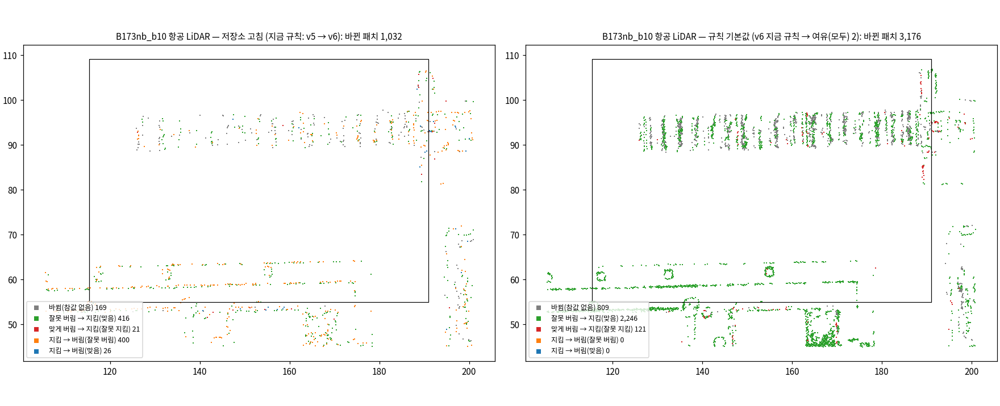

*읽는 법:* 왼쪽은 저장소 고침, 오른쪽은 규칙 기본값이 바꾼 패치다. 초록은 잘못 버림이 지킴으로 바뀐 곳(맞게 바뀜)이고, 빨강은 맞게 버리던 것을 지키게 된 곳(잘못 지킴)이다.

**참 라벨로 본 잘못 (평가 범위, 지붕 + 벽, 잰 곳 + 재지 못한 곳; 패치 수)**

| 상자 | 사전 정보 | v5 지금 규칙 (v5 라벨) | v5 지금 규칙 (v6 라벨) | v6 지금 규칙 (저장소 고침만) | v6 이번 규칙 (기본값) |
|---|---|---|---|---|---|
| B0_b10 | 항공 LiDAR | 802 / 247 | 804 / 258 | 825 / 259 | 423 / 284 |
| B173nb_b10 | 항공 LiDAR | 1,873 / 34 | 1,865 / 34 | 1,849 / 33 | 684 / 91 |
| B173_b0 | 항공 LiDAR | 1,510 / 74 | 1,492 / 66 | 1,462 / 69 | 805 / 129 |
| R1rep_b10 | 항공 LiDAR | 8,148 / 51 | 8,148 / 51 | 8,148 / 51 | 5,644 / 138 |
| B0_b10 | LoD2 | 3,851 / 2,354 | 3,851 / 2,354 | 3,851 / 2,354 | 3,851 / 2,354 |
| B173nb_b10 | LoD2 | 2,334 / 6,076 | 2,334 / 6,077 | 2,334 / 6,077 | 2,334 / 6,077 |
| B173_b0 | LoD2 | 4,353 / 5,695 | 4,353 / 5,694 | 4,353 / 5,694 | 4,353 / 5,694 |
| R1rep_b10 | LoD2 | 8,501 / 1,203 | 8,501 / 1,203 | 8,501 / 1,203 | 8,501 / 1,203 |

(칸 = 잘못 버림 / 잘못 지킴. 둘째 열은 v5의 판단을 v6 라벨로 센 것이다. 둘째 열과 셋째 열의 차이가 판단의 변화만의 몫이다.)

- **저장소 고침만의 몫**(둘째 열 → 셋째 열): 잘못 버림은 B0 +21, B173nb −16, B173 −30개였다. 잘못 지킴은 ±3개 안이다. 둘째 준비 측정의 진단(B0 313 → 309, 220 → 219)처럼 잘못의 수는 거의 같다.
- **규칙 기본값의 몫**(셋째 열 → 넷째 열): 항공 LiDAR의 잘못 버림이 B0 825 → 423, B173nb 1,849 → 684, B173 1,462 → 805, R1rep 8,148 → 5,644개로 줄었다. 잘못 지킴은 25~87개 늘었다. 둘째 준비 측정이 상자에서 본 방향과 같다.
- **참 라벨이 바뀐 패치**: 항공 LiDAR B0 207개, B173nb 741개, B173 523개는 모두 저장소 고침 때문이다. 같은 참값 점으로 v5 코드를 다시 돌려 나눴다. LoD2 B173nb의 5개와 B173의 1개는 저장소와 무관하다. 참값 점을 저장 파일(float32)에서 다시 읽으면서 생긴 반올림 차이다. v5 라벨은 저장 전의 float64 점으로 계산했었다. 판단에는 영향이 없다.
- 심지 않을 항공 LiDAR 점(상자 범위): B0 6 → 2 → 1, B173nb 23 → 24 → 18, B173 10 → 8 → 8, R1rep 673 → 673 → 359개였다(v5 → v6 지금 규칙 → v6 이번 규칙). LoD2는 바뀌지 않았다.

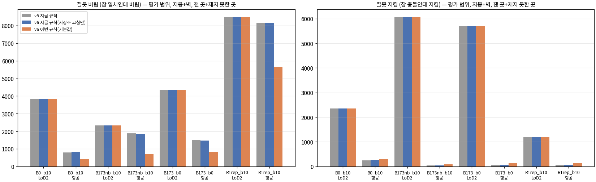

*읽는 법:* 회색(v5)과 파랑(v6, 저장소 고침만)은 거의 같고, 주황(v6 이번 규칙)에서 항공 LiDAR의 잘못 버림이 크게 준다. 오른쪽 그림의 잘못 지킴은 항공 LiDAR에서 조금 는다.

**스위치 일곱 (B173nb_b10, r12 초기화, 기본 규칙)**

| 끈 스위치 | 바뀐 출력 (두 사전 정보 같음) | 스위치별 확인 |
|---|---|---|
| 관측 신뢰도 마스크 | 신뢰도 지도, 상태, 표, 전파 판정, 패치 판정, 심지 않을 점, 심은 점, g_p, 첫 E, 보호 | MVS 깊이가 있는 모든 픽셀에서 신뢰도 1 |
| 판정 | 표, 전파 판정, 패치 판정, 심지 않을 점, 심은 점, g_p, 보호 | 지지·결측 패치 모두 일치, 심지 않을 점 0, g = 0 픽셀 0 |
| 판정 빌려 오기 | 전파 판정, 패치 판정, 심지 않을 점, 심은 점, g_p, 보호 | 결측은 모두 근거 부족, 심지 않을 점 0 |
| 사전 정보 당김의 구간 | 없음 | 벌점 함수만 바꾸므로 초기화 출력은 같다(벌점 함수는 r11 코드 시험에서 확인했고 r12에서 바뀌지 않음) |
| 보호 | 보호 | 보호 0 |
| 초기화에서 빼기 | 심지 않을 점, 심은 점 | 심지 않을 점 0, 판정은 그대로 |
| 사전 정보 | 심은 점, 사전 정보 깊이 항, g_p, 보호, 심지 않을 점 | 사전 정보 점 0, 사전 정보 깊이 항의 가중 0 |

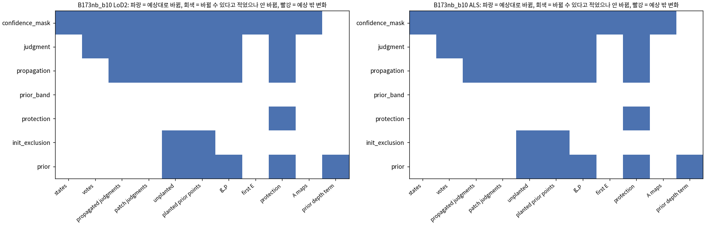

*읽는 법:* 줄은 끈 스위치, 칸은 초기화 출력이다. 파랑은 예상대로 바뀐 칸이고, 빨강(예상 밖 변화)은 하나도 없다.

### 2.3 r12 초기화의 같은 판정 확인 (확인 2의 자세한 표)

| 상자 · 사전 정보 | 규칙 | 상태·표·판정·패치 판정 | 심지 않을 점 (포크 / 측정) | r11과 원소 단위 | 초기화 한 번 (초) |
|---|---|---|---|---|---|
| B0_b10 · LoD2 | 지금 규칙 | 같음 | 921 / 921 | 같음 | 160 |
| B0_b10 · 항공 LiDAR | 여유(모두) 2 | 같음 | 1 / 1 | — | 169 |
| B0_b10 · 항공 LiDAR | 지금 규칙 | 같음 | 2 / 2 | — | 148 |
| B173nb_b10 · LoD2 | 지금 규칙 | 같음 | 2,427 / 2,427 | 같음 | 110 |
| B173nb_b10 · 항공 LiDAR | 여유(모두) 2 | 같음 | 18 / 18 | — | 105 |
| B173nb_b10 · 항공 LiDAR | 지금 규칙 | 같음 | 24 / 24 | — | 32 |
| B173_b0 · LoD2 | 지금 규칙 | 같음 | 684 / 684 | 같음 | 65 |
| B173_b0 · 항공 LiDAR | 여유(모두) 2 | 같음 | 8 / 8 | — | 64 |
| B173_b0 · 항공 LiDAR | 지금 규칙 | 같음 | 8 / 8 | — | 41 |
| R1rep_b10 · LoD2 | 지금 규칙 | 같음 | 1,266 / 1,266 | 같음 | 154 |
| R1rep_b10 · 항공 LiDAR | 여유(모두) 2 | 같음 | 359 / 359 | — | 161 |
| R1rep_b10 · 항공 LiDAR | 지금 규칙 | 같음 | 673 / 673 | — | 145 |

(심지 않을 점은 상자 전체의 수다. 2.2의 수는 상자 범위 안만 셌다. 초기화 시간은 docker 실행 전체이고, 같은 상자의 지도를 처음 읽을 때 길다(파일 캐시). 그래서 시간은 기록으로만 둔다.)

## 3. B0 연직 포함 조건 (발주 5.2)

### 3.1 고른 규칙과 고른 영상

- 규칙은 둘째 준비 측정 결정 요청 v1의 '나' 선택지 3이다(사용자 결정 10월 6일). 발주가 말한 '설정 v2'는 파일로는 없었다. 그래서 결정 요청의 문장을 이 작업의 설정(`stage0_v1.json`의 `b0_conditions_v2`)에 결과 전에 옮겨 적고 그대로 돌렸다.
  1. 성긴 점을 29개 이상 함께 보는 (연직, 경사) 쌍 가운데, 대상 건물(B0)의 패치를 가장 많이 덮는 쌍에서 시작한다.
  2. 그다음 연직을 정한 수까지, 이어서 경사를 더한다. 이미 고른 영상 가운데 하나와 성긴 점을 29개 이상 함께 보는 영상만 후보다. 그 가운데 새로 덮는 패치가 가장 많은 영상을 더한다.
- 영상 수와 연직·경사의 수는 지난번과 같다(N13 = 2 + 11, N8 = 2 + 6, N2 = 1 + 1).

| 조건 | 학습 영상 (연직 + 경사) | 대상 건물을 덮는 몫 | 함께 보는 성긴 점 | 지난번(v1) 덮는 몫 / 성긴 점 | 같은 수의 저자 조건 |
|---|---|---|---|---|---|
| N13 | 13 (2 + 11) | 58.4 % | 4,092 | 97.7 % / 3,874 | A15: 57.7 %, 6,146 |
| N8 | 8 (2 + 6) | 58.3 % | 1,820 | 97.6 % / 1,388 | A9: 49.0 %, 3,532 |
| N2 | 2 (1 + 1) | 39.3 % | 50 | 64.6 % / 17 | A3: 37.2 %, 29 |

(덮는 몫은 사전 정보를 렌더해 본 몫이며 MVS와 무관하다. 성긴 점은 고른 영상의 부분 모델에서 둘 이상의 영상이 보는 3차원 점의 수다.)

- 시작 쌍(연직 0070, 경사 0021)은 성긴 점을 꼭 29개 함께 본다. 규칙이 허용하는 가장 약한 연결이다.
- N13과 N8은 처음 여덟 장이 같다. 아홉째 영상부터는 새로 덮는 패치가 영상마다 0~44개뿐이라, N13의 덮는 몫이 N8과 거의 같다(`b0_conditions_v2.json`의 고른 순서).

### 3.2 MVS

세 조건 모두 MVS가 섰다(설정의 기준: 깊이 지도가 둘 이상이고 학습 영상의 절반 이상). 깊이 지도는 N13 13/13, N8 8/8, N2 2/2장이었다. COLMAP 이미지와 설정은 둘째 준비 측정과 같다. 걸린 시간은 181초, 121초, 65초였다.

### 3.3 일곱 조건의 표 (모듈 v6, B0 크롭 값 고정, 대상 건물 + 2 m)

| 조건 | 학습 영상 | 사전 정보·면 | 신뢰도 1 픽셀 비율 | 지지 / 결측 / 비가시 | 이어받는 몫 | 잘못 버림 / 잘못 지킴 | 이어받음·참 충돌 |
|---|---|---|---|---|---|---|---|
| COVER | 209 | LoD2 지붕 | 0.90 | 1.00 / 0.00 / 0.00 | 0.00 | 409 / 361 | 1 |
| COVER | 209 | LoD2 벽 | 0.89 | 0.92 / 0.07 / 0.01 | 0.03 | 2,155 / 1,745 | 0 |
| COVER | 209 | 항공 LiDAR 지붕 | 0.89 | 1.00 / 0.00 / 0.00 | 0.00 | 179 / 265 | 3 |
| A15 | 13 | LoD2 지붕 | 0.97 | 0.55 / 0.05 / 0.40 | 0.43 | 402 / 116 | 1,013 |
| A15 | 13 | LoD2 벽 | 0.88 | 0.44 / 0.12 / 0.44 | 0.49 | 1,107 / 1,276 | 591 |
| A15 | 13 | 항공 LiDAR 지붕 | 0.97 | 0.58 / 0.06 / 0.37 | 0.40 | 479 / 39 | 262 |
| A9 | 8 | LoD2 지붕 | 0.94 | 0.51 / 0.08 / 0.41 | 0.45 | 487 / 138 | 1,028 |
| A9 | 8 | LoD2 벽 | 0.84 | 0.39 / 0.17 / 0.44 | 0.56 | 896 / 1,308 | 663 |
| A9 | 8 | 항공 LiDAR 지붕 | 0.94 | 0.54 / 0.09 / 0.37 | 0.42 | 583 / 40 | 267 |
| A3 | 2 | LoD2 지붕 | 0.41 | 0.23 / 0.29 / 0.48 | 0.63 | 2,134 / 446 | 1,476 |
| A3 | 2 | LoD2 벽 | 0.51 | 0.30 / 0.26 / 0.44 | 0.58 | 5,487 / 1,344 | 963 |
| A3 | 2 | 항공 LiDAR 지붕 | 0.40 | 0.24 / 0.31 / 0.45 | 0.60 | 2,886 / 25 | 280 |
| N13 | 13 | LoD2 지붕 | 0.44 | 0.48 / 0.50 / 0.02 | 0.43 | 2,591 / 1,841 | 1,597 |
| N13 | 13 | LoD2 벽 | 0.60 | 0.21 / 0.15 / 0.64 | 0.76 | 407 / 489 | 2,484 |
| N13 | 13 | 항공 LiDAR 지붕 | 0.44 | 0.47 / 0.52 / 0.01 | 0.43 | 1,830 / 250 | 94 |
| N8 | 8 | LoD2 지붕 | 0.25 | 0.31 / 0.68 / 0.02 | 0.60 | 2,106 / 2,102 | 1,846 |
| N8 | 8 | LoD2 벽 | 0.37 | 0.11 / 0.25 / 0.64 | 0.87 | 268 / 531 | 2,779 |
| N8 | 8 | 항공 LiDAR 지붕 | 0.25 | 0.30 / 0.69 / 0.01 | 0.61 | 1,650 / 275 | 154 |
| N2 | 2 | LoD2 지붕 | 0.13 | 0.06 / 0.42 / 0.52 | 0.84 | 1,798 / 565 | 2,196 |
| N2 | 2 | LoD2 벽 | 0.30 | 0.11 / 0.22 / 0.67 | 0.77 | 5,358 / 189 | 2,534 |
| N2 | 2 | 항공 LiDAR 지붕 | 0.13 | 0.05 / 0.41 / 0.54 | 0.87 | 1,157 / 108 | 206 |

(신뢰도 1 픽셀 비율 = 대상 건물에 떨어진 사전 정보 픽셀 가운데 관측 신뢰도가 1인 몫, 학습 영상 전체. 이어받는 몫 = 비가시 + 결측 가운데 혼재·근거 부족. 버림은 그 실행의 규칙(LoD2 지금 규칙, 항공 LiDAR 여유(모두) 2)을 따른다. 저자 조건과 COVER도 모듈 v6로 다시 돌렸다.)

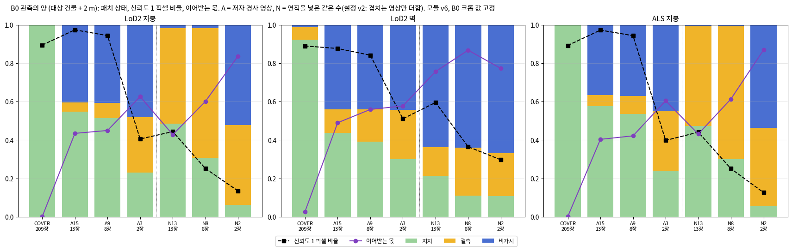

*읽는 법:* 막대는 대상 건물 패치의 상태(초록 지지, 노랑 결측, 파랑 비가시)이고, 검은 점선은 신뢰도 1 픽셀 비율, 보라 선은 이어받는 몫이다. 점선 세로줄 왼쪽은 저자 경사 조건, 오른쪽은 연직을 넣은 조건이다.

### 3.4 읽은 것 (분석자 판독)

- **고르는 규칙을 바꾼 효과.** 새 N 조건은 지난번보다 잰 곳이 많다. LoD2 지붕의 지지 몫이 N13 0.12 → 0.48, N8 0.03 → 0.31로 늘었다. 대신 대상 건물을 덮는 몫은 98 %에서 58 %로 줄어 저자 조건과 비슷해졌다.
- **같은 수에서 연직을 넣으면 (지붕).** 비가시가 거의 없어진다(0.40 → 0.02). 그러나 결측이 크다(N13 0.50, N8 0.68; 저자 0.05, 0.08). 신뢰도 1 픽셀 비율도 낮다(N13 0.44, N8 0.25; 저자 0.97, 0.94). 지지 몫은 저자 조건보다 낮다(0.48 대 0.55, 0.31 대 0.51).
- **벽.** 연직을 넣은 조건은 벽을 덜 본다(비가시 0.64 대 0.44). N13의 경사 영상 11장은 세 비행(10:00, 10:03, 10:11 무렵)에서 왔고, 저자 조건은 한 비행(10:13 무렵)의 연속 영상이다. 왜 벽을 덜 보는지는 이번에 가르지 않았다.
- **2장.** N2는 MVS는 섰지만 지붕 지지가 0.06이다. 저자 A3는 0.23이다. 함께 보는 성긴 점은 50개로 A3(29개)보다 많지만, 연직과 경사 한 장씩의 짝은 겹치는 넓이가 좁다.
- **그래서 이 비교에는 아직 '영상끼리 얼마나 겹치나'가 섞여 있다.** 저자 조건은 같은 비행 줄의 연속 영상이라 서로 많이 겹친다(A15 성긴 점 6,146개). 새 N 조건은 연결만 보장한다(4,092개). 3단계의 '연직을 넣으면' 비교를 어떻게 읽을지는 7절에 적었다.

## 4. 일치 영역 지도 (발주 5.3)

### 4.1 정의 (결과 전에 설정에 적음)

- 자료는 학습 전의 것뿐이다. 상자의 v6 첫째 단계(학습 영상만 MVS, 고정값, 옮긴 저장소)와 v6 참 라벨을 썼다. 패치는 상자 평가 범위 안의 것만 본다.
- 참 라벨은 둘째 준비 측정과 같은 셈법이다(v5 참값 규칙, 기본 허용 오차 τ). B0는 gt_clean, 그것이 덮지 않는 곳은 ULS다.

| 영역 | 정의 | 본 실험에서 견줄 것 |
|---|---|---|
| 일치 영역 전체 | 참 일치인 패치: \|참값 − 사전 정보\| ≤ τ | — |
| 잰 일치 영역 | 그 가운데 지지 패치이면서 \|MVS − 참값\| ≤ τ. MVS − 사전 정보는 그 패치의 지지 시점에서 신뢰도 1 픽셀의 잔차 중앙값이다(지붕은 연직, 벽은 바깥 법선 방향) | 세부의 정확도: 사전 정보 그대로, 늘 믿음 (영상만도 함께) |
| 못 잰 일치 영역 | 그 가운데 결측 또는 비가시 패치 | 완전성: 영상만 |
| (나머지) 잰 곳·영상 오차 큼 | 지지 패치인데 \|MVS − 참값\| > τ | 어느 비교에도 넣지 않고 표시만 한다 |
| 참값 없음 | 라벨이 없거나(참값 점 5개 미만) 평가 제외 칸(나무, 일시 반사) | 표시만 한다 |

- 영역의 지표는 사용자가 따로 정한다. 이번에는 영역만 정해 고정했다. 패치마다 영역 번호, 옮긴 중심, 면 종류, 넓이, 라벨, 상태를 `regions/regions_<지역>_<사전 정보>.npz`로 남겼다.

### 4.2 결과

| 지역 | 사전 정보 | 평가 범위 패치 (넓이 m²) | 참값 피복 (지붕 / 벽, 넓이) | 참 충돌 | 일치 영역 전체 | 잰 일치 | 잰 곳·영상 오차 큼 | 못 잰 일치 | 참값 없음 |
|---|---|---|---|---|---|---|---|---|---|
| B0_b10 | LoD2 | 82,117 (5,132) | 99% / 69% | 7,370 (461) | 57,760 (3,610) | 53,657 (3,354) | 2,049 (128) | 2,054 (128.4) | 16,987 (1,062) |
| B0_b10 | 항공 LiDAR | 23,280 (1,593) | 99% | 346 (25) | 22,767 (1,556) | 22,279 (1,522) | 458 (32) | 30 (2.0) | 167 (12) |
| B173nb_b10 | LoD2 | 141,534 (8,846) | 95% / 26% | 29,798 (1,862) | 36,086 (2,255) | 32,423 (2,026) | 2,435 (152) | 1,228 (76.7) | 75,650 (4,728) |
| B173nb_b10 | 항공 LiDAR | 34,273 (2,286) | 90% | 18,682 (1,245) | 12,274 (804) | 9,973 (638) | 2,283 (165) | 18 (1.7) | 3,317 (237) |
| B173_b0 | LoD2 | 114,065 (7,129) | 94% / 24% | 29,979 (1,874) | 20,085 (1,255) | 16,310 (1,019) | 3,348 (209) | 427 (26.6) | 64,001 (4,000) |
| B173_b0 | 항공 LiDAR | 25,482 (1,730) | 86% | 18,772 (1,254) | 3,306 (234) | 1,016 (70) | 2,289 (164) | 1 (0.0) | 3,404 (242) |
| R1rep_b10 | LoD2 | 79,054 (4,941) | 94% / 26% | 15,817 (989) | 26,309 (1,644) | 19,057 (1,191) | 7,037 (440) | 215 (13.5) | 36,928 (2,308) |
| R1rep_b10 | 항공 LiDAR | 24,189 (1,610) | 95% | 761 (55) | 22,187 (1,469) | 16,981 (1,126) | 5,149 (340) | 57 (3.9) | 1,241 (86) |

(칸 = 패치 수 (넓이 m²). 못 잰 일치 = 결측 + 비가시.)

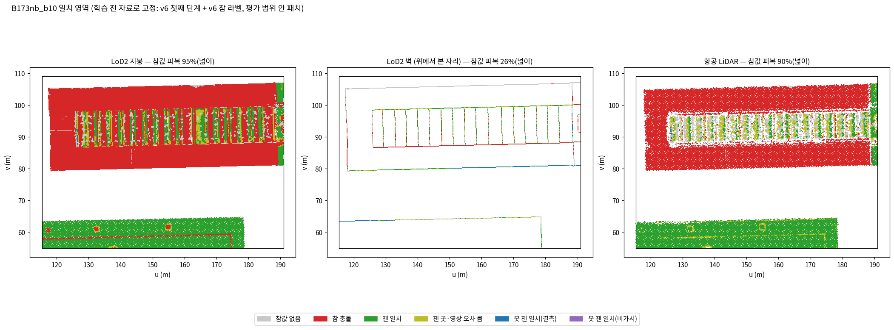

*읽는 법:* 초록이 잰 일치, 파랑·보라가 못 잰 일치, 빨강이 참 충돌, 회색이 참값 없음이다. 가운데 그림은 LoD2 벽 패치를 위에서 본 자리다.

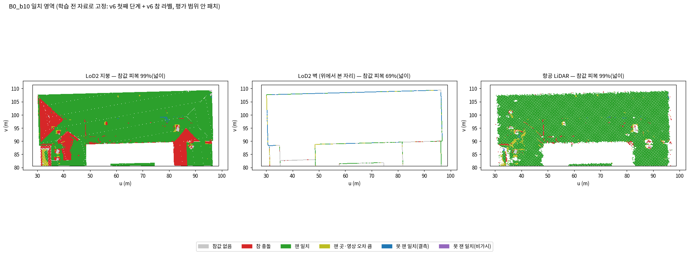

*읽는 법:* B0의 LoD2 벽 가운데 위쪽 긴 벽에 못 잰 일치(파랑)가 줄지어 있다. 영상이 그 벽에서 믿을 만한 깊이를 거의 내지 못했다는 뜻이다.

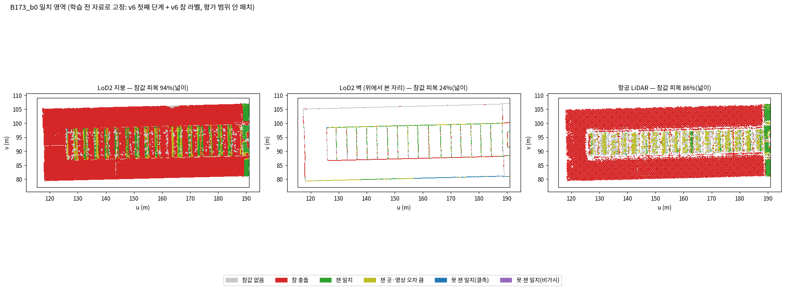

*읽는 법:* B173은 대부분 바뀐 장면이라 참 충돌(빨강)이 넓다. LoD2의 일치 영역은 대부분 벽(15,765패치)이고 지붕은 4,320패치다.

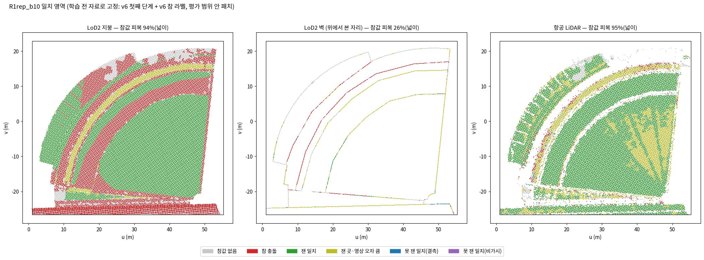

*읽는 법:* 부채꼴 건물의 LoD2는 지붕의 넓은 부분이 참 충돌(빨강)이고, 항공 LiDAR는 대부분 잰 일치(초록)다. 항공 LiDAR의 노랑(잰 곳·영상 오차 큼)은 5,149패치로 네 상자 가운데 가장 많다.

### 4.3 읽은 것 (분석자 판독)

- **못 잰 일치 영역이 매우 작다.** 상자의 학습 영상(140~338장)이 거의 모든 패치를 보고 잰다. 그래서 못 잰 일치는 LoD2에서 B0 2,054패치(128 m², 대부분 벽), B173nb 1,228패치(77 m²)이고, 항공 LiDAR에서는 상자마다 57패치(4 m²) 이하다. 1단계에서 '완전성(영상만과 견줌)'을 이 영역으로 재면 표본이 작다. 영상 수를 줄이는 3단계에서 이 영역이 커진다. 지표를 정할 때 참고할 사실로 적는다.
- **잰 일치 영역은 넓다.** 항공 LiDAR B0 22,279패치(1,522 m²), R1rep 16,981패치(1,126 m²)다. B173만 상자는 대부분 바뀌어 항공 LiDAR의 잰 일치가 1,016패치(70 m²)뿐이다.
- **잰 곳인데 영상 오차가 큰 패치**가 적지 않다. R1rep 항공 LiDAR 5,149패치(340 m², 넓은 지붕의 τ 언저리 어긋남), B173nb 항공 LiDAR 2,283패치다. 이 패치는 사전 정보가 맞는데 영상이 틀린 곳이다. 미리 정한 대로 어느 비교에도 넣지 않았다.
- **LoD2 벽은 참값이 덮지 않는 곳이 많다.** 벽의 참값 피복은 넓이로 24~69 %다. 연직 드론 LiDAR가 벽을 잘 찍지 못하기 때문이다(준비 측정에서 본 것과 같다).

## 5. 0단계 시험 학습 (발주 5.4)

### 5.1 설정 (결과 전에 설정에 적음)

| 항목 | 값 |
|---|---|
| 실험 지역 | B173과 이웃(`B173nb_b10`). 학습 영상 203장(깊이 지도가 있는 상자 학습 영상 전부), 평가 영상 29장, 1024 × 741 |
| 학습 코드 | r12, 본 방법, 스위치 모두 켬, 규칙 기본값(LoD2 지금 규칙, 항공 LiDAR 여유(모두) 2) |
| 반복 | 30,000회. GPU 두 대에 하나씩 동시에(LoD2 GPU 0, 항공 LiDAR GPU 1) |
| 씨앗 | 첫 묶음 0(r10·r11과 같은 씨앗), 둘째 묶음 1 |
| r10과 같은 값 | λ_MVS 0.05, λ_prior 0.05, 전파(2/3, 5, 1 m), 다시 읽기 500회마다, 가우시안 신뢰도 문턱 0.5, 보호(학습률 0.01배, 불투명도 하한 0.5, 4τ 안), 벌점 자르기 4τ, 처음 방향 칸 방식 |
| 기반 학습 설정 | GeoGS/2DGS 기본값: 밀도 제어 500~15,000회(100회마다), 불투명도 재설정 3,000회마다, 법선 일관성 7,000회부터, 깊이 왜곡 0 |
| 기록 | 100회마다 가우시안 수·불투명도, 500회마다 다시 읽기, 2·5·10·15·20·30천 회 장면, 30,000회에 모든 시점 렌더와 가우시안 저장 |

멈춤 신호(설정의 `stage0.stop_signals`)는 셋이다. 학습이 오류로 멈춤, 손실에 NaN, 사전 정보 출신 가우시안의 불투명도 무너짐(2,000회부터 1,000회마다, 중앙값 < 0.05 이고 0.5 이상의 몫 < 5 %)이다. 학습 옆에서 감시 프로그램이 30초마다 기록을 읽어 진행 기록을 고치고 신호를 본다.

### 5.2 멈춤 신호와 다시 돌림

- **첫 묶음의 항공 LiDAR 학습이 15,000회에서 오류로 멈췄다(14:55).** 15,000회의 다시 읽기는 학습 영상 203장을 렌더한다. 그 가운데 한 장이 7.36 GiB를 요청했는데 남은 메모리가 3.95 GiB였다(CUDA 메모리 부족). 15,000회 직전의 밀도 제어로 가우시안이 338만 개까지 늘어 있었다. 이때 PyTorch가 예약했지만 비어 있던 메모리가 7.92 GiB였다. 분석자는 메모리 조각남이 직접 원인이라고 본다.
- 같은 때 LoD2 학습은 15,000회(가우시안 296만 개, 예약 최대 21.5 GB)를 지나 계속 돌았다. 발주대로 둘째 묶음은 시작하지 않고 여쭈었다.
- **사용자 결정(10월 6일 15시 전):** 코드와 방법은 그대로 두고 PyTorch 메모리 할당 설정만 바꿔(`PYTORCH_CUDA_ALLOC_CONF=expandable_segments:True`) 항공 LiDAR 첫 학습을 처음부터 다시 돌린다. 멈춤 신호가 없으면 둘째 묶음도 같은 설정으로 돌린다. LoD2 첫 학습은 그대로 쓴다.
- 이 설정은 할당기가 비어 있는 메모리 조각을 다시 쓰게 할 뿐, 계산을 바꾸지 않는다. 멈춘 실행은 `stage0/b1_ALS_old_20261006T145815/`에 그대로 두었다.

### 5.3 끝까지 도는가

- **네 학습 모두 30,000회까지 돌았다**(첫 묶음 LoD2, 다시 돌린 첫 묶음 항공 LiDAR, 둘째 묶음 둘). 멈춘 실행은 첫 묶음 항공 LiDAR의 처음 실행 하나다(5.2, 메모리 부족).
- 손실에 NaN은 없었다. 불투명도 무너짐 신호도 없었다. 1,000회마다 본 사전 정보 출신 가우시안의 불투명도 중앙값은 가장 낮을 때도 0.29(LoD2, 23,000회)였고, 0.5 이상의 몫은 가장 낮을 때 0.35(LoD2, 13,000회)였다. 기준은 각각 0.05다.
- 경고는 기반 코드의 것 둘뿐이었다. 하나는 LPIPS 가중치를 불러올 때의 torchvision 사용 중단 알림이고, 다른 하나는 이 실험에서 쓰지 않는 GeoGS 건물 자료 경로가 없다는 알림이다.
- 7월 시험 학습 같은 지붕 투명화는 보이지 않았다. 평가 시점 렌더에서 지붕이 그대로 보이고(5.6), 학습 중 불투명도도 재설정 뒤 매번 회복했다(5.5).

### 5.4 시간과 자원

**T1 학습 한 번의 결과, 시간, 자원**

| 학습 | 결과 | 벽시계 (분) | 학습 고리 (분) | 다시 읽기 (분, 횟수) | 기록용 렌더 (분) | 초기화 (초) | 그 밖 (분) | GPU 메모리: 할당 최대 / 예약 최대 / nvidia-smi (GB) | 평가 시점 PSNR / SSIM / LPIPS |
|---|---|---:|---:|---|---:|---:|---:|---|---|
| LoD2 · 씨앗 0 | PASS | 63.6 | 51.3 | 7.7 (60) | 1.0 | 52.3 | 2.7 | 13.9 / 21.5 / 18.1 | 22.75 / 0.762 / 0.230 |
| 항공 LiDAR · 씨앗 0 | PASS | 65.6 | 53.8 | 8.1 (60) | 1.0 | 2.3 | 2.6 | 14.8 / 15.4 / 14.7 | 23.49 / 0.771 / 0.222 |
| LoD2 · 씨앗 1 | PASS | 67.7 | 53.9 | 8.2 (60) | 1.0 | 96.1 | 2.9 | 14.0 / 15.8 / 15.1 | 23.58 / 0.778 / 0.213 |
| 항공 LiDAR · 씨앗 1 | PASS | 68.2 | 54.5 | 8.1 (60) | 1.0 | 95.7 | 2.9 | 14.9 / 15.6 / 14.8 | 23.03 / 0.770 / 0.221 |

(학습 고리 = 감시 기록의 경과 시간 − 다시 읽기 − 기록용 렌더. 초기화 = r12 안에서 지도·판정 읽기, 심기, 첫 E, g_p까지. 그 밖 = 벽시계 − 경과 시간 − 초기화로, 컨테이너 시작, 장면 읽기, 마지막 저장과 덤프다. 초기화는 같은 지도를 이미 읽어 파일 캐시에 있으면 짧다(2초) — 기록으로만 둔다.)

- **한 번에 64~68분** 걸렸다(GPU 한 대). 학습 고리가 51~55분, 다시 읽기가 8분(60회, 가우시안이 가장 많은 15,000회 무렵 한 번에 약 11초), 기록용 렌더가 1분이다.
- **학습 전 계산**(이 지역의 첫째 단계 v6): LoD2 84초, 항공 LiDAR 83초(1차·2차·3차 렌더 66~78초 + 판정 5~18초). LoD2 판정 시간에는 일치 영역을 위해 새로 낸 패치별 MVS 잔차 중앙값(정렬)이 들어 있다. 학습 코드 입력 만들기는 12초였다.
- **GPU 메모리**: 메모리 설정을 켠 세 학습은 nvidia-smi 기준 최대 14.8~15.1 GB였다. 설정 없이 돈 첫 묶음 LoD2는 18.1 GB(예약 21.5 GB)까지 갔다. 멈춘 처음 실행은 예약 24.2 GB에서 멈췄다.
- **평가 시점 화질**(기록): PSNR 22.8~23.6, SSIM 0.76~0.78, LPIPS 0.21~0.23.
- **기반 구현과 견주는 법(6장용)**: 같은 방식으로 잰다. 벽시계(docker 실행 전체), 감시 기록의 경과 시간, 다시 읽기 합(`E.jsonl`의 `seconds`), 기록용 렌더 합(`timing.jsonl`), GPU 메모리(PyTorch 할당·예약 최대와 nvidia-smi 최대 − 시작 전 값)를 적는다. 1단계의 영상만 학습(스위치 `prior` 0)도 이 다섯 값을 같은 실행기로 남긴다. 판정 모듈을 아예 끈 기반 구현(`--jbgs_judgment off`)은 감시 기록이 없으므로 벽시계와 nvidia-smi 최대값으로 견준다. 메모리 설정(`expandable_segments`)은 견주는 실행에 똑같이 둔다.
- **나머지 학습 47회의 예상**: 이 지역과 같으면 한 번 약 66분, 후처리 약 5분이다. 47회면 GPU 시간 약 52시간, GPU 두 대로 약 26시간에 후처리 약 4시간이 더해진다. 학습 시간이 학습 영상 수에 비례한다고 거칠게 보면 B173만(140장) 약 45분, B0(243장) 약 78분, R1rep(338장) 약 110분이다. 1단계의 지역 구성에 따라 전체는 약 25~35시간(벽시계)으로 본다. 영상 수를 줄이는 3단계는 이보다 짧을 것이다.

### 5.5 학습 중의 장면

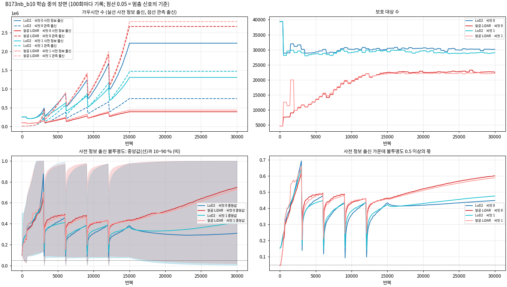

*읽는 법:* 왼쪽 위는 출신별 가우시안 수이고, 3,000회마다 불투명도 재설정 뒤 가지치기로 줄었다가 15,000회(밀도 제어 끝)부터 그대로다. 아래 두 그림의 점선(0.05)이 멈춤 신호의 기준인데, 사전 정보 출신 불투명도는 재설정 직후에도 그 위에 있다.

**T2 30,000회의 장면**

| 학습 | 가우시안 | 사전 정보 출신 | 관측 출신 | 보호 대상 | 사전 정보 출신 불투명도 10 / 50 / 90 % | 그 가운데 0.5 이상 | TSDF 삼각형 |
|---|---:|---:|---:|---:|---|---:|---:|
| LoD2 · 씨앗 0 | 2,960,030 | 2,216,218 | 743,812 | 30,179 | 0.005 / 0.309 / 1.000 | 0.45 | 36,862,461 |
| 항공 LiDAR · 씨앗 0 | 3,054,724 | 393,572 | 2,661,152 | 22,481 | 0.021 / 0.746 / 1.000 | 0.60 | 36,543,161 |
| LoD2 · 씨앗 1 | 2,772,105 | 1,305,867 | 1,466,238 | 29,134 | 0.006 / 0.414 / 1.000 | 0.48 | 36,841,411 |
| 항공 LiDAR · 씨앗 1 | 3,229,574 | 438,449 | 2,791,125 | 22,225 | 0.018 / 0.728 / 1.000 | 0.59 | 36,739,428 |

- **가우시안 수**는 30,000회에 277만~323만 개였다. LoD2 학습은 사전 정보 출신이 많고(씨앗 0: 222만, 씨앗 1: 131만), 항공 LiDAR 학습은 관측 출신이 많다(266만~279만). 사전 정보 출신의 자식도 사전 정보 출신으로 센다.
- **보호 대상**은 LoD2 약 3만 개, 항공 LiDAR 약 2만 2천 개로, 15,000회 뒤에는 거의 그대로였다.
- **불투명도**: 사전 정보 출신의 중앙값은 LoD2 0.31~0.41, 항공 LiDAR 0.73~0.75였다. 보호 대상은 하한 0.5로 붙잡힌다.

### 5.6 결과물

결과물은 실행마다 `stage0/<실행>/`에 있다. 가우시안 장면(`model/point_cloud/iteration_30000/point_cloud.ply`), 평가 시점 29장의 렌더·깊이·법선·누적 불투명도(`post/eval/`), TSDF 메시(`post/mesh_tsdf.ply`, 0.05 m 칸, 삼각형 약 3,700만 개)다.

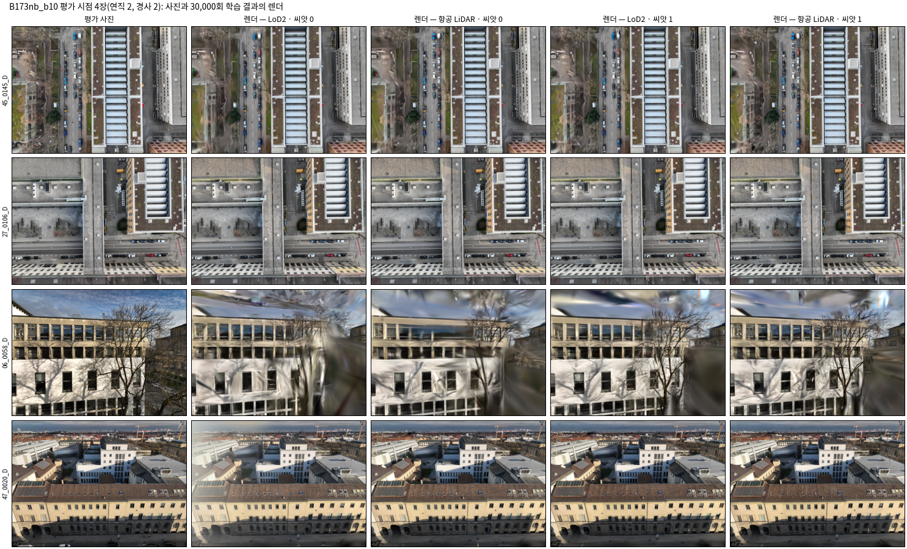

*읽는 법:* 맨 왼쪽이 평가 사진이고 오른쪽 넷이 네 학습의 렌더다. 연직 두 장과 멀리 본 넷째 시점은 지붕의 톱니 채광창까지 사진과 같이 보이고, 거의 수평인 셋째 시점(나무 앞 정면)은 네 학습 모두 나무와 하늘이 흐트러지며 그 정도가 학습마다 다르다.

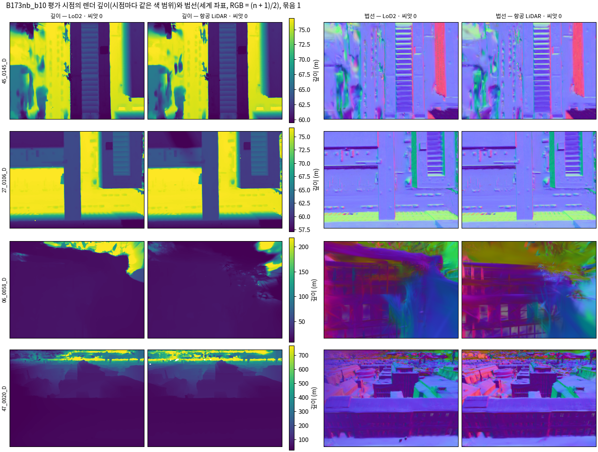

*읽는 법:* 왼쪽 둘이 렌더 깊이(시점마다 같은 색 범위), 오른쪽 둘이 렌더 법선이다. 연직 두 장은 두 사전 정보가 거의 같고(톱니 채광창의 법선까지), 수평에 가까운 셋째 시점은 나무와 하늘 쪽이 흐트러지며 두 학습이 조금 다르다.

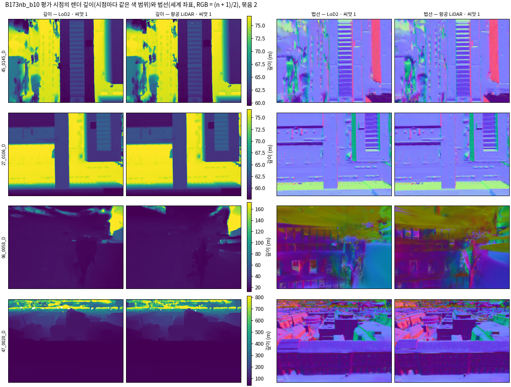

*읽는 법:* 둘째 묶음(씨앗 1)의 같은 그림이다. 연직 두 장은 첫 묶음과 같은 모습이고, 셋째 시점의 나무·하늘 쪽은 첫 묶음과도 서로도 다르게 흐트러진다.

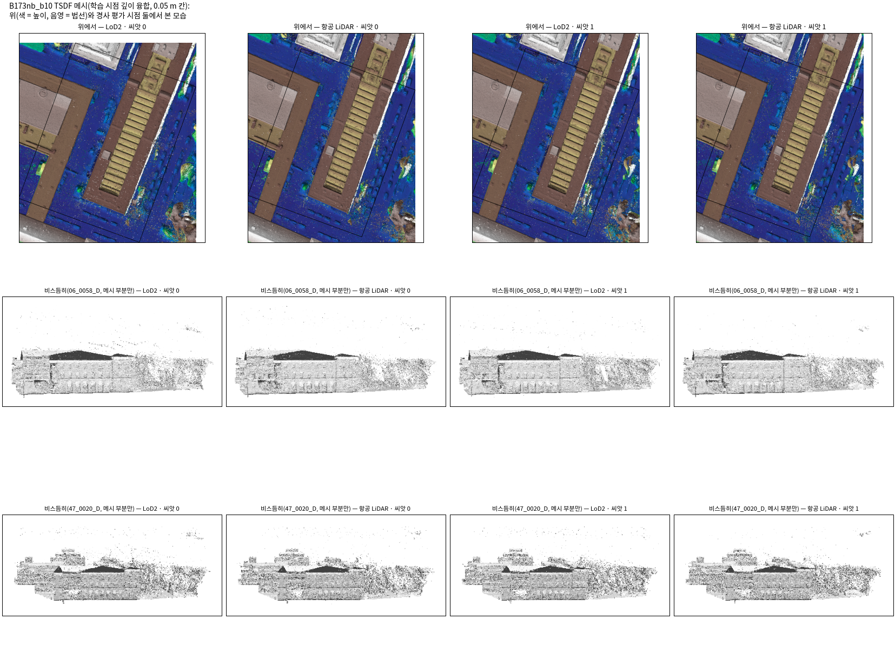

*읽는 법:* 윗줄은 위에서 본 메시(색은 높이, 음영은 법선)이고, 아래 두 줄은 경사 평가 시점 둘에서 본 메시다(메시가 있는 부분만 잘라 보임). 네 메시의 지붕·벽·톱니 모양이 거의 같다.

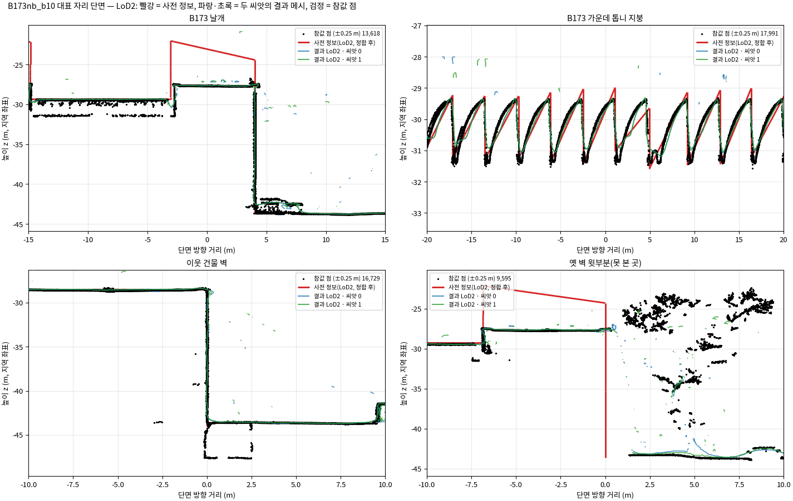

*읽는 법:* 빨강이 LoD2(정합 뒤), 파랑·초록이 두 씨앗의 결과 메시, 검정이 참값 점이다. B173 날개에서 LoD2의 옛 박공(빨강, 4~5 m 위)은 결과에 남지 않았고 결과는 지금 지붕(참값)을 따른다.

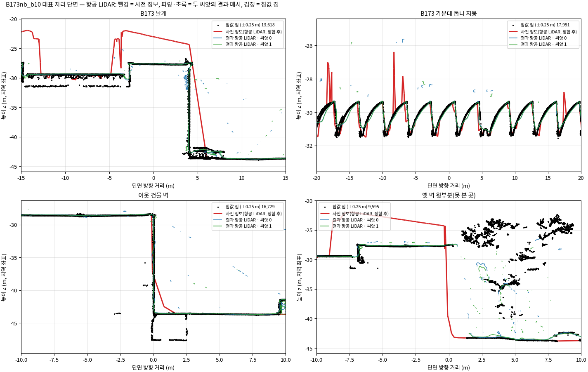

*읽는 법:* 같은 자리의 항공 LiDAR(2022) 단면이다. 날개와 옛 벽 자리의 옛 지붕(빨강)도 결과에 남지 않았고, 이웃 건물 벽은 셋이 겹친다.

- **대표 자리 넷의 정성 판독(분석자)**:
  - B173 날개(바뀐 곳): 두 사전 정보 모두 옛 박공이 결과에 남지 않았다. 결과 메시는 지금 지붕 위 4~5 cm에 있다.
  - B173 가운데 톱니 지붕(일치): 결과가 참값의 톱니를 따른다. 사전 정보(LoD2)의 톱니 꼭대기는 참값보다 조금 높은데, 결과는 참값 쪽이다.
  - 이웃 건물 벽: 사전 정보, 결과, 참값이 겹친다.
  - 옛 벽 윗부분(못 본 곳): 결과 메시에는 옛 벽도, 지금 북쪽 벽도 거의 없다. 학습 시점이 그 벽을 보지 못하므로 TSDF가 그곳을 만들 수 없기 때문이다(7.1). 가우시안을 직접 세면, LoD2 학습에서는 못 본 패치의 65~68 %가 0.25 m 안에 사전 정보 출신 가우시안(불투명도 0.5 이상)을 두고 있었다(5.7). 즉 사전 정보를 이어받았다.

### 5.7 참값과 간단히 견주기 (점검용)

평가 범위 안의 참값 점 472만 개(지붕 331만, 벽 41만)로 결과 메시를 견줬다. 이 수는 점검용이며, 본 실험의 지표는 사용자가 따로 정한다.

**T3 참값과 간단히 견주기 (점검용)**

| 나눔 | LoD2 · 씨앗 0 | 항공 LiDAR · 씨앗 0 | LoD2 · 씨앗 1 | 항공 LiDAR · 씨앗 1 |
|---|---|---|---|---|
| 전체 | 0.058 / 0.053; 0.89 / 0.97 (4,717,745) | 0.056 / 0.053; 0.90 / 0.97 (4,717,745) | 0.058 / 0.053; 0.89 / 0.97 (4,717,745) | 0.057 / 0.051; 0.90 / 0.97 (4,717,745) |
| 지붕 | 0.058 / 0.053; 0.91 / 0.97 (3,311,201) | 0.056 / 0.053; 0.92 / 0.97 (3,311,201) | 0.058 / 0.053; 0.91 / 0.97 (3,311,201) | 0.057 / 0.051; 0.92 / 0.97 (3,311,201) |
| 벽 | — / —; 0.84 / 0.94 (412,967) | — / —; 0.85 / 0.94 (412,967) | — / —; 0.84 / 0.94 (412,967) | — / —; 0.85 / 0.94 (412,967) |
| 바뀐 곳 (B173 날개) | 0.041 / 0.053; 0.97 / 0.99 (1,300,310) | 0.039 / 0.053; 0.97 / 0.99 (1,300,310) | 0.040 / 0.052; 0.96 / 0.99 (1,300,310) | 0.040 / 0.052; 0.97 / 0.99 (1,300,310) |
| 일치 영역 | 0.067 / 0.029; 0.97 / 0.99 (1,800,298) | 0.066 / 0.029; 0.97 / 0.99 (1,496,313) | 0.068 / 0.028; 0.97 / 0.99 (1,800,298) | 0.066 / 0.028; 0.97 / 0.99 (1,496,313) |
| 잰 일치 | 0.067 / 0.028; 0.99 / 1.00 (1,694,372) | 0.066 / 0.025; 1.00 / 1.00 (1,332,311) | 0.067 / 0.026; 0.99 / 1.00 (1,694,372) | 0.066 / 0.024; 1.00 / 1.00 (1,332,311) |
| 못 잰 일치 | 1.852 / 0.421; 0.92 / 0.94 (18,180) | 1.575 / 0.481; 0.01 / 0.02 (1,032) | 1.725 / 0.350; 0.92 / 0.94 (18,180) | 1.427 / 0.308; 0.01 / 0.01 (1,032) |
| 못 본 곳 (옛 벽 윗부분) | — / —; 0.55 / 0.97 (359) | — / —; 0.33 / 0.97 (359) | — / —; 0.35 / 0.96 (359) | — / —; 0.37 / 0.96 (359) |

(칸 = 지붕 점의 높이 차 z결과 − z참값 중앙값 / NMAD (m); 결과 표면 0.2 m / 0.5 m 안의 몫 (참값 점 수). 일치 영역은 사전 정보마다 자기 영역이라 점 수가 다르다.)

| 못 본 패치 (B173 벽, 비가시) | LoD2 · 씨앗 0 | 항공 LiDAR · 씨앗 0 | LoD2 · 씨앗 1 | 항공 LiDAR · 씨앗 1 |
|---|---|---|---|---|
| 패치 중심이 결과 메시 0.2 / 0.5 m 안 | 0.08 / 0.24 | 0.05 / 0.14 | 0.10 / 0.25 | 0.05 / 0.13 |
| 0.25 m 안에 사전 정보 출신 가우시안(불투명도 0.5 이상)이 있는 몫 | 0.68 | 0.04 | 0.65 | 0.04 |
| 0.25 m 안에 관측 출신 가우시안(불투명도 0.5 이상)이 있는 몫 | 0.02 | 0.03 | 0.02 | 0.03 |

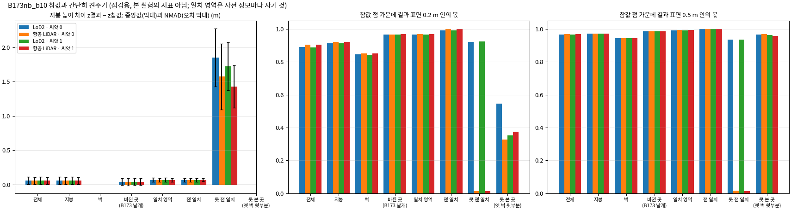

*읽는 법:* 왼쪽은 지붕 높이 차의 중앙값(막대)과 NMAD(오차 막대), 가운데와 오른쪽은 결과 표면 0.2 m·0.5 m 안에 있는 참값 점의 몫이다. 점이 적은 '못 잰 일치'와 '못 본 곳' 말고는 네 학습이 거의 같다.

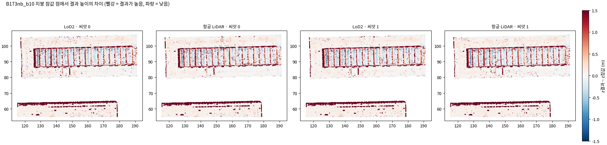

*읽는 법:* 지붕 참값 점마다 결과 높이와의 차이를 칠했다(빨강 = 결과가 높음). 평평한 지붕은 대부분 옅은 빨강(약 +5 cm)이고, 진한 빨강은 벽 가장자리와 톱니의 세로면처럼 연직선이 위쪽 면에 먼저 닿는 자리다.

- **지붕**: 결과가 참값보다 중앙값 5.6~5.8 cm 높다(NMAD 5.1~5.3 cm). 두 사전 정보와 두 씨앗이 같다. 그래서 방법의 차이보다는 메시 만들기나 참값 높이 맞춤에 공통으로 있는 치우침으로 읽힌다(분석자 판단, 1단계의 영상만 학습과 견주면 가를 수 있다).
- **바뀐 곳(B173 날개)**: 참값 점의 96~97 %가 결과 표면 0.2 m 안이다. 옛 자료(4~5 m 위)를 따르지 않았다.
- **일치 영역**: 잰 일치는 99~100 %가 0.2 m 안이다. 못 잰 일치는 점이 적다(LoD2 1.8만 점, 항공 LiDAR 1천 점). LoD2는 92 %가 0.2 m 안이지만, 항공 LiDAR는 1 %뿐이다. 항공 LiDAR의 못 잰 일치는 18패치(1.7 m²)뿐이라 해석하지 않는다.
- **못 본 곳(옛 벽 윗부분)**: 참값 점 359개 가운데 0.2 m 안의 몫이 33~55 %로 흔들린다. 패치 중심 기준으로는 결과 메시 0.2 m 안이 5~10 %뿐이다(7.1의 이유).

- 위 표의 '못 본 패치' 세 줄(B173 벽 가운데 비가시 18,747패치) 가운데 가우시안을 센 두 줄은 결과를 본 뒤 더한 기록이다. 목적은 TSDF가 보여 줄 수 없는 못 본 곳을 해석하는 것이며, 합격 기준이 아니다. 항공 LiDAR의 TIN에는 벽이 없어 그 자리에 사전 정보 출신 가우시안이 거의 없다.

### 5.8 흔들림 (같은 조건, 씨앗 0과 1)

**T4 흔들림 (씨앗 1 − 씨앗 0)**

| 나눔 | LoD2: 높이 차 중앙값 / NMAD (cm) | LoD2: 0.2 / 0.5 m 안 (%p) | 항공 LiDAR: 높이 차 중앙값 / NMAD (cm) | 항공 LiDAR: 0.2 / 0.5 m 안 (%p) |
|---|---|---|---|---|
| 전체 | +0.0 / -0.1 | -0.2 / +0.0 | +0.1 / -0.1 | +0.1 / +0.0 |
| 지붕 | +0.0 / -0.1 | -0.1 / +0.1 | +0.1 / -0.1 | +0.0 / +0.1 |
| 벽 | — | -0.1 / +0.1 | — | -0.1 / -0.1 |
| 바뀐 곳 (B173 날개) | -0.1 / -0.1 | -0.1 / -0.1 | +0.1 / -0.1 | +0.1 / -0.0 |
| 일치 영역 | +0.1 / -0.1 | +0.0 / +0.0 | +0.0 / -0.1 | +0.1 / +0.0 |
| 잰 일치 | +0.1 / -0.1 | -0.0 / -0.0 | +0.0 / -0.1 | +0.0 / +0.0 |
| 못 잰 일치 | -12.7 / -7.1 | +0.5 / +0.0 | -14.8 / -17.3 | +0.0 / -0.5 |
| 못 본 곳 (옛 벽 윗부분) | — | -19.5 / -0.3 | — | +4.7 / -1.1 |

- **넓은 나눔은 거의 흔들리지 않았다.** 전체, 지붕, 벽, 바뀐 곳, 일치 영역, 잰 일치에서 지붕 높이 차는 0.1 cm 안, 0.2 m·0.5 m 안의 몫은 0.2 %p 안에서 같았다. 그림에서도 연직·먼 시점의 렌더, 깊이, 메시, 단면에는 눈에 띄는 차이가 없었다. 수평에 가까운 셋째 평가 시점(나무 앞)의 렌더만 학습마다 흐트러짐이 달랐다.
- **점이 적은 나눔은 크게 흔들렸다.** 못 잰 일치(높이 차 중앙값 13~15 cm, NMAD 7~17 cm)와 못 본 곳(0.2 m 안의 몫 LoD2 19.5 %p, 항공 LiDAR 4.7 %p)이다.
- **그 밖에 흔들린 것**: 평가 시점 PSNR이 씨앗에 따라 0.5~0.8 dB 달랐다(LoD2 22.75 → 23.58, 항공 LiDAR 23.49 → 23.03). LoD2 학습의 가우시안 출신 구성도 크게 달랐다(사전 정보 출신 222만 → 131만, 관측 출신 74만 → 147만). 기하 점검의 수는 같았으므로, 출신 구성은 결과의 모양보다 밀도 제어의 우연을 따른 것으로 읽힌다(분석자 판단).
- **반복 수에 주는 뜻(분석자 의견)**: 넓은 영역의 기하 지표라면 같은 조건의 흔들림이 0.2 %p, 0.1 cm로 작다. 조건 사이의 차이가 이보다 뚜렷이 크면 조건마다 한 번으로 가를 수 있다. 못 잰 일치, 못 본 곳처럼 작은 영역이나 화질(PSNR), 가우시안의 출신 구성을 지표로 쓰면 씨앗 셋 이상이 필요하다. 결정은 사용자가 한다.

### 5.9 분석자 의견: 1단계로 가도 되는가

**가도 된다고 본다. 다만 두 가지를 먼저 정하면 좋다.**

- 근거:
  1. r12가 두 사전 정보로 30,000회를 끝까지 돌았다(네 번). 판정·전파·보호의 기록이 정상이었고, 불투명도 무너짐은 멀리 있었다.
  2. 바뀐 곳(B173 날개)에서 결과가 옛 자료가 아니라 지금 지붕을 따랐다. 잰 일치 영역에서는 참값 점의 99 % 이상이 결과 0.2 m 안에 있다.
  3. 넓은 영역의 수는 씨앗을 바꿔도 거의 같았다.
  4. 한 번에 약 66분, GPU 메모리 약 15 GB(메모리 설정 켬)로 GPU 두 대에서 돌 수 있다.
- 먼저 정할 것:
  1. **메모리**: 메모리 설정(`expandable_segments`)을 모든 학습에 둔다. 학습 영상이 가장 많은 R1rep(338장)을 1단계에서 먼저 돌려 메모리를 확인하기를 권한다. 이 지역에서도 설정 없이는 24 GB에서 멈췄다.
  2. **못 본 곳과 못 잰 일치를 재는 법**(7.2의 3·4): 학습 시점 TSDF로는 못 본 곳을 잴 수 없고, 못 잰 일치는 상자에서 표본이 작다.
- 0단계의 네 학습은 1단계의 'B173과 이웃, 본 방법, 두 사전 정보'에 그대로 넣을 수 있다. 첫 묶음 LoD2만 메모리 설정 없이 돌았다. 설정은 계산을 바꾸지 않으므로 같은 조건으로 본다.

## 6. 커밋과 푸시

모두 브랜치 `exp/main-experiment`(별도 폴더)에서 했고 `origin`(`git@github-hwiyoung:hwiyoung/JointBuildGS.git`)에 푸시했다. 학습 코드 포크의 라이선스 문서(`LICENSE.md`, Gaussian-Splatting 라이선스)는 그대로 두었다.

| 때 | 커밋 | 내용 |
|---|---|---|
| 처음 (13:3x) | `archive/wip-20261005` = `fc550e5f` | 보존 브랜치를 한 번 푸시했다(새 원격 브랜치) |
| 처음 (13:3x) | `exp/main-experiment` = `205bc2b0` | 본 실험 브랜치를 앞 작업 커밋 다섯까지 푸시했다(새 원격 브랜치) |
| 5.1 (14:3x) | `80820a6c` | 공용 모듈 v6와 시험, 포크 r12와 빌드 스크립트·빌드 보고서, 측정 v6 스크립트, 설정, 5.1 그림, 보고서 2절 |
| 5.2 (14:3x) | `c78c3504` | B0 조건 고르기·MVS·표 스크립트, 그림, 보고서 3절 |
| 5.3 (14:3x) | `2c759db1` | 일치 영역 스크립트, 지도 4장, 보고서 4절 |
| 5.4 | 이 보고서의 커밋 | 학습 실행기(감시 포함)·후처리·참값 점검·그림·표 스크립트, 그림, 보고서 1·5~9절, 매니페스트 |

- 영수증 `receipt_task.json`(페이로드)에는 5.4 커밋 뒤의 커밋 해시와, 학습을 시작할 때마다 남긴 git 상태(`logs/git_at_stage0_*.txt`: HEAD와 미커밋 파일 목록)가 들어 있다.
- 첫 묶음(14:32)은 5.1 커밋(14:37)보다 먼저 시작했다. 그때 r12의 바뀐 두 파일의 sha256 앞자리(`jbgs_judgment.py` 8e0484edea3a0ca6, `train.py` 9203ec68b328bf24)를 적어 두었고, 커밋된 파일과 같다. 다시 돌린 항공 LiDAR(14:58)와 둘째 묶음(16:09)은 5.1~5.3 커밋 뒤에 시작했다. 학습 때 미커밋이던 것은 5.4의 실행기와 후처리·그림 스크립트다.

## 7. 확인 못 한 것, 사용자가 정할 것

### 7.1 확인 못 한 것

1. **못 본 곳은 TSDF 메시로는 볼 수 없다.** 메시는 학습 시점의 렌더 깊이를 융합하므로, 어느 학습 시점도 보지 못한 면은 메시에 나타날 수 없다. 그래서 '못 본 곳(옛 벽 윗부분)'은 메시 대신 그 자리의 가우시안을 직접 셌다(5.7, 결과를 본 뒤 더한 기록이며 기준이 아니다). 본 실험에서 못 본 곳을 재려면 r10처럼 그 자리를 겨눈 가상 시점의 메시나 가우시안 단위의 지표가 필요하다.
2. **못 잰 일치 영역은 상자에서 매우 작다**(4.3). 1단계의 완전성 비교는 표본이 작다.
3. **저장소 고침의 예상(0.5~1.5 %)은 B0와 R3E에서만 잰 것이었다.** B173nb 항공 LiDAR(R2 이동)는 2.10 %로 예상보다 컸지만 미리 적은 멈춤 기준(3 %) 안이었다.
4. **B0 연직 포함 비교에는 아직 '영상끼리 얼마나 겹치나'가 섞여 있다**(3.4). 새 규칙은 연결만 보장하고, 저자 조건만큼 많이 겹치게 하지는 않는다.
5. **벌점 함수(사전 정보 당김의 구간)와 보호의 학습 중 동작**은 이번 학습의 기록(보호 대상 수, 불투명도)으로만 보았다. 장치별 효과는 2단계(장치 빼기)에서 본다.
6. **첫 묶음의 LoD2 학습만 메모리 설정 없이 돌았다.** 이 설정은 계산을 바꾸지 않지만, 네 학습이 같은 실행 환경은 아니다.

### 7.2 사용자가 정할 것

1. **1단계로 갈지** (분석자 의견은 5.9).
2. **반복 수** (근거: 5.8의 흔들림).
3. **일치 영역의 지표** (영역은 4절에 고정). 특히 못 잰 일치(완전성)를 상자의 적은 패치로 잴지, 영상 수를 줄인 조건에서 잴지.
4. **못 본 곳을 재는 방법** (7.1의 1): 가상 시점 메시, 가우시안 단위 지표, 또는 둘 다.
5. **GPU 메모리 대책**: 이번 지역(학습 영상 203장)에서 가우시안이 300만 개를 넘었고, 메모리 설정 없이 LoD2가 예약 21.5 GB까지 갔다. 학습 영상이 더 많은 R1rep(338장)과 B0(243장)에서는 더 클 수 있다. 메모리 설정을 모든 학습에 쓸지, 큰 지역을 먼저 돌려 메모리를 확인할지 정해 주시면 된다.
6. **3단계 '연직을 넣으면' 비교의 읽는 법** (3.4): 지금 고른 N 조건 그대로 갈지.

## 8. 걸린 시간

- 처음 예상(시작 때 진행 기록에 적음): 약 16.5시간(끝 10월 7일 06:00 무렵). 두 배를 넘길 것 같으면 멈추기로 했다.
- 실제: 13:38에 시작해 17:45 무렵 끝났다(약 4시간 10분). 학습 한 번이 예상(2.5시간)보다 짧았고(약 1시간), 5.1~5.3을 겹쳐 돌렸다. 첫 1,000회 뒤 다시 계산한 예상은 학습 한 번 0.8시간이었다.

| 단계 | 시각 | 걸린 시간 |
|---|---|---|
| 발주·맥락 읽기, 계획, 설정 저장 | ~13:39 | — |
| 원격 푸시 (보존, 본 실험) | 13:3x | 각 1분 미만 |
| 5.1 모듈 v6와 시험 | 13:40–13:45 | 약 5분 |
| 5.1 상자 측정 v6 10건 (동시 셋) | 13:47–13:55 | 7.6분 |
| 5.1 참 라벨 4건 | 13:55–13:58 | 3.4분 |
| 5.1 포크 입력 4건 | 13:58–13:59 | 29초 |
| 5.1 r12 빌드와 시험 초기화 (고친 오류 2) | 13:59–14:00 | 약 1.5분 |
| 5.1 r12 초기화 26회 (GPU 두 대) | 14:00–14:18 | 17.5분 (한 번 8~169초) |
| 5.1 확인·비교 (고친 오류 2), 라벨 나누기, 그림 | 14:18–14:31 | 13분 |
| 5.2 고르기 | 14:02 | 15초 |
| 5.2 MVS 셋 | 14:04–14:12 | 7.5분 (181·121·65초) |
| 5.2 첫째 단계 14건, 라벨 7건, 표 | 14:12–14:31 | 19분 |
| 5.3 일치 영역, 그림 시점·단면 고정 | 14:00–14:01 | 8초 |
| 5.1~5.3 보고서, 커밋, 푸시 | 14:33–14:40 | (학습과 겹침) |
| 5.4 첫 묶음 LoD2 | 14:32–15:36 | 63.6분 |
| 5.4 첫 묶음 항공 LiDAR (멈춤) | 14:32–14:55 | 23.5분 |
| 사용자 결정 | 14:56–14:58 | 약 2분 |
| 5.4 첫 묶음 항공 LiDAR 다시 | 14:58–16:04 | 65.6분 |
| 후처리 첫 묶음 (렌더, TSDF) | 15:36–15:41, 16:04–16:08 | 4.6분, 4.5분 |
| 5.4 둘째 묶음 (GPU 두 대) | 16:09–17:16 | 67.7분, 68.2분 |
| 후처리 둘째 묶음 | 17:17–17:26 | 4.6분, 4.7분 |
| 참값 점검 (네 학습) | 17:26–17:29 | 2.6분 |
| 그림 (네 학습, 고쳐 그리기 포함) | 17:29–17:37 | 약 8분 |
| 보고서 마무리, 5.4 커밋, 푸시, 영수증 | 17:37–17:45 | 약 8분 |

## 9. 산출물과 재현

### 9.1 산출물

페이로드 `../JointBuildGS-artifacts/phase-payloads/phd/main_stage0_v1/PHD-MAIN-STAGE0-v1/`:

| 폴더·파일 | 내용 |
|---|---|
| `progress.md` | 진행 기록(할 일, 학습 1,000회마다 반복·속도·예상 끝, 기록) |
| `s61/box/`, `s61/box_maskoff/`, `s61/box_gt/` | 5.1 상자 넷의 v6 첫째 단계(옮긴 저장소, 규칙 기본값, 패치별 MVS 잔차 중앙값), 스위치 지역의 신뢰도 마스크 끈 실행, v6 참 라벨과 참값 점의 패치 소속 |
| `s61/export/`, `s61/export_maskoff/` | 학습 코드가 읽는 시점별 지도 |
| `s61/box_gt_v5code/` | 같은 참값 점(float32)으로 v5 코드가 낸 라벨(라벨 변화의 원인 나누기) |
| `fork_inputs/s61/`, `fork_runs/s61/` | r12 입력과 초기화 26회(상자 넷 × 사전 정보 둘, 항공 LiDAR 지금 규칙 넷, 스위치 14) |
| `fork_checks/s61.json`, `compare51/` | 같은 판정 확인·r11 같음·스위치 표, v5 대비 분해와 라벨로 센 잘못 |
| `mvs_lists/`, `mvs/B0_N13`, `B0_N8`, `B0_N2`, `b0_conditions_v2.json` | 5.2 다시 고른 영상, MVS와 COLMAP 영수증, 고른 순서 |
| `s62/`, `s62_gt/`, `tables/b0_conditions_v2.*` | 5.2 일곱 조건의 v6 첫째 단계, 라벨, 표 |
| `regions/` | 5.3 일치 영역(지역 × 사전 정보 npz, 요약 json·csv) |
| `stage0/fig_defs.json` | 그림 시점과 단면 자리(학습 전에 정함) |
| `stage0/b<k>_<사전 정보>/` | 5.4 학습(모델, 기록, 영수증, 후처리: 평가 시점 렌더·깊이·법선, TSDF 메시, `post.json`). `b1_ALS_old_…`는 메모리 부족으로 멈춘 실행 |
| `quick/` | 참값과 간단히 견주기(실행마다 json·npz, 흔들림 `spread.json`) |
| `tables/stage0_tables.md`, `figs/` | 5절 표, 그림 원본 |
| `logs/` | 대기열, 단계별 기록, 학습 시작 때의 git 상태(`git_at_stage0_*.txt`) |
| `receipt_task.json` | 커밋, 미커밋 파일, Docker 이미지 ID, 스크립트·설정·모듈·포크·입력 해시, 단계 시간 |

### 9.2 재현

스크립트는 `scripts/phd/main_stage0_v1/`, 설정은 `configs/phd/main_stage0_v1/stage0_v1.json`이다. 모든 계산은 Docker 안에서 네트워크 없이 돈다.

1. 모듈과 시험: `python -m unittest tests.phd.test_prior_propagation_v6 tests.phd.test_prior_propagation_v5`.
2. r12 만들기: `python3 build_fork_r12.py` (커밋된 r11 + `fork_r12/` + 모듈 v6).
3. 5.1: `bash run_51.sh` (상자 측정 v6, 라벨, 포크 입력) → `bash run_51_fork.sh` (r12 초기화 26회, `fork_checks_v6.py`, `compare_51.py`) → `figs_51.py`. 라벨 나누기는 둘째 준비 측정의 `s04_gt.py`를 이 페이로드에 `--gt-from`으로 돌렸다(`logs/jobs_51/v5labels.txt`).
4. 5.2: `bash run_52.sh` (고르기 `b0_select_v2.py`, MVS `run_colmap.sh`, 첫째 단계, 라벨) → `b0_table_v2.py`.
5. 5.3: `regions_v1.py`. 그림 시점·단면: `fig_defs.py`.
6. 5.4: `python3 run_stage0.py --batch 1` (감시 포함) → 멈춘 항공 LiDAR는 `--batch 1 --priors ALS --alloc-conf expandable_segments:True --tag rerun_ALS` → `--batch 2 --alloc-conf expandable_segments:True` → `GPU=<n> bash run_post.sh <실행>` → `quick_gt.py b1_LoD2 b1_ALS b2_LoD2 b2_ALS` → `figs_stage0.py` → `python3 tables_54.py`.
7. 영수증: `receipt.py`.

- 공유 서버라 Docker 동시 실행은 셋 이하로 했다(`run_queue.sh`의 `JBGS_MAX_PAR`). 학습은 GPU마다 하나, 메시는 한 번에 하나다.
- 앞 작업의 실행 스크립트는 자기 페이로드 경로를 코드에 적어 두었으므로 부르지 않았다. 출력 위치만 이 페이로드로 바꾼 얇은 실행 스크립트(`run_queue.sh`, `run_colmap.sh`)를 두었다. 앞 작업의 파이썬 스크립트 가운데 그대로 쓴 것은 `colmap_subset.py`(5.2)와 `s04_gt.py`(라벨 나누기)이고, `/out`을 이 페이로드로 붙여 돌렸다.
