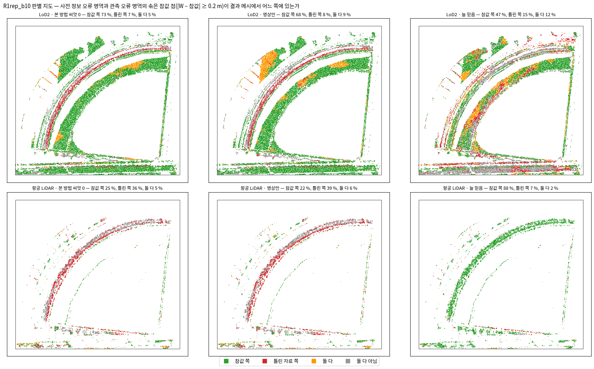
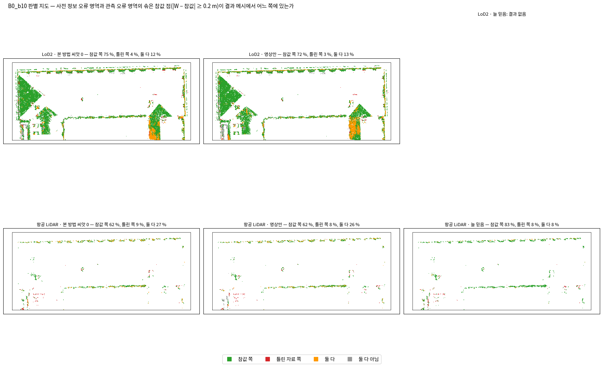
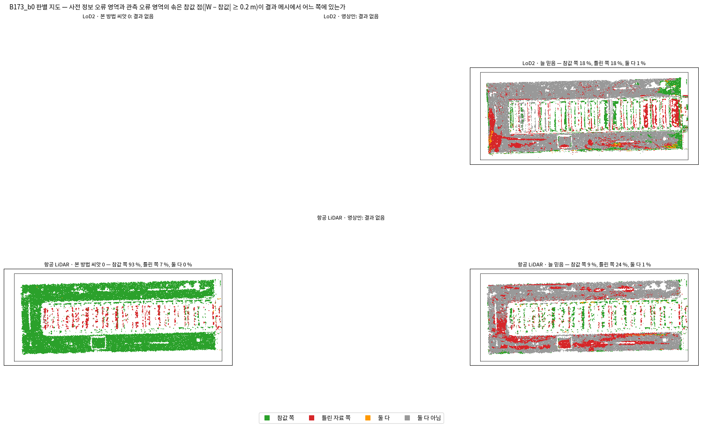
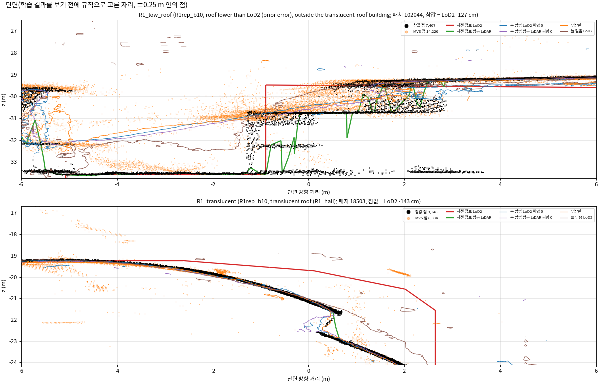
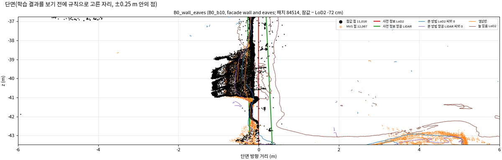
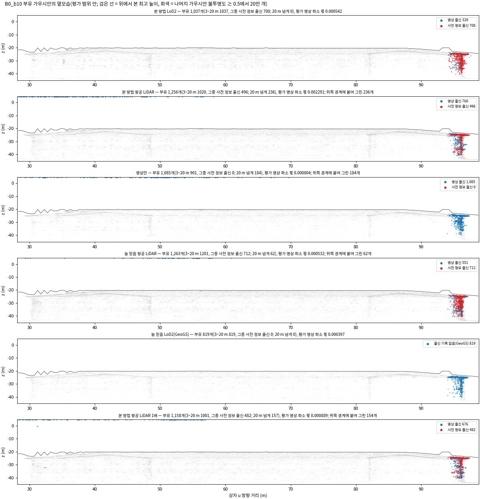
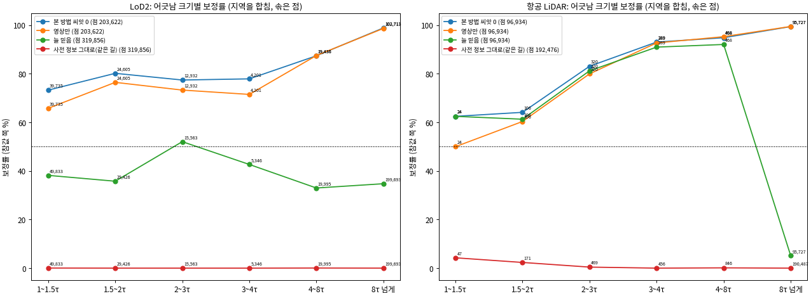
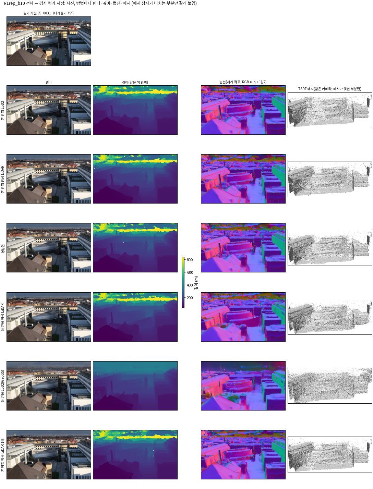

<!-- PHD-MAIN-STAGE1-v1 최종 보고 -->
# 본 실험 1단계 — 보고서 v1

- 작업: `PHD-MAIN-STAGE1-v1` (발주 2026-10-07). 실행 2026-10-07 13:04 ~ 10-08 13:00. `scientific_verdict: null`.
- 판독과 추천은 분석자(에이전트)의 판단이며, 사람 검수 전이다. 관문 판정표 밖에서 방법의 우열이나 2·3단계로 넘어갈지는 정하지 않는다(발주 8절).
- 일한 곳: 브랜치 `exp/main-experiment`, 별도 폴더 `JointBuildGS-exp`. 원래 작업 폴더는 고치지 않았다. 학습 코드 r12, 모듈 v6, `metrics_v1`·`metrics_v2`, 앞선 결과물은 고치지 않았다.
- 앞선 보고: [준비 보고](본실험_1단계_준비보고_v1.md), [중간 보고(B173과 이웃)](본실험_1단계_중간보고_B173nb_v1.md).
- **학습**: 계획 27회 가운데 25회는 결과가 있고, 2회(B173만의 본 방법 LoD2 씨앗 0, 영상만)는 GPU 메모리 부족으로 결과가 없다. 본 방법의 B173과 이웃 넷은 0단계 학습을 그대로 썼다.
- 산출 위치: 페이로드 `../JointBuildGS-artifacts/phase-payloads/phd/main_stage1_v1/PHD-MAIN-STAGE1-v1/`. 그림은 `figures/`, 지역별 전체 결과표와 지역 합산 표는 `tables/`에 있다.

## 0. 전체 과정에서의 위치

| 큰 단계 | 하는 일 | 상태 |
|---|---|---|
| 가~라 | 실험 설계, 저장소 정리, 0단계 시험 학습, 평가 지표와 관문 | 끝남 |
| 마. 본 실험 1단계 | 준비 → B173과 이웃 → 중간 보고 → R1 부채꼴 → B0 → GeoGS 네 번 → B173만 → **관문 판정(이 보고)** | **끝남.** B173만 둘은 GPU 메모리 부족으로 결과 없음 |
| 바. 본 실험 2·3단계 | 장치 빼기 9회와 민감도 6회, 영상 수 줄이기 18회와 반복 2회 | 사용자 결정 대기 |
| 사. 넓히기 | 찾기 범위 여덟 곳 | 1단계 결과를 보고 |
| 아. 결과 정리와 논문 | 7장 결과와 고찰, 전체 정리 | 마지막 |

## 1. 답 먼저

1. **관문은 통과 규칙을 만족한다. 미충족인 단위가 없다(2절).**
   - 조건 1(오류 차단, 늘 믿음과 견줌)은 세 단위가 충족이다. B0 LoD2(본 방법 12.0 %, GeoGS 43.6 %), R1 부채꼴 LoD2(7.6 %, 37.0 %), B173과 이웃 항공 LiDAR(0.0 %, 17.9 %)다.
     - B173과 이웃 LoD2(6.8 %, 10.2 %)는 차이가 r(8.22 %p)보다 작아 판별 불가다.
     - B0·R1의 항공 LiDAR는 표본이 262·555점이라 판별 불가다.
   - 조건 2(관측 오류, 문턱 이내)는 여섯 단위 모두 표본이 1만 점 아래라 '가를 수 없음'이다(준비 단계에서 예정).
   - 조건 3(상호 보완)은 R1 부채꼴이 충족이다(NMAD 6.04 cm, LoD2 그대로 17.85 cm). B173과 이웃은 판별 불가(차이 0.73 cm, r 5.20 cm), B0는 표본 514점이라 판별 불가다.
   - 조건 4(전제 위배 둘레의 완전성)는 여섯 단위 모두 충족이다.
2. **r을 키운 것은 표본이 적은 몇 칸이다.** 정의(모든 칸을 모음)대로 두었다.
   - 조건 1: B0 항공 LiDAR 칸의 두 씨앗이 47.7 · 37.8 %로 9.9 %p 다르다(표본 262점). 이 칸이 r을 8.22 %p로 키웠다.
   - 조건 3: B0 LoD2 칸의 NMAD가 129 · 124 cm다. 지붕 514점 위에 뜬 물체를 '가장 높은 교차'가 읽은 값으로 보인다(5.4절). 이 칸이 r을 5.20 cm로 키웠다.
   - 영상만 두 씨앗(B173과 이웃)의 차이는 조건 2 LoD2에서 3.0 %p로 r(2.20 %p)을 넘는다. 견줌의 반복 변동이 본 방법과 같다는 가정이 이 칸에서는 맞지 않는다.
3. **본 방법은 늘 믿음보다 틀린 사전 정보를 덜 들인다.**
   - LoD2: B0·R1 부채꼴은 GeoGS의 1/4~1/5이다(12.0 대 43.6 %, 7.6 대 37.0 %). B173과 이웃은 2/3이다(6.8 대 10.2 %).
   - 항공 LiDAR: B173과 이웃·B173만은 0 대 18~23 %다. R1 부채꼴은 25 대 48 %, B0는 43 대 54 %다(R1·B0는 표본 수백 점).
   - 늘 믿음은 틀린 면을 남기고, 지붕 위 부유 가우시안이 많다.
4. **영상만과는 많은 곳에서 비슷하다. 본 방법이 나은 곳은 '못 본 곳'과 'MVS가 빈 곳'이다.**
   - 사전 정보 오류 유입률: B173과 이웃 6.8 대 7.0~7.3 %, B0 12.0 대 13.3 %, R1 7.6 대 13.9 %다(LoD2).
   - 못 본 벽의 상속률은 본 방법 LoD2가 78~85 %, 영상만은 0이다. 가상 시점 메시가 그 벽을 0.5 m 안에 덮는 몫은 99 % 대 42~48 %다(B173과 이웃).
   - 결측 일치 영역(MVS가 비고 LoD2가 맞는 곳)의 완전성은 지역을 합쳐 0.2 m 안 93.3·92.5 % 대 90.1 %다.
   - F1(0.2 m)은 모든 단위에서 본 방법이 영상만보다 0.4~4.5 %p 높다.
5. **MVS가 틀리고 사전 정보가 맞는 곳에서는 본 방법도 MVS를 따라간다(5.1절).**
   - 전제 위배 영역 안(사전 정보와 MVS가 문턱 넘게 다르고 MVS가 틀린 곳)의 유입률이 영상만과 비슷하다. B173과 이웃 LoD2 61 % 대 59 %이고, GeoGS 25 %, LoD2 그대로 6.5 %다.
   - 조건 2의 값도 B173과 이웃에서 본 방법이 영상만보다 높다(65.9 대 57.2 %, 표본 부족).
6. **항공 LiDAR는 틀린 곳은 막지만 정확한 높이와 빈 곳 채우기는 물려받지 않는다(5.4·5.5절).**
   - 완만한 지붕 편향은 본 방법이 MVS를 따라간다(B173과 이웃 +6.9 cm, 항공 LiDAR 그대로 −1.3 cm).
   - 결측 일치 영역의 완전성은 지역을 합쳐 41.6·39.0 %이고, 늘 믿음은 86.0 %다.
   - B0·R1 부채꼴의 항공 LiDAR 사전 정보 오류 유입률은 영상만보다 높다(B0 42.8 대 22.1 %, 표본 262점).
7. **B173만(보고만 하는 지역)은 넷이 결과를 냈고 둘은 결과가 없다(5.7절).**
   - 본 방법 LoD2 씨앗 0과 영상만은 24 GB GPU를 넘었다. 영상을 CPU에 두고 GPU 1에서 다시 돌려도 마찬가지였다. 필요량은 약 24.3~24.4 GB였다.
   - 결과가 있는 셋(본 방법 LoD2 씨앗 1, 항공 LiDAR 씨앗 0·1)은 늘 믿음보다 유입률이 훨씬 낮다(LoD2 5.1 대 19.5 %, 항공 LiDAR 0.0·0.1 대 23.2 %).
8. **GeoGS(늘 믿음 LoD2)는 네 지역 모두 본 방법보다 나쁘다. 다만 주의가 둘 있다(6절).**
   - B173과 이웃의 DA3 묶음 하나가 0.13배로 어긋났다.
   - 저자 설정이 항공 장면에 맞춰진 것이 아니다. GeoGS에 불리한 조건일 수 있다.
9. **B173만의 결과 없는 둘을 같은 설정으로 돌리려면 48 GB GPU 한 장이 필요하다(9절).**

## 2. 최종 관문 판정표

s_r은 발주 2.3대로 칸마다 두 씨앗의 차이를 모았다. 조건 1·2·4는 일곱 칸(자유도 7), 조건 3은 LoD2 세 칸(자유도 3)이다. B173만 LoD2 칸은 씨앗 0이 없어 빠졌다. r은 조건 1·2·4가 %p, 조건 3이 cm다.

| 조건 | 단위 | 본 방법(씨앗 0·1 평균) | 견줌 | 차이(견줌 − 본 방법) | r | 표본 | 판정 |
|---|---|---|---|---|---|---|---|
| 1 오류 차단 | B0 · LoD2 | 12.0 % | 43.6 % (늘 믿음 LoD2(GeoGS)) | +31.58 | 8.22 | 32,880 | 충족 |
| 1 오류 차단 | B0 · 항공 LiDAR | 42.8 % | 54.2 % (늘 믿음 항공 LiDAR) | +11.45 | 8.22 | 262 | 판별 불가(표본 < 1만) |
| 1 오류 차단 | B173과 이웃 · LoD2 | 6.8 % | 10.2 % (늘 믿음 LoD2(GeoGS)) | +3.36 | 8.22 | 119,763 | 판별 불가 |
| 1 오류 차단 | B173과 이웃 · 항공 LiDAR | 0.0 % | 17.9 % (늘 믿음 항공 LiDAR) | +17.91 | 8.22 | 96,117 | 충족 |
| 1 오류 차단 | R1 부채꼴 · LoD2 | 7.6 % | 37.0 % (늘 믿음 LoD2(GeoGS)) | +29.33 | 8.22 | 54,345 | 충족 |
| 1 오류 차단 | R1 부채꼴 · 항공 LiDAR | 24.9 % | 47.6 % (늘 믿음 항공 LiDAR) | +22.71 | 8.22 | 555 | 판별 불가(표본 < 1만) |
| 2 관측 오류(문턱 이내) | B0 · LoD2 | 15.5 % | 15.6 % (영상만) | +0.13 | 2.20 | 384 | 판별 불가(표본 < 1만) |
| 2 관측 오류(문턱 이내) | B0 · 항공 LiDAR | 49.5 % | 51.5 % (영상만) | +2.04 | 2.20 | 489 | 판별 불가(표본 < 1만) |
| 2 관측 오류(문턱 이내) | B173과 이웃 · LoD2 | 65.9 % | 57.2 % (영상만) | -8.66 | 2.20 | 1,594 | 판별 불가(표본 < 1만) |
| 2 관측 오류(문턱 이내) | B173과 이웃 · 항공 LiDAR | 89.0 % | 86.3 % (영상만) | -2.69 | 2.20 | 3,388 | 판별 불가(표본 < 1만) |
| 2 관측 오류(문턱 이내) | R1 부채꼴 · LoD2 | 10.7 % | 12.2 % (영상만) | +1.55 | 2.20 | 615 | 판별 불가(표본 < 1만) |
| 2 관측 오류(문턱 이내) | R1 부채꼴 · 항공 LiDAR | 41.5 % | 42.5 % (영상만) | +1.03 | 2.20 | 1,506 | 판별 불가(표본 < 1만) |
| 3 상호 보완(NMAD) | B0 · LoD2 | 126.74 cm | 1.45 cm (LoD2 그대로(같은 길)) | -125.29 | 5.20 | 514 | 판별 불가(표본 < 1만) |
| 3 상호 보완(NMAD) | B173과 이웃 · LoD2 | 2.21 cm | 2.94 cm (LoD2 그대로(같은 길)) | +0.73 | 5.20 | 32,634 | 판별 불가 |
| 3 상호 보완(NMAD) | R1 부채꼴 · LoD2 | 6.04 cm | 17.85 cm (LoD2 그대로(같은 길)) | +11.81 | 5.20 | 76,434 | 충족 |
| 4 둘레 완전성 | B0 · LoD2 | 95.4 % | 94.5 % (영상만) | -0.93 | 0.94 | 78,950 | 충족 |
| 4 둘레 완전성 | B0 · 항공 LiDAR | 99.8 % | 99.1 % (영상만) | -0.72 | 0.94 | 34,677 | 충족 |
| 4 둘레 완전성 | B173과 이웃 · LoD2 | 95.6 % | 94.2 % (영상만) | -1.45 | 0.94 | 73,287 | 충족 |
| 4 둘레 완전성 | B173과 이웃 · 항공 LiDAR | 98.9 % | 97.2 % (영상만) | -1.71 | 0.94 | 14,136 | 충족 |
| 4 둘레 완전성 | R1 부채꼴 · LoD2 | 89.1 % | 88.3 % (영상만) | -0.77 | 0.94 | 34,789 | 충족 |
| 4 둘레 완전성 | R1 부채꼴 · 항공 LiDAR | 97.3 % | 94.1 % (영상만) | -3.17 | 0.94 | 43,186 | 충족 |

**통과 규칙**: '미충족'이 없다. 판단할 단위가 있는 조건 1(충족 3)·3(충족 1)·4(충족 6)마다 충족이 하나 이상이다. 조건 2는 판단할 단위가 없어 '가를 수 없음'이다. → **통과**.

**s_r과 칸마다 두 씨앗** (★ = 그 칸의 차이가 r을 넘음)

| 조건 | s_r | 자유도 | r = 2.8 s_r | 칸마다 두 씨앗 (씨앗 0 / 1, 차이) |
|---|---|---|---|---|
| 1 | 2.93 %p | 7 | 8.22 %p | B0 LoD2 12.10 / 11.86 (0.24); B0 항공 LiDAR 47.71 / 37.79 (9.92 ★); B173과 이웃 LoD2 6.54 / 7.08 (0.54); B173과 이웃 항공 LiDAR 0.02 / 0.03 (0.01); B173만 LoD2 —; B173만 항공 LiDAR 0.04 / 0.06 (0.02); R1 부채꼴 LoD2 8.51 / 6.76 (1.75); R1 부채꼴 항공 LiDAR 27.03 / 22.70 (4.33) |
| 2 | 0.79 %p | 7 | 2.20 %p | B0 LoD2 14.84 / 16.15 (1.31); B0 항공 LiDAR 49.28 / 49.69 (0.41); B173과 이웃 LoD2 66.25 / 65.50 (0.75); B173과 이웃 항공 LiDAR 89.20 / 88.84 (0.36); B173만 LoD2 —; B173만 항공 LiDAR 87.54 / 87.45 (0.09); R1 부채꼴 LoD2 10.73 / 10.57 (0.16); R1 부채꼴 항공 LiDAR 42.70 / 40.24 (2.46 ★) |
| 3 | 1.86 cm | 3 | 5.20 cm | B0 LoD2 128.99 / 124.49 (4.50); B173과 이웃 LoD2 2.24 / 2.17 (0.07); B173만 LoD2 —; R1 부채꼴 LoD2 6.37 / 5.70 (0.67) |
| 4 | 0.34 %p | 7 | 0.94 %p | B0 LoD2 95.29 / 95.50 (0.21); B0 항공 LiDAR 99.81 / 99.82 (0.01); B173과 이웃 LoD2 95.62 / 95.60 (0.02); B173과 이웃 항공 LiDAR 98.87 / 98.88 (0.01); B173만 LoD2 —; B173만 항공 LiDAR 98.18 / 98.52 (0.34); R1 부채꼴 LoD2 89.20 / 88.98 (0.22); R1 부채꼴 항공 LiDAR 97.90 / 96.73 (1.17 ★) |

**견줌(영상만)의 씨앗 차이** (B173과 이웃, 발주 2.3의 같은 변동 가정 점검)

| 조건 · 단위 | 영상만 씨앗 0 / 1 | 차이 | 본 방법으로 낸 r |
|---|---|---|---|
| 2 · LoD2 | 57.21 / 60.23 % | **3.02** %p | 2.20 %p |
| 2 · 항공 LiDAR | 86.33 / 86.39 % | 0.06 %p | 2.20 %p |
| 4 · LoD2 | 94.16 / 94.51 % | 0.35 %p | 0.94 %p |
| 4 · 항공 LiDAR | 97.16 / 97.88 % | 0.72 %p | 0.94 %p |

- 읽는 법: 판정은 '본 방법 두 씨앗의 평균'과 '견줌 하나'의 차이가 r을 넘는지로 했다. 견줌이 자기 씨앗에서 r보다 크게 흔들리는 칸(굵게)에서는 판정이 그 흔들림을 담지 못한다.
- 중간 보고의 잠정 판정과 같다. 그때 없던 GeoGS가 들어와 조건 1 LoD2 칸이 채워졌다. 모든 칸이 들어오면서 r이 커져, B173과 이웃 LoD2의 조건 3이 '충족'에서 '판별 불가'로 바뀌었다.

## 3. 대표 자리: 판별 지도와 단면

판별 지도 읽는 법: 위 줄은 LoD2, 아래 줄은 항공 LiDAR 단위다. 사전 정보 오류 영역과 관측 오류 영역의 솎은 참값 점(|W − 참값| ≥ 0.2 m)을, 결과 메시가 참값 쪽(초록), 틀린 자료 쪽(빨강), 둘 다(주황), 둘 다 아님(회색)에 있는지로 칠했다. 열은 본 방법 씨앗 0, 영상만, 늘 믿음(LoD2는 GeoGS)이다.

- B173과 이웃: 남쪽 날개(참값이 LoD2보다 7 m 낮음)는 모든 학습 결과가 초록이다. 톱니 유리 지붕 줄은 관측 오류 영역이라, 본 방법과 영상만이 같이 빨강을 띤다. GeoGS는 날개 둘레와 길에 빨강·회색이 넓다.

- R1 부채꼴: LoD2 단위에서 본 방법은 참값 쪽 73 %, 틀린 쪽 7 %다. 영상만은 68·8 %, GeoGS는 47·15 %다. 부채꼴 안쪽 띠(반투명 지붕과 낮은 지붕)에서 GeoGS의 빨강이 많다. 항공 LiDAR 단위는 늘 믿음이 참값 쪽 88 %로 본 방법(25 %)보다 높다. 이 단위의 사전 정보 오류 표본은 555점뿐이다.

- B0와 B173만도 같은 방식으로 읽는다. B173만은 본 방법 LoD2 씨앗 0과 영상만이 없어 '결과 없음'이다.

단면 읽는 법: 자리는 학습 결과 전에 규칙으로 정했다(`sections_v1.json`). 검정은 참값, 주황은 MVS 점, 빨강·초록 굵은 선은 LoD2·항공 LiDAR, 가는 선은 결과 메시다(갈색은 GeoGS). 점은 단면 ±0.25 m 안의 것이다.

- 남쪽 날개: 두 사전 정보는 −20~−22 m의 옛 박공지붕이다. 참값·MVS·본 방법·영상만은 −27.6 m의 평지붕에 모인다. GeoGS(갈색)는 옛 지붕 높이와 그 사이에 조각을 남긴다.
- 톱니 유리 지붕: 참값 점이 유리 위·안·바닥에 흩어져 있어 한 면이 아니다. 결과는 MVS의 톱니를 따른다.

- 낮은 지붕: 참값은 계단꼴, LoD2는 −29.5 m 한 높이다. 결과 메시는 MVS를 따라 비스듬히 지난다.
- 반투명 지붕: LoD2가 실제 곡면보다 최대 1.4 m 높다. 결과는 곡면(참값)을 따른다.

- B0 벽과 처마: 벽(x ≈ −0.3 m)과 처마 아래 참값이 촘촘하다. LoD2 벽(빨강)은 0.3 m 바깥, 항공 LiDAR(초록)는 기울어 있다.

## 4. 주 결과표: 조건별 값

조건 1~4의 값은 2절과 같다. 아래는 같은 결과로 본 전체 형상 요약이다. 본 방법은 '씨앗 0·씨앗 1', B173만 LoD2는 씨앗 1만 있다(괄호 1).

**F1 @0.2 m (%)**

| 단위 | 본 방법 0·1 | 영상만 | 늘 믿음 | 그대로(같은 길) |
|---|---|---|---|---|
| B173과 이웃 · LoD2 | 78.9·78.7 | 76.9 | 29.0 | 49.8 |
| B173과 이웃 · 항공 LiDAR | 79.4·80.0 | 76.9 | 39.7 | 37.0 |
| R1 부채꼴 · LoD2 | 67.4·69.1 | 67.0 | 47.4 | 37.8 |
| R1 부채꼴 · 항공 LiDAR | 71.1·71.5 | 67.0 | 76.4 | 73.7 |
| B0 · LoD2 | 63.7·63.4 | 62.6 | 46.5 | 55.2 |
| B0 · 항공 LiDAR | 64.6·63.5 | 62.6 | 60.2 | 46.6 |
| B173만 · LoD2 | 75.4(1) | — | 30.2 | 31.5 |
| B173만 · 항공 LiDAR | 75.4·75.8 | — | 24.7 | 20.1 |

**Chamfer 평균 (m)**

| 단위 | 본 방법 0·1 | 영상만 | 늘 믿음 | 그대로(같은 길) |
|---|---|---|---|---|
| B173과 이웃 · LoD2 | 0.216·0.203 | 0.206 | 1.345 | 1.044 |
| B173과 이웃 · 항공 LiDAR | 0.188·0.190 | 0.206 | 1.016 | 1.285 |
| R1 부채꼴 · LoD2 | 0.452·0.310 | 0.315 | 0.529 | 0.617 |
| R1 부채꼴 · 항공 LiDAR | 0.313·0.311 | 0.315 | 0.237 | 0.233 |
| B0 · LoD2 | 1.233·1.217 | 1.196 | 1.270 | 1.323 |
| B0 · 항공 LiDAR | 1.193·1.328 | 1.196 | 1.242 | 1.512 |
| B173만 · LoD2 | 0.199(1) | — | 0.926 | 1.420 |
| B173만 · 항공 LiDAR | 0.203·0.202 | — | 1.330 | 1.897 |

- 읽는 법: F1과 Chamfer는 건물 표면의 참값 점과 결과 메시 표본을 서로 견준 값이다(지붕·벽 모두, 상자 안 건물 칸).
  - 본 방법은 모든 단위에서 영상만보다 F1이 0.4~4.5 %p 높다.
  - B0는 모든 방법의 Chamfer가 1.2~1.5 m다. 본 방법만의 문제가 아니라, 이 상자의 건물 칸에 결과가 닿지 않는 넓은 곳(지붕 위 물체 등)이 있어서로 보인다(분석자 판독).
  - R1 부채꼴 항공 LiDAR는 늘 믿음(76.4 %)과 항공 LiDAR 그대로(73.7 %)가 본 방법(71.1·71.5 %)보다 높다.

## 5. 보고 항목 (발주 5절)

### 5.1 오류 유입률: 기록 영역, 의심 표시, 전제 위배 영역 안

**이중 오류 영역(기록)의 유입률 (%)**

| 단위 | 본 방법 0·1 | 영상만 | 늘 믿음 | 그대로(같은 길) |
|---|---|---|---|---|
| B173과 이웃 · LoD2 | 40.3·40.4 | 39.2 | 37.1 | 98.9 |
| B173과 이웃 · 항공 LiDAR | 0.6·0.6 | 0.5 | 13.9 | 100.0 |
| R1 부채꼴 · LoD2 | 9.9·9.1 | 9.0 | 59.3 | 96.0 |
| R1 부채꼴 · 항공 LiDAR | 38.4·42.6 | 35.3 | 57.8 | 97.7 |
| B0 · LoD2 | 51.9·49.3 | 46.6 | 53.2 | 99.1 |
| B0 · 항공 LiDAR | 82.1·77.6 | 77.6 | 80.3 | 96.7 |
| B173만 · LoD2 | 33.0(1) | — | 29.0 | 98.9 |
| B173만 · 항공 LiDAR | 0.7·0.7 | — | 15.8 | 100.0 |

**결측 사전 정보 오류 영역(기록)의 유입률 (%)**

| 단위 | 본 방법 0·1 | 영상만 | 늘 믿음 | 그대로(같은 길) |
|---|---|---|---|---|
| B173과 이웃 · LoD2 | 21.8·19.7 | 18.9 | 34.2 | 94.6 |
| B173과 이웃 · 항공 LiDAR | 0.0·0.0 | 0.0 | 30.2 | 100.0 |
| R1 부채꼴 · LoD2 | 2.1·2.2 | 0.8 | 19.0 | 95.8 |
| R1 부채꼴 · 항공 LiDAR | 3.3·0.0 | 0.0 | 80.0 | 96.7 |
| B0 · LoD2 | 16.7·8.3 | 4.2 | 21.4 | 98.2 |
| B173만 · LoD2 | 10.5(1) | — | 44.8 | 94.3 |
| B173만 · 항공 LiDAR | 0.0·0.0 | — | 50.0 | 100.0 |

**관측 오류 문턱 이내, 의심 표시를 뺀 유입률 (%)**

| 단위 | 본 방법 0·1 | 영상만 | 늘 믿음 | 그대로(같은 길) |
|---|---|---|---|---|
| B173과 이웃 · LoD2 | 69.1·67.6 | 58.1 | 28.5 | 47.2 |
| B173과 이웃 · 항공 LiDAR | 93.1·93.1 | 90.8 | 53.3 | 4.4 |
| R1 부채꼴 · LoD2 | 7.9·9.1 | 10.8 | 20.2 | 42.4 |
| R1 부채꼴 · 항공 LiDAR | 41.2·38.5 | 40.9 | 27.2 | 11.6 |
| B0 · LoD2 | 15.0·16.1 | 15.8 | 46.7 | 41.2 |
| B0 · 항공 LiDAR | 44.9·43.9 | 43.6 | 28.7 | 13.5 |
| B173만 · LoD2 | 68.5(1) | — | 34.8 | 47.5 |
| B173만 · 항공 LiDAR | 88.0·87.8 | — | 48.0 | 5.0 |

**전제 위배 영역 안의 유입률 (%)**

| 단위 | 본 방법 0·1 | 영상만 | 늘 믿음 | 그대로(같은 길) |
|---|---|---|---|---|
| B173과 이웃 · LoD2 | 61.3·59.9 | 58.8 | 24.6 | 6.5 |
| B173과 이웃 · 항공 LiDAR | 80.6·80.8 | 84.0 | 46.6 | 0.5 |
| R1 부채꼴 · LoD2 | 20.1·20.8 | 20.1 | 9.6 | 0.4 |
| R1 부채꼴 · 항공 LiDAR | 41.3·41.0 | 45.6 | 4.8 | 1.6 |
| B0 · LoD2 | 21.1·21.4 | 21.1 | 13.0 | 2.3 |
| B0 · 항공 LiDAR | 33.7·34.0 | 32.0 | 10.6 | 2.5 |
| B173만 · LoD2 | 44.7(1) | — | 16.1 | 3.7 |
| B173만 · 항공 LiDAR | 84.2·84.2 | — | 32.0 | 0.4 |

- 읽는 법: 유입률은 틀린 자료 쪽에 선 참값 점(솎음)의 몫이라 낮을수록 좋다.
  - 이중 오류와 결측 사전 정보 오류는 기록용 영역이다(관문에 쓰지 않음).
  - 의심 표시를 빼도 조건 2의 값은 1~3 %p만 움직인다.
- **판독**: 전제 위배 영역 안에서 본 방법은 영상만과 같은 수준(B173과 이웃 LoD2 61 대 59 %)이다. 늘 믿음(GeoGS 25 %)이나 사전 정보 그대로(6.5 %)보다 높다.
  - 이 영역은 '관측이 맞다'는 전제가 깨진 곳이라, 판정이 사전 정보를 놓아주고 MVS의 오류를 받는다. 설계에서 예상한 한계가 그대로 나온다.
- 판별 불가 비율(|W − 참값| < 0.2 m의 몫)은 결과와 무관하게 단위마다 같다. 지역별 전체 표(`tables/results_<지역>.md`)에 있다.

### 5.2 과거 형상 잔존율

**사전 정보 오류 (%)**

| 단위 | 본 방법 0·1 | 영상만 | 늘 믿음 | 그대로(같은 길) |
|---|---|---|---|---|
| B173과 이웃 · LoD2 | 0.9·0.9 | 0.0 | — | — |
| B173과 이웃 · 항공 LiDAR | 0.1·0.1 | 0.0 | 1.3 | — |
| R1 부채꼴 · LoD2 | 4.2·2.9 | 0.0 | — | — |
| R1 부채꼴 · 항공 LiDAR | 9.9·13.2 | 0.0 | 25.3 | — |
| B0 · LoD2 | 11.4·12.6 | 0.0 | — | — |
| B0 · 항공 LiDAR | 16.7·4.8 | 0.0 | 21.4 | — |
| B173만 · LoD2 | 1.0(1) | — | — | — |
| B173만 · 항공 LiDAR | 0.1·0.2 | — | 1.4 | — |

**관측 오류, 출신 무관 (%)**

| 단위 | 본 방법 0·1 | 영상만 | 늘 믿음 | 그대로(같은 길) |
|---|---|---|---|---|
| B173과 이웃 · LoD2 | 23.7·22.4 | 13.9 | — | — |
| B173과 이웃 · 항공 LiDAR | 22.5·22.2 | 14.4 | 13.8 | — |
| R1 부채꼴 · LoD2 | 3.1·3.3 | 2.6 | — | — |
| R1 부채꼴 · 항공 LiDAR | 6.5·7.2 | 6.3 | 4.3 | — |
| B0 · LoD2 | 16.1·16.8 | 10.4 | — | — |
| B0 · 항공 LiDAR | 36.2·31.1 | 17.3 | 33.9 | — |
| B173만 · LoD2 | 10.8(1) | — | — | — |
| B173만 · 항공 LiDAR | 27.9·30.7 | — | 17.7 | — |

- 읽는 법: 틀린 사전 정보 면에서 0.5 m 넘게 떨어진 곳의 패치 가운데, 사전 정보 출신 가우시안(불투명도 0.5 이상)이 0.25 m 안에 남은 몫이다.
  - 영상만은 사전 정보 출신이 없어 0이다. GeoGS는 출신 기록이 없어 '—'다.
  - B0 LoD2에서 본 방법은 11~13 %, R1 항공 LiDAR에서는 10~13 %가 남는다. 늘 믿음 항공 LiDAR는 R1·B0에서 21~25 %다.

### 5.3 부유 가우시안

**3~20 m 부유 가우시안 (개)**

| 단위 | 본 방법 0·1 | 영상만 | 늘 믿음 | 그대로(같은 길) |
|---|---|---|---|---|
| B173과 이웃 · LoD2 | 55·165 | 0 | 1136 | — |
| B173과 이웃 · 항공 LiDAR | 6·11 | 0 | 1076 | — |
| R1 부채꼴 · LoD2 | 0·0 | 0 | 0 | — |
| R1 부채꼴 · 항공 LiDAR | 0·0 | 0 | 73 | — |
| B0 · LoD2 | 1037·1116 | 901 | 819 | — |
| B0 · 항공 LiDAR | 1020·1056 | 901 | 1201 | — |
| B173만 · LoD2 | 53(1) | — | 84323 | — |
| B173만 · 항공 LiDAR | 8·9 | — | 480 | — |

- 읽는 법: 평가 범위 안에서, 위에서 본 참값 최고면보다 3 m 넘게 뜬 불투명 가우시안을 옆에서 본 것이다. 빨강은 사전 정보 출신, 파랑은 영상 출신이다. GeoGS는 출신 기록이 없다.
- **B0의 800~1,200개는 모든 방법에서 같은 자리(u 95~97 m, 건물 가장자리 옆 낮은 곳 위 −25~−40 m)에 모여 있다.** 참값 최고면에 없는 실제 물체(나무 등)일 가능성이 크다(분석자 판독).
- B173과 이웃 늘 믿음 항공 LiDAR(1,076개), GeoGS(1,136개)와 B173만 GeoGS(84,323개)는 지붕 위에 넓게 떠 있다.
- 다른 지역 그림: `figures/floating_<지역>.png`.

### 5.4 기하 정확도: 편향과 산포

편향 옆의 참고값(MVS − 참값)은 지역 지면과 같은 건물들 완만한 지붕의 값이다(`tables/refbias.md`).

| 지역 | 지면 MVS − 참값 | 완만한 지붕 MVS − 참값 (LoD2 행 / 항공 LiDAR 행) |
|---|---|---|
| B173과 이웃 | +0.2 cm | +7.5 / +7.5 cm (이웃 4959460 +7.6, B173 −9.5) |
| R1 부채꼴 | +1.8 cm | −4.6 / −3.6 cm |
| B0 | −0.9 cm | +4.1 / +2.0 cm |
| B173만 | +8.4 cm | −0.8 / −4.8 cm |

**완만한 지붕 편향 (cm)**

| 단위 | 본 방법 0·1 | 영상만 | 늘 믿음 | 그대로(같은 길) |
|---|---|---|---|---|
| B173과 이웃 · LoD2 | +7.1·+7.2 | +7.1 | +71.4 | +9.7 |
| B173과 이웃 · 항공 LiDAR | +6.9·+6.9 | +7.0 | +2.3 | -1.3 |
| R1 부채꼴 · LoD2 | -4.1·-6.0 | -5.6 | +6.1 | -11.0 |
| R1 부채꼴 · 항공 LiDAR | -4.6·-4.8 | -5.1 | -4.8 | -5.4 |
| B0 · LoD2 | +69.8·+43.5 | +35.6 | +1056.7 | +0.9 |
| B0 · 항공 LiDAR | -0.9·-0.6 | -1.4 | -1.5 | -2.0 |
| B173만 · LoD2 | +2.7(1) | — | +6.7 | +10.3 |
| B173만 · 항공 LiDAR | -4.6·-4.4 | — | +0.2 | -0.3 |

**완만한 지붕 산포 NMAD (cm)**

| 단위 | 본 방법 0·1 | 영상만 | 늘 믿음 | 그대로(같은 길) |
|---|---|---|---|---|
| B173과 이웃 · LoD2 | 2.2·2.2 | 2.3 | 17.1 | 2.9 |
| B173과 이웃 · 항공 LiDAR | 2.4·2.3 | 2.5 | 2.1 | 1.8 |
| R1 부채꼴 · LoD2 | 6.4·5.7 | 5.4 | 27.3 | 17.8 |
| R1 부채꼴 · 항공 LiDAR | 4.7·5.0 | 5.5 | 3.0 | 2.3 |
| B0 · LoD2 | 129.0·124.5 | 115.8 | 577.6 | 1.5 |
| B0 · 항공 LiDAR | 5.1·5.4 | 5.4 | 4.0 | 2.9 |
| B173만 · LoD2 | 5.8(1) | — | 9.9 | 1.6 |
| B173만 · 항공 LiDAR | 10.3·10.0 | — | 5.3 | 2.0 |

**가파른 지붕 편향 (cm)**

| 단위 | 본 방법 0·1 | 영상만 | 늘 믿음 | 그대로(같은 길) |
|---|---|---|---|---|
| B173과 이웃 · LoD2 | -8.6·-8.6 | -8.3 | -11.8 | -7.5 |
| B173과 이웃 · 항공 LiDAR | -8.0·-8.6 | -8.4 | -2.1 | -1.3 |
| R1 부채꼴 · 항공 LiDAR | -3.9·-5.1 | -4.4 | -3.7 | -4.0 |
| B0 · LoD2 | -1.1·-1.1 | -1.2 | +5.1 | -7.4 |
| B0 · 항공 LiDAR | -0.9·-1.1 | -1.3 | -1.2 | -1.2 |
| B173만 · LoD2 | -8.5(1) | — | +3.8 | -7.3 |
| B173만 · 항공 LiDAR | -9.8·-9.5 | — | -2.9 | -1.1 |

**가파른 지붕 산포 NMAD (cm)**

| 단위 | 본 방법 0·1 | 영상만 | 늘 믿음 | 그대로(같은 길) |
|---|---|---|---|---|
| B173과 이웃 · LoD2 | 6.0·6.5 | 6.3 | 15.0 | 7.3 |
| B173과 이웃 · 항공 LiDAR | 7.7·7.9 | 8.6 | 5.7 | 2.3 |
| R1 부채꼴 · 항공 LiDAR | 6.3·6.7 | 6.7 | 4.1 | 3.5 |
| B0 · LoD2 | 3.5·3.5 | 3.7 | 13.4 | 3.6 |
| B0 · 항공 LiDAR | 3.6·3.5 | 3.8 | 2.9 | 2.5 |
| B173만 · LoD2 | 6.5(1) | — | 11.6 | 7.4 |
| B173만 · 항공 LiDAR | 6.3·6.5 | — | 5.4 | 2.2 |

**띠 편향 (cm)**

| 단위 | 본 방법 0·1 | 영상만 | 늘 믿음 | 그대로(같은 길) |
|---|---|---|---|---|
| B173과 이웃 · LoD2 | +5.8·+5.8 | +5.7 | +23.6 | +6.1 |
| B173과 이웃 · 항공 LiDAR | +6.2·+6.2 | +6.4 | +1.9 | -1.5 |
| R1 부채꼴 · LoD2 | -0.2·-1.6 | -0.9 | +0.7 | -24.3 |
| R1 부채꼴 · 항공 LiDAR | -1.6·-1.9 | -2.0 | -2.9 | -4.6 |
| B0 · LoD2 | -1.2·-1.5 | -1.2 | +10.3 | -8.2 |
| B0 · 항공 LiDAR | -1.0·-1.5 | -1.2 | -1.5 | -1.8 |
| B173만 · LoD2 | +0.2(1) | — | +9.6 | +1.5 |
| B173만 · 항공 LiDAR | -0.1·-0.2 | — | +0.9 | -1.0 |

**벽 편향 (cm)**

| 단위 | 본 방법 0·1 | 영상만 | 늘 믿음 | 그대로(같은 길) |
|---|---|---|---|---|
| B173과 이웃 · LoD2 | -3.7·-3.6 | -3.9 | +12.6 | -1.6 |
| R1 부채꼴 · LoD2 | +2.7·+1.6 | +2.6 | +8.3 | +4.8 |
| B0 · LoD2 | -1.8·-1.7 | -2.1 | +23.2 | +19.7 |
| B173만 · LoD2 | -4.4(1) | — | +6.3 | -2.2 |

- **학습 결과의 편향은 MVS의 편향을 따라간다.** 본 방법과 영상만이 같은 쪽, 같은 크기로 치우친다(B173과 이웃 +7, R1 −4~−6 cm).
- **항공 LiDAR의 산포**(항공 LiDAR 단위): 본 방법의 완만한 지붕 NMAD 2.3~10.3 cm는 항공 LiDAR 그대로(1.8~2.9 cm)보다 크다. 가파른 지붕도 같다(3.5~7.9 대 2.2~3.5 cm). 항공 LiDAR의 정밀함을 물려받지 않는다.
- **B0 LoD2의 완만한 지붕 값(편향 +36~+70 cm, NMAD 116~129 cm, GeoGS +10.6 m)은 측정의 한계로 본다.**
  - 점 514개가 건물 4959324 지붕 하나에 있다.
  - '수직선의 가장 높은 교차'를 읽는데, 지붕 위 물체(5.3절의 같은 자리)가 먼저 걸린 것으로 보인다. 사전 정보 그대로는 +0.9 / 1.5 cm다.
  - 조건 3에서는 표본 부족으로 판별 불가지만, s_r에는 들어가 r을 키웠다(2절).

### 5.5 결측·비가시 영역의 완전성과 상속률 (지역을 합침)

| 방법 | 결측 일치 | 비가시 일치 | 지역 |
|---|---|---|---|
| 본 방법 0 | 93.3 / 97.8 (19,459) | 75.0 / 90.0 (20) | 3 |
| 본 방법 1 | 92.5 / 98.5 (19,459) | 75.0 / 90.0 (20) | 3 |
| 영상만 0 | 90.1 / 97.0 (19,459) | 50.0 / 90.0 (20) | 3 |
| 영상만 1 | 92.9 / 97.7 (6,314) | 76.5 / 88.2 (17) | 1 |
| 늘 믿음(GeoGS) | 57.9 / 97.7 (19,459) | 80.0 / 100.0 (20) | 3 |
| 그대로(같은 길) | 51.8 / 99.6 (19,459) | 100.0 / 100.0 (20) | 3 |

| 방법 | 결측 일치 | 비가시 일치 | 지역 |
|---|---|---|---|
| 본 방법 0 | 41.6 / 51.2 (692) | 40.0 / 40.0 (10) | 4 |
| 본 방법 1 | 39.0 / 47.5 (692) | 40.0 / 40.0 (10) | 4 |
| 1배 0 | 46.2 / 58.2 (560) | 0.0 / 0.0 (6) | 2 |
| 영상만 0 | 38.8 / 45.0 (671) | 25.0 / 25.0 (8) | 3 |
| 영상만 1 | 0.0 / 0.0 (111) | 100.0 / 100.0 (2) | 1 |
| 늘 믿음 | 86.0 / 95.7 (692) | 40.0 / 40.0 (10) | 4 |
| 그대로(같은 길) | 99.9 / 100.0 (692) | 100.0 / 100.0 (10) | 4 |

| 단위 · 방법 | 상속률 (%) | 못 본 곳 과거 형상 (%) | 패치 | 지역 |
|---|---|---|---|---|
| LoD2/prop_LoD2_s0 | 81.1 | 6.5 | 15,366 / 2,991 | B173nb_b10 |
| LoD2/prop_LoD2_s1 | 77.6 | 8.6 | 15,366 / 2,991 | B173nb_b10 |
| LoD2/imgonly_s0 | 0.0 | 0.0 | 15,366 / 2,991 | B173nb_b10 |
| LoD2/imgonly_s1 | 0.0 | 0.0 | 15,366 / 2,991 | B173nb_b10 |
| ALS/prop_ALS_s0 | 5.3 | 0.2 | 30,735 / 5,975 | B173nb_b10, B173_b0 |
| ALS/prop_ALS_s1 | 5.4 | 0.2 | 30,735 / 5,975 | B173nb_b10, B173_b0 |
| ALS/imgonly_s0 | 0.0 | 0.0 | 15,366 / 2,991 | B173nb_b10 |
| ALS/imgonly_s1 | 0.0 | 0.0 | 15,366 / 2,991 | B173nb_b10 |
| ALS/trust_ALS | 4.2 | 1.7 | 30,735 / 5,975 | B173nb_b10, B173_b0 |

- 읽는 법: 한 사전 정보의 방법들은 모두 본 방법 두 씨앗이 있는 지역끼리 합쳤다(LoD2 세 지역, 항공 LiDAR 네 지역). 결과가 없는 지역은 그 방법의 합에서 빠진다(영상만 항공 LiDAR는 B173만 없음).
- 못 본 곳 상속률은 B173 지역의 못 본 벽에서만 잰다. B173만 LoD2는 씨앗 0이 없어 합에 들지 않았다. 씨앗 1의 상속률은 84.5 %다.
- 비가시 일치 영역은 점이 10~20개뿐이라 값이 크게 흔들린다.

- 읽는 법: B173의 못 본 긴 벽(LoD2 면 53)을 펼친 모습이다. 맨 위는 학습 전 판정(초록 = 물려받아야 할 곳, 빨강 = 지붕보다 위에 남은 옛 벽)이다. 그 아래는 방법마다 가상 시점 메시를 가까운 가우시안의 출신으로 칠한 것이다.
  - 본 방법 LoD2는 벽을 사전 정보 출신으로 채운다. 영상만은 이 벽에 메시가 거의 없다. GeoGS는 출신 기록이 없어 회색이다.

### 5.6 보정률 곡선과 보정 경계

| 방법 | 묶인 구간: 보정률 (점) | 합친 경계 (τ) | 지역별 경계 (τ) |
|---|---|---|---|
| 본 방법 0 | 1~1.5τ: 73 (39,735); 1.5~2τ: 80 (24,605); 2~3τ: 77 (12,932); 3~8τ: 86 (23,637); 8~τ: 99 (102,713) | 1.0 | B0 1.0, B173nb 1.5, R1rep 1.0 |
| 본 방법 1 | 1~1.5τ: 75 (39,735); 1.5~2τ: 79 (24,605); 2~3τ: 80 (12,932); 3~8τ: 85 (23,637); 8~τ: 99 (102,713) | 1.0 | B0 1.0, B173nb 1.5, R1rep 1.0 |
| 영상만 0 | 1~1.5τ: 66 (39,735); 1.5~2τ: 76 (24,605); 2~3τ: 73 (12,932); 3~8τ: 85 (23,637); 8~τ: 99 (102,713) | 1.0 | B0 1.0, B173nb 1.5, R1rep 1.0 |
| 영상만 1 | 1~1.5τ: 46 (12,501); 1.5~8τ: 60 (10,100); 8~τ: 100 (96,998) | 1.5 | B173nb 1.5 |
| 늘 믿음(GeoGS) | 1~1.5τ: 38 (39,735); 1.5~2τ: 36 (24,605); 2~3τ: 53 (12,932); 3~8τ: 36 (23,637); 8~τ: 60 (102,713) | 8.0 | B0 1.5, B173nb 8.0, R1rep — |
| 그대로(같은 길) | 1~1.5τ: 0 (39,735); 1.5~2τ: 0 (24,605); 2~3τ: 0 (12,932); 3~8τ: 0 (23,637); 8~τ: 0 (102,713) | — | B0 —, B173nb —, R1rep — |

| 방법 | 묶인 구간: 보정률 (점) | 합친 경계 (τ) | 지역별 경계 (τ) |
|---|---|---|---|
| 본 방법 0 | 1~τ: 100 (192,476) | 1.0 | B0 1.0, B173nb 1.0, B173 1.0, R1rep — |
| 본 방법 1 | 1~τ: 100 (192,476) | 1.0 | B0 1.0, B173nb 1.0, B173 1.0, R1rep 1.0 |
| 1배 0 | 1~τ: 51 (817) | 1.0 | B0 1.0, R1rep — |
| 영상만 0 | 1~τ: 99 (96,934) | 1.0 | B0 1.0, B173nb 1.0, R1rep 1.0 |
| 영상만 1 | 1~τ: 100 (96,117) | 1.0 | B173nb 1.0 |
| 늘 믿음 | 1~τ: 6 (192,476) | — | B0 —, B173nb —, B173 —, R1rep — |
| 그대로(같은 길) | 1~τ: 0 (192,476) | — | B0 —, B173nb —, B173 —, R1rep — |

- 읽는 법: 사전 정보 오류 영역의 참값 점을 사전 정보가 틀린 크기(τ의 배수)로 나눈다. 1만 점 아래 구간은 다음 구간과 묶는다(지표 정의). 묶인 구간마다 참값 쪽에 선 몫을 적었다. 경계는 그 구간부터 모두 50 % 이상인 첫 구간의 아래 끝이다.
  - LoD2: 본 방법의 합친 경계는 1τ다. 1~1.5τ의 보정률은 73·75 %로, 영상만(66 %)보다 높고 GeoGS(38 %)보다 훨씬 높다.
  - 항공 LiDAR: 앞 구간들의 점이 적어 모두 한 구간으로 묶인다. 본 방법 100 %, 늘 믿음 6 %다. 지역별 경계는 표의 오른쪽 열이다.

### 5.7 B173만의 값 (보고만 하는 지역)

| 지표 | 본 방법 LoD2 씨앗 1 | GeoGS | 본 방법 항공 LiDAR 0·1 | 늘 믿음 항공 LiDAR |
|---|---|---|---|---|
| 사전 정보 오류 유입률 (%) | 5.1 | 19.5 | 0.0·0.1 | 23.2 |
| 관측 오류 문턱 이내 유입률 (%) | 68.0 | 35.3 | 87.5·87.5 | 48.8 |
| 둘레 완전성 0.2 m (%) | 95.0 | 84.4 | 98.2·98.5 | 99.4 |
| 완만한 지붕 편향 / NMAD (cm) | +2.7 / 5.8 | +6.7 / 9.9 | −4.6 / 10.3 · −4.4 / 10.0 | +0.2 / 5.3 |
| 못 본 곳 상속률 (%) | 84.5 | — | 5.6·5.4 | 4.1 |
| F1 @0.2 m (%) | 75.4 | 30.2 | 75.4·75.8 | 24.7 |

- 결과 없음: 본 방법 LoD2 씨앗 0(네 번), 영상만(두 번). 모두 GPU 메모리 부족이다(8·9절). 영상만이 없어 조건 2·4의 견줌 값이 없다.
- B173만 LoD2 칸은 s_r에 들지 않았고, 항공 LiDAR 칸은 들었다(두 씨앗 차이 0.02~0.34 %p).
- 지역 전체 표: `tables/results_B173_b0.md`.

### 5.8 항공 LiDAR 1배(1τ)와 2배(2τ) 버리는 규칙

| 지표 | R1rep_b10/prop_ALS_s0 | R1rep_b10/prop_ALS_s1 | R1rep_b10/prop_ALS1x_s0 | B0_b10/prop_ALS_s0 | B0_b10/prop_ALS_s1 | B0_b10/prop_ALS1x_s0 |
|---|---|---|---|---|---|---|
| 유입률 · 사전 정보 오류 (%) | 27.03 | 22.7 | 21.62 | 47.71 | 37.79 | 35.5 |
| 유입률 · 관측 오류 문턱 이내 (%) | 42.7 | 40.24 | 44.49 | 49.28 | 49.69 | 55.83 |
| 유입률 · 이중 오류 (%) | 38.37 | 42.57 | 42.68 | 82.12 | 77.58 | 80.86 |
| 완만한 지붕 편향 (cm) | -4.6 | -4.75 | -4.41 | -0.9 | -0.56 | -0.98 |
| 완만한 지붕 NMAD (cm) | 4.7 | 4.97 | 4.89 | 5.13 | 5.37 | 5 |
| 가파른 지붕 편향 (cm) | -3.85 | -5.12 | -3.84 | -0.91 | -1.07 | -0.88 |
| 결측 일치 0.2 m (%) | 32.11 | 31.33 | 30.55 | 93.22 | 84.75 | 80.23 |
| 둘레 0.2 m (%) | 97.9 | 96.73 | 97.5 | 99.81 | 99.82 | 99.28 |
| 부유 3~20 m (개) | 0 | 0 | 0 | 1020 | 1056 | 1001 |
| Chamfer (m) | 0.31 | 0.31 | 0.31 | 1.19 | 1.33 | 1.18 |
| F1 @0.2 m (%) | 71.11 | 71.52 | 72.9 | 64.6 | 63.46 | 64.65 |

- 읽는 법: 1배는 씨앗 0 하나, 2배(본 실험의 규칙)는 씨앗 0·1이다.
  - R1 부채꼴에서는 1배가 2배 두 씨앗의 범위 안팎이다. 사전 정보 오류 유입률은 21.6 대 27.0·22.7 %, F1은 72.9 대 71.1·71.5 %다.
  - B0에서는 1배의 관측 오류 문턱 이내 유입률이 55.8 %로 2배(49.3·49.7 %)보다 높고, 결측 일치 완전성은 80.2 %로 2배(93.2·84.8 %)보다 낮다.
  - 두 지역 모두 사전 정보 오류 표본이 수백 점이라 차이를 가르기 어렵다.

### 5.9 요약 숫자: M3C2, 화질, 시간과 메모리

**M3C2 NMAD (cm)**

| 단위 | 본 방법 0·1 | 영상만 | 늘 믿음 | 그대로(같은 길) |
|---|---|---|---|---|
| B173과 이웃 · LoD2 | 12.4·12.2 | 13.6 | 32.0 | 13.3 |
| B173과 이웃 · 항공 LiDAR | 12.3·12.0 | 13.6 | 21.6 | 24.6 |
| R1 부채꼴 · LoD2 | 14.5·13.5 | 16.1 | 31.9 | 22.2 |
| R1 부채꼴 · 항공 LiDAR | 13.6·12.1 | 16.1 | 11.0 | 10.5 |
| B0 · LoD2 | 5.5·5.3 | 5.8 | 18.1 | 9.5 |
| B0 · 항공 LiDAR | 5.3·5.0 | 5.8 | 5.3 | 3.0 |
| B173만 · LoD2 | 13.9(1) | — | 33.0 | 19.0 |
| B173만 · 항공 LiDAR | 14.4·13.8 | — | 29.6 | 33.6 |

**평가 영상 PSNR (dB)**

| 단위 | 본 방법 0·1 | 영상만 | 늘 믿음 | 그대로(같은 길) |
|---|---|---|---|---|
| B173과 이웃 · LoD2 | 22.72·23.55 | 23.08 | 22.64 | — |
| B173과 이웃 · 항공 LiDAR | 23.47·23.00 | 23.08 | 23.35 | — |
| R1 부채꼴 · LoD2 | 22.65·22.93 | 23.00 | 22.58 | — |
| R1 부채꼴 · 항공 LiDAR | 22.96·22.87 | 23.00 | 22.98 | — |
| B0 · LoD2 | 23.05·22.29 | 22.44 | 22.67 | — |
| B0 · 항공 LiDAR | 23.04·22.58 | 22.44 | 22.33 | — |
| B173만 · LoD2 | 22.87(1) | — | 22.19 | — |
| B173만 · 항공 LiDAR | 22.60·23.17 | — | 22.80 | — |

- 화질(PSNR)은 방법끼리 0.5~1 dB 안에서 엇갈린다. 기하의 차이만큼 벌어지지 않는다. SSIM·LPIPS는 지역별 전체 표에 있다.
- 시간과 메모리(학습 시도마다, GPU 최대, 가우시안 수, 후처리 호스트 최대)는 `tables/final_extra.md` 끝 표에 있다.
  - 학습 한 번은 53~91분이다(GeoGS B173만만 139분). 예상(65~70분) 안팎이다.
  - 후처리 TSDF의 호스트 메모리는 본 방법·견줌 15~44 GB, GeoGS 23~60 GB다.

## 6. GeoGS(늘 믿음 LoD2)

- **입력**: 사용자 결정(10월 7일)대로 만들었다.
  - 공식 코드(db40c95)에 카메라 어댑터와 나눔 어댑터만 덧댔다.
  - 영상·자세·카메라·평가 나눔·LoD2 면은 본 방법과 같다.
  - 공식 `generate_pcd.py`와 `LoD2Depth`는 그대로 돌렸다. LoD2 깊이는 본 방법의 LoD2 깊이 지도와 화소 차 0이다.
- **DA3 묶음과 척도 점검**(`tables/geogs_da3_scale.md`): 학습 영상을 이름순으로 7~8장씩 묶어 공식 모델 호출을 했다.
  - 대부분은 DA3 ÷ MVS가 0.97~1.02다.
  - **B173과 이웃 묶음 19(8장)는 0.13배, 묶음 10의 경사 4장은 1.45배로 어긋났다.** 앞선 작업에서 본 묶음별 척도 파손이다. 결정대로 기록만 하고 그대로 학습했다.
- **학습**: 저자 깃발(`--lod_init --freeze_onlybldg --protect_bldg --dynamic_depth_weight`), 30,000회, 단계 전환 8,000, `-r 1`. 넷 모두 PASS(53~139분, GPU 최대 10~16 GB)다.
  - 후처리는 TSDF 호스트 메모리가 46 GB를 넘어 컨테이너 한도만 72 GB로 올렸다.
- **결과**: 네 지역 모두 본 방법보다 사전 정보 오류 유입률이 높다(10.2~43.6 %). 둘레 완전성(66~84 %)과 F1(29~47 %)은 낮고, 지붕 위 부유가 많다.
- **주의**(분석자 판독):
  - ① B173과 이웃의 GeoGS는 어긋난 DA3 묶음의 영향을 받았을 수 있다(완만한 지붕 편향 +71 cm). 다만 이 칸은 판별 불가라 판정은 바뀌지 않는다.
  - ② 저자 설정은 항공 장면을 위해 맞춘 것이 아니다. GeoGS에 불리한 조건일 수 있으므로, 견줌의 결과를 'GeoGS 방법 자체의 한계'로 읽기는 이르다.

## 7. 전체 모습 (평가 영상, 렌더, 깊이, 법선, 메시)

- 읽는 법: 평가 영상 하나(연직, 경사)마다 사진, 방법별 렌더·깊이(같은 색 범위)·법선(세계 좌표, RGB = (n + 1)/2)·TSDF 메시(같은 카메라에서 음영)를 늘어놓았다.
  - 시점은 학습 결과 전에 규칙으로 골랐다(`defs/fig_views_v1.json`). 시험 영상 가운데, 평가 범위 가운데가 영상 가운데에 가장 가깝게 비치는 연직 하나와 경사 하나다.
  - 모든 칸은 메시 상자가 비치는 부분만 잘라 보였고, 메시 칸은 메시가 맺힌 부분만 확대했다.
  - 다른 지역과 시점: `figures/overall_<지역>_<nadir|oblique>.jpg`.

## 8. 결과를 본 뒤 바꾼 것, 발주와 다른 점, 멈춤과 오류

**결과를 본 뒤 바꾼 것**(지표·영역·관문의 정의와 값은 바꾸지 않았다)

| 바꾼 것 | 까닭 | 결과에 미치는 영향 |
|---|---|---|
| 단면 그림의 세로 범위, 보정률 곡선의 지역 고르기, 경사 시점 메시 칸 확대 | 중간 보고 때 그림이 값을 담지 못함 | 없음(그림만) |
| 부유 그림이 GeoGS를 PLY에서 읽음 | 덤프가 없어 '결과 없음'으로 나옴 | 없음(그림만) |
| 지역 합산 표를 같은 지역끼리 합침 | 방법마다 합친 지역이 달랐음 | 없음(같은 값을 다시 묶음) |
| 시간 표를 시도마다 적음 | 다시 돌린 학습이 같은 이름으로 겹침 | 없음(표만) |

**발주와 다른 점**

- GeoGS 네 번은 대기열 끝(10월 8일 새벽)에 돌렸다. 결정이 대기열 시작 뒤에 나왔기 때문이다. 그래서 중간 보고의 조건 1 LoD2 칸은 비었다.
- 대기열 실행기를 v2로 바꿨다. 16:37 후처리 메모리 부족 뒤로는 학습을 끝낸 GPU가 자기 후처리를 한다. 10월 8일에는 TSDF가 한 번에 하나만 돌도록 잠금을 더했다.
- 후처리 컨테이너의 메모리 한도를 46 GB에서 72 GB로 올렸다(GeoGS TSDF만). 다른 결과는 46 GB 안에서 끝났다.
- B173만(사용자 결정 10월 8일, '최대한 남긴다'):
  - 여섯 번 모두 학습 영상을 CPU에 두었다(`--data_device cpu`, 계산은 같음).
  - 본 방법 LoD2는 GPU 1에서만 돌렸다.
  - 메모리 부족이 두 번 나면 그 학습만 '결과 없음'으로 적고 계속했다. 본 방법 LoD2 씨앗 0은 모두 네 번 시도했다.
- 0단계 결과(B173과 이웃 본 방법 넷)의 화질을 새로 렌더해 더했다.
- 참고 편향(`refbias_s1.py`)과 지역 합산 표(`final_s1.py`)를 새로 만들었다.
- 지표 스크립트에 덤프 없는 결과(GeoGS)를 PLY에서 읽는 길을 더했다(GeoGS 학습 전).

**멈춤과 오류**(시각순; progress.md에 적음)

| 시각 | 일 | 처리 |
|---|---|---|
| 10-07 15:45 | GeoGS 입력 첫 시도: 공식 스크립트가 자기 폴더 모듈을 못 찾음 | 실행 오류, 고쳐 이어 감 |
| 10-07 16:37 | B173과 이웃 영상만 씨앗 0의 후처리 GPU 메모리 부족(학습과 GPU를 같이 씀) | 실행기 v2로 고쳐 다시 함 |
| 10-07 23:44 | B0 영상만 씨앗 0 학습 메모리 부족 | 규칙대로 한 번 더 돌려 PASS |
| 10-08 01:47·02:11 | B173만 본 방법 LoD2 씨앗 0 메모리 부족 두 번 | 멈추고 여쭘 → 사용자 결정 |
| 10-08 02:24 | 대기열 끝, B0 항공 LiDAR 1배의 후처리가 빠짐 | 07:25에 마침 |
| 10-08 02:39 | GeoGS DA3 척도: B173과 이웃 묶음 19 = 0.13배 | 결정대로 기록, 바로잡을지는 여쭘 |
| 10-08 03:40·03:46 | GeoGS 후처리 TSDF가 컨테이너 메모리 46 GB 초과(강제 종료) | 한도 72 GB로 다시 함 |
| 10-08 08:59·09:23 | B173만 본 방법 LoD2 씨앗 0, 영상을 CPU에 둔 뒤에도 메모리 부족 두 번 | 결정대로 결과 없음 |
| 10-08 10:48·11:10 | B173만 영상만 메모리 부족 두 번 | 결정대로 결과 없음 |

## 9. 시간과 자원, 장비 사양

- **걸린 시간**: 10월 7일 14:56 첫 학습부터 10월 8일 12:30 마지막 학습까지 21.5시간이다. 이 가운데 06:58~08:41(약 1시간 45분)은 B173만 결정을 기다린 시간이다. 발주 예상(31시간) 안이다.
- **자원**: GPU RTX 3090 24 GB 두 장, 호스트 125 GB(다른 서비스가 약 60 GB 상주).
- **B173만의 결과 없는 둘을 같은 설정으로 돌리기 위한 사양**
  - GPU 메모리 48 GB 한 장. 실패 순간 필요량이 24.3~24.4 GB였고, 분할이 15,000회까지 이어지면 더 늘어난다. 32 GB는 빠듯하다. 학습 코드가 GPU 하나만 쓰므로 여러 장으로는 풀리지 않는다.
  - 지금 이미지 그대로 쓰려면 sm_86/sm_89 세대다(학습용 CUDA 확장이 sm_86으로 빌드됨). RTX A6000 48 GB, A40 48 GB, RTX 6000 Ada 48 GB, L40S 48 GB가 해당한다. A100(sm_80)·H100(sm_90)·RTX 5090(sm_120)은 이미지를 다시 빌드해야 한다.
  - 호스트 메모리 192~256 GB(TSDF 최대 60 GB + 상주 서비스).
  - 클라우드 L40S·A6000 한 장 인스턴스라면 학습 두 번과 후처리에 3~4시간이다.

## 10. 기록

- 커밋: 준비 37632e15, 중간 보고 aaeb7199, R1 부채꼴 8df191b8, B0 aa1fc3e6, GeoGS 64019fe8, B173만 3cb2882c, 최종 보고(이 커밋).
- 페이로드: progress.md(진행), `logs/queue.log`(작업 줄), 영수증 `receipt_final.json`, 학습마다 `stage1/<지역>/<결과>/receipt.json`.
- 표: `tables/gate_final.md`(최종 관문), `tables/results_<지역>.md`(지역별 전체 31줄), `tables/final_extra.md`(지역 합산), `tables/refbias.md`, `tables/geogs_da3_scale.md`.
- 전달 묶음: `handover/PHD-MAIN-STAGE1-v1_최종보고_전달_v1.zip`.
