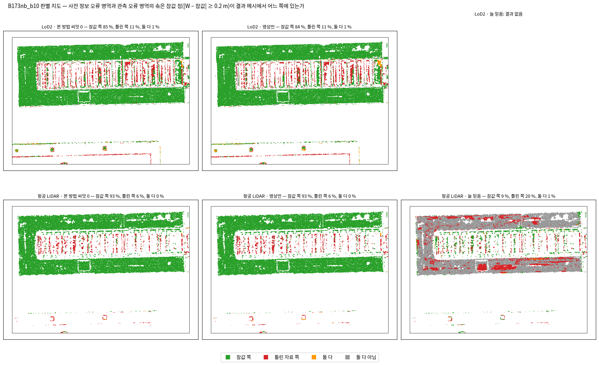
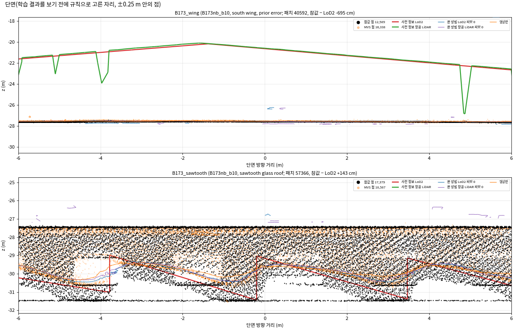
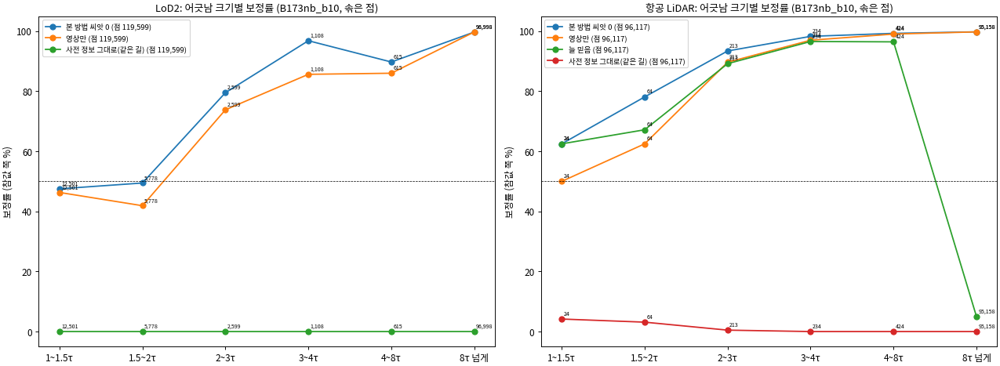
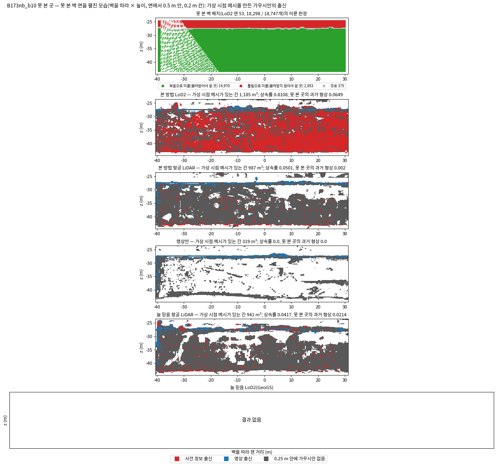
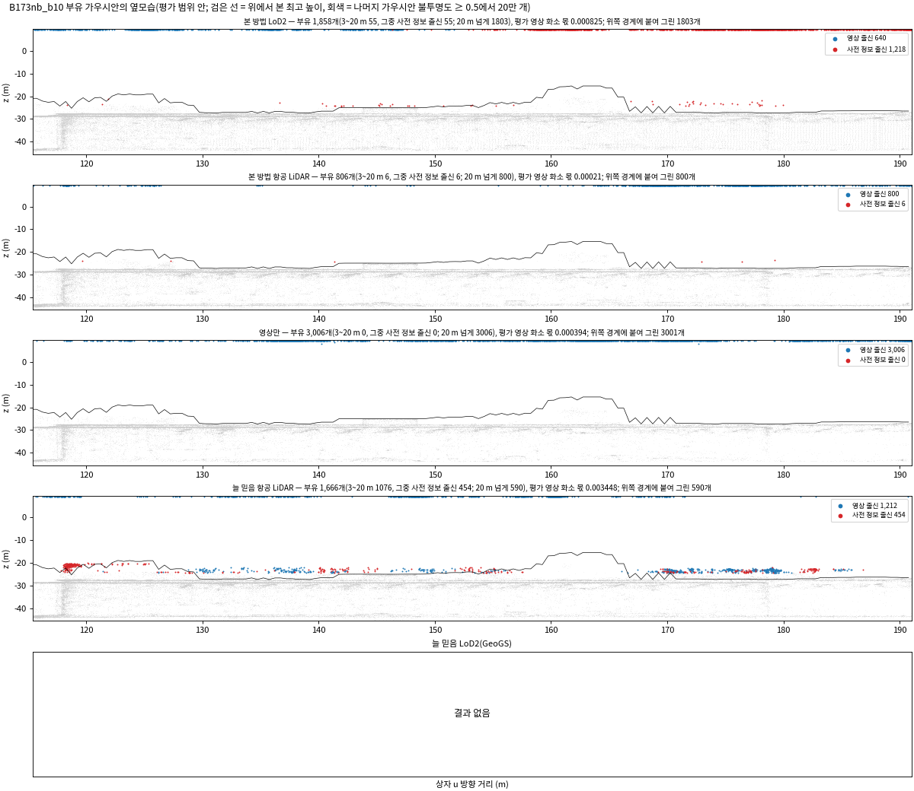
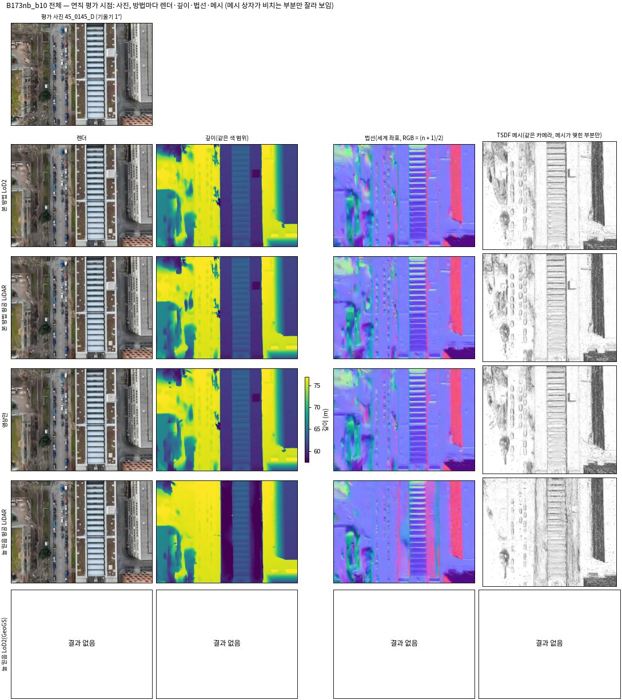
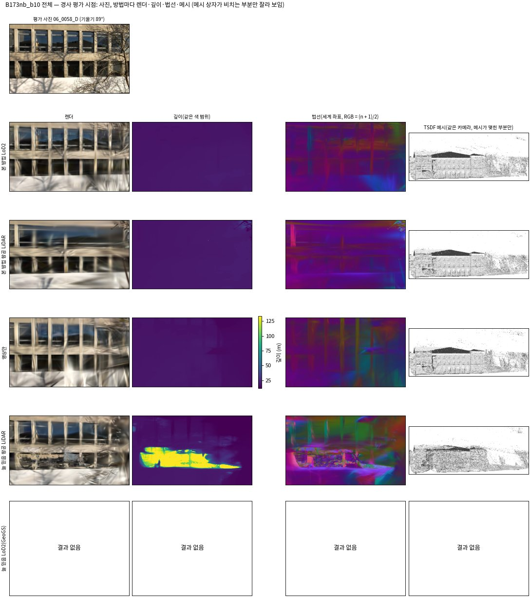

<!-- PHD-MAIN-STAGE1-v1 중간 보고 (B173과 이웃) -->
# 본 실험 1단계 — 중간 보고: B173과 이웃 v1

- 작업: `PHD-MAIN-STAGE1-v1` (발주 2026-10-07), B173과 이웃의 학습과 평가(발주 4·5절). 실행 2026-10-07 14:56 ~ 17:50. `scientific_verdict: null`.
- 판독은 분석자(에이전트)의 판단이며, 사람 검수 전이다. 방법의 우열이나 2·3단계로 넘어갈지는 정하지 않는다(발주 8절).
- 일한 곳: 브랜치 `exp/main-experiment`, 별도 폴더 `JointBuildGS-exp`. 원래 작업 폴더는 고치지 않았다.
- **이 보고의 범위**
  - B173과 이웃 한 지역, 관문 단위 둘(LoD2, 항공 LiDAR)이다.
  - s_r은 이 지역 두 칸으로 낸 **잠정값**이다(자유도 2, 조건 3은 LoD2 한 칸이라 1). 최종 관문은 네 지역 여덟 칸으로 다시 낸다.
  - **GeoGS(늘 믿음 LoD2)는 아직 없다.** 사용자 결정(15시 20분께)이 학습 대기열을 시작한 뒤라, 대기열 끝에 돌린다(8절). 조건 1의 LoD2 칸은 '견줌 없음'이다.
- 본 방법(씨앗 0·1)은 0단계의 B173과 이웃 학습 넷을 그대로 썼다(발주의 학습 계획대로). 1단계의 새 학습은 영상만 씨앗 0·1과 늘 믿음 항공 LiDAR 셋이다.
- 산출 위치: 페이로드 `../JointBuildGS-artifacts/phase-payloads/phd/main_stage1_v1/PHD-MAIN-STAGE1-v1/`. 그림은 이 문서 옆 `figures/`에 있다.

## 0. 전체 과정에서의 위치

| 큰 단계 | 하는 일 | 상태 |
|---|---|---|
| 가~라 | 실험 설계, 저장소 정리, 0단계 시험 학습, 평가 지표와 관문 | 끝남 |
| 마. 본 실험 1단계 | 준비 단계 끝남 → **B173과 이웃 학습 셋 끝남, 중간 보고(이 보고)** → R1 부채꼴 → B0 → B173만 → GeoGS 네 번 → 관문 판정 | **지금.** R1 부채꼴 학습이 돌고 있다 |
| 바. 본 실험 2·3단계 | 장치 빼기 9회와 민감도 6회, 영상 수 줄이기 18회와 반복 2회 | 관문을 넘으면 |
| 사. 넓히기 | 찾기 범위 여덟 곳 | 1단계 결과를 보고 |
| 아. 결과 정리와 논문 | 7장 결과와 고찰, 전체 정리 | 마지막 |

## 1. 답 먼저

1. **잠정 관문표는 '통과'다. 다만 GeoGS와 다른 지역이 아직 없어 확정이 아니다(2절).**
   - 조건 1(오류 차단): 항공 LiDAR 단위가 충족이다. 본 방법의 사전 정보 오류 유입률은 0.03 %이고, 늘 믿음 항공 LiDAR는 17.9 %다. LoD2 단위는 견줄 GeoGS가 없어 '견줌 없음'이다.
   - 조건 2(관측 오류, 문턱 이내): 두 단위 모두 표본이 1만 점에 못 미쳐(1,594·3,388점) 준비 단계에서 예정한 대로 '판별 불가'다. 값은 본 방법이 영상만보다 높다(LoD2 65.9 대 57.2 %, 항공 LiDAR 89.0 대 86.3 %).
   - 조건 3(상호 보완): 충족이다. 완만한 지붕 NMAD가 본 방법 2.21 cm, LoD2 그대로 2.94 cm다.
   - 조건 4(전제 위배 둘레의 완전성): 두 단위 모두 충족이다. 본 방법이 영상만보다 높다(95.6 대 94.2 %, 98.9 대 97.2 %).
2. **견줌(영상만)의 씨앗 차이가 본 방법의 r보다 크다.** 발주 2.3의 '두 방법의 반복 변동이 같다'는 가정이 이 지역에서는 맞지 않는다.
   - 조건 4의 r은 0.03 %p다. 본 방법의 두 씨앗이 거의 같아서다. 영상만 두 씨앗은 0.35 %p(LoD2)·0.72 %p(항공 LiDAR) 다르다.
   - 조건 2 LoD2도 영상만 씨앗 차이가 3.0 %p로 r(1.16 %p)보다 크다.
   - 조건 4의 판정은 본 방법이 영상만 두 씨앗보다 모두 높아 바뀌지 않는다. 최종 관문에서도 이 차이를 함께 적는다.
3. **LoD2 단위에서 본 방법은 영상만과 거의 같은 곳이 많다.**
   - 사전 정보 오류 유입률 6.5·7.1 % 대 7.3·7.0 %다. 완만한 지붕 편향은 둘 다 +7.1~7.2 cm이고 NMAD는 2.2 대 2.2~2.3 cm다.
   - 다른 것은 못 본 곳이다. 본 방법은 못 본 벽에서 LoD2를 81·78 % 물려받고, 가상 시점 메시가 맞음으로 미룬 벽 패치의 99.6·98.9 %를 0.5 m 안에 덮는다. 영상만은 42.5·48.0 %다(5절).
   - 결측 일치 영역(MVS가 없고 사전 정보가 맞는 곳)의 완전성도 본 방법이 높다(0.2 m 안 96.2·96.7 대 90.8·92.9 %).
4. **항공 LiDAR 단위에서 본 방법은 늘 믿음보다 틀린 자료를 훨씬 덜 들인다. 대신 항공 LiDAR의 정확한 높이를 물려받지 않는다.**
   - 사전 정보 오류 유입률 0.0 대 17.9 %, 이중 오류 0.6 대 13.9 %, 결측 사전 정보 오류 0.0 대 30.2 %다. 늘 믿음의 부유 가우시안(3~20 m)은 1,076개이고 본 방법은 6·11개다.
   - 그러나 완만한 지붕 편향은 본 방법 +6.9 cm로 영상만(+7.0~7.1 cm)과 같고, 늘 믿음은 +2.3 cm, 항공 LiDAR 그대로는 −1.3 cm다. 결측 일치 영역 111점에서 본 방법은 0.2 m 안 0 %, 늘 믿음은 63.1 %다.
5. **학습 결과의 지붕 편향은 MVS의 편향을 따라간다(5절).** 완만한 지붕 점의 98 %가 이웃 건물 4959460에 있고, 그 건물의 MVS − 참값이 +7.6 cm다. 본 방법(+7.1 cm)과 영상만(+7.0 cm)이 모두 그만큼 높다. 지면의 MVS − 참값은 +0.2 cm다.
6. **후처리 한 번이 GPU 메모리 부족으로 실패해 실행기를 고쳤다(8절).** 계산 값과는 무관하다. 학습을 끝낸 GPU가 자기 후처리를 한 뒤 다음 학습으로 가게 했다(`run_stage1_v2.py`). 대기열은 R1 부채꼴부터 이어 돌고 있다.

## 2. 관문 판정표(잠정)

s_r은 B173과 이웃의 두 칸(LoD2, 항공 LiDAR)으로 냈다. 조건 1·2·4의 값과 r은 %p, 조건 3은 cm다.

| 조건 | 단위 | 본 방법(씨앗 0·1 평균) | 견줌 | 차이(견줌 − 본 방법) | r = 2.8 s_r | 표본 | 판정 |
|---|---|---|---|---|---|---|---|
| 1 오류 차단 | LoD2 | 6.8 % | — (GeoGS 대기) | — | 0.76 | 119,763 | 견줌 없음 |
| 1 오류 차단 | 항공 LiDAR | 0.03 % | 17.9 % (늘 믿음) | +17.9 | 0.76 | 96,117 | 충족 |
| 2 관측 오류(문턱 이내) | LoD2 | 65.9 % | 57.2 % (영상만 0) | −8.7 | 1.16 | 1,594 | 판별 불가(표본 < 1만) |
| 2 관측 오류(문턱 이내) | 항공 LiDAR | 89.0 % | 86.3 % (영상만 0) | −2.7 | 1.16 | 3,388 | 판별 불가(표본 < 1만) |
| 3 상호 보완(NMAD) | LoD2 | 2.21 cm | 2.94 cm (그대로, 같은 길) | +0.73 | 0.14 | 32,634 | 충족 |
| 4 둘레 완전성 | LoD2 | 95.6 % | 94.2 % (영상만 0) | −1.45 | 0.03 | 73,287 | 충족 |
| 4 둘레 완전성 | 항공 LiDAR | 98.9 % | 97.2 % (영상만 0) | −1.71 | 0.03 | 14,136 | 충족 |

**통과 규칙(잠정)**: '미충족'이 없고, 판단할 단위가 있는 조건 1·3·4마다 충족이 하나 이상이다. 조건 2는 판단할 단위가 없어 '가를 수 없음'이다. → 통과. 조건 1의 LoD2 칸과 다른 세 지역이 들어오면 다시 낸다.

**칸마다 두 씨앗 차이와 영상만 두 씨앗 차이**

| 조건 | 칸 | 본 방법 씨앗 0 / 1 | 차이 | 영상만 씨앗 0 / 1 | 차이 | r |
|---|---|---|---|---|---|---|
| 1 | LoD2 | 6.54 / 7.08 | 0.54 | — | — | 0.76 |
| 1 | 항공 LiDAR | 0.02 / 0.03 | 0.01 | — | — | 0.76 |
| 2 | LoD2 | 66.25 / 65.50 | 0.75 | 57.21 / 60.23 | **3.02** | 1.16 |
| 2 | 항공 LiDAR | 89.20 / 88.84 | 0.36 | 86.33 / 86.39 | 0.06 | 1.16 |
| 3 | LoD2 | 2.24 / 2.17 cm | 0.07 | — | — | 0.14 |
| 4 | LoD2 | 95.62 / 95.60 | 0.02 | 94.16 / 94.51 | **0.35** | 0.03 |
| 4 | 항공 LiDAR | 98.87 / 98.88 | 0.01 | 97.16 / 97.88 | **0.72** | 0.03 |

- 읽는 법: 굵은 칸은 영상만의 씨앗 차이가 본 방법으로 낸 r을 넘는 곳이다. 조건 1 견줌인 늘 믿음은 씨앗 0 하나라 차이가 없다.
- s_r의 자유도는 2(조건 3은 1)다. 최종 관문은 네 지역 여덟 칸(자유도 8, 조건 3은 LoD2 네 칸)으로 다시 낸다.

## 3. 대표 자리: 판별 지도와 단면

- 읽는 법: 위 줄은 LoD2, 아래 줄은 항공 LiDAR 단위다. 사전 정보 오류 영역과 관측 오류 영역의 솎은 참값 점(|W − 참값| ≥ 0.2 m) 가운데, 결과 메시가 참값 쪽에 있으면 초록, 틀린 자료 쪽이면 빨강이다.
  - 큰 초록 판은 남쪽 날개(참값이 LoD2보다 7 m 낮음)다. 모든 학습 결과가 참값 쪽을 따른다.
  - 톱니 유리 지붕 줄(빨강이 섞인 띠)은 관측 오류 영역이다. 유리에서 MVS가 틀린 곳이라, 본 방법과 영상만이 같이 틀린 쪽에 선다.
  - 늘 믿음 항공 LiDAR(아래 오른쪽)는 날개 둘레와 남쪽 길에 빨강·회색이 넓다. 옛 항공 LiDAR 표면을 그대로 지킨 자리다.

- 읽는 법: 단면 자리는 학습 결과 전에 규칙으로 정했다(`sections_v1.json`). 검정은 참값, 주황은 MVS 점, 빨강·초록 굵은 선은 LoD2·항공 LiDAR, 가는 선은 결과 메시다. GeoGS 선은 아직 없다.
  - 위(남쪽 날개): 두 사전 정보는 −20~−22 m의 옛 박공지붕이다. 참값과 MVS, 결과 메시는 −27.6 m의 평지붕에 모인다. 7 m 틀린 사전 정보를 결과가 따르지 않는다.
  - 아래(톱니 유리 지붕): 참값 점이 유리 위·안·바닥에 흩어져 있다. MVS와 결과 메시는 −29.5~−30.5 m의 톱니 모양을 따라가고, LoD2 톱니(빨강)와는 다르다. 유리라 참값 자체가 한 면이 아니다.

## 4. 주 결과표

값은 솎은 점 기준이다. 두 씨앗은 '0 · 1'로 적었다. 전체 표(지표 31줄)는 부록 A에 있다.

**LoD2 단위** (참고: 지면 MVS − 참값 +0.2 cm, 같은 건물들 완만한 지붕의 MVS − 참값 +7.5 cm)

| 지표 | 본 방법 | 영상만 | 그대로(같은 길) |
|---|---|---|---|
| 유입률 · 사전 정보 오류 (%) [조건 1] | 6.5 · 7.1 | 7.3 · 7.0 | 99.7 |
| 유입률 · 관측 오류 문턱 이내 (%) [조건 2] | 66.2 · 65.5 | 57.2 · 60.2 | 42.7 |
| 유입률 · 이중 오류(기록) (%) | 40.3 · 40.4 | 39.2 · 39.3 | 98.9 |
| 과거 형상 · 사전 정보 오류 (%) | 0.9 · 0.9 | 0 · 0 | — |
| 완만한 지붕 편향 / NMAD (cm) [조건 3] | +7.1 / 2.2 · +7.2 / 2.2 | +7.1 / 2.3 · +7.2 / 2.2 | +9.7 / 2.9 |
| 가파른 지붕 편향 / NMAD (cm) | −8.6 / 6.0 · −8.6 / 6.5 | −8.3 / 6.3 · −8.7 / 7.0 | −7.5 / 7.3 |
| 벽 편향 / NMAD (cm) | −3.7 / 6.1 · −3.6 / 5.8 | −3.9 / 6.5 · −3.8 / 5.9 | −1.6 / 3.1 |
| 결측 일치 0.2 m (%) | 96.2 · 96.7 | 90.8 · 92.9 | 97.8 |
| 전제 위배 둘레 0.2 m (%) [조건 4] | 95.6 · 95.6 | 94.2 · 94.5 | 98.9 |
| 못 본 곳 상속률 / 과거 형상 (%) | 81.1 / 6.5 · 77.6 / 8.6 | 0 / 0 · 0 / 0 | — |
| 부유 3~20 m (개) | 55 · 165 | 0 · 0 | — |
| Chamfer (m) / F1 @0.2 m (%) | 0.216 / 78.9 · 0.203 / 78.7 | 0.206 / 76.9 · 0.208 / 77.0 | 1.044 / 49.8 |
| PSNR (dB) | 22.72 · 23.55 | 23.08 · 22.60 | — |

**항공 LiDAR 단위** (참고: 같은 건물들 완만한 지붕의 MVS − 참값 +7.5 cm, 그 가운데 B173 자체는 −9.5 cm)

| 지표 | 본 방법 | 영상만 | 늘 믿음 | 그대로(같은 길) |
|---|---|---|---|---|
| 유입률 · 사전 정보 오류 (%) [조건 1] | 0.0 · 0.0 | 0.0 · 0.1 | 17.9 | 100.0 |
| 유입률 · 관측 오류 문턱 이내 (%) [조건 2] | 89.2 · 88.8 | 86.3 · 86.4 | 52.6 | 4.5 |
| 유입률 · 이중 오류(기록) (%) | 0.6 · 0.6 | 0.5 · 0.6 | 13.9 | 100.0 |
| 유입률 · 결측 사전 정보 오류(기록) (%) | 0.0 · 0.0 | 0.0 · 0.0 | 30.2 | 100.0 |
| 완만한 지붕 편향 / NMAD (cm) | +6.9 / 2.4 · +6.9 / 2.3 | +7.0 / 2.5 · +7.1 / 2.4 | +2.3 / 2.1 | −1.3 / 1.8 |
| 가파른 지붕 편향 / NMAD (cm) | −8.0 / 7.7 · −8.6 / 7.9 | −8.4 / 8.6 · −8.5 / 9.3 | −2.1 / 5.7 | −1.3 / 2.3 |
| 결측 일치 0.2 m (%, 111점) | 0.0 · 0.0 | 0.0 · 0.0 | 63.1 | 99.1 |
| 전제 위배 둘레 0.2 m (%) [조건 4] | 98.9 · 98.9 | 97.2 · 97.9 | 99.2 | 99.9 |
| 부유 3~20 m (개, 사전 정보 출신) | 6 · 11 (모두) | 0 · 0 | 1,076 (454) | — |
| Chamfer (m) / F1 @0.2 m (%) | 0.188 / 79.4 · 0.190 / 80.0 | 0.206 / 76.9 · 0.208 / 77.0 | 1.016 / 39.7 | 1.285 / 37.0 |
| PSNR (dB) | 23.47 · 23.00 | 23.08 · 22.60 | 23.35 | — |

- 읽는 법: '유입률'은 틀린 자료 쪽에 선 참값 점의 몫이라 낮을수록 좋다. '완전성'은 참값 점 가운데 결과 메시가 0.2 m 안에 있는 몫이라 높을수록 좋다.
- 판별 불가 비율은 결과와 무관하게 단위마다 같다. LoD2 사전 정보 오류 3.0 %, 관측 오류 문턱 이내 35.6 %, 항공 LiDAR 0.2 %·63.5 %다.
- 항공 LiDAR 단위는 벽이 없어 벽 행이 비어 있다. 영상만은 두 단위에서 같은 학습을 단위의 영역으로 각각 읽었다.

## 5. 기제: 보정 곡선, 못 본 곳, 부유, 지붕 편향

- 읽는 법: 사전 정보 오류 영역의 참값 점을 사전 정보가 틀린 크기(τ의 몇 배)로 나누어, 결과가 참값 쪽에 선 몫을 그렸다. 숫자는 구간의 점 수다. 50 % 점선을 넘는 첫 구간이 보정 경계다.
  - LoD2: 본 방법과 영상만이 비슷하다. 경계는 둘 다 1.5τ(0.26 m)다. 2~4τ에서 본 방법이 6~11 %p 높다.
  - 항공 LiDAR: 늘 믿음은 8τ가 넘는 구간(95,158점, 대부분 남쪽 날개)에서 5 %만 참값 쪽이다. 본 방법과 영상만은 거의 100 %다. 1~2τ에서는 본 방법(62·78 %)이 영상만(50·62 %)보다 높지만, 점이 24·64개뿐이다.

- 읽는 법: B173의 못 본 긴 벽(LoD2 면 53, 패치 18,298개)을 펼친 모습이다. 맨 위는 학습 전 판정이다. 초록은 '맞음으로 미룸'(물려받아야 할 곳), 빨강은 '틀림으로 미룸'(지금 지붕보다 위에 남은 옛 벽)이다.
  - 그 아래는 방법마다 가상 시점 메시를, 가까운 가우시안의 출신으로 칠한 것이다. 빨강은 사전 정보 출신, 파랑은 영상 출신, 어두운 회색은 0.25 m 안에 불투명도 0.5 이상의 가우시안이 없는 곳이다.
  - 본 방법 LoD2는 벽 대부분을 사전 정보 출신으로 채운다(상속률 81 %). 틀림으로 미룬 위쪽 띠에도 6.5 %가 남는다.
  - 항공 LiDAR에는 벽이 없다. 그래서 본 방법·늘 믿음 모두 상속이 4~5 %이고, 메시는 회색(멀리 있는 가우시안으로 만든 면)이 많다.
  - 영상만은 이 벽에 메시가 거의 없다(319 m²).

- 읽는 법: 평가 범위 안에서 지붕 최고 높이(검은 선)보다 3 m 넘게 뜬 불투명 가우시안을 옆에서 본 것이다. 빨강은 사전 정보 출신, 파랑은 영상 출신이다. 그림 위쪽 경계에 붙은 점은 25 m 위로 벗어난 것을 경계에 붙여 그렸다.
  - 늘 믿음 항공 LiDAR는 지붕 바로 위(−25~−20 m)에 1,076개가 떠 있다. 454개가 사전 정보 출신이다.
  - 본 방법은 3~20 m 부유가 6~165개이고 모두 사전 정보 출신이다.
  - 본 방법 LoD2 씨앗 0은 20 m 넘게 뜬 가우시안 1,803개 가운데 1,163개가 사전 정보 출신이다. 씨앗 1은 2개다. 씨앗마다 크게 다르다.

**지붕 편향은 MVS를 따라간다**

| 건물 (완만한 지붕 점) | MVS − 참값 | 본 방법 | 영상만 | 늘 믿음 항공 LiDAR | 사전 정보 그대로 |
|---|---|---|---|---|---|
| 4959460 이웃 (31,843·32,932점) | +7.6 cm | +7.1 (LoD2) · +7.0 (항공 LiDAR) | +7.1 | +2.3 | LoD2 +9.7, 항공 LiDAR −1.3 (단위 전체) |
| 4959326 B173 (항공 LiDAR 1,501점) | −9.5 cm | −8.0 | — | −1.6 | — |
| 108580335 (791·912점) | −1.1 · −0.8 cm | +1.8 · +1.1 | +10.5 | +3.2 | — |

- 읽는 법: '본 방법' 칸의 두 값은 LoD2·항공 LiDAR 단위다. 사전 정보 그대로의 값은 단위 전체의 값이다(건물별은 따로 내지 않았다).
  - 학습 결과는 각 건물에서 MVS − 참값과 같은 쪽, 비슷한 크기로 치우친다.
  - 늘 믿음 항공 LiDAR만 항공 LiDAR(그대로 −1.3 cm) 쪽으로 끌려 +2.3 cm다.
  - 본 방법은 지지 일치 영역에서 사전 정보를 지키도록 판정했는데도 편향은 영상만과 같다. 사전 정보를 '판정으로 지키는 것'과 '높이를 사전 정보로 끌어오는 것'이 다르다는 뜻으로 읽힌다(분석자 판독).

## 6. 전체 모습

- 읽는 법: 평가 영상 하나(연직, 경사)마다 사진, 방법별 렌더·깊이(같은 색 범위)·법선(세계 좌표, RGB = (n + 1)/2)·TSDF 메시(같은 카메라에서 음영)를 늘어놓았다. 시점은 학습 결과 전에 규칙으로 골랐다(`defs/fig_views_v1.json`). 시험 영상 가운데 평가 범위 가운데가 영상 가운데에 가장 가깝게 비치는 연직 하나, 경사 하나다.
  - 연직 시점은 네 결과가 거의 같다.
  - 경사 시점의 앞 벽은 메시 상자 밖의 건물이다. 그래서 메시 칸에는 상자 안의 B173만 보이고, 메시 칸은 메시가 맺힌 부분만 확대했다.
  - 늘 믿음 항공 LiDAR는 앞 벽 아래쪽에 깊이 구멍(노랑, 130 m)이 있다. 그 자리의 렌더가 깨져 있다.

## 7. GeoGS(늘 믿음 LoD2) 준비와 남은 일

- **사용자 결정(10월 7일)**: 준비 보고 9절의 추천안이다.
  - DA3: 앞선 작업의 묶음 규칙(개정 2: 학습 영상만 이름순으로 ceil(N/8)개의 7~8장 묶음)으로 공식 스크립트의 모델 호출을 돌린다. MVS와 견준 척도 점검을 함께 적는다.
  - 주점: 카메라 어댑터를 쓴다. R1 부채꼴의 시점 나눔: split.json 어댑터를 쓴다.
- **공식 코드 사본** `geogs/source/GeoGS-official-adapters-v1`: 공식 db40c95를 그대로 복사하고, 두 파일만 포크 r12의 어댑터판으로 바꿨다(`utils/camera_utils.py`, `scene/dataset_readers.py`). 나머지가 공식과 같은지는 차이를 줄 단위로 검사해 `source_manifest.json`에 적었다.
- **입력**(B173과 이웃은 끝남, 나머지 셋은 이 보고 뒤): 영상·자세·카메라·평가 나눔·LoD2 면이 본 방법의 LoD2 장면과 같다.
  - LoD2 면: 본 방법과 같은 `lod2_mesh.npz`에 등록 이동을 더하고, 바닥면을 뺐다.
  - 공식 `data/generate_pcd.py`(LoD2 초기 점 10만 개, 저자 기본값, 씨앗 0)와 `LoD2Depth/main.py`(LoD2 깊이·법선)를 그대로 돌렸다.
  - 공식 LoD2 깊이는 포크 입력의 LoD2 깊이 지도와 같다. 학습 영상 203장에서 화소 차 중앙값 0, 95 % 분위 0.1 mm다.
  - 보호용 LoD2 점구름은 면적 비례 100만 점에 면 법선을 붙였다. 저자 예제는 CloudCompare 표본 약 100만 점이다.
- **점검(GPU 없이)**: 공식 읽기 코드가 나눔 어댑터를 거쳐 학습 203장·평가 29장·초기 점 100,000개를 읽는다. DA3 묶음은 26개(7~8장)이고, 모든 묶음의 카메라 중심 계수가 3이다.
- **학습 설정**: 저자 깃발(`--lod_init --freeze_onlybldg --protect_bldg --dynamic_depth_weight`), 30,000회, 단계 전환 8,000, λ_lod_init 0.08, λ_lod_anchor 0.005, `-r 1`, `--eval`을 쓴다. 발주대로 `expandable_segments:True`를 켠다.
  - 이미지는 앞선 작업과 같은 `geogs-official-db40c95-compat-v1`(matplotlib 3.9.2, libstdc++ 미리 싣기)이다.
- **순서**: 대기열 v2가 끝나면 실행기(`run_geogs.py`)가 차례로 한다. 네 지역의 DA3 → 척도 점검 → 학습 넷(GPU 하나에 하나, B173과 이웃 먼저) → 후처리와 지표.
  - 메모리 부족은 한 번 더 돌리고, 또 나거나 다른 실패가 나면 멈추고 여쭙는다.

## 8. 결과를 본 뒤 바꾼 것, 발주와 다른 점, 멈춤과 오류

**결과를 본 뒤 바꾼 것**(지표·영역·관문의 정의와 값은 바꾸지 않았다)

| 바꾼 것 | 까닭 | 결과에 미치는 영향 |
|---|---|---|
| 단면 그림의 세로 범위: 사전 정보와 참값을 모두 담게 | 남쪽 날개는 참값이 LoD2보다 6.95 m 아래라 ±4 m 창 밖이었다 | 없음(그림만) |
| 보정률 곡선에 지역 고르기를 더함 | 방금 끝난 R1 부채꼴 본 방법이 섞여 들어갔다 | 없음(그림만) |
| '전체' 경사 시점의 메시 칸을 메시가 맺힌 부분(화소 2~98 %)만 확대 | 앞 벽이 상자 밖이라 메시가 작게 보였다 | 없음(그림만) |

**발주와 다른 점**

- GeoGS 네 번을 대기열 끝으로 미뤘다. 발주의 순서는 B173과 이웃 네 번(GeoGS 포함) 뒤 중간 보고다. 결정이 대기열 시작 뒤에 나왔고, 넣으려면 돌고 있는 학습을 멈춰야 했다. 그래서 이 보고의 조건 1 LoD2 칸이 비어 있다.
- 0단계 B173과 이웃 본 방법 넷의 화질(평가 영상 PSNR·SSIM·LPIPS)을 새로 렌더해 더했다. 0단계에는 이 값이 없었다. 모델은 읽기만 했다.
- 편향 옆에 적을 참고값을 계산했다(`refbias_s1.py`). 지역 지면의 MVS − 참값은 공통 맞춤 2차 값이다. 같은 건물 완만한 지붕의 MVS − 참값은 조건 3과 같은 점을 쓰고, MVS는 0.1 m 칸 중앙값이다.
- 지표 스크립트(`metrics_s1.py`)에 덤프가 없는 결과(GeoGS)의 가우시안을 PLY에서 읽는 길을 더했다. GeoGS 학습 전에 넣었고, 덤프가 있는 결과는 지나지 않는다.

**멈춤과 오류**(progress.md에 시각과 함께 적었다)

| 시각 | 일 | 처리 |
|---|---|---|
| 15:45 | GeoGS 입력(B173과 이웃) 첫 시도 실패: 공식 `generate_pcd.py`가 자기 폴더의 모듈을 못 찾음 | 계산 전 실행 오류. 스크립트 폴더를 경로에 넣어 다시 돌림. 반쯤 만든 폴더는 `scene_failed_1545`로 남김 |
| 15:46~16:00 | 공식 `generate_pcd.py`가 가시성 대체 경고를 점·카메라마다 찍어 로그가 710 MB가 됨 | 계산은 공식 그대로 둠. 로그는 gzip했고, 다음 지역부터 같은 경고 줄은 세기만 함 |
| 16:37 | B173과 이웃 영상만 씨앗 0의 후처리(TSDF 렌더)가 GPU 메모리 부족. R1 학습이 쓰는 GPU 0에서 7 GiB를 요청했는데 여유가 6.9 GiB였음 | 첫 실행기가 설계대로 새 학습을 멈춤(돌던 학습 둘은 끝까지 감). 자원 배치 오류라 `run_stage1_v2.py`로 고쳐 이어 감: 빈 GPU만 일을 받고, 학습을 끝낸 GPU가 자기 후처리를 한다. 실패한 후처리는 17:01~17:15에 빈 GPU에서 다시 했다 |

## 9. 시간과 자원

| 일 | 시간 | 메모 |
|---|---|---|
| 영상만 씨앗 0 · 1 학습 | 71 · 61분 | GPU 최대 19.9 · 16.1 GB, 가우시안 313 · 255만 개 |
| 늘 믿음 항공 LiDAR 학습 | 63분 | GPU 최대 19.2 GB |
| 후처리(렌더·TSDF) / 실행 단계(평가 점·부유·가상 시점) / 지표(단위 하나) | 5~6 / 3 / 2.5~7분 | 학습 하나당 약 12~16분 |
| 관문표·결과표·그림 | 약 7분 | CPU |

- 학습 한 번 61~71분으로 발주의 예상(65~70분) 안이다.
- 남은 일의 예상:
  - 대기열 v2에는 학습 19회가 남았다. GPU 둘이 학습과 후처리를 이어 하면 내일(10-08) 아침 6~7시께 끝난다.
  - GeoGS는 DA3 약 30분과 학습 넷(두 번씩 약 70~90분)에 3~4시간이 든다.
  - 전체는 발주 예상(31시간, 10-08 22시께까지) 안으로 본다.

## 10. 기록

- 커밋: 이 보고와 스크립트·설정·매니페스트. 표·그림의 원본은 페이로드 `tables/`·`figs/`, 진행은 `progress.md`, 작업 줄은 `logs/queue.log`, 영수증은 `receipt_interim.json`이다.
- 전달 묶음: `handover/PHD-MAIN-STAGE1-v1_중간보고_전달_v1.zip`(보고서, 표, 그림, 설정, progress.md, 영수증).
- 새 스크립트:
  - 대기열 실행기 v2: `run_stage1_v2.py`, `gpu_when_free.py`
  - 참고 편향: `refbias_s1.py`
  - GeoGS: `geogs_source.py`, `geogs_prep.py`, `run_geogs_prep.sh`, `geogs_da3.py`, `geogs_scale.py`, `run_geogs.py`
- 고친 스크립트:
  - `figs_s1.py`: 시점 정의, 전체·못 본 곳·부유 그림, 단면·곡선 지역 고르기
  - `tables_s1.py`: 결과표
  - `metrics_s1.py`: PLY 읽기

## 부록 A. 결과표 전체 (B173과 이웃)

'0', '1'은 씨앗이다. 퍼센트(%)·cm 단위는 행 이름을 따른다. '그대로(같은 길)'는 사전 정보 면을 학습 시점에서 렌더해 같은 TSDF 길로 만든 메시이고, '그대로(표면)'는 사전 정보 면 그 자체다.

**B173nb_b10 · LoD2** (참고: 지면 MVS − 참값 +0.2 cm, 같은 건물들의 완만한 지붕 MVS − 참값 +7.5 cm)

| 묶음 | 지표 | 본 방법 0 | 본 방법 1 | 영상만 0 | 영상만 1 | 그대로(같은 길) | 그대로(표면) |
|---|---|---|---|---|---|---|---|
| 오류 차단 | 유입률 · 사전 정보 오류 [조건 1] | 6.5 | 7.1 | 7.3 | 7.0 | 99.7 | 100.0 |
| 오류 차단 | 판별 불가 · 사전 정보 오류 | 3.0 | 3.0 | 3.0 | 3.0 | 3.0 | 3.0 |
| 오류 차단 | 유입률 · 관측 오류 문턱 이내 [조건 2] | 66.2 | 65.5 | 57.2 | 60.2 | 42.7 | 41.0 |
| 오류 차단 | 판별 불가 · 관측 오류 문턱 이내 | 35.6 | 35.6 | 35.6 | 35.6 | 35.6 | 35.6 |
| 오류 차단 | 유입률 · 관측 오류 문턱 이내, 의심 뺌 | 69.1 | 67.6 | 58.1 | 61.1 | 47.2 | 46.3 |
| 오류 차단 | 유입률 · 관측 오류 전체 | 61.9 | 60.6 | 58.6 | 59.2 | 11.2 | 7.0 |
| 오류 차단 | 유입률 · 전제 위배 안 | 61.3 | 59.9 | 58.8 | 59.0 | 6.5 | 2.0 |
| 오류 차단 | 유입률 · 이중 오류(기록) | 40.3 | 40.4 | 39.2 | 39.3 | 98.9 | 99.7 |
| 오류 차단 | 유입률 · 결측 사전 정보 오류(기록) | 21.8 | 19.7 | 18.9 | 19.7 | 94.6 | 98.7 |
| 오류 차단 | 과거 형상 · 사전 정보 오류 | 0.9 | 0.9 | 0.0 | 0.0 | — | — |
| 오류 차단 | 과거 형상 · 관측 오류(출신 무관) | 23.7 | 22.4 | 13.9 | 14.0 | — | — |
| 오류 차단 | 보정 경계 (τ / m) | 1.5 / 0.26 | 1.5 / 0.26 | 1.5 / 0.26 | 1.5 / 0.26 | — | — |
| 기하 | 완만한 지붕 편향 / NMAD [조건 3 = NMAD] | +7.1 / 2.2 | +7.2 / 2.2 | +7.1 / 2.3 | +7.2 / 2.2 | +9.7 / 2.9 | +10.0 / 2.9 |
| 기하 | 완만한 지붕 편향, 의심 뺌 | +7.1 | +7.2 | +7.1 | +7.2 | +9.7 | +10.0 |
| 기하 | 완만한 지붕 산포 q68.3 / q95 | 2.3 / 5.7 | 2.2 / 5.5 | 2.4 / 5.9 | 2.3 / 5.9 | 2.9 / 5.5 | 2.9 / 5.3 |
| 기하 | 가파른 지붕 편향 / NMAD | -8.6 / 6.0 | -8.6 / 6.5 | -8.3 / 6.3 | -8.7 / 7.0 | -7.5 / 7.3 | -7.5 / 7.3 |
| 기하 | 가파른 지붕 산포 q68.3 / q95 | 6.2 / 13.2 | 6.6 / 13.1 | 6.5 / 12.3 | 7.0 / 13.5 | 7.2 / 15.5 | 7.2 / 15.5 |
| 기하 | 띠 편향 / NMAD | +5.8 / 4.8 | +5.8 / 4.7 | +5.7 / 5.1 | +6.0 / 4.9 | +6.1 / 6.1 | +6.4 / 6.1 |
| 기하 | 벽 편향 / NMAD | -3.7 / 6.1 | -3.6 / 5.8 | -3.9 / 6.5 | -3.8 / 5.9 | -1.6 / 3.1 | -1.4 / 2.9 |
| 완전성 | 결측 일치 0.2 / 0.5 m | 96.2 / 97.8 | 96.7 / 97.8 | 90.8 / 97.6 | 92.9 / 97.7 | 97.8 / 99.8 | 97.2 / 99.8 |
| 완전성 | 비가시 일치 0.2 / 0.5 m | 70.6 / 88.2 | 70.6 / 88.2 | 41.2 / 88.2 | 76.5 / 88.2 | 100.0 / 100.0 | 100.0 / 100.0 |
| 완전성 | 전제 위배 둘레 0.2 m [조건 4] | 95.6 | 95.6 | 94.2 | 94.5 | 98.9 | 98.7 |
| 완전성 | 못 본 곳 상속률 / 과거 형상 (가우시안) | 81.1 / 6.5 | 77.6 / 8.6 | 0.0 / 0.0 | 0.0 / 0.0 | — | — |
| 완전성 | 가상 시점 메시: 맞음 미룸 0.5 m / 틀림 미룸 0.2 m | 99.6 / 9.3 | 98.9 / 11.3 | 42.5 / 2.1 | 48.0 / 3.6 | — | — |
| 부유 | 3~20 m / 그중 사전 정보 출신 / 20 m 넘게 (개) | 55 / 55 / 1,803 | 165 / 165 / 2 | 0 / 0 / 3,006 | 0 / 0 / 2,580 | — | — |
| 부유 | 평가 영상 화소 몫 (‰) | 0.82 | 0.17 | 0.39 | 4.84 | — | — |
| 요약 | Chamfer 평균 (m) | 0.216 | 0.203 | 0.206 | 0.208 | 1.044 | 1.165 |
| 요약 | 정밀도 / 완전성 / F1 @0.2 m | 70.9 / 89.0 / 78.9 | 70.5 / 88.9 / 78.7 | 67.9 / 88.6 / 76.9 | 68.0 / 88.7 / 77.0 | 46.8 / 53.2 / 49.8 | 40.5 / 53.2 / 46.0 |
| 요약 | M3C2 중앙값 / NMAD (cm) | +0.2 / 12.4 | +0.0 / 12.2 | -0.4 / 13.6 | -0.3 / 13.1 | +0.5 / 13.3 | +0.8 / 13.4 |
| 요약 | 학습 시간 (분) / GPU 최대 (GB) | 64 / 18.1 | 68 / 15.1 | 71 / 19.9 | 61 / 16.1 | — | — |
| 요약 | 화질 PSNR / SSIM / LPIPS | 22.72 / 0.762 / 0.297 | 23.55 / 0.778 / 0.286 | 23.08 / 0.760 / 0.303 | 22.60 / 0.751 / 0.308 | — | — |

**B173nb_b10 · ALS** (참고: 지면 MVS − 참값 +0.2 cm, 같은 건물들의 완만한 지붕 MVS − 참값 +7.5 cm)

| 묶음 | 지표 | 본 방법 0 | 본 방법 1 | 영상만 0 | 영상만 1 | 늘 믿음 | 그대로(같은 길) | 그대로(표면) |
|---|---|---|---|---|---|---|---|---|
| 오류 차단 | 유입률 · 사전 정보 오류 [조건 1] | 0.0 | 0.0 | 0.0 | 0.1 | 17.9 | 100.0 | 100.0 |
| 오류 차단 | 판별 불가 · 사전 정보 오류 | 0.2 | 0.2 | 0.2 | 0.2 | 0.2 | 0.2 | 0.2 |
| 오류 차단 | 유입률 · 관측 오류 문턱 이내 [조건 2] | 89.2 | 88.8 | 86.3 | 86.4 | 52.6 | 4.5 | 3.5 |
| 오류 차단 | 판별 불가 · 관측 오류 문턱 이내 | 63.5 | 63.5 | 63.5 | 63.5 | 63.5 | 63.5 | 63.5 |
| 오류 차단 | 유입률 · 관측 오류 문턱 이내, 의심 뺌 | 93.1 | 93.1 | 90.8 | 90.8 | 53.3 | 4.4 | 3.9 |
| 오류 차단 | 유입률 · 관측 오류 전체 | 84.3 | 84.3 | 85.0 | 86.1 | 49.2 | 2.2 | 1.7 |
| 오류 차단 | 유입률 · 전제 위배 안 | 80.6 | 80.8 | 84.0 | 85.8 | 46.6 | 0.5 | 0.3 |
| 오류 차단 | 유입률 · 이중 오류(기록) | 0.6 | 0.6 | 0.5 | 0.6 | 13.9 | 100.0 | 100.0 |
| 오류 차단 | 유입률 · 결측 사전 정보 오류(기록) | 0.0 | 0.0 | 0.0 | 0.0 | 30.2 | 100.0 | 100.0 |
| 오류 차단 | 과거 형상 · 사전 정보 오류 | 0.1 | 0.1 | 0.0 | 0.0 | 1.3 | — | — |
| 오류 차단 | 과거 형상 · 관측 오류(출신 무관) | 22.5 | 22.2 | 14.4 | 20.0 | 13.8 | — | — |
| 오류 차단 | 보정 경계 (τ / m) | 1 / 0.15 | 1 / 0.15 | 1 / 0.15 | 1 / 0.15 | — | — | — |
| 기하 | 완만한 지붕 편향 / NMAD [조건 3 = NMAD] | +6.9 / 2.4 | +6.9 / 2.3 | +7.0 / 2.5 | +7.1 / 2.4 | +2.3 / 2.1 | -1.3 / 1.8 | -1.2 / 1.7 |
| 기하 | 완만한 지붕 편향, 의심 뺌 | +6.9 | +6.9 | +7.0 | +7.1 | +2.3 | -1.3 | -1.2 |
| 기하 | 완만한 지붕 산포 q68.3 / q95 | 2.5 / 11.2 | 2.4 / 11.7 | 2.6 / 14.2 | 2.5 / 12.9 | 2.2 / 7.0 | 1.8 / 3.6 | 1.7 / 3.5 |
| 기하 | 가파른 지붕 편향 / NMAD | -8.0 / 7.7 | -8.6 / 7.9 | -8.4 / 8.6 | -8.5 / 9.3 | -2.1 / 5.7 | -1.3 / 2.3 | -1.2 / 2.3 |
| 기하 | 가파른 지붕 산포 q68.3 / q95 | 8.4 / 21.1 | 8.8 / 21.3 | 9.5 / 22.4 | 9.7 / 23.1 | 5.5 / 12.9 | 2.4 / 7.2 | 2.3 / 6.5 |
| 기하 | 띠 편향 / NMAD | +6.2 / 3.2 | +6.2 / 3.0 | +6.4 / 3.4 | +6.7 / 3.2 | +1.9 / 2.5 | -1.5 / 2.1 | -1.1 / 1.9 |
| 완전성 | 결측 일치 0.2 / 0.5 m | 0.0 / 0.9 | 0.0 / 0.0 | 0.0 / 0.0 | 0.0 / 0.0 | 63.1 / 81.1 | 99.1 / 100.0 | 99.1 / 100.0 |
| 완전성 | 비가시 일치 0.2 / 0.5 m | 100.0 / 100.0 | 100.0 / 100.0 | 100.0 / 100.0 | 100.0 / 100.0 | 100.0 / 100.0 | 100.0 / 100.0 | 100.0 / 100.0 |
| 완전성 | 전제 위배 둘레 0.2 m [조건 4] | 98.9 | 98.9 | 97.2 | 97.9 | 99.2 | 99.9 | 99.9 |
| 완전성 | 못 본 곳 상속률 / 과거 형상 (가우시안) | 5.0 / 0.2 | 5.4 / 0.2 | 0.0 / 0.0 | 0.0 / 0.0 | 4.2 / 2.1 | — | — |
| 완전성 | 가상 시점 메시: 맞음 미룸 0.5 m / 틀림 미룸 0.2 m | 88.2 / 8.3 | 86.2 / 8.2 | 42.5 / 2.1 | 48.0 / 3.6 | 80.7 / 8.6 | — | — |
| 부유 | 3~20 m / 그중 사전 정보 출신 / 20 m 넘게 (개) | 6 / 6 / 800 | 11 / 11 / 883 | 0 / 0 / 3,006 | 0 / 0 / 2,580 | 1,076 / 454 / 590 | — | — |
| 부유 | 평가 영상 화소 몫 (‰) | 0.21 | 0.44 | 0.39 | 4.84 | 3.45 | — | — |
| 요약 | Chamfer 평균 (m) | 0.188 | 0.190 | 0.206 | 0.208 | 1.016 | 1.285 | 1.355 |
| 요약 | 정밀도 / 완전성 / F1 @0.2 m | 71.0 / 90.2 / 79.4 | 71.9 / 90.2 / 80.0 | 67.9 / 88.6 / 76.9 | 68.0 / 88.7 / 77.0 | 30.7 / 56.3 / 39.7 | 28.6 / 52.3 / 37.0 | 20.5 / 54.3 / 29.8 |
| 요약 | M3C2 중앙값 / NMAD (cm) | -0.3 / 12.3 | -0.2 / 12.0 | -0.4 / 13.6 | -0.3 / 13.1 | +6.8 / 21.6 | -1.5 / 24.6 | -1.1 / 29.1 |
| 요약 | 학습 시간 (분) / GPU 최대 (GB) | 66 / 14.7 | 68 / 14.8 | 71 / 19.9 | 61 / 16.1 | 63 / 19.2 | — | — |
| 요약 | 화질 PSNR / SSIM / LPIPS | 23.47 / 0.771 / 0.291 | 23.00 / 0.770 / 0.290 | 23.08 / 0.760 / 0.303 | 22.60 / 0.751 / 0.308 | 23.35 / 0.769 / 0.293 | — | — |

