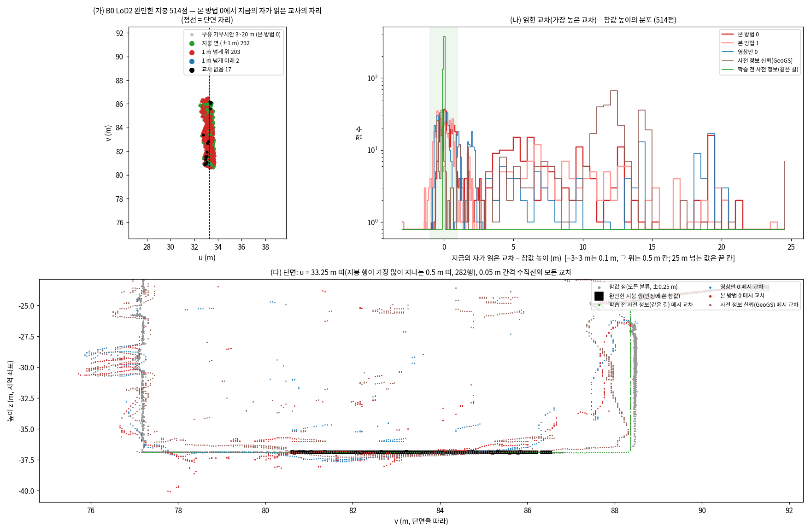
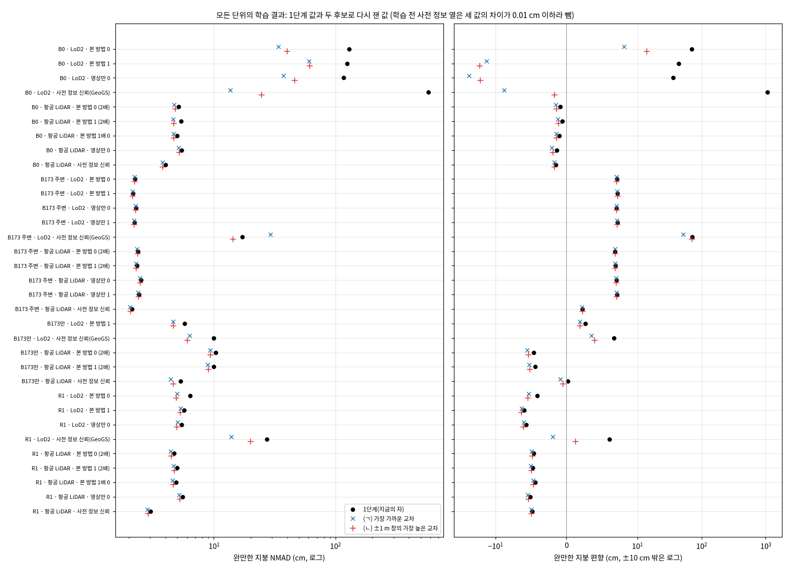
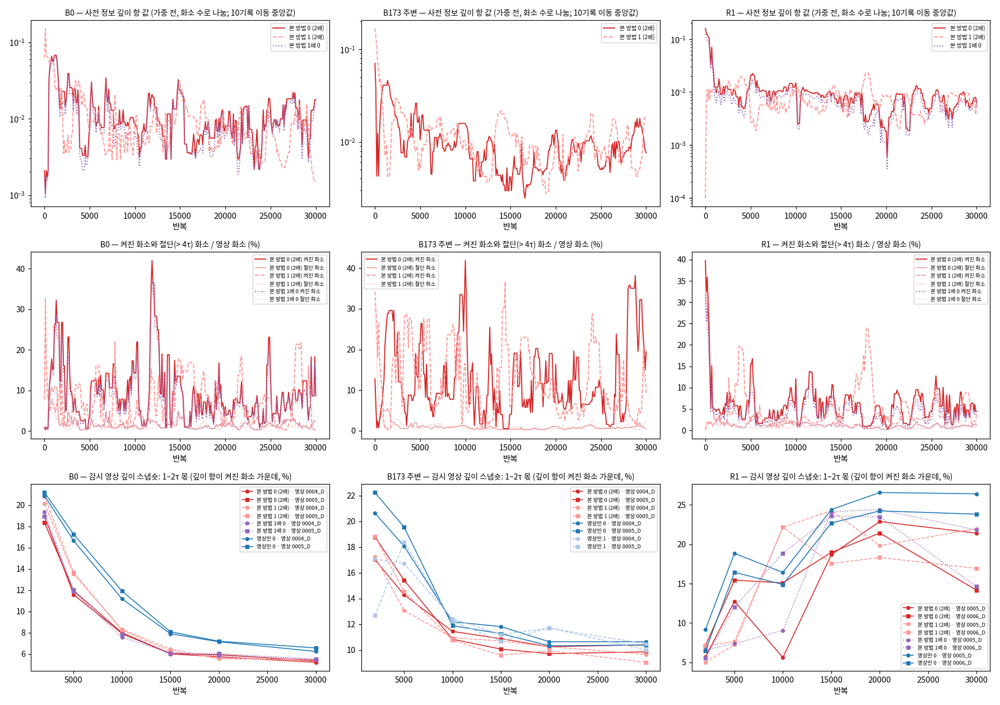
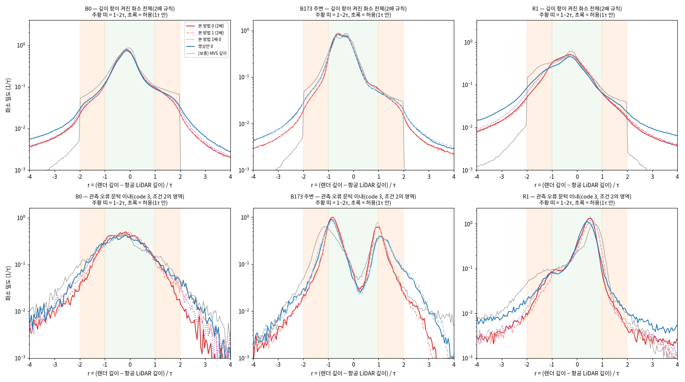
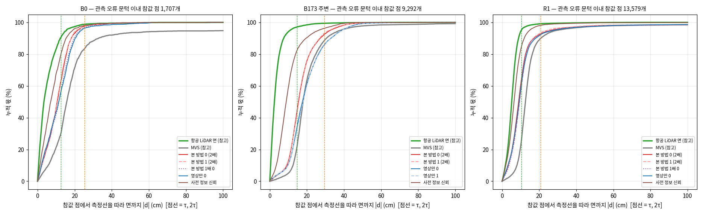
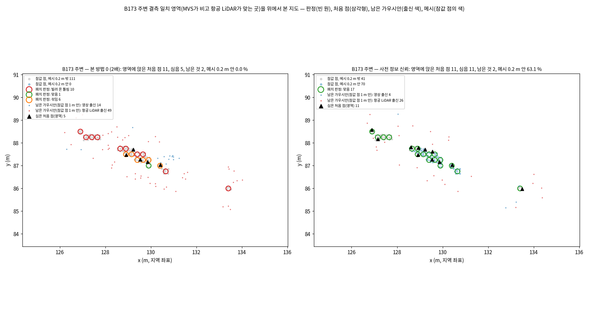
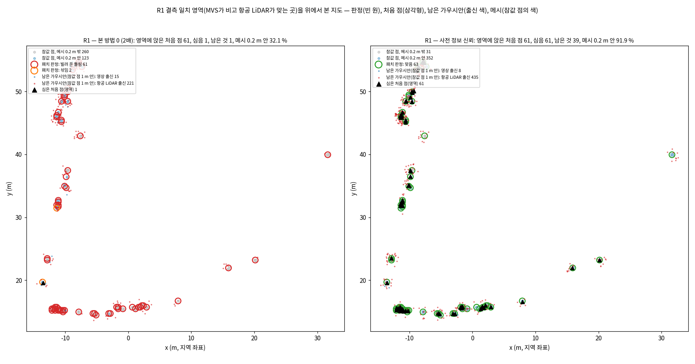

<!-- PHD-MAIN-STAGE1-DIAG-v1 보고 -->
# 본 실험 1단계 진단 — 보고 v1

- 작업: `PHD-MAIN-STAGE1-DIAG-v1` (요청문 v1, 2026-10-08). 실행 10-08 23:00 ~ 10-09 00:15. **학습 없음.** `scientific_verdict: null`.
- 판독과 제안은 분석자(에이전트)의 판단이며, 사람 검수 전이다. 1단계 공식 판정과 표는 고치지 않았다. 고친 자로 잰 값은 '다시 잼'으로 1단계 값 옆에 두었다.
- 설정: `configs/phd/main_stage1_diag_v1/diag_v1.json`. 재기 전에 저장했다(10-08 23:24:39, sha256 `e1a3c71b…49139`, 사본은 페이로드 `diag_v1_preregistered.json`). 결과를 본 뒤 더한 것은 설정의 `changes_after_results`와 7절에 시각·까닭을 적었다.
- 이름: 본 방법(항공 LiDAR는 충돌 문턱 2배), 본 방법 충돌 문턱 1배(표에서는 '1배'), 영상만, 사전 정보 신뢰(LoD2는 GeoGS), 학습 전 사전 정보. 지역은 B0, B173 주변, B173만, R1이다.
- 산출 위치: 표 `tables/diag_ga|na|da.md·json`, 그림 `figures/diag/`, 페이로드 `JointBuildGS-artifacts/phase-payloads/phd/main_stage1_diag_v1/PHD-MAIN-STAGE1-DIAG-v1/`.

## 1. 답 먼저

| 진단 | 읽는 규칙에 따른 답 | 근거 한 줄 |
|---|---|---|
| 가. 조건 3의 자 | **미리 정한 규칙으로는 권하는 읽기 없음.** 두 후보 모두 '지붕 위 물체만 거른다'로 읽히지 않는다. 참고로 (ㄴ)으로 본 B0 LoD2 본 방법은 +13.7 / 39.9 cm(씨앗 0), −17.6 / 60.9 cm(씨앗 1)이다(편향 / NMAD). 분석자 제안은 (ㄴ)을 지금의 자와 나란히 두는 것이다(5절 가-1). | 1 m 넘게 위를 읽는 일이 B0 LoD2만의 일이 아니다. 두 후보 모두 B0 LoD2 밖 11칸을 0.5 cm 넘게 바꿨다(R1 LoD2 본 방법 0 −1.2 / −1.5 cm 등). |
| 나. 항공 LiDAR 당김 | **세 지역 모두 '당김이 일했다'.** | 끝 상태에서 2배의 1~2τ 몫이 영상만보다 1.4 / 2.2 / 4.2 %p(B0 / B173 주변 / R1) 작다. 씨앗 차이의 두 배는 0.4 / 0.03 / 0.4 %p다. B0는 1배와의 차이 0.47 %p가 문턱 0.41 %p를 겨우 넘는다. |
| 다. 빈 곳 채움 | **R1: 학습 전에 빠짐.** B173 주변: 메시 만들기에서 빠짐(씨앗 0) / 학습 중 사라짐(씨앗 1). B173만: 표본 부족. B0: 빠지지 않음(씨앗 0) / 메시 만들기에서 빠짐(씨앗 1). | R1 결측 패치 63개 가운데 61개가 이웃에게서 '틀림'을 빌려 왔다. 그래서 처음 점 61개 가운데 1개만 심었다(사전 정보 신뢰는 61개). |

세 가지를 더 적는다.

1. **가.** 지금의 자가 B0 LoD2에서 읽은 것은 '지붕 위 물체'가 아니다. 참값에 없는 작은 메시 조각이다.
   - 본 방법 0의 514점 가운데 203점이 1 m 넘게 위(중앙 6.0 m)를 읽었다. 그 가운데 187점은 지붕과 이어지지 않은 따로 떨어진 메시 조각이다.
   - 그 교차 0.5 m 안에 참값 점(모든 분류)은 하나도 없다. 1단계 5.3절의 부유 가우시안(3~20 m)도 0.5 m 안에 없다. 가장 가까운 것은 65 m 떨어져 있다.
   - 이 표본은 양옆 벽 사이(11 m, 벽은 12 m 넘게 솟음)의 낮은 지붕(−36.9 m)에 있는 1 m × 6 m 띠다. 두 후보로도 NMAD가 34~61 cm다. 두 씨앗의 차이는 21~27 cm로 오히려 커진다. 그래서 두 후보 모두 조건 3의 r을 5.2 cm에서 24~30 cm로 키운다(표 가-3).
2. **나.** 당김은 렌더 깊이에서는 보이지만 결과 메시는 1~2 cm만 옮겼다.
   - 관측 오류 문턱 이내 참값 점에서 결과 면까지의 중앙 거리는 본 방법 10.5 / 15.6 / 9.2 cm, 영상만 11.4 / 17.8 / 9.3 cm다(B0 / B173 주변 / R1).
   - 항공 LiDAR 면은 3.5 / 2.5 / 5.2 cm다.
   - 0.2 m 문턱의 1단계 지표로는 보이지 않는 크기다.
   - 그림 나-1에서 본 방법의 분포가 허용 띠 가장자리(±1τ)에 쌓인다. 띠 안에서는 사전 정보 항의 기울기가 0이기 때문이다. 띠 밖에서는 MVS 항과 사전 정보 항이 같은 무게(λ 0.05)로 맞선다(5절 제안 나-1).
3. **다.** 결측 일치 영역은 네 지역을 합쳐 패치 112개, 8.1 m²다. 1단계의 '지역 합산 41.6 %'(692점)는 55 %가 R1(383점)이다.
   - R1에서 영역 화소의 97 %는 깊이 항이 꺼졌다. 끝 상태 렌더는 영상만과 같은 몫(τ 안 36~41 % 대 35 %)만 항공 LiDAR에 앉았다.
   - 틀림 표의 출처는 대부분 MVS가 틀린 관측 오류 패치다(310표 가운데 198표).

## 2. 진단 가: 조건 3의 자

**볼 것**: 지금의 자('수직선의 가장 높은 교차')가 B0 LoD2에서 무엇을 읽었나. 두 후보는 B0 LoD2만 바꾸고 나머지는 그대로 두나(미리 정한 읽는 규칙: B0 LoD2 밖 모든 칸이 0.5 cm 안으로 같고, B0 LoD2에서 r 5.20 cm보다 크게 바뀌면 '지붕 위 물체만 거른다').

### 2.1 지금의 자가 B0 LoD2에서 읽은 것

**표 가-1. B0 LoD2 완만한 지붕 514점: 지금의 자가 읽은 교차의 자리**

| 방법 | 지붕 면 (참값 ±1 m) | 1 m 넘게 위 | 위: 따로 떨어진 조각 / 지붕에 붙은 것 | 위: 0.5 m 안 참값 점(모든 분류) | 위: 0.5 m 안 부유 가우시안(3~20 m) | 위: 높이 중앙값 (m) | 1 m 넘게 아래 / 교차 없음 |
|---|---|---|---|---|---|---|---|
| 본 방법 0 | 292 | 203 | 187 / 16 | 0 | 0 | 6.0 | 2 / 17 |
| 본 방법 1 | 320 | 154 | 141 / 13 | 0 | 0 | 6.9 | 9 / 31 |
| 영상만 0 | 300 | 214 | 210 / 4 | 0 | 0 | 2.2 | 0 / 0 |
| 사전 정보 신뢰(GeoGS) | 137 | 377 | 377 / 0 | 0 | 0 | 11.6 | 0 / 0 |
| 학습 전 사전 정보(같은 길, 표면) | 514 | 0 | — | — | — | — | 0 / 0 |

- 읽는 법: '따로 떨어진 조각'은 읽힌 교차의 삼각형이 참값에 가장 가까운 교차의 삼각형과 다른 연결 성분에 속하는 경우다. 연결 성분은 표본 둘레 10 m 안의 메시를 잘라, 1e-4 m 안의 꼭짓점을 합친 뒤 구했다. 참값 점(모든 분류)은 상자의 ULS 점 전체(나무 포함, 일시 물체만 뺌)다.
- 수직선마다 교차는 학습 결과에서 중앙 2~4개, 많으면 8~13개다. 학습 전 사전 정보는 늘 1개다.

- (가) 위에서 본 514점: 1 m × 6 m 띠다(u 32.5~33.7 m, v 80.6~86.6 m). 빨강(1 m 넘게 위를 읽음)과 초록(지붕 면)이 섞여 있다.
- (나) 분포: 학습 결과는 0 근처 봉우리 하나와 1~21 m의 긴 꼬리를 가진다. 학습 전 사전 정보는 0에만 있다.
- (다) 단면(u = 33.25 m 띠, 282행): 참값(회색)은 v ≈ 77.2 m와 88.4 m의 벽과 그 사이의 −36.9 m 바닥 지붕이다. 학습 결과의 교차(빨강, 파랑, 갈색)가 벽 사이 빈 공간 여기저기에 흩어져 있다. 이 자리의 물리적 정체(안뜰 등)는 사진으로 확인하지 않았다.
- **판독**: 1단계 보고서 5.4절은 B0 LoD2의 큰 NMAD를 '지붕 위 물체'(5.3절의 부유 가우시안)를 먼저 읽은 탓으로 보았다. 측정은 이를 지지하지 않는다.
  - 읽힌 교차 가까이에는 참값도 부유 가우시안도 없다. 벽 사이 빈 공간에 생긴 작은 메시 조각이다.
  - 지붕 면을 읽은 점에서도 학습 결과의 지붕은 참값과 수십 cm 어긋난다((ㄱ)의 5~95 % 구간 −0.39~+0.79 m, 본 방법 0).

### 2.2 두 후보의 성질

- **(ㄱ) 참값 높이에 가장 가까운 교차**: 수직선에 교차가 여럿이면 참값 가까운 것을 고른다. 그래서 참값 가까이에 면이 하나라도 있으면, 그 위의 틀린 면(1 m 안의 이중 면 포함)을 보지 않는다. 틀린 면을 감출 수 있다.
- **(ㄴ) 참값 높이 ±1 m 창 안의 가장 높은 교차**: 창 안에서는 지금처럼 위에서 본 모습(가장 높은 면)을 읽는다. 1 m 넘게 뜬 것만 거른다. 창 안에 교차가 없으면 '읽지 못함'으로 따로 센다.
  - 정의상 (ㄴ)이 지금의 자와 다른 행은 '가장 높은 교차가 1 m 넘게 위'인 행과 '읽지 못함'뿐이다.

### 2.3 모든 단위를 다시 잼

재현 점검: 모든 단위와 결과(50칸)에서 지금의 자를 다시 계산한 값이 1단계 지표 rows의 `acc_val`과 같다(최대 차이 0.0 m, 교차 없음의 자리도 같음).

**표 가-2. 완만한 지붕 편향 / NMAD (cm): 1단계 값 옆에 다시 잰 값** (학습 전 사전 정보 열은 모든 단위에서 세 값의 차이가 0.01 cm 이하라 뺐다. 전체 50칸은 `tables/diag_ga.md` 표 가-2)

| 단위 | 방법 | 1단계 (지금의 자) | 다시 잼 (ㄱ) | 다시 잼 (ㄴ) | (ㄴ) 읽지 못함 | 1 m 넘게 위를 읽은 점 |
|---|---|---|---|---|---|---|
| B0 · LoD2 | 본 방법 0 / 1 | +69.8 / 129.0 · +43.5 / 124.5 | +8.1 / 33.9 · −13.7 / 60.4 | +13.7 / 39.9 · −17.6 / 60.9 | 33 · 57 | 203 · 154 (514점 중) |
| B0 · LoD2 | 영상만 0 | +35.6 / 115.8 | −26.0 / 37.3 | −17.2 / 45.9 | 4 | 214 |
| B0 · LoD2 | 사전 정보 신뢰(GeoGS) | +1056.7 / 577.6 | −8.8 / 13.6 | −1.7 / 24.6 | 0 | 377 |
| B0 · LoD2 | 학습 전 사전 정보(같은 길) | +0.9 / 1.5 | +0.9 / 1.5 | +0.9 / 1.5 | 0 | 0 |
| B0 · 항공 LiDAR | 본 방법 0 / 1 | −0.9 / 5.1 · −0.6 / 5.4 | −1.5 / 4.7 · −1.2 / 4.6 | −1.4 / 4.8 · −1.1 / 4.7 | 0 · 3 | 336 · 450 (4,446점 중) |
| B173 주변 · LoD2 | 본 방법 0 / 1 | +7.1 / 2.2 · +7.2 / 2.2 | +7.0 / 2.2 · +7.1 / 2.1 | +7.0 / 2.2 · +7.1 / 2.1 | 0 · 0 | 405 · 447 (32,634점 중) |
| B173 주변 · 항공 LiDAR | 본 방법 0 / 1 | +6.9 / 2.4 · +6.9 / 2.3 | +6.8 / 2.3 · +6.8 / 2.3 | +6.8 / 2.4 · +6.9 / 2.3 | 0 · 0 | 406 · 472 |
| B173만 · LoD2 | 본 방법 1 | +2.7 / 5.8 | +1.9 / 4.6 | +1.9 / 4.6 | 0 | 85 (781점 중) |
| B173만 · 항공 LiDAR | 본 방법 0 / 1 | −4.6 / 10.3 · −4.4 / 10.0 | −5.5 / 9.3 · −5.2 / 8.9 | −5.4 / 9.3 · −5.2 / 8.9 | 0 · 0 | 212 · 176 (2,469점 중) |
| R1 · LoD2 | 본 방법 0 / 1 | −4.1 / 6.4 · −6.0 / 5.7 | −5.3 / 5.0 · −6.3 / 5.3 | −5.4 / 4.9 · −6.4 / 5.3 | 1,796 · 1,764 | 12,306 · 4,579 (76,434점 중) |
| R1 · 항공 LiDAR | 본 방법 0 / 1 | −4.6 / 4.7 · −4.8 / 5.0 | −4.9 / 4.4 · −5.1 / 4.7 | −4.8 / 4.5 · −5.0 / 4.7 | 185 · 198 | 3,327 · 3,333 (79,447점 중) |

- 읽는 법: 검정 점이 1단계 값, 파랑 ×가 (ㄱ), 빨강 +가 (ㄴ)이다. NMAD는 로그 축이다.
- **1 m 넘게 위를 읽는 일은 모든 학습 결과에 있다.** 본 방법과 영상만은 B173 주변 1.1~1.9 %, R1 항공 LiDAR 4.2~4.6 %, R1 LoD2 6.0~16.1 %, B0 항공 LiDAR 6.8~10.1 %, B173만 7.1~10.9 %, B0 LoD2 30~42 %다. 사전 정보 신뢰는 항공 LiDAR 2.4~9.5 %, GeoGS 14~73 %다.
  - 그 교차 0.5 m 안에 참값 점이 있는 행은 모든 단위에서 0이다.
  - 학습 전 사전 정보에는 이런 행이 거의 없다(0~0.04 %).
- NMAD는 퍼진 값에 덜 민감해서, 이 행이 몇 % 있어도 값이 0.5~1.5 cm만 움직인다.

### 2.4 조건 3을 세 자로 (공식 판정은 그대로, 다시 잰 판정은 참고)

**표 가-3. 조건 3 (지지 일치 완만한 지붕 NMAD, 견줌 = 학습 전 사전 정보(같은 길))**

| 자 | r = 2.8 s_r (cm) | B0 칸의 두 씨앗 (cm) | B0 | B173 주변 | R1 |
|---|---|---|---|---|---|
| 1단계 공식 (지금의 자) | 5.2 | 129.0 · 124.5 | 판별 불가(표본 < 1만) | 판별 불가 (차이 +0.7) | **충족** (차이 +11.8) |
| 다시 잼: 지금의 자 | 5.2 | 129.0 · 124.5 | 같음 | 같음 | 같음 |
| 참고: (ㄱ) | 30.3 | 33.9 · 60.4 | 판별 불가(표본 < 1만) | 판별 불가 (차이 +0.8) | 판별 불가 (차이 +12.7) |
| 참고: (ㄴ) | 24.0 | 39.9 · 60.9 | 판별 불가(표본 < 1만) | 판별 불가 (차이 +0.8) | 판별 불가 (차이 +12.8) |

- B173 주변과 R1 칸의 두 씨앗은 세 자에서 모두 0.1~0.7 cm 안으로 가깝다. r을 정하는 것은 B0 LoD2 칸 하나다.
- 지금의 자에서 B0의 두 씨앗은 4.5 cm 차이다. 두 값 모두 1 m 넘게 뜬 조각에 지배되어(124~129 cm) 차이가 작게 나왔을 뿐이다.
- 후보로 조각을 거르면 남은 지붕 면의 차이(21~27 cm)가 드러난다. 그래서 r이 커지고, R1이 '충족'에서 '판별 불가'로 바뀐다.
- 사후 계산(판정 아님, 5절 제안 가-2의 크기를 보이려는 것): B0 LoD2 칸을 s_r에서 빼면 r은 0.94 cm(지금의 자), 0.50 / 0.52 cm((ㄱ) / (ㄴ))다.
  - 지금의 자: B173 주변 판별 불가(0.73 < 0.94), R1 충족이다.
  - 두 후보: B173 주변(0.76 > 0.52)과 R1 모두 충족이다.

### 2.5 읽는 규칙

**표 가-4. 읽는 규칙 적용**

| 후보 | B0 LoD2 밖에서 0.5 cm 넘게 바뀐 칸 (편향 / NMAD 변화, cm) | B0 LoD2에서 r(5.20 cm)보다 크게 바뀜 | 읽음 |
|---|---|---|---|
| (ㄱ) | 11칸: B0 항공 LiDAR 본 방법 0 (−0.6 / −0.4)·본 방법 1 (−0.7 / −0.8)·영상만 (−0.7 / −0.3); B173만 LoD2 본 방법 1 (−0.8 / −1.2)·GeoGS (−3.1 / −3.6); B173만 항공 LiDAR 본 방법 0 (−0.9 / −1.0)·본 방법 1 (−0.8 / −1.1)·사전 정보 신뢰 (−1.1 / −0.9); R1 LoD2 본 방법 0 (−1.2 / −1.4)·GeoGS (−8.0 / −13.4); B173 주변 LoD2 GeoGS (−20.2 / +12.1) | 예(학습 결과 네 칸 모두, NMAD −64~−564 cm) | 지붕 위 물체만 거른다고 읽지 못함 |
| (ㄴ) | 같은 11칸: B0 항공 LiDAR (−0.5~−0.6 / −0.3~−0.7); B173만 (−0.7~−2.8 / −0.7~−3.9); R1 LoD2 본 방법 0 (−1.3 / −1.5)·GeoGS (−4.8 / −7.3); B173 주변 LoD2 GeoGS (−2.0 / −2.8) | 예(NMAD −64~−553 cm) | 지붕 위 물체만 거른다고 읽지 못함 |

- **까닭**: 바뀐 칸은 모두 '1 m 넘게 위를 읽은 행'이 수 % 넘게 있는 학습 결과다(B0 항공 LiDAR 7~10 %, B173만 7~11 %, R1 LoD2 본 방법 0 16 %, GeoGS). (ㄴ)이 바꾼 것은 정의상 이 행과 '읽지 못함'뿐이다. (ㄱ)은 여기에 더해 ±1 m 안에 교차가 여럿인 행도 다시 읽었다(B0 항공 LiDAR 44~56행, R1 LoD2 503~757행, GeoGS는 수천 행).
- 바뀌지 않은 칸: B173 주변의 모든 학습 결과(GeoGS 빼고), R1 항공 LiDAR 전부, R1 LoD2 본 방법 1·영상만, 모든 학습 전 사전 정보다.
- **답**: 미리 정한 규칙으로는 권하는 읽기가 없다. 참고 값은 2.3절과 같다.

## 3. 진단 나: 항공 LiDAR 당김이 일했나

**볼 것**: 사전 정보 깊이 항이 켜진 화소에서, 학습 끝의 렌더 깊이가 항공 LiDAR에서 어긋난 정도(r = (렌더 깊이 − 항공 LiDAR 깊이) / τ)를 본다. 본 방법(2배)의 1~2τ 몫이 영상만·1배보다 뚜렷이 작으면 당김이 일한 것이다.

깊이 항은 λ 0.05 × Σ g_p ρ_τ(D − P) / 화소 수다. ρ_τ는 |r| ≤ 1에서 0(허용), 1 < |r| ≤ 4에서 |r| − 1(당김), 4 넘으면 3(절단, 기울기 0)이다. 2배 규칙은 MVS와 항공 LiDAR가 2τ 안이면 '맞음'으로 두어 g_p = 1이다. 1배 규칙은 τ를 넘으면 '틀림'으로 두어 g_p = 0이다.

### 3.1 지역마다 τ, 2τ, 판별 문턱

| 지역 | τ (m) | 2τ (m) | 당김 구간 τ~2τ (m) | 판별 문턱 0.2 m = τ의 몇 배 |
|---|---|---|---|---|
| B0 | 0.127 | 0.253 | 0.13~0.25 | 1.58 |
| B173 주변 | 0.147 | 0.294 | 0.15~0.29 | 1.36 |
| R1 | 0.103 | 0.207 | 0.10~0.21 | 1.93 |

### 3.2 학습 로그: 기록된 것과 없는 것

- **기록된 것**: `monitor/scalars.jsonl`에 100회마다 그 반복의 학습 영상 하나에 대해 남아 있다. 사전 정보 깊이 항의 값(가중 전, 영상 화소 수로 나눔), 켜진 화소 수(g_p = 1이고 P·τ·D 유효), 절단 화소 수(|r| > 4)다.
- **기록 없음**: 허용(|r| ≤ 1)과 당김(1 < |r| ≤ 4) 구간을 나눈 화소 수.
- 보충 1: 감시 영상 2장의 깊이 스냅숏(2,000~30,000회 여섯 번, float16 간격 0.03~0.06 m)으로 같은 화소의 구간 몫을 다시 셌다.
- 보충 2: 30,000회 덤프의 학습 영상 전부로 끝 상태를 다시 셌다.
- 점검: 화소 집합이 학습이 실제로 쓴 집합과 같은지 봤다. 학습 로그의 켜진 화소 수(30,000·29,900·…·29,600회, 네 학습, 20개 기록)와 같은 영상을 덤프로 다시 센 수가 모두 같다. 절단 수는 3 % 안으로 같다(로그와 덤프 사이의 마지막 갱신). `na/check.json`.
- **깊이 항은 학습 내내 켜져 있었다.** 2배·1배 학습의 기록 301개 모두에서 깊이 항 값이 0보다 컸다. 켜진 화소는 기록된 영상마다 0~77 %(중앙 3~10 %)다. 깊이 항 값은 처음 1,000회 중앙 0.01~0.05, 마지막 1,000회 0.002~0.02다(B173 주변 씨앗 1만 0.014 → 0.018로 늘었다; 표 나-5, `tables/diag_na.md`).

- 읽는 법: 위 두 줄은 로그(기록된 영상이 반복마다 달라 흔들림이 크다)다. 아래 줄은 감시 영상 2장의 1~2τ 몫이다.
- B0와 B173 주변에서 2배·1배의 1~2τ 몫은 5,000회에 영상만보다 1~6 %p 낮았다. 30,000회에는 그 차이가 0~1 %p로 좁아졌다.
- R1의 감시 영상은 학습 중 1~2τ 몫이 오히려 커진다(모든 방법).

### 3.3 끝 상태의 어긋남 분포

**표 나-1. 30,000회 학습 영상에서 |r|의 몫 — 2배 규칙에서 깊이 항이 켜지는 화소 (모든 방법 같은 화소)**

| 지역 | 방법 | 화소 | < 1τ (%) | 1~2τ (%) | 2~4τ (%) | ≥ 4τ 절단 (%) |
|---|---|---|---|---|---|---|
| B0 | 본 방법 0 / 1 | 2,837만 | 72.4 / 72.7 | 11.3 / 11.1 | 2.8 / 2.7 | 13.5 / 13.6 |
| B0 | 본 방법 1배 0 | 〃 | 71.5 | 11.7 | 3.1 | 13.7 |
| B0 | 영상만 0 | 〃 | 68.1 | 12.5 | 4.0 | 15.3 |
| B0 | (보충) MVS 깊이, 확신 화소 | 2,210만 | 81.6 | 17.1 | 0.4 | 0.9 |
| B173 주변 | 본 방법 0 / 1 | 2,388만 | 80.5 / 80.3 | 10.1 / 10.1 | 2.2 / 2.2 | 7.2 / 7.4 |
| B173 주변 | 영상만 0 / 1 | 〃 | 76.3 / 76.4 | 12.3 / 12.2 | 3.2 / 3.2 | 8.2 / 8.2 |
| B173 주변 | (보충) MVS 깊이 | 2,020만 | 82.8 | 16.0 | 0.4 | 0.8 |
| R1 | 본 방법 0 / 1 | 2,343만 | 63.1 / 63.2 | 17.3 / 17.1 | 5.1 / 5.0 | 14.5 / 14.7 |
| R1 | 본 방법 1배 0 | 〃 | 59.5 | 19.7 | 6.0 | 14.7 |
| R1 | 영상만 0 | 〃 | 53.1 | 21.4 | 8.6 | 16.8 |
| R1 | (보충) MVS 깊이 | 1,704만 | 65.9 | 30.7 | 1.0 | 2.4 |

- '(보충) MVS 깊이'는 같은 화소 가운데 MVS가 확신(A = 1)인 화소에서 MVS 깊이의 r이다. 범위 주석: 목적은 '당길 재료'(MVS가 렌더를 1~2τ로 끄는 화소)의 양을 보이는 것이다. 판정 기준이 아니다.
- 1배 학습의 자기 규칙 화소(1배에서 깊이 항이 켜지는 화소, B0 2,479만·R1 1,743만)에서 1배의 1~2τ 몫은 5.2 %(B0)·11.0 %(R1)다. 2배 화소 집합보다 작은 까닭은, 1~2τ 패치가 1배에서는 '틀림'이라 그 화소가 빠지기 때문이다.

- 위 줄은 2배 규칙의 켜진 화소 전체, 아래 줄은 관측 오류 문턱 이내(조건 2의 영역)다. 주황 띠가 1~2τ, 초록이 허용(1τ 안)이다.
- 본 방법(빨강)은 영상만(파랑)보다 1τ 밖 꼬리가 낮다. 특히 B173 주변 아래 칸에서 본 방법의 두 봉우리가 ±1τ 바로 안쪽에 높게 선다. 영상만은 오른쪽 봉우리가 낮고 1τ 바깥으로 넓게 퍼진다. 당김이 렌더를 허용 띠의 가장자리까지 데려오고 거기서 멈춘 모양이다.
- MVS 곡선이 ±2τ에서 끊기는 것은 화소 집합이 2배 규칙의 '맞음'(MVS와 항공 LiDAR가 2τ 안)이기 때문이다.

### 3.4 읽는 규칙

**표 나-2. 1~2τ 몫으로 읽기 (%p)**

| 지역 | 본 방법 2배 씨앗 0 / 1 (평균) | 영상만 | 본 방법 1배 | 두 씨앗 차이 × 2 | 영상만 − 2배 | 1배 − 2배 | 1τ 미만이 늘어난 양 (영상만 / 1배 대비) | 읽음 |
|---|---|---|---|---|---|---|---|---|
| B0 | 11.28 / 11.07 (11.18) | 12.55 | 11.65 | 0.41 | 1.37 | 0.47 | 4.48 / 1.01 | 당김이 일했다 |
| B173 주변 | 10.06 / 10.08 (10.07) | 12.23 (두 씨앗) | — | 0.03 | 2.16 | — | 4.05 / — | 당김이 일했다 |
| R1 | 17.29 / 17.08 (17.18) | 21.42 | 19.75 | 0.43 | 4.23 | 2.56 | 10.03 / 3.68 | 당김이 일했다 |

- 영상만의 1~2τ 몫은 12~21 %라 '당길 재료가 없었다'에 해당하지 않는다.
- B0의 1배 대비 차이(0.47 %p)는 문턱(0.41 %p)을 겨우 넘는다. B0에서 1배와 2배의 차이는 작다고 읽는 것이 맞다.
- B173 주변은 1배 학습이 없어 영상만과만 견주었다(미리 정함).

### 3.5 영역별로 나누기

**표 나-3. 영역별 끝 상태 (1~2τ 몫 % / 1τ 미만 몫 %)**

| 지역 · 영역 | 본 방법 0 / 1 | 본 방법 1배 0 | 영상만 0 (/ 1) | 화소 |
|---|---|---|---|---|
| B0 · 관측 오류 문턱 이내 (조건 2의 영역) | 18.9 / 71.8 · 17.9 / 71.3 | 22.8 / 65.5 | 24.0 / 62.6 | 4.8만 |
| B0 · 관측 오류 전체 (code 3) | 9.2 / 86.7 · 8.8 / 86.6 | 10.2 / 84.9 | 11.3 / 82.9 | 18.7만 |
| B0 · 지지 일치 (code 2) | 1.7 / 95.8 · 1.6 / 95.9 | 1.7 / 95.8 | 2.3 / 94.9 | 476만 |
| B173 주변 · 관측 오류 문턱 이내 | 30.8 / 65.9 · 30.8 / 66.1 | — | 41.9 / 51.0 · 42.7 / 50.0 | 16.1만 |
| B173 주변 · 지지 일치 | 1.9 / 97.3 · 1.8 / 97.4 | — | 3.2 / 95.8 · 3.0 / 96.0 | 215만 |
| R1 · 관측 오류 문턱 이내 | 5.8 / 86.8 · 6.1 / 86.6 | 6.2 / 86.2 | 7.8 / 81.6 | 29.9만 |
| R1 · 지지 일치 | 4.6 / 87.1 · 4.9 / 87.0 | 5.4 / 86.2 | 7.1 / 81.6 | 264만 |

- 이중 오류 영역(code 12, 요청문 표기)은 `tables/diag_na.md` 표 나-3에 있다(화소 0.3~3.7만).
- **당김이 가장 크게 보이는 곳은 관측 오류 문턱 이내다.** 2배는 영상만보다 1~2τ 몫이 5.6 %p(B0), 11.5 %p(B173 주변), 1.8 %p(R1) 작다.
- B0의 이 영역에서는 1배도 영상만에 가깝다(22.8 대 24.0 %). 1배는 1~2τ 패치를 '틀림'으로 두어 깊이 항을 끄기 때문이다. 2배 규칙의 몫이 이 영역에서 드러난다.

### 3.6 더 고운 자: 결과 메시는 얼마나 옮겨졌나

**표 나-6 (요약). 관측 오류 문턱 이내의 솎은 참값 점에서 측정선을 따라 가장 가까운 면까지 |d| (cm, 중앙값 [사분위 25~75])**

| 지역 (점) | 항공 LiDAR 면 | MVS | 본 방법 0 / 1 | 본 방법 1배 0 | 영상만 0 (/ 1) | 사전 정보 신뢰 |
|---|---|---|---|---|---|---|
| B0 (1,707) | 3.5 [1.5~7.7] | 15.8 [11.2~21.0] | 10.6 [6.1~14.6] / 10.4 | 11.5 [6.0~15.7] | 11.4 [5.7~16.4] | 7.1 [3.4~11.6] |
| B173 주변 (9,292) | 2.5 [1.1~4.5] | 17.9 [15.0~22.8] | 15.4 [12.2~19.8] / 15.7 | — | 17.6 [13.2~24.2] / 17.9 | 8.8 [5.8~12.7] |
| R1 (13,579) | 5.2 [3.5~7.0] | 12.6 [10.4~15.3] | 8.9 [6.1~11.8] / 9.5 | 9.1 [6.5~12.0] | 9.3 [6.2~12.3] | 6.5 [4.2~8.8] |

- 읽는 법: 곡선이 왼쪽에 있을수록 참값에 가깝다. 점선은 τ와 2τ다.
- **결과 메시를 옮긴 양**: 영상만에 견주어 B0 약 1 cm(10.5 대 11.4), B173 주변 약 2 cm(15.6 대 17.8) 항공 LiDAR(참값) 쪽으로 옮겼다. R1은 본 방법 두 씨앗의 차이(0.6 cm) 안이다.
- 결과는 여전히 항공 LiDAR보다 참값에서 4~13 cm 멀다. 사전 정보 신뢰(판정·띠를 끈 같은 학습)보다도 3~7 cm 멀다.
- 관측 오류 전체(code 3)의 값은 `tables/diag_na.md` 표 나-6에 있다.

### 3.7 1단계 지표가 당김을 못 본 까닭

- 1단계 조건 2는 참값 점마다 결과가 참값 쪽인지 틀린 자료(MVS) 쪽인지를 가른다. |MVS − 참값| < 0.2 m인 점은 '판별 불가'로 뺀다.
- 문턱 이내 영역은 정의상 패치의 |MVS − 항공 LiDAR|가 2τ(0.21~0.29 m) 안이다. 그래서 점의 대부분이 판별 불가다(1단계 표: B0 71.4 %, B173 주변 63.5 %, R1 88.9 %, B173만 54.3 %).
- 남은 점에서도 당김이 메시를 옮긴 양은 1~2 cm다. 0.2 m 문턱의 분류에 잡히지 않는 크기다.
- 렌더 깊이(화소)에서는 1~2τ 몫이 2~12 %p 줄었다. 그러나 렌더가 허용 띠 가장자리(±1τ)에 멈추므로, 메시와 참값의 거리는 크게 줄지 않는다.

## 4. 진단 다: 항공 LiDAR가 빈 곳을 왜 못 채웠나

**볼 것**: 결측 일치 영역(MVS가 비고 항공 LiDAR가 맞는 곳)의 항공 LiDAR 출신 가우시안을 차례로 따라간다. 학습 전 판정 → 처음 점(심음) → 학습 뒤 남은 것 → 항공 LiDAR 면 0.2 m 안 → 메시의 순서다. 처음으로 끊기는 단계를 찾는다. 견줌은 사전 정보 신뢰(판정과 띠를 끈 같은 학습)다.

### 4.1 표본

**표 다-1. 항공 LiDAR 단위의 결측 일치 영역**

| 지역 | 참값 점 (솎음) | 패치 | 넓이 (m²) | 건물별 점 | 점이 가장 많은 패치 셋의 몫 |
|---|---|---|---|---|---|
| B0 | 177 | 30 | 2.0 | 4959323 138, 4959324 39 | 17.5 % |
| B173 주변 | 111 | 17 | 1.7 | 4959326 111 | 27.0 % |
| B173만 | 21 | 2 | 0.2 | 4959326 21 | 100 % |
| R1 | 383 | 63 | 4.2 | 4906968 85, 4906975 298 | 8.4 % |

- 모든 패치의 상태는 '결측'(MVS가 대부분의 영상에서 못 잼)이다. 패치마다 처음 점(항공 LiDAR 점)이 대개 하나다.

### 4.2 학습 전 판정과 빌려 온 판정

**표 다-2. 영역 패치의 학습 전 판정 (넷으로 묶음)과 빌려 온 판정의 출처**

| 지역 · 규칙 | 맞음 / 틀림 (자기 표) | 빌려 옴: 맞음 / 틀림 / 섞임 | 못 잼 | 출처 지지 패치의 표: 맞음 / 틀림 (쌍) | 틀림 표를 낸 출처 패치의 영역 |
|---|---|---|---|---|---|
| B0 · 2배 | 0 / 0 | 26 / 0 / 4 | 0 | 134 / 16 | 참값 결여 5, 지지 일치 11 |
| B0 · 1배 | 0 / 0 | 26 / 0 / 4 | 0 | 132 / 18 | 참값 결여 5, 지지 일치 13 |
| B173 주변 · 2배 | 0 / 0 | 1 / 10 / 6 | 0 | 21 / 64 | 관측 오류 52, 참값 결여 8, 이중 오류 4 |
| B173만 · 2배 | 0 / 0 | 0 / 2 / 0 | 0 | 0 / 10 | 관측 오류 8, 참값 결여 2 |
| R1 · 2배 | 0 / 0 | 0 / 61 / 2 | 0 | 5 / 310 | 관측 오류 198, 지지 일치 53, 참값 결여 31, 평가 밖 14, 이중 오류 8, 사전 정보 오류 6 |
| R1 · 1배 | 0 / 0 | 0 / 63 / 0 | 0 | 2 / 313 | 관측 오류 199, 지지 일치 55, … |
| (견줌) 사전 정보 신뢰 | 0 / 0 | 모두 맞음 | 0 | 모두 맞음 | 판정을 끔 |

- 읽는 법: 결측 패치는 같은 면 1 m 안의 가까운 지지 패치 5개(`knn_ALS.npz`)의 표를 3분의 2 다수로 빌려 온다. 출처 패치의 목록(패치 번호, 거리, 표, 영역 코드)은 `tables/diag_da.json`의 `borrowed_list`에 있다.
- **R1과 B173 주변의 틀림은 주로 MVS가 틀린 이웃에게서 왔다.** R1의 틀림 표 310개 가운데 198개, B173 주변 64개 가운데 52개가 관측 오류 패치(항공 LiDAR는 맞고 MVS가 틀린 곳)의 표다. 2배 규칙에서도 그 이웃의 MVS가 항공 LiDAR와 2τ 넘게 달랐다.

### 4.3 씨앗과 그 운명, 보호와 밀도 제어

**표 다-3. 씨앗과 그 운명 (항공 LiDAR 출신)**

| 지역 · 학습 | 영역에 앉은 처음 점 | 심음 | 남은 가우시안 (불투명도 ≥ 0.5) / 남은 씨앗 | 그 가운데 항공 LiDAR 면 0.2 m 안 | 메시가 덮는 몫 0.2 m | 읽음 |
|---|---|---|---|---|---|---|
| B0 · 본 방법 0 | 30 | 30 | 116 / 21 | 61 | 93.2 % | 빠지지 않음 |
| B0 · 본 방법 1 | 30 | 30 | 58 / 18 | 33 | 84.7 % | 메시 만들기에서 빠짐 |
| B0 · 1배 0 | 30 | 30 | 57 / 19 | 17 | 80.2 % | 자리를 떠남 |
| B0 · 사전 정보 신뢰 | 30 | 30 | 158 / 19 | 108 | 97.7 % | (견줌) |
| B173 주변 · 본 방법 0 | 11 | 5 | 2 / 2 | 1 | 0.0 % | 메시 만들기에서 빠짐 |
| B173 주변 · 본 방법 1 | 11 | 5 | 0 / 0 | 0 | 0.0 % | 학습 중 사라짐 |
| B173 주변 · 사전 정보 신뢰 | 11 | 11 | 2 / 2 | 1 | 63.1 % | (견줌) |
| B173만 · 본 방법 0 / 1 | 2 | 0 | 0 / 0 | 0 | 0.0 % | 표본 부족 |
| B173만 · 사전 정보 신뢰 | 2 | 2 | 0 / 0 | 0 | 0.0 % | (견줌) |
| R1 · 본 방법 0 / 1 | 61 | 1 | 1 / 1 · 0 / 0 | 0 | 32.1 / 31.3 % | 학습 전에 빠짐 |
| R1 · 1배 0 | 61 | 0 | 0 / 0 | 0 | 30.5 % | 학습 전에 빠짐 |
| R1 · 사전 정보 신뢰 | 61 | 61 | 39 / 22 | 23 | 91.9 % | (견줌) |

- 처음 점은 모두 항공 LiDAR 면 위에 있다(정합한 항공 LiDAR 면까지 거리 0.0 m). 메시가 덮는 몫은 1단계 값과 같다(1단계 지표 rows의 거리로 다시 셈).

**표 다-4. 보호와 밀도 제어**

| 지역 · 학습 | 남은 가우시안 가운데 보호 | 보호 안 됨: E ≥ 0.5 / u > 4τ / 판정 틀림 (겹침 있음) | 후손 없이 사라진 씨앗 / 심은 씨앗 | 사라진 반복 (최소 · 중앙 · 최대) |
|---|---|---|---|---|
| B0 · 본 방법 0 | 37 / 116 | 69 / 46 / 0 | 9 / 30 | 3,100 · 6,100 · 12,100 |
| B0 · 본 방법 1 | 25 / 58 | 31 / 12 / 1 | 12 / 30 | 2,000 · 4,600 · 13,100 |
| B0 · 1배 0 | 15 / 57 | 40 / 18 / 2 | 11 / 30 | 2,500 · 6,100 · 12,100 |
| B0 · 사전 정보 신뢰 | 24 / 158 | 129 / 53 / 0 | 10 / 30 | 1,900 · 3,150 · 9,100 |
| B173 주변 · 본 방법 0 | 2 / 2 | 0 / 0 / 0 | 3 / 5 | 3,100 · 6,100 · 6,100 |
| B173 주변 · 본 방법 1 | 0 / 0 | — | 5 / 5 | 3,100 |
| B173 주변 · 사전 정보 신뢰 | 1 / 2 | 1 / 1 / 0 | 9 / 11 | 3,100 · 3,100 · 6,100 |
| R1 · 본 방법 0 | 0 / 1 | 0 / 0 / 1 | 0 / 1 | — |
| R1 · 사전 정보 신뢰 | 20 / 39 | 19 / 4 / 0 | 35 / 61 | 3,100 · 6,100 · 12,100 |

- 보호 조건(식 7): 사전 정보 출신이고, 판정이 틀림이 아니고, E < 0.5이고, u ≤ 4τ다. 남은 가우시안이 보호되지 않은 주된 까닭은 E ≥ 0.5다(그 가우시안을 보는 영상 절반 넘게에서 MVS가 확신).
- 사라진 씨앗은 대부분 3,100~6,100회에 지워졌다. 불투명도 초기화(3,000회마다) 직후의 솎아내기로 보인다(분석자 판독). 밀도 제어가 지운 수는 학습 전체로만 기록되어 있다(영역별 기록 없음).

### 4.4 지도

- 읽는 법: 빈 원은 패치 판정이다(빨강 = 빌려 온 틀림, 초록 = 맞음, 주황 = 섞임). 검은 삼각형은 심은 처음 점이다. 작은 점은 참값 점 1 m 안의 남은 가우시안이다(빨강 = 항공 LiDAR 출신, 파랑 = 영상 출신). 참값 점의 색은 메시 0.2 m 안(하늘색)과 밖(회색)이다.
- R1: 본 방법은 빨간 원(빌려 온 틀림)이 거의 전부이고, 삼각형(심은 점)이 1개다. 사전 정보 신뢰는 61개를 심었고 참값 점 대부분이 하늘색이다.
- B173 주변: 두 학습 모두 둘레에 항공 LiDAR 출신 가우시안이 있다. 그러나 본 방법은 참값 점이 모두 회색이다.

### 4.5 (사후 보충) 렌더 단계에서 본 영역

범위 주석: 목적은 B173 주변처럼 씨앗 사슬로 갈리지 않는 지역에서 본 방법이 어디서 영역을 잃는지 보는 것이다. 판정 기준이 아니다(설정 `changes_after_results`, 10-08 23:40).

**표 다-5. 영역 패치를 보는 학습 영상 화소: 깊이 항이 켜진 몫과 끝 상태 렌더 깊이의 자리**

| 지역 (화소) | 깊이 항 켜짐 2배 / 1배 | MVS 확신 | 학습 | 항공 LiDAR τ 안 | 1~2τ | 2τ 넘음 | 렌더 r 중앙값 (τ) |
|---|---|---|---|---|---|---|---|
| B0 (3,606) | 100 / 100 % | 64 % | 본 방법 0 / 1 | 69.3 / 75.6 % | 16.1 / 8.8 % | 14.6 / 15.6 % | −0.13 / −0.18 |
| | | | 영상만 0 | 74.4 % | 9.6 % | 16.1 % | −0.01 |
| | | | 사전 정보 신뢰 | 79.8 % | 9.5 % | 10.6 % | −0.13 |
| B173 주변 (401) | 45 % / — | 30 % | 본 방법 0 / 1 | 0.0 / 0.0 % | 0.2 / 0.5 % | 99.8 / 99.5 % | −6.8 / −7.1 |
| | | | 영상만 0 | 0.0 % | 0.5 % | 99.5 % | −7.5 |
| | | | 사전 정보 신뢰 | 0.2 % | 6.2 % | 93.5 % | −4.3 |
| R1 (5,232) | 3 / 0 % | 47 % | 본 방법 0 / 1 | 36.4 / 40.6 % | 9.3 / 5.0 % | 54.2 / 54.4 % | −1.3 / −1.2 |
| | | | 영상만 0 | 35.3 % | 9.4 % | 55.3 % | −1.3 |
| | | | 사전 정보 신뢰 | 70.7 % | 8.7 % | 20.7 % | −0.2 |

- r < 0은 렌더가 항공 LiDAR보다 카메라에 가깝다(앞에 있다)는 뜻이다.
- **R1**: 깊이 항이 영역 화소의 97 %에서 꺼졌다(2배). 렌더는 영상만과 같은 몫만 항공 LiDAR에 앉았다(36~41 % 대 35 %). 사전 정보 신뢰는 71 %다. 판정 단계에서 잃은 것이 렌더까지 그대로 이어진다.
- **B173 주변**: 모든 학습의 렌더가 항공 LiDAR보다 4~7τ(0.6~1.0 m) 앞에 있다. 사전 정보 신뢰도 τ 안이 0.2 %다.
  - 영상에서는 이 영역 앞에 더 가까운 면이 보이는 것으로 읽힌다. 그 면이 무엇인지는 사진으로 확인하지 않았다.
  - 사전 정보 신뢰의 메시가 63 %를 덮는 까닭은 이 측정으로는 갈리지 않는다(영역 씨앗은 2개만 남았고 렌더도 항공 LiDAR에 앉지 않았다). 6절에 '확인 불가'로 적었다.
- **B0**: 깊이 항이 모두 켜졌고, 렌더의 자리도 세 학습이 비슷하다. 영역을 잃지 않았다.

### 4.6 지역마다 사라진 단계

| 지역 | 미리 정한 규칙의 답 | 사라진 단계와 까닭 |
|---|---|---|
| R1 | 학습 전에 빠짐 (두 씨앗, 1배 모두) | 판정 단계. 결측 패치 63개가 MVS가 틀린 이웃(관측 오류 패치)의 '틀림'을 빌려 와, 처음 점 61개 가운데 1개(1배는 0개)만 심었다. 깊이 항도 영역 화소의 97 %에서 꺼졌다. |
| B173 주변 | 메시 만들기에서 빠짐(씨앗 0) / 학습 중 사라짐(씨앗 1) | 씨앗이 5개뿐이라 규칙의 답이 씨앗마다 다르다. 판정 단계에서 처음 점 11개 가운데 6개가 빠졌다(빌려 온 틀림 10패치). 렌더 단계에서는 모든 학습이 영역 앞의 더 가까운 면을 그린다. 사전 정보 신뢰가 덮는 까닭은 확인 불가다. |
| B173만 | 표본 부족 (21점) | 패치 2개가 모두 빌려 온 틀림이라 처음 점 2개를 심지 않았다(기록). 사전 정보 신뢰도 0.2 m 안 0 %다. |
| B0 | 빠지지 않음(씨앗 0) / 메시 만들기에서 빠짐(씨앗 1) | 판정은 맞음 26·섞임 4로 모두 심었고, 깊이 항도 모두 켜졌다. 씨앗 1의 덮음(84.7 %)은 사전 정보 신뢰(97.7 %)보다 13 %p 낮다. 그러나 씨앗 0과 1의 차이(8.5 %p)도 그에 견줄 만큼 커서, 씨앗 흔들림이 큰 칸으로 읽힌다(분석자 판독). |

## 5. 제안 (고치지 않음)

**가-1. 2단계 조건 3에 (ㄴ)을 지금의 자와 나란히 둔다.** 1 m 넘게 위를 읽은 행의 몫은 '지붕 위 조각 몫'으로 따로 적는다.
- (ㄴ)은 정의상 1 m 넘게 위를 읽은 행과 읽지 못한 행만 바꾼다.
- 그 교차 가운데 참값의 뒷받침을 받는 것은 이번 진단에서 하나도 없었다. 거른 것이 실제 지붕 위 물체라는 근거가 없다.
- (ㄱ)은 ±1 m 안 이중 면까지 다시 읽어 틀린 면을 감출 수 있으므로 권하지 않는다.

**가-2. 조건 3의 s_r에 들어갈 칸에 최소 표본 조건을 둔다.**
- B0 LoD2 칸은 좁은 낮은 지붕 하나의 514점이라, 어느 자로도 두 씨앗이 4.5~27 cm 다르다.
- 예: 건물 둘 이상, 또는 완만한 지붕 넓이 하한.
- 이 칸을 빼면 r은 0.94 cm(지금의 자), 0.50~0.52 cm(후보)다(2.4절 사후 계산). 결정 4에서 다룰 일이다.

**나-1. 당김이 허용 띠 가장자리에서 멈추는 구조를 2단계 설계에서 다룬다.**
- ρ_τ는 |r| ≤ τ에서 기울기가 0이다. 그래서 당김은 렌더를 항공 LiDAR ± τ까지만 데려온다.
- 당김 구간에서 MVS가 확신(A = 1)이면 MVS 항(λ 0.05, L1)과 사전 정보 항(λ 0.05, L1)의 깊이 기울기가 크기가 같고 방향이 반대다. 두 항이 상쇄되어 광도 항이 자리를 정한다.
- 후보: (가) 2배 규칙에서 '맞음'으로 남은 1~2τ 화소에서는 MVS 항을 끄거나 줄인다(그 MVS를 오류로 보는 것). (나) 항공 LiDAR의 허용 띠를 τ보다 좁힌다. (다) λ_prior를 λ_mvs보다 크게 둔다.
- 어느 것이든 결정 6의 범위다.

**나-2. 당김을 재는 2단계 지표는 0.2 m 판별 대신 '렌더 깊이의 구간 몫'(표 나-1·나-3)과 '참값 점의 면까지 거리 분포'(표 나-6)로 한다.**
- 0.2 m 판별은 τ(0.10~0.15 m) 크기의 당김을 볼 수 없다.

**다-1. 결측 패치의 판정 전파에서 '관측 오류에서 온 틀림'을 막는 규칙을 시험한다.**
- R1에서 결측 일치 영역을 잃은 것은 이웃 관측 오류 패치(MVS가 틀림)의 틀림 표가 전파되었기 때문이다.
- 모듈 v6 `rules.py`에 이미 있는 변형을 항공 LiDAR의 결측 패치에 견주어 볼 수 있다.
  - `asymmetric`: 맞음만 전파한다.
  - `margin_prop_k`: 지지 패치의 틀림 표를 그 잔차 중앙값이 kτ를 넘을 때만 센다.
- 결정 5의 범위다. 이 영역은 네 지역을 합쳐 8.1 m²라, 이득의 크기도 함께 보아야 한다.

**다-2. B173 주변 결측 일치 영역은 사진으로 먼저 확인한다.** 렌더가 모든 학습에서 항공 LiDAR보다 0.6~1.0 m 앞에 있어, 영상에서 그 면이 보이지 않을 가능성이 있다.

## 6. 확인 불가 항목과 까닭

| 항목 | 까닭 | 대신 한 것 |
|---|---|---|
| 학습 중 깊이 항의 허용·당김 구간별 화소 수 | 학습 로그(`scalars.jsonl`)에 켜진 화소와 절단(> 4τ) 화소만 있다 | 감시 영상 2장의 깊이 스냅숏(여섯 번)과 30,000회 덤프로 다시 셈(기록 아님, 측정) |
| 밀도 제어에서 영역별로 지워진 수 | `scalars.jsonl`의 `removed`는 학습 전체 수다 | 처음 점마다 지워진 반복(`init_removed_at`)과 그때 불투명도를 덤프에서 읽음 |
| B173 주변: 사전 정보 신뢰가 결측 일치 영역을 덮는 까닭 | 영역 씨앗은 2개만 남았고, 학습 영상 렌더도 항공 LiDAR에 앉지 않았다. TSDF 융합 단계의 기록이 없다 | 사후 관찰만 적음(4.5절) |
| GeoGS(사전 정보 신뢰 LoD2)의 가우시안 출신 | 덤프가 없다(1단계와 같음) | 진단 가의 부유 가우시안 대조는 1단계 PLY 위치로 함 |
| B173만 LoD2 본 방법 씨앗 0, B173만 영상만 | 1단계에서 결과 없음(GPU 메모리) | 그 열 없이 잼. B173만은 진단 나의 단위가 아니다 |
| B173 주변의 본 방법 1배 | 1단계 학습 계획에 없다 | 진단 나에서 영상만과만 견줌(미리 정함) |

## 7. 실행 중 바꾼 것, 발주와 다른 점, 걸린 시간

**발주와 다른 점 (재기 전에 설정에 적음)**
- 요청문은 관측 오류 영역을 'code 12'라 적었다. 영역 파일 v3에서 code 12는 이중 오류(기록)이고, 관측 오류는 code 3이다(1단계 준비 보고 '관측 오류 영역(3, v3)'). 이름을 따라 code 3을 주로 썼다. code 3의 문턱 이내(조건 2의 영역)와 code 12도 따로 냈다.
- 진단 나의 '학습 시점의 깊이 렌더링'은 30,000회 덤프의 깊이(`<영상>_depth.npy`)를 그대로 썼다. 이것은 fork의 read-out이 학습 끝에 모든 카메라로 렌더해 둔 `surf_depth`로, 손실이 쓰는 깊이와 같다. GPU는 쓰지 않았다. 학습 로그와의 점검으로 같은 화소 집합임을 확인했다(3.2절).
- 깊이 항이 켜지는 화소(g_p)는 0단계 dry init(`--jbgs_dry_init 2`, 학습 없음)의 `gate_check.npz`에서 읽었다. 1단계 학습과 인자가 같고(반복 수·기록 간격만 다름) 패치 판정이 1단계 학습의 `locations.npz`와 같다(재기 전 확인).

**결과를 본 뒤 바꾼 것** (설정 `changes_after_results`)

| 시각 | 바꾼 것 | 까닭 | 결과에 미치는 영향 |
|---|---|---|---|
| 10-08 23:40 | 진단 다에 사후 보충(렌더 단계, 표 다-5)을 더함 | 씨앗 사슬로 B173 주변이 갈리지 않음(사전 정보 신뢰도 씨앗 2개만 남았는데 63 % 덮음) | 판정 기준 아님. 규칙의 답은 그대로 |
| 10-08 23:41 | 사후 보충에 렌더 r의 부호 있는 분위수를 더해 다시 돌림 | 렌더가 항공 LiDAR 앞인지 뒤인지 보려고 | 앞 결과의 몫은 같음 |
| 10-08 23:58 | 화소 집합 점검(`diag_na_check.py`)을 더함 | 진단 나의 화소 집합이 학습이 쓴 집합과 같은지 확인 | 켜진 화소 수 20개 기록 모두 같음 |
| 10-09 00:00 | 그림·표 이름만 고침: 단위 그림의 편향 축을 대칭 로그로, 표 나-6의 열 이름을 '참값 점'으로 | GeoGS B0 LoD2 편향 10.6 m가 다른 점을 가림. 열 이름이 잘못 읽힘 | 값은 그대로 |
| 보고서 | 조건 3에서 B0 LoD2 칸을 뺀 r의 사후 계산(2.4절, 제안 가-2) | 제안의 크기를 보이려고 | 판정 아님 |

**걸린 시간** (`logs/queue.log`; 여러 단계를 동시에 돌림)

| 단계 | 시각 | 걸린 시간 |
|---|---|---|
| 1단계 기록·학습 코드 읽기, 설계, 설정 저장 | 10-08 23:00~23:24 | 24분 |
| 스크립트 작성과 시험(B173만 2개·B0 1개 결과로 재현 점검) | 23:24~23:29 | 5분 |
| 진단 가·나(고운 자) 메시 읽기, 네 지역 동시 | 23:29~23:51 | 8분(B173만)~23분(B173 주변) |
| 진단 나 화소(끝 상태·영역·스냅숏·로그), 세 지역 동시 | 23:30~23:40 | 7~10분 |
| 진단 다(씨앗·판정·보호), 네 지역 동시 | 23:31~23:33 | 1.5분 |
| 진단 다 사후 보충(두 번) | 23:35~23:44 | 3.5분 |
| 진단 가 단면, 까닭 표 | 23:40~23:56 | 10분 + 4분 |
| 표, 그림, 화소 집합 점검 | 23:55~00:00 | 5분 |
| 보고서, 전달 묶음, 커밋 | 00:00~00:15 | 15분 |
| **합계** | 23:00~00:15 | **약 1시간 15분**(요청문 예상 3~5시간) |

- 자원: CPU 컨테이너(jointbuildgs:dev)만 썼다. 동시에 최대 7개, 컨테이너당 메모리 상한 8~24 GB다. 호스트 메모리 사용은 최대 약 77 / 125 GB였다.

## 8. 산출물

- 표: `tables/diag_ga.md·json`(가: 단위 50칸, 조건 3, 읽는 규칙), `tables/diag_na.md·json`(나: τ 줄, 끝 상태, 규칙, 영역, 스냅숏, 로그, 고운 자), `tables/diag_da.md·json`(다: 표본, 판정·빌려 온 출처, 씨앗과 운명, 보호, 사후 보충, 읽음).
- 그림: `figures/diag/diag_ga_b0.png`, `diag_ga_units.png`, `diag_na_train.png`, `diag_na_dist.png`, `diag_na_fine.png`, `diag_da_map_B173nb_b10.png`, `diag_da_map_R1rep_b10.png`.
- 페이로드: `ga/<지역>/`(교차·읽기·B0 단면), `na/<지역>/`(화소 히스토그램), `na/fine/`, `na/check.json`, `da/<지역>/`(씨앗·지도·화소), `logs/`, `progress.md`, `config_receipt.json`, `diag_v1_preregistered.json`.
- 설정·스크립트(커밋하지 않음, 전달 묶음과 페이로드): `configs/phd/main_stage1_diag_v1/diag_v1.json`, `scripts/phd/main_stage1_diag_v1/`.
- 전달 묶음: 페이로드 `handover/PHD-MAIN-STAGE1-DIAG-v1_전달_v1.zip`(보고서, 표, 그림, 설정, 스크립트, 로그, progress.md, SHA256SUMS).
