<!-- PHD-MAIN-STAGE2-v1 보고서 -->
# 본 실험 2단계 — 보고서 v1

- 작업: `PHD-MAIN-STAGE2-v1` (발주문 v1, 2026-10-10). 준비 10-10 14:13, 마지막 학습 10-11 00:44, 마지막 후처리 00:45. `scientific_verdict: null`.
- 브랜치 `exp/main-experiment`, 폴더 `JointBuildGS-exp`. 설정 `configs/phd/main_stage2_v1/stage2_v1.json`(10-10 15:19:20 저장, 첫 학습 전, sha256 `3af9b2e8794a187e0b7718de8136325d47a8f38018c5b50d036b7a4117ba1c60`).
- 학습 코드 r13 = r12 + 새 스위치 셋(기본값 0 = r12, [준비 보고](본실험_2단계_준비보고_v1.md) 4절). 모듈 v6. 실험마다 스위치 하나 또는 값 하나만 바꿨다.
- 판독은 분석자(에이전트)의 것이고 사람 검수 전이다. 답은 발주 6절의 읽는 규칙을 따른다. 1단계 공식 판정과 표는 고치지 않았다.
- 앞선 보고: [준비 보고](본실험_2단계_준비보고_v1.md), [중간 보고](본실험_2단계_중간보고_v1.md). 숫자 전체: [tables/](tables/), 그림: [figures/](figures/).

## 1. 답 먼저

| 실험 | 자리 | 답 (읽는 규칙) | 갈래 |
|---|---|---|---|
| 마스크 끄기 | B173 주변 LoD2 | 학습 전 판정에서 **그 장치가 일했다.** 잘못 놓음(참 일치인데 버림)이 3.5 → 7.1 %(2,337 → 4,680패치)로 커졌다. 학습 뒤의 지표(관측 오류 영역 유입률)는 학습이 GPU 메모리 부족으로 멈춰 없다 | 학습 전: 확인 / 학습 뒤: 아직 모름 |
| 마스크 끄기 | R1 항공 LiDAR | 같은 꼴이다. 잘못 놓음이 27.9 → 38.8 %(5,801 → 8,358패치)로 커졌다. 학습 결과는 없다 | 학습 전: 확인 / 학습 뒤: 아직 모름 |
| 허용 구간 없애기 | R1 LoD2 | **그 장치가 이 자리에서 일했다.** 지지 일치 완만한 지붕 산포가 5.09 → 9.89 cm(기준 0.71 cm), 고운 자의 지지 일치 거리가 5.67 → 8.07 cm(기준 1.47 cm)로 커졌다. 정확도(편향)는 드러나지 않았다 | 확인 |
| 허용 구간 없애기 (결정 6) | B173 주변 항공 LiDAR | **허용 구간이 항공 LiDAR의 정밀함을 막았다. 허용 구간을 없애도 잃은 것이 없다.** 문턱 이내 거리가 15.55 → 11.61 cm(기준 1.13 cm)로 줄었고, 사전 정보 오류 유입률은 그대로다. 좁힌 몫은 30 %다 | 확인 |
| 판정 빌려 오기 끄기 | B173 주변 LoD2 | 학습이 GPU 메모리 부족으로 멈춰 결과가 없다 | 아직 모름 |
| 판정 빌려 오기 끄기 | B0 저자 15장 LoD2 | **빌려 오기가 틀린 옛 모양을 막았다(좋은 얼굴).** 결측 영역의 사전 정보 오류 유입률이 24.62 → 32.55 %(기준 4.26 %p)로 커졌다. 결측 일치 완전성은 기준 안이라 '맞는 사전 정보를 막았다'는 드러나지 않았다 | 가능, 근거 불완전(두 씨앗 없음, 6.1) |
| 판정 빌려 오기 끄기 (결정 5) | R1 항공 LiDAR | **이 자리에서는 드러나지 않았다.** 결측 일치 완전성 31.72 → 30.03 %(기준 3.29 %p). 결측 영역의 유입률은 표본 부족(30점)이다. 일하는 양은 88패치다 | 확인 |
| 틀린 옛 점 빼기 끄기 | R1 항공 LiDAR | **이 자리에서는 드러나지 않았다.** 결측 일치 완전성 31.72 → 32.38 %(기준 3.29 %p). 심은 61점 가운데 54점이 학습 중에 지워졌다 | 확인 |
| 보호 끄기 | B173 주변 LoD2 | **그 장치가 이 자리에서 일했다.** 상속률 79.33 → 1.14 %(기준 6.93 %p), 가우시안이 받친 몫 80.39 → 2.00 % | 확인 |
| 보호 끄기 | B0 저자 15장 LoD2 | **그 장치가 이 자리에서 일했다.** 상속률 99.25 → 6.45 %. 함께 본 과거 형상 잔존율은 17.28 → 13.47 %로 작아졌다. 보호가 못 본 곳의 옛 모양도 지킨다 | 가능, 근거 불완전(두 씨앗 없음) |
| 손실에서만 판정 끄기 | R1 LoD2 | **그 장치가 이 자리에서 일했다.** 사전 정보 오류 유입률 7.63 → 19.76 %(기준 3.46 %p). 함께 본 관측 오류 영역 유입률은 20.26 → 8.08 %로 작아졌다. 손실의 판정은 그 영역의 맞는 사전 정보도 막는다 | 확인 |
| 밀도 제어에서만 판정 끄기 | B0 LoD2 | **이 자리에서는 드러나지 않았다.** 과거 형상 잔존율 12.00 → 11.19 %(기준 2.22 %p). 함께 본 사전 정보 오류 유입률은 11.98 → 9.07 %로 작아졌다(까닭은 가르지 않음) | 확인 |
| 민감도: 판정 전파 최대 거리 0.5 m | B0 저자 15장 LoD2 | **둔감하지 않다.** 결측 영역의 사전 정보 오류 유입률이 24.62 → 31.69 %로 커졌다(빌려 오기 끄기 32.55 %에 가까움). 조건 2의 유입률은 40.96 → 39.14 %다 | 가능, 근거 불완전 |
| 민감도: 다시 읽는 주기 250회 | B173 주변 LoD2 | **둔감하지 않다.** 상속률 79.33 → 71.57 %(기준 6.93 %p). 조건 1~4의 판단은 그대로다 | 확인 |
| 민감도: 다시 읽는 주기 1,000회 | B173 주변 LoD2 | **둔감하다.** 주 지표 여섯이 기준 안이고 조건 1~4의 판단이 그대로다. 다만 상속률 +6.76 %p는 기준 6.93 %p에 가깝다 | 확인 |
| 민감도: 다시 읽지 않음 | B173 주변 LoD2 | **둔감하지 않다.** 상속률 79.33 → 99.93 %, 조건 2의 유입률 +1.51 %p(기준 1.48 %p). 장치를 뺀 실험으로 읽으면 다시 읽기는 이 자리에서 상속률에 손해였고, 조건 2에서는 일했다 | 확인 |
| 민감도: 절단 배수 2배 | R1 LoD2 | **둔감하지 않다.** 보정률 곡선의 0~1τ 구간이 61.3 → 69.3 %(기준 2.3 %p, 940점)로 커졌다. 사전 정보 오류 유입률 7.63 → 5.52 %는 기준 안이고 조건 1~4의 판단은 그대로다 | 확인 |
| 민감도: 절단 배수 8배 | R1 LoD2 | 학습이 GPU 메모리 부족으로 멈춰 결과가 없다 | 아직 모름 |

- 학습 19회 가운데 15회가 결과를 냈다. 4회는 GPU 메모리 부족으로 멈췄다: 마스크 끄기 둘, B173 주변 LoD2 판정 빌려 오기 끄기, R1 LoD2 절단 배수 8배(2.3절). 여쭈었으나 답을 받기 전이라, 발주 3.7대로 기록하고 나머지를 이어 갔다. 다시 돌리지 않았다.
- 장치마다 묶으면 다음과 같다(맡은 지표 기준).
  - 일했다: 허용 구간(R1 LoD2), 판정 빌려 오기(B0 저자 15장), 보호(B173 주변 LoD2, B0 저자 15장), 손실의 판정(R1 LoD2), 마스크(학습 전 판정, 두 자리).
  - 드러나지 않았다: 판정 빌려 오기와 틀린 옛 점 빼기(R1 항공 LiDAR), 밀도 제어의 판정(B0 LoD2).
  - 손해였다: 허용 구간(B173 주변 항공 LiDAR, 결정 6).
- 함께 본 지표에서 맞바꿈이 보인 곳도 있다. 손실의 판정은 관측 오류 영역의 맞는 사전 정보도 막는다. 보호는 B0 저자 15장에서 못 본 곳의 옛 모양도 지킨다. 다시 읽기는 상속률을 낮추고 조건 2의 유입률을 조금 낮춘다.
- 허용 구간은 두 자리에서 방향이 반대다. 거친 LoD2(R1, 허용 오차 0.68 m)에서는 영상의 다듬기를 지켰고, 고운 항공 LiDAR(B173 주변)에서는 정밀함을 막았다. 자리가 하나씩이라 사전 정보 종류의 차이로 일반화하지 않는다.

## 2. 실험 구성과 실제로 돈 학습

발주 1절의 구성(학습 19회, 모두 씨앗 0)을 그대로 돌렸다. 학습 코드는 r13(새 스위치 셋, 기본값 = r12)이고, 실험마다 스위치 하나 또는 값 하나만 바꿨다.

### 2.1 실험 구성

| 실험 | 자리 | 바꾼 것 | 견줌 |
|---|---|---|---|
| 마스크 끄기 | B173 주변 LoD2, R1 항공 LiDAR | `--jbgs_sw_confidence_mask 0` | 1단계 본 방법 두 씨앗 |
| 허용 구간 없애기 | R1 LoD2, B173 주변 항공 LiDAR | `--jbgs_ablate_tolerance_band 1` (r13) | 같음 |
| 판정 빌려 오기 끄기 | B173 주변 LoD2, B0 저자 15장 LoD2, R1 항공 LiDAR | `--jbgs_sw_propagation 0` | 같음(B0 저자 15장은 짝) |
| 틀린 옛 점 빼기 끄기 | R1 항공 LiDAR | `--jbgs_sw_init_exclusion 0` | 같음 |
| 보호 끄기 | B0 저자 15장 LoD2, B173 주변 LoD2 | `--jbgs_sw_protection 0` | 같음 |
| 손실에서만 판정 끄기 | R1 LoD2 | `--jbgs_ablate_loss_judgment 1` (r13) | 같음 |
| 밀도 제어에서만 판정 끄기 | B0 LoD2 | `--jbgs_ablate_density_judgment 1` (r13) | 같음 |
| 민감도: 판정 전파 최대 거리 | B0 저자 15장 LoD2 | `--jbgs_prop_max_distance 0.5` | 짝 |
| 민감도: 다시 읽는 주기 | B173 주변 LoD2 | `--jbgs_e_interval 250 / 1000 / 1,000,000,000(다시 읽지 않음)` | 1단계 본 방법 두 씨앗 |
| 민감도: 절단 배수 | R1 LoD2 | `--jbgs_trunc_hi 2 / 8` | 같음 |
| 짝 | B0 저자 15장 LoD2 | 없음(본 방법) | — |

### 2.2 실제로 돈 학습

- 모두 씨앗 0, 30,000회, 1024 × 741, `expandable_segments:True`. 명령과 값은 1단계와 같다(준비 보고 4절). 앞 묶음 4회(10-10 15:20~18:01), 묶음 2 15회(18:04~10-11 00:44).
- 다시 읽기 횟수 61 = 1회째 + 500회마다 60회. 표의 '예상과 다름' 표시가 없으면 주기대로 읽은 것이다(다시 읽지 않음은 1회, 250회 주기는 121회, 1,000회 주기는 31회).

| 학습 | 무엇 | 상태 | 학습 시간 (분) | GPU 최대 (GiB, nvidia-smi) | 가우시안 30,000회 (사전 정보 출신) | 다시 읽기 횟수 | 후처리·지표 (분) |
|---|---|---|---|---|---|---|---|
| B173 주변 · LoD2 `abl_mask_LoD2_s0` | 마스크 끄기 | OOM | 25.0 | 22.9 | —(멈춤) | — | — |
| R1 · 항공 LiDAR `abl_mask_ALS_s0` | 마스크 끄기 | OOM | 19.0 | 19.8 | —(멈춤) | — | — |
| R1 · LoD2 `abl_band_LoD2_s0` | 허용 구간 없애기 | PASS | 74.1 | 21.0 | 2,691,184 (1,167,601) | 61 | 11.4 |
| B173 주변 · 항공 LiDAR `abl_band_ALS_s0` | 허용 구간 없애기 | PASS | 81.1 | 16.5 | 2,893,093 (402,003) | 61 | 11.7 |
| B173 주변 · LoD2 `abl_prop_LoD2_s0` | 판정 빌려 오기 끄기 | OOM | 23.0 | 18.9 | —(멈춤) | — | — |
| B0 저자 15장 · LoD2 `abl_prop_LoD2_s0` | 판정 빌려 오기 끄기 | PASS | 30.0 | 4.1 | 1,655,725 (664,752) | 61 | 5.8 |
| R1 · 항공 LiDAR `abl_prop_ALS_s0` | 판정 빌려 오기 끄기 | PASS | 65.1 | 18.3 | 2,436,548 (172,092) | 61 | 11.2 |
| R1 · 항공 LiDAR `abl_initx_ALS_s0` | 틀린 옛 점 빼기 끄기 | PASS | 80.1 | 22.4 | 3,479,433 (168,421) | 61 | 11.4 |
| B0 저자 15장 · LoD2 `abl_prot_LoD2_s0` | 보호 끄기 | PASS | 27.0 | 3.9 | 1,576,842 (679,319) | 61 | 6.1 |
| B173 주변 · LoD2 `abl_prot_LoD2_s0` | 보호 끄기 | PASS | 71.1 | 16.5 | 3,267,654 (2,023,496) | 61 | 11.0 |
| R1 · LoD2 `abl_lossj_LoD2_s0` | 손실에서만 판정 끄기 | PASS | 76.6 | 23.4 | 3,073,043 (1,197,056) | 61 | 11.3 |
| B0 · LoD2 `abl_densj_LoD2_s0` | 밀도 제어에서만 판정 끄기 | PASS | 66.1 | 19.4 | 2,424,283 (2,292,062) | 61 | 9.9 |
| B0 저자 15장 · LoD2 `sens_dist05_LoD2_s0` | 민감도: 판정 전파 최대 거리 0.5 m | PASS | 30.0 | 4.2 | 1,665,908 (744,201) | 61 | 4.9 |
| B173 주변 · LoD2 `sens_e250_LoD2_s0` | 민감도: 다시 읽는 주기 250회 | PASS | 76.1 | 16.3 | 3,297,252 (1,728,123) | 121 | 11.5 |
| B173 주변 · LoD2 `sens_e1000_LoD2_s0` | 민감도: 다시 읽는 주기 1,000회 | PASS | 59.6 | 13.4 | 2,689,187 (1,529,790) | 31 | 11.8 |
| B173 주변 · LoD2 `sens_enone_LoD2_s0` | 민감도: 다시 읽지 않음 | PASS | 57.1 | 13.3 | 3,386,973 (2,868,194) | 1 | 11.9 |
| R1 · LoD2 `sens_trunc2_LoD2_s0` | 민감도: 절단 배수 2배 | PASS | 62.1 | 18.6 | 2,413,950 (985,552) | 61 | 11.8 |
| R1 · LoD2 `sens_trunc8_LoD2_s0` | 민감도: 절단 배수 8배 | OOM | 23.5 | 15.6 | —(멈춤) | — | — |
| B0 저자 15장 · LoD2 `prop_LoD2_s0` | 짝: 본 방법(3단계에서 앞당김) | PASS | 30.5 | 4.2 | 1,696,986 (736,773) | 61 | 5.8 |

### 2.3 멈춘 학습과 여쭘 (발주 3.7)

| 학습 | 무엇 | 멈춤 | 시간 (분) | 마지막 기록 반복 | 가우시안 (사전 정보 출신) | 견줌 같은 반복 | 그 구간 새 점 / 견줌 | PyTorch 할당 최대 (GiB) / 견줌 | 갈라진 곳 | 요청 / 남은 메모리 (GiB) | 실패한 렌더 |
|---|---|---|---|---|---|---|---|---|---|---|---|
| B173 주변 · LoD2 `abl_mask_LoD2_s0` | 마스크 끄기 | OOM | 25.0 | 8,900 | 622만 (428만) | 168만 (119만) · 163만 (79만) | 661,224 / 73,223 · 75,108 | 20.0 / 10.5 · 10.4 | 2,900 | 7.46 / 7.29 | 다시 읽기 렌더 (jbgs_judgment.update_E) |
| B173 주변 · LoD2 `abl_prop_LoD2_s0` | 판정 빌려 오기 끄기 | OOM | 23.0 | 14,400 | 353만 (243만) | 253만 (186만) · 240만 (113만) | 314,647 / 130,596 · 110,579 | 22.0 / 11.8 · 11.7 | 13,600 | 15.06 / 14.5 | 학습 렌더 (train.py) |
| R1 · 항공 LiDAR `abl_mask_ALS_s0` | 마스크 끄기 | OOM | 19.0 | 8,400 | 436만 (8만) | 150만 (11만) · 138만 (11만) | 369,386 / 72,366 · 56,682 | 20.0 / 14.8 · 14.8 | 3,700 | 5.84 / 5.7 | 다시 읽기 렌더 (jbgs_judgment.update_E) |
| R1 · LoD2 `sens_trunc8_LoD2_s0` | 민감도: 절단 배수 8배 | OOM | 23.5 | 14,300 | 249만 (107만) | 222만 (107만) · 198만 (71만) | 143,109 / 101,243 · 89,457 | 19.6 / 16.6 · 15.9 | — | 15.23 / 13.94 | 학습 렌더 (train.py) |

- 견줌 = 같은 자리 1단계 본 방법 두 씨앗(B0 저자 15장은 짝). '그 구간 새 점' = 마지막 기록 반복 직전 기록 구간에 새로 생긴 가우시안.
- 갈라진 곳 = 새 점이 견줌의 큰 쪽의 1.5배를 세 기록 구간 잇달아 넘기 시작한 반복.
- 다시 돌리지 않았다(발주 3.7: 멈추고, 기록하고, 여쭙는다).

- 네 학습 모두 래스터라이저가 한 번에 큰 버퍼(5.8~15.2 GiB)를 요청하다 실패했다. 마스크 끄기 둘은 다시 읽기 렌더에서, 나머지 둘은 학습 렌더에서 멈췄다.
- 마스크 끄기 둘은 2,900·3,700회부터 가우시안이 견줌보다 빨리 늘어, 멈출 때 견줌의 3~4배였다. B173 주변은 사전 정보 출신이, R1은 영상 출신이 늘었다.
- B173 주변 LoD2 빌려 오기 끄기는 13,600회부터 갈라졌다(4.4절). R1 LoD2 절단 배수 8배는 갈라진 곳이 없고, 14,000회에 할당 최대가 본 방법의 16.6 GiB를 넘어 19.6 GiB가 된 뒤 멈췄다. R1 LoD2 학습은 다른 것도 한도(24 GiB)에 가깝다. 이 작업에서 끝난 R1 LoD2 세 학습의 nvidia-smi 최대는 18.6~23.4 GiB다.
- 왜 늘었는지는 가리지 않았다. 15,000회 전에 멈춰 체크포인트가 없고, 기록은 100회마다의 수와 메모리뿐이다.
- 여쭘(10-10 18:30, 18:58, 10-11 00:50; 답을 받기 전):
  1. '결과 없음(GPU 메모리 부족)'으로 적는다 — 이 보고서는 이 안으로 썼다.
  2. 설정을 그대로 두고 48 GB GPU에서 네 학습을 다시 돌린다. 이 컴퓨터의 24 GiB 두 장으로는 같은 설정으로 돌 수 없다. 해상도나 점 수 상한을 바꾸면 '스위치 하나만 바꾼다'는 규칙이 깨진다.
  3. 원인부터 가린다: 멈춘 반복 근처까지 다시 돌려, 갈라진 점의 자리·크기·보호 여부를 잰다(진단만).
- 권함: 1로 두고, 48 GB GPU를 쓸 수 있으면 2를 덧붙인다.

## 3. 준비 단계 결과 (요약; 전체는 [준비 보고](본실험_2단계_준비보고_v1.md))

**고친 자의 흔들림 폭(4.1)**: 표본 1만 점 미만인 칸과 씨앗이 하나인 칸을 빼고 다시 모았다.

| 조건 | 1단계 공식 r | 고친 자 r (자유도) |
|---|---|---|
| 1 오류 차단 | 8.22 %p | 1.64 %p (5) |
| 2 관측 오류 | 2.20 %p | 흔들림 폭 없음(모든 칸 1만 점 미만) |
| 3 상호 보완, 지금 읽기 / 새 읽기 | 5.20 cm / — | 0.94 / 0.52 cm (2) |
| 4 둘레 완전성 | 0.94 %p | 0.98 %p (6) |

- 관문 밖 지표의 모은 흔들림 폭: 상속률 4.03 %p, 과거 형상 잔존율 1.31 %p, 결측 일치 완전성 3.29 %p, 관측 오류 영역 전체 유입률 1.57 %p, 가우시안이 받친 몫 3.81 %p, 고운 자 거리(문턱 이내 / 지지 일치 / 사전 정보 오류) 1.13 / 0.58 / 0.15 cm, 완만한 지붕 산포 0.46 cm, 렌더 1τ 미만 / 1~2τ 몫 0.35 / 0.31 %p. 결측 영역의 사전 정보 오류 유입률은 모을 칸이 없다.

**장치가 일하는 양(4.3)**: 기본 자리가 모두 멈춤 기준을 넘었다.

| 장치 | 기본 자리 | 일하는 양 | 멈춤 기준 |
|---|---|---|---|
| 마스크: 판정이 바뀌는 패치 | B173 주변 LoD2 / R1 항공 LiDAR | 15,564 / 3,080 | 50 |
| 허용 구간: 1τ 미만 화소 | R1 LoD2 / B173 주변 항공 LiDAR | 10.8 M / 19.2 M | 1만 |
| 판정 빌려 오기: 빌려 온 판정이 있는 결측 패치 | B173 주변 LoD2 / B0 저자 15장 / R1 항공 LiDAR | 2,749 / 4,243 / 88 | 50 |
| 틀린 옛 점 빼기: 뺀 점 | R1 항공 LiDAR | 359 | 30 |
| 보호: 처음 보호 | B173 주변 LoD2 / B0 저자 15장 | 39,366 / 76,245 | 1,000 |
| 손실의 판정: 틀림 패치 중 절단 거리 안 | R1 LoD2 | 21,278 | 50 |
| 밀도 제어의 판정: 다시 읽기마다 센 최대 | B0 LoD2 | 15,431 | 100 |

**판정 빌려 오기의 변형(4.4, 판정만)**: R1 항공 LiDAR 결측 일치 63패치 가운데 틀림은 지금 규칙 61, 맞음만 빌려 옴 0, 여유 전파(k = 2) 48이다. 사전 정보 오류 영역의 결측 패치 틀림은 맞음만 빌려 옴에서 모두 사라지고(R1 LoD2 139 → 0, B0 저자 15장 178 → 0), 여유 전파에서 일부만 사라진다(139 → 98, 178 → 159).

**고운 자의 재현 점검(4.5)**: 렌더 깊이 구간 몫(진단 나-1)과 측정선 거리(진단 나-6)가 모든 칸에서 진단 값을 다시 낸다.

## 4. 실험마다 숫자 표와 켬·끔 그림

- 견줌: 같은 자리 1단계 본 방법 두 씨앗의 평균이다(B0 저자 15장은 짝).
- 기준(6.1): 세 값 가운데 가장 큰 값이다. 모은 흔들림 폭, 그 단위 두 씨앗의 흔들림 폭, 세 점의 몫이다. 몫은 %로 적었다.
- 표본이 100점 미만이면 '표본 부족'으로 두고 읽지 않았다.
- 모든 결과의 조건 3 두 읽기와 뜬 조각 몫은 [tables/stage2_results.md](tables/stage2_results.md)의 '늘' 줄에 있다. 멈춘 학습은 같은 표에 견줌 값과 '결과 없음' 줄로 두었다.
- 그림 자리는 학습 전에 규칙으로 정했다(준비 보고 8절). 칸은 켬과 끔 둘이고, 같은 자리·시점·색 범위다.

### 4.1 마스크 끄기 · B173 주변 LoD2, R1 항공 LiDAR — 학습 결과 없음

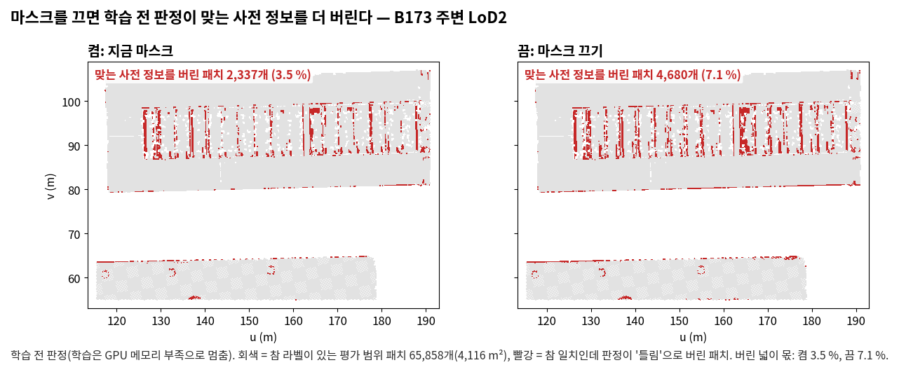

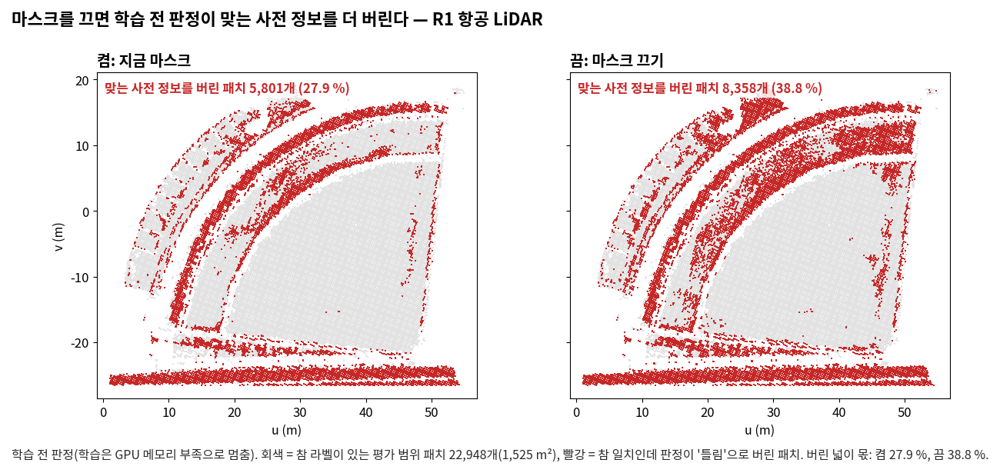

| 지표 | 자리 | 켬 | 끔 | 읽음 |
|---|---|---|---|---|
| **학습 전 판정의 잘못 놓음 (넓이 몫)** | B173 주변 LoD2 | 3.5 % (2,337패치) | **7.1 %** (4,680패치) | 커짐(학습 전 값, 흔들림 없음) |
| 같음 | R1 항공 LiDAR | 27.9 % (5,801패치) | **38.8 %** (8,358패치) | 커짐(같음) |
| **관측 오류 영역 전체의 유입률 (%)** | B173 주변 LoD2 | 61.93 · 60.58 (본 방법) | 결과 없음 | 아직 모름 |
| 같음 | R1 항공 LiDAR | 41.40 · 40.93 (본 방법) | 결과 없음 | 아직 모름 |

- 학습 전 판정: 마스크를 끄면 신뢰도 0이던 화소의 광도 깊이도 판정에 들어간다(준비 보고 4절). 그러면 참 일치인데 '틀림'으로 버리는 넓이가 B173 주변 LoD2에서 두 배, R1 항공 LiDAR에서 1.4배가 된다. 그래서 학습 전 판정에서는 '그 장치(마스크)가 일했다'이다.
- 그림: 학습 결과가 없어 발주 7절의 단면 대신 학습 전 판정의 켬·끔 지도를 두었다. 빨강이 참 일치인데 버린 패치다. B173 주변은 유리 채광창 띠에서, R1은 휜 지붕 띠와 오른쪽 위 지붕에서 빨강이 는다.
- 학습: 두 학습 모두 GPU 메모리 부족으로 멈췄다(2.3절). 가우시안이 견줌의 3~4배로 늘었다. 그래서 관측 오류 영역 유입률 등 학습 뒤의 지표는 '아직 모름'이다. 견줌의 값은 [tables/stage2_results.md](tables/stage2_results.md)에 '결과 없음' 줄로 함께 두었다.

### 4.2 R1 LoD2 · 허용 구간 없애기 (`abl_band_LoD2_s0`)

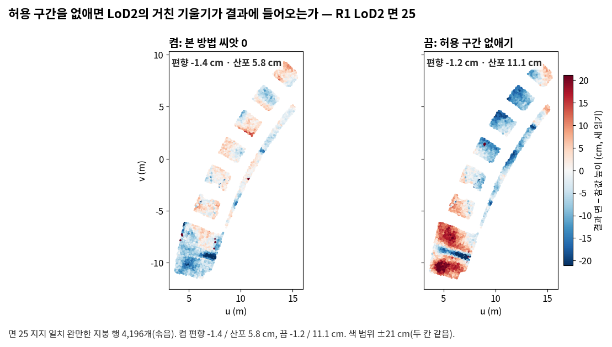

| 지표 | 본 방법 0 · 1 (평균) | 끔 | 차이 | 기준 | 읽음 |
|---|---|---|---|---|---|
| **지지 일치 완만한 지붕 산포, 새 읽기 (cm)** | 4.91 · 5.27 (5.09) | **9.89** | +4.80 | 0.71 | 커짐(나빠짐) |
| **잰 일치의 정확도: 완만한 지붕 편향, 새 읽기 (cm)** | −5.43 · −6.39 (−5.91) | −7.59 | −1.68 | 1.90 | 같음 |
| **고운 자: 지지 일치 거리 중앙값 (cm)** | 5.30 · 6.04 (5.67) | **8.07** | +2.39 | 1.47 | 커짐(나빠짐) |
| 고운 자: 관측 오류 문턱 이내 거리 중앙값 (cm) | 31.30 · 26.64 | 33.10 | +4.14 | 9.23 | 같음(표본 223점) |
| 사전 정보 오류 유입률 (%) | 8.51 · 6.76 (7.63) | **12.78** | +5.14 | 3.46 | 커짐(나빠짐) |
| 렌더 1τ 미만 / 1~2τ 몫, 전체 (%) | 91.33 / 3.07 | 92.13 / 2.36 | +0.80 / −0.71 | 0.48 / 0.44 | 커짐 / 작아짐 |

- 읽는 규칙: 맡은 지표 셋 가운데 산포와 고운 자 거리가 기준을 넘게 나빠졌다. 그래서 '그 장치(허용 구간)가 이 자리에서 일했다'이다. 정확도(편향)는 드러나지 않았다.
- 허용 구간을 없애면 결과 면이 LoD2 쪽으로 더 당겨진다(렌더 1τ 미만 몫 +0.8 %p). 사전 정보 오류 유입률도 함께 커졌다.
- 그림: 면 25(지지 일치 완만한 지붕 4,196행)의 높이 차 지도다. 끔에서 판마다 붉고 푸른 덩어리가 짙어진다(산포 5.8 → 11.1 cm, 같은 색 범위 ±21 cm).
- B173 주변 항공 LiDAR(결정 6)와 방향이 반대다. 거친 LoD2(허용 오차 0.68 m)에서는 허용 구간이 영상의 다듬기를 지키고, 고운 항공 LiDAR에서는 허용 구간이 정밀함을 막는다.

### 4.3 B173 주변 항공 LiDAR · 허용 구간 없애기 (결정 6)

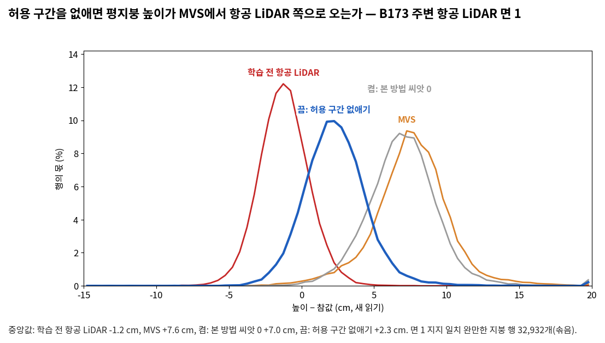

| 지표 | 본 방법 0 · 1 (평균) | 끔 | 차이 | 기준 | 읽음 |
|---|---|---|---|---|---|
| **관측 오류 문턱 이내: 참값 점 → 결과 면 거리 중앙값 (cm)** | 15.45 · 15.65 (15.55) | **11.61** | −3.94 | 1.13 | 작아짐 |
| 사전 정보 오류 유입률 (%) | 0.02 · 0.03 | 0.02 | −0.00 | 1.64 | 같음 |
| 지지 일치: 거리 중앙값 (cm) | 6.86 · 6.91 | **2.55** | −4.34 | 0.58 | 작아짐 |
| 지지 일치 완만한 지붕 편향, 새 읽기 (cm) | +6.81 · +6.85 | **+2.15** | −4.68 | 0.08 | 작아짐 |
| 지지 일치 완만한 지붕 산포, 새 읽기 (cm) | 2.35 · 2.30 | 2.13 | −0.20 | 0.46 | 같음 |
| 렌더 1~2τ 몫, 문턱 이내 (%) | 30.76 · 30.79 | 11.87 | −18.90 | 0.06 | 작아짐 |

- 결정 6의 규칙: 거리가 기준을 넘게 작아졌고 유입률은 기준 안이다. 그래서 '허용 구간이 항공 LiDAR의 정밀함을 막았다. 허용 구간을 없애도 잃은 것이 없다.'이다.
  - 좁힌 몫 = (15.55 − 11.61) ÷ (15.55 − 2.47) = 30 %. 2.47 cm는 학습 전 항공 LiDAR 면의 거리다.
- 나란히 둔 값:

| | 문턱 이내 거리 (cm) | 지지 일치 거리 (cm) | 완만한 지붕 편향 / 산포 (cm) | 사전 정보 오류 유입률 (%) |
|---|---|---|---|---|
| 영상만 0 · 1 | 17.57 · 17.94 | 7.04 · 7.21 | +6.94 / 2.47 · +7.06 / 2.40 | 0.04 · 0.07 |
| 사전 정보 신뢰 | 8.83 | 2.47 | +2.20 / 2.07 | 17.94 |
| 학습 전 항공 LiDAR(표면) | 2.47 | 1.53 | −1.18 / 1.67 | — |

- 그림: 면 1의 높이 차 분포다. 끈 학습(파랑)의 봉우리가 MVS·본 방법(+7 cm 언저리)에서 학습 전 항공 LiDAR(−1.2 cm) 쪽으로 옮겨 +2 cm 언저리에 있다.
- 함께 바뀐 것(기록): F1 @0.2 m 80.1 대 79.4·80.0 %, Chamfer 0.207 대 0.188·0.190 m, PSNR 23.47 대 23.47·23.00 dB.
  - 관측 오류 문턱 이내 유입률(조건 2의 값, 표본 3,388점)은 89.0 → 75.4 %다.

### 4.4 B173 주변 LoD2 · 판정 빌려 오기 끄기 — 학습 결과 없음

| 지표 | 본 방법 0 · 1 (평균) | 끔 | 읽음 |
|---|---|---|---|
| **결측 영역의 사전 정보 오류 유입률 (%)** | 21.83 · 19.68 (20.76), 371점 | 결과 없음 | 아직 모름 |
| **결측 일치 완전성 0.2 m (%)** | 96.20 · 96.71 (96.45), 6,314점 | 결과 없음 | 아직 모름 |

- 일하는 양(4.3): 빌려 온 판정이 있는 결측 패치 2,749개다. '일치'를 빌려 온 것이 1,771개(참 일치 1,146, 참 충돌 70, 참값 없음 555)이고, '틀림'을 빌려 온 것이 978개(참 일치 63, 참 충돌 29, 참값 없음 886)다.
- 학습: 14,400회에서 GPU 메모리 부족으로 멈췄다. 13,000회까지는 가우시안이 본 방법 두 씨앗과 같게 늘었다.
  - 13,600회부터 새 점이 견줌의 1.5배를 넘었다. 14,400회에는 100회에 31.5만 개로, 견줌 13.1만·11.1만 개의 두 배를 넘었다.
  - 13,000 → 14,400회에 사전 정보 출신이 116만 → 243만, 영상 출신이 65만 → 109만으로 늘었다. 견줌(씨앗 0)은 122만 → 186만, 48만 → 66만이다. 두 출신이 모두 두 배 넘게 빨리 늘었다.
  - 보호된 점은 31,090개 대 29,934·29,610개로 거의 같다.
  - 실패는 학습 렌더에서 났다. 래스터라이저가 한 번에 15.06 GiB를 요청했다. 왜 늘었는지는 가리지 않았다.
- 판정 빌려 오기의 답은 B0 저자 15장(4.5)과 R1 항공 LiDAR(4.6)로 낸다.

### 4.5 B0 저자 15장 LoD2 · 판정 빌려 오기 끄기 (`abl_prop_LoD2_s0`)

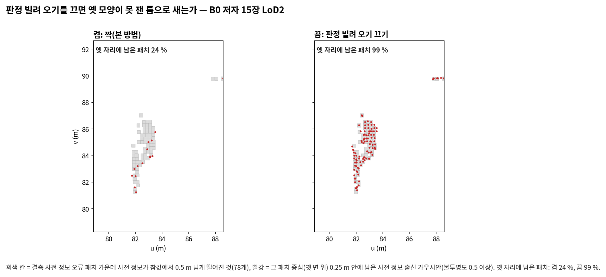

| 지표 | 짝(본 방법) | 끔 | 차이 | 기준 | 읽음 |
|---|---|---|---|---|---|
| **결측 영역의 사전 정보 오류 유입률 (%)** | 24.62 | **32.55** | +7.93 | 4.26 | 커짐(나빠짐) |
| **결측 일치 완전성 0.2 m (%)** | 73.87 | 76.86 | +2.99 | 3.29 | 같음 |
| 사전 정보 오류 유입률 (%) | 4.31 | 4.49 | +0.18 | 1.64 | 같음 |
| 과거 형상 잔존율 (%) | 17.28 | 16.94 | −0.34 | 1.31 | 같음 |

- 기준: 두 씨앗이 없어 6.1의 1번(모은 흔들림 폭)과 3번(세 점의 몫)을 쓴다. 결측 영역의 사전 정보 오류 유입률은 1번이 없어 1단계 여섯 단위 2번 값의 중앙값(4.26 %p)을 썼다.
- 읽는 규칙(맞바꿈): 결측 영역의 사전 정보 오류 유입률이 기준을 넘게 커졌다. 그래서 '빌려 오기가 틀린 옛 모양을 막았다(좋은 얼굴)'이다. 결측 일치 완전성은 기준 안이라 '맞는 사전 정보를 막았다(나쁜 얼굴)'는 드러나지 않았다(차이 2.99 대 기준 3.29 %p, 가까움).
- 그림: 결측 사전 정보 오류 덩어리(학습 전 규칙으로 정한 자리, 사전 정보가 참값에서 0.5 m 넘게 떨어진 78패치)다. 옛 자리에 남은 패치가 켬 24 %에서 끔 99 %로 는다.

### 4.6 R1 항공 LiDAR · 판정 빌려 오기 끄기 (결정 5)

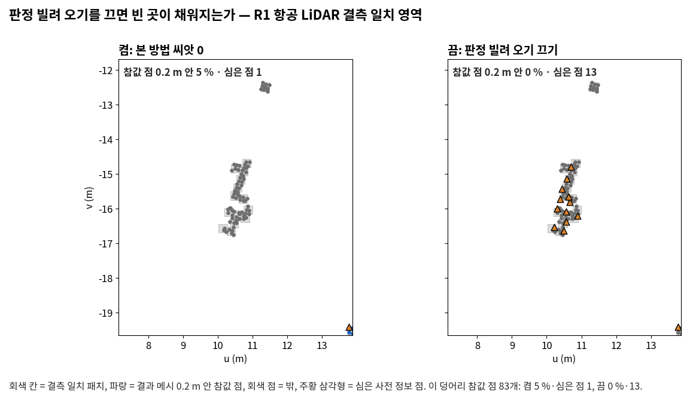

| 지표 | 본 방법 0 · 1 (평균) | 끔 | 차이 | 기준 | 읽음 |
|---|---|---|---|---|---|
| **결측 일치 완전성 0.2 m (%)** | 32.11 · 31.33 (31.72) | 30.03 | −1.69 | 3.29 | 같음 |
| **결측 영역의 사전 정보 오류 유입률 (%)** | 3.33 · 0.00 | 0.00 | −1.67 | 10.00 | 표본 부족(30점) |
| 사전 정보 오류 유입률 (%) | 27.03 · 22.70 | 23.24 | −1.62 | 8.57 | 같음(표본 555점) |
| 과거 형상 잔존율 (%) | 9.89 · 13.19 | 17.58 | +6.04 | 6.53 | 표본 부족(91패치) |

- 읽는 규칙(맞바꿈): 두 지표 모두 기준을 넘게 커지지 않았다. 그래서 '맞는 사전 정보를 막았다'도, '틀린 옛 모양을 막았다'도 드러나지 않았다.
- 심긴 점의 운명(결측 일치 영역, 6.4)은 다음과 같다.

| 학습 | 심은 점 | 지워짐 | 남음 (사전 정보 면 0.2 m 안) | 그 밖 |
|---|---|---|---|---|
| 본 방법 씨앗 0 | 1 | 0 | 0 | 1 |
| 끔 | 61 | 37 (마지막 후손 중앙 4,300회) | 13 | 11 |
| (참고) 사전 정보 신뢰 | 61 | 35 | 11 | 15 |

- 그림: 결측 일치 덩어리(학습 전 규칙으로 정한 자리)다. 끔은 심은 점이 13개로 늘었으나, 메시 0.2 m 안 참값 점은 0 %다(켬 5 %).
- **빌려 오기를 꺼도 빈 곳이 채워지지 않은 까닭**(보충; 범위 주석: 목적 = 결정 5의 해석, 판정 기준 아님): 가능, 근거 불완전.
  - 결측 일치 영역의 처음 점 61개가 모두 심겼다(본 방법은 1개). 그러나 학습 중에 37개가 지워졌고, 사전 정보 면 0.2 m 안에 남은 것은 13개뿐이다.
  - 그 영역의 학습 영상 화소(5,232개) 가운데 51 %에서, 렌더 깊이가 항공 LiDAR보다 절단 거리(4τ = 0.41 m) 넘게 떨어져 있다. 본 방법(51.8·51.7 %)과 영상만(51.8 %)도 같다.
  - 그 화소의 88 %는 렌더가 항공 LiDAR보다 카메라 쪽 앞이다. 다른 면이 그 자리를 가린다.
  - 깊이 항은 켜졌지만 그 화소들은 절단 구간이라 기울기가 0이다. 그래서 당기지 못한 것으로 본다.
  - 사전 정보 신뢰는 절단이 없어(ρ = |r|) 그 화소들을 당긴다. 1τ 안이 70.7 %, 4τ 밖이 15.8 %이고, 결측 일치 완전성은 91.9 %다.
  - 모자란 근거: 무엇이 앞을 가리는지(어느 가우시안, 출신)는 가르지 않았다.
- 보충(렌더 깊이, 결측 일치 영역의 모든 사전 정보 화소; 위의 까닭):

| 학습 | 1τ 미만 | 1~2τ | 2~4τ | 4τ 넘음 (그 가운데 앞) | 깊이 항 켜짐(지금 규칙) |
|---|---|---|---|---|---|
| 본 방법 0 · 1 | 36.4 · 40.6 % | 9.3 · 5.0 % | 2.4 · 2.7 % | 51.8 · 51.7 % (88 · 90 %) | 화소 3.4 % |
| 끔 | 37.9 % | 6.9 % | 3.8 % | 51.4 % (88 %) | 이론상 모든 화소 |
| 영상만 0 | 35.3 % | 9.4 % | 3.5 % | 51.8 % (89 %) | — |
| 사전 정보 신뢰 | 70.7 % | 8.7 % | 4.9 % | 15.8 % (99 %) | 모든 화소, 절단 없음 |

### 4.7 R1 항공 LiDAR · 틀린 옛 점 빼기 끄기 (`abl_initx_ALS_s0`)

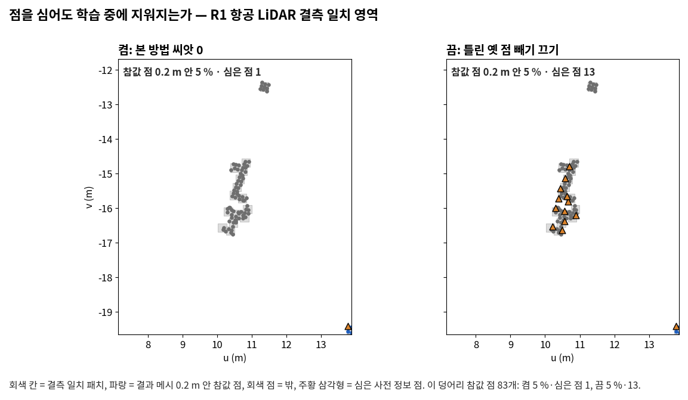
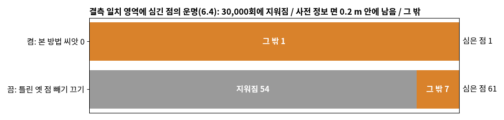

| 지표 | 본 방법 0 · 1 (평균) | 끔 | 차이 | 기준 | 읽음 |
|---|---|---|---|---|---|
| **결측 영역의 사전 정보 오류 유입률 (%)** | 3.33 · 0.00 | 0.00 | −1.67 | 10.00 | 표본 부족(30점) |
| **결측 일치 완전성 0.2 m (%)** | 32.11 · 31.33 (31.72) | 32.38 | +0.66 | 3.29 | 같음 |
| 사전 정보 오류 유입률 (%) | 27.03 · 22.70 | 20.00 | −4.86 | 8.57 | 같음(555점) |
| 과거 형상 잔존율 (%) | 9.89 · 13.19 | 10.99 | −0.55 | 6.53 | 표본 부족(91패치) |

- 읽는 규칙(맞바꿈): 결측 일치 완전성은 기준 안이고, 결측 영역의 사전 정보 오류 유입률은 표본 부족이다. 그래서 '이 자리에서는 드러나지 않았다'이다. 일하는 양(4.3)은 뺀 점 359점이다.
- 심긴 점의 운명(결측 일치 영역, 6.4): 끔에서 61점을 심었고, 54점(88.5 %)이 학습 중에 지워졌다(마지막 후손 중앙 3,100회). 사전 정보 면 0.2 m 안에 남은 점은 0이다. 본 방법은 1점을 심었다.
- 사전 정보 오류 영역 250점의 운명은 켬과 끔이 같다(지워짐 83.2·82.4 대 81.6 %, 옛 자리에 남음 10.0·9.6 대 10.4 %).
- 판정 빌려 오기 끄기(묶음 1)와 견주면 다음과 같다. 같은 61점을 심었지만 빌려 오기 끄기에서는 37점이 지워지고 13점이 남았다. 빼기만 끄면 빌려 온 '틀림' 판정이 그대로라, 깊이 항이 꺼지고 보호도 없어 거의 모두 지워진 것으로 본다(분석자 판독; 판정이 그대로인 것은 4.2의 학습 전 계산에서 확인).
- 그림: 결측 일치 덩어리(14패치, 참값 점 83개)다. 끔에서 심은 점(주황 삼각형)이 13개로 늘었으나, 결과 메시 0.2 m 안 참값 점은 켬과 끔 모두 5 %다.

### 4.8 B173 주변 LoD2 · 보호 끄기 (`abl_prot_LoD2_s0`)

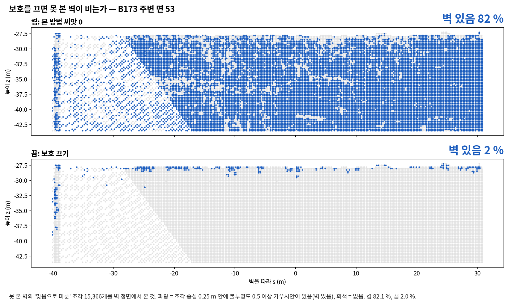

| 지표 | 본 방법 0 · 1 (평균) | 끔 | 차이 | 기준 | 읽음 |
|---|---|---|---|---|---|
| **상속률 (%)** | 81.08 · 77.58 (79.33) | **1.14** | −78.19 | 6.93 | 작아짐(나빠짐) |
| **가우시안이 받친 몫 (%)** | 82.05 · 78.73 (80.39) | **2.00** | −78.39 | 6.57 | 작아짐(나빠짐) |
| 과거 형상 잔존율 (%) | 0.94 · 0.86 | 0.48 | −0.42 | 1.31 | 같음 |
| 사전 정보 오류 유입률 (%) | 6.54 · 7.08 | 7.07 | +0.26 | 1.64 | 같음 |

- 표본: 못 본 벽의 '맞음으로 미룬' 조각 15,366개, 과거 형상 16,846패치, 사전 정보 오류 119,763점.
- 읽는 규칙: 맡은 지표 둘이 모두 기준을 넘게 나빠졌다. 그래서 '그 장치(보호)가 이 자리에서 일했다'이다.
- B0 저자 15장과 달리 과거 형상 잔존율은 기준 안이다(본 방법에서도 0.9 %로 작다).
- 심긴 점의 운명(6.4): 결측 일치 영역 1,168점에서 남음이 14.1·12.2 → 3.1 %, 지워짐이 63.3·70.2 → 93.8 %다. 사전 정보 오류 영역 21,741점에서는 지워짐이 94.2·94.2 → 98.0 %다.
- 그림: 면 53(VIS-v1 장면 3)의 못 본 벽 조각을 정면에서 본 것이다. 벽 있음이 켬 82 %에서 끔 2 %가 된다. 끔에서 남은 것은 지붕 끝과 벽 왼쪽 끝 줄뿐이다.

### 4.9 B0 저자 15장 LoD2 · 보호 끄기 (`abl_prot_LoD2_s0`)

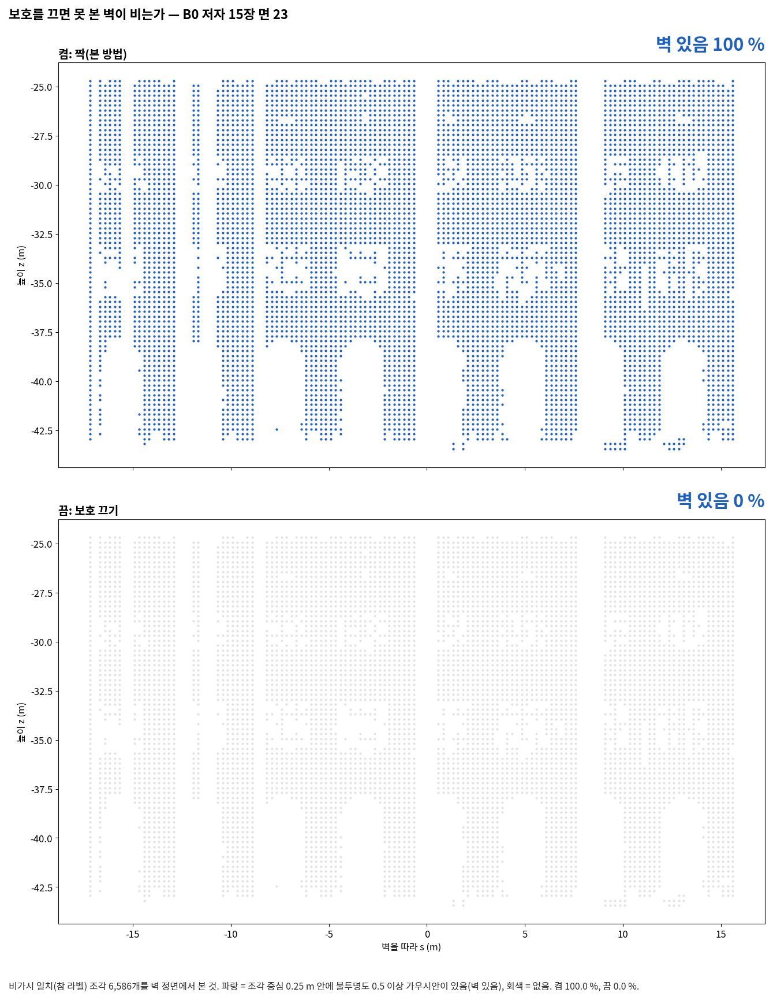

| 지표 | 짝(본 방법) | 끔 | 차이 | 기준 | 읽음 |
|---|---|---|---|---|---|
| **상속률 (%)** | 99.25 | **6.45** | −92.80 | 4.03 | 작아짐(나빠짐) |
| **가우시안이 받친 몫 (%)** | 99.26 | **6.53** | −92.73 | 3.81 | 작아짐(나빠짐) |
| 과거 형상 잔존율 (%) | 17.28 | 13.47 | −3.81 | 1.31 | 작아짐(좋아짐) |
| 사전 정보 오류 유입률 (%) | 4.31 | 4.26 | −0.05 | 1.64 | 같음 |

- 표본: 비가시 일치 22,993패치, 과거 형상 2,709패치, 사전 정보 오류 20,268점.
- 읽는 규칙: 맡은 지표 둘이 모두 기준을 넘게 나빠졌다. 그래서 '그 장치(보호)가 이 자리에서 일했다'이다(B0 저자 15장이라 가능, 근거 불완전).
- 함께 본 과거 형상 잔존율은 작아졌다. 보호가 못 본 곳의 맞는 사전 정보만 지키는 것이 아니라, 못 본 곳의 옛 모양도 함께 지킨다(짝의 비가시 사전 정보 오류에서 옛 형상이 남은 몫 86.1 %, 4.12절).
- 심긴 점의 운명(6.4): 결측 일치 영역 5,904점 가운데 남음이 95.5 → 5.4 %, 지워짐이 2.6 → 73.9 %다. 사전 정보 오류 영역 3,974점에서는 지워짐이 45.3 → 61.5 %다.
- 그림: 면 23(비가시 일치 넓이가 가장 큰 벽)의 조각 6,586개를 정면에서 본 것이다. 벽 있음이 켬 100 %에서 끔 0 %가 된다.

### 4.10 R1 LoD2 · 손실에서만 판정 끄기

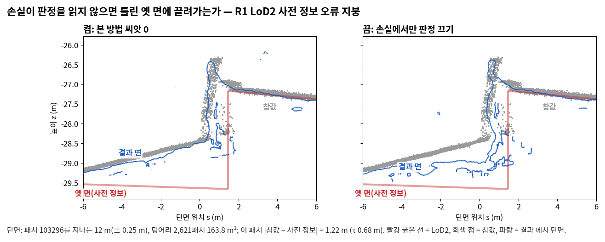

| 지표 | 본 방법 0 · 1 (평균) | 끔 | 차이 | 기준 | 읽음 |
|---|---|---|---|---|---|
| **사전 정보 오류 유입률 (%)** | 8.51 · 6.76 (7.63) | **19.76** | +12.12 | 3.46 | 커짐(나빠짐) |
| **과거 형상 잔존율 (%)** | 4.21 · 2.89 (3.55) | 4.96 | +1.41 | 2.61 | 같음 |
| 고운 자: 사전 정보 오류 영역의 거리 중앙값 (cm) | 8.84 · 8.80 | 21.24 | +12.43 | 0.15 | 커짐 |
| 관측 오류 영역 전체의 유입률 (%) | 19.95 · 20.57 (20.26) | 8.08 | −12.18 | 1.57 | 작아짐 |
| 보정률(사전 정보 오류, 1~1.5τ 구간) (%) | 81.9 · 87.2 | 61.4 | — | — | (기록) |
| F1 @0.2 m (%) · PSNR (dB) | 67.4 · 69.1 · 22.65 · 22.94 | 58.4 · 22.86 | — | — | (기록) |

- 읽는 규칙: 맡은 지표 둘 가운데 사전 정보 오류 유입률이 기준을 넘게 커졌다. 그래서 '그 장치가 이 자리에서 일했다'이다. 과거 형상 잔존율은 드러나지 않았다.
- 심긴 점의 운명(사전 정보 오류 영역 11,518점, 6.4)은 거의 같다.

| 학습 | 지워짐 | 옛 자리에 남음 | 지금 면으로 | 둘 다 아님 | 마지막 후손이 지워진 반복 (중앙) |
|---|---|---|---|---|---|
| 본 방법 0 · 1 | 92.9 · 94.3 % | 1.2 · 1.1 % | 1.9 · 1.5 % | 4.0 · 3.1 % | 3,100 · 3,100 |
| 끔 | 92.5 % | 1.6 % | 1.5 % | 4.5 % | 3,100 |

  그러니 유입률이 커진 것은 심은 옛 점이 남아서라기보다, 판정을 읽지 않는 깊이 항이 결과 면(영상 출신 가우시안 포함)을 옛 LoD2 쪽으로 당긴 탓으로 본다(분석자 판독, 가능·근거 불완전: 출신별 결과 면의 몫은 재지 않았다).
- 그림: 학습 전 규칙으로 고른 단면이다(틀림 판정 & τ < |참값 − 사전 정보| ≤ 4τ 지붕 덩어리, 163.8 m²). 끔에서는 왼쪽 경사 지붕의 결과 면이 참값 아래로, 옛 LoD2 면 쪽으로 내려앉는다.
- 발주 5.2절의 전제(손실이 홀로 일하는 곳은 옛 모양이 절단 거리 안인 곳)와 맞는 자리다. 이 단면의 |참값 − 사전 정보|는 1.22 m로 절단 거리 2.7 m 안이다.

### 4.11 B0 LoD2 · 밀도 제어에서만 판정 끄기 (`abl_densj_LoD2_s0`)

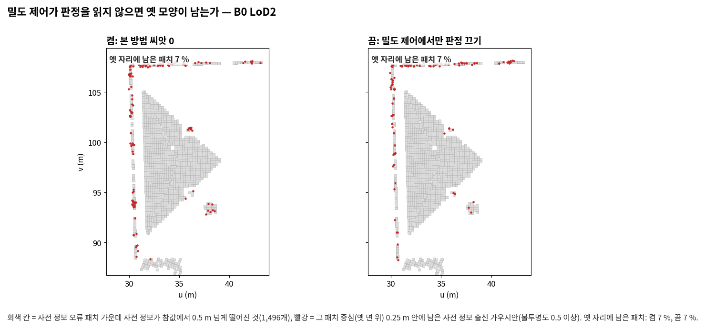

| 지표 | 본 방법 0 · 1 (평균) | 끔 | 차이 | 기준 | 읽음 |
|---|---|---|---|---|---|
| **과거 형상 잔존율 (%)** | 11.44 · 12.56 (12.00) | 11.19 | −0.81 | 2.22 | 같음 |
| 사전 정보 오류 유입률 (%) | 12.10 · 11.86 (11.98) | 9.07 | −2.91 | 1.64 | 작아짐 |

- 표본: 과거 형상 4,468패치, 사전 정보 오류 32,880점.
- 읽는 규칙: 맡은 지표가 기준 안이다. 그래서 '이 자리에서는 드러나지 않았다'이다.
  - 일하는 양: 학습 전 셈(4.3)은 다시 읽기마다 센 최대 15,431점이다. 학습 끝(30,000회)에는 밀도 제어에서 지킨 13,353점 가운데 6,923점이 '틀림' 판정의 점이었다. 판정을 읽었다면 지키지 않았을 점이다.
- 함께 본 사전 정보 오류 유입률은 기준을 넘게 작아졌다(기록). 까닭은 이 실험에서 가르지 않았다.
- 심긴 점의 운명(사전 정보 오류 영역 6,421점, 6.4): 지워짐 78.3·74.7 대 79.1 %, 옛 자리에 남음 7.0·7.5 대 6.5 %로 같은 범위다.
- 그림: B0 LoD2 사전 정보 오류 덩어리(사전 정보가 참값에서 0.5 m 넘게 떨어진 1,496패치)의 평면이다. 옛 자리에 남은 패치가 켬과 끔 모두 7 %다.

### 4.12 B0 저자 15장 · 짝 (본 방법, 영상 13장)

| 지표 | 짝 | (참고) 1단계 B0 상자 본 방법 0 · 1 (영상 243장) |
|---|---|---|
| 사전 정보 오류 유입률 (%) | 4.3 (20,268점) | 12.1 · 11.9 |
| 관측 오류 영역 전체 유입률 (%) | 32.1 | 21.0 · 21.3 |
| 결측 영역의 사전 정보 오류 유입률 (%) | 24.6 (1,625점) | 16.7 · 8.3 (168점) |
| 결측 일치 완전성 0.2 m (%) | 73.9 (37,860점) | 94.4 · 92.7 |
| 전제 위배 둘레 완전성 (%) | 94.8 | 95.3 · 95.5 |
| 과거 형상 잔존율 (%) | 17.3 | 11.4 · 12.6 |
| 비가시 일치: 사전 정보 출신이 받친 몫 (%) | 99.3 (22,993패치) | — (비가시 없음) |
| 비가시 사전 정보 오류: 옛 형상이 남은 몫 (%) | 86.1 (2,465패치) | — |
| F1 @0.2 m (%) · PSNR (dB) | 36.1 · 15.7(평가 2장) | 63.7 · 63.4 · 23.1 · 22.3 |

- 영상이 13장이라 못 본 곳이 많다. 비가시 일치 영역은 사전 정보가 거의 모두 받친다. 반대로 비가시 사전 정보 오류 영역에서도 옛 형상이 86 % 남는다. 이 영역에는 영상이 없어 판정이 버릴 근거가 없기 때문이다(설계대로).
- 이 학습은 3단계 계획의 A15 본 방법 1회를 앞당긴 것이다. 3단계에서 다시 돌리지 않는다.
- 준비 보고 4.3의 빈칸이던 B0 저자 15장의 허용 구간 일하는 양(1τ 미만 화소, g_p = 1)은 이 학습 끝 상태에서 3,761,860화소다.

## 5. 민감도

- 읽는 규칙(6.3): 바꾼 값에서도 조건 1~4의 판단이 그대로이고 지표의 변화가 6.1의 기준 안이면 '둔감하다'이다.
  - 조건 1~4의 판단은 견줌 방법의 1단계 학습이 있는 단위(B173 주변 LoD2, R1 LoD2)에서만 다시 냈다. 고친 자의 r을 썼다.
  - B0 저자 15장은 견줌 학습이 없어 지표의 변화만 본다.
- 표의 '주'·'함께' 지표 전체는 [tables/stage2_results.md](tables/stage2_results.md)에 있다.

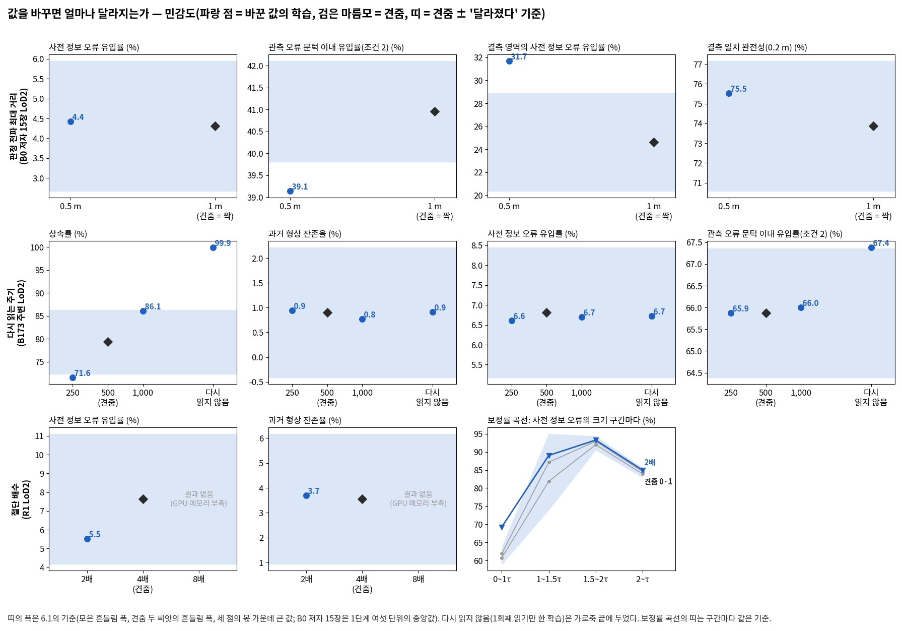

**판정 전파 최대 거리 0.5 m** (`sens_dist05_LoD2_s0`): 둔감하지 않다(가능, 근거 불완전: 두 씨앗 없음, 견줌 학습 없음) — 기준을 넘은 것: 관측 오류 문턱 이내 유입률(조건 2), 결측 영역의 사전 정보 오류 유입률

**다시 읽는 주기 250회** (`sens_e250_LoD2_s0`): 둔감하지 않다 — 기준을 넘은 것: 상속률

| 조건 | 본 방법(두 씨앗 평균) | 이 값 | 견줌 | r | 본 방법 판단 | 이 값의 판단 |
|---|---|---|---|---|---|---|
| 1 | 6.81 % | 6.61 % | 10.17 % | 1.64 %p | 충족 | 충족 |
| 2 | 65.88 % | 65.87 % | 57.21 % | — | 판별 불가(표본 1만 미만) | 판별 불가(표본 1만 미만) |
| 3 | 2.18 cm | 2.13 cm | 2.94 cm | 0.52 cm | 충족 | 충족 |
| 4 | 95.61 % | 95.74 % | 94.16 % | 0.98 %p | 충족 | 충족 |

**다시 읽는 주기 1,000회** (`sens_e1000_LoD2_s0`): 둔감하다

| 조건 | 본 방법(두 씨앗 평균) | 이 값 | 견줌 | r | 본 방법 판단 | 이 값의 판단 |
|---|---|---|---|---|---|---|
| 1 | 6.81 % | 6.70 % | 10.17 % | 1.64 %p | 충족 | 충족 |
| 2 | 65.88 % | 66.00 % | 57.21 % | — | 판별 불가(표본 1만 미만) | 판별 불가(표본 1만 미만) |
| 3 | 2.18 cm | 2.13 cm | 2.94 cm | 0.52 cm | 충족 | 충족 |
| 4 | 95.61 % | 95.79 % | 94.16 % | 0.98 %p | 충족 | 충족 |

**다시 읽지 않음** (`sens_enone_LoD2_s0`): 둔감하지 않다 — 기준을 넘은 것: 상속률, 관측 오류 문턱 이내 유입률(조건 2)

| 조건 | 본 방법(두 씨앗 평균) | 이 값 | 견줌 | r | 본 방법 판단 | 이 값의 판단 |
|---|---|---|---|---|---|---|
| 1 | 6.81 % | 6.72 % | 10.17 % | 1.64 %p | 충족 | 충족 |
| 2 | 65.88 % | 67.38 % | 57.21 % | — | 판별 불가(표본 1만 미만) | 판별 불가(표본 1만 미만) |
| 3 | 2.18 cm | 2.13 cm | 2.94 cm | 0.52 cm | 충족 | 충족 |
| 4 | 95.61 % | 95.99 % | 94.16 % | 0.98 %p | 충족 | 충족 |

**절단 배수 2배** (`sens_trunc2_LoD2_s0`): 둔감하지 않다 — 기준을 넘은 것: 보정률 0~1τ

| 조건 | 본 방법(두 씨앗 평균) | 이 값 | 견줌 | r | 본 방법 판단 | 이 값의 판단 |
|---|---|---|---|---|---|---|
| 1 | 7.63 % | 5.52 % | 36.96 % | 1.64 %p | 충족 | 충족 |
| 2 | 10.65 % | 12.68 % | 12.20 % | — | 판별 불가(표본 1만 미만) | 판별 불가(표본 1만 미만) |
| 3 | 5.09 cm | 4.91 cm | 17.85 cm | 0.52 cm | 충족 | 충족 |
| 4 | 89.09 % | 89.16 % | 88.32 % | 0.98 %p | 충족 | 충족 |

| 보정률 구간 (τ) | 견줌 0 · 1 | 이 값 | 기준 | 점 | 읽음 |
|---|---|---|---|---|---|
| 0.0~1.0 | 60.7 · 61.9 | 69.3 | 2.3 | 940 | 커짐 |
| 1.0~1.5 | 81.9 · 87.2 | 89.0 | 10.4 | 15,560 | 같음(기준 안) |
| 1.5~2.0 | 92.0 · 92.9 | 93.3 | 1.9 | 12,726 | 같음(기준 안) |
| 2.0~∞ | 83.9 · 84.6 | 85.0 | 1.3 | 25,119 | 같음(기준 안) |

**절단 배수 8배** (`sens_trunc8_LoD2_s0`): 결과 없음 — 학습이 멈춤(GPU 메모리 부족; tables/stops.md)

**값마다 읽은 것**

- 전파 최대 거리 0.5 m: 둔감하지 않다(가능, 근거 불완전). 기준을 넘은 지표가 둘이다.
  - 결측 영역의 사전 정보 오류 유입률 24.62 → 31.69 %(+7.07, 기준 4.26 %p, 1,625점). 빌려 오기를 끈 값(32.55 %)에 가깝다.
  - 관측 오류 문턱 이내 유입률(조건 2) 40.96 → 39.14 %(−1.82, 기준 1.15 %p, 769점).
  - 그대로인 것: 사전 정보 오류 유입률 4.31 → 4.42 %, 둘레 완전성 94.78 → 94.86 %, 결측 일치 완전성 73.87 → 75.52 %. 조건 3은 완만한 지붕 행이 없어 값이 없다.
- 다시 읽는 주기 250회: 둔감하지 않다. 상속률이 79.33 → 71.57 %(−7.76, 기준 6.93 %p)로 기준을 넘게 작아졌다. 나머지 주 지표 다섯은 기준 안이고 조건 1~4의 판단은 그대로다. 학습은 76분 걸렸다(500회 주기 64·68분, 1,000회 60분).
- 다시 읽는 주기 1,000회: 둔감하다. 주 지표 여섯이 모두 기준 안이고 조건 1~4의 판단이 그대로다(1·3·4 충족, 2 판별 불가). 상속률 79.33 → 86.09 %(+6.76, 기준 6.93 %p)는 기준에 가깝다. 뜬 조각 몫(늘 적는 값)은 1.30 → 1.90 %다.
- 다시 읽지 않음: 둔감하지 않다. 기준을 넘은 지표가 둘이다.
  - 상속률 79.33 → 99.93 %(+20.60, 기준 6.93 %p). 다시 읽기는 1회째(반복 1)뿐이었다(E.jsonl, 예상대로).
  - 관측 오류 문턱 이내 유입률(조건 2) 65.88 → 67.38 %(+1.51, 기준 1.48 %p, 1,594점). 기준을 겨우 넘었다.
  - 그대로인 것: 과거 형상 잔존율 0.90 → 0.91 %, 사전 정보 오류 유입률 6.81 → 6.72 %, 완만한 지붕 산포 2.18 → 2.13 cm, 둘레 완전성 95.61 → 95.99 %. 조건 1~4의 판단도 그대로다.
  - 장치를 뺀 실험으로 읽으면(6.3) 다시 읽기는 이 자리에서 상속률에 손해였다. 조건 2의 유입률에서는 그 장치가 일했다(기준을 0.03 %p 넘음). 과거 형상 잔존율에서는 드러나지 않았다.
- 주기와 상속률은 한 방향이다: 250회 71.6 → 500회 79.3(두 씨앗 평균) → 1,000회 86.1 → 다시 읽지 않음 99.9 %. 자주 다시 읽을수록 상속률이 작다.
- 절단 배수 2배: 둔감하지 않다. 보정률 곡선의 0~1τ 구간(사전 정보 오류가 허용 오차 안인 940점)이 60.7·61.9 → 69.3 %로 커졌다(기준 2.3 %p). 다른 세 구간, 사전 정보 오류 유입률(7.63 → 5.52 %, 기준 3.46 %p), 과거 형상 잔존율(3.55 → 3.69 %)은 기준 안이다. 조건 1~4의 판단은 그대로다.
- 절단 배수 8배: 학습이 14,300회에서 GPU 메모리 부족으로 멈춰 결과가 없다(2.3절).

## 6. 심긴 점의 운명 (6.4)

- 처음 점 하나와 그 후손을 한 묶음으로 셌다. 사전 정보 오류 영역은 지워짐 → 옛 자리에 남음(불투명도 0.5 이상 후손이 사전 정보 면 0.25 m 안) → 지금 면으로(참값 면 0.2 m 안) → 둘 다 아님의 차례로 먼저 맞는 갈래에 넣었다.
- 결측 일치 영역은 지워짐과 남음(사전 정보 면 0.2 m 안), 그 밖으로 나눴다. 출신은 덤프의 처음 점 번호와 지워진 반복으로 따라갔고, 확인 불가는 없었다.

**R1 · LoD2 · 손실에서만 판정 끄기**

| 학습 | 영역 | 심은 점 | 지워짐 | 옛 자리 / 남음 | 지금 면 / 그 밖 | 둘 다 아님 | 마지막 후손이 지워진 반복 (중앙) |
|---|---|---|---|---|---|---|---|
| 켬: 본 방법 씨앗 0 | 사전 정보 오류 | 11,518 | 10,703 (92.9 %) | 137 (1.2 %) | 219 (1.9 %) | 459 (4.0 %) | 3,100 |
| 켬: 본 방법 씨앗 0 | 결측 일치 | 99 | 64 (64.6 %) | 12 (12.1 %) | 23 (23.2 %) | — | 3,100 |
| 켬: 본 방법 씨앗 1 | 사전 정보 오류 | 11,518 | 10,858 (94.3 %) | 127 (1.1 %) | 175 (1.5 %) | 358 (3.1 %) | 3,100 |
| 켬: 본 방법 씨앗 1 | 결측 일치 | 99 | 77 (77.8 %) | 14 (14.1 %) | 8 (8.1 %) | — | 3,100 |
| 끔 `abl_lossj_LoD2_s0` | 사전 정보 오류 | 11,518 | 10,648 (92.5 %) | 188 (1.6 %) | 168 (1.5 %) | 514 (4.5 %) | 3,100 |
| 끔 `abl_lossj_LoD2_s0` | 결측 일치 | 99 | 60 (60.6 %) | 23 (23.2 %) | 16 (16.2 %) | — | 3,100 |

**B0 · LoD2 · 밀도 제어에서만 판정 끄기**

| 학습 | 영역 | 심은 점 | 지워짐 | 옛 자리 / 남음 | 지금 면 / 그 밖 | 둘 다 아님 | 마지막 후손이 지워진 반복 (중앙) |
|---|---|---|---|---|---|---|---|
| 켬: 본 방법 씨앗 0 | 사전 정보 오류 | 6,421 | 5,028 (78.3 %) | 452 (7.0 %) | 344 (5.4 %) | 597 (9.3 %) | 3,100 |
| 켬: 본 방법 씨앗 0 | 결측 일치 | 1,944 | 415 (21.3 %) | 1,246 (64.1 %) | 283 (14.6 %) | — | 6,100 |
| 켬: 본 방법 씨앗 1 | 사전 정보 오류 | 6,421 | 4,799 (74.7 %) | 482 (7.5 %) | 378 (5.9 %) | 762 (11.9 %) | 3,100 |
| 켬: 본 방법 씨앗 1 | 결측 일치 | 1,944 | 444 (22.8 %) | 1,270 (65.3 %) | 230 (11.8 %) | — | 6,100 |
| 끔 `abl_densj_LoD2_s0` | 사전 정보 오류 | 6,421 | 5,079 (79.1 %) | 414 (6.5 %) | 321 (5.0 %) | 607 (9.4 %) | 3,100 |
| 끔 `abl_densj_LoD2_s0` | 결측 일치 | 1,944 | 429 (22.1 %) | 1,274 (65.5 %) | 241 (12.4 %) | — | 6,100 |

**B173 주변 · LoD2 · 보호 끄기**

| 학습 | 영역 | 심은 점 | 지워짐 | 옛 자리 / 남음 | 지금 면 / 그 밖 | 둘 다 아님 | 마지막 후손이 지워진 반복 (중앙) |
|---|---|---|---|---|---|---|---|
| 켬: 본 방법 씨앗 0 | 사전 정보 오류 | 21,741 | 20,480 (94.2 %) | 585 (2.7 %) | 162 (0.8 %) | 514 (2.4 %) | 600 |
| 켬: 본 방법 씨앗 0 | 결측 일치 | 1,168 | 739 (63.3 %) | 165 (14.1 %) | 264 (22.6 %) | — | 3,100 |
| 켬: 본 방법 씨앗 1 | 사전 정보 오류 | 21,741 | 20,471 (94.2 %) | 600 (2.8 %) | 154 (0.7 %) | 516 (2.4 %) | 600 |
| 켬: 본 방법 씨앗 1 | 결측 일치 | 1,168 | 820 (70.2 %) | 142 (12.2 %) | 206 (17.6 %) | — | 3,100 |
| 끔 `abl_prot_LoD2_s0` | 사전 정보 오류 | 21,741 | 21,301 (98.0 %) | 253 (1.2 %) | 67 (0.3 %) | 120 (0.5 %) | 600 |
| 끔 `abl_prot_LoD2_s0` | 결측 일치 | 1,168 | 1,096 (93.8 %) | 36 (3.1 %) | 36 (3.1 %) | — | 3,100 |

**B0 저자 15장 · LoD2 · 보호 끄기**

| 학습 | 영역 | 심은 점 | 지워짐 | 옛 자리 / 남음 | 지금 면 / 그 밖 | 둘 다 아님 | 마지막 후손이 지워진 반복 (중앙) |
|---|---|---|---|---|---|---|---|
| 켬: 짝(본 방법) | 사전 정보 오류 | 3,974 | 1,801 (45.3 %) | 649 (16.3 %) | 707 (17.8 %) | 817 (20.6 %) | 1,300 |
| 켬: 짝(본 방법) | 결측 일치 | 5,904 | 154 (2.6 %) | 5,639 (95.5 %) | 111 (1.9 %) | — | 4,050 |
| 끔 `abl_prot_LoD2_s0` | 사전 정보 오류 | 3,974 | 2,445 (61.5 %) | 525 (13.2 %) | 585 (14.7 %) | 419 (10.5 %) | 1,100 |
| 끔 `abl_prot_LoD2_s0` | 결측 일치 | 5,904 | 4,363 (73.9 %) | 317 (5.4 %) | 1,224 (20.7 %) | — | 3,100 |

**R1 · 항공 LiDAR · 틀린 옛 점 빼기 끄기**

| 학습 | 영역 | 심은 점 | 지워짐 | 옛 자리 / 남음 | 지금 면 / 그 밖 | 둘 다 아님 | 마지막 후손이 지워진 반복 (중앙) |
|---|---|---|---|---|---|---|---|
| 켬: 본 방법 씨앗 0 | 사전 정보 오류 | 250 | 208 (83.2 %) | 25 (10.0 %) | 0 (0.0 %) | 17 (6.8 %) | 3,100 |
| 켬: 본 방법 씨앗 0 | 결측 일치 | 1 | 0 (0.0 %) | 0 (0.0 %) | 1 (100.0 %) | — | — |
| 켬: 본 방법 씨앗 1 | 사전 정보 오류 | 250 | 206 (82.4 %) | 24 (9.6 %) | 0 (0.0 %) | 20 (8.0 %) | 3,100 |
| 켬: 본 방법 씨앗 1 | 결측 일치 | 1 | 1 (100.0 %) | 0 (0.0 %) | 0 (0.0 %) | — | 3,100 |
| 끔 `abl_initx_ALS_s0` | 사전 정보 오류 | 250 | 204 (81.6 %) | 26 (10.4 %) | 0 (0.0 %) | 20 (8.0 %) | 3,100 |
| 끔 `abl_initx_ALS_s0` | 결측 일치 | 61 | 54 (88.5 %) | 0 (0.0 %) | 7 (11.5 %) | — | 3,100 |

- 손실에서만 판정 끄기: 운명은 켬과 거의 같다(지워짐 92.9·94.3 대 92.5 %). 유입률이 커진 것은 옛 점이 남아서라기보다, 판정을 읽지 않는 깊이 항이 결과 면을 옛 LoD2 쪽으로 당긴 탓으로 본다. 분석자 판독이며 가능, 근거 불완전이다(출신별 결과 면의 몫은 재지 않음).
- 밀도 제어에서만 판정 끄기: 두 영역 모두 켬의 두 씨앗 범위다.
- 보호 끄기: 결측 일치 영역의 남음이 크게 줄고 지워짐이 는다. B173 주변은 14.1·12.2 → 3.1 %, B0 저자 15장은 95.5 → 5.4 %다.
- 틀린 옛 점 빼기 끄기: 결측 일치 영역에 61점이 심겼고 54점(88.5 %)이 지워졌다. 남은 점은 없다.

## 7. 1단계 관문 판정의 '다시 잼' (공식 판정과 나란히)

1단계 공식 판정과 표는 고치지 않았다. 아래 '고친 자' 칸은 4.1의 흔들림 폭으로 같은 값을 다시 판정한 것이다. 조건 3은 새 읽기(참값 높이 위아래 1 m 창 안의 가장 높은 교차)로 판단하고, 지금 읽기를 나란히 둔다.

| 조건 · 단위 | 본 방법 (두 씨앗 평균) | 견줌 | 공식 r | 공식 판정 | 고친 자 r | 고친 자 판정 |
|---|---|---|---|---|---|---|
| 1 · B0 · LoD2 | 12.0 % | 43.6 % | 8.22 %p | 충족 | 1.64 %p | 충족 |
| 1 · B0 · 항공 LiDAR | 42.8 % | 54.2 % | 8.22 %p | 판별 불가(표본 1만 미만) | 1.64 %p | 판별 불가(표본 1만 미만) |
| 1 · B173 주변 · LoD2 | 6.8 % | 10.2 % | 8.22 %p | 판별 불가 | 1.64 %p | **충족** |
| 1 · B173 주변 · 항공 LiDAR | 0.0 % | 17.9 % | 8.22 %p | 충족 | 1.64 %p | 충족 |
| 1 · R1 · LoD2 | 7.6 % | 37.0 % | 8.22 %p | 충족 | 1.64 %p | 충족 |
| 1 · R1 · 항공 LiDAR | 24.9 % | 47.6 % | 8.22 %p | 판별 불가(표본 1만 미만) | 1.64 %p | 판별 불가(표본 1만 미만) |
| 2 · B0 · LoD2 | 15.5 % | 15.6 % | 2.20 %p | 판별 불가(표본 1만 미만) | 흔들림 폭 없음 | 판별 불가(표본 1만 미만) |
| 2 · B0 · 항공 LiDAR | 49.5 % | 51.5 % | 2.20 %p | 판별 불가(표본 1만 미만) | 흔들림 폭 없음 | 판별 불가(표본 1만 미만) |
| 2 · B173 주변 · LoD2 | 65.9 % | 57.2 % | 2.20 %p | 판별 불가(표본 1만 미만) | 흔들림 폭 없음 | 판별 불가(표본 1만 미만) |
| 2 · B173 주변 · 항공 LiDAR | 89.0 % | 86.3 % | 2.20 %p | 판별 불가(표본 1만 미만) | 흔들림 폭 없음 | 판별 불가(표본 1만 미만) |
| 2 · R1 · LoD2 | 10.7 % | 12.2 % | 2.20 %p | 판별 불가(표본 1만 미만) | 흔들림 폭 없음 | 판별 불가(표본 1만 미만) |
| 2 · R1 · 항공 LiDAR | 41.5 % | 42.5 % | 2.20 %p | 판별 불가(표본 1만 미만) | 흔들림 폭 없음 | 판별 불가(표본 1만 미만) |
| 3 · B0 · LoD2 · 지금 / 새 읽기 | 126.74 / 50.39 cm | 1.45 cm | 5.20 cm | 판별 불가(표본 1만 미만) | 0.94 / 0.52 cm | 판별 불가(표본 1만 미만) |
| 3 · B173 주변 · LoD2 · 지금 / 새 읽기 | 2.21 / 2.18 cm | 2.94 cm | 5.20 cm | 판별 불가 | 0.94 / 0.52 cm | 판별 불가 / **충족** |
| 3 · R1 · LoD2 · 지금 / 새 읽기 | 6.04 / 5.09 cm | 17.85 cm | 5.20 cm | 충족 | 0.94 / 0.52 cm | 충족 / 충족 |
| 4 · B0 · LoD2 | 95.4 % | 94.5 % | 0.94 %p | 충족 | 0.98 %p | 충족 |
| 4 · B0 · 항공 LiDAR | 99.8 % | 99.1 % | 0.94 %p | 충족 | 0.98 %p | 충족 |
| 4 · B173 주변 · LoD2 | 95.6 % | 94.2 % | 0.94 %p | 충족 | 0.98 %p | 충족 |
| 4 · B173 주변 · 항공 LiDAR | 98.9 % | 97.2 % | 0.94 %p | 충족 | 0.98 %p | 충족 |
| 4 · R1 · LoD2 | 89.1 % | 88.3 % | 0.94 %p | 충족 | 0.98 %p | 충족 |
| 4 · R1 · 항공 LiDAR | 97.3 % | 94.1 % | 0.94 %p | 충족 | 0.98 %p | 충족 |

- 미충족은 없다. 통과 규칙은 새 읽기와 지금 읽기 모두에서 만족한다.
- 판정이 바뀐 단위는 둘이다. B173 주변 LoD2 조건 1은 판별 불가 → 충족이다. 같은 단위 조건 3은 새 읽기로 충족, 지금 읽기로 판별 불가라 두 읽기가 갈린다(가능, 근거 불완전).
- 결과마다 조건 3의 두 읽기와 뜬 조각 몫은 [tables/prep_tables.md](tables/prep_tables.md) 4.1 끝에 있다. B0 LoD2 본 방법의 NMAD는 새 읽기로 129·124 → 40·61 cm가 되고, 뜬 조각 몫(1 m 넘게 위를 읽은 행)은 39.5·30.0 %다.

## 8. 제안, 확인 불가 항목, 실행 중 바꾼 것, 걸린 시간과 자원

### 8.1 제안 (고치지 않음)

1. **멈춘 학습 4회를 같은 설정으로 48 GB GPU에서 다시 돌린다**(여쭘 2안). 24 GiB 두 장으로는 같은 설정을 돌릴 수 없다. 1단계의 B173만 두 학습도 같은 까닭으로 결과가 없다.
2. **허용 구간을 사전 정보 종류마다 달리 둘지 3단계 전에 정한다.** 허용 구간은 B173 주변 항공 LiDAR에서 정밀함을 막았고(문턱 이내 거리 15.55 → 11.61 cm), R1 LoD2에서는 산포를 지켰다(끄면 5.09 → 9.89 cm). 자리가 하나씩이라 이 작업에서 정하지 않는다.
3. **손실의 판정이 관측 오류 영역의 맞는 사전 정보도 막는 몫을 학습 전 판정에서 센다.** 손실에서만 판정을 끄면 R1 LoD2 관측 오류 영역 유입률이 20.26 → 8.08 %로 작아졌다. MVS가 틀린 곳을 판정이 '사전 정보 틀림'으로 읽는 경로로 본다. 셈만 하고 판정 기준은 두지 않는다.
4. **R1 항공 LiDAR 결측 일치의 빈 곳에서, 앞을 가리는 가우시안의 출신과 자리를 가른다.** 빌려 오기를 꺼도, 틀린 옛 점 빼기를 꺼도 채워지지 않았다. 렌더가 4τ 밖이고, 그 가운데 88 %가 카메라 쪽 앞이다(4.6절).
5. **결과 보고에서 비가시 사전 정보 오류를 따로 적는다.** 보호는 못 본 곳의 옛 모양도 지킨다(B0 저자 15장: 끄면 과거 형상 잔존율 17.28 → 13.47 %). 영상이 없는 곳에서는 판정이 버릴 근거가 없으므로 설계대로의 결과다.
6. **다시 읽기가 상속률을 낮추는 경로를 잰다.** 어느 점의 보호가 언제 풀리는지 본다. 주기와 상속률이 한 방향이다(250회 71.6 → 다시 읽지 않음 99.9 %). 주기를 고르는 것은 상속률과 조건 2 유입률의 맞바꿈이다.
7. **메모리가 갈라진 까닭을 짧게 진단한다**(여쭘 3안). 래스터라이저가 한 번에 15 GiB를 요청한 두 학습(B173 주변 LoD2 빌려 오기 끄기, R1 LoD2 절단 8배)에서, 화면에 크게 덮이는 가우시안이 늘었는지 본다.

### 8.2 확인 불가 항목과 까닭

| 항목 | 까닭 |
|---|---|
| 마스크 끄기 두 자리의 학습 뒤 지표(관측 오류 영역 유입률, 산포, 상속률) | 학습이 GPU 메모리 부족으로 멈춤 |
| B173 주변 LoD2 판정 빌려 오기 끄기 | 같음 |
| R1 LoD2 절단 배수 8배 | 같음 |
| B0 저자 15장의 조건 3(완만한 지붕 산포) | 완만한 지붕 지지 일치 행이 0개 |
| R1 항공 LiDAR 결측 영역의 사전 정보 오류 유입률과 과거 형상 잔존율 | 표본 30점, 91패치(100 미만) |
| 손실에서만 판정 끄기에서 유입률이 커진 통로 | 출신별 결과 면의 몫을 재지 않음 |
| 밀도 제어에서만 판정 끄기에서 사전 정보 오류 유입률이 작아진 까닭 | 같음 |
| 멈춘 학습에서 가우시안이나 버퍼가 커진 까닭 | 15,000회 전에 멈춰 체크포인트가 없음. 기록은 100회마다의 수와 메모리뿐 |
| B0 저자 15장 실험 셋의 흔들림 | 두 씨앗이 없음. 기준은 6.1의 1·3번, 없으면 여섯 단위 중앙값 |

### 8.3 실행 중 바꾼 것

결과를 본 뒤 바꾼 규칙은 없다. 읽는 규칙, 그림 자리, 학습 설정은 학습 전 그대로다. 아래는 표·그림 스크립트와 보고서 글의 고침이다. 시각은 10-10이고, 00:로 시작하는 것만 10-11이다.

| 시각 | 바꾼 것 | 까닭 | 영향 |
|---|---|---|---|
| 16:40 | `bands_s2.py`에 결측 일치·결측 사전 정보 오류 영역의 '모든 사전 정보 화소' 집합과 4τ 넘음 가운데 앞인 몫을 더함 | 빌려 오기를 꺼도 빈 곳이 채워지지 않은 까닭을 보려고(범위 주석: 판정 기준 아님) | 기존 영역의 값은 그대로 |
| 16:42 | `measure_s2.py`: 완만한 지붕 지지 일치 행이 0개인 단위(B0 저자 15장)에서 조건 3 읽기를 건너뜀 | 빈 배열에서 진단의 읽기 함수가 멈춤 | B0 저자 15장의 조건 3은 '읽을 행 없음' |
| 16:50 | 결과 표의 '늘 적는 값'은 그 실험의 주·함께 지표가 아니면 읽음 없이 값만 둠 | 6.1의 기준은 주 지표의 읽기용 | 읽음 칸만 |
| 19:00 | `stops_s2.py`(새): 멈춘 학습의 기록 표(`tables/stops.md`) | 발주 3.7(멈추고, 기록하고, 여쭙는다) | 새 표 |
| 19:03 | `figs_s2.py`에 `maskpre_B173`·`maskpre_R1`(학습 전 판정의 켬·끔 지도)을 더함 | 마스크 끄기 두 학습이 멈춰 발주 7절의 단면을 그릴 결과가 없음. 6.2의 주 지표 하나(학습 전 판정의 잘못 놓음)는 학습 없이 있음 | 발주 7절 그림의 대신 |
| 19:10 | 준비 보고 5절의 'B173 주변 LoD2 잘못 놓음 3.6 %'를 3.5 %로 고침 | 0.0355를 두 번 반올림했다. 반올림 전 3.549 % | 숫자 하나 |
| 20:22 | 벽 그림(`wall_fig`)의 크기를 벽의 가로세로에 맞춤 | 위아래 빈 여백 | 그림 모양만 |
| 20:58 | 틀린 옛 점 빼기 끄기의 운명 막대에서 켬을 위로 | 지도의 왼쪽(켬)과 같은 차례 | 그림 모양만 |
| 22:13 | `tables_s2.py`: 멈춘 학습도 견줌 값과 '결과 없음' 줄로 표에 넣음, 마스크 끄기 표에 학습 전 잘못 놓음 줄을 더함 | 실험마다 숫자 표가 있게(10절) | 표에 줄이 더해짐 |
| 22:14 | `final_s2.py`: 멈춘 학습은 다시 읽기 점검을 하지 않음, 후처리 시간 = `logs/queue.log`의 후처리 단계 합 | 멈춘 학습의 다시 읽기는 멈춘 곳에서 끝남. 전에는 TSDF 시간만 셌다 | 표의 두 칸 |
| 22:15 | 메모리를 모두 GiB로 적음(nvidia-smi MiB ÷ 1024, PyTorch 10⁹ 바이트 × 0.931) | 단위가 섞여 있었다. 중간 보고의 '24.0 GB'는 MiB ÷ 1000이고 GiB로 23.4다. 여쭐 때 적은 '23.6 GB(본 방법 12.7·12.6 GB)'는 10⁹ 바이트이고 GiB로 22.0(11.8·11.7)이다 | 숫자의 단위 |
| 23:22 | `tables_s2.py`의 민감도 관문 다시 판정: r이 없는 조건(조건 2)도 표본 점검을 먼저 함 | `ruler_s2.py`와 같게. 전에는 '판별 불가(표본 1만 미만)' 대신 '값 없음'이 나왔다 | 조건 2의 판단 글자 |
| 00:27 | `final_s2.py`: 민감도 표의 판단을 한국어(충족·판별 불가 등)로, 몫의 r 단위를 %p로, 운명 표의 학습 이름을 '켬: 본 방법 씨앗 0' 꼴로 | 읽기 쉽게 | 글자만 |
| 00:29 | 민감도 그림을 네 칸으로: 다시 읽기 줄에 조건 2(기준을 넘은 지표)를, 절단 배수 줄에 보정률 곡선(6.3)을 더함. 가로축에 값 이름, '다시 읽지 않음'은 축 끝에 | 6.3이 보라는 지표를 모두 그리려고 | 그림 모양 |
| 00:46 | `final_s2.py`: 멈춘 민감도 학습은 '결과 없음'으로 적음, 보정률 구간 이름을 '0~1τ' 꼴로 | 절단 배수 8배가 멈춤. 전에는 '결과 없음' 줄을 기준을 넘은 것으로 셌다 | 민감도 표 |
| 00:47 | 민감도 그림: 멈춘 값의 자리에 '결과 없음'을 적고, 보정률 곡선의 이름표가 겹치지 않게 | 같음 | 그림 모양 |

### 8.4 걸린 시간과 자원

| 단계 | 시각 | 걸린 시간 |
|---|---|---|
| 준비(학습 없음) | 10-10 14:13 ~ 15:20 | 1시간 7분 |
| 앞 묶음 학습 4회와 후처리 | 15:20 ~ 18:01 | 2시간 41분 |
| 중간 보고, 묶음 2 시작 | 18:01 ~ 18:04 | — |
| 묶음 2 학습 15회와 후처리(멈춤 4) | 18:04 ~ 10-11 00:45 | 6시간 41분 |
| 최종 표·그림·보고서·전달 묶음 | 00:45 ~ 00:53 | 8분(글의 대부분은 학습을 기다리는 동안 썼다) |

- 학습 시간 합은 977분(16.3 GPU 시간)이다. 멈춘 4회가 90.5분이다. 후처리와 지표의 합은 147.5분이다. 학습마다의 시간은 2.2절에 있다.
- GPU는 RTX 3090 24 GiB 두 장이고, 한 장에 학습 하나씩 돌렸다. 끝난 학습의 nvidia-smi 최대는 R1 LoD2 손실에서만 판정 끄기의 23.4 GiB다. 호스트 메모리는 125 GB이며, 다른 서비스가 약 58 GB를 쓰고 있다.
- 발주의 예상(준비 3~4시간)보다 준비가 빨랐다. 학습은 메모리 부족으로 멈춘 4회만큼 덜 돌았다.

## 9. 보내기 전 점검 (발주 10절)

- [x] 학습 전에 설정을 저장했고 sha256을 남겼다(15:19:20, `3af9b2e8…`, 첫 학습 15:20).
- [x] 새로 만든 스위치는 기본값에서 학습 전 계산(30회)과 고정 체크포인트의 한 반복(22회)이 r12와 같다(준비 보고 4절).
- [x] 스위치마다 끄려는 결정만 바뀌었다. 예상 밖 차이는 0이다. 판정을 바꾸는 스위치에서도 판정을 읽지 않는 결정은 그대로다.
- [x] 장치가 일하는 양 표가 있고, 기본 자리가 모두 멈춤 기준을 넘는다(3절).
- [x] 고운 자가 진단 값을 다시 낸다(3절).
- [x] 1단계 공식 판정과 표를 고치지 않았다.
- [x] 1단계 관문 판정을 고친 자로 다시 내어 공식 판정 옆에 두었다(7절).
- [ ] 모든 실험에 숫자 표와 켬·끔 그림이 있다 — **일부만.**
  - 숫자 표는 19회 모두 있다. 멈춘 4회는 견줌 값과 '결과 없음' 줄이다.
  - 켬·끔 그림은 결과가 있는 장치 빼기 9회와 민감도 그림에 있다.
  - 마스크 끄기 둘은 학습 전 판정의 켬·끔 지도로 대신했다.
  - B173 주변 LoD2 빌려 오기 끄기와 절단 배수 8배는 학습 결과가 없어 그림도 없다. 같은 실험의 다른 자리(B0 저자 15장)와 민감도 그림의 '결과 없음' 표시가 있다.
- [x] 이름 규칙을 지켰다. 쓰지 않기로 한 세 말은 보고서·표에 없다(검색 0건).
