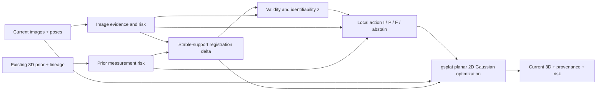

# 국소 최소위험 prior-guided 현재시점 3D 재구성 방법론 v1

> **지위: METHOD DESIGN RECORD — 구현·학습·실험 실행 권한 없음.**
> `scientific_verdict: null`.
>
> 작성: 2026-08-28. 리뷰어: 김휘영.
> 근거 결정: `DEC-P1-025`.
>
> 이 문서는 박사학위 상위 방법론을 설계한다. 기존 E1–E6 condition, Gate S0,
> shared footprint, GT separation, current UAS score-only 규칙을 변경하지 않는다.
> 아래 comparator 이름은 방법론 설계용이며 새 `E7`이나 실행 승인이 아니다.

## 0. 설계 결론

학술적 문제정의는 다음과 같다.

> **본 연구는 현재 항공영상과 시간적 유효성 및 공간 정합이 미확인된 기구축 3D
> prior의 국소 불확실성을 추정하여, 예상 기하오차에 따라 두 증거를 선택·보정·융합
> 또는 유보함으로써 현재시점 3D를 재구성하는 불확실성 인지형 cross-temporal
> prior-guided reconstruction 방법을 연구한다.**

방법의 한 줄 원칙은 다음과 같다.

> **현재성 조건을 통과한 증거들 중, 해당 위치와 기하 자유도에서 예상 기하오차가
> 가장 작은 image, prior 또는 fusion을 사용하고, 안전한 선택이 없으면 유보한다.**

따라서 이 방법은 image-first도 prior-first도 아니다. image와 prior가 충분하고
일치하며 prior가 더 정밀하면 prior-dominant 해가 정상이다. 변화가 없고 정합도
정확한 환경은 연구가 사라지는 경우가 아니라, 제안법이 prior의 장점을 잃지 않아야
하는 **benign non-degradation 영역**이다. 변화·정합오차가 섞인 환경은 안전 중재
기제가 실제로 필요한 stress 영역이다.

## 1. 연구 대상과 비목표

### 1.1 목표 산출물

현재시점 3D `G`와 함께 최소한 다음 정보를 낸다.

- geometry와 좌표계
- geometry element별 provenance와 source decision
- image/prior epoch와 lineage
- currentness evidence 및 posterior/confidence
- 예상 기하오차 또는 calibration bin
- `accepted / corrected / rejected / abstained` 상태

`point cloud`는 가능한 직렬화 중 하나다. 내부 표현은 planar 2D Gaussian일 수 있고,
최종 산출물은 점군·surfel·mesh 등으로 read-out할 수 있다. 상위 기여는 특정 파일
형식보다 **현재시점 기하와 source-risk decision의 결합**이다.

### 1.2 비목표

- prior를 항상 현재 형상으로 복사하는 map reproduction
- 변화 영역 전체를 자동 갱신하는 범용 map-update system
- 단순히 영상 confidence가 낮은 곳에 prior weight를 높이는 규칙
- LoD/ALS가 전역 구조를, 영상이 지역 세부를 항상 소유한다는 고정 분업
- 채움률만 높이고 잘못 채운 오염을 숨기는 completion
- Current UAS LiDAR 또는 evaluation LoD2를 학습·정합·선택에 넣는 oracle method
- 공동 최적화가 순차법보다 우월하다는 사전 결론

## 2. 관측·상태·결정 모형

### 2.1 기호

| 기호 | 의미 | method 입력/잠재/평가 |
|---|---|---|
| `I={I_v}` | 현재시점 다중뷰 항공영상 | 입력 |
| `C={C_v}` | 동결된 camera pose·intrinsics | 입력 |
| `E_I` | SfM/MVS depth·normal·confidence·visibility·segmentation 등 image-derived evidence | 입력 |
| `P={P_k}` | ALS/DSM/LoD 등 기구축 3D prior와 epoch·lineage | 입력 |
| `G` | 재구성할 현재시점 3D | 잠재/출력 |
| `δ` | prior→current의 전역 및 허용된 국소 정합 파라미터 | 잠재 |
| `z(x,d)` | 위치 `x`, 기하 자유도 `d`에서 prior가 현재에도 유효할 확률/상태 | 잠재 |
| `R_I(x,d)` | image를 geometry authority로 쓸 때의 보정된 예상 위험 | 추정 |
| `R_P(x,d)` | prior를 쓸 때 측정·정합·시효를 포함한 예상 위험 | 추정 |
| `R_F(x,d)` | 일치하는 두 증거를 융합할 때의 예상 위험 | 추정 |
| `s(x,d)` | `I`, `P`, `F`, `∅` 중 source action | 잠재/출력 |
| `Y_ref` | 독립 current geometry/reference | **평가 전용** |

`d`를 둔 이유는 source 우열이 한 점에서조차 등방적이지 않을 수 있기 때문이다.
예를 들어 영상은 지붕 경계의 XY를 잘 관측하지만 수직 높이는 약할 수 있고,
정합된 LiDAR prior는 높이·평면 normal은 정밀하지만 오래된 돌출부를 포함할 수 있다.
첫 구현에서는 `d ∈ {height, normal, boundary/support}`를 최소 후보로 두되,
식별성과 구현 복잡도를 보고 합치거나 세분한다.

### 2.2 source별 오차와 관측가능한 단서

| 오류군 | 대표 원인 | 관측 가능한 단서 후보 | 다른 오류와의 혼동 |
|---|---|---|---|
| image random/ill-posed | 무텍스처, 반복무늬, 낮은 교차각, 가림, 반사 | view count, triangulation angle, reprojection residual, photometric consistency, depth variance, MVS confidence, visibility | 실제 변화도 photometric/depth 불일치를 만듦 |
| image model/semantic | depth bias, normal/segmentation 오류 | cross-view consistency, model ensemble disagreement, edge alignment | prior가 맞을 때만 검출되는 순환 가능성 |
| prior measurement | 낮은 density, scan angle, 분류오류, quantization | point density, plane fit residual, acquisition specification, representation level | 시간 변화와 local residual이 유사 |
| registration | CRS/pose bias, strip offset, building-level shift/tilt | stable-region residual field의 공간적 일관성, normal/height systematic pattern | 실제 전체 이동·증축과 혼동 |
| temporal invalidity | 철거·증축·지붕 변경·수목/임시물 | image silhouette/edge, multi-view occupancy, current depth where available, temporal metadata | image 관측 실패이면 판정 불가능 |
| representation/read-out | Gaussian smoothing, extraction/meshing, Roofer assembly | stage별 residual과 failure gate | source error로 잘못 귀속 가능 |

source error model은 GS 구조와 다르다. 전자는 어떤 측정이 왜 틀리고 무엇으로 그
오류를 추정할 수 있는지를 정한다. 후자는 그 측정으로 `G`를 표현·최적화하는
도구다. 따라서 loss는 위 오차원인과 잠재변수의 의미를 보존해야 한다.

### 2.3 currentness eligibility와 geometric authority

prior의 총위험을 단순 센서 정밀도 `σ_P` 하나로 두지 않는다.

```text
R_P(x,d)
  = p(z=valid | E) * R_P,valid(x,d)
  + p(z=invalid | E) * C_stale(x,d)
  + R_registration(x,d; δ)
```

- `R_P,valid`는 유효한 prior 자체의 측정·표현 오차다.
- `C_stale`은 낡은 geometry를 현재로 복사했을 때의 오염 비용이다.
- `R_registration`은 아직 남은 정합 불확실성이다.

image risk `R_I`도 “현재 영상”이라는 이유로 0이 되지 않는다. 현재성은 높지만
무텍스처·가림 영역의 geometry risk는 클 수 있다. fusion은 둘이 같은 현재 표면을
지지하고 오차 상관을 추정할 수 있을 때만 허용한다. 단순 inverse-variance 평균은
독립·무편향 가정이 성립하는 통제 baseline으로만 사용한다.

### 2.4 국소 결정 규칙

보정된 조건부 위험으로 다음 결정을 정의한다.

```text
s*(x,d) = argmin_{a in {I,P,F,empty}} E[L_geom(a,Y) | E_I,E_P,E_cross]
```

단 다음 안전 제약을 둔다.

1. `P`와 `F`는 prior currentness evidence/posterior가 사전 동결한 최소 신뢰 조건을
   넘을 때만 후보가 된다.
2. `F`는 image와 registered prior가 동일 surface hypothesis를 지지할 때만 후보가 된다.
3. 최소 예상위험이 허용위험보다 크거나 action posterior가 모호하면 `∅`를 택한다.
4. 유보 비용 `C_abs`는 0이 아니다. 너무 낮으면 모두 유보하고, 너무 높으면 오염을
   강제하므로 risk–coverage curve 전체로 보고 단일 임계값을 사후 선택하지 않는다.

`선택적 재사용`은 바로 이 `s`를 뜻한다. prior 전체를 건물 단위로 켜고 끄는 것에
한정하지 않고, surface patch와 자유도별로 `P/F`를 허용하거나 `I/∅`로 되돌린다.

## 3. 식별성: 무엇을 구분할 수 있고 무엇은 유보해야 하는가

동일한 image–prior discrepancy는 적어도 세 원인에서 생긴다.

1. prior가 낡았다.
2. prior가 공간적으로 어긋났다.
3. 현재 영상 geometry가 실패했다.

한 지점의 단일 잔차만으로는 일반적으로 식별되지 않는다. 다음의 구조화된 증거를
결합해야 한다.

- 정합오차: 여러 안정 패치에서 비슷한 방향·크기의 coherent residual
- 시간 변화: object/plane boundary를 따르는 국소 불연속과 current multi-view support
- 영상 실패: 낮은 parallax·visibility·photometric consistency와 높은 depth variance

그래도 구분되지 않는 경우를 failure가 아니라 `UNIDENTIFIABLE → ABSTAIN`으로
명시한다. 연구가 성립하려면 모든 영역이 판정 가능할 필요는 없다. 다만 실제
모집단에 다음 중 적어도 하나가 유의미하게 존재해야 한다.

- image와 prior의 국소 우열이 바뀌어 fixed-source보다 local oracle이 나은 영역
- prior currentness 또는 alignment를 허용 evidence로 판정 가능한 영역
- 판정 불가능성을 검출해 강제 채움보다 selective risk를 낮출 수 있는 영역

Cross-temporal GS 선행은 이런 영역의 존재 가능성을 지지하지만, 본 데이터의
식별성·효과크기를 보장하지 않는다. 데이터 차이는 주변 조건이 아니라 방법의
성립 범위 그 자체다.

## 4. 방법 구조



### 4.1 A — 공통 current-image base

Gate-S0-frozen image/pose와 그로부터 파생한 SfM sparse, dense MVS, depth, normal,
confidence, segmentation, visibility, gravity evidence를 사용한다. E3–E6의 기존
공통 base 규칙을 보존한다.

### 4.2 B — hierarchical prior registration

정합 자유도를 과도하게 열면 낡은 prior를 현재 형상에 맞게 변형해 변화 자체를
숨길 수 있다. 첫 설계는 다음 계층을 후보로 둔다.

1. 알려진 CRS/metadata transform
2. AOI/building의 저차원 rigid 또는 similarity correction
3. 필요한 경우에만 강하게 정칙화된 local residual transform

정합은 모든 prior point를 쓰지 않고 image confidence와 prior stability가 동시에
높은 anchor 후보로 시작한다. anchor membership도 확정 진실이 아니므로 잔차
coherence와 leave-region-out 검증으로 감사를 남긴다. non-rigid warp는 별도
ablation 전에는 금지한다.

### 4.3 C — local risk/validity estimator

첫 후보는 구조 patch 단위다. 개별 Gaussian은 densification/pruning으로 identity가
바뀌므로 source decision의 안정적 단위가 되기 어렵다. footprint-aligned XY cell,
image-visible surface patch, plane segment를 비교하고 다음 기준으로 선택한다.

- prior 종류가 달라도 공통 정의 가능
- image evidence와 prior support를 같은 단위로 집계 가능
- boundary에서 과도한 label bleeding 방지
- 최종 point/surfel에 decision을 다시 투영 가능

학습식, self-supervised식, hybrid를 모두 후보로 두되 평가 reference를 입력 feature나
parameter selection에 누출하지 않는다. 현재 reference label이 부족하면 controlled
injection으로 mechanism을 학습하고 real data에서는 calibration만 검증하는 방안을
분리한다.

### 4.4 D — GS representation과 목적함수

재구성 표현은 repository contract에 맞춰 **gsplat planar 2D Gaussian primitives**를
사용한다. 첫 목적함수 골격은 다음과 같다.

```text
min_{G,delta,z,pi}
    L_rgb(G; I,C)
  + lambda_I * sum q_I * rho_I(r_I(G,E_I))
  + lambda_P * sum pi_PF * z * q_P * rho_P(r_P(G,T_delta(P)))
  + lambda_align * L_align(delta)
  + lambda_valid * L_valid(z; E_I,E_P,E_cross)
  + lambda_switch * L_switch(pi; R_I,R_P,R_F,C_abs)
  + lambda_cal * L_calibration
  + R_G(G)
```

- `L_rgb`: 현재 영상에 대한 미분 가능 렌더링 손실이다.
- `r_I`: image-derived depth/normal/visibility evidence와 현재 geometry의 잔차다.
- `r_P`: registered prior surface와 현재 geometry의 point-to-plane/depth/normal 잔차다.
- `q_I`, `q_P`: source의 aleatoric/measurement quality다.
- `z`: prior currentness이며 단순 confidence weight와 구분한다.
- `pi={pi_I,pi_P,pi_F,pi_empty}`: action posterior의 연속 완화다.
- `pi_PF=pi_P+pi_F`: prior geometry term을 실제로 쓰는 action의 총 질량이다.
- `T_delta(P)`: 허용된 정합 모형으로 current frame에 보정한 prior다.
- `L_calibration`: development의 controlled label 또는 비누출 calibration split에서만
  risk confidence와 실제 geometry error의 일치를 학습한다. 독립 test의 `Y_ref`는
  이 항에 들어가지 않고 score에만 사용한다.
- `R_G`: scale, opacity, normal consistency, densification/pruning 등 표현 정칙화다.

이 식은 동결 loss가 아니다. 중요한 것은 residual의 의미와 switch 위치다.
Black–Rangarajan/switchable-constraint 계열처럼 연속 `pi`를 학습하고 최종 action을
경화할 수 있지만, 항상 이산 decision이 최선이라는 결론도 사전 고정하지 않는다.

### 4.5 E — 출력과 출처 보존

각 출력 element에 최소한 다음 필드를 연결한다.

```text
source_action: IMAGE | PRIOR | FUSION | ABSTAIN
source_ids: current_image_lineage, prior_asset_lineage
epochs: current_epoch, prior_epoch
alignment_version: delta_receipt
currentness_score: z
expected_risk: R_selected
decision_evidence: feature/calibration version
```

`PRIOR` 또는 `FUSION`이더라도 currentness가 확인되지 않으면
`PRIOR_REPRODUCTION`이지 `CURRENT_SUPPORTED`가 아니다. 유보 영역을 누락으로
숨기지 않고 coverage denominator에 포함한다.

## 5. 추정 전략과 공정한 경쟁

### 5.1 S0 — 강한 순차 baseline

1. image/prior 공통 안정 영역에서 `δ`를 추정한다.
2. 정합 후 residual과 source evidence로 `z`, `R_I`, `R_P`, `R_F`를 한 번 계산한다.
3. `s`를 고정한 뒤 GS를 최적화한다.

이 baseline은 일부러 약하게 만들지 않는다. proposed method와 같은 evidence,
risk estimator capacity, initialization, compute budget을 사용한다.

### 5.2 J1 — alternating joint candidate

1. image-derived base로 warm start한다.
2. high-confidence stable support에서 `δ`를 갱신한다.
3. 새 residual로 `z`와 source risk/action을 갱신한다.
4. action-weighted evidence로 `G`를 갱신한다.
5. validation loss·alignment stability·action flip rate가 안정될 때 반복을 종료한다.

초기에는 `G`, `δ`, `z/s`를 완전 end-to-end로 동시에 풀지 않는다. 교대 추정이
각 실패를 관찰·절제하기 쉽다. J1이 S0를 이기는 조건이 확인된 뒤에만 end-to-end
variant를 고려한다.

### 5.3 단순화 원칙

- S0가 J1과 동등하면 S0를 최종 방법으로 채택한다.
- 건물 단위 decision이 patch 단위와 동등하면 건물 단위로 단순화한다.
- `F`가 best-source selection보다 이득이 없으면 fusion action을 제거한다.
- calibrated analytic risk가 learned risk와 동등하면 analytic estimator를 채택한다.
- source decision을 예측할 수 없고 abstain만 신뢰 가능하면 reconstruction claim을
  selective reconstruction/reacquisition recommendation으로 축소한다.

## 6. 필수 baseline과 oracle

| ID | 방법 | 답하는 질문 |
|---|---|---|
| `B_I` | image-only current reconstruction | prior 없이 가능한 제품·방법 기준 |
| `B_P` | prior-only read-out | prior 자체가 이미 최종 목적에 충분한가 |
| `B_PR` | registered-prior-only | 이득이 단순 정합만으로 설명되는가 |
| `B_U` | image/prior 단순 union | 선택 없는 결합의 오염 비용 |
| `B_FW` | fixed-weight prior-as-loss | 기본 prior-guided reconstruction |
| `B_CW` | image confidence/adaptive-weight prior | GeoGS·selective-depth 계열 아이디어로 충분한가 |
| `B_SEQ` | 강한 `align→decide→fuse` | 공동/반복 추정이 필요한가 |
| `M_ALT` | proposed alternating estimator | 정합·유효성·geometry 상호의존의 추가가치 |
| `O_LOCAL` | score-only local oracle | 국소 상보성의 달성 가능한 상한 |

`B_P`가 충분한 downstream output을 이미 내면 GS를 거칠 실용적 이유가 약하다.
그 경우 prior-only 경로가 가장 강하고 정직한 답이다. `B_P`는 현 E1–E6 밖의
방법론 comparator이며, 실행하려면 별도 input/output/GT-separation 승인이 필요하다.

## 7. 검증 설계

### 7.1 세 층의 증거

| 층 | 목적 | 허용 주장 |
|---|---|---|
| real benign | 변화·정합오차가 작고 prior가 유효한 현실 조건 | prior 정밀도 보존, non-degradation, calibration |
| controlled injected | 원인·크기 정답이 있는 변화·정합·영상 약화 | 기제 식별, sensitivity, causal ablation |
| independent real conflict | 개발 장면 밖 실제 변화·정합·관측 실패 | 실제 필요성, 일반화, 최종 selective-risk claim |

합성 차이를 강제로 만들 수는 있고 반드시 필요하지만, 그것만으로 real-world
상보성이 존재한다고 주장하지 않는다. injected effect size는 실제 sensor/asset
오차 범위에서 정당화하고, 범위를 벗어난 stress test는 별도 표시한다.

### 7.2 최소 factorial

```text
image evidence:   strong / weak
prior validity:   valid / stale
alignment:        good / biased
```

최소 8-cell을 구성하고 각 cell에서 위치와 자유도별로 다음 기대를 검증한다.

- strong-valid-good: 더 정확한 source 또는 calibrated fusion, non-degradation
- weak-valid-good: prior-dominant rescue 가능
- strong-stale-good: image 선택 또는 fusion 배제
- weak-stale-good: abstain 비율 증가, 강제 prior copying 억제
- valid-biased: 정합 보정 뒤 prior/fusion 회복
- stale-biased: alignment와 change 혼동을 검출하거나 유보

### 7.3 지표

#### Geometry

- point-to-surface/point-to-plane error와 signed height error
- normal angular error
- boundary/support completeness와 correctness
- 자유도별 error (`height`, `normal`, `boundary`)
- downstream-specific geometry/structure metric

#### Decision safety

- action별 coverage와 selective risk
- risk–coverage curve 및 area
- expected-risk calibration error와 reliability plot
- stale-prior contamination rate
- valid-prior rejection rate
- abstention accuracy와 unresolved coverage
- benign-case `B_P`/best-source 대비 non-degradation

#### Mechanism

- `δ` translation/rotation/height error
- `z` discrimination과 calibration
- local source-selection regret: `M - O_LOCAL`
- source action flip rate와 convergence
- sequential–joint gap

#### Downstream

- 사전 선택한 probe별 fail→pass와 pass→fail
- missing output을 포함한 denominator
- Roofer/LoD2와 semantic textured mesh 결과의 독립 보고

단일 AUROC나 평균 Chamfer만으로 안전성을 주장하지 않는다. 정확히 채운 양과 잘못
채운 양, 유보한 양을 같이 보여주는 risk–coverage가 primary safety view다.

### 7.4 oracle과 kill/simplify criterion

`O_LOCAL`은 `Y_ref`를 이용해 각 patch/DoF에서 image와 prior 중 실제 error가 작은
쪽을 사후 선택한다. 방법 입력에는 절대 들어가지 않는다.

1. **Problem kill:** 물리적으로 가능한 mixed real/injected 조건에서도 `O_LOCAL`이
   best fixed single source보다 실질적으로 낫지 않으면 local arbitration/fusion을 접는다.
2. **Automation kill:** oracle gap은 있으나 허용 evidence의 교차검증 예측이 chance
   또는 사전 정의한 최소 효용 아래면 자동 source selection을 접는다.
3. **Joint-method kill:** `B_SEQ`가 `M_ALT`와 동등하거나 더 좋으면 joint/alternating
   novelty claim을 접고 순차법을 채택한다.
4. **Application kill:** `B_P`가 downstream product를 이미 충분히 만들고 current
   update 필요도 입증되지 않으면 GS-based product 경로를 접는다.
5. **Safety kill:** benign case에서 `B_P`/best source를 반복적으로 훼손하고
   calibration으로 억제할 수 없으면 proposed arbitration을 접는다.

threshold와 최소 실질차이는 pilot 결과를 보기 전에 reference uncertainty와 사용
목적을 바탕으로 별도 preregistration에서 동결한다.

## 8. 데이터 역할과 누출 방지

### 8.1 현재 개발 데이터

- Journal1 93동: E1 coverage 기반 development/evaluability subset
- P0 coverage-control 93동: 위 93과 다른 population; 84동만 overlap
- `U_target=199`: 이미 technical census가 열린 non-confirmatory development universe

어느 것도 독립 confirmatory test가 아니다. 93동에서 objective, features, patch unit,
injection response, ablation을 개발할 수 있지만 최종 일반화 주장은 열지 않는다.

### 8.2 reference boundary

- Current UAS LiDAR: geometry score/oracle/evaluation-only
- LoD2 RoofSurface/Z/roof type/semantic/final roof: evaluation-only
- shared LoD2 GroundSurface XY + stable ID: 모든 현 E1–E6의 공통 control만 허용
- current reference는 registration anchor, risk feature, training label, hyperparameter
  selection에 넣지 않는다.

Controlled injection의 원본 clean geometry가 필요할 때도 method가 clean target을 직접
보지 않도록 producer/evaluator를 분리하고 manifest·hash·role을 기록한다.

### 8.3 독립 장면 최소 조건

- 기존 199/93과 공간적으로 분리
- current images/poses와 timestamp 확인
- prior epoch·provider·processing lineage 확인
- benign과 실제 conflict 사례를 모두 포함하거나 명확히 층화
- current independent geometry reference의 평가 coverage 확보
- 결과를 열기 전 split, metric, threshold, failure handling 동결

## 9. 개발 단계와 gate

| 단계 | 산출물 | 다음 단계 gate |
|---|---|---|
| `M0 error audit` | source별 예상오차·관측 feature·reference uncertainty 표 | error term과 누출 경로가 명확 |
| `M1 oracle/baselines` | `B_I/B_P/B_PR/B_U/B_FW/B_CW/O_LOCAL` | mixed condition에 local oracle gap 존재 |
| `M2 sequential` | strong `B_SEQ`, calibration, abstention | 허용 evidence로 유의미한 source-risk 예측 |
| `M3 alternating` | `M_ALT`, convergence/failure receipt | `B_SEQ` 대비 추가가치 또는 단순화 결정 |
| `M4 downstream` | 직접 geometry + 사전 선택 probe | 효과가 특정 read-out artifact가 아님 |
| `M5 independent` | sealed independent-scene result | confirmatory/generalization claim 검토 가능 |

M0에서 먼저 만들 것은 GS architecture가 아니라 다음 두 표다.

1. `source × error cause × observable × latent variable × loss/action` 추적표
2. `data field × method/evaluation role × leakage prohibition` 추적표

그 뒤 최소 baseline과 local oracle로 문제의 상보성·식별성을 값싸게 확인한다.

## 10. long pole과 실패 위험

아래는 실측 일정이 아니라 현재 설계에 근거한 **주관적 planning range**다.

| 항목 | 현실적 소요 | 주된 실패 위험 | 완화/결정 |
|---|---|---|---|
| M0 error/lineage audit | 1–2주 | epoch·spec·정합 계보 불완전 | 불명확 prior를 별도 stratum/unknown으로 유지 |
| oracle + 강한 baseline | 2–4주 | image/prior가 실제로 상보적이지 않음 | 가장 싼 problem kill 또는 scope 축소 |
| sequential risk estimator | 3–6주 | 공백에서 currentness가 식별되지 않음 | abstention/reacquisition 문제로 축소 |
| alternating GS estimator | 4–8주 | joint coupling 불안정, sequential과 차이 없음 | joint claim을 접고 순차법 채택 |
| independent real-conflict scene | 4–12주 이상 | 적합한 epoch/reference/change coverage 미확보 | **학위 일반화의 실제 long pole**; 조기 확보 필요 |

가장 큰 연구 실패 확률은 GS 구현이 아니라 **현재 geometry가 약한 바로 그 위치에서
prior currentness를 판단할 독립적인 현재 증거가 부족할 가능성**이다. 두 번째는
공동 추정이 강한 순차법보다 낫지 않을 가능성이다. 후자는 연구 전체 실패가 아니라
방법 단순화 결과지만, 공동 최적화를 박사 핵심으로 미리 고정하면 실패가 된다.

## 11. 현재 미결정 사항

1. decision unit: XY cell, surface patch, plane segment 중 무엇인가?
2. 자유도: height/normal/boundary를 분리할 데이터가 충분한가?
3. `δ`: AOI rigid, building rigid, vertical bias, local residual 중 어디까지 허용할 것인가?
4. `z`: binary, ternary(`valid/invalid/unknown`), continuous posterior 중 무엇이
   calibration과 optimization에 안정적인가?
5. source risk: analytic uncertainty propagation, learned predictor, hybrid 중 무엇인가?
6. fusion: geometry parameter fusion과 loss-level evidence fusion 중 무엇을 비교할 것인가?
7. abstention: 점/패치 누락, uncertainty volume, 재취득 요청 중 어떤 output contract인가?
8. final downstream probe 2–3개는 무엇이며 독립 reference가 있는가?
9. independent scene은 어떤 데이터로 사전등록할 것인가?

### v1 권고 기본값

- decision unit: **surface patch**, plane/XY cell은 ablation
- validity: **ternary latent state + calibrated posterior**
- registration: **global/building rigid + vertical bias**, non-rigid 금지
- estimator: **analytic features + small calibrated predictor hybrid**
- optimizer: **warm-start sequential 후 alternating**, full end-to-end 보류
- output: source/risk가 보존된 point/surfel과 explicit abstention mask

이 기본값은 구현 freeze가 아니다. M0 error audit와 M1 oracle 결과를 검토한 뒤
사람이 동결한다.

## 12. 방법론 v1 완료조건

이 문서는 다음을 확정했다.

- image-first가 아닌 currentness-gated local minimum-risk 원칙
- source error model과 GS representation의 역할 분리
- `δ`, `z`, source risk, `s∈{I,P,F,∅}`의 핵심 잠재변수
- 강한 sequential baseline과 joint-method kill criterion
- prior-only와 local oracle의 필수 비교 지위
- real benign / controlled injected / independent real-conflict의 3층 검증
- 93동의 development-only 지위와 score-only reference 경계

다음 설계 산출물은 M0의 `SOURCE_ERROR_OBSERVABLES`와 `DATA_ROLE_LEAKAGE` 두
추적표다. 이 둘을 동결하기 전에는 구체 loss weight, switch threshold, patch size,
training schedule을 정하지 않는다.
