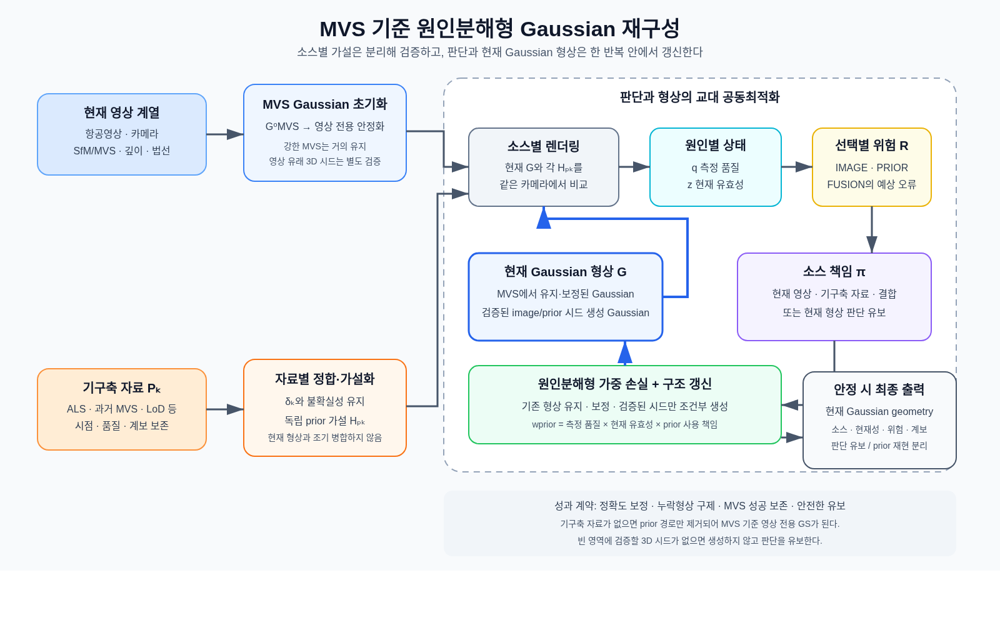

# MVS 기준 최소위험 기구축 3D 자료 유도 Gaussian 재구성 의미 설계 v2

> **지위: METHOD DESIGN RECORD — DRAFT. 구현·학습·실험 실행 권한 없음.**
> `scientific_verdict: null`.
>
> 작성: 2026-08-29. 최신화: 2026-08-31. 리뷰어: 김휘영.
> 상위 결정: `DEC-P1-025`.
>
> 이 문서는 수식보다 먼저 방법의 의미와 작동 논리를 정리한다. 기존 methodology
> v1, E1–E6 연구계약, charter와 decision log를 수정하거나 소급 대체하지 않는다.
> 0–4절만 읽어도 전체 방법을 이해할 수 있도록 구성하고, 세부 변수·예외·검증·문헌
> 경계는 부록에 둔다. 손실 구조는 의미 골격이며 계산식·임계값·학습 방식은 아직
> 동결하지 않는다.

## 0. 다섯 문장으로 보는 방법

1. 현재 항공영상은 대상의 최신 상태를 담지만 가림·무텍스처·불충분한 시차 때문에 영상만으로 만든 형상에는 누락과 오류가 생길 수 있고, 기구축 3D 자료는 안정된 구조를 제공하지만 정합·측정 품질·현재 유효성이 확인되기 전에는 현재 형상으로 사용할 수 없다.
2. 이 방법은 현재 영상 MVS를 평면형 Gaussian으로 변환한 형상을 출발점으로 삼고, 각 기구축 자료는 바로 합치지 않고 현재 좌표계에 정합한 별도의 Gaussian 가설로 유지하여 모든 후보를 같은 표현과 카메라에서 비교할 수 있게 한다.
3. 소스별 렌더링으로 측정 품질과 prior 현재 유효성을 추정하고 영상·기구축 자료·결합을 채택했을 때의 예상 기하오류를 비교하여, 각 영역을 어느 소스가 책임질지 또는 현재 형상 판단을 유보할지를 정한다.
4. 이 판단을 측정 품질·현재 유효성·소스 책임으로 분해한 가중치로 손실에 반영하여 더 안전한 근거가 없으면 MVS 성공을 보존하고, 기존 Gaussian은 영상이나 검증된 prior로 보정하되, 빈 영역의 신규 Gaussian은 검증된 영상 유래 3D 시드 또는 prior 시드가 있을 때만 구조 후보로 생성한 뒤 다시 판단한다.
5. 최종 결과는 정확도 보정·누락형상 구제·MVS 성공 보존·안전한 유보를 구분하고 각 Gaussian의 현재 유효성·예상 위험·데이터 계보를 함께 제공하며, 기구축 자료가 없으면 영상 전용 GS로, 현재 형상을 지지할 3D 시드가 없으면 갱신 유보로 축약된다.

## 1. 방법론의 전체 그림

이 방법은 `MVS 또는 prior 중 하나를 먼저 고르는 전처리기`도 아니고, 두 점군을 먼저
합치는 단순 융합기도 아니다. MVS에서 시작한 **하나의 현재 Gaussian 형상**과
자료별 **검증용 기구축 Gaussian 가설**을 분리해 렌더링하고, 그 비교에서 얻은
판단과 현재 Gaussian을 같은 반복 안에서 갱신하는 방법이다.



이미지가 표시되지 않는 뷰어에서는 다음 흐름으로 읽는다.

```text
현재 영상 → MVS 기준 Gaussian + 영상 유래 3D 시드 후보 ─┐
                                                        ├→ 소스별 렌더링 → q·z → R → pi
기구축 자료 → 자료별 정합 가설 + prior 시드 후보 ───────┘                         │
                                                                                 ↓
현재 Gaussian ← 재렌더링 ← 가중 loss·검증된 시드의 구조 갱신 ←───────────────────┘
```

MVS와 현재 영상은 같은 `현재 영상 소스 계열`이다. MVS는 현재 Gaussian의 초기값이자
기존 사진측량의 성공을 보존하기 위한 기준 형상이지, 영상과 경쟁하는 별도 외부
소스가 아니다. 따라서 `MVS에서 초기화`, `영상 유래 3D 시드에서 조건부 생성`,
`prior 시드에서 조건부 생성`은 세 개의 독립 센서가 아니라 Gaussian의 **생성
계보**다. 기구축 자료별 가설은 검증을 통과해 실제 prior 가중치가 기하 손실에
연결되는 순간에만 검증 전용 상태에서 기하 갱신 참여 상태로 전환된다. MVS에서
시작한다는 사실도 MVS에 자동 기하 권한을 주지는 않으며, 현재성 적격성을 통과한
prior의 예상 위험이 더 낮으면 prior-dominant 보정이 정상적인 결과다.

따라서 최종 결과는 원본 MVS와 prior 중 하나가 아니라, MVS에서 거의 움직이지 않은
Gaussian과 영상 또는 기구축 자료의 근거로 보정·생성된 Gaussian이 함께 있는 현재
형상이다. `E2` direct MVS는 알고리즘 내부 분기가 아니라 이 결과의 비열화를 검사하는
외부 제품 기준선으로 남는다. 방법이 만들어야 할 결과도 하나의 평균 향상이 아니라
다음 네 역할로 구분한다.

| 방법의 역할 | 의미 |
|---|---|
| 정확도 보정 | MVS 형상은 있으나 noisy한 영역을 더 낮은 위험의 영상 또는 prior 근거로 보정 |
| 누락형상 구제 | MVS 형상이 없는 영역을 검증된 3D 시드로 조건부 생성하고 정확도 조건까지 통과 |
| MVS 성공 보존 | 더 낮은 위험을 입증한 근거가 없으면 MVS에서 잘된 형상을 유지 |
| 안전한 유보 | 정합오차·시간 변화·영상 실패 또는 시드 위치를 식별할 수 없으면 생성·갱신하지 않음 |

## 2. 전체 워크플로우

| 단계 | 무엇을 판단하는가 | 무엇이 실제로 작용하는가 |
|---|---|---|
| 1. MVS 기준 형상 초기화 | MVS가 현재 영상의 깊이·법선·가시성을 안정적으로 설명하는가? | MVS를 평면형 Gaussian `G_MVS^0`로 바꾸고 prior를 끈 영상 전용 초기 안정화를 수행한다. 이 단계는 기존 Gaussian의 안정화이며 빈 공간의 무시드 생성을 뜻하지 않는다. |
| 2. 자료별 prior 가설 준비 | 각 prior가 현재 좌표계에 안정적으로 정합되며 어느 영역과 기하 성분을 지지하는가? | 자료마다 정합 상태와 불확실성을 보존하고 별도 Gaussian 가설 `H_Pk`를 만든다. 아직 현재 Gaussian을 움직이지 않는다. |
| 3. 소스별 렌더링과 시드 확인 | 현재 Gaussian과 각 prior 가설이 같은 현재 관측을 얼마나 설명하며, 빈 영역에 영상 유래 또는 prior 유래 3D 시드가 실제로 존재하는가? | 동일 카메라·가시성·지지영역에서 깊이·법선·경계·영상 잔차를 비교하고 시드의 위치·지지영상·부모 계보를 기록한다. |
| 4. 원인별 판단 | 측정 품질 `q`, prior 현재 유효성 `z`, 선택별 예상 기하오류 `R`, 소스 책임 `pi`는 얼마인가? | Gaussian을 잠시 고정하고 상태와 IMAGE / PRIOR / FUSION / ABSTAIN 책임을 갱신한다. |
| 5. Gaussian 형상 갱신 | 어떤 소스가 어느 기하 성분을 얼마나 움직여야 하는가? | 판단값을 고정하고 원인분해형 가중 손실로 기존 Gaussian을 유지·보정한다. |
| 6. Gaussian 집합 갱신 | 기존 형상의 보정으로 충분한가, 검증된 3D 시드로 신규 생성·제거해야 하는가? | 영상 생성은 영상 유래 3D 시드와 다시점 검증을, prior 생성은 정합·품질·현재성 검증을 모두 통과한 구조 후보에서만 허용한다. 시드가 없으면 생성하지 않는다. |
| 7. 재판단과 종료 | 판단과 형상이 안정됐으며 오류 원인을 구분할 수 있는가? | 바뀐 Gaussian을 다시 렌더링해 3–6단계를 반복한다. 불안정하거나 식별 불가능하면 갱신을 유보한다. |

이것이 의미하는 공동최적화는 모든 값을 한 번에 알 수 없는 하나의 거대 함수로
만든다는 뜻이 아니다. 같은 최적화 반복 안에서 먼저 `정합·상태·소스 책임`을
갱신하고, 그 판단을 고정해 `Gaussian 형상·집합`을 갱신하는 **교대 블록
최적화**다. 형상이 바뀌면 판단 근거도 바뀌므로 두 블록은 재렌더링을 통해 서로
영향을 준다.

여기서 영상 유래 3D 시드는 최종 MVS에서 탈락했지만 계보가 남은 SfM/MVS·깊이
후보 또는 기존 표면의 경계에서 다중시점으로 검증 가능한 후보를 뜻한다. 단순 RGB
잔차만으로 임의 깊이에 Gaussian을 만드는 것은 허용하지 않는다. 허용된 current-image
base 안에 위치를 제안할 3D 후보가 전혀 없으면 `IMAGE + 신규 형상 생성`이 아니라
판단 유보로 보낸다. 새로운 monocular depth나 학습형 initializer를 추가하려면 별도
데이터 역할과 비교계약이 필요하다.

## 3. Loss 함수 구성

### 3.1 원인분해형 가중치

일반적인 adaptive weighting은 하나의 잔차나 신뢰도로 prior loss의 크기를 바로
조절할 수 있다. 이 방법은 가중치가 낮아진 원인을 보존하기 위해 다음 역할을
분리한다.

- `q`: 해당 소스가 그 기하 성분을 얼마나 정확하게 측정하는가
- `z`: 정합된 prior 표면이 목표시점에도 유효한가
- `R`: IMAGE·PRIOR·FUSION을 실행했을 때 각각 예상되는 기하오류
- `pi`: 적격한 선택지 중 어느 소스가 형상을 책임질지 나타내는 비율

직접 곱해지는 원인분해형 요소는 `q`, `z`, `pi` 세 가지다. `R`은 네 번째
가중치가 아니라 `pi`를 정하기 위한 중간 판단값이다.

```text
w_image
= q_image × (pi_image + 모든 pi_fusion의 합)

w_prior,k
= q_prior,k × z_k × (pi_prior,k + pi_fusion,k)
```

따라서 prior의 측정 품질이 낮으면 `q`가, 현재 형상이 아니면 `z`가, 유효하지만
다른 소스가 더 안전하면 `pi`가 prior의 기하 작용을 줄인다. 정합 불확실성은 `z`와
`R`의 입력이자 별도 정합 상태로 다루며 네 번째 곱셈 가중치로 중복하지 않는다.

### 3.2 전체 loss의 의미 골격

```text
L_total
= L_current_render
+ lambda_anchor    × L_MVS_anchor
+ lambda_image     × L_image_geometry(w_image)
+ sum_k lambda_prior,k × L_prior_geometry,k(w_prior,k)
+ lambda_surface   × L_surface_consistency
+ lambda_visible   × L_visibility_and_free_space
+ lambda_align     × sum_k L_alignment,k
+ lambda_state     × sum_k L_currentness,k
+ lambda_authority × L_source_authority(pi; R)
+ lambda_cal       × L_risk_calibration
+ L_Gaussian_regularization
```

| 손실 묶음 | 역할 |
|---|---|
| 현재 관측 | `L_current_render`와 영상 유래 기하 손실이 최종 Gaussian을 목표시점 영상으로 계속 검사한다. |
| MVS 보존 | `L_MVS_anchor`가 신뢰할 수 있는 MVS 성공영역의 불필요한 이동을 억제한다. |
| prior 참여 | point-to-plane·depth·normal·경계 잔차와 `w_prior,k`가 검증된 prior만 허용된 기하 성분에 작용하게 한다. |
| 표면·가시성 | depth-distortion·normal·평면성·경계 연속성과 가림·free-space 제약이 두꺼운 표면과 floater를 억제한다. |
| 소스 판단 | 선택별 위험을 비교 가능한 값으로 보정하고, 그 위험과 일치하도록 `pi`와 판단 유보 비율을 갱신한다. |
| 표현 안정화 | Gaussian 크기·불투명도·법선·밀도와 중복을 정규화한다. |

`PRIOR`가 선택돼도 현재 영상 렌더링 손실은 꺼지지 않는다. 낮아지는 것은 불완전한
MVS 기준 형상 유지 또는 영상 유래 정량 기하항이며, 현재 영상은 prior로 갱신한
결과가 목표시점과 모순되지 않는지 계속 검사한다. 현재 관측 자체가 없다면 prior
가중치를 높여 현재 형상으로 복사하지 않고 판단 유보 또는 별도 prior 재현으로 보낸다.

신규 생성과 제거는 loss weight만으로 충분히 표현되지 않으므로, 관측 지지·소스
책임·예상 위험·부모 계보를 조건으로 하는 구조 갱신 규칙을 loss 최적화 사이에 둔다.
구체적인 `q, z, R, pi` 계산식과 확률적 정규화, 잔차·임계값·학습 방식은 다음 수식
설계 단계에서 확정한다.

### 3.3 기하품질이 개선될 수 있는 경로

`q·z·pi`는 기하정보를 새로 만들지 않고 어느 근거를 어디에 허용할지만 정한다.
실제 기하개선은 다음 경로에서 발생해야 한다.

| 경로 | 기대 효과와 한계 |
|---|---|
| MVS 기준 형상 유지 | 정확한 MVS의 위치와 축척을 보존한다. 향상이 아니라 비열화 방지다. |
| 영상 유래 depth·normal과 표면·가시성 제약 | noisy한 Gaussian 표면을 정제할 수 있지만 MVS와 같은 영상에서 나온 상관된 근거이므로 그 자체가 독립 기하정보는 아니다. |
| 검증된 prior 기하 제약 | MVS보다 안정적인 높이·법선·평면·경계를 제공하면 정확도를 보정하고, 빈 영역에 검증된 시드를 제공하면 완전성을 구제할 수 있다. |
| 조건부 구조 갱신과 형상 read-out | 올바른 시드만 생성하고 안정된 depth·opacity·surface에서 최종 point/surfel을 읽어야 렌더링 개선이 실제 기하개선으로 이어진다. |

따라서 depth loss 하나만으로 MVS의 부족을 보완한다고 주장하지 않는다. MVS 성공
보존, 다시점 영상 검증, depth·normal·surface·visibility 제약, 검증된 prior의 독립
구조정보와 안정적인 geometry read-out이 함께 필요하다. 누락영역에 형상을 더했더라도
독립 평가에서 허용 기하오차를 통과하지 못하면 `완전성 구제`가 아니라 오염으로 센다.

## 4. 출력과 유보 원칙

최종 출력은 다음을 함께 제공한다.

- 현재 근거로 지지된 Gaussian 형상
- Gaussian별 생성 출처(`MVS 초기화`, `영상 유래 3D 시드`, `prior 시드`)와 부모 자료
- 정합 이력, 현재 유효성, 예상 위험과 소스 책임
- MVS에서 유지·보정된 형상과 영상/prior로 신규 생성된 형상의 구분
- 판단 유보 영역과 선택적 기구축 자료 재현층

정합오차, 시간 변화와 영상 복원 실패를 행동에 필요한 수준까지 구분하지 못하면
`현재 형상 판단 유보(ABSTAIN) + 갱신 유보`를 적용한다. 현재성이 확인되지 않은
prior를 연속성 자료로 남길 필요가 있으면 `기구축 자료 재현(PRIOR_REPRODUCTION)`으로
분리하며 현재 형상이라고 주장하지 않는다.

기구축 자료가 없으면 자료별 가설·정합·현재성·prior 손실을 모두 제거한 MVS 기준
영상 전용 GS로 축약된다. 이때도 영상 유래 3D 시드가 없는 빈 영역에는 신규
Gaussian을 만들지 않으며, 기존 MVS Gaussian의 안정화·보정만 수행한다.

---

# 부록 — 상세 설계와 검증 경계

## A. 변수의 입출력

| 상태 | 입력 근거 | 출력 의미 | 다음 단계에서의 역할 |
|---|---|---|---|
| 측정 품질 `q_image`, `q_prior,k` | 다시점 지지, MVS 신뢰도, 점밀도, 국소 분산, 평면·법선 안정성, 선택적 센서 메타데이터 | 소스가 그 기하 성분을 얼마나 정밀하게 측정하는가 | 소스별 기하 손실의 강도 제한 |
| 현재 유효성 `z_k` | 정합된 prior와 현재 관측의 깊이·법선·경계 일치, 가시성, 정합 불확실성 | prior 표면이 목표시점에도 유효한가 | prior 참여의 시간적 관문 |
| 예상 위험 `R_image`, `R_prior,k`, `R_fusion,k` | 소스별 렌더링 잔차, `q`, `z`, 정합 불확실성, 소스 간 양립성 | 해당 선택을 실행했을 때 예상되는 기하오류 | 소스 책임 계산의 비교 기준 |
| 소스 책임 `pi` | 적격한 선택지의 상대적 `R`와 판단 유보 비용 | IMAGE / PRIOR / FUSION / ABSTAIN이 맡을 비율 | 실제 기하 가중치와 구조 갱신 결정 |
| 3D 시드 적격성 `seed_image`, `seed_prior,k` | 영상 유래 3D 후보 또는 정합된 prior 지지점의 위치·가시성·부모 계보·예상 위험 | 빈 영역에서 신규 Gaussian의 위치를 제안하고 검증할 근거가 있는가 | 신규 생성의 구조적 관문; loss weight와 별도 |

현재 영상이 해당 영역을 보지 못하면 불일치를 시간 변화로 해석하지 않고
`현재 유효성 식별 불가(UNIDENTIFIABLE)`로 기록한다. `q`는 센서 메타데이터가
없어도 point cloud의 밀도·국소 분산·평면 적합·법선 안정성 등 내부 통계로 추정할
수 있어야 한다. 판단 단위는 개별 Gaussian ID가 아니라 안정적인 surface patch,
plane 또는 footprint-aligned cell과 높이·법선·경계 같은 기하 성분으로 두되, 정확한
단위는 후속 수식·실험 설계에서 비교한다.

## B. 소스 책임과 Gaussian 연산

| 소스 책임 | 의미 | 가능한 Gaussian 연산 |
|---|---|---|
| 현재 영상 근거 `IMAGE` | 현재 영상 계열의 예상 오류가 가장 낮음 | 기존 형상 유지·보정; 검증된 영상 유래 3D 시드가 있을 때만 조건부 신규 생성 |
| 기구축 자료 근거 `PRIOR[k]` | 적격 prior의 예상 오류가 더 낮음 | 기존 형상 보정, 검증 후보에서만 조건부 신규 생성 |
| 두 소스 결합 `FUSION` | 두 소스가 같은 현재 표면을 상보적으로 지지 | 공동 보정; 적어도 하나의 검증된 3D 시드가 있을 때만 조건부 신규 생성 |
| 현재 형상 판단 유보 `ABSTAIN` | 원인을 식별할 수 없거나 모든 선택의 위험이 큼 | 갱신 유보; 선택적으로 prior 재현을 별도 출력 |

Gaussian 연산의 공식적인 한글 명칭은 `기존 형상 유지`, `기존 형상 보정`, `신규
형상 생성`, `형상 제거`, `갱신 유보`로 사용한다. 내부 구현 식별자가 필요할 때만
`KEEP`, `CORRECT`, `SPAWN`, `PRUNE`, `NO-UPDATE`를 병기한다.

반드시 다음 세 상황을 구분한다.

| 상황 | 판단과 실제 작용 |
|---|---|
| prior에는 없지만 현재 영상에는 존재하는 신규 형상 | 최종 MVS에는 없어도 영상 유래 3D 시드와 다시점 검증이 있으면 `IMAGE + 조건부 신규 형상 생성`; 시드가 없으면 RGB만으로 만들지 않고 유보한다. |
| prior는 유효하지만 MVS가 실패한 형상 | 기존 Gaussian이 있으면 `PRIOR + 기존 형상 보정`; 빈 영역이면 정합·품질·현재성을 통과한 prior 시드의 조건부 신규 생성 후보로 보낸다. |
| 현재 관측이 없어 prior 현재성을 확인할 수 없는 형상 | 현재 형상에는 `ABSTAIN + 갱신 유보`; 필요하면 prior 재현을 분리 출력한다. |

표준 GS의 밀도 조절은 주로 기존 Gaussian을 분할·복제하므로 이미 지지된 표면을
세밀하게 할 수는 있어도 떨어진 빈 공간의 올바른 깊이를 자동으로 보장하지 않는다.
빈 영역의 생성에는 명시적인 3D 시드 또는 sampling과 다중시점 검증이 필요하다.

영상 기반과 prior 기반 조건부 신규 형상 생성은 모두 v1의 확정 요소가 아니다.
`영상 기반 보정 전용 vs 영상 시드 조건부 생성 추가`와 `prior 기반 보정 전용 vs
prior 시드 조건부 생성 추가`를 각각 분리해 비교한다. 추가된 형상이 허용 기하오차를
통과하지 못하거나 오염을 늘리면 해당 생성 경로를 제거한다.

## C. 다중 prior와 데이터 계보

다중 prior에서는 `H_Pk, delta_k, q_prior,k, z_k, R_prior,k, pi_prior,k, epoch,
lineage`를 자료별로 끝까지 보존한다. prior끼리 일치한다는 사실은 구조적 일관성의
근거일 수 있지만 목표시점 현재성의 증명은 아니다. 같은 원본 자료에서 파생한 두
자산을 독립 소스로 중복 계산하지 않는다.

최종 Gaussian에는 최소한 생성 출처, 부모 자료, 마지막 기하 갱신 소스, 정합 이력,
현재 유효성, 예상 위험, 형상 변화량을 연결한다. Gaussian에서 point·surfel·surface로
변환하더라도 이 계보를 보존한다.

## D. 검증과 단순화 계약

| 비교 | 검증 질문 |
|---|---|
| direct MVS `E2` vs 영상 전용 GS `E3` | MVS를 Gaussian으로 재표현·최적화하는 것 자체가 손실인가 이득인가? |
| 고정 prior 가중치 vs 일반 단일 adaptive weight vs 원인분해형 | `q·z·pi` 분리가 실제로 필요한가? |
| 순차 `정합→판단→융합` vs 교대 공동최적화 | 판단과 형상의 반복 갱신이 추가 가치를 갖는가? |
| 영상 기반 보정 전용 vs 영상 시드 조건부 생성 추가 | image-only GS의 신규 생성이 실제 누락형상을 정확하게 구제하는가? |
| prior 기반 보정 전용 vs prior 시드 조건부 생성 추가 | prior 기반 생성이 추가 복원보다 오염을 더 만들지 않는가? |
| 소스 결정을 알고 있는 국소 oracle | 제안 판단자의 도달 가능 상한과 판단 오류는 얼마인가? |

일반 단일 가중치가 동등하면 원인분해형을 단순화하고, 강한 순차 방법이 동등하면
공동 반복을 제거하며, 영상 또는 prior 조건부 신규 생성이 각각 순이득을 만들지
못하면 해당 경로를 보정 전용으로 축소한다. GS가 MVS 성공영역을 훼손하거나
실패영역을 추가로 구제하지 못하면 제안 경로를 채택하지 않는다. 평균 오차만 보지
않고 MVS 성공의 실패 전환, MVS 실패의 성공 전환, 위험–적용범위, 판단 유보와
계보별 오류를 함께 보고한다.

위 비교는 방법 내부의 구조 ablation이며 E1–E6 연구조건을 소급 변경하거나 새로운
`E7` 조건을 추가하지 않는다.

구체 임계값과 과학적 판정은 이 문서에서 정하지 않는다. 모든 기술 결과의
`scientific_verdict`는 `null`로 유지한다.

## E. 선행연구의 직접 근거와 전이 범위

| 원문 | 직접 근거 | 이 설계로의 전이 또는 남은 검증 |
|---|---|---|
| [3D Gaussian Splatting, SIGGRAPH 2023](https://repo-sam.inria.fr/fungraph/3d-gaussian-splatting/) | SfM sparse point 초기화와 기존 Gaussian의 분할·복제를 포함한 밀도 조절 | 이 밀도 조절만으로 빈 공간의 seedless metric geometry 생성이 보장되지는 않음 |
| [2D Gaussian Splatting, SIGGRAPH 2024](https://doi.org/10.1145/3641519.3657428) | 평면형 Gaussian, 미분 가능 렌더링과 표면 추출 | 서로 다른 시점의 소스 중재는 다루지 않음 |
| [DN-Splatter, WACV 2025](https://openaccess.thecvf.com/content/WACV2025/html/Turkulainen_DN-Splatter_Depth_and_Normal_Priors_for_Gaussian_Splatting_and_Meshing_WACV_2025_paper.html) | 깊이·법선 기하 단서와 adaptive depth regularization | 동시점 단서를 과거 3D 자료의 현재성 판단으로 옮기는 것은 전이 |
| [GS4Buildings, ISPRS Annals 2025](https://doi.org/10.5194/isprs-annals-X-4-W6-2025-249-2025) | LoD2 기반 2D Gaussian 초기화와 depth·normal prior 최적화 | prior의 오정합·노후화·판단 유보는 별도 검증 필요 |
| [CL-Splats, ICCV 2025](https://openaccess.thecvf.com/content/ICCV2025/papers/Ackermann_CL-Splats_Continual_Learning_of_Gaussian_Splatting_with_Local_Optimization_ICCV_2025_paper.pdf) | 변화영역에 신규 3D point를 명시적으로 sampling하고 다중 view mask로 거른 뒤 국소 최적화 | 명시적 시드·sampling 필요성은 직접 근거지만 metric 항공 geometry와 image/prior 책임 결정은 별도 전이 |
| [Switchable Constraints, IROS 2012](https://nikosuenderhauf.github.io/assets/papers/IROS12-switchableConstraints.pdf) | 상태와 제약 활성화를 함께 최적화해 잘못된 제약을 억제 | 제약 스위치를 `q·z·pi` 소스 책임으로 확장하는 것은 전이 |
| [Wu and Vallet, ISPRS Annals 2026](https://doi.org/10.5194/isprs-annals-XI-2-2026-385-2026) | newer image MVS와 older LiDAR의 변화탐지 후 제거·융합 순차 파이프라인 | 공동 GS가 필요하다는 근거가 아니라 반드시 이겨야 할 강한 순차 비교방법 |

문헌이 직접 지지하는 것은 Gaussian을 기하 제약으로 최적화하고, 불확실하거나 변한
영역의 제약을 줄이며, 필요한 영역을 국소 갱신·생성할 수 있다는 범위까지다. 이
문서가 검증할 결합 가설은 **정합과 현재 유효성이 미확인인 기구축 3D 자료를 소스별
가설로 보존하고, 측정 품질·현재 유효성·선택별 위험·소스 책임을 현재 Gaussian과
교대로 갱신하면 MVS의 성공을 보존하면서 실패영역을 최소위험으로 추가 복원할 수
있다**는 것이다. 이는 아직 문헌으로 확립된 결과나 과학적 성공 주장이 아니다.

## F. 아직 미결인 설계 선택

다음은 누락이 아니라 의도적으로 동결하지 않은 검증 대상이다.

- `q, z, R, pi`의 구체 계산식, 확률적 정규화와 calibration 방법
- 판단 patch와 높이·법선·경계 등 기하 성분의 정확한 계산 단위
- 영상 유래 3D 시드 후보를 어떤 current-image evidence에서 만들고 기각할지
- prior 시드의 정합·현재성·가시성 최소조건과 두 생성 경로의 구조 갱신 규칙
- 렌더링 depth·opacity에서 최종 point/surfel/surface를 읽는 방법
- 교대 공동최적화가 강한 순차법보다 필요한지, 보정 전용보다 각 조건부 생성이
  추가 가치를 갖는지
- 판단 유보 비용, 허용 기하오차, 비열화 한계와 risk–coverage 보고 임계값

이 선택들은 구현·개발 실험 전에 별도 수식 설계와 비누출 검증계약으로 구체화하며,
현재 문서는 어느 선택의 우월성도 과학적 결론으로 고정하지 않는다.
