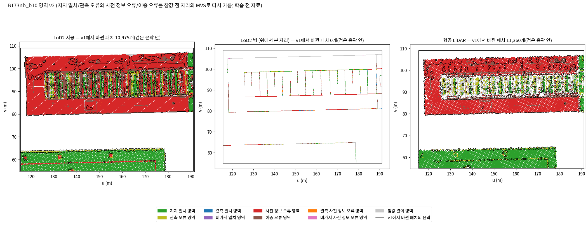
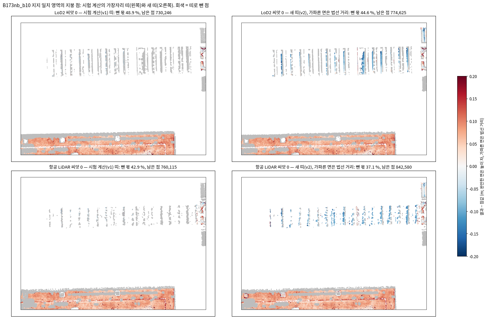
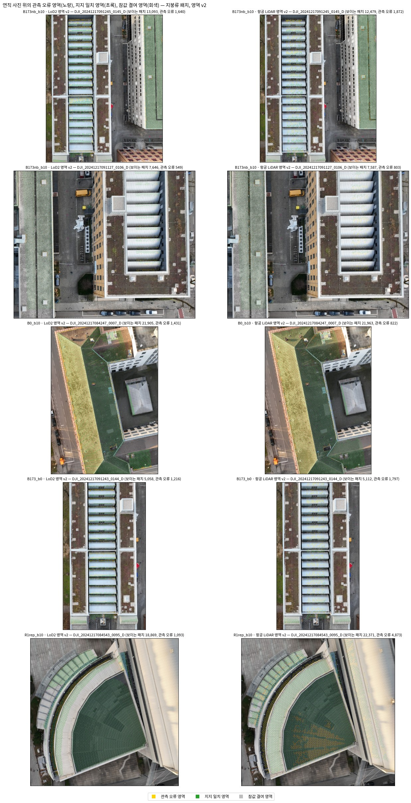
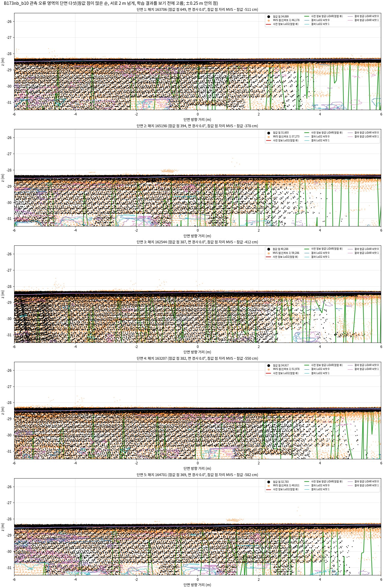
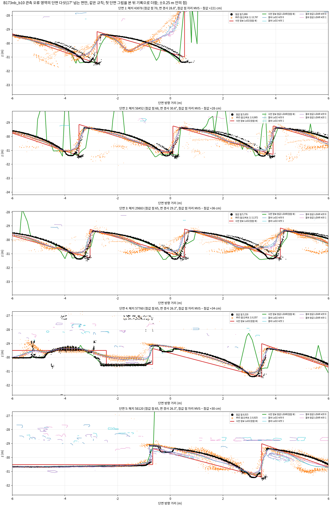
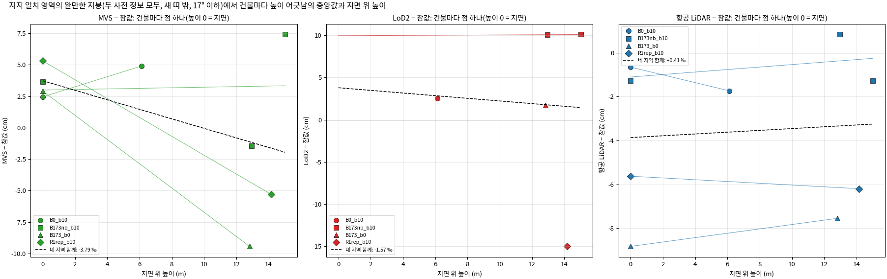
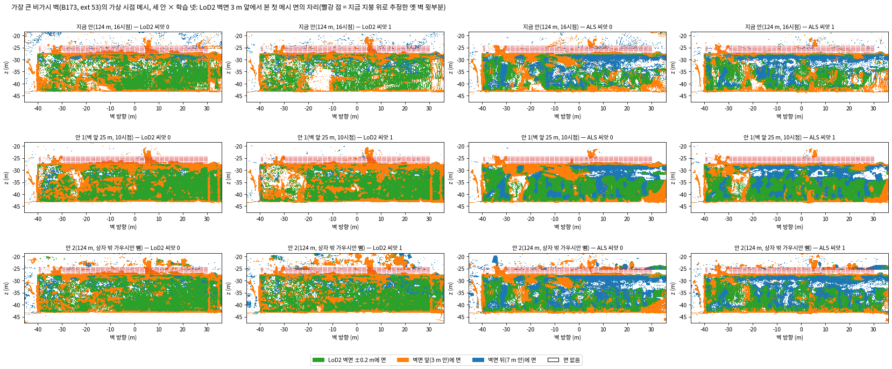

<!-- PHD-MAIN-METRICS-FIX-v1 -->
# 평가 지표 확정 손질 — 보고서 v1

- 작업: `PHD-MAIN-METRICS-FIX-v1` (발주 2026-10-06, 실행 2026-10-06 23:30 ~ 2026-10-07 00:38). `scientific_verdict: null`.
- 판독과 추천은 분석자(에이전트)의 판단이며, 사람 검수 전이다.
- 일한 곳: 브랜치 `exp/main-experiment`, 별도 폴더 `JointBuildGS-exp`. 원래 작업 폴더는 고치지 않았다.
- **학습은 하지 않았다.** 학습 코드 r12, 모듈 v6, 모듈 `metrics_v1`, 0단계와 시험 계산의 결과물은 읽기 전용으로만 썼다.
- 설정
  - `configs/phd/metrics_fix_v1/metrics_fix_v1.json`을 23:35에 저장했다(sha256 `4fb5771b…`). 첫 계산보다 앞서며, 그 뒤 바꾸지 않았다.
  - 참값 의심 규칙 `gt_suspect_rule_v1.json`은 23:53에 저장했다(sha256 `257ca279…`). 학습 전 증거를 본 뒤, 학습 결과에 미치는 효과를 계산하기 전이다.
- 산출 위치: 페이로드 `../JointBuildGS-artifacts/phase-payloads/phd/metrics_fix_v1/PHD-MAIN-METRICS-FIX-v1/`, 그림은 이 문서 옆 `figures/`.
- 이름은 10월 6일에 정한 것을 쓴다(발주 2.3). 코드 안의 이름은 그대로 두었다.
- **이번 숫자로 방법의 우열을 말하지 않는다.** 0단계에는 비교 방법의 학습이 없다.

## 0. 전체 과정에서의 위치

| 큰 단계 | 하는 일 | 상태 |
|---|---|---|
| 가. 실험 설계 | 실제 변화 지역 조사, 자료와 장면, 준비 측정, 비교 짜임 | 끝남 |
| 나. 저장소 정리 | 보존용과 본 실험용 브랜치 | 끝남 |
| 다. 본 실험 준비와 0단계 시험 학습 | 모듈 v6와 포크 r12, B0 조건, 일치 영역, 학습 4회 | 끝남(10월 6일) |
| 라. 평가 지표, 넘어가는 기준, 반복 수 | 지표를 정하고 시험 계산을 마침. 이 발주로 지표 정의를 손질해 확정안을 냄 | **확정안 끝남**(10월 7일, 9절). 승인과 넘어가는 기준·반복 수는 사용자가 정할 차례 |
| 마. 본 실험 1단계 | 핵심 비교 22회 | 다음. 승인되면 영역 파일 v2와 확정안 표(9.1)를 그대로 인용한다 |
| 바. 본 실험 2·3단계 | 장치 빼기 9회, 영상 수 줄이기 18회 | 그다음 |
| 사. 넓히기 | 찾기 범위 여덟 곳 | 1단계 결과를 보고 |
| 아. 결과 정리와 논문 | 7장 결과와 고찰, 전체 정리 | 마지막 |

## 1. 답 먼저

1. **영역 파일 v2로 B173 남쪽 날개가 사전 정보 오류 영역에 돌아왔다(3절).**
   - B173nb의 사전 정보 오류 영역이 LoD2 794 → 1,359 m², 항공 LiDAR 341 → 1,017 m²가 되고, 이중 오류 영역은 1,061 → 495 m², 903 → 227 m²로 준다.
   - 네 지역 × 두 사전 정보의 파일을 1단계가 그대로 쓸 수 있다.
2. **새 띠로 B173 톱니 지붕을 처음 잰다(4절).**
   - 17° 넘는 면에서 띠로 빼는 몫이 98~99 → 68~73 %(LoD2)로 줄고, B173의 띠 밖 지붕 점이 2,225 → 40,458개가 된다.
   - 그 면(곡면 유리)의 법선 거리 편향은 LoD2 학습 −8.9 cm, LoD2 그대로 −8.2 cm, 항공 LiDAR 학습 −2.1 cm(산포 13 cm)다.
3. **관측 오류 영역은 유리와 좁은 홈통에서 영상이 틀린 곳이다(5절).**
   - 참값은 두 겹인 칸이 많지만(B173nb 완만한 면 80 % 대 지지 일치 16 %), 윗겹이 유리 면을 나타낸다.
   - 참값 의심 표시는 B173nb 관측 오류 영역의 44 %(LoD2)를 잡는다. 이를 빼면 학습의 유입률이 66 → 75 %로 오른다. 참값 탓에 유입률이 부풀지는 않았다.
4. **높이 어긋남은 높이에 비례하지 않는다(6절).**
   - 네 지역 함께의 MVS 기울기는 −3.8 ‰(95 % −10.1 ~ +2.5)다.
   - 지역 차이는 상자마다 따로 한 참값 높이 맞춤(−5.3 ~ +4.2 cm)에서 온다. 같은 건물이 상자에 따라 8 cm 다르다.
   - 남쪽 이웃의 학습 편향 +7.0 cm는 그 건물의 MVS(+7.4 cm)를 따른 것이다.
5. **가상 시점은 미리 정한 규칙대로 안 2(124 m 시점, 상자 밖 가우시안 뺌)를 골랐다(7절).**
   - LoD2 − 항공 LiDAR 차이 12.0 %p(지금 안 8.7), 씨앗 변동 1.2 %p(지금 안 2.3)다. 지금 안의 흔들림은 상자 밖 가우시안이 시점을 가린 탓이었다.
   - 다만 지붕 위 몫(메시 수준 과거 형상)은 안 2에서 두 사전 정보를 덜 가른다. 가우시안 수준과 함께 읽는다.
6. **다시 계산한 숫자(8절)**
   - 사전 정보 오류 영역의 유입률은 LoD2 14.1 → 6.8 %다. 날개가 들어와 8τ 이상인 점이 86 %가 되었기 때문이며, 작은 어긋남은 크기별 보정률로 읽는다(보정 경계 2.0τ = 0.35 m).
   - 관측 오류 영역은 LoD2 65.7 %(판별 불가 19.6 %), 항공 LiDAR 85.0 %(52.9 %)다.
   - 항공 LiDAR의 보정률은 한 지역으로는 구간이 서지 않아 1단계에서 지역을 합쳐 읽는다.
   - 판단에 쓰는 넓은 지표의 반복 간 변동 비는 0.1 아래다. 가파른 지붕(LoD2)만 0.18~0.63이다.
7. **확정안은 9.1의 표이고, 사용자가 정할 것은 셋이다(9.2).**
   - 유리 자리: 그대로 세고 표시 뺀 숫자를 옆에 적기를 권한다.
   - 높이 어긋남: 고치지 않고 상대 편향을 함께 적기를 권한다.
   - 상호 보완: 산포로 판단하고 편향은 기록하기를 권한다.
   - 이번 숫자로 방법의 우열은 말하지 않는다.

## 2. 한 일

- **결과 여덟 개**(시험 계산과 같음): 0단계 학습 넷(LoD2·항공 LiDAR × 씨앗 0·1)과 사전 정보 그대로 넷(표면 그대로, 같은 길 메시). 지표는 B173과 이웃(B173nb_b10)에서 낸다. 영역 파일 v2, 관측 오류 영역 점검, 높이 비례 점검은 네 지역 모두에서 했다.
- **모듈 v2** `src/phd/metrics_v2/`: v1을 그대로 두고 판을 올렸다.
  - v1의 다섯 파일은 바이트까지 같다.
  - 띠·통계 파일에는 함수만 덧붙였다.
  - 영역 나누기, 구간 합치기, 지붕 읽기는 새 파일이다.
  - 손으로 만든 장면 시험 9개(30°·60° 평면과 단차의 새 띠, 경사면 법선 거리, 참값 점 자리 MVS로 영역 가르기, 구간 합치기)와 v1 시험 19개가 모두 통과했다.
- **그대로 받은 제안 여덟**(발주 2.2)은 4.8의 다시 계산에 모두 넣었다(8절).

## 3. 영역 파일 v2 (발주 4.2)

지지 일치 영역(2)과 관측 오류 영역(3), 사전 정보 오류 영역(11)과 이중 오류 영역(12)의 경계를 같은 구현으로 다시 갈랐다. 지붕류 패치마다 그 패치가 가진 참값 점 자리에서 MVS 높이(참값 점이 든 0.1 m 칸의 MVS 점 높이 중앙값, 3점 이상)를 읽고, 패치마다 (MVS − 참값)의 중앙값으로 τ와 견줬다.

- **MVS 깊이 지도**: 네 지역 상자 MVS의 깊이 지도 919장을 썼고, 참값 점 99 % 넘게에 값이 있다.
- **v1 그대로 둔 패치**: 참값 점 자리의 MVS 값이 다섯 점 아래인 지붕류 패치는 지역·사전 정보마다 0~62개다. 벽류 패치도 v1 그대로이며, 둘 다 `v1_kept`로 표시했다.
- **계산 시간**: 150초.

**v1에서 v2로 옮겨 간 패치** (패치 수 · 넓이)

| 지역 · 사전 정보 | 지지 일치 → 관측 오류 | 관측 오류 → 지지 일치 | 사전 정보 오류 → 이중 오류 | 이중 오류 → 사전 정보 오류 |
|---|---|---|---|---|
| B0 · LoD2 | 1,547 · 97 m² | 118 · 7 m² | 140 · 9 m² | 1,196 · 75 m² |
| B0 · 항공 LiDAR | 641 · 46 m² | 210 · 14 m² | 12 · 1 m² | 52 · 4 m² |
| B173nb · LoD2 | 451 · 28 m² | 185 · 12 m² | 643 · 40 m² | **9,696 · 606 m²** |
| B173nb · 항공 LiDAR | 169 · 12 m² | 328 · 23 m² | 343 · 23 m² | **10,520 · 700 m²** |
| B173 · LoD2 | 181 · 11 m² | 240 · 15 m² | 620 · 39 m² | 9,140 · 571 m² |
| B173 · 항공 LiDAR | 36 · 2 m² | 80 · 6 m² | 312 · 21 m² | 9,272 · 617 m² |
| R1rep · LoD2 | 47 · 3 m² | 453 · 28 m² | 580 · 36 m² | 3,279 · 205 m² |
| R1rep · 항공 LiDAR | 646 · 49 m² | 457 · 32 m² | 64 · 5 m² | 96 · 7 m² |

**영역 넓이 v1 → v2** (지붕류 + 벽류, 평가 범위 안)

| 지역 · 사전 정보 | 지지 일치 | 관측 오류 | 사전 정보 오류 | 이중 오류 |
|---|---|---|---|---|
| B0 · LoD2 | 3,354 → 3,264 m² | 128 → 217 | 331 → 397 | 128 → 62 |
| B0 · 항공 LiDAR | 1,522 → 1,490 | 32 → 63 | 3 → 6 | 22 → 19 |
| B173nb · LoD2 | 2,026 → 2,010 | 152 → 169 | **794 → 1,359** | **1,061 → 495** |
| B173nb · 항공 LiDAR | 638 → 649 | 165 → 153 | **341 → 1,017** | **903 → 227** |
| B173 · LoD2 | 1,019 → 1,023 | 209 → 206 | 721 → 1,254 | 1,148 → 615 |
| B173 · 항공 LiDAR | 70 → 73 | 164 → 161 | 425 → 1,020 | 829 → 233 |
| R1rep · LoD2 | 1,191 → 1,216 | 440 → 414 | 557 → 726 | 421 → 252 |
| R1rep · 항공 LiDAR | 1,126 → 1,109 | 340 → 356 | 16 → 17 | 38 → 37 |

*읽는 법:* 색이 영역 v2이고, 검은 윤곽 안이 v1에서 바뀐 패치다. 남쪽 날개(v 80~88)가 이중 오류(갈색)에서 사전 정보 오류(빨강)로 옮겨 왔고, 그 밖의 변화는 톱니 지붕 줄무늬와 지붕 둘레의 얇은 띠에 있다.

- **B173 남쪽 날개가 제자리로 왔다.** 두 B173 지역 모두 LoD2·항공 LiDAR에서 이중 오류 영역의 넓이가 절반 아래로 줄었다. 남은 이중 오류 영역은 대부분 날개 밖이며, 시험 계산의 점검에서도 그곳은 참값 자리 MVS가 τ 밖이었다(13 %만 τ 안).
- **B0 LoD2에서는 지지 일치에서 관측 오류로 97 m²가 옮겨 갔다.** 패치 대리값으로는 τ 안이던 곳이 참값 점 자리에서는 τ 밖이었다. B0의 관측 오류 영역 넓이가 128 → 217 m²가 된다.
- 나머지 세 지역의 지도와 읽는 법(같은 꼴: 왼쪽 LoD2 지붕, 가운데 LoD2 벽, 오른쪽 항공 LiDAR)
  - [B0](figures/regions_v2_B0_b10.png): 바뀐 곳은 처마 끝을 두르는 띠(지지 일치 → 관측 오류)와 LoD2 지붕 양 끝의 사전 정보 오류 자리(이중 오류에서 옮겨 옴, 75 m²)다. 벽은 바뀌지 않았다(벽류는 v1 그대로).
  - [B173](figures/regions_v2_B173_b0.png): 상자가 B173 건물만 덮어, 위아래 날개의 넓은 빨강(사전 정보 오류, v1에서는 대부분 이중 오류)과 가운데 톱니 줄무늬(이중 오류·관측 오류·참값 결여가 섞임)뿐이다.
  - [R1rep](figures/regions_v2_R1rep_b10.png): LoD2는 바깥 고리와 아래쪽 띠가 사전 정보 오류이고, 바뀐 곳은 고리 사이의 경계다. 항공 LiDAR는 큰 부채꼴 지붕 안에 지지 일치와 관측 오류 사이로 옮겨 간 패치가 흩어져 있다.

## 4. 새 가장자리 띠, 높이 차를 쓰는 범위, 편향과 산포 (발주 4.3, 4.4)

- **새 가장자리 띠**: 둘레 0.5 m 안 참값 높이의 폭에서 경사가 만드는 폭(2r·tanθ, θ = 그 자리 사전 정보 면의 경사)을 뺀 값이 0.3 m를 넘는 점이다.
- **높이 차를 쓰는 범위**: 17°가 넘는 면은 띠 밖이어도 높이 차 대신 사전 정보 면의 법선 방향 거리로 잰다.
- 지지 일치 영역은 영역 v2를 쓴다.

**가장자리 띠로 뺀 몫, 사전 정보 면 경사별** (시험 계산 v1 → 새 띠 v2; 영역 v2의 지지 일치 지붕 점)

| 경사 | LoD2 | 항공 LiDAR |
|---|---|---|
| 0~5° | 41.5 → 41.5 % (124만 점) | 36.5 → 36.1 % (84만) |
| 5~17° | — | 46.0 → 37.8 % (38만) |
| 17~30° | **99.0 → 72.5 %** (6.4만) | 81.1 → 43.6 % (8.1만) |
| 30~45° | **98.2 → 67.7 %** (9.0만) | 94.1 → 44.2 % (2.4만) |
| 45° 넘게 | — | 97.8 → 27.0 % (1.0만) |
| 전체 | 47.8 → 44.6 % | 43.3 → 37.1 % |

**띠 밖 지붕 점, 건물별** (v1 → v2)

| 건물 | LoD2 | 항공 LiDAR |
|---|---|---|
| B173 (4959326) | **2,225 → 40,458** | **3,103 → 46,932** |
| 남쪽 이웃 (4959460) | 720,818 → 720,818 | 748,564 → 781,774 |
| 108580335 | 7,191 → 13,349 | 7,155 → 13,874 |

*읽는 법:* 지지 일치 영역의 지붕 점을 씨앗 0 학습의 읽기(완만한 면은 높이 차, 가파른 면은 법선 거리, ±0.2 m)로 칠했고, 회색은 띠로 뺀 점이다. 시험 계산(왼쪽)에서 통째로 회색이던 B173 톱니 지붕의 가파른 면이 새 띠(오른쪽)에서는 칠해지며, 대부분 파랑(결과가 참값 면보다 안쪽)이다.

**기하 정확도: 편향 / 산포** (cm; 산포 = NMAD · |차 − 중앙값|의 68.3 % · 95 % 분위)

| 결과 | 완만한 지붕(≤17°, 높이 차) | 가파른 지붕(>17°, 법선 거리) | 가장자리 띠(법선) | 벽(법선) |
|---|---|---|---|---|
| LoD2 씨앗 0 | +7.0 / 2.1 · 2.2 · 4.9 | −8.9 / 5.8 · 6.0 · 12.5 | +6.5 / 3.3 · 3.7 · 12.5 | −3.0 / 6.9 · 7.1 · 22.4 |
| LoD2 씨앗 1 | +7.0 / 2.1 · 2.1 · 4.8 | −9.0 / 6.2 · 6.4 · 12.8 | +6.5 / 3.1 · 3.6 · 12.2 | −3.1 / 6.7 · 6.9 · 23.1 |
| LoD2 그대로(표면) | +10.1 / 3.0 · 2.9 · 5.5 | −8.2 / 6.7 · 6.5 · 15.8 | +7.0 / 5.0 · 4.8 · 18.2 | −1.1 / 3.6 · 4.1 · 14.1 |
| LoD2 그대로(같은 길) | +9.8 / 3.0 · 3.0 · 5.7 | −8.2 / 6.7 · 6.5 · 15.8 | +6.6 / 5.1 · 4.9 · 18.2 | −1.4 / 3.8 · 4.2 · 14.4 |
| 항공 LiDAR 씨앗 0 | +6.8 / 2.3 · 2.3 · 6.0 | −2.1 / 13.0 · 10.8 · 18.0 | +6.3 / 2.6 · 2.8 · 8.5 | — |
| 항공 LiDAR 씨앗 1 | +6.8 / 2.2 · 2.3 · 5.9 | −2.0 / 13.5 · 11.1 · 17.3 | +6.4 / 2.5 · 2.6 · 8.2 | — |
| 항공 LiDAR 그대로(표면) | −1.2 / 1.7 · 1.7 · 3.5 | −1.4 / 2.5 · 2.6 · 8.5 | −1.3 / 1.8 · 1.8 · 4.2 | — |
| 항공 LiDAR 그대로(같은 길) | −1.4 / 1.8 · 1.8 · 3.6 | −1.5 / 2.6 · 2.7 · 8.8 | −1.5 / 1.9 · 1.9 · 4.7 | — |

(점 수: 완만한 지붕 LoD2 72.8만 · 항공 LiDAR 77.7만, 가파른 지붕 4.7만 · 6.6만, 띠 62.3만 · 49.5만, 벽 25.7만.)

- **완만한 지붕**: 편향은 시험 계산과 같다(학습 +7.0 cm). 점의 99 %가 남쪽 이웃 건물이다.
- **가파른 지붕**: 이번에 처음 잰 B173 톱니 면이다.
  - LoD2 학습의 편향은 −8.9~−9.0 cm(결과가 참값 면보다 안쪽)이고, LoD2 그대로도 −8.2 cm다.
  - 항공 LiDAR 학습은 편향 −2 cm에 산포 13 cm로 넓다.
  - 5절의 단면이 보이듯 이 면은 곡면 유리 채광창이다. 참값이 MVS·결과보다 위에 매끄러운 곡선을 그리는 자리다.
- **편향과 산포를 나누면 학습과 사전 정보 그대로가 다르게 갈린다.**
  - 완만한 지붕의 산포는 학습(2.1~2.3 cm)이 LoD2 그대로(3.0 cm)보다 작다. 편향은 학습(+7 cm)과 LoD2 그대로(+10 cm)가 모두 크다.
  - 항공 LiDAR 그대로는 편향(−1.2 cm)도 산포(1.7 cm)도 학습보다 작다.
  - 상호 보완을 산포로 판단할지는 사용자가 정한다(9.2).

## 5. 관측 오류 영역의 참값 점검 (발주 4.5)

관측 오류 영역(3)은 "사전 정보는 참값과 맞고 MVS만 어긋난 곳"이다. 이 어긋남이 영상의 오류인지, 참값(ULS)이 틀린 것인지를 학습 전 자료로 살폈다.

### 5.1 겹쳐 보기

*읽는 법:* 연직 사진 위에 지붕류 패치를 노랑(관측 오류), 초록(지지 일치), 회색(참값 결여)으로 찍었다. B173 두 상자에서 노랑은 톱니 지붕의 유리 채광창 마루와 홈통 줄에 모이고, B0에서는 처마 끝과 지붕창 몇 곳, R1rep에서는 안쪽 호의 경계와 (항공 LiDAR 영역에서) 큰 지붕 안쪽에 흩어져 있다.

### 5.2 참값의 모습

지붕류 패치, 지지 일치 → 관측 오류. 두 겹 칸 = 0.25 m 칸 안 참값 높이 폭 0.3 m 넘음(경사 몫을 빼지 않은 값). 빈 칸 = 패치 중심 1 m 안의 0.5 m 칸 가운데 참값 점이 없거나 빠진 칸이 있는 패치. 여러 번 반사와 반사 강도는 원래 ULS 파일에서 위치로 맞춰 읽었다(맞춘 몫 100 %).

| 지역 · 사전 정보 | 패치 수 | 두 겹 칸 | 1 m 안 빈 칸 | 여러 번 반사 | 반사 강도 중앙값 |
|---|---|---|---|---|---|
| B0 · LoD2 | 21,272 / 1,745 | 7 → 46 % | 4 → 34 % | 0.2 → 0.4 % | 17 → 22 |
| B0 · 항공 LiDAR | 21,848 / 889 | 6 → 40 % | 4 → 25 % | 0.1 → 0.7 % | 16 → 18 |
| B173nb · LoD2 | 11,943 / 2,001 | 23 → 67 % | 25 → 69 % | 0.1 → 3.3 % | 46 → 22 |
| B173nb · 항공 LiDAR | 10,132 / 2,124 | 14 → 32 % | 14 → 63 % | 0.1 → 0.1 % | 46 → 14 |
| B173 · LoD2 | 2,642 / 1,658 | 47 → 59 % | 62 → 70 % | 0.6 → 0.8 % | 18 → 15 |
| B173 · 항공 LiDAR | 1,060 / 2,245 | 20 → 15 % | 45 → 74 % | 0.2 → 0.1 % | 21 → 13 |
| R1rep · LoD2 | 16,442 / 1,303 | 12 → 10 % | 6 → 28 % | 0.4 → 3.9 % | 7 → 18 |
| R1rep · 항공 LiDAR | 16,792 / 5,338 | 13 → 19 % | 7 → 15 % | 0.6 → 1.0 % | 11 → 8 |

- **관측 오류 영역의 참값은 대체로 두 겹이고 비어 있는 곳이 많다.** B173nb LoD2의 완만한 면만 보면 두 겹 칸이 16 → 80 %, 여러 번 반사가 0.1 → 5.8 %다. 레이저 일부가 유리를 지나 아래를 맞혔다는 뜻이다.
- **반사 강도는 B173 두 상자의 관측 오류 영역에서 낮다**(B173nb 46 → 14~22, B173 18~21 → 13~15). 유리와 금속 홈통의 모습이다. B0와 R1rep LoD2에서는 거꾸로 조금 높다(17 → 22, 16 → 18, 7 → 18).
- B173 상자는 지지 일치 영역도 대부분 가파른 톱니 면이라 두 겹 칸이 이미 많다(47 %). 그래서 두 영역의 차이가 작다.

### 5.3 단면

*읽는 법:* 미리 정한 규칙(참값 점이 많은 관측 오류 패치 순, 서로 2 m 넘게)으로 고른 다섯 단면이다. 다섯 모두 B173nb의 같은 평평한 유리 지붕에 떨어졌다. 검정(참값)은 유리 면(z ≈ −28.4 m)에 촘촘하고 그 아래 3 m까지 흩어져 있으며, 주황(MVS)도 유리 면과 그 아래에 함께 있다.

*읽는 법:* 같은 규칙을 17° 넘는 면으로 좁혀 고른 다섯이다(첫 그림을 본 뒤 기록으로 더함, 10절). 곡면 유리 채광창 위에서 참값은 매끄러운 볼록 곡선을 그리며 MVS와 학습 결과보다 10~20 cm 위에 있고, 홈통 바닥에서는 참값이 30~40 cm 아래까지 내려가는데 MVS와 학습 결과는 그 위를 건너간다. LoD2(빨강)는 곧은 톱니로 곡면을 가로지른다.

- **평평한 유리 지붕**: 참값 패치 값은 유리 면이다(사전 정보 면에서 0~3 cm). 그 칸들의 MVS 중앙값은 3.8~5.8 m 아래에 있다. 영상이 유리를 지나 아래 구조를 본 것이다.
  - 학습 결과는 유리 면 높이에 있다. MVS가 3 m 넘게 아래인 참값 점에서 LoD2 학습은 참값 쪽만 56~57 %, 양쪽 모두 43~44 %, 틀린 쪽만 0.1 % 아래다(항공 LiDAR 씨앗 0은 80 % · 20 % · 0 %).
- **곡면 유리와 홈통**: 어긋남은 영상 쪽(MVS가 곡면을 눌러 펴고 좁은 홈통을 메움)으로 읽힌다. 참값 쪽이 유리 면과 홈통 바닥을 그대로 그린다.
- **판독**: 관측 오류 영역의 큰 몫은 유리와 좁은 홈통에서 영상이 틀린 곳이다. 참값이 두 겹이기는 하나 윗겹이 유리 면을 나타내므로, 이 자리를 참값 오류로 빼낼 근거는 약하다.

### 5.4 참값 의심 표시

- **규칙**(`gt_suspect_rule_v1.json`, 23:53 저장): 지붕류 패치 가운데 다음 하나라도 맞으면 참값 의심이다.
  - (가) 중심의 0.25 m 칸에서 참값 높이 폭 − 0.354 m·tanθ(칸 대각선에서 면 경사가 만드는 폭) > 0.3 m (두 겹).
  - (나) 그 패치의 ULS 참값 점 가운데 5 % 이상이 여러 번 반사 펄스에서 왔다(레이저가 지나감).
- **고른 방법**: 후보 일곱(두 겹, 여러 번 반사, 빈 칸, 그 조합) 가운데 지지 일치 영역에서 표시되는 몫의 평균이 15 % 이하인 것들 중 두 영역의 차이가 가장 큰 것을 골랐다. 이 기준도 효과 계산 전에 규칙 파일에 적었다.
  - 고른 규칙은 관측 오류 영역 27.0 %, 지지 일치 영역 14.1 %를 표시한다(지역 · 사전 정보 여덟의 평균, 차이 +12.8 %p).
  - 빈 칸(47.3 % / 20.9 %)과 두 겹 그대로(36.0 % / 17.7 %)는 차이가 더 크지만, 지지 일치 영역을 15 % 넘게 표시해 뺐다.
- **표시만 했다.** 영역 파일 v2에 배열 `gt_suspect`(와 평가한 패치 `gt_suspect_evaluated`)로 넣었고 영역 코드는 바꾸지 않았다.

**표시된 넓이** (지붕류, 표시 넓이 / 그 영역 넓이)

| 지역 · 사전 정보 | 관측 오류 영역 | 지지 일치 영역 |
|---|---|---|
| B0 · LoD2 | 40 / 109 m² (36 %) | 89 / 1,330 m² (7 %) |
| B0 · 항공 LiDAR | 21 / 63 m² (33 %) | 86 / 1,490 m² (6 %) |
| B173nb · LoD2 | 56 / 125 m² (44 %) | 134 / 746 m² (18 %) |
| B173nb · 항공 LiDAR | 27 / 153 m² (18 %) | 89 / 649 m² (14 %) |
| B173 · LoD2 | 32 / 104 m² (30 %) | 51 / 165 m² (31 %) |
| B173 · 항공 LiDAR | 8 / 161 m² (6 %) | 12 / 73 m² (16 %) |
| R1rep · LoD2 | 24 / 81 m² (29 %) | 128 / 1,028 m² (12 %) |
| R1rep · 항공 LiDAR | 71 / 356 m² (19 %) | 114 / 1,109 m² (10 %) |

**B173nb 관측 오류 영역의 오류 유입률, 표시된 패치를 빼면** (주 판정 점 |W − 참값| ≥ 0.2 m)

| 결과 | 모두 | 표시 뺀 나머지 | 표시된 곳만 | 표시된 점 몫 |
|---|---|---|---|---|
| LoD2 씨앗 0 | 65.7 % | **75.3 %** | 54.6 % | 46 % |
| LoD2 씨앗 1 | 64.9 % | **73.9 %** | 54.4 % | 46 % |
| LoD2 그대로(표면) | 8.0 % | 10.2 % | 5.3 % | 46 % |
| LoD2 그대로(같은 길) | 10.1 % | 11.1 % | 8.9 % | 46 % |
| 항공 LiDAR 씨앗 0 | 85.0 % | **87.7 %** | 74.1 % | 20 % |
| 항공 LiDAR 씨앗 1 | 84.8 % | **87.9 %** | 72.1 % | 20 % |
| 항공 LiDAR 그대로(표면) | 1.9 % | 2.3 % | 0.3 % | 20 % |
| 항공 LiDAR 그대로(같은 길) | 2.2 % | 2.4 % | 1.5 % | 20 % |

- **표시된 곳을 빼면 학습의 오류 유입률이 오히려 오른다**(LoD2 66 → 74~75 %, 항공 LiDAR 85 → 88 %). 표시된 유리·두 겹 자리에서 학습 결과가 참값 쪽에 더 많이 있기 때문이다(참값 쪽 43 % 대 나머지 15 %, LoD2 씨앗 0).
- 그러므로 "참값이 틀려서 학습이 틀려 보이는 곳"이 유입률을 부풀린 것은 아니다. 빼는지는 사용자가 정한다(9.2).
- R1rep는 반투명 지붕이라는 전제가 걸린 곳이다. 관측 오류 영역의 19~29 %가 표시된다.

## 6. 높이 어긋남이 높이에 비례하는지 (발주 4.6)

시험 계산에서 완만한 지붕의 학습 편향이 +7 cm였다. 이것이 건물 높이에 비례하는(영상 쪽 축척 같은) 어긋남인지 네 지역에서 점검했다. **고치지 않았다.**

- **점**: 두 사전 정보 모두 지지 일치(영역 v2)인 지붕류 패치, 새 띠 밖, 사전 정보 면 경사 17° 이하. 건물마다 ULS 참값 점이 500개 넘어야 맞춘다.
- **지면**: 건물 둘레 2~20 m 고리 안(다른 건물 윤곽 1 m 밖), 측량 DTM + 0.3 m 아래의 참값 점. 지역마다 높이 0의 기준점이다.
- **맞춤**: 지역 · 어긋남마다 어긋남 = a + b·높이(최소 제곱), b를 ‰로, 95 % 구간은 점이 셋 넘을 때만.

| 지역 | 건물 (지붕 점) | 지면 위 높이 | MVS − 참값 | LoD2 − 참값 | 항공 LiDAR − 참값 | 지면 MVS − 참값 | 지면 항공 LiDAR − 참값 | 상자 참값 높이 맞춤 |
|---|---|---|---|---|---|---|---|---|
| B0 | 4959324 (1,822) | 6.1 m | +4.9 cm | +2.5 cm | −1.7 cm | +2.5 cm | −0.7 cm | −5.3 cm |
| B173nb | 4959460 (705,936) | 15.0 m | +7.4 | +10.1 | −1.3 | +3.6 | −1.3 | −4.2 |
| B173nb | 108580335 (6,988) | 13.0 m | −1.4 | +10.1 | +0.8 | +3.6 | −1.3 | −4.2 |
| B173 | 108580335 (7,176) | 12.8 m | −9.4 | +1.7 | −7.6 | +2.9 | −8.8 | +4.2 |
| R1rep | 4906975 (686,127) | 14.2 m | −5.3 | −15.0 | −6.2 | +5.3 | −5.6 | −2.6 |

(지면 값은 지역의 모든 고리 점이다. 조건에 맞는 지붕 점이 없는 건물 8동은 맞춤에서 빠졌다. 상자 참값 높이 맞춤 = 상자마다 참값을 그 상자 MVS의 맨땅 화소에 맞춰 옮긴 값(버리는 기준 준비 단계의 방법, 중앙값 두 번).)

**맞춘 기울기** (‰, 95 % 구간)

| 어긋남 | B0 (점 2) | B173nb (점 3) | B173 (점 2) | R1rep (점 2) | 네 지역 함께 |
|---|---|---|---|---|---|
| MVS − 참값 | +4.0 | +0.2 (−69 ~ +69) | −9.6 | −7.5 | **−3.8 (−10.1 ~ +2.5)**, 점 9 |
| LoD2 − 참값 | — | +0.1 | — | — | −1.6 (−55 ~ +52), 점 5 |
| 항공 LiDAR − 참값 | −1.8 | +0.6 (−17 ~ +18) | +1.0 | −0.4 | **+0.4 (−4.1 ~ +4.9)**, 점 9 |

*읽는 법:* 건물마다 점 하나(높이 0은 지역의 지면)이고 가는 선은 지역별 맞춤, 점선은 네 지역 함께 맞춘 것이다. 지역 안에서는 점이 둘~셋뿐이라 기울기를 말하기 어렵고, 지역끼리의 차이(세로 위치)가 높이에 따른 차이보다 크다.

- **높이 비례는 보이지 않는다.** 네 지역 함께의 MVS 기울기는 −3.8 ‰이고 구간이 0을 지난다.
  - 남쪽 이웃의 +7 cm가 모두 높이 비례라면 +4.7 ‰인데, 이 값은 구간 밖이다.
  - 같은 상자의 비슷한 높이(13 m) 건물 108580335는 MVS − 참값이 −1.4 cm다. 어긋남은 높이보다 건물을 따른다.
- **항공 LiDAR − 참값은 지역마다 거의 상수다.** 지면과 지붕이 1~2 cm 안에서 같고, 지역끼리는 −0.7 ~ −8.8 cm로 갈린다.
  - 상자 참값 높이 맞춤을 되돌리면(항공 LiDAR − 원래 ULS) 지면에서 −4.7 ~ −8.3 cm가 되어, 지역끼리의 폭이 8.2 cm에서 3.6 cm로 준다.
  - 지역 차이의 큰 몫은 상자마다 따로 한 참값 맞춤에서 온다.
- **같은 건물이 상자에 따라 8 cm 다르다.** 108580335의 MVS·LoD2·항공 LiDAR − 참값이 B173nb 상자와 B173 상자에서 8.0~8.4 cm씩 다르다. 두 상자의 참값 높이 맞춤 차이(8.4 cm)와 같다. 두 상자의 MVS는 그 지붕에서 원래 ULS 기준 −5.3 cm와 −5.7 cm로 거의 같다.
- **지면의 MVS − 참값은 +2.5 ~ +5.3 cm**다. 지붕의 MVS − 참값은 건물마다 −9.4 ~ +7.4 cm로 더 흩어진다.
- **남쪽 이웃 학습 편향 +7.0 cm**는 그 건물의 MVS − 참값(+7.4 cm)과 같다. 학습이 영상 증거를 따른 결과로 읽히며, 그 건물에서 MVS가 지면보다 약 4 cm 더 위에 있다.
- **영상 묶음**: 학습 시점은 B0 243, B173nb 203, B173 140, R1rep 333장이다. 겹침(Jaccard)은 0.17~0.60이고, 네 지역 모두 같은 SfM(자세 잡힌 937장)을 쓴다. 영상 쪽 축척 오류라면 네 지역에 같이 나타나야 하는데, 지역 차이는 상자의 참값 맞춤을 따른다.

**고치는 길** (목록만; 고치지 않았다)

| 길 | 하는 일 | 다시 돌릴 것 |
|---|---|---|
| ㄱ. 참값 높이 맞춤을 하나로 | 상자마다 따로 한 맞춤(−5.3 ~ +4.2 cm) 대신 네 상자 공통의 한 값 | 영역 파일(\|MVS − 참값\|, \|사전 정보 − 참값\|를 τ와 견줌), 모든 지표. 학습은 그대로 |
| ㄴ. 지면 대신 지붕으로 맞춤 | 지지 일치 완만한 지붕에서 사전 정보나 MVS에 맞춤 | ㄱ과 같음. 다만 맞춤이 비교 대상에 기대게 된다 |
| ㄷ. 영상 쪽 높이 축척 고침 | SfM·MVS의 높이 축척을 바꿈 | 이번 자료가 비례를 지지하지 않아 근거가 없다. 하면 MVS, 0단계 학습, 영역 파일, 지표 모두 |
| ㄹ. 고치지 않고 상대 편향을 함께 적음 | 편향 옆에 같은 지역 지면의 MVS − 참값이나 같은 건물의 MVS − 참값을 적음 | 표만 바뀜 |

## 7. 가상 시점 메시의 시점 (발주 4.7)

시험 계산의 가상 시점 메시(지금 안)는 비가시 벽을 보이게 했지만, 124 m 밖 시점이 학습마다 다르게 가려졌다. 세 안을 학습 넷에서 견줬다.

- **같은 것**: 학습 시점 203장 + 가상 시점, 0.10 m 칸, sdf 0.5 m, 0단계 상자 가림.
- **지금 안**: 시험 계산 그대로. 비가시 패치 중심을 겨눈 124 m 밖 16시점(두 고리 × 8), 모든 가우시안.
- **안 1**: 가장 큰 비가시 벽(ext 53) 앞 25 m에 10시점(높이 −21.5 · −14.0 m, 벽 방향 다섯 자리). 위치는 결과 전에 설정에 적었다. 시점 높이는 시점이 서는 20~30 m 띠의 가장 높은 점(z −24.5 m) 위로 잡았다. 벽 앞 0~10 m에는 높이 20 m 넘는 나무로 보이는 물체가 있다.
- **안 2**: 지금 안의 16시점에서 장면 상자 안의 가우시안만 렌더(34만~36만 개, 전체 277만~323만 개의 약 12 %).
- **고르는 규칙**(설정에 미리 적음): 씨앗 사이 평균 변동이 지금 안보다 크지 않은 안 가운데, 지붕 아래 0.5 m 몫의 LoD2 − 항공 LiDAR 차이가 가장 큰 안. 동점이면 GPU 시간.

| 안 | 지붕 아래 0.5 m 안 (메시 수준 상속) | 지붕 위 0.2 m 안 (메시 수준 과거 형상) | 벽면 0.2 m 안 꼭짓점 몫 | 씨앗 변동 평균 | LoD2 − 항공 LiDAR | GPU 시간 · 최대 호스트 메모리 |
|---|---|---|---|---|---|---|
| 지금 안 | LoD2 97.8 · 92.1 %, 항공 LiDAR 85.3 · 87.2 % | 7.0 · 5.7 %, 3.2 · 3.4 % | 42 · 41 %, 29 · 32 % | 2.3 %p | 8.7 %p | 113~126초 · 17.9~19.8 GB* |
| 안 1 | 95.0 · 94.3 %, 85.5 · 86.0 % | 10.3 · 7.6 %, 5.8 · 3.6 % | 37 · 36 %, 32 · 32 % | 1.5 %p | 8.9 %p | 94~101초 · 14.7~16.0 GB |
| **안 2** | **99.6 · 98.9 %, 88.3 · 86.2 %** | 9.3 · 11.3 %, 8.3 · 8.2 % | 39 · 39 %, 28 · 29 % | **1.2 %p** | **12.0 %p** | 123~126초 · 18.2~18.7 GB |

(칸마다 씨앗 0 · 씨앗 1. GPU 시간 = 학습 시점과 가상 시점의 렌더링 + TSDF. *지금 안의 메모리는 시험 계산의 다른 단계와 함께 잰 값이다.)

*읽는 법:* 가장 큰 비가시 벽을 LoD2 벽면 3 m 앞에서 보고, 처음 만나는 메시 면이 벽면 ±0.2 m(초록), 앞(주황), 뒤(파랑)인지 칠했다. LoD2 학습(왼쪽 둘)은 세 안 모두 초록이 많고, 안 2는 지금 안에서 비던 자리(씨앗 1의 벽 방향 −25 ~ −15 m)를 채운다. 항공 LiDAR 학습(오른쪽 둘)은 앞과 뒤가 섞인 흐린 면이다.

- **고른 안은 안 2다.** 규칙의 두 조건에서 모두 앞선다.
- **지금 안이 흔들린 까닭**: 상자 밖 가우시안이 일부 시점을 가렸다. 씨앗 0의 LoD2 학습에서 시점 9와 11은 지붕 아래 비가시 패치 중심을 하나도 못 봤는데, 안 2에서는 같은 시점이 8,169개와 102개를 본다. 시점 0과 8도 239 → 7,507개, 2,710 → 10,084개로 는다.
- **안 1은 가장 큰 벽만 본다.** 그래서 다른 비가시 벽이 지붕 아래 몫을 낮춘다(LoD2 94~95 %). 시점은 열 개 모두 그 벽을 보고(1,679~10,015개), 시간과 메모리가 가장 적다.
- **항공 LiDAR도 메시 수준으로는 86~88 %가 된다.** 큰 가우시안이 그린 흐린 면이다. 벽면 0.2 m 안 꼭짓점 몫(LoD2 39 % 대 항공 LiDAR 28~29 %)과 가우시안 수준 상속률(78~81 % 대 5 %)을 함께 봐야 가를 수 있다.
- **지붕 위 몫은 안 2에서 두 사전 정보를 덜 가른다.** LoD2 − 항공 LiDAR 차이는 지금 안 3.0 %p, 안 1 4.3 %p, 안 2 2.0 %p다. 항공 LiDAR에서도 8 %가 되어, 사전 정보의 옛 벽이 아닌 면(가려지던 지붕 가장자리 등)이 섞인다. 메시 수준 과거 형상은 가우시안 수준(비가시 오류 영역 6.5~8.6 % 대 0.2 %)과 함께 읽는다.
- **1단계 부담**: 학습마다 GPU 약 2분, 호스트 메모리 약 19 GB가 는다. 0.10 m 칸에서 메모리 부족은 없었다.

## 8. 확정 후보로 다시 계산 (발주 4.8)

- **모듈 v2에 넣은 것**: 영역 v2(4.2), 띠 v2와 지붕 읽기(4.3), 편향·산포(4.4), 가상 시점 안 2(4.7), 그대로 받은 제안 여덟(2.2).
- **대상**: 결과 여덟, B173과 이웃(B173nb_b10). 모든 숫자는 페이로드 `tables/all.md`, `tables/accuracy.md`, `tables/seed.md`와 `metrics/<결과>.json`에 있다.

### 8.1 지표마다 v1 → v2와 바뀐 까닭

(LoD2 씨앗 0 / 항공 LiDAR 씨앗 0)

| 지표 | v1 → v2 | 바뀐 까닭 |
|---|---|---|
| 오류 유입률 · 사전 정보 오류 영역 | 14.1 → 6.8 % / 0.1 → 0.0 % | 본 숫자 필터(제안 1; 이것만으로 11.9 %)와 영역 v2. 남쪽 날개가 들어와 8τ 이상인 점이 86 %가 되었고, 그 구간의 보정률이 99.8 %다 |
| 오류 유입률 · 관측 오류 영역 | 67.3 → 65.7 % / 86.8 → 85.0 % | 본 숫자 필터, W = 참값 점 자리 MVS, 영역 v2 |
| 판별 불가 비율 | 따로 적던 '모호' → 본 숫자 옆 | 제안 1. 관측 오류 영역 19.6 % / 52.9 % |
| 오류 유입률 · 이중 오류 영역 (기록) | 14.3 → 43.0 % / 0.1 → 0.4 % | 유입 0 %인 남쪽 날개가 사전 정보 오류 영역으로 옮겨 가고 날개 밖만 남음 |
| 오류 유입률 · 결측 사전 정보 오류 영역 (기록) | 17.5 → 17.4 % / 0.0 → 0.0 % | 거의 같음(1,485점) |
| 어긋남 크기별 보정률 | 1~1.5τ 37.6 → 37.4 % | 1만 점 아래 구간을 합침(제안 2). LoD2는 [3, 4)와 [4, 8)이 합쳐지고, 항공 LiDAR는 모든 구간이 하나로 합쳐짐 |
| 보정 경계 | (v1 없음) → LoD2 2.0τ = 0.35 m | 정의대로 처음 냄. 항공 LiDAR는 구간이 하나라 경계가 서지 않음(1.0τ로 찍힘) |
| 과거 형상 잔존율 · 사전 정보 오류 영역 | 12.3 → 1.0 % / 0.4 → 0.1 % | W가 참값에서 0.5 m 넘게 떨어진 패치만(제안 3). 지금 면의 가우시안을 세던 작은 어긋남 패치가 빠짐 |
| 과거 형상 잔존율 · 관측 오류 영역 (출신 무관) | 30.3 → 23.6 % / 39.2 → 22.7 % | 같은 0.5 m 조건(제안 3)과 W 중심 v2 |
| 부유 가우시안 | 1,858 → 55 + 1,803 / 806 → 6 + 800 | 3~20 m와 20 m 넘게로 나눔(제안 4). 개수 합은 같음 |
| 기하 정확도 · 완만한 지붕 | 중앙값 +7.0 cm, \|차\| 분위 8.0 · 10.8 cm → 편향 +7.0, NMAD 2.1, \|차 − 중앙값\| 분위 2.2 · 4.9 cm | 분위를 중앙값 둘레로 잼(4.4). v1 분위는 편향을 안고 있었다 |
| 기하 정확도 · 가파른 지붕 | (띠에 빠져 못 잼) → 편향 −8.9 cm, NMAD 5.8 cm | 띠 v2와 법선 거리(4.3) |
| 완전성 (결측·비가시 일치 영역) | 같음 | 기록(한 지역 안, 제안 5) |
| 상속률 (가우시안 수준) | 81.0 → 81.0 % / 5.0 → 5.0 % | 정의 같음(제안 6) |
| 상속 (메시 수준, 가상 시점) | 97.8 → 99.6 % / 85.3 → 88.3 % | 안 2(4.7, 제안 7) |
| 요약 숫자 | 같음 | 기록(제안 8). 시험 계산 값을 옮김 |

### 8.2 다시 낸 주요 숫자

**오류 유입률** (%, 본 숫자 = \|W − 참값\| ≥ 0.2 m인 점, 괄호는 v1)

| 영역 | LoD2 씨앗 0 · 1 | LoD2 그대로 표면 · 같은 길 | 항공 LiDAR 씨앗 0 · 1 | 항공 LiDAR 그대로 표면 · 같은 길 | 점 수 · 판별 불가 |
|---|---|---|---|---|---|
| 사전 정보 오류 | 6.8 (14.1) · 7.5 (15.2) | 100.0 · 99.9 | 0.0 · 0.0 | 100.0 · 100.0 | 133만 · 3.6 % / 112만 · 0.1 % |
| 관측 오류 | 65.7 (67.3) · 64.9 (67.2) | 8.0 · 10.1 | 85.0 (86.8) · 84.8 (86.3) | 1.9 · 2.2 | 9.6만 · 19.6 % / 7.2만 · 52.9 % |
| 이중 오류 (기록) | 43.0 · 43.4 | 99.9 · 99.6 | 0.4 · 0.5 | 100.0 · 100.0 | 28만 · 6.3 % / 17만 · 1.3 % |

**어긋남 크기별 보정률, LoD2** (τ 지붕 0.176 m; 보정률 씨앗 0 / 1)

| 구간 (τ 배수) | 점 수 · 패치 수 | 판별 불가 | 보정률 |
|---|---|---|---|
| [1, 1.5) | 104,427 · 4,211 | 21.1 % | 37.4 / 33.9 % |
| [1.5, 2) | 47,433 · 2,684 | 0 % | 46.0 / 42.1 % |
| [2, 3) | 22,196 · 1,362 | 0 % | 82.4 / 76.8 % |
| [3, 8) (합침) | 14,124 · 709 | 0 % | 96.3 / 86.8 % |
| 8 이상 | 1,145,997 · 16,434 | 0 % | 99.8 / 99.8 % |

- **보정 경계는 두 씨앗 모두 2.0τ(0.35 m)다.** 그 위 구간은 모두 50 %를 넘는다.
- **항공 LiDAR는 B173nb 한 지역으로는 곡선을 그릴 수 없다.** 8τ 아래 구간이 모두 1만 점 아래라 하나로 합쳐졌다(112만 점, 99.9 %). 1단계에서 지역을 합쳐 읽어야 한다(제안 2).
- 사전 정보 그대로는 모든 구간에서 0~0.03 %다.

**과거 형상 잔존율** (%, 가우시안 수준)

| 영역 (패치 수 LoD2 / 항공 LiDAR) | LoD2 씨앗 0 · 1 | 항공 LiDAR 씨앗 0 · 1 |
|---|---|---|
| 사전 정보 오류 (16,865 / 15,211) | 1.0 · 0.9 | 0.1 · 0.1 |
| 관측 오류, 출신 무관 (890 / 352) | 23.6 · 21.9 | 22.7 · 22.4 |
| 비가시 오류 (추정) | 6.5 · 8.6 | 0.2 · 0.2 |
| 이중 오류 (기록, 3,837 / 3,265) | 7.2 · 8.1 | 0.3 · 0.2 |

**비가시 영역과 부유 가우시안**

| 지표 | LoD2 씨앗 0 · 1 | 항공 LiDAR 씨앗 0 · 1 |
|---|---|---|
| 상속률 (가우시안 수준, 비가시 일치 추정) | 81.0 · 77.5 % | 5.0 · 5.4 % |
| 상속 (메시 수준, 가상 시점 안 2, 0.5 m 안) | 99.6 · 98.9 % | 88.3 · 86.2 % |
| 상속 (메시 수준, 학습 시점 메시, 기록) | 17.1 · 18.1 % | 9.7 · 9.7 % |
| 부유 가우시안 3~20 m (사전 정보 출신) | 55 (55) · 165 (165) | 6 (6) · 11 (11) |
| 부유 가우시안 20 m 넘게 (사전 정보 출신) | 1,803 (1,163) · 2 (0) | 800 (0) · 883 (0) |

### 8.3 반복 간 변동과 반복 수 입력

변동 = \|씨앗 1 − 씨앗 0\|, 차이 = \|두 학습 평균 − 사전 정보 그대로(표면)\|, 비 = 변동 / 차이.

| 지표 | LoD2 변동 · 비 | 항공 LiDAR 변동 · 비 |
|---|---|---|
| 오류 유입률 · 사전 정보 오류 | 0.65 %p · 0.007 | 0.00 %p · 0.000 |
| 오류 유입률 · 관측 오류 | 0.83 %p · 0.014 | 0.25 %p · 0.003 |
| 보정률 · 첫 구간(1~1.5τ) | 3.47 %p · 0.097 | 0.00 %p · 0.000 |
| 과거 형상 잔존율 · 사전 정보 오류 | 0.09 %p · — | 0.02 %p · — |
| 기하 정확도 편향 · 완만한 지붕 | 0.05 cm · 0.016 | 0.02 cm · 0.002 |
| 기하 정확도 산포(NMAD) · 완만한 지붕 | 0.07 cm · 0.080 | 0.05 cm · 0.088 |
| 기하 정확도 편향 · 가파른 지붕 | 0.14 cm · 0.179 | 0.04 cm · 0.062 |
| 기하 정확도 산포 · 가파른 지붕 | **0.44 cm · 0.629** | 0.50 cm · 0.047 |
| 기하 정확도 편향 · 벽 | 0.10 cm · 0.051 | — |
| 상속률 (가우시안 수준) | 3.48 %p · — | 0.37 %p · — |
| 상속 (메시 수준, 안 2) | 0.71 %p · — | 2.04 %p · — |
| 기록: Chamfer 평균 · F1 @0.2 m | 1.27 cm · 0.013, 0.26 %p · 0.008 | 0.19 cm · 0.002, 0.59 %p · 0.012 |

- **판단에 쓰는 넓은 지표는 비가 0.1 아래다.** 오류 유입률, 첫 구간 보정률, 완만한 지붕의 편향과 산포가 그렇다.
- **가파른 지붕(LoD2)은 비가 크다.** 산포 0.63, 편향 0.18이다. 학습과 LoD2 그대로의 차이(산포 0.7 cm, 편향 0.8 cm)가 작아서다. 이 자리의 작은 차이는 한 번으로 가르기 어렵다.
- **5 %p 넘게 흔들린 칸은 점이나 패치가 적은 곳이다.**
  - 크기 구간 [2, 3)과 [3, 8)이 5.6 %p와 9.5 %p 흔들렸다(시험 계산의 3~4τ는 14 %p).
  - 비가시 사전 정보 오류는 10패치라 10 %p, 결측 사전 정보 오류 벽은 6.8 %p다.
  - 참 라벨이 붙은 비가시 패치(3개, 24개)는 33 %p까지 흔들린다.
- 반복 수와 넘어가는 기준은 이 표를 입력으로 사용자가 정한다.

## 9. 지표 정의 확정안 (발주 4.9)

### 9.1 확정안 표

사용자가 승인하면 1단계 발주가 이 표를 그대로 인용한다. 영역은 모두 영역 파일 v2(`regions_ext_v2_<지역>_<사전 정보>.npz`의 `code_ext_v2`)다. "늘 믿음"과 "영상만"은 1단계에서 학습할 비교 방법이다.

| 지표 | 정의 (값) | 재는 곳 | 견주는 상대 | 연구 질문 | 쓰임 |
|---|---|---|---|---|---|
| 오류 유입률 | 참값 점 가운데 결과 메시가 틀린 자료 W 쪽에만, 또는 양쪽에 있는 몫. 창 t = min(0.5 m, \|W − 참값\|/2). W = 사전 정보 면(11), 참값 점 자리 MVS(3, 0.1 m 칸 중앙값) | 사전 정보 오류 영역, 관측 오류 영역. 본 숫자는 \|W − 참값\| ≥ 0.2 m인 점 | 늘 믿음, 영상만 | 1 | 판단 |
| 판별 불가 비율 | \|W − 참값\| < 0.2 m인 점의 몫 | 오류 유입률과 같은 곳 | — | 1 | 기록 (본 숫자 옆) |
| 오류 유입률 (기록 영역) | 같은 정의 | 이중 오류 영역, 결측 사전 정보 오류 영역 | 늘 믿음, 영상만 | 1 | 기록 |
| 과거 형상 잔존율 | W가 참값에서 0.5 m 넘게 떨어진 패치 가운데, W 중심 0.25 m 안에 불투명도 0.5 이상 사전 정보 가우시안이 남은 몫 (가우시안 수준) | 사전 정보 오류 영역. 관측 오류 영역은 출신 무관 | 늘 믿음, 영상만 | 1 | 판단 |
| 부유 가우시안 | 불투명도 0.5 이상, 참값 최고 표면(1 m 칸, 3×3 최대) 위 3~20 m · 20 m 넘게 | 평가 범위 | — | 1 | 기록 (3~20 m는 과거 형상 잔존율과 함께) |
| 기하 정확도 | 편향 = 결과 − 참값의 중앙값. 산포 = NMAD, \|차 − 중앙값\|의 68.3 · 95 % 분위. 완만한 면(≤ 17°)은 연직 높이 차, 가파른 면·띠·벽은 사전 정보 면 법선 거리(2 m 안) | 지지 일치 영역. 띠 v2(둘레 0.5 m 참값 높이 폭 − 2r·tanθ > 0.3 m) 안과 밖, 경사, 벽을 나눔 | 사전 정보 그대로, 늘 믿음, 영상만 | 2 | 판단 (산포를 쓸지 9.2) |
| 완전성 | 참값 점 가운데 결과 메시 0.5 m(함께 0.2 m) 안의 몫 | 결측 일치 영역, 비가시 일치 영역 | 사전 정보 그대로, 늘 믿음, 영상만 | 2 | 판단 (지역 합쳐), 한 지역 안은 기록 |
| 상속률 | 비가시 일치 영역(추정 라벨) 패치 중심 0.25 m 안에 불투명도 0.5 이상 사전 정보 가우시안이 있는 몫 (가우시안 수준). 메시 수준 = 가상 시점 메시(안 2: 124 m 밖 16시점, 상자 안 가우시안만, 0.10 m TSDF)의 0.5 m 안 몫 | 비가시 일치 영역 (지금 지붕 기준 추정) | 사전 정보 그대로, 늘 믿음, 영상만 | 2 | 판단 (두 수준 함께) |
| 과거 형상 잔존율 (비가시) | 상속률과 같은 셈을 비가시 오류 영역(추정)에 | 비가시 오류 영역 (추정) | 늘 믿음, 영상만 | 1 | 기록 |
| 어긋남 크기별 보정률 | 사전 정보 오류 영역의 본 숫자 점을 \|W − 참값\|/τ 구간 [1, 1.5) · [1.5, 2) · [2, 3) · [3, 4) · [4, 8) · 8 이상으로 나눠, 참값 쪽에만 있는 몫. 1만 점 아래 구간은 위 구간과 합침(마지막은 아래와) | 사전 정보 오류 영역 | 늘 믿음, 영상만 | 3 | 판단 (점 수 · 패치 수 함께) |
| 보정 경계 | 그 위 모든 구간의 보정률이 50 % 이상인 첫 구간의 아래 끝 (τ와 m) | 같은 곳 | 늘 믿음, 영상만 | 3 | 판단 |
| 반복 간 변동 | \|씨앗 1 − 씨앗 0\|, 지표마다 | 모든 지표 | 방법 사이 차이 | — | 반복 수 입력 |
| 요약 숫자 | Chamfer, M3C2(법선 1.0 m, 지름 0.5 m, 깊이 1.0 m), 정밀도·완전성·F1(@0.2 · 0.5 m), 시간과 메모리, 화질 | 평가 범위 | — | — | 기록 |
| 참값 의심 표시 | 5.4의 규칙. 영역 코드는 그대로, 배열 `gt_suspect` | 지붕류 2 · 3 | — | 1, 2 | 기록 (뺄지 9.2) |
| 사전 정보 의존도 | 결과 표면이 관측보다 사전 정보 쪽에 놓인 넓이의 비율 | B0 영상 수 조건 | 늘 믿음, 영상만, GeoGS | 3 | 3단계에서 정함 (이번에 다루지 않음) |

- 오류 유입률과 완전성의 '넓이'는 참값 점의 몫으로 잰다(시험 계산과 같음).
- 영역 파일 v2에서 `v1_kept`(참값 점 자리 MVS 값이 다섯 점 아래인 지붕류 패치와 벽류 패치)는 v1 경계를 그대로 쓴다.
- 결측·비가시 영역과 항공 LiDAR의 보정률은 한 지역 안에서 점이 모자라므로 지역을 합쳐 읽는다.

### 9.2 사용자가 정할 것

숫자는 모두 0단계(B173nb)에서 낸 것이다. 비교 방법의 학습이 없으므로 방법의 우열과는 무관하다.

**가. 유리 자리 (참값 의심 표시, 5.4)**

| 선택 | 하는 일 | 숫자에 주는 영향 |
|---|---|---|
| ① 표시만 함 (지금) | 영역 코드 그대로, `gt_suspect`는 기록 | 변화 없음. 관측 오류 영역 유입률 LoD2 65.7 %, 항공 LiDAR 85.0 % |
| ② 그대로 세고, 표시 뺀 숫자를 옆에 | 본 숫자 + 옆 숫자 | 옆 숫자 LoD2 75.3 %, 항공 LiDAR 87.7 %(씨앗 0). 점 수는 46 %, 20 % 줄어듦 |
| ③ 표시된 패치를 평가에서 뺌 | 관측 오류·지지 일치 영역에서 표시된 지붕류 패치를 뺌 | 유입률은 ②의 옆 숫자가 본 숫자가 됨. 지붕류 넓이: 관측 오류 125 → 70 m², 153 → 126 m²; 지지 일치 746 → 613 m², 649 → 560 m². 기하 정확도는 다시 계산해야 함 |

- 분석자 판단: 표시된 자리의 윗겹 참값은 유리 면을 나타낸다(5.3). 그 자리에서 학습이 참값 쪽에 있는 몫(43 %)도 실제로 읽힌 것이다. **②를 권한다.**
- 규칙의 한계: B173 상자 항공 LiDAR에서는 지지 일치 영역(16 %)을 관측 오류 영역(6 %)보다 많이 표시한다.

**나. 높이 어긋남 (4.6)**

| 선택 | 하는 일 | 숫자에 주는 영향 |
|---|---|---|
| ㄹ. 고치지 않고 상대 편향을 함께 적음 (지금) | 편향 옆에 같은 지역 지면의 MVS − 참값, 같은 건물의 MVS − 참값 | 표만 바뀜. 예: 남쪽 이웃 완만한 지붕 편향 +7.0 cm, 그 건물 MVS +7.4 cm, 지역 지면 MVS +3.6 cm |
| ㄱ. 참값 높이 맞춤을 하나로 | 네 상자 공통의 한 값 | 상자마다의 −5.3 ~ +4.2 cm가 한 값으로 바뀌어, 지역별 편향이 그 차이만큼(최대 약 5 cm) 움직임. τ 언저리 패치의 영역 코드가 바뀔 수 있어 영역 파일과 모든 지표를 다시 냄(학습은 그대로) |
| ㄴ. 지붕으로 맞춤 | 지지 일치 완만한 지붕에서 MVS나 사전 정보에 맞춤 | 그 지붕의 편향이 정의상 0 언저리가 되어, 편향을 판단에 쓸 수 없게 됨 |
| ㄷ. 영상 쪽 축척 고침 | — | 근거 없음(높이 비례가 보이지 않음) |

- 분석자 판단: 한 지역 안에서 방법끼리 견줄 때는 모두 같은 참값을 쓰므로, 맞춤 값이 방법 사이의 차이를 바꾸지 않는다. 지역을 넘겨 편향의 크기를 견줄 때만 문제다. **ㄹ을 권한다.**
- 남는 점: 지역을 합쳐 읽는 지표(항공 LiDAR 보정률 등)에서는 상자마다의 맞춤(최대 약 0.3τ)이 \|W − 참값\|에 섞인다. 1단계에서 지역별 값도 함께 적는다.

**다. 상호 보완을 산포로 판단할지 (4.4)**

| 선택 | 하는 일 | 0단계 숫자로 본 영향 (완만한 지붕 / 가파른 지붕, cm) |
|---|---|---|
| ① 편향과 산포를 함께 판단 | 둘 다 연구 질문 2의 판단에 씀 | LoD2 학습은 그대로보다 편향(+7.0 대 +10.1)도 산포(2.1 대 3.0)도 작음. 항공 LiDAR 학습은 그대로보다 편향(+6.8 대 −1.2)도 산포(2.3 대 1.7; 가파른 면 13.0 대 2.5)도 큼 |
| ② 산포만 판단, 편향은 기록 | 편향은 참값 맞춤과 영상 높이에서 오므로 기록(나의 ㄹ과 함께) | 판단 숫자는 산포뿐: LoD2 2.1 대 3.0 / 5.8 대 6.7, 항공 LiDAR 2.3 대 1.7 / 13.0 대 2.5 |
| ③ 편향만 판단 | 산포는 기록 | 판단 숫자는 편향뿐. 4.6대로라면 결과의 편향은 영상(MVS) 높이를 따름 |

- 분석자 판단: 편향은 상자의 참값 맞춤과 건물마다의 MVS 높이에서 온다(4.6). 산포는 같은 면 안의 세부 정확도이고, 반복 간 변동 비도 작다(완만한 지붕 0.08~0.09). **②를 권한다.**
- 가파른 지붕의 산포는 LoD2 학습과 LoD2 그대로의 차이가 작아(0.7 cm) 한 번의 학습으로 가르기 어렵다(8.3).

## 10. 결과를 본 뒤 바꾼 것, 발주와 다른 점, 멈춤과 오류

### 10.1 결과를 본 뒤 바꾼 것

설정(23:35)의 정의와 값은 바꾸지 않았다. 아래는 모두 그림, 기록, 또는 학습 전 자료에서 정한 것이다.

| 시각 | 무엇 | 숫자에 주는 영향 |
|---|---|---|
| 23:42 | 영역 v2 지도: 바뀐 패치마다 그린 테두리가 색을 가려, 바뀐 패치 묶음의 윤곽선으로 다시 그림 | 없음 (그림) |
| 23:52 | 참값 의심 후보: 첫 비교(후보 다섯)에서 두 겹 후보가 가파른 면의 경사 폭까지 잡아 지지 일치 영역도 평균 17.7~18.9 %를 표시함. 경사 몫을 뺀 후보 둘을 더해 다시 견줌. 고르는 기준도 두 비교를 본 뒤 적음 | 학습 전 자료로 정함. 학습 결과에 주는 효과는 규칙 저장(23:53:13) 뒤에 계산함 |
| 23:58 | 관측 오류 단면: 규칙대로 고른 다섯이 한 평평한 유리 지붕에 몰려, 17° 넘는 면만 같은 규칙으로 다섯을 더 그림. 원래 다섯은 그대로 | 없음 (그림 하나 더) |
| 00:18 | 가상 시점 GPU 시간을 '렌더링 + TSDF'로 정함. 시험 계산 기록은 다른 단계가 섞인 누적 시각이라서다. GPU 단계를 본 뒤, 비교 계산 전 | 고르는 규칙의 동점 처리에만 쓰임. 동점은 없었다 |
| 00:26, 00:28 | 가상 시점 그림: 행 사이 빈칸과 범례 자리 | 없음 (그림) |

### 10.2 발주와 다른 점

- **안 1은 가장 큰 비가시 벽(ext 53)만 겨눴다.** 설정에 적은 대로다. 다른 비가시 벽은 학습 시점에서 보이는 만큼만 들어가, 안 1의 지붕 아래 몫이 낮게 나온다(7절).
- **요약 숫자**(Chamfer, M3C2, F1)는 다시 계산하지 않고 시험 계산 값을 옮겼다. 정의와 결과물이 같다.
- **B0의 참값**은 출처가 둘(gt_clean, ULS 보충)이다. 참값 모습, ULS 속성, 높이 비례는 네 지역 모두 상자의 ULS 참값 점(`gt_points`)으로 쟀다. 반사 강도와 반사 횟수가 ULS 원자료에만 있기 때문이다.
- **높이 비례의 지역별 구간**은 B173nb에서만 냈다. 다른 지역은 건물 하나와 지면뿐이라 점이 둘이다. 네 지역 함께 맞춘 값을 더했다.
- **관측 오류 단면**은 규칙 다섯에 기록 다섯을 더해 열 개다(10.1).

### 10.3 멈춤과 오류

- **멈추고 여쭐 일은 없었다.** 계산 결과를 바꾸는 오류나 발주에 없는 판단이 필요한 일이 생기지 않았다.
- **메모리 부족은 없었다.** 가상 시점 메시는 0.10 m 칸 그대로였고, 최대 호스트 메모리는 18.7 GB다.
- **돌고 있는 셸 스크립트는 고치지 않았다.**
- **고쳐 이어 간 실행 오류**(둘 다 계산 전, progress.md에 적음)
  1. 4.1 손으로 만든 장면 시험에서 구간 합치기의 기대값 하나를 설정 규칙과 다르게 적었다. 설정대로면 1만 점이 넘는 8τ 이상 구간은 따로 남는다. 시험을 고쳤고, 코드는 설정대로였다.
  2. 4.6 스크립트가 rc 1로 멈췄다(13초). 함수 이름 `inside`가 지역 변수와 겹쳐서이며, `in_geom`으로 바꿔 다시 돌렸다.

## 11. 시간과 자원

| 할 일 | 예상 | 실제 (끝난 시각) | 계산 |
|---|---|---|---|
| 4.1 설정, 모듈 v2, 시험 | 1시간 | 7분 (23:37) | 시험 28개 수 초 |
| 4.2 영역 파일 v2 | 45분 | 6분 (23:43) | 150초 + 지도 3초 |
| 4.3~4.4 띠, 읽기, 편향·산포 | 45분 | 3분 (23:46) | 106 · 117초 (둘 동시) |
| 4.5 관측 오류 영역 점검 | 1시간 15분 | 14분 (00:00) | 점검 71초, 후보 3 · 4초, 표시 6초, 효과 1초, 단면 그림 94 · 90초 |
| 4.6 높이 비례 | 50분 | 2분 (00:02) | 71초 (첫 시도 13초 오류) |
| 4.7 가상 시점 | 1시간 | 27분 (00:29) | GPU 여덟 단계 17.1분, 비교 109초, 그림 104초 × 3 |
| 4.8~4.10, 보고서, 전달 | 2시간 | 약 9분 (00:38) | 유입률 87 · 98초, 나머지 묶음 82 · 91초, 가상 묶음 63초, 표 1초 |
| 전체 | 7시간 35분 | 약 1시간 8분 (23:30~00:38) | 예상의 두 배를 넘길 일은 없었다 |

- **GPU**: 한 장(GPU 0), 한 번에 하나. 단계마다 111~143초, 최대 호스트 메모리 14.7~18.7 GB(상한 46 GB).
- **CPU**: Docker 동시 셋 이하, 작업마다 16코어.
- **디스크**: 페이로드 3.0 GB (가상 시점 메시 여덟이 대부분).

## 12. 기록

- **설정**: `configs/phd/metrics_fix_v1/metrics_fix_v1.json`(sha256 `4fb5771b…`, 23:35), `gt_suspect_rule_v1.json`(sha256 `257ca279…`, 23:53).
- **모듈과 시험**: `src/phd/metrics_v2/`, `tests/phd/test_metrics_v2.py`(9개, v1 시험 19개와 함께 통과).
- **스크립트**: `scripts/phd/metrics_fix_v1/` — 영역 `regions_v2.py`, 지표 `metrics_mf.py`, 표 `tables_mf.py`, 그림 `figs_mf.py`, 점검 `obs_check.py` · `obs_rule.py` · `obs_suspect.py`, 높이 `height_prop.py`, GPU `gpu_mf.py`, 비교 `virtual_mf.py`, 영수증 `receipt_mf.py`, 실행 `run_cpu.sh` · `run_gpu.sh` · `gpu_queue.sh`.
- **페이로드**: `../JointBuildGS-artifacts/phase-payloads/phd/metrics_fix_v1/PHD-MAIN-METRICS-FIX-v1/`
  - `regions_v2/`: 영역 파일 v2 여덟(`code_ext_v2`, `v1_kept`, `gt_suspect`), 참값 점 자리 MVS 값 넷, 옮겨 간 패치 표.
  - `obs/`, `height/`, `virtual/`(메시 여덟과 비교), `metrics/`, `tables/`, `figs/`, `defs/`, `logs/`, `progress.md`, `receipt_task.json`, `handover/`.
- **매니페스트**: `artifacts/manifests/phd/metrics_fix_v1/manifest_v1.yaml`.
- **커밋**: `928af4ee`(4.1), `72b4befc`(4.2), `c2afaf87`(4.3~4.4), `5c89b7ed`(4.5), `c88fb4bc`(4.6), `8c00437a`(4.7), 이 보고서의 커밋(4.8~4.10).
- **도구**: `jointbuildgs:dev`(CPU), `jointbuildgs:geogs-conf-guided-v1`(GPU, 포크 r12 읽기 전용). 네트워크 끔, 입력 읽기 전용.
