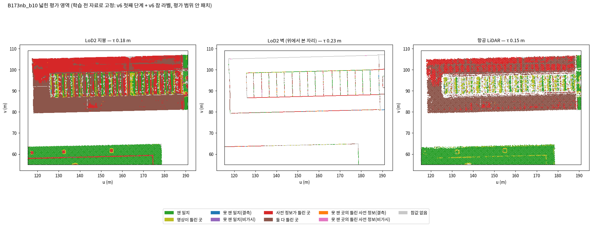
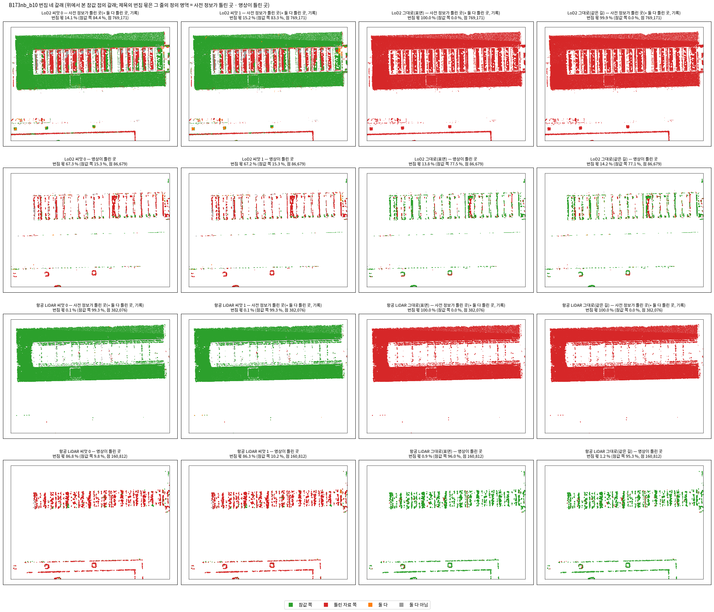
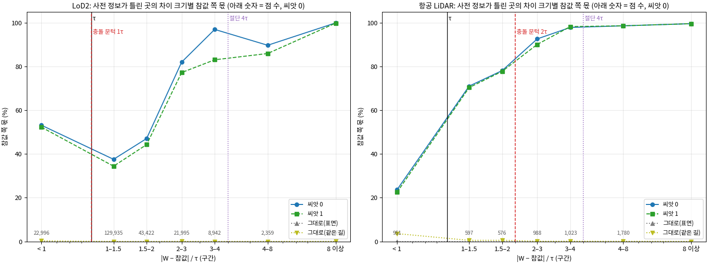
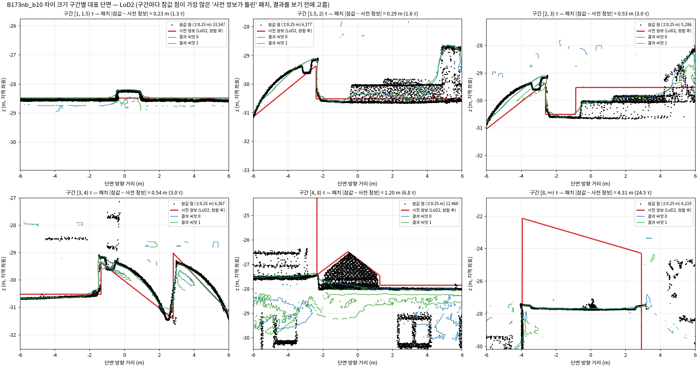
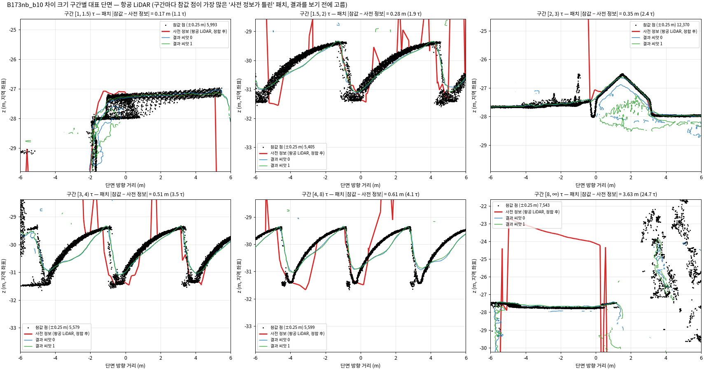
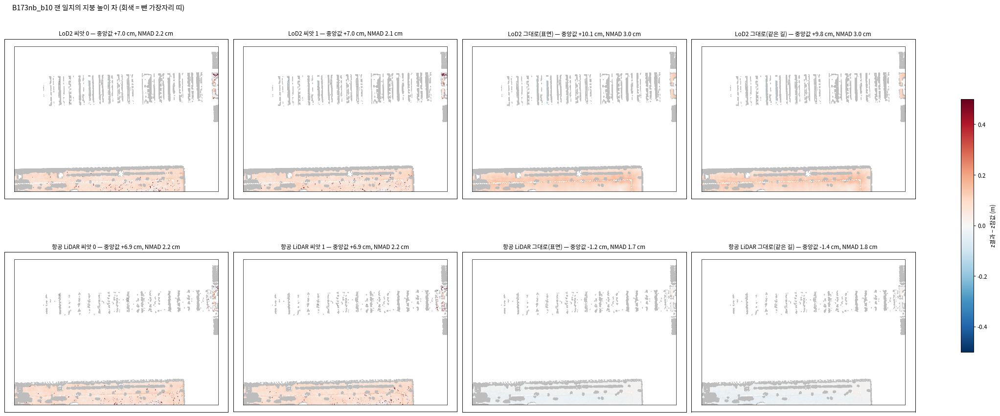
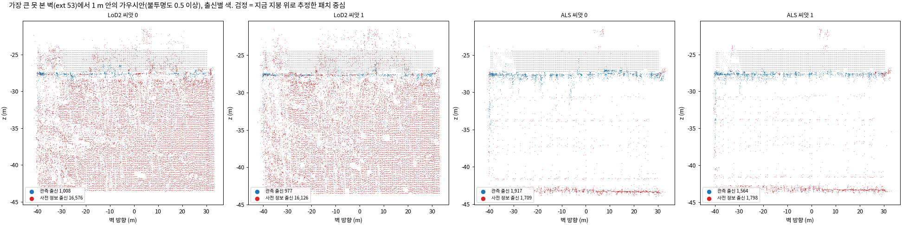
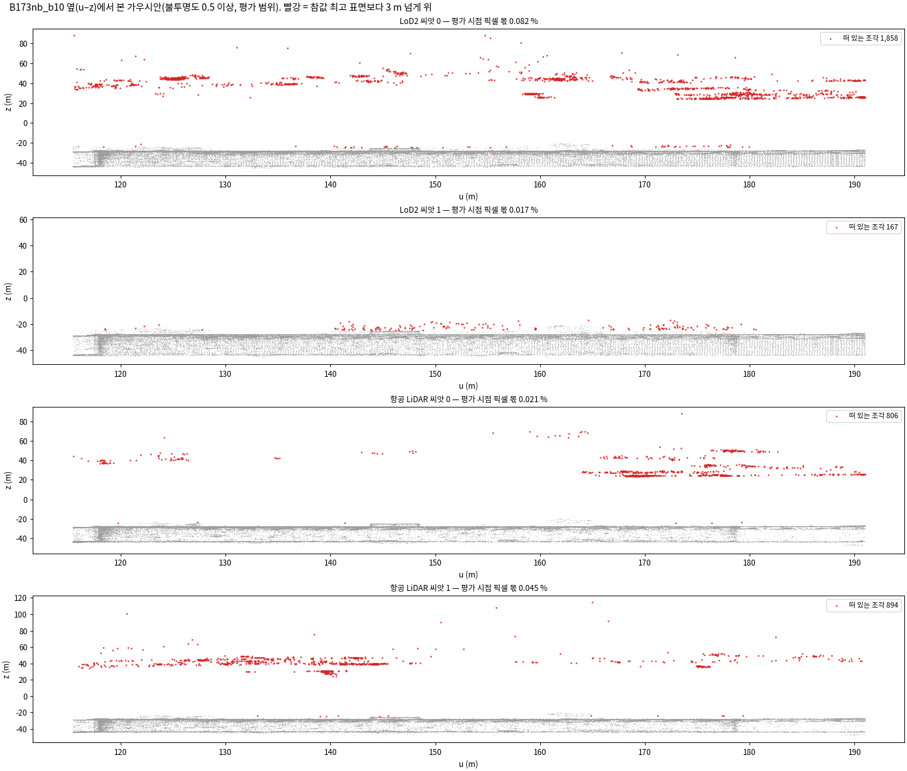
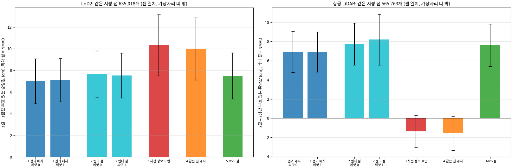
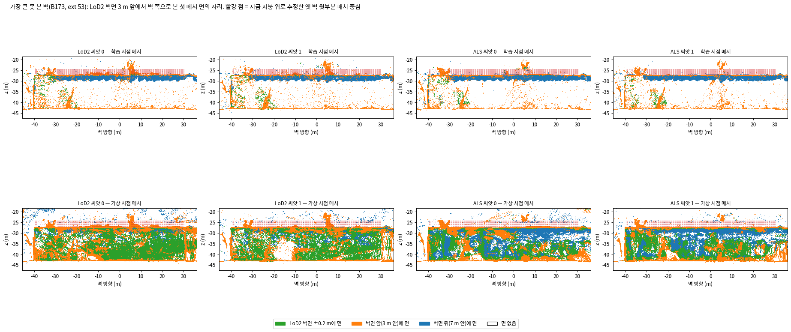

<!-- PHD-MAIN-METRICS-TRIAL-v1 -->
# 평가 지표 시험 계산 — 보고서 v1

- 작업: `PHD-MAIN-METRICS-TRIAL-v1` (발주 2026-10-06, 실행 2026-10-06 21:35 ~ 22:47). `scientific_verdict: null`.
- 판독과 추천은 분석자(에이전트)의 판단이며, 사람 검수 전이다.
- 일한 곳: 본 실험용 브랜치 `exp/main-experiment`, 별도 폴더 `JointBuildGS-exp`. 원래 작업 폴더는 고치지 않았다.
- **학습은 하지 않았다.** 0단계 결과물, 학습 코드 r12, 모듈 v6는 읽기 전용으로만 마운트했다.
- 산출 위치: 페이로드 `../JointBuildGS-artifacts/phase-payloads/phd/metrics_trial_v1/PHD-MAIN-METRICS-TRIAL-v1/`, 그림은 이 문서 옆 `figures/`.
- 설정 `configs/phd/metrics_trial_v1/metrics_trial_v1.json`
  - 21:49에 저장했다(sha256 `f5a93a89…`). 첫 계산(21:56)보다 앞선다.
  - 22:09에 두 곳을 고쳤다(설명 하나, 표본 규칙 하나; 고친 뒤 sha256 `1d10513b…`). 학습 결과의 지표를 읽기 전이다. 목록은 9절에 있다.
- 결과를 본 뒤 바꾼 것과 발주와 다른 점은 9절에 모았다.
- **이번 숫자로 방법의 우열을 말하지 않는다.** 0단계에는 견줄 방법의 학습이 없으므로, 숫자는 자를 시험하는 데만 쓴다.

## 0. 전체 과정에서의 위치

| 큰 단계 | 하는 일 | 상태 |
|---|---|---|
| 가. 실험 설계 | 실제 변화 지역 조사, 자료와 장면, 준비 측정 두 번, 비교 짜임 | 끝남 |
| 나. 저장소 정리 | 보존용 브랜치와 본 실험용 브랜치 | 끝남 |
| 다. 본 실험 준비와 0단계 시험 학습 | 모듈 v6와 포크 r12, B0 조건, 일치 영역, 0단계 학습 4회 | 끝남(10월 6일) |
| 라. 평가 지표, 넘어가는 기준, 반복 수 | 지표를 정함(10월 6일). 이 발주로 0단계 결과물에서 지표를 시험 계산했다 | **시험 계산 끝남**(10월 6일). 정의 확정 제안은 8절, 반복 수의 근거는 7절. 확정과 넘어가는 기준은 사용자가 정할 차례 |
| 마. 본 실험 1단계 | 핵심 비교 22회 | 다음. 1단계용 평가 영역 파일은 이번에 고정했다(3절) |
| 바. 본 실험 2·3단계 | 장치 빼기 9회, 영상 수 줄이기 18회 | 그다음 |
| 사. 넓히기 | 찾기 범위 여덟 곳 | 1단계 결과를 보고 |
| 아. 결과 정리와 논문 | 7장 결과와 고찰, 전체 정리 | 마지막 |

## 1. 답 먼저

1. **자는 대체로 뜻대로 읽힌다.**
   - **바뀐 곳**(B173 날개, 참값 점 약 120만 개): 네 학습의 번짐 몫은 0.0~0.1 %이고, 사전 정보 그대로(표면·같은 길 메시)는 100 %다. 0단계 단면 그림(옛 박공이 결과에 남지 않음)과 같은 말이다.
   - **영상이 틀린 곳**(가운데 톱니 지붕의 줄무늬): 학습의 번짐 몫이 67 %(LoD2), 86~87 %(항공 LiDAR)이고, 사전 정보 그대로는 1~14 %다. 이 자리는 참값 점 자리에서 MVS를 다시 재도 86~89 %가 τ 밖이었다. 자가 '영상이 틀린 자리에서 결과가 영상을 따름'을 갈라 읽은 것이다.
   - **차이 크기별 참값 쪽 몫**(LoD2): 1~2τ에서 34~47 %, 2~3τ에서 77~82 %, 3τ 이상에서 83~100 %다. 절반을 넘는 크기는 2τ(0.35 m) 언저리다. 항공 LiDAR는 1~1.5τ(0.15~0.22 m)에서 이미 70 %다.
2. **같은 조건의 흔들림(씨앗 0 대 1)은 넓은 지표에서 작다.**
   - 번짐 몫 1.2 %p 아래, 지붕 높이 차 0.06 cm, Chamfer 1.3 cm, F1 0.6 %p 이하다.
   - 흔들림을 '학습 − 사전 정보 그대로'의 차이로 나눈 비는 M3C2(0.13~0.24), NMAD(0.08~0.10), 벽 거리(0.05)를 빼면 0.02 아래다.
   - 점이 적은 칸은 크게 흔들렸다. 크기 구간 3~4τ는 14 %p, 못 본 곳 참값 359점의 0.2 m 몫은 20~35 %p, 떠 있는 조각 수는 10배 차이였다.
3. **정의에서 고칠 곳이 다섯 있다(8절).**
   - **가장자리 띠**: 시험값이 잰 일치 지붕 점의 43~49 %를 빼고, 17°보다 가파른 면은 98~99 %를 뺀다. 그래서 '넓은 지붕'의 99 %가 남쪽 이웃 건물 한 채의 평평한 지붕이다.
   - **'사전 정보가 틀린 곳'과 '둘 다 틀린 곳'의 경계**: 이를 가르는 패치 MVS 대리값이 큰 어긋남에서 틀린다. B173 남쪽 날개(LoD2 663 m²)가 '둘 다 틀린 곳'으로 갔는데, 참값 점 자리에서 재면 그 86 %가 τ 안이다.
   - **번짐 창과 기제 층**: |W − 참값|이 작으면 번짐 창이 결과의 공통 치우침(+7 cm)보다 좁아져 갈래가 흔들린다. 기제 층(반경 0.25 m)도 지금 면의 가우시안까지 센다.
   - **못 잰 곳**: 영역이 상자 안에서 너무 작다(지붕 1~2 m²).
   - **못 본 곳**: 참값이 그 벽을 거의 못 본다(패치의 0.2 %). 그래서 참 라벨 대신 지금 지붕 기준 추정 라벨로 나눴다.
4. **지붕 높이 치우침은 결과가 아니라 참값과 영상 자료의 높이 맞춤에서 온다.**
   - 같은 지붕 점 57~64만 개에서 잰 값이다. 영상 MVS +7.5 cm, 결과 렌더 점 +7.5~8.2 cm, 결과 메시 +6.9~7.1 cm이고, 사전 정보는 LoD2 +10.3 cm, 항공 LiDAR −1.4 cm다.
   - 결과는 사전 정보와 상관없이 영상 높이를 따른다. 메시를 만드는 길이 0.4~1.3 cm 낮추고, 같은 길은 알려진 표면을 0.2~0.3 cm 낮춘다.
   - 참값(지면으로 맞춘 ULS)과 영상의 지붕 높이가 7.5 cm 어긋나는 까닭은 이번 자료로 가리지 못했다.
5. **가상 시점 메시는 못 본 벽을 보이게 한다.**
   - 0.05 m 칸은 메모리 상한 46 GB를 넘었다. 0.10 m 칸으로는 학습마다 약 2.5분, 호스트 메모리 약 20 GB였다.
   - LoD2 학습에서 '지금 지붕 아래' 벽 패치 중심이 메시 0.5 m 안에 드는 몫이 학습 시점 메시 17~18 %에서 92~98 %로 올랐다.
   - 다만 항공 LiDAR 학습에서도 85~87 %가 된다. 이것은 큰 가우시안 몇 개가 그린 흐린 면이다. 그래서 가우시안 수(LoD2 78~81 % 대 항공 LiDAR 5 %)를 함께 봐야 가를 수 있다.
6. **1단계용 평가 영역 파일을 네 지역 × 두 사전 정보로 고정했다(3절).**

## 2. 한 일

### 2.1 잰 대상

- **결과 여덟 개**
  - 0단계 학습 넷(LoD2·항공 LiDAR × 씨앗 0·1): TSDF 메시(`post/mesh_tsdf.ply`, 0.05 m 칸)와 30,000회의 가우시안.
  - '사전 정보 그대로' 넷(두 사전 정보 × 두 가지)
    - 표면 그대로: 정합한 사전 정보 면 자체를 결과 자리에 놓았다.
    - 같은 길 메시: 사전 정보를 학습 시점 203장에서 렌더한 깊이를 0단계와 같은 TSDF 설정으로 융합했다. 결과 메시가 거친 길을 사전 정보에도 똑같이 거치게 한 것이다.
- **참값 점**: 0단계 점검과 같다. B173과 이웃 상자의 평가 범위 안 472만 개(지붕 331만, 벽 41만)이고, 지붕·벽을 가르는 규칙과 제외 칸도 같다.
- **영역**: 3절의 넓힌 평가 영역이다. 결과마다 자기 사전 정보의 영역을 쓴다.

### 2.2 번짐 몫을 재는 법 (사례 먼저)

B173 날개를 예로 든다. 지금 지붕(참값)이 있고, 그보다 4~5 m 위에 LoD2의 옛 박공(틀린 자료 W)이 있다. 참값 점마다 연직선을 긋고, 그 선 위에서 결과 메시가 지나는 자리를 본다.

- 지금 지붕 가까이에만 면이 있으면 **참값 쪽**이다.
- 옛 박공 가까이에만 면이 있으면 **틀린 자료 쪽**이다.
- 두 곳 모두에 면이 있으면 **둘 다**다. 옛 면이 위에 남았거나 새 면 밑에 묻힌 경우다.
- 어디에도 면이 없으면 **둘 다 아님**이다(구멍 포함).

**번짐 몫 = (틀린 자료 쪽 + 둘 다) / 전체**이고, 0에 가까울수록 좋다. 나머지 정의는 다음과 같다.

- '가까이'의 폭 t는 0.5 m와 |W − 참값|의 절반 가운데 작은 것이다. 두 창이 겹치지 않게 하려는 것이다.
- 벽은 연직선 대신 사전 정보 벽면의 법선을 쓴다.
- 영상이 틀린 곳에서는 W가 그 패치의 MVS 면이다.
- |W − 참값| < 0.2 m인 점은 '가르기 모호'로 따로 센다.
- **기제 층**: 옛 면이 새 면 밑에 묻히면 메시로는 잘 보이지 않으므로 가우시안을 직접 센다. 패치마다 W 중심 0.25 m 안에 불투명도 0.5 이상의 사전 정보 출신 가우시안이 남아 있는지를 본다.

### 2.3 나머지 지표

| 지표 | 재는 곳 | 어떻게 |
|---|---|---|
| 차이 크기별 따른 몫 | 사전 정보가 틀린 곳 | 점마다 \|W − 참값\|/τ 구간(1 미만, [1, 1.5) … 8 이상)에서 '참값 쪽'의 몫 |
| 정확도 | 잰 일치 | 지붕: 가장자리 띠 밖 점의 연직 높이 차(가장 높은 메시 면 − 참값). 띠와 벽: 사전 정보 면의 법선 방향 거리 |
| 완전성 | 못 잰 일치(결측 · 비가시) | 참값 점에서 결과 메시까지의 3차원 거리가 0.2 m · 0.5 m 안인 몫 |
| 못 본 곳 | B173 비가시 벽 18,747패치 | 패치 중심 0.25 m 안의 사전 정보 출신 가우시안(불투명도 0.5 이상), 학습 시점 메시와 가상 시점 메시까지의 거리 |
| 떠 있는 조각 | 평가 범위 | 칸별 참값 최고 표면보다 3 m 넘게 위에 있는 가우시안(불투명도 0.5 이상), 그리고 그것을 빼고 다시 렌더하면 깊이가 바뀌는 평가 시점 픽셀 |
| 요약 숫자 | 건물 표면(LoD2 발자국 2 m 안, 참값이 있는 칸) | Chamfer, 0.2 m · 0.5 m 정밀도·완전성·F1, M3C2(법선 1.0 m, 투영 지름 0.5 m, 깊이 1.0 m) |

## 3. 넓힌 평가 영역: 1단계 준비 (발주 4.2)

0단계 영역 파일은 그대로 두었다. 패치마다 영역을 하나 더 매긴 파일 `regions_ext/regions_ext_<지역>_<사전 정보>.npz`(배열 `code_ext`)를 만들었고, 1단계는 이 파일을 그대로 쓴다. 학습 전 자료(v6 첫째 단계, v6 참 라벨, 0단계 영역 파일)만 썼다.

| 코드 | 영역 | 정의 |
|---|---|---|
| 2 | 잰 일치 | 0단계 그대로: 참 일치, 지지 패치, \|MVS − 참값\| ≤ τ |
| 3 | 영상이 틀린 곳 | 0단계 코드 3의 이름만 바꿈: 참 일치, 지지 패치, \|MVS − 참값\| > τ (MVS 값 없음 포함) |
| 4 · 5 | 못 잰 일치(결측 · 비가시) | 0단계 그대로 |
| 11 | 사전 정보가 틀린 곳 | 참 충돌, 지지 패치, \|MVS − 참값\| ≤ τ |
| 12 | 둘 다 틀린 곳 | 참 충돌, 지지 패치, \|MVS − 참값\| > τ (MVS 값 없음 포함). 넓이만 센다 |
| 13 · 14 | 못 잰 곳의 틀린 사전 정보(결측 · 비가시) | 참 충돌이면서 결측 패치 · 비가시 패치 |
| 0 | 참값 없음 | 0단계 그대로 |

\|MVS − 참값\|은 0단계 영역과 같이 패치의 MVS 잔차 중앙값(−mvs_r_med)과 참 라벨 중앙값의 차이다. 지붕류 패치는 연직, 벽류 패치는 바깥 법선 방향이다.

**B173과 이웃(B173nb_b10)** (패치 수 · 넓이 · 참값 점 수; 네 지역 모두의 표는 부록 A1)

| 사전 정보 · 면 | τ (m) | 잰 일치 | 영상이 틀린 곳 | 못 잰 일치(결측 / 비가시) | 사전 정보가 틀린 곳 | 둘 다 틀린 곳 | 못 잰 곳의 틀린 사전 정보(결측 / 비가시) | 참값 없음 |
|---|---:|---|---|---|---|---|---|---|
| LoD2 · 지붕 | 0.176 | 12,209 · 763 m² · 146만 | 1,735 · 108 m² · 8.3만 | 27 · 2 m² / 0 | 11,140 · 696 m² · 77만 | 15,110 · 944 m² · 92만 | 11 · 1 m² / 0 | 2,112 · 132 m² |
| LoD2 · 벽 | 0.228 | 20,214 · 1,263 m² · 27만 | 700 · 44 m² · 1.1만 | 1,197 · 75 m² / 4 · 0 m² | 1,556 · 97 m² · 1.4만 | 1,865 · 117 m² · 3.2만 | 95 · 6 m² / 21 · 1 m² | 73,538 · 4,596 m² |
| 항공 LiDAR · 지붕 | 0.147 | 9,973 · 638 m² · 134만 | 2,283 · 165 m² · 16.6만 | 17 · 2 m² / 1 · 0 m² | 5,118 · 341 m² · 39만 | 13,555 · 903 m² · 93만 | 9 · 1 m² / 0 | 3,317 · 237 m² |

*읽는 법:* 색이 영역이다. 북쪽 날개(v 100~107)는 '사전 정보가 틀린 곳'(빨강)이고, 남쪽 날개(v 80~88)는 두 사전 정보 모두 '둘 다 틀린 곳'(갈색)이다.

- **남쪽 날개가 '둘 다 틀린 곳'으로 간 까닭은 영상이 아니라 대리값이다.** 패치 대리값으로는 MVS가 참값보다 0.54 m 낮다(중앙값). 하지만 참값 점 자리에서 MVS 높이를 직접 읽으면 날개의 '둘 다 틀린 곳' 패치 86 %(LoD2 10,609개 가운데 9,130개; 항공 LiDAR 85 %)가 τ 안이다. 옛 박공이 4~5 m 위에 있어 그 패치를 지나는 시점 광선이 지금 지붕의 다른 자리나 지붕 밖에 닿기 때문으로 본다(기록 `tables/proxy_check.json`). 날개 밖의 '둘 다 틀린 곳'은 13 %만 τ 안이라 실제로 둘 다 틀린 경우가 많다.
- **'영상이 틀린 곳'은 대리값과 참값 자리 MVS가 같은 말을 한다.** 두 방식 모두 86~89 %가 τ 밖이다(LoD2 MVS − 참값 중앙값 +0.33 m).
- **못 잰 곳의 영역은 매우 작다.** 못 잰 일치와 못 잰 곳의 틀린 사전 정보는 B173nb 지붕에서 1~2 m²이고, 다른 지역도 지붕 0~9 m²다.
- **못 본 B173 벽**은 18,747패치(1,172 m²)이고 참값 라벨은 27개뿐이다. 지금 지붕 기준(벽 뒤 0.3~2.0 m 띠의 참값 최고점 ± τ_벽)으로 나누면 지붕 아래 15,375, 지붕 위(없어진 옛 벽 윗부분) 2,991, 모호 381패치다. 이 나눔은 영역 파일에 넣었다(`unseen_label_inferred`). B173_b0도 같은 규칙으로 18,743패치(지붕 위 2,788)다.

## 4. 지표가 뜻대로 읽히는가 (발주 4.3)

### 4.1 번짐 몫

**번짐 몫** (%; 괄호는 참값 점 수와 가르기 모호의 몫)

| 영역 | LoD2 씨앗 0 | LoD2 씨앗 1 | LoD2 그대로(표면) | LoD2 그대로(같은 길) | 항공 LiDAR 씨앗 0 | 항공 LiDAR 씨앗 1 | 항공 LiDAR 그대로(표면) | 항공 LiDAR 그대로(같은 길) |
|---|---:|---:|---:|---:|---:|---:|---:|---:|
| 사전 정보가 틀린 곳 (76.9만 · 6.5 % / 38.2만 · 0.4 %) | 14.1 | 15.2 | 100.0 | 99.9 | 0.1 | 0.1 | 100.0 | 100.0 |
| 영상이 틀린 곳 (8.7만 · 18.1 % / 16.1만 · 53.8 %) | 67.3 | 67.2 | 13.8 | 14.2 | 86.8 | 86.3 | 0.9 | 1.2 |
| 못 잰 곳의 틀린 사전 정보(결측) (1,577 / 561) | 17.5 | 16.4 | 99.5 | 96.9 | 0.0 | 0.0 | 100.0 | 100.0 |
| (기록) B173 날개 = 11 + 12 (124만 / 120만) | 0.0 | 0.1 | 100.0 | 100.0 | 0.0 | 0.0 | 100.0 | 100.0 |
| (기록) 둘 다 틀린 곳 (91.3만 / 90.3만) | 14.3 | 14.5 | 100.0 | 99.8 | 0.1 | 0.1 | 100.0 | 100.0 |

'기록' 두 줄은 정의 밖 측정이다. 목적은 남쪽 날개를 가른 대리값의 영향을 보는 것이고, 기준으로 쓰지 않는다. 네 갈래 전체(참값 쪽·틀린 자료 쪽·둘 다·둘 다 아님)와 모호를 뺀 값은 페이로드 `tables/metrics_tables.md`의 M1·M1b에 있다.

*읽는 법:* 위에서 본 참값 점을 갈래로 칠했다(초록 참값 쪽, 빨강 틀린 자료 쪽, 주황 둘 다, 회색 둘 다 아님). 학습(왼쪽 둘)은 날개가 초록이고 톱니 지붕의 '영상이 틀린 곳' 줄무늬가 빨강인데, 사전 정보 그대로(오른쪽 둘)는 그 반대다.

- **바뀐 곳(B173 날개)**: 학습의 참값 쪽이 99.7 %다. 0단계의 '바뀐 곳 0.2 m 안 96~97 %', 단면 그림과 같은 말이다.
- **LoD2 '사전 정보가 틀린 곳'의 14~15 %**는 날개가 아니라 톱니 지붕의 작은 어긋남(1~2τ)에서 나온다(4.2).
- **영상이 틀린 곳**: 학습은 그 자리의 틀린 MVS를 따랐다. 사전 정보 그대로의 13.8 %(LoD2)는 4.2와 8절의 '창이 좁아지는 문제'다. 사전 정보가 참값에서 τ 안쪽으로 떨어져 있어도, |W − 참값|이 작으면 창이 그보다 좁다.

**기제 층** (패치마다 W 중심 0.25 m 안에 불투명도 0.5 이상의 사전 정보 출신 가우시안이 남은 몫, %)

| 영역 (패치 수 LoD2 / 항공 LiDAR) | LoD2 씨앗 0 | LoD2 씨앗 1 | 항공 LiDAR 씨앗 0 | 항공 LiDAR 씨앗 1 |
|---|---:|---:|---:|---:|
| 사전 정보가 틀린 곳 (12,696 / 5,118) | 12.3 | 11.6 | 0.4 | 0.4 |
| — 그 가운데 \|참값 − 사전 정보\| ≥ 0.5 m (7,938 / 5,045) | 1.7 | 1.4 | 0.3 | 0.2 |
| — 그 가운데 \|참값 − 사전 정보\| < 0.5 m (4,758 / 73) | 30.1 | 28.6 | 12.3 | 11.0 |
| 영상이 틀린 곳 (2,435 / 2,283) | 25.3 | 26.3 | 30.7 | 29.2 |
| 영상이 틀린 곳, 출신을 가리지 않음 (기록) | 30.3 | 32.1 | 39.2 | 41.2 |
| 못 잰 곳의 틀린 사전 정보(결측) (106 / 9) | 22.6 | 22.6 | 0.0 | 0.0 |
| 못 잰 곳의 틀린 사전 정보(비가시) (21 / 0) | 19.1 | 4.8 | — | — |

- 어긋남이 0.5 m를 넘는 곳의 기제 층은 1.4~1.7 %(LoD2)다. 옛 면이 위에 남거나 아래에 묻힌 몫이 작다는 뜻이다.
- 0.5 m 미만에서는 0.25 m 탐침이 지금 면의 가우시안까지 닿아 29~30 %로 커진다. 이것은 자의 문제다(8절).
- 크기 구간 0.5 m를 경계로 나눈 표는 결과를 본 뒤 더한 기록이다(`tables/proposal_more.json`).

### 4.2 차이 크기별 따른 몫

**사전 정보가 틀린 곳의 참값 쪽 몫** (%, 씨앗 0 / 씨앗 1; 사전 정보 그대로는 모든 구간 0.0~3.6 %)

| 구간 (τ 배수) | LoD2 지붕 m | LoD2 (점 수) | 항공 LiDAR 지붕 m | 항공 LiDAR (점 수) |
|---|---|---|---|---|
| 1 미만 | 0~0.18 | 53.1 / 52.2 (22,996) | 0~0.15 | 23.7 / 22.5 (951) |
| [1, 1.5) | 0.18~0.26 | 37.5 / 34.4 (129,935) | 0.15~0.22 | 71.0 / 70.3 (597) |
| [1.5, 2) | 0.26~0.35 | 47.0 / 44.3 (43,422) | 0.22~0.29 | 78.1 / 77.8 (576) |
| [2, 3) | 0.35~0.53 | 82.0 / 77.2 (21,995) | 0.29~0.44 | 92.6 / 90.1 (988) |
| [3, 4) | 0.53~0.70 | 97.0 / 83.1 (8,942) | 0.44~0.59 | 97.9 / 98.2 (1,023) |
| [4, 8) | 0.70~1.41 | 89.7 / 85.9 (2,359) | 0.59~1.18 | 98.6 / 98.6 (1,780) |
| 8 이상 | 1.41~ | 99.9 / 99.8 (539,522) | 1.18~ | 99.6 / 99.6 (376,161) |

(벽 구간은 LoD2 τ_벽 0.228 m로 같은 배수다: 0.23~0.34, 0.34~0.46, … m. 항공 LiDAR에는 벽 패치가 없다.)

*읽는 법:* 가로는 \|W − 참값\|/τ 구간, 세로는 결과가 지금 모습(참값 쪽)을 따른 몫이고, 세로줄은 τ, 충돌 문턱(LoD2 1τ, 항공 LiDAR 2τ), 절단 4τ다. LoD2는 2τ를 지나며 절반을 넘고, 항공 LiDAR는 1τ 바로 위에서 이미 70 %다.

*읽는 법:* 구간마다 참값 점이 가장 많은 '사전 정보가 틀린' 패치를 지나는 단면이다(결과를 보기 전에 고름). 빨강이 정합한 LoD2, 파랑·초록이 두 씨앗의 결과, 검정이 참값 점이며, 1.5~4τ의 톱니 지붕에서 LoD2는 곧은 경사인데 참값과 결과는 휜 면을 따른다.

*읽는 법:* 같은 그림의 항공 LiDAR다. 빨강 TIN에는 가장자리마다 세로로 선 삼각형이 보이고, 8τ 이상 구간(날개)에서는 옛 지붕(빨강, 3.6 m 위) 대신 결과가 지금 지붕을 따른다.

- **곡선이 '어느 크기부터'에 답한다.** LoD2는 1~2τ에서 결과의 절반 이상이 사전 정보 쪽에 머물고(참값 쪽 34~47 %), 2~3τ부터 77~82 %가 지금 모습을 따른다. 대표 단면으로 보면 1.5~4τ의 어긋남은 대부분 톱니 지붕의 휜 면을 LoD2가 곧은 면으로 그린 데서 나온다.
- **1τ 미만 구간은 자의 버릇이 섞인다.** 이 구간의 창은 0.09 m(LoD2)·0.07 m(항공 LiDAR)보다 좁아, 결과의 공통 치우침(+7 cm)만으로 '둘 다 아님'이 된다(항공 LiDAR 73 %).
- **흔들림**: 3~4τ 구간(8,942점)은 씨앗 사이 14 %p 흔들렸다. 항공 LiDAR의 가운데 구간은 600~1,800점(패치 13~36개)뿐이다.

### 4.3 정확도 (잰 일치)

| 결과 | 지붕 점 (띠로 뺀 몫) | 지붕 높이 차 부호 중앙값 / NMAD (m) | \|차\| 중앙값 / 68.3 % / 95 % (m) | 띠 법선 거리 중앙값 / NMAD (m) | 벽 법선 거리 중앙값 / NMAD (m) |
|---|---|---|---|---|---|
| LoD2 씨앗 0 | 730,246 (48.9 %) | +0.070 / 0.022 | 0.070 / 0.080 / 0.108 | +0.060 / 0.039 | −0.030 / 0.069 |
| LoD2 씨앗 1 | 730,246 (48.9 %) | +0.070 / 0.021 | 0.070 / 0.080 / 0.108 | +0.061 / 0.037 | −0.032 / 0.067 |
| LoD2 그대로(표면) | 730,246 (48.9 %) | +0.101 / 0.030 | 0.101 / 0.115 / 0.144 | +0.061 / 0.059 | −0.011 / 0.036 |
| LoD2 그대로(같은 길) | 730,246 (48.9 %) | +0.098 / 0.030 | 0.098 / 0.112 / 0.142 | +0.058 / 0.059 | −0.014 / 0.038 |
| 항공 LiDAR 씨앗 0 | 760,115 (42.9 %) | +0.069 / 0.022 | 0.069 / 0.079 / 0.111 | +0.061 / 0.030 | — |
| 항공 LiDAR 씨앗 1 | 760,115 (42.9 %) | +0.069 / 0.022 | 0.069 / 0.079 / 0.110 | +0.062 / 0.028 | — |
| 항공 LiDAR 그대로(표면) | 760,115 (42.9 %) | −0.013 / 0.017 | 0.015 / 0.022 / 0.041 | −0.013 / 0.018 | — |
| 항공 LiDAR 그대로(같은 길) | 760,115 (42.9 %) | −0.014 / 0.018 | 0.016 / 0.024 / 0.044 | −0.015 / 0.020 | — |

(벽은 LoD2 벽 패치에서 26만 점이다. 학습 메시는 그 가운데 6,500점(2.5 %)에서 2 m 안에 면이 없었다. 항공 LiDAR에는 벽 패치가 없다.)

*읽는 법:* 잰 일치 지붕 점의 높이 차(결과 − 참값)를 ±0.5 m 색으로 칠했고, 회색은 가장자리 띠로 뺀 점이다. B173 가운데 톱니 지붕은 거의 다 회색이라, 색이 칠해진 넓은 지붕은 아래쪽 이웃 건물이다.

**가장자리 띠로 뺀 몫, 사전 정보 면 경사별** (잰 일치의 지붕 점)

| 경사 | LoD2 | 항공 LiDAR |
|---|---|---|
| 0~5° | 43.0 % (128만 점) | 36.5 % (84만) |
| 5~17° | — | 45.9 % (38만) |
| 17~30° | 99.0 % (6.3만) | 79.1 % (7.5만) |
| 30~45° | 98.2 % (9.0만) | 93.7 % (2.1만) |
| 45° 넘게 | — | 97.7 % (0.9만) |

- **'넓은 지붕'은 사실상 한 지붕이다.** 띠 밖 지붕 점의 98.7 %(LoD2 730,246점 가운데 720,818점)가 남쪽 이웃 건물(DEBY_LOD2_4959460)의 평평한 지붕이고, B173은 2,231점(0.3 %)뿐이다. B173의 톱니 지붕은 가파른 면이라 띠로 거의 다 빠진다(8절의 제안).
- 결과의 지붕 높이 차 +7.0 cm는 사전 정보에 따라 달라지지 않는다(LoD2·항공 LiDAR 모두 +6.9~7.0). 그 출처는 5절에서 나눈다.

### 4.4 완전성 (못 잰 일치)

**참값 점이 결과 0.2 m / 0.5 m 안에 있는 몫** (%)

| 영역 (점 수 LoD2 / 항공 LiDAR) | LoD2 씨앗 0 | LoD2 씨앗 1 | LoD2 그대로(표면 · 같은 길) | 항공 LiDAR 씨앗 0 | 항공 LiDAR 씨앗 1 | 항공 LiDAR 그대로(표면 · 같은 길) |
|---|---|---|---|---|---|---|
| 못 잰 일치(결측) (18,110 / 973) | 92.2 / 93.8 | 92.7 / 93.8 | 97.1 / 99.7 · 97.5 / 99.7 | 0.0 / 0.5 | 0.0 / 0.0 | 97.1 / 100 · 97.1 / 100 |
| 못 잰 일치(비가시) (23 / 13) | 60.9 / 78.3 | 60.9 / 78.3 | 100 / 100 | 100 / 100 | 100 / 100 | 100 / 100 |

- **LoD2의 결측 일치는 대부분 벽이다.** 벽 16,962점은 98~99 %가 0.2 m 안이고, 지붕 1,148점은 5 %만 0.2 m 안이다.
- **항공 LiDAR의 결측 일치 973점은 한 자리다.** B173 서쪽 끝 0.6 m × 7 m 띠의 가파른 TIN 면(42~60°)이고, 결과 표면은 그 점들보다 1~2.5 m 위에 있다. 처마 밑처럼 위에서 가려진 면에 결과가 면을 만들지 못한 것으로 보인다. 0 %는 실제 읽기지만 표본은 17패치 한 자리다.
- 비가시 일치는 13~23점이라 숫자를 읽을 수 없다.

### 4.5 못 본 곳 (B173 비가시 벽): 가우시안과 메시

| 측정 | 결과 | 지금 지붕 아래 (15,375패치) | 지금 지붕 위 = 옛 벽 윗부분 (2,991) | 참 라벨 일치 (3) / 충돌 (24) |
|---|---|---|---|---|
| 패치 중심 0.25 m 안 사전 정보 출신 가우시안(불투명도 0.5 이상) | LoD2 씨앗 0 / 1 | **81.0 / 77.5 %** | 6.5 / 8.6 % | 33 / 17 · 0 / 4 % |
|  | 항공 LiDAR 씨앗 0 / 1 | 5.0 / 5.4 % | 0.2 / 0.2 % | 0 / 0 · 33 / 13 % |
| 패치 중심이 학습 시점 메시 0.2 / 0.5 m 안 | LoD2 씨앗 0 | 6.8 / 17.1 % | 6.8 / 48.2 % | — |
|  | 항공 LiDAR 씨앗 0 | 3.7 / 9.7 % | 3.3 / 27.5 % | — |
| 패치 중심이 가상 시점 메시 0.2 / 0.5 m 안 (6절) | LoD2 씨앗 0 / 1 | 82.0 / 97.8 · 78.0 / 92.0 % | 7.0 / 31.6 · 5.7 / 21.4 % | — |
|  | 항공 LiDAR 씨앗 0 / 1 | 54.5 / 85.3 · 55.2 / 87.2 % | 3.2 / 23.3 · 3.4 / 22.5 % | — |
| 참값 피복: 소유 참값 점이 있는 패치 / 라벨이 있는 패치 | (학습과 무관) | 0.2 / 0.1 % | 0 / 0 % | 100 / 100 · 88 / 100 % |

*읽는 법:* 가장 큰 못 본 벽(ext 53)에서 1 m 안의 가우시안(불투명도 0.5 이상)을 벽 좌표로 펼쳤다(빨강 사전 정보 출신, 파랑 관측 출신, 검정 점 = 지붕 위로 추정한 옛 벽 윗부분). LoD2 학습은 지붕선(z −27.5) 아래 벽을 사전 정보 출신으로 빽빽이 덮고, 항공 LiDAR 학습은 그 벽이 거의 비어 있다.

- **이어받음은 가우시안 수로 읽힌다.** LoD2 학습에서 지붕 아래 벽 패치의 78~81 %에 사전 정보 출신 가우시안이 있다(0단계의 '못 본 곳 65~68 %'보다 높은 것은 지붕 위 패치를 빼고 셌기 때문이다).
- **옛 벽 윗부분(지붕 위)이 남은 몫은 6.5~8.6 %(LoD2)다.** 메시 0.2 m 안 몫도 6~7 %다. 0.5 m 안은 21~48 %로 큰데, 지붕 바로 위(τ_벽~0.5 m) 패치가 지금 지붕 면에 걸리기 때문이다. 그래서 충돌 쪽은 0.2 m로 읽어야 한다.
- **참값으로는 이 벽을 확인할 수 없다.** 패치의 0.2 %만 참값 점을 가진다. '지금 지붕 아래 = 지금도 있는 벽'은 추정이며, 그 벽의 수평 위치는 확인하지 못했다. 참 충돌 라벨 24개 가운데 21개는 지붕 아래에 있는데, 이는 벽면이 LoD2 면에서 τ 넘게 비켜선 경우다.

### 4.6 떠 있는 조각

| 학습 | 가우시안 수 (사전 정보 출신) | 3~20 m / 20 m 넘게 | 평가 시점 픽셀 몫 |
|---|---|---|---|
| LoD2 씨앗 0 | 1,858 (1,218) | 55 / 1,803 | 0.083 % |
| LoD2 씨앗 1 | 167 (165) | 165 / 2 | 0.017 % |
| 항공 LiDAR 씨앗 0 | 806 (6) | 6 / 800 | 0.021 % |
| 항공 LiDAR 씨앗 1 | 894 (11) | 11 / 883 | 0.044 % |

*읽는 법:* 평가 범위의 가우시안(불투명도 0.5 이상)을 옆(u–z)에서 본 것이고, 빨강이 참값 최고 표면보다 3 m 넘게 위의 조각이다. 대부분은 지붕(z −28 언저리)보다 55~75 m 위의 얇은 층이며, 지붕 바로 위 몇 m의 조각은 적다.

- **20 m 넘게 위의 조각은 하늘 층이다.** 경사 사진의 하늘을 그린 것으로 보이며, 메시 상자(참값 최고점 + 5 m) 밖이라 메시 지표에는 들어가지 않는다.
- **3~20 m의 조각은 모두 B173 날개 위 3~8 m에 있는 사전 정보 출신이다.** LoD2 55·165개, 항공 LiDAR 6·11개다. 옛 지붕(박공)의 잔재가 공중에 남은 것으로, 메시에는 면을 만들지 않아 번짐 몫(0.0~0.1 %)에 잡히지 않는다.
- 픽셀 몫이 0.02~0.08 %로 작고, 개수는 씨앗마다 10배까지 다르다.

### 4.7 요약 숫자 (건물 표면, 기록)

| 결과 | Chamfer 결과→참값 / 참값→결과 / 평균 (m) | 정밀도 / 완전성 / F1 @0.2 m (%) | F1 @0.5 m (%) | M3C2 중앙값 / NMAD (m) (거리 있는 몫) |
|---|---|---|---|---|
| LoD2 씨앗 0 | 0.298 / 0.133 / 0.216 | 70.9 / 89.0 / 78.9 | 92.2 | +0.001 / 0.123 (86 %) |
| LoD2 씨앗 1 | 0.273 / 0.132 / 0.203 | 70.5 / 88.9 / 78.7 | 92.0 | −0.001 / 0.122 (86 %) |
| LoD2 그대로(표면) | 1.556 / 0.772 / 1.164 | 40.5 / 53.2 / 46.0 | 59.9 | +0.008 / 0.133 (70 %) |
| LoD2 그대로(같은 길) | 1.236 / 0.851 / 1.043 | 46.7 / 53.2 / 49.8 | 64.0 | +0.005 / 0.131 (69 %) |
| 항공 LiDAR 씨앗 0 | 0.248 / 0.128 / 0.188 | 70.9 / 90.2 / 79.4 | 92.5 | −0.004 / 0.122 (86 %) |
| 항공 LiDAR 씨앗 1 | 0.252 / 0.128 / 0.190 | 71.8 / 90.2 / 80.0 | 92.5 | −0.002 / 0.119 (86 %) |
| 항공 LiDAR 그대로(표면) | 1.845 / 0.864 / 1.355 | 20.5 / 54.3 / 29.8 | 45.1 | −0.012 / 0.289 (52 %) |
| 항공 LiDAR 그대로(같은 길) | 1.551 / 1.019 / 1.285 | 28.6 / 52.3 / 37.0 | 51.8 | −0.016 / 0.245 (48 %) |

- 건물 표면에는 발자국 2 m 띠의 지면과 B173 날개(바뀐 곳)가 함께 들어간다. 그래서 지면이 없는 LoD2와 옛 날개를 가진 사전 정보 그대로는 Chamfer와 F1이 크게 나쁘다.
- M3C2 중앙값은 지붕(+7 cm)·벽(−3 cm)·지면이 섞여 0 언저리가 되므로, 치우침을 읽는 데는 맞지 않는다.

## 5. 지붕 높이 치우침 나누기 (발주 4.4)

**같은 지붕 점에서 잰 z길 − z참값** (잰 일치의 넓은 지붕 = 가장자리 띠 밖, 다섯 길 모두에 값이 있는 점; 부호 있는 중앙값, 괄호는 NMAD; cm)

| 사전 정보 (공통 점) | 1 결과 메시 (씨앗 0 / 1) | 2 결과 렌더 점 (씨앗 0 / 1) | 3 사전 정보 표면 | 4 같은 길 메시 | 5 MVS 신뢰도 1 점 |
|---|---|---|---|---|---|
| LoD2 (635,018) | +7.0 (2.1) / +7.1 (2.0) | +7.6 (2.2) / +7.5 (2.1) | +10.3 (2.8) | +10.0 (2.9) | +7.5 (2.1) |
| 항공 LiDAR (565,763) | +6.9 (2.1) / +6.9 (2.1) | +7.7 (2.2) / +8.2 (2.6) | −1.4 (1.7) | −1.6 (1.8) | +7.6 (2.2) |

*읽는 법:* 막대가 길마다의 부호 있는 중앙값이고 막대 끝은 NMAD다. 결과(파랑 둘)는 사전 정보(빨강·주황)가 +10 cm든 −1.4 cm든 MVS(초록, +7.5 cm) 쪽에 있다.

- **결과에서 오는 몫은 없다.** 결과 렌더 점(길 2)이 MVS(길 5)와 0.0~0.6 cm 안에서 같다. 학습은 영상 높이를 따른다.
- **메시를 만드는 길의 몫은 −0.4~−1.3 cm다**(길 1 − 길 2: LoD2 −0.6·−0.4, 항공 LiDAR −0.8·−1.3). 메시가 렌더 점보다 조금 낮게, 곧 참값 쪽으로 만든다.
- **같은 길이 알려진 표면에 더하는 몫은 −0.2~−0.3 cm다**(길 4 − 길 3: LoD2 −0.3, 항공 LiDAR −0.2).
- **참값과 두 자료의 높이 맞춤이 대부분이다**(길 3과 5). 참값(ULS, 지면 픽셀로 MVS에 높이를 맞춤)에 대해 항공 LiDAR는 −1.4 cm로 가깝지만, 영상 MVS는 이 지붕에서 +7.5 cm 높다. LoD2는 +10.3 cm다.
  - 지면에서 맞춘 높이가 지붕(지면 위 약 15 m)에서 7.5 cm 벌어지는 셈이다.
  - 까닭(영상 쪽 높이 축척, 지붕 재질에 대한 ULS나 MVS의 버릇 등)은 이번 자료로 가리지 못했다.
- 이 점들의 99 %가 남쪽 이웃 건물 한 지붕이다(4.3). 0단계 점검의 +5.6~5.8 cm는 모든 지붕 점에서 잰 값이라 이번 +7.0 cm와 점이 다르다.

## 6. 못 본 곳의 가상 시점 메시 (발주 4.5)

- **방식**: r10의 결과물 층을 그대로 썼다. 포크의 `create_virtual_cameras_for_completion`이 만든 가상 시점을 학습 시점 203장에 더해, 장면 전체의 렌더 깊이를 TSDF로 융합했다(0단계 상자 가림 그대로).
- **겨눈 곳**: r10은 '어느 학습 시점도 보지 못한 가우시안'을 겨눴다. 이번에는 0단계의 B173 비가시 벽 패치 18,747개를 겨눴다. 네 학습이 같은 16시점을 쓰게 하려는 것이다.
- **자리**: 계산 전에 설정에 적었다.
  - 그 패치 중심들의 평균 (153.59, 111.97, −33.80)을 겨눈다. 반경은 41.4 m다.
  - 거리는 1.5 × 2 × 반경 = 124.3 m다.
  - 두 고리(높이 = 거리 × 0.2와 × 0.5, 내려다보는 각 11°·27°) × 방위 8개로 16시점이다.
  - 가장 큰 못 본 벽(ext 53)의 앞쪽에 드는 시점은 방위 0°·315°(정면에 가까움)와 45°·270°(비스듬함)로, 고리마다 넷씩 여덟이다.
- **칸**: 첫 학습(씨앗 0 LoD2)에서 0.05 m 칸이 컨테이너 메모리 상한 46 GB에 걸렸다(r10과 같은 현상, 289초째). 발주대로 0.10 m 칸(sdf_trunc 0.5 m, r10 값)으로 다시 했다. 네 학습을 같은 칸으로 견주도록 나머지 셋도 0.10 m로 돌렸다.
  - 학습 시점 메시(0단계)는 0.05 m라서, 두 메시를 견줄 때는 칸 차이가 섞인다.

**시간과 메모리** (학습 하나, GPU 한 대): 모델 읽기 16~28초, 학습 + 가상 시점 렌더 약 12초, TSDF(0.10 m) 101~114초로 모두 146~169초다. 호스트 메모리 최대는 17.9~19.8 GB다. 메시는 삼각형 1,230만~1,480만 개, 1.0 GB 안팎이다.

*읽는 법:* LoD2 벽면 3 m 앞에서 벽 쪽으로 쏜 광선이 처음 만나는 메시 면의 자리다(초록 = 벽면 ±0.2 m, 주황 = 벽면 앞, 파랑 = 벽면 뒤, 흰색 = 면 없음). 학습 시점 메시(위)는 벽 자리가 거의 비었고, 가상 시점 메시(아래)는 LoD2 학습에서 벽면이 초록으로 채워지지만 항공 LiDAR 학습에서는 앞뒤로 흐린 면이 섞인다.

| 측정 | LoD2 씨앗 0 | LoD2 씨앗 1 | 항공 LiDAR 씨앗 0 | 항공 LiDAR 씨앗 1 |
|---|---|---|---|---|
| 지붕 아래 패치 중심이 가상 시점 메시 0.2 / 0.5 m 안 (이어받음) | 82.0 / 97.8 % | 78.0 / 92.0 % | 54.5 / 85.3 % | 55.2 / 87.2 % |
| 지붕 위(옛 벽 윗부분) 패치 중심이 0.2 m 안 (틀린 채 남음) | 7.0 % | 5.7 % | 3.2 % | 3.4 % |
| 못 본 곳 참값 점 359개가 0.2 / 0.5 m 안 | 59.3 / 93.9 % | 24.8 / 96.7 % | 36.5 / 93.9 % | 35.9 / 97.5 % |
| 벽 둘레 메시 꼭짓점의 LoD2 벽면까지 거리 5 / 50 / 95 % (m) | −1.04 / +0.10 / +1.43 | −1.27 / +0.04 / +1.26 | −1.61 / −0.11 / +1.24 | −1.63 / −0.09 / +1.34 |
| 그 꼭짓점 가운데 벽면 0.2 m 안 (학습 시점 메시) | 42 % (16 %) | 41 % (19 %) | 29 % (15 %) | 32 % (15 %) |

- **가상 시점 메시는 이어받은 벽을 메시로 드러낸다.** LoD2 학습에서 지붕 아래 벽 패치 중심의 92~98 %가 0.5 m 안이다. 학습 시점 메시는 17~18 %였다.
- **항공 LiDAR 학습에서도 0.5 m 안이 85~87 %다.** 그 벽 1 m 안에 있는 가우시안은 3,282개(크기 중앙값 0.75 m, 90 % 분위 1.7 m)로, LoD2 학습(15,733개, 0.25 m, 94 % 사전 정보 출신)보다 훨씬 적고 크다. 큰 가우시안 몇 개가 가상 시점에서 흐린 면을 그린 것이다. 그래서 가상 시점 메시만으로는 '이어받은 벽'과 '흐린 덩어리'를 가르기 어렵고, 가우시안 수(LoD2 78~81 % 대 항공 LiDAR 5 %)와 함께 읽어야 한다.
- **시점마다 본 패치 수가 학습마다 크게 다르다.** 장면 밖 124 m의 시점은 하늘 층 조각(4.6)이나 장면 가장자리의 가우시안에 가려질 수 있다. 같은 시점(방위 0°, 낮은 고리)이 본 지붕 아래 패치가 학습마다 1~4,846개였다(`gpu/<학습>/virtual.json`). 참값 점 359개의 0.2 m 몫이 25~59 %로 흔들린 것도 이와 표본 크기가 겹친 결과로 본다.

## 7. 같은 조건의 흔들림과 반복 수 입력 (발주 4.3.7, 4.7)

**반복 수 입력** (흔들림 = \|씨앗 1 − 씨앗 0\|, 차이 = 같은 자리의 \|두 학습의 평균 − 사전 정보 그대로(표면)\|, 비 = 흔들림 / 차이)

| 지표 | 단위 | LoD2 흔들림 | LoD2 차이 | LoD2 비 | 항공 LiDAR 흔들림 | 항공 LiDAR 차이 | 항공 LiDAR 비 |
|---|---|---:|---:|---:|---:|---:|---:|
| 번짐 몫: 사전 정보가 틀린 곳 | %p | 1.13 | 85.4 | 0.013 | 0.00 | 100.0 | 0.000 |
| 번짐 몫: 영상이 틀린 곳 | %p | 0.10 | 53.4 | 0.002 | 0.56 | 85.6 | 0.007 |
| 번짐 몫: 못 잰 곳의 틀린 사전 정보(결측) | %p | 1.08 | 82.5 | 0.013 | 0.00 | 100.0 | 0.000 |
| 정확도: 지붕 높이 차 중앙값 | cm | 0.06 | 3.12 | 0.019 | 0.00 | 8.10 | 0.000 |
| 정확도: 지붕 NMAD | cm | 0.07 | 0.88 | 0.080 | 0.05 | 0.53 | 0.095 |
| 정확도: 벽 거리 중앙값 | cm | 0.10 | 1.96 | 0.051 | — | — | — |
| 완전성: 못 잰 일치(결측) 0.5 m | %p | 0.04 | 5.83 | 0.007 | 0.51 | 99.7 | 0.005 |
| 못 본 곳: 지붕 아래 패치 중심 0.5 m (학습 시점 메시) | %p | 1.04 | 82.4 | 0.013 | 0.01 | 90.2 | 0.000 |
| 요약: Chamfer 평균 | cm | 1.27 | 95.5 | 0.013 | 0.19 | 116.6 | 0.002 |
| 요약: F1 @0.2 m | %p | 0.26 | 32.8 | 0.008 | 0.59 | 49.9 | 0.012 |
| 요약: M3C2 중앙값 | cm | 0.19 | 0.80 | 0.239 | 0.12 | 0.92 | 0.130 |
| 요약: M3C2 NMAD | cm | 0.18 | 1.04 | 0.173 | 0.29 | 16.8 | 0.017 |

**점이 적어 크게 흔들린 칸** (씨앗 1 − 씨앗 0)

| 칸 | 표본 | 흔들림 |
|---|---|---|
| 크기 구간 [3, 4) τ의 참값 쪽 몫 (LoD2) | 8,942점 | −13.9 %p |
| 크기 구간 [2, 3) τ (LoD2) / [4, 8) τ (LoD2) | 21,995 / 2,359점 | −4.8 / −3.8 %p |
| 기제 층: 못 잰 곳의 틀린 사전 정보(비가시) (LoD2) | 21패치 | −14.3 %p |
| 못 본 곳 참값 점의 0.2 m 몫 (LoD2, 학습 시점 / 가상 시점 메시) | 359점 | −19.5 / −34.5 %p |
| 가상 시점 메시: 지붕 아래 / 지붕 위 패치 중심 0.5 m (LoD2) | 15,375 / 2,991패치 | −5.8 / −10.3 %p |
| 떠 있는 조각 수 | 167~1,858개 | 최대 10배 |

- **넓은 영역 지표는 조건마다 한 번으로 가를 수 있다.** 번짐 몫, 지붕 정확도, 완전성, Chamfer·F1은 흔들림이 '학습 − 사전 정보 그대로' 차이의 2 % 아래다(벽 거리 중앙값은 5 %). 흔들림 자체도 1.2 %p, 0.1 cm, 1.3 cm 안이다.
- **1단계의 실제 기준은 비교할 방법 사이의 차이다.** 1단계에서 견줄 차이(예: 늘 믿음 대 판정)는 이번 '사전 정보 그대로' 차이보다 훨씬 작을 수 있다. 그 차이가 위 흔들림보다 뚜렷이 크면 한 번으로 가를 수 있다.
- **씨앗 셋 이상이 필요한 칸**: 크기 구간별 몫(특히 표본 1만 점 아래 구간), 못 본 곳의 참값 점, 비가시 패치, 떠 있는 조각 수, 가상 시점 메시의 측정. 아니면 이 칸들은 기록으로만 둔다.
- **M3C2와 NMAD는 비가 0.08~0.24로 크다.** 학습과 사전 정보 그대로의 차이 자체가 작은 지표라서다. 연구 질문 판단에 쓰지 않는 기록이라는 지금의 자리가 맞다.

## 8. 확정 제안 (발주 4.7)

결정은 사용자가 한다. '근거'의 숫자는 이번 시험 계산이다. 별표(*)는 결과를 본 뒤 낸 제안용 기록(`tables/proposal_band.json`, `proposal_more.json`, `proxy_check.json`)이며, 이번 시험의 숫자에는 쓰지 않았다.

| 정의 | 이번에 쓴 값 | 본 것 | 제안 |
|---|---|---|---|
| 번짐의 문턱 t | min(0.5 m, \|W − 참값\|/2) | 1τ 미만 구간은 창이 결과의 공통 치우침(+7 cm)보다 좁아 '둘 다 아님'이 늘었다(항공 LiDAR 73 %, LoD2 19 %). 사전 정보 그대로의 '영상이 틀린 곳' 14 %도 같은 까닭 | **그대로 두고, 본 숫자는 \|W − 참값\| ≥ 0.2 m인 점으로 낸다.** LoD2 사전 정보가 틀린 곳은 14.1 → 11.9 %로 크게 바뀌지 않는다 |
| 가르기 모호 | \|W − 참값\| < 0.2 m의 몫을 따로 | 항공 LiDAR '영상이 틀린 곳'은 54 %가 모호(τ 0.147 m가 0.2 m보다 작음) | **그대로**, 영역마다 본 숫자 옆에 적는다 |
| 가장자리 띠 | 0.5 m 안 참값 높이의 폭 > 0.3 m | 잰 일치 지붕 점의 43~49 %, 17° 넘는 면의 98~99 %(LoD2)를 뺀다. 넓은 지붕의 99 %가 이웃 건물 한 채 | **고친다: 경사가 만드는 폭(2r·tanθ)을 빼고 0.3 m를 넘을 때 띠.** 17° 넘는 면에서 뺀 몫이 68~74 %(LoD2)·33~49 %(항공 LiDAR)로 줄고 B173에서 3.3만~3.6만 점이 돌아온다*. 돌아온 점의 법선 거리는 LoD2 학습 −8.8~−9.0 cm, LoD2 그대로 −7.8 cm였다* |
| 높이 차이를 쓰는 범위 | 띠 밖 지붕은 연직, 띠와 벽은 법선 | 경사 θ에서 연직 차는 법선 거리의 1/cosθ배(30°면 1.15, 45°면 1.41) | **17° 넘는 면은 띠 밖이어도 법선 거리로 잰다** (띠 고침과 함께) |
| 차이 구간 | [1, 1.5), [1.5, 2), [2, 3), [3, 4), [4, 8), 8 이상 | LoD2 3~4τ에서 씨앗 사이 14 %p. 항공 LiDAR 1~8τ는 구간마다 600~1,800점(13~36패치) | **구간은 그대로 두고 점 수와 패치 수를 함께 적는다.** 1만 점 아래 구간은 지역을 합쳐 읽거나 이웃 구간과 합친다 |
| 영역 경계의 \|MVS − 참값\| (4.2 영역 11/12, 2/3) | 패치 MVS 잔차 중앙값 | B173 날개 '둘 다 틀린 곳'의 86 %(LoD2)·85 %(항공 LiDAR)는 참값 점 자리 MVS로는 τ 안*. 2/3 경계는 두 방식이 같다 | **11/12를 참값 점 자리의 MVS 높이(0.1 m 칸 중앙값)로 가른 영역 파일 v2를 둘지 정한다.** 지금 파일로 1단계를 돌리면 남쪽 날개는 '넓이만 세는' 영역에 남는다 |
| 기제 층 | W 중심 0.25 m 안 사전 정보 출신 가우시안 | \|참값 − 사전 정보\| < 0.5 m 패치는 지금 면의 가우시안까지 세어 29~30 %(LoD2), ≥ 0.5 m는 1.4~1.7 %*. 영상이 틀린 곳은 출신 무관 30~41 % 대 사전 정보 출신 25~31 % | **W가 참값에서 0.5 m 넘게 떨어진 패치에만 쓰고, 영상이 틀린 곳은 출신을 가리지 않고 센다** |
| 떠 있는 조각 | 참값 최고 표면 + 3 m, 불투명도 0.5 이상 | 3~20 m 조각은 모두 B173 날개 위 3~8 m의 사전 정보 출신(옛 지붕 잔재)이고, 20 m 넘는 것은 하늘 층(메시 상자 밖)* | **3 m는 그대로 두고 3~20 m와 20 m 넘게를 나눠 적는다.** 3~20 m는 번짐의 기제 층과 함께 읽는다 |
| 못 잰 곳의 영역 | 결측 · 비가시를 나눠 영역마다 | B173nb 지붕 1~2 m². 항공 LiDAR 결측 일치는 한 자리 17패치 | **1단계에서는 지역을 합쳐 읽고, 한 지역 안에서는 기록으로만 둔다** |
| 못 본 곳 나누기 | 참 라벨 대신 지금 지붕 기준 추정 라벨(9절) | 참값 피복 0.2 %. 참 충돌 라벨 24개 가운데 21개는 지붕 아래(벽 위치가 비켜섬) | **추정 라벨을 쓰고 '추정'이라고 적는다.** 벽 위치까지 재려면 그 벽을 보는 참값(경사 영상의 참값, 지상 측량)이 필요하다 |
| 가상 시점 메시를 1단계 후처리에 | 0.05 m 예정 → 0.10 m | 0.05 m는 46 GB 넘음. 0.10 m는 학습당 약 2.5분·20 GB. 124 m 밖 시점은 가려지는 정도가 학습마다 다름. 항공 LiDAR에서 흐린 면 | **0.10 m로 넣고 가우시안 수와 함께 읽는다.** 시점은 벽 앞 가까이(예: 20~30 m)로 옮기거나 장면 상자 밖 가우시안을 빼고 렌더하자고 제안한다. 0.05 m가 필요하면 융합 상자를 겨눈 벽 둘레로 줄인다 |
| M3C2 반경 | 법선 1.0 m, 투영 지름 0.5 m, 깊이 1.0 m | 거리 있는 몫 86 %, 씨앗 사이 0.1~0.3 cm. 지붕·벽·지면이 섞여 중앙값이 0 언저리 | **그대로**(기록용). 치우침은 4.3·5절의 지붕 높이 차로 읽는다 |

## 9. 결과를 본 뒤 바꾼 것, 발주와 다른 점, 멈춤과 오류

### 9.1 바꾼 것

| 때 | 무엇 | 결과를 보기 전인가 |
|---|---|---|
| 22:09 | 설정 설명 고침: LoD2 표면에서 뺀 삼각형(tri_type 2)은 '바닥면'이 아니라 잘린 벽을 닫는 얇은 캡이다. 고르는 방식은 그대로다(0단계 단면 그림과 같음) | 지표를 읽기 전 |
| 22:09 | 요약 숫자의 결과 표본: 무게중심이 건물 표면 칸에 든 삼각형만 뽑으면 큰 사전 정보 면이 빠졌다(첫 시험에서 LoD2 삼각형 257개). 0.01 m²보다 큰 삼각형도 뽑고 표본을 칸으로 거른다 | LoD2 사전 정보 표면 첫 시험 뒤, 학습 결과를 읽기 전 |
| 22:18 | 가상 시점 메시를 0.10 m로: 0.05 m가 메모리 상한에 걸려 발주의 대비대로 했고, 네 학습 모두 같은 칸으로 | 발주에 정해 둔 대비 |
| 22:25 | 기록 `proxy_check`에 2/3 경계를 더함: 첫 학습의 '영상이 틀린 곳' 번짐 몫 67 %가 W 자리 탓인지 보려고 | 결과 뒤 (기록) |
| 22:27 | 항공 LiDAR 결측 일치 973점의 자리 확인 | 결과 뒤 (기록) |
| 22:3x | 그림 표현: 번짐 지도의 줄을 영역별로 나눔, 단면의 높이 범위, 치우침 막대의 글자, 못 본 벽 메시를 벽면 거리로 칠함 | 결과 뒤 (표현) |
| 22:36~22:39 | 제안용 기록: 경사를 뺀 띠, 떠 있는 조각의 높이 띠, 크기별 기제 층(`proposal_mt.py`). 정확도 지붕 점의 건물별 수(표 M4b) | 결과 뒤 (기록) |

이번 시험의 숫자를 낸 정의와 값은 위 22:09의 두 고침과 22:18의 칸 말고는 바꾸지 않았다.

### 9.2 발주와 다른 점

- **못 본 벽의 참 일치·참 충돌**: 참 라벨이 18,747패치 가운데 27개뿐이라(참값이 그 벽을 못 봄), 계산 전에 '지금 지붕 기준 추정 라벨'을 설정에 적어 썼다. 참 라벨 27개는 따로 적었다.
- **가상 시점 메시**: r10의 두 층 가운데 결과물 층(학습 + 가상 시점, 장면 전체)만 만들었다. 기제 층은 '겨눈 가우시안' 묶음이 필요해, 그 몫을 4.3의 가우시안 수가 맡는다. 겨눈 곳은 r10과 달리 가우시안이 아니라 패치다(네 학습 같은 시점). 칸은 0.10 m다.
- **기제 층(영상이 틀린 곳)**: 발주의 사전 정보 출신에 더해 출신을 가리지 않은 몫을 기록했다.
- **떠 있는 조각의 픽셀**: '그 가우시안에서 나온 픽셀'을 '그 가우시안을 빼고 다시 렌더하면 누적 불투명도가 0.5 아래로 떨어지거나 깊이가 0.5 m 넘게 바뀌는 픽셀'로 정했다(설정에 적음).
- **경로 2·5의 높이**: 점구름에서 높이를 읽는 방식은 '참값 점이 든 0.1 m 칸의 점 높이 중앙값(3점 이상)'으로 정했다(설정에 적음).
- **기록으로 더한 측정**: 둘 다 틀린 곳과 B173 날개의 번짐 몫, 패치 대리값 점검, 정확도 지붕 점의 건물별 수, 제안용 기록. 모두 목적을 적었고 기준으로 쓰지 않았다.

### 9.3 멈춤과 오류

| 때 | 무엇 | 처리 |
|---|---|---|
| 22:01 | 준비 스크립트의 import 순서 오류(rc 1, 1초) | 고쳐 다시 돌림(22:02) |
| 22:03 | MVS 길이 깊이 지도를 하나도 못 읽음(파일 이름의 `.JPG`) | 고쳐 다시 돌림(22:05) |
| 22:18 | 가상 시점 메시 0.05 m가 메모리 상한 46 GB에 걸림(rc 137) | 발주대로 0.10 m로 다시 함 |
| 22:21 | 돌고 있던 GPU 실행기 스크립트를 고쳐 bash가 문법 오류로 끝남(rc 2). 대기열이 멈춤 | 컨테이너 계산은 끝까지 마쳐 산출물이 모두 있음을 확인. 남은 셋을 새 대기열로 다시 돌림 |

- 발주 5절은 메모리 부족 말고 '그 밖의 오류로 멈추면 멈추고 여쭙는다'고 했다. 위 세 오류(22:01, 22:03, 22:21)는 제가 새로 쓴 스크립트의 실행 오류였고 계산 결과에는 영향이 없어, 묻지 않고 고쳐 이어 갔다. 글자대로라면 여쭐 자리였으므로 여기 적는다.
- 22:21의 교훈: 돌고 있는 셸 스크립트는 고치지 않는다.

## 10. 시간과 자원

| 단계 | 걸린 시간 | 메모리 |
|---|---|---|
| 4.1 설정, 지표 모듈, 시험 19개 | 21:35~22:07 (32분) | — |
| 4.2 넓힌 영역 (네 지역 × 두 사전 정보) | 계산 52초 (할 일 8분) | — |
| 결과 전 고정 자료(준비) | 73초 | — |
| MVS 길(학습 영상 203장) | 26초 | — |
| 같은 길 메시 LoD2 / 항공 LiDAR | 169초 / 363초 | 호스트 최대 15.8 / 23.2 GB |
| GPU 단계, 학습마다(평가 시점 점, 떠 있는 조각 렌더, 가상 시점 메시 0.10 m) | 146~169초 | 호스트 최대 17.9~19.8 GB (0.05 m는 46 GB 넘음) |
| 지표, 학습마다 | 96~125초 (번짐 17~19초, 요약 숫자 44~53초, 가상 시점 19~21초) | — |
| 지표, 사전 정보 그대로마다 | 182~322초 (대부분 Chamfer의 먼 점 최근접 찾기) | — |
| 표 · 기록 · 그림 | 8초 · 4~5초 · 231초(+ 다시 그림 83초·131초) | — |
| 4.1~4.5 전체 | 21:35~22:33 (58분) | — |

**1단계 후처리 어림** (학습 하나):

| 항목 | 시간 |
|---|---|
| 0단계 후처리(평가 렌더 + 학습 시점 TSDF) | 약 4.5분 |
| 이번 GPU 단계 | 약 2.5분 |
| 지표 | 약 2분 |
| 합 | 약 9분 |

47회를 하나씩 돌리면 약 7시간이다. 가상 시점 메시(0.10 m)의 호스트 메모리가 약 20 GB이므로, 둘씩 함께 돌리면 약 3.5~4시간이다.

## 11. 기록

- **커밋** (브랜치 `exp/main-experiment`, 모두 `origin`에 푸시)
  - `6c8453f6` 4.1 설정·모듈·시험
  - `14cb3709` 4.2 넓힌 영역
  - `a493e15b` 4.3~4.5 지표 계산
  - 4.6~4.7과 보고서는 이 문서를 넣은 커밋
- **코드**
  - 모듈: `src/phd/metrics_v1/`
  - 시험: `tests/phd/test_metrics_v1.py` (19개 통과)
  - 스크립트: `scripts/phd/metrics_trial_v1/` (얇은 실행기 `run_cpu.sh`, `run_gpu.sh`, `gpu_queue.sh`)
- **페이로드**
  - `progress.md`, `receipt_task.json`(커밋, 미커밋 파일, 이미지 ID, 해시, 단계 시간)
  - `regions_ext/`(1단계용 영역 파일), `defs/`(결과 전 고정 자료), `gpu/`(같은 길 메시, 가상 시점 메시, 평가 시점 점, 떠 있는 조각)
  - `metrics/`(결과마다 json과 행 npz), `paths/`(MVS 길), `tables/`(표 md, 흔들림, 반복 수 입력, 기록), `figs/`, `logs/`(queue.log)
- **전달 묶음**: 보고서, 표, 그림, 설정, progress.md, 영수증을 담은 zip.

## 부록 A1. 넓힌 평가 영역, 네 지역 모두

(칸 = 패치 수 · 넓이 · 참값 점 수(소유 행). 평가 범위 안 패치만 셌다.)

| 지역 · 사전 정보 · 면 | τ (m) | 잰 일치 | 영상이 틀린 곳 | 못 잰 일치(결측) | 못 잰 일치(비가시) | 사전 정보가 틀린 곳 | 둘 다 틀린 곳 | 못 잰 곳의 틀린 사전 정보(결측) | 못 잰 곳의 틀린 사전 정보(비가시) | 참값 없음 |
|---|---:|---|---|---|---|---|---|---|---|---|
| B0_b10 · LoD2 · 지붕 | 0.198 | 22,701 · 1,419 m² · 1,674,635 | 316 · 20 m² · 17,075 | 40 · 2 m² · 3,569 | 0 | 2,631 · 164 m² · 220,618 | 1,473 · 92 m² · 114,702 | 21 · 1 m² · 1,939 | 0 | 188 · 12 m² · 12,875 |
| B0_b10 · LoD2 · 벽 | 0.547 | 30,956 · 1,935 m² · 2,105,712 | 1,733 · 108 m² · 61,338 | 2,014 · 126 m² · 205,507 | 0 | 2,672 · 167 m² · 189,961 | 567 · 35 m² · 26,029 | 6 · 0 m² · 76 | 0 | 16,799 · 1,050 m² · 99,845 |
| B0_b10 · ALS · 지붕 | 0.127 | 22,279 · 1,522 m² · 1,733,616 | 458 · 32 m² · 26,444 | 30 · 2 m² · 1,829 | 0 | 39 · 3 m² · 2,604 | 305 · 22 m² · 13,460 | 0 | 2 · 0 m² · 50 | 167 · 12 m² · 10,975 |
| B173nb_b10 · LoD2 · 지붕 | 0.176 | 12,209 · 763 m² · 1,458,853 | 1,735 · 108 m² · 83,294 | 27 · 2 m² · 1,295 | 0 | 11,140 · 696 m² · 770,303 | 15,110 · 944 m² · 924,621 | 11 · 1 m² · 776 | 0 | 2,112 · 132 m² · 91,322 |
| B173nb_b10 · LoD2 · 벽 | 0.228 | 20,214 · 1,263 m² · 273,269 | 700 · 44 m² · 11,368 | 1,197 · 75 m² · 17,262 | 4 · 0 m² · 27 | 1,556 · 97 m² · 14,386 | 1,865 · 117 m² · 31,675 | 95 · 6 m² · 966 | 21 · 1 m² · 322 | 73,538 · 4,596 m² · 114,844 |
| B173nb_b10 · ALS · 지붕 | 0.147 | 9,973 · 638 m² · 1,338,330 | 2,283 · 165 m² · 165,860 | 17 · 2 m² · 1,019 | 1 · 0 m² · 13 | 5,118 · 341 m² · 389,369 | 13,555 · 903 m² · 933,943 | 9 · 1 m² · 564 | 0 | 3,317 · 237 m² · 166,034 |
| B173_b0 · LoD2 · 지붕 | 0.176 | 2,583 · 161 m² · 122,529 | 1,717 · 107 m² · 73,596 | 20 · 1 m² · 913 | 0 | 10,028 · 627 m² · 668,507 | 16,635 · 1,040 m² · 990,706 | 13 · 1 m² · 317 | 0 | 2,045 · 128 m² · 84,486 |
| B173_b0 · LoD2 · 벽 | 0.228 | 13,727 · 858 m² · 169,824 | 1,631 · 102 m² · 17,503 | 400 · 25 m² · 3,823 | 7 · 0 m² · 43 | 1,509 · 94 m² · 13,715 | 1,731 · 108 m² · 24,400 | 41 · 3 m² · 396 | 22 · 1 m² · 359 | 61,956 · 3,872 m² · 27,280 |
| B173_b0 · ALS · 지붕 | 0.147 | 1,016 · 70 m² · 56,288 | 2,289 · 164 m² · 132,468 | 0 | 1 · 0 m² · 13 | 6,364 · 425 m² · 482,020 | 12,404 · 829 m² · 843,838 | 4 · 0 m² · 281 | 0 | 3,404 · 242 m² · 172,342 |
| R1rep_b10 · LoD2 · 지붕 | 0.683 | 16,036 · 1,002 m² · 1,199,079 | 1,709 · 107 m² · 59,719 | 31 · 2 m² · 925 | 0 | 7,820 · 489 m² · 615,192 | 4,161 · 260 m² · 308,875 | 149 · 9 m² · 18,145 | 14 · 1 m² · 1,522 | 1,742 · 109 m² · 73,723 |
| R1rep_b10 · LoD2 · 벽 | 0.725 | 3,021 · 189 m² · 40,055 | 5,328 · 333 m² · 88,931 | 183 · 11 m² · 2,141 | 1 · 0 m² · 53 | 1,093 · 68 m² · 34,557 | 2,569 · 161 m² · 67,383 | 10 · 1 m² · 86 | 1 · 0 m² · 5 | 35,186 · 2,199 m² · 70,833 |
| R1rep_b10 · ALS · 지붕 | 0.103 | 16,981 · 1,126 m² · 1,350,058 | 5,149 · 340 m² · 308,329 | 56 · 4 m² · 3,885 | 1 · 0 m² · 14 | 191 · 16 m² · 11,730 | 543 · 38 m² · 22,656 | 16 · 1 m² · 439 | 11 · 1 m² · 411 | 1,241 · 86 m² · 45,619 |

지역마다 영역 지도는 `figures/regions_ext_<지역>.png`(B0_b10, B173nb_b10, B173_b0, R1rep_b10)다. *읽는 법:* 0단계 영역 지도와 같은 꼴이고, 색이 넓힌 영역이다(빨강 사전 정보가 틀린 곳, 갈색 둘 다 틀린 곳, 초록 잰 일치, 올리브 영상이 틀린 곳).

## 부록 A2. 상세 표

결과 여덟 개의 모든 숫자(네 갈래 전체, 모호를 뺀 번짐 몫, 기제 층, 크기 구간의 지붕·벽, 정확도의 68.3 %·95 % 분위, 못 본 곳의 모든 줄, 떠 있는 조각의 높이, 요약 숫자 전체, 묶음별 계산 시간)는 페이로드의 `tables/metrics_tables.md`에 있다. 씨앗 사이 차이는 숫자마다 `tables/spread_seed.json`에, 반복 수 입력은 `tables/repetition.json`에 있다.
