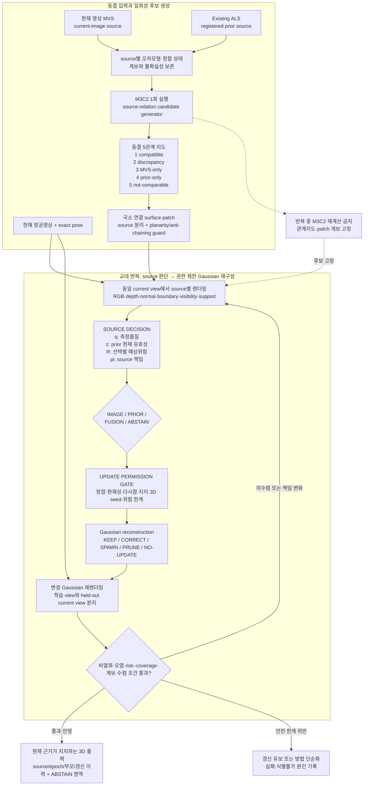
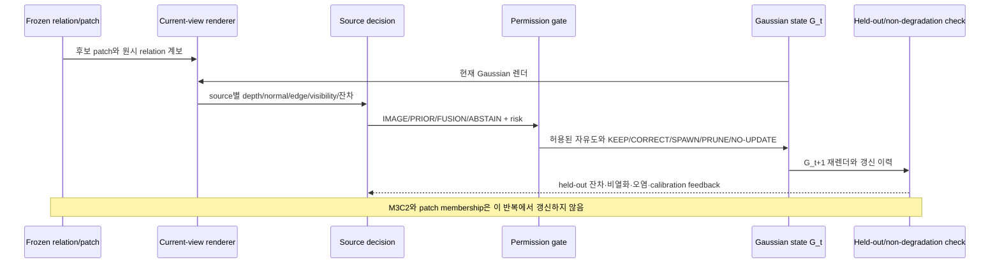
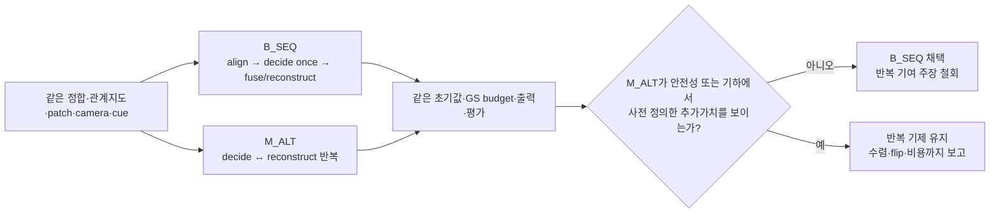

# Source-aware 비열화 Gaussian 재구성 흐름도 v1

> **지위: DEVELOPMENT METHOD DIAGRAM — DRAFT, NON-CONFIRMATORY.**
> 이 문서는 현재 개발 흐름을 도식화한 보조 기록이다. E1–E6 정본, `DEC-P1-025`,
> 기존 methodology v1/v2를 수정하거나 대체하지 않는다. 수식·임계값·최종 방법명은
> 동결되지 않았고 `scientific_verdict: null`이다.

## 1. 한 문장 정의

현재 영상 MVS와 Existing ALS의 관계를 **M3C2로 한 번만 후보화**하고, 후보를
국소적으로 연결된 source-surface patch로 만든 뒤, 현재 영상에서 얻는 다시점
증거로 `IMAGE / PRIOR / FUSION / ABSTAIN` 책임과 실제 Gaussian 갱신 권한을
분리해 판단하며, 갱신 결과의 재렌더링과 비열화 검사를 통해 판단과 Gaussian
재구성을 교대로 반복하는 방법이다.

핵심 경계는 다음과 같다.

- M3C2는 반복최적화기가 아니라 **일회성 source-relation 후보 생성기**다.
- 다섯 관계 라벨은 어느 source가 맞다는 정답이 아니라, 이후 렌더링·판단이 필요한
  위치와 비교 가능성을 나타낸다.
- surface patch는 개별 core의 파편화를 완화하는 공간적 판단 단위다. 원시 core와
  다섯 관계지도는 삭제하거나 patch 라벨로 덮어쓰지 않는다.
- `IMAGE / PRIOR / FUSION / ABSTAIN`은 **소스 책임**이고, `KEEP / CORRECT /
  SPAWN / PRUNE / NO-UPDATE`는 **Gaussian 연산**이다. 두 집합을 같은 라벨로
  취급하지 않는다.
- 반복법의 추가가치는 강한 순차 비교법 `B_SEQ`보다 좋아야 한다. 그렇지 않으면
  반복을 제거하고 더 단순한 순차법을 채택한다.

## 2. 전체 방법 흐름

도식에서 M3C2와 patch는 반복 바깥에 있다. 반복되는 값은 현재 Gaussian
`G_t`에서 렌더한 증거, source 책임, 갱신 권한, Gaussian 상태다. 따라서 반복할
때마다 M3C2 문턱을 다시 적용해 후보 자체를 움직이거나, 현재 Gaussian이 prior에
가까워졌다는 이유로 원래 충돌 증거를 지워서는 안 된다.

## 3. 일회성 후보지도에서 patch까지

| 관계 | 후보 의미 | patch 및 current-view 단계에서 할 일 |
|---|---|---|
| `COMPATIBLE_WITHIN_LOD` | 두 source 차이가 현재 LoD 안 | benign non-degradation과 잘된 MVS 보존을 확인하는 control 후보 |
| `SIGNIFICANT_DISCREPANCY` | 두 source 차이가 local LoD를 넘음 | 정합오차·시간 변화·source 측정오류를 current-view evidence로 구분 |
| `MVS_ONLY_SUPPORT` | MVS 쪽만 충분한 support | prior 부재인지, 현재 신규 형상인지, MVS artifact인지 판정 |
| `PRIOR_ONLY_SUPPORT` | prior 쪽만 충분한 support | 가림·MVS 실패·철거/변화·정합오차를 구분하고 현재성이 없으면 유보 |
| `NOT_COMPARABLE` | normal/support/boundary 조건 부족 | 연결 bridge로 사용하지 않고 보수적으로 보류; 별도 재관측·원인 기록 |

patch 생성은 개별 M3C2 core를 단순히 팽창시키는 후처리가 아니다. 동일 source
surface 안에서 거리·법선·국소 평면 적합을 만족하는 core를 연결하되, 합칠 때마다
전체 patch의 평면 잔차와 크기를 다시 검사해 chaining을 막는다. patch에는 최소한
다음 계보를 남긴다.

- 원본 core ID와 원래 다섯 관계 라벨
- core source, patch ID/고정 UID, patch 크기와 공간 범위
- dominant relation과 purity, `SMALL_FRAGMENT`/혼합/유보 상태
- 연결 승인·기각 이유와 사용한 parameter profile

patch 관계는 판단 편의를 위한 집계값이다. 원래 `SIGNIFICANT_DISCREPANCY`를
patch smoothing으로 `COMPATIBLE`로 바꾸거나 작은 patch를 삭제하지 않는다.

## 4. source 책임과 Gaussian 연산의 분리

| source 책임 | 의미 | 권한 gate를 통과한 뒤 가능한 연산 |
|---|---|---|
| `IMAGE` | 현재 영상 계열의 예상 위험이 가장 낮음 | 기존 형상 `KEEP/CORRECT`; 영상 유래 3D seed와 다시점 지지가 있을 때만 `SPAWN` |
| `PRIOR` | 정합·품질·현재성이 적격한 prior의 위험이 더 낮음 | 허용된 자유도만 `CORRECT`; 검증된 prior seed에서만 조건부 `SPAWN` |
| `FUSION` | 같은 현재 표면을 두 source가 상보적으로 지지 | 책임 비율과 자유도를 고정한 공동 `CORRECT`; 적격 seed가 있을 때만 `SPAWN` |
| `ABSTAIN` | 원인을 식별할 수 없거나 모든 선택 위험이 큼 | `NO-UPDATE`; 필요하면 prior 재현층을 현재 형상과 분리해 출력 |

`PRIOR`가 선택됐다는 사실만으로 prior 복사 권한이 생기지 않는다. 마찬가지로
`IMAGE`는 RGB 잔차만으로 빈 공간의 깊이를 발명하는 권한이 아니다. `SPAWN`은
source 책임과 별도로 3D 위치, 부모 계보, 다시점 지지, 예상 오염 위험을 통과해야
한다. `PRUNE`도 source disagreement만으로 수행하지 않고 가시성·free-space와
현재성 근거가 있어야 한다.

## 5. 한 반복의 계약

반복 상태는 최소한 `patch × source` 위험, source 책임, 허용 자유도, Gaussian
부모/마지막 갱신 source, 재렌더 검증값만 들고 간다. 원본 MVS와 ALS는 불변
source asset 또는 재생 가능한 렌더 cache로 유지하며, 매 반복마다 두 전체 점군을
복제한 새 상태를 만들 필요는 없다. 구현에서 cache를 쓰더라도 camera·source·해상도·
renderer version·asset hash를 키로 고정한다.

## 6. 렌더링 및 비열화 판독 계약

현재 단계의 source 렌더링은 source 정답을 만드는 것이 아니라 판정 cue와
representation bias를 점검하는 개발 진단이다. 동일 camera와 동일 rasterization
조건에서 최소한 다음 패널을 비교한다.

1. current RGB와 source별 silhouette/depth/normal/boundary
2. 두 source의 공통 가시영역 depth·normal·경계 차이
3. current image edge와 source geometry edge의 정합
4. raw relation projection과 patch projection의 전후 비교
5. `G_t`와 `G_t+1`의 학습 view 및 held-out current-view 재렌더
6. patch별 source action, 예상 위험, 갱신 연산, 계보 overlay

point splat, mesh ray tracing, Gaussian rasterization은 다른 표현 편향을 갖는다.
따라서 renderer 종류·point size·occlusion rule·해상도를 고정하고, 한 renderer의
결과만으로 source의 현재성을 확정하지 않는다. 영상 품질 개선은 3D 기하 개선과
동일하지 않으며, 비열화는 다음 세 층을 함께 본다.

- **보존:** 잘된 direct MVS/E2와 image-only GS가 불필요하게 나빠지지 않는가
- **구제:** prior가 실제로 유효한 약한 영상영역에서 완전성·기하가 개선되는가
- **안전:** stale/misaligned prior 오염, 잘못된 신규 생성, pass→fail이 억제되고
  식별불가 영역은 `ABSTAIN`으로 남는가

현재 UAS LiDAR와 LoD2 RoofSurface/Z는 이 source 결정의 입력이나 parameter 선택에
사용하지 않는다. 별도로 승인된 score-only 단계에서만 geometry 평가와 local oracle에
쓸 수 있다.

## 7. 강한 순차 비교법과 반복법의 채택 조건

`B_SEQ`와 `M_ALT`의 유일한 구조적 차이는 재렌더 feedback loop여야 한다. patch,
source cue, risk estimator, 초기 Gaussian, renderer, iteration/compute budget,
permission rule이 달라지면 반복의 효과를 분리할 수 없다. 다음 중 하나면 반복
설계를 단순화하거나 중단한다.

- `B_SEQ`가 `M_ALT`와 동등하거나 더 안전하고 정확하다.
- source action flip이 수렴하지 않거나 작은 렌더 변화에 불안정하다.
- benign patch의 non-degradation을 반복적으로 위반한다.
- `ABSTAIN`을 제외한 자동 source 판단이 허용 evidence로 재현되지 않는다.
- 반복 이득이 representation/rendering artifact로만 설명된다.

이 흐름도는 연구가설과 검증 계약을 나타낼 뿐, 반복법의 우월성이나 박사학위
차별성이 이미 입증됐다는 판정은 아니다.
