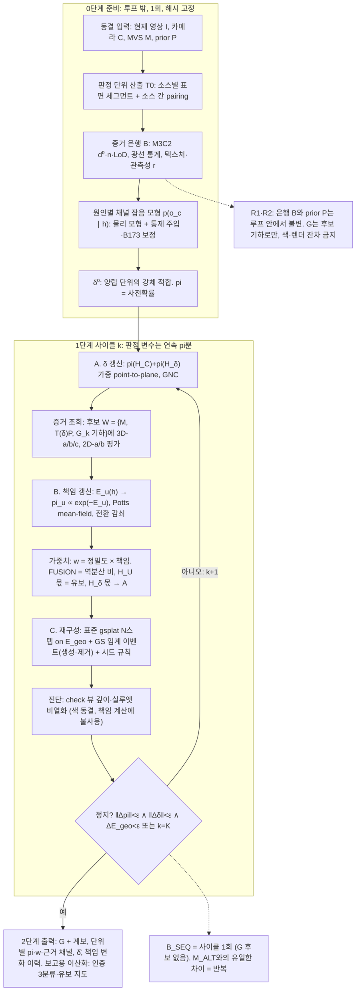
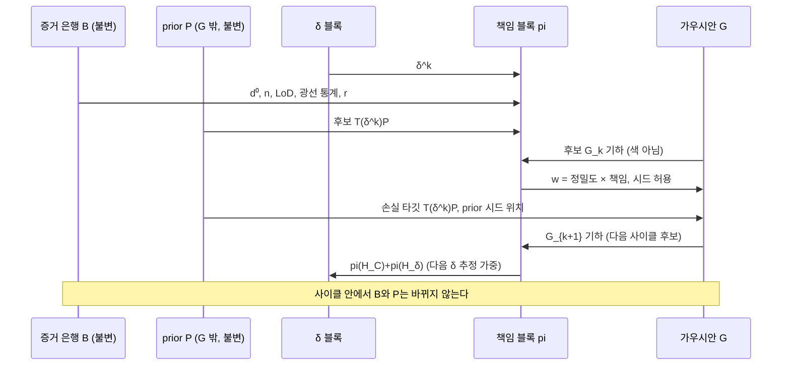

# 영역별 소스 판정과 연속 교대 재구성 — 방법 설계 v2

> **지위: METHOD DESIGN — DRAFT, NON-CONFIRMATORY.** `scientific_verdict: null`.
> 작성: 2026-09-02(r2 재편). 리뷰어: 김휘영. 상위 결정: `DEC-P1-025`.
> 본 문서는 `SOURCE_DECISION_ANTI_ACCUMULATION_DESIGN_ko_v1.md`(r2)의 내용을
> **배치와 중복 제거만으로** 재편한 것이며 설계 결정은 동일하다. 본문(§1~§10)은
> 방법 정본, 부록(A~D)은 근거·논쟁·문헌·정정·수식 총람이다. 각 절은
> "무엇 → 왜 → 수식 → 미결" 순서로 읽는다. 수식 번호 (1)~(12)는 부록 D에 상태와
> 담당 태스크와 함께 모아 두었다. 수식·임계값·학습 방식은 동결하지 않는다.
> 사용자 결정(2026-09-02): ① prior는 `G` 밖의 고정 가설 ② 판정 단서는 데이터와
> 후보 기하에서만 ③ 루프 안의 판정 변수는 연속 책임 ④ 잡음 모형 보정은 합성
> 주입 + B173 자연 낡음 held-out ⑤ 판정 단위는 T0에서 재정의.

> **현행 압축판(2026-09-05): `../method_v3/METHOD_ko_v3.md`.** 본 문서는 수식 부록(D)·설계 이력·실측 주석의 기록이며, 두 가지에서 압축판이 우선한다:
> 산출물 = 출처·시기·책임·인증 속성이 붙은 현재시점 점군(LoD2·메시는 하류 probe), 재구성 연산자 = 책임 가중 점군 융합(렌더링 최적화·가우시안은 방법에서 제외,
> 텍스처 메시가 목적이 될 때만 별도 검토). 서사 = `../research_narrative_v3/RESEARCH_NARRATIVE_ko_v3.md`, 기여 = `CONTRIBUTION_STATEMENT_ko_v2.md`.

## 1. 문제 정의와 의도

**의도(사용자 진술 다섯 문장).** ① 영역에 따라 사용 소스를 달리 해 MVS와
prior를 융합하는 반복 최적화. ② 영역별 소스 판정과 재구성 최적화가 반복되며
서로의 오차를 해소. ③ 판정은 3D 요소와 2D 요소를 모두 판별. ④ 판정은 가중치
기반이고 연속. ⑤ 갱신 대상은 가우시안.

**제약과 결정.** (a) 학습된 색과 렌더-대-사진 잔차는 판정에 쓰지 않는다(S3 r17
실측: 색 재적합이 기하 잔차를 위장). (b) prior는 `G` 밖의 고정 가설이다. (c) 이산
라벨은 루프 밖(GS 임계 이벤트·보고)에만 둔다.

**질문.** 3D와 2D 요소를 모두 포함하되 오차를 누적시키지 않고 영역별 소스
판정을 수행하려면 어떻게 하는가.

**답.** 판정을 "현재 모델 잔차의 문턱"이 아니라 **동결된 데이터에 후보 표면
{MVS, prior@δ, 현재 G}를 대조해 원인별 연속 책임을 구하는 것**으로 두고, 책임에서
소스별 가중치를 만들어 gsplat으로 재구성하며, 정합 δ는 두 소스가 양립하는
영역에서 따로 추정해 공유한다. 누적을 막는 것은 증거 불변, 식별 가능한 원인
집합, 동결 없는 매 사이클 재판정, 세 가지다(근거는 부록 A).

**기여 후보.** 채널이나 반복이 아니라 **원인 귀속(식별성)·연속 책임·비누적
규약·검증 계약의 결합**이다. 문헌검토 v1의 공백 판정(이종·구식 3D prior의
δ·현재성·소스 책임을 미분 가능 렌더링 재구성 안에서 함께 추정하는 문헌 부재)은
유지된다(부록 B).

## 2. 개요

### 2.1 말로 푼 방법

두 증언이 있다. 현재 영상과 거기서 나온 MVS는 "지금 이 자리에 이런 표면이
있다"고 말하고, 기구축 ALS는 "예전에 이 자리에 이런 표면이 있었다"고 말한다.
두 증언은 서로 다른 좌표 언어로 말하고(δ), 어느 쪽도 항상 옳지 않다. MVS는
텍스처가 없거나 가려진 곳에서 말을 못 하거나 틀리게 말하고, ALS는 그 사이 바뀐
곳에서 낡은 말을 한다. 방법은 표면 단위마다 두 증언과 "지금까지 고쳐 온 형상"을
**동결된 증거**에 대조해 누구 말을 얼마나 들을지(연속 책임)를 정하고, 그
비율대로 현재 형상을 고치고, 고친 형상을 다시 후보로 올려 같은 증거에 대조하는
일을 반복한다.

세 변수가 번갈아 갱신되는 이유는 각각 다른 질문에 답하기 때문이다. δ는 "ALS의
좌표 언어를 우리 좌표로 옮기면 어디인가"에 답하며, 두 증언이 일치하는 곳에서
배워 ALS만 말하는 곳에 적용한다. 책임은 "이 단위에서는 누가 얼마나 옳은가"에
답한다. `G`는 "그래서 표면이 어디에 어떻게 놓이는가"에 답한다. 반복해도 오답이
쌓이지 않는 이유는 증거를 한 번 만들고 다시 고치지 않기 때문이다. 바뀌는 것은
검정받는 후보뿐이고, 틀린 후보는 다음 사이클에 같은 증거 앞에서 진다.

### 2.2 순서도



한 사이클 안의 데이터 흐름. 은행 `B`와 prior `P`는 읽히기만 한다.



### 2.3 표기법

| 기호 | 뜻 |
|---|---|
| `I`, `C` | 현재 영상, exact 카메라(동결) |
| `M` | 현재 영상 MVS 점군·표면(동결) |
| `P` | Existing ALS 점군(prior). `G` 밖의 고정 가설(동결) |
| `δ`, `T(δ)` | 건물/스트립별 강체 정합 잔여와 그 변환 |
| `G` | 평면형 가우시안 집합(현재 형상; 유일한 갱신 대상 형상) |
| `u`, `u~v` | 판정 단위(세그먼트)와 인접 |
| `W(δ, G) = {M, T(δ)P, G}` | 후보 표면 |
| `c` | 증거 채널 ∈ {3D-a, 3D-b, 3D-c, 2D-a, 2D-b}; 2D-c와 `r`은 관측성 |
| `o_{u,c}(w)` | 단위 `u`, 채널 `c`, 후보 `w`의 관측값 |
| `B` | 증거 은행 {`d⁰`, `n`, LoD, 광선 통계, 텍스처 통계, `r`} |
| `h ∈ H` | 원인 ∈ {H_C 양립, H_δ 정합, H_M MVS 틀림, H_chg prior 틀림, H_U 비관측} |
| `pi_u(h)` | 단위 `u`의 연속 책임(사후확률) |
| `w_{u,s}`, `σ²_{u,s}` | 소스 `s ∈ {image, prior}`의 가중치와 기하 잔차 분산 |
| `E_dec`, `E_geo`, `E_reg` | 판정·형상·정합 목적함수 |
| `λ`, `λ_t` | 공간 평활, 전환 감쇠 계수 |
| `k`, `K` | 사이클 번호, 상한 |

### 2.4 상태와 사이클

**상태.** `G`(MVS 초기화), `pi`(단위별 원인 위의 연속 분포), `δ`. `P`는 `G` 밖의
고정 가설이며 `G`에는 손실 타깃(`T(δ)P`로 당김)과 시드(빈 곳의 신규 가우시안
후보)로만 들어간다.

**사이클.** ① 증거 계산: 단위마다 후보 `W`가 데이터를 얼마나 설명하는지를 3D와
2D로 잰다. ② 책임 갱신: 원인별 연속 사후 책임 `pi`. ③ 가중치: `w = 정밀도 ×
책임`. ④ 재구성: 가중 손실로 표준 gsplat 스텝, 생성·제거는 GS 임계 이벤트, 시드는
책임이 높은 소스에서만. ⑤ δ 갱신: 양립 책임이 높은 단위에서 강건 3D 적합.
⑥ 종료: `pi`, `δ`, 손실이 멈추면. 한 번만 돌면 순차 기준선 `B_SEQ`.

### 2.5 이산이 남는 자리

GS 고유 임계 이벤트(생성·제거는 표준 GS도 불투명도 문턱으로 하는 이산 사건;
시드 허용은 책임 문턱)와 보고(건물별 현재성 인증 3분류, 유보 지도는 최종 `pi`의
문턱 이산화). 루프 안의 판정 변수는 연속 `pi`뿐이다.

## 3. 판정 단위

**무엇.** 책임 하나가 붙는 공간 단위. 소스 표면의 **세그먼트**(지붕면, 벽면,
지면 조각, 매끈하지 않은 곳은 "거친 영역")이며 경계·법선·면적을 갖는다. MVS
세그먼트와 prior 세그먼트를 겹침으로 짝지어 한 위치에 단위 하나를 둔다.

**왜.** 책임은 위치마다 하나여야 하고, 단위가 데이터(소스 표면)에 정의돼야
증거 불변(부록 A.3 R1)이 선다. `G`에 정의한 단위(현재 재구성의 평면)는
사이클마다 재계산해야 하므로 쓰지 않는다. 기존 `mvs_als_surface_patch_v1`의
"patch"(M3C2 표본점 2 m 간격의 평면 군집, 45,129개/stable 4,858개, 미배정·섬 58%)는
면적이 없고 커버리지가 불완전하며 소스별로 겹치므로 **단위가 아니다**(사용자
판정 2026-09-02). 참고 산출물로만 남기고, M3C2 지도는 3D-a의 표본점으로
존속한다.

**합격 기준(T0).**

1. 면적이 있는 연속 영역이며 점 집합이 아니다.
2. 완전 커버리지. 모든 소스 점과 resolver를 거친 모든 가우시안이 정확히 하나의
   단위에 속하고, 미배정은 "거친 영역" 단위로 명시한다.
3. 하나의 책임이 타당한 규모. 원인이 하나라고 볼 만큼 작고, 2D-a에 충분한
   픽셀과 3D-b에 충분한 광선이 있을 만큼 크다(관측성 `r`이 단위 크기의 함수).
4. 위치 단위 pairing. MVS가 있는 곳은 MVS 세그먼트 주, prior-only 지대는 prior
   세그먼트 주.
5. 데이터에 정의.
6. 결정론적 ID와 계보(core·점·가우시안 역참조).

**수식.** 부록 D-1(2026-09-02 초안, 리뷰 대기). 소스별 작업 셀(0.25 m) 위의
결정론적 평면 region growing(D-1b), 면의 성질로 정의한 면적(D-1c), 규모 상한
분할(D-1.4), 잔여의 거친 영역(D-1d), 동결 M3C2 투영창과 같은 창으로 하는 소스 간
pairing(D-1e·f), prior 지지 비율 `f_P`(D-1g), resolver(D-1h). 기준값은 D-1.9,
커버리지 회계는 D-1.10.

**미결.** D-1.11. 첫 대상은 동결 파일럿 prism(tile `x003_y004`), 그다음 전체
장면.

## 4. 증거

### 4.1 후보 표면

```text
(1)  W(δ, G) = { M,  T(δ)P,  G }
```

`M`은 MVS 표면, `T(δ)P`는 δ만큼 옮긴 prior 표면, `G`는 현재 형상의 기하다.
채널값은 후보에 조건화되어 `o_{u,c}(w)`로 계산된다. 데이터(`I, C, M, P`)는 δ와
`G`에 의존하지 않고 후보만 의존한다. `G`는 네 번째 소스가 아니라 검정 중인 현재
추정치다(부록 A.5).

### 4.2 채널 목록

`[은행]`은 루프 밖 1회 계산·해시 고정, `[후보 조건]`은 동결 데이터의 결정론적
함수이되 후보 표면에 따라 값이 달라지는 것이다.

| 채널 | 정의 | 답하는 질문 | 지위 |
|---|---|---|---|
| 3D-a 표면 거리 | M3C2 부호거리 `d⁰`, 법선 `n`, LoD95 | 두 소스가 같은 표면을 지지하는가 | `[은행]` |
| 3D-b 자유공간·가시성 | 현재 카메라 광선을 후보 표면과 MVS 표면에 추적. 관통(후보 통과 후 더 먼 MVS 착지) = 소실 서명, 차단(MVS가 후보 앞) = 출현 서명, 무착지 = 비관측 | "있어야 할 것이 없음"인가 "볼 수 없음"인가 | `[은행]` + `[후보 조건]` |
| 3D-c δ 정합성 | 단위 오프셋 `n·(x^M − T(δ)x^P)`가 건물 강체 변환 하나로 설명되는가 | 계통인가 국소인가 | `[후보 조건]` |
| 2D-a 뷰간 직접 광도 일관성 | 후보 표면으로 현재 영상 i를 j 자리로 warp해 robust NCC. 모델 색 불요 | 어느 표면이 현재 영상들을 서로 일관되게 설명하는가 | `[후보 조건]` |
| 2D-b 실루엣·에지 정합 | 후보 표면의 투영 경계와 영상 에지의 거리 | 경계가 맞는가 | `[후보 조건]` |
| 2D-c 텍스처·시차 | 텍스처 강도, 교차각, 뷰 수, 입사각 | 2D-a가 검정력을 갖는가 | `[은행]` |
| 관측성 `r` | 이 단위에서 검정력이 있는 채널 수 | 판정이 가능한 자리인가 | `[은행]` |

### 4.3 채널별 정의·수식·검정력

**3D-a.** 은행값 `d⁰_u`(초기 정합 `δ⁰`에서의 M3C2 부호거리), `n_u`, `LoD_u`
(roughness + 정합 공분산; 오차전파형은 `Σ_MVS + Σ_ALS + Σ_δ`). δ가 바뀌면
재계산 없이 법선 성분만 옮긴다.

```text
(2)  d_u(δ) = d⁰_u − n_u · (δ − δ⁰)
```

`G` 후보에 대해서는 `G` 표면과 `M`·`T(δ)P` 각각의 법선 방향 거리. 검정력 조건:
양쪽 지지 충분. 단독으로는 δ·변화·MVS 오류를 구분하지 못한다.

**3D-b.** 후보 `w`마다 현재 광선·MVS 자유공간이 `w`와 모순되는 비율. 자유공간
증거는 MVS가 후보 뒤에서 표면을 찾았을 때(관통) 또는 앞에서 찾았을 때(차단)만
성립하고, MVS가 표면을 찾지 못한 광선은 비관측으로 센다(그렇지 않으면 MVS
구멍이 소실로 오독된다). 검정력 조건: 광선 수 ≥ `n_min`. 수식은 골격(착지
허용오차, 표본 수, 모순 비율 정의는 T1).

**3D-c.** 단위 오프셋의 이웃·건물 δ 결맞음. 계통(공유 저차원)과 국소를 규모
비대칭으로 분리한다. 수식은 골격(정규화 잔차식은 T1/T6).

**2D-a.** 후보 표면 `w`로 영상 i의 단위 발자국을 영상 j로 warp해 robust NCC를
계산하고 뷰쌍에 걸쳐 집계한다. 학습된 색을 쓰지 않으므로 색-위장(r17)과
유인장(r18)에 면역이다. 선행의 2D(같은 자리의 분광·텍스처 변화)와 달리 "어느
기하가 현재 영상들을 서로 설명하는가"를 잰다(부록 B). 검정력 조건: 2D-c ≥ 문턱
∧ 뷰 ≥ 2. 수식은 골격(창·발자국, 뷰쌍 선택, NCC 형식, 집계, 가림 처리는 T2).

**2D-b.** 후보 표면의 투영 경계와 영상 에지의 거리. 무텍스처에서도 일부
작동하나 점 샘플링 경계를 물체 경계로 오인할 수 있어 보조 채널이다(현재 뷰
파일럿 실측: 소스별 에지 픽셀 수 상이). 수식은 골격(T2).

**2D-c와 `r`.** 텍스처 강도·교차각·뷰 수·입사각에서 2D-a의 검정력을, 광선
수에서 3D-b의 검정력을 정하고, `r` = 검정력 있는 채널 수. 검정력 없는 채널은
책임 계산에서 자동으로 빠진다(§5.4). 수식은 골격(T1).

### 4.4 맹점과 보완

| 채널 | 못 하는 것 | 보완 |
|---|---|---|
| 3D-a | δ·변화·MVS 오류 구분, 우연 평면정렬 | 3D-b, 3D-c, 2D-a |
| 3D-b | 밀도 희소·가림에서 광선 부족 | `r`로 검정력 표시 |
| 3D-c | 변화 단위가 섞이면 δ 편향 | 양립 책임 가중 + 강건 추정(§7) |
| 2D-a | 무텍스처·반복무늬(광도 단독 δ 비식별, r18), 조명 변화 | 3D-b·2D-b, robust NCC, 2D-c |
| 2D-b | 샘플링 경계 오인 | 정규화, 보조 |
| `r` | 판정 불가 지대를 없애지 못함 | 없애지 않고 H_U 책임으로 낸다 |

## 5. 책임

### 5.1 원인 집합

**무엇.** 두 소스가 불일치할 때 "누가 왜 틀렸는가"의 목록. 책임 `pi`는 이
원인 위의 분포다.

| 원인 | 뜻 | 기호 | 책임 귀결 |
|---|---|---|---|
| MVS 쪽이 틀림 | 텍스처·시차·가림으로 MVS가 없거나 잡음 | H_M | PRIOR |
| prior 쪽이 틀림 | 표면이 사라짐·생김·이동(시효 만료) | H_chg | IMAGE |
| 둘 다 맞는데 좌표가 어긋남 | 계통 정합 오차 | H_δ | 라벨 아님, δ 갱신 입력 |
| 둘 다 맞고 차이는 잡음 | 표현·해상도·측정 잡음 | H_C | FUSION |
| 판정 불가 | 현재 영상이 못 봄 | H_U | 유보 |

**왜.** 최소 4(H_C, H_M, H_chg, H_U)는 결정이 아니라 **책임 4종의 정의**다. 원인
없이 책임을 만들려면 잔차 크기에서 가중치를 만들어야 하는데 그것은 방향(누구를
줄이나)이 없다. H_δ는 "차이가 정합으로 설명되는가"를 검정하기 위해 필요하다.
원칙은 **원인의 수 = 서로 다른 처방의 수**. 확장(H_chg를 소실/출현/이동으로
분할; 광선 점유 전이로 정의해 건물에 한정하지 않음)은 3D-b 서명이 셋을
가른다는 것이 채널 절제에서 확인될 때만 채택한다(부록 A.7).

### 5.2 서명표(식별성 점검)

각 원인이 채널에 남기는 예상 패턴. 우도 모형의 정성 사양이며, 원인 쌍마다
갈라 주는 채널이 하나는 있어야 한다.

| 원인 | 3D-a | 3D-b | 3D-c | 2D-a MVS 후보 / prior 후보 | 2D-b |
|---|---|---|---|---|---|
| H_C | `\|d\| ≤ LoD` | 모순 없음 | — | 양호 / 양호 | 둘 다 정합 |
| H_δ | `\|d\| > LoD`, 같은 건물 다수 단위가 같은 벡터 | 모순 없음 | 강체 δ 하나로 해소 | 불량 / δ̂ 후 양호 | δ̂ 후 정합 |
| H_chg 소실 | `\|d\| > LoD`, 국소 | 관통 | 해소 안 됨 | 양호 / 불량 | MVS 정합 |
| H_chg 출현 | MVS-only 지지 | 차단 | — | 양호 / — | MVS 정합 |
| H_chg 이동 | `\|d\| > LoD`, 국소 | 부분 관통 | 해소 안 됨 | 우세 / 열세 | 혼합 |
| H_M | prior-only 지지 또는 `\|d\| > LoD` | 관통 없음 | — | 불량 / 불량 또는 무텍스처 | prior 정합 |
| H_U | — | 광선 없음 | — | 평가 불가 | — |

읽는 법. 규모 비대칭이 식별성의 원천이다(δ는 공유 저차원, 변화는 국소, 잡음은
단위 규모 무작위). 우연 평면정렬은 3D-a만으로 못 잡으므로 H_C의 조건은 `|d| ≤
LoD ∧ 3D-b 모순 없음 ∧ 2D-a 동률`이다. prior가 필요한 자리는 H_M의 서명(2D-c
낮음 ∧ 자유공간 모순 없음 ∧ 경계 정합)으로 정의된다.

### 5.3 우도 결합

**무엇.** 원인마다 채널 관측의 잡음 모형 `p(o_c | h, W)`를 두고, 실제 관측이
각 원인 아래 얼마나 그럴듯한지를 곱해 사후 책임을 만든다.

```text
(3)  E_u(h)  = Σ_{c ∈ C_u} −log p( o_{u,c}(W) | h )  −  log P_u(h)        # C_u = 검정력 있는 채널
(4)  pi_u(h) ∝ exp( −E_u(h) )
```

**왜.** 단위가 다른 원시 잔차를 손잡이 가중치로 더하면(점수 합산) 큰 3D 거리가
누가 틀렸는지 말하지 않고, 무텍스처 단위의 작은 광도 잔차가 "양립"으로
오독된다. 우도는 무차원이라 채널 간 공통 화폐가 되고, 가중치는 손잡이가 아니라
잡음 모형에서 나오며, 무정보 채널은 우도비 1로 자동 탈락한다(부록 A.6의 예시).

**수식 상태.** (3)(4)의 형식은 설계됨. 채널·원인별 우도 가족과 파라미터, 보정
절차(물리 모형 + 통제 주입 + B173 held-out)는 T3(부록 D-8).

### 5.4 사전확률·평활·감쇠

```text
(5)  F(pi) = Σ_u Σ_h pi_u(h)·E_u(h)  −  Σ_u H(pi_u)
           + λ Σ_{u~v} Σ_h ( pi_u(h) − pi_v(h) )²  +  λ_t Σ_u ‖ pi_u − pi_u^{prev} ‖²
```

- 블록 B는 (5)를 mean-field로 1회 내린다(Neal & Hinton 1998의 EM 해석). 이산
  라벨은 `argmax`로 얻는 파생량이며 루프 안의 가중치 경로에는 쓰지 않는다.
- **H_U 사전확률**을 관측성 `r`의 감소 함수로 두면, 검정력 없는 채널이 모든
  원인에 우도비 1을 주는 단위에서 책임이 자연히 H_U로 몰려 두 소스의 가중치가
  함께 낮아진다. `r < 2 → pi = H_U`는 구현 지름길일 뿐 판정 변수가 아니다.
- **공간 평활** `λ`: 같은 소스 표면 안의 인접 단위는 원인이 급변하지 않는다는
  사전지식. 맞추는 것은 책임 분포이지 기하가 아니다. purity guard로 작은 실제
  변화는 보존한다.
- **전환 감쇠** `λ_t`: 동결이 아니라 감쇠. 증거가 넘어서면 언제든 바뀐다.

**미결.** H_U 사전 `f(r)`, 원인 사전, `λ`, `λ_t`, mean-field 반복 수(T4).

### 5.5 출력

단위별 `pi_u(h)`, 근거 채널(어느 채널이 어느 원인을 밀었나), 보고용
`z_u = pi_u(H_C) + pi_u(H_M)`(prior 현재 유효 확률; 가중치에 다시 곱하지 않음).

## 6. 가중치와 재구성

### 6.1 가중치

```text
(6)  pi_{u,image} = pi_u(H_chg) + f_u · pi_u(H_C)
     pi_{u,prior} = pi_u(H_M)   + (1 − f_u) · pi_u(H_C)
     f_u = (1/σ²_{u,image}) / (1/σ²_{u,image} + 1/σ²_{u,prior})       # FUSION 몫 = 역분산 비
(7)  w_{u,s} = pi_{u,s} / σ²_{u,s}                                     # 정밀도 × 책임
(8)  z_u = pi_u(H_C) + pi_u(H_M)                                       # 보고용
```

H_U 몫은 어느 쪽에도 가지 않고(유보), H_δ 몫은 δ 갱신(§7)으로 흐른다.

**왜.** 잔차 항의 최적 가중치는 정밀도 `1/σ²`이고, 소스가 유효할 확률 `γ`의 혼합
모형에서 EM의 M-step 가중치는 `γ/σ²`다(Black–Rangarajan 쌍대성도 같은 결론).
방법론 v2 §3.1의 `q·z·pi` 곱은 `z`가 이미 `pi` 안에 있어 유효 확률을 두 번
세므로 쓰지 않는다(부록 C). `q`는 [0,1] 품질이 아니라 역분산이어야 최적성이
선다. 지킬 세 조건: 틀렸다고 판정된 소스는 `w → 0`, 둘 다 맞으면 역분산 비례,
책임이 갈라진 단위는 `w`도 중간값.

**미결.** `σ²_{u,s}` 추정식(밀도·평면 잔차·2D-c에서; T4). `pi`를 사후확률로
둘지 위험 최소 행동으로 둘지(0-1 손실에서는 동일; 절제).

### 6.2 형상 손실

```text
(9)  E_geo(G; w, δ) = L_render(G; I) + λ_anchor·L_anchor(G; M)
                    + Σ_u w_{u,image}·L_image_geom(G) + Σ_u w_{u,prior}·L_prior_geom(G; T(δ)P)
                    + L_surface + L_visibility + L_reg_G                   (방법론 v2 §3.2 골격)
```

`L_render`는 꺼지지 않는다. prior 가중치가 커진 단위도 현재 영상 렌더 손실을
계속 받는다. 이 손실의 색은 재구성 안에서만 쓰이고 §5의 책임 계산에는 들어가지
않는다.

**미결.** 항별 형식(`L_image_geom`의 대상: 깊이/법선, `L_prior_geom`의 커널,
anchor·surface·visibility의 형식)은 T5(부록 D-9).

### 6.3 이벤트와 시드

생성·제거는 GS 고유의 임계 이벤트(불투명도·기울기)다. 시드 규칙만 더한다. 빈
영역의 신규 가우시안은 책임이 높은 소스의 3D 시드에서만 태어난다. 영상 유래
시드(SfM/MVS 탈락 후보, 다중시점 검증 가능 후보)는 `pi_image`가, prior 시드는
`pi_prior`가 문턱을 넘을 때 허용하고, prior 시드는 `T(δ)P` 위치에서 태어난다.
태어난 뒤에는 `G`의 일원으로 손실로만 움직이며 "prior 출신" 계보를 단다. RGB
잔차만으로 임의 깊이에 만드는 것은 허용하지 않는다. 제거 문턱은 보수적으로
두고(제거는 되돌릴 수 없음) 시드는 재발급 가능하게 한다.

**미결.** 시드 문턱, 이벤트 파라미터(T5).

### 6.4 색 재적합과 check 뷰

색 재적합은 책임 계산에 들어가지 않으므로 판정을 위장하지 못한다. 비열화
진단(check 뷰의 깊이·실루엣)은 색 동결 상태에서 수행하고, 재적합 스텝 상한은
r17 반감기(5~15스텝)를 근거로 둔다. check 뷰 값은 정지 조건과 진단에만 쓴다.

## 7. 정합 δ

**무엇.** prior(2022 ALS, 제공자 좌표계·DHHN2016)를 현재 영상·포즈 좌표계로 옮긴
뒤 남는 정합 잔여 오차. 스칼라 브리지 +45.7 m는 적용됐고 잔여는 미지수다(C4
수용 포락 0.5 m는 민감도이지 추정치가 아님). 방법론 v2 부록 C의 `delta_k`,
`L_alignment,k`, S3의 `d_eff = d⁰ + n⁰·δ`가 이 변수다. 건물/스트립 단위 강체
(초기: 수직 이동 + 수평 2D). δ는 `G` 밖의 prior 가설을 통째로 옮기며(`T(δ)P`)
`G`를 직접 움직이지 않는다. prior 시드의 출생 위치는 δ가 정한다.

**왜 별도 변수인가.** 가중치는 prior 타깃을 "얼마나 세게" 당길지를 정하지
"어디로"를 정하지 않는다. δ가 틀리면 prior 책임 영역의 가우시안은 높은 확신으로
틀린 위치에 끌려간다. 그리고 δ가 필요한 자리(MVS가 없는 지대)에는 δ를 관측할
신호가 없다(3D 대응 불가, 광도 단독 비식별 r18). 그러므로 δ는 두 소스가 겹치고
일치하는 지대에서 추정해 겹치지 않는 지대로 전이해야 하고, 그 전이는 δ가
건물 단위 공유 변수일 때만 성립한다(번들 조정이 포즈를 점들이 흡수하게 두지
않는 것과 같은 구도).

**관측 가능성.** 법선 방향 잔차는 δ의 법선 성분만 구속한다. 지붕 위주 ALS에서
수직 성분은 강하게, 수평 성분은 벽·경사 지붕이 있을 때만 약하게 관측된다. 법선
공분산의 고유분해로 관측 가능한 성분만 추정하고 나머지는 사전값(0)에 묶는다.

**수식.**

```text
(10)  E_reg(δ; pi) = Σ_u [ pi_u(H_C) + pi_u(H_δ) ] · ρ_μ( n_u · ( x^M_u − T(δ) x^P_u ) )
```

`ρ_μ`는 GNC 커널(사이클을 따라 `μ` 축소). 광도는 쓰지 않는다.

**미결.** 회전 포함 여부, GNC 스케줄 `μ_k`(T6).

## 8. 교대 알고리즘

### 8.1 목적함수와 사이클

```text
(11)  E(δ, pi, G) = E_dec(pi; δ, G) + E_geo(G; pi, δ) + E_reg(δ; pi)      # E_dec = (5)

사이클 k:
A. δ^k  ← argmin_δ E_reg(δ; pi^{k−1})                  # (10), GNC μ_k 축소
B. pi^k ← mean-field 1회 on (5) with δ^k, G^{k−1}       # 연속 사후 책임
   w^k  ← (6)(7)
C. G^k  ← N스텝 경사하강 on (9) with pi^k, δ^k          # 표준 gsplat + 임계 이벤트 + 시드 규칙
(12)  정지: ‖pi^k − pi^{k−1}‖ < ε_pi ∧ ‖δ^k − δ^{k−1}‖ < ε_δ ∧ ΔE_geo < ε_E, 또는 k = K
B_SEQ = A→B→C 1회
```

### 8.2 왜 매 사이클 다시 판정하는가

증거는 고정이지만 검정받는 후보가 바뀐다. δ가 바뀌면 `T(δ)P`의 점수가 바뀌고
(δ는 양립 단위에서 추정되고 양립 판정은 δ에 의존하므로 순환), 재구성이 만든
`G`는 `M`도 `P`도 아닌 제3의 후보(보정된 면, 시드에서 자란 면)라 그 기하가 데이터를
더 잘 설명하면 책임이 옮겨 가고 못 하면 되돌아간다. 사이클 1에서는 `G ≈ M`이라
`G` 후보가 중복이므로 사이클 1은 `B_SEQ`와 같고, `G`가 `M`·`T(δ)P`와 LoD 안에서
같으면 후보로 넣지 않는다. δ도 `G`도 그림을 바꾸지 못하면 루프는 1사이클에
멈추고 순차법과 같아지며, 이는 `DEC-P1-025`가 요구한 "반복은 가설"의 판정
결과다. 재시작은 없다. `G`는 사이클을 가로질러 유지되는 상태다(부록 A.5).

### 8.3 수렴의 지위

세 블록이 각자 부분 목적함수를 최소화하는 근사 블록 하강이다. δ 블록이
`E_dec`·`E_geo`의 δ 의존을 무시하는 이유는 광도 δ 비식별(r18)이다. 단일 `E`의
단조성은 보장이 아니라 정지·책임 변화 곡선으로 검증하는 대상이다(§9).

**미결.** `ε` 값, `K`, `G` 후보 기하 추출 방식(단위 안 `G`의 평면 적합 또는 뷰별
깊이; T6).

## 9. 검증 계약

**통제 폐루프.** 주입 = 변화(소실/출현/이동) × δ(수직·수평) × 영상 강/약
(`DEC-P1-025` factorial; 판정전 합성 주입 기계 재사용). 사이클별 측정 = 원인별
혼동행렬과 책임 오류율, δ̂ 오차, 책임 변화량, H_U 비율과 risk–coverage, `B_SEQ`
대비. 합격 명제 = 오류율·δ̂ 오차 단조 비증가, 책임 변화 유한 수렴, `M_ALT ≥
B_SEQ`. 위반 시 반복을 철회하고 순차법을 채택한다.

**추가 시험.** 오판 회복 시험(사이클 1에 일부러 틀린 `w`를 주입해 회복되는가).
채널 절제 {3D-a} / {3D-a, 3D-b} / {+2D-a} / {+2D-b}. 원인 집합 절제(최소 4 vs 확장).
가중치 형식 절제(`q·z·pi` vs 정밀도 × 책임). 색 재적합 전후 책임 불변(r17형 위장
검사). 실제 낡음 held-out(B173).

**비교자.** `E2`(direct MVS), `B_I`(image-only GS), `B_P`(prior-only), `B_PR`
(registered prior only), `B_U`(단순 union), `B_FW`/`B_CW`(고정/적응 가중), `B_SEQ`,
`M_ALT`, `O_LOCAL`(score-only 국소 oracle). `B_SEQ`와 `M_ALT`는 같은 은행·단위·
카메라·잡음 모형·초기 `G`·예산을 쓰고 유일한 차이는 반복이어야 한다.

**성질 점검.**

| 요구 | 알고리즘에서의 자리 | 성립 조건 |
|---|---|---|
| 반복 기반 오차 해소 | A→B, C→B(`G^k` 후보), B→C, B→A | 증거가 데이터에서만(R1, R2), 동결 없음(R3) |
| 3D/2D 공동 판정 | (3)의 3D 채널(a, b, c)과 2D 채널(a, b) 원인별 합산 | 원인 조건부 독립, 2D는 후보 기하로 warp |
| 연속 가중치, 갱신 대상은 가우시안 | 루프 내 판정 변수는 `pi`뿐, 블록 C = 표준 gsplat × `w` | 이산은 임계 이벤트·보고에만 |

## 10. 구현 계획

### 10.1 파이프라인

| 단계 | 내용 | 상태 |
|---|---|---|
| 0 전제 | δ⁰(양립 단위 강체 적합) + 원인별 채널 잡음 모형 | `[신규]` |
| 1 영역 산출 | 판정 단위 = 소스별 표면 세그먼트 + pairing(T0). 5관계 지도는 3D-a 표본으로 존속 | `[신규]`; 현 patch 산출물은 참고 |
| 2 증거 생성 | 3D-b 광선 통계, 2D-c 관측성, 2D-a warp-NCC, 2D-b 에지. 후보 `{M, T(δ)P}`(`G`는 사이클 2부터) | `[신규]` |
| 3 판정·책임 | (3)~(8) | `[신규]` |
| 4 재구성 | MVS 초기화 gsplat + (9) + 시드 규칙 + 계보 + check 뷰 진단 | `[있음 개조]` |
| 5 반복판 | δ 재추정 → `G` 후보 → 2~4 반복 → (12). 사이클 1 = `B_SEQ` | `[신규]`, 4까지 성공 후 |

### 10.2 태스크

각각 스크립트 + config + 테스트 + technical return, Docker. 코드보다 먼저 **수식
절**(변수·단위·식·기본값·미결)을 부록 D에 쓰고 통과 후 구현한다. 첫 범위는
`B_SEQ`(1사이클) on 동결 파일럿 prism(tile `x003_y004`, relation core 610, 카메라
TOP/OBLIQUE_A/B; 2D-a는 prism을 보는 exact-937 뷰로 확장).

| ID | 내용 | 재사용 |
|---|---|---|
| T0 region unit v1 | 세그먼트 + pairing + 커버리지 회계 + resolver + 뷰어. **구현·파일럿 실측 완료(2026-09-02, `PHD-REGION-UNIT-v1`, 리뷰 대기)** — `scripts/phd/region_unit_v1`, 기술 반환 `docs/experiments/phd/region_unit_v1/TECHNICAL_RETURN_ko_v1.md`, 8892 뷰어 T0 층 | 8892 뷰어 골격 재사용; S1 `ransac_planes` 대신 셀 region growing(D-1) |
| T1 evidence bank v1 | **3D-a 집계(동결 core 의 `d⁰`·LoD 를 단위에 귀속, 중앙값)** + 3D-b 광선 통계 + 2D-c·`r` → 단위별 npz + validator. 구현 `scripts/phd/evidence_bank_v1`(9-3, XY 셀 짝 단위, 113 뷰), 정확한 정의는 D-3·D-7 | relation_map(3D-a 표본), 패치·pairing 산출물, exact cameras, MVS dense |
| T2 warp-NCC v1 | 2D-a warp-NCC(후보별 가시성·쌍별 ρ 은행·판별 대역 요약·짝 대조·통제 후보) + 2D-b 에지(보조). **구현·파일럿 실측 완료(2026-09-04, `PHD-WARP-NCC-v1`, r1→r2)** — `scripts/phd/warp_ncc_v1`, 기술 반환 `docs/experiments/phd/warp_ncc_v1/TECHNICAL_RETURN_ko_v1.md`, 8892 뷰어 T1·T2 증거 층, 정확한 정의는 D-5·D-6 | T1 은행(뷰·셀), pairing 높이장, 타일 MVS 가림, exact cameras; 판정전 측정기의 조밀 표본·Fisher-z 발상 |
| T3 noise-model calibration v1 | 채널·원인별 우도 가족과 파라미터, 합성 주입 + B173 held-out | 합성 주입 기계 |
| T4 responsibility v1 | (3)~(8), 근거 채널 원장 | T1~T3 |
| T5 weighted gsplat v1 | (9) + 시드 규칙 + 계보 + check 뷰 → `B_SEQ` 산출물 | E3 계열 파이프라인, S3 3c δ 배선 |
| T6 loop v1 | (10)~(12) + `G` 후보 기하 추출 → `M_ALT`; §9 비교 | T1~T5 |

### 10.3 루프 안과 밖

| 태스크 | 루프 밖(1회) | 루프 안(매 사이클) |
|---|---|---|
| T0 | 세그먼트, pairing, resolver | — |
| T1 | 광선 통계, `r`(3D-a는 있음) | 후보별 조회 |
| T2 | 함수 구현, `M` 후보 값 캐시 | `T(δ̂)P`·`G` 후보에 대해 호출 |
| T3 | 보정·고정 | 조회 |
| T4 | — | 블록 B 전체 |
| T5 | `G⁰` 초기화 | 블록 C |
| T6 | δ⁰ | 블록 A, `G` 후보 기하 추출, 정지 판정 |

`B_SEQ`는 T0~T5로 완성되며 T6이 루프를 닫는다.

### 10.4 수식 상태와 태스크 대응(실험 참고용)

"설계됨"은 변수·식이 닫혀 코드로 옮길 수 있음, "골격"은 정의와 역할은 있으나
계산식 없음, "미설계"는 정의도 없음. 각 태스크는 자기 행의 "닫을 것"을 수식
절로 먼저 닫는다.

| 요소 | 수식 | 상태 | 닫는 태스크 | 수식 절에서 닫을 것 | 선행 |
|---|---|---|---|---|---|
| 판정 단위 | D-1 | 설계됨 + 구현·파일럿 실측(2026-09-02, 리뷰 대기) | T0 | 닫힘: 세그멘테이션 기준(D-1b·c), 거친 영역(D-1d), pairing 창(D-1e·f), resolver(D-1h); 남은 것 = D-1.11 | — |
| 3D-a 거리 | (2) | 설계됨 | 있음 / T1 | 오차전파 LoD의 `Σ_δ` 반영식 | T0(단위별 집계) |
| 3D-b 자유공간 | D-3 | 골격 | T1 | 착지 허용오차 `τ_z`, 광선 표본 수 `n_min`, 후보별 모순 비율 정의 | T0 |
| 3D-c 결맞음 | D-4 | 골격 | T1 / T6 | 정규화 잔차식 | T0 |
| 2D-a warp-NCC | D-5 | 설계됨 + 구현·파일럿 실측(2026-09-04, r2 판별 대역 θ ≤ 20°) | T2 | 닫힘: 창(D-5c), 가시성(D-5d), 뷰쌍(D-5e), ZNCC·집계(D-5f~h), 검정력(D-5i); 남은 것 = 문턱 자리표 → T3 우도, 대역 상한의 일반화 | T0, 카메라 |
| 2D-b 에지 | D-6 | 설계됨(보조) + 구현·파일럿 실측(2026-09-04) | T2 | 닫힘: 높이장 렌더 깊이 에지·Canny 거리(D-6a·b); 역방향 없음 | T0 |
| 2D-c·`r` | D-7 | 골격 | T1 | 텍스처 점수, 채널별 검정력 문턱, `r` 정의 | T0 |
| 잡음 모형 | D-8 | **미설계**(정성 서명표만) | T3 | 채널·원인별 우도 가족과 파라미터, 보정 절차 | T1, T2 |
| 책임 | (3)(4)(5) | 설계됨(구조) | T4 | H_U 사전 `f(r)`, 원인 사전, `λ`, `λ_t`, mean-field 반복 수 | T3 |
| 가중치 | (6)(7)(8) | 설계됨 | T4 | `σ²` 추정식 | T1 |
| 형상 손실 | (9) | 골격(항 목록만) | T5 | 항별 형식, 시드 문턱, 이벤트 파라미터 | T4 |
| 정합 δ | (10) | 설계됨 | T6 | 회전 여부, GNC 스케줄 `μ_k` | T4 |
| 알고리즘·정지 | (11)(12) | 설계됨(형식) | T6 | `ε` 값, `K`, `G` 후보 기하 추출 | T5 |

읽는 법. T0~T2는 "정의는 있고 식이 없는" 골격을 닫는 일이 대부분이고, T3은
문서에 정성 서명표만 있는 잡음 모형을 처음 만드는 일이며, T4~T6은 닫힌 식에
값과 항별 형식을 채우는 일이다. 가장 큰 불확실성은 T3이다(부록 A.9).

### 10.5 착수 결정(2026-09-02)

| 항목 | 결정 |
|---|---|
| 커밋 | 워크스트림 + 문서를 한 태스크로 커밋(`PHD-SOURCE-DECISION-DESIGN-v1`) |
| 잡음 모형 보정 데이터 | 합성 주입 + B173 자연 낡음 held-out |
| 첫 원인 집합 | 최소 4 + H_δ(결정 사항 아님: 책임 4종의 정의). 확장 3은 절제 결과로 |
| 판정 단위 | T0에서 재정의. 현 patch 산출물은 참고 |
| 새 세션 | 진입 문서 = 본 문서. 첫 태스크 = T0(수식 절 → 구현) |

### 10.7 단계와 태스크의 대응, 분할의 이유 (2026-09-04, 사용자 질문에 답해 명시)

| 단계(§10.1) | 태스크 | 답하는 질문 | 데이터 원천 | 산출 | 루프 | 왜 따로인가 |
|---|---|---|---|---|---|---|
| 0 전제 | T3(잡음 모형), T6 의 δ⁰ | 채널값이 원인마다 어떤 분포를 갖나(증거→우도의 환율); 초기 정합은 | 은행 + 합성 주입 + B173 | 우도 가족·파라미터, δ⁰ | 밖 | 증거를 다 만든 뒤에야 보정할 수 있고, 한 번 보정하면 루프 안에서 고정 |
| 1 영역 | T0(패치 + pairing) | 책임 하나가 붙는 자리는 어디인가 | 두 소스 점군 | 단위·짝(XY 셀) | 밖 | 소스 표면의 성질이라 사이클마다 안 바뀜; 모든 증거의 귀속 단위 |
| 2 증거 | T1(3D 은행) | 두 소스가 **어디서 어떻게** 불일치하나(거리·광선 서명), 어디서 검정이 가능한가(r) | 3D 산출물(MVS·ALS·core) + 카메라 자세 | d⁰·LoD, 광선 통계, 텍스처, r | 밖(1회 동결) | **소스 대 소스**. δ·G 와 무관하므로 한 번 계산해 해시로 고정 |
| 2 증거 | T2(2D 은행) | 후보 표면 중 **현재 사진들을 설명하는 것**은 무엇인가 | 사진 원본 + 카메라 | ρ(쌍·후보), Δ, 에지 거리, 쌍별 교차각 | `M` 후보는 밖(캐시), `T(δ̂)P`·`G` 는 안(호출) | **후보 대 데이터**. MVS 가 틀린 곳(H_M)에서도 순환이 없고, δ·G 가 바뀌면 다시 계산해야 하는 유일한 증거 |
| 3 판정·책임 | T4 | 불일치의 원인은 누구이며 얼마나 믿나(pi), 가중치는 | 은행 + 우도 | pi, w, z | 안 | R1 의 경계: 판정은 증거를 바꾸지 않는다 — 태스크 경계가 곧 감사 경계 |
| 4 재구성 | T5 | 책임 가중치로 형상을 어떻게 갱신하나 | pi, w, M, T(δ)P | G | 안 | GS 연산자; 판정과 분리해야 자기확증(R2)을 차단 |
| 5 반복 | T6 | δ·G 후보를 갱신하면 판정이 달라지나 | 전부 | δ̂, `M_ALT` | 안 | 반복의 이득 자체가 가설(DEC-P1-025); `B_SEQ` 와 비교되어야 함 |

**분할의 기준 다섯.** ① 계산 시점(루프 밖 1회 vs 매 사이클) ② 증거/판정 경계(R1·R2: 증거는 동결·해시, 판정만 갱신 — 누적 차단의 감사 단위)
③ 데이터 원천(3D 산출물 vs 사진 원본) ④ 닫는 수식(§10.4: 각 태스크가 자기 골격을 닫음) ⑤ 재현 단위(태스크 = 스크립트 + config + 테스트 + 기술 반환).

**T1·T2 는 둘 다 "증거 생성"이 맞다.** 그러나 같은 태스크로 묶지 않은 이유는 ①③ 이다: T1 은 δ·G 에 독립이라 한 번 만들어 동결하지만, T2 는 warp 가
후보 표면에 의존하므로 `T(δ̂)P`·`G` 후보마다 다시 계산되며(§10.3), T1 은 3D 산출물을 쓰고 T2 는 사진 원본을 쓴다.

**흔한 오독 둘(9-4 문답).** (a) "T1 = 소스 간 차이로 주요 검증 범위를 산출" — 반은 맞다. T1 은 불일치의 자리와 서명, 검정 가능 지대를 적는다. 그러나
범위를 **선택**하지는 않는다(전 단위가 매 사이클 평가되고 은행은 전부 남는다, A.5). T1 이 만장일치(|d| ≤ LoD ∧ AGREE)인 곳에서 2D-a 를 생략하는 것은
효율상의 우선순위이지 판정 게이트가 아니다. (b) "T2 = 현재성 확인" — 방향은 맞으나 T1 의 3D-b 도 현재 카메라 광선이므로 현재성 증거다. T1 과 T2 를
가르는 것은 현재성 여부가 아니라 **데이터 원천과 MVS 독립성**이다: 3D-b 는 MVS 표면을 착지로 쓰므로 MVS 가 틀리면 순환이지만, 2D-a 는 후보를 사진에
직접 댄다. 그래서 2D-a 는 (i) 3D 채널이 갈리는 곳의 제3 심판이고 (ii) H_M 에서 prior 를 "사진이 부정하지 않음"으로 지지할 수 있는 채널이다
(§5.2 의 H_M 행: 2D-a 는 대개 검정력이 없거나 무모순 — 양성 지지는 텍스처가 있는데 MVS 만 실패한 경우에 한한다).

### 10.8 prior 가 우세해야 하는 자리의 분류와 표본 계획 (2026-09-04, 사용자 지적에 답해 명시)

두 prism(pilot, prism 2)은 모두 "현재 소스(MVS)가 맞고 prior 가 낡은" 사례였다. 방법의 차별성(DEC-P1-025 의 "prior-dominant 해 허용")은 prior 가 우세해야
하는 자리를 **증거로** 찾아 실제로 prior 에 책임과 가중치가 가는 것을 보여야 성립한다. 그 자리는 한 종류가 아니다.

| 종류 | 원인 집합의 자리 | 서명(기대) | 자연 표본 찾는 법 | 합성 표본 |
|---|---|---|---|---|
| MVS 결손 | H_M | prior-only 지지, 3D-b 무착지(비관측) 또는 관통 없음, 2D-a 는 P 를 부정하지 않음(사진에 표면이 있으면 S_P 높음) | 장면 탭 "MVS 빔·prior 있음" 중 **"MVS 없음"** 군집(기둥에 MVS 없음; 9곳) | 양립 구역에서 MVS 점 조각 삭제 |
| MVS 잡음·편향 | H_M (품질) 또는 H_C 의 정밀도 비대칭 | 둘 다 지지·\|d\| 작음·σ_MVS ≫ σ_ALS; 2D-a 는 M 의 잡음만큼 S_M < S_P 또는 동률 | 장면 탭 **"prior 품질 우세 후보"**(같은 표면, σ_MVS ≥ 3 σ_ALS, 지면 +3 m; 1곳 = 서쪽 금속 지붕 건물 356 m², σ 0.51 대 0.08) → **prism 3** | 양립 구역에서 MVS 에 잡음(σ 0.3~0.5 m)·편향(+1 m) 주입 |
| 비관측 | H_U | 현재 사진이 못 봄(수관 아래) | pilot 의 PRIOR_ONLY(8.5 m²) | — |

읽는 법. 첫째 종류는 "prior 가 없으면 구멍"이고 둘째 종류는 "prior 가 없어도 있지만 나쁜 형상"이다. 둘째가 LoD2 지붕 산출물에는 더 흔하고(반사·무텍스처
지붕, 지붕 모서리 번짐) 가중치 w = 정밀도 × 책임(§6.1)이 작동하는지를 직접 시험한다. 셋째는 판정으로 prior 를 채택하는 것이 아니라 시효 미인증
상태로 쓰는 자리다(저장소 불변 12). 자연 표본은 후보지 탐색기가 **제안**할 뿐이며(prism 2 가 그 반례: 건물은 있으나 지붕이 4.3 m 낮아진 변화), 판정은
T1·T2 채널이 한다. 자연 표본이 부족하면 합성 주입으로 채우되, 합성은 진실을 아는 통제 표본이라 T3 보정과 T6 반복 검증의 기준 실험이 된다.

### 10.9 반복의 이득 — 설계가 주장하는 것과 지금까지 확인된 것 (2026-09-04)

**설계가 주장하는 것(A.1, §8.2, A.5).** 반복은 증거를 다시 재지 않는다(R1). 바뀌는 것은 후보뿐이다: (i) δ̂ — 양립 책임이 높은 단위에서 다시 추정한
정합이 prior 후보 `T(δ̂)P` 를 옮기면, 정합 오차를 변화로 오독한 단위(H_δ ↔ H_chg 교락, r18)가 되돌아온다; (ii) `G` — 가중 재구성이 낳은 제3 후보가
두 소스 어느 쪽보다 사진을 잘 설명하면(융합·모서리·혼합 단위) 책임이 그리로 옮겨 간다. 즉 "잘못된 결정을 뒤집는다"는 **후보가 틀려서 생긴 결정만**
뒤집는다는 뜻이며, 증거 자체의 오류(가림 오판·무텍스처)와 잡음 모형의 오보정은 매 사이클 되풀이된다. 안전장치는 반복이 아니라 유보(r, H_U)와
연속 책임이다.

**지금까지 확인된 것.** 두 prism 에서 δ⁰ = 0 이 양립 구역에서 LoD 안에 들었고(|d| 0.03~0.04 m), 강한 셀은 세 채널이 큰 여유로 같은 방향이었다.
이 데이터에서 (i) 의 이득은 작을 가능성이 크고, (ii) 는 T4~T6 이 없어 아직 잴 수 없다. 따라서 "반복이 회복한다"는 현재 **검증되지 않은 가설**이며
설계도 그렇게 등록해 두었다(DEC-P1-025: `B_SEQ` 가 같으면 순차 채택).

**결정 실험.** 진실을 아는 통제 주입에서만 판별된다: (a) prior 전체에 δ = 0.5~1 m 오프셋 주입 → `B_SEQ`(δ⁰ = 0)는 양립 셀을 불일치로 오독해야 하고,
δ̂ 루프만 회복해야 한다; (b) 부분 변화 + MVS 잡음 주입 → `G` 후보가 M·P 어느 쪽보다 사진을 잘 설명하는 단위가 생기는지. (a)(b)에서 사이클별
오류율·δ 오차가 단조 비증가가 아니면 반복은 기각하고 논문의 주장은 "원인 귀속·유보·정밀도 가중을 갖춘 순차법"으로 내려앉는다. 그 경우에도
차별성은 남는다 — 선행은 잔차 크기 가중이고 원인 귀속·시효 분리·유보가 없다(부록 B) — 단, **prior 우세 사례(§10.8)가 실제로 나와야** 그 차별성이
실증된다. 두 prism 만으로는 아직 아니다.

**결정 실험의 첫 절반 실측(2026-09-04, 주입 벤치 v1, `docs/experiments/phd/injection_bench_v1/`).** 기대 8/9 충족. (i) MVS 편향(+1 m)은 차단 0.99·Δ −0.44,
옛 표면 소실(+2 m)은 관통 0.96·Δ +0.51 — 두 채널 모두에서 부호가 갈린다(H_M 대 H_chg 식별 성립). (ii) MVS 결손은 무착지 + S_P 0.94(사진이 P 를 부정하지
않음). (iii) 정합 오차 δ_z 0.5 m 부터 셀 단위 순차 판독이 양립을 "옛 것이 위"로 오독하고 1~2 m 에서는 변화와 셀 단위로 구분 불가이나, dz 결맞음(분산 0.010·
부호 일치 1.00)이 국소 변화(대조 셀 dz ≤ 0.15)와 가른다 — 3D-c 채널의 근거. (iv) 수평 1 m 는 수평면에서 관측 불가. 남은 절반(δ 추정이 루프 안이어야 하는가)은
T6 의 몫이며, 현재 실측은 변화 면적이 국소일 때 강건 정합 한 번으로 족할 가능성을 시사한다.

### 10.10 원래 의도한 차별성과 재진술의 차이 (2026-09-04, 사용자 질문)

| 요소 | 원래 서사(narrative v2·설계 r2·문헌검토 v1) | 9-4 재진술 | 차이의 성격 |
|---|---|---|---|
| 판정 층 | 원인 귀속·서명표·연속 책임·유보 | 같음 + "후보 대 사진" 제3 심판이 3D 채널의 순환을 끊음 | 유지, 세 prism 으로 실증 시작 |
| 권위 | currentness eligibility 와 geometric authority 분리, prior-dominant 해 허용 | 같음; prism 3 이 첫 실물(품질 비대칭) | 유지, 표본 보강 필요 |
| 재구성 | prior 를 손실 타깃·시드로 넣는 **미분 가능 렌더링 융합 연산자**, 현재 영상 재검증, 산출물 속성(시효·계보) | 언급이 빠졌음 — 판정 방법처럼 들리게 좁혀 말함 | **재진술의 누락**: T5 가 짓는 부분이며 E2→E4/E5 비열화 비교가 여기 있다 |
| 반복 | 판정↔재구성 교대가 누적 없이 모델을 후보로 쓰는 길(R1~R8) — 서사의 머리글 | 조건부 강건성(δ 불확실·혼합 단위)으로 강등, 주입 벤치로 한계를 숫자로 | **지위 변경**: 차별성의 머리글에서 검증 대상 가설로 |

읽는 법. 재진술이 좁힌 것은 두 가지다. 첫째, 재구성 쪽(미분 가능 렌더링 안에서 prior 가 타깃·시드로 들어가고 현재 영상으로 재검증되는 것)을 빼놓고
말했는데 그것은 여전히 논문의 몸통이며 T5 에서 짓는다. 둘째, 반복을 머리글에서 내렸다. 데이터가 그렇게 말했기 때문이다(δ⁰ 가 이미 맞아 첫 판정이
바뀔 이유가 없었다). 따라서 논문의 진술은 "(1) 원인 귀속과 사진 재검증으로 첫 판정, 못 내리면 유보 (2) 그 책임·정밀도를 가중치로 삼는 미분 가능
렌더링 재구성과 시효 표시 (3) 정합이 불확실할 때 반복이 견디는 범위" 순이 된다. (3) 은 주입 벤치가 답하고, 답이 0 이면 (1)(2) 만으로 선다.
### 10.11 차별성 재정리 — 선행이 못 하는 것과 우리 주장, 실증 상태 (2026-09-04, 결정 실험 전)

근거 문서: 문헌검토 v1 §2·§3.4~3.6·§6, prior 주입 서베이 v1 §0·§7.2·§7.3. 차별성으로 내세우면 안 되는 것(문헌검토 §6)은 그대로다: M3C2 로
차이를 찾는 것, patch 로 묶는 것, 신뢰도를 적응 가중으로 바꾸는 것, 옛 LiDAR 와 새 MVS 를 결합하는 것, 소스 변수와 기하를 반복 최적화하는 것,
GS 에 prior 를 주입하는 것.

| 선행 계열(대표) | 그들이 하는 것 | 그들이 못 하는 것 | 우리가 다르게 하는 것 | 실증 상태(9-4) |
|---|---|---|---|---|
| 잔차·신뢰도 가중 융합 — CDGS 2024, GeoGS 2026, GS4Buildings 2025 | 잔차 크기나 신뢰도로 prior 항의 가중을 연속 조절 | 낮은 가중이 **왜** 낮은지(MVS 품질·정합·시효·상대 우월) 구분 못 함 → prior 가 더 정밀한 자리에 권위를 주지 못하고, 낡은 자리를 이유 있게 기각하지 못함; 검정 불가 자리에서도 섞음. GS4Buildings 는 prior = 참(충돌 개념 없음), 시간 축 부재, 강한 prior 가 디테일을 죽임을 자인 | 불일치를 **원인 4종**으로 귀속(§5): 3D 소스 대 소스 + **사진 후보 대 데이터(제3 심판)** + 결맞음; 원인별로 처방이 다름 | pilot·prism 2 = 변화(사진이 M 지지), prism 3 = 품질(사진이 P 지지, MVS 가장자리 +0.8 m 편향). 세 사례 모두 잔차만으로는 같은 처방이 나올 자리 |
| 변화 탐지 → 제거 → 융합 순차 — Wu & Vallet 2026, Qin 2014, LT-Gaussian 2025, CL-Splats 2025 | 3D 거리·광선으로 변화를 검출하고 변한 부분을 빼고 융합 | "표면이 변했다"와 "MVS 가 틀렸다"를 3D 만으로 못 가름(둘 다 관통 서명: prism 2 와 가상의 MVS 오류 사례가 같아 보임); 관측 부재를 prior 유효로 오독; 판정이 재구성 밖에 있어 사진으로 재검증되지 않음; 유보 없음 | 후보를 **현재 사진에 직접 대는 채널**(2D-a)로 3D 의 순환을 끊고, 검정력 없는 자리는 유보(r, H_U); 판정 결과가 렌더링 재구성의 가중치·시드·계보로 들어감 | 2D-a 가 세 prism 에서 3D 와 독립적으로 방향을 확인(변화 2, 품질 1); 유보는 pilot 수관 아래에서 구조적으로 발생 |
| 불확실성 인지 정합 — L2M-Reg 2026 | 모델 불확실성을 고려한 건물 단위 정합 | 정합 뒤 남는 잔차를 변화·품질과 분리하지 않음 | δ 를 공유 저차원 변수로 두고 양립 책임에서 추정, 정합↔변화 교락을 결맞음 채널과 루프로 분리(§7) | δ⁰ 가 이미 맞아 이 데이터에서는 미검증 → 주입 벤치의 몫 |
| GS 에 외부 기하 prior 주입 — GS4Buildings, GeoGS | prior 를 손실 타깃·초기화로 사용 | prior 의 시효·정합·권한이 미확인인 채로 주입; 산출물에 계보·시효 표시 없음; 비열화·오염 계약 없음 | prior 는 G 밖의 고정 가설, 책임·정밀도 가중치로만 들어감; 가우시안마다 부모 소스·시기·정합 이력·시효 상태; E2 대비 비열화·오염·risk–coverage 평가 계약(§9) | **미구축(T5)** — 논문의 몸통이며 여기서 E2→E4/E5 비교가 이루어짐 |
| 소스 스위치·강건 재가중의 교대 — Switchable Constraints, GNC, EM-Fusion, BundleFusion | 잠재 스위치·강건 가중과 상태를 번갈아 갱신 | 렌더링 prior 에 적용된 바 없고, 순차 대비 추가가치가 검증된 적 없음 | 반복을 가설로 등록하고 `B_SEQ` 와 동일 조건 비교, 주입 벤치로 견디는 범위를 수치화, 이득 없으면 철회(§10.9) | 미검증; 실측상 δ⁰ 양호 → 이득은 조건부(정합 불확실·혼합 단위) |

**한 문장으로.** 선행은 "얼마나 다른가"(잔차)로 가중하거나 "변했는가"(3D)로 잘라 내지만, **"왜 다른가"를 현재 사진으로 가려 소스별 권위를 자리마다
정하고, 못 가리면 유보하며, 그 판정을 시효 표시가 붙은 렌더링 재구성으로 넘기는 것**이 우리 주장이다. 판정 층은 세 prism 으로 실증이 시작됐고,
재구성 층(T5)과 반복(주입 벤치)은 남아 있다. 서베이 §7.2 의 잠정 공백 = 시효·정합이 미확인인 이종 prior + 관측 실패/시효/정합의 식별 또는 식별 불가
판정 + 자리·자유도별 보정된 소스 위험과 image/prior/fusion/abstain + 비열화·risk–coverage 산출 계약, 이 넷의 교집합이다.

### 10.12 왜 "왜 다른가"인가 — 같은 크기의 불일치가 반대 처방을 요구한다 (2026-09-04, 사용자 질문)

잔차 크기 `|d|` 는 한 숫자이고 가중치는 한 손잡이다. 그러나 올바른 처방은 원인마다 **방향이 반대**다.

| 원인 | 같은 `\|d\|` 가 뜻하는 것 | 올바른 처방 | "얼마나"(잔차 가중)가 하는 일 | "변했는가"(탐지→제거)가 하는 일 |
|---|---|---|---|---|
| H_chg 시효 만료 | 표면이 없어짐 | prior 가중 0, 현재 데이터만 | 가중을 줄이되 0 이 아님 → 없는 표면 쪽으로 끌림(오염, 유령 기하) | 맞게 제거 |
| H_M MVS 오류·잡음 | 현재 소스가 틀림 | prior 에 더 큰 권위 | 같은 `\|d\|` 라 같은 가중 → 편향된 MVS 와 좋은 prior 의 평균(반쯤 틀린 지붕) | 불일치를 변화로 읽어 **좋은 prior 를 제거**, 틀린 MVS 만 남김 |
| H_δ 정합 오차 | 둘 다 맞고 좌표만 어긋남 | prior 를 옮긴 뒤 온전히 사용 | 건물 전체의 prior 가중 하락 | 건물 전체를 변화로 판정 |
| H_C 양립 | 잡음뿐 | 정밀도로 융합 | 맞음(유일하게 충분한 경우) | 유지 |
| H_U 비관측 | 아무것도 모름 | 유보·시효 미인증 표시 | 어떤 가중이든 골라야 함("모름"을 표현 못 함) | "모순 없음"을 유효로 읽어 낡은 prior 가 현재로 남음 |

세 prism 이 이것을 실물로 보여 준다. pilot 과 prism 2 는 관통 + 사진이 M 지지 → 시효 만료 → prior 를 버려야 하고, prism 3 의 지붕 가장자리는
`|dz|` 0.3~0.8 m 로 크기는 같은데 사진이 P 지지 + σ_MVS ≫ σ_ALS → MVS 오류 → prior 를 우선해야 한다. `w(|d|)` 는 한 함수라 두 자리에 같은 값을
주므로 둘 중 하나는 반드시 틀린다. 그 오류는 무작위 잡음이 아니라 지붕 단위로 결맞은 오류라 평균으로 사라지지 않고 LoD2 지붕과 현재성 인증에
그대로 들어간다. 잔차 가중은 또 "무엇에 대한 잔차인가"에서 이미 권위를 고정한다(영상 기준이면 현재가 참, prior 기준이면 prior 가 참). 원인 귀속은
그 권위를 자리마다 데이터로 정하게 하는 장치이며, 유보는 "얼마나"가 표현할 수 없는 다섯째 처방이다. 논문의 두 위험 — 낡은 prior 의 오염(비열화 실패)과
MVS 가 틀린 자리의 미구제(구제 실패) — 이 정확히 "얼마나"가 틀리는 두 칸이다.

### 10.13 주입 벤치 v1 이후 실험 계획의 변경 — 기존 대 갱신 (2026-09-04)

| 항목 | 기존 계획(§10.2·§9, V5 토대 §4.4) | 벤치가 바꾼 것 | 근거(벤치) |
|---|---|---|---|
| T3 잡음 모형 | 채널·원인별 우도 가족과 파라미터, 합성 + B173 | **문턱 규칙으로는 부족함이 확정** → 우도 모형이 필수; 표본 = 3 prism + 벤치 8종의 셀별 분포; σ 비대칭(MVS 잡음)을 우도에 넣음 | V6 잡음: 손 규칙 적중 33 %, 편향·소실·결손은 83~88 % |
| 3D-c 결맞음 | "골격, T1/T6" (미구현) | **T3 에서 채널로 구축**(건물·스트립 단위 dz 분산·부호 일치); 정합 오차와 국소 변화를 가르는 유일한 근거 | V1~V3 분산 0.010·부호 1.00 vs V8 대조 셀 dz ≤ 0.15 |
| T4 책임 | (3)~(8) 그대로 | 그대로. 단 입력은 우도(T3)여야 하며 손 규칙 대용 금지 | V6 |
| T5 재구성 | E3 계열 + 가중치 (9) + 시드 + check 뷰; 비교자 E2·B_FW·B_CW | **비 GS 비교자 추가**: 책임·정밀도 가중 점군 융합 → Roofer 직행(B_PF). GS 의 필요성은 가정이 아니라 검증 | V5 토대 §4.5 kill criterion; 판정 층이 GS 없이 성립 |
| T6 반복 | δ̂ 재추정 + G 후보, `M_ALT` vs `B_SEQ` | **δ 추정 단계는 필수**(≥ 0.5 m 에서 셀 판독 붕괴); 실험을 "판정 앞 강건 정합 1회 vs 루프 안 δ̂" × 변화 면적 비율(조각 10/30/60 %) × δ 크기로 구체화; 루프 안이 한 번도 못 이기면 반복 철회 | V1~V3, V8 국소성 |
| pairing | XY 컬럼 위층 = 최고 패치 | **v2 항목**: 위층 표면을 강건하게(군집 중앙값·얇은 군집 제외) — 잡음 윗봉우리가 위층으로 새는 부작용 | V6 dz −0.31 |
| 문턱 자리표 | 광선 τ 0.5, 허용 0.3, 대역 20° 등 | 채널 상보성 실측: 0.5 m 오차를 광선은 못 보고 사진은 봄(Δ +0.20) → 문턱은 T3 우도로 대체 | V1 |
| 자연 표본 | H_M 표본 없음 | 결손·편향·잡음의 합성 서명 확보; 자연 "MVS 없음" 군집(prism 4)은 선택 사항으로 강등 | V5·V6·V7 |
| 검증 계약 §9 | 원인별 혼동행렬·δ̂ 오차·책임 변화·H_U·risk–coverage | **식별성 혼동행렬**(주입 원인 대 판독)과 **δ 붕괴 문턱**을 보고 항목에 추가 | 벤치 평가 형식 |
| 검증 사다리(V5 §4.4) | 통제 실험 = image 강/약 × prior 유효/노후 × 정합 양호/불량 | 통제 주입은 "필요성의 증거"가 아니라 **식별성·문턱의 증거**로만 사용(V5 §4.4 의 경고 준수); 실데이터 benign 비열화와 독립 장면 충돌은 여전히 별도 | — |

### 10.14 보류 중 결정(사용자 제기, 2026-09-04 밤): 가우시안의 필요성과 반복의 자리

사용자 입장(잠정): "가우시안은 굳이 필요 없고, 정합 오차가 있을 때 반복 최적화가 필요한 정도." 작성자 평가: 판정 층(K2-a)에는 동의(GS 미사용·불필요).
재구성 층(K2-b)에서는 GS 가 연구 정의가 요구하는 것이 아니라 프로그램이 고른 표현(E3~E6, DEC-P1-023)이므로, 재구성 연산자를 **교체 가능**하게 두고
A = 책임·정밀도 가중 점군 융합 → Roofer 직행, B = GS(책임 가중) 을 같은 판정 출력 위에서 비교한다. A 가 비열화·구제를 보이면 GS 는 프로그램 선택으로만 남고
논문 주장에서는 빠진다. 반복은 정합 오차가 있을 때만 필요하며, 그것도 변화 면적이 커서 양립 셀을 먼저 골라야 δ 를 잴 수 있을 때로 좁혀진다(§10.13 T6).
GS 를 빼는 것은 프로그램 수준 결정(E-시리즈 계약)이므로 결정 로그의 새 항목으로 올려 사람 검토자가 정한다. 그 전까지 T5 는 A 를 먼저 짓는다.

### 10.6 경계

current UAS LiDAR, LoD2 Roof/Z, stable ID, 93/199 roster는 method input·보정·선택에
쓰지 않는다(score-only). 산출물은 `$JBGS_ARTIFACT_ROOT/phase-payloads/phd/...`,
manifest는 `artifacts/manifests/phd/...`, `scientific_verdict: null`.

---

# 부록 A. 설계 근거와 논쟁

## A.1 반복이 해소하는 것과 못 하는 것

교대 반복이 해소하는 오차는 **블록 간 비일관성**이다. 틀린 δ로 내린 판정을 δ가
좋아진 뒤 다시 고치고, 틀린 책임으로 움직인 `G`를 책임이 고쳐진 뒤 되돌리는
것이며, 이것이 순차법(한 번 정하고 안 돌아옴) 대비 장점의 실체다. 같은
목적함수·같은 데이터 위의 좌표 하강은 단조 수렴한다(Wu 1983; Neal & Hinton
1998). 반복이 해소하지 못하는 것은 자기 일관적 오답(국소 고정점)과 비식별
(관측이 δ와 변화를 원리적으로 구분 못 함)이다. 판정 근거가 현재 모델에서
사이클마다 재생성되면 목적함수 자체가 움직여 좌표 하강이 아니라 자기 학습
루프가 되고, 그때 오답이 누적된다(pseudo-label confirmation bias; Arazo et al.
2020). 라벨 동결은 누적 방지 장치가 아니라 정정 차단 장치다.

## A.2 순진한 교대가 누적하는 네 경로

| 경로 | 기제 | 근거 | 차단 |
|---|---|---|---|
| ① 자기확증 | 판정 근거가 현재 모델의 렌더 잔차이면 잘못 채택된 prior가 잔차를 줄여 스스로를 재확증 | 최소제곱 smearing(Baarda; Förstner) | R1, R2 |
| ② 색-위장 | 색 재적합이 기하 잔차를 감춤 | [실측] r17(B173 잔차 백분위 86.5→42.6) | R2, R6 |
| ③ δ–변화 교락 | 광도 단독 δ 비식별, 3D 거리 단독으로 δ·변화·MVS 오류 구분 불가 | [실측] r18 | 서명표, R4 |
| ④ 진동·조기확정 | 문턱 근처 책임이 사이클마다 뒤집히며 `G`가 추종, 조기 오판이 δ 추정을 오염 | GNC/annealing이 막는 이유 | R3, R5, R7 |

## A.3 규약 R1~R8

- **R1 증거 은행 불변.** 3D-a, 3D-b 통계, 2D-c는 루프 밖 1회 계산·해시 고정.
  후보 조건 채널은 동결 데이터의 결정론적 함수.
- **R2 판정 단서 ≠ 렌더 잔차.** 단서는 (데이터, 후보 기하)의 함수여야 한다. `G`의
  기하는 후보로 들어오고 `G`의 색과 렌더-대-사진 잔차는 들어오지 않는다.
  재구성이 판정에 되돌려 주는 것은 δ̂와 `G`의 기하뿐이다.
- **R3 동결 없는 재판정과 감쇠.** 매 사이클 모든 단위의 책임을 다시 구한다.
  진동은 전환 감쇠 `λ_t`와 δ의 GNC 점진 확정으로 막는다.
- **R4 δ는 공유 저차원 변수, 양립 책임 가중 추정.** §7.
- **R5 관측 불가의 연속 표현.** 검정력 없는 채널은 우도비 1, H_U 사전확률은 `r`의
  감소 함수. 잉여도 0 관측의 과대 오차는 검출 불가(신뢰도 이론)이므로 그 자리에
  어느 소스도 권한을 갖지 않는다.
- **R6 색 재적합 상한과 check 뷰 진단.** §6.4.
- **R7 사이클 계약과 정지.** (12). 책임 변화·δ 변화 곡선을 보고한다.
- **R8 순차 기준선.** `B_SEQ` = 같은 은행·규약으로 사이클 1회.

## A.4 차단 매핑과 "동결이 없는데 왜 누적되지 않는가"

| 누적 경로 | 차단 | 이유 |
|---|---|---|
| ① 자기확증 | R1 + R2 | 판정 근거가 모델의 렌더에서 나오지 않는다 |
| ② 색-위장 | R2 + R6 | 광도 증거가 모델 색을 경유하지 않는다 |
| ③ δ–변화 교락 | 서명표 + R4 | 공유 vs 국소의 규모 비대칭, δ는 양립 지대에서만 |
| ④ 진동·조기확정 | R3 + R5 + R7 | 동결 없이 재판정하되 감쇠, δ는 GNC, 관측 불가는 구조적으로 미결 |

사이클 k에 어떤 단위의 책임이 잘못 prior로 몰려 `G_{k+1}`이 낡은 prior 기하를
따라갔다고 하자. 사이클 k+1에서 그 기하는 검정받는 후보로 들어오고 증거는
동결 데이터다. 현재 광선이 그 표면을 관통해 뒤의 MVS 표면에 닿고(3D-b), 그
표면으로 warp한 뷰간 NCC는 낮다(2D-a). 그 후보는 IMAGE 쪽 원인에 지고 책임이
되돌아간다. 오답이 오답을 지지하는 통로는 증거가 `G`의 렌더에서 나올 때만
열리며 R2가 막는다. "누적하지 않는다"는 검증 가능한 명제다(§9).

## A.5 제3 후보 `G`, 이웃 평활, prior 밖

**`G`의 지위.** 네 번째 소스가 아니라 검정 중인 현재 추정치다. 후보에 넣는
이유는 셋이다. 융합 결과 자체의 검정(섞인 표면이 실제로 데이터를 설명하는가 →
결합 가정이 검정됨), 구제 결과의 검정(빈 영역에서 prior 시드로 자란 `G`가 현재
영상·자유공간과 맞는가), 표현 열화의 검정(MVS가 좋은 영역에서 `G`가 `M`보다
못하면 책임이 IMAGE에 머물고 anchor 손실이 `G`를 `M`으로 되돌림 = "MVS 성공
보존"의 실제 기제; E2 > E3의 crispness 손실이 그 예). 재시작은 없다. 되돌릴 수
없는 것은 제거된 가우시안뿐이라 제거 문턱은 보수적으로 두고 시드는 재발급
가능하게 한다. 워밍업: 사이클 1에서 `G ≈ M`이므로 `G` 후보는 중복이고 사이클 1은
`B_SEQ`와 같다.

**이웃 평활.** 같은 소스 표면 안에서 연결된 단위는 원인이 급변하지 않는다는
사전지식을 책임에 넣는 것이다. 맞추는 것은 책임 분포이지 기하가 아니고(기하
연속성은 표면 정규화가 맡음), purity guard가 작은 실제 변화를 보존하며, 단위가
같은 소스 표면 안에서만 연결되므로 평활이 소스 경계를 넘어 번지지 않는다.

**prior가 `G` 밖에 있다.** `P`는 최적화되는 가우시안 집합이 아니라 데이터다.
`P`가 `G`에 닿는 길은 손실 타깃과 시드 둘뿐이고, 시드에서 태어난 가우시안은
그 순간부터 `G`의 일원이 되어 손실로 움직이며 계보를 단다. `P` 자체는 불변이라
매 사이클 후보로 다시 검정된다. 안쪽 판(E4/E5의 union 초기화)과의 차이: 안쪽은
모든 prior 점이 처음부터 어디서나 가우시안이 되어 영상과 픽셀 단위로 줄다리기
하고, 원본이 변형되어 재검정할 원본이 없으며, 계보가 사라진다. v2가 안쪽 판을
배제한 이유가 뭉갬과 줄다리기다.

## A.6 우도 결합의 설명용 예시(실측 아님)

텍스처가 있는 단위에서 3D 거리가 LoD를 크게 넘고, 현재 광선의 다수가 prior
후보를 관통해 뒤의 MVS 표면에 닿으며, MVS 후보의 뷰간 NCC는 높고 prior 후보는
낮다고 하자.

| 채널 관측 | H_M 아래 확률 | H_chg 소실 아래 확률 | H_δ 아래 확률 |
|---|---|---|---|
| 3D-a 거리 ≫ LoD | 높음 | 높음 | 이웃 단위가 같은 벡터일 때만 높음 |
| 3D-b 관통 후 MVS 착지 | 낮음(MVS가 틀렸다면 뒤에 정합된 표면이 있을 이유 없음) | 높음 | 낮음(강체 이동은 관통을 만들지 않음) |
| 2D-a MVS 높음 / prior 낮음 | 낮음 | 높음 | 낮음(δ̂ 후에도 prior 후보가 낮음) |
| 곱 | 낮음 | **높음** | 낮음 |

책임은 H_chg 소실에 몰리고 IMAGE 가중치가 크고 PRIOR 가중치가 0에 가까워진다.
같은 단위가 무텍스처면 2D-a 행이 세 원인 모두 비슷해져 곱에서 빠지고 책임은
3D-b와 3D-c에 얹힌다. 광선까지 부족하면 H_U 사전확률이 커져 책임이 미결로
몰리고 두 소스의 가중치가 함께 낮아진다. 점수 합산이었다면 무텍스처 단위의
작은 광도 잔차가 "양립"으로 오독됐을 것이다.

## A.7 원인이 가중치에 하는 일

재구성이 소비하는 것은 가중치뿐이므로 방법은 가중치 기반이 맞다. 원인은
가중치의 대안이 아니라 가중치를 만드는 기계다. 원인은 가중치의 방향(누구에게)과
종류(보정·생성·제거·유보)를 정한다. 가중치는 당기는 세기만 정할 수 있고 없어야
할 가우시안을 지우거나 행동하지 않는 것을 표현하지 못한다(서사 ⑦의 "오차원별
처방 분화"). 원인 하나를 빼면 정반대 처방을 가진 두 원인이 합쳐진다.

| 빠진 원인 | 책임에서 생기는 일 | 재구성에서 생기는 일 |
|---|---|---|
| H_δ 없음 | 정합 오차가 "prior 틀림"으로 읽힘 | 그 건물 전체에서 prior 기각 |
| H_M 없음 | MVS 잡음·구멍이 "변화"로 읽힘 | prior가 필요한 바로 그 자리에서 prior 기각 |
| H_U 없음 | 비관측 지대에 강제 책임 | 낡은 prior 복사 또는 근거 없는 생성 |
| H_C 없음 | 양립을 표현 못 함 | FUSION 없음 |
| H_chg 3분 없음 | 소실·출현·이동이 하나로 | 제거·생성·보정 이벤트의 구분 상실 |

세기는 연속(`pi`, `w`), 종류는 이산(원인, 이벤트).

## A.8 MVS·prior 기하를 그대로 쓰지 않고 GS를 하는 이유와 비용

판정만 있으면 단위별로 소스를 골라 점군을 이어 붙이는 순차 융합으로도 산출물이
나온다. GS가 더하는 것은 다섯 가지이고 각각 비교자로 검증된다.

| 이점 | 무엇을 하나 | 직접 기하 사용으로는 안 되는 이유 | 비교자 |
|---|---|---|---|
| 연속 가중 융합 연산자 | 한 표면을 두 소스가 역분산 비로 동시에 당기고 이음새를 같은 정규화가 처리 | 점군은 부분적으로 당길 수 없고 이어 붙이기는 이음새·중복·밀도 불연속을 별도 처리(Wu & Vallet의 mosaicking) | `B_SEQ`(판정 후 점 융합) vs `M_ALT` |
| 현재 영상에 의한 재검증 | prior 책임 영역의 기하도 현재 영상 렌더 손실을 계속 받아 "현재 영상과 모순되지 않는 범위"에서 채택 | 점군 union은 복사 후 검증 단계가 없음 | `B_U`, `B_PR` |
| 구제의 검증된 성장 | 빈 영역의 시드가 영상 제약 아래 자라고 틀린 자리의 시드는 손실을 못 줄여 제거 | prior 점을 빈 곳에 넣는 것은 검증 없는 복사 | prior 시드 조건부 생성 vs 보정 전용 |
| 후보 표면의 공통 렌더러 | `M`, `T(δ)P`, `G` 어느 후보든 같은 카메라에서 깊이·실루엣·법선을 렌더(가시성 엔진) | 점 스플랫은 가림·불투명도 처리가 표현마다 달라 후보 간 비교가 불공정(파일럿의 raw/proxy 차이) | 렌더러 고정 후 표현 편향 비교 |
| 산출물 속성 | 균질 밀도, 일관 법선, 프리미티브별 계보, 외관 | 점군 union은 후처리 필요, 외관 없음 | model-ready 점군 요소 |

비용과 위험: 재표현 열화(실측 E2 > E3, z-spread 2.4배, 법선 17° 대 26°; 완화 =
anchor 손실, 평면형 2DGS, MVS 양호 영역의 높은 `w_image`), 반복 이득 미입증,
계산 비용, 외관은 기하 산출물에 필수 아님. 앞의 셋이 `B_SEQ`·`B_U` 대비 실측
이득을 못 내면 기하 경로에서 GS를 빼고 외관 경로에만 남기는 것이 정직한 귀결이다.

## A.9 가정 목록, 의도 추적표, 전체 평가

**사용자 진술 밖의 가정.**

| # | 가정 | 출처 | 지위 |
|---|---|---|---|
| 1 | 판정 단서는 데이터와 후보 기하에서만 | 본 안 + r17·r18 | 사용자 수용 |
| 2 | prior는 `G` 밖 고정 가설, `G⁰`는 MVS 초기화 | 방법론 v2 | 사용자 결정 |
| 3 | 루프 내 판정 변수는 연속 `pi` | 사용자 방향 | 사용자 결정 |
| 4 | δ를 별도 블록으로, 양립 지대 3D 대응에서 추정 | v2 부록 C + r18 | 변수 필수, 형식 미동결 |
| 5 | 원인 집합 최소 4 + H_δ + 확장 3 | 서사 v2 §3, `DEC-P1-025` | 확장은 절제로 |
| 6 | 2D-a = 실사진 뷰간 일관성 | 서사 v4.1 08-28 | 확정 |
| 7 | 판정 단위 = 소스별 세그먼트, M3C2는 표본 | 사용자 판정 9-2 | T0 |
| 8 | 가중치 = 정밀도 × 책임 | 본 안의 유도 | v2 정정 제안 |

**의도 추적표.** 기제를 바꿀 때 이 표에 행이 없으면 추가 가정으로 등록한다.

| 의도 | 기제 | 확인 방법 |
|---|---|---|
| 영역별 소스 차등 융합 | 단위별 `pi` → `w` | 가중치 지도 비균일; 고정 가중 대비 차이; local oracle gap |
| 판정↔재구성 반복이 오차 해소 | A→B→C, `G` 후보 재검정, 동결 없음 | 사이클별 오류·δ 오차 단조 감소; 오판 회복 시험; `M_ALT` vs `B_SEQ` |
| 3D·2D 모두 판별 | (3)의 채널 합산 | 채널 절제 혼동행렬; 채널별 기여 원장 |
| 가중치 기반, 연속 | 루프 내 `pi`뿐 | 코드 수준: 루프 안 argmax 분기 없음 |
| 갱신 대상은 가우시안 | 블록 C = 표준 gsplat × `w` | 코드 수준 점검 |
| 누적 없음 | R1·R2·R3 | 사이클 증가에 오류율 비증가; r17형 위장 검사 |
| 열화 자리 가르기 | 원인 귀속 + H_U | benign 비열화 + stale 오염 억제 + risk–coverage |

**전체 평가.** 의도 다섯 문장은 각각 기제 하나에 직결되고 기제들은 (11)의 세
블록으로 연결된다. 약한 고리는 둘이다. **원인별 채널 잡음 모형의 보정**(전체의
경첩; 물리 모형은 3D-a뿐, 합성 과적합 위험 → B173 held-out)과 **반복 이득의
크기**(사이클 1은 `B_SEQ`와 같고 이득은 δ 정제와 `G` 후보에서만; 0에 가까우면
기여는 원인 귀속·연속 책임·비누적 규약·검증 계약으로 이동). 실현은 기존 산출물
(5관계 지도, 현재 뷰 파일럿, 주입 기계, gsplat, δ 배선) 위에 새 부품(단위, 광선
통계, warp-NCC, resolver, δ 블록, 잡음 모형)을 얹는 일이며, `B_SEQ`부터 세우면
실패해도 순차 방법이 남는다. 가장 큰 위험 셋: 잡음 모형의 합성 과적합, GS
재표현 열화, 반복 이득 0(이는 `DEC-P1-025`가 허용한 결과).

---

# 부록 B. 문헌 매핑과 원문 확인 목록

| 설계 요소 | 직접 선례 | 전이 범위와 경계 |
|---|---|---|
| 은행 불변(R1)·3D-a | [Lague, Brodu & Leroux 2013 (M3C2)](https://nicolas.brodu.net/common/recherche/publications/M3C2.pdf); [Winiwarter, Anders & Höfle 2021 (M3C2-EP)](https://www.sciencedirect.com/science/article/pii/S0924271621001696) | LoD에 정합 공분산 전파. 어느 소스가 옳은지는 답하지 않음 |
| 3D-b 자유공간 | [Ulusoy, Geiger & Black 2015](https://avg.is.mpg.de/publications/3dv2015); [Savinov et al. CVPR 2016](https://www.cv-foundation.org/openaccess/content_cvpr_2016/html/Savinov_Semantic_3D_Reconstruction_CVPR_2016_paper.html); [Wu & Vallet 2026](https://isprs-annals.copernicus.org/articles/XI-2-2026/385/2026/isprs-annals-XI-2-2026-385-2026.html); [Taneja, Ballan & Pollefeys 2015](https://pubmed.ncbi.nlm.nih.gov/26440261/); [Xiao et al. 2015](https://www.sciencedirect.com/science/article/abs/pii/S0924271615001215) | 광선 단위 비대칭 증거를 판정 채널로 |
| 관측 불가의 구조적 유보(R5) | Baarda 1968; [Förstner 1985](https://www.researchgate.net/publication/336671269_Assessment_of_inner_reliability_in_the_Gauss-Helmert_model)(관련 문헌 경유); Förstner & Wrobel 2016 | 잉여도 낮은 관측의 과대오차는 검출 불가. "한 번 정하면 고정"은 가져오지 않음 |
| δ–책임 공동 추정·강건 가중(R4) | [Sünderhauf & Protzel 2012](https://nikosuenderhauf.github.io/projects/switchableConstraints/); Agarwal et al. 2013 (DCS); Olson & Agarwal 2013; [Black & Rangarajan 1996](https://link.springer.com/article/10.1007/BF00131148); [Yang et al. 2020 (GNC)](https://arxiv.org/abs/1909.08605); [Xu et al. 2026 (L2M-Reg)](https://arxiv.org/abs/2509.16832) | 잘못된 제약을 상태와 함께 끄는 구조, 점진 비볼록화, 모델 불확실성 하 수직 이동 추정 |
| 2D-a 잠재 선택으로서의 광도 | [Schönberger et al. ECCV 2016](https://demuc.de/papers/schoenberger2016mvs.pdf); [Xu & Tao AAAI 2020 (ACMP)](https://arxiv.org/abs/1912.11744) | 뷰 선택을 잠재 변수 추론으로; 평면 prior + 광도 한 확률 그래프. 동시점 전제 |
| 공간 사전 | [Häne et al. CVPR 2013](https://researchr.org/publication/cvpr-2013) | Potts 항의 선례. 강한 평활은 작은 변화를 지움 |
| 명시적 충돌 표현 | [Rottensteiner et al. 2005](https://www.sciencedirect.com/science/article/abs/pii/S1566253504000466) | 같은 도메인의 DS 충돌·무지 질량. 우도비 형식의 대안 |
| 자기확증 회피 스케줄(R2, R6) | [Sabour et al. 2024 (SpotLessSplats)](https://arxiv.org/abs/2406.20055); [DualSplat 2026](https://arxiv.org/abs/2604.21631); [PDF-GS 2026](https://arxiv.org/abs/2604.12580) | 마스크를 모델 잔차만으로 반복 갱신하면 순환 의존. transient 대상 |
| 프리미티브 수준 변화·관측성 | [GS-DIFF 2026](https://arxiv.org/abs/2605.07203); [CL-Splats ICCV 2025](https://arxiv.org/abs/2506.21117); [Cross-Temporal 3DGS 2025](https://arxiv.org/abs/2512.00534); [ChronoGS 2025](https://arxiv.org/abs/2511.18794) | 관측성 항, 비변화 동결. 동종 GS 간 비교 |
| 변화 탐지 총론·등급 | [Qin, Tian & Reinartz 2016](https://www.sciencedirect.com/science/article/abs/pii/S0924271616304026); [Vosselman, Gorte & Sithole 2004](https://www.isprs.org/proceedings/xxxv/congress/comm3/papers/268.pdf); [Matikainen et al. 2010](https://doi.org/10.3390/rs2051217); [Xu, Vosselman & Oude Elberink 2015](https://doi.org/10.3390/rs71215867); [Zhang et al. 2019](https://www.mdpi.com/2072-4292/11/20/2417) | 정합 오차를 교락으로; 변화 등급의 출처; ALS 대 DIM의 교락 |
| 2D+3D 결합 판정 선행 | [Tian, Cui & Reinartz 2014](https://ui.adsabs.harvard.edu/abs/2014ITGRS..52..406T/abstract); [Qin & Gruen 2014](https://www.sciencedirect.com/science/article/abs/pii/S0924271614000100) | 높이·점군 + 분광·텍스처 결합. 2D의 정체(색 변화 vs 기하 조건 뷰간 일관성)가 본 안과의 차이 |
| MVS 실패의 정량(H_M) | [Hu & Mordohai 2012](https://www.researchgate.net/publication/221830071_A_Quantitative_Evaluation_of_Confidence_Measures_for_Stereo_Vision); [Poggi et al. 2021](https://arxiv.org/abs/2101.00431) | 스테레오 신뢰도 측정 |
| 반복의 수렴·자기 학습 표류 | [Wu 1983](https://projecteuclid.org/journals/annals-of-statistics/volume-11/issue-1/On-the-Convergence-Properties-of-the-EM-Algorithm/10.1214/aos/1176346060.full); [Neal & Hinton 1998](https://link.springer.com/chapter/10.1007/978-94-011-5014-9_12); [Arazo et al. 2020](https://openreview.net/pdf?id=rJel41BtDH) | 고정 목적함수의 좌표 하강은 단조, 자기 생성 라벨의 반복은 누적 |

**원문 확인 목록.** 초록 또는 공식 페이지 확인: M3C2, M3C2-EP, Ulusoy 2015,
Savinov 2016, Schönberger 2016, ACMP, Switchable Constraints, GNC,
Black–Rangarajan, Häne 2013(서지), Rottensteiner 2005(서지), Taneja 2015,
SpotLessSplats, DualSplat, PDF-GS, GS-DIFF, CL-Splats, Cross-Temporal 3DGS,
ChronoGS, L2M-Reg, Qin 2016, Wu & Vallet 2026(문헌검토 v1 경유), Matikainen
2010, Tian 2014, Qin & Gruen 2014, Vosselman 2004, Zhang 2019, Xiao 2015, Wu 1983,
Neal & Hinton 1998, Arazo 2020, Hu & Mordohai 2012, Poggi 2021. 서지만 확인:
Baarda 1968, Förstner 1985, Förstner & Wrobel 2016, Agarwal 2013, Olson & Agarwal
2013, Xu 2015(등급 정의 원문), Rottensteiner 2008. Matikainen 2010의 5등급 명칭과
Xu 2015의 규칙 등급 명칭은 원문 확인 후 인용한다.

---

# 부록 C. 방법론 v2 정정 제안과 서사 정합 항목

**정정 제안(v2 문서는 수정하지 않음).**

1. §3.1 `w = q·z·pi`: `z`는 책임 안에 포함되므로 곱셈 인자에서 제외하고 보고
   항목으로. `q`는 역분산. 권장 형식은 (6)(7).
2. §2 "형상이 바뀌면 판단 근거도 바뀐다": 후보 기하가 바뀐다는 뜻으로 한정하고
   렌더 색·렌더 잔차는 판단 근거에서 제외(R2).
3. 부록 A의 판단 단위: 연속 책임 `pi`를 주 변수로, IMAGE/PRIOR/FUSION/ABSTAIN은
   보고용 이산화로.
4. 부록 C `delta_k`: 추정 경로를 겹침 지대 3D 대응(광도 불사용)으로 명시.

**서사 정합 항목.** S3 재설계의 "이산 3값 점유·두-세계 검정"은 본 안에서 후보
`{M, T(δ)P, G}`의 우도 비교로 흡수되고 3값은 보고용 이산화로 남는다. 문헌검토
v1 §4의 권장 판정 순서(비교 가능성 → 정합 → 관측 가능성 → 측정 품질 → temporal
validity → risk → authority)는 유지되며 본 안은 그 순서를 원인 집합·서명표·연속
책임으로 구체화한 것이다. 흐름도 v1의 `B_SEQ`/`M_ALT` 채택 조건은 R8이다.

---

# 부록 D. 수식 총람(태스크가 채움)

각 행은 번호·식/정의·변수·상태·담당·미결이다. 태스크는 코드보다 먼저 자기 행을
"설계됨"으로 바꾸는 수식 절을 이 부록에 쓴다.

| 번호 | 이름 | 식 / 정의 | 상태 | 담당 | 미결 |
|---|---|---|---|---|---|
| (1) | 후보 표면 | `W(δ, G) = {M, T(δ)P, G}` | 설계됨 | — | `G` 후보 기하 추출(T6) |
| (2) | 3D-a 해석적 이동 | `d_u(δ) = d⁰_u − n_u·(δ − δ⁰)`; LoD95 | 설계됨 | 있음 / T1 | 오차전파 LoD `Σ_δ` |
| D-1 | 판정 단위 | 소스별 셀 region growing + 분할 + 거친 영역 + ALS 법선 방향 M3C2 창 pairing + 층 분할 + core 사상 + resolver (D-1a~k) | 설계됨 + 구현·파일럿 실측(r1.1, 212단위, 리뷰 대기) | T0 | D-1.11 |
| D-3 | 3D-b 모순 비율 | 광선 분류 {AGREE, PENETRATE, BLOCK, MVS_ONLY, NO_LANDING, OCCLUDED}, 셀 귀속, 비율 (D-3a·b) | 설계됨(초안 9-3) + 구현 | T1 | 후보 `G` 조건 판(T6) |
| D-4 | 3D-c 결맞음 | 오프셋의 건물 δ 결맞음 | 골격 | T1 / T6 | 정규화 잔차식 |
| D-5 | 2D-a warp-NCC | 후보 높이장(2.5D)으로 2 m 창을 뷰 i→j 로 옮긴 가중 ZNCC; 후보별 자기 가시성(3배 z-buffer + 외부 가림); 쌍별 ρ 은행(3~60°) + 판별 대역(≤ 20°) 요약 S·Δ·f; 통제 M⊕δ (D-5a~i, D-5.9) | 설계됨 + 구현·파일럿 실측(r2) | T2 | 자리표 문턱 → T3; 대역 상한 일반화 |
| D-6 | 2D-b 에지 거리 | 높이장 렌더 깊이 에지(> 1 m, 가까운 쪽 셀 귀속) → Canny 거리변환(px·m) (D-6a·b) | 설계됨(보조) + 구현·실측 | T2 | 역방향(설명 안 된 영상 에지), 문턱 |
| D-7 | 2D-c·`r` | 국소 표준편차 텍스처, 뷰 수, 입사각, 검정력 플래그, `r` (D-7a~c); 교차각은 T2 가 쌍마다 기록, `r_t2` = 2D-a 검정력을 실제 유효 쌍 수로 대체 | 설계됨(초안 9-3) + 구현 | T1 (교차각·r_t2 는 T2) | 문턱값 보정 |
| D-8 | 잡음 모형 | `p(o_{u,c} \| h, W)` 채널·원인별 | 미설계(정성 서명표) | T3 | 우도 가족, 파라미터, 보정 절차 |
| (3) | 원인별 에너지 | `E_u(h) = Σ_c −log p(o_{u,c} \| h) − log P_u(h)` | 설계됨(구조) | T4 | 원인 사전 |
| (4) | 연속 책임 | `pi_u(h) ∝ exp(−E_u(h))` | 설계됨 | T4 | — |
| (5) | 자유에너지 | `F = Σ pi·E − Σ H(pi) + λ Σ_{u~v}(pi_u − pi_v)² + λ_t Σ‖pi_u − pi_u^{prev}‖²` | 설계됨(구조) | T4 | `f(r)`, `λ`, `λ_t`, 반복 수 |
| (6) | 소스 책임 합성 | `pi_image`, `pi_prior`, `f_u` 역분산 비 | 설계됨 | T4 | — |
| (7) | 가중치 | `w_{u,s} = pi_{u,s} / σ²_{u,s}` | 설계됨 | T4 | `σ²` 추정식 |
| (8) | 보고용 `z` | `z_u = pi_u(H_C) + pi_u(H_M)` | 설계됨 | T4 | — |
| (9) | 형상 손실 | `E_geo` 항 목록 | 골격 | T5 | 항별 형식, 시드 문턱, 이벤트 파라미터 |
| (10) | 정합 | `E_reg = Σ_u [pi_u(H_C)+pi_u(H_δ)] ρ_μ(n_u·(x^M_u − T(δ)x^P_u))` | 설계됨 | T6 | 회전, `μ_k` |
| (11) | 총 목적함수 | `E = E_dec + E_geo + E_reg` | 설계됨(형식) | T6 | — |
| (12) | 정지 | `‖Δpi‖ < ε_pi ∧ ‖Δδ‖ < ε_δ ∧ ΔE_geo < ε_E` 또는 `k = K` | 설계됨(형식) | T6 | `ε`, `K` |

## D-1 판정 단위 수식 절 (T0 region unit v1, 2026-09-02 r1.1)

> 지위: **설계됨 + 구현(리뷰 대기)**. 이 절은 §3의 합격 기준 6을 계산 규칙으로
> 닫는다. 값은 전부 config(`configs/phd/region_unit_v1/run_v1.json`)의 profile에
> 두고 동결하지 않는다. 구현은 `scripts/phd/region_unit_v1/run.py`.
> r1.1(같은 날): 적대적 설계 검증(4관점 20에이전트, 확정 13건) 반영 — resolver
> 도메인을 전 셀로(D-1h), pairing 창을 ALS 셀 법선 방향으로(D-1e′), prior 측 층
> 분할(D-1.6b, D-1k), 관계 core→단위 사상(D-1j), 재적합 보호(D-1b), 정수 정렬
> 키·uid 결속(D-1.7), 회계 행 추가(D-1.10). 구현에서 먼저 드러난 3건(재적합
> 2점 붕괴, 모서리 띠, 거친 상한)은 본문에 이미 반영됐다.

### D-1.0 T0의 목적

책임 `pi_u` 하나가 붙는 자리 `u`를 **데이터(소스 표면)에, 루프 밖에서, 한 번**
정의한다. T0가 답하는 질문은 "어디에 책임 하나를 둘 것인가"뿐이다. 누가 옳은가
(책임, T4), 얼마나 다른가(증거, T1·T2), 어디로 옮길 것인가(δ, T6)는 답하지
않는다. 산출물은 해시 고정되어(R1) T1 은행 집계, T4 책임, T5 가중치·resolver,
T6 `G` 후보 기하 추출이 공유하는 색인이 된다. 단위가 `G`가 아니라 데이터에
정의되는 이유는 사이클마다 단위가 바뀌면 "같은 자리의 책임이 어떻게 변했는가"
(R3, R7)를 말할 수 없기 때문이다.

### D-1.1 입력·표기·작업점

| 기호 | 뜻 |
|---|---|
| `X^M`, `X^P` | 동결 파티션 exact bytes(scene-local XYZ f32, tile `x003_y004`)의 MVS·Existing ALS 점. `X^P`는 z-bridge가 적용된 partition 그대로이며 `δ⁰ = 0`(T0는 δ를 추정하지 않음) |
| `Ω` | 도메인. 파일럿 = half-open prism `X[-23,7) Y[-21,9) Z[-44.272,-25.962)` m |
| `v` | 작업 복셀 변 길이(0.25 m). 셀 키 `κ(x) = ⌊(x − o_Ω)/v⌋`, `o_Ω` = Ω 하한 |
| `C^s` | 소스 `s ∈ {M, P}`의 점유 셀 집합. 셀 대표점 `x_c` = 셀 내 점 평균, `m_c` = 점 수 |
| `g_up` | 동결 중력 상향 벡터(Gate-S0 체크포인트 `030-dense_mvs_and_gravity.json`, `hardcoded_gravity=false`). **서술용 기울기에만** 쓰고 세그멘테이션에는 쓰지 않는다 |

모든 원 점은 정확히 하나의 셀에 속하므로 단위 membership은 셀에 정의하고 원
점은 셀을 통해 상속한다(계보 = 원 점 행 번호 → 셀 → 단위). 파일럿 규모: MVS
139,033점 → 36,104셀, ALS 20,189점 → 15,992셀. 두 소스의 셀 밀도가 비슷해져
세그멘테이션 기준값을 소스 간 공유할 수 있다.

### D-1.2 셀 법선과 평면성

```text
(D-1a)  N_c = { c' ∈ C^s : ‖x_{c'} − x_c‖ ≤ r_n },  |N_c| ≥ k_n 아니면 법선 무효
        Σ_c = cov{ x_{c'} : c' ∈ N_c },  λ1 ≥ λ2 ≥ λ3,  n_c = e_3(Σ_c),  σ_c = λ3 / (λ1+λ2+λ3)
        부호: n_c·ẑ ≥ 0 (동률이면 n_x ≥ 0, n_y ≥ 0 순)
```

법선은 부호 무관 비교에만 쓰므로 정향은 결정론적 표기일 뿐이다.

### D-1.3 소스별 평면 세그먼트: 결정론적 region growing

시드 순서 = `(σ_c 오름차순, 셀 키 오름차순)`. 미배정 시드 `c₀`가 `σ_{c₀} ≤ σ_seed`이면
세그먼트 `S`를 연다. 평면 `(n_S, d_S)`는 `(n_{c₀}, n_{c₀}·x_{c₀})`로 시작한다.

```text
(D-1b)  1단계 성장. FIFO 큐. c' ∈ C^s 미배정, ‖x_{c'} − x_c‖ ≤ r_g 인 이웃을
        angle±(n_{c'}, n_S) ≤ θ_max  ∧  |n_S·x_{c'} − d_S| ≤ τ_d  일 때 S에 넣고 큐에 올린다.
        |S| ≥ k_n 부터 |S|가 2의 거듭제곱에 도달할 때마다, 그리고 종료 후 1회, S의 셀로 평면을
        PCA 재적합하되 다음 두 보호를 통과할 때만 채택한다(아니면 현 평면 유지):
          λ₂ ≥ ε_cond·λ₁ (면내 조건수; ε_cond = 0.05)  ∧  angle±(n_new, n_{c₀}) ≤ θ_max (시드 고정 보호).
        면적 A(S) < A_min 이면 S를 해제(셀은 미배정으로 복귀).
        이웃 열거 순서 = 셀 키 오름차순(셀 배열이 키 순이므로 인덱스 순). 재적합은 수용 순서의 멤버로.
        2단계 모서리 띠 흡수(모든 시드 처리 후, 1회, 고리 수 ≤ ⌈r_n / r_g⌉ + 1).
        잔여 셀 c 가 유지된 세그먼트 S 의 셀과 r_g 안에 있고 |n_S·x_c − d_S| ≤ τ_d 이면
        (자기 법선과 무관하게) 거리가 가장 작은 S 에 편입. 편입 후 S 재적합·면적 갱신.
```

2단계가 필요한 이유: 법선은 반경 `r_n`의 PCA라 지붕–벽 모서리에서 약 `r_n` 폭의
띠가 기울어진 법선을 갖고 1단계의 각도 검정에 걸린다(합성 실측: 4×4 m 지붕
256셀 중 48셀 탈락). 이 셀들은 평면 위에 있으므로 거리 검정만으로 되돌린다.
거리 검정이 τ_d로 묶여 있어 다른 평면으로 새지 않는다.

면적은 점 집합이 아니라 면의 성질로 정의한다.

```text
(D-1c)  A(S) = v² · | { ⌊(e₁·(x_c − x̄_S))/v⌋, ⌊(e₂·(x_c − x̄_S))/v⌋ : c ∈ S } |
        (e₁, e₂ = 평면 내 PCA 축; 평면 위 투영의 점유 2D 셀 수 × v²)
```

### D-1.4 규모 상한(분할)

`S`의 평면 내 범위 `max(range(e₁·x), range(e₂·x)) > L_max`이면 `(e₁, e₂)` 좌표를
최소 모서리에서 `L_max` 격자로 자른다. 격자 칸 안에서 `r_g` 연결 성분을 다시
나눠 자식으로 삼는다(ㄷ자 지붕이 격자선에 잘려 떨어진 조각이 한 단위가 되지
않도록). 자식 중 `A < A_min`인 것은 `r_g` 안에서 접촉하는 자식 가운데 면적이
가장 큰 자식에 합친다(동률은 번호 작은 쪽). 접촉 자식이 없으면 소형 평면 단위로
남기고 `small=1`로 표시한다. 거친 성분(D-1.5)에도 같은 상한을 두되 평면 프레임이
없으므로 scene 축 정렬 3D 격자(`L_max` 정육면체)로 자른다(파일럿 실측: 상한 없이는
수목 덩어리가 180 m²·21 m 단위 하나가 됨). 상한을 두는 이유는 합격 기준 3(원인
하나로 볼 만한 규모)이며, 30 m 지면 하나가 단위 하나면 절반만 바뀐 자리의 책임이
섞인다. 분할 경계에서 책임이 급변하지 않는다는 사전지식은 T4의 이웃 평활(§5.4)이
다시 준다.

### D-1.5 거친 영역

잔여 셀 `R^s` = 어떤 평면 단위에도 속하지 않는 셀(법선 무효, `σ > σ_seed`로 시드
못 됨, 해제된 소형 세그먼트 포함). `R^s` 위에서 반경 `r_c`의 연결 성분을 만든다.

```text
(D-1d)  성분 K:  A_rough(K) = v² · |K|                         (표면 대용; 부피형 잡동사니에서는 과대)
        A_rough(K) ≥ A_min  → ROUGH 단위 (범위 > L_max 이면 D-1.4의 3D 격자 분할)
        A_rough(K) <  A_min → 같은 소스의 어떤 단위 셀과 거리 ≤ r_attach 이면 그 단위에 흡수(role=absorbed),
                              아니면 ROUGH 단위(small=1)
```

흡수된 셀은 단위의 membership에는 들어가지만 평면 통계(RMSE·법선)는 core 셀로만
계산한다. 완전 커버리지(기준 2): 이 단계가 끝나면 `C^s`의 모든 셀이 정확히 하나의
단위에 속한다. 삭제는 없다.

### D-1.6 소스 간 pairing(위치 단위)

창은 **ALS 셀 자기 법선 `n_p` 방향**으로 잰다(ALS 쪽 M3C2 core의 투영 원통과
같은 기하). MVS 단위 `u`(평면, 프레임 `x̄_u, n_u, e₁, e₂`, core 셀의 면내 좌표
트리)에 대해

```text
(D-1e′) n_p 유효:  t_u(p) = (d_u − n_u·x_p) / (n_u·n_p)          (|n_u·n_p| < 10⁻⁶ 이면 u 제외)
                   hit = x_p + t_u(p)·n_p
                   u ∈ cand(p) ⇔ |t_u(p)| ≤ h_pair ∧ dist₂D(proj_u(hit), core(u)) ≤ ρ_pair
                   dist_u(p) = |t_u(p)|
        n_p 무효:  p 가 속한 ALS 평면 세그먼트의 법선을 빌려 같은 식 적용(pair_rule = SEGMENT_NORMAL);
                   그것도 없으면(거친 ALS 셀) 평면 core 셀과의 유클리드 거리 ≤ ρ_rough 로 대체(EUCLIDEAN_FALLBACK)
        거친 u:    ∃ c ∈ u : |n_p·(x_c − x_p)| ≤ h_pair ∧ ‖(x_c − x_p) − (n_p·(x_c − x_p))n_p‖ ≤ ρ_rough   (원통)
                   dist_u(p) = min_c |n_p·(x_c − x_p)|;  n_p 무효면 ‖x_c − x_p‖ ≤ ρ_rough 로 대체
        pair(p) = argmin_{u ∈ cand(p)} dist_u(p);  |dist| 차이가 τ_d 이내인 후보(같은 표면의 인접 단위)는
                  면내 거리 dist₂D 가 작은 쪽, 그다음 세그먼트 번호 작은 쪽
        cand(p) = ∅  → p는 prior-only 지대
```

동률 규칙이 필요한 이유: 지면처럼 한 평면이 규모 상한으로 여러 자식 단위가 되면
경계 1 m 띠의 ALS 셀이 `|t|` 동률로 항상 번호 작은 자식에 가 `f_P`가 왜곡된다
(합성 실측 0.28). `|n_u·x_p − d_u| ≤ h_pair·|n_u·n_p|`와 같은 식이므로 지붕/지면(수직 법선) 대 벽
(수평 법선)의 창은 0이 되고, 헐린 30° 경사 지붕 대 MVS 지면의 창은 2.6 m로 남는다.
이 규칙이 필요한 이유: MVS 단위 법선 방향으로 재면 MVS 지붕이 빠진 자리(H_M의
전형)에서 **벽 단위가 3 m 옆의 ALS 지붕·지면 셀을 가로채** prior-only 지붕 단위가
생기지 않고, 관계 지도의 클래스 4 core와도 모순된다(검증 확정 #10). 면내 허용
`ρ_pair = ρ_rough = 1.0 m`는 1셀 팽창(0.25 m) 대신 M3C2 투영 반경을 그대로 쓴다
(확정 #6). `h_pair = 3.0 m`는 투영 반길이다. 창의 뜻: 단위의 3D-a 증거(`d⁰`,
클래스 1·2 대 3·4)가 정의되는 창과 pairing 창을 맞춰 "MVS가 있는 곳"의 뜻이
증거와 단위에서 같아진다. 그 일치는 주장이 아니라 D-1.10의 core 교차표로
확인한다. 무효 법선의 대체가 "MVS 단위 법선 방향 거리"여서는 안 되는 이유는
합성 실측이 보여 준다: ALS 지붕 가장자리 셀(k_n 미달)이 그 규칙으로 다시 벽에
잡혀 지붕의 34 %가 벽 단위의 prior 측이 됐다. 헐린 낮은 구조물(3 m 이내)은 MVS 지면 단위의 prior 측이 되어(그 뒤
D-1.6b가 층으로 나눈다) `|d| > LoD` 증거를 받고, 높은 구조물은 prior-only 단위가
되어 클래스 4 증거를 받는다.

prior-only 지대의 ALS 셀은 ALS 자체 세그먼트(D-1.3~D-1.5를 `C^P`에 동일 적용)로
묶는다.

```text
(D-1f)  ALS 세그먼트 S^P 의 prior-only 부분 S^P_only 를 r_c 연결 성분 K 로 나눈 뒤 성분마다:
        A(K) ≥ A_min → prior-primary 단위(kind는 S^P 상속; 평면이면 K 의 core 셀로 재적합)
        A(K) <  A_min → S^P 의 paired 셀 다수가 짝지어진 MVS 단위의 멤버(MVS 셀 또는 그 단위에 paired 된 ALS 셀)와
                        r_attach 안에 있으면 그 단위에 흡수(prior 측),
                        아니면 r_attach 안의 가장 가까운 MVS 셀의 단위에 흡수(D-1.5 소형 성분 규칙과 동일),
                        그것도 없으면 소형 prior-primary 단위(small=1)
```

**D-1.6b prior 측 층 분할.** 한 MVS 평면 단위의 prior 측에 오프셋이 다른 ALS
세그먼트가 섞이면(지면 단위 위의 헐린 2.5 m 창고 지붕) 책임 하나가 원인 둘을
덮는다(기준 3, 확정 #3·#5). pairing 뒤, ID 부여 전에 데이터로 1회 나눈다.

```text
(D-1k)  평면 MVS 단위 u, paired 셀 P_u, ALS 세그먼트별 그룹 S ⊂ P_u (|S| ≥ k_split = 4):
        o_p = n_u·x_p − d_u,  ō_S = median_{p∈S} o_p,  기준 그룹 = |S| 최대(동률은 세그먼트 번호 작은 쪽), ō_ref
        spread(u) = max_S ō_S − min_S ō_S
        층 그룹: |ō_S − ō_ref| > τ_split.  Φ_S = proj_u(x_p), p ∈ S 의 면내 2D 셀(v) 1셀 팽창 ∩ F_u
        A(Φ_S) ≥ A_min → u 의 core 셀 중 면내 키 ∈ Φ_S 인 셀을 자식으로 잘라냄(|S| 내림차순, 먼저 잘린 셀 우선)
        잘린 자식·나머지는 r_g 연결 성분으로 나누고 A_min 미만 성분은 접촉 성분 중 면적 최대에 병합(D-1.4 규칙),
        그 뒤 규모 상한(D-1.4)을 다시 적용.  검사·절단은 D-1.4 격자 자식이 아니라 **부모 세그먼트 전체**에서
        한다(격자선에 걸친 창고가 자식마다 따로 잘려 조각나지 않도록; 합성 실측 5조각→1)
        자식 flags: 잘린 부모의 모든 조각(층·나머지)에 split_child=1, split_reason=PRIOR_LAYER.
        u 에 paired 됐던 ALS 셀은 면내 최근접 core 셀의 자식으로 재배정
        A(Φ_S) < A_min → 자르지 않고 mixed_prior=1 로 표시(뜻: "탐지됐으나 자르지 못한 층이 있음"; T4 가 H_U 사전 등에 쓸 수 있음).
        거친 MVS 단위는 자르지 않으며 spread 만 기록(mixed_prior 는 spread 기준 정보 표시)
```

`τ_split = 2·τ_d = 0.30 m`(base). 기준을 0이 아니라 자기 다수 그룹으로 두므로
공유 δ(C4 포락 0.5 m)에 불변이다. 단위마다 `prior_segment_count`,
`prior_offset_median`, `prior_offset_spread`, prior 측 평면 적합(`n_P, d_P`, RMSE;
paired 셀 ≥ 3)을 기록해 (10)·T2·T5가 단위당 prior 표면 하나를 받게 한다.

MVS 단위마다 prior 측 구성(짝지어진 ALS 세그먼트 id와 셀 수)과 prior 지지 비율을
기록한다.

```text
(D-1g)  F_u^ρ = 평면 내 발자국을 지지 척도 ρ_rough(1 m)로 다시 격자화한 2D 셀 집합
        f_P(u) = | { f ∈ F_u^ρ : ∃ p, pair(p)=u, proj_u(x_p) ∈ f } | / |F_u^ρ|      (평면 단위)
        거친 단위: f_P(u) = |{ c ∈ u_M : ∃ p, pair(p)=u, ‖x_p − x_c‖ ≤ ρ_rough }| / |u_M|
```

지지 척도를 작업 셀 `v`가 아니라 `ρ_rough`로 두는 이유는 `v`로 재면 ALS 밀도(점
간격 0.2~0.5 m)에 따라 완전 지지도 0.25~0.8로 읽히기 때문이다. `ρ_rough`는 M3C2
투영 반경과 같아 "그 창 안에 prior 표본이 있는가"를 묻는다.

`f_P(u)`는 "MVS-only 지대"의 연속 표현이며 판정이 아니다. ALS가 전혀 없는 MVS
단위(신축 등)는 prior 측이 빈 단위로 남는다.

### D-1.7 단위 집합·ID·계보

`U = U^M ∪ U^P_only`. 정렬 키는 정수만 쓴다: `(primary M<P, kind PLANAR<ROUGH,
−|core 셀|, 최소 멤버 셀 키)`, `unit_id = 1..|U|`, `0`은 resolver의 미해결 전용.
`unit_uid = sha256("jbgs.region_unit.v1" ‖ MVS 파티션 sha256 ‖ ALS 파티션 sha256 ‖
o_Ω ‖ v ‖ profile ‖ primary ‖ kind ‖ 정렬된 멤버 셀 키)[:16]` — 입력 bytes·도메인
원점·셀 크기에 결속돼 다른 파티션·도메인의 같은 키가 같은 uid를 갖지 못한다.
전체 membership 표의 `unit_set_sha256`을 technical return에 낸다(T1·T4가 대조).
단위 레코드: id, uid, primary, kind, flags(small, split_child, split_reason,
mixed_prior, absorbed 수), 셀·점 수(소스별), `A`, 중심, 법선, `d`, 평면 RMSE
(core 셀), 평면 내 범위, `g_up` 기준 기울기, `f_P`, prior 측 구성·오프셋·평면
(D-1k), core 수(클래스별, D-1j), bbox. 셀 레코드: 키, 소스, 대표점, 점 수, 법선,
`σ`, unit_id, role, pair 거리, pair 규칙. 점 레코드: 원 행 번호 → 셀 번호.

관계 core(3D-a 표본)의 단위 사상은 resolver가 아니라 셀 키로 한다(확정 #1·#8).

```text
(D-1j)  core k (소스 s_k, 정확한 파티션 좌표 x_k):  c_k = κ(x_k) ∈ C^{s_k},  unit(k) = unit_id(c_k)
        (셀이 없으면 unit 0 = 도메인 밖·미해결로 계수).  D-1j 는 세그멘테이션·pairing 뒤에 실행되며 되먹임 없음.
        산출: unit_cores(core 행, 소스, 클래스, 셀, unit_id), 단위별 클래스 1~5 core 수.
```

`A_min = 1 m²`는 core 간격 2 m(≈ 4 m²/core)보다 작아 core 0인 단위가 많다.
그 단위에서는 3D-a가 검정력 없음으로 빠지고(§5.4 R5) `r`이 그만큼 준다. 이는
설계 선택이며 파일럿 회계로 본다(D-1.11).

인접(§5.4의 `u~v`)은 T0가 함께 낸다.

```text
(D-1i)  u ~ v  ⇔  u ≠ v  ∧  ∃ c ∈ u, c' ∈ v : ‖x_c − x_{c'}‖ ≤ r_adj      (r_adj = r_g)
        인접 레코드: (u, v, 접촉 셀 쌍 수, 같은 primary 소스 여부, 접촉 쌍의 소스 분해 MVS–MVS / ALS–ALS / 교차)
        "같은 소스 표면 안"(§5.4)은 primary 가 같고 MVS–MVS 접촉이 있는 간선이다(paired ALS 셀끼리만 닿은 간선과 구분)
```

같은 소스 안의 인접과 prior-only 단위–MVS 단위 사이의 인접을 모두 기록하고
구분한다. 어느 쪽을 평활에 쓸지는 T4가 정한다(§5.4는 같은 소스 표면 안을 말한다).

### D-1.8 Resolver(가우시안 → 단위)

```text
(D-1h)  c = NN(C^M ∪ T(δ)C^P, x_g)   (모든 점유 셀; paired ALS 셀 → 그 MVS unit_id, 흡수 셀 → 숙주, prior-only → 자기 단위)
        ‖x_g − x_c‖ ≤ r_res → unit_id(c) (동률: 거리, MVS 소스, 작은 id 순), 아니면 0
```

resolver 도메인이 단위 멤버 셀의 합집합이어야 하는 이유: prior 시드는 `T(δ)P`
위치, 곧 MVS 단위의 prior 측(MVS 평면에서 최대 `h_pair` = 3 m, `r_res` = 1 m 밖)에
태어나고 손실에 끌린 가우시안도 그리로 움직인다. 이전 정의(`C^P_only`만)는 H_M
구제가 성공하는 바로 그 가우시안을 미해결로 만들었다(확정 #1·#7·#12·#13).
`0`은 모든 소스 셀에서 `r_res`보다 먼 위치(부유물·Ω 밖)에만 나오며 단위 멤버
위치에서는 나올 수 없다. `0`의 계약(가중치 없음·렌더/앵커만)은 T5가 정하고 T0의
커버리지 예외가 아니다. `δ`는 T0에서 0, T5/T6이 δ̂를 넘긴다(|δ| ≤ 0.5 m < r_res면
막 없이도 같은 답). 시험: 전 셀 자기 사상 100 %, paired ALS 셀(MVS 평면에서
2.5 m) → 그 MVS 단위, `v/2` 지터, 도메인 밖 점 → 0.

### D-1.9 기본값과 출처

| 기호 | base | fine | coarse | 출처 |
|---|---|---|---|---|
| `v` | 0.25 m | 0.25 | 0.25 | 규칙: 희소한 소스(ALS ≈ 22 pt/m² → 평균 간격 0.21 m)의 점 간격을 올림. 희소 소스는 셀당 ≈ 1점을 유지하고 조밀한 MVS는 비슷한 작업 밀도로 줄인다. 물리 척도(`r_n`, `r_g`, `A_min`, `L_max`, `h_pair`)는 m 단위로 `v`와 무관. 남는 의존성은 `cell_size_sensitivity.json`(v ∈ {0.15, 0.2, 0.3, 0.4, 0.5}, 점 단위 ARI)으로 측정 |
| `r_n`, `k_n` | 1.0 m, 8 | 1.0, 8 | 1.0, 8 | `r_n` = 관계 v1 normal_diameter 4 m의 1/4(셀 스케일); `k_n` 신규(관계 v1 minimum_normal_points 10을 셀 스케일에서 8로) |
| `σ_seed` | 0.02 | 0.01 | 0.04 | 신규(patch v1 bridge 변동 상한 0.15보다 엄격한 시드 조건) |
| `ε_cond` | 0.05 | 0.05 | 0.05 | 신규(재적합 면내 조건수 보호) |
| `θ_max` | 15° | 10° | 20° | patch v1 base/fine/coarse |
| `τ_d` | 0.15 m | 0.10 | 0.25 | S1 `ransac_planes` tol(base) |
| `r_g`, `r_c` | 0.6 m | 0.6 | 0.6 | 신규: 셀 대각 0.43 m 초과, 2셀 면 이웃 0.5 m 도달 |
| `A_min` | 1.0 m² | 0.5 | 2.0 | 신규(2D-a 픽셀·3D-b 광선 하한은 T1이 `r`로 재평가) |
| `L_max` | 8.0 m | 6.0 | 12.0 | patch v1 max radius |
| `r_attach` | 1.0 m | 1.0 | 1.0 | 관계 v1 projection 반경 |
| `h_pair`, `ρ_rough`, `ρ_pair` | 3.0 m, 1.0 m, 1.0 m | 동일 | 동일 | 관계 v1 projection 반길이·반경(`ρ_pair` = 면내 허용 = 반경) |
| `τ_split`, `k_split` | 0.30 m, 4 | 0.20, 4 | 0.50, 4 | `2·τ_d`; `k_split` = 관계 v1 minimum_projection_points |
| `r_adj` | = `r_g` | = `r_g` | = `r_g` | D-1i 항등(config가 강제) |
| `r_res` | 1.0 m | 1.0 | 1.0 | 관계 v1 projection 반경 |

profile은 결과를 보고 고르지 않는다. `base`를 사전 선택하고 fine/coarse는
민감도 진단이다(patch v1과 같은 규칙). 어떤 profile도 score-only 참조(UAS
LiDAR, LoD2, ID, roster)를 읽지 않는다.

### D-1.10 커버리지 회계(합격 기준 대응)

| 기준 | 회계 항목 | 합격 조건 |
|---|---|---|
| 1 면적 있는 연속 영역 | 단위별 `A`, primary 소스 core 셀(흡수 셀·paired prior 측 제외)의 `max(r_g, r_c)` 연결 성분 수 = 1; 흡수 셀은 `r_attach` 안의 위성으로 따로 계수 | 모든 단위 성분 수 1 (validator 강제) |
| 2 완전 커버리지 | 셀 배정률, 점 배정률, ROUGH·small 비율 명시 | 100 %, 삭제 0 |
| 3 규모 | `A` 분포, `A < A_min` 단위 수(전부 small 표시; `small`은 최종 면적에서 정함), 범위 ≤ `2·L_max`(평면·거친 모두) | 위반 0 (validator 강제) |
| 3b 층 하나 | `prior_offset_spread > τ_split` 인데 `split_reason=PRIOR_LAYER`도 `mixed_prior=1`도 아닌 MVS 단위 수, spread 히스토그램 | 0 (validator 강제) |
| 4 pairing | ALS 셀 paired/prior-only 비율, pair 규칙별 수, MVS 단위 `f_P` 분포, prior-only 단위 수, **관계 core 클래스(1~5) × 셀 pairing 상태 교차표**(D-1j) | 회계 존재; 교차표에서 클래스 4 core의 셀이 paired 인 비율·클래스 1/2 core 의 MVS 단위가 prior 측 없음인 비율을 보고 |
| 5 데이터 정의 | 입력 = 파티션 bytes + 중력 체크포인트만(해시), `G` 없음 | validator |
| 6 결정론·계보 | 2회 실행 동일 해시, 입력 행 순서 치환 불변(uid 집합 동일), uid 유일, 점→셀→단위 역참조, core→단위(D-1j) 미해결 0, resolver 전 셀 자기 사상 100 % | validator |

### D-1.11 미결

- ALS는 항공이라 벽 셀이 희소해 prior-only 벽 단위가 거의 생기지 않는다. 수용:
  prior 벽은 MVS 벽 단위의 prior 측으로만 들어간다.
- 거친 면적 `v²·|K|`는 수목 같은 부피형에서 과대. 관측성은 T1의 광선 수가 대신한다.
- 분할 격자의 방향·원점은 PCA 축·최소 모서리로 결정론적이나 임의다. fine/coarse와
  함께 절제 대상.
- 셀 대표점 세그멘테이션은 `v` 이하 구조(난간·굴뚝)를 거친 영역이나 흡수 셀로
  보낸다. 파일럿에서 실측 뒤 필요하면 `v` 축소.
- 전체 장면 확장 시 타일 halo·경계 단위 규칙은 파일럿 밖.
- `A_min`(1 m²) 대 core 간격(2 m)의 긴장: core 0인 단위 비율을 회계로 보고 필요하면
  `A_min`을 올리거나 T1이 3D-a 검정력 없음으로 처리.
- 층 분할(D-1k)은 평면 MVS 단위에만 적용된다. 거친 단위의 prior 측 혼합은 기록만
  한다(`prior_offset_spread`).
- 분할 격자·PCA 축의 임의성과 별개로, 정수 정렬 키는 셀 키에 의존하므로 `v`·`o_Ω`가
  바뀌면 id가 바뀐다(uid는 그 값을 preimage에 포함).
- **셀 크기 민감도(파일럿 실측, `cell_size_sensitivity.json`)**: v ∈ {0.15…0.5}에서 집계
  지표(단위 수 181~240, 평면 면적 합 1055~1195 m², ALS paired 비율 0.77 고정)는 ±10 %
  안에 있으나 **점 단위 최종 단위 배정의 ARI는 0.25 대비 ≈ 0.4(MVS)/0.6(ALS)**로 낮다.
  원인 후보는 규모 상한 격자(세그먼트 최소 모서리 기준이라 v 가 바뀌면 격자선이
  이동)이며, 원시 세그먼트·평면/거친 역할의 ARI 를 같은 파일에 나란히 내어 분리한다.
  함의: 단위 경계는 정본 객체가 아니라 성가신 변수(nuisance)이며, 책임 지도(T4)의
  결론은 v 에 불변이어야 한다(절제 축으로 등록). 개선 후보 = 격자 원점을 scene 격자
  `o_Ω` 기준으로 고정(격자선이 v 와 무관해짐).
- 단위 프레임(D-1.4 자식·D-1e′·D-1k·보고 법선)은 D-1b 보호 재적합을 부모 세그먼트
  법선 기준으로 적용한다(무보호 PCA 는 한 줄짜리 지면 조각을 벽으로 읽었음: 파일럿
  3셀 조각 tilt 85°). 단위마다 부모 원시 세그먼트 법선과의 각 `normal_vs_parent_deg`
  를 기록하고 validator 가 `> θ_max` 를 거부한다.

## D-3·D-7 증거 은행 수식 절 (T1 evidence bank v1, 2026-09-03 초안, 단위 = XY 컬럼 짝)

> 지위: **설계됨(초안) → 구현·파일럿 실측**. 단위는 `PHD-PATCH-PAIRING-XY-v1`의 0.5 m XY 셀 짝(위층)이며 패치 짝으로
> 집계한다. D-1의 단위 정의는 사용자 결정(9-3)으로 교과서 패치 + XY 컬럼 pairing으로 대체됐다(D-1 r1.1은 이력).
> 기대표(D-3.5)는 실행 **전에** 적었고 평가는 `docs/experiments/phd/evidence_bank_v1/TECHNICAL_RETURN_ko_v1.md`에 있다.

### D-3.1 뷰 집합

`V` = exact-937 구성원 중 prism 8모서리가 모두 프레임 안에 드는 카메라(파일럿 113장, 자세는 동결 `images.bin`).
**규칙 주석(9-4, P2 실측)**: 모서리 규칙은 prism 이 한 프레임에 통째로 들어갈 때만 옳다. P2(48 × 46 × 32 m)에서는 65 m 고도의 준수직 사진에
prism 이 다 들어가지 않아 그 17장이 전부 탈락하고 200~356 m 밖 사선 41장만 남았으며(거의 전부 가림), 이는 데이터가 아니라 규칙의 결함이다.
따라서 규칙을 설정값으로 두고(`algorithm.view_selection`), P2 는 **위층 셀 중심의 50 % 이상이 프레임 안(카메라 앞)에 투영되는 뷰** 를 쓴다.
파일럿 은행은 모서리 규칙 그대로 동결한다(재실행 시 뷰 수가 달라지므로). 셀별 가시성은 어느 규칙이든 광선 단위로 따로 검사된다.
광선(3D-b)은 자세만 쓰고, 텍스처(2D-c)는 같은 뷰의 영상(1400 × 1013)을 쓴다. 영상은 증거 계산에만 쓰며 모델 색은 없다(R2).

### D-3.2 z-buffer와 광선 분류 (3D-b)

뷰 `v`마다 prism 안 소스 점을 투영해 픽셀별 최근접 카메라 깊이를 만든다: `Z_M`(MVS, 스플랫 1 px), `Z_P`(ALS, 스플랫 2 px;
희소 표본을 표면으로 메우는 전시 대용이 아니라 광선 착지 대용), 각 픽셀의 최근접 점이 속한 XY 셀 `C_M`, `C_P`.
가림 버퍼 `Z_occ` = 타일 전체 MVS 점(prism 밖 포함, 2점 중 1점 표본)의 최근접 깊이.

```text
(D-3a)  픽셀(광선) r 의 분류, 허용오차 τ_z = 0.5 m:
        OCCLUDED   : Z_occ < min(Z_M, Z_P) − τ_z            (prism 밖 표면이 앞을 막음; 검정 제외, 가림으로 계수)
        AGREE      : 둘 다 있고 |Z_M − Z_P| ≤ τ_z
        PENETRATE  : 둘 다 있고 Z_P < Z_M − τ_z             (광선이 prior 표면을 지나 뒤의 MVS 표면에 착지 → 그 자리에 prior 표면 없음)
        BLOCK      : 둘 다 있고 Z_M < Z_P − τ_z             (MVS 표면이 prior 앞 → 새 표면)
        MVS_ONLY   : M 만 착지                               (prior 검정 불가, MVS 존재)
        NO_LANDING : P 만 착지                               (MVS 무착지 = 비관측; 소실 아님)
        귀속 셀: PENETRATE·NO_LANDING → C_P (검정받는 prior 표면의 자리), 나머지 → C_M
(D-3b)  셀 c 의 광선 통계: n_agree, n_pen, n_block, n_mvs_only, n_no_landing, n_occluded, n_views(검정 광선을 준 뷰 수)
        n_tested = n_agree + n_pen + n_block;  f_pen = n_pen / n_tested, f_block, f_agree
        검정력: n_tested ≥ n_min = 20.  패치 짝은 셀의 합.
```

### D-3.3 3D-a 집계

동결 관계 core(prism 610)를 XY 셀로 귀속: `n_cores`, 부호 거리 `d`(ALS − MVS, core 법선 방향)의 중앙값, `LoD95`의
중앙값, 클래스 1~5 수. 검정력: 셀 `n_cores ≥ 1`, 패치 짝 `≥ 3`.

### D-7 2D-c 관측성과 r (정확한 정의; 구현 v1 그대로, 지위 표시)

각 양은 "무엇을 재는가 → 어떻게 집계하는가 → 문턱과 그 지위"로 적는다. **원리**는 정의가 물리량에서 나온 것, **자리표**는
값이 임의이며 T3 보정이나 절제로 대체될 것이다.

```text
(D-7a)  텍스처 T.  뷰 v 의 8-bit 회색 영상 I_v 에서 7×7 창의 국소 표준편차 T_v(p) = sqrt( E_7×7[I²] − E_7×7[I]² ).
        셀 c 의 뷰별 값 T_v(c) = median{ T_v(p) : p 는 c 의 MVS 표면이 비가림으로 투영된 픽셀 }  (픽셀 ≥ 10 인 뷰만)
        셀 값 T(c) = median_v T_v(c).                                       [원리: 2D-a 의 NCC 분모가 되는 국소 대비]
(D-7b)  뷰 수 n_views(c) = 비가림 MVS 픽셀 ≥ 10 인 뷰의 수.                  [원리: 2D-a 는 뷰 쌍이 필요]
        입사각 θ(c) = min_v angle( 카메라 중심→셀 중심 광선, 위층 MVS 패치 법선 );  거친 패치는 법선이 없어 NaN.
                                                                            [원리: 스침각에서 warp 발자국이 퇴화]
        교차각(뷰 쌍의 시차각) = **v1 미계산**. 2D-a 뷰 쌍 선택(D-5)에서 함께 정한다.   [공백]
(D-7c)  검정력 플래그와 r
        P_3Da = n_cores ≥ 1 (셀) / ≥ 3 (패치 짝)      [자리표: core 간격 2 m 라 셀 수준은 대부분 0 → 단위는 패치 짝]
        P_3Db = n_tested ≥ 20                          [자리표: 최소 표본 수]
        P_2Da = T ≥ 6 ∧ n_views ≥ 2 ∧ θ ≤ 75°          [자리표 셋: 6 = 포장면 잡음 위(실측 중앙값 22), 2 = 최소 뷰 쌍, 75° = 임의]
        r = P_3Da + P_3Db + P_2Da
```

**3D-a 의 집계(연속량).** 셀의 core 부호 거리 중앙값 `d_c = median{ d⁰_k : core k ∈ c }`, LoD 중앙값 `LoD_c`. 판정 규칙에서는
`|d_c| ≤ 0.3 m`(양립) 또는 `d_c ≥ 0.3 m`(옛 표면이 위)로 **크기 문턱**만 쓴다. 과반이 아니다. 0.3 m = 점–평면 허용 0.15 m 의
2배 [자리표]. 원칙상 (3)(4)에서는 `d_c / LoD_c` 의 우도가 들어가야 하며(LoD 중앙값 0.03~0.07 m 이므로 철거 자리 +2.3 m 는
30~70σ), 그 우도 형태가 T3 의 몫이다.

**3D-b 의 집계(비율).** 셀의 검정 광선 `n_tested = n_agree + n_pen + n_block` 과 비율 `f_agree, f_pen, f_block`. 손 규칙의
문턱(관통 ≥ 0.5, 차단 ≥ 0.4, 일치 ≥ 0.6)은 과반형 [자리표]. 원칙상 광선 하나하나가 (3)의 우도 항이며, "관통 광선 비율"의
분포 자체가 원인별 잡음 모형(D-8)의 대상이다.

**잠정 귀속 규칙(9-4, 설명용 B_SEQ 최소형)의 정확한 형식.** 셀 c 에 대해 순서대로:
`n_tested < 20 ∨ r ≤ 1 → ABSTAIN` ; `f_pen ≥ 0.5 ∧ (d_c ≥ 0.3 ∨ d_c 없음) → IMAGE` ; `f_block ≥ 0.4 → IMAGE` ;
`f_agree ≥ 0.6 ∧ |d_c| ≤ 0.3 → FUSION` ; `2022 표면만 ∧ r ≥ 2 → PRIOR` ; 그 외 `ABSTAIN`.
이 규칙은 §5.2 서명표의 행을 문턱으로 옮긴 것이며 §5.3 의 우도 결합·§5.4 의 평활·§7 의 δ 는 포함하지 않는다.

**남은 공백(정직하게).** 교차각 미계산; 텍스처를 "국소 표준편차"로 둔 것은 NCC 와의 정합성 때문이지만 반복 무늬(r18)는
못 가른다; 입사각은 MVS 위층 패치의 법선만 쓰므로 prior-only 셀은 NaN; 문턱 6·2·75°·20·0.3·0.5·0.4·0.6 은 전부 자리표다.
채울 순서는 T2(교차각·뷰 쌍) → T3(문턱 → 우도) 이다.

### D-3.5 기대표 (실행 전 기록)

| pairing 상태(위층 셀) | 3D-a 기대 | 3D-b 기대(검정 광선 중) | r 기대 |
|---|---|---|---|
| COMPATIBLE 평면(광장·현존 지붕) | median \|d\| ≤ 0.3 m | AGREE ≥ 70 % | 대부분 3 |
| PRIOR_ABOVE 평면(2022 지붕 위치) | d ≈ +1.6~3.8 m ≫ LoD, 클래스 2/4 | PENETRATE ≥ 50 %, AGREE 낮음 | 3(포장면 텍스처·다수 뷰) |
| CURRENT_ABOVE 거친(수목) | 혼합, 클래스 5/2 | BLOCK ≥ PENETRATE | ≤ 2 |
| PRIOR_ONLY(수관 아래 MVS 결손) | core 희소 | NO_LANDING 우세, n_tested < 20 | ≤ 1 |
| CURRENT_ONLY | 클래스 3 | MVS_ONLY 우세 | — |

예상 실패 양상: 사선 뷰에서 prism 밖 고층 건물이 가리는 광선을 `Z_occ`가 잡지 못하면 PENETRATE·NO_LANDING이 부풀고,
ALS 스플랫 틈은 MVS_ONLY를 부풀린다. 평가는 상태별 분포가 기대 방향으로 갈리는지(정성)와 각 행의 문턱 충족 여부(정량)로 한다.

## D-5·D-6 뷰간 warp-NCC와 에지 수식 절 (T2 warp-NCC v1, 2026-09-04 초안, 단위 = T1의 XY 컬럼 셀)

> 지위: **설계됨(초안, 코드 전) → 구현·파일럿 실측은 `docs/experiments/phd/warp_ncc_v1/TECHNICAL_RETURN_ko_v1.md`**.
> 단위는 T1과 같은 `PHD-PATCH-PAIRING-XY-v1`의 0.5 m XY 셀(위층 3,600)이며 패치 짝으로 집계한다. 후보는 `W = {M, T(δ⁰)P}`,
> δ⁰ = 0(동결 정합), `G`는 사이클 2부터(T6). 설계에 앞서 scratch 탐침(21셀, 113뷰)을 한 번 돌렸고 그 두 발견 — (i) 사선 뷰
> 대부분이 prism 밖 현재 건물에 가려져 광장 셀은 준수직 뷰에서만 보인다, (ii) 스플랫 z-buffer의 자기 가림 검사는 사선 뷰에서
> 픽셀 안 깊이 변화(0.3~0.6 m)만큼 편향된다 — 를 D-5.3에 반영했다. 기대표(D-5.8)는 전체 실행 **전에** 적었다.

### D-5.0 2D-a가 답하는 것

3D-a·3D-b는 두 소스 기하를 서로 비교한다. 2D-a는 소스를 서로 비교하지 않고 **후보 표면을 현재 영상들에 대조**한다: 후보 `w`가
맞다면 뷰 `i`의 영상 조각을 `w`를 거쳐 뷰 `j`로 옮겼을 때 두 영상이 같은 것을 보고 있어야 한다(§4.3). 학습된 색은 쓰지 않으므로
색-위장(r17)에 면역이고, 무텍스처·반복무늬(r18)는 2D-c가 검정력 없음으로 표시한다. 후보마다 **자기 가시성**이 다르다는 점이
핵심이다: +4 m 위의 옛 지붕(P)은 광장(M)보다 많은 사선 뷰에서 보이므로, 각 후보는 자기가 보이는 뷰 쌍에서 검정받고(1차 통계),
두 후보가 함께 보이는 공통 쌍에서만 직접 대조한다(2차 통계). "후보 대 데이터"이지 "소스 대 소스"가 아니다(§2.1, A.5).

### D-5.1 후보 높이장과 통제 후보

```text
(D-5a)  후보 높이장.  셀 c 의 위층 z (pairing의 mvs_z, als_z)를 셀 중심 격자 z_w[iy, ix] 로 두고, 연속 위치 (x, y) 의 높이는
        네 이웃 셀 중심의 이중선형 보간, 이웃이 비면 최근접 셀 값, 최근접도 비면 결측.  w ∈ {M, P}.
        벽(기울기 > 70°)은 T1 과 같이 단위가 아니다(2.5D 위층만).  거친 셀(수관)은 군집 중앙값 z 가 "표면"인 척 검정받는다.
(D-5b)  통제 후보 M⊕δ.  M 높이장을 δ 만큼 옮긴 가짜 후보: δ_z ∈ {+0.5, +1.0, +2.0} m, δ_x = +1.0 m.
        판정에 쓰지 않고 채널 검정력 측정(D-5.7)에만 쓴다.  수평 이동은 수평면에서 관측 불가여야 한다(§7 법선 성분 관측성).
```

### D-5.2 발자국·창·표본

```text
(D-5c)  셀 c 의 창 = 셀 중심 ±h (h = 1.0 m, 정사각 2 m), 표본 간격 s = 0.125 m (16 × 16 = 256 표본), 가중 ω_k = exp(−|xy_k − xy_c|² / 2σ_w²),
        σ_w = 0.5 m.  후보 높이가 결측인 표본은 버린다.  유효 표본 수 n_eff = (Σω)² / Σω² ≥ 30.
        [원리: 0.5 m 셀은 중앙값 거리 144 m·GSD 0.16 m/px 에서 3 px 뿐이라 NCC 창이 이웃으로 넘쳐야 한다; 가우시안 가중이 셀 중심을
         우세하게 둔다.  해상도 ≈ 창 크기 2 m — 단위 집계는 패치 짝(r ≥ 3 자리)에서 한다.]
```

### D-5.3 가시성(가림)

```text
(D-5d)  뷰 v 에서 후보 w 의 표본 k 가 보인다 ⇔ 프레임 안(1 px 여유) ∧ 자기 가림 없음 ∧ 외부 가림 없음.
        자기 가림: 후보 높이장 자체를 0.0625 m 조밀 표본으로 3배 해상도(4200 × 3039) z-buffer 에 렌더(미세 픽셀 스플랫 1)하고
                  z_k > Z_w^{3×}[p_k] + τ (τ = 0.5 m) 이면 가림.  [스플랫 편향 0.3~0.6 m → 3배 해상도에서 ≤ 0.2 m]
        외부 가림: prism 밖 타일 MVS(전 층, 2점 중 1점) z-buffer Z_out 에 대해 z_k > Z_out[p_k] + τ 이면 가림.
                  [prism 밖 현재 물체는 어느 가설에서도 현재 영상을 가린다; prism 안 상대 후보는 가리지 않는다 — 가설 검정이므로]
        뷰가 (c, w) 에 유효 ⇔ 보이는 표본 비율 ≥ 0.8.  n_views(c, w) = 유효 뷰 수.  통제 후보도 자기 높이장으로 같은 검사.
```

### D-5.4 뷰 쌍

```text
(D-5e)  뷰 집합 = T1 의 113뷰.  쌍 (i, j) 는 prism 중심에서 본 교차각 θ_ij ∈ [3°, 60°] ∧ 거리비 ≤ 2 인 것 전부(전역, 결정론).
        (c, w) 의 유효 쌍 = 두 뷰가 모두 (c, w) 에 유효한 쌍.  θ 는 쌍마다 기록해 2D-c 의 공백(교차각)을 채운다.
        [원리: θ 가 작으면 두 후보가 같은 픽셀을 보아 판별 불가, 크면 원근·전경 변화로 참 표면도 NCC 가 낮다.  상한 60° 는
         가시성 부족(안뜰) 때문에 일반적 30~45° 보다 넓게 두고 θ 층별로 실측해 T3 에 넘긴다.]
```

### D-5.5 NCC와 집계

```text
(D-5f)  가중 ZNCC.  표본 휘도 a_k = I_i(π_i(x_k)), b_k = I_j(π_j(x_k)) (8-bit 회색, 쌍선형, 픽셀 중심 규약), 가중 ω'_k = ω_k · [k 가 i, j 둘 다에서 보임]
        ρ_ij^w(c) = Σ ω'(a − ā)(b − b̄) / sqrt( Σ ω'(a − ā)² · Σ ω'(b − b̄)² ),  ā, b̄ = ω' 가중 평균.
        무효: 보이는 비율 < 0.8, n_eff < 30, 가중 표준편차 < 2 회색값(무텍스처 창은 쌍 자체를 버린다 — 0 으로 세지 않는다).
(D-5g)  후보별 1차 통계(자기 유효 쌍 위): n_pairs, S_w = median ρ, Z_w = tanh(mean atanh(clip ρ, ±0.99)), f_good = #(ρ ≥ 0.5)/n_pairs, θ 중앙값.
(D-5h)  공통 쌍 대조(둘 다 유효한 쌍 위): n_common, Δ = median(ρ_M − ρ_P), f_{M>P} = #(ρ_M − ρ_P > 0.1)/n_common, f_{P>M} 대칭.
        [원리: 같은 쌍·같은 XY 창에서 높이만 다르므로 조명·노출·시차 차이가 두 후보에 같이 걸린다 — 짝지은 검정.]
(D-5i)  검정력.  P_2Da(w) = n_pairs(c, w) ≥ 3.  r 의 2D-a 항은 P_2Da(M) ∨ P_2Da(P) 로 갱신 제안(r_t2; T1 의 r 은 은행 그대로 두고 병기).
        패치 짝 = 검정력 있는 셀들의 S, Δ 중앙값과 n_pairs 합.
```

### D-5.6 무엇을 저장하는가

셀별 요약(`warp_ncc_cells.npy`), 쌍별 원값 `ρ[pair, cell, 후보]`(float16, T3 잡음 모형의 표본), 뷰·쌍 목록, 셀별 chip(뷰 i 창·뷰 j 를 M 으로
옮긴 창·P 로 옮긴 창의 정규화 회색 타일 — NCC 가 실제로 비교한 값 그대로), 셀 지도, 현재 TOP 영상 위 오버레이(표시 전용).

### D-5.7 통제 후보로 재는 채널 반응 (범위 주석: T2 합격 기준이 아님)

**범위.** §10.2 의 T2 정의는 2D-a·2D-b 함수를 닫는 것이며, 합성 주입으로 채널의 반응을 재는 일은 §10.5 의 T3(잡음 모형 보정, 합성 + B173)
방법이다. 통제 후보 M⊕δ 는 9-4 설계 때 두 목적으로 앞당겨 넣었다: (a) 사용자 요청 "구현 전 타당성 평가" — 채널이 기하 오차에 반응하기는
하는지, (b) 구현 건전성 — 수평면에서 수평 이동은 보이지 않고(§7 법선 성분) 수직 이동은 보여야 warp 기하가 맞다.

**무엇을 재는가.** `H_C` 서명이 있는 셀(COMPATIBLE 평면)에서 `S_M` 대 `S_{M⊕δ}` 의 셀 수준 AUC(순위) 와, 같은 뷰 쌍에서의 짝지은 비율
`f(ρ_M − ρ_{M⊕δ} > 0.1)` (r2). 이 값은 **채널의 성질이 아니라 그 prism 의 사진 배치(가시성·교차각·조명)의 성질**이므로 방법 간에 옮겨지지
않는다. 그 의존성은 설계가 원래 2D-c 관측성·`r`·T3 의 조건부 우도(각도 대역·쌍 수)로 흡수하는 것이다.

**지위.** 결과는 (i) T3 의 첫 보정 표본(δ 에 대한 ρ 의 반응, 각도 층화)과 (ii) 구현 검증(수평 불변·수직 반응)으로 쓴다. 초판에 적었던
"채널이 유효하려면 1 m 를 가려야 한다(AUC ≥ 0.75)" 는 T2 합격선으로 오독되었으므로 철회한다(9-4 사용자 지적). T2 의 합격 기준은
D-5.10 이다.

### D-5.10 T2 합격 기준 (r2 에서 명시)

| 기준 | 확인 방법 | 결과(파일럿) |
|---|---|---|
| 함수의 정확성 | 단위 테스트(ZNCC 아핀 불변·어긋남·무텍스처 무효, 3배 z-buffer 가림, 쌍 선택, 에지 귀속) + 통제 후보의 수평 불변·수직 반응 | 통과; f(M > M+x1) 0.10, f(M > M+z1) 0.61 |
| 은행의 완결·결정론 | 전 뷰 쌍의 ρ 저장, validator 결정론 재실행 | PASS |
| 서명 방향 | 옛 지붕 자리 M > P (Δ, f(M>P)), 양립 Δ ≈ 0 | Δ +0.29 / f 1.0 ; Δ 0.00 |
| 관측성 기록 | 쌍별 교차각(2D-c 공백)·후보별 유효 뷰·쌍 수·`r_t2` | 기록됨 |

검정력이 붙는 셀의 비율과 통제 반응의 크기는 합격 기준이 아니라 **기록**이다(이 prism: 광장 15 %, 옛 지붕 자리 27~53 %).

### D-6 2D-b 에지 거리 (보조 채널)

```text
(D-6a)  후보 깊이 에지.  D-5d 의 3배 z-buffer 를 최소 풀링으로 영상 해상도 깊이 D_w 로 내리고, 4-이웃 둘 다 유효하고 |ΔD| > 1.0 m 인
        픽셀을 가까운 쪽 픽셀의 셀에 귀속한다.  [높이장 렌더라 표본 틈이 에지로 세어지지 않는다 — 파일럿의 "표본 경계 오인" 차단]
(D-6b)  영상 에지 = Canny(가우시안 σ 1 px, 50/150) [자리표].  거리 d = 영상 에지 거리변환값(px, 상한 20) 과 d · Z/f (m).
        셀별: n_edge_px, median d_px, median d_m (뷰 합).  역방향(설명 안 된 영상 에지)은 이번 판에 없다.
        [보조: 무텍스처에서도 경계는 남지만 "prior 에지가 없는 자리" 는 재지 못하므로 3D-b·2D-a 를 대체하지 않는다.]
```

### D-5.8 기대표 (전체 실행 전 기록)

| pairing 상태(위층 셀) | 가시성·검정력 기대 | 2D-a 기대 | 2D-b 기대 |
|---|---|---|---|
| COMPATIBLE 평면(광장·현존 지붕) | 준수직 뷰 위주, n_pairs(M) 작음(중앙값 < 10); P_2Da(M) 과반 | S_M ≥ 0.6, \|Δ\| ≤ 0.1 (중앙값), f_{M>P} ≈ f_{P>M} | d_M ≈ d_P |
| PRIOR_ABOVE 평면(2022 지붕 자리) | P 가 M 보다 많은 뷰에서 보임 (n_views(P) > n_views(M)) | S_M > S_P: Δ ≥ 0.2, f_{M>P} ≥ 0.7, S_P ≤ 0.5 | d_P > d_M (옛 지붕 윤곽이 영상에 없음) |
| CURRENT_ABOVE 거친(수목) | 검정력 낮음·불안정 | S_M ≤ 0.6 (수관은 표면이 아님), Δ 부호 불안정 | — |
| PRIOR_ONLY(수관 아래) | n_pairs(M) = 0 | S_P ≤ 0.5 또는 검정력 없음 (2D-a 는 prior 를 옹호하지 못함 — 유보는 r 에서) | — |
| 통제 M⊕δ (COMPATIBLE 평면) | — | AUC(δ_z 2 m) ≥ 0.9, (1 m) ≥ 0.75, (0.5 m) ≥ 0.6; AUC(δ_x 1 m) ≈ 0.5 | — |

예상 실패 양상: 안뜰 가림으로 M 후보의 쌍이 0~2 인 셀이 많아 COMPATIBLE 의 "P_2Da(M) 과반" 이 깨질 수 있다(그 경우 2D-a 는 이 prism 에서
prior-가 아니라 가시성-제한 채널임을 기록); 준수직 연속 프레임 쌍(θ 5~10°)만 남으면 0.5 m 통제는 못 가른다; 반복 포장 무늬는 ±2 m 통제에서
우연히 높은 ρ 를 준다(r18).

### D-5.9 r2 조정 (실행 후 1건, 공개)

r1(뷰 쌍 3~60°, 위 기대표 그대로) 실행 뒤 저장된 쌍별 ρ 를 교차각으로 층화한 결과, **θ < 10° 에서는 참 표면 M 이 ρ 0.88(COMPATIBLE)·0.86
(PRIOR_ABOVE), 옛 지붕 P 는 0.40(짝 Δ +0.27, f(M>P) 0.83), 1 m 수직 통제 f(M > M+z1) 0.63** 인 반면 **θ ≥ 20° 에서는 모든 후보의 ρ 가 0 근처**
로 붕괴했다(12월 저고도 태양 — 스트립 간 그림자 이동; 65° 사선 뷰에서 2 m 창의 비등방 표본). 따라서 (D-5e) 의 상한 60° 는 은행에는 남기되
**요약 통계(D-5g·h)·검정력(D-5i)·통제(D-5.7)·chip 은 판별 대역 θ ≤ 20° 에서** 낸다(`summary_angle_max_deg`; 셀별로 3~60° 전대역 값
`*_wide` 도 병기). 통제 검정력은 사전 등록한 셀 수준 AUC 외에 **쌍 단위 짝지은 비율** `f(ρ_M − ρ_ctrl > 0.1)` 을 추가로 기록한다
(재진술 기대: z2 ≥ 0.65, z1 ≥ 0.6, z0.5 ≥ 0.4, x1 ≤ 0.2 — 새 자리표). 이 조정은 사후이며, r1 표는 기술 반환에 그대로 남긴다.
각도 층화 표 자체가 T3 의 첫 보정 표본이다(`evaluation.json#angle_stratified`).

### D-5.11 둘째 prism P2 의 실측이 D-5 에 주는 것 (2026-09-04)

- 대역 상한 20°(D-5.9)는 파일럿(안뜰·사선·12월 그림자) 고유였다. P2(준수직 66장)에서는 ρ_M 이 45~60° 에서도 0.73 이고 f(M>P) 0.93 이 유지된다. 따라서
  (D-5g) 의 요약 대역은 사이트별 보정량이며 T3 가 각도·쌍 수 조건부 우도로 흡수한다. 은행은 두 prism 모두 3~60° 전대역이다.
- 통제 반응(D-5.7)은 P2 에서 0.5 m 69 %·1 m 84 %·2 m 91 %·수평 10 %: 채널의 반응은 사진 배치의 함수임이 두 사이트로 확인됐다.
- P2 는 H_M 표본이 아니라 두 번째 H_chg 표본이다(2022 지붕면이 현재보다 4.3 m 높고 MVS 는 그 아래 조밀). §5.2 의 H_chg 소실 서명(관통·d > 0·2D-a M 우세)이
  두 사이트에서 재현됐다. **H_M 서명(prior-only 지지 ∧ 관통 없음 ∧ 2D-a 가 P 를 부정하지 않음)은 아직 실측 표본이 없다.** 후보지 탐색은 "기둥 안 MVS 없음"
  군집으로 좁힌다(뷰어 장면 탭).
- D-3.1 의 뷰 선택 규칙은 prism 크기에 따라 설정한다(모서리 규칙 → 셀 비율 규칙).
