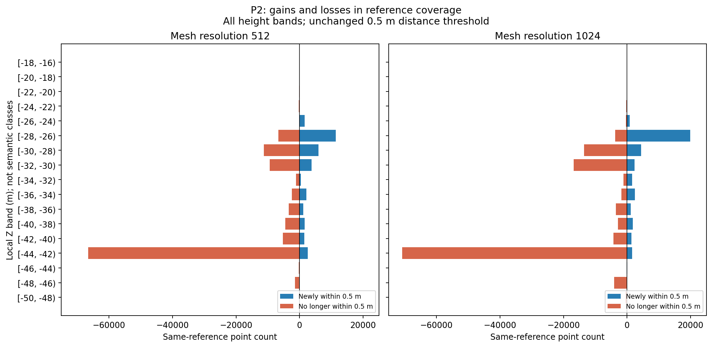
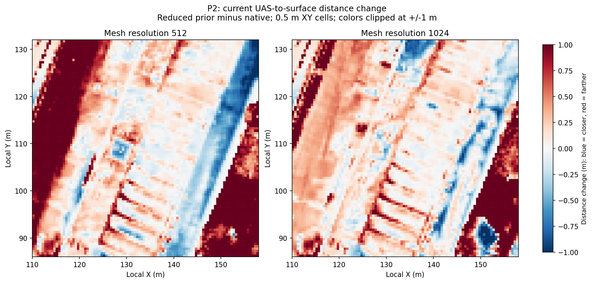

# P2 prior 가중치 완화의 기하 효과 재분석

2026-09-09 · `scientific_verdict: null` · 기술적 검증: **Share with caveats**

## 1. 정정하는 결론

사용자는 첨부의 `.005→.0005` 변경이 외관뿐 아니라 건물 기하도 더 좋아졌다고 지적했다. **첨부 및 기존 전체 표본 단면에서 그 개선을 확인했고, 같은 해상도의 정량 지표도 일부 개선을 뒷받침한다.** 이전의 ‘영상 개선·기하 악화’라는 포괄적 설명은 적절하지 않다.

정정된 설명은 다음과 같다.

> prior 깊이 가중치를 낮추면 높은 추가 윤곽과 내부 파편이 줄고 일부 현재 상단 면의 위치·형상이 개선된다. 동시에 주변 낮은 표면과 일부 반복 지붕 구간의 참조 근접·피복이 나빠진다. 전체 prism F1은 이 서로 다른 공간과 거리 기준의 변화를 합산하므로, 건물의 정성적 형상 개선을 부정하는 근거로 단독 사용하면 안 된다.

이는 ‘F1 계산이 틀렸다’ 또는 ‘건물 전체가 모든 정밀도에서 개선됐다’는 결론도 아니다. 앞선 연구 공백 논의에서 P2를 **영상만 좋아지고 기하는 나빠지는 사례**로 사용한 해석은 철회한다. 전체 기하 복원에 대한 최종 판정은 아직 내리지 않는다.

## 2. 비교·자료·검사 범위

| 항목 | 이번 확인 |
|---|---|
| 사용자 첨부 | prior/MVS/anchor/native/reduced/current-UAS 6패널. native=`D005_Pnative.mesh_512.raw`, reduced=`D0005_Pnative.mesh_512.raw` |
| 해상도 | 첨부의 **512 raw**를 먼저 비교. 이전 답변에서 인용한 **1024 raw**도 별도 쌍으로 분석. 두 결과를 교차 비교하지 않음 |
| 학습 상태 | 동일 지역 anchor8000 이후 final30000. ALS 파생 prior 적용의 기존 개발 실행이며 공식 LoD2 논문 조건과 구별 |
| 영역 | local X=[110,158), Y=[86,132), Z=[−49.386,−17.679)m. P2는 건물 ID로 분리한 표면이 아니라 건물·지면·주변 물체를 포함한 prism |
| 참조 | 관측 UAS 2,325,976점; 기본 0.1m voxel 후 572,214점. 원 좌표·원 인덱스 유지. 기하/지붕/지면 class 필터 없음 |
| 입력 배열 | 기존 `evaluation/geometry/P2/<candidate>/sample*.npz` 20개와 JSON 20개를 읽음. 원 데이터와 스크립트 SHA는 [영수증](analysis/receipt.json) |
| 동일성 | 각 쌍의 참조 좌표와 `reference_original_indices` 완전 일치 확인. 조건마다 다른 예측 면적 표본을 행 인덱스로 대응시키지 않음 |
| 거리 기준 | 기존 .1/.2/.25/.5/1/2m 유지. 기존 표면/참조 표본화 5설정 모두 유지. 새로운 최적 문턱을 선택하지 않음 |
| 추가 처리 | 기존 거리의 재집계·층화·그림 생성만. 학습·장면 렌더·메쉬 추출·정합·거리 재계산 0회 |

첨부 표시의 색상은 local Z이며, 0.1m 표시 voxel 및 200,000점 cap을 사용한다. 평가와 아래 원 단면은 전체 평가 표본을 사용한다. 표시 표본 제한이 기하 개선 관찰을 설명한다는 근거는 없다. 단면 역시 폭 0.5m의 표본 띠를 투영한 것이며 정확한 삼각형–평면 교선은 아니다.

## 3. 첨부와 같은 512의 수치

| 전체 P2, 512 raw | 원설정 .005 | 깊이 완화 .0005 | 확인되는 변화 |
|---|---:|---:|---|
| 예측 표면→관측 UAS 평균 거리 m ↓ | .6511 | .5834 | 개선 |
| Precision@.5m ↑ | .5490 | .5809 | 개선 |
| 관측 UAS→삼각면 평균 거리 m ↓ | .7372 | 1.1211 | 악화 |
| Recall@.5m ↑ | .5209 | .3804 | 악화 |
| F1@.5m ↑ | .5346 | .4598 | 감소 |
| 평가 mesh 면적 m² | 5,437.8 | 3,871.3 | 감소 자체는 성공/손상 판정 아님 |
| 관측 UAS에서 .5m 이상 먼 표본의 면적 추정 m² | 2,452.7 | 1,622.4 | 감소. 참조 미피복면까지 거짓 표면으로 해석 불가 |
| 관측 UAS에서 .5m 미만인 표본의 면적 추정 m² | 2,985.1 | 2,248.9 | 가까운 면의 양도 감소; 위치별 확인 필요 |

512에서는 F1만 낮아졌다는 이유로 ‘기하적으로 나빠졌다’고 요약할 수 없다. 남은 예측 표면이 참조에 가까운 비율은 올라가지만, 참조에서 가까운 예측 표면을 찾는 비율은 낮아진다. Precision과 recall이 서로 다른 집합에 대해 계산되기 때문이다. 면적 차이를 동일한 면의 제거량으로 해석하지도 않는다.

1024에서는 예측→UAS 평균 .6830→.6309m, P@.5 .6048→.5862, R@.5 .6237→.4733, F1@.5 .6141→.5238이다. 같은 전체 평균 방향이라도 512의 precision 개선과는 다르다. [두 해상도·모든 문턱·5설정](analysis/global_recomputed.csv)에 보존했다.

**계산 검사:** 저장된 거리로 계산한 P/R/F1 120행은 기존 JSON과 1e−12 허용오차 안에서 모두 일치했다. 문제는 확인된 산술 오류가 아니라 지표의 평가 대상과 포괄적인 해석이다.

## 4. 실제 형상의 개선과 잔여

아래는 사용자 첨부와 기존 단면의 직접 관찰이다. 좌표·높이는 그림에서 읽은 근삿값이며 자동 의미 판정이 아니다.

| 부분 | 직접 확인한 내용 | 해석 경계 |
|---|---|---|
| 높은 추가 윤곽 | X=134 단면 Y≈125–129m의 원설정 Z≈−25m 고리형 윤곽이 사라지고 현재 UAS의 Z≈−27.5m에 가까운 면이 남음 | 512·1024 공통. prior의 큰 높은 구조를 줄이는 효과 일부는 원설정도 이미 달성 |
| 상단 면 | Y=109 단면 X≈127–131m의 둥근 융기가 낮아지고 평탄해져 현재 UAS 상단에 더 가까움 | 전체 건물의 모든 위치·방향·세부 정확도를 보증하지 않음 |
| 내부 분산 표본 | 현재 상단 아래의 파편·보조 윤곽이 크게 줄어듦 | 개별 표본을 모두 실제로 없는 구조라고 라벨링한 것은 아님 |
| 반복 지붕 | 일부 골은 여전히 얕게 이어지고 일부 봉우리 높이 차이가 남음 | 형태가 정돈되는 것과 세부 높이까지 정확해지는 것은 별도 |
| 지면·주변 | 512의 Y=109, X≈110–118m 지면이 현재 UAS보다 약 1.5m 위로 들뜸. 오른쪽 X≈154–158m도 참조 높이에 닿지 않는 구간이 커짐 | 1024에서는 왼쪽 단면에 참조 높이 가까운 면이 다시 나타남. 512의 이 단면 차이를 그대로 1024 원인으로 옮기지 않음 |

기존 그림: [원설정 512 단면](../../../../../JointBuildGS-artifacts/phase-payloads/phd/geogs_p1p2p3_v1/PHD-GEOGS-P1P2P3-v1/evaluation/viewer/P2/D005_Pnative.mesh_512.raw.sections.png), [완화 512 단면](../../../../../JointBuildGS-artifacts/phase-payloads/phd/geogs_p1p2p3_v1/PHD-GEOGS-P1P2P3-v1/evaluation/viewer/P2/D0005_Pnative.mesh_512.raw.sections.png), [완화 1024 단면](../../../../../JointBuildGS-artifacts/phase-payloads/phd/geogs_p1p2p3_v1/PHD-GEOGS-P1P2P3-v1/evaluation/viewer/P2/D0005_Pnative.final.raw.sections.png).

## 5. 전체 recall 감소는 어느 부분에서 나오는가

기존 동일 UAS 점의 상태를 `.5m 미만/이상`으로 대응시켰다. 전체 영역을 2m 높이층으로 나누었으며 모든 층을 [CSV](analysis/paired_reference_height.csv)에 남겼다. 높이층은 지면·지붕의 정답 의미 라벨이 아니다. 거리는 원래 전체 prism의 삼각망에 대한 거리이며 각 층 안의 면만 대상으로 다시 질의하지 않았다.

| .5m 기준 | 512 | 1024 |
|---|---:|---:|
| 새로 가까워진 참조 점 | 32,326 | 37,673 |
| 더 이상 가까운 면이 없는 참조 점 | 112,731 | 123,734 |
| 순감소 점 수 | 80,405 | 86,061 |
| Z=[−44,−42)m 층의 순감소 | 63,977 | 69,268 |
| 위 층 / 전체 **순 recall 감소** | **79.57%** | **80.49%** |

이 층은 지면 높이대와 겹치지만 지면만 분리한 결과가 아니다. **F1 감소의 80%**, 전체 거짓 면적의 80%, 또는 전체 손실점의 80%라고 쓰면 틀린다. 512에서 이 층은 전체 참조 점의 23.06%이며, 전체 손실점 112,731개 중 해당 층의 손실점 66,513개 비율은 59.00%다. 새로 가까워진 점도 빼서 순효과를 계산했기 때문에 두 비율이 다르다.

참조 voxel .05/.1/.2m에서 같은 층의 순감소 기여율은 512의 71.30–88.76%, 1024의 72.87–93.41%다. 방향은 유지되지만 구성 비율은 참조 표본화에 민감하다. 이는 신뢰구간이나 학습 반복 분산이 아니다. 표면 표본 간격만 바꾸면 reference→triangle 거리가 같으므로 recall은 동일하다.

일부 상단 높이층에서는 실제로 양방향 개선이 함께 나타난다. 아래는 512 기본 설정·.5m 기준이며 나머지 모든 층과 문턱은 [전체 높이층 표](analysis/height_strata.csv)를 따른다.

| local Z층 m | 조건부 P .005→.0005 | 조건부 R .005→.0005 | 해석 |
|---|---:|---:|---|
| [−44,−42) | .6334→.3567 | .6025→.1177 | 낮은 표면 높이층 악화 |
| [−32,−30) | .6044→.9087 | .3325→.2790 | 남은 예측의 근접 비율 개선과 참조 피복 감소 공존 |
| [−30,−28) | .4753→.5827 | .5887→.5304 | 같은 방향의 혼합 결과 |
| [−28,−26) | .5364→.6477 | .5530→.5959 | P/R와 양방향 평균 거리 모두 개선 |
| [−26,−24) | .2289→.9544 | .2979→.4787 | P/R 개선, 입력·표본 구성 변화 함께 확인 필요 |

조건부 P는 해당 높이의 예측 표본, 조건부 R은 해당 높이의 UAS 점이 분모다. 별도의 건물 점수로 합산하지 않는다. 특히 [−28,−26)m 층도 .1/.2/.25m 기준의 R은 낮아진다. .5m에서의 개선을 높은 정밀도까지 모두 좋아졌다는 주장으로 확대하지 않는다. 문턱별 차이만으로 세부 손실의 원인을 확정하지 않는다.

파란 셀은 같은 관측 UAS 점에서 예측 삼각면까지의 평균 거리가 줄어든 곳이고 빨간 셀은 늘어난 곳이다. 0.5m XY 셀은 여러 높이를 포함할 수 있다. 표시 범위 ±1m 밖은 색상만 포화되며 원 값은 [전체 셀 표](analysis/xy_cells.csv)에 유지한다.

## 6. 지표가 실제로 측정하는 것과 측정하지 않는 것

1. Precision은 면적 균일 표면 표본→관측 UAS 점의 NN 거리다. 예측 면적을 따라 가중되며, 빈 관측 영역의 타당한 면도 멀게 평가될 수 있다. 현재 참조의 국소 완전성이 인증된 것은 아니다.
2. Recall은 voxel로 선정한 관측 UAS 점→실제 삼각면의 거리다. 건물·지붕·지면에 같은 비중을 주지 않으며 수목처럼 보이는 주변 객체도 자동 제외되지 않는다.
3. F1은 두 비율의 조화평균이다. 의미 있는 건물 형상, 내부 허위 면, 반복 지붕의 높이·곡률·연결성, 실제 시점 변화에 각각 독립 점수를 부여하는 지표가 아니다.
4. 제거된 먼 면의 면적 감소와 가까운 면의 면적 감소가 함께 있다. 가까운 점이 있었다는 사실만으로 그 이전 면의 전체 형상·위상이 타당했다고 판정할 수도 없다.
5. 단면에서 본 개선을 지면 포함 prism 집계로 부정하거나, 반대로 정돈된 한 시점 외형으로 전체 표면 정확도·완전성을 확정하면 안 된다.

코드 근거: [거리·샘플링](../../../../scripts/phd/geogs_p1p2p3_v1/evaluation/geometry.py), [표시·단면·평가](../../../../scripts/phd/geogs_p1p2p3_v1/evaluation/run_evaluation.py), [참조 crop 경로](../../../../scripts/phd/wu_vallet_regions_v4/evaluate_regions.py). 기존 [P2 보고](../geogs_p1p2p3_v1/P2_REVIEW_ko_v1.md)의 수치를 보존하면서 해석을 더 구체화했다. 기존 `summarize.py`의 셀 관계 표는 `final.raw`를 사용하므로 512 설명에 재사용하지 않았다.

## 7. 연구 기여 논의와 다음 세션 인계

**현재 인정할 성과:** prior에서 시작해 현재 영상으로 정제하는 사용자 의도는 이 P2 사례에서 일부 기하 개선으로 실제 이어졌다. 낮은 prior 가중치가 단순히 외관만 개선했다는 전제에서 출발하지 않는다. 원설정도 prior의 큰 기하 불일치를 이미 상당 부분 줄였다.

**아직 모르는 것:** 지면·반복 지붕 차이의 원인이 감독/자유도, DA3 실현 궤적, camera/정합, ALS 표면화 또는 TSDF 추출 중 무엇인지는 이번 재집계로 분리되지 않는다. 구조 보호를 해제하면 해결된다는 결론도 없다. 같은 조건 반복 변동이 없고 독립 확인 장면도 아니다.

다음에는 기존 입력·결과를 사용하여 건물과 주변의 평가 대상을 분리하고, 현재 상단 면·반복 지붕·내부 부가면에 대해 필요한 형상 기준을 정한다. 비교 결과를 보고 유리한 경계를 고르는 것을 피하려면 건물 ID/공유 footprint 또는 문서화한 고정 참조 영역을 모든 조건에 동일하게 적용하고 원 prism 결과도 유지한다. 이는 평가를 위한 구분이며 알고리즘에 영역별 소스 선택기를 넣겠다는 뜻이 아니다.

그 뒤에야 GeoGS가 잘한 부분과 남은 복원 요구를 구분하여 방법 기여를 검토한다. 단순 가중 조정으로 상당 부분 해결된 성공도 선행 해결 범위에 포함한다. P2의 전체 F1 감소 자체를 새로운 알고리즘이 필요한 증거로 쓰지 않는다.

## 8. 용어 주석에 대한 답변

사용자의 의도를 학술적으로 표현하려면 **‘검출·융합 기반 재구성’과 ‘미분 가능 렌더링 기반 재구성’**이 적절하다. 후자의 구체적 설계는 **‘기존 기하로 유도하는 역렌더링 기반 정제’**라고 쓸 수 있다. 합성한 관측과 실제 영상을 비교하여 기하·외관을 추정한다는 의미다.

‘학습 기반’은 학습된 검출기를 사용하는 전자도 포함하고, 사전학습과 장면별 파라미터 최적화를 구별하지 못한다. NeRF·GS 계열이라는 분야 명칭과 실제 처리 원리를 구분하면 된다. [3DGS 공식 설명](https://repo-sam.inria.fr/fungraph/3d-gaussian-splatting/)은 장면 Gaussian의 최적화·밀도 제어를, [GS4Buildings §3](https://arxiv.org/html/2508.07355v1#S3)은 prior 초기화와 영상·기하 감독을 확인할 근거다. 위 대조는 이 연구의 설명용 구분이며 서로 배타적인 분야 전체 분류가 아니다.

## 9. 기술 검증과 한계

- **PASS:** 기존 P/R/F1 120행 재현, 각 비교의 원 참조 ID·좌표 일치, 60쌍 높이층 합계/recall 구성 항등식, 4개 기본 mesh의 거리별 면적 합계, 입력 SHA 작업 전후 동일.
- **확인:** 최종 두 그림의 축·척도·색상 방향과 라벨을 직접 열어 검토. 512/1024 막대 비교에 같은 수평축 사용. 분석 최초 그림의 긴 색상바 라벨은 별도 `figures/` 출력에서 수정했고 최초 결과는 보존.
- **미확인:** 건물 의미 영역별 최종 점수, 국소 참조 완전성, 절대 datum 검증, 정확한 오류 발생 단계, 독립 반복·일반화. 분석 결론을 이 범위 밖으로 확대하지 않는다.
- **보존:** 기존 PhD 문서 244개의 SHA와 추적 파일의 기존 작업 diff가 모두 동일함을 확인했다. 기존 코드·모델·서비스 변경이나 학습·장면 렌더 실행을 하지 않았다.
