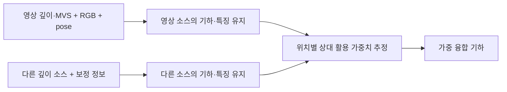

# 양쪽 소스의 오류를 고려하는 판단 방법 — 적용 후보 검토

2026-09-08 · 문헌·공식 구현 읽기 · 설계 후보

`scientific_verdict: null`

## 범위와 추천 지위

현재 영상 소스의 불완전함을 기구축 3D prior로 보완하되, 두 소스 모두 오차를
포함하므로 영역별로 어떤 소스를 사용할지 판단한다. 기존 MVS뿐 아니라 원영상,
pose, 내부표정도 사용할 수 있다. 독립 전처리와 복원 중 판단 모두 검토 범위다.

[범위 정정](SCOPE_CORRECTION_ko_v2.md)을 따른 추가 검토다.
[이전 문헌 검토](LITERATURE_RECOMMENDATION_ko_v2.md)는 보존한다.
기존 연구 계약·E1–E6·C1–C5 lineage·Wu–Vallet·GeoGS·SRDM 기록은 변경하지 않는다.

**추천 후보는 SenFuNet이다.** 기존 MVS를 활용하면서 소스별 기하를 유지하고
지역별 활용도를 판단한다는 적합성과 공식 코드·학습 모델 접근성을 함께 고려했다.
LSMD-Net은 명시적 선택, UncLe-SLAM은 복원 중 불확실성 갱신을 비교할 후보다.
이 추천은 방법 채택 결정이나 실행 승인이 아니다. 새 실험·학습은 수행하지 않았다.

## 핵심 비교

| 연구 | 판단에 쓰는 정보 | 실제 판단 결과 | 우리에게 필요한 변경 |
|---|---|---|---|
| **SenFuNet / Learning Online Multi-Sensor Depth Fusion, ECCV 2022** | 소스별 depth·RGB 특징, pose로 누적한 3D 특징·관측횟수 | 위치별 상대 활용 가중치와 융합 기하 | ALS의 유효 깊이·기하 표현, 항공 규모·오류 분포 검증 |
| **LSMD-Net, ACCV 2022** | 좌우 영상의 정합 특징, 영상+희소 LiDAR에서 추정한 깊이 특징 | 두 가지가 예측한 깊이 중 픽셀별 하나 선택 | 기존 MVS와 다중뷰 연결; 항공 ALS 입력 및 학습 도메인 변경 |
| **UncLe-SLAM, ICCVW 2023** | 여러 깊이 소스·RGB와 공통 복원 기하의 잔차, 관측 특징 | 소스별 불확실성에 따른 연속 활용 강도 | 고정 pose mapping, ALS 유효영역·정합 처리, 초기 기하에 의한 자기확인 검증 |

각 행은 각각의 원문·공식 구현에 근거한다. 아래에서 원형과 우리 적용 가설을 구분한다.

## 1. SenFuNet — 첫 적용 후보

원형은 소스별 TSDF(표면까지의 부호 있는 거리 격자)·관측횟수·특징을 따로 유지한다.
학습된 공간별 가중치로 두 기하를 결합한다. 연속 혼합부터 한쪽 우세까지 표현한다.
원문에는 ToF+COLMAP MVS 검증이 있다.
[원문 §3–4](https://arxiv.org/html/2204.03353v2)



공식 구현에는 ToF+MVS 설정과 학습 모델이 공개돼 있다. RGB는 영상 깊이 가지의
특징 입력이며, pose는 3D 통합에 사용된다. 다중뷰 RGB 워핑으로 모든 후보의
광도 적합도를 직접 검정하는 절차라고 확대하지 않는다.
[공식 저장소](https://github.com/eriksandstroem/SenFuNet),
[공개 모델](https://github.com/eriksandstroem/SenFuNet/tree/43c1682e29c700df4577d9dcf0ac3b8ebdd8f496/models/fusion),
[ToF+MVS 설정](https://github.com/eriksandstroem/SenFuNet/blob/43c1682e29c700df4577d9dcf0ac3b8ebdd8f496/configs/fusion/corbs.yaml)

학습 감독은 GT TSDF다. 두 소스가 모두 존재하는 위치에서 상대 가중치만으로
동시 거부를 표현하지는 않는다. 한 소스만 존재하는 위치에는 학습된 outlier 제거가 있다.
온라인 갱신은 새 depth 프레임을 누적하는 과정이다. 동일 관측으로 GS를 반복할 때의
재판단 효과나 과거 건물 변화의 처리를 검증한 원문은 아니다.
[원문 §3](https://arxiv.org/html/2204.03353v2),
[가중치·융합 코드](https://github.com/eriksandstroem/SenFuNet/blob/43c1682e29c700df4577d9dcf0ac3b8ebdd8f496/modules/filtering_net.py)

**적용 가설:** 영상 기하가 불확실한 곳에서는 ALS를, ALS가 부적합한 곳에서는
영상 기하를 더 활용하는지 판단 출력과 기하 결과를 함께 확인할 수 있다.
실내 ToF 모델을 항공 ALS에 적용한 실패는 입력 변환·도메인 차이와 판단 원리의
한계를 구분해 해석해야 한다. 공개 모델이 있다는 사실은 ALS 적용 성공의 근거가 아니다.

## 2. LSMD-Net — 명시적 선택의 비교 후보

원형의 두 가지는 스테레오 깊이 추정과 RGB를 이용한 LiDAR 깊이 보완이다.
각 예측의 불확실성과 상대 신뢰도를 학습하고, 추론 시 더 신뢰하는 가지의 깊이를
선택한다. 두 표면의 단순 평균이 부적합할 수 있다는 논거가 직접적이다.
[원문 §3.1–3.3](https://openaccess.thecvf.com/content/ACCV2022/papers/Yin_LSMD-Net_LiDAR-Stereo_Fusion_with_Mixture_Density_Network_for_Depth_Sensing_ACCV_2022_paper.pdf)

```text
좌우 RGB → 스테레오 깊이·특징 ───────────┐
RGB + 희소 LiDAR → 보완한 깊이·특징 ───┤
                                      ↓
                         상대 신뢰도 → 한 가지의 깊이 선택
```

공식 코드의 실제 반환값도 한쪽 선택이다. 코드의 `monocular` 명칭은 여기서
RGB만으로 얻은 단안 깊이가 아니라 희소 LiDAR를 입력받는 보완 가지다.
학습은 GT 시차 감독을 사용한다. 공식 README·저장소 탐색 범위에서 공개 학습
가중치는 확인하지 못했다.
[선택 구현](https://github.com/yinhanxi/LSMD-Net/blob/55ce4ae3cb40c5017b517ac4c9750c30893bd3ce/LSMD-Net-github/deepstereo/model_zoo/lsfnet/lsfnet.py#L680),
[학습 구현](https://github.com/yinhanxi/LSMD-Net/blob/55ce4ae3cb40c5017b517ac4c9750c30893bd3ce/LSMD-Net-github/samples/model_lsfnet.py#L82),
[공식 저장소](https://github.com/yinhanxi/LSMD-Net)

**적용상 차이:** 기존 ALS와 기존 MVS를 그대로 비교하는 분류기는 아니다.
두 가지가 새로 추정한 깊이 사이의 선택이다. 기존 MVS를 넣고 전체 다중뷰를
활용하도록 바꾸면 원형 대비 변경이 생긴다. 명시적 선택이 장점이지만,
이 입력 차이와 학습 준비 때문에 현재 첫 적용 우선순위는 SenFuNet보다 낮다.

## 3. UncLe-SLAM — 복원 중 재판단의 비교 후보

여러 오류 있는 깊이 소스와 RGB를 받아 공통 기하와 소스별 불확실성을 함께
최적화한다. 각 깊이 소스의 영향은 증가·감소할 수 있다. 온라인 불확실성 학습에
GT 깊이·3D는 필요하지 않지만, 기하 기반에는 NICE-SLAM의 pretrained decoder를 쓴다.
[원문](https://arxiv.org/pdf/2306.11048)

```text
소스별 depth + RGB + 카메라
  → 공통 기하에서 렌더링
  → 소스별 불확실성에 따라 관측 활용
  → 기하·불확실성 갱신 → 반복
```

공식 구현은 센서마다 별도 깊이 손실과 불확실성 decoder를 둔다.
여러 측정 표면 주변을 샘플링한다. middle에서는 불확실성 없는 깊이 L1을 사용하고
fine부터 불확실성을 학습하는 구현도 확인했다.
[mapper](https://github.com/kev-in-ta/UncLe-SLAM/blob/0631293f1f8ae3cc1bc5e484865722d1f35a2a7e/src/mapper.py#L592),
[renderer](https://github.com/kev-in-ta/UncLe-SLAM/blob/0631293f1f8ae3cc1bc5e484865722d1f35a2a7e/src/utils/renderer.py#L139),
[2센서 RGB 설정](https://github.com/kev-in-ta/UncLe-SLAM/blob/0631293f1f8ae3cc1bc5e484865722d1f35a2a7e/configs/Replica_SenFuNet/replica.yaml)

**적용상 추론:** 공통 기하와의 잔차로 불확실성을 학습하므로 초기 잘못된 기하에
맞지 않는 올바른 소스를 낮게 평가하는 자기확인이 가능하다. 양방향 가중치 갱신과
양방향 오판 수정 성공은 다르다. 우리 핵심 재판단 문제를 조사하기 좋은 비교 후보이며,
원형이 그 문제를 해결했다고 주장하지 않는다.

## 더 단순한 비교 및 다른 문헌의 위치

**Marin et al., Reliable Fusion of ToF and Stereo Depth Driven by Confidence
Measures (2016)**는 비학습 confidence 비교 기준이다. 스테레오의 local/global
정합 비용으로 매끈한 오답의 과신을 낮추고, ToF의 별도 confidence와 함께
Local Consistency 융합을 수행한다. ALS에 그대로 쓸 수 있는 ToF amplitude/intensity
오차 모델은 아니므로, ALS confidence를 정의하는 추가 설계가 필요하다.
[저자 원문](https://giuliomarin.github.io/publications/conferences/marin16fusionconfidence.pdf)

Agresti 2017/2019는 두 depth, ToF amplitude, 영상 warp 차이로 두 confidence를
학습하는 관련 대안이다. 공식 자료 페이지에서는 데이터와 예측 confidence를 확인했지만
실행 코드·weights는 확인하지 못했다.
[2017 원문](https://openaccess.thecvf.com/content_ICCV_2017_workshops/papers/w13/Agresti_Deep_Learning_for_ICCV_2017_paper.pdf),
[2019 원문·자료](https://lttm.dei.unipd.it/paper_data/realfusion/)

GeoGS·Semantic MVS·AGS-Mesh·SpotLessSplats·SRDM은 기존에 검토한 복원과 판단의
구성 원리로 보존한다. 이번 후보들은 그 목록에서 부족했던 **두 오류 있는 기하 소스의
상대 활용 판단**을 더 직접적으로 검토하기 위한 것이다. GeoGS 기반 복원기를
TSDF나 SLAM으로 대체하기로 결정한 것은 아니다.

## 첫 적용안을 구체화할 때 남는 항목

1. **입력 연결:** 현재 MVS의 원래 depth와 RGB·pose lineage를 우선 확인한다.
   fused MVS만 있다면 재투영과 원 depth를 구분한다. ALS의 희소성·가시성·정합
   불확실성을 보존할 표현을 정한다. 같은 ALS를 여러 카메라에 투영한 것을
   독립된 ALS 측정 여러 개로 세지 않는다.
2. **한 편의 원형 유지:** 첫 후보의 소스별 기하·특징·가중치·출력 관계를 유지해
   적용 가능성을 확인한다. SenFuNet 가중치만 GS로 이식하는 것은 후속 변경이며
   원문 구현 적용과 구분한다. 세 논문을 섞은 새 판단기를 먼저 만들지 않는다.
3. **판단과 결과 분리:** P1/P2 영상 활용·P3 ALS 활용이라는 사용자 진단 기대를
   출력과 비교하되 알고리즘 입력 정답으로 주지 않는다. 가중치 변화, 선택된/융합된
   기하의 오류, 유효 구조 보존을 따로 보고 연결한다. 영상 불확실성만으로 ALS를
   정답 처리하지 않는다.
4. **GT와 미결정:** 공개 pretrained 적용과 별도 학습을 구분한다. 평가 전용 UAS·LoD2를
   판단 입력·학습·파라미터 선정에 전용하지 않는다. 두 소스 모두 부적합한 경우의
   유보, 정합 보정과 소스 변경의 구분, 동일 관측 복원 중 재판단의 추가 효과는 미결정이다.

실행 명령·임의 문턱값·학습 계획은 이번 문헌 추천에서 확정하지 않았다.
