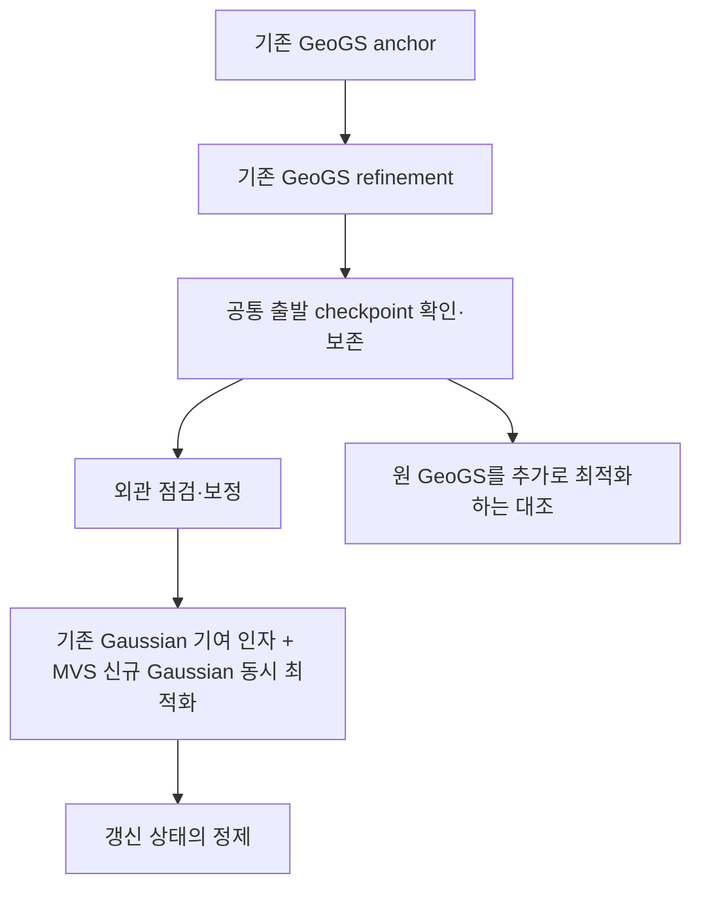

# GeoGS + GaussianUpdate 갱신 원리 — 단계별 검토 실험계획

2026-09-08 · `PHD-GEOGS-GUPDATE-PLAN-v1`
상태: 설계 후보 / 실행하지 않음 / `scientific_verdict: null`

## 목적과 범위

사용자는 GeoGS의 기존 흐름을 어떻게 확장하는지 명확히 하고, 구현 후 각 단계의
실제 정량·정성 결과를 보고 다음 단계로 진행하기를 요청했다. 이 문서는 그 계획이다.
학습·재구성·테스트·신규 렌더를 실행하지 않았다. 현행 연구 계약, 기존 GeoGS 별도
실험과 Wu–Vallet/SRDM 결과, 실행 코드·서비스·payload는 변경하지 않는다.

검증 질문은 **현재 관측을 이용한 기존 Gaussian의 기여 조절과 MVS 기하 추가가,
유효 구조를 유지하면서 현재 기하·세부·외관을 개선하는가**다. P1/P2의 충돌 구조
수정과 P3의 유효 ALS 지붕 유지가 핵심 사례이며, 지역 전체를 한 소스 정답으로
분류하거나 그 기대를 감독 라벨로 입력하지 않는다.

## 기존 흐름과 추가 위치

앞선 설명은 GeoGS refinement를 외관 보정으로 대체하는 것처럼 보일 수 있었다.
**첫 검증 후보에서는 기존 `anchor → refinement`를 그대로 완료한 상태를 출발점으로
삼고, 그 뒤 한 번의 갱신 블록을 추가한다.** 삽입 시점 변경과 반복 재판단은 후속이다.

같은 장면을 이어가며 기존 상태는 별도 보존한다. 전체 장면 재초기화나 매번 anchor로
회귀하는 것을 필수로 두지 않는다. 새 블록의 효과를 확인한 후에만 refinement 도중
삽입이나 여러 번 재판단을 검토한다.

## 현재 확인한 선행 실험과 재사용 조건

- 현재 [GeoGS README](../geogs_p1p2p3_v1/README.md)와
  [통합 분석 초안](../geogs_p1p2p3_v1/RESULTS_AND_CONTRIBUTION_ko_v1.md)은 주18개
  학습·렌더·필수 표면 완료·봉인, P1/P2 분석과 P3/최종 표시 검토의 진행 상태를
  구분한다. 과거 문서의 실행 0회 상태를 현재로 읽지 않는다. 이번 확인은 문서이며
  새 task에서 실제 소비할 checkpoint의 복원 검증까지 끝났다는 뜻은 아니다.
- 출발점 후보는 각 지역 원설정 `D005_Pnative`의 refinement 완료 상태다. 참조
  점수로 유리한 여섯 조건 중 하나를 고르지 않는다. anchor/final 기존 그림도
  함께 보여주되, 새 갱신 분기는 같은 final 상태에서 시작한다.
- final의 모델뿐 아니라 optimizer, 보호 mask/hook, DA3 controller, RNG, 카메라
  순서·잔여 stack 및 학습 스케줄의 복원 가능성을 확인한다. PLY만으로 복원하고
  완전한 동일 상태라고 부르지 않는다. 완전 상태가 없으면 공통 파라미터에서
  optimizer를 동일하게 새로 만드는 별도 설계를 명시하고 비교 전 고정한다.
- 기존 입력은 ALS 파생 초기화·깊이, RGB·pose·DA3였다. 보유 MVS는 그 학습의
  입력이 아니었다. 후속에서 MVS를 넣으면 입력 추가 효과도 생기므로 추가만
  사용하는 대조가 필요하다.
- 입력·CRS·상대 좌표·MVS 행 대응·영상 생산 계보는 기존 seal을 읽고 결박한다.
  MVS 좌표·색·가능한 법선/깊이의 실제 가용성을 확인하며, 없는 confidence를
  있다고 가정하거나 이번에 다른 영상 일부로 MVS를 다시 만들지 않는다.

## 원문과 이식안의 구분

[GaussianUpdate §3.2–4.1](https://arxiv.org/html/2508.08867v1#S3.SS2)은 외관 모델
갱신, 기존 제거 인자와 신규 SfM Gaussian의 동시 최적화, 공동 정제를 사용한다.
다음 변경을 실행 전 표로 고정한다.

| 항목 | 원문 | 이번 후보 |
|---|---|---|
| 기존 표현 | 3D GS | GeoGS 평면 Gaussian과 ALS 입력 이력 |
| 새 기하 초기값 | 현재 COLMAP/SfM | 보유 MVS; SfM과 바꿨음을 명시 |
| 관측 | 시간별 새 RGB·pose | 고정된 현재 RGB·pose 재사용 |
| 감독·보호 | 원문 RGB 중심 갱신 | GeoGS 깊이·법선·보호와 연결 규칙 필요 |
| 시간별 외관/Replay | 4D hash·과거 재생 | 현재 한 시점의 갱신에 필요한 범위 검토 |

외관 보정을 원형으로 구현할지 GeoGS의 정제된 외관으로 단순화할지는 외관 단계의
확인 사항이다. SAM/외관 블록을 생략하거나 SH만 조정하면 명시적인 축소 이식안으로
기록한다. 완전한 원문 재현이라고 부르지 않는다. 이번에 다른 판단 연구나 photo/
depth/normal 다중 문턱 규칙을 함께 추가하지 않는다.

## 단계별 작업·관찰·검토 시점

각 단계의 단위는 `(지역, 조건, 단계)`다. 한 단위가 끝나면 그림과 표를 즉시 보여준다.
전체 지역·조건·최종 viewer 완성을 기다려 첫 결과를 보여주는 진행은 하지 않는다.
사용자가 중간 결과를 검토할 수 있도록 주요 단계 끝에서 후속 최적화의 자동 연쇄
실행을 멈춘다. 실패한 상태도 결과로 남긴다.

| 단계 | 수행할 작업 | 사용자가 볼 실제 결과 | 여기서 가를 질문 |
|---|---|---|---|
| 0. 출발점 | 봉인 입력·원설정 final과 MVS의 대응 확인 | 원영상, ALS/MVS 단면, 기존 GS RGB·깊이·법선, 기존 누락 위치 | 어떤 불일치가 실제로 남았고 MVS 대안이 있는가? |
| 1. 연결 동작 | 갱신 off 복원 비교, MVS→surfel 초기화 및 source ID 연결 검사 | off 상태 렌더 차이, 후보 위치·방향·크기, 가려짐/피복 지도 | 구현·좌표가 맞는가? 아직 성능 판단 아님 |
| 2. 외관 | 외관 단계만 별도 수행 | 유지 영역 mask, 전후 RGB/잔차, 깊이·silhouette 변화 | 색·외관 조정으로 사라진 오차와 남은 기하 불일치는 무엇인가? |
| 3. 구조 갱신 | 기존 기여 인자와 새 Gaussian을 동시 최적화 | 시작/중간/끝의 기여 지도·단면·RGB; 군집/비활성화 직전·직후 | 기존 표면 억제와 실제 대체 표면 형성이 연결되는가? |
| 4. 후속 정제 | 갱신 상태에서 정제, 동일 조건의 대조와 비교 | 단계3/4의 동일 뷰·단면, 표면 정확도·누락·외관 표 | 수정이 유지되는가? 구멍·이중 표면·유효 구조 손실은 없는가? |
| 5. 반복 판단 | 한 번 갱신이 검토된 뒤에만 반복 여부 비교 | 판단 상태 변화와 실제 표면·외관 변화의 연결 | 재판단 자체가 추가 효과를 내며 초기 오배제도 회복하는가? |

단계1은 gate off·후보 미활성에서 기존 렌더가 보존되는지 먼저 확인한다. 후보를
활성화한 순간의 변화와 최적화가 만든 변화는 별도 저장한다. 합성 동작 검사는
버그 확인용이며 P1/P2/P3 결과를 대신하지 않는다.

최초 짧은 실제 동작 검토는 P1과 P3를 함께 포함한다. 한쪽 전환 사례만 성공시킨
뒤 보존 문제를 나중으로 미루지 않는다. 입력은 각 crop의 봉인된 뷰 전체를 유지한다.
P2도 본 비교에 포함하고, 지역별 확인이 끝나는 순서로 공개한다. 지역마다 임의의
조건 탐색을 확대하지 않으며 오류 수정은 버전과 변경 이유를 기록한다.

## 필요한 최소 비교

첫 작동 확인은 공통 출발 상태에서 `갱신 off / 기여 조절+추가 on`의 짧은 비교다.
작동 확인 후 같은 외관 처리·후속 정제 스케줄을 공유하는 아래 2×2를 수행한다.

| 조건 | 기존 제거 인자 | MVS 신규 Gaussian | 분리하려는 효과 |
|---|---|---|---|
| U00 | 비활성 | 없음 | 공통 이식 스케줄 자체의 영향 |
| U01 | 비활성 | 있음 | 대체 기하 공급만으로 충분한가? |
| U10 | 활성 | 없음 | 기존 기여 조절만으로 충분한가? |
| U11 | 활성 | 있음 | 기여 조절과 대체 기하가 함께 필요한가? |

U00은 **공통 이식 대조**이며 원 GeoGS 그대로와 같다고 가정하지 않는다. 원형의
갱신 구간은 기존 중심 등 일부 자유도를 고정하므로 off 단계에 최적화할 변수가
줄어들 수도 있다. 별도로 **원 GeoGS 추가 최적화**를 동일 출발점과 추가 예산으로
비교해, 더 오래 최적화해서 생긴 효과와 새 블록의 효과를 구분한다.

조건별로 기존/신규 Gaussian의 위치·회전·scale·SH·opacity·제거 인자의 갱신 허용,
densification/pruning, 학습률·스케줄을 표로 결박한다. MVS 후보 목록·초기값은 추가
조건에서 동일하게 사용한다. 게이트를 끄더라도 원 opacity 최적화가 가능한 경우
U01이 완전히 기존 기여를 고정한 조건은 아니므로 실제 opacity 변화도 기록한다.

기전 비교에서는 prior 깊이와 보호를 조건마다 임의로 바꾸지 않는다. native 보호가
갱신을 막거나 과거 깊이가 대체 표면을 끌어당기는 경우 그 기록을 먼저 보고, 별도
제약 대비를 추가한다. 그때도 같은 제약을 쓴 대조가 필요하다. 이전 제약 완화 실험을
이번 제거 인자의 효과로 재해석하지 않는다. DA3 적응은 같은 코드 여부와 실제 실현
가중치 경로를 모두 기록한다. 순수 분리가 필요하면 공통 고정 스케줄을 별도 후보로
두며 결과를 본 뒤 유리한 궤적을 복사하지 않는다.

최종 완료 지점 이후 재개 시 학습률·densification의 종료 조건도 명시적으로 정한다.
종료된 스케줄을 그대로 넘겨 새 점의 densify나 이동이 사실상 꺼진 채로 실험하고
방법 실패로 판단하지 않는다. 스케줄 재시작/연장은 대조에도 동일 원칙으로 적용한다.

## 매 단계의 최소 결과 묶음

1. **실제 비교 그림:** 원영상 / 갱신 전 / 현재 단계의 RGB와 같은 색 범위의 잔차.
   각 지역 고정 카메라를 사용하고 기존 첫·중간·마지막 사진을 우선 재사용한다.
   전체 평가 뷰의 수치와 반례도 남기며 좋은 시점만 선정하지 않는다.
2. **기하 그림:** 같은 카메라의 깊이·법선·alpha와 같은 위치·축의 지붕 단면.
   ALS, MVS, 갱신 전·후 실제 표면을 구분한다. Gaussian 중심만으로 표면 회복을
   판정하지 않고, 원형 깊이 렌더/공통 TSDF와 그 한계를 함께 기록한다.
3. **갱신 동작 그림:** 제거 인자, 실제 비활성화, 신규 Gaussian, 보호 대상의 지도.
   기존/신규 기여는 결합 렌더의 가림 순서를 유지한 기여도로 계측한다. source별
   단독 렌더는 설명용이며 그 합을 실제 결합 기여라고 계산하지 않는다.
4. **짧은 정량표:** RGB 지표, 기하 거리·정밀도와 피복/누락, 기존/추가 Gaussian
   개수·활성 기여·이동량, 시간·GPU 메모리를 갱신 전 대비로 함께 제시한다.
   제거 인자 변화는 적합도 정확도나 표면 전환 성공률과 구분한다.
5. **해석:** 예상과 맞은 부분, 어긋난 부분, 원인이 확인됐는지, 다음 단계가 가를
   질문을 짧게 적는다. 단계별 원 checkpoint·그림·JSON·명령/버전 영수증에 연결한다.

매 단계에 PNG를 직접 표시하고 같은 경로의 간단한 문서/HTML 인덱스로 연결한다.
새 서버나 최종 대형 viewer 구축을 결과 확인의 선행 조건으로 두지 않는다.
단계 내부 시작·중간·끝 및 실제 추가/비활성화 이벤트 전후를 저장한다. 전체 TSDF는
주요 단계 끝에서 공통 해상도로 비교하고 모든 iteration에 고비용 추출을 하지 않는다.

## 평가·공정성·실패 해석

- 기존 GS/DA3 학습·평가 명단을 유지한다. GS 학습에서 제외된 영상도 이전 MVS/
  pose 생성에 쓰였을 수 있으므로 완전히 독립된 파이프라인 holdout으로 부르지
  않는다. 입력 뷰를 임의로 소수의 스테레오 쌍으로 축소하지 않는다.
- 새 알고리즘은 UAS·LoD2 RoofSurface 등 평가 전용 참조로 gate/정합/후보/문턱을
  선택하지 않는다. 참조가 없는 공간은 오류와 미관측을 구분한다. 중간 결과를 보고
  방법을 수정한 반복은 개발 진단이며 새로운 확증 결과가 아니다.
- RGB의 평균 개선만으로 통과시키지 않는다. 기존 결과에서 실제 RGB 향상과
  기하·세부 손실이 공존했다. P1/P2의 수정 위치와 함께 주변 유효 구조, P3의 지붕
  유지와 부족한 측면 보완을 따로 본다. 점군 NN과 삼각면 지표를 직접 순위화하지
  않고, raw/post 및 mesh 해상도를 맞춘다.
- 조기 실패는 `연결/좌표 오류`, `기여 변화 없음`, `억제만 되어 누락 발생`, `실제
  대체되었지만 잘못된 표면`, `RGB만 개선`, `유효 prior 손실`처럼 동작으로 설명한다.
  한 실패를 곧바로 원문 방법의 일반적 실패로 확대하지 않는다.
- 2×2는 동일 최적화 스케줄/관측 순서로 기전을 비교하고 Gaussian 수·실제 시간을
  함께 보고한다. 파라미터 수가 다르므로 같은 iteration이 같은 계산량은 아니다.
  전체 실용 비교에서는 같은 시간 예산도 보조로 확인한다.
- 기존 동일 조건 보조 반복은 P1/P2 OOM, P3 미시도로 변동이 미측정이다. 새 핵심
  비교가 실행 가능해진 뒤 대표 대조/완전안을 반복해 작은 효과의 변동을 확인한다.
  반복 완료를 최초 그림 공개의 조건으로 삼지 않는다.

## 반복 재판단은 별도 후속 단계

한 번 갱신한 결과를 확인한 뒤 동일 출발점·첫 판단·후보 목록에서 판단을 고정한
경우와 다시 여는 경우를 비교한다. 새로운 후보는 양쪽에 같은 규칙으로 공급하고,
후속 GS 예산과 학습 뷰를 맞춘다. 원문의 제거 인자 내부 최적화 반복과 바깥 재판단
블록 반복을 구분한다. 같은 영상 재사용은 새로운 관측 생성이 아니다.

원 ALS/MVS와 비활성 Gaussian을 보존한다. 다시 활성화할 경로가 구현되어 있어야
초기 오배제 회복을 검사할 수 있다. 인위적으로 비활성화한 후보를 복원하는 동작
검사는 별도 기전 확인이며 실제 오판 수정 성공과 같지 않다. 영상→ALS 복귀 사례가
관찰되지 않으면 양방향 수정은 미검증으로 남긴다. 같은 한 번 판단으로 충분하면
더 단순한 방법을 유지한다.

## 실행 전 남는 구체화 항목

원문 충실도/축소 범위, 실제 final checkpoint 복원 방식, 외관 모델 범위, 후보 수·
초기화와 신규 표면 방향, 변수별 최적화/제약, checkpoint 간격과 단계 예산·메모리
한도, 기하·영상 보고 범위를 기계 판독 설정에 결박해야 한다. 임의의 새 문턱값이나
긴 반복 횟수를 이 설계 단계에서 확정하지 않는다. 짧은 동작 검토로 자원을 측정한
뒤 본 비교 예산을 결과 점수와 독립적으로 고정한다.

새 구현은 분리 경로에서 스크립트·설정·버전으로 재현 가능하게 준비하고 Docker에서
실행한다. 기존 GeoGS 별도 실험의 소스·Docker image·서비스·payload를 덮어쓰지
않는다. canonical gsplat와 공식 GeoGS 진단 경로의 구분도 유지한다. 이번 문서 작성은
구현·학습 실행이나 canonical 조건 변경을 뜻하지 않는다.

## 후속 기여 검토: 이식 기준안과 새 방법을 구분

사용자는 구조 갱신이 GaussianUpdate를 그대로 따르는지, GeoGS/GaussianUpdate
대비 차별성·기여가 있는지 질문했다. 현재의 `GeoGS + GaussianUpdate 갱신 원리`
결합만으로 독립적인 방법론 기여가 확보됐다고 주장하기에는 부족하다는 검토 의견이다.
**첫 이식 실험은 기존 원리가 우리 조건에서 충분한지 확인하는 강한 기준안**으로
위치시킨다. 원문 제거 인자·신규 Gaussian 동시 최적화·공간 군집 정리를 최대한
유지하고, 표현/입력/감독·보호/관측 시점의 적용 차이는 별도로 명시한다.

GeoGS는 구조 안정화·보호·영상 정제를 제공하고, 오류·결손 prior 민감도 실험도
이미 수행했다. GaussianUpdate는 실제 추가·제거·이력 보존과 반복 최적화를 제공한다.
따라서 prior 이용, 오류 대응 일반론, 추가·제거, 기존 후보 보관, 반복, ALS 적용
사실만으로 새 방법 기여를 주장하지 않는다.
[GeoGS 전문 감사](../geogs_p1p2p3_v1/PAPER_AUDIT_ko_v1.md),
[GaussianUpdate 원문](https://arxiv.org/html/2508.08867v1#S3)

남는 기여 후보는 두 소스 모두 오류를 포함하는 조건에서, 원영상·pose·후보별 관측
지지와 불확실성을 통해 **무엇을 보존·대체·유보할지 결정하고 그 결정에 맞게 기하를
갱신하는 구체적 기제**다. 초기 오배제의 재채택은 이 기제에 추가할 수 있는 별도
후보다. 현재 그 기제는 확정되지 않았다. 좋은 결과·평가 항목·문제의 차이만으로
새로운 판단 방법이 생긴 것은 아니다. 단순한 이식으로 충분하면 그대로 활용한다.

이후 방법론 기여를 검사할 최소 대비는 동일 기반의 `GeoGS 추가 최적화 / 충실한
GaussianUpdate 이식 / 같은 이식에 새 판단 기제를 추가`다. 원 GaussianUpdate의
3D 표현 전체와 비교하는 실험은 입력·표현 차이를 포함하는 별도 시스템 비교로
기록하며, 이식안을 무변경 원방법이라고 부르지 않는다. 기존 2×2는 갱신 동작의
기전 분리에 쓰고, 새 판단의 기여는 충실한 이식 대비로 가른다. 재판단을 주장하면
같은 첫 판단을 고정한 조건과 비교한다. P1/P2/P3는 개발 사례이며 독립 일반화나
보편적 신규성의 증명은 아니다. `scientific_verdict: null`을 유지한다.
