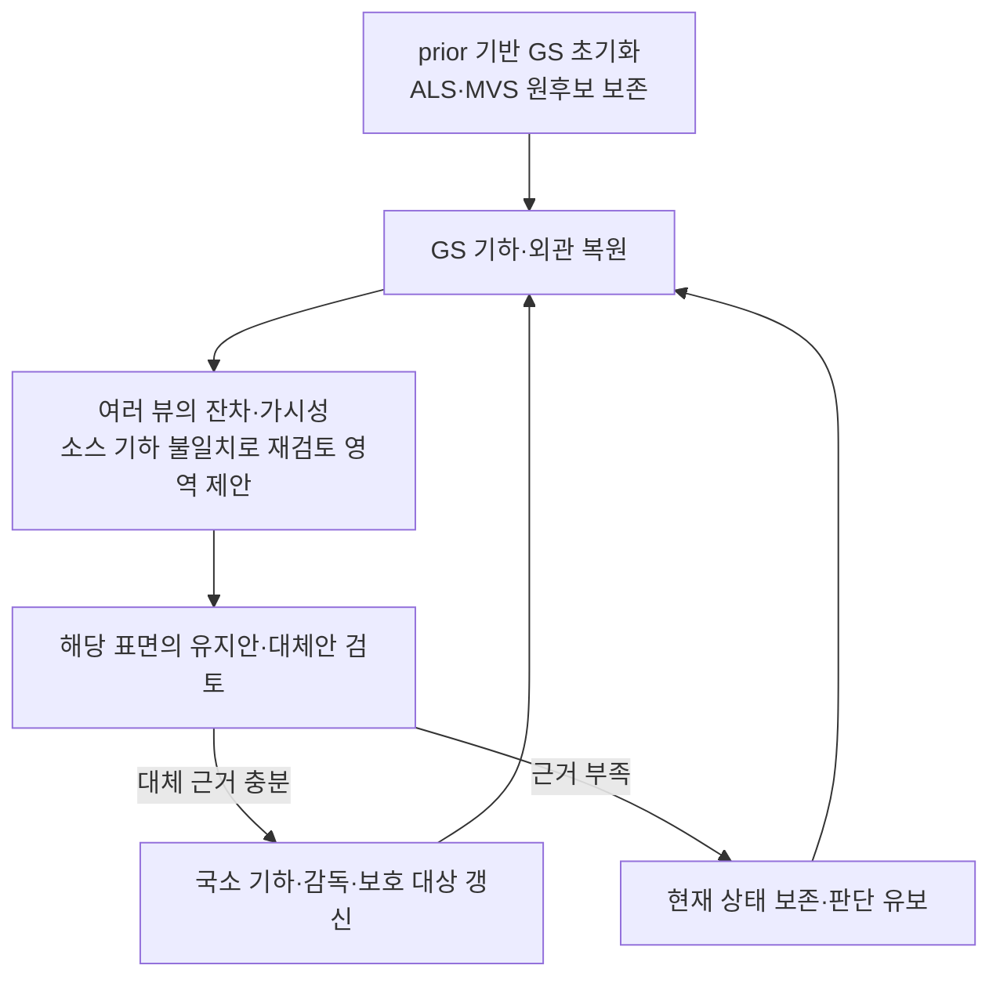

# GS 내부 소스 활용 갱신 — 잔차·표면 단위 설계 후보

2026-09-08 · 사용자 제안에 대한 설계 검토 · `scientific_verdict: null`

## 제안과 검토 의견

사용자는 별도 셀 단위 소스 선택보다 GeoGS처럼 prior로 초기화한 뒤 photo·depth·normal
렌더 잔차가 큰 영역에서 소스를 바꾸는 구조를 제안했다. 지붕과 같은 의미 단위의
일관성, 셀 크기 의존성, 2D→3D 연결의 ambiguity가 주요 질문이다.

**GS 내부에서 소스 활용 상태를 갱신하는 방향은 검토할 가치가 있다.** 렌더링에
참여하는 Gaussian과 최적화 변수가 이미 연결되므로 별도 격자로 판단한 결과를
다시 Gaussian에 배분하는 부담을 줄일 수 있다. 그러나 잔차를 만든 현재 표현을
찾는 것과 올바른 소스를 고르는 것은 다른 추론이다.

이 문서는 후보 설계이며 방법 채택·새 실험·학습 실행을 뜻하지 않는다. 기존 문헌
추천·SRDM 결과·GeoGS 별도 실험을 변경하지 않는다.

## 2D→3D에서 줄어드는 문제와 남는 문제

- 픽셀별 렌더링 기여도로 잔차를 Gaussian에 모으고 여러 뷰에서 누적할 수 있다.
  단순 XY 셀의 경계·크기 의존성을 줄일 가능성이 있다.
- 한 픽셀에 여러 Gaussian이 기여하므로 큰 잔차의 실제 원인이 특정 Gaussian의
  기하라는 보장은 없다. 크기·겹침·투명도와 가림 순서의 영향을 받는다.
- 현재 GS에서 가려진 표면이나 존재하지 않는 대체 표면에는 잔차가 전달되지 않는다.
  미관측을 낮은 오류로 세면 안 된다.
- GeoGS의 `visibility_filter = radii > 0`은 픽셀별 기여도 표 자체가 아니다.
  정확한 잔차 귀속에는 렌더러 계측이 필요하다.
  [공식 렌더 코드](https://github.com/zqlin0521/GeoGS/blob/db40c95c657ec03ff21c83cb99cf39f4e90247a6/gaussian_renderer/__init__.py)

## 잔차의 비교 대상

| 신호 | 비교 대상 예 | 바로 소스 전환으로 읽을 수 없는 이유 |
|---|---|---|
| Photo | GS RGB와 원영상 | 기하 외에도 반사·색·노출·pose 오차가 영향을 줌 |
| Depth | GS 깊이와 MVS/영상 추정 깊이 | 비교 대상도 오류를 포함함. prior 깊이와의 작은 잔차는 초기화의 자기확인일 수 있음 |
| Normal | GS 법선과 외부 추정 법선 | 방향은 같아도 높이는 다를 수 있음. 외부 법선도 오류를 포함함 |
| 내부 기하 일관성 | 같은 GS의 깊이와 법선 | 내부 일관성으로 현재 표면의 정답 여부를 확정할 수 없음 |

영상에서 파생한 깊이·법선·MVS와 원 RGB는 계보를 공유한다. 여러 손실이 동의한다고
독립된 증거 여러 개가 확보된 것으로 세지 않는다.

**P3 반례:** 올바른 ALS 금속지붕을 유지한 GS라도 반사로 RGB 잔차가 크고, 잘못된
MVS 깊이와 불일치할 수 있다. 잔차를 정확히 그 지붕에 배분해도 MVS 전환은 오판일 수 있다.
**P1 유형의 반례:** 낡은 표면이 외관 조정으로 RGB를 일부 설명하고 prior-depth 및
법선 제약도 만족하면, 잘못된 기하인데 큰 잔차가 없을 수 있다. 이는 설계 반례이며
실제 GeoGS 실행에서 이 현상이 관찰됐다는 주장이 아니다.

## 최소 구조 후보

잔차는 재검토 위치를 제안한다. 소스 전환에는 대체 기하가 현재 관측을 더 잘
설명한다는 근거가 필요하다. 전체 장면 두 개를 각각 학습하는 것을 필수로 두지 않는다.
우선 보존한 ALS·MVS의 국소 후보를 검토할 수 있다. 큰 잔차만을 유일한 검토 조건으로
두면 낮은 잔차의 오채택과 가려진 후보를 놓칠 수 있으므로 소스 불일치도 고려한다.

가중치 완화만으로 대체 표면이 생기거나 원소스가 바뀐다고 가정하지 않는다.
작은 이동으로 충분한 경우와 후보 표면으로의 국소 재배치·추가가 필요한 경우를
구분해야 한다. GeoGS의 보호 방식 자체를 새로 발명하는 것과, 바뀐 기하에 맞춰
보호 대상·기준을 연결하는 것은 다르다. 배제했던 원후보는 재채택을 위해 보존한다.

## 지붕 단위와 셀 크기

권장 검토 방향은 Gaussian에 관측 근거를 모으고, 같은 연결 표면·지붕 면에 속한
Gaussian 집단에서 일관된 활용 판단을 하는 것이다. 정확한 의미 분할이 확보됐다고
가정하지 않는다. prior·MVS의 연결성/법선 및 원영상의 의미 근거를 쓸 수 있지만,
평가 전용 LoD2 RoofSurface·roof type을 가져오지 않는다.

한 지붕 전체를 한 소스로 고정하면 부분 증축·창·소규모 현재 세부를 잃을 수 있다.
큰 지붕 구조는 함께 처리하되, 국소 예외를 허용하는 방향을 검토한다. 격자 크기
민감도가 사라지는 것이 아니라 표면 집단의 경계·범위와 Gaussian 크기의 민감도로
바뀌므로 그 안정성도 확인해야 한다. 임의 크기·문턱값은 아직 정하지 않는다.

## 선행연구와 재판단 근거

AGS-Mesh ANR은 복원 중 GS와 외부 법선의 불일치로 감독을 완화하고,
SpotLessSplats는 관측 마스크와 GS를 교대로 갱신한다. GS 상태를 판단과 연결하는
선례이지만 ALS↔MVS 표면 교체·재채택 또는 지붕 단위 선택의 검증은 아니다.
[AGS-Mesh §4.2](https://arxiv.org/html/2411.19271v1),
[SpotLessSplats §4](https://arxiv.org/html/2406.20055v2)

GS 진행으로 가림 순서·표면 위치·관측 기여 및 외관 추정이 개선되면 같은 영상의
잔차 해석이 달라질 수 있다. 새 관측을 만드는 것은 아니며 개선이 자동 보장되지도
않는다. 현재 GS와 prior의 일치 자체를 prior의 현재성 근거로 사용하지 않는다.

선택은 처음 고정한 경우와 복원 중 갱신한 경우를 같은 입력·복원 조건·계산 예산에서
비교해야 한다. 최종 기하·외관·누락, 유효 prior의 오배제, 초기 선택의 변경을 연결해
본다. 현재 설계의 추가 효과는 미검증이다.

## 후속 논의: 동시 잔차와 첫 감독 갱신안

사용자는 photo·depth·normal 잔차가 동시에 크면 초기 Gaussian 문제를 의심하고,
AGS-Mesh/SLS의 갱신 절차를 이용해 소스 활용을 조정할 수 있는지 질문했다.
**가능한 첫 안이다.** 오류 원인을 모두 완벽하게 분류한 뒤에만 수정할 수 있는 것은
아니다. 신뢰 가능한 관측의 불일치가 지속되는 영역에 국소 수정을 제안하고 그 결과를
검증할 수 있다. 동시 잔차만으로 원소스 오류나 초기 중심 위치 오류가 확정되지는 않는다.

여기서 photo는 원 RGB, depth는 현재 영상 유래 깊이, normal은 외부 법선과 비교한다고
명시해야 한다. 같은 depth에서 얻은 normal은 독립 투표가 아니다. 또한 평평한 지붕의
높이만 틀린 경우 normal 잔차는 작을 수 있으므로 세 잔차가 모두 큰 것을 유일한
수정 조건으로 확정하지 않는다. 초기 외관 미수렴의 큰 잔차와 지속 불일치도 구분한다.

원형에서 실제 갱신하는 방향은 다음과 같다.

- **AGS-Mesh ANR:** GS 법선과 불일치하는 외부 법선 감독을 제외한다. 잘못된 ALS를
  따른 GS를 기준으로 올바른 MVS 법선을 제외할 위험이 있어, 그대로 소스 선택기로
  부를 수 없다. 규칙 기반 감독 갱신 자체에는 별도 판단용 GT 학습이 필요하지 않다.
  [원문 §4.2](https://arxiv.org/html/2411.19271v1)
- **SLS:** 현재 영상의 inlier mask를 갱신하고 GS와 교대로 최적화하며, 초기 과도한
  마스킹을 점진적 적용으로 완화한다. 직접 복사하면 낡은 prior를 반박하는 현재
  관측을 배제할 수 있다. MLP 변형의 감독도 현재 장면 잔차에서 만들어지며,
  별도 GT 소스 선택 라벨로 학습하는 방식은 아니다.
  [원문 §4.1.2–4.2.1](https://arxiv.org/html/2406.20055v2)

**첫 구현 후보는 AGS-Mesh형 감독 갱신을 GeoGS의 소스별 기하 제약으로 확장하는 안**이다.
SLS의 특징 분류기까지 동시에 도입하는 것은 우선 필수로 두지 않는다. 이 확장은
원형 그대로의 재현과 구분한다. 검토할 순서는 아래와 같다.

1. prior 초기화 뒤 기하·외관을 안정화하고, 원 ALS/MVS 후보를 유지한다.
2. 여러 유효 뷰에서 지속되는 잔차로 국소 수정 영역을 제안한다.
3. 대체 영상 기하의 지지가 있는 영역에서 prior 감독을 완화하고 필요한 보호를
   조절해 국소 수정을 허용한다. prior-depth 가중치와 보호는 별개 제어다.
4. 변경 전 상태와 비교해 현재 영상 설명력·기하 지지·표면 피복이 개선되는지 확인한다.
   감독 mask나 손실 계수를 바꾸기 전후의 학습 loss 숫자를 그대로 비교하지 않는다.
   비교할 관측·유효영역·평가 기준은 고정하고, 평가 전용 GT로 변경을 선택하지 않는다.
5. 지지되는 변경은 반영하고, 불충분하거나 악화된 변경은 되돌린다. 원후보를 보존해
   이후 prior 활용을 다시 높일 수 있게 한다. 가중치 변화와 실제 표면 전환은 따로 기록한다.

이 절차는 제약 조절이 실제 기하 수정으로 이어지는지 확인하기 위한 설계 후보다.
현재 Gaussian의 이동만으로 대체 표면을 만들 수 없는 경우의 재배치·추가와,
관측 부족 영역의 처리 및 양방향 오판 수정 성공은 미결정·미검증이다.
