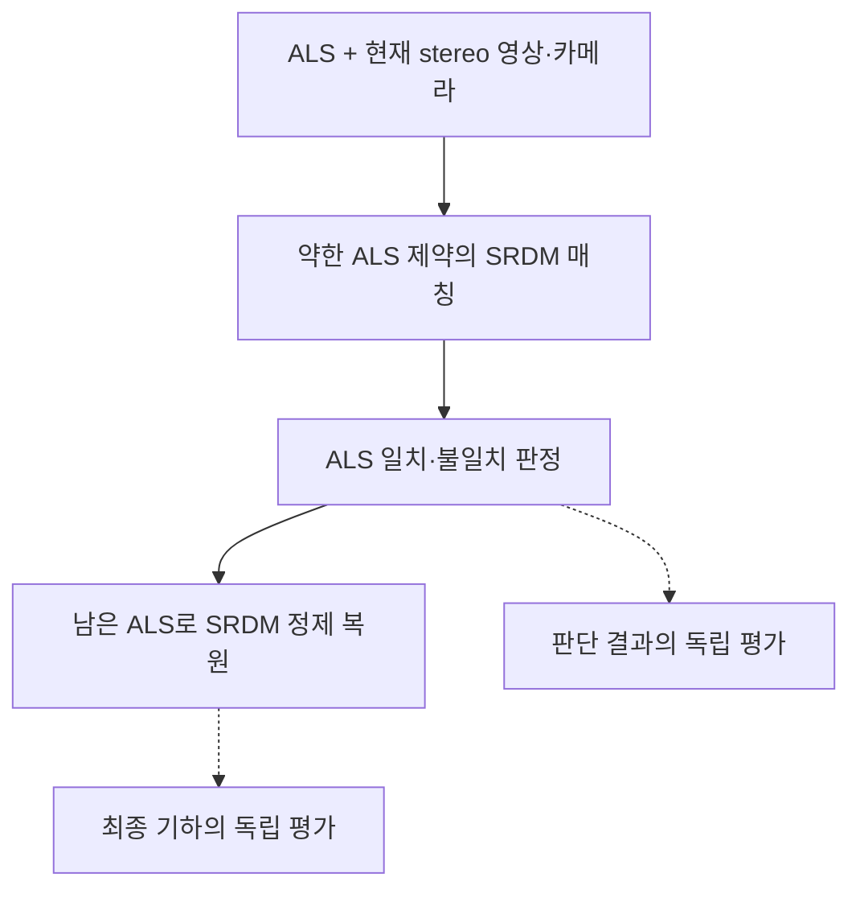

# SRDM P1/P2/P3 첫 판단 기준선 실행·평가 설계

- 문서 식별자: `PHD-SRDM-P1P2P3-DESIGN-v1`
- 작성일: 2026-09-08
- 상태: `DESIGN CANDIDATE / NO EXPERIMENT EXECUTED IN THIS SESSION`
- `scientific_verdict: null`
- 목적: 단일 선행방법의 ALS 활용 판단과 그 판단이 기하 복원에 미치는 효과를 분리해 검토한다.
- 실행 범위: 사용자의 앞선 이 세션 무실행 지시를 유지한다. 최신 실행 제안을 별도 실험 세션으로 인계할지 이 세션의 실행 범위를 바꿀지 확인 중이다. 본 문서 자체는 새 실행을 시작하지 않는다.

## 1. 이번에 확인할 질문

SRDM의 원형 판단이 P1/P2/P3에서 유효 ALS를 유지하고 영상과 불일치하는 ALS를 제외하는가? 그 결과 현재 표면을 회복하면서 이미 양호한 구조를 보존하는가?

첫 안은 여러 논문의 판단 규칙을 혼합하지 않는다. 원문 §3.2.3의 약한 LiDAR 제약 매칭과 불일치 판정을 함께 적용하고, §3.2.4의 후속 복원까지 평가한다. 유지/제외 결과는 전체 실행의 중간 산출물로 보존한다. 기존 MVS와 ALS의 차이에 문턱만 적용한 구현은 SRDM 재현으로 부르지 않는다.

공식 실행 코드는 현재 확인 범위에서 확보하지 못했다. 따라서 원문 기반 재구현 후보이며, 공식 구현 실행 준비 완료 또는 원논문 수치 재현으로 표시하지 않는다. 구현 시 원문 절·연산별 대응, 미명시 사항, 입력 연결과 변경 사항을 먼저 기록한다.

원문: Huang 등, *Super Resolution of Laser Range Data Based on Image-guided Fusion and Dense Matching* (2018), [저자 전문](https://cpb-us-w2.wpmucdn.com/u.osu.edu/dist/4/28638/files/2018/07/LiDAR_and_Image_paper-V3_close_to_final-28lqxo6.pdf).

## 2. 판단, 재판단, 평가의 구분

- **초기 판단:** 후속 복원에서 사용할 ALS를 결정한다. 약한 매칭에도 ALS가 참여하므로 ALS에서 독립된 추정이라는 뜻은 아니다.
- **후속 GS 연결:** 판단을 고정한 뒤 GeoGS에 전달하는 것은 다음 비교다. 이번 첫 SRDM 평가에 GS 실행을 섞지 않는다.
- **재판단:** GS가 갱신한 기하·가시성 등을 새 입력으로 받아 판단을 바꾸는 것은 원 SRDM에 없는 확장이다. 같은 ALS·영상·카메라·정합과 같은 계산을 반복하면 GS가 진행되었다는 이유만으로 SRDM 판단 근거가 달라지지 않는다.
- **평가:** 이미 얻은 판단·복원을 별도 참조로 검사한다. 평가 UAS나 평가 후 라벨을 다음 판단·정합·가중치 선택으로 돌려주지 않는다. SRDM과의 일치도만으로 GS의 정확도를 인증하지 않는다.

원형은 초기 유지/제외 판단의 기준선이다. 양쪽 소스의 부적합 유보, 경쟁 후보의 대칭적 선택, 배제 후보의 재채택까지 검증한 방법으로 확대하지 않는다. 원 ALS와 제외점 식별자는 보존하되, 그 보존만으로 재채택 알고리즘이 구현됐다고 부르지 않는다.

## 3. 입력과 기존 실험의 연결

P1/P2/P3는 기존 세 공간 crop이며 연구 phase를 다시 실행하는 의미가 아니다. [GeoGS 입력 봉인](../geogs_p1p2p3_v1/INPUT_SEAL_ko_v1.md)과 [실험계획](../geogs_p1p2p3_v1/EXPERIMENT_PLAN_ko_v1.md)을 입력 계보의 출발점으로 사용한다.

| crop | scene-local X / Y / Z (m, 상한 미포함) | 기존 학습 / 평가 RGB |
|---|---|---:|
| P1 | [-23,7) / [-21,9) / [-44.272,-25.962) | 98 / 15 |
| P2 | [110,158) / [86,132) / [-49.386,-17.679) | 57 / 9 |
| P3 | [-60,-20) / [-42,12) / [-49.223,-16.993) | 137 / 20 |

- 기존 1400×1013 undistorted RGB·카메라·실제 파일 명단과 해시를 연결한다. SRDM stereo pair는 학습측 영상에서만 구성하고, 동일 crop의 모든 비교 조건에 같은 pair 목록과 정류를 적용한다. pair 선택 기준·개수·여러 pair 판정의 집계는 결과를 보기 전에 별도 입력 명세로 정해야 한다. 임의의 다중 pair 투표를 원 SRDM 절차로 표시하지 않는다.
- ALS는 원 점 좌표·원 행 식별자를 입력으로 연결한다. GeoGS용 삼각망·raycast 깊이를 그대로 원 LiDAR 관측으로 치환하지 않는다. 전처리 탈락, 영상 투영 충돌, 가림, 판정 대상 외 점의 상태를 각각 기록한다.
- 작업 좌표 EPSG:25832, 기존 world shift [690953,5336071,604], ALS Z bridge +45.7m의 계보를 유지한다. 기존 정합 값의 적용 여부를 확인해 이중 보정하지 않는다. 현재 UAS로 새 정합을 맞추지 않는다.
- 원 ALS·기존 MVS·Wu–Vallet 결과는 읽기 전용 비교 자료로 보존한다. 기존 MVS는 SRDM 자체 매칭을 대체하지 않는다. 실제 비교 입력·범위가 다른 이전 결과는 맥락 비교로 표시한다.
- 기존 카메라·기하 생성 과정의 영상 사용 이력과 crop 간 영상 중복을 유지한다. 평가 RGB를 이번 매칭에서 제외해도 전체 계보가 독립된 확증 실험은 아니다.

실행 준비 시 [GeoGS resolver](../../../../artifacts/manifests/geogs_p1p2p3_v1.yaml)에 연결된 실제 봉인 파일과 원 ALS source resolver를 대조해 SRDM 전용 입력 manifest를 만든다. 이 설계 작성에서는 대용량 입력·참조를 새로 가공하거나 점수를 열지 않았다.

## 4. 최소 비교 조건

| 조건 | 처리 | 검토할 효과 |
|---|---|---|
| `SRDM_IMAGE_ONLY` | 같은 SRDM matcher에 LiDAR 입력을 비움. 원문 §4.2의 영상만 비교에 대응 | 같은 영상 정합기에서 LiDAR 유도의 전체 효과 |
| `SRDM_FILTER_OFF` | 동일 전처리 후 ALS를 모두 후단에 전달. §3.2.3 불일치 제외 결과만 적용하지 않음 | 불일치 제거 없이 prior를 활용한 복원 |
| `SRDM_NATIVE` | 원형의 약한 제약 매칭 → 불일치 제거 → 남은 ALS로 고해상도 복원 | 제거 판단과 후단 효과 전체 |

`FILTER_OFF`는 우리가 구성하는 구성요소 제거 비교다. 약한 매칭 중간 결과도 동일하게 기록하되 그 제거 mask를 후단에 적용하지 않는다. 원형의 사전 blunder 전처리는 양 prior 조건에서 공통으로 유지하고 그 영향도 별도 기록한다. 후단의 절단된 prior 비용을 유지하므로 ALS 좌표가 완전히 고정된 조건이 아니다.

LiDAR 생존 집합이 달라지면 원형의 후단 탐색 범위도 달라진다. 이를 숨기지 않고 필터와 후단 영향 전체의 비교로 해석한다. 영상만 조건에 ALS로 정한 탐색 범위를 넘기지 않는다. LiDAR 부재 시 탐색 범위와 매칭 구현의 대응도 재구현 명세에서 설명해야 한다.

영상·카메라·정류·해상도·매칭 비용·전파 규칙·원형 파라미터·후처리·평가 영역을 공통으로 관리한다. 논문의 설정과 입력 단위/피라미드 해상도를 먼저 대응시키며, P1/P2/P3 결과에 맞춘 별도 문턱값이나 가중치 최적화는 첫 비교에 넣지 않는다.

## 5. 정량·정성 평가

| 대상 | 필수 산출물 | 평가 |
|---|---|---|
| 판단 | 원 ALS ID–pair–pixel 대응, 약한 매칭 시차, ALS 시차, 차이값, 유지/제외 mask, 전처리/관측/판정 상태 | 판정 가능 범위, 참조로 확인 가능한 유효 ALS의 오제거와 부적합 ALS의 잔존. 같은 원 점 또는 사전 고정 면적 단위로 분모를 함께 보고 |
| 기하 | 세 조건의 원 시차·깊이·색 점군, 무효·보간 영역 구분 | 독립 참조에 대한 양방향 거리와 정확도·완전성, 오차 분포, 현재면 회복 및 양호한 구조 악화 |
| 정성 | 원영상, 원 ALS, 유지/제외점, 세 최종 점군, 평가 참조의 동일시점 화면·단면 | 과거면 잔존, 현재면 회복, 유효 구조 손실, 경계/가림/저텍스처 오류를 같은 위치에서 확인 |
| 실행 | 버전·설정·입력/출력 해시·단계별 시간·메모리·실패·편차 | 실제 실행과 결과의 재현 가능성. 미실행/계산 실패/참조 부재를 서로 구분 |

SRDM의 불일치는 시간차 변화, blunder, 가림을 포함한다. **가림으로 stereo 감독에서 제외된 ALS와 실제로 오래되거나 잘못된 ALS를 같은 오류 라벨로 합치지 않는다.** 유지율 자체도 정확도가 아니다. 원 알고리즘의 유지/제외 결과와 평가 측 판정 가능/불명 상태를 구분한다. 평가 라벨의 의미·지원 범위·오차 허용 기준은 실제 점수를 보고 맞추지 않는다.

현재 UAS는 평가 전용이다. [기존 평가 검토](../geogs_p1p2p3_v1/EVALUATION_REVIEW_ko_v1.md)의 다음 제한을 이어받는다.

- UAS header EPSG:32632와 작업 EPSG:25832의 datum/epoch 해석이 미해결이다. 기존 좌표 처리하의 참조 편차로 보고하며 보정 완료 절대 정확도라고 부르지 않는다.
- 이미 잘린 UAS crop에서 점이 없는 곳은 미피복·가림·빈공간·crop 밖 표면을 자동 구별할 수 없다. 최근접 거리만으로 철거 또는 유효 prior를 확정하지 않는다.
- 참조가 없는 영역, 판정할 수 없는 영역, 계산 실패를 별도 분모와 상태로 보고한다. 판정 가능한 참조에서 예측이 없으면 복원 결손을 숨기지 않는다.
- 결과 점밀도가 증가했다는 이유만으로 세부 회복을 주장하지 않는다. 공통 공간 지원과 조건 간 같은 가중 방식으로 거리·완전성을 비교하고 단면으로 구조를 확인한다.
- 세 crop은 개발 사례이며 독립된 세 장면의 일반화 통계로 합치지 않는다. P1/P2/P3 전체에 소스 정답을 미리 지정하지 않는다.

SRDM 원산출물은 깊이/색 점군이다. 이 첫 실험에서 GS의 PSNR·SSIM·LPIPS나 textured-mesh 성능을 얻었다고 보고하지 않는다. 투영 잔차를 추가 진단하면 매칭에 사용한 영상인지 평가용 영상인지와 렌더/투영 방법을 표시한다.

정량표와 함께 각 crop의 개선·유지·악화·판단 불가 사례를 제공하고 선정 규칙을 남긴다. 원영상·동일 단면·원 점 대응으로 판정 근거와 최종 기하 변화가 연결되는지 확인한다.

## 6. 실행 세션에서 구체화할 순서와 완료 기준

1. 원문 절별 구현 대응, 공식 코드 확보 여부, 누락된 원형 설정과 최소 입력 adapter를 확인한다. Docker에서 투영/정류/시차–깊이 변환과 매칭 구현을 검증한다. 검증을 위해 새 알고리즘을 조합하지 않는다.
2. 세 crop의 영상·pair·ALS·좌표·평가 역할과 조건별 실제 설정을 SRDM 전용 manifest로 봉인한다. 기존 진행 중 GeoGS와 자원·쓰기 경로를 분리하고 서비스나 실행 파일을 변경하지 않는다.
3. 동일 구현의 세 조건을 P1/P2/P3에서 수행하고 중간 판단과 최종 기하를 모두 보존한다. 원형 미명시 항목의 재구현 선택과 실패도 기록한다.
4. 평가 전 후보를 봉인한 뒤 UAS·현재 영상과 연결해 정량표, 원자료, 동일시점 그림·단면과 사례 분석을 만든다. 실제 확인한 결과만 완료로 보고한다.
5. 먼저 판단 실패와 후단 복원 실패를 구분한다. 고정 판단으로 충분한지 검토한 후 GeoGS 연결 또는 반복 재판단이 필요한 이유를 정리한다.

GS 연결은 후속 범위다. 입력 표면 변환을 공통으로 맞춘 상태에서 원 ALS 사용과 SRDM 고정 판단 사용을 비교한다. 이후 반복 재판단을 시험한다면 동일한 판단을 처음 한 번 적용해 고정한 조건과 증거·계산량을 맞춰 비교하고, 바뀐 판단 근거와 최종 개선을 각각 기록한다.

기존 E1–E6, Wu–Vallet 결과, GeoGS 실행·설계 문서, 후보 05/06 문서는 변경하지 않는다. 이 설계의 채택·구현·개발 평가·과학적 판정은 서로 구분한다.
