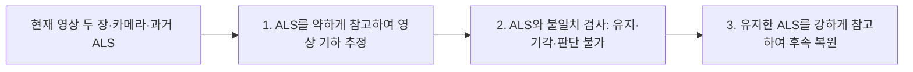

# SRDM의 과거 ALS–현재 영상 사용성 판단: 단계별 재분석

2026-09-08 · `PHD-SRDM-JUDGMENT-STAGES-v2` · `scientific_verdict: null`

**이번 재구현은 P2의 판단 가능한 옛 상부면에서 영상 사용을 뒷받침하지만, P1의 현재 안뜰과 P3의 ALS 지붕 유지까지 해결하는 공통 판단기로는 사용할 근거가 부족하다.** 이를 최종 복원 오차만으로 판단하지 않고, 저장된 약한 정합과 ALS 유지·기각을 관심 표면에서 직접 검사했다. P1에서는 판단 근거인 영상 추정이 현재 표면을 제대로 지지하지 못한다. P3에서는 참조에 가까운 ALS를 더 부정확한 영상 추정과 다르다는 이유로 기각한 사례가 확인된다.

이 문서는 새 분석이다. 원 실험·코드·설정·결과·평가를 덮어쓰지 않는다. 새 정합 0회, 새 복원 0회, GS 학습 0회, 새 소스 선택 규칙 0개다. 기존 weak disparity를 좌표로 읽어 내고, 원 ALS ID와 과거에 기록된 관심 표면 ID를 연결하여 분석했다. 원문 전체의 일반적 실패나 새로운 방법의 성공을 판정하지 않는다.

## 질문과 평가 대상

사용자의 기대는 **P1·P2의 변화 대상에서는 현재 영상 기하 사용, P3의 품질 우세 지붕에서는 ALS 유지**다. 이를 전체 crop의 모든 점에 적용하는 정답으로 바꾸지 않는다. 주변 지면과 변화 없는 표면이 섞이면 관심 대상에 대한 답이 달라질 수 있기 때문이다.

새 문턱이나 결과에 맞춘 영역을 만들지 않고 [기존 사례 기록](../warp_ncc_v1/TECHNICAL_RETURN_ko_v1.md)의 표면 구분을 재사용했다.

| 사례 | 필요한 행동 | 기존 관심 표면 | 셀 / 대응 원 ALS 점 |
|---|---|---|---:|
| P1 | 옛 상부면의 사용을 중단하고 현재 안뜰 사용 | 위층 `PRIOR_ABOVE` 평면 | 1,229 / 5,378 |
| P2 | 옛 상부층의 사용을 중단하고 현재 낮은 지붕 사용 | 위층 `PRIOR_ABOVE` 평면 | 3,737 / 14,790 |
| P3 | 영상 기하의 잡음 때문에 유효 ALS 지붕을 버리지 않음 | 기존 `MVS z > −30m`·ALS가 있는 위층 지붕 | 3,904 / 15,925 |

원 ALS `(파일 ID, 원행)` → 봉인된 원점 사본 → 기존 patch의 원행 → `XY 셀 AND 동일 ALS patch ID`를 연결했다. 따라서 같은 XY 아래의 다른 patch를 가진 지면은 관심 지붕 통계에 섞이지 않는다. 기존 source-defined 표면 구분은 평가 층화이며, 각 점의 정오를 보증하는 GT 라벨은 아니다.

## SRDM의 단계

[원문 §3.2.3–3.2.4](https://cpb-us-w2.wpmucdn.com/u.osu.edu/dist/4/28638/files/2018/07/LiDAR_and_Image_paper-V3_close_to_final-28lqxo6.pdf)의 두 번의 정합 사이에 ALS 판단이 있다.

기존 `image only / filtering off / two-stage` 세 열은 이 단계 순서가 아니다. 후속 복원에서 `ALS 없이 / 필터 없이 ALS / 판단 후 유지 ALS`를 쓰는 세 비교 조건이다. 본문은 이 세 조건보다 앞에 있는 판단 단계를 먼저 읽는다.

### 0. 입력 준비

지역당 현재 영상 두 장과 카메라, 과거 ALS를 사용했다. 기존 OpenMVS 점군은 SRDM의 판단 입력이 아니다. 이번 그림에 기존 OpenMVS를 추가한 목적은 **이미 확보한 현재 영상 기하와 SRDM이 새로 추정했던 기하가 얼마나 다른지** 보이기 위해서이며, 기존 MVS로 판단식을 다시 계산하지 않았다.

두 영상에 투영되어 ALS z-buffer·시차 범위를 통과한 점만 판단 입력 seed가 된다. 영상 프레임에 투영된다는 사실은 현재 대상 표면이 실제로 보인다는 보장이 아니다. 특히 P1의 기존 기록은 현재 안뜰이 제한된 준수직 뷰에서 보인다고 명시한다. 이번 P1 사선 영상에서 대상 ALS는 전경 건물 위에 투영된다. 이는 가림·뷰 선택 문제를 의심할 근거이며, 이번 감사에서 독립 가시성 검증까지 수행한 것은 아니다.

### 1. 약한 ALS 유도 영상 정합: 판단 근거는 적절했나?

현재 영상에서 대응점을 찾되 ALS가 제안하는 깊이에 작은 선호를 주는 단계다. 결과는 SRDM의 자체 영상 기하와 좌우 일관성 유효 mask다. 이 단계가 현재 표면을 잘못 추정하면, 다음 단계에서 좋은 ALS도 기각할 수 있다.

| 사례 | 고정 단면에서 관찰한 약한 정합 | 판단 목적에 대한 의미 |
|---|---|---|
| P1, X=−8m | 기존 MVS·UAS는 현재 낮은 평면을 지지하지만, SRDM 약한 정합은 그 면을 연속적으로 복원하지 못하고 위쪽의 고립된 점이 남음 | 현재 안뜰을 근거로 옛 ALS를 판별할 영상 추정이 확보되지 않음 |
| P2, Y=109m | SRDM 약한 정합이 기존 MVS·UAS의 낮은 지붕과 단차를 대체로 따름 | 옛 상부층과 현재 표면을 비교할 근거가 관측된 부분에 존재 |
| P3, X=−40m | 기존 ALS는 연속 곡면을 지지하고 MVS는 주변에 퍼짐. SRDM 약한 정합도 이 상단 곡면을 충분히 복원하지 못함 | 영상 기하가 불안정한 바로 그 지붕에서 ALS를 판별해야 하는 상황 |

전체 ROI 투영 범위의 좌우 일관성 통과율은 P1 28.62%, P2 81.10%, P3 36.93%다. 이 비율은 영상 추정의 정확도나 대상 표면의 가시성 비율이 아니다. ROI 안에 복호화된 weak 점의 참조 거리 중앙값은 P1 3.824m, P2 0.093m, P3 0.108m지만, P3의 값에는 관측된 벽면 등도 포함되므로 지붕 판단의 정확도로 대신하지 않는다.

### 2. ALS 불일치 판단: 실제로 무엇을 유지·기각했나?

저장된 판단은 ALS seed 위치의 영상 추정과 ALS 시차가 2px 이내면 유지, 초과면 기각이다. 유효한 약한 정합이 없으면 판단 불가다. 아래는 주변 지면을 제외한 **위의 관심 표면** 수량이다.

| 관심 표면의 원 ALS | P1 | P2 | P3 |
|---|---:|---:|---:|
| 전체 대상 점 | 5,378 | 14,790 | 15,925 |
| 유지 | 196 | 198 | 703 |
| 기각 | 683 | 3,382 | 1,314 |
| seed지만 판단 불가 | 3,268 | 695 | 6,905 |
| seed가 되지 않음 | 1,231 | 10,515 | 7,003 |
| 판단 가능 / 전체 대상 | 16.3% | 24.2% | 12.7% |
| **기각 / 판단 가능** | **77.7%** | **94.5%** | **65.1%** |

기각률은 선택 정확도가 아니다. **기각한 위치의 영상 추정이 ALS보다 현재 참조를 더 잘 지지했는지**를 추가로 확인했다. 같은 반올림된 좌영상 seed 픽셀에서 약한 시차가 제안한 점과 원 ALS 점의 기존 UAS 최근접 거리를 비교했다.

| 기각한 관심 표면 위치 | ALS의 참조 거리 중앙값 | 약한 영상 추정의 참조 거리 중앙값 | 같은 seed에서 영상 추정이 참조에 더 가까운 비율 |
|---|---:|---:|---:|
| P1, 683점 | 2.613m | 6.238m | 24.6% |
| P2, 3,382점 | 3.265m | 0.104m | 94.3% |
| P3, 1,314점 | 0.080m | 1.531m | 17.8% |

위 마지막 비율도 정답 라벨 기반 선택 정확도가 아니다. 같은 광선의 후보가 같은 물리 표면을 뜻하지 않고, 참조는 현재 crop으로 제한되어 있기 때문이다. 다만 이전의 전체 ROI 최종 복원 거리보다 판단이 사용한 근거를 직접 드러낸다.

- **P1:** 옛 상부면의 일부를 기각했지만, 그때 대안으로 삼은 영상 추정이 현재 안뜰을 제대로 지지하지 않았다. 기각 683점의 약한 영상 추정은 원 ALS보다도 참조에서 더 먼 경우가 많다. 유지 196점도 ALS 거리 중앙 3.662m, 영상 추정 3.624m로 함께 먼 상태에서 서로 일치했다. 따라서 많은 ALS를 버렸다는 이유로 영상 채택 성공이라고 할 수 없다. 현재 판단 근거가 부적절하다.
- **P2:** 판단 가능한 관심 표면에서 94.5%를 기각했으며, 그 위치의 영상 추정은 참조 중앙 0.104m, 버린 ALS는 3.265m였다. **영상으로 옛 상부층 사용을 중단한다는 의도한 작동이 이 부분에서 관찰된다.** 유지 198점은 참조 중앙 0.044m여서 관심 구역이라고 모든 ALS를 버리는 해석도 맞지 않는다. 다만 전체 관심 ALS의 75.8%는 이 영상쌍으로 판단하지 못했다.
- **P3:** 판단 가능한 지붕 ALS의 65.1%를 기각했는데, 기각 ALS는 참조 중앙 0.080m, 영상 추정은 1.531m였다. **ALS가 유효한데 영상 추정과 다르다는 이유로 버리는 방향의 문제가 판단 단계에서 확인된다.** 기각 위치의 시차 차이 중앙값은 약 139.5px여서 단순히 2px 문턱 경계의 미세 조정 문제라고 설명할 근거도 없다. 지붕 대상 전체의 87.3%는 판단되지 않았다.

### 3. 후속 복원: 앞선 판단의 결과가 어떻게 전달됐나?

원문은 남은 ALS를 강한 제약으로 사용해 고해상도 복원을 수행한다. 이번 재구현은 유지 seed만 넘겼고 **기각 seed와 판단 불가 seed를 모두 제외**했다. 따라서 판단 불가 3,268 / 695 / 6,905점의 제약도 사라졌다. 이것은 SRDM이 그 점을 부적합하다고 판정한 것과 다르다. 처음부터 seed가 아닌 점은 필터 없는 비교 조건에서도 사용되지 않았다.

- P1: 현재 안뜰을 충분히 복원하지 못했고, 필터 없이 ALS를 사용한 조건에 있던 표면 지원도 줄었다.
- P2: 관측된 부분에서 옛 상부층을 따르던 복원이 현재의 낮은 표면으로 옮겨졌다. 앞 단계의 올바른 방향과 연결된다.
- P3: 관심 상단 곡면이 충분히 복원되지 않았다. 이 곡면은 필터 없이 ALS를 쓴 조건에서도 충분하지 않아, 최종 곡면 부재 전체를 판단 단계 탓으로 돌릴 수 없다. 별도로 낮은 지면 지원 손실도 관찰되지만, 그것을 지붕 소스 판단의 주결과로 삼지 않는다.

## 목적 기준의 기술적 결론과 이전 설명 정정

**현재 재구현을 P1·P2의 영상 활용과 P3의 ALS 유지를 모두 담당하는 판단기로 채택할 수는 없다.** P2의 판단 가능한 영역에서는 사용을 뒷받침하는 작동 사례가 있고, P1은 판단 입력인 영상 추정이 현재 표면을 확보하지 못하며, P3는 부정확한 영상 추정 때문에 유효 ALS를 기각하는 문제가 있다. 이는 SRDM의 유지/기각 단계에 직접 근거한 판단이다.

SRDM에는 ALS 불일치 판단 기능이 있다. 다만 영상 기하와의 일치 여부가 곧 두 소스의 상대적 사용성 전체는 아니다. 특히 P3처럼 영상 기하가 불안정하고 ALS가 더 좋은 경우를 이 규칙이 구별하는지 확인해야 하는데, 현재 실행은 그 요구를 만족하지 못했다. 기존 MVS를 자체 약한 스테레오 대신 넣는 것은 별도의 변형이며, 이번에 수행했다고 주장하지 않는다.

이전 답변의 문제를 기록한다.

1. 최종 복원의 실패를 근거로 SRDM 판단 전체가 실패했다고 단정한 것은 분석 단계가 잘못됐다. 본 v2는 실제 판단 위치와 근거를 읽어 이를 정정한다.
2. P1/P2/P3 전체 ROI 평균으로 사용자의 관심 표면을 대표한 것은 부적절했다. P2의 관심 표면 기각률은 전체 ROI 51.3%와 달리 94.5%다.
3. P3의 지면 손실을 지붕 ALS 선택 여부의 핵심 근거로 설명한 것은 목적을 벗어났다. 본문은 지붕의 유지·기각을 직접 제시한다.
4. '공식 저자 코드 재현 아님'이라는 한계는 남지만, 구체적 단계 분석을 대신하는 설명으로 사용하지 않는다. 원형 SRDM과의 입력·정합·구현 차이 때문에 원방법의 일반적 불가능을 판정하지 않는다.

최소 후속 기술 쟁점은 명확하다. P1은 현재 안뜰을 볼 수 있는 영상 입력에서 약한 정합이 성립하는지, P3는 영상 추정이 불안정할 때 ALS를 기각하는 규칙이 적합한지가 쟁점이다. 이 문서는 새 방법 조합이나 추가 실행을 수행하지 않았다.

## 그림·원자료·검증

그림은 왼쪽부터 **판단 기하 / 실제 ALS 판단 / 기존 후속 복원**이다. 첫 패널: 주황 ALS, 파랑 기존 MVS, 자주 SRDM 약한 정합, 검정 UAS. 둘째 패널: 초록 유지, 빨강 기각, 노랑 seed 판단 불가, 회색 비seed. 셋째 패널: 주황 필터 없는 후속 복원, 파랑 유지 ALS만 쓴 후속 복원. 검정 참조 윤곽이 보인다고 그곳이 복원된 것은 아니다.

외부 새 분석 경로: `../JointBuildGS-artifacts/phase-payloads/phd/srdm_p1p2p3_v1/PHD-SRDM-JUDGMENT-STAGES-v2/`.

- `run/P1_stages.png`, `run/P2_stages.png`, `run/P3_stages.png`: 기존 단면 위치·폭·축을 유지한 단계 비교.
- `run/P*_target_decisions.png`: 관심 표면만의 원영상 투영 및 XY 판단 지도. 투영은 가시성 판정이 아니다.
- `run/P*_membership.npz`: 원점 ID, 관심 표면 membership, 저장 판단, 같은 seed 광선의 약한 기하·참조 편차.
- `run/stage_audit.json`: 정확한 수치·입력 및 출력 SHA-256, 실행 시간 64.81초.
- `verification.json`: 세 지역의 기존 seal 입력 해시, frozen 참조 해시, mask 대응, ROI 대응 및 새 9개 결과 해시 검증 PASS.

원 ALS 식별자·좌표·patch 원행·기존 셀 수·분모 합계 검사를 통과했다. 여섯 그림을 직접 열어 단면과 지도 대응을 확인했다. 원점 최근접 거리는 기존 고정 좌표의 평가 진단이며 datum/epoch 절대 보정은 미검증이다. 이 조건으로 현재성·소스 정답·선택 정확도·일반화를 확정하지 않는다.

재현: `scripts/phd/srdm_p1p2p3_v1/analyze_judgment_stages_v2.py`와 `configs/phd/srdm_p1p2p3_v1/judgment_stage_audit_v2.json`. 검증기는 `verify_judgment_stages_v2.py`다. 기존 Docker 이미지 `sha256:c5445549fe7f6995e0478ab9b07565da09947c1f1d54e274802dca50aa1e7f8e`, CPU2, 메모리5GiB, GPU·네트워크 미사용, 기존 저장소·payload 읽기 전용, 새 분석 경로만 쓰기 가능하게 실행했다. 기존 GeoGS 실행과 canonical 연구 계약은 수정하지 않았다.
