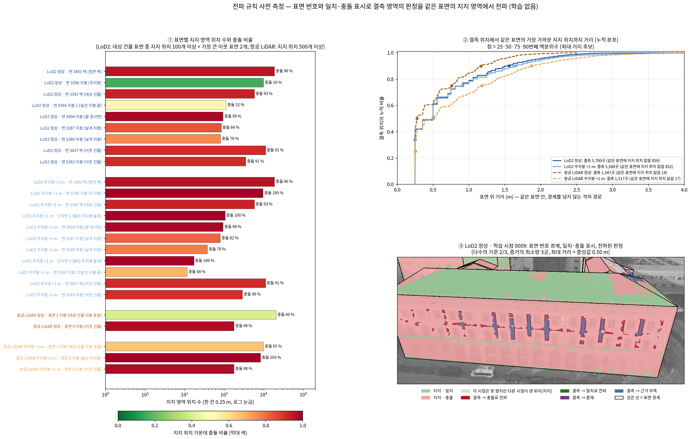

<!-- PHD-STAGE2-PROPAGATION-PREMEASURE-v1 -->
# 전파 규칙 사전 측정 — 표면 번호, 일치·충돌 표시, 전파 값 후보 (학습 없음)

> 작업 PHD-STAGE2-PROPAGATION-PREMEASURE-v1 (2026-09-30). 학습과 학습 결과의 평가는 하지 않았다. `scientific_verdict: null`.
> **장면**: r5·r6가 쓴 B0다. 저자 예제 15시점 가운데 학습 13시점을 쓰고, 대상 건물은 DEBY_LOD2_4959323이다. 사전 정보(LoD2, 항공 LiDAR) × 장면(정상, 주지붕 +1 m)으로 네 설정을 쟀다.
> **입력**: 첫째 단계 산출물이 모두 남아 있어 첫째 단계는 다시 돌리지 않았다. 둘째 단계가 읽은 지도(`PHD-STAGE2-CONF-GUIDED-GS-v1/inputs/maps`)를 그대로 쓴다.
>   - 관측 신뢰도 지도
>   - 허용 오차 τ_v: 항공 LiDAR 0.0405 m, LoD2 0.0568 m
>   - 정합 이동을 반영한 사전 정보 깊이
>   - MVS 깊이
> **규칙**: 전파 규칙이 적힌 설계 문서 원문은 작업 공간에서 찾지 못했다. 발주문 5번의 문장대로 구현했다.
> **값은 고르지 않았다.** 참값은 표 7(주입한 면)에만 썼다.

## 요약 — 표에서 읽히는 것

**1. 값 셋의 범위**

- **다수의 기준은 판정 개수를 거의 바꾸지 않는다.**
  - 모으는 위치가 정수 개라서, 0.55와 0.6, 0.75와 0.8은 네 설정·모든 조합에서 같은 판정을 낸다.
  - 0.6→2/3, 2/3→0.75 단계도 16개 조합 가운데 12–14개에서 변화가 결측 위치의 2 % 미만이다. 가장 큰 변화는 LoD2 5.4 %, 항공 LiDAR 11.1 %다(6절).
- **판정을 정하는 것은 최대 거리와 최소량이다.**
  - 기준 조합(다수의 기준 2/3, 최소량 3곳, 최대 거리 = 중앙값)에서는 결측 위치의 62–82 %가 근거 부족이다.
  - 최대 거리를 90번째 백분위수로 늘리면 근거 부족이 19–27 %로 준다(표 5).
- **거리는 칸 간격에 묶여 있다.**
  - 25번째 백분위수는 네 설정 모두 0.25 m(바로 옆 칸)다.
  - 중앙값은 LoD2 0.50 m, 항공 LiDAR 0.28 m(정상)·0.51 m(+1 m)다.
  - 0.25 m 안에는 지지 위치가 많아야 4곳이라, 최소량 5·10은 그 거리에서 모두 근거 부족이 된다(표 4, 표 5).

**2. 충돌로 전파되는 넓이 — 작다(표 6)**

- **기준 조합**: LoD2 정상 120.6 m²로 크롭 안 건물 면의 0.8 %다. 항공 LiDAR 정상은 14.4 m²(0.6 %)다.
- **가장 넓게 모으는 조합**(최소량 1곳, 90번째 백분위수): LoD2 255 m²(1.7 %), 항공 LiDAR 74·76 m²(2.8·2.9 %)다.
- **직접 잰 충돌과 비교**: 지지 위치 자체가 충돌인 넓이는 LoD2 정상 3,743 m², 항공 LiDAR 정상 755 m²다. 기준 조합 전파 몫의 약 31배·52배다.
- **어디로 가나**: LoD2 정상에서 충돌로 전파되는 넓이의 48 %(57.8 m²)는 정면 벽 3403의 무늬 없는 벽면이다(그림 칸 ③).
- **일치 전파**: 일치로 전파되는 결측 넓이는 모든 조합에서 LoD2 23 m², 항공 LiDAR 17 m² 이하다.

**3. 구현 확인 세 건(1절)**

- **(가) 환산 계수**
  - 지붕은 면의 기울기와 방향을 쓰고(|n·d| / |n_z|), 첫째 단계와 둘째 단계가 같은 식이다.
  - 벽은 둘째 단계가 면 법선 방향 거리(|n·d|), 첫째 단계가 시선 각도만(|d_z|) 쓴다. 두 단계가 다르지만 벽은 허용 오차를 재는 풀 밖이다.
  - 두 단계 모두 **정상 장면 LoD2 면의 법선**으로 환산한다. 그래서 항공 LiDAR도 LoD2 면 기울기로 환산되고, +1 m 장면도 정상 장면의 면으로 환산된다.
- **(나) MVS 깊이 항**: 허용 구간이 없다. 설계와 같다.
- **(다) 초기화 계산**
  - 가우시안 신뢰도는 학습 전에 사전 정보 깊이로 가려 이미 계산된다.
  - 전파된 판정은 r6에 입력(표면 번호, 일치·충돌 표시)이 없어 계산되지 않는다.
  - 같은 자리에서 후보 점마다 붙일 수 있음은 이번에 확인했다(표 8).

**4. 주입한 면(확인용, 표 7)**

- 올린 주지붕의 결측 위치는 LoD2 278곳, 항공 LiDAR 214곳이다.
- 두 사전 정보 모두 어느 조합에서도 일치나 혼재로 전파되지 않았다. 판정은 충돌 아니면 근거 부족이다.
- 최대 거리 90 %에서는 LoD2 275–278곳, 항공 LiDAR 213곳이 충돌이다.



## 1. 구현 확인 세 건

### (가) 환산 계수 — 깊이 차이를 높이 차이로 바꿀 때 곱하는 값

| 자리 | 둘째 단계 `scripts/phd/stage2_conf_guided_gs_v1/prepare_stage2_inputs.py:65-72` (`conversion`) | 첫째 단계 `scripts/phd/stage1_verify_v2/verify_v2.py:131-133` (v1 `scripts/phd/stage1_conf_tol_conflict_v1/analyze.py:84-86`도 같은 식) |
|---|---|---|
| 지붕형 면 (LoD2 면 법선 \|n_z\| ≥ 0.5, `:33`) | \|n·d\| / \|n_z\|: 면의 기울기·방향(법선 n)과 시선(d = Rᵀ(x, y, 1), 픽셀 중심)을 함께 쓴다 | 같다 |
| 벽형 면 (\|n_z\| < 0.5) | \|n·d\|: 면 법선 방향 거리(`:71`, 발주서 13절 7번) | \|n_z\| ≤ 10⁻⁶이면 \|d_z\|로 시선 각도만 쓴다. LoD2 벽 법선은 n_z = 0이라 이쪽이다. n_z가 0이 아니면서 아주 작으면 연직식이 매우 커진다 |
| LoD2 면이 없는 픽셀 | \|d_z\|: 시선 각도만(`:72`) | \|d_z\| |

- **두 단계가 같은 식인가**
  - 지붕은 같다. 허용 오차를 재는 풀(대상 지붕, 관측 신뢰도 1)에서 두 환산으로 잰 허용 오차가 같았다. 항공 LiDAR 0.040533 m, LoD2 0.056770 m다(`R6_FIX_4_4_ko_v1.md` 5절).
  - 벽은 다르다. 벽은 풀 밖이라 τ_v 값에는 영향이 없다.
- **어느 면의 법선인가**: 두 단계 모두 정상 장면 LoD2 면 번호 지도(`PHD-STAGE1-VERIFY-v2/inputs_v2/faceid`)의 법선을 쓴다. 둘째 단계는 이 지도 하나로 네 사전 정보의 픽셀 허용 오차 지도 `tau_M`·`tau_L`을 만든다(`:92`, `:126`, τ_p = τ_v / f_p). 그래서 두 가지가 생긴다.
  - **항공 LiDAR**: 자기 표면(삼각망)이 아니라 LoD2 면의 기울기로 환산된다. LoD2 면이 없는 자리는 |d_z|다.
    - 이번 측정처럼 항공 LiDAR 삼각형 자신의 법선으로 표시를 매기면, 둘째 단계 지도와 표시가 달라지는 지지 픽셀이 있다.
    - 정상 장면에서 3.9 %(30,283,788개 중 1,172,051개), +1 m 장면에서 1.6 %다. 둘째 단계가 충돌로 보는데 여기서 일치가 되는 쪽이 687,749개, 반대가 484,302개다(정상 장면).
  - **+1 m 장면**: 정상 장면의 면과 넓이가 그대로 쓰인다.
    - 올린 지붕이 새로 덮은 사전 정보 픽셀에는 허용 오차가 없다. LoD2 +1 m 1,320,595개, 항공 LiDAR +1 m 174,281개다(학습 13시점 원해상도 합).
    - 둘째 단계 사전 정보 항은 허용 오차가 있는 픽셀만 쓴다(`jbgs_judgment.py:140`). 따라서 r5·r6의 +1 m 실행에서 이 픽셀들은 사전 정보 항 밖이었다.
  - **LoD2 정상**: 두 방법의 표시는 131픽셀(0.0001 %)만 다르다. 문턱에서의 반올림이다.
- **이번 측정의 표시**: 그 장면 자신의 표면 법선을 썼다. LoD2는 면, 항공 LiDAR는 픽셀이 맞은 삼각형이다. 식은 둘째 단계 것(지붕형은 연직, 벽형은 법선 방향)이다.

### (나) MVS 깊이 항의 허용 구간

- **없다. 설계와 같다.**
  - r6 `jbgs_judgment.py:122-134`(`weighted_l1`)이 Σ A·|D − M| ÷ 픽셀 수로 계산한다. 호출은 `:495-497`(`losses`)이다.
  - 절단(ρ_τ, `:94-97`)은 사전 정보 항(`truncated_prior_loss`, `:137-152`)에만 걸린다.
  - r5도 분모만 다르고 같은 L1이다.
- MVS 깊이 지도에는 관측 신뢰도가 1인 픽셀에만 값이 있다(`prepare_stage2_inputs.py`의 `mvs` 저장). 이번 입력의 모든 픽셀에서 '관측 신뢰도 1 ⇔ MVS 깊이 있음'이 성립했다.

### (다) 가우시안 신뢰도와 전파된 판정을 초기화에서 후보 점마다 처음 계산할 수 있는가

- **가우시안 신뢰도: 이미 한다.** r6는 학습 전에 두 번 계산하고, 두 번 모두 사전 정보 깊이로 가린다. 가림 규칙은 학습 시점 13장, 투영 픽셀의 사전 정보 깊이와 |z − P| < 0.5 m이다(`compute_E`, `jbgs_judgment.py:172-198`).
  1. **초기화 거르기**: `init_visible_filter`(`:254-273`)를 `Judgment.__init__`(`:397-406`)에서 부른다. 후보 점(사전 정보 ∪ 영상 점) 전체에 대해 계산하지만, 보는 시점 수만 쓰고 신뢰도 값은 버린다.
  2. **보호에 쓰는 첫 계산**: 1회 반복의 시작, 첫 렌더링과 갱신 전이다(`train.py:814-815` → `update_E`, `:543-545`). 점이 아직 움직이지 않았으므로 초기화 때 계산한 것과 같다. 렌더링 깊이로 가리는 것은 두 번째 계산부터다(`:546-551`).
- **전파된 판정: r6에는 없다.**
  - 판정 모듈이 읽는 지도는 관측 신뢰도·MVS·사전 정보·허용 오차·면 번호(판독용, CPU)·환산 계수·참값뿐이다(`:372-378`). 표면 번호와 일치·충돌 표시 입력은 없다.
  - 후보 사전 정보 점 파일(`inputs/points/prior_*.npz`)에도 좌표와 색만 있고 표면 번호는 없다.
- **붙일 수는 있다(이번 측정에서 확인, 표 8).** 둘째 단계 초기 점군의 사전 정보 점 120,333개(설정마다)에 두 값을 붙였다.
  - 첫 가우시안 신뢰도: r6 첫 계산을 numpy로 다시 구현했다.
  - 앉은 위치의 상태와 전파 판정: 점의 표면을 먼저 찾았다. LoD2는 가장 가까운 삼각형의 면이다(거리 최대 1.1 cm). 항공 LiDAR는 삼각망 꼭짓점이 속한 표면이다(둘째 단계 항공 LiDAR 점 = 삼각망 꼭짓점, 차 7.6 μm).
  - **붙은 수**: LoD2는 모든 점이 위치에 붙었다. 항공 LiDAR는 44,893개가 붙었다. 나머지는 지면 점이거나 가파른 삼각형에만 걸친 점이라 건물 표면이 없다.
  - **LoD2 정상에서 두 값의 대응**
    - 보는 시점이 없는 점(r6가 초기화에서 빼는 점) 78,320개의 99.7 %가 비가시 위치에 앉는다.
    - 신뢰도 0.5 미만(1회에 보호) 2,793개 가운데 75 %는 결측 위치, 20 %는 지지 위치에 앉는다.
    - 0.5 이상 39,220개의 97 %가 지지 위치에 앉는다.
    - 즉 점 하나의 중심 픽셀로 잰 신뢰도와 칸의 시점 다수결이 어긋나는 점이 보호 대상의 약 5분의 1이다.
  - **넣을 자리**: `Judgment.__init__`의 초기화 거르기 바로 뒤, `init_id`를 매기기 전(`:407-411`)이다. 충돌로 판정된 위치의 사전 정보 점을 심지 않는다면 여기서 뺀다.

## 2. 입력과 이번에 정한 것

| 항목 | 값 |
|---|---|
| 설정 | LoD2 정상(`prior_M_N`); LoD2 주지붕 +1 m(`prior_M_B`: 면 3396 +1 m와 둘레 단차면 5개); 항공 LiDAR 정상(`prior_L_N`); 항공 LiDAR 주지붕 +1 m(`prior_L_B`: 3396 발자국 안 점 11,283개 +1 m) |
| 표면 번호 | 그 장면의 사전 정보 메시에서 직접 매겼다. LoD2Depth와 같은 광선으로 15시점에 렌더링했고, 렌더링 깊이는 둘째 단계 사전 정보 깊이 지도와 같았다(네 설정 × 15시점, 차 0.0 m, 덮임 불일치 0픽셀). LoD2는 면 하나가 표면 하나다(단차면 번호 100001–100005). 항공 LiDAR는 완만한 삼각형(\|n_z\| ≥ 0.5, 둘째 단계 벽 규칙과 같은 값)이 변을 공유해 이어진 영역이 표면 하나이고, 가파른 삼각형은 경계라 번호가 없다. 항공 LiDAR 표면은 꼭짓점 분류의 과반이 건물(6)이면 건물 면, 지면(2)이면 지면으로 두었다(지면은 건물 면이 아니다) |
| 일치·충돌 표시 | 건물 면의 지지 픽셀마다 \|MVS − 사전 정보\| × f_p ≤ τ_v이면 일치, 넘으면 충돌. f_p는 그 장면 자신의 표면 법선으로 계산했다(1절 가) |
| 위치 | 0.25 m 칸. 항공 LiDAR 점 간격(16.0점/m²)이다. LoD2는 고유 간격이 없어(둘째 단계 표본: 준비 0.22 m, 사용 0.34 m) 같은 칸을 쓴다. LoD2 칸은 면 자신의 평면 격자이고, 칸 중심이 면 안·크롭 안이어야 한다. 항공 LiDAR 칸은 크롭 사각형의 수평 격자이고, 칸 중심 아래 삼각형의 표면에 속하며, 넓이는 0.0625 m² ÷ \|n_z\|다. 픽셀은 사전 정보 깊이로 3차원 점이 된 뒤 자기 표면의 칸에 들어간다. 가림은 사전 정보 깊이로 따진다 |
| 시점 | r5·r6의 학습 13시점. 시험 시점 0002·0016은 뺐다. 판정은 학습 입력이기 때문이다 |
| 위치의 상태 | 한 시점이 칸에 픽셀을 하나라도 가지면 그 칸을 '본다'. 그 픽셀 절반 이상이 관측 신뢰도 1이면 '잰다'. 잰 시점의 표시는 그 칸의 일치 픽셀 ≥ 충돌 픽셀이면 일치다. 잰 시점 ÷ 본 시점이 0.5 이상이면 지지(r6 보호 규칙의 0.5 이상 쪽), 0.5 미만이면 결측, 본 시점이 없으면 비가시다. 지지 위치의 표는 잰 시점 표시의 다수결이다. 동률이면 그 시점들의 픽셀 합으로, 그것도 같으면 일치로 둔다 |
| 거리 | 같은 표면의 칸만 잇는 격자 경로다. 가로·세로·대각·나이트 걸음을 쓰고, 칸 중심 사이 실제 거리로 잰다(항공 LiDAR는 삼각망 높이 포함). 대각 걸음은 옆 칸 하나, 나이트 걸음은 걸친 두 칸이 같은 표면이어야 한다 |
| 규칙 | 발주문 5번 그대로. 같은 거리의 지지 위치는 위치 번호 순으로 모은다 |
| '거의 변하지 않음' | 값을 한 단계 바꿀 때 네 판정 칸 모두 결측 위치의 2 % 미만으로 변하는 경우 |

## 3. 표면 번호와 일치·충돌 표시 (1·2번)

- **LoD2**: 사전 정보 픽셀 모두에 표면 번호가 있다.
- **항공 LiDAR**: 번호가 없는 픽셀이 많다.
  - 사전 정보 픽셀의 47–48 %가 가파른 삼각형(벽 자리)이라 번호가 없다.
  - 38 %는 지면 표면이다.
  - 대상 건물 지붕은 이웃 지붕과 이어져 한 표면이 된다(표면 1, 2,061 m²).
  - +1 m 장면에서는 올린 주지붕이 가파른 삼각형으로 둘러싸여 따로 떨어진다(표면 3, 584 m², 올린 꼭짓점 100 %).

### 표 1. 표면 번호 (15시점 렌더링, 픽셀 수는 15시점 합)

| 설정 | 표면 수(건물 / 건물 아님) | 크롭 안 위치가 있는 건물 표면 | 사전 정보 픽셀 | 건물 표면 번호 있음 | 건물 아닌 표면(지면) | 번호 없음(가파른 삼각형) | 참고: 메시는 맞았으나 크롭 밖 |
|---|---|---|---|---|---|---|---|
| LoD2 정상 | 3,918 / 0 | 94 | 145,913,828 | 145,913,828 (100.0 %) | 0 (0.0 %) | 0 (0.0 %) | 53,332,930 |
| LoD2 주지붕 +1 m | 3,923 / 0 | 99 | 147,362,631 | 147,362,631 (100.0 %) | 0 (0.0 %) | 0 (0.0 %) | 52,274,327 |
| 항공 LiDAR 정상 | 323 / 8 | 282 | 251,826,190 | 37,348,095 (14.8 %) | 96,140,333 (38.2 %) | 118,337,762 (47.0 %) | 0 |
| 항공 LiDAR 주지붕 +1 m | 326 / 8 | 279 | 252,034,498 | 34,555,328 (13.7 %) | 95,867,653 (38.0 %) | 121,611,517 (48.3 %) | 0 |

### 표 2. 일치·충돌 표시 (학습 13시점의 건물 표면 픽셀)

| 설정 | 면 종류 | 건물 표면 픽셀 | 지지 픽셀(관측 신뢰도 1) | 일치 | 충돌 | 결측 픽셀(관측 신뢰도 0) |
|---|---|---|---|---|---|---|
| LoD2 정상 | 지붕 | 35,555,271 | 33,226,198 (93.4 %) | 72.7 % | 27.3 % | 2,329,073 (6.6 %) |
| LoD2 정상 | 벽 | 91,880,595 | 82,810,007 (90.1 %) | 8.9 % | 91.1 % | 9,070,588 (9.9 %) |
| LoD2 정상 | 바닥면 | 31 | 31 (100.0 %) | 3.2 % | 96.8 % | 0 (0.0 %) |
| LoD2 주지붕 +1 m | 지붕 | 33,582,666 | 30,823,569 (91.8 %) | 1.6 % | 98.4 % | 2,759,097 (8.2 %) |
| LoD2 주지붕 +1 m | 벽 | 95,173,795 | 86,120,902 (90.5 %) | 8.4 % | 91.6 % | 9,052,893 (9.5 %) |
| LoD2 주지붕 +1 m | 바닥면 | 31 | 31 (100.0 %) | 3.2 % | 96.8 % | 0 (0.0 %) |
| 항공 LiDAR 정상 | 지붕 | 32,373,844 | 30,283,788 (93.5 %) | 85.4 % | 14.6 % | 2,090,056 (6.5 %) |
| 항공 LiDAR 주지붕 +1 m | 지붕 | 30,212,149 | 27,756,472 (91.9 %) | 6.4 % | 93.6 % | 2,455,677 (8.1 %) |

- 픽셀 단위 충돌은 LoD2 정상 지붕 27.3 %, 벽 91.1 %다. 항공 LiDAR 정상 지붕은 14.6 %다.
- 이 값은 픽셀 단위다. 위치 단위(표 3)와 다르다.

## 4. 표면별 위치 (3번)

- **표 읽는 법**: 일치·충돌은 지지 위치의 표(시점 다수결)다. 마지막에서 두 번째 열은 결측 위치에 기준 조합(2/3, 3곳, 중앙값)을 적용한 판정이다.
- **대상 건물**: 대상 건물 표면은 지지나 결측 위치가 하나라도 있으면 모두 보였다(항공 LiDAR는 5 m² 이상). 이웃 건물 표면은 결측 위치가 100곳 이상이거나 지지 위치가 1,500곳 이상인 것만 보였고, 나머지는 '그 밖의 표면 합'으로 묶었다. 전체는 `measure/<설정>/surfaces.csv`에 있다.
- **위치의 충돌 비율이 픽셀보다 높다**: 예를 들어 항공 LiDAR 정상 지붕은 픽셀 14.6 %, 위치 47.1 %다(표 6 아래). 픽셀은 여러 시점이 크게 찍은 주지붕에 몰리고, 위치는 넓이로 세기 때문이다.
- **항공 LiDAR 표면 1을 대상 건물 지붕 발자국으로 나누면**(보고용 구분) 충돌 비율이 안 19.9 %, 밖(이웃 건물 지붕) 71.7 %다.

### 표 3. 표면별 위치 (한 칸 0.25 m; 일치·충돌은 지지 위치의 표)

| 설정 | 종류 | 표면 | 넓이 m² | 지지 위치 | 일치 | 충돌 | 결측 위치 | 결측의 기준 조합 판정 (충돌 · 일치 · 혼재 · 근거 부족) | 비가시 위치 |
|---|---|---|---|---|---|---|---|---|---|
| LoD2 정상 | 지붕 | 면 3396 (주지붕) | 619.2 | 9,897 | 84.4 % | 15.6 % | 10 | 5 · 5 · 0 · 0 | 0 |
| LoD2 정상 | 지붕 | 면 3394 (그늘진 지붕 끝) | 104.6 | 1,121 | 47.6 % | 52.4 % | 553 | 102 · 29 · 0 · 422 | 0 |
| LoD2 정상 | 지붕 | 면 3404 (끝 경사면) | 58.6 | 937 | 1.5 % | 98.5 % | 0 | 0 · 0 · 0 · 0 | 0 |
| LoD2 정상 | 지붕 | 면 3387 (날개 지붕) | 58.8 | 845 | 16.1 % | 83.9 % | 0 | 0 · 0 · 0 · 0 | 95 |
| LoD2 정상 | 지붕 | 면 3389 (날개 지붕) | 59.1 | 806 | 24.4 % | 75.6 % | 0 | 0 · 0 · 0 · 0 | 139 |
| LoD2 정상 | 지붕 | 면 3393 (뒷지붕) | 581.2 | 16 | 18.8 % | 81.2 % | 8 | 0 · 0 · 0 · 8 | 9,275 |
| LoD2 정상 | 지붕 | 면 3383 (이웃 건물) | 278.6 | 3,503 | 9.0 % | 91.0 % | 262 | 103 · 5 · 0 · 154 | 693 |
| LoD2 정상 | 지붕 | 면 3539 (이웃 건물) | 181.6 | 2,597 | 21.3 % | 78.7 % | 125 | 77 · 21 · 0 · 27 | 183 |
| LoD2 정상 | 지붕 | 면 3386 (이웃 건물) | 162.0 | 2,316 | 0.1 % | 99.9 % | 198 | 59 · 0 · 0 · 139 | 78 |
| LoD2 정상 | 지붕 | 면 3888 (이웃 건물) | 22.1 | 251 | 61.8 % | 38.2 % | 103 | 32 · 23 · 0 · 48 | 0 |
| LoD2 정상 | 지붕 | 면 3569 (이웃 건물) | 41.9 | 201 | 2.5 % | 97.5 % | 108 | 55 · 0 · 0 · 53 | 361 |
| LoD2 정상 | 벽 | 면 3403 (정면 벽) | 1,258.8 | 18,732 | 4.2 % | 95.8 % | 1,408 | 924 · 0 · 0 · 484 | 0 |
| LoD2 정상 | 벽 | 면 3391 (옆 벽) | 365.8 | 5,796 | 7.3 % | 92.7 % | 56 | 55 · 0 · 0 · 1 | 0 |
| LoD2 정상 | 벽 | 면 3392 (대상 건물) | 109.2 | 95 | 6.3 % | 93.7 % | 0 | 0 · 0 · 0 · 0 | 1,653 |
| LoD2 정상 | 벽 | 면 3388 (대상 건물) | 135.4 | 33 | 0.0 % | 100.0 % | 0 | 0 · 0 · 0 · 0 | 2,133 |
| LoD2 정상 | 벽 | 면 3398 (대상 건물) | 9.5 | 23 | 0.0 % | 100.0 % | 2 | 0 · 0 · 0 · 2 | 127 |
| LoD2 정상 | 벽 | 면 3390 (대상 건물) | 76.0 | 17 | 0.0 % | 100.0 % | 0 | 0 · 0 · 0 · 0 | 1,199 |
| LoD2 정상 | 벽 | 면 3400 (대상 건물) | 370.5 | 11 | 0.0 % | 100.0 % | 1 | 0 · 0 · 0 · 1 | 5,916 |
| LoD2 정상 | 벽 | 면 3397 (대상 건물) | 280.2 | 6 | 0.0 % | 100.0 % | 0 | 0 · 0 · 0 · 0 | 4,478 |
| LoD2 정상 | 벽 | 면 3402 (대상 건물) | 109.2 | 5 | 0.0 % | 100.0 % | 0 | 0 · 0 · 0 · 0 | 1,743 |
| LoD2 정상 | 벽 | 면 3837 (이웃 건물) | 735.8 | 11,134 | 8.8 % | 91.2 % | 160 | 151 · 3 · 0 · 6 | 478 |
| LoD2 정상 | 벽 | 면 3880 (이웃 건물) | 570.9 | 3,224 | 59.7 % | 40.3 % | 114 | 48 · 12 · 0 · 54 | 5,797 |
| LoD2 정상 | 벽 | 면 3535 (이웃 건물) | 216.6 | 1,336 | 44.8 % | 55.2 % | 533 | 82 · 6 · 0 · 445 | 1,596 |
| LoD2 정상 | 벽 | 면 3858 (이웃 건물) | 114.0 | 1,824 | 0.0 % | 100.0 % | 0 | 0 · 0 · 0 · 0 | 0 |
| LoD2 정상 | 벽 | 면 3381 (이웃 건물) | 499.5 | 738 | 12.6 % | 87.4 % | 715 | 72 · 2 · 0 · 641 | 6,539 |
| LoD2 정상 | 벽 | 면 3461 (이웃 건물) | 54.1 | 0 | – | – | 684 | 0 · 0 · 0 · 684 | 181 |
| LoD2 정상 | 벽 | 면 3479 (이웃 건물) | 9.6 | 0 | – | – | 154 | 0 · 0 · 0 · 154 | 0 |
| LoD2 정상 | 바닥면 | 면 3401 (대상 건물 바닥면) | 1,358.9 | 24 | 4.2 % | 95.8 % | 0 | 0 · 0 · 0 · 0 | 21,719 |
| LoD2 정상 | 지붕 | 그 밖의 15개 표면 합 | 826.0 | 6,248 | 13.7 % | 86.3 % | 114 | 33 · 0 · 0 · 81 | 6,854 |
| LoD2 정상 | 벽 | 그 밖의 43개 표면 합 | 4,051.5 | 5,367 | 24.1 % | 75.9 % | 392 | 131 · 17 · 0 · 244 | 59,065 |
| LoD2 정상 | 바닥면 | 그 밖의 8개 표면 합 | 1,518.9 | 6 | 0.0 % | 100.0 % | 0 | 0 · 0 · 0 · 0 | 24,296 |
| LoD2 주지붕 +1 m | 지붕 | 면 3396 (주지붕) | 619.2 | 9,629 | 0.0 % | 100.0 % | 278 | 153 · 0 · 0 · 125 | 0 |
| LoD2 주지붕 +1 m | 지붕 | 면 3404 (끝 경사면) | 58.6 | 937 | 1.5 % | 98.5 % | 0 | 0 · 0 · 0 · 0 | 0 |
| LoD2 주지붕 +1 m | 지붕 | 면 3387 (날개 지붕) | 58.8 | 801 | 18.5 % | 81.5 % | 4 | 4 · 0 · 0 · 0 | 135 |
| LoD2 주지붕 +1 m | 지붕 | 면 3394 (그늘진 지붕 끝) | 104.6 | 117 | 31.6 % | 68.4 % | 400 | 26 · 4 · 0 · 370 | 1,157 |
| LoD2 주지붕 +1 m | 지붕 | 면 3389 (날개 지붕) | 59.1 | 380 | 22.4 % | 77.6 % | 0 | 0 · 0 · 0 · 0 | 565 |
| LoD2 주지붕 +1 m | 지붕 | 면 3393 (뒷지붕) | 581.2 | 5 | 20.0 % | 80.0 % | 3 | 0 · 0 · 0 · 3 | 9,291 |
| LoD2 주지붕 +1 m | 지붕 | 면 3383 (이웃 건물) | 278.6 | 2,884 | 9.7 % | 90.3 % | 293 | 108 · 21 · 0 · 164 | 1,281 |
| LoD2 주지붕 +1 m | 지붕 | 면 3539 (이웃 건물) | 181.6 | 2,597 | 21.3 % | 78.7 % | 125 | 77 · 21 · 0 · 27 | 183 |
| LoD2 주지붕 +1 m | 지붕 | 면 3386 (이웃 건물) | 162.0 | 1,900 | 0.2 % | 99.8 % | 357 | 62 · 0 · 0 · 295 | 335 |
| LoD2 주지붕 +1 m | 지붕 | 면 3888 (이웃 건물) | 22.1 | 251 | 61.8 % | 38.2 % | 103 | 32 · 23 · 0 · 48 | 0 |
| LoD2 주지붕 +1 m | 지붕 | 면 3569 (이웃 건물) | 41.9 | 198 | 2.5 % | 97.5 % | 111 | 58 · 0 · 0 · 53 | 361 |
| LoD2 주지붕 +1 m | 벽 | 면 3403 (정면 벽) | 1,258.8 | 18,732 | 4.2 % | 95.8 % | 1,408 | 924 · 0 · 0 · 484 | 0 |
| LoD2 주지붕 +1 m | 벽 | 면 3391 (옆 벽) | 365.8 | 5,796 | 7.3 % | 92.7 % | 56 | 55 · 0 · 0 · 1 | 0 |
| LoD2 주지붕 +1 m | 벽 | 면 3392 (대상 건물) | 109.2 | 95 | 6.3 % | 93.7 % | 0 | 0 · 0 · 0 · 0 | 1,653 |
| LoD2 주지붕 +1 m | 벽 | 면 3398 (대상 건물) | 9.5 | 23 | 0.0 % | 100.0 % | 2 | 0 · 0 · 0 · 2 | 127 |
| LoD2 주지붕 +1 m | 벽 | 면 3388 (대상 건물) | 135.4 | 21 | 4.8 % | 95.2 % | 0 | 0 · 0 · 0 · 0 | 2,145 |
| LoD2 주지붕 +1 m | 벽 | 면 3390 (대상 건물) | 76.0 | 17 | 0.0 % | 100.0 % | 0 | 0 · 0 · 0 · 0 | 1,199 |
| LoD2 주지붕 +1 m | 벽 | 면 3400 (대상 건물) | 370.5 | 3 | 0.0 % | 100.0 % | 1 | 0 · 0 · 0 · 1 | 5,924 |
| LoD2 주지붕 +1 m | 벽 | 면 3402 (대상 건물) | 109.2 | 1 | 0.0 % | 100.0 % | 0 | 0 · 0 · 0 · 0 | 1,747 |
| LoD2 주지붕 +1 m | 벽 | 면 3837 (이웃 건물) | 735.8 | 11,137 | 8.9 % | 91.1 % | 157 | 148 · 3 · 0 · 6 | 478 |
| LoD2 주지붕 +1 m | 벽 | 면 3880 (이웃 건물) | 570.9 | 2,768 | 66.8 % | 33.2 % | 76 | 24 · 0 · 0 · 52 | 6,291 |
| LoD2 주지붕 +1 m | 벽 | 면 3858 (이웃 건물) | 114.0 | 1,824 | 0.0 % | 100.0 % | 0 | 0 · 0 · 0 · 0 | 0 |
| LoD2 주지붕 +1 m | 벽 | 면 3535 (이웃 건물) | 216.6 | 1,045 | 49.1 % | 50.9 % | 440 | 38 · 28 · 0 · 374 | 1,980 |
| LoD2 주지붕 +1 m | 벽 | 면 3381 (이웃 건물) | 499.5 | 366 | 23.5 % | 76.5 % | 515 | 46 · 10 · 0 · 459 | 7,111 |
| LoD2 주지붕 +1 m | 벽 | 면 3461 (이웃 건물) | 54.1 | 0 | – | – | 669 | 0 · 0 · 0 · 669 | 196 |
| LoD2 주지붕 +1 m | 벽 | 면 3479 (이웃 건물) | 9.6 | 0 | – | – | 154 | 0 · 0 · 0 · 154 | 0 |
| LoD2 주지붕 +1 m | 단차면 | 단차면 1 (대상 건물) | 66.2 | 1,054 | 0.0 % | 100.0 % | 6 | 5 · 0 · 0 · 1 | 0 |
| LoD2 주지붕 +1 m | 단차면 | 단차면 3 (대상 건물) | 10.8 | 172 | 0.0 % | 100.0 % | 0 | 0 · 0 · 0 · 0 | 0 |
| LoD2 주지붕 +1 m | 단차면 | 단차면 2 (대상 건물) | 51.8 | 1 | 0.0 % | 100.0 % | 1 | 0 · 0 · 0 · 1 | 826 |
| LoD2 주지붕 +1 m | 단차면 | 단차면 4 (대상 건물) | 0.1 | 1 | 0.0 % | 100.0 % | 0 | 0 · 0 · 0 · 0 | 0 |
| LoD2 주지붕 +1 m | 바닥면 | 면 3401 (대상 건물 바닥면) | 1,358.9 | 24 | 4.2 % | 95.8 % | 0 | 0 · 0 · 0 · 0 | 21,719 |
| LoD2 주지붕 +1 m | 지붕 | 그 밖의 15개 표면 합 | 826.0 | 6,081 | 14.7 % | 85.3 % | 42 | 21 · 0 · 0 · 21 | 7,093 |
| LoD2 주지붕 +1 m | 벽 | 그 밖의 45개 표면 합 | 4,345.8 | 5,270 | 23.9 % | 76.1 % | 307 | 109 · 29 · 0 · 169 | 63,955 |
| LoD2 주지붕 +1 m | 바닥면 | 그 밖의 8개 표면 합 | 1,518.9 | 6 | 0.0 % | 100.0 % | 0 | 0 · 0 · 0 · 0 | 24,296 |
| 항공 LiDAR 정상 | 지붕 | 표면 1 (대상 건물 지붕 포함) | 2,061.2 | 20,525 | 59.8 % | 40.2 % | 1,229 | 186 · 25 · 0 · 1,018 | 8,225 |
| 항공 LiDAR 정상 | 지붕 | 표면 4 (이웃 건물) | 117.4 | 1,774 | 2.4 % | 97.6 % | 0 | 0 · 0 · 0 · 0 | 21 |
| 항공 LiDAR 정상 | 지붕 | 그 밖의 280개 표면 합 | 421.1 | 1,246 | 11.3 % | 88.7 % | 118 | 25 · 0 · 0 · 93 | 5,082 |
| 항공 LiDAR 정상 | 지붕 | └ 표면 1 중 대상 건물 지붕 발자국 안 | 1,393.0 | 12,481 | 80.1 % | 19.9 % | 554 | 17 · 17 · 0 · 520 | 7,335 |
| 항공 LiDAR 정상 | 지붕 | └ 표면 1 중 발자국 밖(이웃 건물 지붕) | 668.2 | 8,044 | 28.3 % | 71.7 % | 675 | 169 · 8 · 0 · 498 | 890 |
| 항공 LiDAR 주지붕 +1 m | 지붕 | 표면 1 (대상 건물 지붕 포함) | 1,452.5 | 9,856 | 34.7 % | 65.3 % | 1,186 | 337 · 45 · 0 · 804 | 10,029 |
| 항공 LiDAR 주지붕 +1 m | 지붕 | 표면 3 (올린 주지붕) | 584.4 | 8,332 | 0.0 % | 100.0 % | 213 | 117 · 0 · 0 · 96 | 3 |
| 항공 LiDAR 주지붕 +1 m | 지붕 | 표면 5 (이웃 건물) | 117.4 | 1,774 | 2.4 % | 97.6 % | 0 | 0 · 0 · 0 · 0 | 21 |
| 항공 LiDAR 주지붕 +1 m | 지붕 | 그 밖의 276개 표면 합 | 422.7 | 1,121 | 12.6 % | 87.4 % | 118 | 78 · 0 · 0 · 40 | 5,227 |
| 항공 LiDAR 주지붕 +1 m | 지붕 | └ 표면 1 중 대상 건물 지붕 발자국 안 | 784.3 | 2,406 | 53.2 % | 46.8 % | 401 | 21 · 2 · 0 · 378 | 8,655 |
| 항공 LiDAR 주지붕 +1 m | 지붕 | └ 표면 1 중 발자국 밖(이웃 건물 지붕) | 668.2 | 7,450 | 28.7 % | 71.3 % | 785 | 316 · 43 · 0 · 426 | 1,374 |

## 5. 결측 위치에서 지지 위치까지의 거리 (4번)

- **같은 표면에 지지 위치가 없는 결측**: LoD2에서 약 15 %다(정상 859곳). 그 가운데 838곳은 이웃 건물 벽 3461·3479다. 이 위치들은 어떤 값에서도 근거 부족이다.
- **LoD2 +1 m 장면의 최대 20.75 m**: 올린 주지붕 둘레 단차면 2의 결측 한 곳이다. 이 단차면은 거의 모두 비가시이고(826칸), 지지 위치는 1곳뿐이다.

### 표 4. 결측 위치에서 같은 표면의 가장 가까운 지지 위치까지 표면 위 거리

| 설정 | 면 종류 | 결측 위치 | 같은 표면에 지지 위치 없음 | 25 % | 50 % | 75 % | 90 % | 99 % | 최대 |
|---|---|---|---|---|---|---|---|---|---|
| LoD2 정상 | 전체 | 5,700 | 859 (53.7 m²) | 0.25 m | 0.50 m | 0.91 m | 1.56 m | 2.56 m | 4.75 m |
| LoD2 정상 | 지붕 | 1,481 | 19 (1.2 m²) | 0.25 m | 0.50 m | 1.06 m | 1.62 m | 2.59 m | 4.50 m |
| LoD2 정상 | 벽 | 4,219 | 840 (52.5 m²) | 0.25 m | 0.50 m | 0.75 m | 1.47 m | 2.51 m | 4.75 m |
| LoD2 주지붕 +1 m | 전체 | 5,508 | 852 (53.2 m²) | 0.25 m | 0.50 m | 0.91 m | 1.65 m | 3.25 m | 20.75 m |
| LoD2 주지붕 +1 m | 지붕 | 1,716 | 19 (1.2 m²) | 0.25 m | 0.50 m | 1.12 m | 1.87 m | 3.57 m | 4.80 m |
| LoD2 주지붕 +1 m | 벽 | 3,792 | 833 (52.1 m²) | 0.25 m | 0.35 m | 0.75 m | 1.50 m | 2.45 m | 20.75 m |
| 항공 LiDAR 정상 | 전체 | 1,347 | 14 (0.7 m²) | 0.25 m | 0.28 m | 0.76 m | 1.17 m | 1.92 m | 2.52 m |
| 항공 LiDAR 정상 | 지붕 | 1,347 | 14 (0.7 m²) | 0.25 m | 0.28 m | 0.76 m | 1.17 m | 1.92 m | 2.52 m |
| 항공 LiDAR 주지붕 +1 m | 전체 | 1,517 | 17 (1.0 m²) | 0.25 m | 0.51 m | 1.18 m | 1.87 m | 3.28 m | 4.07 m |
| 항공 LiDAR 주지붕 +1 m | 지붕 | 1,517 | 17 (1.0 m²) | 0.25 m | 0.51 m | 1.18 m | 1.87 m | 3.28 m | 4.07 m |

## 6. 값 후보의 격자 (5번)

- **다수의 기준 열**: 판정 개수가 완전히 같은 값끼리 한 줄에 묶었다. 예를 들어 '0.55·0.6·2/3'은 세 값이 같은 개수를 냈다는 뜻이다.
- **각 칸**: 위치 수 / 넓이(m²).
- **최대 거리**: 설정마다 자기 거리 분포(표 4 '전체' 줄)의 백분위수다.

### 표 5-1. LoD2 정상 — 결측 위치 5,700곳(356.2 m²)의 판정 (위치 수 / 넓이 m²)

최대 거리 후보 = 표 4의 백분위수: 25 % 0.25 m, 50 % 0.50 m, 75 % 0.91 m, 90 % 1.56 m.

| 최소량 | 최대 거리 | 다수의 기준 | 충돌 | 일치 | 혼재 | 근거 부족 |
|---|---|---|---|---|---|---|
| 1 | 25 % (0.25 m) | 0.55·0.6·2/3·0.75·0.8 | 1,889 / 118.1 | 130 / 8.1 | 0 / 0.0 | 3,681 / 230.1 |
| 1 | 50 % (0.50 m) | 0.55·0.6·2/3·0.75·0.8 | 2,774 / 173.4 | 172 / 10.8 | 0 / 0.0 | 2,754 / 172.1 |
| 1 | 75 % (0.91 m) | 0.55·0.6·2/3·0.75·0.8 | 3,495 / 218.4 | 232 / 14.5 | 0 / 0.0 | 1,973 / 123.3 |
| 1 | 90 % (1.56 m) | 0.55·0.6·2/3·0.75·0.8 | 4,087 / 255.4 | 301 / 18.8 | 0 / 0.0 | 1,312 / 82.0 |
| 3 | 25 % (0.25 m) | 0.55·0.6·2/3 | 306 / 19.1 | 29 / 1.8 | 0 / 0.0 | 5,365 / 335.3 |
| 3 | 25 % (0.25 m) | 0.75·0.8 | 283 / 17.7 | 16 / 1.0 | 36 / 2.2 | 5,365 / 335.3 |
| 3 | 50 % (0.50 m) | 0.55·0.6·2/3 | 1,929 / 120.6 | 123 / 7.7 | 0 / 0.0 | 3,648 / 228.0 |
| 3 | 50 % (0.50 m) | 0.75·0.8 | 1,848 / 115.5 | 66 / 4.1 | 138 / 8.6 | 3,648 / 228.0 |
| 3 | 75 % (0.91 m) | 0.55·0.6·2/3 | 3,230 / 201.9 | 207 / 12.9 | 0 / 0.0 | 2,263 / 141.4 |
| 3 | 75 % (0.91 m) | 0.75·0.8 | 3,103 / 193.9 | 103 / 6.4 | 231 / 14.4 | 2,263 / 141.4 |
| 3 | 90 % (1.56 m) | 0.55·0.6·2/3 | 3,948 / 246.8 | 280 / 17.5 | 0 / 0.0 | 1,472 / 92.0 |
| 3 | 90 % (1.56 m) | 0.75·0.8 | 3,782 / 236.4 | 140 / 8.8 | 306 / 19.1 | 1,472 / 92.0 |
| 5 | 25 % (0.25 m) | 0.55·0.6 | 0 / 0.0 | 0 / 0.0 | 0 / 0.0 | 5,700 / 356.2 |
| 5 | 25 % (0.25 m) | 2/3·0.75·0.8 | 0 / 0.0 | 0 / 0.0 | 0 / 0.0 | 5,700 / 356.2 |
| 5 | 50 % (0.50 m) | 0.55·0.6 | 1,248 / 78.0 | 93 / 5.8 | 0 / 0.0 | 4,359 / 272.4 |
| 5 | 50 % (0.50 m) | 2/3·0.75·0.8 | 1,213 / 75.8 | 60 / 3.8 | 68 / 4.2 | 4,359 / 272.4 |
| 5 | 75 % (0.91 m) | 0.55·0.6 | 3,060 / 191.2 | 178 / 11.1 | 0 / 0.0 | 2,462 / 153.9 |
| 5 | 75 % (0.91 m) | 2/3·0.75·0.8 | 2,972 / 185.8 | 105 / 6.6 | 161 / 10.1 | 2,462 / 153.9 |
| 5 | 90 % (1.56 m) | 0.55·0.6 | 3,872 / 242.0 | 239 / 14.9 | 0 / 0.0 | 1,589 / 99.3 |
| 5 | 90 % (1.56 m) | 2/3·0.75·0.8 | 3,748 / 234.2 | 138 / 8.6 | 225 / 14.1 | 1,589 / 99.3 |
| 10 | 25 % (0.25 m) | 0.55·0.6 | 0 / 0.0 | 0 / 0.0 | 0 / 0.0 | 5,700 / 356.2 |
| 10 | 25 % (0.25 m) | 2/3 | 0 / 0.0 | 0 / 0.0 | 0 / 0.0 | 5,700 / 356.2 |
| 10 | 25 % (0.25 m) | 0.75·0.8 | 0 / 0.0 | 0 / 0.0 | 0 / 0.0 | 5,700 / 356.2 |
| 10 | 50 % (0.50 m) | 0.55·0.6 | 163 / 10.2 | 13 / 0.8 | 4 / 0.2 | 5,520 / 345.0 |
| 10 | 50 % (0.50 m) | 2/3 | 161 / 10.1 | 12 / 0.8 | 7 / 0.4 | 5,520 / 345.0 |
| 10 | 50 % (0.50 m) | 0.75·0.8 | 158 / 9.9 | 9 / 0.6 | 13 / 0.8 | 5,520 / 345.0 |
| 10 | 75 % (0.91 m) | 0.55·0.6 | 2,586 / 161.6 | 129 / 8.1 | 30 / 1.9 | 2,955 / 184.7 |
| 10 | 75 % (0.91 m) | 2/3 | 2,548 / 159.2 | 98 / 6.1 | 99 / 6.2 | 2,955 / 184.7 |
| 10 | 75 % (0.91 m) | 0.75·0.8 | 2,512 / 157.0 | 71 / 4.4 | 162 / 10.1 | 2,955 / 184.7 |
| 10 | 90 % (1.56 m) | 0.55·0.6 | 3,592 / 224.5 | 183 / 11.4 | 45 / 2.8 | 1,880 / 117.5 |
| 10 | 90 % (1.56 m) | 2/3 | 3,526 / 220.4 | 138 / 8.6 | 156 / 9.8 | 1,880 / 117.5 |
| 10 | 90 % (1.56 m) | 0.75·0.8 | 3,468 / 216.8 | 99 / 6.2 | 253 / 15.8 | 1,880 / 117.5 |

### 표 5-2. LoD2 주지붕 +1 m — 결측 위치 5,508곳(344.2 m²)의 판정 (위치 수 / 넓이 m²)

최대 거리 후보 = 표 4의 백분위수: 25 % 0.25 m, 50 % 0.50 m, 75 % 0.91 m, 90 % 1.65 m.

| 최소량 | 최대 거리 | 다수의 기준 | 충돌 | 일치 | 혼재 | 근거 부족 |
|---|---|---|---|---|---|---|
| 1 | 25 % (0.25 m) | 0.55·0.6·2/3·0.75·0.8 | 1,826 / 114.1 | 140 / 8.8 | 0 / 0.0 | 3,542 / 221.4 |
| 1 | 50 % (0.50 m) | 0.55·0.6·2/3·0.75·0.8 | 2,664 / 166.5 | 213 / 13.3 | 0 / 0.0 | 2,631 / 164.4 |
| 1 | 75 % (0.91 m) | 0.55·0.6·2/3·0.75·0.8 | 3,284 / 205.2 | 274 / 17.1 | 0 / 0.0 | 1,950 / 121.9 |
| 1 | 90 % (1.65 m) | 0.55·0.6·2/3·0.75·0.8 | 3,823 / 238.9 | 367 / 22.9 | 0 / 0.0 | 1,318 / 82.4 |
| 3 | 25 % (0.25 m) | 0.55·0.6·2/3 | 299 / 18.7 | 22 / 1.4 | 0 / 0.0 | 5,187 / 324.2 |
| 3 | 25 % (0.25 m) | 0.75·0.8 | 282 / 17.6 | 13 / 0.8 | 26 / 1.6 | 5,187 / 324.2 |
| 3 | 50 % (0.50 m) | 0.55·0.6·2/3 | 1,890 / 118.1 | 139 / 8.7 | 0 / 0.0 | 3,479 / 217.4 |
| 3 | 50 % (0.50 m) | 0.75·0.8 | 1,830 / 114.4 | 92 / 5.8 | 107 / 6.7 | 3,479 / 217.4 |
| 3 | 75 % (0.91 m) | 0.55·0.6·2/3 | 3,097 / 193.6 | 260 / 16.2 | 0 / 0.0 | 2,151 / 134.4 |
| 3 | 75 % (0.91 m) | 0.75·0.8 | 2,986 / 186.6 | 171 / 10.7 | 200 / 12.5 | 2,151 / 134.4 |
| 3 | 90 % (1.65 m) | 0.55·0.6·2/3 | 3,693 / 230.8 | 355 / 22.2 | 0 / 0.0 | 1,460 / 91.2 |
| 3 | 90 % (1.65 m) | 0.75·0.8 | 3,538 / 221.1 | 233 / 14.6 | 277 / 17.3 | 1,460 / 91.2 |
| 5 | 25 % (0.25 m) | 0.55·0.6 | 0 / 0.0 | 0 / 0.0 | 0 / 0.0 | 5,508 / 344.2 |
| 5 | 25 % (0.25 m) | 2/3·0.75·0.8 | 0 / 0.0 | 0 / 0.0 | 0 / 0.0 | 5,508 / 344.2 |
| 5 | 50 % (0.50 m) | 0.55·0.6 | 1,232 / 77.0 | 84 / 5.2 | 0 / 0.0 | 4,192 / 262.0 |
| 5 | 50 % (0.50 m) | 2/3·0.75·0.8 | 1,202 / 75.1 | 60 / 3.8 | 54 / 3.4 | 4,192 / 262.0 |
| 5 | 75 % (0.91 m) | 0.55·0.6 | 2,956 / 184.8 | 253 / 15.8 | 0 / 0.0 | 2,299 / 143.7 |
| 5 | 75 % (0.91 m) | 2/3·0.75·0.8 | 2,892 / 180.8 | 174 / 10.9 | 143 / 8.9 | 2,299 / 143.7 |
| 5 | 90 % (1.65 m) | 0.55·0.6 | 3,620 / 226.2 | 353 / 22.1 | 0 / 0.0 | 1,535 / 95.9 |
| 5 | 90 % (1.65 m) | 2/3·0.75·0.8 | 3,529 / 220.6 | 256 / 16.0 | 188 / 11.8 | 1,535 / 95.9 |
| 10 | 25 % (0.25 m) | 0.55·0.6 | 0 / 0.0 | 0 / 0.0 | 0 / 0.0 | 5,508 / 344.2 |
| 10 | 25 % (0.25 m) | 2/3 | 0 / 0.0 | 0 / 0.0 | 0 / 0.0 | 5,508 / 344.2 |
| 10 | 25 % (0.25 m) | 0.75·0.8 | 0 / 0.0 | 0 / 0.0 | 0 / 0.0 | 5,508 / 344.2 |
| 10 | 50 % (0.50 m) | 0.55·0.6 | 164 / 10.2 | 9 / 0.6 | 4 / 0.2 | 5,331 / 333.2 |
| 10 | 50 % (0.50 m) | 2/3 | 164 / 10.2 | 8 / 0.5 | 5 / 0.3 | 5,331 / 333.2 |
| 10 | 50 % (0.50 m) | 0.75·0.8 | 162 / 10.1 | 7 / 0.4 | 8 / 0.5 | 5,331 / 333.2 |
| 10 | 75 % (0.91 m) | 0.55·0.6 | 2,543 / 158.9 | 175 / 10.9 | 36 / 2.2 | 2,754 / 172.1 |
| 10 | 75 % (0.91 m) | 2/3 | 2,506 / 156.6 | 145 / 9.1 | 103 / 6.4 | 2,754 / 172.1 |
| 10 | 75 % (0.91 m) | 0.75·0.8 | 2,456 / 153.5 | 120 / 7.5 | 178 / 11.1 | 2,754 / 172.1 |
| 10 | 90 % (1.65 m) | 0.55·0.6 | 3,422 / 213.9 | 302 / 18.9 | 55 / 3.4 | 1,729 / 108.1 |
| 10 | 90 % (1.65 m) | 2/3 | 3,357 / 209.8 | 254 / 15.9 | 168 / 10.5 | 1,729 / 108.1 |
| 10 | 90 % (1.65 m) | 0.75·0.8 | 3,271 / 204.4 | 209 / 13.1 | 299 / 18.7 | 1,729 / 108.1 |

### 표 5-3. 항공 LiDAR 정상 — 결측 위치 1,347곳(92.2 m²)의 판정 (위치 수 / 넓이 m²)

최대 거리 후보 = 표 4의 백분위수: 25 % 0.25 m, 50 % 0.28 m, 75 % 0.76 m, 90 % 1.17 m.

| 최소량 | 최대 거리 | 다수의 기준 | 충돌 | 일치 | 혼재 | 근거 부족 |
|---|---|---|---|---|---|---|
| 1 | 25 % (0.25 m) | 0.55·0.6·2/3·0.75·0.8 | 286 / 19.1 | 48 / 3.3 | 0 / 0.0 | 1,013 / 69.8 |
| 1 | 50 % (0.28 m) | 0.55·0.6·2/3·0.75·0.8 | 590 / 40.3 | 77 / 5.3 | 0 / 0.0 | 680 / 46.6 |
| 1 | 75 % (0.76 m) | 0.55·0.6·2/3·0.75·0.8 | 891 / 61.2 | 109 / 7.5 | 0 / 0.0 | 347 / 23.6 |
| 1 | 90 % (1.17 m) | 0.55·0.6·2/3·0.75·0.8 | 1,071 / 73.5 | 128 / 8.8 | 0 / 0.0 | 148 / 9.9 |
| 3 | 25 % (0.25 m) | 0.55·0.6·2/3 | 24 / 1.5 | 1 / 0.1 | 0 / 0.0 | 1,322 / 90.6 |
| 3 | 25 % (0.25 m) | 0.75·0.8 | 23 / 1.4 | 0 / 0.0 | 2 / 0.1 | 1,322 / 90.6 |
| 3 | 50 % (0.28 m) | 0.55·0.6·2/3 | 211 / 14.4 | 25 / 1.7 | 0 / 0.0 | 1,111 / 76.1 |
| 3 | 50 % (0.28 m) | 0.75·0.8 | 181 / 12.3 | 12 / 0.8 | 43 / 2.9 | 1,111 / 76.1 |
| 3 | 75 % (0.76 m) | 0.55·0.6·2/3 | 780 / 53.4 | 87 / 5.9 | 0 / 0.0 | 480 / 32.9 |
| 3 | 75 % (0.76 m) | 0.75·0.8 | 713 / 48.8 | 47 / 3.2 | 107 / 7.4 | 480 / 32.9 |
| 3 | 90 % (1.17 m) | 0.55·0.6·2/3 | 974 / 66.8 | 117 / 8.0 | 0 / 0.0 | 256 / 17.4 |
| 3 | 90 % (1.17 m) | 0.75·0.8 | 900 / 61.8 | 62 / 4.2 | 129 / 8.8 | 256 / 17.4 |
| 5 | 25 % (0.25 m) | 0.55·0.6 | 0 / 0.0 | 0 / 0.0 | 0 / 0.0 | 1,347 / 92.2 |
| 5 | 25 % (0.25 m) | 2/3·0.75·0.8 | 0 / 0.0 | 0 / 0.0 | 0 / 0.0 | 1,347 / 92.2 |
| 5 | 50 % (0.28 m) | 0.55·0.6 | 0 / 0.0 | 0 / 0.0 | 0 / 0.0 | 1,347 / 92.2 |
| 5 | 50 % (0.28 m) | 2/3·0.75·0.8 | 0 / 0.0 | 0 / 0.0 | 0 / 0.0 | 1,347 / 92.2 |
| 5 | 75 % (0.76 m) | 0.55·0.6 | 691 / 47.2 | 75 / 5.1 | 0 / 0.0 | 581 / 39.8 |
| 5 | 75 % (0.76 m) | 2/3·0.75·0.8 | 652 / 44.6 | 54 / 3.7 | 60 / 4.1 | 581 / 39.8 |
| 5 | 90 % (1.17 m) | 0.55·0.6 | 924 / 63.4 | 109 / 7.4 | 0 / 0.0 | 314 / 21.3 |
| 5 | 90 % (1.17 m) | 2/3·0.75·0.8 | 884 / 60.7 | 77 / 5.3 | 72 / 4.9 | 314 / 21.3 |
| 10 | 25 % (0.25 m) | 0.55·0.6 | 0 / 0.0 | 0 / 0.0 | 0 / 0.0 | 1,347 / 92.2 |
| 10 | 25 % (0.25 m) | 2/3 | 0 / 0.0 | 0 / 0.0 | 0 / 0.0 | 1,347 / 92.2 |
| 10 | 25 % (0.25 m) | 0.75·0.8 | 0 / 0.0 | 0 / 0.0 | 0 / 0.0 | 1,347 / 92.2 |
| 10 | 50 % (0.28 m) | 0.55·0.6 | 0 / 0.0 | 0 / 0.0 | 0 / 0.0 | 1,347 / 92.2 |
| 10 | 50 % (0.28 m) | 2/3 | 0 / 0.0 | 0 / 0.0 | 0 / 0.0 | 1,347 / 92.2 |
| 10 | 50 % (0.28 m) | 0.75·0.8 | 0 / 0.0 | 0 / 0.0 | 0 / 0.0 | 1,347 / 92.2 |
| 10 | 75 % (0.76 m) | 0.55·0.6 | 489 / 33.4 | 53 / 3.6 | 14 / 1.0 | 791 / 54.3 |
| 10 | 75 % (0.76 m) | 2/3 | 472 / 32.2 | 45 / 3.0 | 39 / 2.7 | 791 / 54.3 |
| 10 | 75 % (0.76 m) | 0.75·0.8 | 457 / 31.2 | 38 / 2.6 | 61 / 4.2 | 791 / 54.3 |
| 10 | 90 % (1.17 m) | 0.55·0.6 | 807 / 55.4 | 94 / 6.3 | 15 / 1.1 | 431 / 29.4 |
| 10 | 90 % (1.17 m) | 2/3 | 786 / 53.9 | 82 / 5.5 | 48 / 3.3 | 431 / 29.4 |
| 10 | 90 % (1.17 m) | 0.75·0.8 | 767 / 52.6 | 70 / 4.7 | 79 / 5.5 | 431 / 29.4 |

### 표 5-4. 항공 LiDAR 주지붕 +1 m — 결측 위치 1,517곳(103.9 m²)의 판정 (위치 수 / 넓이 m²)

최대 거리 후보 = 표 4의 백분위수: 25 % 0.25 m, 50 % 0.51 m, 75 % 1.18 m, 90 % 1.87 m.

| 최소량 | 최대 거리 | 다수의 기준 | 충돌 | 일치 | 혼재 | 근거 부족 |
|---|---|---|---|---|---|---|
| 1 | 25 % (0.25 m) | 0.55·0.6·2/3·0.75·0.8 | 353 / 23.8 | 22 / 1.5 | 0 / 0.0 | 1,142 / 78.6 |
| 1 | 50 % (0.51 m) | 0.55·0.6·2/3·0.75·0.8 | 674 / 46.0 | 76 / 5.3 | 0 / 0.0 | 767 / 52.6 |
| 1 | 75 % (1.18 m) | 0.55·0.6·2/3·0.75·0.8 | 935 / 64.0 | 190 / 13.3 | 0 / 0.0 | 392 / 26.6 |
| 1 | 90 % (1.87 m) | 0.55·0.6·2/3·0.75·0.8 | 1,107 / 75.7 | 243 / 17.0 | 0 / 0.0 | 167 / 11.2 |
| 3 | 25 % (0.25 m) | 0.55·0.6·2/3 | 23 / 1.4 | 1 / 0.1 | 0 / 0.0 | 1,493 / 102.4 |
| 3 | 25 % (0.25 m) | 0.75·0.8 | 22 / 1.4 | 0 / 0.0 | 2 / 0.1 | 1,493 / 102.4 |
| 3 | 50 % (0.51 m) | 0.55·0.6·2/3 | 532 / 36.2 | 45 / 3.2 | 0 / 0.0 | 940 / 64.6 |
| 3 | 50 % (0.51 m) | 0.75·0.8 | 489 / 33.3 | 24 / 1.7 | 64 / 4.4 | 940 / 64.6 |
| 3 | 75 % (1.18 m) | 0.55·0.6·2/3 | 845 / 57.8 | 145 / 10.3 | 0 / 0.0 | 527 / 35.9 |
| 3 | 75 % (1.18 m) | 0.75·0.8 | 776 / 53.1 | 84 / 5.9 | 130 / 9.1 | 527 / 35.9 |
| 3 | 90 % (1.87 m) | 0.55·0.6·2/3 | 955 / 65.3 | 206 / 14.5 | 0 / 0.0 | 356 / 24.1 |
| 3 | 90 % (1.87 m) | 0.75·0.8 | 871 / 59.6 | 122 / 8.5 | 168 / 11.8 | 356 / 24.1 |
| 5 | 25 % (0.25 m) | 0.55·0.6 | 0 / 0.0 | 0 / 0.0 | 0 / 0.0 | 1,517 / 103.9 |
| 5 | 25 % (0.25 m) | 2/3·0.75·0.8 | 0 / 0.0 | 0 / 0.0 | 0 / 0.0 | 1,517 / 103.9 |
| 5 | 50 % (0.51 m) | 0.55·0.6 | 371 / 25.2 | 8 / 0.5 | 0 / 0.0 | 1,138 / 78.2 |
| 5 | 50 % (0.51 m) | 2/3·0.75·0.8 | 348 / 23.7 | 6 / 0.4 | 25 / 1.7 | 1,138 / 78.2 |
| 5 | 75 % (1.18 m) | 0.55·0.6 | 825 / 56.5 | 126 / 9.0 | 0 / 0.0 | 566 / 38.5 |
| 5 | 75 % (1.18 m) | 2/3·0.75·0.8 | 783 / 53.6 | 116 / 8.3 | 52 / 3.6 | 566 / 38.5 |
| 5 | 90 % (1.87 m) | 0.55·0.6 | 947 / 64.8 | 191 / 13.5 | 0 / 0.0 | 379 / 25.7 |
| 5 | 90 % (1.87 m) | 2/3·0.75·0.8 | 895 / 61.2 | 181 / 12.8 | 62 / 4.2 | 379 / 25.7 |
| 10 | 25 % (0.25 m) | 0.55·0.6 | 0 / 0.0 | 0 / 0.0 | 0 / 0.0 | 1,517 / 103.9 |
| 10 | 25 % (0.25 m) | 2/3 | 0 / 0.0 | 0 / 0.0 | 0 / 0.0 | 1,517 / 103.9 |
| 10 | 25 % (0.25 m) | 0.75·0.8 | 0 / 0.0 | 0 / 0.0 | 0 / 0.0 | 1,517 / 103.9 |
| 10 | 50 % (0.51 m) | 0.55·0.6 | 12 / 0.8 | 1 / 0.1 | 0 / 0.0 | 1,504 / 103.1 |
| 10 | 50 % (0.51 m) | 2/3 | 11 / 0.7 | 0 / 0.0 | 2 / 0.1 | 1,504 / 103.1 |
| 10 | 50 % (0.51 m) | 0.75·0.8 | 10 / 0.6 | 0 / 0.0 | 3 / 0.2 | 1,504 / 103.1 |
| 10 | 75 % (1.18 m) | 0.55·0.6 | 765 / 52.3 | 90 / 6.4 | 12 / 0.9 | 650 / 44.4 |
| 10 | 75 % (1.18 m) | 2/3 | 753 / 51.5 | 84 / 6.0 | 30 / 2.1 | 650 / 44.4 |
| 10 | 75 % (1.18 m) | 0.75·0.8 | 737 / 50.4 | 83 / 5.9 | 47 / 3.3 | 650 / 44.4 |
| 10 | 90 % (1.87 m) | 0.55·0.6 | 897 / 61.4 | 167 / 11.8 | 12 / 0.9 | 441 / 29.9 |
| 10 | 90 % (1.87 m) | 2/3 | 881 / 60.3 | 156 / 11.1 | 39 / 2.7 | 441 / 29.9 |
| 10 | 90 % (1.87 m) | 0.75·0.8 | 862 / 59.0 | 155 / 11.0 | 59 / 4.1 | 441 / 29.9 |

### 값 변화에 따른 판정 개수 변화 (칸마다 네 판정 가운데 가장 크게 변한 개수 ÷ 결측 위치 수의 최댓값; 괄호 = 나머지 두 값 조합 중 2 % 미만인 수 / 조합 수)

| 설정 | 다수의 기준 0.55→0.6 | 0.6→2/3 | 2/3→0.75 | 0.75→0.8 | 최소량 1→3 | 3→5 | 5→10 | 최대 거리 25→50 % | 50→75 % | 75→90 % |
|---|---|---|---|---|---|---|---|---|---|---|
| LoD2 정상 | 0.0 % (16/16) | 3.9 % (14/16) | 5.4 % (13/16) | 0.0 % (16/16) | 29.5 % (0/20) | 12.6 % (0/20) | 20.4 % (5/20) | 30.1 % (0/20) | 45.0 % (0/20) | 18.9 % (0/20) |
| LoD2 주지붕 +1 m | 0.0 % (16/16) | 3.4 % (13/16) | 5.0 % (13/16) | 0.0 % (16/16) | 29.9 % (0/20) | 12.9 % (4/20) | 20.7 % (5/20) | 31.0 % (0/20) | 46.8 % (0/20) | 18.6 % (0/20) |
| 항공 LiDAR 정상 | 0.0 % (16/16) | 5.3 % (13/16) | 9.6 % (12/16) | 0.0 % (16/16) | 32.0 % (0/20) | 17.5 % (5/20) | 15.6 % (10/20) | 24.7 % (10/20) | 56.9 % (0/20) | 26.7 % (0/20) |
| 항공 LiDAR 주지붕 +1 m | 0.0 % (16/16) | 4.1 % (14/16) | 11.1 % (13/16) | 0.0 % (16/16) | 23.1 % (0/20) | 13.1 % (7/20) | 24.1 % (5/20) | 36.5 % (5/20) | 56.3 % (0/20) | 14.8 % (0/20) |

**값을 바꿔도 판정 개수가 거의 변하지 않는 구간** (위 표, 2 % 기준)

- **다수의 기준**
  - 0.55–0.6, 0.75–0.8은 네 설정·모든 조합에서 완전히 같다. 모으는 위치가 1·3·5·10곳일 때 0.55와 0.6은 1·2·3·6곳, 0.75와 0.8은 1·3·4·8곳을 요구하기 때문이다.
  - 0.6–2/3과 2/3–0.75도 16개 조합 가운데 12–14개에서 2 % 미만이다.
  - 크게 움직이는 곳은 최소량 3곳의 2/3→0.75(최대 거리 50–90 %, 혼재가 새로 생김)와 최소량 5곳의 0.6→2/3(75·90 %)이다. 몇 설정에서는 최소량 10곳·90 %도 움직인다. 크기는 LoD2 최대 5.4 %, 항공 LiDAR 최대 11.1 %다.
- **최소량**
  - 1→3은 모든 조합에서 크게 변한다(23–32 %).
  - 3→5가 2 % 미만인 곳은 적다.
    - 항공 LiDAR의 최대 거리 25 %: 두 값 모두 거의 전부 근거 부족이다.
    - +1 m 장면의 90 % 일부: LoD2 4개, 항공 LiDAR 2개 조합이다.
    - LoD2 정상에는 없다.
  - 5→10이 2 % 미만인 곳은 두 값 모두 전부 근거 부족인 짧은 거리다(25 %, 항공 LiDAR 정상은 50 %도).
- **최대 거리**
  - 모든 단계가 크게 변한다(15–57 %).
  - 예외는 항공 LiDAR의 25→50 %에서 최소량이 클 때다(정상 5·10곳, +1 m 10곳). 두 거리 모두 거의 전부 근거 부족이기 때문이다. 정상 장면은 두 값도 0.25·0.28 m로 가깝다.

## 7. 충돌로 전파되는 결측 넓이 (6번)

- **괄호 앞**: 그 조합에서 충돌을 받은 결측 위치가 있는 표면들의 넓이 대비다.
- **괄호 뒤**: 크롭 안 건물 표면 전체 넓이 대비다. 표면 넓이는 지지·결측·비가시 위치를 모두 합친 값이다.
- **아래 작은 표**: 설정별 넓이 합이다. 직접 잰 충돌(지지 위치 가운데 충돌)의 크기를 비교용으로 함께 적었다.

### 표 6. 충돌로 전파되는 결측 넓이 (m²; 괄호 = 충돌을 받은 표면들의 넓이 대비 / 크롭 안 건물 표면 전체 넓이 대비)

| 최소량 | 최대 거리 | 다수의 기준 | LoD2 정상 | LoD2 주지붕 +1 m | 항공 LiDAR 정상 | 항공 LiDAR 주지붕 +1 m |
|---|---|---|---|---|---|---|
| 1 | 25 % | 0.55·0.6·2/3·0.75·0.8 | 118.1 (1.7 % / 0.8 %) | 114.1 (1.8 % / 0.8 %) | 19.1 (0.9 % / 0.7 %) | 23.8 (1.1 % / 0.9 %) |
| 1 | 50 % | 0.55·0.6·2/3·0.75·0.8 | 173.4 (2.5 % / 1.2 %) | 166.5 (2.7 % / 1.1 %) | 40.3 (1.9 % / 1.6 %) | 46.0 (2.2 % / 1.8 %) |
| 1 | 75 % | 0.55·0.6·2/3·0.75·0.8 | 218.4 (3.1 % / 1.5 %) | 205.2 (3.0 % / 1.4 %) | 61.2 (2.9 % / 2.4 %) | 64.0 (3.0 % / 2.5 %) |
| 1 | 90 % | 0.55·0.6·2/3·0.75·0.8 | 255.4 (3.4 % / 1.7 %) | 238.9 (3.3 % / 1.6 %) | 73.5 (3.4 % / 2.8 %) | 75.7 (3.6 % / 2.9 %) |
| 3 | 25 % | 0.55·0.6·2/3 | 19.1 (0.3 % / 0.1 %) | 18.7 (0.4 % / 0.1 %) | 1.5 (2.0 % / 0.1 %) | 1.4 (2.3 % / 0.1 %) |
| 3 | 25 % | 0.75·0.8 | 17.7 (0.4 % / 0.1 %) | 17.6 (0.4 % / 0.1 %) | 1.4 (2.2 % / 0.1 %) | 1.4 (2.5 % / 0.1 %) |
| 3 | 50 % | 0.55·0.6·2/3 | 120.6 (1.9 % / 0.8 %) | 118.1 (1.9 % / 0.8 %) | 14.4 (0.7 % / 0.6 %) | 36.2 (1.7 % / 1.4 %) |
| 3 | 50 % | 0.75·0.8 | 115.5 (1.8 % / 0.8 %) | 114.4 (1.9 % / 0.8 %) | 12.3 (0.6 % / 0.5 %) | 33.3 (1.6 % / 1.3 %) |
| 3 | 75 % | 0.55·0.6·2/3 | 201.9 (3.2 % / 1.4 %) | 193.6 (3.1 % / 1.3 %) | 53.4 (2.5 % / 2.1 %) | 57.8 (2.8 % / 2.2 %) |
| 3 | 75 % | 0.75·0.8 | 193.9 (3.0 % / 1.3 %) | 186.6 (3.0 % / 1.2 %) | 48.8 (2.3 % / 1.9 %) | 53.1 (2.5 % / 2.1 %) |
| 3 | 90 % | 0.55·0.6·2/3 | 246.8 (3.5 % / 1.7 %) | 230.8 (3.7 % / 1.5 %) | 66.8 (3.1 % / 2.6 %) | 65.3 (3.1 % / 2.5 %) |
| 3 | 90 % | 0.75·0.8 | 236.4 (3.4 % / 1.6 %) | 221.1 (3.6 % / 1.5 %) | 61.8 (2.9 % / 2.4 %) | 59.6 (2.8 % / 2.3 %) |
| 5 | 25 % | 0.55·0.6 | 0.0 (0.0 % / 0.0 %) | 0.0 (0.0 % / 0.0 %) | 0.0 (0.0 % / 0.0 %) | 0.0 (0.0 % / 0.0 %) |
| 5 | 25 % | 2/3·0.75·0.8 | 0.0 (0.0 % / 0.0 %) | 0.0 (0.0 % / 0.0 %) | 0.0 (0.0 % / 0.0 %) | 0.0 (0.0 % / 0.0 %) |
| 5 | 50 % | 0.55·0.6 | 78.0 (1.3 % / 0.5 %) | 77.0 (1.3 % / 0.5 %) | 0.0 (0.0 % / 0.0 %) | 25.2 (1.2 % / 1.0 %) |
| 5 | 50 % | 2/3·0.75·0.8 | 75.8 (1.2 % / 0.5 %) | 75.1 (1.3 % / 0.5 %) | 0.0 (0.0 % / 0.0 %) | 23.7 (1.1 % / 0.9 %) |
| 5 | 75 % | 0.55·0.6 | 191.2 (3.0 % / 1.3 %) | 184.8 (3.0 % / 1.2 %) | 47.2 (2.2 % / 1.8 %) | 56.5 (2.7 % / 2.2 %) |
| 5 | 75 % | 2/3·0.75·0.8 | 185.8 (2.9 % / 1.3 %) | 180.8 (2.9 % / 1.2 %) | 44.6 (2.1 % / 1.7 %) | 53.6 (2.6 % / 2.1 %) |
| 5 | 90 % | 0.55·0.6 | 242.0 (3.8 % / 1.6 %) | 226.2 (3.7 % / 1.5 %) | 63.4 (3.0 % / 2.4 %) | 64.8 (3.1 % / 2.5 %) |
| 5 | 90 % | 2/3·0.75·0.8 | 234.2 (3.7 % / 1.6 %) | 220.6 (3.6 % / 1.5 %) | 60.7 (2.9 % / 2.3 %) | 61.2 (2.9 % / 2.4 %) |
| 10 | 25 % | 0.55·0.6 | 0.0 (0.0 % / 0.0 %) | 0.0 (0.0 % / 0.0 %) | 0.0 (0.0 % / 0.0 %) | 0.0 (0.0 % / 0.0 %) |
| 10 | 25 % | 2/3 | 0.0 (0.0 % / 0.0 %) | 0.0 (0.0 % / 0.0 %) | 0.0 (0.0 % / 0.0 %) | 0.0 (0.0 % / 0.0 %) |
| 10 | 25 % | 0.75·0.8 | 0.0 (0.0 % / 0.0 %) | 0.0 (0.0 % / 0.0 %) | 0.0 (0.0 % / 0.0 %) | 0.0 (0.0 % / 0.0 %) |
| 10 | 50 % | 0.55·0.6 | 10.2 (0.2 % / 0.1 %) | 10.2 (0.2 % / 0.1 %) | 0.0 (0.0 % / 0.0 %) | 0.8 (0.0 % / 0.0 %) |
| 10 | 50 % | 2/3 | 10.1 (0.2 % / 0.1 %) | 10.2 (0.2 % / 0.1 %) | 0.0 (0.0 % / 0.0 %) | 0.7 (0.0 % / 0.0 %) |
| 10 | 50 % | 0.75·0.8 | 9.9 (0.2 % / 0.1 %) | 10.1 (0.2 % / 0.1 %) | 0.0 (0.0 % / 0.0 %) | 0.6 (0.0 % / 0.0 %) |
| 10 | 75 % | 0.55·0.6 | 161.6 (2.7 % / 1.1 %) | 158.9 (2.7 % / 1.1 %) | 33.4 (1.6 % / 1.3 %) | 52.3 (2.5 % / 2.0 %) |
| 10 | 75 % | 2/3 | 159.2 (2.6 % / 1.1 %) | 156.6 (2.7 % / 1.0 %) | 32.2 (1.5 % / 1.2 %) | 51.5 (2.5 % / 2.0 %) |
| 10 | 75 % | 0.75·0.8 | 157.0 (2.6 % / 1.1 %) | 153.5 (2.6 % / 1.0 %) | 31.2 (1.5 % / 1.2 %) | 50.4 (2.4 % / 2.0 %) |
| 10 | 90 % | 0.55·0.6 | 224.5 (3.5 % / 1.5 %) | 213.9 (3.5 % / 1.4 %) | 55.4 (2.6 % / 2.1 %) | 61.4 (2.9 % / 2.4 %) |
| 10 | 90 % | 2/3 | 220.4 (3.5 % / 1.5 %) | 209.8 (3.4 % / 1.4 %) | 53.9 (2.5 % / 2.1 %) | 60.3 (2.9 % / 2.3 %) |
| 10 | 90 % | 0.75·0.8 | 216.8 (3.4 % / 1.5 %) | 204.4 (3.3 % / 1.4 %) | 52.6 (2.5 % / 2.0 %) | 59.0 (2.8 % / 2.3 %) |

| 설정 | 크롭 안 건물 표면 넓이 | 지지 넓이 | 결측 넓이 | 비가시 넓이 | 지지 위치 가운데 충돌 |
|---|---|---|---|---|---|
| LoD2 정상 | 14,837.9 m² | 4,819.3 m² | 356.2 m² | 9,662.4 m² | 77.7 % |
| LoD2 주지붕 +1 m | 14,980.7 m² | 4,633.5 m² | 344.2 m² | 10,003.0 m² | 89.1 % |
| 항공 LiDAR 정상 | 2,599.7 m² | 1,605.1 m² | 92.2 m² | 902.4 m² | 47.1 % |
| 항공 LiDAR 주지붕 +1 m | 2,577.0 m² | 1,436.5 m² | 103.9 m² | 1,036.6 m² | 82.9 % |

## 8. 주입한 면 확인 (7번)

- **주입한 면**
  - LoD2는 면 3396 하나다.
  - 항공 LiDAR는 3396 발자국 안 점을 올린 결과 생긴 표면들이다. 꼭짓점의 절반 넘게 올라간 표면으로, 큰 표면 3 하나(584 m²)와 가장자리의 작은 표면 33개다.
- **비교 줄**: 같은 면이나 같은 칸의 정상 장면이다. 주입하지 않았으므로 참값은 없다.

### 표 7. 주입한 면의 판정 (확인용; 값을 고르는 데 쓰지 않는다. 주입 면의 사전 정보는 1 m 틀렸으므로 결측 위치의 옳은 판정은 충돌이다)

칸 = 충돌 / 일치 / 혼재 / 근거 부족 (위치 수), 다수의 기준 2/3. 마지막 열 = 다른 다수의 기준(0.55·0.6·0.75·0.8)에서 네 판정 가운데 가장 크게 달라진 위치 수.

| 면 | 지지 위치(충돌 비율) | 결측 위치 | 최소량 | 최대 거리 25 % | 50 % | 75 % | 90 % | 다른 다수의 기준과의 차 |
|---|---|---|---|---|---|---|---|---|
| LoD2 주지붕 +1 m · 면 3396 (주입) | 9,629 (100.0 %) | 278 | 1 | 144 / 0 / 0 / 134 | 196 / 0 / 0 / 82 | 264 / 0 / 0 / 14 | 278 / 0 / 0 / 0 | 0 |
| | | | 3 | 38 / 0 / 0 / 240 | 153 / 0 / 0 / 125 | 237 / 0 / 0 / 41 | 277 / 0 / 0 / 1 | 0 |
| | | | 5 | 0 / 0 / 0 / 278 | 117 / 0 / 0 / 161 | 220 / 0 / 0 / 58 | 277 / 0 / 0 / 1 | 0 |
| | | | 10 | 0 / 0 / 0 / 278 | 26 / 0 / 0 / 252 | 183 / 0 / 0 / 95 | 275 / 0 / 0 / 3 | 0 |
| 비교: LoD2 정상 · 면 3396 (주입 없음) | 9,897 (15.6 %) | 10 | 1 | 3 / 7 / 0 / 0 | 3 / 7 / 0 / 0 | 3 / 7 / 0 / 0 | 3 / 7 / 0 / 0 | 0 |
| | | | 3 | 2 / 2 / 0 / 6 | 5 / 5 / 0 / 0 | 5 / 5 / 0 / 0 | 5 / 5 / 0 / 0 | 5 |
| | | | 5 | 0 / 0 / 0 / 10 | 2 / 5 / 2 / 1 | 3 / 5 / 2 / 0 | 3 / 5 / 2 / 0 | 2 |
| | | | 10 | 0 / 0 / 0 / 10 | 0 / 0 / 0 / 10 | 3 / 5 / 2 / 0 | 3 / 5 / 2 / 0 | 1 |
| 항공 LiDAR 주지붕 +1 m · 표면 3과 작은 표면 33개 (꼭짓점의 절반 넘게 올린 표면) | 8,375 (100.0 %) | 214 | 1 | 65 / 0 / 0 / 149 | 157 / 0 / 0 / 57 | 213 / 0 / 0 / 1 | 213 / 0 / 0 / 1 | 0 |
| | | | 3 | 0 / 0 / 0 / 214 | 117 / 0 / 0 / 97 | 212 / 0 / 0 / 2 | 213 / 0 / 0 / 1 | 0 |
| | | | 5 | 0 / 0 / 0 / 214 | 68 / 0 / 0 / 146 | 210 / 0 / 0 / 4 | 213 / 0 / 0 / 1 | 0 |
| | | | 10 | 0 / 0 / 0 / 214 | 2 / 0 / 0 / 212 | 196 / 0 / 0 / 18 | 213 / 0 / 0 / 1 | 0 |
| 비교: 항공 LiDAR 정상 · 같은 칸 (주입 없음) | 8,588 (5.6 %) | 1 | 1 | 1 / 0 / 0 / 0 | 1 / 0 / 0 / 0 | 1 / 0 / 0 / 0 | 1 / 0 / 0 / 0 | 0 |
| | | | 3 | 0 / 0 / 0 / 1 | 0 / 0 / 0 / 1 | 1 / 0 / 0 / 0 | 1 / 0 / 0 / 0 | 1 |
| | | | 5 | 0 / 0 / 0 / 1 | 0 / 0 / 0 / 1 | 1 / 0 / 0 / 0 | 1 / 0 / 0 / 0 | 0 |
| | | | 10 | 0 / 0 / 0 / 1 | 0 / 0 / 0 / 1 | 0 / 0 / 1 / 0 | 0 / 0 / 1 / 0 | 0 |

## 9. 초기화 후보 점마다 붙인 두 값 (확인 다)

- **가우시안 신뢰도**: r6 첫 계산을 재현했다. 학습 해상도, 사전 정보 깊이로 가림, 학습 13시점을 쓴다.
- **위치의 상태·판정**: 이번 측정의 칸이다. 전파 판정은 기준 조합(2/3, 3곳, 중앙값)으로 붙였다.
- **'위치 없음'**: 건물 표면에 속하지 않는 점이다. 항공 LiDAR의 지면 점과, 가파른 삼각형에만 걸친 꼭짓점이다.

### 표 8. 초기화 후보 사전 정보 점마다 첫 가우시안 신뢰도(사전 정보 깊이로 가림)와 그 점이 앉은 위치의 상태·전파 판정(기준 조합)

| 설정 | 후보 점 | 가우시안 신뢰도 | 점 수 | 위치 없음 | 비가시 | 지지·일치 | 지지·충돌 | 결측→충돌 | 결측→일치 | 결측→혼재 | 결측→근거 부족 |
|---|---|---|---|---|---|---|---|---|---|---|---|
| LoD2 정상 | 120,333 | 보는 시점 0 (r6가 초기화에서 뺌) | 78,320 | 0 | 78,083 | 0 | 161 | 9 | 3 | 0 | 64 |
| LoD2 정상 | 120,333 | 0.5 미만 (1회에 보호) | 2,793 | 0 | 126 | 60 | 509 | 759 | 40 | 0 | 1,299 |
| LoD2 정상 | 120,333 | 0.5 이상 | 39,220 | 0 | 765 | 8,860 | 29,349 | 195 | 28 | 0 | 23 |
| LoD2 주지붕 +1 m | 120,333 | 보는 시점 0 (r6가 초기화에서 뺌) | 80,195 | 0 | 79,955 | 34 | 134 | 4 | 0 | 0 | 68 |
| LoD2 주지붕 +1 m | 120,333 | 0.5 미만 (1회에 보호) | 2,758 | 0 | 130 | 61 | 525 | 728 | 50 | 0 | 1,264 |
| LoD2 주지붕 +1 m | 120,333 | 0.5 이상 | 37,380 | 0 | 712 | 3,876 | 32,601 | 164 | 13 | 0 | 14 |
| 항공 LiDAR 정상 | 120,333 | 보는 시점 0 (r6가 초기화에서 뺌) | 40,093 | 24,880 | 14,687 | 12 | 409 | 3 | 0 | 0 | 102 |
| 항공 LiDAR 정상 | 120,333 | 0.5 미만 (1회에 보호) | 15,889 | 13,706 | 31 | 93 | 937 | 99 | 13 | 0 | 1,010 |
| 항공 LiDAR 정상 | 120,333 | 0.5 이상 | 64,351 | 36,854 | 632 | 14,738 | 11,847 | 101 | 12 | 0 | 167 |
| 항공 LiDAR 주지붕 +1 m | 120,333 | 보는 시점 0 (r6가 초기화에서 뺌) | 43,123 | 25,226 | 17,296 | 35 | 435 | 25 | 1 | 0 | 105 |
| 항공 LiDAR 주지붕 +1 m | 120,333 | 0.5 미만 (1회에 보호) | 15,980 | 13,658 | 28 | 81 | 845 | 351 | 43 | 0 | 974 |
| 항공 LiDAR 주지붕 +1 m | 120,333 | 0.5 이상 | 61,230 | 36,574 | 481 | 4,338 | 19,583 | 194 | 7 | 0 | 53 |

## 10. 확인 못 함

- **전파 규칙 설계 문서 원문**: 작업 공간(`docs/`, `../JointBuildGS-artifacts/`)에서 찾지 못했다. 그래서 발주문 5번의 문장으로 구현했다. 다음은 발주문에 없어 이번에 정했다(2절).
  - 칸 안에서 시점의 표를 정하는 방법
  - 지지·결측을 가르는 0.5
  - 동률 처리
  - 설계 문서가 이것들을 다르게 정했다면 표 3–8의 수가 달라진다.
- **칸 크기(0.25 m)와 가파름 문턱(\|n_z\| 0.5)을 바꾼 결과**: 재지 않았다. 거리 백분위수가 칸 간격에 묶여 있으므로(표 4), 칸 크기를 바꾸면 최대 거리 후보도 바뀐다.
- **전파 판정이 학습에 주는 효과**: 이번 범위 밖이다(학습 없음).
- **주입하지 않은 면의 판정이 옳은지**: 참값을 쓰지 않았으므로 말하지 않는다(발주문). 정상 장면의 충돌·일치는 사전 정보와 MVS의 차이만 나타낸다.
- **시험 시점 2장**: 판정에 넣지 않았다. 표면 번호는 15시점 모두 렌더링했다.

## 11. 재현과 위치

| 항목 | 값 |
|---|---|
| 저장소 | HEAD 72f45bcf. 이 작업의 코드는 `scripts/phd/stage2_propagation_premeasure_v1/`(surfaces.py, render_ids.py, measure.py, propagation_rule.py, candidates.py, tables.py, figure.py), 설정은 `configs/phd/stage2_propagation_premeasure_v1/premeasure.json`, 시험은 `tests/phd/test_stage2_propagation_premeasure_v1.py`(CPU 9건 통과). 모두 미커밋 |
| 이미지 | 표면 번호 렌더링: `jointbuildgs:geogs-official-db40c95-compat-v1`(sha256:c5445549…, Open3D 0.19, 첫째 단계 면 번호 렌더링과 같은 이미지). 나머지: `jointbuildgs:dev`(sha256:251f83c1…) |
| 걸린 시간 | `run_all.sh` 한 번에 약 6분이다. 표면 표 5 s, 표면 번호 렌더링 199 s(4설정 × 15시점), 측정 128–143 s(네 설정 병렬, 설정마다 CPU 16개), 후보 점 17 s, 표 1 s, 그림 6 s |
| 결정성 | 측정은 세 번 돌렸다. 두 번째는 픽셀 합을 추가로 저장했고, 세 번째는 규칙 함수를 모듈로 옮긴 뒤 돌렸다. 두 번째와 세 번째의 grid·surfaces·distance·injected CSV 14개가 바이트 단위로 같았다. 첫 번째와 두 번째는 로그의 위치 수와 백분위수가 같았다 |
| 다시 돌림 | `run_all.sh`로 전 과정을 처음부터 다시 돌렸다(2026-09-30 10:56–11:02, 모든 단계 종료 코드 0). 결과 파일 30개(표면 표, 측정 CSV·JSON, 후보 점, 표 원본, 안정 구간, 요약 그림)의 sha256이 앞 실행과 모두 같았다. 단계별 영수증은 `logs/*.host_receipt.json`에 있다 |
| 작업 공간 | `../JointBuildGS-artifacts/phase-payloads/phd/stage2_conf_guided_gs_v1/PHD-STAGE2-PROPAGATION-PREMEASURE-v1/` |
| 표면 번호 | `surfaces/<설정>/`(mesh.npz, surfaces.json)와 `ids/<설정>/<시점>.npz`(삼각형 번호, 91 MB), 렌더링 확인은 `ids/render_check.json` |
| 표시·위치·판정 | `measure/<설정>/` 아래에 있다. locations.npz는 위치별 상태·표·거리·가까운 지지 위치 10곳과 픽셀 합이다. 그 밖에 surfaces.csv, grid.csv(80조합), distance.csv, injected.csv, pixels.json(1번), check_a.json(가), map_<시점>.npz, summary.json |
| 기타 | 후보 점 `candidates/`, 보고서 표 원본 `tables/tables.md`, 안정 구간 `tables/stable_ranges.csv`, 그림 `figures/`, 기록 `logs/` |
| 요약 그림 | `docs/experiments/phd/stage2_conf_guided_gs_v1/figures/propagation_premeasure_summary_v1.png`(칸 ③ = LoD2 정상, 학습 시점 0009; 대상 건물 표면의 결측 위치 픽셀이 가장 많은 학습 시점) |

```bash
bash scripts/phd/stage2_propagation_premeasure_v1/run_all.sh
```

<!-- END PROPAGATION PREMEASURE v1 -->
