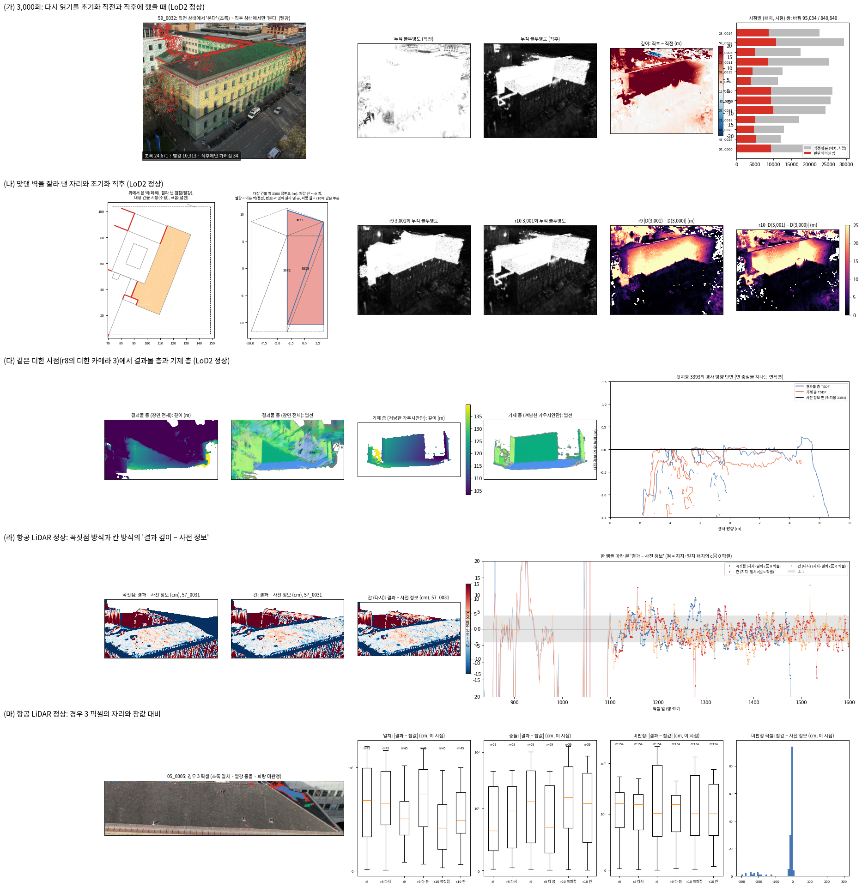

<!-- PHD-STAGE2-R10-TWO-FIXES-THREE-CHECKS-v1 -->
# r9 검토로 정한 두 가지를 넣고 세 가지를 확인하기 (r10)

> 작업 PHD-STAGE2-R10-TWO-FIXES-THREE-CHECKS-v1 (2026-10-02). r9(PHD-STAGE2-R9-THREE-FIXES-v1)의 다음 판이다. 방법의 효과는 주장하지 않는다. 기준선 비교와 여러 건물 평가는 하지 않았다. `scientific_verdict: null`.
> **설계 문서**: 발주문 부록(방법론 설명 문서 10월 2일 r9 반영본 발췌, 본문 rev 854). 발주문 본문과 부록이 다른 곳은 찾지 못했다.
> **출발점**: r9의 코드와 산출이다. r9 payload는 읽기 전용으로 붙였다. 새 폴더 `scripts/phd/stage2_r10_two_fixes_three_checks_v1/`, payload `PHD-STAGE2-R10-TWO-FIXES-THREE-CHECKS-v1/`에서 고쳤다.
> - 공용 모듈 v3는 그대로 두었다. 바꿀 파일 둘(faces.py, locations.py)만 v4로 복사해 고쳤다.
> - 포크 r10은 r9에서 `jbgs_judgment.py` 하나만 바꿨고, 계속 v3를 읽는다. 바뀐 v4 함수는 포크가 쓰지 않는다.
>
> **장면**: r9와 같다. B0(대상 건물 DEBY_LOD2_4959323), 학습 시점 13장, 시험 시점 2장이다.
> - 설정 넷: LoD2 정상, LoD2 주지붕 +1 m, 항공 LiDAR 정상, 항공 LiDAR 주지붕 +1 m
>
> **학습 일정과 고정 값**: r9와 같다.
> - 일정: 3,500회, 시드 0, 1600 × 1157, 기반 설정
> - 고정 값: 다수의 기준 2/3, 최소량 5곳, 최대 거리 1 m, 패치 0.25 m, 다시 읽기 500회, 보호 문턱 0.5, 학습률 배율 0.01, 불투명도 하한 0.5, 절단 4τ, NMAD 배수 2.5, 걸러내기 3배
>
> **학습**: 발주문 4절의 아홉 번을 모두 돌렸다(모두 끝까지 감).
> - 같은 코드를 다시 돌린 두 학습(`M_N_rep`, `L_N_cell_rep`)이 흔들림의 기준이다.
> - `L_N_vertex`는 r9 L_N과 같은 코드다(기록만 더함). 그래서 r9 L_N과의 차이도 흔들림이다.
>
> **표기**: 표의 칸은 'r10 (r9)'이다. 글에서도 괄호 안 숫자는 r9 값이다.
> **정량과 정성**: 물음마다 수치 표와 그림을 함께 둔다. 그림은 요약 그림 한 장의 다섯 줄(가)–(마)다.

## 답 — 목적의 일곱 물음

**1. 코드가 고친 문서와 같은가. — 같다.**
- (가) 다시 읽기와 초기화의 차례는 r9 코드가 이미 문서대로다. 그래서 코드를 바꾸지 않고 대조표에 적었다(1절).
  - 다시 읽기는 반복의 맨 앞에 온다(`train.py:814-815`). 초기화는 같은 반복의 끝에서 그 다시 읽기가 정한 보호 대상을 읽는다(`train.py:1145-1146`).
- (나) LoD2 맞댄 벽의 겹친 부분을 첫째 단계와 둘째 단계에서 모두 뺐다.
  - 첫째 단계: 깊이 렌더링, 잔차, 허용 오차, 표면 번호, 표시, 패치
  - 둘째 단계: 점 뽑기, 심기
- 확인은 모두 통과했다(2절).
  - 단위 시험 45건
  - GPU 시험: r9의 8묶음을 r10 모듈로 다시, 그리고 새 묶음 넷
  - 초기화 실행 여섯과 그 오프라인 대조
  - 초기화 직전·직후 상태 파일의 직접 대조
- **바꾸지 않은 것**: 손실, gₚ, uᵢ, 고정 값, 밀도 제어, 다시 읽기의 계산, 잠금과 하한이 r9와 글자까지 같다(GPU 시험 B).
  - `train.py`, `gaussian_model.py`, 포크의 공용 모듈 v3도 r9와 바이트까지 같다.

**2. (가) r9 코드에서 한 반복 안의 차례는 어땠는가. 반대 차례였다면 보호가 얼마나 달라졌는가.**
- **차례**: 다시 읽기(보호 정함, 하한 즉시) → 렌더링·손실 → 갱신(잠금, 하한) → 판독 → 밀도 제어(복제·분할·제거) → 불투명도 초기화(그 보호를 면제)다(표 1-0).
- **반대 차례의 효과**: 같은 3,000회 상태를 초기화 직전과 직후에 오프라인으로 다시 읽었다(4-1절, 그림 (가)).
  - LoD2 정상: 보호가 35,749에서 27,122로 줄었다. 8,977개가 풀리고 350개가 새로 보호됐다.
  - 가우시안 신뢰도가 0.5를 넘나든 것은 17,012개이고, 그 가운데 16,235개가 위로 넘었다.
  - (패치, 시점) 쌍 840,840 가운데 95,034쌍(11.3 %)의 가림 판단이 바뀌었다. 거의 모두(94,820쌍) '가려짐 → 보임'이다.
  - 항공 LiDAR 정상: 보호 71,860 → 54,474(17,805 풀림, 419 새로 보호), 신뢰도가 넘나든 것 46,020개, (패치, 시점) 쌍의 22.1 %가 바뀌었다.
- **정성**: 초기화 직후에는 앞면이 투명해져, 앞면 뒤에 있는 면의 패치까지 '본다'고 판단된다(그림 (가)의 빨강 점).

**3. (나) 맞댄 벽이 두 단계에서 모두 빠졌는가. 그 밖의 결과가 r9와 같은가. — 빠졌다. 그 밖은 거의 같지만, 틈으로 보이던 자리가 있었다.**
- **뺀 것**: 전체 LoD2에서 423쌍, 723면(146면은 통째로)을 잘랐다. 크롭 안은 26면이고 4면이 통째로 빠졌다.
  - 대상 건물: 3388, 3390, 3392, 3395, 3397의 5면, 607 m²
  - 크롭 안 패치 38,964곳(비가시 38,835)
  - 표본 점 22,304개(대상 건물 5,613)
  - 처음 보호: 57,757에서 35,947이 됐다.
- **두 단계 모두에서 빠졌다.**
  - 초기화 실행: 잘린 부분에 심긴 점이 0이다.
  - 끝(3,500회): 처음 원판이 잘린 부분 위였던 가우시안이 0 (21,148)이다.
- **그 밖은 r9와 같다.**
  - 대응하는 패치 152,398곳 가운데 152,362곳이 r9와 상태·표가 같다.
  - 허용 오차는 10⁻⁷ m 단위로만 바뀌었다.
  - 네 경우의 값은 흔들림 안에서 r9와 같다(6절).
- **어긋난 곳**: 이웃 건물 벽 3873과 대상 건물 벽 3388 사이에는 5–6 cm 틈이 있다.
  - 비스듬한 광선이 이 틈으로 들어가 겹친 부분을 보고 있었다. 4,666 사전 정보 픽셀(원해상도)이고, 4,575개가 3873 위다.
  - 잘라 낸 뒤 그 광선은 이웃 건물 안쪽의 먼 벽(중앙값 17 m 뒤)을 보거나 사전 정보가 없어졌다.
  - 그 결과 패치 36곳의 상태나 표가 바뀌었다. 예: 이웃 건물 안쪽 면 3380이 비가시에서 지지·충돌로 바뀌었다.
  - 문서는 겹친 부분을 '어느 시점에서도 보이지 않는' 면으로 보았다. 이 장면의 틈에서는 그 전제가 맞지 않았다(9절 제안 (가)).
- **초기화 직후의 깊이 흔들림은 남는다**(표 나-7, 나-8).
  - 3,001회에 대상 건물 픽셀의 68.0 % (69.8 %)가 1 m 넘게 바뀌었다.
  - 맞댄 벽 층에 떨어진 픽셀은 0.7 % (1.1 %)뿐이다. 대부분(84.5 %)은 투명해진 층들 '사이'다.

**4. (다) 두 층의 값은 각각 얼마이고, 학습마다 얼마나 흔들리는가. 결과물 층에서 겨냥한 면을 가리는 것은 무엇인가.**
- **기제 층**(겨냥한 가우시안만, 더한 시점)이 0.25 m 안에 담는 비율
  - LoD2 정상과 다시: 92.8 %, 92.5 %
  - LoD2 깊이 항 끔과 +1 m: 92.5 %, 95.4 %
  - 항공 LiDAR: 99.2–99.5 %
  - 같은 코드 두 번의 차이는 0.3 %포인트(LoD2)와 0.2 %포인트(항공 LiDAR)다. 상속은 일어났다.
- **결과물 층**(장면 전체, r9 방식)
  - LoD2 정상과 다시: 76.0 %, 86.8 %. 같은 코드에서 10.8 %포인트 흔들렸다.
  - 흔들림은 r8·r9 때처럼 뒷벽 3405에서 난다. 결과물 층 57.1 % 대 96.6 %, 기제 층은 100.0 % 대 99.9 %다.
  - 항공 LiDAR는 91.6–95.0 %다.
- **가리는 것**(LoD2 정상, 더한 시점 16대): 시점 안 (겨냥, 시점) 쌍의 88.9 %가 가려진다. 그 가운데 각 묶음을 빼면 보이게 되는 비율은 다음과 같다.
  - 관측 출신 27.6 %, 크기 1 m 초과 10.7 %
  - 다른 건물 사전 정보 1.3 %, 보호됨 1.1 %
  - 겨냥 밖 전부를 빼도 40.3 %는 가려진 채 남는다. 다른 겨냥 가우시안, 곧 그 시점에서 본 건물의 반대편 면이 가리는 것이다.
- **메시 면 → 사전 정보 면**(중앙값)
  - 결과물 층: LoD2 8.6–11.6 cm, 항공 LiDAR 4.4–6.2 cm
  - 기제 층: LoD2 12.9–13.7 cm, 항공 LiDAR 14.4–18.9 cm로 더 멀다.
  - 사전 정보 면과 나란하지 않은 꼭짓점(TSDF의 가장자리 치마)이 두 층 모두에서 멀다. 결과물 층 10–16 cm, 기제 층 18–28 cm다(표 다-1b).
  - 나란한 꼭짓점만 보면 결과물 층 3–7 cm, 기제 층 4–8 cm다. 기제 층이 조금 더 먼 까닭은 확인하지 못했다.

**5. (라) 두 방식의 처음 방향은 얼마나 다르며, 학습 결과가 흔들림 밖으로 다른가. — 칸 방식이 지지·일치 패치의 cₚ 0 픽셀을 r8 수준으로 되돌렸다.**
- **처음 방향의 차이**(항공 LiDAR 정상, 패치 위 점 46,986개): 두 법선이 이루는 각은 중앙값 3.7°, 95 % 17.2°, 최대 85.8°다.
  - 지지·일치 3.5°·13.5°, 지지·충돌 4.1°·21.9°, 결측 3.7°·22.8°, 비가시 3.5°·16.2°
  - 5°를 넘는 점이 31.6–41.0 %다. 패치가 없는 점 72,498개는 두 방식이 같다.
- **지지·일치 패치의 cₚ 0 픽셀이 사전 정보에서 τ 안인 비율**: 흔들림 밖으로 다르다.
  - 꼭짓점: r9 49.6 %, r10 43.1 %
  - 칸: 63.7 %, 다시 62.6 %
  - 참고: r8 63.5 %, r8 다시 60.5 %, r9 다 끔 60.4 %
  - 참값 τ 안도 꼭짓점 35.8 %·31.4 %, 칸 53.5 %·52.7 %, r8 54.1 %다.
- **다의 이득은 칸 방식에서도 남는다.**
  - 경우 3 일치: 칸 79.9 %·80.4 % (꼭짓점 r9 82.0 %, r10 72.9 %)
  - 경우 3 미판정: 칸 52.6 %·53.4 % (꼭짓점 51.0 %·52.5 %)
  - 경우 1·2·4는 두 방식이 같다(표 라-1).
- 정성은 그림 (라)다. 같은 시점·같은 행에서 칸 방식의 점들이 τ 띠 안에 더 모인다.

**6. (마) r9 항공 LiDAR 정상 경우 3의 참값 대비 악화는 흔들림인가, 처음 방향 고침의 몫인가. — 흔들림이 아니다. 꼭짓점 방식 처음 방향의 몫이다.**
- **결과 − 참값의 크기 중앙값**(미판정 / 충돌)
  - 같은 코드 두 번(r8, r8 다시): 15.4 / 93.8 cm, 15.3 / 57.7 cm
  - 칸 방식 두 번: 16.2 / 84.0 cm, 13.8 / 73.5 cm
  - 다 끔: 14.6 / 93.1 cm
  - 꼭짓점 방식 두 번(r9, r10): 73.8 / 232.4 cm, 59.3 / 622.3 cm. 두 번 모두 나쁘다.
- **주의할 점**
  - 참값이 있는 픽셀은 경우 3의 8 %뿐이다. 일치 70, 충돌 299, 미판정 508픽셀이고, 몇 시점의 지붕 끝에 몰린다(그림 (마)).
  - 참값 τ 안 비율은 처음 방향을 넣은 두 방식이 모두 r8보다 낮다. 미판정에서 꼭짓점 6.9·7.9 %, 칸 8.3·11.0 %, r8 17.9·16.1 %다.
  - 이 픽셀에서 사전 정보 자체가 참값과 중앙값 10.2 cm 떨어져 있다(τ 안 18.1 %). 사전 정보를 더 따르면 이 비율이 내려갈 수 있다.
- LoD2 정상의 같은 열은 모든 학습에서 비슷하다. 미판정 8.8–12.5 cm다.

**7. 본 실험 발주 판단에 쓸 사실.** 판단은 검토자가 한다.
- (가) 차례는 이미 문서대로다. 반대 차례였다면 3,000회에 LoD2 보호의 25 %, 항공 LiDAR 보호의 25 %가 풀렸을 것이다.
- (나) 맞댄 벽 자르기는 작동한다. 다만 두 건물 벽 사이 수 cm 틈으로 보이던 겹친 부분(이 장면 4,666픽셀, 지지 패치 126곳)까지 잘라, 그 광선이 건물 안쪽을 보게 된다.
- (다) 상속이 일어났는가는 기제 층이 안정적으로 답한다(같은 코드 두 번에 0.2–0.3 %포인트). 결과물 층은 관측 출신과 큰 가우시안 때문에 10 %포인트 넘게 흔들린다.
- (라) 칸 방식은 다의 이득을 지키면서 꼭짓점 방식의 두 손실(지지·일치 cₚ 0 픽셀, 경우 3 참값)을 없앴다. 부록 4.3의 '그 면'을 정할 근거다.
- 그 밖에 관찰한 것
  - 초기화 직후 깊이 흔들림은 차례와 맞댄 벽과 무관하게 남는다.
  - `L_B_vertex` 한 학습에서 두 시점(0031, 0032)에 32–38 m 앞의 떠 있는 층이 생겼다. 경우 3 일치 1,067픽셀 가운데 973픽셀이다. 같은 코드의 r9 L_B와 칸 방식에는 없었다. 같은 코드에서도 학습마다 생기는 일이다(6절 표 3).



- **그림 읽는 법**
  - **(가)** LoD2 정상, 3,000회, 대표 시점 0032(가림 판단이 가장 많이 바뀐 학습 시점)다.
    - 왼쪽: 사진 위에 패치 중심을 찍었다. 초록은 초기화 직전 상태에서 이 시점이 '본다'고 판단한 패치, 빨강은 직후 상태에서만 '본다'고 판단한 패치다.
    - 빨강은 건물 윤곽 안에 겹쳐 찍힌다. 이 시점에서 앞면 뒤에 있는 면(반대편 벽, 지붕 너머)의 패치다. 앞면이 투명해져 뒤가 보인다고 판단한 것이다.
    - 가운데 두 장: 누적 불투명도. 직전은 거의 흰색(1)이고, 직후는 건물이 회색·검정으로 투명해진다.
    - 오른쪽: 직후 − 직전 깊이(빨강 = 직후가 더 멀다). 맨 오른쪽 막대는 시점별로 '본다' 판단이 바뀐 (패치, 시점) 쌍이다.
  - **(나)** 왼쪽 첫 장은 위에서 본 크롭이다. 회색 선이 r9 벽, 빨강이 잘라 낸 겹침, 주황이 대상 건물 지붕이다.
    - 둘째 장은 대상 건물 벽 3388의 정면도다. 파랑 선이 r9의 벽이고, 빨강은 이웃 벽(점선, 번호 3853·3873·3832)과 겹쳐 잘라 낸 곳이다.
    - 3388은 거의 전부 겹쳤다. 위쪽 삼각형(3873과 겹친 곳)이 틈으로 보이던 자리다.
    - 나머지 넷: 3,001회의 누적 불투명도와 \|D(3,001) − D(3,000)\|다(r9, r10). 이 시점에서는 두 학습이 비슷하다(누적 불투명도 0.5 미만 42.7 % 대 40.4 %, 1 m 넘게 바뀐 픽셀 72.6 % 대 75.5 %). 13시점 전체로는 r10의 누적 불투명도 중앙값이 더 낮다(표 나-7).
  - **(다)** r8의 더한 카메라 3이다. 앞 두 장은 결과물 층(장면 전체)의 깊이와 법선, 뒤 두 장은 기제 층(겨냥한 가우시안만)이다.
    - 결과물 층에서는 뒷벽 앞을 큰 가우시안 덩어리(법선의 얼룩)가 가린다. 기제 층은 뒷벽과 지붕이 면마다 한 색이다.
    - 오른쪽 단면은 뒷지붕 3393의 경사 방향 단면이다. 파랑이 결과물 층, 주황이 기제 층 TSDF, 검정이 사전 정보 면이다. 두 층 모두 면 근처를 지나지만 세로로 내려가는 조각이 있다.
  - **(라)** 항공 LiDAR 정상, 지지·일치 cₚ 0 픽셀이 가장 많은 시점 0031이다. 지도는 '결과 − 사전 정보'(cm, 빨강 = 결과가 더 멀다)다.
    - 오른쪽은 그 픽셀이 가장 많은 행(452)을 따라 본 값이다. 점이 지지·일치 cₚ 0 픽셀이고, 회색 띠가 ±τ다.
    - 꼭짓점(파랑) 점이 띠 밖으로 더 퍼진다.
  - **(마)** 항공 LiDAR 정상, 경우 3 픽셀이 가장 많은 시점 0005다. 경우 3 픽셀은 이웃 건물과 맞닿은 지붕 끝에 몰린다(초록 일치, 빨강 충돌, 파랑 미판정).
    - 상자 그림은 이 시점에서 참값이 있는 픽셀의 \|결과 − 참값\|다. 미판정에서 r9와 r10 꼭짓점의 위쪽 꼬리가 길다.
    - 맨 오른쪽은 미판정 픽셀의 '참값 − 사전 정보'다. 대부분 0 근처이고 일부는 −1 ~ −3 m(참값이 더 낮음)다.

## 1. 구현 대조표

- **줄 번호 표기**
  - `T` = 포크 r10의 `train.py`(r9와 바이트까지 같다)
  - `J10` = `scripts/phd/stage2_r10_two_fixes_three_checks_v1/jbgs_judgment.py`(포크의 같은 파일과 sha256 동일)
  - `M4` = `src/phd/prior_propagation_v4/`
  - `S10` = `scripts/phd/stage2_r10_two_fixes_three_checks_v1/`

### 표 1-0. (가) r9 코드에서 한 반복 안의 차례 (r10도 같음)

| 차례 | 하는 일 | 코드 위치 | 비고 |
|---|---|---|---|
| 1 | 학습률 갱신 | `T:813` | – |
| 2 | **다시 읽기**: 1회와 500의 배수에서 가우시안 쪽 판정을 다시 읽어 보호를 정하고, 보호 대상에 불투명도 하한을 바로 건다 | `T:814-815` → `J10:1188 update_E_r8`, 보호 `J10:1236 set_frozen_mask`, 하한 `J10:1237 floor_now` | 반복의 맨 앞이다. 렌더링·갱신 전에 학습 중인 장면을 13시점으로 렌더링한다 |
| 3 | 렌더링, 손실, 역전파 | `T:835-1020` | – |
| 4 | **갱신**: 보호된 행 기억 → Adam → 보호된 행은 갱신의 0.01만 남기고 불투명도 하한 | `T:1023 before_step`, `T:1024 optimizer.step`, `T:1026 after_step`(`J10:1386`) | 기반의 완성 하한(`T:1029`)은 꺼져 있다(completed_mask 없음) |
| 5 | 판독과 덤프 | `T:1091 readout` | r9의 3,000회 덤프는 여기서 저장됐다 |
| 6 | **밀도 제어**: 통계 → 100회마다 복제·분할·제거 | `T:1117`, `T:1121 densify_and_prune` | 보호된 행은 복제·분할·제거에서 빠진다. 새 자식은 보호 아님 |
| 7 | **불투명도 초기화**: 3,000회마다, 보호 대상(`exempt_mask`)을 빼고 불투명도를 0.01 이하로 | `T:1145-1146 reset_opacity(exempt_mask=judgment.exempt_mask(...))`, `J10:1400 exempt_mask` = 2에서 정한 보호 | 같은 반복의 2가 정한 보호를 읽는다 |

- **같음**: 문서(부록 4.2·4.6)의 '다시 읽기를 먼저, 초기화는 막 정한 보호 대상을 읽음'과 같다.
  - r6부터 이 차례로 짜여 있었다(`due_E_iteration`의 설명: "an E computed at a multiple of the opacity-reset interval sees the scene before that iteration's reset").
- **코드는 바꾸지 않았다.**
- **확인**
  - GPU 시험 C1: `train.py` 안에서 다시 읽기 < 갱신 < 밀도 제어 < 초기화 순이다.
  - GPU 시험 C2: 같은 반복의 다시 읽기가 정한 보호 행은 불투명도를 지키고, 나머지는 0.01 이하가 된다.
  - 저장 상태 대조(표 가-3): 실제 학습에서 초기화가 읽은 면제 대상이 그 반복 다시 읽기의 보호와 같다(LoD2 정상 35,663, 항공 LiDAR 정상 71,468).

### 표 1-1. 두 고침과 세 확인

| 항목 | 문서 (부록) / 발주문 | 코드 위치 | 같음 / 다름 | 비고 |
|---|---|---|---|---|
| (가) 기록 | 3,000회의 초기화 직전·직후 상태 덤프 | `J10:679 _wrap_reset`(초기화 함수를 감싸 앞뒤에 `J10:700 _dump_state`), 인자 `--jbgs_reset_dump_iterations` | 기록만 | 초기화 자체는 기반 함수를 같은 인자로 부른다. 결과가 감싸지 않은 초기화와 비트까지 같다(GPU 시험 C2) |
| (가) 오프라인 다시 읽기 | 두 상태에서 r9와 같은 다시 읽기 함수를 돌려 셈 | `J10:729 reset_probe`(`--jbgs_dry_init 3`): 학습과 같은 명령으로 포크를 초기화하고, 저장 상태를 넣어(`J10:719 _load_state`) `update_E_r8`을 부른다 | 같음 | (패치, 시점) 가림 판단 = `seat.reread_E`를 그 시점 하나로 부른 값. 패치 없는 가우시안은 `seat.centre_E` |
| (나) 맞댄 벽 | LoD2에서 서로 다른 두 건물의 벽면이 같은 자리에서 마주 보며 겹친 부분. 두 평면 거리 0.1 m 안, 바깥 법선 코사인 −0.9 이하. 두 벽면을 공통 평면에 투영해 교집합을 잘라 냄(겹친 부분만). 첫째·둘째 단계 모두 | 판별·자르기 `M4/faces.py party_wall_overlaps`, `cut_triangles`, `ear_clip`; 메시 `S10/meshes_r10.py`; 렌더링 `S10/render_r10.py`; 첫째 단계 `S10/stage1_products_r10.py`(v4 `locations.build_plane_store`의 격자 원점 `o`); 둘째 단계 입력 `S10/prepare_r10_inputs.py` | 같음 (공통 평면과 0.1 m의 적용은 정함) | 8절 ①–⑦. 항공 LiDAR는 바꾸지 않았다 |
| (나) 표본과 깊이 | 표본은 r9 표본에서 잘라 낸 부분 위의 점만 뺌. 깊이는 r9 깊이에서 잘라 낸 부분에 닿은 광선만 바꿈 | `S10/prepare_r10_inputs.py`(가장 가까운 r9 삼각형이 잘라 바뀐 것이고 r10 메시가 더 먼 점), `S10/render_r10.py`(r9 광선이 바뀐 삼각형을 맞혔고 r10 광선이 같은 다각형의 조각을 같은 깊이로 맞히지 않음) | 같음 | 표 나-5: 바뀐 광선 밖에서 바뀐 픽셀 0 |
| (다) 기제 층 | 겨냥한 가우시안만 남기고 더한 시점에서 렌더링한 깊이로 TSDF | `S10/mesh_r10.py`(겨냥한 것만의 부분 모형 → 더한 시점 16대 → TSDF) | 같음 | 학습 시점은 넣지 않았다(8절 ⑪) |
| (다) 결과물 층 | r9처럼 장면 전체로 렌더링한 깊이로 TSDF | `S10/mesh_r10.py`(r9의 `mesh_r9.py`와 같은 방법) | 같음 | 0.10 m 칸, 절단 0.5 m, 같은 크롭 상자, 같은 겨냥 규칙 |
| (다) 가림 | 더한 시점마다 겨냥한 가우시안을 가리는 가우시안을 출처와 크기로 나눠 셈 | `S10/occluders_r10.py`(묶음을 빼고 다시 렌더링해 보이게 되는 비율, 1σ 화면 반경 안의 가리는 가우시안 수) | 정함 | 8절 ⑫ |
| (라) 칸 방식 | 패치 위의 점은 처음 앉은 칸의 면 법선(t1 × t2, uᵢ를 잴 때 쓰는 면)으로 시작. 패치 없는 점은 꼭짓점 방식. 부호(위로)·면 안의 각·크기·불투명도·색은 r9와 같음 | `J10:927 orient_prior(cell=(has, loc))`, `--jbgs_prior_normal_mode cell`. 칸 법선 = `prop_init`의 `unit_normal`(uᵢ의 면과 같은 배열) | 같음 | `prop_init`에서 방향 정하기를 자리 찾기 뒤로 옮겼다(`J10:867`). 자리와 방향은 서로 기대지 않아 파일 방식(r9)의 회전이 비트까지 같다(GPU 시험 D) |
| (마) | 이미 있는 학습의 경우 3 참값 열을 r9와 같은 정의로 다시 잼 | `S10/cases_r10.py`(부분 `ma`) | 같음 | 참값 정의: 8절 ⑭ |

### 표 1-2. 바꾸지 않은 것

| 항목 | 확인 |
|---|---|
| `train.py`, `scene/gaussian_model.py`, 포크의 `src/phd/prior_propagation_v3/` | r9와 바이트까지 같다(GPU 시험 B, 빌드 보고서: 바뀐 파일은 `jbgs_judgment.py` 하나). |
| 손실, gₚ, uᵢ, 잠금, 하한, 다시 읽기의 계산 | `Judgment`의 함수 가운데 `__init__`, `prop_init`, `orient_prior`와 새 함수 넷을 뺀 모두가 r9와 글자까지 같다(`update_E_r8`, `losses`, `_g_init`, `u_offsets`, `seat_now`, `sampled_E`, `before_step`, `after_step`, `floor_now`, `exempt_mask`, `due_E` …). 모듈 함수(`rho_truncated`, `truncated_prior_loss`, `weighted_l1`, `compute_E_render`, `due_E_iteration` …)도 같다(GPU 시험 B). `prop_init`은 방향 정하기의 자리와 기록만 다르다. |
| 고정 값 | `configs/phd/stage2_r10_two_fixes_three_checks_v1/r10.json`의 `values`가 r9와 같다. |
| 항공 LiDAR의 첫째 단계와 입력 | r10 학습이 r9 payload의 산출(저장 표, 패치·표시 지도, τ 지도, 자리, 법선 파일)을 그대로 읽는다. 허용 오차를 다시 계산해도 r9와 같다(표 가). |
| r8, r9의 코드와 산출 | 손대지 않았다(읽기 전용 마운트). |

## 2. 시험과 대조

| 시험 | 내용 | 결과 |
|---|---|---|
| 공용 모듈 단위 시험 | `tests/phd/test_prior_propagation_v4.py` 45건 = v3 시험 34건(v2의 24건 포함)을 v4에 다시 + 새 11건 | 45건 통과 |
| | 맞댄 벽 잘라 내기(발주문의 넷): 완전히 겹친 두 벽은 둘 다 사라짐, 0.2 m 떨어진 벽은 그대로(삼각형도 같음), 낮은 이웃 위로 드러난 윗부분은 남음(64 m² 중 64 m², 감김 유지), 법선이 같은 쪽인 벽은 그대로 | |
| | 그 밖: 같은 건물끼리는 자르지 않음, 두 평면이 기울어 엇갈리면 0.1 m 띠까지만 자름, 양옆 이웃 둘, 귀 자르기(L자, 일직선 꼭짓점), 격자 원점을 주면 남은 칸이 r9 칸과 같음, v4와 v3가 faces.py·locations.py만 다름 | |
| GPU 시험 | `S10/gpu_tests_r10.py`, 실제 가우시안 모델 | 통과 |
| | A: r9의 GPU 시험 8묶음을 r10 모듈로 다시(판정 버전 단언만 바꿈) | |
| | B: r9와 글자까지 같아야 할 함수(위 1-2), `train.py`, `gaussian_model.py`, 공용 모듈 v3 | |
| | C1: `train.py`의 차례(다시 읽기 < 갱신 < 밀도 제어 < 초기화). C2: 겹친 반복에서 초기화가 막 정한 보호 대상을 읽음, 감싼 초기화의 결과가 기반 초기화와 비트까지 같음, 저장한 상태가 비트까지 다시 실림 | |
| | D: 칸 방식(칸 있는 패치 위 점 = 칸 법선, 부호는 파일 법선 쪽; 칸 없는 패치·패치 없는 점 = 파일 법선; 관측 출신은 그대로), 파일 방식은 r9와 회전이 비트까지 같음 | |
| 초기화 실행 | 여섯(LoD2 정상, LoD2 +1 m, 항공 LiDAR 정상·+1 m를 꼭짓점과 칸으로) | 모두 통과 |
| 오프라인 대조 | `S10/verify_dry_r10.py` | 모두 통과 |
| | r9의 대조 그대로: 전파·패치의 판정·미판정 이유가 numpy와 같음, 자리 100 %, 충돌 위 심은 점 0, 그 밖에 심지 않은 점 0, 비가시 점의 첫 c̄ᵢ 0, 첫 보호 수 같음, gₚ가 모든 학습 픽셀에서 같음, 다시 읽기 시험 | |
| | (라): 칸 방식의 처음 법선이 numpy로 찾은 칸의 t1 × t2와 최대 2.4 × 10⁻⁶° 안. 파일 방식은 꼭짓점 법선과 0.0° | |
| | (나): 심은 사전 정보 점이 모두 r10 메시에서 0.9 cm 안, 잘린 부분 위의 점 0, 통째로 잘린 다각형에 앉은 점 0, 저장 표에 통째로 잘린 다각형 0 | 크롭 밖 이웃 벽 3802에 1.1 × 10⁻⁸ m² 조각이 메시와 표면 표에 남았다. 패치·픽셀은 없다(8절 ④) |
| 입력 대조 | `render_check.json`: r9 메시를 다시 렌더링하면 r9 사전 정보 깊이가 재현된다. 한 시점(0010)의 동률 픽셀 하나만 1.5 × 10⁻⁵ m 다르다(float32 끝자리). 크롭 가장자리 7픽셀의 유한·무한이 다르다(r9와 같은 까닭) | 같음 |
| | r10 깊이는 잘린 광선 밖에서 바뀐 픽셀이 0이다(표 나-5) | |
| | `prepare_M_*.json`: 남은 점의 자리 다각형과 법선이 r9와 같다(LoD2 정상 2점, +1 m 1점만 다름: 잘린 모서리의 점이 이웃 면으로 감) | |
| 학습 | 아홉 번 3,500회 | 모두 끝까지 갔다(영수증 PASS) |
| 초기화 상태 대조 | `S10/reset_states_check.py`: LoD2 정상과 항공 LiDAR 정상 꼭짓점의 3,000회 두 상태 | 통과(표 가-3) |

## 3. 사전 측정 (학습 없음) — r9 대비

- **r9 값**: r9의 첫째 단계 산출과 초기화 실행(`runs/dry_<설정>`)이다.
- **바뀔 것으로 본 곳**(발주문 5절): LoD2의 맞댄 벽 행이다. 실제로 바뀐 곳도 LoD2뿐이다. 항공 LiDAR는 모든 표에서 r9와 같다.
- **전체 수치**: payload `premeasure_v5/tables.json`

### 표 가. 허용 오차 (칸 = r10 (r9))

| 사전 정보 | 면 | 표본 수 | 허용 오차 τ | r9 대비 |
|---|---|---|---|---|
| LoD2 | 지붕 | 35,312,896 (35,312,894) | 0.056771 m (0.056771 m) | +3.2e-10 m |
| LoD2 | 벽 | 67,634,953 (67,635,017) | 0.194530 m (0.194530 m) | -1.9e-07 m |
| 항공 LiDAR | 지붕 | 32,743,538 (32,743,538) | 0.039448 m (0.039448 m) | +0.0e+00 m |
| 항공 LiDAR | 벽 | 0 (0) | 0.039448 m (0.039448 m) | +0.0e+00 m |

### 표 나. 잘린 벽 다각형의 패치와 설정 전체 (수 / 넓이 m²; 칸 = r10 (r9))

| 설정 | 묶음 | 패치 | 지지 · 일치 | 지지 · 충돌 | 결측 | 비가시 |
|---|---|---|---|---|---|---|
| LoD2 정상 | 대상 건물의 잘린 벽 5면 | 1,986 / 124.1 (11,783 / 736.4) | 33 / 2.1 (39 / 2.4) | 85 / 5.3 (112 / 7.0) | 0 / 0.0 (0 / 0.0) | 1,868 / 116.7 (11,632 / 727.0) |
| LoD2 정상 | 크롭 안 잘린 벽 26면 (r10에 남은 22면) | 18,180 / 1,136.2 (57,142 / 3,571.4) | 8,741 / 546.3 (8,762 / 547.6) | 4,691 / 293.2 (4,794 / 299.6) | 960 / 60.0 (963 / 60.2) | 3,788 / 236.7 (42,623 / 2,663.9) |
| LoD2 정상 | 설정 전체 | 152,400 / 9,524.9 (191,362 / 11,960.1) | 34,265 / 2,141.6 (34,299 / 2,143.7) | 42,705 / 2,669.1 (42,780 / 2,673.8) | 5,691 / 355.7 (5,700 / 356.2) | 69,739 / 4,358.6 (108,583 / 6,786.4) |
| LoD2 주지붕 +1 m | 대상 건물의 잘린 벽 5면 | 1,986 / 124.1 (11,783 / 736.4) | 33 / 2.1 (39 / 2.4) | 80 / 5.0 (94 / 5.9) | 0 / 0.0 (0 / 0.0) | 1,873 / 117.0 (11,650 / 728.1) |
| LoD2 주지붕 +1 m | 크롭 안 잘린 벽 26면 (r10에 남은 22면) | 18,180 / 1,136.2 (57,142 / 3,571.4) | 8,577 / 536.1 (8,597 / 537.3) | 4,492 / 280.8 (4,573 / 285.8) | 767 / 47.9 (769 / 48.1) | 4,344 / 271.4 (43,203 / 2,700.2) |
| LoD2 주지붕 +1 m | 설정 전체 | 154,685 / 9,667.7 (193,647 / 12,102.9) | 24,529 / 1,533.1 (24,558 / 1,534.9) | 49,530 / 3,095.6 (49,548 / 3,096.7) | 5,506 / 344.1 (5,508 / 344.2) | 75,120 / 4,694.9 (114,033 / 7,127.1) |

**표 나-2. r9 → r10 패치 대응 (같은 표면, 같은 칸 중심)**

| 설정 | r9 패치 | r10 패치 | 대응 | 상태·표 같음 | 상태나 표가 바뀜 | r9에만 (잘림): 비가시 · 지지 · 결측 | r10에만 |
|---|---|---|---|---|---|---|---|
| LoD2 정상 | 191,362 | 152,400 | 152,398 | 152,362 | 36 | 38,964: 38,835 · 126 · 3 | 2 |
| LoD2 주지붕 +1 m | 193,647 | 154,685 | 154,683 | 154,611 | 72 | 38,964: 38,858 · 104 · 2 | 2 |

**표 나-3. r9의 칸 단위 판별(패치 중심이 다른 건물 벽에서 0.1 m 안, 법선 반대)과 r10의 다각형 잘라 내기**

| 설정 | r9 벽 패치 | r9 판별 맞댄 칸 | r10 잘린 칸 | 둘 다 | r9만 맞댐 (r10은 남김): 비가시 · 지지 · 결측 | r10만 잘림 |
|---|---|---|---|---|---|---|
| LoD2 정상 | 143,465 | 39,199 | 38,964 | 38,964 | 235: 175 · 57 · 3 | 0 |
| LoD2 주지붕 +1 m | 145,750 | 39,199 | 38,964 | 38,964 | 235: 180 · 52 · 3 | 0 |

### 표 다. 사전 정보 픽셀과 깊이 항이 작용하는 픽셀 (칸 = r10 (r9))

| 설정 | 사전 정보 픽셀 (원해상도 15시점) | 잘린 광선 · 그 가운데 r9 사전 정보 픽셀 | 학습 해상도 사전 정보 픽셀 (13시점) | gₚ = 1 | gₚ = 0 |
|---|---|---|---|---|---|
| LoD2 정상 | 145,910,613 (145,913,811) | 4,970 · 4,666 | 10,239,213 (10,239,454) | 5,093,668 (5,094,558) | 5,145,545 (5,144,896) |
| LoD2 주지붕 +1 m | 147,359,706 (147,362,614) | 4,382 · 4,086 | 10,345,531 (10,345,755) | 3,028,151 (3,028,537) | 7,317,380 (7,317,218) |
| 항공 LiDAR 정상 | 같음 | – | 17,792,294 (17,792,294) | 7,049,211 (7,049,211) | 10,743,083 (10,743,083) |
| 항공 LiDAR 주지붕 +1 m | 같음 | – | 17,808,182 (17,808,182) | 4,902,064 (4,902,064) | 12,906,118 (12,906,118) |

### 표 라·마. 초기화 — 후보 점, 심은 점, 처음 보호 (첫 반복 직전; 칸 = r10 (r9))

| 설정 | 점이 속한 곳 | 후보 점 | 심음 | 처음 보호 | r9에서 r10이 뺀 점 (후보 · 처음 보호) |
|---|---|---|---|---|---|
| LoD2 정상 | 관측 출신 (SfM 점) | 72,028 (72,028) | 72,028 (72,028) | 0 (0) | 0 · 0 |
| LoD2 정상 | 사전 정보 · 지지 영역 | 38,460 (38,924) | 38,460 (38,924) | 0 (0) | 474 · 0 |
| LoD2 정상 |   그 가운데 표 충돌 | 20,552 (20,738) | 20,552 (20,738) | 0 (0) | 205 · 0 |
| LoD2 정상 | 사전 정보 · 결측 → 충돌 | 1,274 (1,304) | 0 (0) | 0 (0) | 30 · 0 |
| LoD2 정상 | 사전 정보 · 결측 → 일치 | 186 (197) | 186 (197) | 186 (197) | 5 · 5 |
| LoD2 정상 | 사전 정보 · 결측 → 혼재·근거 부족 | 888 (919) | 888 (919) | 888 (919) | 35 · 35 |
| LoD2 정상 | 사전 정보 · 비가시 영역 | 34,873 (56,641) | 34,873 (56,641) | 34,873 (56,641) | 21,760 · 21,760 |
| LoD2 정상 | 사전 정보 · 패치 없음 | 0 (0) | 0 (0) | 0 (0) | 0 · 0 |
| **LoD2 정상** | 합 | 147,709 (170,013) | 146,435 (168,709) | 35,947 (57,757) | – |
| LoD2 주지붕 +1 m | 관측 출신 (SfM 점) | 72,028 (72,028) | 72,028 (72,028) | 0 (0) | 0 · 0 |
| LoD2 주지붕 +1 m | 사전 정보 · 지지 영역 | 36,847 (37,221) | 36,847 (37,221) | 0 (0) | 419 · 0 |
| LoD2 주지붕 +1 m |   그 가운데 표 충돌 | 24,374 (24,505) | 24,374 (24,505) | 0 (0) | 177 · 0 |
| LoD2 주지붕 +1 m | 사전 정보 · 결측 → 충돌 | 1,174 (1,187) | 0 (0) | 0 (0) | 13 · 0 |
| LoD2 주지붕 +1 m | 사전 정보 · 결측 → 일치 | 256 (284) | 256 (284) | 256 (284) | 28 · 28 |
| LoD2 주지붕 +1 m | 사전 정보 · 결측 → 혼재·근거 부족 | 802 (834) | 802 (834) | 802 (834) | 32 · 32 |
| LoD2 주지붕 +1 m | 사전 정보 · 비가시 영역 | 37,581 (59,127) | 37,581 (59,127) | 37,581 (59,127) | 21,501 · 21,501 |
| LoD2 주지붕 +1 m | 사전 정보 · 패치 없음 | 0 (0) | 0 (0) | 0 (0) | 0 · 0 |
| **LoD2 주지붕 +1 m** | 합 | 148,688 (170,681) | 147,514 (169,494) | 38,639 (60,245) | – |
| 항공 LiDAR 정상 | 관측 출신 (SfM 점) | 72,028 (72,028) | 72,028 (72,028) | 0 (0) | – |
| 항공 LiDAR 정상 | 사전 정보 · 지지 영역 | 28,279 (28,279) | 28,279 (28,279) | 0 (0) | – |
| 항공 LiDAR 정상 |   그 가운데 표 충돌 | 13,358 (13,358) | 13,358 (13,358) | 0 (0) | – |
| 항공 LiDAR 정상 | 사전 정보 · 결측 → 충돌 | 849 (849) | 0 (0) | 0 (0) | – |
| 항공 LiDAR 정상 | 사전 정보 · 결측 → 일치 | 65 (65) | 65 (65) | 65 (65) | – |
| 항공 LiDAR 정상 | 사전 정보 · 결측 → 혼재·근거 부족 | 648 (648) | 648 (648) | 648 (648) | – |
| 항공 LiDAR 정상 | 사전 정보 · 비가시 영역 | 18,328 (18,328) | 18,328 (18,328) | 18,328 (18,328) | – |
| 항공 LiDAR 정상 | 사전 정보 · 패치 없음 | 72,164 (72,164) | 72,164 (72,164) | 35,354 (35,354) | – |
| **항공 LiDAR 정상** | 합 | 192,361 (192,361) | 191,512 (191,512) | 54,395 (54,395) | – |
| 항공 LiDAR 주지붕 +1 m | 관측 출신 (SfM 점) | 72,028 (72,028) | 72,028 (72,028) | 0 (0) | – |
| 항공 LiDAR 주지붕 +1 m | 사전 정보 · 지지 영역 | 25,402 (25,402) | 25,402 (25,402) | 0 (0) | – |
| 항공 LiDAR 주지붕 +1 m |   그 가운데 표 충돌 | 20,829 (20,829) | 20,829 (20,829) | 0 (0) | – |
| 항공 LiDAR 주지붕 +1 m | 사전 정보 · 결측 → 충돌 | 792 (792) | 0 (0) | 0 (0) | – |
| 항공 LiDAR 주지붕 +1 m | 사전 정보 · 결측 → 일치 | 113 (113) | 113 (113) | 113 (113) | – |
| 항공 LiDAR 주지붕 +1 m | 사전 정보 · 결측 → 혼재·근거 부족 | 851 (851) | 851 (851) | 851 (851) | – |
| 항공 LiDAR 주지붕 +1 m | 사전 정보 · 비가시 영역 | 21,004 (21,004) | 21,004 (21,004) | 21,004 (21,004) | – |
| 항공 LiDAR 주지붕 +1 m | 사전 정보 · 패치 없음 | 72,171 (72,171) | 72,171 (72,171) | 35,554 (35,554) | – |
| **항공 LiDAR 주지붕 +1 m** | 합 | 192,361 (192,361) | 191,569 (191,569) | 57,522 (57,522) | – |

### 표 라-0. 학습 전: 항공 LiDAR 패치 위 점의 두 처음 방향 (꼭짓점 법선과 칸 법선이 이루는 방향 없는 각)

| 설정 | 패치 상태 | 점 | 중앙값 | 95 % | 최대 | 5° 넘음 | 20° 넘음 |
|---|---|---|---|---|---|---|---|
| 항공 LiDAR 정상 | 지지 · 일치 | 14,845 | 3.5° | 13.5° | 60.3° | 31.6 % | 2.4 % |
| 항공 LiDAR 정상 | 지지 · 충돌 | 13,206 | 4.1° | 21.9° | 84.3° | 41.0 % | 5.9 % |
| 항공 LiDAR 정상 | 결측 | 701 | 3.7° | 22.8° | 68.1° | 35.9 % | 7.0 % |
| 항공 LiDAR 정상 | 비가시 | 18,234 | 3.5° | 16.2° | 85.8° | 32.6 % | 3.1 % |
| 항공 LiDAR 정상 | 패치 위 전체 | 46,986 | 3.7° | 17.2° | 85.8° | 34.7 % | 3.7 % |
| 항공 LiDAR 정상 | 패치 없음 (지면·가파른 삼각형) | 72,498 | 0° (두 방식이 같음) | | | | |
| 항공 LiDAR 주지붕 +1 m | 지지 · 일치 | 4,505 | 3.5° | 16.5° | 58.0° | 33.2 % | 3.5 % |
| 항공 LiDAR 주지붕 +1 m | 지지 · 충돌 | 20,683 | 3.7° | 16.5° | 69.5° | 35.4 % | 3.5 % |
| 항공 LiDAR 주지붕 +1 m | 결측 | 949 | 3.7° | 15.8° | 62.6° | 35.4 % | 3.6 % |
| 항공 LiDAR 주지붕 +1 m | 비가시 | 20,899 | 3.5° | 16.7° | 85.8° | 33.1 % | 3.5 % |
| 항공 LiDAR 주지붕 +1 m | 패치 위 전체 | 47,036 | 3.6° | 16.6° | 85.8° | 34.2 % | 3.5 % |
| 항공 LiDAR 주지붕 +1 m | 패치 없음 (지면·가파른 삼각형) | 72,505 | 0° (두 방식이 같음) | | | | |

**표에서 읽히는 것**
1. **허용 오차는 사실상 그대로다.** LoD2 지붕 표본 +2, 벽 표본 −64픽셀이다. τ는 10⁻⁷ m 아래로만 바뀌었다. 잘린 부분은 거의 보이지 않는 면이라, 허용 오차를 재는 cₚ = 1 픽셀이 그 위에 거의 없다.
2. **잘린 패치는 r9의 칸 판별 안에 모두 든다.**
   - r9가 맞댄 칸으로 센 39,199곳 가운데 38,964곳이 잘렸다. r10만 자른 칸은 0이다.
   - r9가 맞댔다고 셌는데 r10이 남긴 칸은 235곳(지지 57)이다. 이웃 벽 가장자리에서 0.1 m 안이지만 이웃 벽 다각형 밖인 칸, 곧 낮은 이웃 위로 드러난 윗부분의 아래 띠다.
3. **잘린 패치의 거의 모두는 비가시다**(38,835곳). 그러나 지지 126곳과 결측 3곳도 잘렸다. 이것이 틈으로 보이던 부분이다(4-2절).
4. **바뀐 패치 36곳**(LoD2 +1 m는 72곳)은 잘린 광선이 새로 보게 된 면의 패치다. 예: 이웃 건물 안쪽 면 3380의 비가시 → 지지·충돌, 이웃 벽 3832·3837·3839의 표가 바뀜.
   - 학습 해상도의 사전 정보 픽셀은 241개 줄었다.
   - gₚ = 1이 890 줄고 gₚ = 0이 649 늘었다.
5. **심는 점과 처음 보호**(LoD2 정상): 22,304점이 빠졌다(대상 건물 5,613). 그 가운데 21,760점이 비가시 패치, 474점이 지지 패치의 점이다. 처음 보호는 57,757 → 35,947이다(맞댄 벽 몫 21,800).
6. **(라) 학습 전의 두 처음 방향**
   - 패치 위 점의 절반에서 두 법선이 3.7° 넘게 다르고, 34.7 %에서 5° 넘게 다르다.
   - 지지·충돌과 결측의 95 %가 21.9°, 22.8°로 가장 크다. 경사가 꺾이는 곳(용마루, 지붕 끝)에 걸친 꼭짓점의 이웃 삼각형 평균이, 칸 아래 한 삼각형과 다르기 때문으로 보인다.
   - 패치 없는 점(지면·가파른 삼각형, 72,498점)은 두 방식이 같다.

## 4. 두 고침의 확인

### 4-1. (가) 다시 읽기와 불투명도 초기화의 차례

### 표 가-1. 3,000회: 같은 학습 상태를 두 차례로 다시 읽은 결과 (r9 다시 읽기 함수, 오프라인)

| 학습 | 상태 | 보호 | 새로 보호 | 풀림 (모두 c̄ᵢ ≥ 0.5) | c̄ᵢ < 0.5인 사전 정보 | 본 시점 없음 |
|---|---|---|---|---|---|---|
| LoD2 정상 | 학습 중 다시 읽기 (3,000회 시작, 실제 보호) | 35,663 | 304 | 251 | – | 39,925 |
| LoD2 정상 | 초기화 직전 상태를 다시 읽음 (문서의 차례) | 35,749 | 181 | 95 | 45,188 | 40,282 |
| LoD2 정상 | 초기화 직후 상태를 다시 읽음 (반대 차례) | 27,122 | 344 | 8,885 | 29,730 | 25,273 |
| 항공 LiDAR 정상, 꼭짓점 | 학습 중 다시 읽기 (3,000회 시작, 실제 보호) | 71,468 | 3,114 | 696 | – | 113,790 |
| 항공 LiDAR 정상, 꼭짓점 | 초기화 직전 상태를 다시 읽음 (문서의 차례) | 71,860 | 501 | 109 | 132,404 | 118,685 |
| 항공 LiDAR 정상, 꼭짓점 | 초기화 직후 상태를 다시 읽음 (반대 차례) | 54,474 | 484 | 17,478 | 90,078 | 51,646 |

**표 가-2. 두 차례의 차이**

| 학습 | 직후에만 보호 | 직전에만 보호 | c̄ᵢ가 0.5를 넘나듦 (오름 · 내림) | (패치, 시점) 쌍: 가림 판단이 바뀜 / 전체 | 가려짐 → 보임 · 보임 → 가려짐 | 패치 없는 (가우시안, 시점) 쌍: 바뀜 |
|---|---|---|---|---|---|---|
| LoD2 정상 | 350 | 8,977 | 17,012 (16,235 · 777) | 95,034 / 840,840 (11.3 %) | 94,820 · 214 | 0 / 0 |
| 항공 LiDAR 정상, 꼭짓점 | 419 | 17,805 | 46,020 (44,173 · 1,847) | 89,263 / 403,546 (22.1 %) | 88,792 · 471 | 211,719 / 2,064,296 |

**표 가-3. 저장한 두 상태의 직접 대조 (초기화가 읽은 면제 대상과 결과)**

| 학습 | 가우시안 | 면제 대상 = 그 반복 다시 읽기의 보호 | 면제 행 불투명도 그대로 | 나머지 행 = min(전, 0.01) (최대 차이) | 위치·회전·크기·색 같음 |
|---|---|---|---|---|---|
| M_N_3000 | 1,112,125 | True (35,663) | True | 1.0e-09 | True |
| L_N_vertex_3000 | 1,173,511 | True (71,468) | True | 1.0e-09 | True |

**표에서 읽히는 것**
1. **학습은 문서의 차례로 보호를 정했다**(표 가-3). 초기화가 읽은 면제 대상은 그 반복 시작의 다시 읽기가 정한 보호(35,663, 71,468)와 같다.
   - 면제된 행의 불투명도는 비트까지 그대로다(최소 0.5).
   - 나머지 행(107.6만, 110.2만)은 모두 min(전, 0.01)이 됐다.
2. **직전 상태를 다시 읽으면 실제 보호와 거의 같다.** LoD2 정상 35,749 대 35,663이다. 차이 86개는 다시 읽기 뒤에 있은 한 번의 갱신과 밀도 제어 몫이다.
3. **직후 상태를 다시 읽었다면 보호가 크게 줄었다.**
   - LoD2 정상 27,122(−8,627), 항공 LiDAR 정상 54,474(−17,386)다. 풀린 까닭은 모두 c̄ᵢ ≥ 0.5다.
   - 앞면이 투명해져(누적 불투명도 < 0.05) 가리던 표면이 사라지므로, 실제로는 가려진 패치를 시점들이 '본다'고 센다.
   - 가림 판단이 바뀐 (패치, 시점) 쌍의 99.8 %(항공 LiDAR 99.5 %)가 '가려짐 → 보임'이다.
   - 이렇게 풀린 가우시안은 다음 다시 읽기(3,500회)까지 500회 동안 잠금과 불투명도 하한 없이 학습된다.
4. **항공 LiDAR는 바뀐 몫이 더 크다**(쌍의 22.1 %, 패치 없는 가우시안의 쌍 10.3 %). 패치 없는 사전 정보 가우시안(지면·가파른 삼각형)의 보호가 가운데 렌더링으로 정해지기 때문이다.
5. **정성**(그림 (가)): 직후 상태에서만 '본다'고 판단된 패치(빨강)가 지붕 너머의 뒤쪽 면과 건물 반대편 벽에 몰린다. 직전 상태의 누적 불투명도는 거의 1이고, 직후에는 건물 전체가 투명해진다.

### 4-2. (나) 맞댄 벽을 사전 정보 표면에서 뺌

### 표 나-4. 잘라 낸 맞댄 벽 (전체 LoD2; 크롭 안은 표 나)

| 설정 | 벽 다각형 | 맞댄 쌍 | 잘린 다각형 (전부 잘림) | 대상 건물 면 | 겹친 넓이 | 잘라 낸 넓이 (두 벽) | 대상 건물에서 | 두 평면 거리 최대 | 코사인 최대 | 구멍 있는 조각 |
|---|---|---|---|---|---|---|---|---|---|---|
| LoD2 정상 | 2,964 | 423 | 723 (146) | 3388, 3390, 3392, 3395, 3397 | 29,927.6 m² | 59,814.7 m² | 607.3 m² | 0.099 m | -0.967 | 3 |
| LoD2 주지붕 +1 m | 2,964 | 423 | 723 (146) | 3388, 3390, 3392, 3395, 3397 | 29,927.6 m² | 59,814.7 m² | 607.3 m² | 0.099 m | -0.967 | 3 |

**표 나-5. 깊이: 잘린 부분에 닿은 광선 (원해상도 15시점)**

| 설정 | 잘린 광선 | 그 가운데 r9 사전 정보 픽셀 | r10에서: 사전 정보 없음 · 다른 면 | 잘린 광선 밖에서 바뀐 픽셀 | r9 깊이 재현 (최대 차이) |
|---|---|---|---|---|---|
| LoD2 정상 | 4,970 | 4,666 | 3,198 · 1,468 | 0 | 1.5e-05 m |
| LoD2 주지붕 +1 m | 4,382 | 4,086 | 2,908 · 1,178 | 0 | 0.0e+00 m |

**표 나-6. 끝(3,500회)에 잘린 자리의 가우시안** — 처음 원판이 잘린 부분 위였던 사전 정보 가우시안(자식 포함), 그리고 끝 위치가 잘린 자리(r9에서 잘린 패치 중심 0.25 m 안, r10 사전 정보 면에서 0.1 m 넘게 떨어짐)인 가우시안

| 학습 | 처음 원판이 잘린 부분 위 (불투명 · 보호) | 끝 위치가 잘린 자리: 사전 정보 출신 (불투명 · 보호) | 그 출발 패치: 지지 · 결측 · 비가시 | 그 이동 중앙값 (m) | 관측 출신 (불투명) | 심은 사전 정보 점 | 처음 보호 → 끝 보호 |
|---|---|---|---|---|---|---|---|
| r10 M_N | 0 (0 · 0) | 99 (51 · 9) | 92 · 1 · 6 | 0.56 | 61 (33) | 74,407 | 35,947 → 35,685 |
| r10 M_N_rep | 0 (0 · 0) | 114 (63 · 16) | 111 · 0 · 3 | 0.50 | 55 (31) | 74,407 | 35,947 → 35,815 |
| r10 M_N_nodepth | 0 (0 · 0) | 123 (66 · 12) | 118 · 0 · 5 | 0.60 | 52 (27) | 74,407 | 35,947 → 35,629 |
| r9 M_N | 21,148 (21,111 · 21,047) | 20,577 (20,531 · 20,463) | 79 · 0 · 20,498 | 0.01 | 31 (20) | 96,681 | 57,757 → 57,323 |
| r9 M_N_noprior | 21,143 (21,114 · 21,026) | 20,578 (20,539 · 20,451) | 69 · 0 · 20,509 | 0.01 | 45 (26) | 96,681 | 57,757 → 57,531 |
| r10 M_B | 0 (0 · 0) | 113 (43 · 7) | 104 · 2 · 7 | 0.59 | 93 (36) | 75,486 | 38,639 → 36,906 |
| r9 M_B | 20,885 (20,847 · 20,749) | 20,315 (20,270 · 20,175) | 77 · 6 · 20,232 | 0.01 | 40 (21) | 97,466 | 60,245 → 58,431 |

### 표 나-7. 불투명도 초기화(3,000회) 전후의 렌더링 깊이와 누적 불투명도 (r9 표 라-3 형식; 학습 시점 13장, 대상 건물의 지붕·벽 픽셀)

| 학습 | \|D(3,001) − D(3,000)\| 중앙값 · 95 % (m) | 1 m 넘게 · 10 m 넘게 | \|D(3,050) − D(3,000)\| 중앙값 · 95 % (m) | 1 m 넘게 | 누적 불투명도 중앙값 3,000 → 3,001 → 3,050 | 누적 불투명도 < 0.5 3,000 → 3,001 → 3,050 |
|---|---|---|---|---|---|---|
| r10 LoD2 정상 (바닥면·맞댄 벽 뺌) | 5.867 · 25.797 | 68.0 % · 42.9 % | 0.029 · 0.193 | 1.1 % | 1.00 → 0.33 → 1.00 | 0.1 % → 52.9 % → 0.4 % |
| r9 LoD2 정상 (바닥면 뺌) | 8.395 · 23.002 | 69.8 % · 47.8 % | 0.030 · 0.195 | 1.2 % | 1.00 → 0.93 → 1.00 | 0.0 % → 44.3 % → 0.4 % |
| r9의 대조: r8 코드 (바닥면 포함) | 13.028 · 23.329 | 96.0 % · 62.4 % | 0.030 · 0.221 | 1.4 % | 1.00 → 0.99 → 1.00 | 0.0 % → 7.0 % → 0.0 % |
| r10 항공 LiDAR 정상, 꼭짓점 | 7.871 · 32.915 | 72.6 % · 45.4 % | 0.029 · 0.198 | 1.4 % | 1.00 → 0.60 → 1.00 | 0.0 % → 46.3 % → 0.2 % |

**표 나-8. 층 분류 (r8 LoD2 메시의 모든 교차; 렌더링 깊이가 어느 층에서 0.5 m 안인가)**

| 학습 | 반복 | 앞면 | 바닥면 | 맞댄 벽 (잘린 부분) | 다른 안쪽 면 | 사이 | 앞면보다 앞 |
|---|---|---|---|---|---|---|---|
| r10 LoD2 정상 | 3,000 | 83.0 % | 0.3 % | 0.0 % | 0.4 % | 12.1 % | 4.2 % |
| r10 LoD2 정상 | 3,001 | 8.2 % | 0.9 % | 0.7 % | 5.0 % | 84.5 % | 0.6 % |
| r10 LoD2 정상 | 3,050 | 83.4 % | 0.2 % | 0.0 % | 0.4 % | 11.2 % | 4.7 % |
| r9 LoD2 정상 | 3,000 | 82.9 % | 0.3 % | 0.0 % | 0.4 % | 12.2 % | 4.3 % |
| r9 LoD2 정상 | 3,001 | 9.0 % | 0.6 % | 1.1 % | 4.5 % | 84.4 % | 0.5 % |
| r9 LoD2 정상 | 3,050 | 83.4 % | 0.2 % | 0.0 % | 0.4 % | 11.3 % | 4.7 % |
| 대조: r8 코드 | 3,000 | 82.5 % | 0.3 % | 0.0 % | 0.4 % | 12.0 % | 4.9 % |
| 대조: r8 코드 | 3,001 | 1.1 % | 7.3 % | 1.1 % | 3.3 % | 86.5 % | 0.6 % |
| 대조: r8 코드 | 3,050 | 83.5 % | 0.2 % | 0.0 % | 0.4 % | 11.3 % | 4.6 % |
| r10 항공 LiDAR 정상, 꼭짓점 | 3,000 | 82.1 % | 0.3 % | 0.0 % | 0.4 % | 12.2 % | 5.1 % |
| r10 항공 LiDAR 정상, 꼭짓점 | 3,001 | 9.0 % | 1.5 % | 0.9 % | 2.8 % | 85.1 % | 0.6 % |
| r10 항공 LiDAR 정상, 꼭짓점 | 3,050 | 82.5 % | 0.3 % | 0.0 % | 0.4 % | 11.4 % | 5.5 % |

**표에서 읽히는 것**
1. **잘라 낸 것**
   - 전체 LoD2(크롭 밖 포함)의 벽 2,964면 가운데 423쌍이 맞댔다. 723면을 잘랐고, 그 가운데 146면은 통째로 사라졌다.
   - 겹친 넓이는 29,928 m²이고 두 벽에서 모두 잘라 59,815 m²가 빠졌다.
   - 두 평면 거리는 최대 0.099 m, 바깥 법선 코사인은 최대 −0.967이다. 구멍 있는 조각 3개는 세로선으로 나눠 삼각형으로 만들었다.
   - 대상 건물은 5면 607 m²다.
     - 3388과 3395(각 135 m²)는 거의 다 잘렸다(0.22 m², 0.00 m² 남음). 3397은 278 m² 가운데 4.5 m²가 남았다.
     - 3390은 74 m² 가운데 48 m², 3392는 110 m² 가운데 71 m²가 남았다. 낮은 이웃 위로 드러난 윗부분이다.
     - 그림 (나)의 정면도는 3388이다.
2. **잘린 부분에 닿은 광선**(원해상도 15시점): LoD2 정상 4,970광선, 그 가운데 r9 사전 정보 픽셀 4,666개다. 발주문은 '거의 없을 것'으로 보았는데, 수천 개였다.
   - **어디서**: 4,575개가 이웃 건물 108580336의 벽 3873 위다. 3873은 대상 건물 벽 3388과 마주 보며 5–6 cm 떨어져 있다.
   - **어떻게 보였나**: 광선은 대상 건물 쪽(3873의 바깥쪽)에서 와서, 대상 건물 지붕 높이(중앙값 −23.4 m) 근처의 3873을 맞혔다. 곧 두 벽 사이 틈으로 들어간 비스듬한 광선이다.
   - **자른 뒤**: 3,198픽셀은 사전 정보가 없어지고, 1,468픽셀은 이웃 건물 안쪽의 다른 벽을 본다(깊이가 중앙값 17 m 늘어남).
   - **패치에 남긴 변화**: 지지 패치 126곳이 잘렸고, 36곳의 상태나 표가 바뀌었다.
3. **잘린 부분에서 심긴 가우시안은 0이다**(표 나-6, r9 21,148). r9에서는 이 가우시안의 99.8 %가 불투명했고 99.5 %가 보호됐다.
   - 끝에 잘린 자리 근처에 있는 사전 정보 가우시안은 99–123개다.
   - 모두 이웃한 보이는 면(지지 패치)에서 출발해 학습 중 옮겨 온 것이다(이동 중앙값 0.50–0.60 m).
   - 처음 보호는 35,947, 끝 보호는 35,685다(r9 57,757 → 57,323).
4. **초기화 직후의 깊이 흔들림은 남는다**(표 나-7, 나-8).
   - 3,001회에 대상 건물 픽셀의 깊이 변화 중앙값은 5.9 m (8.4 m)다. 1 m 넘게 바뀐 픽셀은 68.0 % (69.8 %)다.
   - 누적 불투명도 중앙값은 0.33 (0.93)으로 더 내려간다. 맞댄 벽이 빠져 비칠 불투명한 층이 줄었기 때문이다.
   - 층 분류에서 맞댄 벽 자리에 떨어진 픽셀은 0.7 % (1.1 %)이고, 대부분(84.5 %)은 '사이'다.
   - 곧 3,001회의 흔들림은 바닥면이나 맞댄 벽보다 초기화 자체에서 온다. 50회 뒤(3,050회)에는 모두 되돌아온다(중앙값 3 cm).
   - 항공 LiDAR 정상(꼭짓점)도 같은 모양이다(72.6 %, 누적 불투명도 0.60).

## 5. 세 확인

### 5-1. (다) 메시 확인을 두 층으로

### 표 다-1. 메시 두 층: 겨냥한 가우시안이 메시 0.25 m 안에 든 비율과 메시 면에서 사전 정보 면까지 (칸 = r10 (r9); r9에는 기제 층이 없다)

| 학습 | 겨냥한 가우시안 | 0.25 m 안: 학습 시점만 | 결과물 층 (학습 + 더한 시점, 장면 전체) | 기제 층 (더한 시점, 겨냥한 것만) | 메시 → 사전 정보, 결과물 층: 중앙값 · 95 % (cm) | 기제 층 (cm) |
|---|---|---|---|---|---|---|
| LoD2 정상 | 17,788 (23,503) | 7.7 % (5.4 %) | 76.0 % (59.5 %) | 92.8 % | 10.0 · 39.7 (9.0 · 38.6) | 13.7 · 42.4 |
| LoD2 정상 (다시) | 17,653 (23,503) | 7.2 % (5.4 %) | 86.8 % (59.5 %) | 92.5 % | 9.2 · 39.0 (9.0 · 38.6) | 13.5 · 42.6 |
| LoD2 정상, 깊이 항 끔 | 17,712 (23,495) | 7.8 % (5.7 %) | 87.3 % (63.5 %) | 92.5 % | 8.6 · 39.2 (10.2 · 39.7) | 13.5 · 42.7 |
| LoD2 주지붕 +1 m | 17,614 (23,087) | 9.1 % (7.2 %) | 73.1 % (76.5 %) | 95.4 % | 11.6 · 39.3 (8.7 · 39.9) | 12.9 · 41.4 |
| 항공 LiDAR 정상, 꼭짓점 | 10,721 (10,787) | 16.5 % (16.8 %) | 91.9 % (92.1 %) | 99.2 % | 4.4 · 36.1 (4.6 · 35.3) | 17.5 · 43.1 |
| 항공 LiDAR 정상, 칸 | 10,622 (10,787) | 16.0 % (16.8 %) | 92.1 % (92.1 %) | 99.2 % | 5.2 · 32.3 (4.6 · 35.3) | 14.4 · 44.0 |
| 항공 LiDAR 정상, 칸 (다시) | 10,622 (10,787) | 16.4 % (16.8 %) | 91.6 % (92.1 %) | 99.4 % | 4.7 · 35.4 (4.6 · 35.3) | 17.4 · 43.4 |
| 항공 LiDAR +1 m, 꼭짓점 | 10,061 (10,099) | 19.3 % (20.0 %) | 95.0 % (95.2 %) | 99.5 % | 6.2 · 35.8 (6.2 · 36.1) | 18.9 · 41.2 |
| 항공 LiDAR +1 m, 칸 | 10,236 (10,099) | 20.7 % (20.0 %) | 95.0 % (95.2 %) | 99.4 % | 6.1 · 36.7 (6.2 · 36.1) | 15.6 · 41.9 |

**표 다-1b. 메시 → 사전 정보 거리를 꼭짓점 법선으로 나눔 (겨냥한 가우시안 처음 자리 0.5 m 안 꼭짓점; 사전 정보 면과 나란함 = 법선 코사인 ≥ 0.9)**

| 학습 | 결과물 층: 나란한 몫 · 나란함 중앙값 · 아님 중앙값 (cm) | 기제 층: 나란한 몫 · 나란함 중앙값 · 아님 중앙값 (cm) |
|---|---|---|
| LoD2 정상 | 46.8 % · 4.3 · 16.4 | 58.1 % · 8.4 · 19.2 |
| LoD2 정상 (다시) | 48.8 % · 3.9 · 16.2 | 58.0 % · 8.1 · 18.8 |
| LoD2 정상, 깊이 항 끔 | 49.2 % · 3.6 · 15.9 | 57.7 % · 8.1 · 19.0 |
| LoD2 주지붕 +1 m | 41.5 % · 6.5 · 15.5 | 57.7 % · 8.3 · 17.5 |
| 항공 LiDAR 정상, 꼭짓점 | 60.3 % · 2.8 · 11.6 | 65.9 % · 5.7 · 25.8 |
| 항공 LiDAR 정상, 칸 | 52.4 % · 3.1 · 10.1 | 63.4 % · 3.9 · 27.5 |
| 항공 LiDAR 정상, 칸 (다시) | 55.8 % · 2.9 · 10.3 | 63.6 % · 5.3 · 26.6 |
| 항공 LiDAR +1 m, 꼭짓점 | 48.8 % · 3.5 · 11.5 | 67.4 % · 6.0 · 26.4 |
| 항공 LiDAR +1 m, 칸 | 51.2 % · 3.3 · 12.3 | 65.2 % · 5.1 · 25.7 |

**표 다-2. 면별 (겨냥한 가우시안이 처음 앉은 면; 결과물 층 / 기제 층)**

- LoD2 정상: 3405 (5,421): 57.1 % / 100.0 %; 3393 (4,725): 96.9 % / 97.8 %; 3400 (3,008): 97.7 % / 98.7 %; 3402 (977): 77.6 % / 86.1 %; 3396 (899): 54.4 % / 37.9 %; 3403 (608): 55.8 % / 73.7 %
- LoD2 정상 (다시): 3405 (5,421): 96.6 % / 99.9 %; 3393 (4,729): 96.9 % / 97.5 %; 3400 (2,996): 92.5 % / 98.9 %; 3402 (976): 85.5 % / 84.0 %; 3396 (865): 59.5 % / 40.3 %; 3403 (617): 52.8 % / 71.2 %
- 항공 LiDAR 정상, 꼭짓점: 1 (10,557): 92.4 % / 99.3 %; 52 (37): 91.9 % / 97.3 %; 18 (30): 0.0 % / 100.0 %; 30 (17): 100.0 % / 82.4 %; 25 (16): 0.0 % / 100.0 %; 112 (10): 100.0 % / 90.0 %
- 항공 LiDAR 정상, 칸: 1 (10,478): 92.8 % / 99.2 %; 18 (30): 0.0 % / 100.0 %; 25 (16): 0.0 % / 100.0 %; 30 (16): 100.0 % / 62.5 %; 192 (13): 7.7 % / 100.0 %; 52 (12): 100.0 % / 91.7 %
- 항공 LiDAR 정상, 칸 (다시): 1 (10,470): 92.3 % / 99.5 %; 18 (30): 0.0 % / 100.0 %; 192 (15): 33.3 % / 100.0 %; 25 (14): 0.0 % / 100.0 %; 30 (12): 91.7 % / 58.3 %; 312 (12): 0.0 % / 100.0 %

**표 다-3. 결과물 층에서 겨냥한 가우시안을 가리는 것 (더한 시점 16대 합; (겨냥한 가우시안, 시점) 쌍)**

| 학습 | 시점 안 쌍 | 가려진 쌍 | 이 묶음을 빼면 보이게 되는 비율: 관측 출신 · 크기 1 m 초과 · 다른 건물 사전 정보 · 보호됨 · 대상 건물 사전 정보(겨냥 밖) · 겨냥 밖 전부 | 가리는 가우시안 (1σ 안, 불투명도 ≥ 0.5): 관측 출신 · 크기 1 m 초과 · 다른 건물 사전 정보 · 보호됨 |
|---|---|---|---|---|
| LoD2 정상 | 284,608 | 253,079 (88.9 %) | 27.6 % · 10.7 % · 1.3 % · 1.1 % · 1.2 % · 59.7 % | 336,020 · 12,746 · 46,122 · 22,167 |
| LoD2 정상 (다시) | 282,448 | 241,767 (85.6 %) | 24.7 % · 9.6 % · 1.6 % · 1.1 % · 1.3 % · 58.9 % | 322,866 · 13,453 · 45,744 · 22,036 |
| LoD2 정상, 깊이 항 끔 | 283,392 | 241,522 (85.2 %) | 23.9 % · 9.9 % · 1.7 % · 1.1 % · 1.4 % · 57.6 % | 329,577 · 11,617 · 46,018 · 22,519 |
| LoD2 주지붕 +1 m | 281,824 | 251,486 (89.2 %) | 28.9 % · 15.3 % · 2.5 % · 1.8 % · 1.3 % · 63.2 % | 306,333 · 11,329 · 45,350 · 24,509 |
| 항공 LiDAR 정상, 꼭짓점 | 171,536 | 126,677 (73.8 %) | 33.1 % · 17.1 % · 2.1 % · 1.6 % · 4.1 % · 63.4 % | 113,496 · 5,705 · 11,558 · 6,988 |
| 항공 LiDAR 정상, 칸 | 169,952 | 141,338 (83.2 %) | 39.5 % · 21.5 % · 1.2 % · 1.2 % · 3.3 % · 63.7 % | 114,176 · 5,515 · 10,787 · 7,237 |
| 항공 LiDAR 정상, 칸 (다시) | 169,952 | 133,905 (78.8 %) | 35.2 % · 18.8 % · 1.3 % · 1.0 % · 3.4 % · 62.5 % | 115,372 · 5,380 · 11,044 · 7,444 |
| 항공 LiDAR +1 m, 꼭짓점 | 160,976 | 122,533 (76.1 %) | 41.8 % · 21.9 % · 1.2 % · 1.6 % · 2.9 % · 68.5 % | 63,367 · 2,860 · 9,714 · 7,499 |
| 항공 LiDAR +1 m, 칸 | 163,776 | 117,371 (71.7 %) | 34.4 % · 18.3 % · 1.0 % · 1.3 % · 3.0 % · 60.9 % | 65,705 · 2,605 · 9,870 · 8,295 |

**표에서 읽히는 것**
1. **기제 층은 상속이 일어났음을 안정적으로 보인다.**
   - LoD2 92.5–95.4 %, 항공 LiDAR 99.2–99.5 %다.
   - 같은 코드 두 번의 차이는 LoD2 0.3 %포인트, 항공 LiDAR 0.2 %포인트다.
   - 뒷벽 3405는 100.0 %와 99.9 %다.
2. **결과물 층은 같은 코드에서도 크게 흔들린다.**
   - LoD2 정상 76.0 %와 다시 86.8 %다. 뒷벽 3405가 57.1 % 대 96.6 %로 흔들림의 대부분이다. r8·r9 때 흔들린 바로 그 면이다.
   - 항공 LiDAR는 91.6–95.0 %로 덜 흔들린다.
3. **결과물 층에서 가리는 것**(더한 시점 16대, (겨냥, 시점) 쌍)
   - 시점 안 쌍의 85–89 %(LoD2), 72–83 %(항공 LiDAR)가 가려진다.
   - 묶음을 빼면 보이게 되는 비율은 관측 출신 24–29 %(항공 LiDAR 33–42 %), 크기 1 m 초과 10–15 %(17–22 %)다.
   - 다른 건물 사전 정보와 보호된 가우시안은 각 1–2.5 %뿐이다.
   - 겨냥 밖 전부를 빼도 LoD2 37–42 %가 가려진 채 남는다. 그 시점에서 건물 반대편의 겨냥 면이 가리는 것이다.
   - 곧 결과물 층의 '담긴 비율'은 관측 출신과 큰 가우시안, 그리고 더한 시점의 자리에 달려 있다.
4. **기제 층이 0.25 m 안에서 부족한 면**: 주지붕 3396(겨냥 899개)은 결과물 층 54.4 %, 기제 층 37.9 %다. 정면 벽 3403도 73.7 %다. 이 면들의 겨냥 가우시안은 보이는 면 가장자리에 흩어진 조각이라, 그것만으로는 TSDF가 면을 만들지 못하는 것으로 보인다(확인하지 않음).
5. **메시 면 → 사전 정보 면**
   - 기제 층(LoD2 12.9–13.7 cm, 항공 LiDAR 14.4–18.9 cm)이 결과물 층(8.6–11.6 cm, 4.4–6.2 cm)보다 멀다.
   - 꼭짓점 법선으로 나누면(표 다-1b), 사전 정보 면과 나란하지 않은 꼭짓점(TSDF 가장자리의 세로 조각)이 멀다. 결과물 층 10–16 cm, 기제 층 18–28 cm다.
   - 나란한 꼭짓점은 결과물 층 2.8–6.5 cm, 기제 층 3.9–8.4 cm다(LoD2 정상 4.3 대 8.4 cm). 기제 층이 더 먼 까닭은 확인하지 못했다(9절).
6. **정성**(그림 (다), r8의 더한 카메라 3)
   - 결과물 층의 법선 지도에는 뒷벽 앞에 큰 얼룩(큰 가우시안)이 있다. 기제 층은 뒷벽과 지붕이 면마다 한 색이다.
   - 뒷지붕 단면에서 두 층 모두 면 근처를 지나지만, 세로로 내려가는 조각이 있다.

### 5-2. (라) 항공 LiDAR의 처음 방향 두 방식

### 표 라-1. 항공 LiDAR 정상: 꼭짓점과 칸 (r9 표 S-L_N의 행; 칸 = 비율)

| 값 | r9 L_N (r9) | r9 다 끔 | r8 다시 | 꼭짓점 (r10) | 칸 | 칸 다시 |
|---|---|---|---|---|---|---|
| 경우 1 지붕: MVS에서 τ 안 | 86.9 % | 85.1 % | 84.9 % | 87.4 % | 87.0 % | 86.9 % |
| 경우 1 지붕: 사전 정보에서 τ 안 | 85.7 % | 84.2 % | 84.1 % | 85.8 % | 85.8 % | 85.6 % |
| 경우 1 패치 없음: 사전 정보에서 τ 안 | 79.2 % | 76.5 % | 76.6 % | 79.1 % | 79.3 % | 79.4 % |
| 경우 2: MVS에서 τ 안 | 53.5 % | 51.9 % | 51.4 % | 53.8 % | 53.8 % | 53.3 % |
| 경우 2 패치 없음: MVS에서 τ 안 | 51.4 % | 50.8 % | 50.9 % | 51.3 % | 51.5 % | 51.3 % |
| 경우 3 일치: 사전 정보에서 τ 안 | 82.0 % | 28.9 % | 33.5 % | 72.9 % | 79.9 % | 80.4 % |
| 경우 3 미판정: 사전 정보에서 τ 안 | 51.0 % | 13.5 % | 10.2 % | 52.5 % | 52.6 % | 53.4 % |
| 경우 3 충돌: 세워진 비율 | 99.9 % | 100.0 % | 100.0 % | 100.0 % | 100.0 % | 100.0 % |
| 지지·일치 패치의 cₚ 0 픽셀: 사전 정보에서 τ 안 | 49.6 % | 60.4 % | 60.5 % | 43.1 % | 63.7 % | 62.6 % |
| 지지·충돌 패치의 cₚ 0 픽셀: 사전 정보에서 τ 안 | 15.8 % | 13.7 % | 13.7 % | 12.4 % | 17.3 % | 17.3 % |
| 경우 3 일치: 참값에서 τ 안 | 20.0 % | 28.6 % | 25.7 % | 34.3 % | 21.4 % | 20.0 % |
| 경우 3 충돌: 참값에서 τ 안 | 9.7 % | 13.7 % | 10.7 % | 7.4 % | 9.4 % | 9.4 % |
| 경우 3 미판정: 참값에서 τ 안 | 6.9 % | 17.3 % | 16.1 % | 7.9 % | 8.3 % | 11.0 % |
| 경우 4: 끝 불투명도 ≥ 0.5 | 94.6 % | 95.3 % | 95.8 % | 94.6 % | 94.7 % | 94.5 % |

### 표 라-2. 사전 정보 가우시안의 법선과 처음 면 법선이 이루는 각 (방향 없는 각, 중앙값 / 95 %; 끝 = 3,500회)

| 학습 | 가우시안 | 처음 | 끝 (그 방식의 처음 면 법선 대비) | 끝 (꼭짓점 법선 대비) |
|---|---|---|---|---|
| r9:L_N | 비가시 패치에서 심은 것 | 0.0° / 0.0° | 0.2° / 9.6° | 0.2° / 9.6° |
| r9:L_N | 보이는 패치(지지·결측) | 0.0° / 0.0° | 15.9° / 40.0° | 15.9° / 40.0° |
| r9:L_N | 패치 없음 | 0.0° / 0.0° | 21.4° / 71.3° | 21.4° / 71.3° |
| r10:L_N_vertex | 비가시 패치에서 심은 것 | 0.0° / 0.0° | 0.2° / 8.8° | 0.2° / 8.8° |
| r10:L_N_vertex | 보이는 패치(지지·결측) | 0.0° / 0.0° | 16.0° / 39.8° | 16.0° / 39.8° |
| r10:L_N_vertex | 패치 없음 | 0.0° / 0.0° | 22.3° / 71.5° | 22.3° / 71.5° |
| r10:L_N_cell | 비가시 패치에서 심은 것 | 0.0° / 0.0° | 0.2° / 11.5° | 3.9° / 21.1° |
| r10:L_N_cell | 보이는 패치(지지·결측) | 0.0° / 0.0° | 15.8° / 39.6° | 17.3° / 42.5° |
| r10:L_N_cell | 패치 없음 | 0.0° / 0.0° | 22.4° / 72.0° | 22.4° / 72.0° |
| r10:L_N_cell_rep | 비가시 패치에서 심은 것 | 0.0° / 0.0° | 0.2° / 10.3° | 3.8° / 19.6° |
| r10:L_N_cell_rep | 보이는 패치(지지·결측) | 0.0° / 0.0° | 15.8° / 38.7° | 17.3° / 41.8° |
| r10:L_N_cell_rep | 패치 없음 | 0.0° / 0.0° | 22.1° / 71.3° | 22.1° / 71.3° |
| r9:L_B | 비가시 패치에서 심은 것 | 0.0° / 0.0° | 0.4° / 15.1° | 0.4° / 15.1° |
| r9:L_B | 보이는 패치(지지·결측) | 0.0° / 0.0° | 12.4° / 39.7° | 12.4° / 39.7° |
| r9:L_B | 패치 없음 | 0.0° / 0.0° | 21.6° / 70.3° | 21.6° / 70.3° |
| r10:L_B_vertex | 비가시 패치에서 심은 것 | 0.0° / 0.0° | 0.4° / 15.4° | 0.4° / 15.4° |
| r10:L_B_vertex | 보이는 패치(지지·결측) | 0.0° / 0.0° | 12.5° / 38.9° | 12.5° / 38.9° |
| r10:L_B_vertex | 패치 없음 | 0.0° / 0.0° | 21.7° / 71.7° | 21.7° / 71.7° |
| r10:L_B_cell | 비가시 패치에서 심은 것 | 0.0° / 0.0° | 0.4° / 17.3° | 4.4° / 23.2° |
| r10:L_B_cell | 보이는 패치(지지·결측) | 0.0° / 0.0° | 12.2° / 38.0° | 13.5° / 42.6° |
| r10:L_B_cell | 패치 없음 | 0.0° / 0.0° | 22.2° / 70.0° | 22.2° / 70.0° |

**표에서 읽히는 것**
1. **지지·일치 패치의 cₚ 0 픽셀**(127,279픽셀): 칸 방식이 흔들림 밖으로 낫다.
   - 칸 63.7 %·62.6 %, 꼭짓점 49.6 % (r9)·43.1 % (r10)
   - 칸은 r8(63.5 %, 다시 60.5 %)과 다 끔(60.4 %) 수준이다.
   - 참값에서 τ 안: 칸 53.5 %·52.7 %, 꼭짓점 35.8 %·31.4 %, r8 54.1 %
   - 결과 − 사전 정보의 부호 중앙값: 칸 −0.9·−0.8 cm, 꼭짓점 −1.9·−3.5 cm
2. **다의 이득은 칸 방식에서도 남는다.**
   - 경우 3 일치는 칸 79.9 %·80.4 %다. 꼭짓점은 r9 82.0 %, r10 72.9 %로 같은 코드에서도 9 %포인트 흔들렸다.
   - 경우 3 미판정은 52.6 %·53.4 % (꼭짓점 51.0 %·52.5 %)다. 다 끔(13.5 %)과 r8(9.4 %)보다 훨씬 많이 이어받는다.
3. **경우 1, 2, 4는 두 방식이 같다.** 차이는 흔들림(0.1–0.5 %포인트) 안이다.
4. **처음 방향의 차이는 비가시 원판에 그대로 남는다.**
   - 칸 방식의 비가시 원판은 3,500회에 칸 법선과 0.2°(95 % 11.5°), 꼭짓점 법선과 3.9°(21.1°)다.
   - 보이는 원판은 두 방식 모두 학습 중 15.8–16.0°로 기운다.
5. **변화를 넣은 장면(+1 m)**: 지지·일치 cₚ 0 픽셀이 칸 50.7 %, 꼭짓점 30.5 % (r9 48.0 %)다. 같은 방향이다.
   - 이 설정의 꼭짓점 학습에는 떠 있는 층이 생겼다(7번 물음, 6절 표 3). 그래서 이 설정의 꼭짓점 값은 그 사건을 담는다.
6. **정성**(그림 (라), 시점 0031): '결과 − 사전 정보' 지도에서 두 방식의 지붕 모양은 비슷하다. 행 452를 따라 보면 꼭짓점 방식(파랑)의 지지·일치 cₚ 0 픽셀이 ±τ 띠 밖으로 더 자주 나간다.

### 5-3. (마) 항공 LiDAR 정상 경우 3의 참값 대비

- **참값**: 2단계 입력의 `gt_clean` 깊이다.
  - GeoGS 예제 장면의 평가 점군(`gt_cropped.ply`, 468만 점)을 시점마다 z-버퍼로 투영했다.
  - 9×9 픽셀 안의 가장 가까운 점보다 0.3 m 넘게 뒤인 점을 뺐다.
  - 지면 기준으로 −7.46 cm 연직 이동했다(9월 25일 사용자 승인).
- **경우 3 픽셀**: 결측 패치의 cₚ = 0 사전 정보 픽셀을, 전파받은 판정(일치, 충돌, 미판정)으로 나눈 것이다(학습 시점 13장, 학습 해상도).
  - 참값 열은 그 가운데 참값이 있는(유한한) 픽셀에서만 잰다.
  - '결과 − 참값'은 렌더링 기대 깊이와 참값의 차이를 높이 차이로 바꾼 값이다. τ는 그 픽셀의 허용 오차(m)다.
- **다시 잰 학습**
  - r8 L_N, r8 다시, r9 L_N, r9 다 끔
  - r10 꼭짓점, 칸, 칸 다시
  - LoD2 정상의 같은 넷과 r10 둘

### 표 마-1. 경우 3의 참값 열 (r9와 같은 정의; 결과 − 참값의 크기 중앙값 cm · 참값에서 τ 안 · 참값 픽셀 수; 참고: 사전 정보 − 참값 크기 중앙값)

| 학습 | 일치 | 충돌 | 미판정 | 참고: 사전 정보 − 참값 (일치 · 충돌 · 미판정) |
|---|---|---|---|---|
| r8:L_N | 6.1 · 30.0 % · 70 | 93.8 · 13.4 % · 299 | 15.4 · 17.9 % · 508 | 6.9 · 14.6 · 10.2 |
| r9:r8rep_L_N | 6.1 · 25.7 % · 70 | 57.7 · 10.7 % · 299 | 15.3 · 16.1 % · 508 | 6.9 · 14.6 · 10.2 |
| r9:L_N | 5.9 · 20.0 % · 70 | 232.4 · 9.7 % · 299 | 73.8 · 6.9 % · 508 | 6.9 · 14.6 · 10.2 |
| r9:L_N_noorient | 7.1 · 28.6 % · 70 | 93.1 · 13.7 % · 299 | 14.6 · 17.3 % · 508 | 6.9 · 14.6 · 10.2 |
| r10:L_N_vertex | 5.4 · 34.3 % · 70 | 622.3 · 7.4 % · 299 | 59.3 · 7.9 % · 508 | 6.9 · 14.6 · 10.2 |
| r10:L_N_cell | 6.5 · 21.4 % · 70 | 84.0 · 9.4 % · 299 | 16.2 · 8.3 % · 508 | 6.9 · 14.6 · 10.2 |
| r10:L_N_cell_rep | 6.5 · 20.0 % · 70 | 73.5 · 9.4 % · 299 | 13.8 · 11.0 % · 508 | 6.9 · 14.6 · 10.2 |
| r8:M_N | 16.1 · 49.2 % · 435 | 5.9 · 92.2 % · 68,486 | 12.5 · 66.9 % · 4,131 | 18.9 · 22.1 · 21.5 |
| r9:r8rep_M_N | 13.2 · 53.8 % · 435 | 5.6 · 91.3 % · 68,486 | 10.8 · 71.8 % · 4,131 | 18.9 · 22.1 · 21.5 |
| r9:M_N | 13.4 · 55.9 % · 435 | 5.5 · 93.1 % · 68,486 | 10.1 · 77.4 % · 4,131 | 18.9 · 22.1 · 21.5 |
| r9:M_N_noorient | 13.1 · 56.6 % · 435 | 5.8 · 93.0 % · 68,486 | 8.8 · 75.0 % · 4,131 | 18.9 · 22.1 · 21.5 |
| r10:M_N | 14.1 · 53.8 % · 433 | 5.3 · 93.0 % · 68,485 | 10.3 · 79.8 % · 4,132 | 18.9 · 22.1 · 21.5 |
| r10:M_N_rep | 15.1 · 59.1 % · 433 | 5.9 · 92.4 % · 68,485 | 9.6 · 77.9 % · 4,132 | 18.9 · 22.1 · 21.5 |

**표에서 읽히는 것**
1. **참값이 있는 픽셀이 적다.** 항공 LiDAR 정상의 경우 3에서 일치 70/767, 충돌 299/4,987, 미판정 508/5,013픽셀이다.
   - 대표 시점 0005에서는 이웃 건물과 맞닿은 지붕 끝에 몰린다(그림 (마)).
   - 그래서 같은 코드 두 번 사이의 흔들림도 크다. 충돌에서 r8 93.8 cm, r8 다시 57.7 cm다.
2. **r9의 악화는 꼭짓점 방식의 몫이다.**
   - 미판정의 결과 − 참값은 꼭짓점 두 번이 73.8, 59.3 cm다.
   - 같은 코드 두 번(r8 15.4, 15.3 cm), 칸 두 번(16.2, 13.8 cm), 다 끔(14.6 cm)과 거리가 멀다.
   - 충돌도 꼭짓점 232.4, 622.3 cm 대 나머지 57.7–93.8 cm다.
   - 다 끔이 r8 수준이므로, r9에서 나빠진 몫은 처음 방향 고침이다. 칸 방식은 그 고침을 그대로 두면서 악화를 보이지 않는다.
3. **참값 τ 안 비율은 처음 방향을 넣은 두 방식 모두 r8보다 낮다**(미판정: 꼭짓점 6.9·7.9 %, 칸 8.3·11.0 %, r8 17.9·16.1 %, 다 끔 17.3 %).
   - 두 방식 모두 사전 정보를 더 이어받고(사전 정보 τ 안 51–53 %, r8 9–10 %), 이 픽셀에서 사전 정보 자체가 참값과 중앙값 10.2 cm 떨어져 있다(τ 안 18.1 %).
   - 그래서 '참값 τ 안'은 상속이 늘면 줄 수 있는 값이다. 중앙값으로는 칸 방식이 r8 수준이다.
4. **LoD2 정상의 같은 열**은 모든 학습에서 비슷하다(미판정 8.8–12.5 cm, 일치 13.1–16.1 cm). LoD2는 꼭짓점 방식이 아니다.
5. **정성**(그림 (마)): 미판정 픽셀의 상자 그림에서 r9와 r10 꼭짓점의 위쪽 꼬리가 길다. 같은 픽셀의 '참값 − 사전 정보'는 대부분 0 근처이고 일부가 −1 ~ −3 m다.

## 6. 네 경우 (r9 대비)

- **정의**: 픽셀과 경우의 정의는 r9 보고서 5절과 같다(학습 시점 13장, 3,500회 기대 깊이, 높이 차이).
- **LoD2 r10**: r10의 사전 정보 깊이와 산출을 읽는다. 픽셀 수가 r9와 조금 다르다(경우 1 −894, 경우 2 +666, 경우 3 −14·−30·+30). 잘린 광선이 다른 면을 보게 된 몫이다.
- **흔들림 열**: LoD2 정상은 `M_N_rep`, 항공 LiDAR 정상 칸은 `L_N_cell_rep`의 값이다. 항공 LiDAR 정상 꼭짓점은 r9와 같은 코드라 괄호 값이 곧 흔들림이다.

### 표 1. 관측 있음 · 허용 오차 안 (cₚ = 1, gₚ = 1)

| 학습 | 픽셀 | 수 | 결과 − MVS \|·\| (cm) | MVS에서 τ 안 | 결과 − 사전 정보 \|·\| (cm) | 사전 정보에서 τ 안 | 흔들림: MVS · 사전 정보에서 τ 안 |
|---|---|---|---|---|---|---|---|
| LoD2 정상 | 지붕 패치 | 1,939,610 (1,939,610) | 1.6 (1.6) | 94.8 % (94.2 %) | 2.1 (2.1) | 92.3 % (92.2 %) | 94.3 % · 91.9 % |
| LoD2 정상 | 벽 패치 | 2,894,371 (2,895,265) | 2.2 (2.2) | 95.6 % (95.6 %) | 12.4 (12.4) | 87.8 % (87.8 %) | 95.7 % · 87.9 % |
| LoD2 정상 | 합 | 4,833,981 (4,834,875) | 1.9 (1.9) | 95.3 % (95.0 %) | 6.0 (6.0) | 89.6 % (89.6 %) | 95.1 % · 89.5 % |
| LoD2 정상 (다시) | 지붕 패치 | 1,939,610 (1,939,610) | 1.6 (1.6) | 94.3 % (94.2 %) | 2.1 (2.1) | 91.9 % (92.2 %) | – |
| LoD2 정상 (다시) | 벽 패치 | 2,894,371 (2,895,265) | 2.2 (2.2) | 95.7 % (95.6 %) | 12.5 (12.4) | 87.9 % (87.8 %) | – |
| LoD2 정상 (다시) | 합 | 4,833,981 (4,834,875) | 1.9 (1.9) | 95.1 % (95.0 %) | 6.0 (6.0) | 89.5 % (89.6 %) | – |
| LoD2 정상, 깊이 항 끔 | 지붕 패치 | 1,939,610 (1,939,610) | 1.8 (1.8) | 90.9 % (91.4 %) | 2.4 (2.3) | 86.7 % (87.2 %) | – |
| LoD2 정상, 깊이 항 끔 | 벽 패치 | 2,894,371 (2,895,265) | 2.3 (2.3) | 95.0 % (95.0 %) | 12.7 (12.7) | 84.2 % (84.0 %) | – |
| LoD2 정상, 깊이 항 끔 | 합 | 4,833,981 (4,834,875) | 2.1 (2.1) | 93.4 % (93.5 %) | 6.7 (6.6) | 85.2 % (85.3 %) | – |
| LoD2 주지붕 +1 m | 지붕 패치 | 38,440 (38,440) | 2.2 (2.2) | 79.6 % (79.3 %) | 3.9 (3.9) | 67.2 % (67.3 %) | – |
| LoD2 주지붕 +1 m | 벽 패치 | 2,852,687 (2,853,064) | 2.2 (2.2) | 95.8 % (95.7 %) | 12.5 (12.6) | 87.7 % (87.8 %) | – |
| LoD2 주지붕 +1 m | 합 | 2,891,127 (2,891,504) | 2.2 (2.2) | 95.6 % (95.5 %) | 12.4 (12.5) | 87.4 % (87.5 %) | – |
| 항공 LiDAR 정상, 꼭짓점 | 지붕 패치 | 2,115,630 (2,115,630) | 1.5 (1.5) | 87.4 % (86.9 %) | 1.7 (1.7) | 85.8 % (85.7 %) | – |
| 항공 LiDAR 정상, 꼭짓점 | 패치 없음 | 2,341,401 (2,341,401) | 1.5 (1.4) | 83.8 % (84.1 %) | 2.0 (2.0) | 79.1 % (79.2 %) | – |
| 항공 LiDAR 정상, 꼭짓점 | 합 | 4,457,031 (4,457,031) | 1.5 (1.5) | 85.5 % (85.4 %) | 1.8 (1.9) | 82.3 % (82.3 %) | – |
| 항공 LiDAR 정상, 칸 | 지붕 패치 | 2,115,630 (2,115,630) | 1.5 (1.5) | 87.0 % (86.9 %) | 1.7 (1.7) | 85.8 % (85.7 %) | 86.9 % · 85.6 % |
| 항공 LiDAR 정상, 칸 | 패치 없음 | 2,341,401 (2,341,401) | 1.5 (1.4) | 84.1 % (84.1 %) | 2.0 (2.0) | 79.3 % (79.2 %) | 84.3 % · 79.4 % |
| 항공 LiDAR 정상, 칸 | 합 | 4,457,031 (4,457,031) | 1.5 (1.5) | 85.5 % (85.4 %) | 1.8 (1.9) | 82.4 % (82.3 %) | 85.5 % · 82.3 % |
| 항공 LiDAR 정상, 칸 (다시) | 지붕 패치 | 2,115,630 (2,115,630) | 1.5 (1.5) | 86.9 % (86.9 %) | 1.7 (1.7) | 85.6 % (85.7 %) | – |
| 항공 LiDAR 정상, 칸 (다시) | 패치 없음 | 2,341,401 (2,341,401) | 1.4 (1.4) | 84.3 % (84.1 %) | 2.0 (2.0) | 79.4 % (79.2 %) | – |
| 항공 LiDAR 정상, 칸 (다시) | 합 | 4,457,031 (4,457,031) | 1.5 (1.5) | 85.5 % (85.4 %) | 1.8 (1.9) | 82.3 % (82.3 %) | – |
| 항공 LiDAR +1 m, 꼭짓점 | 지붕 패치 | 147,486 (147,486) | 1.9 (1.9) | 76.0 % (75.7 %) | 2.1 (2.1) | 75.8 % (75.9 %) | – |
| 항공 LiDAR +1 m, 꼭짓점 | 패치 없음 | 2,297,504 (2,297,504) | 1.4 (1.4) | 84.1 % (84.1 %) | 2.0 (2.0) | 79.6 % (79.3 %) | – |
| 항공 LiDAR +1 m, 꼭짓점 | 합 | 2,444,990 (2,444,990) | 1.5 (1.5) | 83.6 % (83.6 %) | 2.0 (2.0) | 79.3 % (79.1 %) | – |
| 항공 LiDAR +1 m, 칸 | 지붕 패치 | 147,486 (147,486) | 1.9 (1.9) | 76.6 % (75.7 %) | 2.1 (2.1) | 75.8 % (75.9 %) | – |
| 항공 LiDAR +1 m, 칸 | 패치 없음 | 2,297,504 (2,297,504) | 1.4 (1.4) | 84.0 % (84.1 %) | 2.0 (2.0) | 79.3 % (79.3 %) | – |
| 항공 LiDAR +1 m, 칸 | 합 | 2,444,990 (2,444,990) | 1.5 (1.5) | 83.5 % (83.6 %) | 2.0 (2.0) | 79.1 % (79.1 %) | – |

### 표 2. 관측 있음 · 허용 오차 밖 (충돌로 판정된 지지 패치의 cₚ = 1 픽셀; 항공 LiDAR는 패치 없는 cₚ = 1 충돌 픽셀도)

| 학습 | 픽셀 | 수 | MVS에서 τ 안 | 사전 정보에서 τ 안 | 결과 − MVS \|·\| (cm) | 결과 − 사전 정보 부호 중앙값 (cm) | 흔들림: MVS에서 τ 안 |
|---|---|---|---|---|---|---|---|
| LoD2 정상 | 지붕 패치 | 728,086 (728,086) | 73.1 % (73.0 %) | 11.2 % (11.0 %) | 2.7 (2.7) | +7.8 (+7.8) | 72.2 % |
| LoD2 정상 | 벽 패치 | 3,706,583 (3,705,917) | 90.9 % (90.8 %) | 8.4 % (8.6 %) | 2.8 (2.9) | +25.4 (+25.3) | 90.8 % |
| LoD2 정상 | 패치 합 | 4,434,669 (4,434,003) | 88.0 % (87.9 %) | 8.9 % (9.0 %) | 2.8 (2.8) | +24.5 (+24.5) | 87.8 % |
| LoD2 정상 (다시) | 지붕 패치 | 728,086 (728,086) | 72.2 % (73.0 %) | 11.2 % (11.0 %) | 2.8 (2.7) | +7.8 (+7.8) | – |
| LoD2 정상 (다시) | 벽 패치 | 3,706,583 (3,705,917) | 90.8 % (90.8 %) | 8.5 % (8.6 %) | 2.9 (2.9) | +25.4 (+25.3) | – |
| LoD2 정상 (다시) | 패치 합 | 4,434,669 (4,434,003) | 87.8 % (87.9 %) | 8.9 % (9.0 %) | 2.9 (2.8) | +24.5 (+24.5) | – |
| LoD2 정상, 깊이 항 끔 | 지붕 패치 | 728,086 (728,086) | 72.5 % (72.4 %) | 10.4 % (10.5 %) | 2.8 (2.7) | +8.0 (+7.8) | – |
| LoD2 정상, 깊이 항 끔 | 벽 패치 | 3,706,583 (3,705,917) | 90.8 % (90.8 %) | 8.0 % (8.1 %) | 2.9 (2.9) | +25.5 (+25.4) | – |
| LoD2 정상, 깊이 항 끔 | 패치 합 | 4,434,669 (4,434,003) | 87.8 % (87.8 %) | 8.4 % (8.5 %) | 2.9 (2.9) | +24.7 (+24.6) | – |
| LoD2 주지붕 +1 m | 지붕 패치 | 2,424,023 (2,424,023) | 78.1 % (78.3 %) | 0.6 % (0.6 %) | 2.6 (2.6) | +101.0 (+100.9) | – |
| LoD2 주지붕 +1 m | 벽 패치 | 4,015,229 (4,015,066) | 91.6 % (91.6 %) | 8.3 % (8.3 %) | 2.8 (2.8) | +26.1 (+26.1) | – |
| LoD2 주지붕 +1 m | 주입한 면 | 2,123,429 (2,123,429) | 78.5 % (78.8 %) | 0.0 % (0.0 %) | 2.6 (2.6) | +101.6 (+101.5) | – |
| LoD2 주지붕 +1 m | 패치 합 | 6,439,252 (6,439,089) | 86.5 % (86.6 %) | 5.4 % (5.4 %) | 2.7 (2.7) | +44.4 (+44.2) | – |
| 항공 LiDAR 정상, 꼭짓점 | 지붕 패치 | 316,555 (316,555) | 53.8 % (53.5 %) | 23.7 % (24.4 %) | 3.5 (3.5) | -7.1 (-7.0) | – |
| 항공 LiDAR 정상, 꼭짓점 | 패치 없음 (충돌 표시) | 10,389,575 (10,389,575) | 51.3 % (51.4 %) | 5.7 % (5.6 %) | 3.8 (3.7) | -3.0 (-3.1) | – |
| 항공 LiDAR 정상, 칸 | 지붕 패치 | 316,555 (316,555) | 53.8 % (53.5 %) | 23.7 % (24.4 %) | 3.5 (3.5) | -7.1 (-7.0) | 53.3 % |
| 항공 LiDAR 정상, 칸 | 패치 없음 (충돌 표시) | 10,389,575 (10,389,575) | 51.5 % (51.4 %) | 5.7 % (5.6 %) | 3.7 (3.7) | -3.1 (-3.1) | 51.3 % |
| 항공 LiDAR 정상, 칸 (다시) | 지붕 패치 | 316,555 (316,555) | 53.3 % (53.5 %) | 24.0 % (24.4 %) | 3.6 (3.5) | -7.2 (-7.0) | – |
| 항공 LiDAR 정상, 칸 (다시) | 패치 없음 (충돌 표시) | 10,389,575 (10,389,575) | 51.3 % (51.4 %) | 5.6 % (5.6 %) | 3.8 (3.7) | -3.1 (-3.1) | – |
| 항공 LiDAR +1 m, 꼭짓점 | 지붕 패치 | 2,069,369 (2,069,369) | 65.2 % (63.1 %) | 1.2 % (1.3 %) | 2.6 (2.8) | +101.3 (+101.2) | – |
| 항공 LiDAR +1 m, 꼭짓점 | 주입한 면 | 1,918,940 (1,918,940) | 66.3 % (64.0 %) | 0.0 % (0.0 %) | 2.6 (2.8) | +102.5 (+102.3) | – |
| 항공 LiDAR +1 m, 꼭짓점 | 패치 없음 (충돌 표시) | 10,645,438 (10,645,438) | 52.2 % (52.3 %) | 5.5 % (5.4 %) | 3.6 (3.6) | +0.5 (+0.4) | – |
| 항공 LiDAR +1 m, 칸 | 지붕 패치 | 2,069,369 (2,069,369) | 66.1 % (63.1 %) | 1.3 % (1.3 %) | 2.6 (2.8) | +101.3 (+101.2) | – |
| 항공 LiDAR +1 m, 칸 | 주입한 면 | 1,918,940 (1,918,940) | 67.3 % (64.0 %) | 0.0 % (0.0 %) | 2.5 (2.8) | +102.4 (+102.3) | – |
| 항공 LiDAR +1 m, 칸 | 패치 없음 (충돌 표시) | 10,645,438 (10,645,438) | 52.2 % (52.3 %) | 5.4 % (5.4 %) | 3.6 (3.6) | +0.4 (+0.4) | – |

### 표 3. 관측 없음 · 영상에 찍힘 (결측 패치의 cₚ = 0 픽셀, 전파받은 판정별)

| 학습 | 전파받은 판정 | 수 | 결과 − 사전 정보 부호 중앙값 (cm) | 사전 정보에서 τ 안 | 세워진 비율 | 참고: 결과 − 참값 \|·\| (cm) · 참값에서 τ 안 | 흔들림: 사전 정보에서 τ 안 · 참값에서 τ 안 |
|---|---|---|---|---|---|---|---|
| LoD2 정상 | 일치 (1) | 9,742 (9,756) | +3.8 (+2.4) | 78.2 % (81.9 %) | 99.6 % (99.6 %) | 14.1 (13.4) · 53.8 % (55.9 %) | 81.4 % · 59.1 % |
| LoD2 정상 | 충돌 (0) | 300,226 (300,256) | +25.8 (+26.0) | 13.9 % (12.1 %) | 99.6 % (99.7 %) | 5.3 (5.5) · 93.0 % (93.1 %) | 11.4 % · 92.4 % |
| LoD2 정상 | 미판정 (1) | 40,427 (40,397) | +3.4 (+2.8) | 53.7 % (53.2 %) | 99.6 % (98.3 %) | 10.3 (10.1) · 79.8 % (77.4 %) | 55.2 % · 77.9 % |
| LoD2 정상 (다시) | 일치 (1) | 9,742 (9,756) | +2.9 (+2.4) | 81.4 % (81.9 %) | 99.6 % (99.6 %) | 15.1 (13.4) · 59.1 % (55.9 %) | – |
| LoD2 정상 (다시) | 충돌 (0) | 300,226 (300,256) | +26.1 (+26.0) | 11.4 % (12.1 %) | 99.6 % (99.7 %) | 5.9 (5.5) · 92.4 % (93.1 %) | – |
| LoD2 정상 (다시) | 미판정 (1) | 40,427 (40,397) | +4.3 (+2.8) | 55.2 % (53.2 %) | 96.9 % (98.3 %) | 9.6 (10.1) · 77.9 % (77.4 %) | – |
| LoD2 정상, 깊이 항 끔 | 일치 (1) | 9,742 (9,756) | +3.5 (+3.9) | 69.2 % (57.5 %) | 99.3 % (99.8 %) | 18.0 (15.3) · 49.7 % (55.6 %) | – |
| LoD2 정상, 깊이 항 끔 | 충돌 (0) | 300,226 (300,256) | +26.3 (+26.7) | 11.3 % (11.5 %) | 99.7 % (99.6 %) | 5.9 (6.4) · 92.2 % (91.7 %) | – |
| LoD2 정상, 깊이 항 끔 | 미판정 (1) | 40,427 (40,397) | +5.7 (+1.3) | 37.5 % (37.0 %) | 97.9 % (99.1 %) | 8.5 (11.2) · 76.8 % (66.3 %) | – |
| LoD2 주지붕 +1 m | 일치 (1) | 10,667 (10,615) | +7.2 (+6.7) | 82.6 % (78.2 %) | 99.8 % (99.9 %) | 13.0 (9.6) · 78.8 % (74.7 %) | – |
| LoD2 주지붕 +1 m | 충돌 (0) | 311,550 (311,559) | +26.2 (+26.8) | 10.9 % (11.1 %) | 99.3 % (99.6 %) | 5.5 (6.1) · 92.5 % (90.6 %) | – |
| LoD2 주지붕 +1 m | 미판정 (1) | 38,371 (38,423) | +6.4 (+8.3) | 56.6 % (53.7 %) | 99.1 % (97.6 %) | 9.3 (9.0) · 83.5 % (81.4 %) | – |
| 항공 LiDAR 정상, 꼭짓점 | 일치 (1) | 767 (767) | -1.7 (-1.2) | 72.9 % (82.0 %) | 100.0 % (100.0 %) | 5.4 (5.9) · 34.3 % (20.0 %) | – |
| 항공 LiDAR 정상, 꼭짓점 | 충돌 (0) | 4,987 (4,987) | -12.9 (-12.5) | 15.8 % (16.5 %) | 100.0 % (99.9 %) | 622.3 (232.4) · 7.4 % (9.7 %) | – |
| 항공 LiDAR 정상, 꼭짓점 | 미판정 (1) | 5,013 (5,013) | +0.3 (+0.2) | 52.5 % (51.0 %) | 99.9 % (99.9 %) | 59.3 (73.8) · 7.9 % (6.9 %) | – |
| 항공 LiDAR 정상, 칸 | 일치 (1) | 767 (767) | -1.1 (-1.2) | 79.9 % (82.0 %) | 100.0 % (100.0 %) | 6.5 (5.9) · 21.4 % (20.0 %) | 80.4 % · 20.0 % |
| 항공 LiDAR 정상, 칸 | 충돌 (0) | 4,987 (4,987) | -6.6 (-12.5) | 18.4 % (16.5 %) | 100.0 % (99.9 %) | 84.0 (232.4) · 9.4 % (9.7 %) | 17.7 % · 9.4 % |
| 항공 LiDAR 정상, 칸 | 미판정 (1) | 5,013 (5,013) | +0.4 (+0.2) | 52.6 % (51.0 %) | 99.9 % (99.9 %) | 16.2 (73.8) · 8.3 % (6.9 %) | 53.4 % · 11.0 % |
| 항공 LiDAR 정상, 칸 (다시) | 일치 (1) | 767 (767) | -0.9 (-1.2) | 80.4 % (82.0 %) | 100.0 % (100.0 %) | 6.5 (5.9) · 20.0 % (20.0 %) | – |
| 항공 LiDAR 정상, 칸 (다시) | 충돌 (0) | 4,987 (4,987) | -6.4 (-12.5) | 17.7 % (16.5 %) | 100.0 % (99.9 %) | 73.5 (232.4) · 9.4 % (9.7 %) | – |
| 항공 LiDAR 정상, 칸 (다시) | 미판정 (1) | 5,013 (5,013) | -0.6 (+0.2) | 53.4 % (51.0 %) | 99.9 % (99.9 %) | 13.8 (73.8) · 11.0 % (6.9 %) | – |
| 항공 LiDAR +1 m, 꼭짓점 | 일치 (1) | 1,067 (1,067) | -2181.1 (+8.6) | 2.2 % (24.0 %) | 100.0 % (100.0 %) | 2644.9 (51.7) · 0.0 % (0.0 %) | – |
| 항공 LiDAR +1 m, 꼭짓점 | 충돌 (0) | 17,063 (17,063) | +459.5 (+489.9) | 2.0 % (2.2 %) | 88.7 % (87.8 %) | 65.3 (35.9) · 3.5 % (7.2 %) | – |
| 항공 LiDAR +1 m, 꼭짓점 | 미판정 (1) | 6,559 (6,559) | -1.0 (+0.4) | 41.2 % (42.6 %) | 100.0 % (100.0 %) | 13.4 (12.0) · 6.0 % (9.6 %) | – |
| 항공 LiDAR +1 m, 칸 | 일치 (1) | 1,067 (1,067) | +7.0 (+8.6) | 35.2 % (24.0 %) | 100.0 % (100.0 %) | 84.6 (51.7) · 3.7 % (0.0 %) | – |
| 항공 LiDAR +1 m, 칸 | 충돌 (0) | 17,063 (17,063) | +463.5 (+489.9) | 1.9 % (2.2 %) | 89.2 % (87.8 %) | 36.1 (35.9) · 5.2 % (7.2 %) | – |
| 항공 LiDAR +1 m, 칸 | 미판정 (1) | 6,559 (6,559) | -0.2 (+0.4) | 41.8 % (42.6 %) | 100.0 % (100.0 %) | 11.2 (12.0) · 9.3 % (9.6 %) | – |

**표 3-2. 변화를 넣은 설정: 주입한 면의 결측 패치 (cₚ = 0)**

| 학습 | 전파받은 판정 | 수 | 올린 사전 정보에서 τ 안 | 올리기 전 높이에서 τ 안 | 결과 − 올린 사전 정보 부호 중앙값 (cm) | 세워진 비율 |
|---|---|---|---|---|---|---|
| LoD2 주지붕 +1 m | 충돌 (0) | 16,502 (16,502) | 0.1 % (0.3 %) | 3.0 % (3.8 %) | +354.4 (+296.5) | 93.8 % (96.6 %) |
| LoD2 주지붕 +1 m | 미판정 (1) | 3,266 (3,266) | 7.4 % (12.8 %) | 0.7 % (1.1 %) | +181.4 (+197.4) | 99.8 % (99.7 %) |
| 항공 LiDAR +1 m, 꼭짓점 | 충돌 (0) | 15,308 (15,308) | 0.2 % (0.2 %) | 0.2 % (0.6 %) | +556.4 (+599.8) | 87.4 % (86.4 %) |
| 항공 LiDAR +1 m, 꼭짓점 | 미판정 (1) | 1,237 (1,237) | 8.2 % (3.3 %) | 1.5 % (1.5 %) | +241.0 (+295.6) | 100.0 % (99.9 %) |
| 항공 LiDAR +1 m, 칸 | 충돌 (0) | 15,308 (15,308) | 0.1 % (0.2 %) | 0.6 % (0.6 %) | +561.2 (+599.8) | 88.0 % (86.4 %) |
| 항공 LiDAR +1 m, 칸 | 미판정 (1) | 1,237 (1,237) | 2.1 % (3.3 %) | 1.0 % (1.5 %) | +224.1 (+295.6) | 100.0 % (99.9 %) |

**표 3-3. 관측 없음 · 영상에 찍힘의 나머지 픽셀** (지지 패치의 cₚ = 0 픽셀, 패치 없는 cₚ = 0 픽셀)

| 학습 | 픽셀 (gₚ) | 수 | 결과 − 사전 정보 부호 중앙값 (cm) | 사전 정보에서 τ 안 | 세워진 비율 | 흔들림: 사전 정보에서 τ 안 |
|---|---|---|---|---|---|---|
| LoD2 정상 | 지지 패치 · 표 일치 (1) | 209,518 (209,530) | +0.0 (+0.0) | 78.0 % (79.2 %) | 99.7 % (99.7 %) | 79.1 % |
| LoD2 정상 | 지지 패치 · 표 충돌 (0) | 355,682 (355,657) | +20.8 (+21.0) | 21.8 % (20.7 %) | 96.6 % (97.5 %) | 21.5 % |
| LoD2 정상 (다시) | 지지 패치 · 표 일치 (1) | 209,518 (209,530) | -0.2 (+0.0) | 79.1 % (79.2 %) | 99.7 % (99.7 %) | – |
| LoD2 정상 (다시) | 지지 패치 · 표 충돌 (0) | 355,682 (355,657) | +21.1 (+21.0) | 21.5 % (20.7 %) | 96.5 % (97.5 %) | – |
| LoD2 정상, 깊이 항 끔 | 지지 패치 · 표 일치 (1) | 209,518 (209,530) | -3.0 (-12.9) | 52.6 % (38.5 %) | 99.7 % (99.7 %) | – |
| LoD2 정상, 깊이 항 끔 | 지지 패치 · 표 충돌 (0) | 355,682 (355,657) | +21.1 (+21.1) | 20.9 % (19.2 %) | 96.9 % (97.5 %) | – |
| LoD2 주지붕 +1 m | 지지 패치 · 표 일치 (1) | 87,986 (87,995) | +4.8 (+4.9) | 80.9 % (80.3 %) | 99.3 % (99.4 %) | – |
| LoD2 주지붕 +1 m | 지지 패치 · 표 충돌 (0) | 500,197 (500,179) | +28.5 (+28.5) | 13.8 % (14.4 %) | 96.2 % (97.0 %) | – |
| 항공 LiDAR 정상, 꼭짓점 | 지지 패치 · 표 일치 (1) | 127,279 (127,279) | -3.5 (-1.9) | 43.1 % (49.6 %) | 100.0 % (100.0 %) | – |
| 항공 LiDAR 정상, 꼭짓점 | 지지 패치 · 표 충돌 (0) | 30,035 (30,035) | -17.0 (-5.0) | 12.4 % (15.8 %) | 99.7 % (99.7 %) | – |
| 항공 LiDAR 정상, 꼭짓점 | 패치 없음 (1) | 2,459,121 (2,459,121) | -78.6 (-84.0) | 13.0 % (12.7 %) | 98.2 % (98.4 %) | – |
| 항공 LiDAR 정상, 칸 | 지지 패치 · 표 일치 (1) | 127,279 (127,279) | -0.9 (-1.9) | 63.7 % (49.6 %) | 100.0 % (100.0 %) | 62.6 % |
| 항공 LiDAR 정상, 칸 | 지지 패치 · 표 충돌 (0) | 30,035 (30,035) | -3.7 (-5.0) | 17.3 % (15.8 %) | 99.8 % (99.7 %) | 17.3 % |
| 항공 LiDAR 정상, 칸 | 패치 없음 (1) | 2,459,121 (2,459,121) | -79.8 (-84.0) | 12.8 % (12.7 %) | 98.2 % (98.4 %) | 12.7 % |
| 항공 LiDAR 정상, 칸 (다시) | 지지 패치 · 표 일치 (1) | 127,279 (127,279) | -0.8 (-1.9) | 62.6 % (49.6 %) | 100.0 % (100.0 %) | – |
| 항공 LiDAR 정상, 칸 (다시) | 지지 패치 · 표 충돌 (0) | 30,035 (30,035) | -3.9 (-5.0) | 17.3 % (15.8 %) | 99.9 % (99.7 %) | – |
| 항공 LiDAR 정상, 칸 (다시) | 패치 없음 (1) | 2,459,121 (2,459,121) | -79.4 (-84.0) | 12.7 % (12.7 %) | 98.0 % (98.4 %) | – |
| 항공 LiDAR +1 m, 꼭짓점 | 지지 패치 · 표 일치 (1) | 12,375 (12,375) | +2.3 (+3.7) | 30.5 % (48.0 %) | 100.0 % (100.0 %) | – |
| 항공 LiDAR +1 m, 꼭짓점 | 지지 패치 · 표 충돌 (0) | 160,168 (160,168) | -186.1 (+94.5) | 1.8 % (1.6 %) | 95.8 % (95.7 %) | – |
| 항공 LiDAR +1 m, 꼭짓점 | 패치 없음 (1) | 2,437,073 (2,437,073) | -82.1 (-79.5) | 12.6 % (12.8 %) | 98.7 % (98.6 %) | – |
| 항공 LiDAR +1 m, 칸 | 지지 패치 · 표 일치 (1) | 12,375 (12,375) | +2.9 (+3.7) | 50.7 % (48.0 %) | 100.0 % (100.0 %) | – |
| 항공 LiDAR +1 m, 칸 | 지지 패치 · 표 충돌 (0) | 160,168 (160,168) | +92.7 (+94.5) | 1.8 % (1.6 %) | 96.2 % (95.7 %) | – |
| 항공 LiDAR +1 m, 칸 | 패치 없음 (1) | 2,437,073 (2,437,073) | -78.1 (-79.5) | 12.8 % (12.8 %) | 98.6 % (98.6 %) | – |

### 표 4. 영상에 찍히지 않음 (비가시 패치에서 심은 가우시안)

| 학습 | 처음 | 끝 (처음 가우시안 가운데 남음) | 끝 불투명도 ≥ 0.5 | uᵢ 중앙값 · 99 % (mm) | 3차원 이동 중앙값 (mm) | 끝에 보호됨 | 마지막 다시 읽기에서 본 시점 없음 | 흔들림: 불투명도 ≥ 0.5 |
|---|---|---|---|---|---|---|---|---|
| LoD2 정상 | 34,873 (56,641) | 34,480 (56,174) | 96.7 % (98.1 %) | 4 · 477 (4 · 335) | 7 (7) | 34,074 (55,660) | 33,738 (55,349) | 96.6 % |
| LoD2 정상 (다시) | 34,873 (56,641) | 34,465 (56,174) | 96.6 % (98.1 %) | 4 · 483 (4 · 335) | 7 (7) | 34,062 (55,660) | 33,808 (55,349) | – |
| LoD2 정상, 깊이 항 끔 | 34,873 (56,641) | 34,453 (56,163) | 96.6 % (97.9 %) | 4 · 437 (4 · 373) | 7 (7) | 34,029 (55,684) | 33,791 (55,341) | – |
| LoD2 주지붕 +1 m | 37,581 (59,127) | 36,636 (58,134) | 95.2 % (97.0 %) | 5 · 573 (4 · 449) | 9 (8) | 35,670 (57,109) | 35,070 (56,429) | – |
| 항공 LiDAR 정상, 꼭짓점 | 18,328 (18,328) | 18,091 (18,101) | 94.6 % (94.6 %) | 6 · 435 (7 · 498) | 10 (10) | 17,349 (17,468) | 17,336 (17,443) | – |
| 항공 LiDAR 정상, 칸 | 18,328 (18,328) | 18,108 (18,101) | 94.7 % (94.6 %) | 6 · 434 (7 · 498) | 10 (10) | 17,495 (17,468) | 17,584 (17,443) | 94.5 % |
| 항공 LiDAR 정상, 칸 (다시) | 18,328 (18,328) | 18,063 (18,101) | 94.5 % (94.6 %) | 7 · 451 (7 · 498) | 10 (10) | 17,380 (17,468) | 17,374 (17,443) | – |
| 항공 LiDAR +1 m, 꼭짓점 | 21,004 (21,004) | 20,441 (20,430) | 88.9 % (89.4 %) | 13 · 780 (13 · 692) | 22 (22) | 19,005 (19,080) | 18,762 (18,744) | – |
| 항공 LiDAR +1 m, 칸 | 21,004 (21,004) | 20,472 (20,430) | 89.0 % (89.4 %) | 14 · 682 (13 · 692) | 23 (22) | 19,139 (19,080) | 18,756 (18,744) | – |

**표에서 읽히는 것**
1. **관측 있음·허용 오차 안(경우 1)과 밖(경우 2)은 r9와 같다.** 차이가 흔들림(같은 코드 두 번: 0.1–0.9 %포인트) 안이다.
   - LoD2 정상 지붕은 사전 정보에서 τ 안 92.3 % (92.2 %), 다시 91.9 %다.
   - 경우 2는 MVS에서 τ 안 88.0 % (87.9 %)다.
2. **관측 없음(경우 3)**
   - LoD2 정상 일치 78.2 % (81.9 %), 다시 81.4 %다. 흔들림 안이다. 미판정 53.7 % (53.2 %)다.
   - 깊이 항 끔의 일치가 69.2 % (57.5 %)로 올랐다. 이 픽셀은 9,742개이고 r9의 같은 학습과 깊이 항이 꺼진 학습 사이의 흔들림 기준은 없다.
   - 항공 LiDAR는 5-2절과 같다.
3. **변화를 넣은 면**(표 3-2): r9처럼 넣은 변화를 따르지 않았다. 충돌 픽셀이 올린 사전 정보에서 τ 안인 몫은 0.1–0.2 %다.
4. **영상에 찍히지 않음(경우 4)**: 끝 불투명도 ≥ 0.5가 LoD2 정상 96.7 % (98.1 %)로 1.4 %포인트 낮다.
   - 맞댄 벽의 비가시 가우시안(r9에서 99.8 %가 불투명하던 2만여 개)이 빠졌기 때문이다.
   - 다시 돌린 학습도 96.6 %다. 항공 LiDAR는 r9와 같다(94.5–94.7 %).
5. **떠 있는 층 사건**: 항공 LiDAR +1 m 꼭짓점(`L_B_vertex`, r9 L_B와 같은 코드)의 경우 3 일치 1,067픽셀은 결과가 사전 정보보다 21.8 m 앞이다(r9 +8.6 cm).
   - 두 학습 시점(0031: 563픽셀 가운데 527, 0032: 459 가운데 446)에서 시점 앞 32–38 m에 불투명한 층(누적 불투명도 1.0)이 있다.
   - r9 L_B와 `L_B_cell`의 같은 픽셀은 사전 정보에서 15 cm 안이다.
   - 이 학습의 지지·충돌 cₚ 0 픽셀(−186 cm)과 경우 3 충돌의 참값 열(65.3 cm)도 같은 사건을 담는다.

## 7. 보호의 변화

- **보호 수**: 500회마다 가우시안 쪽 판정을 다시 읽은 직후의 보호 대상 수다.
- **풀린 까닭**: 직전에 보호됐다가 풀린 가우시안을 까닭별로 셌다.

| 학습 | 반복 | 보호 | 새로 보호 | 풀림 | 풀린 까닭: c̄ᵢ ≥ 0.5 · 전파된 충돌 · 지지 패치의 충돌 · uᵢ > 4τ | 보호 중 처음 비가시 · 결측 · 지지 · 패치 없음 |
|---|---|---|---|---|---|---|
| LoD2 정상 | 1 | 35,947 (57,757) | 35,947 (57,757) | 0 (0) | 0 · 0 · 0 · 0 (0 · 0 · 0 · 0) | 34,873 · 1,074 · 0 · 0 (56,641 · 1,116 · 0 · 0) |
| LoD2 정상 | 500 | 35,609 (57,446) | 611 (722) | 949 (1,033) | 941 · 5 · 4 · 0 (1025 · 7 · 3 · 0) | 33,998 · 1,000 · 611 · 0 (55,676 · 1,048 · 722 · 0) |
| LoD2 정상 | 1,000 | 35,348 (57,129) | 444 (488) | 705 (805) | 698 · 3 · 4 · 1 (802 · 0 · 2 · 2) | 33,947 · 990 · 411 · 0 (55,644 · 1,018 · 467 · 0) |
| LoD2 정상 | 1,500 | 35,423 (57,220) | 346 (455) | 271 (364) | 267 · 1 · 2 · 1 (355 · 3 · 7 · 1) | 33,955 · 982 · 486 · 0 (55,666 · 1,035 · 519 · 0) |
| LoD2 정상 | 2,000 | 35,635 (57,405) | 462 (507) | 250 (322) | 245 · 1 · 5 · 1 (318 · 2 · 1 · 2) | 33,984 · 989 · 662 · 0 (55,678 · 1,030 · 697 · 0) |
| LoD2 정상 | 2,500 | 35,610 (57,550) | 317 (524) | 342 (379) | 336 · 2 · 4 · 2 (377 · 1 · 2 · 0) | 34,066 · 989 · 555 · 0 (55,749 · 1,037 · 764 · 0) |
| LoD2 정상 | 3,000 | 35,663 (57,403) | 304 (353) | 251 (500) | 246 · 0 · 3 · 2 (494 · 1 · 6 · 2) | 34,067 · 993 · 603 · 0 (55,758 · 1,038 · 607 · 0) |
| LoD2 정상 | 3,500 | 35,685 (57,323) | 231 (250) | 209 (330) | 201 · 2 · 2 · 6 (323 · 3 · 2 · 2) | 34,074 · 987 · 624 · 0 (55,660 · 1,026 · 637 · 0) |
| LoD2 정상 (다시) | 1 | 35,947 (57,757) | 35,947 (57,757) | 0 (0) | 0 · 0 · 0 · 0 (0 · 0 · 0 · 0) | 34,873 · 1,074 · 0 · 0 (56,641 · 1,116 · 0 · 0) |
| LoD2 정상 (다시) | 500 | 35,563 (57,446) | 585 (722) | 969 (1,033) | 962 · 4 · 4 · 0 (1025 · 7 · 3 · 0) | 33,982 · 996 · 585 · 0 (55,676 · 1,048 · 722 · 0) |
| LoD2 정상 (다시) | 1,000 | 35,317 (57,129) | 456 (488) | 702 (805) | 696 · 2 · 5 · 1 (802 · 0 · 2 · 2) | 33,934 · 984 · 399 · 0 (55,644 · 1,018 · 467 · 0) |
| LoD2 정상 (다시) | 1,500 | 35,381 (57,220) | 374 (455) | 310 (364) | 305 · 1 · 2 · 2 (355 · 3 · 7 · 1) | 33,963 · 980 · 438 · 0 (55,666 · 1,035 · 519 · 0) |
| LoD2 정상 (다시) | 2,000 | 35,714 (57,405) | 500 (507) | 167 (322) | 160 · 1 · 3 · 3 (318 · 2 · 1 · 2) | 34,072 · 988 · 654 · 0 (55,678 · 1,030 · 697 · 0) |
| LoD2 정상 (다시) | 2,500 | 35,755 (57,550) | 288 (524) | 247 (379) | 240 · 2 · 4 · 2 (377 · 1 · 2 · 0) | 34,049 · 982 · 724 · 0 (55,749 · 1,037 · 764 · 0) |
| LoD2 정상 (다시) | 3,000 | 35,776 (57,403) | 293 (353) | 272 (500) | 268 · 1 · 1 · 3 (494 · 1 · 6 · 2) | 34,032 · 980 · 764 · 0 (55,758 · 1,038 · 607 · 0) |
| LoD2 정상 (다시) | 3,500 | 35,815 (57,323) | 216 (250) | 177 (330) | 175 · 0 · 3 · 1 (323 · 3 · 2 · 2) | 34,062 · 986 · 767 · 0 (55,660 · 1,026 · 637 · 0) |
| LoD2 정상, 깊이 항 끔 | 1 | 35,947 (57,757) | 35,947 (57,757) | 0 (0) | 0 · 0 · 0 · 0 (0 · 0 · 0 · 0) | 34,873 · 1,074 · 0 · 0 (56,641 · 1,116 · 0 · 0) |
| LoD2 정상, 깊이 항 끔 | 500 | 35,647 (57,439) | 657 (762) | 957 (1,080) | 949 · 6 · 4 · 0 (1073 · 7 · 3 · 0) | 33,989 · 1,001 · 657 · 0 (55,639 · 1,038 · 762 · 0) |
| LoD2 정상, 깊이 항 끔 | 1,000 | 35,355 (57,059) | 446 (501) | 738 (881) | 730 · 2 · 9 · 2 (868 · 1 · 9 · 6) | 33,946 · 990 · 419 · 0 (55,561 · 1,028 · 470 · 0) |
| LoD2 정상, 깊이 항 끔 | 1,500 | 35,486 (57,254) | 419 (598) | 288 (403) | 284 · 1 · 1 · 3 (398 · 2 · 3 · 0) | 33,982 · 999 · 505 · 0 (55,637 · 1,032 · 585 · 0) |
| LoD2 정상, 깊이 항 끔 | 2,000 | 35,574 (57,444) | 373 (506) | 285 (316) | 279 · 3 · 1 · 4 (309 · 2 · 6 · 0) | 34,020 · 993 · 561 · 0 (55,731 · 1,051 · 662 · 0) |
| LoD2 정상, 깊이 항 끔 | 2,500 | 35,631 (57,554) | 346 (420) | 289 (310) | 287 · 1 · 1 · 1 (308 · 1 · 1 · 1) | 34,031 · 985 · 615 · 0 (55,771 · 1,040 · 743 · 0) |
| LoD2 정상, 깊이 항 끔 | 3,000 | 35,695 (57,582) | 304 (409) | 240 (381) | 238 · 0 · 2 · 2 (373 · 1 · 5 · 4) | 34,071 · 994 · 630 · 0 (55,746 · 1,057 · 779 · 0) |
| LoD2 정상, 깊이 항 끔 | 3,500 | 35,629 (57,531) | 206 (264) | 272 (315) | 267 · 2 · 1 · 2 (306 · 3 · 6 · 1) | 34,029 · 992 · 608 · 0 (55,684 · 1,038 · 809 · 0) |
| LoD2 주지붕 +1 m | 1 | 38,639 (60,245) | 38,639 (60,245) | 0 (0) | 0 · 0 · 0 · 0 (0 · 0 · 0 · 0) | 37,581 · 1,058 · 0 · 0 (59,127 · 1,118 · 0 · 0) |
| LoD2 주지붕 +1 m | 500 | 37,785 (59,438) | 696 (835) | 1,550 (1,642) | 1548 · 2 · 1 · 0 (1638 · 3 · 2 · 0) | 36,133 · 956 · 696 · 0 (57,578 · 1,025 · 835 · 0) |
| LoD2 주지붕 +1 m | 1,000 | 36,871 (58,497) | 533 (589) | 1,447 (1,530) | 1443 · 2 · 3 · 1 (1528 · 1 · 2 · 0) | 35,807 · 664 · 400 · 0 (57,337 · 762 · 398 · 0) |
| LoD2 주지붕 +1 m | 1,500 | 36,847 (58,406) | 571 (564) | 595 (655) | 591 · 0 · 5 · 0 (650 · 1 · 4 · 3) | 35,780 · 666 · 401 · 0 (57,236 · 749 · 421 · 0) |
| LoD2 주지붕 +1 m | 2,000 | 36,830 (58,389) | 577 (562) | 594 (579) | 591 · 2 · 1 · 2 (570 · 2 · 8 · 3) | 35,661 · 653 · 516 · 0 (57,166 · 760 · 463 · 0) |
| LoD2 주지붕 +1 m | 2,500 | 36,857 (58,456) | 512 (581) | 485 (514) | 480 · 1 · 1 · 4 (509 · 2 · 2 · 1) | 35,627 · 663 · 567 · 0 (57,187 · 753 · 516 · 0) |
| LoD2 주지붕 +1 m | 3,000 | 36,964 (58,516) | 518 (541) | 411 (481) | 406 · 2 · 1 · 3 (477 · 0 · 2 · 5) | 35,711 · 638 · 615 · 0 (57,171 · 758 · 587 · 0) |
| LoD2 주지붕 +1 m | 3,500 | 36,906 (58,431) | 319 (385) | 377 (470) | 367 · 0 · 8 · 4 (459 · 0 · 8 · 5) | 35,670 · 630 · 606 · 0 (57,109 · 737 · 585 · 0) |
| 항공 LiDAR 정상, 꼭짓점 | 1 | 54,395 (54,395) | 54,395 (54,395) | 0 (0) | 0 · 0 · 0 · 0 (0 · 0 · 0 · 0) | 18,328 · 713 · 0 · 35,354 (18,328 · 713 · 0 · 35,354) |
| 항공 LiDAR 정상, 꼭짓점 | 500 | 64,792 (64,739) | 12,024 (11,982) | 1,627 (1,638) | 1615 · 2 · 13 · 0 (1626 · 2 · 12 · 0) | 17,525 · 659 · 477 · 46,131 (17,508 · 654 · 469 · 46,108) |
| 항공 LiDAR 정상, 꼭짓점 | 1,000 | 64,151 (63,947) | 1,874 (1,719) | 2,515 (2,511) | 2330 · 2 · 11 · 193 (2330 · 2 · 13 · 187) | 17,265 · 638 · 403 · 45,845 (17,327 · 655 · 404 · 45,561) |
| 항공 LiDAR 정상, 꼭짓점 | 1,500 | 65,186 (65,184) | 2,092 (2,279) | 1,057 (1,042) | 925 · 0 · 6 · 131 (921 · 1 · 2 · 122) | 17,297 · 645 · 400 · 46,844 (17,313 · 648 · 437 · 46,786) |
| 항공 LiDAR 정상, 꼭짓점 | 2,000 | 66,954 (67,010) | 2,520 (2,558) | 752 (732) | 645 · 1 · 2 · 107 (635 · 0 · 3 · 98) | 17,294 · 648 · 461 · 48,551 (17,383 · 648 · 490 · 48,489) |
| 항공 LiDAR 정상, 꼭짓점 | 2,500 | 69,050 (68,942) | 2,841 (2,712) | 745 (780) | 614 · 1 · 2 · 134 (641 · 1 · 4 · 135) | 17,380 · 659 · 538 · 50,473 (17,427 · 654 · 551 · 50,310) |
| 항공 LiDAR 정상, 꼭짓점 | 3,000 | 71,468 (71,355) | 3,114 (3,127) | 696 (714) | 568 · 0 · 3 · 125 (589 · 1 · 4 · 124) | 17,408 · 655 · 616 · 52,789 (17,491 · 651 · 590 · 52,623) |
| 항공 LiDAR 정상, 꼭짓점 | 3,500 | 72,567 (72,510) | 1,977 (2,036) | 878 (881) | 719 · 1 · 6 · 158 (723 · 0 · 2 · 165) | 17,349 · 665 · 633 · 53,920 (17,468 · 654 · 616 · 53,772) |
| 항공 LiDAR 정상, 칸 | 1 | 54,395 (54,395) | 54,395 (54,395) | 0 (0) | 0 · 0 · 0 · 0 (0 · 0 · 0 · 0) | 18,328 · 713 · 0 · 35,354 (18,328 · 713 · 0 · 35,354) |
| 항공 LiDAR 정상, 칸 | 500 | 64,690 (64,739) | 11,990 (11,982) | 1,695 (1,638) | 1686 · 2 · 9 · 0 (1626 · 2 · 12 · 0) | 17,461 · 652 · 446 · 46,131 (17,508 · 654 · 469 · 46,108) |
| 항공 LiDAR 정상, 칸 | 1,000 | 64,170 (63,947) | 2,020 (1,719) | 2,540 (2,511) | 2341 · 1 · 10 · 210 (2330 · 2 · 13 · 187) | 17,341 · 646 · 405 · 45,778 (17,327 · 655 · 404 · 45,561) |
| 항공 LiDAR 정상, 칸 | 1,500 | 65,403 (65,184) | 2,196 (2,279) | 963 (1,042) | 858 · 3 · 9 · 97 (921 · 1 · 2 · 122) | 17,373 · 652 · 430 · 46,948 (17,313 · 648 · 437 · 46,786) |
| 항공 LiDAR 정상, 칸 | 2,000 | 67,002 (67,010) | 2,407 (2,558) | 808 (732) | 705 · 1 · 4 · 103 (635 · 0 · 3 · 98) | 17,398 · 650 · 479 · 48,475 (17,383 · 648 · 490 · 48,489) |
| 항공 LiDAR 정상, 칸 | 2,500 | 68,904 (68,942) | 2,711 (2,712) | 809 (780) | 696 · 1 · 3 · 110 (641 · 1 · 4 · 135) | 17,374 · 652 · 509 · 50,369 (17,427 · 654 · 551 · 50,310) |
| 항공 LiDAR 정상, 칸 | 3,000 | 71,352 (71,355) | 3,117 (3,127) | 669 (714) | 563 · 0 · 3 · 106 (589 · 1 · 4 · 124) | 17,535 · 651 · 540 · 52,626 (17,491 · 651 · 590 · 52,623) |
| 항공 LiDAR 정상, 칸 | 3,500 | 72,463 (72,510) | 1,958 (2,036) | 847 (881) | 682 · 2 · 7 · 160 (723 · 0 · 2 · 165) | 17,495 · 650 · 518 · 53,800 (17,468 · 654 · 616 · 53,772) |
| 항공 LiDAR 정상, 칸 (다시) | 1 | 54,395 (54,395) | 54,395 (54,395) | 0 (0) | 0 · 0 · 0 · 0 (0 · 0 · 0 · 0) | 18,328 · 713 · 0 · 35,354 (18,328 · 713 · 0 · 35,354) |
| 항공 LiDAR 정상, 칸 (다시) | 500 | 64,684 (64,739) | 12,031 (11,982) | 1,742 (1,638) | 1732 · 2 · 10 · 0 (1626 · 2 · 12 · 0) | 17,427 · 652 · 492 · 46,113 (17,508 · 654 · 469 · 46,108) |
| 항공 LiDAR 정상, 칸 (다시) | 1,000 | 64,282 (63,947) | 2,012 (1,719) | 2,414 (2,511) | 2250 · 0 · 4 · 182 (2330 · 2 · 13 · 187) | 17,322 · 647 · 421 · 45,892 (17,327 · 655 · 404 · 45,561) |
| 항공 LiDAR 정상, 칸 (다시) | 1,500 | 65,247 (65,184) | 2,000 (2,279) | 1,035 (1,042) | 902 · 0 · 2 · 133 (921 · 1 · 2 · 122) | 17,345 · 643 · 414 · 46,845 (17,313 · 648 · 437 · 46,786) |
| 항공 LiDAR 정상, 칸 (다시) | 2,000 | 66,748 (67,010) | 2,336 (2,558) | 835 (732) | 703 · 2 · 5 · 130 (635 · 0 · 3 · 98) | 17,313 · 645 · 437 · 48,353 (17,383 · 648 · 490 · 48,489) |
| 항공 LiDAR 정상, 칸 (다시) | 2,500 | 68,839 (68,942) | 2,821 (2,712) | 730 (780) | 598 · 2 · 2 · 133 (641 · 1 · 4 · 135) | 17,391 · 647 · 524 · 50,277 (17,427 · 654 · 551 · 50,310) |
| 항공 LiDAR 정상, 칸 (다시) | 3,000 | 71,004 (71,355) | 2,933 (3,127) | 768 (714) | 645 · 1 · 3 · 127 (589 · 1 · 4 · 124) | 17,393 · 655 · 518 · 52,438 (17,491 · 651 · 590 · 52,623) |
| 항공 LiDAR 정상, 칸 (다시) | 3,500 | 72,232 (72,510) | 1,993 (2,036) | 765 (881) | 591 · 0 · 5 · 173 (723 · 0 · 2 · 165) | 17,380 · 657 · 528 · 53,667 (17,468 · 654 · 616 · 53,772) |
| 항공 LiDAR +1 m, 꼭짓점 | 1 | 57,522 (57,522) | 57,522 (57,522) | 0 (0) | 0 · 0 · 0 · 0 (0 · 0 · 0 · 0) | 21,004 · 964 · 0 · 35,554 (21,004 · 964 · 0 · 35,554) |
| 항공 LiDAR +1 m, 꼭짓점 | 500 | 66,799 (66,836) | 11,750 (11,782) | 2,473 (2,468) | 2466 · 0 · 10 · 0 (2461 · 0 · 11 · 0) | 19,598 · 697 · 386 · 46,118 (19,591 · 712 · 379 · 46,154) |
| 항공 LiDAR +1 m, 꼭짓점 | 1,000 | 65,960 (66,029) | 2,019 (1,967) | 2,858 (2,774) | 2684 · 0 · 10 · 184 (2597 · 2 · 7 · 187) | 19,127 · 680 · 333 · 45,820 (19,129 · 661 · 319 · 45,920) |
| 항공 LiDAR +1 m, 꼭짓점 | 1,500 | 66,753 (66,897) | 2,145 (2,069) | 1,352 (1,201) | 1222 · 1 · 4 · 126 (1064 · 1 · 4 · 133) | 19,019 · 606 · 345 · 46,783 (19,115 · 586 · 338 · 46,858) |
| 항공 LiDAR +1 m, 꼭짓점 | 2,000 | 68,398 (68,138) | 2,573 (2,375) | 928 (1,134) | 802 · 1 · 3 · 124 (1020 · 1 · 3 · 112) | 19,038 · 537 · 386 · 48,437 (19,068 · 570 · 351 · 48,149) |
| 항공 LiDAR +1 m, 꼭짓점 | 2,500 | 70,265 (70,025) | 2,845 (2,828) | 978 (941) | 870 · 0 · 3 · 109 (828 · 0 · 3 · 115) | 19,000 · 527 · 388 · 50,350 (19,083 · 574 · 404 · 49,964) |
| 항공 LiDAR +1 m, 꼭짓점 | 3,000 | 72,703 (72,195) | 3,262 (3,097) | 824 (927) | 714 · 1 · 3 · 109 (820 · 0 · 3 · 108) | 19,064 · 522 · 429 · 52,688 (19,139 · 563 · 391 · 52,102) |
| 항공 LiDAR +1 m, 꼭짓점 | 3,500 | 73,828 (73,315) | 2,081 (2,070) | 956 (950) | 801 · 0 · 2 · 158 (787 · 1 · 5 · 159) | 19,005 · 517 · 434 · 53,872 (19,080 · 538 · 432 · 53,265) |
| 항공 LiDAR +1 m, 칸 | 1 | 57,522 (57,522) | 57,522 (57,522) | 0 (0) | 0 · 0 · 0 · 0 (0 · 0 · 0 · 0) | 21,004 · 964 · 0 · 35,554 (21,004 · 964 · 0 · 35,554) |
| 항공 LiDAR +1 m, 칸 | 500 | 66,698 (66,836) | 11,756 (11,782) | 2,580 (2,468) | 2575 · 2 · 7 · 0 (2461 · 0 · 11 · 0) | 19,478 · 705 · 381 · 46,134 (19,591 · 712 · 379 · 46,154) |
| 항공 LiDAR +1 m, 칸 | 1,000 | 66,152 (66,029) | 2,130 (1,967) | 2,676 (2,774) | 2495 · 1 · 13 · 178 (2597 · 2 · 7 · 187) | 19,150 · 647 · 363 · 45,992 (19,129 · 661 · 319 · 45,920) |
| 항공 LiDAR +1 m, 칸 | 1,500 | 66,969 (66,897) | 2,195 (2,069) | 1,378 (1,201) | 1254 · 1 · 5 · 127 (1064 · 1 · 4 · 133) | 19,019 · 567 · 400 · 46,983 (19,115 · 586 · 338 · 46,858) |
| 항공 LiDAR +1 m, 칸 | 2,000 | 68,845 (68,138) | 2,776 (2,375) | 900 (1,134) | 792 · 1 · 3 · 105 (1020 · 1 · 3 · 112) | 19,148 · 572 · 406 · 48,719 (19,068 · 570 · 351 · 48,149) |
| 항공 LiDAR +1 m, 칸 | 2,500 | 70,737 (70,025) | 2,970 (2,828) | 1,078 (941) | 945 · 0 · 5 · 129 (828 · 0 · 3 · 115) | 19,126 · 531 · 455 · 50,625 (19,083 · 574 · 404 · 49,964) |
| 항공 LiDAR +1 m, 칸 | 3,000 | 73,137 (72,195) | 3,237 (3,097) | 837 (927) | 725 · 1 · 3 · 110 (820 · 0 · 3 · 108) | 19,188 · 543 · 495 · 52,911 (19,139 · 563 · 391 · 52,102) |
| 항공 LiDAR +1 m, 칸 | 3,500 | 74,072 (73,315) | 1,990 (2,070) | 1,055 (950) | 899 · 0 · 13 · 153 (787 · 1 · 5 · 159) | 19,139 · 518 · 467 · 53,948 (19,080 · 538 · 432 · 53,265) |

**표에서 읽히는 것**
- **LoD2**: 보호가 35,947에서 3,500회 35,685로 거의 그대로다. r9(57,757 → 57,323)에서 맞댄 벽 몫(약 2.2만)이 빠진 모양이다.
  - 보호 중 '처음 비가시'는 34,074 (55,660)다.
- **새로 보호와 풀림**: 다시 읽을 때마다 r9보다 조금 적다(LoD2 정상 500회: 611 (722), 949 (1,033)). 풀린 까닭은 대부분 c̄ᵢ ≥ 0.5다.
- **같은 코드 두 번**(LoD2 정상과 다시)의 보호 수 차이는 0.1–0.4 %다. r9 보고서의 대조 학습과 같은 크기의 GPU 비결정성이다.
- **항공 LiDAR**: 꼭짓점과 칸의 보호 수가 비슷하다. 3,500회에 꼭짓점 72,567, 칸 72,463과 다시 72,232다(r9 72,510).

## 8. 문서에 없어 정한 것

| 번호 | 무엇 | 정한 것 | 근거와 수치 |
|---|---|---|---|
| ① | 공통 평면 | **법선 n_c = (n_a − n_b) / \|n_a − n_b\|(두 바깥 법선의 차), 원점 = 두 다각형 중심의 가운데, 첫 축 = 그 평면의 수평선** | 두 벽이 거의 반대 방향이라 n_c는 두 벽 평면의 '가운데 방향'이다. 수평선 축은 r9 패치 칸의 축과 같은 규칙이다 |
| ② | '두 평면 거리 0.1 m 안'의 적용 | **교집합 가운데 두 평면이 n_c 방향으로 0.1 m 안인 띠만 겹침으로 본다**(두 평면 거리는 공통 평면 위 자리의 1차 함수라 띠가 된다) | 평평하게 맞댄 벽은 띠가 교집합 전체다. 기울어 엇갈리는 벽은 0.1 m 안인 부분만 자른다(단위 시험). 이 장면의 최대 거리 0.099 m |
| ③ | 어느 면을 벽으로 보나 | **CityGML WallSurface 다각형만.** M_B의 단차면(r7이 만든 면)은 넣지 않았다 | 단차면을 넣고 다시 찾아도 짝이 0이다(`meshes_r10.json` `step_quads_paired`) |
| ④ | 작은 조각과 삼각분할 | **넓이 10⁻⁶ m² 미만의 겹침과 남은 조각은 버린다. 남은 다각형은 귀 자르기로 나누고, 구멍이 있으면 구멍을 지나는 세로선으로 먼저 나눈다** | 제약 삼각분할 라이브러리가 개발 이미지에 없다. 버린 조각은 8 × 10⁻⁶ m², 구멍 있는 조각은 3개다. 크롭 밖 이웃 벽 3802에 1.1 × 10⁻⁸ m² 삼각형 하나가 남았다(패치·픽셀 없음, 오프라인 대조는 저장 표 기준으로 확인) |
| ⑤ | 잘린 다각형의 칸 격자 | **r9 다각형의 격자 원점(첫 삼각형의 첫 꼭짓점)과 평면 법선(r9 삼각형의 넓이 가중 법선)을 그대로 쓴다.** 공용 모듈 v4 `build_plane_store`에 원점 `o`를 받는 선택을 더했다 | 자르기로 평면은 바뀌지 않는다. 그래서 남은 칸이 r9 칸과 같아 패치를 1:1로 견줄 수 있다(표 나-2). 다시 삼각분할하면 첫 꼭짓점이 바뀌어 격자가 밀린다 |
| ⑥ | '잘라 낸 부분에 닿은 광선'의 판별 | **r9 광선이 맞힌 삼각형이 자르기로 바뀐 것이고, r10 렌더링이 같은 다각형의 조각을 같은 깊이(10⁻⁴ m 안)로 맞히지 않는 광선.** 그 광선만 r10 렌더링(같은 크롭)으로 바꾼다. 삼각형 번호는 r10 메시 번호다(남은 부분의 광선은 r10 조각 번호) | 바뀐 광선 밖에서 깊이가 바뀐 픽셀은 0이다. r9 바닥면 처리(r8 깊이에서 바닥면 광선만 교체)와 같은 꼴이다 |
| ⑦ | 표본에서 뺄 점 | **가장 가까운 r9 삼각형이 자르기로 바뀐 삼각형이고, r10 메시까지가 그보다 먼 점.** 남은 점의 자리 = r10 메시에서 가장 가까운 삼각형의 다각형(r9 규칙) | r9 바닥면 규칙과 같은 꼴이다. 자른 경계 위의 점(같은 거리)은 남는다(LoD2 정상 2,907점). 자리 다각형이 r9와 다른 점은 2점이다 |
| ⑧ | (가) 두 상태를 덤프하는 자리 | **불투명도 초기화 함수를 감싸, 부르기 바로 앞과 바로 뒤에 저장한다**(`train.py`를 바꾸지 않는다) | '직전' = 그 반복의 갱신과 밀도 제어 뒤, 초기화 바로 앞이다. 학습 중 다시 읽기는 같은 반복의 맨 앞이라, 두 다시 읽기 사이에는 갱신 한 번과 밀도 제어 한 번이 있다(보호 35,663 대 35,749) |
| ⑨ | (가) 오프라인 다시 읽기 | **학습과 같은 명령으로 포크를 초기화한 뒤, 저장 상태를 모형에 넣고 `update_E_r8`(r9 함수)을 부른다**(`--jbgs_dry_init 3`) | 카메라, 관측 신뢰도 마스크, 저장 표, 자리, 처음 표가 학습과 같다. (패치, 시점) 가림 판단은 `seat.reread_E`를 시점 하나로 부른 값(본 시점 수 0 또는 1)이다 |
| ⑩ | (라) '처음 앉은 칸'과 부호 | **포크가 초기화에서 찾는 자리(`pps.seat`, float64)의 칸, 법선 = 그 칸의 t1 × t2(`unit_normal`), 부호 = 그 점의 꼭짓점 법선 쪽**(항공 LiDAR는 위) | uᵢ를 잴 때 쓰는 배열과 같다. 칸이 없는 'extra' 패치의 점과 패치 없는 점은 꼭짓점 방식이다(항공 LiDAR 정상: 칸 법선이 있는 점 47,835, 심은 점 가운데 칸 법선이 없는 점 72,498) |
| ⑪ | (다) 기제 층의 시점 | **더한 시점 16대만**(학습 시점 13장은 넣지 않는다) | 발주문의 '더한 시점에서 렌더링한 깊이로'를 따랐다. 결과물 층은 r9처럼 학습 13 + 더한 16이다 |
| ⑫ | (다) '가리는 가우시안'의 정의 | **두 가지로 잰다.** (1) 묶음을 빼고 다시 렌더링해 보이게 되는 가려진 쌍의 비율. (2) 가려진 겨냥 가우시안의 픽셀이 래스터라이저 화면 반경의 1/3(1σ) 안에 들고, 0.5 m 넘게 앞이며, 불투명도 0.5 이상인 가우시안의 수 | 처음에는 화면 반경(3σ) 전체와 불투명도 0.05로 셌다(`mesh/<학습>/occluders.json`). 그러자 관측 출신이 가려진 것의 99.98 %를 가린다고 나와 변별력이 없었다. 기록으로만 둔다 |
| ⑬ | (다) 그림의 시점 | **r8의 더한 카메라 3과 11**(r8의 겨냥 가우시안으로 다시 만듦; 요약 그림은 3) | r9 보고서의 카메라 번호(3 = r9 그림, 11 = r8 그림)를 그대로 쓰려고 |
| ⑭ | (마) 참값과 픽셀 | **`gt_clean`, 경우 3 = 결측 패치의 cₚ = 0 사전 정보 픽셀, 참값 열은 참값이 유한한 픽셀만** | r9 보고서 표 3의 참고 열과 같은 정의다(5-3절) |
| ⑮ | (나) '끝에 그 자리에 남은 가우시안' | **두 가지로 센다.** (a) 처음 원판이 잘린 부분 위였던 사전 정보 가우시안(자식 포함). (b) 끝 위치가 잘린 자리(r9에서 잘린 패치 중심 0.25 m 안이고 r10 사전 정보 면에서 0.1 m 넘게 떨어짐)인 가우시안 | (a)가 '0이어야 함'의 뜻이다(0, r9 21,148). (b)는 다른 면에서 옮겨 온 것까지 센다(99–123개) |
| ⑯ | 학습 배치 | **GPU 두 장에 발주문 표의 차례를 번갈아 배치**(GPU 0: M_N, M_N_nodepth, L_N_vertex, L_N_cell_rep, L_B_cell; GPU 1: M_N_rep, M_B, L_N_cell, L_B_vertex) | 시간이 모자라지 않아 `L_B_cell`도 돌렸다 |
| ⑰ | 항공 LiDAR의 입력 | **r9 payload의 첫째 단계 산출과 입력을 복사하지 않고 그대로 읽는다** | 항공 LiDAR는 바뀌는 것이 없다. 허용 오차를 다시 계산해도 같다(표 가) |

## 9. 확인 못 한 것과 제안

**확인 못 한 것**
- **짧은 학습의 범위**: 3,500회만 봤다. 6,000회 이후의 초기화, 7,000회부터의 법선 일치 항, 학습률이 줄어든 뒤의 거동은 모른다.
- **흔들림의 기준**: LoD2 정상과 항공 LiDAR 정상(칸)에만 다시 돌린 학습이 있다. 항공 LiDAR 정상 꼭짓점은 r9 L_N이 같은 코드다. 두 +1 m 설정과 깊이 항을 끈 학습은 한 번씩만 돌렸다.
- **기제 층 메시가 사전 정보 면에서 더 먼 까닭**: 나란한 꼭짓점만 봐도 LoD2 정상 8.4 cm (결과물 층 4.3 cm)다. 더한 시점만으로 만든 TSDF의 성질인지, 겨냥한 원판만의 렌더링 깊이 때문인지 가리지 못했다.
- **기제 층이 낮은 면**(주지붕 3396 37.9 %): 원인을 보지 않았다.
- **(마)의 참값 픽셀 수**: 수백 개뿐이고 몇 시점의 지붕 끝에 몰린다. 꼭짓점 방식이 그 자리에서 왜 크게 어긋나는지(기운 원판이 어디로 번지는지)는 보지 않았다.
- **범위 밖**: 기준선 방법과의 비교, 여러 건물 평가(발주문)

**제안** (문서에 없는 장치라 구현하지 않았다)
- **(가) 맞댄 벽 가운데 틈으로 보이는 부분**
  - 근거: 4-2절 2.
  - 두 건물 벽이 수 cm 떨어진 곳에서는 비스듬한 광선이 틈으로 들어가 겹친 부분을 본다. 이 장면에서 4,666 사전 정보 픽셀, 지지 패치 126곳이다.
  - 그 부분을 자르면 광선이 건물 안쪽(중앙값 17 m 뒤)을 보게 되고, 안쪽 면 패치가 지지로 바뀐다(36곳).
  - 정할 것: 겹친 부분 가운데 어느 시점에서 보이는 패치(지지·결측)는 남길지, 아니면 틈 자체를 사전 정보에서 다룰지(예: 자른 자리를 두 벽 사이 평면으로 막음).
- **(나) 항공 LiDAR의 처음 방향은 칸 방식**
  - 근거: 5-2절, 5-3절.
  - 칸 방식은 다의 상속 이득을 지키면서, 지지·일치 cₚ 0 픽셀(63.7·62.6 % 대 49.6·43.1 %)과 경우 3 참값(미판정 16.2·13.8 cm 대 73.8·59.3 cm)의 손실을 없앴다.
  - 정할 것: 부록 4.3의 '그 면'을 칸의 면(uᵢ의 면)으로 정할지.
- **(다) 메시 확인은 두 층을 함께 보고**
  - 근거: 5-1절.
  - 기제 층은 '상속이 일어났나'를 0.2–0.3 %포인트 흔들림으로 답한다. 결과물 층은 같은 코드에서 10 %포인트 넘게 흔들리고, 흔들림은 관측 출신·큰 가우시안과 시점 자리에 달려 있다.
  - 정할 것: 6장 사전 측정 절에서 기제 층을 상속의 잣대로, 결과물 층을 '결과물에서 보이는가'의 잣대로 따로 쓸지.
- **(라) 초기화 직후 깊이 흔들림**(r9 제안 (가)와 같음)
  - 근거: 표 나-7, 나-8.
  - 바닥면과 맞댄 벽을 빼도 3,001회에 대상 건물 픽셀의 68 %가 1 m 넘게 바뀐다. 대부분 투명해진 층 '사이'의 기대 깊이다. 차례는 이미 문서대로다.
  - 정할 것: 초기화 직후 몇 반복의 깊이 항과 판독을 어떻게 다룰지.

## 10. 단계별 걸린 시간

- **기준**: 각 단계 영수증의 벽시계 시간이다. 같은 줄의 여러 실행은 병렬이었다.
- **장비**: RTX 3090 2장, 호스트 메모리 125 GB(다른 작업과 공유)

| 단계 | 내용 | 걸린 시간 |
|---|---|---|
| 읽기와 설계 | 발주문, r9 보고서·코드, 기억 카드 | 약 30분 (작업 폴더를 만든 11:24 전) |
| 코드 작성 | 모듈 v4, 시험, 스크립트 | 단계를 돌리며 함께 했다 |
| 단위 시험 | CPU 45건 | 4 s |
| 맞댄 벽 자르기 | 두 설정, 전체 LoD2 | 수 초 |
| 렌더링 | 두 메시 × 두 설정 × 15시점 | 176 s |
| 허용 오차, 첫째 단계 산출 | 두 사전 정보; LoD2 두 설정 병렬 | 94 s; 148 s |
| 둘째 단계 입력 | LoD2 두 설정 병렬 | 75 s |
| 포크 빌드, GPU 시험 | r9 → r10 | 수 초 |
| 초기화 실행, 오프라인 대조 | 여섯, GPU 2장 | 127 s(각 17–68 s); 13 s(기준을 한 번 고쳐 두 번) |
| 사전 측정 | – | 16 s |
| 학습 | 아홉 번, GPU 2장 | 각 375–557 s (전체 2,204 s, 약 37분) |
| 초기화 상태의 오프라인 다시 읽기 | LoD2 정상, 항공 LiDAR 정상 꼭짓점 | 22 s, 78 s |
| 메시(두 층) | 아홉, 한 번에 하나(호스트 메모리) | 각 296–352 s (약 49분, 학습과 겹쳐 돌림) |
| 가림 분석 | 아홉 | 각 약 35–45 s (297 s) |
| 분석 | 네 경우, (마) 다시 재기, (라), (가)·(나), 보호, 층 분류 | 870 s, 990 s, 300 s, 146 s, 2 s, 21 s (병렬) |
| 메시 표 | 두 층, 거리 | 약 5분(법선으로 나눈 거리를 더해 다시) |
| 표, 그림 | – | 수 초, 약 40 s(배치를 고치느라 두 번) |
| 전체 | 읽기·코드 작성·확인·보고서를 포함한 벽시계 | 약 10:50 → 13:10 (약 2시간 20분) |

## 11. 바꾼 파일, 재현, 위치

| 항목 | 값 |
|---|---|
| 저장소 | HEAD 72f45bcf. 이 작업의 변경은 모두 미커밋이다 |
| 공용 모듈 v4 | `src/phd/prior_propagation_v4/`: faces.py(맞댄 벽 겹침 찾기·자르기·귀 자르기), locations.py(`build_plane_store`의 격자 원점 선택)를 고쳤다. 나머지 일곱 파일은 v3와 바이트까지 같다. v3는 r9 계보로 그대로 둔다 |
| 스크립트 | `scripts/phd/stage2_r10_two_fixes_three_checks_v1/`: meshes_r10.py, render_r10.py, stage1_products_r10.py, prepare_r10_inputs.py, jbgs_judgment.py(r10 판정 모듈), build_fork_r10.py, gpu_tests_r10.py, run_r10.py, verify_dry_r10.py, premeasure_v5.py, reset_states_check.py, mesh_r10.py, run_mesh_r10.py, occluders_r10.py, reset_layers_r10.py, cases_r10.py, tables_r10.py, figure_r10.py, run_all.sh |
| 설정, 시험 | `configs/phd/stage2_r10_two_fixes_three_checks_v1/r10.json`, `tests/phd/test_prior_propagation_v4.py` |
| 포크 r10 | `…/PHD-STAGE2-R10-TWO-FIXES-THREE-CHECKS-v1/sources/GeoGS-conf-guided-v1-r10` (r9 대비 바뀐 파일: `jbgs_judgment.py` 하나; `provenance/build_report_r10.json`, `provenance/patches/`) |
| 이미지 | 학습·GPU 시험·탐침·메시·가림·상태 대조 `jointbuildgs:geogs-conf-guided-v1`, LoD2Depth 렌더링 `jointbuildgs:geogs-official-db40c95-compat-v1`, 나머지 `jointbuildgs:dev` |
| 매니페스트 | `artifacts/manifests/stage2_r10_two_fixes_three_checks_v1.yaml` |
| 작업 공간 | `../JointBuildGS-artifacts/phase-payloads/phd/stage2_conf_guided_gs_v1/PHD-STAGE2-R10-TWO-FIXES-THREE-CHECKS-v1/`(약 28 GB) |
| | `stage1/`: meshes(맞댄 벽을 자른 LoD2, 격자 틀, 자른 쌍), ids, prior, tolerance.json, products/{M_N,M_B} |
| | `inputs/{M_N,M_B}/`, `scenes/{M_N,M_B}`: 잘린 부분 위 점을 뺀 초기 점구름 |
| | `runs/<학습>/`: 아홉 학습, `dry_<설정>` 여섯, `probe_{M_N,L_N_vertex}`; M_N과 L_N_vertex는 `model/dump/reset_states/` |
| | `mesh/<학습>/`: 세 메시(학습 시점만, 결과물 층, 기제 층), `occluders_v2.json`, `figure_views.npz` |
| | `verify/`, `premeasure_v5/`, `cases/`(cases, ga, na, da, ra, ma, prot, reset_layers, reset_states_check, tables.md, 그림용 npz), `figures/`, `logs/`, `provenance/` |
| 요약 그림 | `docs/experiments/phd/stage2_conf_guided_gs_v1/figures/r10_two_fixes_three_checks_summary_v1.png` |

```bash
bash scripts/phd/stage2_r10_two_fixes_three_checks_v1/run_all.sh
```

<!-- END R10 TWO FIXES THREE CHECKS v1 -->
