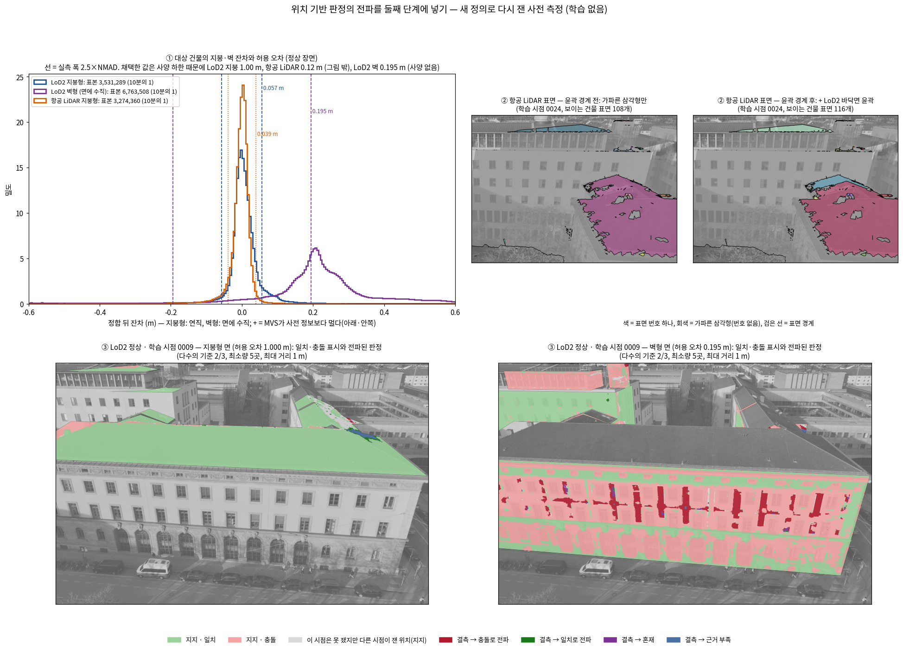

<!-- PHD-STAGE2-R7-PROPAGATION-v1 -->
# 위치 기반 판정의 전파를 둘째 단계에 넣기 — 구현 대조와 사전 측정 (학습 없음)

> 작업 PHD-STAGE2-R7-PROPAGATION-v1 (2026-09-30). 학습은 하지 않았고, 방법의 효과는 주장하지 않는다. `scientific_verdict: null`.
> **설계 문서**: 첨부한다고 한 방법론 설명 문서(3.3~3.5, 4.1~4.6, 표 6·8~13)는 이 세션에 들어오지 않았다. 작업 공간과 받은 편지함에도 없었다. 그래서 발주문이 옮겨 적은 규칙을 설계로 삼았다. 문서와 발주문이 다른 곳이 있는지는 확인하지 못했다.
> **장면**: r5·r6와 사전 측정 v1이 쓴 B0다. 설정은 다섯이다.
>   - LoD2: 정상, 주지붕 3396 +1 m, 그늘진 지붕 끝 3394 +1 m(이번 선택 장면)
>   - 항공 LiDAR: 정상, 주지붕 +1 m
> **고정 값**: 다수의 기준 2/3, 증거의 최소량 5곳, 최대 거리 1 m(표면 위), 칸 0.25 m.

## 답 — 목적의 세 물음

**1. 코드가 문서의 설계와 같은가.** 발주문이 든 11항목을 모두 발주문의 설계대로 구현했고, 시험으로 확인했다(1절 표에는 전파 규칙 자체를 한 줄 더 넣었다, 3절).
- **남은 다른 점 둘**(둘 다 결과를 바꾸지 않는 표현·구현 방식의 차이)
  - **시선 방향**: 발주문은 시선의 단위 방향을 쓴다. 깊이 지도는 카메라 Z이므로 구현은 Rᵀ(x, y, 1)을 쓴다. 잔차를 광선 거리로 바꿔 쓰면 두 식은 같은 값이다.
  - **다시 읽을 때의 칸 픽셀**: 렌더링마다 칸의 픽셀을 새로 셀 수 없어, 칸마다 3×3 표본점으로 센다. 초기화 때의 픽셀 기준 값과 비교하면, 신뢰도 문턱 0.5에 대해 같은 쪽에 서는 비율이 98.7–99.4 %다.
- **발주문 규칙이 낳는 큰 차이 하나**: 허용 오차를 '2.5 × NMAD와 기관 사양 가운데 큰 값'으로 정하면 지붕 값이 사양으로 올라간다.
  - LoD2 지붕 0.057 m → 1.00 m, 항공 LiDAR 지붕 0.039 m → 0.12 m가 된다.
  - 9-23의 결정(실측 폭만 쓴다)과 다르다.
  - LoD2 지붕 허용 오차가 주입량 1 m와 같아진다. 그래서 1 m 올린 주지붕의 지지 위치 28 %가 '일치'가 되고, 결측 278곳 가운데 5곳은 일치, 20곳은 혼재로 전파된다(표 바).
  - 실측 폭만 쓰면 일치·혼재 전파는 0곳이다. 두 경우를 모두 표에 적었다.

**2. 고정 값에서 전파가 닿는 범위(표 다).** 판정을 받는 결측 위치(근거 부족이 아닌 것)의 몫이다.
- **LoD2 정상**: 결측 5,700곳 가운데 58.1 %(지붕 60.6 %, 벽 57.3 %)
  - 충돌 2,150곳(134.4 m², 그 가운데 벽 121.9 m²), 일치 954곳, 혼재 210곳, 근거 부족 2,386곳
  - 근거 부족의 36 %(859곳)는 같은 표면에 지지 위치가 아예 없는 곳이다. 거의 이웃 건물 벽 3461·3479다.
- **항공 LiDAR 정상**(윤곽 경계 후): 결측 1,406곳 가운데 67.3 %, 충돌 666곳(45.5 m²)
- **윤곽 경계를 더한 효과**
  - 대상 건물 지붕이 이웃 지붕과 떨어진다. 가장 큰 표면이 2,061 → 1,392 m²가 된다.
  - 그 표면 지지 위치의 충돌 비율은 25.0 % → 9.4 %다(사양 하한 허용 오차 0.12 m 기준).

**3. 문서에 없어 구현이 정한 것(2절).** 모두 12개다.
- 발주문이 지목한 넷: 벽의 기관 사양, 윤곽을 구하는 방법, 네 배 거리의 측정 방식, 위치 없는 점의 처리
- 그 밖에 구현이 정한 여덟: 허용 오차 표본의 범위, 시점 표시 규칙, 다시 읽기 표본점, 칸의 소속, 가파른 삼각형 픽셀의 환산, 손실 차단의 범위, 사양 하한 적용 여부, 크롭에 닿는 면

**r7 발주 판단에 쓸 사실.** 판단은 검토자가 한다.
- **구현과 시험**: 모두 통과했다.
  - 단위 시험 25건, GPU 시험 4묶음, 초기화 실행 13회
  - 포크 결과와 오프라인 계산의 대조 6가지, 다시 읽기 시험
- **학습 전에 정할 것 셋**
  - (가) LoD2 지붕에 사양 하한을 걸지. 걸면 보호 거리 문턱도 4 m가 된다.
  - (나) 위치가 없는 항공 LiDAR 점(지면 점 등) 72,164개를 이전 방식으로 둘지. 이 가운데 13,656개가 첫 보호 대상이 된다.
  - (다) 둘째 윤곽 출처의 방법. 자체 분류 덩어리는 대상 건물과 붙은 이웃 6채를 한 덩어리로 묶는다(겹침 비율 0.40).



## 1. 구현 대조표

| 항목 | 문서의 설계 (발주문이 옮긴 것) | 구현 (코드 위치) | 같음 / 다름 | 다르면 이유 |
|---|---|---|---|---|
| 높이 환산 | 지붕형(\|n_z\| ≥ 0.5)은 잔차 × \|n·d\|/\|n_z\|, 벽형은 잔차 × \|n·d\|, 면이 없는 픽셀은 \|d_z\|. d는 시선의 단위 방향. 법선은 그 장면 자신의 표면(LoD2 면, 항공 LiDAR는 맞은 삼각형). 첫째·둘째 단계가 한 함수 | `src/phd/prior_propagation_v1/conversion.py`(`pixel_rays` :26, `factor` :44). 첫째 단계 `stage2_r7_propagation_v1/stage1_products.py:225`, 둘째 단계 `prepare_r7_inputs.py:45-46`. 옛 두 곳도 이 함수를 부른다(`stage1_verify_v2/verify_v2.py:135-136`, `stage2_conf_guided_gs_v1/prepare_stage2_inputs.py:71,76`) | 같음(표현 하나 다름) | 깊이 지도가 카메라 Z라 d = Rᵀ(x, y, 1)(단위 벡터 아님)을 쓴다. 잔차를 광선 거리로 쓰면 문서의 단위 방향 식과 같다(시험 `test_forms_agree`). 옛 첫째 단계의 '벽은 \|d_z\|'는 없앴다. 두 단계의 환산 지도는 픽셀 단위로 같다(4설정 × 15시점, 최대 차 0.0) |
| 허용 오차 | 지붕형·벽형 각각 중앙값·NMAD → 중앙값에서 NMAD 세 배 밖을 한 번 거름 → NMAD 다시 → 2.5 × NMAD와 기관 사양 가운데 큰 값. 벽 사양이 없으면 하한 없이. 벽 표본 0 또는 벽이 표면이 아니면 지붕 값. 정합은 기운 면만 | `tolerance.py`(`robust_width` :15, `tolerance` :32), `stage1_products.py` `step_tau`. 결과 `stage1/tolerance.json` | 같음 | – (결과 LoD2 지붕 1.00 m·벽 0.195 m, 항공 LiDAR 지붕·벽 0.12 m. 표 가) |
| 표면 번호와 윤곽 | LoD2는 면 하나가 표면 하나. 항공 LiDAR는 완만한 삼각형이 변을 공유해 이어진 영역이고, 경계는 가파른 삼각형과 건물 윤곽. 윤곽 출처는 주어진 것 → 자체 분류 → 없음 순 | `surfaces.py`(`tin_surfaces(region=…)` :34), `outlines.py`, `stage1_products.py` `surfaces_of`. 이번 장면은 LoD2 바닥면(첫째)을 쓰고, 자체 분류(둘째)는 비교용으로 만들었다 | 같음 | 둘째 출처는 잠정안대로다(2절 ②). 붙은 건물이 묶인다(표 아) |
| 위치와 지지의 정의 | 위치 = 표면과 그 안의 칸. 지지 시점 = 위치의 픽셀 절반 이상이 관측 신뢰도 1. 본 시점 = 영상 안이고 다른 표면에 가리지 않음. 지지 / 결측 / 비가시 = 본 시점의 절반 이상이 지지 / 그보다 적음 / 본 시점 없음. 지지 위치의 표 = 지지 시점들의 다수결, 동률은 일치 | `rule.py`(`location_state` :23), `locations.py`(`build_plane_store` :90, `build_tin_store` :133, `locate` :173), `stage1_products.py` `step_product` | 같음 | 시점의 표시(일치/충돌)를 정하는 법은 문서에 없다(2절 ⑥). v1의 '동률은 픽셀 합으로'는 문서대로 '동률은 일치'로 바꿨다 |
| 전파 규칙의 값 | 다수의 기준 2/3, 최소량 5곳, 최대 거리 1 m(표면 위), 칸 0.25 m. 모두 설정 | `configs/phd/stage2_r7_propagation_v1/r7.json` `values`, 포크 인자 `--jbgs_prop_majority / _min_evidence / _max_distance`, 칸은 산출물(`store_*_c0.25.npz`) | 같음 | – |
| 전파 규칙 | 같은 표면 안에서 가까운 지지 위치부터 모으고, 최소량에서 멈추고, 최대 거리를 넘으면 더 모으지 않는다. 충돌이 기준 이상이면 충돌, 일치가 기준 이상이면 일치, 그 밖은 혼재, 최소량 미만은 근거 부족. 거리는 같은 표면의 칸만 잇는 격자 경로(가로·세로·대각·나이트), 칸 중심 사이 실제 거리 | `rule.judge` :40, `locations.propagate` :286(`k_nearest_support` :258, `grid_edges` :204). 학습 코드는 초기화에서 같은 함수를 부른다(`jbgs_judgment.py` `prop_init` :569). v1 사전 측정 파일은 이 모듈을 부르는 호환 파일이 됐다 | 같음 | – (포크의 판정 = 오프라인 계산, 4설정 모두) |
| 초기화 | 후보 점마다 앉은 위치(표면, 칸), 위치의 상태, 첫 가우시안 신뢰도, 전파된 판정. 비가시 위치의 사전 정보 점은 심지 않음. 충돌로 전파된 결측 위치의 점도 심지 않음(설정으로 끄면 그대로 심음). 심지 않은 비가시 조각은 파일로 남김. 위치가 없는 점은 신뢰도를 이전 방식으로, 판정은 없음 | `jbgs_judgment.py` `prop_init` :569-637(심지 않음 :598-602, 파일 `monitor/unplanted.npz`·`init_points.npz`), 인자 `--jbgs_init_plant_conflict`, 앉을 표면 `prepare_r7_inputs.py`(`seat_surface.npy`) | 같음 | 위치가 없는 점을 심을지는 문서에 없다. r6 규칙(중심 픽셀을 보는 학습 시점이 없으면 뺌)을 따랐다(2절 ④) |
| 다시 읽기 | 500회마다. 표면은 초기화 때 그대로, 칸은 그 표면에서 현재 중심에 가장 가까운 칸. 그 칸의 신뢰도와 판정을 읽고, 학습 중인 표면으로 표시를 새로 만들지 않음. 가림은 한 방향. 초기화는 사전 정보 깊이, 이후는 그때 렌더링한 깊이. 분할·복제 자식은 표면 승계, 값은 다음 읽기에서 | `update_E_r7` :816, `seat_now` :661(표면 = 초기 표면[init_id]), `seat.py`(`seat` :29, `cell_samples` :34, `reread_E` :46). 판정은 초기 표(`prop["J"]`)에서만 읽는다 | 같음(구현 방식 하나) | 렌더링 가림으로 칸의 '픽셀'을 다시 세는 일은 칸마다 3×3 표본점으로 했다(2절 ⑦). 첫 읽기는 산출물의 픽셀 기준 값이다 |
| 보호 조건 | 사전 정보 출신 & 전파된 판정이 충돌 아님 & 가우시안 신뢰도 < 0.5 & 초기 위치에서 허용 오차 네 배 안 | `update_E_r7` :852-860 | 같음 | 네 배 거리는 r6처럼 초기 원반(자식은 조상) 중심과의 3차원 거리이고, 허용 오차는 표면 종류별 값이다(2절 ③) |
| 손실 | 사전 정보 깊이 항은 사전 정보 면이 보이는 픽셀 가운데 전파된 판정이 충돌이 아닌 픽셀에서만 켬. 초기화에서 한 번 정하고 다시 읽지 않음. 픽셀은 맞은 사전 정보 표면의 칸으로 이어짐. MVS 항의 구간 없음은 그대로 | `_gate_init` :639(학습 해상도 위치 지도, 산출물 `locmap/`), `losses` :718(무게 = (1 − 관측 신뢰도) × 차단값) | 같음 | r6의 (1 − 관측 신뢰도) 무게는 그대로 뒀다. 지지 위치의 충돌 표는 '전파된 판정'이 아니므로 끄지 않았다(발주문 문구대로). 끄는 변형은 설정 `location`으로 두고 수만 셌다(5절) |
| 밀도 제어 | 보호된 가우시안은 뺌(지금 규칙) | r6 그대로(`scene/gaussian_model.py`의 분할·복제·제거·불투명도 재설정 면제) | 같음 | – (GPU 시험: 잠금·하한·재설정 면제 코드가 r6와 글자까지 같음) |
| 속성 기록 | 출처, 초기 위치, 표면 번호, 가우시안 신뢰도(마지막), 전파된 판정(마지막), 제거 이력. 산출 형식에 열을 더함 | 덤프 `gaussians.npz`(+ init_surface·location·judgment·located), PLY 열(surface_id·location·judgment·gconf; `gaussian_model.save_ply`), `init_points.npz`·`unplanted.npz`, 초기 원반별 마지막 생존 반복(`last_seen`) | 같음 | 가우시안별 기록은 분할·복제·제거를 따라간다(GPU 시험) |

## 2. 문서에 없어 구현이 정한 것

| 번호 | 무엇 | 정한 것 | 근거·기록 |
|---|---|---|---|
| ① | 벽의 기관 사양 | 자료에 벽에 견줄 사양이 없다. 하한 없이 2.5 × NMAD(0.195 m)를 쓰고 '사양 없음'으로 적었다 | 발주문의 규칙. 쓸 사양이 생기면 `r7.json` `tolerance.spec_m`에 넣는다 |
| ② | 윤곽을 구하는 방법(둘째 출처) | 잠정안대로다. 0.5 m 격자에서 점의 과반이 건물(6)인 칸을 고르고, 닫기 1회, 8연결 덩어리, 구멍 메움, 8칸 미만은 버렸다 | 대상 건물은 붙은 이웃 6채와 한 덩어리가 된다(겹침 비율 0.40, 표 아). 떨어진 건물 한 채는 0.96이다. 방법을 바꾸는 편이 낫다고 본다. 이유: 이 장면처럼 벽을 맞대고 붙은 건물은 분류만으로 나눌 수 없다. 가파른 삼각형 경계가 이미 높이 차가 있는 곳은 나누므로, 분류 덩어리는 '건물인지 아닌지'로만 쓰고 건물끼리는 가파른 삼각형으로 나누는 편이 맞다. 높이가 이어지는 붙은 지붕은 외부 윤곽 없이는 나눌 수 없다 |
| ③ | 네 배 안 거리의 측정 | r6 구현을 확인해 그대로 썼다. 현재 중심과 초기 원반(분할·복제 자식은 조상의 초기 원반) 중심 사이의 3차원 거리다(`jbgs_judgment.py:852`). 문턱은 4 × 그 표면 종류의 허용 오차다 | 사양 하한을 걸면 LoD2 지붕 4.00 m, LoD2 벽 0.78 m, 항공 LiDAR 0.48 m다 |
| ④ | 위치가 없는 점 | 신뢰도는 중심 픽셀로 읽는다(r6 `compute_E`, 이후 `compute_E_render`). 판정은 없고, 심을지는 r6 규칙(보는 학습 시점이 없으면 심지 않음)을 따른다 | 항공 LiDAR 72,164개(지면 점, 가파른 삼각형에만 걸친 꼭짓점)다. 21,870개는 심지 않고 50,294개는 심는다. 그 가운데 13,656개는 첫 신뢰도가 0.5 미만이라 보호 대상이 된다(표 마) |
| ⑤ | 허용 오차의 표본 | 정상 장면, 15시점(첫째 단계 관례), 관측 신뢰도 1, 대상 건물의 표면이다. LoD2는 그 건물의 면이고, 항공 LiDAR는 그 건물의 LoD2 바닥면 윤곽 안의 건물 표면이다. 면 종류는 자기 법선으로 나눴다 | 지난 첫째 단계와 같은 범위(대상 건물)다 |
| ⑥ | 시점의 표시 | 지지 시점의 표시는 그 시점의 일치 픽셀이 충돌 픽셀 이상이면 일치다 | 문서는 위치의 표(시점 다수결)만 정한다 |
| ⑦ | 다시 읽기 | 칸마다 3×3 표본점을 학습 해상도로 투영한다. 렌더링 기대 깊이보다 0.5 m 넘게 뒤면 가린 것으로 본다(누적 불투명도 0.05 미만 픽셀은 가리지 않음). 가리지 않은 표본점이 하나라도 있으면 그 시점이 본 것이고, 그 가운데 절반 이상이 관측 신뢰도 1이면 지지한 것이다 | 사전 정보 깊이로 같은 방식을 쓰면 산출물 값과 문턱 같은 쪽 98.7–99.4 %다(5절) |
| ⑧ | 칸의 소속 | LoD2는 칸 중심이 면 안이고 크롭 안인 칸이다. 항공 LiDAR는 칸 중심 아래 삼각형의 표면이다. 표면 가장자리 픽셀은 같은 표면의 가장 가까운 칸으로 간다. 온전한 칸이 없는 작은 표면은 중심에 위치 하나를 둔다 | v1과 같다. 항공 LiDAR는 작은 표면에도 위치를 하나씩 둬서 v1보다 위치가 41개 많다 |
| ⑨ | 가파른 삼각형 픽셀 | 표면 번호는 없지만 사전 정보 깊이 항은 걸린다. 그 픽셀은 자기 삼각형 법선의 벽형 식으로 환산하고, 허용 오차는 지붕 값(벽이 표면이 아니므로)이다 | 항공 LiDAR 사전 정보 픽셀의 47–48 %다 |
| ⑩ | 손실 차단의 범위 | 발주문 문구대로 '전파된 판정이 충돌'인 픽셀만 끈다(`propagated`). 지지 위치의 충돌 표까지 끄는 `location`은 설정으로만 뒀다 | LoD2 정상에서 두 규칙의 차단 픽셀은 296,501 대 602,450이다(5절) |
| ⑪ | 사양 하한 | 발주문대로 지붕에 걸었다. 실측 폭만 쓴 경우는 민감도 줄로 모두 쟀다 | 9-23 결정(실측 폭)과 다르다(답 1) |
| ⑫ | 크롭에 닿는 면만 | LoD2 면 가운데 삼각형이 크롭 사각형에 닿는 면만 위치를 갖는다(94면, +1 m 장면은 99면) | v1과 같다 |

## 3. 시험 결과 (학습 없음)

| 시험 | 내용 | 결과 |
|---|---|---|
| 공용 모듈 단위 시험 | `tests/phd/test_prior_propagation_v1.py`. CPU 16건: 환산 두 식 일치, 연직·법선·면 없음 식; 한 번 거르기와 사양 하한, 사양 없음, 지붕 값 대체; 가파른 삼각형과 윤곽 경계; 지지·결측·비가시, 동률은 일치; 판정 규칙; 칸 찾기(numpy = torch), 전파; 칸 표본점과 다시 읽기; 분류 덩어리의 묶임과 겹침 비율 | 16건 통과 |
| v1 사전 측정 시험 | `tests/phd/test_stage2_propagation_premeasure_v1.py` 9건(v1 규칙 파일은 공용 모듈을 부르는 호환 파일로 바뀜) | 9건 통과. v1 측정을 다시 돌린 CSV 12개가 보관본과 바이트 단위로 같다 |
| r7 GPU 시험 | `gpu_tests_r7.py`, 실제 가우시안 모델 4묶음: ① 잠금·하한·재설정 면제·신뢰도 함수가 r6와 글자까지 같음 ② 분할·복제·제거 때 가우시안별 기록이 따라가고 자식이 부모의 표면을 물려받음 ③ 보호 규칙(충돌 제외, 신뢰도 문턱, 표면 종류별 거리 문턱) ④ PLY 새 열 쓰기·읽기 | 통과 |
| 렌더링 대조 | 표면 번호 렌더링의 깊이 = 둘째 단계 사전 정보 지도(LoD2 정상·+1 m, 항공 LiDAR 정상·+1 m, 15시점) | 차 0.0 m, 덮임 불일치 0 |
| 두 단계의 환산 계수 | 첫째 단계(`stage1_products.py`)와 둘째 단계(`prepare_r7_inputs.py`)가 각자 공용 함수를 불러 만든 지도 | 4설정 × 15시점 최대 차 0.0 |
| +1 m 장면의 허용 오차 | 올린 지붕이 새로 덮은 사전 정보 픽셀에 허용 오차가 생겼는지 | 모든 사전 정보 픽셀에 있음. 전에는 LoD2 1,448,803, 항공 LiDAR 208,308 픽셀(15시점)에 없었다 |
| 초기화 실행 | 포크 r7로 13회(네 설정 × 기본·기준선·실측 폭, LoD2 정상은 차단 변형 하나 더). 첫 반복 직전에 멈춤 | 13회 PASS |
| 오프라인 대조 | `verify_dry.py`: 포크의 전파 판정 = numpy 계산; 앉은 칸 = numpy 칸 찾기; 비가시·충돌 위치에 심은 점 0, 안 심은 이유 일치; 첫 보호 수 = 규칙으로 센 수; 손실 차단 지도 = 판정 표; 기준선에서 충돌 점은 심되 보호 제외 | 4설정 모두 통과 |
| 다시 읽기 시험 | 가우시안을 한 칸(표면 축 t1), 10분의 1칸(t2), 법선 방향 0.3 m 옮긴 뒤 렌더링으로 다시 읽음 | 4설정 통과. 표면 불변. 칸이 바뀐 몫: 한 칸 93–99 %, 10분의 1칸 9–10 %, 법선 0.3 m는 LoD2 0 %·항공 LiDAR 46–47 %(수평 격자라 기운 면에서 수평 위치가 바뀜). 읽은 판정 = 새 칸의 표 값, 읽은 신뢰도 = 새 칸을 같은 렌더링으로 다시 잰 값(차 0), CPU 칸 찾기와 불일치 0 |

## 4. 사전 측정을 새 정의로 다시 재기 (9번)

- **바꾼 입력**(지난 측정과 같은 네 설정 + 선택 장면)
  - 지붕과 벽 각각의 허용 오차
  - 항공 LiDAR의 윤곽 경계
  - 고정 값(2/3, 5곳, 1 m), 칸 0.25 m
  - 동률은 일치
- **판정 수**: 표 나~바의 판정 수는 사양 하한을 건 허용 오차(기본)로 셌다. 실측 폭만 쓴 값은 표 라·바의 따로 적은 줄에 있다.

### 표 가. 지붕과 벽의 허용 오차 (정상 장면, 15시점, 관측 신뢰도 1, 대상 건물의 표면; 잔차는 지붕형 = 연직, 벽형 = 면에 수직)

| 사전 정보 | 면 종류 | 표본 수 | 정합 뒤 중앙값 (거르기 전 → 뒤) | NMAD (거르기 전 → 뒤) | 걸러낸 비율 | 2.5 × NMAD | 기관 사양 | 허용 오차 (채택된 쪽) | 실측 폭만 쓴 값 |
|---|---|---|---|---|---|---|---|---|---|
| LoD2 | 지붕형 | 35,312,919 | +0.0055 → +0.0029 m | 0.0285 → 0.0227 m | 15.3 % | 0.0568 m | 1.00 m | **1.0000 m** (기관 사양) | 0.0568 m |
| LoD2 | 벽형 | 67,635,004 | +0.2130 → +0.2128 m | 0.1038 → 0.0778 m | 17.8 % | 0.1945 m | 없음 | **0.1945 m** (실측 폭(사양 없음)) | 0.1945 m |
| 항공 LiDAR | 지붕형 | 32,743,538 | -0.0009 → -0.0001 m | 0.0176 → 0.0158 m | 7.7 % | 0.0394 m | 0.12 m | **0.1200 m** (기관 사양) | 0.0394 m |
| 항공 LiDAR | 벽형 | 0 | – | – | – | – | 없음 | **0.1200 m** (지붕 값(벽이 표면이 아님)) | 0.0394 m |

### 표 나. 표면별 위치 (한 칸 0.25 m; 일치·충돌 = 지지 위치의 표; 판정 = 고정 값 2/3·5곳·1 m의 전파)

| 설정 | 표면 | 종류 | 넓이 m² | 지지 위치 | 일치 | 충돌 | 결측 위치 | 결측의 판정 (충돌 · 일치 · 혼재 · 근거 부족) | 비가시 위치 |
|---|---|---|---|---|---|---|---|---|---|
| LoD2 정상 | 면 3396 (주지붕) | 지붕형 | 619.2 | 9,897 | 96.6 % | 3.4 % | 10 | 0 · 8 · 2 · 0 | 0 |
| LoD2 정상 | 면 3394 (그늘진 지붕 끝) | 지붕형 | 104.6 | 1,121 | 100.0 % | 0.0 % | 553 | 0 · 241 · 0 · 312 | 0 |
| LoD2 정상 | 면 3404 (끝 경사면) | 지붕형 | 58.6 | 937 | 58.1 % | 41.9 % | 0 | 0 · 0 · 0 · 0 | 0 |
| LoD2 정상 | 면 3387 (날개 지붕) | 지붕형 | 58.8 | 845 | 88.5 % | 11.5 % | 0 | 0 · 0 · 0 · 0 | 95 |
| LoD2 정상 | 면 3389 (날개 지붕) | 지붕형 | 59.1 | 806 | 89.6 % | 10.4 % | 0 | 0 · 0 · 0 · 0 | 139 |
| LoD2 정상 | 면 3393 (뒷지붕) | 지붕형 | 581.2 | 16 | 43.8 % | 56.2 % | 8 | 0 · 0 · 0 · 8 | 9,275 |
| LoD2 정상 | 면 3401 (대상 건물 바닥면) | 지붕형 | 1,358.9 | 24 | 62.5 % | 37.5 % | 0 | 0 · 0 · 0 · 0 | 21,719 |
| LoD2 정상 | 면 3383 (이웃 건물) | 지붕형 | 278.6 | 3,503 | 100.0 % | 0.0 % | 262 | 0 · 169 · 0 · 93 | 693 |
| LoD2 정상 | 면 3539 (이웃 건물) | 지붕형 | 181.6 | 2,597 | 99.9 % | 0.1 % | 125 | 0 · 119 · 2 · 4 | 183 |
| LoD2 정상 | 면 3386 (이웃 건물) | 지붕형 | 162.0 | 2,316 | 95.9 % | 4.1 % | 198 | 87 · 20 · 8 · 83 | 78 |
| LoD2 정상 | 면 3888 (이웃 건물) | 지붕형 | 22.1 | 251 | 98.0 % | 2.0 % | 103 | 0 · 81 · 16 · 6 | 0 |
| LoD2 정상 | 면 3569 (이웃 건물) | 지붕형 | 41.9 | 201 | 36.3 % | 63.7 % | 108 | 78 · 3 · 14 · 13 | 361 |
| LoD2 정상 | 면 3403 (정면 벽) | 벽형 | 1,258.8 | 18,732 | 32.6 % | 67.4 % | 1,408 | 1,308 · 31 · 66 · 3 | 0 |
| LoD2 정상 | 면 3391 (옆 벽) | 벽형 | 365.8 | 5,796 | 55.8 % | 44.2 % | 56 | 47 · 2 · 7 · 0 | 0 |
| LoD2 정상 | 면 3392 (대상 건물) | 벽형 | 109.2 | 95 | 33.7 % | 66.3 % | 0 | 0 · 0 · 0 · 0 | 1,653 |
| LoD2 정상 | 면 3388 (대상 건물) | 벽형 | 135.4 | 33 | 21.2 % | 78.8 % | 0 | 0 · 0 · 0 · 0 | 2,133 |
| LoD2 정상 | 면 3398 (대상 건물) | 벽형 | 9.5 | 23 | 4.3 % | 95.7 % | 2 | 0 · 0 · 0 · 2 | 127 |
| LoD2 정상 | 면 3390 (대상 건물) | 벽형 | 76.0 | 17 | 0.0 % | 100.0 % | 0 | 0 · 0 · 0 · 0 | 1,199 |
| LoD2 정상 | 면 3400 (대상 건물) | 벽형 | 370.5 | 11 | 9.1 % | 90.9 % | 1 | 0 · 0 · 0 · 1 | 5,916 |
| LoD2 정상 | 면 3397 (대상 건물) | 벽형 | 280.2 | 6 | 0.0 % | 100.0 % | 0 | 0 · 0 · 0 · 0 | 4,478 |
| LoD2 정상 | 면 3402 (대상 건물) | 벽형 | 109.2 | 5 | 20.0 % | 80.0 % | 0 | 0 · 0 · 0 · 0 | 1,743 |
| LoD2 정상 | 면 3837 (이웃 건물) | 벽형 | 735.8 | 11,134 | 65.5 % | 34.5 % | 160 | 115 · 23 · 22 · 0 | 478 |
| LoD2 정상 | 면 3880 (이웃 건물) | 벽형 | 570.9 | 3,224 | 82.1 % | 17.9 % | 114 | 61 · 21 · 7 · 25 | 5,797 |
| LoD2 정상 | 면 3535 (이웃 건물) | 벽형 | 216.6 | 1,336 | 77.3 % | 22.7 % | 533 | 137 · 75 · 21 · 300 | 1,596 |
| LoD2 정상 | 면 3858 (이웃 건물) | 벽형 | 114.0 | 1,824 | 1.5 % | 98.5 % | 0 | 0 · 0 · 0 · 0 | 0 |
| LoD2 정상 | 면 3381 (이웃 건물) | 벽형 | 499.5 | 738 | 84.0 % | 16.0 % | 715 | 62 · 114 · 36 · 503 | 6,539 |
| LoD2 정상 | 면 3461 (이웃 건물) | 벽형 | 54.1 | 0 | – | – | 684 | 0 · 0 · 0 · 684 | 181 |
| LoD2 정상 | 면 3479 (이웃 건물) | 벽형 | 9.6 | 0 | – | – | 154 | 0 · 0 · 0 · 154 | 0 |
| LoD2 정상 | 그 밖의 23개 표면 합 | 지붕형 | 2,344.9 | 6,254 | 87.7 % | 12.3 % | 114 | 35 · 12 · 2 · 65 | 31,150 |
| LoD2 정상 | 그 밖의 43개 표면 합 | 벽형 | 4,051.5 | 5,367 | 34.3 % | 65.7 % | 392 | 220 · 35 · 7 · 130 | 59,065 |
| LoD2 주지붕 +1 m | 면 3396 (주지붕) | 지붕형 | 619.2 | 9,629 | 28.4 % | 71.6 % | 278 | 207 · 5 · 20 · 46 | 0 |
| LoD2 주지붕 +1 m | 면 3404 (끝 경사면) | 지붕형 | 58.6 | 937 | 55.9 % | 44.1 % | 0 | 0 · 0 · 0 · 0 | 0 |
| LoD2 주지붕 +1 m | 면 3387 (날개 지붕) | 지붕형 | 58.8 | 801 | 86.8 % | 13.2 % | 4 | 1 · 0 · 3 · 0 | 135 |
| LoD2 주지붕 +1 m | 면 3394 (그늘진 지붕 끝) | 지붕형 | 104.6 | 117 | 100.0 % | 0.0 % | 400 | 0 · 79 · 0 · 321 | 1,157 |
| LoD2 주지붕 +1 m | 면 3389 (날개 지붕) | 지붕형 | 59.1 | 380 | 100.0 % | 0.0 % | 0 | 0 · 0 · 0 · 0 | 565 |
| LoD2 주지붕 +1 m | 면 3401 (대상 건물 바닥면) | 지붕형 | 1,358.9 | 24 | 62.5 % | 37.5 % | 0 | 0 · 0 · 0 · 0 | 21,719 |
| LoD2 주지붕 +1 m | 면 3393 (뒷지붕) | 지붕형 | 581.2 | 5 | 80.0 % | 20.0 % | 3 | 0 · 0 · 0 · 3 | 9,291 |
| LoD2 주지붕 +1 m | 면 3383 (이웃 건물) | 지붕형 | 278.6 | 2,884 | 100.0 % | 0.0 % | 293 | 0 · 208 · 0 · 85 | 1,281 |
| LoD2 주지붕 +1 m | 면 3539 (이웃 건물) | 지붕형 | 181.6 | 2,597 | 99.9 % | 0.1 % | 125 | 0 · 119 · 2 · 4 | 183 |
| LoD2 주지붕 +1 m | 면 3386 (이웃 건물) | 지붕형 | 162.0 | 1,900 | 100.0 % | 0.0 % | 357 | 0 · 151 · 0 · 206 | 335 |
| LoD2 주지붕 +1 m | 면 3888 (이웃 건물) | 지붕형 | 22.1 | 251 | 98.0 % | 2.0 % | 103 | 0 · 81 · 16 · 6 | 0 |
| LoD2 주지붕 +1 m | 면 3569 (이웃 건물) | 지붕형 | 41.9 | 198 | 36.4 % | 63.6 % | 111 | 80 · 2 · 16 · 13 | 361 |
| LoD2 주지붕 +1 m | 면 3403 (정면 벽) | 벽형 | 1,258.8 | 18,732 | 32.6 % | 67.4 % | 1,408 | 1,308 · 31 · 66 · 3 | 0 |
| LoD2 주지붕 +1 m | 면 3391 (옆 벽) | 벽형 | 365.8 | 5,796 | 55.8 % | 44.2 % | 56 | 47 · 2 · 7 · 0 | 0 |
| LoD2 주지붕 +1 m | 단차면 1 (올린 면 둘레) | 벽형 | 66.2 | 1,054 | 2.1 % | 97.9 % | 6 | 6 · 0 · 0 · 0 | 0 |
| LoD2 주지붕 +1 m | 단차면 3 (올린 면 둘레) | 벽형 | 10.8 | 172 | 6.4 % | 93.6 % | 0 | 0 · 0 · 0 · 0 | 0 |
| LoD2 주지붕 +1 m | 면 3392 (대상 건물) | 벽형 | 109.2 | 95 | 33.7 % | 66.3 % | 0 | 0 · 0 · 0 · 0 | 1,653 |
| LoD2 주지붕 +1 m | 면 3398 (대상 건물) | 벽형 | 9.5 | 23 | 4.3 % | 95.7 % | 2 | 0 · 0 · 0 · 2 | 127 |
| LoD2 주지붕 +1 m | 면 3388 (대상 건물) | 벽형 | 135.4 | 21 | 33.3 % | 66.7 % | 0 | 0 · 0 · 0 · 0 | 2,145 |
| LoD2 주지붕 +1 m | 면 3390 (대상 건물) | 벽형 | 76.0 | 17 | 0.0 % | 100.0 % | 0 | 0 · 0 · 0 · 0 | 1,199 |
| LoD2 주지붕 +1 m | 면 3400 (대상 건물) | 벽형 | 370.5 | 3 | 33.3 % | 66.7 % | 1 | 0 · 0 · 0 · 1 | 5,924 |
| LoD2 주지붕 +1 m | 단차면 2 (올린 면 둘레) | 벽형 | 51.8 | 1 | 0.0 % | 100.0 % | 1 | 0 · 0 · 0 · 1 | 826 |
| LoD2 주지붕 +1 m | 면 3402 (대상 건물) | 벽형 | 109.2 | 1 | 0.0 % | 100.0 % | 0 | 0 · 0 · 0 · 0 | 1,747 |
| LoD2 주지붕 +1 m | 단차면 4 (올린 면 둘레) | 벽형 | 0.1 | 1 | 0.0 % | 100.0 % | 0 | 0 · 0 · 0 · 0 | 0 |
| LoD2 주지붕 +1 m | 면 3837 (이웃 건물) | 벽형 | 735.8 | 11,137 | 66.1 % | 33.9 % | 157 | 111 · 23 · 23 · 0 | 478 |
| LoD2 주지붕 +1 m | 면 3880 (이웃 건물) | 벽형 | 570.9 | 2,768 | 85.2 % | 14.8 % | 76 | 51 · 0 · 0 · 25 | 6,291 |
| LoD2 주지붕 +1 m | 면 3858 (이웃 건물) | 벽형 | 114.0 | 1,824 | 1.5 % | 98.5 % | 0 | 0 · 0 · 0 · 0 | 0 |
| LoD2 주지붕 +1 m | 면 3535 (이웃 건물) | 벽형 | 216.6 | 1,045 | 80.3 % | 19.7 % | 440 | 0 · 181 · 0 · 259 | 1,980 |
| LoD2 주지붕 +1 m | 면 3381 (이웃 건물) | 벽형 | 499.5 | 366 | 87.2 % | 12.8 % | 515 | 7 · 133 · 10 · 365 | 7,111 |
| LoD2 주지붕 +1 m | 면 3461 (이웃 건물) | 벽형 | 54.1 | 0 | – | – | 669 | 0 · 0 · 0 · 669 | 196 |
| LoD2 주지붕 +1 m | 면 3479 (이웃 건물) | 벽형 | 9.6 | 0 | – | – | 154 | 0 · 0 · 0 · 154 | 0 |
| LoD2 주지붕 +1 m | 그 밖의 23개 표면 합 | 지붕형 | 2,344.9 | 6,087 | 90.1 % | 9.9 % | 42 | 7 · 12 · 2 · 21 | 31,389 |
| LoD2 주지붕 +1 m | 그 밖의 45개 표면 합 | 벽형 | 4,345.8 | 5,270 | 34.2 % | 65.8 % | 307 | 152 · 72 · 14 · 69 | 63,955 |
| LoD2 그늘진 지붕 끝 +1 m | 면 3396 (주지붕) | 지붕형 | 619.2 | 9,897 | 96.6 % | 3.4 % | 10 | 0 · 8 · 2 · 0 | 0 |
| LoD2 그늘진 지붕 끝 +1 m | 면 3394 (그늘진 지붕 끝) | 지붕형 | 104.6 | 769 | 36.0 % | 64.0 % | 905 | 245 · 60 · 57 · 543 | 0 |
| LoD2 그늘진 지붕 끝 +1 m | 면 3404 (끝 경사면) | 지붕형 | 58.6 | 937 | 58.1 % | 41.9 % | 0 | 0 · 0 · 0 · 0 | 0 |
| LoD2 그늘진 지붕 끝 +1 m | 면 3387 (날개 지붕) | 지붕형 | 58.8 | 845 | 88.5 % | 11.5 % | 0 | 0 · 0 · 0 · 0 | 95 |
| LoD2 그늘진 지붕 끝 +1 m | 면 3389 (날개 지붕) | 지붕형 | 59.1 | 806 | 89.6 % | 10.4 % | 0 | 0 · 0 · 0 · 0 | 139 |
| LoD2 그늘진 지붕 끝 +1 m | 면 3401 (대상 건물 바닥면) | 지붕형 | 1,358.9 | 24 | 62.5 % | 37.5 % | 0 | 0 · 0 · 0 · 0 | 21,719 |
| LoD2 그늘진 지붕 끝 +1 m | 면 3393 (뒷지붕) | 지붕형 | 581.2 | 13 | 46.2 % | 53.8 % | 3 | 0 · 0 · 0 · 3 | 9,283 |
| LoD2 그늘진 지붕 끝 +1 m | 면 3383 (이웃 건물) | 지붕형 | 278.6 | 3,597 | 100.0 % | 0.0 % | 62 | 0 · 62 · 0 · 0 | 799 |
| LoD2 그늘진 지붕 끝 +1 m | 면 3539 (이웃 건물) | 지붕형 | 181.6 | 2,597 | 99.9 % | 0.1 % | 125 | 0 · 119 · 2 · 4 | 183 |
| LoD2 그늘진 지붕 끝 +1 m | 면 3386 (이웃 건물) | 지붕형 | 162.0 | 2,316 | 95.9 % | 4.1 % | 198 | 87 · 20 · 8 · 83 | 78 |
| LoD2 그늘진 지붕 끝 +1 m | 면 3888 (이웃 건물) | 지붕형 | 22.1 | 251 | 98.0 % | 2.0 % | 103 | 0 · 81 · 16 · 6 | 0 |
| LoD2 그늘진 지붕 끝 +1 m | 면 3569 (이웃 건물) | 지붕형 | 41.9 | 201 | 36.3 % | 63.7 % | 108 | 78 · 3 · 14 · 13 | 361 |
| LoD2 그늘진 지붕 끝 +1 m | 면 3403 (정면 벽) | 벽형 | 1,258.8 | 18,732 | 32.6 % | 67.4 % | 1,408 | 1,308 · 31 · 66 · 3 | 0 |
| LoD2 그늘진 지붕 끝 +1 m | 면 3391 (옆 벽) | 벽형 | 365.8 | 5,796 | 55.8 % | 44.2 % | 56 | 47 · 2 · 7 · 0 | 0 |
| LoD2 그늘진 지붕 끝 +1 m | 단차면 2 (올린 면 둘레) | 벽형 | 14.0 | 81 | 30.9 % | 69.1 % | 143 | 36 · 12 · 51 · 44 | 0 |
| LoD2 그늘진 지붕 끝 +1 m | 단차면 1 (올린 면 둘레) | 벽형 | 14.0 | 0 | – | – | 164 | 0 · 0 · 0 · 164 | 60 |
| LoD2 그늘진 지붕 끝 +1 m | 면 3392 (대상 건물) | 벽형 | 109.2 | 95 | 33.7 % | 66.3 % | 0 | 0 · 0 · 0 · 0 | 1,653 |
| LoD2 그늘진 지붕 끝 +1 m | 면 3388 (대상 건물) | 벽형 | 135.4 | 33 | 21.2 % | 78.8 % | 0 | 0 · 0 · 0 · 0 | 2,133 |
| LoD2 그늘진 지붕 끝 +1 m | 면 3398 (대상 건물) | 벽형 | 9.5 | 23 | 4.3 % | 95.7 % | 2 | 0 · 0 · 0 · 2 | 127 |
| LoD2 그늘진 지붕 끝 +1 m | 면 3390 (대상 건물) | 벽형 | 76.0 | 17 | 0.0 % | 100.0 % | 0 | 0 · 0 · 0 · 0 | 1,199 |
| LoD2 그늘진 지붕 끝 +1 m | 면 3400 (대상 건물) | 벽형 | 370.5 | 11 | 9.1 % | 90.9 % | 1 | 0 · 0 · 0 · 1 | 5,916 |
| LoD2 그늘진 지붕 끝 +1 m | 면 3397 (대상 건물) | 벽형 | 280.2 | 6 | 0.0 % | 100.0 % | 0 | 0 · 0 · 0 · 0 | 4,478 |
| LoD2 그늘진 지붕 끝 +1 m | 면 3402 (대상 건물) | 벽형 | 109.2 | 5 | 20.0 % | 80.0 % | 0 | 0 · 0 · 0 · 0 | 1,743 |
| LoD2 그늘진 지붕 끝 +1 m | 면 3837 (이웃 건물) | 벽형 | 735.8 | 11,134 | 65.5 % | 34.5 % | 160 | 115 · 23 · 22 · 0 | 478 |
| LoD2 그늘진 지붕 끝 +1 m | 면 3880 (이웃 건물) | 벽형 | 570.9 | 3,224 | 82.1 % | 17.9 % | 114 | 61 · 21 · 7 · 25 | 5,797 |
| LoD2 그늘진 지붕 끝 +1 m | 면 3535 (이웃 건물) | 벽형 | 216.6 | 1,336 | 77.3 % | 22.7 % | 533 | 137 · 75 · 21 · 300 | 1,596 |
| LoD2 그늘진 지붕 끝 +1 m | 면 3858 (이웃 건물) | 벽형 | 114.0 | 1,824 | 1.5 % | 98.5 % | 0 | 0 · 0 · 0 · 0 | 0 |
| LoD2 그늘진 지붕 끝 +1 m | 면 3381 (이웃 건물) | 벽형 | 499.5 | 738 | 84.0 % | 16.0 % | 715 | 62 · 114 · 36 · 503 | 6,539 |
| LoD2 그늘진 지붕 끝 +1 m | 면 3461 (이웃 건물) | 벽형 | 54.1 | 0 | – | – | 669 | 0 · 0 · 0 · 669 | 196 |
| LoD2 그늘진 지붕 끝 +1 m | 면 3479 (이웃 건물) | 벽형 | 9.6 | 0 | – | – | 154 | 0 · 0 · 0 · 154 | 0 |
| LoD2 그늘진 지붕 끝 +1 m | 그 밖의 23개 표면 합 | 지붕형 | 2,344.9 | 6,254 | 87.7 % | 12.3 % | 114 | 35 · 12 · 2 · 65 | 31,150 |
| LoD2 그늘진 지붕 끝 +1 m | 그 밖의 44개 표면 합 | 벽형 | 4,071.0 | 5,354 | 34.4 % | 65.6 % | 349 | 206 · 35 · 8 · 100 | 59,433 |
| 항공 LiDAR 정상 · 윤곽 경계 전 | 표면 1 (윤곽 없음) | 지붕형 | 2,061.2 | 20,525 | 75.0 % | 25.0 % | 1,229 | 549 · 153 · 125 · 402 | 8,225 |
| 항공 LiDAR 정상 · 윤곽 경계 전 | 표면 4 (윤곽 없음) | 지붕형 | 117.4 | 1,774 | 19.3 % | 80.7 % | 0 | 0 · 0 · 0 · 0 | 21 |
| 항공 LiDAR 정상 · 윤곽 경계 전 | 그 밖의 321개 표면 합 | 지붕형 | 423.4 | 1,246 | 28.0 % | 72.0 % | 119 | 96 · 1 · 0 · 22 | 5,122 |
| 항공 LiDAR 정상 · 윤곽 경계 후 | 표면 1 (대상 건물 윤곽 안) | 지붕형 | 1,392.3 | 12,477 | 90.6 % | 9.4 % | 555 | 144 · 114 · 33 · 264 | 7,329 |
| 항공 LiDAR 정상 · 윤곽 경계 후 | 표면 3 (이웃 건물 윤곽 안) | 지붕형 | 379.9 | 4,396 | 49.7 % | 50.3 % | 503 | 270 · 28 · 65 · 140 | 546 |
| 항공 LiDAR 정상 · 윤곽 경계 후 | 표면 4 (이웃 건물 윤곽 안) | 지붕형 | 217.9 | 2,690 | 40.2 % | 59.8 % | 170 | 131 · 14 · 25 · 0 | 262 |
| 항공 LiDAR 정상 · 윤곽 경계 후 | 표면 7 (이웃 건물 윤곽 안) | 지붕형 | 117.4 | 1,774 | 19.3 % | 80.7 % | 0 | 0 · 0 · 0 · 0 | 21 |
| 항공 LiDAR 정상 · 윤곽 경계 후 | 그 밖의 354개 표면 합 | 지붕형 | 681.5 | 2,425 | 48.7 % | 51.3 % | 178 | 121 · 1 · 0 · 56 | 7,867 |
| 항공 LiDAR 주지붕 +1 m · 윤곽 경계 전 | 표면 1 (윤곽 없음) | 지붕형 | 1,452.5 | 9,857 | 58.8 % | 41.2 % | 1,186 | 301 · 149 · 128 · 608 | 10,028 |
| 항공 LiDAR 주지붕 +1 m · 윤곽 경계 전 | 표면 3 (윤곽 없음, 올린 점) | 지붕형 | 584.4 | 8,334 | 0.0 % | 100.0 % | 211 | 192 · 0 · 0 · 19 | 3 |
| 항공 LiDAR 주지붕 +1 m · 윤곽 경계 전 | 표면 5 (윤곽 없음) | 지붕형 | 117.4 | 1,774 | 19.3 % | 80.7 % | 0 | 0 · 0 · 0 · 0 | 21 |
| 항공 LiDAR 주지붕 +1 m · 윤곽 경계 전 | 그 밖의 323개 표면 합 | 지붕형 | 425.2 | 1,122 | 27.2 % | 72.8 % | 119 | 95 · 1 · 0 · 23 | 5,272 |
| 항공 LiDAR 주지붕 +1 m · 윤곽 경계 후 | 표면 3 (대상 건물 윤곽 안, 올린 점) | 지붕형 | 584.4 | 8,334 | 0.0 % | 100.0 % | 211 | 192 · 0 · 0 · 19 | 3 |
| 항공 LiDAR 주지붕 +1 m · 윤곽 경계 후 | 표면 1 (대상 건물 윤곽 안) | 지붕형 | 783.6 | 2,402 | 77.2 % | 22.8 % | 403 | 26 · 10 · 27 · 340 | 8,648 |
| 항공 LiDAR 주지붕 +1 m · 윤곽 경계 후 | 표면 4 (이웃 건물 윤곽 안) | 지붕형 | 379.9 | 3,803 | 53.7 % | 46.3 % | 611 | 141 · 128 · 74 · 268 | 1,031 |
| 항공 LiDAR 주지붕 +1 m · 윤곽 경계 후 | 표면 5 (이웃 건물 윤곽 안) | 지붕형 | 217.9 | 2,690 | 40.2 % | 59.8 % | 170 | 131 · 14 · 25 · 0 | 262 |
| 항공 LiDAR 주지붕 +1 m · 윤곽 경계 후 | 표면 8 (이웃 건물 윤곽 안) | 지붕형 | 117.4 | 1,774 | 19.3 % | 80.7 % | 0 | 0 · 0 · 0 · 0 | 21 |
| 항공 LiDAR 주지붕 +1 m · 윤곽 경계 후 | 그 밖의 356개 표면 합 | 지붕형 | 683.3 | 2,155 | 52.0 % | 48.0 % | 127 | 102 · 1 · 0 · 24 | 8,214 |

| 항공 LiDAR 설정 | 윤곽 | 건물 표면 수 | 위치 | 지지 | 결측 | 비가시 | 가장 큰 표면 넓이 m² | 대상 건물 윤곽 안 건물 표면 수 |
|---|---|---|---|---|---|---|---|---|
| 항공 LiDAR 정상 | 없음 (지난 측정) | 323 | 38,261 | 23,545 | 1,348 | 13,368 | 2,061.2 | 71 |
| 항공 LiDAR 정상 | LoD2 바닥면 | 358 | 41,193 | 23,762 | 1,406 | 16,025 | 1,392.3 | 73 |
| 항공 LiDAR 정상 | 자체 분류 덩어리 | 377 | 38,423 | 23,574 | 1,367 | 13,482 | 2,056.2 | 73 |
| 항공 LiDAR 주지붕 +1 m | 없음 (지난 측정) | 326 | 37,927 | 21,087 | 1,516 | 15,324 | 1,452.5 | 74 |
| 항공 LiDAR 주지붕 +1 m | LoD2 바닥면 | 361 | 40,859 | 21,158 | 1,522 | 18,179 | 783.6 | 76 |
| 항공 LiDAR 주지붕 +1 m | 자체 분류 덩어리 | 378 | 38,086 | 21,087 | 1,518 | 15,481 | 1,447.5 | 76 |

- **표 나 읽는 법**
  - 대상 건물 표면은 지지나 결측 위치가 하나라도 있으면 모두 보였다(항공 LiDAR는 5 m² 이상).
  - 이웃 건물 표면은 결측 100곳 이상 또는 지지 1,500곳 이상만 보였고, 나머지는 '그 밖의 표면 합'으로 묶었다. 전체는 `stage1/products/<설정>/store_*.npz`와 `surfaces_*.json`에 있다.
  - 항공 LiDAR는 윤곽 경계 전(지난 측정의 표면)과 후를 나란히 적었다. 아래 작은 표는 설정별 합계다.

### 표 다. 고정한 값(다수의 기준 2/3, 최소량 5곳, 최대 거리 1 m)에서 결측 위치의 판정 (위치 수 / 넓이 m²)

| 설정 | 면 종류 | 결측 위치 | 충돌 | 일치 | 혼재 | 근거 부족 | 판정이 닿은 몫 (근거 부족 아님) | 같은 표면에 지지 위치 없음 |
|---|---|---|---|---|---|---|---|---|
| LoD2 정상 | 지붕형 | 1,481 (92.6 m²) | 200 / 12.5 | 653 / 40.8 | 44 / 2.8 | 584 / 36.5 | 60.6 % | 19 |
| LoD2 정상 | 벽형 | 4,219 (263.7 m²) | 1,950 / 121.9 | 301 / 18.8 | 166 / 10.4 | 1,802 / 112.6 | 57.3 % | 840 |
| LoD2 정상 | 전체 | 5,700 (356.2 m²) | 2,150 / 134.4 | 954 / 59.6 | 210 / 13.1 | 2,386 / 149.1 | 58.1 % | 859 |
| LoD2 주지붕 +1 m | 지붕형 | 1,716 (107.2 m²) | 295 / 18.4 | 657 / 41.1 | 59 / 3.7 | 705 / 44.1 | 58.9 % | 19 |
| LoD2 주지붕 +1 m | 벽형 | 3,792 (237.0 m²) | 1,682 / 105.1 | 442 / 27.6 | 120 / 7.5 | 1,548 / 96.8 | 59.2 % | 833 |
| LoD2 주지붕 +1 m | 전체 | 5,508 (344.2 m²) | 1,977 / 123.6 | 1,099 / 68.7 | 179 / 11.2 | 2,253 / 140.8 | 59.1 % | 852 |
| LoD2 그늘진 지붕 끝 +1 m | 지붕형 | 1,628 (101.8 m²) | 445 / 27.8 | 365 / 22.8 | 101 / 6.3 | 717 / 44.8 | 56.0 % | 19 |
| LoD2 그늘진 지붕 끝 +1 m | 벽형 | 4,468 (279.2 m²) | 1,972 / 123.2 | 313 / 19.6 | 218 / 13.6 | 1,965 / 122.8 | 56.0 % | 989 |
| LoD2 그늘진 지붕 끝 +1 m | 전체 | 6,096 (381.0 m²) | 2,417 / 151.1 | 678 / 42.4 | 319 / 19.9 | 2,682 / 167.6 | 56.0 % | 1,008 |
| 항공 LiDAR 정상 | 지붕형 | 1,406 (96.2 m²) | 666 / 45.5 | 157 / 10.8 | 123 / 8.5 | 460 / 31.4 | 67.3 % | 14 |
| 항공 LiDAR 정상 | 전체 | 1,406 (96.2 m²) | 666 / 45.5 | 157 / 10.8 | 123 / 8.5 | 460 / 31.4 | 67.3 % | 14 |
| 항공 LiDAR 주지붕 +1 m | 지붕형 | 1,522 (104.2 m²) | 592 / 40.2 | 153 / 10.7 | 126 / 8.8 | 651 / 44.5 | 57.2 % | 17 |
| 항공 LiDAR 주지붕 +1 m | 전체 | 1,522 (104.2 m²) | 592 / 40.2 | 153 / 10.7 | 126 / 8.8 | 651 / 44.5 | 57.2 % | 17 |

- **'판정이 닿은 몫'**: 결측 위치 가운데 근거 부족이 아닌 것의 비율이다.
- **같은 표면에 지지 위치 없음**: 그 표면의 결측은 어떤 값에서도 근거 부족이다.

### 표 라. 값 민감도 — 한 번에 하나씩 바꾼 결측 위치의 판정 (충돌 · 일치 · 혼재 · 근거 부족, 위치 수; 괄호 = 충돌 넓이 m²)

| 바꾼 값 | LoD2 정상 | LoD2 주지붕 +1 m | LoD2 그늘진 지붕 끝 +1 m | 항공 LiDAR 정상 | 항공 LiDAR 주지붕 +1 m |
|---|---|---|---|---|---|
| 기준 (2/3, 5곳, 1 m, 0.25 m, 사양 하한) | 2,150 · 954 · 210 · 2,386 (134.4) | 1,977 · 1,099 · 179 · 2,253 (123.6) | 2,417 · 678 · 319 · 2,682 (151.1) | 666 · 157 · 123 · 460 (45.5) | 592 · 153 · 126 · 651 (40.2) |
| 최소량 3곳 | 2,375 · 1,145 · 0 · 2,180 (148.4) | 2,126 · 1,289 · 0 · 2,093 (132.9) | 2,786 · 887 · 0 · 2,423 (174.1) | 809 · 224 · 0 · 373 (55.3) | 679 · 249 · 0 · 594 (46.3) |
| 최소량 10곳 | 1,912 · 812 · 145 · 2,831 (119.5) | 1,874 · 864 · 126 · 2,644 (117.1) | 2,065 · 593 · 191 · 3,247 (129.1) | 558 · 139 · 109 · 600 (38.0) | 556 · 103 · 98 · 765 (37.8) |
| 최대 거리 0.5 m | 814 · 426 · 101 · 4,359 (50.9) | 852 · 379 · 85 · 4,192 (53.2) | 873 · 325 · 128 · 4,770 (54.6) | 192 · 64 · 81 · 1,069 (13.1) | 192 · 38 · 68 · 1,224 (13.1) |
| 최대 거리 2 m | 2,679 · 1,491 · 298 · 1,232 (167.4) | 2,125 · 1,889 · 203 · 1,291 (132.8) | 3,274 · 987 · 478 · 1,357 (204.6) | 944 · 234 · 132 · 96 (64.6) | 695 · 273 · 184 · 370 (47.4) |
| 칸 0.5 m | 323 · 116 · 29 · 910 (80.8) | 338 · 120 · 26 · 832 (84.5) | 342 · 78 · 35 · 1,028 (85.5) | 39 · 13 · 9 · 266 (10.8) | 51 · 3 · 5 · 291 (14.1) |
| 허용 오차 실측 폭만 | 2,627 · 407 · 280 · 2,386 (164.2) | 2,517 · 526 · 212 · 2,253 (157.3) | 2,749 · 384 · 281 · 2,682 (171.8) | 787 · 66 · 93 · 460 (53.8) | 714 · 93 · 64 · 651 (48.7) |

- **표 라 읽는 법**
  - 한 번에 하나만 바꿨다.
  - 칸 0.5 m는 위치 수 자체가 약 4분의 1이 된다. 이때 결측 위치는 LoD2 정상 1,378곳이다.
  - 허용 오차 실측 폭만은 LoD2 지붕 0.057 m, 항공 LiDAR 0.039 m를 쓴다. 벽은 두 경우가 같다(0.195 m).

### 표 마. 초기화 후보 사전 정보 점 (fork r7 첫 반복 직전; 가우시안 신뢰도 = 위치가 있으면 그 위치의 값, 없으면 중심 픽셀의 값)

| 설정 | 후보 점 | 가우시안 신뢰도 | 점 수 | 위치 없음 | 비가시 | 지지·일치 | 지지·충돌 | 결측→충돌 | 결측→일치 | 결측→혼재 | 결측→근거 부족 | 심음 |
|---|---|---|---|---|---|---|---|---|---|---|---|---|
| LoD2 정상 | 120,333 | 보는 시점 0 | 78,974 | 0 | 78,974 | 0 | 0 | 0 | 0 | 0 | 0 | 0 |
| LoD2 정상 | 120,333 | 0.5 미만 | 2,420 | 0 | 0 | 0 | 0 | 1,067 | 490 | 117 | 746 | 1,353 |
| LoD2 정상 | 120,333 | 0.5 이상 | 38,939 | 0 | 0 | 25,359 | 13,580 | 0 | 0 | 0 | 0 | 38,939 |
| LoD2 주지붕 +1 m | 120,333 | 보는 시점 0 | 80,797 | 0 | 80,797 | 0 | 0 | 0 | 0 | 0 | 0 | 0 |
| LoD2 주지붕 +1 m | 120,333 | 0.5 미만 | 2,305 | 0 | 0 | 0 | 0 | 920 | 588 | 74 | 723 | 1,385 |
| LoD2 주지붕 +1 m | 120,333 | 0.5 이상 | 37,231 | 0 | 0 | 19,746 | 17,485 | 0 | 0 | 0 | 0 | 37,231 |
| 항공 LiDAR 정상 | 120,333 | 보는 시점 0 | 40,198 | 21,870 | 18,328 | 0 | 0 | 0 | 0 | 0 | 0 | 0 |
| 항공 LiDAR 정상 | 120,333 | 0.5 미만 | 15,218 | 13,656 | 0 | 0 | 0 | 723 | 149 | 124 | 566 | 14,495 |
| 항공 LiDAR 정상 | 120,333 | 0.5 이상 | 64,917 | 36,638 | 0 | 19,389 | 8,890 | 0 | 0 | 0 | 0 | 64,917 |
| 항공 LiDAR 주지붕 +1 m | 120,333 | 보는 시점 0 | 43,047 | 22,043 | 21,004 | 0 | 0 | 0 | 0 | 0 | 0 | 0 |
| 항공 LiDAR 주지붕 +1 m | 120,333 | 0.5 미만 | 15,405 | 13,649 | 0 | 0 | 0 | 661 | 164 | 137 | 794 | 14,744 |
| 항공 LiDAR 주지붕 +1 m | 120,333 | 0.5 이상 | 61,881 | 36,479 | 0 | 7,957 | 17,445 | 0 | 0 | 0 | 0 | 61,881 |

- **표 마의 출처**: 포크 r7의 초기화 실행(기본 설정)이 남긴 `init_points.npz`로 셌다. 지난 표 8과 형식이 같다.
- **가우시안 신뢰도**: 위치가 있으면 그 위치의 값이다. 그래서 '0.5 미만'은 곧 결측 위치이고, '보는 시점 0'은 곧 비가시 위치다. 위치가 없는 점(항공 LiDAR)만 중심 픽셀의 값이다.
- **'심음'**: 기본 설정에서 실제로 심은 점 수다.

### 표 바. 주입한 면의 확인 (값을 고르는 데 쓰지 않는다; 주입 면의 사전 정보는 1 m 틀렸으므로 결측 위치의 옳은 판정은 충돌이다)

| 면 | 지지 위치 (충돌 비율) | 결측 위치 | 고정 값 판정 (충돌 · 일치 · 혼재 · 근거 부족) | 허용 오차 실측 폭만 | 최대 거리 2 m |
|---|---|---|---|---|---|
| LoD2 주지붕 +1 m · 면 3396 (주입) | 9,629 (71.6 %) | 278 | 207 · 5 · 20 · 46 | 232 · 0 · 0 · 46 | 251 · 5 · 22 · 0 |
| 비교: LoD2 정상 · 면 3396 | 9,897 (3.4 %) | 10 | 0 · 8 · 2 · 0 | 3 · 4 · 3 · 0 | 0 · 8 · 2 · 0 |
| LoD2 그늘진 지붕 끝 +1 m · 면 3394 (주입) | 769 (64.0 %) | 905 | 245 · 60 · 57 · 543 | 362 · 0 · 0 · 543 | 597 · 128 · 106 · 74 |
| 비교: LoD2 정상 · 면 3394 | 1,121 (0.0 %) | 553 | 0 · 241 · 0 · 312 | 162 · 34 · 45 · 312 | 0 · 446 · 0 · 107 |
| 항공 LiDAR 주지붕 +1 m · 올린 점 표면 34개 | 8,377 (100.0 %) | 212 | 192 · 0 · 0 · 20 | 192 · 0 · 0 · 20 | 211 · 0 · 0 · 1 |

- **확인용 표다.** 값을 고르는 데 쓰지 않는다.
- **비교 줄**: 주입하지 않은 정상 장면의 같은 면이다. 참값이 없다.

### 표 사. 벽의 충돌 비율 — 지난 측정(벽에 지붕 허용 오차 0.0568 m)과 지금(벽 허용 오차)

| 면 | 지지 위치 (지난 / 지금) | 충돌 비율 지난 | 충돌 비율 지금 | 픽셀 충돌 비율 지난 | 픽셀 충돌 비율 지금 |
|---|---|---|---|---|---|
| 면 3403 (정면 벽) | 18,732 / 18,732 | 95.8 % | 67.4 % | 95.3 % | 68.3 % |
| 면 3391 (옆 벽) | 5,796 / 5,796 | 92.7 % | 44.2 % | 91.1 % | 48.2 % |
| 면 3392 (대상 건물) | 95 / 95 | 93.7 % | 66.3 % | 91.6 % | 72.4 % |
| 면 3388 (대상 건물) | 33 / 33 | 100.0 % | 78.8 % | 95.1 % | 73.8 % |
| 면 3398 (대상 건물) | 23 / 23 | 100.0 % | 95.7 % | 100.0 % | 96.7 % |
| 면 3390 (대상 건물) | 17 / 17 | 100.0 % | 100.0 % | 100.0 % | 100.0 % |
| 면 3400 (대상 건물) | 11 / 11 | 100.0 % | 90.9 % | 100.0 % | 90.9 % |
| 면 3397 (대상 건물) | 6 / 6 | 100.0 % | 100.0 % | 100.0 % | 100.0 % |
| 면 3402 (대상 건물) | 5 / 5 | 100.0 % | 80.0 % | 100.0 % | 95.8 % |
| 대상 건물 벽 전체 | 24,718 / 24,718 | 95.1 % | 62.0 % | 95.0 % | 67.3 % |
| 크롭 안 LoD2 벽 전체 | 48,341 / 48,341 | 87.4 % | 52.7 % | 91.1 % | 57.8 % |

- **지난 값**: v1 사전 측정이 벽에 지붕 허용 오차(0.0568 m)를 써서 잰 값이다(`PHD-STAGE2-PROPAGATION-PREMEASURE-v1/measure/M_N`). 지지 위치 수는 같고 표만 바뀐다.
- **지금 값**: 벽 허용 오차 0.195 m로 잰 값이다.

### 표 아. 항공 LiDAR 건물 윤곽 — LoD2 바닥면(첫째 출처)과 자체 건물 분류 덩어리(둘째 출처)의 겹침 비율 (교집합 ÷ 합집합, 0.5 m 격자)

| 건물 (LoD2 바닥면) | 바닥면 넓이 m² (크롭 안) | 가장 많이 겹친 덩어리 넓이 m² | 겹침 비율 | 같은 덩어리에 묶인 이웃 건물 |
|---|---|---|---|---|
| DEBY_LOD2_4959322 | 391.8 | 3,367.0 | 0.12 | DEBY_LOD2_4959323, DEBY_LOD2_4959324, DEBY_LOD2_4959458, DEBY_LOD2_4959459, DEBY_LOD2_4959460, DEBY_LOD2_108580336 |
| DEBY_LOD2_4959323 (대상) | 1,359.0 | 3,367.0 | 0.40 | DEBY_LOD2_4959322, DEBY_LOD2_4959324, DEBY_LOD2_4959458, DEBY_LOD2_4959459, DEBY_LOD2_4959460, DEBY_LOD2_108580336 |
| DEBY_LOD2_4959324 | 44.0 | 3,367.0 | 0.01 | DEBY_LOD2_4959322, DEBY_LOD2_4959323, DEBY_LOD2_4959458, DEBY_LOD2_4959459, DEBY_LOD2_4959460, DEBY_LOD2_108580336 |
| DEBY_LOD2_4959326 | 2.0 | 0.0 | 0.00 | – |
| DEBY_LOD2_4959458 | 230.0 | 3,367.0 | 0.07 | DEBY_LOD2_4959322, DEBY_LOD2_4959323, DEBY_LOD2_4959324, DEBY_LOD2_4959459, DEBY_LOD2_4959460, DEBY_LOD2_108580336 |
| DEBY_LOD2_4959459 | 220.0 | 3,367.0 | 0.06 | DEBY_LOD2_4959322, DEBY_LOD2_4959323, DEBY_LOD2_4959324, DEBY_LOD2_4959458, DEBY_LOD2_4959460, DEBY_LOD2_108580336 |
| DEBY_LOD2_4959460 | 48.0 | 3,367.0 | 0.01 | DEBY_LOD2_4959322, DEBY_LOD2_4959323, DEBY_LOD2_4959324, DEBY_LOD2_4959458, DEBY_LOD2_4959459, DEBY_LOD2_108580336 |
| DEBY_LOD2_4959793 | 193.8 | 201.5 | 0.96 | – |
| DEBY_LOD2_108580336 | 393.5 | 3,367.0 | 0.11 | DEBY_LOD2_4959322, DEBY_LOD2_4959323, DEBY_LOD2_4959324, DEBY_LOD2_4959458, DEBY_LOD2_4959459, DEBY_LOD2_4959460 |

## 5. 첫 반복 직전의 값 (7번)

- **출처**: 포크 r7 초기화 실행의 `monitor/init_report.json`이다.
- **픽셀 수**: 학습 해상도(1600 × 1157) 학습 13시점의 합이다.
- **'깊이 항이 걸리는 픽셀'**: 사전 정보 깊이가 있고 관측 신뢰도가 0인 픽셀이다. r6의 무게가 (1 − 관측 신뢰도)이므로 관측 신뢰도 1인 픽셀에는 원래 걸리지 않는다.

| 설정 (허용 오차) | 깊이 항이 걸리는 픽셀 | 켜짐 | 충돌로 꺼짐 | 첫 보호 대상 | 충돌로 빠진 점 (기본: 심지 않음 / 기준선: 심되 보호 제외) |
|---|---|---|---|---|---|
| LoD2 정상 (사양 하한) | 915,596 | 619,095 | 296,501 (32.4 %) | 1,353 | 1,067 / 1,067 |
| LoD2 정상 (실측 폭만) | 915,596 | 615,340 | 300,256 (32.8 %) | 1,116 | 1,304 |
| LoD2 정상, 차단 변형 '지지 위치의 충돌도 끔' | 915,596 | 313,146 | 602,450 (65.8 %) | 1,353 | 1,067 |
| LoD2 주지붕 +1 m (사양 하한) | 948,771 | 642,270 | 306,501 (32.3 %) | 1,385 | 920 / 920 |
| LoD2 주지붕 +1 m (실측 폭만) | 948,771 | 637,212 | 311,559 (32.8 %) | 1,118 | 1,187 |
| 항공 LiDAR 정상 (사양 하한) | 2,627,202 | 2,623,050 | 4,152 (0.16 %) | 14,495 (위치 있음 839, 위치 없음 13,656) | 723 / 723 |
| 항공 LiDAR 정상 (실측 폭만) | 2,627,202 | 2,622,215 | 4,987 (0.19 %) | 14,369 | 849 |
| 항공 LiDAR 주지붕 +1 m (사양 하한) | 2,634,305 | 2,617,803 | 16,502 (0.63 %) | 14,744 (위치 있음 1,095, 위치 없음 13,649) | 661 / 661 |
| 항공 LiDAR 주지붕 +1 m (실측 폭만) | 2,634,305 | 2,617,242 | 17,063 (0.65 %) | 14,613 | 792 |

- **보호 대상과 신뢰도 문턱**: 위치가 있는 점의 첫 보호 대상은 모두 결측 위치의 점이다. 신뢰도 0.5 미만은 곧 결측 위치이고, 초기 거리는 0이다.
- **항공 LiDAR 보호 대상의 92–94 %**: 위치가 없는 점(지면 점 등)이다. 이전 방식(중심 픽셀)의 신뢰도가 0.5 미만이라 보호된다.
- **다시 읽기 방식의 근사**: 초기화에 산출물의 픽셀 기준 신뢰도 대신 다시 읽기 방식(칸당 3×3 표본점, 가림 = 사전 정보 깊이)을 썼다면 어떻게 달라지는지 쟀다.

  | 설정 | 칸 수 | 평균 차 | 문턱 0.5에서 같은 쪽 |
  |---|---|---|---|
  | LoD2 정상 | 30,976 | 0.012 | 99.2 % |
  | LoD2 +1 m | 29,739 | 0.011 | 99.3 % |
  | 항공 LiDAR 정상 | 20,384 | 0.020 | 98.7 % |
  | 항공 LiDAR +1 m | 18,446 | 0.019 | 98.8 % |

## 6. 표에서 읽히는 것 (짧은 해석)

1. **사양 하한이 LoD2 지붕의 충돌을 거의 없앤다.**
   - 허용 오차 1.00 m에서 LoD2 정상 지붕 지지 위치의 충돌 비율이 떨어진다. 주지붕 3.4 %, 그늘진 지붕 끝 0 %, 이웃 지붕은 대부분 0–4 %(3569만 64 %)이고, 끝 경사면 3404는 42 %다(표 나).
   - 1 m 주입 면도 일부가 일치가 된다. 올린 주지붕은 지지의 28 %, 올린 지붕 끝은 36 %다.
   - 그 결과 결측에 일치·혼재가 전파된다. 실측 폭만 쓰면 일치·혼재는 0곳이다(표 바).
2. **벽 허용 오차로 벽 충돌 비율은 내려갔지만 절반을 넘는다.**
   - 대상 건물 벽은 95.1 → 62.0 %, 정면 벽은 95.8 → 67.4 %다(표 사).
   - LoD2 벽의 정합 뒤 중앙값(+0.213 m)이 벽 허용 오차(0.195 m)보다 크기 때문이다(표 가).
3. **고정 값에서 결측 위치의 56–67 %가 판정을 받는다.**
   - LoD2 정상의 근거 부족 2,386곳 가운데 859곳은 같은 표면에 지지 위치가 없는 곳이다(표 다).
   - 충돌로 전파된 결측 위치의 61 %(1,308곳)는 정면 벽 3403이다(표 나).
4. **최대 거리와 칸 크기가 판정 수를 가장 크게 바꾼다.**
   - LoD2 정상 근거 부족은 최대 거리 0.5 m에서 4,359곳, 2 m에서 1,232곳이다. 최소량 3·10곳은 그보다 작게 바꾼다(표 라).
   - 허용 오차를 실측 폭만 쓰면 충돌이 늘고 일치가 준다.
5. **항공 LiDAR의 윤곽 경계는 대상 건물 지붕을 이웃과 떼어 놓는다.**
   - 떼어 놓은 뒤 대상 건물 윤곽 안 표면의 충돌은 9.4 %, 이웃 건물 윤곽 안의 큰 표면 셋은 50–81 %다(표 나).
   - 자체 분류 덩어리로는 붙은 건물을 나누지 못한다(표 아).
6. **초기화에서 LoD2 정상 후보 120,333점 가운데 40,292점만 심는다.**
   - 78,974점은 비가시 위치이고 1,067점은 충돌로 전파된 결측 위치다(표 마).
   - 첫 반복 직전에 사전 정보 깊이 항이 걸리는 픽셀의 32 %가 충돌 전파로 꺼진다. 항공 LiDAR는 0.2–0.6 %다(5절).

## 7. 확인 못 함

- **설계 문서 원문과의 대조**: 첨부가 이 세션에 들어오지 않았다. 발주문과 문서가 다른 곳이 있는지 모른다.
- **학습 중의 동작**: 학습을 하지 않았다.
  - 다시 읽기는 학습하지 않은 초기 모델의 렌더링으로만 시험했다. 이때 가려진 칸이 늘어 보호 대상이 1,353 → 15,569로 바뀌었는데, 이는 초기 렌더링의 성질이다.
  - 학습한 렌더링에서의 보호 수 변화는 재지 않았다.
- **수치표면모델 사전 정보**: 이 장면에 없다. 삼각망과 같은 경로(`tin_surfaces`)로 쓰도록 했지만 시험하지 않았다.
- **둘째 윤곽 출처의 다른 방법**: 제안만 했다(2절 ②).
- **주입하지 않은 면의 판정이 옳은지**: 참값을 쓰지 않았다(발주문).
- **칸 0.5 m의 학습 경로**: 포크에 넣은 산출물은 칸 0.25 m뿐이다. 0.5 m는 사전 측정 표(표 라)에만 있다.
- **전 과정 재실행 재현**: `run_all.sh` 재실행을 시간 때문에 허용 오차 단계에서 멈췄다. 산출 이후 단계(산출·입력·포크·초기화 실행·표·그림)는 처음 실행의 결과이고, 다시 돌려 대조하지 않았다.
- **주입 면의 올바른 판정이 사양 하한에서 어떻게 되는지**: 판단하지 않았다. 사실만 적었다.
  - 사양 하한을 걸면 LoD2 지붕 허용 오차가 주입량 1 m와 같다.
  - 이 장면의 주입 크기로는 LoD2 지붕 판정의 옳고 그름을 가를 수 없다.

## 8. 바꾼 파일, 재현, 위치

| 항목 | 값 |
|---|---|
| 저장소 | HEAD 72f45bcf. 이 작업의 변경은 모두 미커밋이다 |
| 새 공용 모듈 | `src/phd/prior_propagation_v1/`: conversion(7e1b8aba…), tolerance(be3a0012…), surfaces(20a001ff…), outlines(0e763fa5…), rule(3878de6b…), locations(6dde5200…), seat(a2b90067…). 학습 코드(포크)는 이 파일들의 복사본을 부르고, 빌드할 때 sha256이 같은지 확인한다 |
| 새 스크립트 | `scripts/phd/stage2_r7_propagation_v1/`: meshes.py, render.py, stage1_products.py, prepare_r7_inputs.py, jbgs_judgment.py(r7 판정 모듈, d4b8d603…), build_fork_r7.py, gpu_tests_r7.py, run_r7.py, verify_dry.py, premeasure_v2.py, figure_r7.py, content_hashes.py, run_all.sh |
| 설정·시험 | `configs/phd/stage2_r7_propagation_v1/r7.json`, `tests/phd/test_prior_propagation_v1.py` |
| 고친 기존 파일 | 원본은 작업 공간 `provenance/superseded/`에 sha256과 함께 보존했다. `verify_v2.py`와 `prepare_stage2_inputs.py`는 옛 결과를 덮지 않으려고 다시 돌리지 않았다. |
| | `scripts/phd/stage1_verify_v2/verify_v2.py`: 환산 두 줄 → 공용 함수, 벽의 \|d_z\|를 없앰 |
| | `scripts/phd/stage2_conf_guided_gs_v1/prepare_stage2_inputs.py`: 환산·시선 → 공용 함수. 지붕·벽·면 없음 식은 전과 같다(보존한 원본 식과 새 호출이 두 시점에서 픽셀 단위로 같음) |
| | `scripts/phd/stage2_propagation_premeasure_v1/propagation_rule.py`: 공용 모듈 호환 파일. v1을 다시 돌린 CSV가 같다 |
| 포크 r7 | `…/PHD-STAGE2-R7-PROPAGATION-v1/sources/GeoGS-conf-guided-v1-r7`. 기록은 `provenance/build_report_r7.json`과 `provenance/patches/`에 있다. |
| | r6 대비 바뀐 파일 둘: `jbgs_judgment.py`(b3b20a18… → d4b8d603…), `scene/gaussian_model.py`(bd8cf2c2… → 8252f8f2…, PLY 열) |
| | 더한 파일: `src/phd/prior_propagation_v1/` 7개(저장소와 sha256 같음) |
| 이미지 | 렌더링 `jointbuildgs:geogs-official-db40c95-compat-v1`(sha256:c5445549…). 초기화 실행·GPU 시험 `jointbuildgs:geogs-conf-guided-v1`(sha256:ff4eba02…). 나머지 `jointbuildgs:dev`(sha256:251f83c1…) |
| 걸린 시간 | 허용 오차 5.5분, 첫째 단계 산출(다섯 설정 병렬) 약 18분, 둘째 단계 입력(네 설정 병렬) 8.6분, 초기화 실행 한 회 19–204 s, 대조 6 s, 표 41 s, 그림 3분 |
| 재현 | 아래 명령. 단계 순서: 단위 시험, 메시, 렌더링, 허용 오차, 산출, 입력, 포크, GPU 시험, 초기화 실행, 대조, 표, 그림 |
| 다시 돌림 | 재현 확인으로 전 과정 재실행을 시작했으나 시간 때문에 허용 오차 단계에서 멈췄다(뒤 단계 파일은 건드리지 않음). 멈추기 전까지는 같았다: 단위 시험 16건 통과, 삼각형 번호 지도 60개가 v1 렌더링과 같음, 깊이 차 0.0. 그 뒤 단계는 처음 실행의 결과다(7절) |
| 작업 공간 | `../JointBuildGS-artifacts/phase-payloads/phd/stage2_conf_guided_gs_v1/PHD-STAGE2-R7-PROPAGATION-v1/`(약 25 GB). 주요 폴더는 아래와 같다. |
| | `stage1/`: meshes, ids, prior_M_C, tolerance.json, `products/<설정>/`(store_*.npz, surfaces_*.json, tri_surface_*.npy, fconv/, locmap/, summary.json) |
| | `inputs/<설정>/`: tau_spec/, tau_data/, seat_surface.npy, prepare_*.json |
| | `runs/<설정>_<변형>/`: model/monitor/(init_report.json, init_points.npz, unplanted.npz, gate_check.npz), receipt.json |
| | 그 밖: verify/verify_dry.json, premeasure_v2/(tables.md, tables.json), figures/, logs/(단계별 영수증), provenance/ |
| 요약 그림 | `docs/experiments/phd/stage2_conf_guided_gs_v1/figures/r7_propagation_summary_v1.png`(칸 ② 학습 시점 0024, 칸 ③ 0009) |

```bash
bash scripts/phd/stage2_r7_propagation_v1/run_all.sh
```

<!-- END R7 PROPAGATION v1 -->
