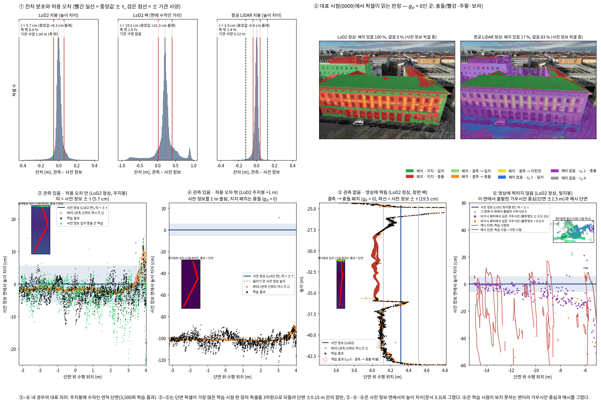

<!-- PHD-STAGE2-R8-FOUR-CASES-v1 -->
# 10월 1일 확정한 둘째 단계를 코드에 넣고 네 경우의 동작을 확인하기 (r8)

> 작업 PHD-STAGE2-R8-FOUR-CASES-v1 (2026-10-01). 방법의 효과는 주장하지 않는다. 기준선 비교와 여러 건물 평가는 하지 않았다. `scientific_verdict: null`.
> **설계 문서**: 발주문 부록(방법론 설명 문서 10월 1일 확정본 발췌). 발주문 본문과 부록이 다른 곳은 찾지 못했다.
> **용어**: 문서에서 바뀐 이름을 쓴다. 사전 정보 패치(줄여서 패치)는 지난 '판정 단위'(코드 이름 `location`)이고, 관측 신뢰도 마스크는 지난 '관측 신뢰도 지도'(코드 이름 `A`)이다.
> **장면**: r5~r7과 같은 B0(대상 건물 DEBY_LOD2_4959323)이다. 학습 시점 13장과 시험 시점 2장을 쓴다.
>   - 설정: LoD2 정상, LoD2 주지붕 +1 m, 항공 LiDAR 정상, 항공 LiDAR 주지붕 +1 m
>   - 선택 설정 LoD2 그늘진 지붕 끝 +1 m는 사전 측정 표 나·다에만 넣었다.
> **학습**: 지난 학습 실험(r6)과 같은 일정이다(3,500회, 시드 0, 1600 × 1157, 기반 설정 그대로). 다섯 번 학습했다: 위 네 설정과, LoD2 정상에서 사전 정보 깊이 항을 끈 학습.
> **고정 값**: 다수의 기준 2/3, 최소량 5곳, 최대 거리 1 m, 패치 0.25 m, 다시 읽기 500회, 보호 문턱 0.5, 학습률 배율 0.01, 불투명도 하한 0.5, 절단 4τ, NMAD 배수 2.5, 걸러내기 3배. 값은 바꾸지 않았다.

## 답 — 목적의 네 물음

**1. 코드가 문서의 설계와 같은가. — 같다.** 바꾸는 것 열 가지와 4장의 나머지 규칙을 모두 문서대로 넣었다(1절).
- **확인**: 모두 통과했다(2절).
  - 단위 시험 24건, GPU 시험 6묶음
  - 네 설정의 초기화 실행과 오프라인 대조: 전파·자리·심기·첫 보호·gₚ 지도가 numpy 계산과 모든 픽셀에서 같다.
- **문서대로이지만 문서의 취지와 어긋나 보이는 동작 하나**
  - 지지 영역에서 충돌로 판정된 패치의 사전 정보 가우시안이 학습 중에 보호된다.
  - 관측을 따라 세워진 표면이 그 패치보다 0.5 m 넘게 앞에 렌더링되면, 다시 읽을 때 그 패치를 '본 시점 없음'(c̄ᵢ = 0)으로 읽는다. 식 (7)은 전파된 충돌만 빼므로 이 가우시안은 보호된다.
  - 3,500회에 LoD2 정상 6,967개, 항공 LiDAR 정상 3,232개다(표 4-3).
  - 고치지 않았고 제안으로만 적었다(7절).
- **문서에 없어 구현이 정한 것**: 8가지다(6절).

**2. 사전 측정이 r7과 무엇이 달라지나.** (3절)
- **허용 오차**: 사양 하한이 빠졌다.
  - LoD2 지붕 1.00 → 0.0568 m, 항공 LiDAR 0.12 → 0.0394 m
  - LoD2 벽 0.1945 m는 그대로다.
  - 기관 사양보다 큰 τ가 없어 경고는 없다.
- **패치의 상태는 r7과 같다.** LoD2 정상은 지지 77,109, 결측 5,700, 비가시 154,598이다.
- **달라진 것은 표와 전파다.**
  - LoD2 정상 지지 패치의 충돌 35.6 → 55.5 %
    - 주지붕 3.4 → 15.4 %, 끝 경사면 41.9 → 98.0 %, 날개 지붕 11.5·10.4 → 82.8·74.7 %
  - LoD2 +1 m 주지붕의 충돌 71.6 → 100 %
  - LoD2 정상 결측의 전파: 충돌 2,150 → 2,627, 일치 954 → 407, 혼재 210 → 280, 근거 부족은 2,386 그대로
- **패치가 없는 픽셀**: LoD2에는 없다.
  - 항공 LiDAR에서는 사전 정보 픽셀의 85–86 %다(지면과 가파른 삼각형).
  - 그 가운데 84 %가 cₚ 1이고, cₚ 1의 82 %가 충돌이다.
  - r7에서는 이 픽셀이 cₚ 1이면 사전 정보 깊이 항이 꺼졌다.
- **사전 정보 깊이 항이 작용하는 픽셀** (학습 해상도): gₚ가 1 − cₚ를 대신해, 관측이 있고 허용 오차 안인 곳에서도 켜진다.
  - LoD2 정상 6.0 → 49.8 %
  - 항공 LiDAR 정상 14.7 → 39.6 %
- **비가시 영역의 점은 이제 심는다.**
  - LoD2 정상 78,974개(r7 0), 항공 LiDAR 정상 18,328개
  - 항공 LiDAR의 패치 없는 점은 72,164개를 모두 심는다(r7 50,294).
- **처음 보호되는 가우시안**
  - LoD2 정상 1,353 → 80,090개(비가시 78,974 + 결측 1,116)
  - 항공 LiDAR 정상 14,495 → 54,395개(비가시 18,328 + 패치 없음 35,354 + 결측 713)

**3. 네 경우가 의도대로 동작하나. — 3,500회의 짧은 학습에서 네 경우 모두 의도한 방향으로 움직였다.** 경우 3·4에는 단서가 있다(4·5절).
- **관측 있음, 허용 오차 안 (gₚ 1)**: 사전 정보를 기준으로 관측을 따라 다듬어진다는 기대와 맞는다.
  - LoD2 정상 지붕 패치에서 결과는 MVS에서 중앙값 1.7 cm이고, 사전 정보에서 τ 안에 91.5 %가 머문다.
  - 사전 정보 깊이 항을 끄면 2.0 cm, 85.6 %다.
  - 항을 켜면 사전 정보의 폭 안에 더 머물고(+5.9 %포인트), MVS에도 더 가깝다(τ 안 93.6 % 대 89.9 %).
  - 벽 패치도 같은 방향이다(사전 정보에서 τ 안 87.3 % 대 83.3 %).
- **관측 있음, 허용 오차 밖 (gₚ 0)**: 관측을 따라 보정됐다.
  - LoD2 정상의 충돌 지지 패치 픽셀에서 결과는 MVS에서 τ 안 87.0 %, 사전 정보에서 τ 안 9.2 %다.
  - 1 m 올린 주지붕은 각각 77.9 %, 0.0 %다. 결과는 올린 사전 정보보다 1.02 m 아래에 있다.
- **관측 없음, 영상에 찍힘 (cₚ 0, 결측 패치)**
  - 충돌(gₚ 0): 영상과 주변 관측이 표면을 세웠다.
    - LoD2 정상 30만 픽셀이다. 전파 충돌 패치의 절반(1,308 / 2,627)은 정면 벽 3403이다.
    - 결과는 사전 정보에서 +26.5 cm 물러났고(사전 정보에서 τ 안 11.9 %), 99.9 %가 세워졌다.
    - 참고: 참값에서 τ 안 92.2 %다.
  - 일치·미판정(gₚ 1): 사전 정보를 이어받는 쪽으로 움직였다. 그러나 절반 넘게 이어받은 것은 일치뿐이다.
    - 사전 정보에서 τ 안: 일치 72.3 %, 미판정 42.7 %
    - 깊이 항을 끄면 56.3 %, 28.0 %다.
  - 변화를 넣은 면: 넣은 변화 쪽으로 옮겨 가지 않았다.
    - 주입 면 결측 패치의 충돌 픽셀에서 결과가 올린 사전 정보에서 τ 안인 것은 LoD2 0.3 %, 항공 LiDAR 0.1 %다.
    - 미판정 픽셀은 LoD2에서 10.2 %가 올린 사전 정보를 따랐다.
    - 이 픽셀은 대부분 실제 지붕 가장자리 너머의 벽과 지면이 보이는 자리다. 참고: 참값이 올린 사전 정보보다 중앙값 2.5 m 아래다.
    - 항공 LiDAR 주입 면에서는 이 픽셀의 12.5 %가 세워지지 않았다.
- **영상에 찍히지 않음**: 사전 정보가 상속됐다. 메시에 담는 일은 시점을 더해야 절반을 넘는다.
  - LoD2 정상 비가시 패치의 가우시안 78,974개 가운데 78,408개(99.3 %)가 남았다.
  - 98.6 %가 불투명도 0.5 이상이고, 옮겨 간 거리(uᵢ)의 중앙값은 3.6 mm다.
  - 메시 0.25 m 안에 담긴 몫: 학습 시점만 쓰면 4.4 %, 시점을 더하면 66.5 %(항공 LiDAR 87.4 %)
  - 대상 건물 바닥면은 벽 안쪽이라 담기지 않는다(2 %).
  - 더한 시점의 메시는 뒷지붕 면을 이루지 않고 세로 조각이 많다(그림 ⑥). 이 가우시안은 기울기를 받지 않아 처음의 무작위 방향 그대로다.

**4. 문서에 없어 구현이 정한 것.** (6절)
- **uᵢ를 재는 방식**: 3차원 거리가 아니라 높이 차이로 잰다.
  - 처음 앉은 패치의 면에 대해 지붕형은 높이 차이, 벽형은 면에 수직인 거리, 패치 없음은 연직 차이다.
  - 절단(식 (5))과 같은 거리로 맞추려는 것이다.
  - 3차원 거리였다면 3,500회에 LoD2 정상 2,279개, 항공 LiDAR 정상 22,140개의 보호가 더 풀렸다.
- **보이지 않는 가우시안을 메시에 담는 방법**: 시점을 더해 깊이를 렌더링한다.
  - 기반 구현이 학습 카메라가 못 보는 가우시안을 메시에 담을 때 쓰는 가상 시점 함수와 TSDF를 그대로 쓴다.
  - 겨냥은 '학습 시점에서 보이지 않는 대상 건물 바깥면의 가우시안'으로 정했다.
  - 0.10 m 칸을 쓰고, 융합은 크롭 상자 안으로 한정했다.
- **그 밖**: 다시 읽기의 3×3 표본점과 가림 0.5 m(r6·r7 값), 패치 없는 가우시안의 첫 c̄ᵢ의 한 방향 가림, 둘째 윤곽의 건물 삼각형 규칙, 가파른 삼각형의 허용 오차, 학습을 멈추지 않는 점검, 기록 출력.

**본 실험 발주 판단에 쓸 사실.** 판단은 검토자가 한다.
- 규칙 구현의 시험과 대조는 모두 통과했다.
- 짧은 학습에서 네 경우가 의도한 방향으로 움직였다.
- 정해야 할 것으로 보이는 셋(7절 제안):
  - (가) 지지 영역 충돌 패치 위의 보호: 식 (7)에 직접 판정(지지 패치의 충돌 표)도 넣을지
  - (나) 비가시 가우시안의 방향: 사전 정보 면의 법선으로 시작할지(지금은 기반 구현의 무작위)
  - (다) LoD2 바닥면: 벽 안쪽이라 어느 시점도 보지 못하는데 심고 보호한다. LoD2 정상에서 21,719 패치이고, 끝에 남은 가우시안은 11,595개다.



- **그림 읽는 법**
  - ③·④·⑥은 사전 정보 면에서의 높이 차이(cm)로 그렸다. 0이 사전 정보이고, 띠는 ± τ다.
  - ③: 검은 점(결과)은 띠 안에 머물며 주황(MVS)을 따른다. 초록(깊이 항 끔)은 띠 밖으로 더 흩어진다.
  - ④: 결과와 MVS가 올리기 전 높이(−100 cm)에 있다.
  - ⑤: 빨간 동그라미(cₚ 0, 결측 → 충돌 픽셀의 결과)가 LoD2 벽보다 약 0.2 m 안쪽에 있다. 실제 벽(주황, 이웃 관측)과 같은 자리다.
  - ⑥: 보라(비가시 패치에서 심은 가우시안)는 면 가까이 남았다. 빨간 선(더한 시점의 메시)은 세로 조각이다. 오른쪽 위 법선 그림이 무작위 방향을 보인다.

## 1. 구현 대조표

- **줄 번호 표기**: `J8` = `scripts/phd/stage2_r8_four_cases_v1/jbgs_judgment.py`(포크 r8의 같은 파일과 sha256 동일), `M2` = `src/phd/prior_propagation_v2/`(공용 모듈 v2, 포크에 복사해 sha256 확인), `S1` = `scripts/phd/stage2_r8_four_cases_v1/stage1_products_r8.py`, `GM` = 포크의 `scene/gaussian_model.py`(r7과 글자까지 같음).
- **코드 이름**: 패치 = `location`(store의 칸), 관측 신뢰도 마스크 = `A`(conf 지도), 가우시안 신뢰도 = `E`, 전파된 판정 = `J`, 패치의 판정(지지 패치의 표 또는 전파된 판정) = `J_loc`.

### 1-1. 바꾸는 것 열 가지

| 항목 | 문서 (부록) | 코드 위치 | 같음 / 다름 | 비고 |
|---|---|---|---|---|
| 1. 사전 정보 깊이 항의 가중 gₚ | 1 − cₚ 대신 gₚ. 픽셀이 보는 패치의 판정으로 정하고, 직접 판정(지지 패치의 표)과 전파받은 판정을 같게 읽는다. 초기화에서 한 번 정한다. 관측 깊이 항의 가중 cₚ는 그대로 | 규칙 `M2/rule.py:81 prior_term_off`. 학습 해상도의 gₚ 지도를 초기화에서 한 번 만든다 `J8:730 _g_init`(패치 지도 `locmap/` + 패치 판정표 `J_loc`). 손실 `J8:819`(무게 = gₚ). 관측 항은 `weighted_l1(D, M, A)` 그대로 | 같음 | 대조: 포크의 gₚ와 numpy로 다시 계산한 gₚ가 네 설정 학습 시점 13장의 모든 픽셀(설정마다 24,065,600)에서 같다(`verify_dry_r8.py`) |
| 2. 패치가 없는 픽셀과 가우시안 | 픽셀: cₚ 0이면 gₚ 1, cₚ 1이면 그 픽셀의 표시(일치 1, 충돌 0), 이웃에서 전파받지 않음. 가우시안: 중심을 본 시점 가운데 중심 픽셀의 cₚ가 1인 시점의 비율, 전파된 판정 없음 | 픽셀: 같은 `prior_term_off`(패치 없음 분기), 표시 지도 `markmap/`(S1이 저장). 가우시안: `M2/seat.py:81 centre_E`(한 방향 가림), 초기화 `J8:680`(사전 정보 깊이로 가림), 다시 읽기 `J8:956`(그때의 렌더링으로 가림). 전파된 판정은 `J_NONE` | 같음 | 본 시점이 없으면 0(`centre_E`) |
| 3. 일치·충돌 표시의 범위 | 사전 정보가 보이고 cₚ 1인 모든 픽셀. 건물 면이 아닌 픽셀은 지붕면의 허용 오차와 견줌. 허용 오차의 잔차는 건물 면에서만 | `S1 step_product`: 사전 정보 픽셀 전부에 \|MVS − 사전 정보\| × f ≤ τ로 표시하고 `markmap/<시점>.npy`로 저장. 건물 면은 면 종류의 τ, 아니면 지붕 τ. 허용 오차 표본은 `S1 step_tau`(대상 건물의 건물 면, cₚ 1) | 같음 | 이 장면에서 건물 면이 아닌 픽셀은 항공 LiDAR의 지면·가파른 삼각형뿐이고, 항공 LiDAR는 벽 τ = 지붕 τ라서 r7의 '실측 폭' 표시와 픽셀 단위로 같다(입력 대조: τ 지도가 r7 실측 폭 지도와 모든 시점에서 같음) |
| 4. 허용 오차 | τ = 2.5 × NMAD만. 기관 사양은 하한이 아니며 출처와 함께 적어 견주고, τ가 사양보다 크면 경고 | `M2/tolerance.py:35 tolerance`(하한을 되살리는 인자가 없음), 사용 `S1 step_tau`, 결과 `stage1/tolerance.json`(사양·출처·견준 결과·경고) | 같음 | 경고 없음(지붕 τ가 두 사양보다 작음, 벽은 사양 없음; 표 가). 시험: 사양 0.12에서도 τ = 0.05, 하한 인자를 넘기면 TypeError |
| 5. 건물 윤곽의 둘째 출처 | 윤곽이 없으면 분류로 건물·비건물 경계만, 건물끼리는 가파른 삼각형으로. 분류도 없으면 삼각형의 이어짐만. 비건물과 가파른 삼각형에는 번호 없음 | `M2/outlines.py:100 building_triangles`(꼭짓점 셋 가운데 둘 이상이 건물 분류인 삼각형), `M2/surfaces.py:40 tin_surfaces(building=…)`(비건물 완만한 삼각형 = `NONBUILDING`, 가파른 삼각형 = `STEEP`, 번호 없음; 분류가 없으면 `building=None`) | 같음 | 이 장면은 주어진 윤곽(LoD2 바닥면)이 있어 학습은 r7처럼 첫째 출처를 쓴다. 둘째 출처는 표면 수만 견줬다(표 나 아래 작은 표) |
| 6. 비가시 영역의 점 | 빼지 않고 심는다. 본 시점이 없으면 c̄ᵢ = 0이라 보호되고, 불투명도 초기화와 제거에서 빠진다. 메시 뒤 사전 정보 조각을 합치던 단계는 없앤다 | 심기 `J8:684`(빼는 것은 결측·전파 충돌뿐), 첫 c̄ᵢ = 제품의 패치 E(비가시 = 0) `J8:682`, 보호 `J8:977`, 초기화·제거 면제 `GM:235 reset_opacity(exempt)`·`GM:505`(제거)·`GM:452,479`(분할·복제)·`GM:511`(기울기 누적) | 같음 | 합치던 단계: r7은 심지 않은 비가시 조각을 `unplanted.npz`로 남겼고 합치는 코드는 없었다. r8은 비가시 점을 심으므로 남기는 조각이 없다. GPU 시험 4: c̄ᵢ 0 → 보호 → 초기화·가지치기 뒤에도 남음 |
| 7. 보호 대상 (식 (7)) | 사전 정보 출신 ∧ 전파된 판정 ≠ 충돌 ∧ c̄ᵢ < 0.5 ∧ uᵢ ≤ 4τ. uᵢ를 어떻게 재는지 보고 | `J8:934–977 update_E_r8`, uᵢ = `M2/conversion.py:64 offset_metres`(`J8:917 u_offsets`) | 같음 (uᵢ의 측정은 정함) | uᵢ = 초기 위치에서 옮겨 간 변위를 잔차처럼 잰 값: 지붕형 패치는 처음 앉은 패치 평면 위의 높이 차이, 벽형은 그 면에 수직인 거리, 패치 없음은 연직 차이. τ도 그 면 종류의 값(패치 없음은 지붕 τ). 3차원 거리는 함께 기록(6절 ①) |
| 8. 초기화 | 충돌을 전파받은 결측 영역의 점만 심지 않음. 지지 영역의 점은 판정과 무관하게, 패치 없는 점은 모두 심음 | `J8:632 prop_init`(`drop = 결측 ∧ 전파 충돌`, `J8:684`) | 같음 | 대조: 충돌 위에 심은 점 0, 그 밖에 심지 않은 점 0(네 설정) |
| 9. 평가용 출력 | 가우시안마다 출처·초기 위치·c̄ᵢ와 전파된 판정의 마지막 값·패치 없음 표시, 초기 가우시안마다 제거 이력, 패치마다 미판정의 이유 | 덤프 `dump/iteration_3500/gaussians.npz`(`J8:1297 _r8_records`: origin, init_position, E, E_cnt, judgment, unit_judgment, no_unit, u, drift_3d, init_category), 제거 이력 `J8:590 _record_removal`(초기 가우시안마다 사라진 반복과 그때의 불투명도; 분할 부모는 자식이 이어 가므로 제거가 아님), 패치 `monitor/locations.npz`(`M2/rule.py:65 undetermined_why`: 비가시 / 혼재 / 같은 표면에 지지 패치 없음 / 최대 거리 안에 최소량 미만) | 같음 | 보호 기록 `monitor/E.jsonl`(500회마다 보호 수, 풀린 까닭별 수) |
| 10. 메시 변환 | 학습 시점에서 보이지 않는 가우시안도 메시에 담는 방법을 정해 보고 | `scripts/phd/stage2_r8_four_cases_v1/mesh_r8.py` | 정함 | 기반 구현이 학습 카메라가 못 보는 가우시안을 메시에 담으려 쓰는 길(`render.py`의 `create_virtual_cameras_for_completion` + TSDF)을 그대로 쓰고, 겨냥을 '학습 시점에서 보이지 않는 대상 건물 바깥면의 가우시안'으로 바꿨다(6절 ②) |

### 1-2. 4장의 나머지 규칙

| 절 | 문서 | 코드 위치 | 같음 / 다름 | 비고 |
|---|---|---|---|---|
| 4.1 | 결과물 넷(관측 신뢰도 마스크, 허용 오차, 표면 번호, 일치·충돌 표시)을 학습 내내 같은 값으로 읽음 | 마스크 `inputs/maps/conf`, τ 지도 `inputs/<설정>/tau`(τₚ = τ/fₚ), 표면 번호·패치 `store_*.npz`·`locmap/`, 표시 `markmap/` → `J8:441–… __init__`·`_g_init`에서 한 번 읽음 | 같음 | – |
| 4.2 패치 | 표면을 0.25 m 간격으로 나눈 작은 면. 본 시점 = 영상 안·다른 표면에 가리지 않음, 지지 시점 = 그 패치 픽셀의 절반 이상이 cₚ 1, 지지 / 결측 / 비가시 = 본 시점의 절반 이상이 지지 / 그보다 적음 / 본 시점 없음 | `M2/locations.py:90,133`(패치), `M2/rule.py:33 location_state`(사전 정보 렌더링의 픽셀 수로 본 시점, 13 학습 시점) | 같음 | 사전 정보 렌더링에서 그 패치에 떨어진 픽셀이 있으면 본 시점이다(가림은 렌더링이 처리) |
| 4.2 표 | 시점 안 픽셀 표시 다수결, 지지 시점들의 다수결, 동률은 일치 | `M2/rule.py:33`(시점: 일치 ≥ 충돌이면 일치, 패치: 충돌 시점 > 일치 시점일 때만 충돌) | 같음 | 지난 발주의 '구현이 정한 시점 표시'가 이제 문서에 있다 |
| 4.2 전파 | 같은 표면 안, 가까운 지지 패치부터, 최소량 5곳에서 멈춤, 최대 거리 1 m, 거리는 표면 위 패치 사이, 3분의 2, 혼재, 근거 부족 | `M2/locations.py:258 k_nearest_support`, `:286 propagate`, `M2/rule.py:50 judge` | 같음 | 대조: 포크의 전파 = numpy 전파(네 설정) |
| 4.2 c̄ᵢ (식 (1)) | 앉은 패치를 본 시점 가운데 지지한 시점의 비율, 본 시점 없으면 0. 가림은 한 방향, 첫 계산은 사전 정보 깊이로 | 첫 값 = 제품의 패치 E `J8:682`, 다시 읽기 `M2/seat.py:51 reread_E`(패치당 3×3 표본점, 렌더링 기대 깊이로 한 방향 가림) | 같음 (재는 방식 하나 정함) | 다시 읽을 때 패치의 '픽셀'을 3×3 표본점으로 센다(r7과 같음, 6절 ③) |
| 4.2 읽는 시점 | 픽셀 쪽은 초기화에서 한 번, 가우시안 쪽은 처음과 500회마다. 앉은 패치 = 처음 앉은 표면에서 현재 중심에 가장 가까운 패치. 표시를 새로 만들지 않음 | `J8:831 due_E`(1회와 500의 배수), `J8:763 seat_now`(초기 표면 → 가장 가까운 칸), 판정은 초기 표에서만 읽음 | 같음 | – |
| 4.3 | 사전 정보 표면의 점 + SfM 점, 출처와 초기 위치, 크기·방향·불투명도·색은 기반 구현, c̄ᵢ와 전파된 판정은 후보 점마다 초기화에서 | `origin.npy`, `J8 __init__`(init_id, init_xyz), 기반 `create_from_pcd`(불투명도 0.1, 방향 무작위, 크기 = 이웃 거리), `J8:632` | 같음 | 방향이 무작위로 시작하므로 기울기를 받지 않는 비가시 가우시안은 끝까지 무작위 방향이다(7절) |
| 4.4 손실 | 식 (2) λ_O = λ_P = 0.05, 식 (3) cₚ 가중 L1 첫 반복부터, 식 (4) Ωᴾ에서 gₚ, 식 (5) 세 구간 τₚ = τ/fₚ·절단 4τ, 둘 다 \|Ω\|로 나눔, 광도 항·정칙화 기반 그대로, 깊이 왜곡 0, 법선 일치 7,000회부터 | `J8:800 losses`, `J8:164 rho_truncated`, `J8:207 truncated_prior_loss`, 무게 0.05는 실행 인자, 나눔 = 시점 픽셀 수(`jbgs_depth_norm pixels`), `opt.lambda_dist = 0`, 법선 `train.py`(7,000회 초과) | 같음 | 3,500회 학습이라 법선 일치 항은 작동하지 않았다 |
| 4.5 | 식 (8) 위치·회전·크기 학습률 × 0.01(색은 그대로), 식 (9) 불투명도 ≥ 0.5, 다시 계산할 때마다 보호 대상을 새로 정함 | `J8:1116 before_step`·`:1125 after_step`(아담 갱신의 0.01만 남김), `J8:846 floor_now`(보호가 걸리는 순간)·`after_step`(매 반복) | 같음 | r6·r7과 글자까지 같음(GPU 시험 1) |
| 4.6 | 보호된 가우시안은 복제·분할·제거·기울기 누적·불투명도 초기화에서 빠짐, 보호 밖은 기반 규칙, 자식은 출처와 초기 위치 승계, c̄ᵢ·전파된 판정·보호는 승계하지 않음 | `GM:452,479,505,511,235`, 자식 `GM densify_and_split/clone`(origin, init_id 승계), 새 행은 다음 읽기 전까지 E·판정이 비어 있고 보호도 아님(`J8:613 ROWS`) | 같음 | 기반 일정: 500–15,000회 100회마다, 불투명도 0.05 미만 제거, 3,000회 뒤 크기 제거, 3,000회마다 불투명도 초기화 |

## 2. 시험과 대조

| 시험 | 내용 | 결과 |
|---|---|---|
| 공용 모듈 단위 시험 | `tests/phd/test_prior_propagation_v2.py`, CPU 24건 | 24건 통과 |
| | v1에서 이어진 16건: 환산, 거르기, 표면, 패치 상태, 전파, 칸 찾기, 다시 읽기, 분류 덩어리 | |
| | 허용 오차: 사양이 하한이 아니다(사양 0.12 m에서 τ 0.05 m). 하한을 되살리는 인자가 없다. 지붕 값 대체. 파이프라인 값 = 폭 | |
| | gₚ: 네 경우 × 패치 있음·없음의 13가지 조합에서 기대값이 나온다(numpy와 torch) | |
| | 미판정의 이유 네 가지 | |
| | 둘째 윤곽: 분류는 건물·비건물만 가르고, 건물끼리는 가파른 삼각형으로 나눈다. 비건물·가파른 삼각형에는 번호가 없다 | |
| | uᵢ: 면을 따라 옮기면 0이다. 지붕형은 높이, 벽형은 법선, 패치 없음은 연직으로 잰다. numpy와 torch가 같다 | |
| | 패치 없는 가우시안의 c̄ᵢ: 가림은 한 방향이고, 본 시점이 없으면 0이다 | |
| GPU 시험 | `gpu_tests_r8.py`, 실제 가우시안 모델로 6묶음 | 통과 |
| | ① r7과 글자까지 같은 것: 잠금, 하한, 초기화 면제, 손실 보조 함수, 밀도 제어(`scene/gaussian_model.py`), `train.py` | |
| | ② gₚ 지도: 패치의 판정이 그 패치의 모든 픽셀에 간다. 패치가 없으면 cₚ와 자기 표시를 따른다 | |
| | ③ 사전 정보 깊이 항이 gₚ로 작동한다. cₚ 1·gₚ 1에서 당기고(r7 무게가 0이던 곳), gₚ 0에서 당기지 않는다. 관측 항은 cₚ 그대로다 | |
| | ④ 비가시 가우시안: c̄ᵢ 0 → 보호 → 불투명도 하한 0.5. 불투명도 초기화와 가지치기 뒤에도 남는다. 다른 가우시안의 제거 이력이 남는다 | |
| | ⑤ 식 (7): 면을 따라 0.5 m 미끄러져도 보호된다. 높이 0.21 m(> 4τ)면 풀린다. 벽은 법선 거리, 패치 없음은 연직으로 잰다. 전파된 충돌은 뺀다. 풀린 까닭이 기록된다 | |
| | ⑥ 자식이 이어 가는 분할 부모는 제거로 세지 않는다 | |
| 초기화 실행 | 포크 r8을 네 설정에서 첫 반복 직전까지 실행했다. 다시 읽기 시험도 함께 했다 | 4회 통과 |
| 오프라인 대조 | `verify_dry_r8.py`, 네 설정 | 모두 통과 |
| | 포크의 전파, 패치 판정, 미판정 이유가 numpy 계산과 같다. 자리는 100 % 같다 | |
| | 충돌 위에 심은 점 0, 그 밖에 심지 않은 점 0 | |
| | 비가시 점의 첫 c̄ᵢ는 모두 0이다 | |
| | 첫 보호 수가 규칙으로 센 수와 같다(LoD2 정상 80,090) | |
| | gₚ가 학습 시점 13장의 모든 픽셀(설정마다 24,065,600)에서 같다 | |
| | 다시 읽기 시험 통과 | |
| 입력 대조 | `prepare_r8_inputs.py`: 첫째·둘째 단계 환산 지도의 차 0.0, τ 지도 = r7 실측 폭 지도(모든 시점), 자리 = r7, 패치 수 = r7 | 모두 같음 |
| 학습 | 다섯 번, 3,500회 | 모두 끝까지 갔다(영수증 PASS) |

## 3. 사전 측정 (학습 없음) — r7 대비

- **r7 값**: r7 보고서의 채택값이다(기관 사양을 하한으로 쓴 허용 오차). r7의 저장 표(`state_spec`·`vote_spec`)와 초기화 실행(`runs/<설정>_spec`)을 같은 전파 코드로 다시 셌다.
- **패치의 상태**(지지·결측·비가시)는 r7과 패치마다 같다(스크립트에서 확인). 그래서 표 나의 'r7 대비'에는 표와 전파된 판정의 차이만 적었다.
- **선택 설정**(LoD2 그늘진 지붕 끝 +1 m)은 학습하지 않으므로 표 나·다에만 있다.

### 표 가. 허용 오차 (정상 장면, 15시점, cₚ = 1, 대상 건물의 건물 면; 지붕 = 높이 차이, 벽 = 면에 수직인 거리)

| 사전 정보 | 면 | 표본 수 | 정합 뒤 중앙값 (거르기 전 → 뒤) | NMAD (거르기 전 → 뒤) | 걸러낸 비율 | 허용 오차 τ = 2.5 × NMAD | 기관 사양 (출처) | 견준 결과 | 경고 | r7 허용 오차 (채택된 쪽) | r7 대비 |
|---|---|---|---|---|---|---|---|---|---|---|---|
| LoD2 | 지붕 | 35,312,919 | +0.0055 → +0.0029 m | 0.0285 → 0.0227 m | 15.3 % | **0.0568 m** | 1.00 m (LoD2 높이 정확도) | τ가 사양보다 작음 | 없음 | 1.0000 m (기관 사양) | -0.9432 m |
| LoD2 | 벽 | 67,635,004 | +0.2130 → +0.2128 m | 0.1038 → 0.0778 m | 17.8 % | **0.1945 m** | 없음 | 사양 없음 | 없음 | 0.1945 m (실측 폭) | +0.0000 m |
| 항공 LiDAR | 지붕 | 32,743,538 | -0.0009 → -0.0001 m | 0.0176 → 0.0158 m | 7.7 % | **0.0394 m** | 0.12 m (바이에른 항공 LiDAR 연직 정확도) | τ가 사양보다 작음 | 없음 | 0.1200 m (기관 사양) | -0.0806 m |
| 항공 LiDAR | 벽 | 0 | – | – | – | **0.0394 m** (지붕 값: 벽이 표면이 아님) | 없음 | 사양 없음 | 없음 | 0.1200 m (지붕 값) | -0.0806 m |

### 표 나. 표면별 패치 (한 칸 0.25 m; 수 / 넓이 m²; 일치·충돌 = 지지 영역 패치의 표, 결측의 판정 = 고정 값 2/3·5곳·1 m의 전파)

| 설정 | 표면 | 종류 | 지지 | 일치 | 충돌 | 결측 | 결측 → 충돌 | 결측 → 일치 | 결측 → 혼재 | 결측 → 근거 부족 | 비가시 | r7 대비 (일치 / 충돌; 결측 → 충돌·일치·혼재·근거 부족) |
|---|---|---|---|---|---|---|---|---|---|---|---|---|
| LoD2 정상 | 면 3396 (주지붕) | 지붕 | 9,897 / 618.6 | 8,368 / 523.0 | 1,529 / 95.6 | 10 / 0.6 | 3 / 0.2 | 4 / 0.2 | 3 / 0.2 | 0 / 0.0 | 0 / 0.0 | -1,188 / +1,188; +3 · -4 · +1 · ±0 |
| LoD2 정상 | 면 3394 (그늘진 지붕 끝) | 지붕 | 1,121 / 70.1 | 587 / 36.7 | 534 / 33.4 | 553 / 34.6 | 162 / 10.1 | 34 / 2.1 | 45 / 2.8 | 312 / 19.5 | 0 / 0.0 | -534 / +534; +162 · -207 · +45 · ±0 |
| LoD2 정상 | 면 3404 (끝 경사면) | 지붕 | 937 / 58.6 | 19 / 1.2 | 918 / 57.4 | 0 / 0.0 | 0 / 0.0 | 0 / 0.0 | 0 / 0.0 | 0 / 0.0 | 0 / 0.0 | -525 / +525; ±0 · ±0 · ±0 · ±0 |
| LoD2 정상 | 면 3387 (날개 지붕) | 지붕 | 845 / 52.8 | 145 / 9.1 | 700 / 43.8 | 0 / 0.0 | 0 / 0.0 | 0 / 0.0 | 0 / 0.0 | 0 / 0.0 | 95 / 5.9 | -603 / +603; ±0 · ±0 · ±0 · ±0 |
| LoD2 정상 | 면 3389 (날개 지붕) | 지붕 | 806 / 50.4 | 204 / 12.8 | 602 / 37.6 | 0 / 0.0 | 0 / 0.0 | 0 / 0.0 | 0 / 0.0 | 0 / 0.0 | 139 / 8.7 | -518 / +518; ±0 · ±0 · ±0 · ±0 |
| LoD2 정상 | 면 3393 (뒷지붕) | 지붕 | 16 / 1.0 | 3 / 0.2 | 13 / 0.8 | 8 / 0.5 | 0 / 0.0 | 0 / 0.0 | 0 / 0.0 | 8 / 0.5 | 9,275 / 579.7 | -4 / +4; ±0 · ±0 · ±0 · ±0 |
| LoD2 정상 | 면 3401 (대상 건물 바닥면) | 지붕 | 24 / 1.5 | 1 / 0.1 | 23 / 1.4 | 0 / 0.0 | 0 / 0.0 | 0 / 0.0 | 0 / 0.0 | 0 / 0.0 | 21,719 / 1,357.4 | -14 / +14; ±0 · ±0 · ±0 · ±0 |
| LoD2 정상 | 면 3383 (이웃 건물) | 지붕 | 3,503 / 218.9 | 379 / 23.7 | 3,124 / 195.2 | 262 / 16.4 | 154 / 9.6 | 2 / 0.1 | 13 / 0.8 | 93 / 5.8 | 693 / 43.3 | -3,124 / +3,124; +154 · -167 · +13 · ±0 |
| LoD2 정상 | 면 3539 (이웃 건물) | 지붕 | 2,597 / 162.3 | 642 / 40.1 | 1,955 / 122.2 | 125 / 7.8 | 57 / 3.6 | 40 / 2.5 | 24 / 1.5 | 4 / 0.2 | 183 / 11.4 | -1,952 / +1,952; +57 · -79 · +22 · ±0 |
| LoD2 정상 | 면 3386 (이웃 건물) | 지붕 | 2,316 / 144.8 | 3 / 0.2 | 2,313 / 144.6 | 198 / 12.4 | 115 / 7.2 | 0 / 0.0 | 0 / 0.0 | 83 / 5.2 | 78 / 4.9 | -2,219 / +2,219; +28 · -20 · -8 · ±0 |
| LoD2 정상 | 면 3888 (이웃 건물) | 지붕 | 251 / 15.7 | 163 / 10.2 | 88 / 5.5 | 103 / 6.4 | 42 / 2.6 | 26 / 1.6 | 29 / 1.8 | 6 / 0.4 | 0 / 0.0 | -83 / +83; +42 · -55 · +13 · ±0 |
| LoD2 정상 | 면 3569 (이웃 건물) | 지붕 | 201 / 12.6 | 6 / 0.4 | 195 / 12.2 | 108 / 6.8 | 95 / 5.9 | 0 / 0.0 | 0 / 0.0 | 13 / 0.8 | 361 / 22.6 | -67 / +67; +17 · -3 · -14 · ±0 |
| LoD2 정상 | 면 3403 (정면 벽) | 벽 | 18,732 / 1,170.8 | 6,115 / 382.2 | 12,617 / 788.6 | 1,408 / 88.0 | 1,308 / 81.8 | 31 / 1.9 | 66 / 4.1 | 3 / 0.2 | 0 / 0.0 | ±0 / ±0; ±0 · ±0 · ±0 · ±0 |
| LoD2 정상 | 면 3391 (옆 벽) | 벽 | 5,796 / 362.2 | 3,235 / 202.2 | 2,561 / 160.1 | 56 / 3.5 | 47 / 2.9 | 2 / 0.1 | 7 / 0.4 | 0 / 0.0 | 0 / 0.0 | ±0 / ±0; ±0 · ±0 · ±0 · ±0 |
| LoD2 정상 | 면 3392 (대상 건물) | 벽 | 95 / 5.9 | 32 / 2.0 | 63 / 3.9 | 0 / 0.0 | 0 / 0.0 | 0 / 0.0 | 0 / 0.0 | 0 / 0.0 | 1,653 / 103.3 | ±0 / ±0; ±0 · ±0 · ±0 · ±0 |
| LoD2 정상 | 면 3388 (대상 건물) | 벽 | 33 / 2.1 | 7 / 0.4 | 26 / 1.6 | 0 / 0.0 | 0 / 0.0 | 0 / 0.0 | 0 / 0.0 | 0 / 0.0 | 2,133 / 133.3 | ±0 / ±0; ±0 · ±0 · ±0 · ±0 |
| LoD2 정상 | 면 3398 (대상 건물) | 벽 | 23 / 1.4 | 1 / 0.1 | 22 / 1.4 | 2 / 0.1 | 0 / 0.0 | 0 / 0.0 | 0 / 0.0 | 2 / 0.1 | 127 / 7.9 | ±0 / ±0; ±0 · ±0 · ±0 · ±0 |
| LoD2 정상 | 면 3390 (대상 건물) | 벽 | 17 / 1.1 | 0 / 0.0 | 17 / 1.1 | 0 / 0.0 | 0 / 0.0 | 0 / 0.0 | 0 / 0.0 | 0 / 0.0 | 1,199 / 74.9 | ±0 / ±0; ±0 · ±0 · ±0 · ±0 |
| LoD2 정상 | 면 3400 (대상 건물) | 벽 | 11 / 0.7 | 1 / 0.1 | 10 / 0.6 | 1 / 0.1 | 0 / 0.0 | 0 / 0.0 | 0 / 0.0 | 1 / 0.1 | 5,916 / 369.8 | ±0 / ±0; ±0 · ±0 · ±0 · ±0 |
| LoD2 정상 | 면 3397 (대상 건물) | 벽 | 6 / 0.4 | 0 / 0.0 | 6 / 0.4 | 0 / 0.0 | 0 / 0.0 | 0 / 0.0 | 0 / 0.0 | 0 / 0.0 | 4,478 / 279.9 | ±0 / ±0; ±0 · ±0 · ±0 · ±0 |
| LoD2 정상 | 면 3402 (대상 건물) | 벽 | 5 / 0.3 | 1 / 0.1 | 4 / 0.2 | 0 / 0.0 | 0 / 0.0 | 0 / 0.0 | 0 / 0.0 | 0 / 0.0 | 1,743 / 108.9 | ±0 / ±0; ±0 · ±0 · ±0 · ±0 |
| LoD2 정상 | 면 3837 (이웃 건물) | 벽 | 11,134 / 695.9 | 7,298 / 456.1 | 3,836 / 239.8 | 160 / 10.0 | 115 / 7.2 | 23 / 1.4 | 22 / 1.4 | 0 / 0.0 | 478 / 29.9 | ±0 / ±0; ±0 · ±0 · ±0 · ±0 |
| LoD2 정상 | 면 3880 (이웃 건물) | 벽 | 3,224 / 201.5 | 2,648 / 165.5 | 576 / 36.0 | 114 / 7.1 | 61 / 3.8 | 21 / 1.3 | 7 / 0.4 | 25 / 1.6 | 5,797 / 362.3 | ±0 / ±0; ±0 · ±0 · ±0 · ±0 |
| LoD2 정상 | 면 3535 (이웃 건물) | 벽 | 1,336 / 83.5 | 1,033 / 64.6 | 303 / 18.9 | 533 / 33.3 | 137 / 8.6 | 75 / 4.7 | 21 / 1.3 | 300 / 18.8 | 1,596 / 99.8 | ±0 / ±0; ±0 · ±0 · ±0 · ±0 |
| LoD2 정상 | 면 3858 (이웃 건물) | 벽 | 1,824 / 114.0 | 27 / 1.7 | 1,797 / 112.3 | 0 / 0.0 | 0 / 0.0 | 0 / 0.0 | 0 / 0.0 | 0 / 0.0 | 0 / 0.0 | ±0 / ±0; ±0 · ±0 · ±0 · ±0 |
| LoD2 정상 | 면 3381 (이웃 건물) | 벽 | 738 / 46.1 | 620 / 38.8 | 118 / 7.4 | 715 / 44.7 | 62 / 3.9 | 114 / 7.1 | 36 / 2.2 | 503 / 31.4 | 6,539 / 408.7 | ±0 / ±0; ±0 · ±0 · ±0 · ±0 |
| LoD2 정상 | 면 3461 (이웃 건물) | 벽 | 0 / 0.0 | 0 / 0.0 | 0 / 0.0 | 684 / 42.8 | 0 / 0.0 | 0 / 0.0 | 0 / 0.0 | 684 / 42.8 | 181 / 11.3 | ±0 / ±0; ±0 · ±0 · ±0 · ±0 |
| LoD2 정상 | 면 3479 (이웃 건물) | 벽 | 0 / 0.0 | 0 / 0.0 | 0 / 0.0 | 154 / 9.6 | 0 / 0.0 | 0 / 0.0 | 0 / 0.0 | 154 / 9.6 | 0 / 0.0 | ±0 / ±0; ±0 · ±0 · ±0 · ±0 |
| LoD2 정상 | 그 밖의 23개 표면 합 | 지붕 | 6,254 / 390.9 | 922 / 57.6 | 5,332 / 333.2 | 114 / 7.1 | 49 / 3.1 | 0 / 0.0 | 0 / 0.0 | 65 / 4.1 | 31,150 / 1,946.9 | -4,565 / +4,565; +14 · -12 · -2 · ±0 |
| LoD2 정상 | 그 밖의 43개 표면 합 | 벽 | 5,367 / 335.4 | 1,840 / 115.0 | 3,527 / 220.4 | 392 / 24.5 | 220 / 13.8 | 35 / 2.2 | 7 / 0.4 | 130 / 8.1 | 59,065 / 3,691.6 | ±0 / ±0; ±0 · ±0 · ±0 · ±0 |
| **LoD2 정상** | **전체 94개 표면** | – | 77,109 / 4,819.3 | 34,300 / 2,143.8 | 42,809 / 2,675.6 | 5,700 / 356.2 | 2,627 / 164.2 | 407 / 25.4 | 280 / 17.5 | 2,386 / 149.1 | 154,598 / 9,662.4 | -15,396 / +15,396; +477 · -547 · +70 · ±0 |
| LoD2 주지붕 +1 m | 면 3396 (주지붕) | 지붕 | 9,629 / 601.8 | 0 / 0.0 | 9,629 / 601.8 | 278 / 17.4 | 232 / 14.5 | 0 / 0.0 | 0 / 0.0 | 46 / 2.9 | 0 / 0.0 | -2,735 / +2,735; +25 · -5 · -20 · ±0 |
| LoD2 주지붕 +1 m | 면 3404 (끝 경사면) | 지붕 | 937 / 58.6 | 19 / 1.2 | 918 / 57.4 | 0 / 0.0 | 0 / 0.0 | 0 / 0.0 | 0 / 0.0 | 0 / 0.0 | 0 / 0.0 | -505 / +505; ±0 · ±0 · ±0 · ±0 |
| LoD2 주지붕 +1 m | 면 3387 (날개 지붕) | 지붕 | 801 / 50.1 | 153 / 9.6 | 648 / 40.5 | 4 / 0.2 | 4 / 0.2 | 0 / 0.0 | 0 / 0.0 | 0 / 0.0 | 135 / 8.4 | -542 / +542; +3 · ±0 · -3 · ±0 |
| LoD2 주지붕 +1 m | 면 3394 (그늘진 지붕 끝) | 지붕 | 117 / 7.3 | 38 / 2.4 | 79 / 4.9 | 400 / 25.0 | 69 / 4.3 | 5 / 0.3 | 5 / 0.3 | 321 / 20.1 | 1,157 / 72.3 | -79 / +79; +69 · -74 · +5 · ±0 |
| LoD2 주지붕 +1 m | 면 3389 (날개 지붕) | 지붕 | 380 / 23.8 | 94 / 5.9 | 286 / 17.9 | 0 / 0.0 | 0 / 0.0 | 0 / 0.0 | 0 / 0.0 | 0 / 0.0 | 565 / 35.3 | -286 / +286; ±0 · ±0 · ±0 · ±0 |
| LoD2 주지붕 +1 m | 면 3401 (대상 건물 바닥면) | 지붕 | 24 / 1.5 | 1 / 0.1 | 23 / 1.4 | 0 / 0.0 | 0 / 0.0 | 0 / 0.0 | 0 / 0.0 | 0 / 0.0 | 21,719 / 1,357.4 | -14 / +14; ±0 · ±0 · ±0 · ±0 |
| LoD2 주지붕 +1 m | 면 3393 (뒷지붕) | 지붕 | 5 / 0.3 | 1 / 0.1 | 4 / 0.2 | 3 / 0.2 | 0 / 0.0 | 0 / 0.0 | 0 / 0.0 | 3 / 0.2 | 9,291 / 580.7 | -3 / +3; ±0 · ±0 · ±0 · ±0 |
| LoD2 주지붕 +1 m | 면 3383 (이웃 건물) | 지붕 | 2,884 / 180.2 | 336 / 21.0 | 2,548 / 159.2 | 293 / 18.3 | 161 / 10.1 | 13 / 0.8 | 34 / 2.1 | 85 / 5.3 | 1,281 / 80.1 | -2,548 / +2,548; +161 · -195 · +34 · ±0 |
| LoD2 주지붕 +1 m | 면 3539 (이웃 건물) | 지붕 | 2,597 / 162.3 | 642 / 40.1 | 1,955 / 122.2 | 125 / 7.8 | 57 / 3.6 | 40 / 2.5 | 24 / 1.5 | 4 / 0.2 | 183 / 11.4 | -1,952 / +1,952; +57 · -79 · +22 · ±0 |
| LoD2 주지붕 +1 m | 면 3386 (이웃 건물) | 지붕 | 1,900 / 118.8 | 3 / 0.2 | 1,897 / 118.6 | 357 / 22.3 | 151 / 9.4 | 0 / 0.0 | 0 / 0.0 | 206 / 12.9 | 335 / 20.9 | -1,897 / +1,897; +151 · -151 · ±0 · ±0 |
| LoD2 주지붕 +1 m | 면 3888 (이웃 건물) | 지붕 | 251 / 15.7 | 163 / 10.2 | 88 / 5.5 | 103 / 6.4 | 42 / 2.6 | 26 / 1.6 | 29 / 1.8 | 6 / 0.4 | 0 / 0.0 | -83 / +83; +42 · -55 · +13 · ±0 |
| LoD2 주지붕 +1 m | 면 3569 (이웃 건물) | 지붕 | 198 / 12.4 | 6 / 0.4 | 192 / 12.0 | 111 / 6.9 | 98 / 6.1 | 0 / 0.0 | 0 / 0.0 | 13 / 0.8 | 361 / 22.6 | -66 / +66; +18 · -2 · -16 · ±0 |
| LoD2 주지붕 +1 m | 면 3403 (정면 벽) | 벽 | 18,732 / 1,170.8 | 6,115 / 382.2 | 12,617 / 788.6 | 1,408 / 88.0 | 1,308 / 81.8 | 31 / 1.9 | 66 / 4.1 | 3 / 0.2 | 0 / 0.0 | ±0 / ±0; ±0 · ±0 · ±0 · ±0 |
| LoD2 주지붕 +1 m | 면 3391 (옆 벽) | 벽 | 5,796 / 362.2 | 3,235 / 202.2 | 2,561 / 160.1 | 56 / 3.5 | 47 / 2.9 | 2 / 0.1 | 7 / 0.4 | 0 / 0.0 | 0 / 0.0 | ±0 / ±0; ±0 · ±0 · ±0 · ±0 |
| LoD2 주지붕 +1 m | 단차면 1 (올린 면 둘레) | 벽 | 1,054 / 65.9 | 22 / 1.4 | 1,032 / 64.5 | 6 / 0.4 | 6 / 0.4 | 0 / 0.0 | 0 / 0.0 | 0 / 0.0 | 0 / 0.0 | ±0 / ±0; ±0 · ±0 · ±0 · ±0 |
| LoD2 주지붕 +1 m | 단차면 3 (올린 면 둘레) | 벽 | 172 / 10.8 | 11 / 0.7 | 161 / 10.1 | 0 / 0.0 | 0 / 0.0 | 0 / 0.0 | 0 / 0.0 | 0 / 0.0 | 0 / 0.0 | ±0 / ±0; ±0 · ±0 · ±0 · ±0 |
| LoD2 주지붕 +1 m | 면 3392 (대상 건물) | 벽 | 95 / 5.9 | 32 / 2.0 | 63 / 3.9 | 0 / 0.0 | 0 / 0.0 | 0 / 0.0 | 0 / 0.0 | 0 / 0.0 | 1,653 / 103.3 | ±0 / ±0; ±0 · ±0 · ±0 · ±0 |
| LoD2 주지붕 +1 m | 면 3398 (대상 건물) | 벽 | 23 / 1.4 | 1 / 0.1 | 22 / 1.4 | 2 / 0.1 | 0 / 0.0 | 0 / 0.0 | 0 / 0.0 | 2 / 0.1 | 127 / 7.9 | ±0 / ±0; ±0 · ±0 · ±0 · ±0 |
| LoD2 주지붕 +1 m | 면 3388 (대상 건물) | 벽 | 21 / 1.3 | 7 / 0.4 | 14 / 0.9 | 0 / 0.0 | 0 / 0.0 | 0 / 0.0 | 0 / 0.0 | 0 / 0.0 | 2,145 / 134.1 | ±0 / ±0; ±0 · ±0 · ±0 · ±0 |
| LoD2 주지붕 +1 m | 면 3390 (대상 건물) | 벽 | 17 / 1.1 | 0 / 0.0 | 17 / 1.1 | 0 / 0.0 | 0 / 0.0 | 0 / 0.0 | 0 / 0.0 | 0 / 0.0 | 1,199 / 74.9 | ±0 / ±0; ±0 · ±0 · ±0 · ±0 |
| LoD2 주지붕 +1 m | 면 3400 (대상 건물) | 벽 | 3 / 0.2 | 1 / 0.1 | 2 / 0.1 | 1 / 0.1 | 0 / 0.0 | 0 / 0.0 | 0 / 0.0 | 1 / 0.1 | 5,924 / 370.2 | ±0 / ±0; ±0 · ±0 · ±0 · ±0 |
| LoD2 주지붕 +1 m | 단차면 2 (올린 면 둘레) | 벽 | 1 / 0.1 | 0 / 0.0 | 1 / 0.1 | 1 / 0.1 | 0 / 0.0 | 0 / 0.0 | 0 / 0.0 | 1 / 0.1 | 826 / 51.6 | ±0 / ±0; ±0 · ±0 · ±0 · ±0 |
| LoD2 주지붕 +1 m | 면 3402 (대상 건물) | 벽 | 1 / 0.1 | 0 / 0.0 | 1 / 0.1 | 0 / 0.0 | 0 / 0.0 | 0 / 0.0 | 0 / 0.0 | 0 / 0.0 | 1,747 / 109.2 | ±0 / ±0; ±0 · ±0 · ±0 · ±0 |
| LoD2 주지붕 +1 m | 단차면 4 (올린 면 둘레) | 벽 | 1 / 0.1 | 0 / 0.0 | 1 / 0.1 | 0 / 0.0 | 0 / 0.0 | 0 / 0.0 | 0 / 0.0 | 0 / 0.0 | 0 / 0.0 | ±0 / ±0; ±0 · ±0 · ±0 · ±0 |
| LoD2 주지붕 +1 m | 면 3837 (이웃 건물) | 벽 | 11,137 / 696.1 | 7,363 / 460.2 | 3,774 / 235.9 | 157 / 9.8 | 111 / 6.9 | 23 / 1.4 | 23 / 1.4 | 0 / 0.0 | 478 / 29.9 | ±0 / ±0; ±0 · ±0 · ±0 · ±0 |
| LoD2 주지붕 +1 m | 면 3880 (이웃 건물) | 벽 | 2,768 / 173.0 | 2,358 / 147.4 | 410 / 25.6 | 76 / 4.8 | 51 / 3.2 | 0 / 0.0 | 0 / 0.0 | 25 / 1.6 | 6,291 / 393.2 | ±0 / ±0; ±0 · ±0 · ±0 · ±0 |
| LoD2 주지붕 +1 m | 면 3858 (이웃 건물) | 벽 | 1,824 / 114.0 | 27 / 1.7 | 1,797 / 112.3 | 0 / 0.0 | 0 / 0.0 | 0 / 0.0 | 0 / 0.0 | 0 / 0.0 | 0 / 0.0 | ±0 / ±0; ±0 · ±0 · ±0 · ±0 |
| LoD2 주지붕 +1 m | 면 3535 (이웃 건물) | 벽 | 1,045 / 65.3 | 839 / 52.4 | 206 / 12.9 | 440 / 27.5 | 0 / 0.0 | 181 / 11.3 | 0 / 0.0 | 259 / 16.2 | 1,980 / 123.8 | ±0 / ±0; ±0 · ±0 · ±0 · ±0 |
| LoD2 주지붕 +1 m | 면 3381 (이웃 건물) | 벽 | 366 / 22.9 | 319 / 19.9 | 47 / 2.9 | 515 / 32.2 | 7 / 0.4 | 133 / 8.3 | 10 / 0.6 | 365 / 22.8 | 7,111 / 444.4 | ±0 / ±0; ±0 · ±0 · ±0 · ±0 |
| LoD2 주지붕 +1 m | 면 3461 (이웃 건물) | 벽 | 0 / 0.0 | 0 / 0.0 | 0 / 0.0 | 669 / 41.8 | 0 / 0.0 | 0 / 0.0 | 0 / 0.0 | 669 / 41.8 | 196 / 12.2 | ±0 / ±0; ±0 · ±0 · ±0 · ±0 |
| LoD2 주지붕 +1 m | 면 3479 (이웃 건물) | 벽 | 0 / 0.0 | 0 / 0.0 | 0 / 0.0 | 154 / 9.6 | 0 / 0.0 | 0 / 0.0 | 0 / 0.0 | 154 / 9.6 | 0 / 0.0 | ±0 / ±0; ±0 · ±0 · ±0 · ±0 |
| LoD2 주지붕 +1 m | 그 밖의 23개 표면 합 | 지붕 | 6,087 / 380.4 | 970 / 60.6 | 5,117 / 319.8 | 42 / 2.6 | 21 / 1.3 | 0 / 0.0 | 0 / 0.0 | 21 / 1.3 | 31,389 / 1,961.8 | -4,517 / +4,517; +14 · -12 · -2 · ±0 |
| LoD2 주지붕 +1 m | 그 밖의 45개 표면 합 | 벽 | 5,270 / 329.4 | 1,803 / 112.7 | 3,467 / 216.7 | 307 / 19.2 | 152 / 9.5 | 72 / 4.5 | 14 / 0.9 | 69 / 4.3 | 63,955 / 3,997.2 | ±0 / ±0; ±0 · ±0 · ±0 · ±0 |
| **LoD2 주지붕 +1 m** | **전체 99개 표면** | – | 74,136 / 4,633.5 | 24,559 / 1,534.9 | 49,577 / 3,098.6 | 5,508 / 344.2 | 2,517 / 157.3 | 526 / 32.9 | 212 / 13.2 | 2,253 / 140.8 | 160,048 / 10,003.0 | -15,227 / +15,227; +540 · -573 · +33 · ±0 |
| LoD2 그늘진 지붕 끝 +1 m | 면 3396 (주지붕) | 지붕 | 9,897 / 618.6 | 8,368 / 523.0 | 1,529 / 95.6 | 10 / 0.6 | 3 / 0.2 | 4 / 0.2 | 3 / 0.2 | 0 / 0.0 | 0 / 0.0 | -1,188 / +1,188; +3 · -4 · +1 · ±0 |
| LoD2 그늘진 지붕 끝 +1 m | 면 3394 (그늘진 지붕 끝) | 지붕 | 769 / 48.1 | 0 / 0.0 | 769 / 48.1 | 905 / 56.6 | 362 / 22.6 | 0 / 0.0 | 0 / 0.0 | 543 / 33.9 | 0 / 0.0 | -277 / +277; +117 · -60 · -57 · ±0 |
| LoD2 그늘진 지붕 끝 +1 m | 면 3404 (끝 경사면) | 지붕 | 937 / 58.6 | 19 / 1.2 | 918 / 57.4 | 0 / 0.0 | 0 / 0.0 | 0 / 0.0 | 0 / 0.0 | 0 / 0.0 | 0 / 0.0 | -525 / +525; ±0 · ±0 · ±0 · ±0 |
| LoD2 그늘진 지붕 끝 +1 m | 면 3387 (날개 지붕) | 지붕 | 845 / 52.8 | 145 / 9.1 | 700 / 43.8 | 0 / 0.0 | 0 / 0.0 | 0 / 0.0 | 0 / 0.0 | 0 / 0.0 | 95 / 5.9 | -603 / +603; ±0 · ±0 · ±0 · ±0 |
| LoD2 그늘진 지붕 끝 +1 m | 면 3389 (날개 지붕) | 지붕 | 806 / 50.4 | 204 / 12.8 | 602 / 37.6 | 0 / 0.0 | 0 / 0.0 | 0 / 0.0 | 0 / 0.0 | 0 / 0.0 | 139 / 8.7 | -518 / +518; ±0 · ±0 · ±0 · ±0 |
| LoD2 그늘진 지붕 끝 +1 m | 면 3401 (대상 건물 바닥면) | 지붕 | 24 / 1.5 | 1 / 0.1 | 23 / 1.4 | 0 / 0.0 | 0 / 0.0 | 0 / 0.0 | 0 / 0.0 | 0 / 0.0 | 21,719 / 1,357.4 | -14 / +14; ±0 · ±0 · ±0 · ±0 |
| LoD2 그늘진 지붕 끝 +1 m | 면 3393 (뒷지붕) | 지붕 | 13 / 0.8 | 3 / 0.2 | 10 / 0.6 | 3 / 0.2 | 0 / 0.0 | 0 / 0.0 | 0 / 0.0 | 3 / 0.2 | 9,283 / 580.2 | -3 / +3; ±0 · ±0 · ±0 · ±0 |
| LoD2 그늘진 지붕 끝 +1 m | 면 3383 (이웃 건물) | 지붕 | 3,597 / 224.8 | 396 / 24.8 | 3,201 / 200.1 | 62 / 3.9 | 54 / 3.4 | 1 / 0.1 | 7 / 0.4 | 0 / 0.0 | 799 / 49.9 | -3,201 / +3,201; +54 · -61 · +7 · ±0 |
| LoD2 그늘진 지붕 끝 +1 m | 면 3539 (이웃 건물) | 지붕 | 2,597 / 162.3 | 642 / 40.1 | 1,955 / 122.2 | 125 / 7.8 | 57 / 3.6 | 40 / 2.5 | 24 / 1.5 | 4 / 0.2 | 183 / 11.4 | -1,952 / +1,952; +57 · -79 · +22 · ±0 |
| LoD2 그늘진 지붕 끝 +1 m | 면 3386 (이웃 건물) | 지붕 | 2,316 / 144.8 | 3 / 0.2 | 2,313 / 144.6 | 198 / 12.4 | 115 / 7.2 | 0 / 0.0 | 0 / 0.0 | 83 / 5.2 | 78 / 4.9 | -2,219 / +2,219; +28 · -20 · -8 · ±0 |
| LoD2 그늘진 지붕 끝 +1 m | 면 3888 (이웃 건물) | 지붕 | 251 / 15.7 | 163 / 10.2 | 88 / 5.5 | 103 / 6.4 | 42 / 2.6 | 26 / 1.6 | 29 / 1.8 | 6 / 0.4 | 0 / 0.0 | -83 / +83; +42 · -55 · +13 · ±0 |
| LoD2 그늘진 지붕 끝 +1 m | 면 3569 (이웃 건물) | 지붕 | 201 / 12.6 | 6 / 0.4 | 195 / 12.2 | 108 / 6.8 | 95 / 5.9 | 0 / 0.0 | 0 / 0.0 | 13 / 0.8 | 361 / 22.6 | -67 / +67; +17 · -3 · -14 · ±0 |
| LoD2 그늘진 지붕 끝 +1 m | 면 3403 (정면 벽) | 벽 | 18,732 / 1,170.8 | 6,115 / 382.2 | 12,617 / 788.6 | 1,408 / 88.0 | 1,308 / 81.8 | 31 / 1.9 | 66 / 4.1 | 3 / 0.2 | 0 / 0.0 | ±0 / ±0; ±0 · ±0 · ±0 · ±0 |
| LoD2 그늘진 지붕 끝 +1 m | 면 3391 (옆 벽) | 벽 | 5,796 / 362.2 | 3,235 / 202.2 | 2,561 / 160.1 | 56 / 3.5 | 47 / 2.9 | 2 / 0.1 | 7 / 0.4 | 0 / 0.0 | 0 / 0.0 | ±0 / ±0; ±0 · ±0 · ±0 · ±0 |
| LoD2 그늘진 지붕 끝 +1 m | 단차면 2 (올린 면 둘레) | 벽 | 81 / 5.1 | 25 / 1.6 | 56 / 3.5 | 143 / 8.9 | 36 / 2.2 | 12 / 0.8 | 51 / 3.2 | 44 / 2.8 | 0 / 0.0 | ±0 / ±0; ±0 · ±0 · ±0 · ±0 |
| LoD2 그늘진 지붕 끝 +1 m | 단차면 1 (올린 면 둘레) | 벽 | 0 / 0.0 | 0 / 0.0 | 0 / 0.0 | 164 / 10.2 | 0 / 0.0 | 0 / 0.0 | 0 / 0.0 | 164 / 10.2 | 60 / 3.8 | ±0 / ±0; ±0 · ±0 · ±0 · ±0 |
| LoD2 그늘진 지붕 끝 +1 m | 면 3392 (대상 건물) | 벽 | 95 / 5.9 | 32 / 2.0 | 63 / 3.9 | 0 / 0.0 | 0 / 0.0 | 0 / 0.0 | 0 / 0.0 | 0 / 0.0 | 1,653 / 103.3 | ±0 / ±0; ±0 · ±0 · ±0 · ±0 |
| LoD2 그늘진 지붕 끝 +1 m | 면 3388 (대상 건물) | 벽 | 33 / 2.1 | 7 / 0.4 | 26 / 1.6 | 0 / 0.0 | 0 / 0.0 | 0 / 0.0 | 0 / 0.0 | 0 / 0.0 | 2,133 / 133.3 | ±0 / ±0; ±0 · ±0 · ±0 · ±0 |
| LoD2 그늘진 지붕 끝 +1 m | 면 3398 (대상 건물) | 벽 | 23 / 1.4 | 1 / 0.1 | 22 / 1.4 | 2 / 0.1 | 0 / 0.0 | 0 / 0.0 | 0 / 0.0 | 2 / 0.1 | 127 / 7.9 | ±0 / ±0; ±0 · ±0 · ±0 · ±0 |
| LoD2 그늘진 지붕 끝 +1 m | 면 3390 (대상 건물) | 벽 | 17 / 1.1 | 0 / 0.0 | 17 / 1.1 | 0 / 0.0 | 0 / 0.0 | 0 / 0.0 | 0 / 0.0 | 0 / 0.0 | 1,199 / 74.9 | ±0 / ±0; ±0 · ±0 · ±0 · ±0 |
| LoD2 그늘진 지붕 끝 +1 m | 면 3400 (대상 건물) | 벽 | 11 / 0.7 | 1 / 0.1 | 10 / 0.6 | 1 / 0.1 | 0 / 0.0 | 0 / 0.0 | 0 / 0.0 | 1 / 0.1 | 5,916 / 369.8 | ±0 / ±0; ±0 · ±0 · ±0 · ±0 |
| LoD2 그늘진 지붕 끝 +1 m | 면 3397 (대상 건물) | 벽 | 6 / 0.4 | 0 / 0.0 | 6 / 0.4 | 0 / 0.0 | 0 / 0.0 | 0 / 0.0 | 0 / 0.0 | 0 / 0.0 | 4,478 / 279.9 | ±0 / ±0; ±0 · ±0 · ±0 · ±0 |
| LoD2 그늘진 지붕 끝 +1 m | 면 3402 (대상 건물) | 벽 | 5 / 0.3 | 1 / 0.1 | 4 / 0.2 | 0 / 0.0 | 0 / 0.0 | 0 / 0.0 | 0 / 0.0 | 0 / 0.0 | 1,743 / 108.9 | ±0 / ±0; ±0 · ±0 · ±0 · ±0 |
| LoD2 그늘진 지붕 끝 +1 m | 면 3837 (이웃 건물) | 벽 | 11,134 / 695.9 | 7,298 / 456.1 | 3,836 / 239.8 | 160 / 10.0 | 115 / 7.2 | 23 / 1.4 | 22 / 1.4 | 0 / 0.0 | 478 / 29.9 | ±0 / ±0; ±0 · ±0 · ±0 · ±0 |
| LoD2 그늘진 지붕 끝 +1 m | 면 3880 (이웃 건물) | 벽 | 3,224 / 201.5 | 2,648 / 165.5 | 576 / 36.0 | 114 / 7.1 | 61 / 3.8 | 21 / 1.3 | 7 / 0.4 | 25 / 1.6 | 5,797 / 362.3 | ±0 / ±0; ±0 · ±0 · ±0 · ±0 |
| LoD2 그늘진 지붕 끝 +1 m | 면 3535 (이웃 건물) | 벽 | 1,336 / 83.5 | 1,033 / 64.6 | 303 / 18.9 | 533 / 33.3 | 137 / 8.6 | 75 / 4.7 | 21 / 1.3 | 300 / 18.8 | 1,596 / 99.8 | ±0 / ±0; ±0 · ±0 · ±0 · ±0 |
| LoD2 그늘진 지붕 끝 +1 m | 면 3858 (이웃 건물) | 벽 | 1,824 / 114.0 | 27 / 1.7 | 1,797 / 112.3 | 0 / 0.0 | 0 / 0.0 | 0 / 0.0 | 0 / 0.0 | 0 / 0.0 | 0 / 0.0 | ±0 / ±0; ±0 · ±0 · ±0 · ±0 |
| LoD2 그늘진 지붕 끝 +1 m | 면 3381 (이웃 건물) | 벽 | 738 / 46.1 | 620 / 38.8 | 118 / 7.4 | 715 / 44.7 | 62 / 3.9 | 114 / 7.1 | 36 / 2.2 | 503 / 31.4 | 6,539 / 408.7 | ±0 / ±0; ±0 · ±0 · ±0 · ±0 |
| LoD2 그늘진 지붕 끝 +1 m | 면 3461 (이웃 건물) | 벽 | 0 / 0.0 | 0 / 0.0 | 0 / 0.0 | 669 / 41.8 | 0 / 0.0 | 0 / 0.0 | 0 / 0.0 | 669 / 41.8 | 196 / 12.2 | ±0 / ±0; ±0 · ±0 · ±0 · ±0 |
| LoD2 그늘진 지붕 끝 +1 m | 면 3479 (이웃 건물) | 벽 | 0 / 0.0 | 0 / 0.0 | 0 / 0.0 | 154 / 9.6 | 0 / 0.0 | 0 / 0.0 | 0 / 0.0 | 154 / 9.6 | 0 / 0.0 | ±0 / ±0; ±0 · ±0 · ±0 · ±0 |
| LoD2 그늘진 지붕 끝 +1 m | 그 밖의 23개 표면 합 | 지붕 | 6,254 / 390.9 | 922 / 57.6 | 5,332 / 333.2 | 114 / 7.1 | 49 / 3.1 | 0 / 0.0 | 0 / 0.0 | 65 / 4.1 | 31,150 / 1,946.9 | -4,565 / +4,565; +14 · -12 · -2 · ±0 |
| LoD2 그늘진 지붕 끝 +1 m | 그 밖의 44개 표면 합 | 벽 | 5,354 / 334.6 | 1,840 / 115.0 | 3,514 / 219.6 | 349 / 21.8 | 206 / 12.9 | 35 / 2.2 | 8 / 0.5 | 100 / 6.2 | 59,433 / 3,714.6 | ±0 / ±0; ±0 · ±0 · ±0 · ±0 |
| **LoD2 그늘진 지붕 끝 +1 m** | **전체 97개 표면** | – | 76,916 / 4,807.2 | 33,755 / 2,109.7 | 43,161 / 2,697.6 | 6,096 / 381.0 | 2,749 / 171.8 | 384 / 24.0 | 281 / 17.6 | 2,682 / 167.6 | 155,155 / 9,697.2 | -15,215 / +15,215; +332 · -294 · -38 · ±0 |
| 항공 LiDAR 정상 | 표면 1 (대상 건물 윤곽 안) | 지붕 | 12,477 / 851.0 | 10,007 / 681.5 | 2,470 / 169.5 | 555 / 38.0 | 180 / 12.4 | 64 / 4.3 | 47 / 3.2 | 264 / 18.1 | 7,329 / 503.2 | -1,296 / +1,296; +36 · -50 · +14 · ±0 |
| 항공 LiDAR 정상 | 표면 3 (이웃 건물 윤곽 안) | 지붕 | 4,396 / 306.5 | 1,270 / 89.3 | 3,126 / 217.3 | 503 / 34.9 | 326 / 22.6 | 1 / 0.1 | 36 / 2.5 | 140 / 9.7 | 546 / 38.5 | -914 / +914; +56 · -27 · -29 · ±0 |
| 항공 LiDAR 정상 | 표면 4 (이웃 건물 윤곽 안) | 지붕 | 2,690 / 187.3 | 490 / 34.4 | 2,200 / 153.0 | 170 / 11.8 | 160 / 11.1 | 1 / 0.1 | 9 / 0.6 | 0 / 0.0 | 262 / 18.8 | -592 / +592; +29 · -13 · -16 · ±0 |
| 항공 LiDAR 정상 | 표면 7 (이웃 건물 윤곽 안) | 지붕 | 1,774 / 115.9 | 47 / 3.0 | 1,727 / 112.9 | 0 / 0.0 | 0 / 0.0 | 0 / 0.0 | 0 / 0.0 | 0 / 0.0 | 21 / 1.5 | -295 / +295; ±0 · ±0 · ±0 · ±0 |
| 항공 LiDAR 정상 | 그 밖의 354개 표면 합 | 지붕 | 2,425 / 158.2 | 745 / 48.7 | 1,680 / 109.5 | 178 / 11.4 | 121 / 7.7 | 0 / 0.0 | 1 / 0.1 | 56 / 3.7 | 7,867 / 511.9 | -436 / +436; ±0 · -1 · +1 · ±0 |
| **항공 LiDAR 정상** | **전체 358개 표면** | – | 23,762 / 1,619.0 | 12,559 / 856.9 | 11,203 / 762.1 | 1,406 / 96.2 | 787 / 53.8 | 66 / 4.5 | 93 / 6.4 | 460 / 31.4 | 16,025 / 1,073.9 | -3,533 / +3,533; +121 · -91 · -30 · ±0 |
| 항공 LiDAR 주지붕 +1 m | 표면 3 (대상 건물 윤곽 안, 올린 점) | 지붕 | 8,334 / 569.6 | 0 / 0.0 | 8,334 / 569.6 | 211 / 14.6 | 192 / 13.2 | 0 / 0.0 | 0 / 0.0 | 19 / 1.3 | 3 / 0.2 | -2 / +2; ±0 · ±0 · ±0 · ±0 |
| 항공 LiDAR 주지붕 +1 m | 표면 1 (대상 건물 윤곽 안) | 지붕 | 2,402 / 163.2 | 1,308 / 88.4 | 1,094 / 74.8 | 403 / 27.3 | 60 / 4.1 | 3 / 0.2 | 0 / 0.0 | 340 / 23.0 | 8,648 / 593.1 | -547 / +547; +34 · -7 · -27 · ±0 |
| 항공 LiDAR 주지붕 +1 m | 표면 4 (이웃 건물 윤곽 안) | 지붕 | 3,803 / 265.0 | 1,165 / 81.8 | 2,638 / 183.1 | 611 / 42.5 | 200 / 13.9 | 89 / 6.3 | 54 / 3.7 | 268 / 18.6 | 1,031 / 72.4 | -879 / +879; +59 · -39 · -20 · ±0 |
| 항공 LiDAR 주지붕 +1 m | 표면 5 (이웃 건물 윤곽 안) | 지붕 | 2,690 / 187.3 | 490 / 34.4 | 2,200 / 153.0 | 170 / 11.8 | 160 / 11.1 | 1 / 0.1 | 9 / 0.6 | 0 / 0.0 | 262 / 18.8 | -592 / +592; +29 · -13 · -16 · ±0 |
| 항공 LiDAR 주지붕 +1 m | 표면 8 (이웃 건물 윤곽 안) | 지붕 | 1,774 / 115.9 | 47 / 3.0 | 1,727 / 112.9 | 0 / 0.0 | 0 / 0.0 | 0 / 0.0 | 0 / 0.0 | 0 / 0.0 | 21 / 1.5 | -295 / +295; ±0 · ±0 · ±0 · ±0 |
| 항공 LiDAR 주지붕 +1 m | 그 밖의 356개 표면 합 | 지붕 | 2,155 / 140.0 | 724 / 47.3 | 1,431 / 92.7 | 127 / 8.0 | 102 / 6.4 | 0 / 0.0 | 1 / 0.1 | 24 / 1.5 | 8,214 / 535.3 | -397 / +397; ±0 · -1 · +1 · ±0 |
| **항공 LiDAR 주지붕 +1 m** | **전체 361개 표면** | – | 21,158 / 1,441.1 | 3,734 / 254.9 | 17,424 / 1,186.2 | 1,522 / 104.2 | 714 / 48.7 | 93 / 6.6 | 64 / 4.4 | 651 / 44.5 | 18,179 / 1,221.2 | -2,712 / +2,712; +122 · -60 · -62 · ±0 |

| 항공 LiDAR 설정 | 윤곽 | 건물 표면 수 | 패치 | 지지 | 결측 | 비가시 | 가장 큰 표면 넓이 m² | 대상 건물 바닥면 안에 넓이의 절반 이상이 든 표면 수 |
|---|---|---|---|---|---|---|---|---|
| 항공 LiDAR 정상 | LoD2 바닥면 (주어진 윤곽, 학습에 씀) | 358 | 41,193 | 23,762 | 1,406 | 16,025 | 1,392.3 | 73 |
| 항공 LiDAR 정상 | 자체 분류 = 건물 여부만, 건물끼리는 가파른 삼각형 (둘째 출처) | 359 | 41,579 | 23,775 | 1,407 | 16,397 | 2,061.2 | 71 |
| 항공 LiDAR 주지붕 +1 m | LoD2 바닥면 (주어진 윤곽, 학습에 씀) | 361 | 40,859 | 21,158 | 1,522 | 18,179 | 783.6 | 76 |
| 항공 LiDAR 주지붕 +1 m | 자체 분류 = 건물 여부만, 건물끼리는 가파른 삼각형 (둘째 출처) | 357 | 41,239 | 21,165 | 1,524 | 18,550 | 1,452.5 | 74 |

### 표 다. 패치가 없는 사전 정보 픽셀 (학습 시점 13장, 원해상도)

| 설정 | 사전 정보 픽셀 | 패치 없음 (비율) | 그 가운데 가파른 삼각형 / 건물이 아닌 면 | 그 가운데 cₚ = 1 (비율) | cₚ = 1 가운데 일치 | cₚ = 1 가운데 충돌 | r7 대비 |
|---|---|---|---|---|---|---|---|
| LoD2 정상 | 127,435,897 | 0 (0.0 %) | 0 / 0 | 0 (–) | – | – | 패치가 없는 픽셀이 없다 |
| LoD2 주지붕 +1 m | 128,756,492 | 0 (0.0 %) | 0 / 0 | 0 (–) | – | – | 패치가 없는 픽셀이 없다 |
| LoD2 그늘진 지붕 끝 +1 m | 127,804,256 | 0 (0.0 %) | 0 / 0 | 0 (–) | – | – | 패치가 없는 픽셀이 없다 |
| 항공 LiDAR 정상 | 221,527,568 | 189,143,086 (85.4 %) | 103,659,513 / 85,483,573 | 158,479,794 (83.8 %) | 18.4 % | 81.6 % | r7: 이 픽셀의 사전 정보 깊이 항 무게는 1 − cₚ (cₚ = 1이면 꺼짐); 일치·충돌은 쓰지 않았다 |
| 항공 LiDAR 주지붕 +1 m | 221,725,912 | 191,511,868 (86.4 %) | 106,271,290 / 85,240,578 | 161,122,617 (84.1 %) | 17.8 % | 82.2 % | r7: 이 픽셀의 사전 정보 깊이 항 무게는 1 − cₚ (cₚ = 1이면 꺼짐); 일치·충돌은 쓰지 않았다 |

**표 다-2. 사전 정보 깊이 항이 작용하는 픽셀** (학습 해상도 1600 × 1157, 학습 시점 13장; r8 = 첫 반복 직전의 gₚ, r7 = 무게 (1 − cₚ) × 차단)

| 설정 | 사전 정보 픽셀 | r8: gₚ = 1 (패치 있음 · cₚ 1 / cₚ 0, 없음 · cₚ 1 / cₚ 0) | r8: gₚ = 0 (패치 있음 · cₚ 1 / cₚ 0, 없음 · cₚ 1) | r7: 켜짐 | r7: 꺼짐 (cₚ = 1 / 충돌 차단) |
|---|---|---|---|---|---|
| LoD2 정상 | 10,239,455 | 5,094,558 (49.8 %): 4,834,875 / 259,683, 0 / 0 | 5,144,897 (50.2 %): 4,488,984 / 655,913, 0 | 619,095 (6.0 %) | 9,323,859 / 296,501 |
| LoD2 주지붕 +1 m | 10,345,756 | 3,028,537 (29.3 %): 2,891,504 / 137,033, 0 / 0 | 7,317,219 (70.7 %): 6,505,481 / 811,738, 0 | 642,270 (6.2 %) | 9,396,985 / 306,501 |
| 항공 LiDAR 정상 | 17,792,294 | 7,049,211 (39.6 %): 2,115,630 / 133,059, 2,341,401 / 2,459,121 | 10,743,083 (60.4 %): 318,486 / 35,022, 10,389,575 | 2,623,050 (14.7 %) | 15,165,092 / 4,152 |
| 항공 LiDAR 주지붕 +1 m | 17,808,182 | 4,902,064 (27.5 %): 147,486 / 20,001, 2,297,504 / 2,437,073 | 12,906,118 (72.5 %): 2,083,449 / 177,231, 10,645,438 | 2,617,803 (14.7 %) | 15,173,877 / 16,502 |

### 표 라. 초기화 — 심은 점과 심지 않은 점 (첫 반복 직전, 출처와 점이 속한 곳별)

| 설정 | 점이 속한 곳 | 후보 점 | 심음 | 심지 않음 | r7 심음 | r7 대비 |
|---|---|---|---|---|---|---|
| LoD2 정상 | 관측 출신 (SfM 점) | 72,028 | 72,028 | 0 | 72,028 | ±0 |
| LoD2 정상 | 사전 정보 · 지지 영역 | 38,939 | 38,939 | 0 | 38,939 | ±0 |
| LoD2 정상 | 사전 정보 · 결측 → 충돌 | 1,304 | 0 | 1,304 | 0 | ±0 |
| LoD2 정상 | 사전 정보 · 결측 → 일치 | 197 | 197 | 0 | 490 | -293 |
| LoD2 정상 | 사전 정보 · 결측 → 혼재·근거 부족 | 919 | 919 | 0 | 863 | +56 |
| LoD2 정상 | 사전 정보 · 비가시 영역 | 78,974 | 78,974 | 0 | 0 | +78,974 |
| LoD2 정상 | 사전 정보 · 패치 없음 | 0 | 0 | 0 | 0 | ±0 |
| **LoD2 정상** | **합** | 192,361 | 191,057 | 1,304 | 112,320 | +78,737 |
| LoD2 주지붕 +1 m | 관측 출신 (SfM 점) | 72,028 | 72,028 | 0 | 72,028 | ±0 |
| LoD2 주지붕 +1 m | 사전 정보 · 지지 영역 | 37,231 | 37,231 | 0 | 37,231 | ±0 |
| LoD2 주지붕 +1 m | 사전 정보 · 결측 → 충돌 | 1,187 | 0 | 1,187 | 0 | ±0 |
| LoD2 주지붕 +1 m | 사전 정보 · 결측 → 일치 | 284 | 284 | 0 | 588 | -304 |
| LoD2 주지붕 +1 m | 사전 정보 · 결측 → 혼재·근거 부족 | 834 | 834 | 0 | 797 | +37 |
| LoD2 주지붕 +1 m | 사전 정보 · 비가시 영역 | 80,797 | 80,797 | 0 | 0 | +80,797 |
| LoD2 주지붕 +1 m | 사전 정보 · 패치 없음 | 0 | 0 | 0 | 0 | ±0 |
| **LoD2 주지붕 +1 m** | **합** | 192,361 | 191,174 | 1,187 | 110,644 | +80,530 |
| 항공 LiDAR 정상 | 관측 출신 (SfM 점) | 72,028 | 72,028 | 0 | 72,028 | ±0 |
| 항공 LiDAR 정상 | 사전 정보 · 지지 영역 | 28,279 | 28,279 | 0 | 28,279 | ±0 |
| 항공 LiDAR 정상 | 사전 정보 · 결측 → 충돌 | 849 | 0 | 849 | 0 | ±0 |
| 항공 LiDAR 정상 | 사전 정보 · 결측 → 일치 | 65 | 65 | 0 | 149 | -84 |
| 항공 LiDAR 정상 | 사전 정보 · 결측 → 혼재·근거 부족 | 648 | 648 | 0 | 690 | -42 |
| 항공 LiDAR 정상 | 사전 정보 · 비가시 영역 | 18,328 | 18,328 | 0 | 0 | +18,328 |
| 항공 LiDAR 정상 | 사전 정보 · 패치 없음 | 72,164 | 72,164 | 0 | 50,294 | +21,870 |
| **항공 LiDAR 정상** | **합** | 192,361 | 191,512 | 849 | 151,440 | +40,072 |
| 항공 LiDAR 주지붕 +1 m | 관측 출신 (SfM 점) | 72,028 | 72,028 | 0 | 72,028 | ±0 |
| 항공 LiDAR 주지붕 +1 m | 사전 정보 · 지지 영역 | 25,402 | 25,402 | 0 | 25,402 | ±0 |
| 항공 LiDAR 주지붕 +1 m | 사전 정보 · 결측 → 충돌 | 792 | 0 | 792 | 0 | ±0 |
| 항공 LiDAR 주지붕 +1 m | 사전 정보 · 결측 → 일치 | 113 | 113 | 0 | 164 | -51 |
| 항공 LiDAR 주지붕 +1 m | 사전 정보 · 결측 → 혼재·근거 부족 | 851 | 851 | 0 | 931 | -80 |
| 항공 LiDAR 주지붕 +1 m | 사전 정보 · 비가시 영역 | 21,004 | 21,004 | 0 | 0 | +21,004 |
| 항공 LiDAR 주지붕 +1 m | 사전 정보 · 패치 없음 | 72,171 | 72,171 | 0 | 50,128 | +22,043 |
| **항공 LiDAR 주지붕 +1 m** | **합** | 192,361 | 191,569 | 792 | 148,653 | +42,916 |

### 표 마. 처음 보호되는 가우시안 (첫 반복 직전, 식 (7): 사전 정보 출신 · 전파된 판정 충돌 아님 · c̄ᵢ < 0.5 · uᵢ = 0 ≤ 4τ)

| 설정 | 점이 속한 곳 | r8 보호 | 그 가운데 본 시점 0 | r7 보호 | r7 대비 |
|---|---|---|---|---|---|
| LoD2 정상 | 관측 출신 (SfM 점) | 0 | 0 | 0 | ±0 |
| LoD2 정상 | 사전 정보 · 지지 영역 | 0 | 0 | 0 | ±0 |
| LoD2 정상 | 사전 정보 · 결측 → 충돌 | 0 | 0 | 0 | ±0 |
| LoD2 정상 | 사전 정보 · 결측 → 일치 | 197 | 0 | 490 | -293 |
| LoD2 정상 | 사전 정보 · 결측 → 혼재·근거 부족 | 919 | 0 | 863 | +56 |
| LoD2 정상 | 사전 정보 · 비가시 영역 | 78,974 | 78,974 | 0 | +78,974 |
| LoD2 정상 | 사전 정보 · 패치 없음 | 0 | 0 | 0 | ±0 |
| **LoD2 정상** | **합** | 80,090 | 78,974 | 1,353 | +78,737 |
| LoD2 주지붕 +1 m | 관측 출신 (SfM 점) | 0 | 0 | 0 | ±0 |
| LoD2 주지붕 +1 m | 사전 정보 · 지지 영역 | 0 | 0 | 0 | ±0 |
| LoD2 주지붕 +1 m | 사전 정보 · 결측 → 충돌 | 0 | 0 | 0 | ±0 |
| LoD2 주지붕 +1 m | 사전 정보 · 결측 → 일치 | 284 | 0 | 588 | -304 |
| LoD2 주지붕 +1 m | 사전 정보 · 결측 → 혼재·근거 부족 | 834 | 0 | 797 | +37 |
| LoD2 주지붕 +1 m | 사전 정보 · 비가시 영역 | 80,797 | 80,797 | 0 | +80,797 |
| LoD2 주지붕 +1 m | 사전 정보 · 패치 없음 | 0 | 0 | 0 | ±0 |
| **LoD2 주지붕 +1 m** | **합** | 81,915 | 80,797 | 1,385 | +80,530 |
| 항공 LiDAR 정상 | 관측 출신 (SfM 점) | 0 | 0 | 0 | ±0 |
| 항공 LiDAR 정상 | 사전 정보 · 지지 영역 | 0 | 0 | 0 | ±0 |
| 항공 LiDAR 정상 | 사전 정보 · 결측 → 충돌 | 0 | 0 | 0 | ±0 |
| 항공 LiDAR 정상 | 사전 정보 · 결측 → 일치 | 65 | 0 | 149 | -84 |
| 항공 LiDAR 정상 | 사전 정보 · 결측 → 혼재·근거 부족 | 648 | 0 | 690 | -42 |
| 항공 LiDAR 정상 | 사전 정보 · 비가시 영역 | 18,328 | 18,328 | 0 | +18,328 |
| 항공 LiDAR 정상 | 사전 정보 · 패치 없음 | 35,354 | 21,702 | 13,656 | +21,698 |
| **항공 LiDAR 정상** | **합** | 54,395 | 40,030 | 14,495 | +39,900 |
| 항공 LiDAR 주지붕 +1 m | 관측 출신 (SfM 점) | 0 | 0 | 0 | ±0 |
| 항공 LiDAR 주지붕 +1 m | 사전 정보 · 지지 영역 | 0 | 0 | 0 | ±0 |
| 항공 LiDAR 주지붕 +1 m | 사전 정보 · 결측 → 충돌 | 0 | 0 | 0 | ±0 |
| 항공 LiDAR 주지붕 +1 m | 사전 정보 · 결측 → 일치 | 113 | 0 | 164 | -51 |
| 항공 LiDAR 주지붕 +1 m | 사전 정보 · 결측 → 혼재·근거 부족 | 851 | 0 | 931 | -80 |
| 항공 LiDAR 주지붕 +1 m | 사전 정보 · 비가시 영역 | 21,004 | 21,004 | 0 | +21,004 |
| 항공 LiDAR 주지붕 +1 m | 사전 정보 · 패치 없음 | 35,554 | 21,882 | 13,649 | +21,905 |
| **항공 LiDAR 주지붕 +1 m** | **합** | 57,522 | 42,886 | 14,744 | +42,778 |

**표에서 읽히는 것**
1. **사양 하한이 빠지자 LoD2 지붕의 충돌이 크게 늘었다.** LoD2 지붕 τ가 1.00 m에서 0.057 m가 됐기 때문이다(표 나).
   - 대상 건물 지붕 가운데 일치가 다수인 것은 주지붕(85 %)뿐이다.
   - 끝 경사면, 날개 지붕, 이웃 지붕은 대부분 충돌이다.
   - LoD2 벽 τ는 그대로라 벽의 표는 r7과 같다.
2. **1 m 올린 주지붕은 지지 패치가 모두 충돌이다**(r7 71.6 %).
   - 결측 278곳 가운데 232곳이 충돌, 46곳이 근거 부족이다.
   - r7에 있던 일치 5곳과 혼재 20곳이 없어졌다.
3. **항공 LiDAR는 사전 정보 픽셀의 85–86 %에 패치가 없다**(표 다).
   - 그 가운데 cₚ 1인 픽셀의 82 %가 충돌이다(τ 3.9 cm에서 지면과 가파른 삼각형).
   - 그래서 학습 해상도에서 gₚ 0인 픽셀 1,074만 가운데 1,039만이 이 픽셀이다(표 다-2).
4. **사전 정보 깊이 항이 작용하는 픽셀이 LoD2 정상에서 6.0 → 49.8 %로 늘었다.** 늘어난 것은 거의 cₚ 1인 픽셀이다(483만).
5. **초기화에서 심는 점이 늘었다.**
   - LoD2 정상 112,320 → 191,057, 항공 LiDAR 정상 151,440 → 191,512
   - 늘어난 것은 비가시 점(LoD2 78,974, 항공 LiDAR 18,328)과 항공 LiDAR의 패치 없는 점(+21,870)이다.
   - 심지 않는 것은 결측 → 충돌 점뿐이다(LoD2 1,304, 항공 LiDAR 849).
6. **처음 보호되는 가우시안**
   - LoD2: 99 %가 비가시 점이다.
   - 항공 LiDAR: 65 %가 패치 없는 점이다(35,354, 그 가운데 본 시점 없는 것 21,702).

## 4. 네 경우 확인 (3,500회 학습)

- **픽셀**: 학습 시점 13장, 학습 해상도다.
  - 결과는 3,500회의 렌더링 기대 깊이와 불투명도 합이다.
  - 패치, 표시, 환산, τ 지도는 포크가 읽는 방식(최근접)으로 같은 해상도에 맞췄다.
- **차이는 모두 높이 차이다**(문서 3.3): (결과 − 견줄 깊이) × fₚ
  - 지붕형은 높이, 벽형은 면에 수직인 거리다.
  - τ도 그 픽셀의 값이다: 지붕 패치 0.0568 m, 벽 패치 0.1945 m, 항공 LiDAR 0.0394 m.
- **경우의 정의**(문서의 표대로)
  - 관측 있음, 허용 오차 안: cₚ 1, gₚ 1
  - 관측 있음, 허용 오차 밖: 충돌로 판정된 지지 패치의 cₚ 1 픽셀(발주문 문구). 항공 LiDAR의 패치 없는 충돌 픽셀(cₚ 1, gₚ 0)은 따로 적었다.
  - 관측 없음, 영상에 찍힘: 결측 패치의 cₚ 0 픽셀을 전파받은 판정별로. 같은 cₚ 0이라도 지지 패치의 픽셀과 패치 없는 픽셀은 표 3-3에 따로 적었다.
  - 영상에 찍히지 않음: 비가시 패치에서 심은 가우시안(덤프 기록)
- **참값**: 표 3·3-2의 참고 열에만 썼다. 값을 고르거나 판정하는 데 쓰지 않았다.

### 표 1. 관측 있음 · 허용 오차 안 (cₚ = 1, gₚ = 1)

| 학습 | 픽셀 | 수 | 결과 − MVS, 중앙값 \|·\| (cm) | MVS에서 τ 안 | 결과 − 사전 정보, 중앙값 \|·\| (부호 중앙값) (cm) | 사전 정보에서 τ 안 |
|---|---|---|---|---|---|---|
| LoD2 정상 | 지붕 패치 | 1,939,610 | 1.7 | 93.6 % | 2.1 (+0.5) | 91.5 % |
| LoD2 정상 | 벽 패치 | 2,895,265 | 2.3 | 95.3 % | 12.5 (+2.7) | 87.3 % |
| LoD2 정상 | 합 | 4,834,875 | 2.0 | 94.6 % | 6.1 (+0.9) | 89.0 % |
| LoD2 정상, 사전 정보 깊이 항 끔 | 지붕 패치 | 1,939,610 | 2.0 | 89.9 % | 2.5 (+0.5) | 85.6 % |
| LoD2 정상, 사전 정보 깊이 항 끔 | 벽 패치 | 2,895,265 | 2.4 | 94.6 % | 12.8 (+2.5) | 83.3 % |
| LoD2 정상, 사전 정보 깊이 항 끔 | 합 | 4,834,875 | 2.2 | 92.7 % | 6.8 (+0.9) | 84.3 % |
| LoD2 주지붕 +1 m | 지붕 패치 | 38,440 | 2.7 | 73.8 % | 4.1 (+0.1) | 63.6 % |
| LoD2 주지붕 +1 m | 벽 패치 | 2,853,064 | 2.3 | 95.7 % | 12.5 (+3.0) | 87.5 % |
| LoD2 주지붕 +1 m | 합 | 2,891,504 | 2.3 | 95.4 % | 12.4 (+2.8) | 87.2 % |
| 항공 LiDAR 정상 | 지붕 패치 | 2,115,630 | 1.6 | 85.7 % | 1.7 (+0.2) | 84.7 % |
| 항공 LiDAR 정상 | 패치 없음 | 2,341,401 | 1.6 | 81.5 % | 2.1 (-1.0) | 77.0 % |
| 항공 LiDAR 정상 | 합 | 4,457,031 | 1.6 | 83.5 % | 1.9 (-0.4) | 80.7 % |
| 항공 LiDAR 주지붕 +1 m | 지붕 패치 | 147,486 | 2.1 | 73.8 % | 2.1 (-0.6) | 74.7 % |
| 항공 LiDAR 주지붕 +1 m | 패치 없음 | 2,297,504 | 1.6 | 81.4 % | 2.1 (-0.9) | 77.1 % |
| 항공 LiDAR 주지붕 +1 m | 합 | 2,444,990 | 1.6 | 80.9 % | 2.1 (-0.9) | 76.9 % |

**표 1-2. LoD2 정상: 사전 정보 깊이 항을 켠 학습(1번)과 끈 학습(5번)** (같은 픽셀)

| 픽셀 | 결과 − MVS \|·\| (cm): 켬 / 끔 | MVS에서 τ 안: 켬 / 끔 | 결과 − 사전 정보 \|·\| (cm): 켬 / 끔 | 사전 정보에서 τ 안: 켬 / 끔 |
|---|---|---|---|---|
| 지붕 패치 (1,939,610) | 1.7 / 2.0 | 93.6 % / 89.9 % | 2.1 / 2.5 | 91.5 % / 85.6 % |
| 벽 패치 (2,895,265) | 2.3 / 2.4 | 95.3 % / 94.6 % | 12.5 / 12.8 | 87.3 % / 83.3 % |
| 합 (4,834,875) | 2.0 / 2.2 | 94.6 % / 92.7 % | 6.1 / 6.8 | 89.0 % / 84.3 % |

### 표 2. 관측 있음 · 허용 오차 밖 (충돌로 판정된 지지 영역 패치의 cₚ = 1 픽셀; 항공 LiDAR는 패치 없는 cₚ = 1 충돌 픽셀도)

| 학습 | 픽셀 | 수 | MVS에서 τ 안 | 사전 정보에서 τ 안 | 결과 − MVS, 중앙값 \|·\| (cm) | 결과 − 사전 정보, 부호 중앙값 (cm) |
|---|---|---|---|---|---|---|
| LoD2 정상 | 지붕 패치 | 728,087 | 69.5 % | 11.4 % | 3.0 | +7.7 |
| LoD2 정상 | 벽 패치 | 3,705,917 | 90.4 % | 8.8 % | 2.9 | +25.4 |
| LoD2 정상 | 패치 합 | 4,434,004 | 87.0 % | 9.2 % | 2.9 | +24.5 |
| LoD2 정상, 사전 정보 깊이 항 끔 | 지붕 패치 | 728,087 | 70.1 % | 10.8 % | 3.0 | +7.9 |
| LoD2 정상, 사전 정보 깊이 항 끔 | 벽 패치 | 3,705,917 | 90.5 % | 8.3 % | 3.0 | +25.5 |
| LoD2 정상, 사전 정보 깊이 항 끔 | 패치 합 | 4,434,004 | 87.1 % | 8.7 % | 3.0 | +24.6 |
| LoD2 주지붕 +1 m | 지붕 패치 | 2,424,024 | 77.1 % | 0.7 % | 2.6 | +101.0 |
| LoD2 주지붕 +1 m | 벽 패치 | 4,015,066 | 91.4 % | 8.4 % | 2.9 | +26.2 |
| LoD2 주지붕 +1 m | 주입한 면 (지붕 패치) | 2,123,429 | 77.9 % | 0.0 % | 2.6 | +101.7 |
| LoD2 주지붕 +1 m | 패치 합 | 6,439,090 | 86.0 % | 5.5 % | 2.8 | +44.3 |
| 항공 LiDAR 정상 | 지붕 패치 | 316,555 | 52.6 % | 23.9 % | 3.6 | -7.2 |
| 항공 LiDAR 정상 | 패치 합 | 316,555 | 52.6 % | 23.9 % | 3.6 | -7.2 |
| 항공 LiDAR 정상 | 패치 없음 (충돌 표시) | 10,389,575 | 50.8 % | 5.6 % | 3.8 | -3.1 |
| 항공 LiDAR 주지붕 +1 m | 지붕 패치 | 2,069,369 | 64.4 % | 1.3 % | 2.7 | +101.4 |
| 항공 LiDAR 주지붕 +1 m | 주입한 면 (지붕 패치) | 1,918,940 | 65.6 % | 0.0 % | 2.6 | +102.5 |
| 항공 LiDAR 주지붕 +1 m | 패치 합 | 2,069,369 | 64.4 % | 1.3 % | 2.7 | +101.4 |
| 항공 LiDAR 주지붕 +1 m | 패치 없음 (충돌 표시) | 10,645,438 | 51.5 % | 5.4 % | 3.7 | +0.7 |

### 표 3. 관측 없음 · 영상에 찍힘 (결측 영역 패치의 cₚ = 0 픽셀, 전파받은 판정별)

결과 − 사전 정보의 부호: + = 결과가 사전 정보보다 카메라에서 멀다(지붕이면 아래). 참값 열은 해석을 돕는 참고값이며 판정이나 값을 정하는 데 쓰지 않았다(참값 점이 투영된 픽셀만).

| 학습 | 전파받은 판정 (gₚ) | 수 | 결과 − 사전 정보, 부호 중앙값 (cm) | 사전 정보에서 τ 안 | 세워진 비율 (불투명도 합 ≥ 0.5) | 참고: 참값 픽셀 · 결과 − 참값 \|·\| (cm) · 참값에서 τ 안 |
|---|---|---|---|---|---|---|
| LoD2 정상 | 일치 (1) | 9,756 | +2.2 | 72.3 % | 99.5 % | 435 · 16.1 · 49.2 % |
| LoD2 정상 | 충돌 (0) | 300,256 | +26.5 | 11.9 % | 99.9 % | 68,486 · 5.9 · 92.2 % |
| LoD2 정상 | 미판정 (1) | 40,397 | -2.0 | 42.7 % | 99.0 % | 4,131 · 12.5 · 66.9 % |
| LoD2 정상, 사전 정보 깊이 항 끔 | 일치 (1) | 9,756 | +0.6 | 56.3 % | 99.1 % | 435 · 17.3 · 44.6 % |
| LoD2 정상, 사전 정보 깊이 항 끔 | 충돌 (0) | 300,256 | +26.6 | 10.8 % | 99.9 % | 68,486 · 6.2 · 92.4 % |
| LoD2 정상, 사전 정보 깊이 항 끔 | 미판정 (1) | 40,397 | -7.7 | 28.0 % | 98.8 % | 4,131 · 9.8 · 68.9 % |
| LoD2 주지붕 +1 m | 일치 (1) | 10,615 | +9.0 | 77.6 % | 99.0 % | 288 · 12.1 · 78.8 % |
| LoD2 주지붕 +1 m | 충돌 (0) | 311,559 | +27.0 | 9.7 % | 99.6 % | 69,348 · 6.1 · 92.2 % |
| LoD2 주지붕 +1 m | 미판정 (1) | 38,423 | +8.1 | 46.7 % | 99.2 % | 3,712 · 10.6 · 75.4 % |
| 항공 LiDAR 정상 | 일치 (1) | 767 | -6.0 | 32.9 % | 100.0 % | 70 · 6.1 · 30.0 % |
| 항공 LiDAR 정상 | 충돌 (0) | 4,987 | -25.2 | 12.9 % | 100.0 % | 299 · 93.8 · 13.4 % |
| 항공 LiDAR 정상 | 미판정 (1) | 5,013 | -25.7 | 9.4 % | 100.0 % | 508 · 15.4 · 17.9 % |
| 항공 LiDAR 주지붕 +1 m | 일치 (1) | 1,067 | +12.0 | 17.9 % | 100.0 % | 54 · 65.9 · 3.7 % |
| 항공 LiDAR 주지붕 +1 m | 충돌 (0) | 17,063 | +318.4 | 1.4 % | 88.7 % | 1,183 · 72.3 · 4.7 % |
| 항공 LiDAR 주지붕 +1 m | 미판정 (1) | 6,559 | -11.0 | 6.7 % | 100.0 % | 397 · 22.7 · 9.6 % |

**표 3-2. 변화를 넣은 설정: 주입한 면의 결측 패치 (cₚ = 0)** — 결과가 넣은 변화(1 m 올린 사전 정보) 쪽으로 옮겨 갔는가

| 학습 | 전파받은 판정 | 수 | 올린 사전 정보에서 τ 안 (넣은 변화를 따름) | 올리기 전 높이에서 τ 안 | 결과 − 올린 사전 정보, 부호 중앙값 (cm) | 세워진 비율 | 참고: 참값 픽셀 · 결과 − 참값 \|·\| (cm) · 참값 − 올린 사전 정보 (cm) |
|---|---|---|---|---|---|---|---|
| LoD2 주지붕 +1 m | 충돌 (0) | 16,502 | 0.3 % | 3.4 % | +232.4 | 94.8 % | 1,182 · 119.1 · +245.6 |
| LoD2 주지붕 +1 m | 미판정 (1) | 3,266 | 10.2 % | 2.3 % | +122.1 | 99.9 % | 142 · 261.3 · +437.9 |
| 항공 LiDAR 주지붕 +1 m | 충돌 (0) | 15,308 | 0.1 % | 1.3 % | +375.9 | 87.5 % | 1,149 · 74.1 · +220.4 |
| 항공 LiDAR 주지붕 +1 m | 미판정 (1) | 1,237 | 0.0 % | 1.0 % | +202.5 | 100.0 % | 50 · 86.0 · +486.8 |

**표 3-3. 관측 없음 · 영상에 찍힘의 나머지 픽셀** (설계의 네 경우 밖에서 같은 cₚ = 0인 곳: 지지 영역 패치의 cₚ = 0 픽셀은 그 패치의 표대로, 패치 없는 픽셀은 gₚ = 1)

| 학습 | 픽셀 (gₚ) | 수 | 결과 − 사전 정보, 부호 중앙값 (cm) | 사전 정보에서 τ 안 | 세워진 비율 |
|---|---|---|---|---|---|
| LoD2 정상 | 지지 패치 · 표 일치 (1) | 209,530 | -0.1 | 77.0 % | 99.8 % |
| LoD2 정상 | 지지 패치 · 표 충돌 (0) | 355,657 | +21.3 | 21.5 % | 99.6 % |
| LoD2 정상, 사전 정보 깊이 항 끔 | 지지 패치 · 표 일치 (1) | 209,530 | -4.1 | 48.2 % | 99.7 % |
| LoD2 정상, 사전 정보 깊이 항 끔 | 지지 패치 · 표 충돌 (0) | 355,657 | +21.9 | 19.6 % | 99.6 % |
| LoD2 주지붕 +1 m | 지지 패치 · 표 일치 (1) | 87,995 | +4.3 | 78.9 % | 99.5 % |
| LoD2 주지붕 +1 m | 지지 패치 · 표 충돌 (0) | 500,179 | +28.8 | 14.6 % | 98.7 % |
| 항공 LiDAR 정상 | 지지 패치 · 표 일치 (1) | 127,279 | -0.7 | 63.5 % | 100.0 % |
| 항공 LiDAR 정상 | 지지 패치 · 표 충돌 (0) | 30,035 | -3.6 | 14.2 % | 100.0 % |
| 항공 LiDAR 정상 | 패치 없음 (1) | 2,459,121 | -72.4 | 11.1 % | 98.3 % |
| 항공 LiDAR 주지붕 +1 m | 지지 패치 · 표 일치 (1) | 12,375 | +4.6 | 35.2 % | 100.0 % |
| 항공 LiDAR 주지붕 +1 m | 지지 패치 · 표 충돌 (0) | 160,168 | +93.3 | 1.2 % | 95.6 % |
| 항공 LiDAR 주지붕 +1 m | 패치 없음 (1) | 2,437,073 | -75.6 | 10.7 % | 98.5 % |

### 표 4. 영상에 찍히지 않음 (비가시 영역 패치에서 심은 가우시안)

| 학습 | 처음 | 끝 (처음 가우시안 가운데 남음 / 자식 포함) | 끝 불투명도 ≥ 0.5 | uᵢ 중앙값 · 99 % · 최대 (mm) | 3차원 이동 중앙값 · 최대 (mm) | 끝에 보호됨 | 마지막 다시 읽기에서 본 시점 없음 |
|---|---|---|---|---|---|---|---|
| LoD2 정상 | 78,974 | 78,408 / 79,579 | 98.6 % | 3.6 · 321 · 2328 | 6.8 · 8377 | 77,160 | 76,904 |
| LoD2 정상, 사전 정보 깊이 항 끔 | 78,974 | 78,391 / 79,772 | 98.5 % | 3.6 · 349 · 2857 | 6.9 · 4338 | 77,102 | 76,830 |
| LoD2 주지붕 +1 m | 80,797 | 79,776 / 81,898 | 97.9 % | 4.0 · 442 · 4331 | 7.8 · 4856 | 78,249 | 77,861 |
| 항공 LiDAR 정상 | 18,328 | 18,037 / 18,669 | 95.8 % | 8.8 · 501 · 2007 | 13.4 · 3310 | 17,117 | 17,194 |
| 항공 LiDAR 주지붕 +1 m | 21,004 | 20,534 / 22,346 | 92.8 % | 14.5 · 841 · 2676 | 25.2 · 12961 | 18,923 | 18,963 |

**표 4-2. 메시에 담겼는가** (TSDF 0.10 m 칸; 가우시안 중심에서 메시 면까지 거리 0.25 m 안 비율 — 학습 시점만 / 학습 시점 + 더한 시점)

| 학습 | 대상 건물 바깥면의 비가시 가우시안 (불투명도 ≥ 0.5) | 대상 건물 바닥면 | 그 밖의 비가시 사전 정보 | 참고: 보이는 사전 정보 | 더한 시점 수 |
|---|---|---|---|---|---|
| LoD2 정상 | 25,040개: 4.4 % / 66.5 % | 11,595개: 0.0 % / 2.0 % | 52,944개: 3.4 % / 51.8 % | 27,556개: 78.5 % / 84.7 % | 16 |
| LoD2 정상, 사전 정보 깊이 항 끔 | 24,894개: 4.1 % / 59.5 % | 11,571개: 0.1 % / 1.3 % | 53,106개: 3.5 % / 51.1 % | 27,644개: 78.7 % / 84.9 % | 16 |
| LoD2 주지붕 +1 m | 24,623개: 4.4 % / 68.4 % | 11,131개: 0.0 % / 1.7 % | 52,537개: 3.4 % / 45.9 % | 19,765개: 81.5 % / 83.9 % | 16 |
| 항공 LiDAR 정상 | 10,957개: 6.7 % / 87.4 % | 0개 | 82,353개: 8.0 % / 62.4 % | 38,113개: 81.9 % / 88.4 % | 16 |
| 항공 LiDAR 주지붕 +1 m | 10,620개: 10.4 % / 86.4 % | 0개 | 84,564개: 7.7 % / 56.4 % | 27,648개: 84.4 % / 86.4 % | 16 |

**표 4-3. 지지 영역 충돌 패치 위에서 끝에 보호된 가우시안** (식 (7)은 전파된 충돌만 뺀다)

| 학습 | 끝에 보호된 사전 정보 가우시안 | 그 가운데 지지 · 충돌 패치 위 | 그 가운데 본 시점 없음 | 가장 많은 표면 (수) |
|---|---|---|---|---|
| LoD2 정상 | 85,800 | 6,967 | 5,422 | 3837 (1,285), 3391 (898), 3386 (887), 3408 (607) |
| LoD2 정상, 사전 정보 깊이 항 끔 | 85,944 | 7,139 | 5,534 | 3837 (1,289), 3391 (932), 3386 (886), 3408 (614) |
| LoD2 주지붕 +1 m | 85,911 | 6,390 | 5,011 | 3837 (1,259), 3391 (911), 3386 (725), 3408 (597) |
| 항공 LiDAR 정상 | 78,578 | 3,232 | 2,658 | 3 (903), 4 (897), 7 (637), 1 (246) |
| 항공 LiDAR 주지붕 +1 m | 80,645 | 2,651 | 2,282 | 5 (862), 8 (642), 4 (595), 14 (129) |

**표에서 읽히는 것**
1. **관측 있음, 허용 오차 안: 사전 정보는 폭의 경계로 작동했다.** 당기는 기준으로 작동한 것이 아니다.
   - 깊이 항을 켜면 지붕에서 사전 정보에서 τ 안이 +5.9 %포인트, MVS에서 τ 안이 +3.7 %포인트다.
   - 결과와 MVS의 차이(1.7 cm)는 τ(5.7 cm)보다 작다.
   - 결과는 사전 정보보다 MVS에 더 가깝다(중앙값 1.7 cm 대 2.1 cm).
2. **관측 있음, 허용 오차 밖: 결과는 사전 정보를 놓고 MVS를 따랐다.**
   - 1 m 주입 면에서 결과 − 사전 정보는 +1.02 m(LoD2), +1.03 m(항공 LiDAR)다.
   - MVS에서 τ 안 비율은 LoD2 지붕 69.5 %, 항공 LiDAR 52.6–65.6 %로 벽(90 %)보다 낮다. τ가 5.7 cm, 3.9 cm로 작기 때문이고, 결과와 MVS 차이의 중앙값은 2.6–3.6 cm다.
3. **관측 없음, 충돌: 결과가 사전 정보에서 물러나 세워졌다**(99.9 %). gₚ 0이므로 깊이 항을 끈 학습과 같다.
4. **관측 없음, 일치·미판정: 사전 정보를 이어받는 몫이 깊이 항을 끈 학습보다 크다.**
   - 일치 72 % 대 56 %, 미판정 43 % 대 28 %
   - 미판정은 절반에 못 미친다. 이 픽셀에서 사전 정보는 τ 밖에서만 당기고(허용 구간), 4τ 밖은 놓는다(절단).
5. **변화를 넣은 면의 결측 패치**
   - 충돌 픽셀(gₚ 0)은 넣은 변화를 따르지 않았다.
   - 미판정(gₚ 1)은 일부(LoD2 10 %)가 따랐다.
   - 이 픽셀은 대부분 올린 지붕이 영상에서 실제 지붕 가장자리 너머를 덮는 자리다.
6. **영상에 찍히지 않음: 비가시 패치의 가우시안은 99 % 남고 대부분 제자리다**(uᵢ 중앙값 4–15 mm).
   - 일부는 보호가 풀려 움직였다(uᵢ 최대 2–4 m). 제거는 291–1,021개다.
   - 메시에는 학습 시점만으로는 거의 담기지 않는다(4–10 %). 더한 시점으로 66–87 %가 담긴다.
7. **지지 영역 충돌 패치 위의 보호**(표 4-3)
   - 끝에 보호된 사전 정보 가우시안의 8 %(LoD2), 4 %(항공 LiDAR)다.
   - 대부분 '본 시점 없음'으로 보호됐다.
   - 많은 표면은 이웃 건물 벽 3837, 옆 벽 3391, 이웃 지붕 3386 등이다.

## 5. 보호의 변화

- **보호 수**: 500회마다 가우시안 쪽 판정을 다시 읽은 직후의 보호 대상 수다.
- **풀린 까닭**: 직전에 보호됐다가 풀린 가우시안을 까닭별로 셌다. 한 가우시안에 까닭이 둘 이상이면 각각 세고, 괄호에 그 수를 적었다.

### 표 5. 보호의 변화 (500회마다 다시 읽은 직후)

| 학습 | 반복 | 보호 | 새로 보호 | 풀림 | 풀린 까닭: c̄ᵢ ≥ 0.5 · 전파된 충돌 · uᵢ > 4τ (둘 이상) | 보호 중 처음 비가시 · 결측 · 지지 패치 · 패치 없음 | 보호 중 지지 · 충돌 패치 위 | 3차원 거리였다면 풀렸을 보호 |
|---|---|---|---|---|---|---|---|---|
| LoD2 정상 | 1 | 80,090 | 80,090 | 0 | 0 · 0 · 0 (0) | 78,974 · 1,116 · 0 · 0 | 0 | 0 |
| LoD2 정상 | 500 | 85,491 | 6,656 | 1,255 | 1,249 · 6 · 0 (0) | 77,762 · 1,073 · 6,656 · 0 | 5,664 | 1,114 |
| LoD2 정상 | 1,000 | 85,266 | 1,231 | 1,456 | 1,381 · 6 · 82 (13) | 77,554 · 1,057 · 6,655 · 0 | 5,901 | 1,348 |
| LoD2 정상 | 1,500 | 85,257 | 1,002 | 1,011 | 972 · 5 · 40 (6) | 77,331 · 1,054 · 6,872 · 0 | 6,198 | 1,621 |
| LoD2 정상 | 2,000 | 85,568 | 1,143 | 832 | 794 · 4 · 37 (3) | 77,298 · 1,049 · 7,221 · 0 | 6,542 | 1,871 |
| LoD2 정상 | 2,500 | 85,679 | 948 | 837 | 798 · 4 · 38 (3) | 77,258 · 1,036 · 7,385 · 0 | 6,714 | 2,047 |
| LoD2 정상 | 3,000 | 85,900 | 989 | 768 | 738 · 4 · 26 (0) | 77,305 · 1,041 · 7,554 · 0 | 6,929 | 2,158 |
| LoD2 정상 | 3,500 | 85,800 | 699 | 799 | 766 · 3 · 31 (1) | 77,160 · 1,021 · 7,619 · 0 | 6,967 | 2,279 |
| LoD2 정상, 사전 정보 깊이 항 끔 | 1 | 80,090 | 80,090 | 0 | 0 · 0 · 0 (0) | 78,974 · 1,116 · 0 · 0 | 0 | 0 |
| LoD2 정상, 사전 정보 깊이 항 끔 | 500 | 85,536 | 6,737 | 1,291 | 1,285 · 6 · 0 (0) | 77,725 · 1,074 · 6,737 · 0 | 5,645 | 1,176 |
| LoD2 정상, 사전 정보 깊이 항 끔 | 1,000 | 85,365 | 1,349 | 1,520 | 1,435 · 8 · 89 (12) | 77,519 · 1,066 · 6,780 · 0 | 5,971 | 1,473 |
| LoD2 정상, 사전 정보 깊이 항 끔 | 1,500 | 85,415 | 1,084 | 1,034 | 978 · 6 · 51 (1) | 77,302 · 1,055 · 7,058 · 0 | 6,310 | 1,785 |
| LoD2 정상, 사전 정보 깊이 항 끔 | 2,000 | 85,488 | 964 | 891 | 860 · 7 · 26 (2) | 77,220 · 1,028 · 7,240 · 0 | 6,505 | 1,968 |
| LoD2 정상, 사전 정보 깊이 항 끔 | 2,500 | 85,899 | 1,108 | 697 | 667 · 3 · 27 (0) | 77,255 · 1,034 · 7,610 · 0 | 6,849 | 2,247 |
| LoD2 정상, 사전 정보 깊이 항 끔 | 3,000 | 86,031 | 899 | 767 | 743 · 4 · 20 (0) | 77,281 · 1,042 · 7,708 · 0 | 6,989 | 2,343 |
| LoD2 정상, 사전 정보 깊이 항 끔 | 3,500 | 85,944 | 712 | 799 | 766 · 5 · 32 (4) | 77,102 · 1,010 · 7,832 · 0 | 7,139 | 2,426 |
| LoD2 주지붕 +1 m | 1 | 81,915 | 81,915 | 0 | 0 · 0 · 0 (0) | 80,797 · 1,118 · 0 · 0 | 0 | 0 |
| LoD2 주지붕 +1 m | 500 | 86,083 | 5,871 | 1,703 | 1,703 · 0 · 0 (0) | 79,136 · 1,076 · 5,871 · 0 | 5,003 | 919 |
| LoD2 주지붕 +1 m | 1,000 | 85,945 | 1,330 | 1,468 | 1,411 · 9 · 60 (12) | 78,869 · 1,043 · 6,033 · 0 | 5,416 | 1,214 |
| LoD2 주지붕 +1 m | 1,500 | 85,707 | 946 | 1,184 | 1,153 · 0 · 33 (2) | 78,574 · 1,003 · 6,130 · 0 | 5,625 | 1,468 |
| LoD2 주지붕 +1 m | 2,000 | 85,742 | 933 | 898 | 869 · 1 · 30 (2) | 78,445 · 966 · 6,331 · 0 | 5,857 | 1,673 |
| LoD2 주지붕 +1 m | 2,500 | 85,925 | 1,006 | 823 | 794 · 2 · 27 (0) | 78,441 · 889 · 6,595 · 0 | 6,126 | 1,875 |
| LoD2 주지붕 +1 m | 3,000 | 86,010 | 942 | 857 | 829 · 4 · 25 (1) | 78,398 · 842 · 6,770 · 0 | 6,317 | 2,061 |
| LoD2 주지붕 +1 m | 3,500 | 85,911 | 657 | 756 | 717 · 6 · 34 (1) | 78,249 · 823 · 6,839 · 0 | 6,390 | 2,151 |
| 항공 LiDAR 정상 | 1 | 54,395 | 54,395 | 0 | 0 · 0 · 0 (0) | 18,328 · 713 · 0 · 35,354 | 0 | 0 |
| 항공 LiDAR 정상 | 500 | 67,997 | 14,769 | 1,167 | 1,162 · 5 · 0 (0) | 17,969 · 675 · 3,525 · 45,828 | 3,033 | 9,539 |
| 항공 LiDAR 정상 | 1,000 | 67,342 | 2,344 | 2,999 | 2,717 · 8 · 307 (33) | 17,384 · 665 · 3,402 · 45,891 | 3,037 | 10,204 |
| 항공 LiDAR 정상 | 1,500 | 68,933 | 2,740 | 1,149 | 975 · 8 · 175 (9) | 17,335 · 654 · 3,476 · 47,468 | 3,128 | 12,005 |
| 항공 LiDAR 정상 | 2,000 | 71,390 | 3,467 | 1,010 | 843 · 3 · 169 (5) | 17,283 · 641 · 3,539 · 49,927 | 3,201 | 14,623 |
| 항공 LiDAR 정상 | 2,500 | 74,431 | 3,978 | 937 | 721 · 0 · 221 (5) | 17,294 · 635 · 3,553 · 52,949 | 3,216 | 17,588 |
| 항공 LiDAR 정상 | 3,000 | 77,381 | 3,962 | 1,012 | 789 · 2 · 230 (9) | 17,237 · 631 · 3,588 · 55,925 | 3,239 | 20,626 |
| 항공 LiDAR 정상 | 3,500 | 78,578 | 2,469 | 1,272 | 993 · 5 · 282 (8) | 17,117 · 627 · 3,550 · 57,284 | 3,232 | 22,140 |
| 항공 LiDAR 주지붕 +1 m | 1 | 57,522 | 57,522 | 0 | 0 · 0 · 0 (0) | 21,004 · 964 · 0 · 35,554 | 0 | 0 |
| 항공 LiDAR 주지붕 +1 m | 500 | 69,976 | 14,134 | 1,680 | 1,677 · 3 · 0 (0) | 20,220 · 845 · 2,835 · 46,076 | 2,421 | 9,211 |
| 항공 LiDAR 주지붕 +1 m | 1,000 | 69,127 | 2,299 | 3,148 | 2,906 · 2 · 262 (22) | 19,442 · 756 · 2,713 · 46,216 | 2,420 | 9,826 |
| 항공 LiDAR 주지붕 +1 m | 1,500 | 70,848 | 2,853 | 1,132 | 968 · 4 · 168 (8) | 19,364 · 749 · 2,770 · 47,965 | 2,487 | 11,816 |
| 항공 LiDAR 주지붕 +1 m | 2,000 | 73,209 | 3,388 | 1,027 | 844 · 0 · 186 (3) | 19,282 · 747 · 2,868 · 50,312 | 2,579 | 14,356 |
| 항공 LiDAR 주지붕 +1 m | 2,500 | 76,230 | 4,004 | 983 | 769 · 9 · 215 (10) | 19,155 · 733 · 2,938 · 53,404 | 2,645 | 17,497 |
| 항공 LiDAR 주지붕 +1 m | 3,000 | 79,427 | 4,239 | 1,042 | 814 · 3 · 238 (13) | 19,094 · 731 · 2,969 · 56,633 | 2,675 | 20,758 |
| 항공 LiDAR 주지붕 +1 m | 3,500 | 80,645 | 2,541 | 1,323 | 995 · 4 · 334 (10) | 18,923 · 698 · 2,937 · 58,087 | 2,651 | 22,374 |

**표에서 읽히는 것**
- **LoD2**: 보호는 80,090에서 500회에 85,491로 늘고, 그 뒤 85,000대에 머문다.
  - 500회에 새로 보호된 6,656개는 모두 지지 패치의 가우시안이다.
  - 그 가운데 5,664개는 충돌 지지 패치 위에 있다. 다시 읽을 때 '본 시점 없음'이 된 것이다.
- **풀린 까닭**: 대부분 c̄ᵢ ≥ 0.5다(500회 1,249 / 1,255).
  - 전파된 충돌로 풀린 것은 3–6개다.
  - uᵢ > 4τ로 풀린 것은 0–82개(LoD2), 0–334개(항공 LiDAR)다.
- **항공 LiDAR**: 보호가 54,395 → 78,578로 계속 는다.
  - 는 몫은 패치 없는 사전 정보 가우시안이다(35,354 → 57,284). 분할·복제로 생긴 자식도 출처를 이어받아 여기에 든다.
  - 이 가우시안의 c̄ᵢ는 중심 픽셀로 읽는다(문서 4.2).
- **3차원 거리로 쟀다면 더 풀렸을 보호**(3,500회): LoD2 정상 2,279개, 항공 LiDAR 정상 22,140개

## 6. 문서에 없어 정한 것

| 번호 | 무엇 | 정한 것 | 근거와 수치 |
|---|---|---|---|
| ① | 식 (7)의 uᵢ를 재는 방식 (발주문이 지목) | **높이 차이로 잰다.** uᵢ = 가우시안이 초기 위치(분할·복제 자식은 조상의 초기 위치)에서 옮겨 간 변위를, 처음 앉은 패치의 면에 대해 문서 3.3의 잔차처럼 잰 값이다. 지붕형 패치는 그 면 위의 높이 차이(\|n·Δ\|/\|n_z\|), 벽형 패치는 면에 수직인 거리(\|n·Δ\|), 패치 없는 가우시안은 연직 차이(\|Δz\|)다. 비교하는 4τ의 τ도 그 면 종류의 값이다(패치 없음은 지붕 τ). 면의 법선은 처음 앉은 패치(칸)의 법선이고, 칸이 없는 작은 표면의 패치는 연직으로 잰다 | 문서 4.5가 "절단이 놓는 거리와 보호가 풀리는 거리를 맞추어"라고 하고, 절단(식 (5))은 τₚ = τ/fₚ, 곧 높이 차이로 잰 거리다. 3차원 거리는 면을 따라 미끄러진 움직임(손실의 어긋남을 바꾸지 않음)까지 세어 보호를 푼다. 3차원 거리로 쟀다면 3,500회에 풀렸을 보호: LoD2 정상 2,279개, 항공 LiDAR 정상 22,140개(대부분 패치 없는 지면 가우시안의 수평 이동; 표 5 마지막 열). 덤프에 두 값을 모두 남겼다(`u`, `drift_3d`) |
| ② | 학습 시점에서 보이지 않는 가우시안을 메시에 담는 방법 (발주문이 지목) | **시점을 더해 깊이를 렌더링하는 길.** 기반 구현이 학습 카메라가 못 보는 가우시안을 메시에 담으려고 쓰는 함수(`render.py`의 `create_virtual_cameras_for_completion`: 대상 영역 중심 둘레에 고도 0.2·0.5 두 고리, 고리마다 8대, 거리 = 1.5 × 2 × 영역 반지름)를 그대로 쓰고, 영역을 '마지막 렌더링에서 어느 학습 시점도 중심을 보지 못하는(한 방향 가림 0.5 m) 사전 정보 가우시안 가운데 불투명도 0.5 이상이며 대상 건물 바깥면에서 출발한 것'으로 정했다. 학습 시점 13장과 더한 시점 16장의 기대 깊이를 TSDF로 융합한다(Open3D, 0.10 m 칸, 절단 0.5 m). 융합은 첫째 단계 산출물의 크롭 사각형 + 2 m 안(높이 −50 ~ −3 m)으로 한정했고, 기반 함수의 배경 가리개(`gt_alpha_mask`)로 그 밖의 깊이를 지웠다 | 처음에는 영역을 크롭 전체의 비가시 사전 정보로 잡았는데, 반지름 66 m라 더한 시점이 200 m 밖 낮은 고도에 놓여 그 가우시안의 26 %만 메시 0.25 m 안에 들었다(보관: `mesh_superseded/M_N_region_all_invisible`). 0.05 m 칸은 한 학습에서 호스트 메모리 43 GB를 넘어 멈췄다(보관: `mesh_superseded/*_voxel005_stopped`). 대상 건물 바닥면(LoD2 GroundSurface)은 벽 안쪽이라 어떤 바깥 시점도 볼 수 없어 겨냥에서 빼고 따로 셌다. 가우시안에서 직접 메시를 뽑는 길(원반을 다각형으로)은 '담겼는지'가 정의상 참이 되므로 고르지 않았다 |
| ③ | 다시 읽을 때 패치의 '본 시점'과 '지지' | r7과 같다. 패치마다 3×3 표본점을 학습 해상도로 투영하고, 렌더링한 기대 깊이보다 0.5 m 넘게 뒤면 가렸다고 본다(누적 불투명도 0.05 미만 픽셀은 가리지 않음). 가리지 않은 표본점이 있으면 본 시점, 그 가운데 절반 이상이 cₚ 1이면 지지 시점 | 문서는 "렌더링한 깊이가 패치보다 앞서 … 가리면"까지만 정한다. 0.5 m와 0.05는 r6에서 정한 구현 값이다 |
| ④ | 패치 없는 가우시안의 첫 c̄ᵢ | 중심을 학습 시점에 투영해, 사전 정보 깊이보다 0.5 m 넘게 뒤가 아니면 본 시점으로 센다(한 방향). r7의 '사전 정보 깊이와 ±0.5 m'(양쪽)를 문서의 한 방향 가림에 맞췄다 | 사전 정보 점은 사전 정보 면 위에 있어 결과 차이는 거의 없다 |
| ⑤ | 둘째 윤곽 출처의 '건물 분류' | 삼각형의 세 꼭짓점 가운데 둘 이상이 건물(6)이면 건물 삼각형 | r7의 0.5 m 격자·닫기·덩어리 대신 매개변수 없는 삼각형 단위 규칙. 이 장면의 표면 수는 표 나 아래 작은 표 |
| ⑥ | 가파른 삼각형 픽셀의 허용 오차 | 건물 면이 아닌 픽셀로 보아 지붕 τ와 견준다. 환산은 자기 삼각형 법선의 벽형 식(r7과 같음) | 항공 LiDAR는 벽 τ = 지붕 τ라 수치는 같다 |
| ⑦ | 학습 일정과 정지 규칙 | 지난 학습 실험(r6)과 같다: 3,500회, 시드 0, 학습 13장 + 시험 2장, 1600 × 1157, 기반 설정. 판독의 빨강·초록 점검은 기록만 하고 학습을 멈추지 않는다(`--jbgs_stop_on_red 0`) | 다섯 학습 모두 같은 일정으로 끝까지 가게 하려고. 3,500회라 법선 일치 항(7,000회부터)은 작동하지 않았고, 불투명도 초기화는 3,000회에 한 번 있었다 |
| ⑧ | 4장의 '기록'을 출력으로 | 가우시안마다 `gaussians.npz`, 초기 가우시안마다 제거 반복과 그때 불투명도(분할 부모는 자식이 이어 가므로 제거가 아님), 패치마다 미판정의 이유 네 가지(비가시 / 혼재 / 같은 표면에 지지 패치 없음 / 최대 거리 안에 최소량 미만), 다시 읽을 때마다 보호 수와 풀린 까닭 | 발주문 9번 |

## 7. 확인 못 한 것과 제안

**확인 못 한 것**
- **짧은 학습의 범위**: 3,500회만 봤다. 7,000회부터 작동하는 법선 일치 항, 6,000회 이후의 불투명도 초기화, 학습률이 줄어든 뒤의 거동은 모른다.
- **범위 밖**: 기준선 방법과의 비교, 여러 건물 평가(발주문)
- **수치표면모델 사전 정보**: 이 장면에 없다. 삼각망과 같은 경로를 쓰도록 했지만 시험하지 않았다.
- **둘째 윤곽 출처로 한 학습**: 하지 않았다. 표면 수만 견줬다(표 나 아래 작은 표).
- **메시의 정확도**: 담겼는지(거리)만 쟀다. 참값과의 오차는 재지 않았다.

**제안** (문서에 없는 장치라 구현하지 않았다)
- **(가) 지지 영역 충돌 패치 위의 보호**
  - 근거: 표 4-3·5. 학습 중 관측을 따라 세워진 표면이 충돌 지지 패치보다 0.5 m 넘게 앞에 렌더링되면, 그 패치를 '본 시점 없음'(c̄ᵢ = 0)으로 읽어 틀린 사전 정보가 보호되고 남는다(LoD2 정상 6,967개).
  - 문서 4.5의 취지('관측이 닿는 곳의 사전 정보는 보호하지 않는다')에 맞추는 두 가지 방법이 있다.
    - 식 (7)의 𝒢ˣ에 지지 패치의 충돌 표도 넣는다.
    - 지지 패치는 다시 읽어도 '본 시점 없음'으로 바뀌지 않게 한다.
- **(나) 비가시 가우시안의 방향**
  - 근거: 비가시 가우시안은 기울기를 받지 않아 처음의 무작위 방향 그대로 남는다(문서 4.3: 방향은 기반 구현). 그래서 메시가 면을 이루지 않고 세로 조각이 된다(그림 ⑥).
  - 사전 정보 출신 가우시안의 방향을 사전 정보 면의 법선으로 시작하는 방법이 있다.
- **(다) 벽 안쪽의 사전 정보 면**
  - 근거: LoD2 바닥면(GroundSurface)은 어떤 시점에서도 보이지 않는다. 그런데 비가시 영역으로 심겨 보호된다(LoD2 정상 패치 21,719, 끝 가우시안 11,595개). 메시에도 담기지 않는다(2 %).
  - 이런 면을 사전 정보 표면에서 빼는 방법이 있다.

## 8. 단계별 걸린 시간

- **기준**: 각 단계 영수증의 벽시계 시간이다. 같은 줄의 여러 실행은 병렬이었다.
- **장비**: RTX 3090 2장, 호스트 메모리 125 GB(다른 작업과 공유)

| 단계 | 내용 | 걸린 시간 |
|---|---|---|
| 단위 시험 | CPU 24건 | 3 s |
| 허용 오차 | 두 사전 정보, 15시점 | 246 s |
| 첫째 단계 산출 | 다섯 설정 병렬(표면, 환산, 표시, 패치, 상태) | 692–727 s (약 12분) |
| 둘째 단계 입력 | 네 설정 병렬(τ 지도, 자리) | 351–360 s (약 6분) |
| 포크 빌드 | r7 → r8 | 약 2 s |
| GPU 시험 | 6묶음 | 약 4 s |
| 초기화 실행 | 네 설정, GPU 2장에 둘씩 | 55–72 s씩 (약 2분) |
| 오프라인 대조 | 네 설정 | 5 s |
| 사전 측정 표 | 표 가~마 | 9 s |
| 학습 | 다섯 번 3,500회(평가 렌더링·덤프 포함), GPU 2장 | LoD2 정상 412 s, LoD2 +1 m 406 s, 항공 LiDAR 정상 502 s, 깊이 항 끔 639 s, 항공 LiDAR +1 m 644 s (전체 약 25분) |
| 메시 | 다섯 번 차례로(0.10 m 칸) | 225–280 s씩 (약 20분) |
| 네 경우 분석 | 다섯 학습 | 295 s(단독), 823 s(메시와 동시에 다시 돌림) |
| 표, 그림 | – | 1 s 미만, 17 s |
| 실패·중단해 다시 한 것 | 메시 0.05 m 칸: 메모리 초과로 두 번 멈춤. 두 학습은 이 시도와 겹쳐 느려졌다(위의 639·644 s) | 약 35분 |
| 전체 | 읽기·코드 작성·확인·보고서를 포함한 벽시계(약 19:45 → 22:00) | 약 2시간 15분 |

## 9. 바꾼 파일, 재현, 위치

| 항목 | 값 |
|---|---|
| 저장소 | HEAD 72f45bcf. 이 작업의 변경은 모두 미커밋이다 |
| 공용 모듈 v2 | `src/phd/prior_propagation_v2/`(v1 + 10월 1일 변경: tolerance, surfaces, outlines, rule, seat, conversion). v1은 r7 계보로 그대로 둔다 |
| 스크립트 | `scripts/phd/stage2_r8_four_cases_v1/`: stage1_products_r8.py, prepare_r8_inputs.py, jbgs_judgment.py(r8 판정 모듈), build_fork_r8.py, gpu_tests_r8.py, run_r8.py, verify_dry_r8.py, premeasure_v3.py, mesh_r8.py, run_mesh.py, four_cases.py, cases_tables.py, figure_r8.py, run_all.sh |
| 설정, 시험 | `configs/phd/stage2_r8_four_cases_v1/r8.json`, `tests/phd/test_prior_propagation_v2.py` |
| 포크 r8 | `…/PHD-STAGE2-R8-FOUR-CASES-v1/sources/GeoGS-conf-guided-v1-r8` |
| | r7 대비 바뀐 파일: `jbgs_judgment.py` |
| | 더한 파일: `src/phd/prior_propagation_v2/` 7개(저장소와 sha256 같음) |
| | 뺀 파일: `src/phd/prior_propagation_v1/` |
| | 기록: `provenance/build_report_r8.json`, `provenance/patches/` |
| 이미지 | 학습·GPU 시험·메시 `jointbuildgs:geogs-conf-guided-v1`(sha256:ff4eba02…), 나머지 `jointbuildgs:dev`(sha256:251f83c1…). r7의 메시·삼각형 번호 렌더링을 읽기 전용으로 다시 썼다 |
| 작업 공간 | `../JointBuildGS-artifacts/phase-payloads/phd/stage2_conf_guided_gs_v1/PHD-STAGE2-R8-FOUR-CASES-v1/`(약 30 GB) |
| | `stage1/`: tolerance.json, residuals_*.npz, `products/<설정>/`(store, surfaces, fconv/, locmap/, markmap/) |
| | `inputs/<설정>/`: tau/, seat_surface.npy |
| | `runs/<학습>/`: model, monitor(E.jsonl, locations.npz, init_points.npz), dump/iteration_3500(gaussians.npz, 깊이·불투명도), receipt.json |
| | `runs/dry_<설정>/`, `verify/`, `premeasure_v3/`, `mesh/<학습>/`, `cases/`, `figures/`, `logs/`, `provenance/` |
| | 보관: `mesh_superseded/`, `sources_superseded/` |
| 요약 그림 | `docs/experiments/phd/stage2_conf_guided_gs_v1/figures/r8_four_cases_summary_v1.png` |

```bash
bash scripts/phd/stage2_r8_four_cases_v1/run_all.sh
```

<!-- END R8 FOUR CASES v1 -->
