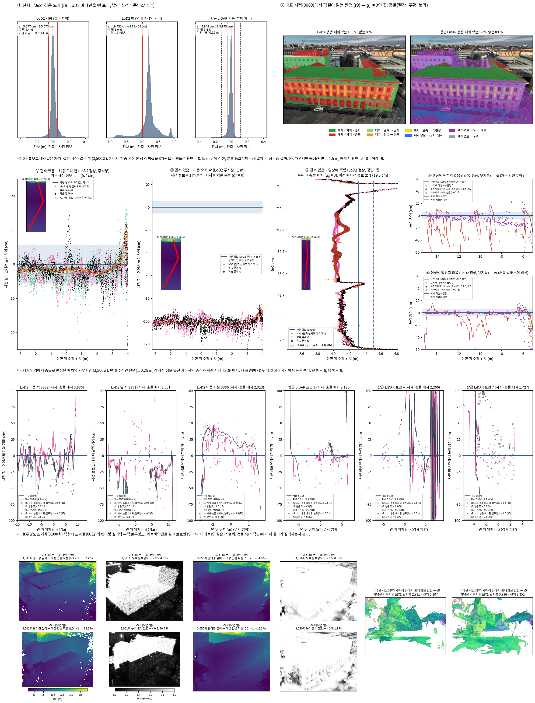

<!-- PHD-STAGE2-R9-THREE-FIXES-v1 -->
# r8 검토로 고친 세 규칙을 코드에 넣고 짧게 확인하기 (r9)

> 작업 PHD-STAGE2-R9-THREE-FIXES-v1 (2026-10-01~02). r8(PHD-STAGE2-R8-FOUR-CASES-v1)의 다음 판이다. 방법의 효과는 주장하지 않는다. 기준선 비교와 여러 건물 평가는 하지 않았다. `scientific_verdict: null`.
> **설계 문서**: 발주문 부록(방법론 설명 문서 10월 1일 r8 반영본 발췌). 발주문 본문과 부록이 다른 곳은 찾지 못했다.
> **용어**: 가우시안이 지니는 상태는 '패치의 판정'이다(코드 `J_loc`, 덤프 `unit_judgment`). 결측 패치가 받는 것은 여전히 '전파된 판정'이다(코드 `J`).
> **장면**: r8과 같은 B0(대상 건물 DEBY_LOD2_4959323)이다. 학습 시점 13장과 시험 시점 2장을 쓴다.
> - 설정 넷: LoD2 정상, LoD2 주지붕 +1 m, 항공 LiDAR 정상, 항공 LiDAR 주지붕 +1 m.
> - r8의 선택 설정(그늘진 지붕 끝 +1 m)은 이번 발주에 없어 뺐다.
>
> **학습**: r8과 같은 일정이다(3,500회, 시드 0, 1600 × 1157, 기반 설정).
> - 발주문의 학습: 위 네 설정, LoD2 정상에서 깊이 항을 끈 학습, r8 코드 그대로의 대조 학습(3,050회).
> - 발주문 밖에 넷을 더했다(5-2절): 같은 코드의 r8을 다시 돌린 것 둘(LoD2 정상, 항공 LiDAR 정상), 처음 방향 고침만 끈 r9 둘. 나빠진 곳이 어느 고침에서 왔는지, 또는 학습마다 생기는 흔들림인지 가리기 위해서다.
>
> **고정 값**: r8과 같다. 다수의 기준 2/3, 최소량 5곳, 최대 거리 1 m, 패치 0.25 m, 다시 읽기 500회, 보호 문턱 0.5, 학습률 배율 0.01, 불투명도 하한 0.5, 절단 4τ, NMAD 배수 2.5, 걸러내기 3배.
> **표기**: 표의 칸은 'r9 (r8)'이다. 글에서도 괄호 안 숫자는 r8 값이다.

## 답 — 목적의 네 물음

**1. 코드가 고친 문서와 같은가. — 같다.** 세 고침을 문서대로 넣었다(1절).
- **나**: 식 (7)의 𝒢ˣ를 '패치의 판정이 충돌인 가우시안'으로 바꿨다. 지지 패치는 그 패치의 표, 결측 패치는 전파된 판정을 읽는다. 공용 모듈의 `rule.protected()`가 맡는다.
- **다**: 사전 정보 출신 가우시안의 처음 회전을 면 법선에 맞췄다(`orient_prior`). 원판의 법선을 바깥쪽 면 법선과 같게 둔다.
- **라**: LoD2 바닥면(GroundSurface) 210면을 사전 정보 표면에서 뺐다. 이 장면에는 닫는 면(ClosureSurface)이 없다.
  - 첫째 단계: 깊이 렌더링, 잔차, 허용 오차, 표면 번호, 표시, 패치에서 모두 뺐다.
  - 둘째 단계: 점 뽑기와 심기에서 모두 뺐다.
- **가**: uᵢ를 재는 코드는 r8 그대로이고, 고친 문서의 문장과 같다.
- **확인**: 모두 통과했다(2절).
  - 단위 시험 58건, GPU 시험 8묶음(r8의 6묶음 포함)
  - 네 설정의 초기화 실행과 오프라인 대조
  - r8 GPU 시험 하나(5번 묶음의 '지지·충돌 패치 위 c̄ᵢ 0.2인 가우시안')는 기대값이 '보호됨'에서 '보호 안 됨'으로 바뀌었다. 문서가 바뀐 곳이다.
- **바꾸지 않은 것**: `train.py`, `gaussian_model.py`, 손실, gₚ, uᵢ, 다시 읽기, 밀도 제어가 r8과 글자까지 같다.

**2. 세 고침이 뜻대로 작동하는가.**
- **나. 충돌 패치의 보호 — 뜻대로 작동한다.** 지지·충돌 패치의 옛 가우시안이 보호되지 않고, 새 표면 뒤에 불투명하게 남는 수가 3분의 1로 줄었다(4-1절).
  - 다시 읽을 때마다 '보호 중 지지·충돌 패치 위'가 0이다. r8은 3,500회에 LoD2 정상 6,967, 항공 LiDAR 정상 3,232였다.
  - 그 자리에서 보호를 받지 못한 가우시안은 다시 읽을 때마다 3,743–6,386개다(LoD2 정상).
  - 3,500회에 이 패치 위의 사전 정보 가우시안 가운데 새 표면 뒤에 불투명하게 남은 것은 2,024 (6,008), 항공 LiDAR 정상 1,617 (3,526)이다.
  - 이 패치에서 출발한 처음 가우시안 가운데 불투명도 초기화 뒤(3,001–3,500회) 지워진 것은 2,792 (899)로 세 배다.
  - 정성: 단면 한 장(±0.25 m)에 드는 수는 적어 차이가 크게 보이지 않는다. 면 전체로 세면 이웃 벽 3837은 75 (1,166), 옆 벽 3391은 158 (877)이다. 이웃 지붕 3386만 114 (38)로 늘었다.
- **다. 처음 방향 — 문서대로 시작하고, 비가시 가우시안은 끝까지 면에 붙는다.** 메시 면도 사전 정보 면에 가까워졌다. 그러나 '메시에 담긴 비율'은 학습마다 크게 흔들리는 값이라, 고침의 몫을 가리지 못했다(4-2절).
  - 비가시 가우시안의 법선과 면 법선이 이루는 각: 처음 0.0° (61.0°), 3,500회 중앙값 0.1°·95 % 2.8° (60.7°·87.4°)
  - 보이는 사전 정보 가우시안: 3,500회 19.7°·48.9° (51.1°·86.3°)
  - 메시 면에서 사전 정보 면까지(시점을 더한 메시): 중앙값 9.0 cm (16.2 cm), 항공 LiDAR 4.6 cm (12.1 cm)
  - 시점을 더한 메시 0.25 m 안에 든 비율: 네 학습은 올랐고 LoD2 정상만 59.5 % (66.5 %)로 내렸다.
    - 같은 r8을 다시 돌리면 60.7 %이다. 면 3405만 보면 87.9 %가 61.6 %가 된다.
    - 그림에 쓴 카메라에서 앞을 가리는 것은 크기 1 m가 넘는 관측 출신 가우시안이다. 이것들을 빼면 겨냥한 가우시안이 305개에서 10,627개로 보인다.
  - 정성: 같은 더한 시점에서 렌더링한 법선이 r9는 면마다 한 색으로 이어지고, r8은 얼룩진다. 뒷지붕 단면에서 r9 가우시안 중심은 면 위 0 cm에 모인다. 다만 메시 단면에는 r8처럼 면 아래로 내려가는 세로 선이 남는다(그림 ⑥).
- **라. LoD2 바닥면 — 빠졌다.** 바닥면에서 심긴 가우시안은 0 (22,348, 대상 건물 12,146)이고, 처음 보호는 57,757 (80,090)이다. 그러나 불투명도 초기화 직후 대상 건물의 깊이가 흔들리는 일은 남는다(4-3절).
  - 3,001회에 대상 건물 픽셀의 깊이 변화 중앙값은 8.4 m이다(대조: r8 코드 13.0 m). 1 m 넘게 바뀐 픽셀은 69.8 %(대조 96.0 %)다.
  - 바닥면에 떨어진 픽셀은 0.6 %(대조 7.3 %)로 줄었다.
  - 대조는 바닥면이 불투명하게 남아 누적 불투명도가 거의 1이다(< 0.5인 픽셀 7.0 %). r9는 비칠 바닥면이 없어 앞면이 반투명해진다(< 0.5인 픽셀 44.3 %).
  - 두 학습 모두 깊이는 앞면과 그 뒤가 섞인 값이 된다(84–87 %). 50회 뒤(3,050회)에는 모두 되돌아온다(중앙값 3 cm).
  - 이웃 건물과 맞댄 벽은 26면(대상 건물 5면)이다. 패치 39,199곳 가운데 비가시가 39,010곳이고, 끝에 그 위에 보호된 가우시안 21,243 (21,260)개가 남는다.
- **가. uᵢ — 문서 문장대로 잰다.** 지붕은 처음 앉은 패치의 면 위 높이 차이, 벽은 법선 거리, 패치 없음은 연직 차이로 잰다. τ도 그 면 종류의 값이다(1-1절).

**3. 네 경우가 r8과 같거나 나아졌는가. — 대부분 같거나 나아졌다.** 나빠진 곳은 셋이다(5절).
- **나아진 곳**
  - 관측 있음·허용 오차 안: LoD2 지붕이 사전 정보에서 τ 안 92.2 % (91.5 %), 항공 LiDAR 지붕이 85.7 % (84.7 %)다.
  - 관측 없음·일치와 미판정: 사전 정보를 이어받는 몫이 크게 늘었다.
    - LoD2 일치 81.9 % (72.3 %), 미판정 53.2 % (42.7 %)
    - 항공 LiDAR 일치 82.0 % (32.9 %), 미판정 51.0 % (9.4 %)
  - 처음 방향만 끈 r9는 r8과 같은 값이다. 그러니 이 개선은 다의 몫이다.
- **같은 곳**: 관측 있음·허용 오차 밖, 관측 없음·충돌, 변화를 넣은 면은 r8과 같은 방향과 크기다.
- **나빠진 곳**
  - 항공 LiDAR 지지·일치 패치의 cₚ 0 픽셀: 사전 정보에서 τ 안 49.6 % (63.5 %). 다의 몫이다(다 끔 60.4 %, r8 다시 60.5 %).
  - 비가시 가우시안의 끝 불투명도 ≥ 0.5: LoD2 98.1 % (98.6 %), 항공 LiDAR 94.6 % (95.8 %). 대부분 다의 몫이다(다 끔 98.6 %·95.3 %).
  - LoD2 정상의 메시 0.25 m 안 비율: 위에서 본 대로 학습마다의 흔들림 안이다.
  - 항공 LiDAR +1 m의 관측 있음·허용 오차 밖이 MVS에서 τ 안 63.1 % (64.4 %)로 1.3 %포인트 내렸다. 같은 r8의 흔들림(항공 LiDAR 정상 1.2 %포인트)과 같은 크기다.

**4. 문서에 없어 구현이 정한 것.** 15가지다(7절). 주요한 것은 다음과 같다.
- LoD2 표본은 다시 뽑지 않고 r8 표본에서 바닥면 점만 뺐다. LoD2 사전 정보 점이 120,333에서 97,985가 되어, 항공 LiDAR와 같은 수로 맞추던 r8 규칙이 깨진다.
- r9 깊이는 r8 깊이에서 바닥면에 닿은 광선 41개만 바꿨다.
- LoD2 바깥 법선은 CityGML 감김 법선을 쓴다(확인함).
- 항공 LiDAR 점의 '자기 삼각형'은 점이 앉은 표면의 이웃 삼각형 법선을 넓이로 평균한 것이다.
- 면 안에서 도는 각은 면의 수평선(패치 칸의 축)으로 정했다.
- 각은 방향 없는 각으로 쟀다.

**본 실험 발주 판단에 쓸 사실.** 판단은 검토자가 한다.
- 세 고침의 구현과 대조는 모두 통과했다.
- 나와 라는 뜻한 대로 작동했다. 다는 비가시 면의 방향을 지키고 관측 없는 곳의 상속을 크게 늘렸다. 항공 LiDAR 지지·일치 패치의 cₚ 0 픽셀에서는 줄였다.
- 정해야 할 것으로 보이는 넷(8절 제안):
  - (가) 불투명도 초기화 직후의 깊이 흔들림은 바닥면을 빼도 남는다.
  - (나) 맞댄 벽은 바닥면처럼 보이지 않는 안쪽 면인데 보호된 채 남는다(약 2.1만 가우시안).
  - (다) 메시 확인의 '담긴 비율'은 더한 시점 앞의 큰 관측 출신 가우시안에 따라 학습마다 크게 흔들린다.
  - (라) 다가 항공 LiDAR 지지·일치 패치의 cₚ 0 픽셀에서 상속을 줄였다.



- **그림 읽는 법**
  - ③–⑤: r8 보고서와 같은 자리·같은 학습 시점·같은 축이다. 분홍 동그라미가 r8 결과, 검정이 r9 결과다. 두 결과가 거의 겹친다(경우 1–3은 r8과 같은 방향).
  - ⑥: 위가 r8, 아래가 r9다. r9의 보라 점(비가시 패치에서 심은 가우시안)은 면 위 0 cm 띠 안에 모인다. r8은 −20 cm까지 흩어진다. 빨간 선(시점을 더한 메시)은 두 학습 모두 세로 선이 남는다.
  - 나(셋째 줄): 면에 수직인 단면 ±0.25 m 안의 지지·충돌 패치 가우시안이다(채운 표시 = 불투명도 ≥ 0.5). 단면 한 장에는 수가 적어 차이가 잘 보이지 않는다. 면 전체 수는 표 나-3이다.
  - 라(넷째 줄 왼쪽): 위가 대조 학습(r8 코드, 바닥면 포함), 아래가 r9다. 3,001회에 대조는 누적 불투명도가 거의 흰색(1)으로 남고, r9는 건물이 회색(반투명)이 된다. 3,050회에는 둘 다 돌아온다.
  - 다(넷째 줄 오른쪽): r8의 더한 카메라 16대 가운데 두 장면이 모두 뒷지붕을 가장 많이 보는 카메라(3)다. r8은 얼룩, r9는 면마다 한 색이다.

## 1. 구현 대조표

- **줄 번호 표기**
  - `J9` = `scripts/phd/stage2_r9_three_fixes_v1/jbgs_judgment.py`(포크 r9의 같은 파일과 sha256 동일)
  - `M3` = `src/phd/prior_propagation_v3/`(공용 모듈 v3, 포크에 복사해 sha256 확인)
  - `S9` = `scripts/phd/stage2_r9_three_fixes_v1/`
- **v3와 v2의 관계**: v3는 v2의 일곱 파일 가운데 여섯(conversion, tolerance, surfaces, outlines, locations, seat)을 바이트까지 그대로 두었다(빌드 보고서 `v3_files_identical_to_v2`).
  - `rule.py`에는 `protected()`만 더했다.
  - `faces.py`, `orientation.py`는 새로 만들었다.
- **코드 이름**: 패치의 판정 = `J_loc`(덤프의 `unit_judgment`), 전파된 판정 = `J`(덤프의 `judgment`), 패치의 상태 = `state`(덤프의 `unit_state`).

### 1-1. 세 고침과 uᵢ

| 항목 | 문서 (부록) | 코드 위치 | 같음 / 다름 | 비고 |
|---|---|---|---|---|
| 나. 식 (7)의 𝒢ˣ | 패치의 판정이 충돌인 가우시안의 집합. 지지 영역의 패치는 그 패치의 표, 결측 영역의 패치는 전파된 판정. 패치가 없는 가우시안은 이 조건으로 빠지지 않음 | 규칙 `M3/rule.py:96 protected()` (사전 정보 출신 ∧ 패치의 판정 ≠ 충돌 ∧ c̄ᵢ < 0.5 ∧ uᵢ ≤ 4τ). 호출 `J9:1033`(패치의 판정 `Jl` = `J_loc`; 패치가 없으면 `J_NONE`). 다시 읽는 주기·앉은 패치·c̄ᵢ 재는 방식은 r8 코드 그대로(`seat_now`, `sampled_E`, `due_E`가 r8과 글자까지 같음, GPU 시험 1) | 같음 | 밀도 제어는 보호 대상을 그대로 읽으므로 고치지 않았다(`gaussian_model.py` r8과 같음) |
| 나. 기록 | 다시 읽을 때마다 보호에서 빠지거나 풀린 까닭에 '지지 패치의 충돌'을 따로 셈 | `J9:1035` 패치 상태로 충돌을 지지·결측으로 나눔. `E.jsonl`에 `excluded_support_conflict`, `excluded_propagated_conflict`, `released_by.support_conflict`, `prior_on_support_conflict_unit`, `locked_on_support_conflict_unit`(0이어야 함) | 같음 | – |
| 다. 처음 방향 | 사전 정보 출신 가우시안의 법선(두 접선 축에 수직인 축)을 그 점이 놓인 사전 정보 면의 법선에 맞춤. LoD2: 그 점을 뽑은 면, 항공 LiDAR: 그 점이 속한 삼각형(패치 없는 점도 자기 삼각형). 부호는 바깥쪽. 크기·불투명도·색·관측 출신의 방향은 기반 구현 | `J9:758 orient_prior`, 호출 `J9:696`(심기 전, 초기화에서 한 번). 면 법선 = 입력 `prior_normal.npy`(`S9/prepare_r9_inputs.py`). 사원수 = `M3/orientation.py:74 quat_from_normal`(셋째 축 = 면 법선, 첫째 축 = 면의 수평선) | 같음 (면 안의 각과 항공 LiDAR '자기 삼각형'은 정함) | 크기는 기반 구현처럼 두 접선 축에 같아(둥근 원판) 면 안의 각이 처음 모양을 바꾸지 않는다. 분할·복제의 자식은 기반 규칙대로 부모의 회전을 이어받는다(`gaussian_model.py` 그대로) |
| 다. 법선의 부호 | 지붕과 지면은 위, 벽은 건물 밖 | LoD2: CityGML 면의 감김 법선(바깥쪽이 규약). 확인: 지붕 744면 모두 위, 바닥 210면 모두 아래, 발자국 경계 위 벽 2,481면 일치·1면 불일치·490면 판정 불가(`S9/meshes_r9.py`). M_B의 단차면은 r7이 만든 면이라 3396 발자국 바깥쪽으로 맞춤(2면 뒤집음). 항공 LiDAR: 삼각형 법선을 위로(높이 함수의 바깥쪽) | 같음 | 불일치 1면(이웃 건물의 0.54 m² 벽 3629)은 시험이 틀렸을 가능성이 커서 뒤집지 않았다(7절 ③) |
| 라. LoD2 바닥면 | 모든 LoD2 건물의 바닥면(GroundSurface)과 닫는 면(ClosureSurface)을 사전 정보 표면에서 뺌. 첫째 단계(깊이 렌더링·잔차·허용 오차·표면 번호·표시·패치)와 둘째 단계(점 뽑기·심기) 모두. 종류가 없으면 아래를 향하고 가장 낮은 면 | 판별 `M3/faces.py:41 excluded_by_type`, 종류 없는 규칙 `:46 bottom_faces_untyped`. 메시 `S9/meshes_r9.py`(210면, 2,779 삼각형), 렌더링 `S9/render_r9.py`, 첫째 단계 `S9/stage1_products_r9.py`, 초기 점구름 `S9/prepare_r9_inputs.py`(바닥면 위 표본점 제거) | 같음 | 이 장면은 면 종류가 적혀 있어 종류로 뺐다. 닫는 면은 없다. 종류 없는 규칙을 같은 장면에 걸면 같은 210면을 고른다(교차 확인) |
| 라. 맞댄 벽 | 빼지 않고 센다. 두 건물의 벽면이 0.1 m 안에서 겹치고 법선이 반대인 면 | `M3/faces.py:77 party_wall_cells`(패치 중심이 다른 건물 벽 삼각형에서 0.1 m 안이고 바깥 법선의 코사인 ≤ −0.9), 집계 `S9/cases_r9.py` | 같음 (반대의 기준 −0.9는 정함) | 4절 표 라-2 |
| 가. uᵢ | 지붕은 처음 앉은 패치의 면 위 높이 차이, 벽은 그 면에 수직인 거리, 패치가 없으면 연직 차이. 견주는 τ는 그 면 종류의 값(패치 없음은 지붕) | `J9:973 u_offsets` → `M3/conversion.py offset_metres`(v2와 바이트까지 같음). 면 = 처음 앉은 칸의 면(LoD2 다각형 평면, 항공 LiDAR는 칸 아래 삼각형 평면: 칸의 걸음 t1 × t2) | 같음 | 바꾸지 않았다(`u_offsets` r8과 글자까지 같음, GPU 시험 1). 칸이 없는 작은 표면의 패치(LoD2 정상 1곳)는 r8처럼 연직으로 잰다 |

### 1-2. 바꾸지 않은 것

| 항목 | 확인 |
|---|---|
| `train.py`, `scene/gaussian_model.py`(밀도 제어, 불투명도 초기화 면제) | r8과 글자까지 같다(GPU 시험 1, 빌드 보고서의 바뀐 파일 목록). |
| 잠금(학습률 × 0.01), 불투명도 하한, 손실과 그 보조 함수, gₚ 지도, uᵢ, 다시 읽기 | `before_step`, `after_step`, `floor_now`, `exempt_mask`, `_g_init`, `losses`, `u_offsets`, `seat_now`, `sampled_E`, `due_E`, `render_train_depths`, `_record_removal`와 `scale_locked_update`, `rho_truncated`, `project_points`, `truncated_prior_loss`, `weighted_l1`, `compute_E_render`가 r8과 글자까지 같다(GPU 시험 1). |
| 고정 값 | 다수의 기준 2/3, 최소량 5곳, 최대 거리 1 m, 패치 0.25 m, 다시 읽기 500회, 보호 문턱 0.5, 학습률 배율 0.01, 불투명도 하한 0.5, 절단 4τ, NMAD 배수 2.5, 걸러내기 3배(`configs/phd/stage2_r9_three_fixes_v1/r9.json`의 `values`는 r8과 같다). |
| 첫째 단계의 나머지 규칙 | 공용 모듈의 해당 파일이 v2와 바이트까지 같다. 항공 LiDAR 두 설정의 산출(저장 표 두 가지, 패치·표시·환산 지도), τ 지도, 자리가 r8과 모든 값에서 같다(`prepare_L_*.json`의 `r8_products_all_equal`). |
| 메시 | r8과 같은 방법(학습 시점 13장 + 더한 시점 16장, TSDF 0.10 m 칸·절단 0.5 m, 같은 크롭 상자, 같은 겨냥 규칙). r8 그림과 나란히 보려고 r8의 더한 카메라를 r8의 겨냥 가우시안으로 다시 만들어 r9 장면을 그 시점에서도 렌더링했다. |
| r8의 코드와 산출 | 손대지 않았다. r9는 새 폴더(`scripts/phd/stage2_r9_three_fixes_v1/`, payload `PHD-STAGE2-R9-THREE-FIXES-v1/`)에서 고쳤고 r8 payload는 읽기 전용으로 붙였다. |

## 2. 시험과 대조

| 시험 | 내용 | 결과 |
|---|---|---|
| 공용 모듈 단위 시험 | `tests/phd/test_prior_propagation_v2.py` 24건(v2 그대로) + `tests/phd/test_prior_propagation_v3.py` 34건 | 58건 통과 |
| | v3 파일의 34건 = v2의 24건을 v3에 다시 돌린 것 + 새 10건 | |
| | 새 시험: 나(지지·충돌 c̄ᵢ 0 → 보호 안 됨, 지지·일치 c̄ᵢ 0 → 보호, 전파된 충돌 → 빠짐, 비가시 → 보호, numpy와 torch가 같음, uᵢ가 NaN이면 보호 안 됨), 다(사원수의 셋째 축 = 면 법선, 첫째 축 = 면의 수평선 = 패치 칸의 축, numpy와 torch가 같음; 삼각망 꼭짓점 법선의 세 규칙), 라(종류로 뺌, 종류 없는 규칙이 처마 밑면은 빼지 않음), 발자국 시험, 맞댄 벽(겹친 벽만 맞댐, 0.2 m 떨어진 벽은 아님) | |
| GPU 시험 | `S9/gpu_tests_r9.py`, 실제 가우시안 모델로 8묶음 | 통과 |
| | ① r8과 글자까지 같은 것(1-2의 함수, `gaussian_model.py`, `train.py`) | |
| | ②–⑥ r8의 시험 그대로. ⑤에서 '지지 패치의 표가 충돌이고 c̄ᵢ 0.2인 가우시안'의 기대값만 '보호됨'(r8 규칙)에서 '보호 안 됨'(r9 규칙)으로 바꿨다. 문서가 바뀐 곳이라 기대값이 바뀐다 | |
| | ⑦ 나: 지지·충돌 c̄ᵢ 0 → 보호 안 됨, 지지·일치 c̄ᵢ 0 → 보호, 결측·전파 충돌 → 빠짐. 보호되던 가우시안이 지지·충돌 패치로 옮겨 가면 '지지 패치의 충돌'로 풀렸다고 기록 | |
| | ⑧ 다: `build_rotation`의 셋째 열과 면 법선의 각이 최대 1.5 × 10⁻⁵°이고 부호가 같다. 첫째 축은 수평. 관측 출신과 법선 없는 사전 정보 행은 회전이 그대로 | |
| 초기화 실행 | 포크 r9를 네 설정에서 첫 반복 직전까지 실행. 다시 읽기 시험도 함께 | 4회 통과 |
| 오프라인 대조 | `S9/verify_dry_r9.py`, 네 설정 | 모두 통과 |
| | r8의 대조 그대로: 전파·패치의 판정·미판정 이유가 numpy와 같고, 자리 100 %, 충돌 위 심은 점 0, 그 밖에 심지 않은 점 0, 비가시 점의 첫 c̄ᵢ 0, gₚ가 학습 시점 13장 모든 픽셀에서 같고, 다시 읽기 시험 통과 | |
| | 나: 첫 보호 수가 패치의 판정으로 센 수와 같다(LoD2 정상 57,757). 첫 반복에서는 지지 패치의 c̄ᵢ가 모두 0.5 이상이라 r8 규칙으로 세도 같은 수다(차이 0) | |
| | 다: 심은 사전 정보 점 모두(LoD2 정상 96,681, 항공 LiDAR 정상 119,484)의 방향 오차가 최대 6 × 10⁻⁶°이고 부호가 같다. 관측 출신 행은 그대로 | |
| | 라: LoD2 두 설정에서 표면 표에 바닥면 0, 메시에 바닥면 삼각형 0, 바닥면에 자리 잡은 심은 점 0, 학습 시점 픽셀 가운데 바닥면 삼각형 0. 심은 사전 정보 점은 모두 r9 메시에서 1.2 cm 안 | |
| 입력 대조 | `render_check.json`: 바닥면을 넣은 메시로 다시 렌더링하면 r8 사전 정보 깊이의 값과 삼각형 번호가 모두 같다. 크롭 사각형 가장자리 7픽셀만 유한·무한이 다르다(원래 계산이 float32) | 같음 |
| | r9 깊이는 r8 깊이에서 바닥면에 닿은 광선만 바꿨다(15시점 41광선, 그 가운데 사전 정보 픽셀 31개). 31개 가운데 14개는 뒤의 다른 면을, 17개는 아무것도 보지 않게 됐다 | |
| | `prepare_*.json`: 항공 LiDAR의 산출·τ 지도·자리가 r8과 같다. LoD2는 바닥면이 아닌 패치 191,362곳의 상태와 표가 r8과 모두 같다(표 나-2) | |
| 학습 | 다섯 번 3,500회, 대조 한 번 3,050회 | 모두 끝까지 갔다(영수증 PASS) |
| r8 처음 방향의 재현 | `S9/r8_initial_rotations.py`: `torch.manual_seed(0)` 뒤 `torch.rand((192,361, 4))`. r8에서 비가시 패치에 심은 가우시안의 끝 법선이 재현값과 중앙값 0.13–0.27° 차이(같은 추첨을 섞어 짝지으면 52°)이고, 회전이 한 번도 바뀌지 않은 행 12–5,733개는 비트까지 같다 | 재현됨 |

## 3. 사전 측정 (학습 없음) — r8 대비

- **r8 값**: r8의 첫째 단계 산출과 초기화 실행(`runs/dry_<설정>`)이다. r9와 같은 코드로 다시 셌다.
- **패치 대응**: 바닥면이 아닌 패치는 r8과 패치마다 같은 상태·같은 표다. 같은 표면·같은 칸 중심으로 대응시켜 확인했다(표 나-2). 그래서 표 나는 바뀐 행만 싣는다. 전체 표는 payload `premeasure_v4/tables.md`에 있다.
- **바뀔 것으로 본 곳**(발주문 4단계): LoD2의 표 나(바닥면 행), 라(비가시 점 수), 마(처음 보호 수). 실제로 바뀐 곳도 이 셋뿐이다.

### 표 가. 허용 오차 (정상 장면, 15시점, cₚ = 1, 대상 건물의 건물 면; 지붕 = 높이 차이, 벽 = 면에 수직인 거리)

| 사전 정보 | 면 | 표본 수 (r8) | 정합 뒤 중앙값 (거르기 전 → 뒤) | NMAD (거르기 전 → 뒤) | 걸러낸 비율 | 허용 오차 τ = 2.5 × NMAD | r8 허용 오차 | r8 대비 | 기관 사양 | 경고 |
|---|---|---|---|---|---|---|---|---|---|---|
| LoD2 | 지붕 | 35,312,894 (-25) | +0.0055 → +0.0029 m | 0.0285 → 0.0227 m | 15.3 % | **0.056771 m** | 0.056771 m | -5.1e-09 m | 1.00 m | 없음 |
| LoD2 | 벽 | 67,635,017 (+13) | +0.2130 → +0.2128 m | 0.1038 → 0.0778 m | 17.8 % | **0.194530 m** | 0.194530 m | +7.8e-08 m | 없음 | 없음 |
| 항공 LiDAR | 지붕 | 32,743,538 (±0) | -0.0009 → -0.0001 m | 0.0176 → 0.0158 m | 7.7 % | **0.039448 m** | 0.039448 m | +0.0e+00 m | 0.12 m | 없음 |
| 항공 LiDAR | 벽 | 0 | – | – | – | **0.039448 m** (지붕 값) | 0.039448 m | +0.0e+00 m | 없음 | 없음 |

### 표 나. 표면별 패치 (한 칸 0.25 m; 수 / 넓이 m²; 일치·충돌 = 지지 영역 패치의 표, 결측의 판정 = 고정 값 2/3·5곳·1 m의 전파)

| 설정 | 표면 | 종류 | 지지 | 일치 | 충돌 | 결측 | 결측 → 충돌 | 결측 → 일치 | 결측 → 혼재 | 결측 → 근거 부족 | 비가시 | r8 대비 (지지 · 일치 · 충돌 · 결측 · 비가시) |
|---|---|---|---|---|---|---|---|---|---|---|---|---|
| LoD2 정상 | r8의 대상 건물 바닥면 (면 3401) — r9에서 뺌 | – | 0 / 0.0 | 0 / 0.0 | 0 / 0.0 | 0 / 0.0 | 0 / 0.0 | 0 / 0.0 | 0 / 0.0 | 0 / 0.0 | 0 / 0.0 | -24 · -1 · -23 · ±0 · -21,719 |
| LoD2 정상 | r8의 이웃 건물 바닥면 8개 — r9에서 뺌 | – | 0 / 0.0 | 0 / 0.0 | 0 / 0.0 | 0 / 0.0 | 0 / 0.0 | 0 / 0.0 | 0 / 0.0 | 0 / 0.0 | 0 / 0.0 | -6 · ±0 · -6 · ±0 · -24,296 |
| **LoD2 정상** | **전체 85개 표면** (r8 94개) | – | 77,079 / 4,817.4 | 34,299 / 2,143.7 | 42,780 / 2,673.8 | 5,700 / 356.2 | 2,627 / 164.2 | 407 / 25.4 | 280 / 17.5 | 2,386 / 149.1 | 108,583 / 6,786.4 | -30 · -1 · -29 · ±0 · -46,015 |
| LoD2 주지붕 +1 m | r8의 대상 건물 바닥면 (면 3401) — r9에서 뺌 | – | 0 / 0.0 | 0 / 0.0 | 0 / 0.0 | 0 / 0.0 | 0 / 0.0 | 0 / 0.0 | 0 / 0.0 | 0 / 0.0 | 0 / 0.0 | -24 · -1 · -23 · ±0 · -21,719 |
| LoD2 주지붕 +1 m | r8의 이웃 건물 바닥면 8개 — r9에서 뺌 | – | 0 / 0.0 | 0 / 0.0 | 0 / 0.0 | 0 / 0.0 | 0 / 0.0 | 0 / 0.0 | 0 / 0.0 | 0 / 0.0 | 0 / 0.0 | -6 · ±0 · -6 · ±0 · -24,296 |
| **LoD2 주지붕 +1 m** | **전체 90개 표면** (r8 99개) | – | 74,106 / 4,631.6 | 24,558 / 1,534.9 | 49,548 / 3,096.7 | 5,508 / 344.2 | 2,517 / 157.3 | 526 / 32.9 | 212 / 13.2 | 2,253 / 140.8 | 114,033 / 7,127.1 | -30 · -1 · -29 · ±0 · -46,015 |
| **항공 LiDAR 정상** | **전체 358개 표면** (r8 358개) | – | 23,762 / 1,619.0 | 12,559 / 856.9 | 11,203 / 762.1 | 1,406 / 96.2 | 787 / 53.8 | 66 / 4.5 | 93 / 6.4 | 460 / 31.4 | 16,025 / 1,073.9 | ±0 · ±0 · ±0 · ±0 · ±0 |
| **항공 LiDAR 주지붕 +1 m** | **전체 361개 표면** (r8 361개) | – | 21,158 / 1,441.1 | 3,734 / 254.9 | 17,424 / 1,186.2 | 1,522 / 104.2 | 714 / 48.7 | 93 / 6.6 | 64 / 4.4 | 651 / 44.5 | 18,179 / 1,221.2 | ±0 · ±0 · ±0 · ±0 · ±0 |

그 밖의 모든 표면 행(LoD2의 대상 건물 지붕·벽과 이웃 건물 면, 항공 LiDAR의 모든 표면)은 r8 대비가 '±0 · ±0 · ±0 · ±0 · ±0'이다. 전체 표는 payload `premeasure_v4/tables.md`에 있다.

**표 나-2. LoD2: r8과 r9의 패치 대응** (같은 표면, 같은 칸 중심)

| 설정 | r8 패치 | r9 패치 | 상태·표가 같음 | 상태나 표가 바뀜 | r8에만 있음 (바닥면) |
|---|---|---|---|---|---|
| LoD2 정상 | 237,407 | 191,362 | 191,362 | 0 | 46,045 |
| LoD2 주지붕 +1 m | 239,692 | 193,647 | 193,647 | 0 | 46,045 |

### 표 다. 패치가 없는 사전 정보 픽셀 (학습 시점 13장, 원해상도)

| 설정 | 사전 정보 픽셀 (r8 대비) | 패치 없음 (비율) | 그 가운데 가파른 삼각형 / 건물이 아닌 면 | 그 가운데 cₚ = 1 (비율) | cₚ = 1 가운데 일치 | cₚ = 1 가운데 충돌 | r8과 같은가 |
|---|---|---|---|---|---|---|---|
| LoD2 정상 | 127,435,880 (-17) | 0 (0.0 %) | 0 / 0 | 0 (–) | – | – | 사전 정보 픽셀만 다르다 (바닥면을 보던 픽셀) |
| LoD2 주지붕 +1 m | 128,756,475 (-17) | 0 (0.0 %) | 0 / 0 | 0 (–) | – | – | 사전 정보 픽셀만 다르다 (바닥면을 보던 픽셀) |
| 항공 LiDAR 정상 | 221,527,568 (±0) | 189,143,086 (85.4 %) | 103,659,513 / 85,483,573 | 158,479,794 (83.8 %) | 18.4 % | 81.6 % | 모든 열이 같다 |
| 항공 LiDAR 주지붕 +1 m | 221,725,912 (±0) | 191,511,868 (86.4 %) | 106,271,290 / 85,240,578 | 161,122,617 (84.1 %) | 17.8 % | 82.2 % | 모든 열이 같다 |

**표 다-2. 사전 정보 깊이 항이 작용하는 픽셀** (학습 해상도 1600 × 1157, 학습 시점 13장; 첫 반복 직전의 gₚ)

| 설정 | 사전 정보 픽셀 (r8) | gₚ = 1 (패치 있음 · cₚ 1 / cₚ 0, 없음 · cₚ 1 / cₚ 0) | gₚ = 0 (패치 있음 · cₚ 1 / cₚ 0, 없음 · cₚ 1) | r8 gₚ = 1 | r8 gₚ = 0 |
|---|---|---|---|---|---|
| LoD2 정상 | 10,239,454 (10,239,455) | 5,094,558 (49.8 %): 4,834,875 / 259,683, 0 / 0 | 5,144,896 (50.2 %): 4,488,983 / 655,913, 0 | 5,094,558 (±0) | 5,144,897 (-1) |
| LoD2 주지붕 +1 m | 10,345,755 (10,345,756) | 3,028,537 (29.3 %): 2,891,504 / 137,033, 0 / 0 | 7,317,218 (70.7 %): 6,505,480 / 811,738, 0 | 3,028,537 (±0) | 7,317,219 (-1) |
| 항공 LiDAR 정상 | 17,792,294 (17,792,294) | 7,049,211 (39.6 %): 2,115,630 / 133,059, 2,341,401 / 2,459,121 | 10,743,083 (60.4 %): 318,486 / 35,022, 10,389,575 | 7,049,211 (±0) | 10,743,083 (±0) |
| 항공 LiDAR 주지붕 +1 m | 17,808,182 (17,808,182) | 4,902,064 (27.5 %): 147,486 / 20,001, 2,297,504 / 2,437,073 | 12,906,118 (72.5 %): 2,083,449 / 177,231, 10,645,438 | 4,902,064 (±0) | 12,906,118 (±0) |

### 표 라. 초기화 — 심은 점과 심지 않은 점 (첫 반복 직전, 출처와 점이 속한 곳별)

| 설정 | 점이 속한 곳 | 후보 점 | 심음 | 심지 않음 | r8 후보 | r8 심음 | r8 대비 (심음) |
|---|---|---|---|---|---|---|---|
| LoD2 정상 | 관측 출신 (SfM 점) | 72,028 | 72,028 | 0 | 72,028 | 72,028 | ±0 |
| LoD2 정상 | 사전 정보 · 지지 영역 | 38,924 | 38,924 | 0 | 38,939 | 38,939 | -15 |
| LoD2 정상 |   그 가운데 표 충돌 | 20,738 | 20,738 | 0 | 20,753 | 20,753 | -15 |
| LoD2 정상 | 사전 정보 · 결측 → 충돌 | 1,304 | 0 | 1,304 | 1,304 | 0 | ±0 |
| LoD2 정상 | 사전 정보 · 결측 → 일치 | 197 | 197 | 0 | 197 | 197 | ±0 |
| LoD2 정상 | 사전 정보 · 결측 → 혼재·근거 부족 | 919 | 919 | 0 | 919 | 919 | ±0 |
| LoD2 정상 | 사전 정보 · 비가시 영역 | 56,641 | 56,641 | 0 | 78,974 | 78,974 | -22,333 |
| LoD2 정상 |   그 가운데 바닥면 (r9에서 뺌) | 0 | 0 | 0 | 22,348 | 22,348 | -22,348 |
| LoD2 정상 | 사전 정보 · 패치 없음 | 0 | 0 | 0 | 0 | 0 | ±0 |
| **LoD2 정상** | **합** | 170,013 | 168,709 | 1,304 | 192,361 | 191,057 | -22,348 |
| LoD2 주지붕 +1 m | 관측 출신 (SfM 점) | 72,028 | 72,028 | 0 | 72,028 | 72,028 | ±0 |
| LoD2 주지붕 +1 m | 사전 정보 · 지지 영역 | 37,221 | 37,221 | 0 | 37,231 | 37,231 | -10 |
| LoD2 주지붕 +1 m |   그 가운데 표 충돌 | 24,505 | 24,505 | 0 | 24,515 | 24,515 | -10 |
| LoD2 주지붕 +1 m | 사전 정보 · 결측 → 충돌 | 1,187 | 0 | 1,187 | 1,187 | 0 | ±0 |
| LoD2 주지붕 +1 m | 사전 정보 · 결측 → 일치 | 284 | 284 | 0 | 284 | 284 | ±0 |
| LoD2 주지붕 +1 m | 사전 정보 · 결측 → 혼재·근거 부족 | 834 | 834 | 0 | 834 | 834 | ±0 |
| LoD2 주지붕 +1 m | 사전 정보 · 비가시 영역 | 59,127 | 59,127 | 0 | 80,797 | 80,797 | -21,670 |
| LoD2 주지붕 +1 m |   그 가운데 바닥면 (r9에서 뺌) | 0 | 0 | 0 | 21,680 | 21,680 | -21,680 |
| LoD2 주지붕 +1 m | 사전 정보 · 패치 없음 | 0 | 0 | 0 | 0 | 0 | ±0 |
| **LoD2 주지붕 +1 m** | **합** | 170,681 | 169,494 | 1,187 | 192,361 | 191,174 | -21,680 |
| 항공 LiDAR 정상 | 관측 출신 (SfM 점) | 72,028 | 72,028 | 0 | 72,028 | 72,028 | ±0 |
| 항공 LiDAR 정상 | 사전 정보 · 지지 영역 | 28,279 | 28,279 | 0 | 28,279 | 28,279 | ±0 |
| 항공 LiDAR 정상 |   그 가운데 표 충돌 | 13,358 | 13,358 | 0 | 13,358 | 13,358 | ±0 |
| 항공 LiDAR 정상 | 사전 정보 · 결측 → 충돌 | 849 | 0 | 849 | 849 | 0 | ±0 |
| 항공 LiDAR 정상 | 사전 정보 · 결측 → 일치 | 65 | 65 | 0 | 65 | 65 | ±0 |
| 항공 LiDAR 정상 | 사전 정보 · 결측 → 혼재·근거 부족 | 648 | 648 | 0 | 648 | 648 | ±0 |
| 항공 LiDAR 정상 | 사전 정보 · 비가시 영역 | 18,328 | 18,328 | 0 | 18,328 | 18,328 | ±0 |
| 항공 LiDAR 정상 |   그 가운데 바닥면 (r9에서 뺌) | 0 | 0 | 0 | 0 | 0 | ±0 |
| 항공 LiDAR 정상 | 사전 정보 · 패치 없음 | 72,164 | 72,164 | 0 | 72,164 | 72,164 | ±0 |
| **항공 LiDAR 정상** | **합** | 192,361 | 191,512 | 849 | 192,361 | 191,512 | ±0 |
| 항공 LiDAR 주지붕 +1 m | 관측 출신 (SfM 점) | 72,028 | 72,028 | 0 | 72,028 | 72,028 | ±0 |
| 항공 LiDAR 주지붕 +1 m | 사전 정보 · 지지 영역 | 25,402 | 25,402 | 0 | 25,402 | 25,402 | ±0 |
| 항공 LiDAR 주지붕 +1 m |   그 가운데 표 충돌 | 20,829 | 20,829 | 0 | 20,829 | 20,829 | ±0 |
| 항공 LiDAR 주지붕 +1 m | 사전 정보 · 결측 → 충돌 | 792 | 0 | 792 | 792 | 0 | ±0 |
| 항공 LiDAR 주지붕 +1 m | 사전 정보 · 결측 → 일치 | 113 | 113 | 0 | 113 | 113 | ±0 |
| 항공 LiDAR 주지붕 +1 m | 사전 정보 · 결측 → 혼재·근거 부족 | 851 | 851 | 0 | 851 | 851 | ±0 |
| 항공 LiDAR 주지붕 +1 m | 사전 정보 · 비가시 영역 | 21,004 | 21,004 | 0 | 21,004 | 21,004 | ±0 |
| 항공 LiDAR 주지붕 +1 m |   그 가운데 바닥면 (r9에서 뺌) | 0 | 0 | 0 | 0 | 0 | ±0 |
| 항공 LiDAR 주지붕 +1 m | 사전 정보 · 패치 없음 | 72,171 | 72,171 | 0 | 72,171 | 72,171 | ±0 |
| **항공 LiDAR 주지붕 +1 m** | **합** | 192,361 | 191,569 | 792 | 192,361 | 191,569 | ±0 |

### 표 마. 처음 보호되는 가우시안 (첫 반복 직전, 식 (7): 사전 정보 출신 · 패치의 판정 충돌 아님 · c̄ᵢ < 0.5 · uᵢ = 0 ≤ 4τ)

| 설정 | 점이 속한 곳 | r9 보호 | 그 가운데 본 시점 0 | r8 보호 | r8 대비 |
|---|---|---|---|---|---|
| LoD2 정상 | 관측 출신 (SfM 점) | 0 | 0 | 0 | ±0 |
| LoD2 정상 | 사전 정보 · 지지 영역 | 0 | 0 | 0 | ±0 |
| LoD2 정상 |   그 가운데 표 충돌 | 0 | 0 | 0 | ±0 |
| LoD2 정상 | 사전 정보 · 결측 → 충돌 | 0 | 0 | 0 | ±0 |
| LoD2 정상 | 사전 정보 · 결측 → 일치 | 197 | 0 | 197 | ±0 |
| LoD2 정상 | 사전 정보 · 결측 → 혼재·근거 부족 | 919 | 0 | 919 | ±0 |
| LoD2 정상 | 사전 정보 · 비가시 영역 | 56,641 | 56,641 | 78,974 | -22,333 |
| LoD2 정상 |   그 가운데 바닥면 (r9에서 뺌) | 0 | 0 | 22,333 | -22,333 |
| LoD2 정상 | 사전 정보 · 패치 없음 | 0 | 0 | 0 | ±0 |
| **LoD2 정상** | **합** | 57,757 | 56,641 | 80,090 | -22,333 |
| LoD2 주지붕 +1 m | 관측 출신 (SfM 점) | 0 | 0 | 0 | ±0 |
| LoD2 주지붕 +1 m | 사전 정보 · 지지 영역 | 0 | 0 | 0 | ±0 |
| LoD2 주지붕 +1 m |   그 가운데 표 충돌 | 0 | 0 | 0 | ±0 |
| LoD2 주지붕 +1 m | 사전 정보 · 결측 → 충돌 | 0 | 0 | 0 | ±0 |
| LoD2 주지붕 +1 m | 사전 정보 · 결측 → 일치 | 284 | 0 | 284 | ±0 |
| LoD2 주지붕 +1 m | 사전 정보 · 결측 → 혼재·근거 부족 | 834 | 0 | 834 | ±0 |
| LoD2 주지붕 +1 m | 사전 정보 · 비가시 영역 | 59,127 | 59,127 | 80,797 | -21,670 |
| LoD2 주지붕 +1 m |   그 가운데 바닥면 (r9에서 뺌) | 0 | 0 | 21,670 | -21,670 |
| LoD2 주지붕 +1 m | 사전 정보 · 패치 없음 | 0 | 0 | 0 | ±0 |
| **LoD2 주지붕 +1 m** | **합** | 60,245 | 59,127 | 81,915 | -21,670 |
| 항공 LiDAR 정상 | 관측 출신 (SfM 점) | 0 | 0 | 0 | ±0 |
| 항공 LiDAR 정상 | 사전 정보 · 지지 영역 | 0 | 0 | 0 | ±0 |
| 항공 LiDAR 정상 |   그 가운데 표 충돌 | 0 | 0 | 0 | ±0 |
| 항공 LiDAR 정상 | 사전 정보 · 결측 → 충돌 | 0 | 0 | 0 | ±0 |
| 항공 LiDAR 정상 | 사전 정보 · 결측 → 일치 | 65 | 0 | 65 | ±0 |
| 항공 LiDAR 정상 | 사전 정보 · 결측 → 혼재·근거 부족 | 648 | 0 | 648 | ±0 |
| 항공 LiDAR 정상 | 사전 정보 · 비가시 영역 | 18,328 | 18,328 | 18,328 | ±0 |
| 항공 LiDAR 정상 |   그 가운데 바닥면 (r9에서 뺌) | 0 | 0 | 0 | ±0 |
| 항공 LiDAR 정상 | 사전 정보 · 패치 없음 | 35,354 | 21,702 | 35,354 | ±0 |
| **항공 LiDAR 정상** | **합** | 54,395 | 40,030 | 54,395 | ±0 |
| 항공 LiDAR 주지붕 +1 m | 관측 출신 (SfM 점) | 0 | 0 | 0 | ±0 |
| 항공 LiDAR 주지붕 +1 m | 사전 정보 · 지지 영역 | 0 | 0 | 0 | ±0 |
| 항공 LiDAR 주지붕 +1 m |   그 가운데 표 충돌 | 0 | 0 | 0 | ±0 |
| 항공 LiDAR 주지붕 +1 m | 사전 정보 · 결측 → 충돌 | 0 | 0 | 0 | ±0 |
| 항공 LiDAR 주지붕 +1 m | 사전 정보 · 결측 → 일치 | 113 | 0 | 113 | ±0 |
| 항공 LiDAR 주지붕 +1 m | 사전 정보 · 결측 → 혼재·근거 부족 | 851 | 0 | 851 | ±0 |
| 항공 LiDAR 주지붕 +1 m | 사전 정보 · 비가시 영역 | 21,004 | 21,004 | 21,004 | ±0 |
| 항공 LiDAR 주지붕 +1 m |   그 가운데 바닥면 (r9에서 뺌) | 0 | 0 | 0 | ±0 |
| 항공 LiDAR 주지붕 +1 m | 사전 정보 · 패치 없음 | 35,554 | 21,882 | 35,554 | ±0 |
| **항공 LiDAR 주지붕 +1 m** | **합** | 57,522 | 42,886 | 57,522 | ±0 |

**표에서 읽히는 것**
1. **허용 오차는 사실상 그대로다.** LoD2 지붕 표본에서 25픽셀이 빠지고 벽 표본에 13픽셀이 더해졌다. τ는 10⁻⁸ m 단위로만 바뀌었다(0.056771 m, 0.194530 m). 항공 LiDAR는 같다.
2. **바뀐 패치는 바닥면의 패치뿐이다.**
   - LoD2 정상에서 크롭에 걸린 바닥면 9면(대상 건물 3401과 이웃 8면)의 패치 46,045곳이 빠졌다. 지지 30곳, 비가시 46,015곳이다.
   - 나머지 191,362곳은 상태와 표가 r8과 모두 같다.
   - 바닥면을 보던 사전 정보 픽셀은 학습 시점 13장에서 17개뿐이라, gₚ 지도도 1픽셀만 다르다.
3. **심는 점에서 바닥면 점 22,348개가 빠졌다**(LoD2 정상, 대상 건물 12,146개). 그 가운데 15개는 지지 패치, 22,333개는 비가시 패치의 점이었다.
4. **처음 보호는 바닥면 점만큼 줄었다.** LoD2 정상 80,090 → 57,757(−22,333), LoD2 +1 m 81,915 → 60,245다.
   - 첫 반복에서는 지지 패치의 c̄ᵢ가 모두 0.5 이상이다. 그래서 고침 나는 처음 보호 수를 바꾸지 않고, 다시 읽을 때부터 작동한다(6절).
5. **항공 LiDAR는 모든 표에서 r8과 같다.** 바닥면이 없고, 산출·τ 지도·자리가 r8과 값까지 같다.

## 4. 세 고침의 확인

### 4-1. 나. 충돌 패치의 보호

### 표 나-1. 다시 읽을 때마다 보호 중 지지·충돌 패치 위에 있는 사전 정보 가우시안 (r8 표 5의 열)

| 학습 | 1회 | 500회 | 1,000회 | 1,500회 | 2,000회 | 2,500회 | 3,000회 | 3,500회 |
|---|---|---|---|---|---|---|---|---|
| LoD2 정상 | 0 (0) | 0 (5,664) | 0 (5,901) | 0 (6,198) | 0 (6,542) | 0 (6,714) | 0 (6,929) | 0 (6,967) |
| LoD2 정상, 깊이 항 끔 | 0 (0) | 0 (5,645) | 0 (5,971) | 0 (6,310) | 0 (6,505) | 0 (6,849) | 0 (6,989) | 0 (7,139) |
| LoD2 주지붕 +1 m | 0 (0) | 0 (5,003) | 0 (5,416) | 0 (5,625) | 0 (5,857) | 0 (6,126) | 0 (6,317) | 0 (6,390) |
| 항공 LiDAR 정상 | 0 (0) | 0 (3,033) | 0 (3,037) | 0 (3,128) | 0 (3,201) | 0 (3,216) | 0 (3,239) | 0 (3,232) |
| 항공 LiDAR 주지붕 +1 m | 0 (0) | 0 (2,421) | 0 (2,420) | 0 (2,487) | 0 (2,579) | 0 (2,645) | 0 (2,675) | 0 (2,651) |

**표 나-1b. r9가 지지·충돌 패치라서 보호에서 뺀 수 (가우시안 신뢰도 < 0.5 · uᵢ ≤ 4τ인데 패치의 판정이 충돌) / 그 자리의 사전 정보 가우시안 수**

| 학습 | 1회 | 500회 | 1,000회 | 1,500회 | 2,000회 | 2,500회 | 3,000회 | 3,500회 |
|---|---|---|---|---|---|---|---|---|
| LoD2 정상 | 0 / 20,738 | 6,386 / 19,796 | 5,076 / 18,844 | 5,291 / 23,657 | 5,389 / 27,483 | 5,483 / 30,849 | 5,761 / 33,705 | 3,743 / 30,470 |
| LoD2 정상, 깊이 항 끔 | 0 / 20,738 | 6,419 / 19,875 | 5,169 / 18,872 | 5,266 / 23,625 | 5,456 / 27,653 | 5,637 / 31,218 | 5,644 / 33,833 | 3,771 / 30,147 |
| LoD2 주지붕 +1 m | 0 / 24,505 | 5,691 / 23,683 | 4,700 / 20,778 | 4,749 / 24,295 | 4,948 / 27,124 | 5,118 / 29,615 | 5,196 / 31,603 | 3,597 / 28,471 |
| 항공 LiDAR 정상 | 0 / 13,358 | 4,847 / 12,802 | 3,727 / 12,448 | 3,706 / 15,475 | 3,698 / 17,724 | 3,614 / 19,274 | 3,549 / 20,424 | 2,545 / 19,093 |
| 항공 LiDAR 주지붕 +1 m | 0 / 20,829 | 4,054 / 20,255 | 3,339 / 16,979 | 3,277 / 18,391 | 3,297 / 19,019 | 3,239 / 19,238 | 3,191 / 19,506 | 2,415 / 18,089 |

### 표 나-2. 3,500회: 지지·충돌 패치 위의 사전 정보 가우시안과, 지지·충돌 패치에서 출발한 처음 가우시안의 제거

| 학습 | 끝에 이 패치 위 | 불투명도 중앙값 | 불투명도 ≥ 0.5 | 보호됨 | 마지막 다시 읽기에서 본 시점 없음 (새 표면 뒤) | 그 가운데 불투명도 ≥ 0.5 | 처음 가우시안 | 3,000회까지 제거 | 3,001–3,500회 제거 |
|---|---|---|---|---|---|---|---|---|---|
| LoD2 정상 | 30,470 (32,206) | 0.36 (0.49) | 35.9 % (49.3 %) | 0 (6,967) | 4,025 (6,361) | 2,024 (6,008) | 20,738 (20,753) | 5,913 (6,166) | 2,792 (899) |
| LoD2 정상, 깊이 항 끔 | 30,147 (32,398) | 0.36 (0.50) | 36.1 % (49.9 %) | 0 (7,139) | 3,979 (6,404) | 2,048 (6,076) | 20,738 (20,753) | 6,009 (6,203) | 2,860 (890) |
| LoD2 주지붕 +1 m | 28,471 (30,498) | 0.32 (0.47) | 32.9 % (48.0 %) | 0 (6,390) | 3,665 (6,119) | 1,800 (5,610) | 24,505 (24,515) | 9,070 (10,019) | 2,883 (996) |
| 항공 LiDAR 정상 | 19,093 (15,723) | 0.34 (0.50) | 34.3 % (50.0 %) | 0 (3,232) | 4,650 (4,513) | 1,617 (3,526) | 13,358 (13,358) | 3,311 (4,774) | 1,368 (630) |
| 항공 LiDAR 주지붕 +1 m | 18,089 (14,808) | 0.28 (0.40) | 27.7 % (43.2 %) | 0 (2,651) | 4,451 (3,902) | 1,658 (3,120) | 20,829 (20,829) | 9,016 (11,807) | 1,701 (852) |

### 표 나-3. 발주문이 지목한 면: 3,500회에 지지·충돌 패치 위의 사전 정보 가우시안 (수 · 불투명도 ≥ 0.5 · 보호됨 · 불투명하고 새 표면 뒤)

| 학습 | 면 | 수 | 불투명도 ≥ 0.5 | 보호됨 | 불투명하고 본 시점 없음 |
|---|---|---|---|---|---|
| LoD2 정상 | 면 3837 | 1,044 (2,459) | 596 (1,886) | 0 (1,285) | 75 (1,166) |
| LoD2 정상 | 면 3391 | 742 (1,615) | 357 (1,232) | 0 (898) | 158 (877) |
| LoD2 정상 | 면 3386 | 1,737 (1,613) | 685 (1,139) | 0 (887) | 114 (38) |
| 항공 LiDAR 정상 | 표면 3 | 2,285 (2,154) | 752 (1,418) | 0 (903) | 298 (669) |
| 항공 LiDAR 정상 | 표면 4 | 2,189 (2,089) | 764 (1,336) | 0 (897) | 381 (974) |
| 항공 LiDAR 정상 | 표면 7 | 4,315 (3,205) | 744 (1,312) | 0 (637) | 459 (983) |

**표에서 읽히는 것**
1. **지지·충돌 패치 위의 보호가 사라졌다.** 다섯 학습 모두 다시 읽을 때마다 0이다. r8은 500회부터 2,420–7,139개를 보호했다.
2. **r9가 이 까닭으로 보호에서 뺀 가우시안은 다시 읽을 때마다 3,743–6,386개다**(LoD2 정상). r8이었다면 보호됐을 가우시안이다.
   - 다시 읽기 사이에 이 가우시안이 보호를 받았다가 풀리는 일은 드물다. '지지 패치의 충돌'로 풀린 수는 다시 읽을 때마다 2–7개다(표 5).
3. **새 표면 뒤에 남는 옛 가우시안이 줄었다.**
   - 3,500회에 지지·충돌 패치 위의 사전 정보 가우시안 수는 r8과 비슷하다(LoD2 정상 30,470 (32,206)). 대부분 분할·복제로 생긴 자식이다.
   - 불투명도 중앙값은 0.36 (0.49)이고, 0.5 이상은 35.9 % (49.3 %)다.
   - 마지막 다시 읽기에서 본 시점이 없는 것, 곧 새 표면 뒤에 있는 것은 4,025 (6,361)이다. 그 가운데 불투명한 것은 2,024 (6,008)로 3분의 1이 됐다.
   - 항공 LiDAR 정상은 1,617 (3,526)이다.
4. **지워지는 길이 열렸다.** 이 패치에서 출발한 처음 가우시안 가운데 불투명도 초기화 뒤(3,001–3,500회) 지워진 것이 LoD2 정상 2,792 (899), 항공 LiDAR 정상 1,368 (630)이다.
   - 보호가 없으므로 초기화에서 0.01로 내려가고, 되찾지 못하면 제거된다(문서 4.6의 대체 경로).
5. **면별**(표 나-3): 불투명하고 본 시점이 없는 것이 줄었다.
   - 이웃 벽 3837: 1,166 → 75, 옆 벽 3391: 877 → 158
   - 항공 LiDAR 표면 3·4·7: 669·974·983 → 298·381·459
   - 이웃 지붕 3386만 38 → 114로 늘었다. 3386은 r8에서 보호된 887개 가운데 본 시점이 없는 것이 38개뿐이던 면이다(보이는 자리에서 보호됐다).
6. **정성**(그림 나): 면에 수직인 단면 한 장(±0.25 m)에는 지지·충돌 패치의 가우시안이 수십 개뿐이다. r8(분홍)과 r9(남색)의 차이는 단면으로는 뚜렷하지 않다. 두 학습 모두 메시(새 표면)가 사전 정보 면 앞뒤로 ±50 cm 안에서 굽이친다. 면 전체로 센 수(표 나-3)가 차이를 보인다.

### 4-2. 다. 사전 정보 가우시안의 처음 방향

### 표 다-1. 사전 정보 가우시안의 법선과 사전 정보 면 법선이 이루는 각 (방향 없는 각, 중앙값 / 95 %)

r8의 '처음'은 기반 구현의 무작위 사원수를 재현한 값이다(r8_initial_quaternions: 같은 시드의 같은 추첨, r8 비가시 가우시안의 끝 법선과 중앙값 0.1–0.3° 차이).

| 학습 | 가우시안 | 수 (끝) | 처음: 중앙값 | 처음: 95 % | 3,500회: 중앙값 | 3,500회: 95 % |
|---|---|---|---|---|---|---|
| LoD2 정상 | 비가시 패치에서 심은 것 | 58,205 (79,579) | 0.0° (61.0°) | 0.0° (87.4°) | 0.1° (60.7°) | 2.8° (87.4°) |
| LoD2 정상 | 보이는 패치(지지·결측)에서 심은 것 | 90,310 (85,023) | 0.0° (57.2°) | 0.0° (86.8°) | 19.7° (51.1°) | 48.9° (86.3°) |
| LoD2 정상, 깊이 항 끔 | 비가시 패치에서 심은 것 | 58,403 (79,772) | 0.0° (61.0°) | 0.0° (87.4°) | 0.2° (60.7°) | 3.6° (87.4°) |
| LoD2 정상, 깊이 항 끔 | 보이는 패치(지지·결측)에서 심은 것 | 86,840 (84,333) | 0.0° (57.2°) | 0.0° (86.8°) | 19.9° (52.1°) | 49.4° (86.3°) |
| LoD2 주지붕 +1 m | 비가시 패치에서 심은 것 | 61,033 (81,898) | 0.0° (61.2°) | 0.0° (87.4°) | 0.2° (60.9°) | 7.5° (87.4°) |
| LoD2 주지붕 +1 m | 보이는 패치(지지·결측)에서 심은 것 | 60,574 (61,880) | 0.0° (56.2°) | 0.0° (86.6°) | 19.3° (49.1°) | 53.3° (85.8°) |
| 항공 LiDAR 정상 | 비가시 패치에서 심은 것 | 19,692 (18,669) | 0.0° (66.6°) | 0.0° (87.9°) | 0.2° (65.5°) | 9.6° (87.8°) |
| 항공 LiDAR 정상 | 보이는 패치(지지·결측)에서 심은 것 | 62,521 (54,812) | 0.0° (67.0°) | 0.0° (87.9°) | 15.9° (55.7°) | 40.0° (86.6°) |
| 항공 LiDAR 정상 | 패치 없음 (항공 LiDAR 지면·가파른 삼각형) | 142,331 (158,639) | 0.0° (67.8°) | 0.0° (88.1°) | 21.4° (69.3°) | 71.3° (88.2°) |
| 항공 LiDAR 주지붕 +1 m | 비가시 패치에서 심은 것 | 24,101 (22,346) | 0.0° (66.7°) | 0.0° (87.9°) | 0.4° (64.9°) | 15.1° (87.7°) |
| 항공 LiDAR 주지붕 +1 m | 보이는 패치(지지·결측)에서 심은 것 | 27,083 (22,178) | 0.0° (67.0°) | 0.0° (87.9°) | 12.4° (55.6°) | 39.7° (86.9°) |
| 항공 LiDAR 주지붕 +1 m | 패치 없음 (항공 LiDAR 지면·가파른 삼각형) | 142,229 (161,718) | 0.0° (67.8°) | 0.0° (88.1°) | 21.6° (69.8°) | 70.3° (88.3°) |

### 표 다-2. 메시에 담겼는가와 메시 면이 사전 정보 면에서 얼마나 떨어졌는가

겨냥한 가우시안 = 학습 시점이 보지 못하는 대상 건물 바깥면의 사전 정보 가우시안(불투명도 ≥ 0.5). 메시 → 사전 정보 거리는 겨냥한 가우시안의 처음 자리에서 0.5 m 안에 있는 메시 꼭짓점에서 잰다.

| 학습 | 겨냥한 가우시안 | 메시 0.25 m 안: 학습 시점만 | 메시 0.25 m 안: 시점을 더함 | 메시 → 사전 정보 (시점을 더함): 중앙값 · 95 % (cm) | 메시 → 사전 정보 (학습 시점만): 중앙값 · 95 % (cm) |
|---|---|---|---|---|---|
| LoD2 정상 | 23,503 (25,040) | 5.4 % (4.4 %) | 59.5 % (66.5 %) | 9.0 · 38.6 (16.2 · 42.2) | 6.9 · 32.6 (8.2 · 34.7) |
| LoD2 정상, 깊이 항 끔 | 23,495 (24,894) | 5.7 % (4.1 %) | 63.5 % (59.5 %) | 10.2 · 39.7 (16.2 · 41.8) | 8.1 · 33.6 (8.8 · 35.2) |
| LoD2 주지붕 +1 m | 23,087 (24,623) | 7.2 % (4.4 %) | 76.5 % (68.4 %) | 8.7 · 39.9 (17.7 · 42.6) | 15.5 · 36.9 (17.1 · 38.6) |
| 항공 LiDAR 정상 | 10,787 (10,957) | 16.8 % (6.7 %) | 92.1 % (87.4 %) | 4.6 · 35.3 (12.1 · 40.4) | 2.1 · 27.6 (2.0 · 28.0) |
| 항공 LiDAR 주지붕 +1 m | 10,099 (10,620) | 20.0 % (10.4 %) | 95.2 % (86.4 %) | 6.2 · 36.1 (16.3 · 39.6) | 5.9 · 36.7 (10.5 · 37.7) |

**표 다-3. 시점을 더한 메시의 0.25 m 안 비율을 가르기**: 같은 r9 장면을 r8의 더한 카메라 16대로 메시화한 값(카메라 자리의 효과를 뺀 비교)과, 겨냥한 가우시안이 처음 앉은 면별 값

| 학습 | r9, r9 카메라 | r9, r8 카메라 | r8, r8 카메라 | 면별 (수: r9 카메라 / r8 카메라 / r8) |
|---|---|---|---|---|
| LoD2 정상 | 59.5 % | 59.3 % | 66.5 % | 3405 (5,418): 53.0 % / 52.4 % / 87.9 %; 3393 (4,703): 96.0 % / 95.9 % / 91.4 %; 3400 (3,003): 94.8 % / 93.5 % / 80.5 %; 3397 (2,266): 4.9 % / 5.3 % / 10.6 %; 3396 (1,117): 54.2 % / 54.2 % / 52.4 % |
| LoD2 정상, 깊이 항 끔 | 63.5 % | – | 59.5 % | 3405 (5,422): 48.5 % / – / 54.4 %; 3393 (4,784): 97.4 % / – / 92.5 %; 3400 (3,012): 92.6 % / – / 75.5 %; 3397 (2,267): 5.0 % / – / 5.6 %; 3396 (964): 56.3 % / – / 50.2 % |
| LoD2 주지붕 +1 m | 76.5 % | – | 68.4 % | 3405 (5,508): 98.0 % / – / 83.0 %; 3393 (4,963): 97.2 % / – / 91.2 %; 3400 (3,029): 95.4 % / – / 83.6 %; 3397 (2,241): 5.5 % / – / 11.4 %; 3391 (357): 49.6 % / – / 54.9 % |
| 항공 LiDAR 정상 | 92.1 % | 91.5 % | 87.4 % | 1 (10,633): 92.5 % / 91.9 % / 87.9 %; 18 (30): 16.7 % / 13.3 % / 3.3 %; 52 (18): 100.0 % / 100.0 % / 100.0 %; 112 (17): 100.0 % / 94.1 % / –; 25 (16): 0.0 % / 12.5 % / 12.5 % |
| 항공 LiDAR 주지붕 +1 m | 95.2 % | – | 86.4 % | 1 (9,920): 96.1 % / – / 87.5 %; 3 (31): 54.8 % / – / 46.8 %; 19 (30): 0.0 % / – / 0.0 %; 21 (17): 35.3 % / – / 29.2 %; 27 (16): 0.0 % / – / 0.0 % |

**같은 더한 시점에서 본 것** (`mesh/M_N/views_shared.json`; r8의 더한 카메라 16대를 r8의 겨냥 가우시안으로 다시 만들어 두 장면을 렌더링)

| 카메라 | 보이는 겨냥 가우시안: r8 | r9 | 그 가운데 뒷지붕 3393: r8 | r9 | 그 가운데 뒷벽 3405: r8 | r9 |
|---|---|---|---|---|---|---|
| 0 | 297 | 460 | 13 | 17 | 1 | 0 |
| 1 | 2,499 | 1,302 | 50 | 37 | 0 | 1 |
| 2 | 1,398 | 315 | 7 | 184 | 4 | 72 |
| 3 (이 보고서 그림) | 5,307 | 8,352 | 2,731 | 3,736 | 1,829 | 2,043 |
| 4 | 1,523 | 1,908 | 426 | 1,082 | 726 | 367 |
| 5 | 0 | 0 | 0 | 0 | 0 | 0 |
| 6 | 295 | 347 | 24 | 33 | 1 | 2 |
| 7 | 337 | 243 | 15 | 12 | 3 | 2 |
| 8 | 879 | 1,956 | 104 | 1,129 | 4 | 3 |
| 9 | 4,121 | 3,420 | 508 | 1,512 | 0 | 1 |
| 10 | 444 | 206 | 19 | 23 | 17 | 0 |
| 11 (r8 그림) | 9,243 | 305 | 3,716 | 152 | 4,264 | 106 |
| 12 | 1,146 | 692 | 437 | 125 | 579 | 477 |
| 13 | 2,019 | 65 | 1,548 | 0 | 33 | 1 |
| 14 | 719 | 1,962 | 215 | 1,442 | 1 | 15 |
| 15 | 527 | 823 | 72 | 503 | 4 | 5 |
| **합** | **30,754** | **22,356** | 9,885 | 9,987 | 7,466 | 3,095 |

| r8 그림의 카메라(11)에서 r9를 그룹별로 빼고 렌더링 | 보이는 겨냥 가우시안 | 뒷지붕 3393 | 뒷벽 3405 | 렌더링 깊이 중앙값 (m) |
|---|---|---|---|---|
| 참고: r8 (같은 카메라) | 9,243 | – | – | – |
| 전부 (r9 그대로) (1,050,898개 남김) | 305 | 152 | 106 | 82.2 |
| 관측 출신(SfM) 가우시안을 뺌 (148,515개 남김) | 12,576 | 4,197 | 4,466 | 118.3 |
| 다른 건물의 사전 정보 출신을 뺌 (983,869개 남김) | 508 | 152 | 106 | 81.2 |
| 보호된 가우시안을 뺌 (993,575개 남김) | 42 | 40 | 0 | 80.8 |
| 크기 1 m 넘는 가우시안을 뺌 (1,027,854개 남김) | 10,627 | 3,204 | 4,063 | 91.4 |

**표에서 읽히는 것**
1. **처음 방향은 문서대로다.** 심은 사전 정보 가우시안 모두의 법선이 면 법선과 0.0°이고 부호가 바깥쪽이다(2절: 최대 6 × 10⁻⁶°). r8은 무작위라 중앙값 56–68°였다.
2. **비가시 가우시안은 끝까지 면에 붙어 있다.**
   - 3,500회 각의 중앙값은 0.1–0.4°, 95 %는 2.8–15.1°다. 기울기를 거의 받지 않아 처음 방향을 지닌다.
   - r8은 처음 무작위 방향이 그대로 남았다(60.7–65.5°).
3. **보이는 사전 정보 가우시안은 학습 중에 기운다.** 3,500회 중앙값 12–20°, 95 % 40–53° (r8 49–56°, 86–87°). 면에서 출발해 관측을 따라 다듬어지므로 r8보다 면에 가깝다.
4. **메시 면이 사전 정보 면에 가까워졌다**(시점을 더한 메시, 겨냥한 가우시안 둘레).
   - LoD2: 중앙값 8.7–10.2 cm (16.2–17.7 cm)
   - 항공 LiDAR: 4.6–6.2 cm (12.1–16.3 cm)
   - 학습 시점만의 메시에서도 같은 방향이다.
5. **'메시 0.25 m 안 비율'은 고침의 몫을 재기 어렵다.**
   - 네 학습은 올랐다: LoD2 깊이 항 끔 63.5 % (59.5 %), +1 m 76.5 % (68.4 %), 항공 LiDAR 92.1 % (87.4 %), 95.2 % (86.4 %).
   - LoD2 정상만 59.5 % (66.5 %)로 내렸다. 면별로 보면 뒷벽 3405가 87.9 → 53.0 %로 내리고, 뒷지붕 3393(91.4 → 96.0 %)과 벽 3400(80.5 → 94.8 %)은 올랐다.
   - 같은 r9 장면을 r8 카메라로 메시화해도 59.3 %여서, 카메라 자리 때문은 아니다.
   - 같은 r8을 다시 돌리면 60.7 %, 면 3405는 61.6 %다(5-2절). 이 값은 같은 코드에서도 크게 흔들린다.
6. **흔들림의 원인은 더한 시점 앞의 큰 관측 출신 가우시안이다.**
   - r8 그림의 카메라 11에서 r9 장면의 겨냥 가우시안은 305개만 보인다(r8 9,243).
   - 이 카메라에서 관측 출신 가우시안을 빼면 12,576개, 크기 1 m 넘는 가우시안을 빼면 10,627개가 보인다.
   - 다른 건물의 사전 정보 출신이나 보호된 가우시안을 빼도 보이지 않는다(508개, 42개). 곧 방향을 고친 사전 정보가 가린 것이 아니다.
   - 16대 전체로는 r9가 더 보는 카메라(3, 8, 14 등)와 덜 보는 카메라(11, 13 등)가 섞인다. 합은 22,356 (30,754)이다.
7. **정성**(그림 ⑥과 다)
   - 뒷지붕 3393 단면에서 r9의 비가시 가우시안 중심은 면 위 0 cm(± τ 띠 안)에 모인다. r8은 0 ~ −20 cm로 흩어진다.
   - 두 장면이 모두 뒷지붕을 잘 보는 카메라 3에서 렌더링한 법선은 r9가 면마다 한 색으로 이어지고, r8은 얼룩진다. 세로 조각 대신 면이 이어진다.
   - 다만 시점을 더한 메시의 단면에는 두 학습 모두 면 아래로 내려가는 세로 선이 남는다. 이것은 TSDF가 더한 시점들의 깊이를 합치는 과정의 문제로 보인다. 이번 고침의 범위 밖이다(8절).

### 4-3. 라. LoD2의 바닥면

### 표 라-1. LoD2 바닥면에서 심긴 가우시안과 보호 수

| 학습 | 바닥면에서 심음 (대상 건물) | 끝에 남음 (대상 건물) | 끝에 남은 것 중 불투명도 ≥ 0.5 · 보호됨 | 처음 보호 (그 가운데 바닥면) | 끝 보호 (그 가운데 바닥면) |
|---|---|---|---|---|---|
| LoD2 정상 | 0 (0) — r8 22,348 (12,146) | 0 (0) — r8 22,323 (12,141) | 0 · 0 — r8 22,001 · 21,635 | 57,757 (0) — r8 80,090 (22,333) | 57,323 (0) — r8 85,800 (21,635) |
| LoD2 정상, 깊이 항 끔 | 0 (0) — r8 22,348 (12,146) | 0 (0) — r8 22,357 (12,175) | 0 · 0 — r8 22,022 · 21,605 | 57,757 (0) — r8 80,090 (22,333) | 57,531 (0) — r8 85,944 (21,605) |
| LoD2 주지붕 +1 m | 0 (0) — r8 21,680 (11,663) | 0 (0) — r8 21,707 (11,705) | 0 · 0 — r8 21,375 · 20,989 | 60,245 (0) — r8 81,915 (21,670) | 58,431 (0) — r8 85,911 (20,989) |

### 표 라-2. 이웃 건물과 맞댄 벽 (두 건물의 벽면이 0.1 m 안에서 겹치고 바깥 법선이 반대; LoD2 정상의 패치)

| 맞댄 벽 면 | 그 가운데 대상 건물 면 | 맞댄 패치 (넓이) | 패치 상태: 비가시 · 지지 · 결측 | 끝에 이 패치 위 가우시안 r9 LoD2 정상: 수 · 불투명도 ≥ 0.5 · 보호됨 | 같은 칸 r8 |
|---|---|---|---|---|---|
| 26개 (3381, 3384, 3385, 3388, 3390, 3392, 3395, 3397, 3407, 3409, 3411, 3412 …) | 5개 | 39,199 (2449.9 m²) | 39,010 · 183 · 6 | 21,377 · 21,329 · 21,243 | 21,420 · 21,371 · 21,260 |

### 표 라-3. 불투명도 초기화(3,000회) 전후의 렌더링 깊이와 누적 불투명도 (학습 시점 13장, 대상 건물의 지붕·벽 픽셀)

| 학습 | \|D(3,001) − D(3,000)\| 중앙값 · 95 % (m) | 1 m 넘게 바뀐 픽셀 · 10 m 넘게 | \|D(3,050) − D(3,000)\| 중앙값 · 95 % (m) | 1 m 넘게 · 10 m 넘게 | 누적 불투명도 중앙값 3,000 → 3,001 → 3,050 | 누적 불투명도 < 0.5인 픽셀 3,000 → 3,001 → 3,050 |
|---|---|---|---|---|---|---|
| r9 LoD2 정상 (바닥면 뺌) | 8.395 · 23.002 | 69.8 % · 47.8 % | 0.030 · 0.195 | 1.2 % · 0.0 % | 1.00 → 0.93 → 1.00 | 0.0 % → 44.3 % → 0.4 % |
| 대조: r8 코드 그대로 (바닥면 포함) | 13.028 · 23.329 | 96.0 % · 62.4 % | 0.030 · 0.221 | 1.4 % · 0.3 % | 1.00 → 0.99 → 1.00 | 0.0 % → 7.0 % → 0.0 % |

대표 시점(그림): DJI_20241217101359_0032_D — 대조 학습에서 \|D(3,001) − D(3,000)\|의 95 %가 가장 큰 학습 시점.

- r9: 대표 시점 \|ΔD\| 3,001회 중앙값 9.256 m, 95 % 29.501 m, 1 m 넘게 75.5 %; 누적 불투명도 < 0.5 0.1 % → 40.4 % → 1.7 %
- 대조: 대표 시점 \|ΔD\| 3,001회 중앙값 16.095 m, 95 % 28.718 m, 1 m 넘게 97.4 %; 누적 불투명도 < 0.5 0.0 % → 4.6 % → 0.0 %
- 대조 학습이 r8 LoD2 정상과 같은 보호 수를 다시 냈는가 (1–3,000회 다시 읽기 7번): 다르다: 500회 85,461 대 85,491, 1000회 85,423 대 85,266, 1500회 85,384 대 85,257, 2000회 85,517 대 85,568, 2500회 85,992 대 85,679, 3000회 86,207 대 85,900

**층 분류** (`cases/reset_layers.json`): 대상 건물 픽셀의 광선을 r8 LoD2 메시(바닥면 포함)에 쏘아 모든 교차를 구했다. 렌더링 깊이가 어느 층에서 0.5 m 안인지로 나눈 비율이다.
- 앞면 = 첫 교차, 바닥면 = 뒤쪽 교차 가운데 바닥면, 다른 안쪽 면 = 뒤쪽 교차 가운데 다른 면
- 사이 = 첫 교차보다 0.5 m 넘게 뒤이면서 어느 층과도 맞지 않음

| 학습 | 반복 | 앞면 | 바닥면 | 다른 안쪽 면 | 사이 | 앞면보다 앞 |
|---|---|---|---|---|---|---|
| r9 (바닥면 뺌) | 3000 | 82.9 % | 0.3 % | 0.4 % | 12.2 % | 4.3 % |
| r9 (바닥면 뺌) | 3001 | 9.0 % | 0.6 % | 5.6 % | 84.4 % | 0.5 % |
| r9 (바닥면 뺌) | 3050 | 83.4 % | 0.2 % | 0.4 % | 11.3 % | 4.7 % |
| 대조: r8 코드 (바닥면 포함) | 3000 | 82.5 % | 0.3 % | 0.4 % | 12.0 % | 4.9 % |
| 대조: r8 코드 (바닥면 포함) | 3001 | 1.1 % | 7.3 % | 4.4 % | 86.5 % | 0.6 % |
| 대조: r8 코드 (바닥면 포함) | 3050 | 83.5 % | 0.2 % | 0.4 % | 11.3 % | 4.6 % |

**표에서 읽히는 것**
1. **바닥면에서 심긴 가우시안이 없다**(표 라-1).
   - r8은 바닥면 점 22,348개(대상 건물 12,146개)를 심었다. 3,500회에 22,323개가 남았고 21,635개가 보호돼 있었다.
   - r9의 처음과 끝 보호 수(57,757, 57,323)는 r8(80,090, 85,800)에서 바닥면 몫(22,333, 21,635)과 지지·충돌 패치 몫(약 0.7만)이 빠진 값이다.
2. **불투명도 초기화 직후 깊이 흔들림은 줄었지만 남는다**(표 라-3). 대상 건물 픽셀에서 3,001회 깊이 변화는 다음과 같다.
   - 중앙값: 8.4 m (대조 13.0 m)
   - 1 m 넘게 바뀐 픽셀: 69.8 % (대조 96.0 %), 10 m 넘게: 47.8 % (62.4 %)
   - 3,050회에는 두 학습 모두 중앙값 3 cm, 95 % 0.2 m로 돌아온다.
3. **흔들림의 모양이 다르다.**
   - 대조(바닥면 포함): 누적 불투명도 중앙값이 0.99로 남는다. 보호된 바닥면이 불투명도 하한(0.5) 때문에 불투명한 채 남기 때문이다. 깊이가 바닥면 쪽으로 깊어진다. 바닥면 층에 떨어진 픽셀이 7.3 %이고, 대부분(86.5 %)은 투명해진 앞면과 바닥면이 섞인 '사이'다.
   - r9: 비칠 바닥면이 없어 누적 불투명도가 0.5 아래인 픽셀이 44.3 %다. 깊이는 투명해진 앞면과 그 뒤(다른 안쪽 면 5.6 %, 나머지는 섞인 값)로 정해진다.
   - 곧 문서 3.1이 말한 '바닥면이 비쳐 깊이를 흐트러뜨림'은 대조에서 확인된다. 바닥면을 빼면 그 불투명한 층은 사라진다. 그러나 3,001회의 깊이 흔들림 자체는 불투명도 초기화(보호 밖 가우시안을 모두 0.01로)와, 누적 불투명도로 나눈 기대 깊이에서 온다.
4. **맞댄 벽**(표 라-2)
   - 크롭 안 벽 패치 가운데 39,199곳(2,450 m²)이 이웃 건물 벽과 0.1 m 안에서 맞닿는다. 26면이고, 그 가운데 대상 건물 면은 3388, 3390, 3392, 3395, 3397의 다섯이다.
   - 99.5 %가 비가시 패치다. 끝에 이 위의 가우시안 21,377개 가운데 21,243개가 보호돼 있다(r8 21,260).
   - 바닥면처럼 어느 시점도 못 보는 안쪽 면이지만, 문서대로 빼지 않았다.
5. **정성**(그림 라)
   - 3,001회에 대조는 누적 불투명도가 거의 흰색(1)이다. 깊이 지도에서 건물이 뒤쪽 색으로 바뀐다.
   - r9는 건물이 회색(반투명)이 되고, 깊이도 비슷하게 바뀐다.
   - 3,050회에는 둘 다 3,000회와 같은 모습이다.
6. **대조 학습의 재현성**: r8 코드와 입력 그대로인데도 보호 수가 r8과 0.0–0.4 % 다르다(500–3,000회). GPU 계산의 비결정성으로 보인다. 그래서 r8과 r9를 견줄 때 이만한 차이는 같은 학습의 흔들림으로 본다(5-2절).

### 4-4. 가. uᵢ를 재는 방식

- **같음**: 구현은 문서 4.5의 문장과 같다.
  - 지붕형 패치: 처음 앉은 패치의 면 위 높이 차이 |n·Δ|/|n_z|
  - 벽형 패치: 그 면에 수직인 거리 |n·Δ|
  - 패치 없음: 연직 차이 |Δz|
  - 견주는 τ: 그 면 종류의 값(패치 없음은 지붕 τ)
- **면 법선**: 처음 앉은 칸의 걸음 t1 × t2다. LoD2는 다각형 평면, 항공 LiDAR는 칸 아래 삼각형 평면이다.
- **코드**: r8에서 바꾸지 않았다(`u_offsets`, `offset_metres`; GPU 시험 1과 v3 파일 대조).
- **3차원 거리였다면 3,500회에 더 풀렸을 보호**: LoD2 정상 596 (2,279), 항공 LiDAR 정상 17,674 (22,140)이다. r8보다 적은 것은 r8에서 이 열을 키우던 지지·충돌 패치의 보호가 없어졌기 때문이다.

## 5. 네 경우 (r8 대비)

- **정의**: 픽셀과 경우의 정의는 r8 보고서 4절과 같다(학습 시점 13장, 3,500회 기대 깊이, 높이 차이).
- **LoD2 r9**: r9의 사전 정보 깊이와 산출을 읽는다. 픽셀 수는 경우 2에서 1개만 다르다.

### 5-1. 네 경우의 표

### 표 1. 관측 있음 · 허용 오차 안 (cₚ = 1, gₚ = 1)

| 학습 | 픽셀 | 수 | 결과 − MVS, 중앙값 \|·\| (cm) | MVS에서 τ 안 | 결과 − 사전 정보, 중앙값 \|·\| (cm) | 사전 정보에서 τ 안 |
|---|---|---|---|---|---|---|
| LoD2 정상 | 지붕 패치 | 1,939,610 (1,939,610) | 1.6 (1.7) | 94.2 % (93.6 %) | 2.1 (2.1) | 92.2 % (91.5 %) |
| LoD2 정상 | 벽 패치 | 2,895,265 (2,895,265) | 2.2 (2.3) | 95.6 % (95.3 %) | 12.4 (12.5) | 87.8 % (87.3 %) |
| LoD2 정상 | 합 | 4,834,875 (4,834,875) | 1.9 (2.0) | 95.0 % (94.6 %) | 6.0 (6.1) | 89.6 % (89.0 %) |
| LoD2 정상, 깊이 항 끔 | 지붕 패치 | 1,939,610 (1,939,610) | 1.8 (2.0) | 91.4 % (89.9 %) | 2.3 (2.5) | 87.2 % (85.6 %) |
| LoD2 정상, 깊이 항 끔 | 벽 패치 | 2,895,265 (2,895,265) | 2.3 (2.4) | 95.0 % (94.6 %) | 12.7 (12.8) | 84.0 % (83.3 %) |
| LoD2 정상, 깊이 항 끔 | 합 | 4,834,875 (4,834,875) | 2.1 (2.2) | 93.5 % (92.7 %) | 6.6 (6.8) | 85.3 % (84.3 %) |
| LoD2 주지붕 +1 m | 지붕 패치 | 38,440 (38,440) | 2.2 (2.7) | 79.3 % (73.8 %) | 3.9 (4.1) | 67.3 % (63.6 %) |
| LoD2 주지붕 +1 m | 벽 패치 | 2,853,064 (2,853,064) | 2.2 (2.3) | 95.7 % (95.7 %) | 12.6 (12.5) | 87.8 % (87.5 %) |
| LoD2 주지붕 +1 m | 합 | 2,891,504 (2,891,504) | 2.2 (2.3) | 95.5 % (95.4 %) | 12.5 (12.4) | 87.5 % (87.2 %) |
| 항공 LiDAR 정상 | 지붕 패치 | 2,115,630 (2,115,630) | 1.5 (1.6) | 86.9 % (85.7 %) | 1.7 (1.7) | 85.7 % (84.7 %) |
| 항공 LiDAR 정상 | 패치 없음 | 2,341,401 (2,341,401) | 1.4 (1.6) | 84.1 % (81.5 %) | 2.0 (2.1) | 79.2 % (77.0 %) |
| 항공 LiDAR 정상 | 합 | 4,457,031 (4,457,031) | 1.5 (1.6) | 85.4 % (83.5 %) | 1.9 (1.9) | 82.3 % (80.7 %) |
| 항공 LiDAR 주지붕 +1 m | 지붕 패치 | 147,486 (147,486) | 1.9 (2.1) | 75.7 % (73.8 %) | 2.1 (2.1) | 75.9 % (74.7 %) |
| 항공 LiDAR 주지붕 +1 m | 패치 없음 | 2,297,504 (2,297,504) | 1.4 (1.6) | 84.1 % (81.4 %) | 2.0 (2.1) | 79.3 % (77.1 %) |
| 항공 LiDAR 주지붕 +1 m | 합 | 2,444,990 (2,444,990) | 1.5 (1.6) | 83.6 % (80.9 %) | 2.0 (2.1) | 79.1 % (76.9 %) |

**표 1-2. LoD2 정상: 사전 정보 깊이 항을 켠 학습과 끈 학습 (같은 픽셀; 칸 = 켬 / 끔, 괄호 r8)**

| 픽셀 | 결과 − MVS \|·\| (cm) | MVS에서 τ 안 | 결과 − 사전 정보 \|·\| (cm) | 사전 정보에서 τ 안 |
|---|---|---|---|---|
| 지붕 패치 (1,939,610) | 1.6 / 1.8 (1.7 / 2.0) | 94.2 % / 91.4 % (93.6 % / 89.9 %) | 2.1 / 2.3 (2.1 / 2.5) | 92.2 % / 87.2 % (91.5 % / 85.6 %) |
| 벽 패치 (2,895,265) | 2.2 / 2.3 (2.3 / 2.4) | 95.6 % / 95.0 % (95.3 % / 94.6 %) | 12.4 / 12.7 (12.5 / 12.8) | 87.8 % / 84.0 % (87.3 % / 83.3 %) |
| 합 (4,834,875) | 1.9 / 2.1 (2.0 / 2.2) | 95.0 % / 93.5 % (94.6 % / 92.7 %) | 6.0 / 6.6 (6.1 / 6.8) | 89.6 % / 85.3 % (89.0 % / 84.3 %) |

### 표 2. 관측 있음 · 허용 오차 밖 (충돌로 판정된 지지 패치의 cₚ = 1 픽셀; 항공 LiDAR는 패치 없는 cₚ = 1 충돌 픽셀도)

| 학습 | 픽셀 | 수 | MVS에서 τ 안 | 사전 정보에서 τ 안 | 결과 − MVS, 중앙값 \|·\| (cm) | 결과 − 사전 정보, 부호 중앙값 (cm) |
|---|---|---|---|---|---|---|
| LoD2 정상 | 지붕 패치 | 728,086 (728,087) | 73.0 % (69.5 %) | 11.0 % (11.4 %) | 2.7 (3.0) | +7.8 (+7.7) |
| LoD2 정상 | 벽 패치 | 3,705,917 (3,705,917) | 90.8 % (90.4 %) | 8.6 % (8.8 %) | 2.9 (2.9) | +25.3 (+25.4) |
| LoD2 정상 | 패치 합 | 4,434,003 (4,434,004) | 87.9 % (87.0 %) | 9.0 % (9.2 %) | 2.8 (2.9) | +24.5 (+24.5) |
| LoD2 정상, 깊이 항 끔 | 지붕 패치 | 728,086 (728,087) | 72.4 % (70.1 %) | 10.5 % (10.8 %) | 2.7 (3.0) | +7.8 (+7.9) |
| LoD2 정상, 깊이 항 끔 | 벽 패치 | 3,705,917 (3,705,917) | 90.8 % (90.5 %) | 8.1 % (8.3 %) | 2.9 (3.0) | +25.4 (+25.5) |
| LoD2 정상, 깊이 항 끔 | 패치 합 | 4,434,003 (4,434,004) | 87.8 % (87.1 %) | 8.5 % (8.7 %) | 2.9 (3.0) | +24.6 (+24.6) |
| LoD2 주지붕 +1 m | 지붕 패치 | 2,424,023 (2,424,024) | 78.3 % (77.1 %) | 0.6 % (0.7 %) | 2.6 (2.6) | +100.9 (+101.0) |
| LoD2 주지붕 +1 m | 벽 패치 | 4,015,066 (4,015,066) | 91.6 % (91.4 %) | 8.3 % (8.4 %) | 2.8 (2.9) | +26.1 (+26.2) |
| LoD2 주지붕 +1 m | 주입한 면 (지붕 패치) | 2,123,429 (2,123,429) | 78.8 % (77.9 %) | 0.0 % (0.0 %) | 2.6 (2.6) | +101.5 (+101.7) |
| LoD2 주지붕 +1 m | 패치 합 | 6,439,089 (6,439,090) | 86.6 % (86.0 %) | 5.4 % (5.5 %) | 2.7 (2.8) | +44.2 (+44.3) |
| 항공 LiDAR 정상 | 지붕 패치 | 316,555 (316,555) | 53.5 % (52.6 %) | 24.4 % (23.9 %) | 3.5 (3.6) | -7.0 (-7.2) |
| 항공 LiDAR 정상 | 패치 합 | 316,555 (316,555) | 53.5 % (52.6 %) | 24.4 % (23.9 %) | 3.5 (3.6) | -7.0 (-7.2) |
| 항공 LiDAR 정상 | 패치 없음 (충돌 표시) | 10,389,575 (10,389,575) | 51.4 % (50.8 %) | 5.6 % (5.6 %) | 3.7 (3.8) | -3.1 (-3.1) |
| 항공 LiDAR 주지붕 +1 m | 지붕 패치 | 2,069,369 (2,069,369) | 63.1 % (64.4 %) | 1.3 % (1.3 %) | 2.8 (2.7) | +101.2 (+101.4) |
| 항공 LiDAR 주지붕 +1 m | 주입한 면 (지붕 패치) | 1,918,940 (1,918,940) | 64.0 % (65.6 %) | 0.0 % (0.0 %) | 2.8 (2.6) | +102.3 (+102.5) |
| 항공 LiDAR 주지붕 +1 m | 패치 합 | 2,069,369 (2,069,369) | 63.1 % (64.4 %) | 1.3 % (1.3 %) | 2.8 (2.7) | +101.2 (+101.4) |
| 항공 LiDAR 주지붕 +1 m | 패치 없음 (충돌 표시) | 10,645,438 (10,645,438) | 52.3 % (51.5 %) | 5.4 % (5.4 %) | 3.6 (3.7) | +0.4 (+0.7) |

### 표 3. 관측 없음 · 영상에 찍힘 (결측 패치의 cₚ = 0 픽셀, 전파받은 판정별)

결과 − 사전 정보의 부호: + = 결과가 사전 정보보다 카메라에서 멀다(지붕이면 아래). 참값 열은 해석을 돕는 참고값이다.

| 학습 | 전파받은 판정 (gₚ) | 수 | 결과 − 사전 정보, 부호 중앙값 (cm) | 사전 정보에서 τ 안 | 세워진 비율 | 참고: 결과 − 참값 \|·\| (cm) · 참값에서 τ 안 |
|---|---|---|---|---|---|---|
| LoD2 정상 | 일치 (1) | 9,756 (9,756) | +2.4 (+2.2) | 81.9 % (72.3 %) | 99.6 % (99.5 %) | 13.4 (16.1) · 55.9 % (49.2 %) |
| LoD2 정상 | 충돌 (0) | 300,256 (300,256) | +26.0 (+26.5) | 12.1 % (11.9 %) | 99.7 % (99.9 %) | 5.5 (5.9) · 93.1 % (92.2 %) |
| LoD2 정상 | 미판정 (1) | 40,397 (40,397) | +2.8 (-2.0) | 53.2 % (42.7 %) | 98.3 % (99.0 %) | 10.1 (12.5) · 77.4 % (66.9 %) |
| LoD2 정상, 깊이 항 끔 | 일치 (1) | 9,756 (9,756) | +3.9 (+0.6) | 57.5 % (56.3 %) | 99.8 % (99.1 %) | 15.3 (17.3) · 55.6 % (44.6 %) |
| LoD2 정상, 깊이 항 끔 | 충돌 (0) | 300,256 (300,256) | +26.7 (+26.6) | 11.5 % (10.8 %) | 99.6 % (99.9 %) | 6.4 (6.2) · 91.7 % (92.4 %) |
| LoD2 정상, 깊이 항 끔 | 미판정 (1) | 40,397 (40,397) | +1.3 (-7.7) | 37.0 % (28.0 %) | 99.1 % (98.8 %) | 11.2 (9.8) · 66.3 % (68.9 %) |
| LoD2 주지붕 +1 m | 일치 (1) | 10,615 (10,615) | +6.7 (+9.0) | 78.2 % (77.6 %) | 99.9 % (99.0 %) | 9.6 (12.1) · 74.7 % (78.8 %) |
| LoD2 주지붕 +1 m | 충돌 (0) | 311,559 (311,559) | +26.8 (+27.0) | 11.1 % (9.7 %) | 99.6 % (99.6 %) | 6.1 (6.1) · 90.6 % (92.2 %) |
| LoD2 주지붕 +1 m | 미판정 (1) | 38,423 (38,423) | +8.3 (+8.1) | 53.7 % (46.7 %) | 97.6 % (99.2 %) | 9.0 (10.6) · 81.4 % (75.4 %) |
| 항공 LiDAR 정상 | 일치 (1) | 767 (767) | -1.2 (-6.0) | 82.0 % (32.9 %) | 100.0 % (100.0 %) | 5.9 (6.1) · 20.0 % (30.0 %) |
| 항공 LiDAR 정상 | 충돌 (0) | 4,987 (4,987) | -12.5 (-25.2) | 16.5 % (12.9 %) | 99.9 % (100.0 %) | 232.4 (93.8) · 9.7 % (13.4 %) |
| 항공 LiDAR 정상 | 미판정 (1) | 5,013 (5,013) | +0.2 (-25.7) | 51.0 % (9.4 %) | 99.9 % (100.0 %) | 73.8 (15.4) · 6.9 % (17.9 %) |
| 항공 LiDAR 주지붕 +1 m | 일치 (1) | 1,067 (1,067) | +8.6 (+12.0) | 24.0 % (17.9 %) | 100.0 % (100.0 %) | 51.7 (65.9) · 0.0 % (3.7 %) |
| 항공 LiDAR 주지붕 +1 m | 충돌 (0) | 17,063 (17,063) | +489.9 (+318.4) | 2.2 % (1.4 %) | 87.8 % (88.7 %) | 35.9 (72.3) · 7.2 % (4.7 %) |
| 항공 LiDAR 주지붕 +1 m | 미판정 (1) | 6,559 (6,559) | +0.4 (-11.0) | 42.6 % (6.7 %) | 100.0 % (100.0 %) | 12.0 (22.7) · 9.6 % (9.6 %) |

**표 3-2. 변화를 넣은 설정: 주입한 면의 결측 패치 (cₚ = 0)**

| 학습 | 전파받은 판정 | 수 | 올린 사전 정보에서 τ 안 | 올리기 전 높이에서 τ 안 | 결과 − 올린 사전 정보, 부호 중앙값 (cm) | 세워진 비율 |
|---|---|---|---|---|---|---|
| LoD2 주지붕 +1 m | 충돌 (0) | 16,502 (16,502) | 0.3 % (0.3 %) | 3.8 % (3.4 %) | +296.5 (+232.4) | 96.6 % (94.8 %) |
| LoD2 주지붕 +1 m | 미판정 (1) | 3,266 (3,266) | 12.8 % (10.2 %) | 1.1 % (2.3 %) | +197.4 (+122.1) | 99.7 % (99.9 %) |
| 항공 LiDAR 주지붕 +1 m | 충돌 (0) | 15,308 (15,308) | 0.2 % (0.1 %) | 0.6 % (1.3 %) | +599.8 (+375.9) | 86.4 % (87.5 %) |
| 항공 LiDAR 주지붕 +1 m | 미판정 (1) | 1,237 (1,237) | 3.3 % (0.0 %) | 1.5 % (1.0 %) | +295.6 (+202.5) | 99.9 % (100.0 %) |

**표 3-3. 관측 없음 · 영상에 찍힘의 나머지 픽셀** (지지 패치의 cₚ = 0 픽셀, 패치 없는 cₚ = 0 픽셀)

| 학습 | 픽셀 (gₚ) | 수 | 결과 − 사전 정보, 부호 중앙값 (cm) | 사전 정보에서 τ 안 | 세워진 비율 |
|---|---|---|---|---|---|
| LoD2 정상 | 지지 패치 · 표 일치 (1) | 209,530 (209,530) | +0.0 (-0.1) | 79.2 % (77.0 %) | 99.7 % (99.8 %) |
| LoD2 정상 | 지지 패치 · 표 충돌 (0) | 355,657 (355,657) | +21.0 (+21.3) | 20.7 % (21.5 %) | 97.5 % (99.6 %) |
| LoD2 정상, 깊이 항 끔 | 지지 패치 · 표 일치 (1) | 209,530 (209,530) | -12.9 (-4.1) | 38.5 % (48.2 %) | 99.7 % (99.7 %) |
| LoD2 정상, 깊이 항 끔 | 지지 패치 · 표 충돌 (0) | 355,657 (355,657) | +21.1 (+21.9) | 19.2 % (19.6 %) | 97.5 % (99.6 %) |
| LoD2 주지붕 +1 m | 지지 패치 · 표 일치 (1) | 87,995 (87,995) | +4.9 (+4.3) | 80.3 % (78.9 %) | 99.4 % (99.5 %) |
| LoD2 주지붕 +1 m | 지지 패치 · 표 충돌 (0) | 500,179 (500,179) | +28.5 (+28.8) | 14.4 % (14.6 %) | 97.0 % (98.7 %) |
| 항공 LiDAR 정상 | 지지 패치 · 표 일치 (1) | 127,279 (127,279) | -1.9 (-0.7) | 49.6 % (63.5 %) | 100.0 % (100.0 %) |
| 항공 LiDAR 정상 | 지지 패치 · 표 충돌 (0) | 30,035 (30,035) | -5.0 (-3.6) | 15.8 % (14.2 %) | 99.7 % (100.0 %) |
| 항공 LiDAR 정상 | 패치 없음 (1) | 2,459,121 (2,459,121) | -84.0 (-72.4) | 12.7 % (11.1 %) | 98.4 % (98.3 %) |
| 항공 LiDAR 주지붕 +1 m | 지지 패치 · 표 일치 (1) | 12,375 (12,375) | +3.7 (+4.6) | 48.0 % (35.2 %) | 100.0 % (100.0 %) |
| 항공 LiDAR 주지붕 +1 m | 지지 패치 · 표 충돌 (0) | 160,168 (160,168) | +94.5 (+93.3) | 1.6 % (1.2 %) | 95.7 % (95.6 %) |
| 항공 LiDAR 주지붕 +1 m | 패치 없음 (1) | 2,437,073 (2,437,073) | -79.5 (-75.6) | 12.8 % (10.7 %) | 98.6 % (98.5 %) |

### 표 4. 영상에 찍히지 않음 (비가시 패치에서 심은 가우시안)

| 학습 | 처음 | 끝 (처음 가우시안 가운데 남음) | 끝 불투명도 ≥ 0.5 | uᵢ 중앙값 · 99 % (mm) | 3차원 이동 중앙값 (mm) | 끝에 보호됨 | 마지막 다시 읽기에서 본 시점 없음 |
|---|---|---|---|---|---|---|---|
| LoD2 정상 | 56,641 (78,974) | 56,174 (78,408) | 98.1 % (98.6 %) | 4 · 335 (4 · 321) | 7 (7) | 55,660 (77,160) | 55,349 (76,904) |
| LoD2 정상, 깊이 항 끔 | 56,641 (78,974) | 56,163 (78,391) | 97.9 % (98.5 %) | 4 · 373 (4 · 349) | 7 (7) | 55,684 (77,102) | 55,341 (76,830) |
| LoD2 주지붕 +1 m | 59,127 (80,797) | 58,134 (79,776) | 97.0 % (97.9 %) | 4 · 449 (4 · 442) | 8 (8) | 57,109 (78,249) | 56,429 (77,861) |
| 항공 LiDAR 정상 | 18,328 (18,328) | 18,101 (18,037) | 94.6 % (95.8 %) | 7 · 498 (9 · 501) | 10 (13) | 17,468 (17,117) | 17,443 (17,194) |
| 항공 LiDAR 주지붕 +1 m | 21,004 (21,004) | 20,430 (20,534) | 89.4 % (92.8 %) | 13 · 692 (14 · 841) | 22 (25) | 19,080 (18,923) | 18,744 (18,963) |

**표 4-2. 메시에 담겼는가** (TSDF 0.10 m 칸; 가우시안 중심에서 메시 면까지 0.25 m 안 비율 — 학습 시점만 / 시점을 더함)

| 학습 | 대상 건물 바깥면의 비가시 가우시안 (불투명도 ≥ 0.5) | 대상 건물 바닥면 | 그 밖의 비가시 사전 정보 | 참고: 보이는 사전 정보 |
|---|---|---|---|---|
| LoD2 정상 | 23,503개: 5.4 % / 59.5 % (25,040개: 4.4 % / 66.5 %) | 0개 (11,595개: 0.0 % / 2.0 %) | 39,035개: 3.6 % / 63.4 % (52,944개: 3.4 % / 51.8 %) | 29,562개: 82.9 % / 88.4 % (27,556개: 78.5 % / 84.7 %) |
| LoD2 정상, 깊이 항 끔 | 23,495개: 5.7 % / 63.5 % (24,894개: 4.1 % / 59.5 %) | 0개 (11,571개: 0.1 % / 1.3 %) | 39,032개: 3.6 % / 66.8 % (53,106개: 3.5 % / 51.1 %) | 28,871개: 82.6 % / 87.9 % (27,644개: 78.7 % / 84.9 %) |
| LoD2 주지붕 +1 m | 23,087개: 7.2 % / 76.5 % (24,623개: 4.4 % / 68.4 %) | 0개 (11,131개: 0.0 % / 1.7 %) | 39,063개: 3.6 % / 65.7 % (52,537개: 3.4 % / 45.9 %) | 19,713개: 84.5 % / 86.4 % (19,765개: 81.5 % / 83.9 %) |
| 항공 LiDAR 정상 | 10,787개: 16.8 % / 92.1 % (10,957개: 6.7 % / 87.4 %) | 0개 (0개) | 73,331개: 8.0 % / 70.2 % (82,353개: 8.0 % / 62.4 %) | 41,139개: 86.0 % / 90.9 % (38,113개: 81.9 % / 88.4 %) |
| 항공 LiDAR 주지붕 +1 m | 10,099개: 20.0 % / 95.2 % (10,620개: 10.4 % / 86.4 %) | 0개 (0개) | 73,699개: 8.5 % / 70.9 % (84,564개: 7.7 % / 56.4 %) | 30,968개: 87.9 % / 90.5 % (27,648개: 84.4 % / 86.4 %) |

**표 4-3. 지지 영역 충돌 패치 위에서 끝에 보호된 가우시안** (r9는 식 (7)이 패치의 판정으로 뺀다)

| 학습 | 끝에 보호된 사전 정보 가우시안 | 그 가운데 지지 · 충돌 패치 위 | 그 가운데 본 시점 없음 |
|---|---|---|---|
| LoD2 정상 | 57,323 (85,800) | 0 (6,967) | 0 (5,422) |
| LoD2 정상, 깊이 항 끔 | 57,531 (85,944) | 0 (7,139) | 0 (5,534) |
| LoD2 주지붕 +1 m | 58,431 (85,911) | 0 (6,390) | 0 (5,011) |
| 항공 LiDAR 정상 | 72,510 (78,578) | 0 (3,232) | 0 (2,658) |
| 항공 LiDAR 주지붕 +1 m | 73,315 (80,645) | 0 (2,651) | 0 (2,282) |

### 5-2. 흔들림과 고침별 몫


같은 코드·같은 입력의 r8을 한 번 더 돌린 값(r8 다시)이 두 r8 사이의 흔들림이다. r9와 'r9, 다 끔'의 차이가 처음 방향 고침(다)의 몫이고, 'r9, 다 끔'과 r8의 차이가 나머지 고침(나, LoD2는 라도)의 몫이다.

**표 S-M_N. LoD2 정상** (칸 = 비율)

| 값 | r8 | r8 다시 | r9 | r9, 다 끔 |
|---|---|---|---|---|
| 경우 1 지붕: MVS에서 τ 안 | 93.6 % | 93.5 % | 94.2 % | 93.7 % |
| 경우 1 지붕: 사전 정보에서 τ 안 | 91.5 % | 91.3 % | 92.2 % | 91.5 % |
| 경우 1 벽: 사전 정보에서 τ 안 | 87.3 % | 87.4 % | 87.8 % | 87.1 % |
| 경우 2: MVS에서 τ 안 | 87.0 % | 87.1 % | 87.9 % | 87.3 % |
| 경우 3 일치: 사전 정보에서 τ 안 | 72.3 % | 72.2 % | 81.9 % | 73.6 % |
| 경우 3 미판정: 사전 정보에서 τ 안 | 42.7 % | 40.9 % | 53.2 % | 39.0 % |
| 경우 3 충돌: 세워진 비율 | 99.9 % | 99.9 % | 99.7 % | 99.7 % |
| 지지·일치 패치의 cₚ 0 픽셀: 사전 정보에서 τ 안 | 77.0 % | 75.5 % | 79.2 % | 77.1 % |
| 지지·충돌 패치의 cₚ 0 픽셀: 사전 정보에서 τ 안 | 21.5 % | 21.1 % | 20.7 % | 21.2 % |
| 경우 4: 끝 불투명도 ≥ 0.5 | 98.6 % | 98.5 % | 98.1 % | 98.6 % |
| 겨냥한 비가시 가우시안이 시점을 더한 메시 0.25 m 안 | 66.5 % | 60.7 % | 59.5 % | 69.4 % |
| 　그 가운데 면 3405 | 87.9 % | 61.6 % | 53.0 % | 89.3 % |
| 　그 가운데 면 3393 | 91.4 % | 92.7 % | 96.0 % | 90.6 % |
| 　그 가운데 면 3400 | 80.5 % | 70.3 % | 94.8 % | 77.1 % |

**표 S-L_N. 항공 LiDAR 정상** (칸 = 비율)

| 값 | r8 | r8 다시 | r9 | r9, 다 끔 |
|---|---|---|---|---|
| 경우 1 지붕: MVS에서 τ 안 | 85.7 % | 84.9 % | 86.9 % | 85.1 % |
| 경우 1 지붕: 사전 정보에서 τ 안 | 84.7 % | 84.1 % | 85.7 % | 84.2 % |
| 경우 1 패치 없음: 사전 정보에서 τ 안 | 77.0 % | 76.6 % | 79.2 % | 76.5 % |
| 경우 2: MVS에서 τ 안 | 52.6 % | 51.4 % | 53.5 % | 51.9 % |
| 경우 2 패치 없음: MVS에서 τ 안 | 50.8 % | 50.9 % | 51.4 % | 50.8 % |
| 경우 3 일치: 사전 정보에서 τ 안 | 32.9 % | 33.5 % | 82.0 % | 28.9 % |
| 경우 3 미판정: 사전 정보에서 τ 안 | 9.4 % | 10.2 % | 51.0 % | 13.5 % |
| 경우 3 충돌: 세워진 비율 | 100.0 % | 100.0 % | 99.9 % | 100.0 % |
| 지지·일치 패치의 cₚ 0 픽셀: 사전 정보에서 τ 안 | 63.5 % | 60.5 % | 49.6 % | 60.4 % |
| 지지·충돌 패치의 cₚ 0 픽셀: 사전 정보에서 τ 안 | 14.2 % | 13.7 % | 15.8 % | 13.7 % |
| 경우 4: 끝 불투명도 ≥ 0.5 | 95.8 % | 95.8 % | 94.6 % | 95.3 % |

**표에서 읽히는 것**
1. **같은 r8 두 번의 흔들림.**
   - 경우 1–3과 cₚ 0 픽셀의 비율은 LoD2 정상에서 0.1–1.8 %포인트(미판정 42.7 대 40.9가 가장 크다), 항공 LiDAR 정상에서 0.1–3.0 %포인트(지지·일치 패치의 cₚ 0 픽셀 63.5 대 60.5가 가장 크다) 안에서 같다.
   - 메시 0.25 m 안 비율은 66.5 대 60.7 %로 크게 흔들린다. 면 3405는 87.9 대 61.6 %, 3400은 80.5 대 70.3 %다.
2. **관측 있음·허용 오차 안(경우 1): r9가 조금 낫다.**
   - LoD2 지붕은 사전 정보에서 τ 안 +0.7 %포인트, 항공 LiDAR 지붕 +1.0, 패치 없음 +2.2다.
   - r9에서 다를 끄면 r8과 같다. 곧 다의 몫이고, 크기는 흔들림 바로 위다.
3. **관측 있음·허용 오차 밖(경우 2): 같다.**
   - LoD2 87.9 % (87.0 %, r8 다시 87.1 %)
   - 고침 나는 보호를 바꾸지만, 이 픽셀의 렌더링 결과는 바꾸지 않았다. 이미 MVS를 따르던 자리여서 옛 가우시안이 결과 표면 뒤에서만 남았기 때문이다(4-1절).
4. **관측 없음(경우 3): 일치와 미판정의 상속이 크게 늘었고, 다의 몫이다.**
   - LoD2 일치 81.9 % (72.3 %, 다 끔 73.6 %), 미판정 53.2 % (42.7 %, 다 끔 39.0 %)
   - 항공 LiDAR 일치 82.0 % (32.9 %, 다 끔 28.9 %), 미판정 51.0 % (9.4 %, 다 끔 13.5 %)
   - 면에 붙어 출발한 원판이 사전 정보 면을 그대로 렌더링하므로, 관측이 없는 픽셀에서 사전 정보에 머문다.
   - 충돌은 r8처럼 세워진다(99.7–99.9 %).
5. **나빠진 곳과 그 까닭**
   - 항공 LiDAR 지지·일치 패치의 cₚ 0 픽셀: 사전 정보에서 τ 안 49.6 % (63.5 %, r8 다시 60.5 %, 다 끔 60.4 %). 흔들림 밖으로 내렸고, 다의 몫이다. 원인은 확인하지 못했다(8절 (라)).
   - LoD2 정상의 같은 픽셀은 79.2 % (77.0 %)로 올랐다.
   - 경우 4의 끝 불투명도 ≥ 0.5: LoD2 정상 98.1 % (98.6 %, r8 다시 98.5 %, 다 끔 98.6 %), 항공 LiDAR 94.6 % (95.8 %, 95.8 %, 95.3 %). 0.5–1.2 %포인트 내렸고 대부분 다의 몫이다.
   - 메시 0.25 m 안(LoD2 정상): 흔들림 안이다(위 1).
   - 항공 LiDAR +1 m의 경우 2(MVS에서 τ 안 63.1 % (64.4 %)): 이 설정에는 흔들림 기준이 없다. 항공 LiDAR 정상의 흔들림이 1.2 %포인트여서 같은 크기다.
6. **변화를 넣은 면**(표 3-2): r8처럼 넣은 변화를 따르지 않았다.
   - 충돌 픽셀이 올린 사전 정보에서 τ 안인 몫: LoD2 0.3 %, 항공 LiDAR 0.2 %
   - 미판정 픽셀: LoD2 12.8 % (10.2 %), 항공 LiDAR 3.3 % (0.0 %)가 올린 사전 정보를 따랐다. 고침 다가 사전 정보 상속을 강하게 하므로 생기는 같은 방향의 변화다. 크기는 작다.

## 6. 보호의 변화

- **보호 수**: 500회마다 가우시안 쪽 판정을 다시 읽은 직후의 보호 대상 수다.
- **풀린 까닭**: 직전에 보호됐다가 풀린 가우시안을 까닭별로 셌다. r9에서 더한 '지지 패치의 충돌'은 r8 열에 없다(–).

### 표 5. 보호의 변화 (500회마다 다시 읽은 직후; 칸마다 r9 (r8))

| 학습 | 반복 | 보호 | 새로 보호 | 풀림 | 풀린 까닭: c̄ᵢ ≥ 0.5 · 전파된 충돌 · 지지 패치의 충돌 · uᵢ > 4τ | 보호 중 처음 비가시 · 결측 · 지지 · 패치 없음 | 보호에서 뺀 지지 충돌 (r9) | 3차원 거리였다면 풀렸을 보호 |
|---|---|---|---|---|---|---|---|---|
| LoD2 정상 | 1 | 57,757 (80,090) | 57,757 (80,090) | 0 (0) | 0 · 0 · 0 · 0 (0 · 0 · – · 0) | 56,641 · 1,116 · 0 · 0 (78,974 · 1,116 · 0 · 0) | 0 | 0 (0) |
| LoD2 정상 | 500 | 57,446 (85,491) | 722 (6,656) | 1,033 (1,255) | 1,025 · 7 · 3 · 0 (1,249 · 6 · – · 0) | 55,676 · 1,048 · 722 · 0 (77,762 · 1,073 · 6,656 · 0) | 6,386 | 90 (1,114) |
| LoD2 정상 | 1,000 | 57,129 (85,266) | 488 (1,231) | 805 (1,456) | 802 · 0 · 2 · 2 (1,381 · 6 · – · 82) | 55,644 · 1,018 · 467 · 0 (77,554 · 1,057 · 6,655 · 0) | 5,076 | 249 (1,348) |
| LoD2 정상 | 1,500 | 57,220 (85,257) | 455 (1,002) | 364 (1,011) | 355 · 3 · 7 · 1 (972 · 5 · – · 40) | 55,666 · 1,035 · 519 · 0 (77,331 · 1,054 · 6,872 · 0) | 5,291 | 374 (1,621) |
| LoD2 정상 | 2,000 | 57,405 (85,568) | 507 (1,143) | 322 (832) | 318 · 2 · 1 · 2 (794 · 4 · – · 37) | 55,678 · 1,030 · 697 · 0 (77,298 · 1,049 · 7,221 · 0) | 5,389 | 585 (1,871) |
| LoD2 정상 | 2,500 | 57,550 (85,679) | 524 (948) | 379 (837) | 377 · 1 · 2 · 0 (798 · 4 · – · 38) | 55,749 · 1,037 · 764 · 0 (77,258 · 1,036 · 7,385 · 0) | 5,483 | 691 (2,047) |
| LoD2 정상 | 3,000 | 57,403 (85,900) | 353 (989) | 500 (768) | 494 · 1 · 6 · 2 (738 · 4 · – · 26) | 55,758 · 1,038 · 607 · 0 (77,305 · 1,041 · 7,554 · 0) | 5,761 | 540 (2,158) |
| LoD2 정상 | 3,500 | 57,323 (85,800) | 250 (699) | 330 (799) | 323 · 3 · 2 · 2 (766 · 3 · – · 31) | 55,660 · 1,026 · 637 · 0 (77,160 · 1,021 · 7,619 · 0) | 3,743 | 596 (2,279) |
| LoD2 정상, 깊이 항 끔 | 1 | 57,757 (80,090) | 57,757 (80,090) | 0 (0) | 0 · 0 · 0 · 0 (0 · 0 · – · 0) | 56,641 · 1,116 · 0 · 0 (78,974 · 1,116 · 0 · 0) | 0 | 0 (0) |
| LoD2 정상, 깊이 항 끔 | 500 | 57,439 (85,536) | 762 (6,737) | 1,080 (1,291) | 1,073 · 7 · 3 · 0 (1,285 · 6 · – · 0) | 55,639 · 1,038 · 762 · 0 (77,725 · 1,074 · 6,737 · 0) | 6,419 | 85 (1,176) |
| LoD2 정상, 깊이 항 끔 | 1,000 | 57,059 (85,365) | 501 (1,349) | 881 (1,520) | 868 · 1 · 9 · 6 (1,435 · 8 · – · 89) | 55,561 · 1,028 · 470 · 0 (77,519 · 1,066 · 6,780 · 0) | 5,169 | 208 (1,473) |
| LoD2 정상, 깊이 항 끔 | 1,500 | 57,254 (85,415) | 598 (1,084) | 403 (1,034) | 398 · 2 · 3 · 0 (978 · 6 · – · 51) | 55,637 · 1,032 · 585 · 0 (77,302 · 1,055 · 7,058 · 0) | 5,266 | 440 (1,785) |
| LoD2 정상, 깊이 항 끔 | 2,000 | 57,444 (85,488) | 506 (964) | 316 (891) | 309 · 2 · 6 · 0 (860 · 7 · – · 26) | 55,731 · 1,051 · 662 · 0 (77,220 · 1,028 · 7,240 · 0) | 5,456 | 568 (1,968) |
| LoD2 정상, 깊이 항 끔 | 2,500 | 57,554 (85,899) | 420 (1,108) | 310 (697) | 308 · 1 · 1 · 1 (667 · 3 · – · 27) | 55,771 · 1,040 · 743 · 0 (77,255 · 1,034 · 7,610 · 0) | 5,637 | 654 (2,247) |
| LoD2 정상, 깊이 항 끔 | 3,000 | 57,582 (86,031) | 409 (899) | 381 (767) | 373 · 1 · 5 · 4 (743 · 4 · – · 20) | 55,746 · 1,057 · 779 · 0 (77,281 · 1,042 · 7,708 · 0) | 5,644 | 701 (2,343) |
| LoD2 정상, 깊이 항 끔 | 3,500 | 57,531 (85,944) | 264 (712) | 315 (799) | 306 · 3 · 6 · 1 (766 · 5 · – · 32) | 55,684 · 1,038 · 809 · 0 (77,102 · 1,010 · 7,832 · 0) | 3,771 | 767 (2,426) |
| LoD2 주지붕 +1 m | 1 | 60,245 (81,915) | 60,245 (81,915) | 0 (0) | 0 · 0 · 0 · 0 (0 · 0 · – · 0) | 59,127 · 1,118 · 0 · 0 (80,797 · 1,118 · 0 · 0) | 0 | 0 (0) |
| LoD2 주지붕 +1 m | 500 | 59,438 (86,083) | 835 (5,871) | 1,642 (1,703) | 1,638 · 3 · 2 · 0 (1,703 · 0 · – · 0) | 57,578 · 1,025 · 835 · 0 (79,136 · 1,076 · 5,871 · 0) | 5,691 | 104 (919) |
| LoD2 주지붕 +1 m | 1,000 | 58,497 (85,945) | 589 (1,330) | 1,530 (1,468) | 1,528 · 1 · 2 · 0 (1,411 · 9 · – · 60) | 57,337 · 762 · 398 · 0 (78,869 · 1,043 · 6,033 · 0) | 4,700 | 264 (1,214) |
| LoD2 주지붕 +1 m | 1,500 | 58,406 (85,707) | 564 (946) | 655 (1,184) | 650 · 1 · 4 · 3 (1,153 · 0 · – · 33) | 57,236 · 749 · 421 · 0 (78,574 · 1,003 · 6,130 · 0) | 4,749 | 458 (1,468) |
| LoD2 주지붕 +1 m | 2,000 | 58,389 (85,742) | 562 (933) | 579 (898) | 570 · 2 · 8 · 3 (869 · 1 · – · 30) | 57,166 · 760 · 463 · 0 (78,445 · 966 · 6,331 · 0) | 4,948 | 583 (1,673) |
| LoD2 주지붕 +1 m | 2,500 | 58,456 (85,925) | 581 (1,006) | 514 (823) | 509 · 2 · 2 · 1 (794 · 2 · – · 27) | 57,187 · 753 · 516 · 0 (78,441 · 889 · 6,595 · 0) | 5,118 | 716 (1,875) |
| LoD2 주지붕 +1 m | 3,000 | 58,516 (86,010) | 541 (942) | 481 (857) | 477 · 0 · 2 · 5 (829 · 4 · – · 25) | 57,171 · 758 · 587 · 0 (78,398 · 842 · 6,770 · 0) | 5,196 | 845 (2,061) |
| LoD2 주지붕 +1 m | 3,500 | 58,431 (85,911) | 385 (657) | 470 (756) | 459 · 0 · 8 · 5 (717 · 6 · – · 34) | 57,109 · 737 · 585 · 0 (78,249 · 823 · 6,839 · 0) | 3,597 | 838 (2,151) |
| 항공 LiDAR 정상 | 1 | 54,395 (54,395) | 54,395 (54,395) | 0 (0) | 0 · 0 · 0 · 0 (0 · 0 · – · 0) | 18,328 · 713 · 0 · 35,354 (18,328 · 713 · 0 · 35,354) | 0 | 0 (0) |
| 항공 LiDAR 정상 | 500 | 64,739 (67,997) | 11,982 (14,769) | 1,638 (1,167) | 1,626 · 2 · 12 · 0 (1,162 · 5 · – · 0) | 17,508 · 654 · 469 · 46,108 (17,969 · 675 · 3,525 · 45,828) | 4,847 | 8,347 (9,539) |
| 항공 LiDAR 정상 | 1,000 | 63,947 (67,342) | 1,719 (2,344) | 2,511 (2,999) | 2,330 · 2 · 13 · 187 (2,717 · 8 · – · 307) | 17,327 · 655 · 404 · 45,561 (17,384 · 665 · 3,402 · 45,891) | 3,727 | 8,658 (10,204) |
| 항공 LiDAR 정상 | 1,500 | 65,184 (68,933) | 2,279 (2,740) | 1,042 (1,149) | 921 · 1 · 2 · 122 (975 · 8 · – · 175) | 17,313 · 648 · 437 · 46,786 (17,335 · 654 · 3,476 · 47,468) | 3,706 | 10,111 (12,005) |
| 항공 LiDAR 정상 | 2,000 | 67,010 (71,390) | 2,558 (3,467) | 732 (1,010) | 635 · 0 · 3 · 98 (843 · 3 · – · 169) | 17,383 · 648 · 490 · 48,489 (17,283 · 641 · 3,539 · 49,927) | 3,698 | 12,001 (14,623) |
| 항공 LiDAR 정상 | 2,500 | 68,942 (74,431) | 2,712 (3,978) | 780 (937) | 641 · 1 · 4 · 135 (721 · 0 · – · 221) | 17,427 · 654 · 551 · 50,310 (17,294 · 635 · 3,553 · 52,949) | 3,614 | 14,004 (17,588) |
| 항공 LiDAR 정상 | 3,000 | 71,355 (77,381) | 3,127 (3,962) | 714 (1,012) | 589 · 1 · 4 · 124 (789 · 2 · – · 230) | 17,491 · 651 · 590 · 52,623 (17,237 · 631 · 3,588 · 55,925) | 3,549 | 16,386 (20,626) |
| 항공 LiDAR 정상 | 3,500 | 72,510 (78,578) | 2,036 (2,469) | 881 (1,272) | 723 · 0 · 2 · 165 (993 · 5 · – · 282) | 17,468 · 654 · 616 · 53,772 (17,117 · 627 · 3,550 · 57,284) | 2,545 | 17,674 (22,140) |
| 항공 LiDAR 주지붕 +1 m | 1 | 57,522 (57,522) | 57,522 (57,522) | 0 (0) | 0 · 0 · 0 · 0 (0 · 0 · – · 0) | 21,004 · 964 · 0 · 35,554 (21,004 · 964 · 0 · 35,554) | 0 | 0 (0) |
| 항공 LiDAR 주지붕 +1 m | 500 | 66,836 (69,976) | 11,782 (14,134) | 2,468 (1,680) | 2,461 · 0 · 11 · 0 (1,677 · 3 · – · 0) | 19,591 · 712 · 379 · 46,154 (20,220 · 845 · 2,835 · 46,076) | 4,054 | 8,288 (9,211) |
| 항공 LiDAR 주지붕 +1 m | 1,000 | 66,029 (69,127) | 1,967 (2,299) | 2,774 (3,148) | 2,597 · 2 · 7 · 187 (2,906 · 2 · – · 262) | 19,129 · 661 · 319 · 45,920 (19,442 · 756 · 2,713 · 46,216) | 3,339 | 8,805 (9,826) |
| 항공 LiDAR 주지붕 +1 m | 1,500 | 66,897 (70,848) | 2,069 (2,853) | 1,201 (1,132) | 1,064 · 1 · 4 · 133 (968 · 4 · – · 168) | 19,115 · 586 · 338 · 46,858 (19,364 · 749 · 2,770 · 47,965) | 3,277 | 10,068 (11,816) |
| 항공 LiDAR 주지붕 +1 m | 2,000 | 68,138 (73,209) | 2,375 (3,388) | 1,134 (1,027) | 1,020 · 1 · 3 · 112 (844 · 0 · – · 186) | 19,068 · 570 · 351 · 48,149 (19,282 · 747 · 2,868 · 50,312) | 3,297 | 11,681 (14,356) |
| 항공 LiDAR 주지붕 +1 m | 2,500 | 70,025 (76,230) | 2,828 (4,004) | 941 (983) | 828 · 0 · 3 · 115 (769 · 9 · – · 215) | 19,083 · 574 · 404 · 49,964 (19,155 · 733 · 2,938 · 53,404) | 3,239 | 13,736 (17,497) |
| 항공 LiDAR 주지붕 +1 m | 3,000 | 72,195 (79,427) | 3,097 (4,239) | 927 (1,042) | 820 · 0 · 3 · 108 (814 · 3 · – · 238) | 19,139 · 563 · 391 · 52,102 (19,094 · 731 · 2,969 · 56,633) | 3,191 | 16,021 (20,758) |
| 항공 LiDAR 주지붕 +1 m | 3,500 | 73,315 (80,645) | 2,070 (2,541) | 950 (1,323) | 787 · 1 · 5 · 159 (995 · 4 · – · 334) | 19,080 · 538 · 432 · 53,265 (18,923 · 698 · 2,937 · 58,087) | 2,415 | 17,242 (22,374) |

**표에서 읽히는 것**
- **LoD2**: 보호가 57,757에서 3,500회 57,323으로 거의 그대로다. r8은 80,090 → 85,800으로 늘었다.
  - r8에서 500회에 새로 보호된 6,656개는 대부분 지지·충돌 패치의 가우시안이었다. r9는 722개다.
  - 보호 중 '처음 지지 패치'는 467–764개다(r8 6,655–7,619). 지지·일치 패치에 앉았다가 가려진 것으로, 문서 4.5가 '해가 없다'고 한 경우다.
- **풀린 까닭**: 대부분 c̄ᵢ ≥ 0.5다. 지지 패치의 충돌로 풀린 것은 2–7개, uᵢ > 4τ는 0–2개(r8 26–82)다.
- **항공 LiDAR**: 54,395 → 72,510 (78,578)로 r8처럼 는다. 는 몫은 패치 없는 사전 정보 가우시안(분할·복제 자식 포함)이다.

## 7. 문서에 없어 정한 것

| 번호 | 무엇 | 정한 것 | 근거와 수치 |
|---|---|---|---|
| ① | LoD2 표본에서 바닥면 점을 빼는 방식 | **r8 표본에서 바닥면 위의 점만 뺀다.** 다시 뽑지 않는다. 바닥면 위 = 가장 가까운 r8 삼각형이 바닥면이고, 바닥면을 뺀 메시까지는 그보다 멀다 | 나머지 점이 r8과 같아, 차이를 고침에 돌릴 수 있다. LoD2 정상 22,348점(대상 건물 12,146)을 뺐고, 벽 밑변과 같은 거리라 남긴 점은 0이다. 그 결과 LoD2 사전 정보 점이 120,333 → 97,985가 되어, r8까지 맞추던 '항공 LiDAR와 같은 수'가 깨진다. 표본은 넓이에 고르게 뽑힌 것이라 남은 점도 지붕과 벽에 고르다 |
| ② | 바닥면을 뺀 사전 정보 깊이 | **r8 깊이에서 바닥면에 닿은 광선만 바꾼다.** 41광선(학습·시험 15시점), 그 가운데 사전 정보 픽셀 31개다. 그 자리는 바닥면을 뺀 메시의 렌더링(같은 크롭 규칙)이 되고, 14개는 뒤의 면을, 17개는 아무것도 보지 않는다. 삼각형 번호도 r8 번호를 r9 메시 번호로 옮겨 쓴다 | 같은 크롭 규칙을 다시 계산하면 크롭 사각형 가장자리 7픽셀의 유한·무한이 달라진다(원래 계산은 float32). 그 밖의 값과 번호는 r8과 같았다. 두 메시의 광선 추적은 공유 변에서 22픽셀만 동률 처리가 갈렸다 |
| ③ | LoD2 면의 바깥 법선 | **CityGML 다각형의 감김 법선을 쓴다**(CityGML은 바깥쪽이 규약). r7이 만든 M_B의 단차면만 3396 발자국 바깥쪽으로 맞춘다 | 확인 결과: 지붕 744면 모두 위, 바닥 210면 모두 아래였다. 발자국 경계 위의 벽은 2,481면이 맞고 1면(이웃 건물의 0.54 m² 벽 3629)이 어긋났다. 490면은 지붕 높이 사이의 벽처럼 발자국 안쪽에 있어 판정할 수 없었다. 어긋난 1면은 오목한 모서리에서 시험이 틀렸을 가능성이 커서 뒤집지 않았다. 단차면은 5면 가운데 2면을 뒤집었다 |
| ④ | 항공 LiDAR 점의 '자기 삼각형' | **점이 앉은 표면의 이웃 삼각형 법선을 넓이로 평균한다.** 항공 LiDAR 점은 삼각망의 꼭짓점이라 삼각형 하나가 아니다. 앉은 표면이 없는 점(지면, 가파른 삼각형)은 이웃 삼각형 가운데 넓이가 큰 쪽 종류(완만 / 가파름)의 평균을 쓴다. 법선은 위로 둔다(높이 함수의 바깥쪽) | 항공 LiDAR 정상: 앉은 표면 48,169점, 완만 63,360점, 가파름 8,804점, 아래를 향한 법선 0 |
| ⑤ | 면 안에서 도는 각 (발주문이 지목) | **첫째 접선 축 = 면의 수평선(z × n). 수평면은 x축이다.** 패치 칸의 축(`locations._plane_axes`)과 같다 | 기반 구현의 처음 크기가 두 접선 축에 같아(둥근 원판) 처음 모양에 영향이 없다. 시험: numpy와 torch가 같고 첫째 축이 수평이다 |
| ⑥ | 방향의 각 | **방향 없는 각 atan2(\|n × m\|, \|n · m\|)로 잰다.** 원판에는 앞뒤가 없고, 렌더러도 법선을 카메라 쪽으로 뒤집는다. 부호는 처음에 따로 확인했다(모두 바깥쪽) | arccos는 float32에서 0° 근처가 0.01°로 부풀어(GPU 시험 첫 시도가 여기서 걸림) atan2 형태로 쟀다 |
| ⑦ | r8의 '처음' 방향 | **`torch.manual_seed(0)` 뒤 `torch.rand((192,361, 4))`로 재현한다.** r8의 초기 점구름은 네 설정 모두 192,361점이라 같은 추첨이다 | 검증: r8에서 비가시 패치에 심은 가우시안의 끝 법선이 재현값과 중앙값 0.13–0.27° 차이다(섞어 짝지으면 52°). 한 번도 바뀌지 않은 회전은 12–5,733행이 비트까지 같다 |
| ⑧ | 면 종류가 없는 LoD2의 바닥면 | **법선 n_z ≤ −0.5이고, 면의 가장 높은 꼭짓점이 건물의 가장 낮은 꼭짓점에서 0.1 m 안이다** | 이 장면은 종류가 있어 종류로 뺐다. 이 규칙을 걸면 같은 210면을 고른다. 처마 밑면처럼 높은 곳의 아래 향한 면은 고르지 않는다(단위 시험) |
| ⑨ | 맞댄 벽의 '겹침'과 '반대' | **패치 중심이 다른 건물 벽 삼각형에서 0.1 m 안이고, 두 바깥 법선의 코사인이 −0.9 이하(반대에서 약 25° 안)다** | 0.1 m는 발주문의 값, −0.9는 정한 값이다. 표 라-2 |
| ⑩ | 대조 학습과 초기화 전후의 덤프 | **r8의 LoD2 정상 명령을 그대로 쓰고 일정만 바꾼다**(3,050회, 덤프 3,000·3,001·3,050). 3,000회 덤프는 그 반복의 갱신 뒤, 밀도 제어·초기화 전이다. 3,001회는 초기화 뒤 첫 갱신 뒤다. r9 LoD2 정상도 같은 반복에 덤프를 더했다 | 덤프는 렌더링만 하므로 학습을 바꾸지 않는다. 다만 대조 학습은 같은 코드인데도 보호 수가 r8과 0.0–0.4 % 달랐다(GPU 비결정성) |
| ⑪ | 라의 대상 건물 픽셀과 대표 시점 | **대상 건물 픽셀 = `maps/faceid`가 대상 건물의 지붕·벽 다각형인 학습 해상도 픽셀**(두 학습에 같은 픽셀). **대표 시점 = 대조 학습에서 \|D(3,001) − D(3,000)\|의 95 %가 가장 큰 학습 시점**(0032) | 정성 칸이 '비쳐 보임'이 가장 큰 곳을 보이도록 했다 |
| ⑫ | 나의 단면 자리 | **그 면의 지지·충돌 패치 중심의 중앙값을 지나는 단면**이다. 벽은 수평 단면(높이 ±0.25 m), 지붕과 항공 LiDAR 표면은 경사 방향 단면이다. 항공 LiDAR 표면의 틀은 패치 중심의 최소제곱 평면이고, 높이 차이는 삼각망 위 연직 차이다 | – |
| ⑬ | 다의 그림 시점 | **r8의 더한 카메라 16대 가운데, 두 장면 중 덜 보는 쪽이 뒷지붕 가우시안을 가장 많이 보는 카메라(3)** | r8 그림의 카메라(11)에서는 r9의 겨냥 가우시안이 305개만 보여(앞을 가리는 큰 관측 출신 가우시안) 나란히 보기에 맞지 않았다 |
| ⑭ | 메시 → 사전 정보 거리의 범위 | **겨냥한 가우시안의 처음 자리에서 0.5 m 안에 있는 메시 꼭짓점**에서, 그 설정의 사전 정보 메시(LoD2는 바닥면을 뺀 메시)까지 잰다 | 겨냥한 면을 이루는 메시 부분만 재기 위해서 |
| ⑮ | 추가 학습 넷 (발주문 밖) | **같은 r8을 다시 돌린 것 둘과, 처음 방향 고침만 끈 r9 둘**(LoD2 정상, 항공 LiDAR 정상) + 앞의 두 LoD2 학습의 메시 | 발주문의 '나빠진 곳이 어느 고침 때문인지 가려 적는다'를 위해서다. 같은 코드의 흔들림이 없으면 r8과 r9의 작은 차이를 해석할 수 없었다 |

## 8. 확인 못 한 것과 제안

**확인 못 한 것**
- **짧은 학습의 범위**: 3,500회만 봤다. 7,000회부터 작동하는 법선 일치 항, 6,000회 이후의 불투명도 초기화, 학습률이 줄어든 뒤의 거동은 모른다.
- **흔들림의 기준**: LoD2 정상과 항공 LiDAR 정상에만 있다. 두 +1 m 설정과 깊이 항을 끈 학습은 한 번씩만 돌렸다.
- **메시의 정확도**: 참값 대비는 재지 않았다. '메시 0.25 m 안' 비율은 같은 코드에서도 크게 흔들려(66.5 대 60.7 %) 고침의 몫을 재는 잣대로 약하다.
- **나머지 확인 못 한 것**
  - 항공 LiDAR 지지·일치 패치의 cₚ 0 픽셀이 다 때문에 나빠진 까닭(아래 (라))
  - 면 종류가 없는 LoD2의 바닥면 규칙은 이 장면에서 교차 확인만 했다.
- **범위 밖**: 기준선 방법과의 비교, 여러 건물 평가(발주문)

**제안** (문서에 없는 장치라 구현하지 않았다)
- **(가) 불투명도 초기화 직후의 깊이 흔들림**
  - 근거: 표 라-3과 층 분류. 바닥면을 빼도 3,001회에 대상 건물 픽셀의 69.8 %가 1 m 넘게 바뀌고, 누적 불투명도가 0.5 아래인 픽셀이 44.3 %다. 50회 안에 돌아오지만, 그동안 깊이 손실은 흔들린 기대 깊이를 읽는다.
  - 문서는 바닥면이 남으면 깊이를 흐트러뜨린다고 했다. 대조에서 그 층(바닥면 7.3 %, 누적 불투명도 유지)은 확인했다. 흔들림의 주된 원인은 초기화 자체다.
  - 정할 것: 초기화 직후의 깊이 항을 그대로 둘지. 예를 들어 초기화 뒤 몇 반복을 어떻게 다룰지, 또는 이 흔들림을 받아들이고 평가·다시 읽기가 이 구간을 쓰지 않음을 확인하는 것으로 둘지.
- **(나) 맞댄 벽**
  - 근거: 표 라-2. 26면, 패치 39,199곳(2,450 m²)의 99.5 %가 비가시이고, 끝에 보호된 가우시안 21,243개가 남는다.
  - 바닥면과 같은 '어느 시점도 못 보는 안쪽 면'이다. 문서는 빼지 않는다고 정했다. 이 수치를 근거로 다시 정할지 판단이 필요하다.
- **(다) 메시 확인 방법**
  - 근거: 4-2절 6, 표 다-3, 5-2절. 더한 시점 앞에 뜬 크기 1 m 넘는 관측 출신 가우시안이 겨냥 면을 가린다. 그림 카메라에서 그것을 빼면 겨냥 가우시안 305 → 10,627개가 보인다. 그래서 '메시에 담긴 비율'이 학습마다 크게 흔들린다.
  - 정할 것: 비가시 면이 메시에 담기는지 볼 때, 더한 시점의 깊이를 무엇으로 만들지(예: 겨냥한 가우시안만 렌더링) 같은 평가 방법이다.
- **(라) 항공 LiDAR 지지·일치 패치의 cₚ 0 픽셀**
  - 근거: 5-2절. 다가 이 픽셀의 사전 정보 상속을 60 → 50 %로 줄였다. τ가 3.9 cm로 좁다. 꼭짓점 법선(④ 이웃 삼각형 평균)의 잡음이나, 보이는 원판이 처음부터 면에 붙어 광도 항에 다르게 반응하는 것이 원인일 수 있다.
  - 정할 것: 이 몫을 원인까지 가려 볼지. 예를 들어 앉은 패치의 칸 법선으로 시작해 비교한다.

## 9. 단계별 걸린 시간

- **기준**: 각 단계 영수증의 벽시계 시간이다. 같은 줄의 여러 실행은 병렬이었다.
- **장비**: RTX 3090 2장, 호스트 메모리 125 GB(다른 작업과 공유)

| 단계 | 내용 | 걸린 시간 |
|---|---|---|
| 읽기와 설계 | r8 보고서·코드, 발주문 | 약 25분 |
| 코드 작성 | 공용 모듈 v3, 시험, 스크립트 | 첫 단계를 돌리며 함께 했다 (약 23:35 → 00:50) |
| 단위 시험 | CPU 58건 | 5 s |
| 바닥면을 뺀 메시 | 두 설정 | 1 s |
| 렌더링 | 두 메시 × 두 설정 × 15시점 | 127 s (규칙을 바꾸느라 두 번 더 돌림: 99 s씩) |
| 허용 오차 | 두 사전 정보, 15시점 | 69 s |
| 첫째 단계 산출 | 네 설정 병렬 | 236–243 s (첫 시도는 렌더링 규칙을 바꾸느라 1분 만에 멈춤) |
| 둘째 단계 입력 | 네 설정 병렬(τ 지도, 초기 점구름, 자리, 면 법선, r8 대조) | 225 s (LoD2), 314–319 s (항공 LiDAR) |
| 포크 빌드, GPU 시험 | r8 → r9, 8묶음 | 1–4 s, 4 s (첫 시도는 float32 각도 문턱에 걸려 고침) |
| 초기화 실행 | 네 설정, GPU 2장에 둘씩 | 43–54 s씩 (98 s) |
| 오프라인 대조, 사전 측정 표 | 네 설정 | 25 s, 11 s |
| 학습 | r9 다섯 + 대조 하나, GPU 2장 | LoD2 정상 465, 깊이 항 끔 381, 항공 LiDAR 정상 400 / 대조 427, LoD2 +1 m 408, 항공 LiDAR +1 m 394 s (전체 1,246 s, 약 21분) |
| r8 처음 방향 재현 | 추첨과 검증 | 6 s (첫 실행 205 s) |
| 메시 | 다섯 번 차례로, + r8 카메라 두 번 | 223–239 s씩 (약 19분), 244·260 s |
| 분석 | 네 경우·세 고침 | 340 s (r8 카메라 메시를 넣으려고 한 번 더) |
| 층 분류, 같은 카메라 비교, 가리는 층 | – | 8 s (처음 방식은 17분 넘게 걸려 멈추고 바꿈), 22 s, 1 s |
| 추가 학습 넷 | GPU 2장 | r8 다시 514·516 s, 다 끔 442·439 s (약 16분); 메시 222·261 s; 분석 152 s |
| 표, 그림 | – | 1 s 미만, 약 40 s (배치를 고치느라 세 번) |
| 전체 | 읽기·코드 작성·확인·보고서를 포함한 벽시계 | 약 23:10 → 01:45 (약 2시간 35분) |

## 10. 바꾼 파일, 재현, 위치

| 항목 | 값 |
|---|---|
| 저장소 | HEAD 72f45bcf. 이 작업의 변경은 모두 미커밋이다 |
| 공용 모듈 v3 | `src/phd/prior_propagation_v3/`: conversion·tolerance·surfaces·outlines·locations·seat는 v2와 바이트까지 같다. rule.py에 `protected()`를 더했고, faces.py와 orientation.py는 새로 만들었다. v2는 r8 계보로 그대로 둔다 |
| 스크립트 | `scripts/phd/stage2_r9_three_fixes_v1/`: meshes_r9.py, render_r9.py, stage1_products_r9.py, prepare_r9_inputs.py, jbgs_judgment.py(r9 판정 모듈), build_fork_r9.py, gpu_tests_r9.py, run_r9.py, verify_dry_r9.py, premeasure_v4.py, r8_initial_rotations.py, mesh_r9.py, run_mesh.py, views_r9.py, cases_r9.py, reset_layers_r9.py, occluders_r9.py, tables_r9.py, figure_r9.py, run_all.sh |
| 설정, 시험 | `configs/phd/stage2_r9_three_fixes_v1/r9.json`, `tests/phd/test_prior_propagation_v3.py` |
| 포크 r9 | `…/PHD-STAGE2-R9-THREE-FIXES-v1/sources/GeoGS-conf-guided-v1-r9` |
| | r8 대비 바뀐 파일: `jbgs_judgment.py` |
| | 더한 파일: `src/phd/prior_propagation_v3/` 9개(저장소와 sha256 같음) |
| | 뺀 파일: `src/phd/prior_propagation_v2/` |
| | 기록: `provenance/build_report_r9.json`, `provenance/patches/` |
| 이미지 | 학습·GPU 시험·메시·추첨 `jointbuildgs:geogs-conf-guided-v1`, LoD2Depth 렌더링 `jointbuildgs:geogs-official-db40c95-compat-v1`, 나머지 `jointbuildgs:dev` |
| 매니페스트 | `artifacts/manifests/stage2_r9_three_fixes_v1.yaml` |
| 작업 공간 | `../JointBuildGS-artifacts/phase-payloads/phd/stage2_conf_guided_gs_v1/PHD-STAGE2-R9-THREE-FIXES-v1/`(약 35 GB) |
| | `stage1/`: meshes(바닥면을 뺀 LoD2, 면 법선), ids, prior(r9 사전 정보 깊이), tolerance.json, products |
| | `inputs/<설정>/`: tau, seat_surface.npy, prior_normal.npy |
| | `scenes/M_N`, `scenes/M_B`: 바닥면 점을 뺀 초기 점구름 |
| | `runs/<학습>/`: r9 다섯, ctrl_M_N_r8, r8rep_M_N, r8rep_L_N, M_N_noorient, L_N_noorient, dry_<설정> |
| | `mesh/<학습>/`: `*_r8cams` 포함, views_shared.* |
| | `verify/`, `premeasure_v4/`, `cases/`(cases.json, fixes.json, cases_extra.json, reset_layers.json, occluders.json, tables.md), `figures/`, `logs/`, `provenance/` |
| 요약 그림 | `docs/experiments/phd/stage2_conf_guided_gs_v1/figures/r9_three_fixes_summary_v1.png` |

```bash
bash scripts/phd/stage2_r9_three_fixes_v1/run_all.sh
```

<!-- END R9 THREE FIXES v1 -->
