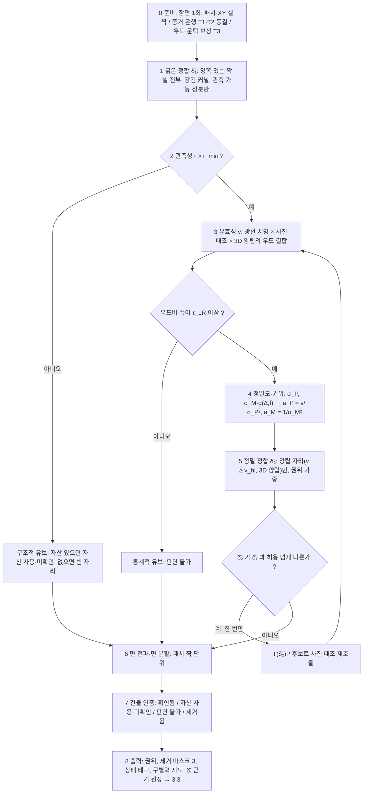
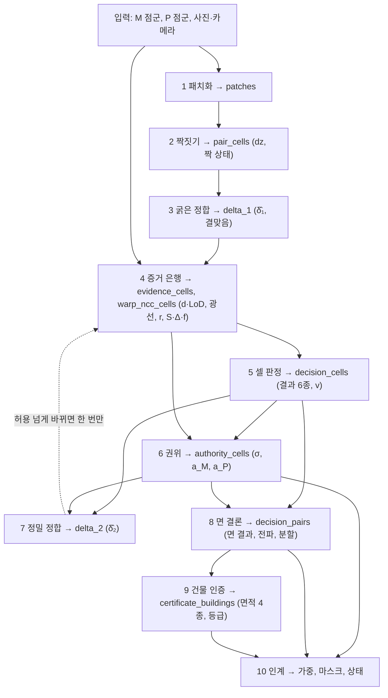

# 박사 연구 주제 재정리 v1 — 3. 제안 방법, 부록 (r4)

> 지위: WORKING DRAFT. `scientific_verdict: null`. 본문 = `03_METHOD_ko_v1.md`. 이 파일은 본문 3.1 의 유도(3A)와 3.2 의 세부 규칙·수식·자리표(3B)다.
> 3B 는 기존 설계 v2·방법론 v3 에서 선택·단순화한 것이며, 값이 임의인 규칙은 3B.9 에 모았고 실험이 정한다. 본문 3.2 의 세 단계와 3B 의 대응은 3B.1b.
> r4(2026-09-05): 본문에서 분리. 내용은 r3.9 본문의 부록과 같다(무삭제). 3B.2~3B.9 의 "3.2.x" 참조는 본문의 옛 번호이며, 현재 본문 단계는 3.2.1~3.2.3.

## 부록 3A 유도 메모

### 3A.1 잉여도 1 에서 `d` 의 비식별

한 자리의 현재 높이를 `t` 라 하자. 낡음 가설: `z_M ~ N(t, σ_M²)`, `z_P ~ N(t + Δ, σ_P²)`. 영상 편향 가설: `z_M ~ N(t + β, σ_M²)`, `z_P ~ N(t, σ_P²)`.
`t` 를 모르므로 `t` 에 불변인 통계량은 `d = z_M − z_P` 뿐이다. 낡음 아래 `d ~ N(−Δ, σ_M² + σ_P²)`, 편향 아래 `d ~ N(β, σ_M² + σ_P²)`. 두 분포는
평균만 다르고, 지붕을 낮춘 것과 영상이 가라앉은 것이 같은 크기이면(`β = −Δ`) 완전히 같다. 우도비는 1 이고, `d` 의 어떤 함수(가중치·커널·문턱)도
두 가설을 가르지 못한다. 잉여도 1 이라 불일치의 존재(`|d| ≫ σ`)는 검출되나 어느 관측이 틀렸는지는 국지화되지 않는다는 신뢰도 이론의 진술과
같다. 셋째 독립 관측이 붙으면 잉여도 2 가 되어 국지화가 가능해진다. 우리 설정에서 그것은 사진(후보 표면별 뷰간 대조)과 광선(자유 공간)이다.

### 3A.2 결합 형식별 오염과 구제

정밀도비 `ρ = σ_M²/σ_P²`, 낡음 사전확률 `π`, 낡음 차이 `Δ`. 세 자리에서 각 형식이 무엇을 내는가.

| 형식 | 낡은 자리에서 오염 | 영상이 가라앉은 자리에서 구제 | 영상 기하가 없는 자리 |
|---|---|---|---|
| 고정·정밀도 가중 | `π·Δ·ρ/(1+ρ)`, `ρ` 에 증가 | 부분(평균, 반쯤 틀린 지붕) | 오염 `π·Δ`, 보고 정밀도 `σ_P` |
| 강건 커널(대칭) | `ρ > 1` 이면 `π·Δ`(영상을 이상치로 기각) | `ρ > 1` 이면 구제 | 같음 |
| 잔차 게이트(영상 기준, 자산만 깎임) | 0 | 0(자산이 이길 수 없음) | 신호 0 → 자산 통과, 오염 `π·Δ` |
| 유효성 × 정밀도(제안) | 유효성 검정의 오류율 × `Δ` | 사진이 `P` 를 지지하는 만큼 | 사진·광선이 있으면 검정, 없으면 유보 |

읽는 법. 위 세 형식 중 어느 것도 낡은 자리의 오염과 가라앉은 자리의 구제를 함께 얻지 못한다. 대칭형은 오염을, 비대칭형은 미구제를 택한다.
영상 기하가 없는 자리에서는 셋 다 `π·Δ` 를 낸다. 그 자리가 자산이 가장 필요한 자리다. 제안의 오염은 `ρ` 가 아니라 유효성 검정의 오류율에 달려
있으며, 그 오류율은 5장에서 통제 주입과 층화 실데이터로 잰다.

### 3A.3 파괴점과 판정 단위

위치 추정량의 파괴점은 1/2 을 넘지 못한다(Huber; Rousseeuw). 한 지붕면 안에서 자산 점은 전부 낡았거나 전부 유효하고, 영상 점은 전부
가라앉았거나 전부 맞다. 오염 비율이 단위 안에서 0 아니면 1 이므로 강건 추정이 전제하는 "소수 이상치"가 성립하지 않는다. 두 소스를 합쳐
다수결을 하면 다수는 점 밀도가 정한다(합집합의 실패). 한 소스를 기준으로 잔차를 재면 다수는 기준 선택이 정한다(잔차 게이트의 실패). 그러므로
판정 단위는 점이 아니라 지붕면(패치)이고, 면 안에서는 이유가 하나라는 것이 전파의 근거다(3B.7).

### 3A.4 `δ` 와 양립 집합의 고정점

양립 집합 `C(δ)` = `T(δ)P` 와 `M` 이 허용치 안에서 맞는 자리. `δ̂(C)` = `C` 의 자리들에서 추정한 정합. 참 해는 `C = C(δ̂(C))` 인 고정점이다.
강건 정합은 `C` 를 모른 채 전체 자리에서 `δ̂` 를 재고 변화 자리를 이상치로 견딘다. 변화 면적이 파괴점 안이면 한 번으로 고정점에 닿는다(순차
1회). 변화가 건물의 큰 부분을 덮으면 `δ̂` 가 변화 쪽으로 끌리고, 끌린 `δ̂` 로 옮긴 자산은 양립 자리를 불일치로 보이게 하며, 그 판정으로 고른 `C`
는 더 오염된다. 둘째 패스는 첫 판정이 남긴 양립 후보에서만 `δ̂` 를 다시 재어 이 순환을 한 번 끊는다. 변화가 건물을 덮어 `C` 가 비면 고정점이
없고, 그때는 유보다.

## 부록 3B 판정의 세부 규칙(실험이 정함)

본문 3B.2 의 단계가 쓰는 규칙이다. 단계 1·2 → 3B.2, 3 → 3B.3, 4 → 3B.4, 5·6 → 3B.5, 7 → 3B.6, 8·9 → 3B.7, 10 → 3B.8. 값이 임의인 것은 3B.9 에 모았다. 3B.0 은 기존 설계(설계 v2, 방법론 v3)와의 차이, 3B.1 은 유보·재판정 분기가 보이는 순서도다. 이 부록은 기존 설계에서 선택·단순화한 것이며 세부는 실험하며 고친다.

### 3B.0 기존 판정에서 남는 것과 바뀌는 것

[논리] 수행한 것(패치·짝, 증거 은행 T1·T2, 통제 주입 벤치)은 그대로 쓴다. 바뀌는 것은 판정의 가설 공간, 출력, 순서다.

| 항목 | 기존(설계 v2, 방법론 v3, 수행 T0~T2) | 3.2 | 왜 바뀌나 | 수행한 것에 미치는 영향 |
|---|---|---|---|---|
| 단위 | 소스별 표면 패치 + 0.5 m XY 셀 짝, 짝 상태 5(서술) | 같음. 결론 단위 = 패치 짝(면), 셀 = 표본. 부분 변화면 면 분할 | 3A.3 파괴점(면 안 오염은 0 아니면 1) | 없음 |
| 후보 | `{M, T(δ)P, G}` | `{M, T(δ̂)P}`. `G` 제거 | 원칙 A·F. 재검정은 3.3.7 가설 | T2 호출 대상 축소 |
| 증거 채널 | 3D-a·3D-b·3D-c·2D-a·2D-b·2D-c·`r` 여섯, 은행 동결 | 같은 여섯, 은행 그대로. 위계만 바뀐다. 유효성은 사진·광선이 정하고 3D 거리는 양립 확인·정밀도·정합에만 쓴다 | 명제 1(3D 잔차는 방향을 모른다) | T1·T2 무변경 |
| 가설 공간 | 원인 5(양립·바뀜·영상 오류·정합·비관측) 위의 책임 `pi` | 출력 셋: 유효성 `v`(자산이 아직 맞나), 관측성 `r`(볼 수 있나), 정합 `δ̂`(건물 단위). 영상 오류는 가설이 아니라 정밀도 보정, 정합은 셀 가설이 아니라 건물 변수, 출현은 짝 상태(자산 없음) | 결정 ②(9-4), 명제 2·3 | T3 우도 가족 축소, T4 재정의 |
| 정합 | `δ⁰`(브리지) + 루프 안 `δ̂`(양립 책임 가중) | 굵은 정합(판정 앞, 전 짝 셀, 강건) → 판정 → 정밀 정합(양립 자리) → 재판정. 2패스 고정 | 명제 3(c) | 새 단계. 세 prism 은 `δ⁰` 가 이미 허용 안이라 `δ̂ ≈ 0` 예상 |
| 반복 | T6 매 사이클 재판정 + `G` 후보 | 없음. 재판정은 정밀 정합 뒤 1회 | 원칙 F, 결정 ① | T6 → 2패스 + 절제 실험 |
| 평활 | 이웃 Potts 평활 + 전환 감쇠 | 면 단위 전파(같은 패치 안 확정 셀 → 미확정 셀) + 면 분할 | 3A.3 | mean-field 불필요, 전파 규칙 신규 |
| 정밀도 | 3D 잔차·밀도에서 `σ` | `σ_P` = 자산 공칭 잡음 ⊕ 정합 잔차. `σ_M(u)` = 셀 z-spread 를 사진 열세만큼 키운 것 | 명제 2, 결정 ② | 신규 회귀(T3) |
| 출력 | `pi`, `w = pi/σ²`, 보고 `z` | 소스별 권위 `a_s = v_s / σ_s²`, 제거 마스크 3종, 상태 태그, 구별력 지도, `δ̂` | 결정 ①, 명제 4 | 신규 출력 3종 |
| 인증 | 건물별 `pi` 문턱 3분류 | 같은 3분류. 유효성·관측성에서 도출, 신뢰도 표기 = 검정 결과 | 명제 2 | 정의만 |
| 우도 보정 T3 | 원인·채널별 우도 가족(가설 5) + 결맞음 | 유효성 2가설 우도 + 관측성 + 정밀도 회귀 + 결맞음. 판정 전 1회, 루프 밖 | 가설 공간 축소 | 표본 동일(3 prism, 벤치 8종, B173) |
| 손 규칙 | T1 문턱 귀속(설명용) | 우도로 대체. "유보 게이트 먼저"라는 순서는 유지 | 벤치: 손 규칙 적중 33 % | — |
| 방법론 v3 T5 의 A2·A3 | 재구성 쪽 장치 | 판정 쪽으로 이동(A2 변화 인지 정합 → 3B.6, A3 패치 전파 → 3B.7). A1·A4 는 3.3 손실로 흡수 | 판정은 소비되기 전에 끝나야 한다 | — |

[실측] 세 prism 과 벤치의 판독 방향은 바뀌지 않는다. 은행과 서명이 같기 때문이다. 바뀌는 것은 결과의 형식과 정합·전파 단계다.

### 3B.1 분기가 보이는 순서도



#### 3B.1b 열 단계 데이터 표 대응(구현용)

**세 단계와의 대응.** 1 3D 비교·정렬 = 아래 1·2·3, 2 광선/사진 검사 = 4·5·6, 재정렬(조건부) = 7, 3 지붕면 전파 = 8·9·10.

[논리] 열 단계다. 받는 것은 앞 단계의 표이고 만드는 것은 표 하나다. 1~4 는 실행했고 산출물의 실제 열 이름을 적는다. 5~10 은 설계다.



| 단계 | 무엇을 받나 | 무엇을 하나 | 무엇을 만드나(표, 주요 열) | 상태 |
|---|---|---|---|---|
| 1 패치화 | `M`·`P` 점군 | 소스별로 평면 성장, 잔여는 군집 | `patches_{mvs,als}`: patch_id, type(평면/선형/산재), 법선, plane_rmse, area. `points_*`: 점 → 패치 | 실행(파일럿·P2·P3) |
| 2 짝짓기 | 패치 표 | 0.5 m XY 셀마다 위층 표면끼리 짝, 1 m 넘게 떨어진 아래층은 둘째 짝, 벽은 3D 근접 | `pair_cells`: mvs_patch, als_patch, mvs_z, als_z, dz_m, state(양립 / 옛 것 위 / 지금 것 위 / 옛 것만 / 지금 것만). `pair_pairs`: 패치 짝, cells, dz 중앙·MAD | 실행 |
| 3 굵은 정합 | `pair_cells` 의 양쪽 있는 셀, 패치 법선 | 건물별 강체 δ 를 법선 방향 잔차에 강건 적합, 관측 가능 성분만 | `delta_1`: 건물, δ̂₁, 관측 성분, 결맞음(dz 분산·부호 일치). `pair_cells.d_after` | 설계. 세 prism 은 δ⁰ 가 허용 안 |
| 4 증거 은행 | `pair_cells`(δ̂₁ 뒤), `M`, `T(δ̂₁)P`, 사진·카메라 | 광선 추적, core 거리 집계, 텍스처·뷰, 후보별 사진 대조 | `evidence_cells`: core_d_median, core_lod, f_agree / f_penetrate / f_block, n_no_landing, n_occluded, texture, n_views, incidence, power_3da/3db/2da, r. `warp_ncc_cells`: S_M, S_P, Δ(delta_median), f_m_over_p, f_p_over_m, n_pairs_common, power_2da_m/p | 실행. 동결·해시 |
| 5 셀 판정 | `evidence_cells`, `warp_ncc_cells`, 보정표 | r 게이트 → 유효성 우도 결합 → 우도비 폭 검사 | `decision_cells`: verdict(자산 맞음 / 영상 맞음 / 양립 / 못 봄 / 못 가름 / 자산 없음), v, log LR, 근거 채널 | 설계. 손 규칙 결과만 있음 |
| 6 권위 | `decision_cells.v`, `evidence_cells`(잡음), `warp_ncc_cells`(Δ, f) | σ_P, σ_M·g, a = v/σ² | `authority_cells`: sigma_m, sigma_p, a_m, a_p, share_p | 설계 |
| 7 정밀 정합 | 양립 셀(`decision_cells`), 가중(`authority_cells`), `pair_cells` | 양립 셀만으로 δ̂₂ 재적합, 결맞음 재검사 | `delta_2`: δ̂₂, 재판정 여부. 허용 넘게 바뀌면 4 의 사진 대조를 `T(δ̂₂)P` 로 다시 하고 5·6 을 한 번 더 | 설계 |
| 8 면 결론 | `decision_cells`, `authority_cells`, `pair_pairs` | 확정 셀 → 면 값 → 미확정 셀 전파, 갈리면 분할 | `decision_pairs`: 패치 짝, verdict_face, v_face, n_confirmed, n_propagated, split. `decision_cells.propagated` | 설계 |
| 9 건물 인증 | `decision_pairs`(상태·면적) | 면적 4종 셈, 등급 | `certificate_buildings`: area_confirmed, area_unverified, area_undecidable, area_removed, grade, δ̂, 관측 성분 | 설계 |
| 10 인계 | `authority_cells`, `decision_cells`, `decision_pairs`, `certificate_buildings`, 검정력 | 3.3 이 받는 세 형식으로 묶음 | 가중(a_M, a_P), 마스크(낡은 자산 / 자산 권위 자리의 영상 시드 / 유보), 상태 태그(셀·면·건물) + 구별력 지도, δ̂ | 설계 |

### 3B.2 입력, 단위, 후보

[논리] 입력은 동결 현재 영상·카메라, 현재 MVS 점군 `M`, 옛 ALS 점군 `P`(초기 정합 `δ⁰` 적용). 색은 판정에 쓰지 않는다.

단위는 두 층이다. 소스별 표면 패치(평면 성장 + 잔여 군집, 유형 평면/선형/산재)와 0.5 m XY 셀의 소스 간 짝(위층 짝, 1 m 넘게 떨어진 아래층 짝,
벽은 3D 근접). 짝 상태(양립 / 옛 것 위 / 지금 것 위 / 옛 것만 / 지금 것만)는 높이 차의 서술이지 판정이 아니다. 셀은 표본이고 결론은 패치 짝
단위로 낸다(3B.7).

후보는 짝 상태가 정한다.

| 짝 상태 | 후보 | 판정할 것 |
|---|---|---|
| 양쪽 있음(양립·옛 것 위·지금 것 위) | `M`, `T(δ̂)P` | 유효성, 정밀도 |
| 옛 것만 | `T(δ̂)P` | 유효성. 잉여도는 사진·광선에서 온다 |
| 지금 것만 | `M` | 없음. 상태 "자산 없음", 영상 권위 |

### 3B.3 굵은 정합(1패스)

[논리] 무엇. 건물·스트립 단위 강체 `δ`(수직 + 관측 가능한 수평 성분)를 모든 짝 셀의 법선 방향 잔차 `n·(x^M − T(δ)x^P)` 에 강건 커널로 적합한다.
광도는 쓰지 않는다. 왜. 명제 3(c). 변화 자리가 섞여 있어도 그 면적이 파괴점 안이면 강건 커널이 견딘다. 규칙. 법선 공분산의 고유분해로 관측
가능한 성분만 추정하고 나머지는 0 에 묶는다(지붕 위주 자산에서 수평은 벽·경사면이 있을 때만 관측된다). 잔차의 건물 단위 결맞음(dz 분산·부호
일치)을 함께 적어 정합 오차가 남았는지의 지표로 쓴다. 자리표. 커널과 완화 스케줄, 단위(건물 / 스트립), 강체 자유도(회전 포함 여부).

### 3B.4 증거 채널

[논리] 증거는 동결 은행이다(T1·T2). 모델 상태의 함수가 아니고 학습된 색을 쓰지 않는다(원칙 A). 3.1 의 채널 위계에 따라 어느 출력에 쓰이는지를
고정한다.

| 채널 | 무엇을 재나 | 어느 출력에 쓰나 | 후보에 의존하나 |
|---|---|---|---|
| 2D-a 사진 대조 | 후보 높이장으로 창을 뷰 i→j 로 옮긴 가중 ZNCC(후보별 자기 가시성), 셀 요약 `S_M`·`S_P`, 짝 대조 `Δ = S_M − S_P`, `f(M>P)` | 유효성(`P` 가 사진에 맞나), 정밀도 보정(`M` 이 사진에 안 맞나) | 예 |
| 3D-b 광선 | 현재 카메라 광선의 착지: 일치 / 관통(옛 표면 자리를 뚫음) / 차단(앞에 새 표면) / 무착지(비관측) / 가림 | 유효성(관통 = 낡음), 관측성(무착지·가림) | 예(자산 표면) |
| 2D-c·광선 수 | 텍스처, 뷰 수, 입사각, 교차각, 검정 광선 수 → 검정력 플래그, `r` | 관측성, 구별력 지도 | 아니오 |
| 3D-a 거리 | 부호 거리 `d`, LoD, 소스별 z-spread | 양립 확인(`\|d\| ≤ LoD`), 정밀도(`σ` 비대칭), 정합 잔차. 방향(누가 틀렸나)에는 쓰지 않는다 | `δ̂` 만 |
| 3D-c 결맞음 | 건물·스트립 안 dz 분산·부호 일치 | 정합 오차 잔존 검출, 변화(국소)와 구분 | `δ̂` 만 |
| 2D-b 에지 | 후보 렌더의 깊이 에지와 영상 에지 거리 | 보조. 무텍스처 면의 윤곽 | 예 |

읽는 법. 유효성은 사진과 광선이 정하고, 3D 거리는 "차이가 있는가"만 말한다. 광선은 홀로 결정하지 못한다. 차단은 출현과 위로 치우친 영상이 같은
서명이고, 얕은 관통은 소실과 가라앉은 영상이 닮는다(광선의 착지가 영상 표면이기 때문이다). 사진이 가른다. 무착지는 자유 공간이 아니라 비관측이다. 자세한 정의는 설계 v2 부록 D-3·D-5·D-7 이며 바꾸지 않는다.

### 3B.5 우도, 유효성, 정밀도, 유보

[논리] 유효성. 셀마다 두 가설을 둔다. 자산이 지금도 맞다(`H_V`), 자산이 낡았다(`H_S`). 검정력 있는 채널의 우도를 곱해 사후확률 `v = P(H_V | o)` 를
낸다.

```text
v(u) ∝ P(H_V) · Π_{c ∈ C_u} p(o_{u,c} | H_V),      1 − v(u) ∝ P(H_S) · Π_{c ∈ C_u} p(o_{u,c} | H_S)
```

`C_u` 는 검정력 있는 채널이다. 없는 채널은 우도비 1 이라 자동으로 빠진다. 서명은 이렇다.

| 채널 | `H_V` 아래 | `H_S` 아래 |
|---|---|---|
| 광선 | 일치, 무착지, 또는 얕은 관통·차단(영상 편향)이며 사진이 `P` 를 지지 | 깊은 관통(소실), 또는 차단(출현)이며 사진이 `M` 을 지지 |
| 사진 대조 | `S_P ≥ S_M` 또는 동률, `f(M>P)` 낮음 | `S_M > S_P`, `f(M>P)` 높음 |
| 3D 거리 | `\|d\| ≤ LoD`(`δ̂` 뒤) | `\|d\| > LoD`. 방향 무관 |

정밀도. 자산은 `σ_P(u)` = 공칭 잡음 ⊕ 정합 잔차. 영상은 `σ_M(u)` = 셀 z-spread 에 사진 열세를 곱한 것. 사진이 `P` 를 지지하는 만큼(`Δ < 0`,
`f(P>M)` 높음) `σ_M` 을 키운다. "영상이 틀린 자리"는 이렇게 낮은 정밀도로 나타나며 별도 결과가 아니다.

```text
σ_M(u) = σ_M^spread(u) · g(Δ_u, f_u),     g ≥ 1,   g = 1 이면 사진이 M 을 부정하지 않는다
```

권위. 소스별 권위는 유효성 × 정밀도다. 영상의 유효성은 정의상 1 이다(현재 관측).

```text
a_P(u) = v(u) / σ_P(u)²,      a_M(u) = 1 / σ_M(u)²   (M 이 있을 때)
```

네 자리에서 이 식이 내는 것. 양립(`v ≈ 1`, 두 `σ` 비슷)이면 정밀도 융합. 낡음(`v ≈ 0`)이면 영상만. 영상이 가라앉은 자리(`v ≈ 1`, `σ_M` 커짐)면
자산 우선. 옛 것만 있는 자리면 `a_P` 만. 이것이 3A.2 표의 마지막 행이다.

유보. 두 종류를 구분해 적는다. 구조적 유보 = 검정할 관측이 없다(`r ≤ r_min`, 사진 쌍·광선 부족). 상태는 "자산 사용·미확인"이며 자산이 있으면 그
기하를 묶어 두고, 없으면 빈 자리로 둔다. 통계적 유보 = 관측은 있으나 가르지 못한다(`|log LR| < τ_LR`). 상태는 "판단 불가"다. 어느 쪽도 `v` 를 내지
않고 권위를 미정으로 두며, 기하를 만들거나 옮기지 않는다. 유보는 값이 아니라 상태다.

보정(T3). 우도 가족, `g`, `r_min`, `τ_LR` 는 판정 전에 한 번 보정하고 판정 중에는 고정한다(루프 밖). 표본은 통제 주입(벤치 8종)과 자연 사례(세 prism,
B173 held-out)다. 판정 대상 셀은 보정 표본에 넣지 않는다. 문턱 규칙은 우도를 대신하지 못한다(벤치: 손 규칙 적중 33 %).

### 3B.6 정밀 정합(2패스)과 재판정

> r3.3: 본문에서는 "재정렬(조건부)"로 자리가 바뀌었다. 촉발 조건 = 낡음으로 읽힌 셀들의 높이차가 건물 단위로 결맞음(3D-c). 아래 규칙은 그 재정렬의 계산 방법이다.

[논리] 무엇. `v ≥ v_hi` 이고 `|d| ≤ LoD` 인 셀(양립 자리)만으로 건물·스트립 단위 `δ̂₂` 를 다시 적합한다. 가중은 권위다. 왜. 첫 정합에는 변화
자리가 섞여 있었다. 판정이 그것을 걸러 준 뒤의 정합이 정밀하다(명제 3(c), 3A.4). 규칙. `|δ̂₂ − δ̂₁|` 가 허용을 넘으면 `T(δ̂₂)P` 를 후보로 사진
대조를 다시 호출하고(T2 는 후보를 받는다) 3B.5 를 한 번 더 실행한다. 넘지 않으면 첫 판정이 최종이다. 두 번째 재판정은 없다. 양립 자리가
비면(건물 전체가 바뀜) `δ̂₂` 는 미정이고 건물 상태는 "정합 미정"이며 자산 권위 자리를 두지 않는다.

[예정] 세 prism 은 `δ⁰` 가 허용 안이라 2패스가 1패스와 같을 것이다. 그 자체가 기록이며, 2패스의 이득은 `δ` 주입 × 변화 면적 실험이 답한다(3B.9).

### 3B.7 면 단위 전파, 면 분할, 건물별 인증

[논리] 전파. 지붕면은 물리적 한 단위라 면 안에서 이유는 하나다(3A.3). 패치 짝 안에서 확정 셀(유보 아님)의 `v`·`σ` 를 검정력 가중 평균해 면 값으로
두고, 그 면의 미확정 셀에 물려준다. 물려받은 셀의 상태는 "확인됨-전파"로 원래 확정과 구분한다. 확정 셀이 하나도 없는 면은 유보로 남는다.

면 분할. 한 면 안에서 확정 셀들의 `v` 가 갈리고(`v_hi` 이상과 `v_lo` 이하) 각각이 연결된 면적 `A_min` 이상이면 면을 나눈다(부분 변화). 나뉜
조각마다 따로 전파한다.

인증. 건물마다 자산이 쓰인 면적을 셋으로 나눈다. 현재 관측으로 확인됨(확정 + 전파) / 자산 사용·미확인(관측 없음) / 판단 불가(통계적 유보).
건물 등급은 그 비율에서 나오고, 신뢰도 표기는 `σ_P` 가 아니라 이 검정 결과다(명제 2). 자산이 낡은 면적은 "제거됨"으로 따로 적는다.

자리표. 전파 가중, `v_hi`·`v_lo`, `A_min`, 건물 등급 문턱.

### 3B.8 출력 형식(전체)

[논리] 판정은 한 번 끝나고 아래를 넘긴다. 3.3 은 이것만 받는다.

| 출력 | 정의 | 3.3 이 하는 일 |
|---|---|---|
| 권위 `a_M(u)`, `a_P(u)` | 유효성 × 보정 정밀도(셀·패치) | 손실 가중. 이 밖의 가중은 없다 |
| 제거 마스크 ① 낡은 자산 | `v < v_lo` 인 자산 셀 | 자산 점 제거, 자산 시드 금지 |
| 제거 마스크 ② 자산 권위 자리 | `a_P / (a_P + a_M) ≥ τ_auth` | 영상 시드 제거, 영상 손실 억제, 거친 자유도 묶음 |
| 제거 마스크 ③ 유보 | 구조적·통계적 유보 | 생성·이동 금지, 표시 |
| 상태 태그 | 셀·패치·건물: 확인됨 / 확인됨-전파 / 자산 사용·미확인 / 판단 불가 / 자산 없음 / 제거됨 + 출처·시기·근거 채널 | 가우시안 속성, 산출물 상태 |
| 구별력 지도 `D(u, s)` | 사진이 규모 `s` 의 높이 차를 가르는 확률(통제 후보 반응, 2D-c) | 세부 게이트(명제 4) |
| `δ̂`, 관측 가능 성분 | 건물·스트립별 | 자산 좌표 변환 |
| 근거 원장 | 셀별로 어느 채널이 어느 쪽을 밀었나 | 감사, 그림 |

### 3B.9 자리표와 실험이 정하는 것

[예정] 값이 임의인 것을 모은다. 이 절은 값을 주장하지 않는다.

| 자리표 | 현재 값(기록) | 누가 정하나 |
|---|---|---|
| 광선 착지 허용 τ, 관통·차단·일치 비율 문턱 | 0.5 m, 0.5 / 0.4 / 0.6 | T3 우도로 대체 |
| 3D 거리 양립 허용 | 0.3 m | T3(LoD 기반 우도) |
| 사진 대조 창·σ·최소 쌍·판별 각도 대역 | 2 m·0.5 m·3·사이트별(파일럿 20°, P2 전대역) | T3 각도 조건부 우도 |
| 텍스처·뷰 수·입사각 검정력 플래그, `r_min` | 6·2·75°, `r ≤ 1` 유보 | T3, 유보율 대 오류율 |
| `τ_LR`, `v_hi`, `v_lo`, `τ_auth` | 미정 | 위험–커버리지 곡선, 절제 |
| `g(Δ, f)` 정밀도 확대 함수 | 미정 | T3 회귀(V6·V7·prism 3 표본) |
| 정합 커널·스케줄·단위·자유도, 재판정 허용 | 미정 | `δ` 주입 × 변화 면적 실험 |
| 전파 가중, `A_min`, 건물 등급 문턱 | 미정 | 절제(셀 독립 판정 대비) |
| 구별력 규모 목록 `s` | 0.5 / 1 / 2 m(통제 후보) | 3.3 세부 게이트 실험이 세분화 |

실험이 답할 질문 셋. ① 2패스가 1패스와 갈리는 조건(`δ` 주입 크기 × 변화 면적 비율 10 / 30 / 60 %). ② 유보를 늘릴수록 오류율이 내려가는가
(위험–커버리지). ③ 정밀도 보정이 영상이 가라앉은 자리에서 자산 우선을 내는가(V6·V7·prism 3, 그리고 아직 없는 자연 "MVS 없음" 표본).
