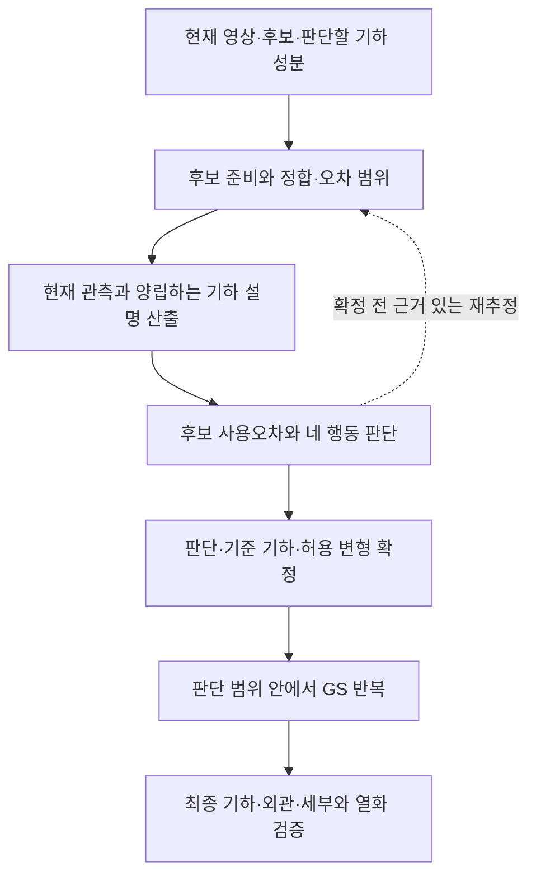

# 현재시점 실사 3D 재구성을 위한 통합 설계 논증

> 작성: 2026-09-06. 지위: 문서와 대화를 연결한 설계 정리. `scientific_verdict: null`.
> 목적: 각 계산이 왜 필요한지, 어떤 판단을 가능하게 하는지, 무엇이 성립해야 그 판단을 믿을 수 있는지를 한 논증으로 연결한다.
> 근거: [필요성 r7.1](01_NECESSITY_ko_v1.md), [공백·기여 r2](02_GAP_ko_v1.md), [r4 점검표](03_METHOD_REDESIGN_AUDIT_ko_v1.md), [판단상황표 r2](03_METHOD_DECISION_SCENARIOS_ko_v1.md), [재설계 r3.7](03_METHOD_REDESIGN_ko_v1.md), [높이 구성요소 실험](../prior_use_height_probe_v1/TECHNICAL_RETURN_ko_v1.md), 이번 대화의 합의와 수정.
> 전체 방법의 구성·설계 근거·기여는 재설계 §3.1에서 먼저 읽는다. 이 문서는 그 논증의 합의·조건·미결을 추적하는 보조 문서다. 세부 수식은 재설계 본문, 기존 안의 문제는 점검표, 수치 결과는 실험 기록에 연결한다. 기존 문서·실험·E1–E6 및 역사적 C 계보는 보존하며 새 실험은 수행하지 않는다.
> 이 문서 작성 이후의 사용자 요청은 [새 세션 인계](04_NEXT_SESSION_HANDOFF_ko_v1.md)에 기록했다. 판단 비교와 재구성 설계를 병행하고 동일 샘플 지역에서 개발 검증까지 이어간다.

## 1. 우리가 해결하려는 문제와 현재 도달점

재설계 r3.7의 도입부는 **전체 구성 → 그 구성을 택한 이유와 기여의 위치 → 입력·출력 및 세부 방법** 순서다. 비교·정합은 판단의 기반, 사용오차에 따른 판단과 그 판단을 보존하는 재구성은 두 기여의 설계 대상으로 구분한다. §3.1.1의 흐름도와 대조표에서 단계별로 추가하는 계산과 바꾸려는 판단·결과를 먼저 보여 주고, §3.2–3.7의 첫머리가 같은 핵심 방법을 이어받는다. 각 절의 도입 순서와 번호 항을 일대일로 맞추고, 실험 근거·미결은 처리 단계와 구별했다. 수식은 고정 입력·검사할 상태·계산 결과를 나눠 읽으며, §3.4.2의 개념도는 가능한 현재 기하와 고정 후보의 허용 범위를 비교하는 뜻을 설명한다. 각 단계의 필요성만으로 독창성이 성립했다고 하지 않고, 어떤 계산·제약을 추가하며 어느 비교로 기여를 입증할지 연결한다.

목표는 **현재 영상과 기구축 3D 자산을 이용해 현재시점의 기하와 외관을 충실하게 재구성하는 것**이다. 영상 복원의 빈 곳과 틀린 곳에 자산을 활용하고, 양쪽이 유효한 곳에서는 결합 이득을 얻으며, 이미 양호한 영역의 열화를 통제하려 한다. 이를 위해서는 자산을 넣기 전에 사용할 수 있는 기하를 판단하고, 그 판단을 재구성 결과에서 지켜야 한다. 판단표와 출처 기록은 이 목표를 돕는 수단이다.

전체 논증은 다음과 같다.

> 영상 기하가 없거나 틀려도 기존 자산에는 쓸 만한 구조가 남아 있을 수 있다. 그러나 그 구조가 현재도 맞는지는 과거의 정밀도만으로 알 수 없다. 현재 관측으로 후보의 사용오차를 제한할 수 있는 범위를 판단해야 한다. 그 판단이 지지하는 구조와 허용 변형을 재구성에 넘기고, GS가 현재 외관·세부를 복원하면서 그 범위를 지키게 해야 한다. 마지막으로 잘못된 채택과 유보 범위, 실제 기하·외관 개선과 열화를 함께 확인한다.

**현재는 재설계 §3.3.2–3.3.3에 다중 영상 대응·공유 카메라 오차의 공동 제약과 가능한 현재 위치의 계산을, §3.4.1–3.4.2에 고정 prior의 관측 지점 사용오차와 판정식을 작성했다.** §3.3의 관측 범위와 §3.4의 후보 사용오차를 하나의 주 계산으로 연결하고, 표면 전체로의 확장은 §3.4.4에 미완성 조건으로 구분했다. §3.5–3.6에는 판단의 오차 여유를 최종 표면 제약과 GS 최적화로 연결하는 조건부 설계를, §3.7에는 두 기여의 분리 비교를 작성했다.

앞서 구현한 것은 제한된 높이 진단이며, 새 관측 모형은 문서 설계다. 대응·오차 범위를 실제 입력에서 만드는 보정 방법, 관측 지지에서 면 사용으로 이어지는 조건, 판단을 지키는 GS 설계는 아직 완결하지 못했다. 따라서 ‘전체 설계는 끝났고 성능 실험만 남았다’는 상태가 아니다.

특히 “관측에 맞는 기하가 모두 prior의 허용오차 안이면 사용한다”는 식에는 중요한 전제가 있다. 그 기하 집합이 실제 가능한 현재 장면을 충분히 포함해야 한다. 이번에는 대응의 재투영 제약으로 그 집합을 만드는 조건부 계산을 정했다. 판단부의 설계 공백은 **그 계산에 들어갈 대응 위치·실패 상태·공유 카메라 오차의 범위를 실제 허용 자료에서 어떻게 산출할 것인가**다. 현재는 이 미결을 유지하면서 판단 비교·실험 설계와 재구성 방법 설계를 병행한다. 판단의 인계 조건을 가정한 설계와 그 조건을 실제 관측에서 확보한 전체 방법을 구별한다.

## 2. 합의한 원칙과 아직 선택하지 않은 방법

아래는 현재 논의의 기준으로 유지한다.

- 최종 기하 사용 행동은 `IMAGE / PRIOR / FUSION / ABSTAIN`이다. 현재 영상 자체와 그 영상으로 만든 MVS 기하를 구별하고, MVS도 오류 가능한 후보로 검사한다.
- MVS가 없거나 사용 불가로 확정되면 `PRIOR / ABSTAIN`이 남는다. 이때 판단의 중심은 prior 자체의 현재 사용 가능성이다. MVS 부재·사용 불가·미확정은 같은 상태가 아니다.
- 다른 후보가 없거나 상대적으로 우세하다는 이유로 채택하지 않는다. 반박이 없다는 사실, 평평함, 작은 산포, 높은 사진 점수도 단독 사용 근거가 아니다.
- 흐름은 **판단 확정 → GS 재구성 반복 → 결과 검증**이다. 확정 전에는 정합·대응·광선·사진 증거를 일관되게 재추정할 수 있다.
- 같은 과거 평면의 일부를 확인했다고 관측되지 않은 나머지까지 현재성 확인으로 전파하지 않는다. 직접 관측의 지지, 구조 가정에 따른 추론, 미확인 자산의 보존을 구별한다.
- 판단과 재구성을 모두 기여 후보로 검토한다. 양쪽 오차를 고려한다는 원칙이나 제약 최적화 형식만으로 독창성이 확보되지는 않는다. 판단이 적절해도 GS 결과가 그 기하를 훼손할 수 있으며, 좋은 외관만으로 기하 개선을 대신하지 않는다.

반면, 재설계 r3.4의 **양립 집합과 최대오차를 사용하는 방식은 이 원칙을 실현할 설계 후보**다. 유일한 해법으로 합의한 것이 아니며, [상위 문제정의](../../../research/06_DECISION_LOG.md#dec-p1-025--불확실성-인지형-cross-temporal-prior-guided-reconstruction-상위-문제정의)의 보정된 예상 기하오차와 동일한 추정량도 아니다. 이 안이 유용한 채택 범위를 남기는지, 예상오차 기준과 어떤 관계를 갖는지는 별도로 정리해야 한다.

## 3. 기존 계산에서 현재 사용 판단까지

기존 r4에도 **3D 비교 뒤의 광선·사진 검정, prior 단독 검정, 대안 이동과 유보, 판단 후 GS** 구상이 있었다. 이번 재설계는 그 검정에서 판단과 가중으로 넘어가는 연결을 **남은 기하·오차 설명 → 후보의 사용오차 → 행동**으로 구체화하고, 미관측 평면 전파를 현재성 확인에서 분리한다. 아래에서는 계승한 계산의 역할과 다시 설계할 연결을 구별한다. 이것이 r4 대비 설계 변화이며, 선행연구 대비 독창성의 입증은 별도 과제다.

### 3.1 3D 차이는 왜 출발점이며 최종 판단은 아닌가

MVS와 prior가 모두 있으면 3D 비교는 대응할 표면, 차이의 방향·크기, 정합을 점검할 위치를 알려 준다. 그러나 같은 차이는 현재 변화, MVS 오류, prior 원래 오류, 정합 오차로도 생길 수 있다. 따라서 거리의 유의성에서 어느 후보를 쓸지 바로 결정할 수 없다. 차이가 작아도 두 후보가 함께 편향됐을 가능성이 남는다.

정합은 후보를 같은 좌표에서 비교하도록 만드는 계산이다. 이를 믿으려면 어떤 대응이 안정된 구조를 나타내는지, 어느 이동·회전 성분이 관측되는지, 남은 오차가 어느 영역에 공유되는지 알아야 한다. 일정한 높이 차이를 모두 정합으로 흡수하면 실제 형상 변화를 지워 버릴 수 있다. 강건 적합식을 썼다는 사실만으로 안정 대응과 정합의 정확성이 확보되지는 않는다.

MVS가 없는 영역에서는 이 두 소스의 차이를 계산할 수 없다. 그때도 다른 허용 근거에서 얻은 정합과 불확실성은 전달할 수 있지만, 존재하지 않는 MVS 거리나 기각한 MVS 깊이를 만들어 prior 검정에 넣을 수는 없다. 이렇게 정리해야 다음 단계가 두 소스 비교에 종속되지 않는다. 근거: 재설계 §3.2, 점검표 A1·A5·A6.

### 3.2 현재 관측을 더해도 사진 적합도와 사용오차는 다르다

현재 사진을 후보 표면을 거쳐 대조하면, 그 후보가 영상 사이의 대응을 얼마나 일관되게 설명하는지 계산할 수 있다. 신뢰할 현재 착지와 빈 공간 근거가 있으면 광선과 후보의 모순도 검사할 수 있다. 이는 3D 차이만으로 남던 판단 문제에 현재 관측의 정보를 더하는 계산이다.

하지만 사진 적합도가 높다고 위치가 요구 정확도 안에 있다는 결론은 바로 나오지 않는다. 다른 높이·방향도 같은 무늬를 설명할 수 있고, 잘못된 위치가 가림·반복 무늬·카메라 오차와 결합하여 좋은 점수를 얻을 수도 있다. 반대로 낮은 점수는 틀린 기하뿐 아니라 검정할 표면을 보지 못한 결과일 수 있다. **현재 사용 판단에는 후보가 맞는 정도와 사용 허용오차 밖의 대안을 구별할 능력이 함께 필요하다.**

광선에도 같은 제한이 있다. 카메라 광선만으로는 빈 공간이 확인되지 않는다. MVS가 없는 자리에서 신뢰할 현재 착지를 별도로 얻지 못했다면 해당 광선 검정은 미산출이다. prior의 자체 가시성 렌더링도 현재 장면에서 그 표면을 실제로 보고 있다는 확인은 아니다. 근거: 재설계 §3.3.1–3.3.3, 판단상황표 §2.

### 3.3 추가 계산이 겨냥하는 것은 ‘남은 설명에서의 사용오차’다

재설계는 후보 하나의 점수에서 멈추지 않고, 다른 기하와 허용된 관측 오차까지 적용했을 때 현재 관측이 배제하지 못하는 설명들을 남기려 한다. 그 범위에서 고정한 후보의 오차를 계산하면 다음과 같은 결정이 가능해진다.

| 기존 계산이 주는 정보 | 남는 판단 문제 | 추가할 계산 | 그 계산이 바꿀 결정과 성립 조건 |
|---|---|---|---|
| 두 기하의 차이와 후보별 현재 관측 검정 | 그 검정이 어느 조건에서 후보의 사용을 지지하는가? | 계승한 검정의 적용 조건과 공유 오류 처리, 검정량에서 사용오차로의 연결을 재설계 | 현재 촬영 여부·상대 거리로 자동 채택하지 않고 각 후보의 사용 근거를 요구한다. 채널 수를 독립 근거 수로 쓰지 않는다. |
| prior의 높은 사진 점수 | 잘못된 다른 위치도 설명 가능한가? | 허용오차 밖 대안과 관측 오차를 포함한 양립 범위 | 나쁜 대안이 남으면 지지를 유보로 바꾼다. 그 대안을 실제로 검사하거나 미확정으로 보존해야 한다. |
| prior의 낮은 사진 점수 | 기하오차 초과인가, 관측·모형 문제인가? | 양립 범위의 존재 여부와 prior로부터의 최소·최대 오차 | 사용 반대·미확정·모형 불일치를 구별한다. 관측 결측을 기각으로 처리하지 않아야 한다. |
| 두 후보가 각각 관측에 맞음 | 평균한 기하도 사용할 수 있으며 이득이 있는가? | 동일한 양립 범위에서 실제 결합 후보의 오차 | 결합 이득이 뒷받침되는 경우에만 `FUSION`을 검토한다. 표면 대응과 오류 의존성이 필요하다. |
| 관측한 일부에서 prior가 지지됨 | 같은 옛 평면의 미관측 부분도 현재 맞는가? | 직접 지지 범위와 구조 추론 범위를 구별 | 미관측 부분을 현재 확인으로 승격하지 않는다. 전파가 새로운 관측을 공급하지는 않는다. |

이 표는 **설계한 인과 연결**이다. 추가 계산이 실제로 이 조건을 충족하는지는 아래의 설계·검증 상태와 구별한다.

### 3.4 판단식의 의미와 그 식에 앞서는 전제

실제로 출력에 사용할 고정 prior를 `g_P`, 가능한 현재 기하 상태를 `θ`, 카메라·정합·가림 등의 설명 변수를 `ν`라 하자. `L(g_P,θ)≤1`은 정한 성분·규모의 사용 허용오차를 충족한다는 뜻이다. 재설계 §3.4.4에서는 표면 위치·방향의 오차를 각 허용오차로 나눈 값으로 `L`을 정의했다. §3.4.1의 관측 지점 오차 `L_obs`에는 같은 최소·최대 오차 원칙을 적용하되, 그 결과를 연속 표면의 사용 지지로 복사하지 않는다.

현재 관측과 양립한다고 남긴 공동 설명 집합이 `𝒵`일 때,

$$
B_P=\inf_{(\theta,\nu)\in\mathcal Z}L(g_P,\theta),\qquad
U_P=\sup_{(\theta,\nu)\in\mathcal Z}L(g_P,\theta).
$$

비어 있지 않은 적절한 집합에서 `U_P≤1`이면 조건부 사용 지지, `B_P>1`이면 조건부 사용 반대, 그 사이면 미확정이라는 안이다. 핵심 논리는 다음 함의로 드러난다.

$$
(\theta^*,\nu^*)\in\mathcal Z\quad\text{및}\quad U_P\le1
\quad\Longrightarrow\quad L(g_P,\theta^*)\le1.
$$

별표는 실제 장면과 관측 오차 상태이며 알고리즘이 알고 있는 정답이 아니다. **오른쪽 결론을 뒷받침하는 데 필요한 것은 작은 `U_P`뿐 아니라 왼쪽의 포함 전제다.** 이 함의는 집합과 최대값의 정의에 따른 조건부 관계이며, 새로운 알고리즘의 독창성이나 집합의 신뢰성을 증명하는 식이 아니다.

여기서 ‘남은 설명 전체’는 선언한 적용 범위와 오차 모형에서 다룰 설명을 뜻한다. 모든 상상 가능한 장면을 무제한 열거한다는 요구는 아니다. 다만 적용 범위의 근거, 빠뜨릴 수 있는 설명과 오차, 그때의 유보 규칙은 방법에 포함되어야 한다. 제한된 모형에서 얻은 좁은 집합을 근거 없이 전체 현재 형상의 보장으로 확대할 수 없다.

또한 나쁜 기하 하나를 배제하려면 **허용된 어떤 공동 카메라·정합·가림 설명을 적용해도 그 기하가 관련 관측을 함께 설명할 수 없어야** 한다. 설명 가능한 공동 상태가 하나라도 남으면 그 대안도 남긴다. 각 관측에 서로 모순되는 편의적 정합을 주면 안 되고, 반대로 하나의 최적 정합만 참으로 고정하여 다른 가능한 설명을 지워도 안 된다. 가림을 근거 없이 자유롭게 허용하면 모든 기하가 ‘가려졌다’고 살아남는다. 따라서 `ν`를 식에 쓰는 일과 그 변수의 범위를 실제 근거로 제한하는 일은 구별된다.

## 4. 판단에서 재구성까지 이어져야 논증이 완성된다

판단이 끝나면 네 행동의 이름만 전달해서는 부족하다. `PRIOR`라면 어느 표면·위치·방향·규모를 기준으로 삼는지, 얼마나 변형할 수 있는지, 어느 범위를 기각하거나 미확인 상태로 남기는지를 함께 확정해야 한다. 정합과 그 판단을 만든 근거도 같은 버전이어야 한다.

그 뒤 GS는 현재 영상으로 외관과 허용된 기하 세부를 복원한다. 이때 prior의 채택을 지지한 기하를 다시 기각된 MVS에 맞춰 이동시키거나, 유보 영역을 새 근거 없이 확인된 표면으로 채우면 앞선 판단의 의미가 사라진다. Gaussian 중심을 고정하는 것만으로도 최종 표면 보존이 자동 성립하지 않는다. 방향·크기·불투명도·분할·제거와 표면 추출의 관계까지 설계해야 한다. 재설계 §3.5–3.6은 동일 표면 성분의 오차 여유를 이용한 변형 예산과 제약 최적화로 이 연결을 구체화했다. 실제 표면 대응·추출과 Gaussian 연산에서 그 조건을 집행하는 계산은 미완성이다.

따라서 전체 흐름은 다음과 같이 읽는다.

두 후보가 있으면 B에서 3D 관계도 계산한다. prior만 있으면 그 관계 계산을 생략하고 남은 현재 관측으로 C를 수행할 수 있는지 확인한다. 평면 전파는 C의 현재 관측을 대신하는 필수 단계가 아니다.

판단 기여는 **같은 재구성에 다른 판단 방법을 적용했을 때**, 재구성 기여는 **같은 판단 결과에 다른 재구성 방법을 적용했을 때** 검증한다. 전체 방법은 강한 기존 순차 조합과도 비교한다. 이렇게 해야 좋은 결과가 입력 차이, 판단 개선, GS 표현·최적화 중 어디에서 왔는지 설명할 수 있다. 판단·재구성·최종 평가가 같은 사진 적합도를 반복 보고하는 것으로 독립된 정확성 검증을 대신해서는 안 된다. 근거: 필요성 §1.5·1.7, 공백 §2.6–2.7, 점검표 A8·A9.

## 5. 무엇이 합의이고, 무엇이 미설계이며, 무엇을 검증해야 하는가

‘원칙을 합의함’, ‘수식으로 정의함’, ‘입력에서 계산하는 방법을 정함’, ‘그 방법이 실제 문제를 해결함’은 서로 다른 상태다. 특히 미설계 항목을 모두 실험 대기라고 표시하지 않는다.

| 전체 논증의 고리 | 합의하거나 정의한 것 | 설계가 부족한 부분 | 설계된 범위에서 남은 검증 |
|---|---|---|---|
| 문제·행동·순서 | 현재 실사 3D, 네 행동, 판단 확정 후 GS 반복 | 기하 성분·규모·좌표와 사용 허용오차의 적용 규칙 | 최종 품질 목표를 달성하는지는 전체 방법 완성 뒤 평가 |
| 후보 관계·정합 | 비교량, 정합 변수, 조건부 오차 전파식 | 안정 근거 선정, 관측 가능한 자유도, 공유 편향과 오차 범위의 산출 | 정한 모형의 추정 정확도·적용 범위. 현재는 전체 모형을 먼저 구체화해야 함 |
| 사진 점수·높이 진단 | 원점과 공통 뷰쌍으로 이산 높이 점수를 계산하는 구성요소 구현; 산술 검산 완료 | 현재 가림·반사·표면 대응과 관측 실패를 처리할 모형 | 제한된 점수·높이 규칙과 실제 기하오차의 관계는 미검증 |
| 현재 기하의 양립 범위 `𝒵` | §3.3.2에 공동 재투영 제약을, §3.3.3에 연속 범위의 보수적 탐색안을 정의 | 대응 위치 `E`·대응/가림 상태 `𝒜`·카메라 오차 `𝒞`의 산출·보정, 원소스 교점 표현, 구간 경계 계산 | **조건부 모형이며 전체 설계 완료가 아님.** 입력 계약과 포함 성질·오채택·유보 범위 미검증 |
| 후보 사용 판단 | 실제 가능한 해의 존재와 외측 오차 상한을 요구하는 종료 규칙; 관측 지지의 위치·점 배치 방향 오차를 정의 | 관측 지지에서 면 사용으로의 연결, 전체 네 행동의 계산 명세 | 기존 이산 높이의 상태 전이만 관측함. 새 관측 모형과 현재 사용 판단의 정확도는 미검증 |
| 융합 | 실제 결합 후보도 같은 근거로 검정한다는 원칙 | 대응, 결합 기하, 오류 의존성, 결합 이득의 구체적 계산 | 본 융합 방법은 아직 설계 단계이며 정밀도 개선 미검증 |
| GS 인계·재구성 | 행동별 기하 공급·감독 제외, 조건부 변형 예산, 제약 안의 GS 최적화 | 표면 대응·추출, Gaussian 연산의 제약 집행, 세부·경계 처리 | §3.5–3.6의 설계안은 미검증. 기존 GS 실행을 이 설계의 검증으로 재해석하지 않음 |

최근 높이 실험은 **고정 카메라·정합과 가림 미확인 조건에서 검사한 이산 높이 집합을 만들고, 그 집합으로 판단하면 원후보 점수만 볼 때와 결정이 달라짐**을 보였다. 그 규칙이 옳은 결정을 더 많이 만든다는 것, 자연적인 MVS 실패 영역에서 prior를 안전하게 구제한다는 것, 실제 현재 형상이 집합에 포함된다는 것은 확인하지 않았다. 따라서 전체 논증에서는 ‘판정식의 작동을 보여 준 구성요소 사례’ 위치에 둔다.

문턱을 높였을 때 빈 집합이 많이 나온 결과도 원인을 확정하지 못했다. 현재 관측을 설명하는 모형이 부적절한지, prior가 틀렸는지, 사진 검정이 약한지 구분하는 설계가 남아 있기 때문이다. 이 결과를 새로운 문턱 실험의 출발점으로만 삼으면 미완성된 관측 모형을 그대로 둔 채 결과를 따라가게 된다. 상세 수치와 실패 이력은 원 [실험 기록](../prior_use_height_probe_v1/TECHNICAL_RETURN_ko_v1.md)에 유지한다.

## 6. prior 단독 사용 판단에는 무엇을 알아야 하는가

### 6.1 알고자 하는 것은 현재 사용할 기하의 오차다

MVS가 없는 경우에도 모든 변화 원인을 분류할 필요는 없다. **이 고정 prior를 이 영역·성분의 현재 기하로 사용할 때 요구 정확도를 충족하는가**가 판단 대상이다. 과거부터 틀렸는지 최근 변했는지는 구별하지 못해도 사용 반대가 가능하다. 반대로 오래된 자산이 원래 정밀했다는 사실만으로 현재 사용을 지지할 수 없다.

그 질문을 현재 자료에서 답하려면 다음 연결이 필요하다.

| 알아야 할 것 | 왜 필요한가 | 현재 설계가 실제로 계산할 수 있는가 |
|---|---|---|
| **사용 대상과 허용오차**: 어떤 표면의 위치·방향을 어느 좌표·규모에서 판단하는가 | 오차의 의미를 정하지 않으면 사진 점수에서 ‘사용 가능’으로 넘어갈 기준이 없음 | 원 prior와 국소 그룹은 구성할 수 있다. 사용 목적에 따른 성분·규모·허용오차 규칙은 미완성이며 실험 감도값이 이를 대신하지 않음 |
| **현재 관측의 대상과 유효성**: 어떤 사진 부분이 해당 현재 표면을 실제로 관측하는가 | 다른 표면·가림·밝기 변화의 관측을 후보 기하오차로 오인하지 않기 위해 | 기존 투영·사진 대조 계산에 더해, 복수 대응과 결측 분기를 남기는 모형을 설계했다. 실제 대응 영역과 허용 실패 상태의 보정은 미완성 |
| **위치 기준과 공유 오차**: 카메라와 상대 정합의 어느 성분을 얼마나 믿을 수 있는가 | 정합·카메라의 오차를 기하 확신으로 바꾸지 않기 위해 | 공동 카메라 상태가 재투영과 고정 prior의 비교 위치에 작용하도록 연결했다. 현재 입력에 명목값은 있으나 정당한 공유 오차 범위의 산출은 미완성 |
| **현재 가능한 다른 형상**: 위치·방향 변화뿐 아니라 표면 부재·다른 층·경계 변화가 가능한가 | prior를 좁게 이동시킨 모형만 검사하여 거짓 지지를 만들지 않기 위해 | 새 모형은 관측점 위치를 prior 형상에 묶지 않는다. 다른 층·미관측 설명을 유지하고 면 방향·면 전체 사용으로의 승격을 제한했다. 연속 표면의 모형은 미완성 |
| **허용오차 밖 대안의 배제 근거**: 관측이 실제로 그 대안을 구별하는가 | 원후보 적합도에서 사용오차 제한으로 넘어가기 위해 | 재투영 제약, 가능한 해의 존재, 외측 오차 경계의 조건부 계산을 정했다. 실제 보정 입력과 연속 경계 계산의 구현·검증은 남았다 |
| **채택 뒤 지킬 범위**: 어느 기하 성분을 얼마나 움직일 수 있는가 | 판단이 지지한 기하를 GS가 다시 훼손하지 않게 하기 위해 | 인계 항목과 동일 표면 성분의 조건부 변형 예산·제약 최적화안을 정의했다. 실제 표면과 Gaussian 연산에서 집행할 계산은 미완성 |

현재 착지·빈 공간을 뒷받침할 별도 허용 근거가 있으면 광선 모순을 이 연결에 추가할 수 있다. 그런 근거가 없다면 사진을 통한 검정의 성립 조건으로 문제를 풀어야 한다. 깊이 결측이나 prior 자기 가시성으로 현재 착지를 대신하지 않는다.

좌표 정확도도 성분별로 다룬다. 카메라와 장면이 함께 움직여 사진 대응이 바뀌지 않는 설명이 남으면, 외부 위치 근거 없이 절대좌표 정확도를 확인할 수 없다. 그 사실이 모든 상대 형상의 판단을 자동으로 무효화한다는 뜻은 아니다. 어떤 좌표·성분의 지지를 주장하는지와 해당 오차를 제한할 근거를 연결해야 한다.

### 6.2 같은 `ABSTAIN`이어도 이유는 다르다

1. **검정할 관측이 없거나 기하 차이를 구별하지 못함:** 가능한 설명이 넓게 남는다. prior가 틀렸다고 확정하지 않고 사용을 유보한다.
2. **관측을 설명하는 집합 자체가 비어 있음:** 관측·정합·표면 모형·오차 보정을 점검한다. 빈 집합에서 `B/U`를 이용해 prior를 기각하거나 승인하지 않는다.
3. **적절한 비어 있지 않은 집합에서 prior가 모든 설명의 허용오차를 초과함:** 조건부 사용 반대다. 현재 채택에서 제외하되 그 자리가 빈 공간이거나 대체 표면이 확인됐다고 해석하지 않는다.

반대로 적절한 설명 집합 전체가 prior의 허용 범위 안에 들고 검정 조건이 성립하면 `PRIOR`를 허용할 수 있다. MVS가 없다는 사실은 이 조건의 실패도 성공도 미리 결정하지 않는다.

### 6.3 MVS가 못 만든 곳에서 prior 검정은 왜 가능할 수 있는가

MVS 결손을 prior로 보완한다는 주장이 성립하려면 **자유로운 영상 기하 생성은 실패했지만, 주어진 구조의 사용할 성분을 검사할 관측은 남은 경우**가 있어야 한다. 예를 들어 조밀 복원이나 후처리가 결손을 남겼더라도 현재 영상의 일부 대응·윤곽이 거친 표면 위치·방향을 제한할 가능성을 검토할 수 있다. 이는 성공 가능한 조건을 설명하는 가설이며 현재 실측으로 입증한 사례는 아니다.

prior는 검사할 구체적 구조와 표면 지지를 제공한다. 그러나 구조를 그대로 둔다는 가정만으로 검정 범위를 줄이면, 그 구조가 현재도 맞다는 결론을 전제에 넣을 수 있다. 관측이 주는 제한과 prior 모형을 믿어서 생긴 제한을 구별해야 한다. 같은 영상으로 국소 기하를 직접 적합하는 방법과 비교해야 prior가 실제로 더한 것이 무엇인지도 알 수 있다.

사진에 구별 정보가 실제로 없다면 후보를 제공한다고 그 정보가 생기지는 않는다. 이 경우에는 유보가 필요하다. 따라서 ‘복원보다 검정이 항상 쉽다’는 전제도, ‘MVS가 없으면 검정도 불가능하다’는 전제도 채택하지 않는다.

## 7. 이번에 채운 빈칸과 다음 작업

r3.4에서는 **§3.1의 기여 주장 → §3.2–3.6의 설계 이유와 계산 → §3.7의 입증 비교**가 직접 연결되도록 전체를 개정했다. 판단 절에는 각 계산이 오채택 또는 불필요한 유보를 바꾸는 이유를, 재구성 절에는 기준 기하 보존과 현재 외관·세부 개선을 실현할 제약을 명시했다. 정합·국소 형상 혼동의 주입 사례는 3.2, 사진의 상대 지지와 관측 선정 실패는 3.3, 높이 구성요소의 실제 판단 전이는 3.4에 연결했다. 측정 결과는 새 모형의 성능과 구분한다.

방법의 조건부 계산은 §3.3.1–3.3.3의 `현재 사진·오류 정보 → 양립 범위 𝒵`와 §3.4.1–3.4.2의 `남은 설명 → 고정 prior 사용오차 → 판단`에 놓였다. 최고 점수 대응이나 prior에 가까운 해 하나를 고르는 대신, 배제하지 못한 설명 전체로 사용오차를 검사한다. 무엇을 채웠고 무엇이 남았는지의 대조는 재설계 §3.7 말미의 [설계 상태와 다음 작업](03_METHOD_REDESIGN_ko_v1.md#design-status)에 모았다.

그 절에서 연결한 범위와 아직 남은 조건은 다음과 같다.

| 작성한 연결 | 본문에서 구체화한 것과 남은 조건 |
|---|---|
| 고정 후보 → 판단할 상태 | 미리 고정한 prior 검정 지점과 현재 관측점의 거리, 고정 삼중항의 점 배치 방향. 카메라 설명마다 검정 지점을 바꾸거나 면 전체의 현재성으로 확대하지 않음 |
| 현재 사진 → 측정량 | 복수 대응 영역과 대응 결측을 보존하는 안. 참 대응 위치·허용 실패 상태를 포함하도록 보정할 방법은 남음 |
| 측정량 → 가능한 설명 | 하나의 현재점과 공동 카메라 상태가 여러 사진의 재투영 제약을 함께 만족하는 집합. 카메라·좌표 오차 범위의 근거는 남음 |
| 가능한 설명 → 남김·배제 | 고정 카메라의 원뿔 제약과 연속 외측 범위의 분기 탐색안. 구간 전체의 모순으로만 배제하며 경계·미탐색·모형 밖 가능성은 유보. 구간 계산의 구현은 남음 |
| 남은 설명 → `PRIOR / ABSTAIN` | 원래 제약을 만족하는 공동 해의 존재와 보수적 최대오차를 함께 요구. 그 결과는 관측 지지·성분에 한정하여 전달 |

이 절의 **설계 완료 기준**은 관측을 입력으로 주었을 때 위 연쇄를 따라 남는 대안과 결정의 이유를 재현할 수 있게 계산이 정해지는 것이다. 이번에는 주어진 대응·오차 계약에서의 계산을 구체화했다. 그 계약을 실제 자료로 만드는 방법까지 끝낸 것은 아니므로 일반 prior 단독 검정의 완결로 표시하지 않는다.

**현재 작업은 A. 판단 비교·실험 설계와 B. 재구성 방법 설계의 병행이다.** [인계 문서 §4](04_NEXT_SESSION_HANDOFF_ko_v1.md#judgment-work)에서 비교법·추가 계산·실제/통제 조건·오차와 유보 평가를, [§5](04_NEXT_SESSION_HANDOFF_ko_v1.md#reconstruction-work)에서 Gaussian 표현·구조와 세부 변수·기하와 외관 갱신·경계와 증감·표면 산출을 구체화한다. 기준 기하·지지 범위·허용 변형·미확정 상태를 공통 인계로 두고 같은 P2 지역의 분리·전체 검증까지 연결한다. 판단의 정확성 검증이 끝나야만 조건부 재구성 설계를 시작할 수 있는 것은 아니지만, 제약 충족을 실제 현재 기하의 정확성과 구별한다.

판단에서는 **참 대응 위치를 남기는 `E`, 실제 대응·가림 상태를 남기는 `𝒜`, 실제 공유 카메라·좌표 오차를 남기는 `𝒞`의 산출·보정 절차와 자료 역할**, 점 지지에서 면 사용으로의 연결을 미결로 유지한다. 명목 카메라, 기존 SfM track, 과거 정합 잔차가 각각 이 범위의 근거로 충분한지 구별해야 한다. 확보하지 못한 입력을 재구성 설계에 맞추어 임의의 확실한 값으로 채우지 않는다.

**판단의 비교·실험 설계는 재구성 설계와 병행한다.** 한쪽 기준을 고정하는 처리뿐 아니라 양쪽 오차를 고려한 강한 기준선과 현재 설계를 같은 관측에서 대조한다. 양쪽 일치 오류, 충돌, MVS 결손, 관측 부족에서 기존 계산과 추가 계산이 왜 다른 결정을 내릴지 먼저 정하고, 그 가설을 검증한다. 사용할 수 있는 후보의 유보와 잘못된 채택을 함께 측정하며, 원관측의 식별 한계와 계산의 실패를 구별한다. 실험에서 실패가 나올 때까지 기여 설계를 미루거나 실패 사례 하나를 사후 기여로 삼지 않는다. 이번에는 새 실험을 실행하지 않았다.

판단은 [공백 문서 §2.5–2.7](02_GAP_ko_v1.md)의 기여 후보로 유지하되 독자적인 추가 계산이 확보되었다고 표시하지 않는다. 재구성도 기하 고정이나 GS 사용만으로 기여가 되지는 않는다. 각각 강한 기존 방법과의 계산 차이와 효과를 입증하며, 판단의 기여 가능성이 미정이라는 이유로 그 주장을 재구성으로 자동 이전하지 않는다. 실제 전체 방법에서는 판단 입력 계약과 면 사용 조건을 확보해야 MVS 결손 보완의 성공을 주장할 수 있다.

**다음 논의의 두 출발점:** A에서는 같은 후보·관측을 쓰는 강한 기존 판단법과 무엇을 추가 계산하여 어떤 조건에서 결정·실제 오차·유보가 달라질지 정한다. B에서는 인계받은 기하·범위를 어떤 Gaussian과 구조/세부 변수로 표현하고 어떻게 갱신할지 정한다. 공통 지역·자료·평가 범위를 맞춘 뒤 각 계산과 필요한 구현·개발 검증을 병행한다.

## 8. 표면 단위 확장을 위한 이전 잔차 집계안

아래는 재설계 r3.3의 §3.3.4에 있던 **표면별 광선·사진 잔차 집계안**이다. r3.4 본문은 복수 대응의 재투영 가능집합 `𝒵_u^obs`을 주 계산으로 두고, 이 집계안을 면 사용 범위로 확장하기 위해 재검토할 자료로 보존한다. 관측 지점에서 이 표면 집합을 얻는 모형·포함 근거는 아직 없다. 따라서 아래 식을 본문의 점 검정과 독립인 두 번째 완성 경로로 사용하거나 두 집합의 오차값을 서로 복사하지 않는다.

표면 대안 `S_u(θ)`에 광선·사진 잔차를 직접 계산하는 분기에는 다음 일반 모형을 둔다. 검사 범위 `Θ_u`에는 두 후보 사이뿐 아니라 바깥쪽 위치·방향 대안이 필요하다. 다른 층·표면 부재·경계 변화를 다루지 못하면 모형 적용 미확정으로 남긴다. 기하 외 설명 `ν∈𝒩`는 여러 시점에 공유하며 허용 범위를 근거로 제한한다. 고정 출력 후보를 각 설명에 유리하게 변형하지 않는다. 관측군 `c`의 유효 잔차 집합을 `K_c`, 잔차의 오차 규모를 `s_{c,k}>0`라 두고, 큰 잔차의 영향을 제한하는 비용 `ρ_c`로 관측군별 불일치를 집계한다.

$$
Q_{u,c}(\theta,\nu)
=\frac{1}{|K_c|}\sum_{k\in K_c}
\rho_c\!\left(\frac{e_{c,k}(\theta,\nu)}{s_{c,k}}\right),
\qquad
\mathcal Z_u^{\mathrm{surf}}=
\left\{(\theta,\nu)\in\Theta_u\times\mathcal N:
Q_{u,c}(\theta,\nu)\le\tau_c\ \text{for all usable }c\right\}.
$$

`c`는 시점·공간 관계 등 해석 범위를 보존한 관측군이며, `τ_c`는 해당 관측 모형에서 허용할 불일치 한계다. 광선 근거가 없으면 사진 관측군만 남을 수 있다. 관측이 모두 없으면 집합은 좁아지지 않은 검사 범위로 남으며 사용 지지를 산출하지 않는다. 서로 다른 관측군을 각각 통과하게 하여, 좋은 사진 점수가 확인된 빈 공간 모순을 단순 평균으로 상쇄하지 않도록 한다. 유효 잔차의 선택·가림 때문에 집합이 인위적으로 좁아지거나 커지지 않는지도 검사해야 한다.

위 식은 비교 대안에 공통으로 해석 가능한 관측군과 `K_c`에 적용한다. 어떤 후보·대안에서 유효 관측이 줄어 잔차를 비교할 수 없으면 그 대안을 관측으로 기각한 것으로 처리하지 않는다. 미확정 대안으로 남기며, 이를 집합에서 빼거나 관측이 줄었다는 이유로 후보를 사용 지지로 승격하지 않는다.

이 식은 독립 관측의 우도나 확률이 아니다. 공유 오류는 공통 `ν`와 관측군 간 의존성으로 다루며, `s`·`ρ`·`τ`는 평가 자료와 분리한 자료 역할 아래 **함께 보정할 대상**이다. 현재 평가 전용 LiDAR·LoD2로 문턱을 맞추지 않는다. 여러 영역에 공유되는 변수는 하나의 일관된 설명을 가져야 하며, 각 영역에서 선택한 서로 양립 불가능한 정합값을 한 장면의 근거로 합치지 않는다.

`𝒵_u^surf`가 작다는 사실만으로 참 기하를 포함하는 신뢰영역이 되지는 않는다. 오차 모형·검사 범위·문턱의 적정성이 성립해야 하며, 그 포함 성질은 아직 검증되지 않았다. 집합이 비면 두 후보의 오류 확정보다 먼저 관측 모순·모형 부적합·정합 문제를 점검한다. 계산하지 않은 대안, 검사 범위 끝까지 남는 대안, 놓친 다른 해가 있으면 좁은 집합으로 확정하지 않는다. 유한한 표본 검사만으로 연속 범위 전체를 배제했다고 주장하지 않는다.

이 일반식과 `𝒵_u^obs`는 관측 모형에 따른 두 표현이다. 같은 사진의 잔차와 대응에서 나왔다는 이유로 독립 근거처럼 합산하지 않는다. 기존 높이 진단의 이산 집합도 이들과 동일한 신뢰영역이 아니다.

이 안을 다시 본문에 포함하려면 가능한 표면의 범위, 가림·결측과 공유 오차를 처리하는 방법, 실제 표면을 남기는 근거를 먼저 구체화해야 한다. 잔차 문턱을 채웠다는 사실만으로 관측점 사이의 면 사용 근거가 생기지 않는다.
