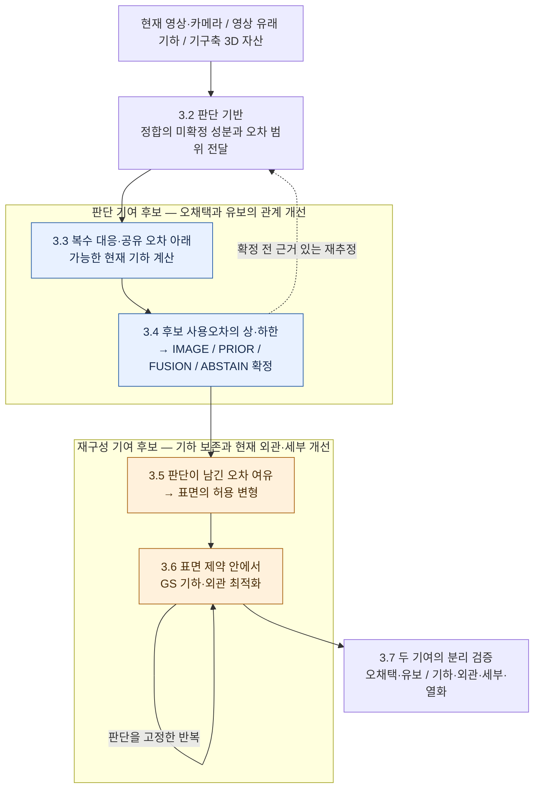
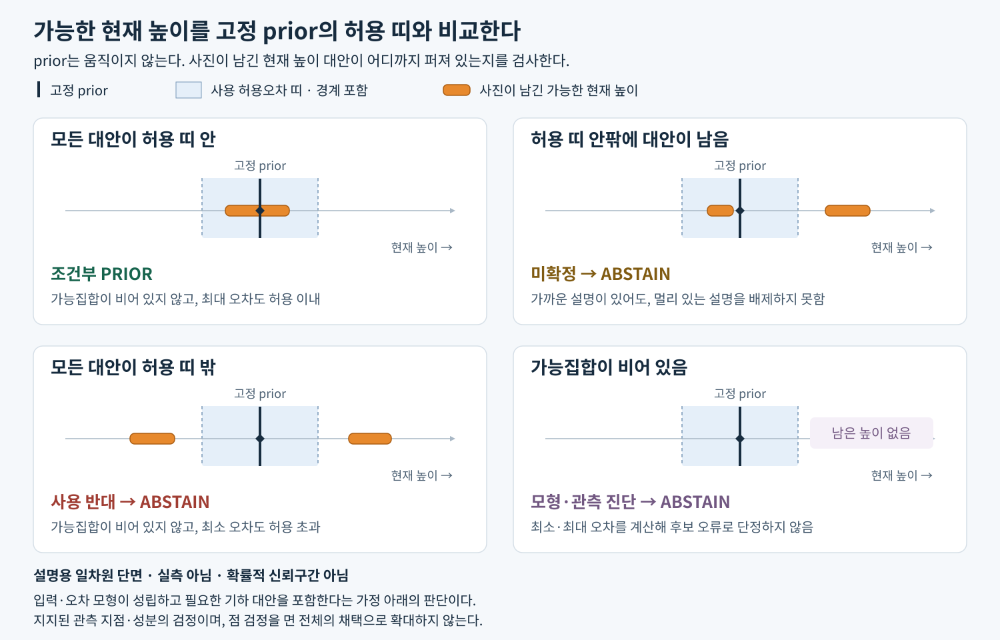

# 박사 연구 주제 재정리 v1 — 3. 제안 방법 재설계 (r3.7)

> 2026-09-06. WORKING DRAFT, 문서 설계만. `scientific_verdict: null`.
> r3.7: 두 소스의 오류를 고려한다는 설계 원칙과 독자적인 판단 기여를 구분했다. 판단의 미결을 유지하면서 재구성 설계를 진행하도록, §3.5의 조건부 인계와 §3.6의 첫 설계 사례, 판단 비교와 재구성 설계의 병행 순서를 명시했다. 새 실험은 실행하지 않았다.
> 준거: [필요성](01_NECESSITY_ko_v1.md) · [공백·차별성](02_GAP_ko_v1.md) · [방법론 점검표](03_METHOD_REDESIGN_AUDIT_ko_v1.md) · [판단상황표](03_METHOD_DECISION_SCENARIOS_ko_v1.md). [기존 본문 r4](03_METHOD_ko_v1.md)와 [부록 r4](03_METHOD_APPENDIX_ko_v1.md)는 재검토 자료로 보존한다.
> 후속 요청과 자료 인계: [동일 지역의 판단 비교·재구성 설계·검증](04_NEXT_SESSION_HANDOFF_ko_v1.md). 새 세션에서는 P2를 우선 공통 후보로 점검하고 개발 검증까지 연결한다.

## 3.1 방법의 전체 구성과 설계 근거

### 3.1.1 전체 구성: 기하의 사용 판단을 재구성 제약으로 연결한다

본 연구는 **현재 항공영상과 기구축 3D 자산을 이용하여 현재시점의 기하와 외관을 충실하게 표현하는 실사 3D를 재구성하는 문제**를 다룬다. 영상 복원의 결손과 오류를 사용 가능한 자산으로 보완하면서, 현재 관측의 세부와 외관을 복원하고 이미 양호한 영역의 열화를 통제하는 것이 목표다.

이를 위해 **현재 관측이 제한하는 후보의 기하오차로 사용 범위를 판단하고, 그 판단을 재구성의 기하 제약으로 연결하는 방법**을 설계한다. 전체 구조는 **판단 확정 → GS 재구성 반복 → 결과 검증**이다. 판단을 확정하기 전에는 정합과 증거를 재추정할 수 있다.

**기여 후보의 검토 위치는 판단의 ‘가능한 현재 기하 → 후보 사용오차’ 계산과 재구성의 ‘허용 변형 → 최종 표면을 지키는 최적화’다.** 가능한 기하 집합·오차 상한·제약 최적화라는 원리만으로 독자적인 기여가 성립하지는 않는다. 아래 그림은 두 후보를 구체화할 단계와 그 앞뒤의 기반·검증을 보여 준다.

**단계별로 무엇을 더하고 어떤 처리를 바꾸는가.** 비교 기준을 ‘후보 점수 하나’, ‘정합 대표값’, ‘행동·가중치만 인계’처럼 구체적으로 한정해 읽는다. 사진·광선 검사, 기하 이동, 유보, 판단 후 GS는 기존 r4에도 있었으며, 아래 표는 이를 계승하면서 구체화하는 계산의 차이를 보여 준다.

| 단계 | 비교할 처리에서 남는 문제 | 이번 설계의 핵심 계산 | 그 계산이 바꾸려는 판단·결과 |
|---|---|---|---|
| **3.2 판단 기반** | 정합값 하나로 고정하면, 남은 위치 불확실성을 후보의 형상 오류로 오인할 수 있음 | **정합의 미확정 성분·오차 범위를 다음 검정에 전달** | 지지된 위치 보정으로 불필요한 유보를 줄이고, 정합이 불확실한 성분은 과신하지 않음 |
| **3.3 판단 근거** | 후보의 좋은 사진 점수만으로는 다른 높이·대응도 같은 관측을 설명하는지 알 수 없음 | **복수 대응·공유 카메라 오차 아래 가능한 현재 기하를 함께 계산** | 잘못된 대안을 빠뜨려 생기는 오채택과, 여러 관측으로 배제할 수 있는 대안 때문에 생기는 유보를 줄일 근거 확보 |
| **3.4 사용 판단** | 상대 점수나 정밀도 우세만으로는 사용할 때의 실제 기하오차가 제한되지 않음 | **고정 후보의 사용오차 상·하한으로 지지·반대·미확정을 결정** | 좋은 점수여도 나쁜 대안이 남으면 유보하고, MVS가 없어도 prior 사용오차가 제한되면 해당 성분을 채택 |
| **3.5 재구성 인계** | `PRIOR`라는 행동·가중치만으로는 얼마나 움직여도 되는지 정해지지 않음 | **판단이 남긴 오차 여유를 표면의 허용 변형으로 변환** | 같은 prior 선택에서도 지지된 성분별로 보존할 범위와 변경할 여유를 구분 |
| **3.6 GS 재구성** | 초기화나 Gaussian 중심 고정만으로는 최적화 후 표면 보존을 알 수 없음 | **최종 표면 제약 안에서 기하·외관을 최적화하고 갱신을 검사** | 외관·세부를 개선하는 과정에서 채택 기하를 허용 범위 밖으로 훼손하는 갱신을 제한 |
| **3.7 기여 검증** | 최종 사진 점수·평균 오차만 보면 유보 증가나 개선의 발생 단계를 숨길 수 있음 | **판단만 바꾸는 비교와 재구성만 바꾸는 비교** | 같은 채택 범위의 오채택 감소, 같은 오류 수준의 범위 확대와 최종 기하·외관·세부 개선을 구분해 입증 |

표의 변화는 **설계가 겨냥하는 효과**다. 강한 기존 방법 대비 실제 개선은 §3.7의 비교로 입증해야 한다. 관측점에서 면 사용으로의 확장과 Gaussian에서 표면 제약을 집행하는 계산은 아직 미완성이다. 이어지는 각 절은 표의 핵심 계산을 첫머리에 제시한 뒤 작동 과정과 필요한 수식으로 내려간다.

이 표는 기존 r4와 명시한 비교 처리에서의 보완점을 보여 준다. 불확실성을 이미 고려하는 기존 방법도 같은 결정을 만들 수 있으므로, **기존 제안의 논리적 보완과 선행연구 대비 독창성은 별도로 판단한다.** 비교법에 없는 계산과 그 계산으로 달라지는 결정을 먼저 명시한 뒤, 실제 이득을 검증한다.

### 3.1.2 이 구성을 택한 이유와 기여의 위치

[필요성 §1.4–1.5](01_NECESSITY_ko_v1.md)와 [공백 §2.5–2.7](02_GAP_ko_v1.md)에서 제기한 문제는 **오류 가능성이 있는 두 소스 중 무엇을 사용할 수 있는지 판단하고, 그 판단의 이득을 재구성 결과에 유지하는 것**이다. 현재 촬영된 MVS도 틀릴 수 있고, 정밀한 과거 자산도 현재 형상과 다를 수 있다. 소스 간 거리나 사진 적합도만으로 사용을 정하면 이 두 경우와 관측 부족을 혼동할 수 있다. 또 올바른 후보를 골랐더라도 이후 최적화가 그 기하를 바꾸면 선택의 이득은 사라진다.

따라서 전체 방법에서 **사용 판단의 근거를 만드는 계산**, **그 근거로 허용할 기하를 정하는 계산**, **허용한 기하를 최종 결과에 유지하는 재구성**을 구분하고 연결한다.

**판단에서 더하려는 것은 후보 적합도를 사용오차에 연결하는 계산이다.** 예를 들어 prior가 사진에 잘 맞더라도 허용오차 밖 형상도 같은 관측을 설명하면 사용을 유보한다. 반대로 MVS가 없는 경우에도 남은 현재 관측이 prior의 대상 성분 오차를 충분히 제한하면 그 성분을 채택할 수 있다. 이 판단을 만들기 위해 §3.3에서는 대안 대응·카메라 오차를 포함한 가능한 기하를 계산하고, §3.4에서는 고정 후보의 오차 범위를 행동으로 변환한다. 같은 관측과 후보를 사용하는 강한 기존 판단·불확실성 추정법에 비해 **오채택과 유보 사이의 관계가 개선되는지**가 판단 기여의 입증 대상이다.

**‘두 소스 모두 오차가 있다’는 것은 유지할 문제 전제이며, 그 자체가 새 추정법은 아니다.** 예를 들어 [Generalized-ICP](https://www.roboticsproceedings.org/rss05/p21.pdf)는 양쪽 점군의 확률 모형을 정합에 사용한다. 이 방법이 시기 차이에 따른 사용 가능성까지 해결한다는 뜻은 아니지만, 양쪽 오차를 고려한다는 설명만으로 기존 연구와 구별할 수는 없다. 본 설계에서 남는 질문은 현재 영상 유래 기하의 오류와 과거 자산의 현재 부적합을 허용 관측으로 어디까지 구별하고, 구별하지 못하는 범위를 어떻게 판단에 남길 것인가다. 이 질문을 해결할 추가 계산의 독창성은 아직 확정하지 않았으며, 실험 중 실패 사례가 발견되어야만 설계를 시작할 수 있는 것도 아니다.

**재구성에서 더하려는 것은 그 판단이 허용한 기하를 최종 표면에서 유지하는 방법이다.** `PRIOR`라는 이름이나 초기화만 넘기면 어떤 위치·방향을 얼마나 움직여도 되는지 정해지지 않는다. §3.5–3.6은 판단의 기준 기하·지지 성분·오차 여유를 Gaussian의 변형과 최종 표면의 보존 조건으로 연결해야 한다. 그래야 현재 영상으로 외관·세부를 복원하면서 채택한 구조를 다시 훼손하는 문제를 다룰 수 있다. **같은 판단 결과를 받는 기존 재구성보다 기하 보존·외관·세부를 개선하고 양호 영역의 열화를 통제하는지**가 재구성 기여의 입증 대상이다.

GS는 이 기하 제약과 현재 영상에 대한 미분 가능 렌더링을 하나의 최적화에 연결하여 기하·외관을 함께 조정할 표현으로 선택한다. 이 선택의 이득은 같은 판단을 받은 기하의 접합·텍스처링 및 기존 prior 기반 재구성과 비교해야 하며, GS를 사용한다는 사실만으로 가정하지 않는다.

이처럼 두 기여는 연결되지만 구분해서 평가한다. 같은 재구성에 다른 판단을 적용하면 판단의 추가 효과를, 같은 판단에 다른 재구성을 적용하면 재구성의 추가 효과를 살필 수 있다. 이를 함께 바꾼 최종 성능만 제시하면 어느 설계 선택이 개선을 만들었는지 설명하기 어렵다. 순차 구조, 광선·사진 검사, 유보, GS 사용 자체를 각각 독립된 새 기여로 세우지는 않는다.

**현재 설계와 증거의 수준.** 판단에는 §3.3–3.4의 조건부 계산안이 있고, [기존 높이 진단](../prior_use_height_probe_v1/TECHNICAL_RETURN_ko_v1.md)에서는 같은 관측에서도 원후보 점수와 기하 범위를 이용한 결정이 달라졌다. 이는 추가 판단 계산을 검토할 개발 근거이며 실제 오판 감소의 입증은 아니다. 대응·오차 범위를 입력에서 산출하는 방법과 관측 지지에서 면 사용으로의 확장은 남아 있고, 재구성에는 조건부 변형 예산과 제약 최적화안을 두었으나 실제 표면·Gaussian에서 이를 집행할 계산은 남아 있다. 아래 세부 절은 이 기여를 실현할 계산과 아직 채워야 할 부분을 구분하여 제시한다.

### 3.1.3 입력·출력과 세부 방법의 범위

**입력과 판단 대상.** 현재 영상 자체와 영상에서 복원한 기하를 구분한다.

| 입력 | 역할 |
|---|---|
| 현재 항공영상 `I`와 카메라 정보 `C` | 목표 시점의 관측. 후보 기하의 검정과 현재 외관의 복원에 사용한다. |
| 영상 유래 기하 `M`과 허용된 영상 유래 증거 | MVS 등의 3D 후보와 깊이·법선·신뢰도 등. 국소적으로 없거나 부정확할 수 있으며, 현재 촬영이라는 이유로 자동 채택하지 않는다. |
| 기구축 3D 자산 `P`와 취득·처리 정보 | 재사용할 기하 후보. 시간적 유효성, 원래 기하오차, 상대 정합과 표현 규모를 점검한다. |

입력의 취득 시기·좌표계·단위·생성 계보를 연결하고, 같은 영상·카메라에서 파생된 증거의 오류 의존성을 다룬다. 현재 UAS LiDAR와 LoD2 RoofSurface·Z·roof type 등은 평가 전용이며 판단·정합·문턱 조정에 사용하지 않는다. 공통 GroundSurface XY·stable ID의 출처와 사용 범위는 기존 연구계약을 따른다.

판단 단위는 **국소 영역에서 대상으로 삼는 표면과 기하 성분·규모**다. 같은 XY에 있다는 이유만으로 서로 다른 층을 한 표면으로 취급하지 않는다. 최초 구체화는 직접 관측되는 작은 지붕 영역의 거친 위치·방향에서 시작하며, 단위의 추출법과 크기는 미결로 둔다.

판단의 핵심 질문은 **“이 후보 기하를 현재 재구성에 사용할 수 있는가”**이다. 각 후보에 대해 현재 관측의 지지·반대, 해당 기하 차이를 구별할 관측 능력, 소스 오류와 정합 불확실성을 검토한다. 사용 조건을 충족한다고 추정한 후보 사이에서 기하오차를 비교해 선택하거나 결합을 검토한다. 이번 3.4에서는 관측과 양립하는 범위의 최대 오차를 사용하는 안을 구체화하며, 확률적 예상 오차의 최소화와는 구분한다. 상대 우세나 반박의 부재만으로 사용을 허용하지 않으며, 오류 원인을 항상 하나로 확정해야만 판단할 수 있다고 가정하지 않는다.

**판단 출력.** 후보별 사용 지지·사용 반대·미확정과 후보 없음 상태를 바탕으로 다음 네 행동 중 하나를 정한다. 사용 지지는 관측에서 추정할 상태이며, 정답으로 주어지는 입력이 아니다.

| 행동 | 해당 영역·성분의 재구성에 허용하는 것 |
|---|---|
| `IMAGE` | 사용이 지지된 영상 후보를 기하 기준으로 채택한다. |
| `PRIOR` | 사용이 지지된 정합 자산 후보를 기하 기준으로 채택한다. 현재 영상이 관측한 외관을 입힐 수 있다. |
| `FUSION` | 두 후보의 사용이 지지되고, 같은 현재 표면에 대한 대응·정합·규모·오류 의존성과 결합 이득이 뒷받침될 때 기하를 결합한다. |
| `ABSTAIN` | 현재 기하 채택을 유보한다. 부적합 후보의 기각, 미확정 후보의 보존, 후보가 없어 기하를 제공하지 못하는 경우를 구분한다. |

**`M`이 없거나 사용 불가로 확정되면 `PRIOR / ABSTAIN`만 남는다.** 이 경우에는 남은 현재 관측으로 `P` 자체의 위치·방향 등 대상 기하를 검정한다. MVS가 없더라도 사진은 남을 수 있지만, 사진의 존재나 높은 적합도만으로 검정이 성립하지는 않는다. 관측의 구별 능력과 정합·오류 점검을 포함해 `P` 사용이 지지되면 `PRIOR`, 반박되거나 미확정이면 `ABSTAIN`이다. MVS의 부재·부적합·미확정을 같은 상태로 처리하지 않는다.

네 행동은 기하 사용에 대한 판단이다. `PRIOR` 기하에 현재 영상의 텍스처를 입히는 것은 기하 `FUSION`이 아니다. 판단에서는 행동과 함께 **기준 기하, 보존할 성분과 허용 변형, 기각·유보 범위, 최종 정합과 근거 버전**을 확정하여 재구성에 넘긴다. 세부의 3D 복원도 그 규모와 변형을 지지하는 관측이 있을 때만 허용한다.

**최종 출력.** 주 산출물은 gsplat 기반 평면 2D Gaussian으로 표현한 렌더링 가능한 3D 장면이며, 텍스처 표면 모델은 그 파생 산출물이다. 재구성된 기하·외관과 함께 부분별 출처·판단 근거·남은 불확실성을 제공한다. 이 정보는 결과의 해석을 돕는 보조 출력이다. 유보 영역의 기존 자산을 표현하더라도 현재 기하로 채택한 영역과 구분하며, 기각은 대체 표면이나 빈 공간의 확인을 뜻하지 않는다. 하류 LoD2는 별도 평가 대상으로 두고 실사 재구성의 성공과 동일시하지 않는다.

이하 §3.2는 후보와 정합의 근거를, §3.3은 현재 관측의 증거·오차 모형과 가능한 기하 계산을, §3.4는 사용오차에서 행동·허용 범위로 넘어가는 판정을 구체화한다. §3.5–3.6은 이를 재구성 제약과 최적화로 연결하고 §3.7은 판단과 재구성의 효과를 검증한다.

기존 '3D 비교 → 광선·사진 검사 → 평면 전파'에서 비교와 관측 검정을 계승하되, 사용오차에 따른 판단을 거쳐 재구성에 전달한다. 평면 전파는 구조 연속성에 따른 확장 후보이며 **미관측 영역의 현재성 확인을 대신하지 않는다.** GS 반복 중 수치적 가시성이 변해도 출처 사용 권한과 유보 범위를 자동으로 바꾸지 않는다.

각 세부 절의 수식은 위 설계에서 무엇을 측정·추정·결정하는지 설명하기 위해 둔다. 실험은 그 계산이 겨냥한 문제와 연결하되, 측정한 결정 변화·실제 오차·최종 재구성 효과의 확인 수준을 구분한다.

## 3.2 비교할 후보와 정합·오차 범위 설정

> **핵심 방법 — 정합의 미확정 성분을 사용 판단에 전달한다.** 정합값 하나로 설명하지 못한 위치 오차를 다음 검정에 남긴다. 이로써 후보의 실제 형상 문제와 위치 불확실성을 혼동해 채택하거나 유보하는 일을 줄이려 한다.

이 단계는 **① 비교 대상 고정 → ② 지지된 성분의 정합 → ③ 남은 차이·불확실성 전달** 순서로 진행한다. 번호와 아래 항이 일대일로 대응한다. 산출물은 §3.3에서 검정할 고정 후보와 그 좌표·오차 근거다.

### 3.2.1 비교 대상 고정

먼저 국소 영역 `u`마다 영상 후보와 자산 후보를 각각 보존한 채, 어떤 표면·기하 성분·규모를 비교할지 정한다. 지붕과 아래 지면처럼 함께 존재할 수 있는 다른 층은 분리한다. 같은 영역의 과거·현재 상태에 대한 경쟁 후보는 차이가 크더라도 비교 대상으로 남길 수 있다. **대응은 비교할 대상을 정하는 가설이며 두 후보가 같은 현재 표면이라는 확인이 아니다.** 대응이 모호하면 하나의 가까운 표면으로 강제 연결하지 않는다.

첫 설계는 국소 표면의 거친 위치와 방향을 대상으로 한다. 같은 비교 영역과 규모에서 소스별 표본을 모으되 지붕 경계·다른 층을 가로질러 섞지 않는다. 원점·공통 비교 방향·법선 추정 규모와 거리 집계 규모를 구분해 기록한다. 점군의 법선 방향으로 국소 평균 위치 차이를 재는 M3C2를 거리 계산의 출발점으로 검토한다. 법선과 집계 규모에 따라 측정량이 달라진다는 점도 함께 고려한다. [M3C2 원문, §3.1–3.3](https://arxiv.org/pdf/1302.1183)

본 초안에서는 단위 비교 방향을 `n_u`로 적고, 어느 소스의 어떤 규모에서 얻었는지 기록한다. 비교 방향을 제공한 소스에 기하 채택 권한을 부여하는 것은 아니다. 지붕 법선의 부호에는 공통 방향 규칙을 사용하며, 중력을 이용한다면 기존 계약에 따라 추정한 중력을 사용한다. 비교 방향·규모의 최종 선정 규칙은 미결이다.

한 번의 국소 추정에서는 대상과 표본·비교 방향을 고정한다. 정합 변경 때문에 표면 대응이나 표본이 달라지면 새 비교 버전으로 다시 계산한다. 원자료의 좌표·소속은 덮어쓰지 않으며, 비교용 평균·평면을 광선·사진 검정에 쓸 원래 후보 기하로 대체하지 않는다.

### 3.2.2 지지된 성분의 정합

**의도와 오차 모형.** 현재 영상·카메라의 좌표계를 계산 기준으로 두고 자산의 상대 정합을 표현한다. 이는 영상 기하를 참값으로 놓는다는 뜻이 아니다. 좌표계·단위를 맞춘 뒤의 첫 정합 후보는 여러 비교 영역에 공유되는 강체변환이다. 국소 형상 차이를 없애기 위해 영역마다 자유롭게 변형시키지 않는다.

**계산할 것: 시험 정합을 적용했을 때 남는 위치 차이.** 두 소스의 대응 위치와 정합값을 넣어 같은 방향에서 얼마나 어긋나는지 구한다.

정합 변수 `δ`가 나타내는 회전 `R_δ`와 이동 `t_δ`, 근거가 허용하는 변환 범위 `𝒟`를 다음과 같이 정의한다.

$$
T_\delta(p)=R_\delta p+t_\delta,\qquad \delta\in\mathcal D.
$$

정합용 비교 단위 `a`에서 대표 위치 `m_a`, `p_a`와 공통 방향 `n_a`를 정했을 때의 잔차는 다음과 같다. 대표 위치는 같은 대상·규모의 기하를 비교한다는 조건에서 정의한다.

$$
r_a(\delta)=n_a^\top\!\left[m_a-T_\delta(p_a)\right].
$$

이 잔차에는 정합뿐 아니라 실제 형상 차이, 각 소스의 편향과 우연 오차가 함께 들어갈 수 있다. 그 역할을 구분하기 위한 조건부 모형은 다음과 같다.

$$
r_a(\delta)=c_a+b_{M,a}-b_{P,a}+a_a(\delta)+\epsilon_a.
$$

`c_a`는 공통 방향에서의 현재–과거 실제 형상 차이, `b_{M,a}`와 `b_{P,a}`는 각 소스의 측정·처리·표현 편향, `a_a(δ)`는 남은 정합 오차의 기여, `ε_a`는 우연 오차다. 참 정합에서 `a_a`는 0이다. 이 식은 잔차에서 네 원인을 따로 알아낼 수 있다는 추정식이 아니다. 예를 들어 지붕 전체의 일정한 실제 높이 변화와 수직 정합 오차는 같은 잔차를 만들 수 있다.

**작동 과정.** 정합을 추정하려면 비교 가능한 영역 중, 동일 구조의 대응과 안정성을 뒷받침하고 소스 편향을 점검할 근거가 있는 집합 `A`가 필요하다. 기존에 허용된 정합 기록과 현재 영상에서 구별 가능한 구조 대응을 시작 근거로 검토하고, 필요하면 3.3의 검정으로 보완한다. 작은 거리나 건물 전체의 결맞음만으로 `A`를 확정하지 않는다. 평가 전용 LiDAR·LoD2 기하도 이 집합을 정하는 데 사용하지 않는다.

그 근거가 성립하는 조건에서, 잔차가 특정 일부 영역에 끌리지 않도록 강건 적합을 정합 계산의 후보로 둔다.

$$
\hat\delta\in\underset{\delta\in\mathcal D}{\operatorname{argmin}}
\sum_{a\in A}\rho\!\left(\frac{r_a(\delta)}{s_a}\right).
$$

**식의 읽는 법.** 안정 근거가 있는 영역 `A`의 위치 차이를 오차 규모로 나누어 함께 줄이는 정합 `δ̂`를 찾는다. `argmin`은 이 비용을 가장 작게 만드는 변환을 고른다는 뜻이다. 여기에 들어가는 `A`는 정합용 영역 집합이며, §3.3의 대응·가림 조합 `𝒜_u`와 다르다.

어느 이동·회전 성분을 관측이 구별하는지는 따로 계산한다. 정합을 조금 바꿨을 때 잔차가 얼마나 달라지는지를 담는 미분행렬이 `J_A`다. 관측 지점의 집합 `J_u`와는 다른 종류의 양이다.

$$
J_A=\frac{\partial r_A}{\partial\delta}.
$$

`s_a>0`는 해당 잔차의 오차 규모, `ρ`는 큰 표준화 잔차의 영향을 제한할 강건 비용이다. 이 식은 오차의 독립성이나 확률적 최적성을 가정한 우도식이 아니다. `J_A`는 허용한 이동·회전 성분을 바꿀 때 잔차가 얼마나 변하는지 나타낸다. 그 영공간과 약한 방향을 살펴, 데이터가 구별하지 못하는 성분을 분리한다. 국소 식별성 점검을 통과해도 정합의 정확성·전역 유일성·수렴 횟수가 보장되지는 않는다.

안정 근거가 없으면 새 정합을 확정하지 않는다. 일부 성분만 식별된다면 지지된 성분과 미확정 성분을 나누어 넘긴다. 계산을 위해 미확정 성분을 초기값에 두더라도 그 오차를 0으로 보고하지 않는다. `A` 선정·편향 점검 방법, 변환 공유 범위, `𝒟`·`s_a`·`ρ`의 구체화는 이 정합안의 핵심 미결이다. 강건 비용만 채우면 안정 근거의 문제가 해결되는 것은 아니다.

### 3.2.3 남은 차이·불확실성 전달

**위치·방향 차이.** 정합된 두 후보가 비교 가능한 영역에서 공통 축 주위의 소스별 표본을 모으고, 그 대표 평균 위치를 `μ_{M,u}`, `μ_{P,u}`로 둔다. 자산의 평균 위치는 원래 자산 좌표에서 정의하고 `T_{δ̂}`로 변환한다. 위치 차이와 법선 방향 차이는 다음처럼 별도로 계산한다.

$$
d_u=n_u^\top\!\left[\mu_{M,u}-T_{\hat\delta}(\mu_{P,u})\right],
\qquad
\vartheta_u=\arccos\!\left(\left|n_{M,u}^\top R_{\hat\delta}n_{P,u}\right|\right).
$$

법선은 단위 벡터이며, `d_u>0`은 영상 후보의 평균 위치가 정한 `+n_u` 방향에서 자산 후보보다 앞에 있다는 뜻이다. 이를 항상 ‘영상 지붕이 더 높다’고 읽지는 않는다. `ϑ_u`는 법선의 부호를 제외한 표면 방향 차이다. 방향 차이를 잰다고 국소 평면을 재구성의 고정 제약으로 채택한 것은 아니다.

`d_u`는 정한 축·영역·규모에서의 평균 위치 차이다. 서로 다른 표본 분포와 경사·곡률 때문에 같은 위치의 높이 차이와 달라질 수 있다. 표본 지지와 국소 표면 모형이 비교를 뒷받침하지 못하면 그 사유를 남기고, 이 값을 정확한 표면 간격으로 사용하지 않는다. 한 소스가 없거나 해당 방향을 정의할 수 없으면 관련 차이는 미산출이며 0이 아니다.

**계산할 것: 거리 차이의 조건부 불확실성.** 평균 위치·정합·비교 방향의 불확실성을 거리 계산에 전파한다. 아래 식의 입력은 이 양들의 결합 공분산이고 출력은 거리 차이의 분산 `σ²`다.

큰 차이가 정합이나 측정 불확실성으로도 설명되는지 살피려면 차이와 함께 그 불확실성을 전달해야 한다. 대응·표본 소속이 고정되고 국소 모형이 유효하며 작은 오차의 선형 근사가 가능한 경우, 거리식을 `d_u=f(z_u)`로 적어 다음 1차 오차 전파를 사용한다.

$$
z_u=(\mu_{M,u},\mu_{P,u},\hat\delta,n_u),\qquad
J_{d,u}=\frac{\partial f}{\partial z_u},\qquad
\sigma_{d,u}^{2}\approx J_{d,u}\Sigma_{z,u}J_{d,u}^{\top}.
$$

`Σ_{z,u}`는 평균 위치·정합 변수·비교 방향의 **결합 공분산**이다. 개별 불확실성뿐 아니라 함께 변하는 양의 공분산을 포함하는 1차 전파식이다. [NIST, 불확실성 전파 법칙 A.3](https://www.nist.gov/pml/nist-technical-note-1297/nist-tn-1297-appendix-law-propagation-uncertainty)

이 공분산은 거리 진단의 조건부 불확실성이다. 이를 §3.3의 실제 카메라·좌표 오차를 포함하는 범위로 사용하려면 별도의 산출·보정 근거가 필요하다.

소스 내 표본의 상관, 소스 간 공유 오류, 같은 자료로 정합·법선을 추정하면서 생기는 의존성을 검토한다. 점 수가 많다는 이유로 국소 산포를 독립 표본의 평균 오차처럼 줄이지 않는다. 정합 잔차나 목적함수의 곡률만으로 전체 공분산을 확정하지 않는다. 방향 차이에도 같은 조건의 오차 전파를 검토하되, 미분 근사가 맞지 않는 구간에는 이를 그대로 적용하지 않는다.

이 식이 포괄하는 것은 모형에 넣고 추정 근거를 확보한 불확실성이다. 미지의 소스 편향, 미확정 정합 방향, 대응 모호성이 자동으로 공분산에 포함되는 것은 아니다. 근거가 없으면 불확실성의 해당 부분을 미확정으로 남긴다. 따라서 거리와 조건부 불확실성이 작거나 M3C2에서 유의한 차이를 검출하지 못해도, 두 후보의 정확성·동등성·현재성이 확인된 것은 아니다. 두 소스가 함께 편향될 가능성도 다음 검정에 남는다.

영역별 후보와 비교 결과는 다음과 같이 연결한다. 이 단계에서 얻는 기하는 정합을 적용한 후보이며, GS 최적화 결과가 아니다.

| 항목 | 3.3에 전달할 내용 |
|---|---|
| 후보·비교 대상 | 소스별 원자료 계보, 대상 표면·규모·표본, 대응 가설과 모호한 대안 |
| 정합 | 적용 변환, 근거의 적용 범위, 추정한 성분과 미확정 성분, 불확실성의 산출 근거 |
| 기하 관계 | 산출 가능한 위치·방향 차이, 조건부 불확실성, 남은 편향·표본 지지 문제 |
| 결측·제한 | 후보 없음, 비교 불가, 정합 미확정, 불확실성 미산출을 구분한 사유 |

**MVS가 없는 영역에서는 소스 간 차이를 만들지 않는다.** 다른 허용 영역이나 기존 기록에서 지지된 정합이 있다면 그 적용 범위와 불확실성을 prior 후보에 연결해 3.3의 단독 검정으로 넘긴다. 그런 근거도 없으면 정합 미확정 상태를 넘긴다. 좌표계가 같다는 사실만으로 정합 완료를 선언하지 않는다. MVS가 사용 불가로 확정된 경우도 이를 믿을 착지면으로 삼지 않으며, prior 검정에 실제로 남은 관측을 구분한다.

3.3–3.4에서 정합을 바꿀 근거가 생기면 확정 전에 이 단계로 돌아와 영향받은 대응·표본·거리·가시성·사진 검정을 함께 갱신한다. 원소스와 정합이 같다면 GS 결과가 바뀌었다는 이유로 이 두 소스의 거리 지도를 재계산하지 않는다. 반복의 종료·실패 규칙은 3.4에서 설계한다.

**기존 근거와 남은 설계 — 정합의 혼동과 판단 효과**

**기존 실험이 드러낸 문제.** ALS 전체를 수직 이동한 V2와 일부만 이동한 V8에서는 다음 관측이 나왔다.

| 기존 주입 조건 | 광선 관통 비율 | 공통 쌍 사진 차이 Δ |
|---|---:|---:|
| V2: ALS 전체 +1 m | 0.97 | +0.40 |
| V8: ALS 일부 +2 m | 0.96 | +0.51 |

Δ는 당시 정의의 MVS−prior 사진 점수 차이다. 이 두 조건에서는 국소 광선·사진 채널이 비슷한 방향으로 반응했다. 따라서 이 값만으로 전역 위치 문제와 국소 형상 문제를 가르는 규칙은 충분하지 않다. 공간적으로 어디까지 같은 차이가 이어지는지와 안정된 대조 영역을 추가로 살펴야 한다. 다만 이 실험은 주입한 두 조건의 관측이며, 결맞음만으로 모든 정합·변화를 구별한다거나 앞의 정합 추정이 성공한다는 검증은 아니다. [주입 실험의 실측표·한계](../injection_bench_v1/TECHNICAL_RETURN_ko_v1.md)

이 절에서 정한 것은 비교량·조건부 정합 모형·인계 방식이다. 비교 단위와 방향·규모 선정, 안정 근거 확보, 정합 자유도와 강건 비용, 공유 오류를 포함한 불확실성 추정은 후속 구체화가 필요하다. 이 미결은 표본·수치 문턱만 남았다는 뜻이 아니다.

**판단과 재구성에 미치는 효과.** 이 절의 계산이 성립하면 다음 단계는 잘못된 상대 위치를 후보의 형상 오류로 오인할 가능성을 줄인 상태에서 검정한다. 성립하지 않으면 미확정 성분을 남겨 §3.3의 가능한 현재 위치 범위에 반영한다. 그 범위가 사용오차를 제한하지 못하면 §3.4에서 유보하므로, 불확실한 정합을 근거로 prior를 제거하거나 GS의 기준 기하로 고정하지 않는다. 이 효과는 설계상 연결이다. 새 정합안은 같은 후보·관측에서 정합 처리만 바꾸어, 사용 가능한 prior의 불필요한 유보와 부적합 prior의 오채택을 함께 비교해야 한다. 위 주입 실험은 이 비교나 GS 개선을 확인한 결과가 아니다.

## 3.3 현재 관측의 증거·오차 모형과 가능한 기하 계산

> **핵심 방법 — 좋은 사진 점수와 함께 남아 있는 다른 기하를 계산한다.** 후보 점수 하나에 복수 대응·공유 카메라 오차를 포함한 공동 기하 범위 계산을 더한다. 잘못된 높이도 관측을 설명한다면 그 대안을 남겨, §3.4가 후보를 과신하지 않게 한다.

이 단계는 **① 복수 대응·결측 표현 → ② 공유 오차 아래 공동 제약 구성 → ③ 가능한 기하 범위 계산** 순서로 진행한다. 번호와 아래 항이 일대일로 대응한다. §3.2의 후보를 고정한 채 관측으로 배제할 수 있는 대안과 남겨야 할 대안을 구한다.

### 3.3.1 복수 대응·결측 표현

한 판단 버전에서는 실제 후보 `g_M=M`, `g_P=T_{δ̂}P`를 고정한다. 사진으로 시험할 표면 대안을 `S_u(θ)`, 카메라·정합·가림·밝기 오차의 설명 변수를 `ν`라 두고, 현재 영상끼리 후보 표면을 거쳐 대조한다. 과거 자산의 색이나 GS가 학습한 외관은 이 검정의 기준 영상으로 쓰지 않는다. 영상 `i`의 픽셀 `x`가 만드는 광선 `r_i^ν(x)`와 가설 표면의 교점을 다른 영상 `j`에 투영하는 대응은 다음과 같다.

$$
W_{i\to j}(x;\theta,\nu)
=\pi_j^\nu\!\left(\operatorname{hit}\left[S_u(\theta),r_i^\nu(x)\right]\right).
$$

**먼저 대응 위치를 구한다.** 영상 `i`의 픽셀에서 광선을 쏘고 시험 표면에 닿은 3D 위치를 영상 `j`에 옮긴 결과가 `W`다. 그 대응으로 두 사진 패치를 대조한 잔차를 다음처럼 구한다.

$$
e^{\mathrm{photo}}_{ij,u}(\theta,\nu)
=1-\operatorname{ZNCC}_{\Omega_{i,u}}\!\left(I_i,I_j\circ W_{i\to j}\right).
$$

`π_j^ν`는 허용 카메라 상태에서의 투영, `Ω_{i,u}`는 정한 대상의 대조 영역이다. `ZNCC`는 두 패치에서 각각 평균 밝기를 뺀 벡터의 정규화 내적이다. 사진 검정에는 원소스 지지를 보존한 표면 표현을 사용하며, 3D 비교용 평균·표시용 평면으로 원후보를 대체하지 않는다. 패치의 분산이 부족하거나 교점·공통 가시성이 성립하지 않으면 점수를 산출하지 않는다. ZNCC를 첫 대조량으로 검토하되 반사·반복 무늬·가림·표면 표현 오차에 대한 적합성은 검증해야 한다.

**한 후보의 낮은 잔차보다 위치·방향을 바꿨을 때의 잔차 변화가 중요하다.** 멀리 다른 표면도 낮은 잔차를 만들면 기하를 구별하지 못한 것이다. 기존 3D 면에 현재 스테레오 영상을 투영하여 기하 일관성을 검사하는 접근과, 유사한 텍스처·불완전한 형상에서의 오판 문제는 선행연구에도 있다. 따라서 사진 대조 자체를 본 연구의 새 방법으로 주장하지 않는다. [Qin, 2014, §3.1.1](https://rongjunqin.weebly.com/uploads/2/3/2/3/23230064/3d_change_detection_based_on_lod2_3d_models_and_very_high_resolution_spaceborne_stereo_pairs_v5.pdf)

이 잔차가 낮은 다른 높이·방향도 남을 수 있으므로 점수 하나로 사용을 허용하지 않는다. **§3.3.2–3.3.3은 현재 사진의 여러 대응에서 가능한 3D 위치를 계산하고, §3.4.1–3.4.2는 그 위치들과 고정 prior의 사용오차를 계산해 판정한다.** 사진 대조는 그 연쇄의 측정 단계다. MVS가 없는 영역에서 왜곡·가림·반복 무늬를 포함한 대응 대안을 어떻게 남길지가 아직 필요한 모형이며, 기존 사진 검사를 한 번 더 실행하는 것으로 해결되지 않는다.

위 warp 식은 정한 표면을 통한 직접 사진 검사의 계산이다. 아래의 복수 대응 영역 생성과 동일한 알고리즘은 아니다. 대응 검색에서는 prior의 표면이나 허용 높이 주변으로 검색을 제한하지 않아야 하며, 그 검색·오차 보정 방법은 아직 구체화가 필요하다.

**관측 지점과 출력 후보를 고정한다.** 현재 기준 영상의 국소 영역과 관측 지점 `J_u`를 고정한다. 판단 대상은 그 지점들에서 관측되는 현재 표면의 위치와, 여러 지점의 배치가 나타내는 거친 방향이다. 출력 후보 `g_P=T_{δ̂}P`, 원자료 소속, 비교할 prior 표면, 좌표 기준과 허용오차도 같은 판단 버전에서 고정한다. 잔차를 줄이려고 관측 지점이나 prior의 점·층을 사후 교체하지 않는다.

위치는 우선 **미리 고정한 prior의 검정 지점과 해당 현재 관측점의 3D 거리**로 정의한다. 방향은 고정한 관측 지점 세 개가 만드는 삼각형의 방향을 사용한다. 이는 그 점 배치의 기술량이다. 점 사이 전체가 하나의 현재 평면이라는 확인이 아니며, 이 단계만으로 prior 면 전체를 채택하지 않는다. 관측 지지에서 면의 사용 범위로 확장하는 근거는 별도로 필요하다.

**현재 사진에서 복수 대응과 결측을 남긴다.** 기준 영상의 각 지점 `j`에 대해 다른 현재 영상 `i`의 대응 가능한 픽셀 영역들을 `E_{ij1}, …, E_{ijK}`로 둔다. 기준 영상의 지점 위치 오차도 작은 영상 영역으로 표현한다. 사진 대조는 이 절의 ZNCC를 출발점으로 삼되, 허용된 시점 변화와 영상 오차 아래 대조 가능한 영역만 검사한다. 최고 점수 위치 하나를 고르지 않고, 허용 잔차를 만족하는 떨어진 대응 영역과 그 위치 오차를 함께 보존한다.

검색 범위는 카메라 오차를 포함한 에피폴라 제약과 근거 있는 장면 범위로 정한다. prior의 높이 주변이나 사용 허용 띠만 검색해서 먼 대안을 지우지 않는다. 반복 무늬의 여러 대응은 서로 다른 분기로 남는다. 텍스처 부족·반사·가림·대응 결측에는 `⊥`를 부여하여 관측 제약이 없음을 표시한다. 빈 대응 영역을 prior의 부재나 잘못된 기하의 증거로 사용하지 않는다.

대응 영역 `E`에는 **유효한 대응의 실제 영상 위치를 포함한다는 오차 모형**이 필요하다. 영상 오차와 허용 시점 변화의 자료를 사용해 대조 한계·위치 영역·대응 실패 처리를 함께 보정해야 한다. 작은 잔차, 순환 대응 일치, 기존 SfM track은 점검 자료이지 이 포함 성질의 증명은 아니다. 최적 대응과 점수 곡선만으로 판단을 끝내지 않는 이유는 반복 대응과 가림의 실패를 함께 다뤄야 하기 때문이다. 스테레오 비용·신뢰도·가림 판별 자체는 기존 연구의 범위다. [Hu & Mordohai, 2012](https://mordohai.github.io/public/Hu_EvalutionOfConfidence_PAMI12fin.pdf)

### 3.3.2 공유 오차 아래 공동 제약 구성

MVS가 없거나 사용 불가로 확정되어도 남은 영상 대응이 현재 위치를 제한할 수 있는지 검사한다. 이 계산은 조밀 MVS를 요구하지 않지만 희소 삼각측량을 포함한다. prior는 재사용 후보와 검정 지점을 제공하며, 가능한 현재 위치를 그 주변으로 한정하는 근거로 사용하지 않는다.

아래는 **복수 대응 영역 `E`, 허용 대응·가림 조합 `𝒜`, 공유 카메라·좌표 오차 범위 `𝒞`, 장면 검색 범위 `𝒲`가 주어졌을 때의 조건부 모형**이다. 이들을 실제 허용 자료에서 산출·보정하는 방법까지 완성된 것은 아니다. 특히 명목 카메라를 가지고 있다는 사실만으로 `𝒞`를 확보했다고 할 수 없다.

**공유 카메라·좌표 오차 아래 여러 사진을 함께 설명한다.** 지점 `j`의 가능한 현재 3D 위치를 `X_j`, 모든 영상에 적용할 공동 카메라 상태를 `C∈𝒞`, 각 관측의 대응 영역 선택 또는 결측을 `a_{ij}`라 한다. 허용 대응·결측 조합의 집합은 `𝒜_u`다. 공유 내부표정·외부표정·좌표 오차는 `𝒞`에 함께 넣으며, 각 대응이나 후보에 별도의 유리한 카메라를 주지 않는다.

**구할 것은 한 개의 최적 위치가 아니라, 관측을 함께 설명할 수 있는 조합의 집합이다.** 식에 들어갈 양을 다음처럼 나누어 읽는다.

| 역할 | 기호 | 식에서 하는 일 |
|---|---|---|
| 고정 입력 | `E, 𝒜_u, 𝒞, 𝒲_u` | 허용 대응 위치, 실패 조합, 카메라·좌표 오차, 장면 범위를 정함 |
| 달리 놓아 보는 상태 | `z=(X,C,a)` | 현재점 위치·공동 카메라·대응 선택을 하나의 설명으로 묶음 |
| 정의할 가능집합 | `𝒵_u^obs` | 아래 제약을 함께 만족하는 설명의 집합을 정의하고, §3.3.3에서 그 범위를 계산함 |

$$
\mathcal Z_u^{\mathrm{obs}}=
\left\{z=(X,C,a):
\begin{array}{l}
X\in\mathcal W_u^{|J_u|},\ C\in\mathcal C,\ a\in\mathcal A_u,\\
\pi_i(C_i,X_j)\in E_{ij,a_{ij}},\quad d_i(C_i,X_j)>0\\
\text{for every }(i,j)\text{ with }a_{ij}\ne\bot
\end{array}\right\}.
$$

**식의 읽는 법.** 첫 줄은 현재점·카메라·대응 상태를 어느 범위에서 검사할지 정한다. 둘째 줄은 현재점을 각 영상에 투영했을 때 허용 픽셀 영역 안에 놓이고 카메라 앞에 있어야 한다는 조건이다. 마지막 줄은 이 조건을 유효하다고 둔 모든 관측에 적용한다는 뜻이다. 이렇게 조건을 통과한 `z`들을 모은 것이 왼쪽의 `𝒵_u^obs`다.

`d_i`는 카메라 앞쪽 깊이다. 하나의 `X_j`가 그 지점의 모든 유효 관측을 설명하고, 하나의 `C`가 여러 지점·영역의 관측을 설명해야 한다. `𝒲_u`는 물리적 위치 검색 범위이며 참 표면을 포함할 근거가 필요하다. 근거 없이 유한한 prior 이동 구간을 넣지 않는다. 범위 밖이나 경계의 설명을 처리하지 못하면 탐색 미완료로 남긴다.

특히 필수 지점의 `X_j`는 **기준 영상의 고정 위치 영역 `E_{0j}`도 만족**해야 한다. 기준 관측이 유효한 현재 정적 표면이라는 계약이 미확정이면 그 지점·성분을 유보한다. 그 미확정 설명을 버리고 다른 영상에 맞는 점만 골라 고정 prior 지점을 지지하지 않는다.

`𝒜_u`도 알고리즘이 마음대로 정할 수 있는 입력이 아니다. 예를 들어 관측군의 실패 수에 상한을 둘 경우, 그 상한은 허용된 별도 보정 자료에서 뒷받침해야 하며 같은 오류를 공유하는 시점을 독립 성공으로 세지 않는다. 어떤 관측이 유효한지 모르면 가능한 결측 조합들을 남긴다. **모든 관측이 `⊥`인 설명까지 가능하면 기하가 제한되지 않는다.** 원하는 채택률을 얻기 위해 일부 대응을 참으로 강제하지 않으며, 그 경우는 유보로 끝난다.

이 집합의 신뢰성에는 세 가지 입력 계약이 필요하다. **`E`가 참 대응 위치를 포함하고, `𝒜_u`가 실제 대응·가림 상태를 포함하며, `𝒞`가 실제 공유 카메라·좌표 오차를 포함해야 한다.** 실제 장면의 정적·불투명 표면에 대한 대응이라는 적용 조건도 필요하다. 이 계약이 성립할 때 실제 관측점 상태를 집합에 남길 수 있다. 집합이 작다는 사실로 계약의 성립을 역추론하지 않는다. 사진과 일치하는 형상에도 가림과 장면 모형에 따른 모호성이 남는다는 것은 기존 다중시점 기하의 한계다. [Kutulakos & Seitz, 2000, §2–3](https://homes.cs.washington.edu/~seitz/papers/kutu-ijcv00.pdf)

카메라·장면을 함께 이동해도 투영이 같은 자유도는 사진만으로 제거되지 않는다. 절대 위치나 축척의 오차를 주장하려면 그 성분을 제한하는 좌표 근거를 `𝒞`에 연결해야 한다. 이 계산에서는 가능한 현재 위치가 **고정된 출력 prior의 좌표계**에서 달라지므로 prior의 남은 정합 오차가 비교 오차에 나타난다. 그 효과를 이미 포함했다면 정합 오차폭을 다시 더하지 않는다. 실제 후보의 정합을 바꾸려면 §3.2로 돌아가 후보와 증거를 새 버전으로 계산한다.

**착지 근거가 있을 때 추가하는 제약.**

광선 검정은 현재의 신뢰할 수 있는 착지·빈 공간 관측과 후보의 공간 관계를 검사한다. 카메라 광선만 존재한다고 빈 공간이 확인되는 것은 아니다. 특히 MVS가 없거나 사용 불가이면 그 MVS 깊이를 참 착지면으로 사용하지 않는다.

현재 관측으로 광선 `i`의 최초 착지 거리 구간 `[ℓ_i^-,ℓ_i^+]`가 뒷받침되고 그 앞이 빈 공간이라는 근거가 있을 때, 가설 표면의 광선 깊이를 `t_i(θ,ν)`라 두면 앞쪽 침범량은 다음과 같다.

$$
e^{\mathrm{free}}_i(\theta,\nu)
=\left[\ell_i^- -t_i(\theta,\nu)\right]_+,
\qquad [x]_+=\max(x,0).
$$

값이 크면 확인된 빈 공간 안에 후보 표면을 놓는 모순이다. 값이 0이라는 사실은 그 뒤의 표면이 맞다는 지지가 아니다. 첫 착지 뒤에 놓인 후보는 가려졌을 수 있다. 현재 착지와 가설 표면이 **같은 표면**이라는 대응 근거가 있을 때에만 `dist(t_i,[ℓ_i^-,ℓ_i^+])`를 착지 불일치량으로 추가한다. 무착지·깊이 결측·가림을 같은 잔차로 바꾸지 않는다. 착지의 신뢰성과 불확실성을 산출할 방법은 남은 설계 과제다.

이 계산을 추가하면 사진에 맞더라도 확인된 빈 공간을 침범하는 표면 설명을 남기지 않을 수 있다. 그러나 현재 착지가 없는 prior 단독 영역은 해당 잔차를 만들지 않고 이 항의 사진 대응 제약으로만 진행한다. 그 경우에도 미관측·가림 설명이 남으면 §3.4에서 유보하며, GS에 빈 공간 확인이나 표면 제거 권한을 주지 않는다.

이 광선 근거는 사진 점수와 평균하여 쓰지 않고, 같은 공간 설명에 추가로 충족해야 할 제약으로 둔다. 실제 표면 교점·첫 착지와 관측점 모형의 관계가 정의된 경우에만 가능집합에서 모순인 설명을 제외한다. 사진에서 이미 사용한 대응·깊이를 다시 사용했다면 독립 증거로 세지 않는다. 이 조건부 제약이 오채택을 줄이는지, 착지 오류 때문에 유효한 후보를 잃는지는 별도 비교 대상이다.

### 3.3.3 가능한 기하 범위 계산

**계산할 것: 남겨야 할 현재 위치의 범위.** 영상에서 허용한 픽셀 영역을 3D 원뿔로 옮기고 여러 관측의 제약을 함께 적용한다. 한 점을 골라 끝내지 않고 아직 배제할 수 없는 연속 범위를 남긴다.

**가능한 연속 범위를 남기거나 배제한다.** 대응·결측의 이산 분기를 보존하고, 각 분기에서 공동 카메라와 3D 위치의 연속 범위를 검사한다. 고정 카메라에서 대응 영역이 중심 `(y_x,y_y)`, 반경 `η`인 원판일 때, 투영행렬의 행을 `p_1ᵀ,p_2ᵀ,p_3ᵀ`, 동차점을 `X̄`라 하면 재투영 제약은 다음과 같다.

$$
\left\|
\begin{bmatrix}
(p_1-y_xp_3)^\top\bar X\\
(p_2-y_yp_3)^\top\bar X
\end{bmatrix}
\right\|_2
\le\eta\,p_3^\top\bar X,
\qquad p_3^\top\bar X>0.
$$

따라서 고정 카메라·대응 분기에서는 영상 오차 영역으로부터 3D 가능 범위를 제약하는 구체적인 계산이 있다. 원래 대응 영역보다 큰 원판으로 감싸면 외측 근사가 되며, 그 근사에만 들어가는 점을 실제 가능한 해로 선언하지 않는다. 위 식은 보정된 핀홀 투영에서의 식이고, 왜곡 보정 오차도 대응 영역 또는 공동 카메라 변수에 포함해야 한다. 원뿔 제약과 분기 탐색을 사용하는 다중시점 최적화는 기존 계산 기반이다. [Hartley & Kahl, 2007](https://researchportalplus.anu.edu.au/en/publications/optimal-algorithms-in-multiview-geometry/)

카메라도 변하면 공동 변수 범위를 나누고 투영의 보수적인 범위를 계산하는 분기 탐색안을 사용한다. 어떤 연속 구간 전체가 필수 관측 영역과 양립할 수 없을 때만 그 구간을 제거한다. 표본 점 몇 개가 실패했거나 최적화기가 해를 못 찾은 사실은 구간 전체의 배제가 아니다. 단순한 전역 위치 이동처럼 관측이 구별하지 못하는 방향은 남아야 한다.

실제로는 참 가능집합을 포함하는 외측 집합 `Ẑ_u ⊇ 𝒵_u^obs`과 오차의 보수적인 하한·상한을 계산한다. 재투영·현재점 위치·삼중항 방향에 대한 구간 경계가 유효해야 하며 특이점이나 퇴화 배치를 가로지르면 더 나누거나 미확정으로 둔다. 카메라 변동을 포함한 이 구간 계산의 구체적 구현·종료 정확도는 아직 미완성이다.

§3.4에는 `𝒵_u^obs`의 보수적인 외측 범위와 함께 실제 가능한 해의 존재 여부, 고정 관측 지지, 공유 오차의 근거, 결측·경계·미탐색 상태를 넘긴다. 작은 집합만 보고하면 관측을 버리거나 오차를 과소평가해 얻은 확신을 구별할 수 없다. **범위가 실제 상태를 포함할 근거와 범위를 충분히 계산했는지가 채택·유보의 신뢰 조건**이다.

**기존 근거와 남은 설계 — 관측의 유효성과 기하 범위**

현재 사진이 prior를 잘 설명하는 사례는 있었다. 기존 P3 개발 측정에서 두 높이장의 차이가 0.3 m 미만인 1,553셀은 후보별 사진 점수 중앙값이 MVS 0.59, ALS 0.70이었다. 이것은 **사진 관측이 prior를 상대적으로 지지할 수 있다는 사례**다. 그 후보가 현재 요구 정확도를 충족한다는 측정은 아니며, 당시 위층 높이장·후보별 가시성으로 계산한 점수를 이번 원소스 검정의 결과로 옮기지 않는다. [P3 측정과 당시 계산 방식](../warp_ncc_v1/TECHNICAL_RETURN_ko_v1.md)

**기존 관측 선정 실패와의 연결.** 높이 진단 v1은 12시점을 확보했지만 각도·거리비 조건을 충족하는 뷰쌍이 없어 64그룹 전부가 검정 불가였다. 후속 v2에서 같은 frozen 목록의 66시점을 사용하자 적격 1,006쌍과 계산 가능한 64그룹을 확보했다. 사진 수와 시야 포함 여부만으로 검정할 관측이 있다고 볼 수 없는 이유다. v1의 결측은 prior 반대 증거가 아니고, v2의 계산 가능도 실제 가림이나 공유 오차의 검증 완료를 뜻하지 않는다. 이 결과는 위 재투영 모형의 검증이 아니라 관측 선정·결측 처리가 필요한 기존 개발 근거다. [높이 진단의 실행 조건과 실패 이력](../prior_use_height_probe_v1/TECHNICAL_RETURN_ko_v1.md)

**기존 결과가 보여 주는 검사 한계.** 높이 진단에서 사진 문턱 0.9인 모든 설정은 64그룹 전체의 적합 높이 집합이 비었다. 또한 허용오차 1 m·검사 범위 ±1 m의 8설정에는 허용오차 밖 시험 높이가 없었다. 전자는 모형·관측·검사 범위에서 설명을 못 찾은 결과이고, 후자의 조건부 지지는 나쁜 대안을 배제한 결과가 아니다. 따라서 §3.4로 넘길 때 빈 집합, 검사 경계, 미탐색 범위를 별도 상태로 보존한다. 이 수치는 현재 방법의 권장 문턱·검색 범위를 정한 것이 아니다. [전체 감도표와 해석 제한](../prior_use_height_probe_v1/SENSITIVITY_ko_v1.md)

| 필요한 것 | 기존 자료·코드 점검에서 확인한 것 | 아직 채워야 할 것 |
|---|---|---|
| 영상·명목 카메라·좌표 계보 | exact-937 카메라 경로·해시와 좌표 이동 기록이 있음 | 공유 카메라·축척·절대 좌표 오차를 제한하는 근거와 `𝒞` 산출 |
| 영상 대응과 위치 오차 `E` | COLMAP 바이너리에 관측·track을 담는 구조가 있으나 현재 reader는 해당 항목을 건너뜀 | 실제 track 가용성 확인, 복수 대응 영역 생성, 위치 오차·누락 보정. 기존 track을 참 대응으로 간주하지 않음 |
| 대응·가림 조합 `𝒜_u` | 기존 시야·사진 점수 계산은 있음. 현재 공통 가시성을 확인한 자료는 아님 | 유효 대응과 실패 모형, 허용 결측 조합을 제한할 보정 근거 |
| 고정 prior와 정합 | 원 ALS·적용 좌표 변환·과거 정합 진단 기록이 있음 | 원소스 지지에서의 교점 표현, 대상 성분의 정합 불확실성. 과거 MVS 대조 잔차·수용 한계를 실제 오차 경계로 대체하지 않음 |
| 범위 탐색과 사용오차 | §3.3–3.4에 재투영 제약·관측 지지 오차·조건부 종료를 정의함 | 연속 외측 범위 계산, 보정된 입력 계약, 면 사용 범위와 GS 제약의 연결 |

위 상태는 [카메라 입력 설정](../../../../configs/phd/evidence_bank_v1/run_v1_p2.json), [COLMAP reader](../../../../src/stage2/colmap_io.py), [기존 정합 preflight 기록](../../../../artifacts/manifests/p2/c4_existing_als_v1/preflight_manifest_v1.json), [소스 관계 설정](../../../../configs/phd/mvs_als_source_relation_v1/run_v1.json)에 대한 기존 점검 결과다. 명목 입력과 구현 구조의 존재를 새 관측 모형의 완성으로 해석하지 않는다.

이 절의 실험 근거는 사진이 prior를 상대적으로 지지할 가능성, 관측 선정 실패, 좁거나 빈 검색 결과의 해석 문제를 보여 준다. **복수 대응·공유 오차를 포함한 새 가능집합의 정확성이나 오채택–유보 관계의 개선은 아직 측정하지 않았다.** §3.7에서는 실제 상태의 포함 여부를 확인하고, 모호한 대응·공유 오차를 생략한 계산과 비교하여 어느 추가 계산이 오채택 또는 불필요한 유보를 바꾸는지 평가한다.

다음 설계의 빈칸은 `E / 𝒜 / 𝒞 / 𝒲`의 산출 근거와 연속 범위 계산이다. 이들이 없으면 §3.4의 판정식이 있어도 prior 단독 검정은 완결되지 않는다. 관측 지점에서 면 전체의 사용으로 확장하는 조건은 §3.4.4에서 따로 다룬다.

## 3.4 사용오차에 따른 판단과 확정

> **핵심 방법 — 후보의 사용오차 상·하한으로 채택과 유보를 정한다.** 좋은 사진 점수여도 허용오차 밖 대안이 남으면 유보한다. 반대로 MVS가 없어도 가능한 현재 기하가 prior의 허용 범위 안으로 제한되면 해당 성분을 채택한다. 이 결정 변화로 오채택과 불필요한 유보를 함께 줄이는 것이 판단 기여의 목표다.

이 단계는 **① 고정 검정 지점의 사용오차 정의 → ② 오차 상·하한과 후보 상태 판정 → ③ 후보 선택·융합 → ④ 점 지지의 면 사용 범위 확인 → ⑤ 판단 확정** 순서로 진행한다. 번호와 아래 항이 일대일로 대응한다. §3.3이 남긴 기하 설명을 실제 재구성에서 허용할 행동으로 바꾼다.

### 3.4.1 고정 검정 지점의 사용오차 정의

§3.3에서 얻은 것은 현재 사진을 설명하는 가능한 위치들이다. 이 중 prior에 가장 가까운 위치만 골라 사용을 허용하면, 멀리 떨어진 설명이 남아 있다는 문제를 다시 숨기게 된다. **고정한 prior 지점과 남은 설명 전체의 오차를 비교**하여 이 문제를 처리한다. 아래는 §3.3.2–3.3.3의 관측 지점 모형에 대한 구체적인 판단이며, 관측점 사이 면 전체의 사용 판단은 별도로 남긴다.

**검정 지점을 먼저 고정하고 사용오차를 정의한다.** 명목 기준 카메라 `C̄_0`와 기준 영상의 지점 `x̄_0j`에서 원 prior 표면에 닿는 위치를 검정 지점 `Ȳ_j`로 먼저 고정한다. 명목 카메라는 어느 출력 지점을 검사할지 정하는 데 사용하며, 참 카메라로 확정하는 데 사용하지 않는다.

$$
\bar Y_j=\operatorname{hit}
\left[g_P,\ r_0^{\bar C}\!\left(\bar x_{0j}\right)\right].
$$

**식의 읽는 법.** 고정 영상 지점에서 명목 카메라의 광선을 쏘아 prior에 닿는 위치를 한 번 정한다. 이 결과 `Ȳ_j`가 검정할 후보 지점이며, 이후 카메라와 현재점의 가능한 상태를 달리 놓아도 이 지점은 바꾸지 않는다.

교점은 원래 소스의 지지를 보존한 표면 표현에서만 정의한다. 표시용 평면이나 희소점 사이의 임의 채움으로 교점을 만들지 않는다. 교점이 없거나 여러 표면 중 대상이 모호하면 해당 검정 지점을 확정하지 않는다. 표면별 검정을 분기할 수는 있지만, 결과를 보고 유리한 층으로 교체하지 않는다.

이후 모든 가능한 카메라·대응 설명에서 **같은 `Ȳ_j`와 비교**한다. 카메라 오차에 따라 prior 위의 다른 교점으로 옮겨 가며 작은 거리를 얻지 않는다. 넓은 평면 위에서 카메라와 현재점이 함께 수평 이동하는 설명도 고정 검정 지점에 대한 위치 오차로 남는다.

**한 설명의 사용오차는 위치와 방향을 나누어 계산한 뒤 합친다.** 고정한 지점 삼중항 집합을 `𝒯_u`, 위치·방향 사용 허용오차를 `ε_p, ε_n`으로 둔다. 다음 식들에서는 가능한 현재 설명 `z=(X,C,a)` 하나를 놓고, 그 설명의 현재점과 고정 prior 지점을 비교한다.

먼저 각 지점의 3D 거리를 위치 허용오차로 나눈 뒤 가장 큰 비율을 취한다.

$$
e_{p,u}(z)=
\max_{j\in J_u}\frac{\|X_j-\bar Y_j\|}{\varepsilon_p}.
$$

방향은 같은 세 지점의 배치로 비교한다. 세 점 `A,B,D`가 만드는 삼각형의 단위 법선을 `n(A,B,D)`라 정의한다. 아래 분모가 0인 퇴화 배치에는 이 방향을 정의하지 않는다.

$$
n(A,B,D)=\frac{(B-A)\times(D-A)}
{\|(B-A)\times(D-A)\|}.
$$

현재점 삼중항과 고정 prior 삼중항의 방향 차이를 방향 허용오차로 나누고, 삼중항들 중 가장 큰 비율을 취한다.

$$
e_{n,u}(z)=
\max_{(j,k,l)\in\mathcal T_u}
\frac{\arccos\!\left(
\left|n(X_j,X_k,X_l)^\top n(\bar Y_j,\bar Y_k,\bar Y_l)\right|
\right)}{\varepsilon_n}.
$$

마지막으로 위치와 방향 중 더 큰 비율을 그 설명에서의 후보 사용오차로 둔다.

$$
L_u^{\mathrm{obs}}(g_P,z)=\max\{e_{p,u}(z),e_{n,u}(z)\}.
$$

**읽는 순서:** 현재 위치·점 배치와 후보의 차이 → 각각의 허용오차로 나눔 → 가장 큰 비율 `L`. 따라서 `L≤1`은 검사한 위치와 방향이 모두 허용오차 안이라는 뜻이다. 사진 점수나 사용 확률을 나타내는 값이 아니다. 여기까지는 현재 설명 하나의 오차이고, §3.4.2에서 모든 남은 설명에 걸친 오차 범위를 구한다.

이는 §3.4.4의 동일 위치·축에서 정의한 표면 성분 오차와 구별되는 **고정 검정 지점의 관측 지지용 오차**다. 현재 관측점이 이 지점 가까이에 있다는 충분조건을 검사하며, 모든 상대 형상·연속 표면의 사용 가능성에 대한 필요조건으로 주장하지 않는다. 삼중항이 퇴화하거나 다른 층의 혼합 가능성이 남으면 표면 방향은 지지하지 않는다. 위치만 계산 가능한 경우에는 그 성분만 기록하며 위치의 지지를 위치·방향 전체의 `PRIOR`로 승격하지 않는다. 관측점 배치의 방향을 실제 국소 면의 방향으로 해석하려면 동일 표면 소속과 해당 규모의 형상 조건을 추가해야 한다.

이 비교가 다루는 것은 현재 관측점에 대응시킨 고정 prior 지점을 사용할 수 있는가이다. 거리 조건의 실패만으로 다른 위치·층의 prior를 기각하지 않는다. 특히 현재 표면 뒤에 놓인 prior는 가려진 채 여전히 존재할 수 있으므로 관측 표면의 대용으로 부적합하다는 결론과 숨은 prior의 소멸을 구별한다. prior가 관측 표면 앞의 빈 공간을 침범한다는 해석에는 §3.3.2의 실제 최초 착지·불투명성 근거가 필요하다. 대응 재투영만으로 장면 전체의 가시성 지도를 얻었다고 하지 않는다.

### 3.4.2 오차 상·하한과 후보 상태 판정

먼저 아래 그림에서 **고정 prior의 허용 띠**와 **관측이 남긴 가능한 현재 높이**를 구분한다. prior는 움직이지 않으며, 가능한 현재 기하를 달리 놓아도 이 prior를 사용할 수 있는지 검사한다.

*그림 5. 사용오차 판정을 읽기 위한 1차원 개념도이며 실측 결과가 아니다. 앞의 세 경우는 관측·오차·검색 범위의 조건이 성립하고 가능집합이 비어 있지 않다고 가정한다. 마지막의 빈 집합은 별도로 진단한다. 그림은 한 위치 성분의 판단만 설명하며 점 사이 면 전체의 사용을 승인하지 않는다.*

그림의 검은 기준은 고정 후보 지점 `Ȳ`, 주황 범위는 가능한 현재 위치 `X`, 파란 띠의 반폭은 위치 허용오차 `ε_p`에 해당한다. 검은 기준에서 가능한 위치까지의 거리를 허용오차로 나눈 것이 이 1차원 예시의 `L`이고, 그 거리 비율의 최소측·최대측 경계가 아래의 `B / U`다.

**계산할 것: 남은 설명 전체에 대한 사용오차의 하한과 상한.** 그림의 주황 범위에 해당하는 가능한 설명마다 §3.4.1의 `L`을 계산한다고 생각하면 된다. `B`는 가장 작을 수 있는 오차의 경계, `U`는 가장 클 수 있는 오차의 경계다. `inf / sup`는 각각 이 하한·상한을 뜻하며, 실제로 그 값을 얻는 설명이 반드시 존재한다는 뜻은 아니다.

**오차의 하한·상한으로 세 상태를 구별한다.** 관측·오차·검색 범위 조건이 성립하고 비어 있지 않은 `𝒵_u^obs`에 대해 다음을 정의한다.

$$
B_P^{\mathrm{obs}}=\inf_{z\in\mathcal Z_u^{\mathrm{obs}}}L_u^{\mathrm{obs}}(g_P,z),
\qquad
U_P^{\mathrm{obs}}=\sup_{z\in\mathcal Z_u^{\mathrm{obs}}}L_u^{\mathrm{obs}}(g_P,z).
$$

| 계산 조건 | 해당 지점·성분의 상태 | prior 단독에서 허용할 판단 |
|---|---|---|
| `U_P^obs ≤ 1` | 모든 남은 설명에서 사용 허용오차 이내 | 해당 범위의 조건부 `PRIOR` |
| `B_P^obs > 1` | 모든 남은 설명에서 사용 허용오차 초과 | 사용 반대에 따른 `ABSTAIN` |
| 나머지 | 사용 지지·반대를 확정하지 못함 | 미확정에 따른 `ABSTAIN` |

`1`은 사용 허용오차로 정규화한 경계다. 사진이 약하다고 허용오차를 늘리지 않는다. 이 식은 적절한 집합이 주어졌을 때의 조건부 규칙이며, 작은 최대값으로 집합의 신뢰성을 증명하는 식이 아니다.

**집합의 성립 조건을 확인한 뒤 판단한다.** 다음 순서로 사용 지지·반대·미확정을 산출한다.

1. 관측·오차·검색 범위의 계약과 판단 지지가 성립하는지 확인한다. 설명에 따라 필수 지점이 미관측이 되거나 교점·방향이 정의되지 않으면 그 성분을 미확정으로 남긴다.
2. **하나의 공동 카메라·대응 상태로 원래 제약을 만족하는 해가 실제로 존재하는지** 확인한다. 외측 집합이 비어 있지 않다는 사실만으로 대신하지 않는다. 빈 집합이나 존재 미확인은 모형·계산 진단 후 `ABSTAIN`이다.
3. 정의 가능한 동일 성분에 대해 외측 집합의 모든 설명에서 `L_u^obs≤1`임을 보수적 상한으로 확인하면 조건부 사용 지지다. 허용오차 밖 설명이 하나라도 실제 가능하면 사용 지지를 보류한다. 외측 집합 전체의 하한이 `1`보다 크고 원래 집합의 존재도 확인되면 해당 관측 표면의 대용으로 사용 반대다.
4. 어느 쪽도 확인하지 못했거나 탐색이 중단되면 `ABSTAIN`이다. 후보 상태와 함께 관측 지지, 대상 성분, 남은 오차, 유보 이유, 정합·카메라·근거 버전을 기록한다. 최종 확정은 후보 선택과 면 사용 범위를 확인한 §3.4.5에서 수행하며, 관측 지지 밖의 면 채택 권한은 전달하지 않는다.

### 3.4.3 후보 선택·융합

prior 단독의 판정은 두 후보가 있을 때도 그대로 출발점이 된다. 같은 관측 지점 `J_u`, 삼중항, 허용오차와 `𝒵_u^obs`를 사용하고, 영상 후보 `g_M`와 prior 후보 `g_P`에 각각 고정 검정 지점 `Ȳ_{s,j}`를 정한다. 각 후보의 지점이 동일한 현재 관측 표면의 대용인지 검정하는 것이다. 후보에 유리하게 관측·카메라·오차 범위를 따로 바꾸지 않는다.

§3.4.1의 `L_obs`에 각 후보의 고정 지점을 대입하여 `B_s^obs / U_s^obs`를 구한다. 한 후보의 교점·방향이 정의되지 않는 경우는 그 후보·성분의 미확정으로 남기되, 다른 후보의 독자적인 사용 지지를 자동 취소하지 않는다. 여기서 내린 행동은 **검정한 지점·성분에 한정**되며 면 사용에는 §3.4.4의 추가 조건이 필요하다.

| 사용이 지지된 원후보 | 허용 행동 | 채택·유보에 대한 의미 |
|---|---|---|
| 없음 | `ABSTAIN` | 둘 중 덜 나쁜 후보도 강제 채택하지 않는다. 후보 없음·사용 반대·미확정의 이유를 보존한다. |
| 영상 후보만 | `IMAGE` | prior의 실패가 아니라 영상 후보 자신의 사용 지지에 근거한다. |
| prior만 | `PRIOR` | 영상 후보가 없거나 부적합해도 prior 자체의 사용오차가 제한되면 채택할 수 있다. |
| 둘 다 | 지지된 단일 후보 또는 조건부 `FUSION` | 상대적 이득을 비교하되 각 후보의 사용 조건을 먼저 충족해야 한다. |

따라서 **MVS가 없거나 사용 불가로 확정되면 `PRIOR / ABSTAIN`**이다. 두 후보가 함께 지지되면 최대 사용오차가 작은 후보를 선택하는 안을 둔다. 이는 보정된 확률분포의 예상 오차 최소화와 구별되는 조건부 최대 오차 비교다. 동률과 수치적으로 구별할 수 없는 차이의 처리는 미결이며 이를 소스의 과학적 우위로 해석하지 않는다.

융합은 같은 현재 표면·성분·규모의 대응이 성립한 뒤 **실제 결합 후보를 만들고 같은 관측으로 다시 검정**하는 방식으로 둔다. 공통 표면 좌표 `v`의 대응 위치를 정의할 수 있다면 한 후보 형태는 다음과 같다.

$$
X_{F,\lambda}(v)=(1-\lambda)X_M(v)+\lambda X_P(v),
\qquad 0<\lambda<1.
$$

다른 층이나 대응이 없는 점, 3D 비교용 평균을 섞지 않는다. 결합 후보의 고정 검정 지점에도 같은 관측 지지와 오차 계산을 적용한다. 양쪽 원후보의 사용 지지에 더해 `U_F ≤ 1`이고 `U_F < min(U_M,U_P)`라는 개선을 뒷받침할 때 `FUSION`을 채택하는 안이다. 이 비교에서 `U`들은 모두 같은 대상과 같은 종류의 오차여야 한다. 관측 지점 오차와 표면 오차를 섞지 않는다.

결합에 맞춰 가능한 현재 기하 범위를 좁히지 않으며, 표면 모형을 확장한다면 모든 후보를 그 범위에서 다시 검사한다. 대응·오류 의존성·결합 이득을 평가할 근거가 부족하면 지지된 단일 후보를 사용한다. `λ`와 개선의 수치적 신뢰성은 미결이다. 원소스의 작은 산포나 역분산 가중만으로 융합 이득을 선언하지 않는다.

이 단계가 §3.1의 판단 기여에 더하는 것은 **둘 다 틀린 경우의 강제 선택과 근거 없는 평균을 피하면서, 독자적으로 지지된 후보는 사용할 수 있게 하는 결정 규칙**이다. 정확한 선택과 유용한 채택 범위가 함께 개선되는지는 단일 후보 선택과 융합을 나누어 검증해야 한다.

### 3.4.4 점 지지의 면 사용 범위 확인

관측점 몇 곳에서 prior가 지지되어도 그 사이의 지붕면·경계·다른 층이 현재 같다는 결론은 나오지 않는다. MVS 결손을 prior 면으로 보완하려면 **사용할 면의 어느 범위·성분을 현재 관측이 제한하는지**까지 판단 확정 전에 정해야 한다. 이 연결은 아직 미완성이며, prior 단독 사용 판단이 일반적으로 완결됐다고 할 수 없는 핵심 이유다.

확장에 필요한 것은 같은 표면 소속, 검정할 위치·방향의 규모, 관측점 사이의 형상 변동을 제한할 근거, 가림·부분 변화·경계 대안을 남기는 표면 모형이다. 과거 평면을 적합하거나 점의 가능집합 이름을 바꾸는 것으로 이 근거를 대신하지 않는다. 직접 관측 지지와 구조 가정에 따른 추론을 구분하며 **미관측 평면 전파를 현재성 확인으로 세지 않는다.**

이 조건이 성립하는 표면 모형의 가능한 공동 설명을 `𝒵_u^surf`라 할 때, 동일한 위치·축에서 정의한 위치 성분 `h`와 단위 법선 `n`에 대해 다음 오차를 검토한다.

$$
L_u^{\mathrm{surf}}(g,\theta)=\max\left\{
\frac{|h(g)-h(S_u(\theta))|}{\varepsilon_h},
\frac{\arccos(|n(g)^\top n(S_u(\theta))|)}{\varepsilon_n}
\right\}.
$$

이 식은 표면 설명 하나에 대한 위치·방향 사용오차다. 적절한 표면 가능집합이 확보되면, §3.4.2와 같이 모든 설명에 대한 하한·상한을 따로 구한다.

$$
B_s^{\mathrm{surf}}=\inf_{\mathcal Z_u^{\mathrm{surf}}}L_u^{\mathrm{surf}}(g_s,\theta),
\quad
U_s^{\mathrm{surf}}=\sup_{\mathcal Z_u^{\mathrm{surf}}}L_u^{\mathrm{surf}}(g_s,\theta).
$$

`h`는 같은 위치에서의 성분이며, 서로 다른 표본 분포의 평균 높이 차이로 대체하지 않는다. 이 오차도 경계·미세 형상 전체의 정확성을 판정하지 않는다. 적절한 비어 있지 않은 집합과 보수적인 오차 경계가 확보되면 §3.4.2–3.4.3의 지지·반대·선택 규칙을 이 **표면 성분**에 적용한다.

현재는 `𝒵_u^surf`를 입력에서 만드는 방법이 미완성이다. 이전 초안의 표면별 광선·사진 잔차 집계식은 이 확장을 검토할 후보로 [설계 논증 §8](03_METHOD_DESIGN_ARGUMENT_ko_v1.md)에 보존한다. 본문의 `𝒵_u^obs`와 동급의 완성된 두 번째 계산 경로로 두지 않는다.

§3.5로 넘길 면 지지가 없다면 관측점 사이 면은 유보 상태다. 이 제한 때문에 채택 면적이 작아질 수 있으므로 §3.7은 점의 지지 건수와 실제 사용할 표면 면적을 분리해 보고해야 한다. 그래야 점 검정의 성공을 결손 복원 범위의 확대로 잘못 계산하지 않는다.

### 3.4.5 판단 확정

정합을 바꿀 안정 근거가 생기면 3.2로 돌아가 적용 가능한 성분을 재추정하고, 고정 후보 `g_P`부터 관련 관측과 판단을 새 버전으로 계산한다. 불리한 잔차를 줄이기 위해 형상 차이를 임의 정합으로 흡수하지 않는다. 정합·기하의 여러 설명이 계속 남으면 그 범위를 유지한 채 해당 지점·표면 성분의 사용오차를 다시 판정한다.

판단 확정은 **같은 최종 후보·정합·근거 버전에서 사용 조건과 계산 범위 점검을 마친 상태**를 뜻한다. 점수나 행동이 몇 번 같았다는 사실만으로 충분하지 않다. 남은 근거로 모호함을 해소할 수 없으면 영향받는 영역·성분을 `ABSTAIN`으로 끝낸다. 계산 중단 때문에 탐색을 마치지 못한 경우도 미확정으로 기록하며 수렴 성공으로 쓰지 않는다. 종료 허용오차와 탐색 완료 판정은 후속 구체화 대상이다.

확정 시 행동, 기준 기하, 지지된 성분·규모·영역, 남은 오차 여유, 기각·미확정 범위와 근거 버전을 함께 넘긴다. `PRIOR`이면 지지된 prior 구조를 기각된 MVS 감독으로 다시 이동시키지 않으며, 현재 영상의 색 사용과 기하 변경을 구분한다. GS가 기하를 바꿀 수 있는 범위는 판단이 남긴 오차 여유와 성분별 관측 지지를 바탕으로 3.5에서 정한다. **옳은 초기 기하의 선택만으로 GS 결과의 보존까지 보장하지 않는다.** 이후에는 판단을 고정하고 GS 재구성을 반복한다.

이 단계의 출력은 행동 이름과 **기준 기하, 사용 지지가 확보된 점·면의 범위와 성분, 남은 오차, 기각·미확정 범위, 최종 정합·근거 버전**이다. §3.5는 이 범위를 GS 제약으로 번역하고, §3.6은 판단을 고정한 채 반복한다. GS의 사진 적합도가 좋아졌다는 이유로 유보 범위를 새로 승인하지 않는다.

전체 분기와 정합·결측·공통 편향·다른 층의 사례는 [판단상황표 §4–5](03_METHOD_DECISION_SCENARIOS_ko_v1.md)에 연결한다. 한 후보가 틀렸다는 판단은 대체 기하나 빈 공간의 확인을 뜻하지 않는다.

**기존 근거와 남은 설계 — 결정 변화와 실제 개선의 구분**

높이 구성요소 실험은 위 재투영 모형 전체를 실행한 것이 아니라, 고정 카메라·정합 아래 원 ALS를 수직 이동하며 사진 점수를 계산한 개발 실험이다. 첫 설정은 사진 문턱 0.3, 높이 허용오차 0.25 m, 뷰쌍 각도 3–20°, 검사 범위 ±1 m, 이산 간격 0.125 m였다. 다음 값은 그 설정의 기록이며 이번 방법의 보정된 수치로 채택한 것이 아니다.

| 사례 | 원후보 사진 점수 | 추가 계산에서 남은 시험 높이 | 실제 계산된 판단 변화 |
|---|---:|---|---|
| g17 | 0.318: 문턱 통과 | 최소 −0.625 m, 최대 +0.875 m로 허용 띠 안팎에 남음 | 점수 통과 → 미확정 |
| g11 | 0.207: 문턱 미달 | −0.25 m와 −0.125 m에만 남음 | 점수 미달 → 이산 조건부 지지 |
| g0 | 0.174: 문턱 미달 | 적합한 시험 높이가 없음 | 점수 미달 → 모형 불일치; 후보 오류로 확정하지 않음 |

g17은 '좋은 점수'만으로는 위치를 충분히 제한하지 못한 사례이고, g11은 원후보 점수의 미달과 허용 기하오차 초과가 다른 조건임을 보여 준다. g0에서는 적합 높이가 없다는 결과만으로 후보 오류와 관측·모형 실패를 구별할 수 없다. 일부 사례만으로 효과를 판단하지 않도록 같은 설정의 전체 분모를 함께 적는다.

| 원후보 점수 | 조건부 지지 | 높이 반대 | 미확정 | 경계 미확정 | 적합 높이 없음 | 합계 |
|---|---:|---:|---:|---:|---:|---:|
| 문턱 통과 | 1 | 0 | 5 | 1 | 0 | 7 |
| 문턱 미달 | 2 | 1 | 3 | 5 | 46 | 57 |

이 결과가 확인한 것은 **추가 범위 계산이 같은 관측에서 결정을 바꾼다는 것**이다. 실제 오판 감소나 올바른 prior 구제 건수는 아니다. 가림·공유 오차·연속 대안·실제 현재 기하오차를 검증하지 않았고, `full_current_use_action`은 모두 `null`이었다. r4 전체 또는 강한 불확실성 추정법과의 성능 비교도 아니다. [대표 곡선·전체 전이·실행 조건](../prior_use_height_probe_v1/TECHNICAL_RETURN_ko_v1.md)

이 판단이 실제로 성립하면 g17 유형의 미확정 기하를 GS의 확정 기준으로 삼는 일을 막고, g11 유형에서는 점수 미달만으로 후보를 버리지 않을 수 있다. 이 재구성 효과는 검증할 설계 가설이다. 위 실험에서 GS를 실행하거나 최종 형상의 개선을 확인하지 않았다.

따라서 이 실험은 §3.1의 기여 중 **추가 계산이 결정을 바꾸는가**까지 보여 준다. **그 변화가 오채택을 줄이면서 유용한 채택 범위를 보존·확대하는가**는 실제 현재 기하오차와 대조해야 알 수 있다. §3.7은 같은 관측·후보·재구성에서 이 비교를 수행하도록 설계한다.

## 3.5 판단의 허용 범위를 재구성 제약으로 바꾼다

> **핵심 방법 — 판단이 남긴 오차 여유를 허용 변형으로 바꾼다.** `PRIOR`라는 이름·가중치만 넘기는 처리에, 지지된 표면 성분을 얼마나 움직여도 되는지 계산하는 연결을 더한다. 사용 허용오차에 가까운 구조는 보존하고 여유가 있는 성분에는 그 범위의 변경을 허용하려는 것이다.

이 단계는 **① 기준 기하·지지 범위 인계 → ② 남은 오차의 허용 변형 계산 → ③ 최종 표면 제약 정의** 순서로 진행한다. 번호와 아래 항이 일대일로 대응한다. §3.4가 승인한 범위에서 최종 표면의 변형 조건을 정하며, 새로운 면의 사용이나 현재성을 승인하지 않는다. [필요성 §1.5](01_NECESSITY_ko_v1.md), [공백 §2.6–2.7](02_GAP_ko_v1.md)

### 3.5.1 기준 기하·지지 범위 인계

인계 단위마다 행동, 고정 기준 기하 `g_u`, 지지된 표면 영역과 성분·규모, 오차 한계, 기각·미확정 범위, 최종 정합·관측 버전을 묶는다. `IMAGE`와 `PRIOR`는 각각 실제로 검정한 원후보를, `FUSION`은 실제로 검정한 결합 기하를 기준으로 삼는다. 여기서 결합 기하를 다른 가중으로 다시 만드는 것은 같은 판단의 소비가 아니므로 허용하지 않는다.

| 확정된 판단 | 재구성에 공급할 기하 | 관측·감독의 처리 |
|---|---|---|
| `IMAGE` | 지지된 영상 후보 | 부적합 prior를 해당 성분의 기하 감독에서 제외한다. 현재 영상의 외관 관측은 사용한다. |
| `PRIOR` | 지지된 정합 prior | MVS 시드가 없어도 prior에서 초기 기하를 구성하는 경로를 둔다. 기각된 MVS의 깊이·법선을 재도입하지 않으며, 현재 영상의 외관 사용과 기하 변경을 구분한다. |
| `FUSION` | 검정한 결합 후보 | 원후보를 무조건 중복 배치하지 않고 선택한 결합 표면을 기준으로 삼는다. |
| `ABSTAIN` | 현재 기하의 채택 기준을 새로 만들지 않음 | 기각 후보는 현재 기하의 근거에서 제외하고, 미확인 기존 표현은 그 상태로 보존할 수 있다. 후보가 없는 곳은 기하 미제공으로 남긴다. |

MVS가 없거나 사용 불가로 확정된 영역에는 `PRIOR / ABSTAIN`의 인계만 존재한다. 사진이 있다는 사실을 새 `IMAGE` 기하가 있다는 뜻으로 바꾸지 않는다. 새로운 영상 후보를 생성·채택하려면 §3.4의 확정 전에 해당 후보를 검정해야 한다.

지지 범위가 관측 지점에 그친 경우에는 그 사이를 면으로 채울 권한까지 넘기지 않는다. 지점 판단을 유한 면적의 Gaussian과 연결하는 규칙은 별도 설계가 필요하다. 아래의 표면 변형 예산은 **§3.4에서 사용할 표면 범위와 그 성분의 지지가 이미 확보된 경우**에만 적용한다.

**재구성 설계는 이 인계를 조건으로 진행할 수 있다.** 특정 판단법의 독창성이나 성능이 확정되어야만 재구성의 표현·갱신 방법을 정할 수 있는 것은 아니다. 다만 기준 기하와 허용 범위는 판단에서 추정한 입력이며 참기하로 취급하지 않는다. 오차 상한이 미확정이면 임의의 값으로 변형 예산을 채우지 않고, 점 지지만 있으면 면 보존·현재 정확성의 주장을 붙이지 않는다. 재구성 비교에는 동일한 인계를 사용하여 판단을 보존하는 능력과 판단 자체의 정확성을 따로 확인한다.

### 3.5.2 남은 오차의 허용 변형 계산

기준 기하가 허용오차 경계에 가까우면 재구성이 움직일 여유도 작아야 한다. 반면 사용 판단이 충분한 여유를 남겼다면 그 안에서 현재 관측에 맞는 변형을 검토할 수 있다. 이를 표현하기 위해 동일한 표면 범위·대응·성분에서 두 기하의 차이를 재는 정규화 거리 `D_u`를 둔다. 위치 거리와 법선 방향 차이를 각각의 사용 허용오차로 나누고 최댓값으로 묶는 방식이 한 후보이며, 적용 성분과 대응은 §3.4의 사용오차와 같아야 한다.

현재 기하의 가능한 설명 집합을 `𝒵_u^surf`, 그 설명의 표면을 `S_u(z)`라 하고 기준 기하의 보수적인 오차 상한을 다음과 같이 쓴다.

$$
\overline U_u\ \ge\ \sup_{z\in\mathcal Z_u^{\mathrm{surf}}}D_u\!\left(g_u,S_u(z)\right),
\qquad b_u=1-\overline U_u,\qquad \overline U_u\le1.
$$

**식의 읽는 법.** 전체 사용 허용치를 `1`로 놓았을 때, 판단에서 얻은 기준 기하의 오차 상한 `Ū`를 빼면 재구성이 추가로 움직일 여유 `b`가 남는다. 따라서 `b_u`는 임의로 부여한 손실 가중이 아니라 정규화된 사용오차의 남은 여유다. 최종 표면 `S`가 `D_u(S,g_u)≤b_u`를 만족하고, 같은 대응에서 `D_u`의 삼각부등식이 성립하면 다음 조건부 관계를 얻는다.

$$
\sup_{z\in\mathcal Z_u^{\mathrm{surf}}}D_u\!\left(S,S_u(z)\right)
\le D_u(S,g_u)+\overline U_u\le1.
$$

**조건부 관계의 읽는 법.** 기준 기하의 가능한 오차와 GS가 추가한 변형을 더해도 허용치 안이면, 최종 표면도 같은 사용오차 조건을 충족한다. 이 식은 **판단이 확보한 기하오차 여유를 재구성이 얼마까지 사용할 수 있는가**를 연결한다. §3.1의 기하 보존을 이 변형 한계로 구체화한다. 다만 허용오차 안에 남는다는 조건이 초기 기하보다 실제 오차가 늘지 않는다는 보장은 아니다. 양호 영역의 열화 통제는 이 제약의 적용 효과를 실제 오차와 비교하여 §3.7에서 별도로 확인한다. 실제 현재 표면이 `𝒵_u^surf`에 포함된다는 전제와 보수적 상한의 정확성은 앞선 판단에서 확보해야 한다. 대응이 달라지거나 표면이 사라져 거리를 정의할 수 없으면 이 관계를 적용하지 않는다. 작은 초기 오차나 낮은 GS 손실만으로 전제가 성립하는 것도 아니다.

여유가 없으면 해당 성분을 보존해야 한다. 여유가 있어도 그것만으로 모든 세부 변형을 허용하지 않는다. 거친 높이·방향의 지지는 경계 이동이나 작은 돌출 형상의 위치를 제한하지 못할 수 있으므로, 세부 변화에는 별도로 지지된 성분·영역·규모가 필요하다. 같은 조건을 충족하지 못한 성분은 기존 형상을 미확인 상태로 유지하거나 해당 변경을 유보한다. 이는 세부 복원을 영구히 금지하는 규칙이 아니라, 현재 확정한 판단보다 넓은 권한을 GS에 자동 부여하지 않는 규칙이다.

### 3.5.3 최종 표면 제약 정의

GS의 중심점만 고정해도 크기·방향·불투명도와 표면 추출 방식이 바뀌면 최종 표면이 달라질 수 있다. 따라서 제약의 기준은 원칙적으로 **최종 산출물과 같은 규칙으로 읽어 낸 표면**이다. 고정한 추출 연산을 `S(G)`라 하고, 앞의 기하 예산과 지지 범위·상태를 지키는 장면 집합을 `Γ(ℬ)`로 둔다. `ℬ`는 확정 판단 전체이며 §3.2의 정합 범위와 구별한다.

`Γ(ℬ)`에는 지지된 표면의 변형 한계뿐 아니라 그 표면의 소실, 기각 기하의 재등장, 유보 영역으로의 사용 권한 확대를 검사하는 조건이 필요하다. 비교할 표면을 내지 못한 결과를 작은 거리의 성공으로 세지 않는다. 이 조건들을 Gaussian 변수의 제한이나 계산 가능한 대리 제약으로 옮길 수는 있지만, 대리 제약을 통과했다는 사실과 최종 표면이 조건을 만족한다는 사실은 구분한다.

**이 절에서 구체화한 것은** 행동별 기하 공급과 감독 제외, 동일 표면 성분에서의 조건부 변형 예산, 최종 표면을 기준으로 한 제약의 역할이다. `D_u`의 실제 표면 대응, 표면 추출 연산, 지점 지지의 면 사용 연결, Gaussian 연산으로 제약을 집행하는 방법은 아직 완결되지 않았다. 기존 높이 실험은 이 변형 예산이나 표면 보존을 검사하지 않았다.

## 3.6 고정된 판단 아래에서 기하와 현재 외관을 재구성한다

> **핵심 방법 — 최종 표면의 허용 범위 안에서 GS를 최적화한다.** 선택한 기하로 초기화하거나 Gaussian 중심을 고정해도 크기·불투명도 등의 변화로 최종 표면이 달라질 수 있다. 갱신 뒤 표면 제약을 검사하는 처리를 더해, 채택 기하를 허용 범위 밖으로 훼손하지 않으면서 현재 외관·세부를 개선하려 한다.
> 다음 구체화: [인계 문서 §5](04_NEXT_SESSION_HANDOFF_ko_v1.md#reconstruction-work)의 **Gaussian 표현·구조와 세부의 변수·기하와 외관 갱신·경계와 증감·표면 추출**을 실제 계산으로 작성한다. 판단 비교·실험 설계는 같은 인계 문서 §4에서 별도 과제로 병행한다. 아래 제약식만으로 재구성 방법이 완성되었다고 보지 않는다.

이 단계는 **① 초기 장면 구성 → ② 제약 안 기하·외관 최적화 → ③ 표면 산출·검사** 순서로 진행한다. 번호와 아래 항이 일대일로 대응한다. gsplat 기반 평면 2D Gaussian에서 현재 영상에 대한 미분 가능 렌더링과 기하·외관 최적화를 연결한다. 같은 판단을 받는 표면 선택·접합·텍스처링 및 기존 prior 재구성과 비교하여 이 설계의 추가 효과를 확인한다. [공백 §2.6](02_GAP_ko_v1.md)

**첫 설계 사례는 MVS가 없는 국소 지붕에서 prior의 사용 범위가 주어진 경우다.** 이는 실제 판단 성공을 보고하는 사례가 아니라, 재구성 계산을 구체화하기 위한 조건부 입력이다. 지지된 위치·방향·면 범위와 미확정 경계·세부를 구별하고, 현재 영상의 유효 외관 관측을 함께 받는다. 아래 세 항에서 우선 완결할 계산은 다음과 같다.

| 순서 | 먼저 정할 계산 | 해결할 재구성 문제 |
|---|---|---|
| **① 초기 장면 구성 — 3.6.1** | 원 prior의 지지된 기하와 Gaussian에서 읽은 표면의 대응·표현 차이 | prior를 넣었어도 초기 표면이 원래 기하와 다르거나 지지 범위를 넘어서는 문제 |
| **② 제약 안 최적화 — 3.6.2** | 위치·방향·크기·불투명도와 분할·제거가 표면에 만든 변화를 계산하고 허용 갱신을 정하는 절차 | 영상 오차가 줄어도 표면이 이동·소실되거나 미확정 영역까지 확장되는 문제 |
| **③ 표면 산출·검사 — 3.6.3** | 고정한 추출 규칙에서 위치·방향·존재·경계를 검사하고 외관 개선을 별도로 확인 | 제약을 지킨 것, 실제 현재 기하가 정확한 것, 사진에 잘 맞는 것을 혼동하는 문제 |

이 사례의 결과가 prior보다 정확하다고 미리 가정하지 않는다. 특히 잘못된 기준도 제약으로 보존될 수 있다. **같은 판단을 받은 기존 재구성에서 남는 표면 변화를 어떤 추가 계산으로 통제하는지**가 설계 대상이며, 기하 고정이나 제약 최적화 자체를 새로운 기여로 삼지 않는다.

### 3.6.1 초기 장면 구성

장면 `G`는 평면 Gaussian의 위치·방향·평면 내 크기, 불투명도와 외관 파라미터로 구성한다. 초기화에서는 §3.5의 `g_u`를 그 표현으로 옮긴다. `PRIOR` 영역에 MVS가 없어도 prior를 기하 공급원으로 사용할 수 있으며, MVS가 기각된 경우에는 그 시드가 동일 표면의 경쟁 형상으로 남지 않게 한다. 현재 영상에서 얻는 색은 기하 출처와 별도로 처리한다.

이 변환부터 표현 오차가 생길 수 있으므로 초기 장면 `G^0`도 §3.5의 조건에 맞는지 검사한다. 원점군을 Gaussian으로 옮겼다는 사실만으로 같은 표면이 된 것은 아니다. 원 prior의 지지가 없는 틈을 임의의 큰 Gaussian으로 덮거나, 관측 지점만 지지된 결과를 넓은 표면 초기화의 근거로 삼지 않는다.

### 3.6.2 제약 안 기하·외관 최적화

현재 영상의 사용 가능한 외관 관측을 `Ω_I`, 확정한 명목 카메라를 `C̄_i`, gsplat의 렌더 결과를 `ℛ(G,C̄_i)`라 두면 기본 최적화안은 다음과 같다.

$$
\min_{G\in\Gamma(\mathcal B)}
\sum_{(i,x)\in\Omega_I}
\rho_I\!\left(\mathcal R(G,\bar C_i)(x)-I_i(x)\right).
$$

**최적화식의 읽는 법.** `G∈Γ(ℬ)`는 판단 제약을 지키는 장면만 탐색한다는 조건이다. 그 장면들 중 현재 사진과 렌더 영상의 차이를 줄이는 방향으로 기하·외관을 조정한다. 여기서는 명목 카메라 `C̄_i`를 고정하며, §3.3에서 가능한 카메라 상태 `C`를 검사하는 과정과 구별한다.

목적함수는 현재 관측의 외관을 설명하도록 만드는 비용이며, `ρ_I`는 그 영상 오차를 집계하는 비용이다. 실제 반사·밝기 오차에 맞는 비용 선택과 경계·표면 일관성에 필요한 추가 항은 후속 설계로 둔다. 강한 기하 손실만으로 `Γ(ℬ)`의 역할을 대신하지 않는다. 작은 페널티를 지불하고 사용오차를 초과한 결과는 허용 결과가 아니기 때문이다.

`Ω_I`는 현재 표면을 관측하는지와 외관 대조가 가능한지에 관한 근거를 가져야 한다. prior를 선택했다고 그 위치의 모든 사진을 유효 외관 관측으로 간주하지 않는다. 기각한 MVS의 깊이·법선 감독과 현재 영상의 RGB 관측도 서로 다른 입력이다. 기하를 제한하더라도 근거가 있는 현재 외관은 최적화할 수 있다. **영상 적합 항은 현재 외관의 개선을, `Γ(ℬ)`는 채택 구조의 보존과 열화 제한을 담당한다.** 두 조건을 함께 만족하는 해를 찾지 못하면 그 충돌을 실패나 제한된 외관 품질로 기록하며, 기하 허용오차를 조용히 늘려 외관 성능을 높이지 않는다.

반복 계산은 현재 허용 장면에서 기하·외관 갱신안을 만들고, 적용 뒤에도 제약을 만족하는 범위에서 갱신을 채택하는 방식으로 설계한다. 제약을 벗어나면 이동을 줄이거나 직전 허용 상태를 유지한다. 만족 여부를 확인할 수 없는 갱신을 외관 손실이 줄었다는 이유로 채택하지 않는다. 판단·카메라·정합의 인계 버전은 고정하며, 렌더링을 위한 수치적 가시성 갱신이 출처 선택이나 유보 범위를 바꾸지는 않는다.

이것은 제약 최적화의 계산 방향을 정한 것이며 실제 solver가 완성됐다는 뜻은 아니다. 특히 미분 가능한 대리 제약과 최종 표면 제약의 관계, 초기 허용 장면의 구성, 갱신의 허용 여부를 계산할 절차는 구체화해야 한다.

**같은 최적화 안에서 적용할 세부·경계·Gaussian 갱신 규칙.**

관측이 지지하는 세부는 §3.5에서 허용한 성분과 규모 안에서만 복원한다. 거친 위치를 보호한다는 이유로 모든 작은 형상을 억제하지 않고, 사진에 무늬가 보인다는 이유로 그 무늬를 새로운 3D 형상으로 만들지도 않는다. 세부 변화의 근거와 외관 변화의 근거를 구별한다. 이 성분별 제한은 §3.1의 세부 복원과 구조 보존을 동시에 달성하려는 선택이며, 같은 판단을 받은 기존 재구성보다 세부를 더 복원하면서 거친 기하를 덜 훼손하는지 검증해야 한다.

서로 다른 소스의 경계에서는 같은 현재 표면이라는 지지가 있는 구간의 이음새를 줄인다. 지붕 단차나 서로 다른 층처럼 실제 불연속일 수 있는 곳을 평활화로 연결하지 않는다. 특히 관측된 일부와 유보된 나머지 사이의 접합은 현재성 전파가 아니며, 해당 경계를 넘겨 확인된 표면의 범위를 넓힐 수 없다.

Gaussian의 분할·제거·크기 변화는 표현을 개선할 수 있지만 표면의 범위와 위치를 바꿀 수 있다. 새 Gaussian에 부모의 출처 태그만 복사해서는 충분하지 않다. 변화한 장면이 같은 기하 제약과 유보 경계를 만족해야 한다. 외관의 변화도 불투명도와 함께 표면 읽기에 영향을 줄 수 있으므로 최종 표면 검사를 면제하지 않는다.

### 3.6.3 표면 산출·검사

산출물은 렌더링 가능한 GS 장면과 고정한 연산으로 얻은 표면, 그 범위별 출처·판단·미확정 상태다. 최종 표면에서 기준 기하의 위치·방향·범위가 유지됐는지 확인하고, 현재 외관의 복원과 기하 보존을 별도로 기록한다. 유보 영역을 기존 자산으로 표현했더라도 현재 형상을 재구성한 성공 면적에 합산하지 않는다. 텍스처 표면과 하류 LoD2는 서로 다른 산출물로 평가한다.

**현재는** 초기 기하 공급, 제약 최적화, 허용 연산과 최종 검사로 이어지는 재구성안을 정의했다. 표면 표현·추출, Gaussian별 제약 집행, 경계 처리, 세부 변형의 구체적 계산과 성능은 아직 미완성·미검증이다. 이전 GS 실행이나 최근 높이 진단의 상태 전이를 이 설계의 기하·외관 개선으로 재해석하지 않는다.

## 3.7 판단의 효과와 재구성의 효과를 나누어 검증한다

> **검증 방법 — 판단의 개선과 재구성의 개선을 따로 입증한다.** 최종 성능만 비교하는 평가에 판단만 바꾸는 비교와 재구성만 바꾸는 비교를 더한다. 오채택 감소가 유보 증가만의 결과인지, 외관 개선과 함께 기하가 훼손되지는 않았는지 구별하여 앞선 두 기여를 평가한다.

이 단계는 **① 판단의 오류–채택 범위 비교 → ② 같은 판단의 재구성 품질 비교 → ③ 전체 방법의 개선·열화·적용 한계 확인** 순서로 진행한다. 번호와 아래 항이 일대일로 대응한다.

**비교 설계.** 세 항은 다음과 같이 판단·재구성·전체 방법의 효과를 나누어 확인한다.

| 확인할 효과 | 고정할 것과 바꿀 것 | 확인할 결과 |
|---|---|---|
| 판단 계산의 추가 효과 | 후보·허용 관측·재구성을 고정하고 판단법을 비교 | 잘못된 채택, 사용할 수 있는 후보의 유보, 채택 범위와 모형 실패 |
| 재구성 설계의 추가 효과 | 같은 판단·기준 기하·허용 범위를 주고 재구성법을 비교 | 기준 구조 보존, 경계·완전성, 현재 외관·세부와 양호 영역의 열화 |
| 전체 방법의 필요성 | 입력·평가·계산 자원을 맞춘 강한 기존 순차 조합과 비교 | 개별 구성요소의 차이가 실제 현재시점 재구성의 개선으로 이어지는지 |

판단 비교에는 단순 점수 게이트뿐 아니라 같은 관측으로 국소 기하와 불확실성을 추정하는 강한 방법을 포함한다. 재구성 비교에는 선택·접합·텍스처링과 기존 prior 재구성을 포함한다. GS 사용이나 판단과 재구성을 순차 연결한 형식 자체를 비교의 승리 조건으로 두지 않는다. 원방법의 재현과 본 연구 입력 조건을 위한 확장도 구분한다. [공백 §2.6–2.7](02_GAP_ko_v1.md)

### 3.7.1 판단의 오류–채택 범위 비교

> 구체적 비교법·공통 입력·실제/통제 조건·평가·재구성 인계의 작성 범위는 [인계 문서 §4](04_NEXT_SESSION_HANDOFF_ko_v1.md#judgment-work)에 연결했다. 이 판단 비교·실험 설계와 §3.5–3.6의 재구성 방법 설계는 독립된 병행 작업이다.

평가 단위 `u`의 채택 여부를 `a_u∈{0,1}`, 미리 정한 음이 아닌 평가 가중을 `w_u≥0`, 평가 전용 현재 참조에 대한 채택 기하의 오차를 `L_u^eval`이라 하면, 판단 범위와 오채택 비율을 다음처럼 함께 기록한다. 합산 대상은 같은 성분·범위의 현재 오차를 평가할 참조가 있는 공통 집합이다. 참조가 없는 영역은 별도 면적·평가 불가 상태로 보고하며 전체 장면의 정확도로 일반화하지 않는다.

$$
\operatorname{coverage}=
\frac{\sum_u w_u a_u}{\sum_u w_u},
\qquad
\operatorname{risk}=
\frac{\sum_u w_u a_u\,\mathbf1[L_u^{\mathrm{eval}}>1]}
{\sum_u w_u a_u}.
$$

**평가식의 읽는 법.** `coverage`는 평가 가능한 전체 중 채택한 비율이고, `risk`는 채택한 것 중 허용오차를 넘은 비율이다. 전체 평가 가중합은 양수여야 한다. 채택된 평가 가중합 `∑w_u a_u`가 0이면 `risk`는 0이 아니라 미정으로 보고한다. 관측점 평가에는 점의 판단 범위를, 표면 평가에는 별도로 정한 면적 범위를 사용하며 둘을 섞지 않는다. 점밀도가 높은 prior나 중복 뷰쌍을 더 많은 독립 면적으로 세지 않는다. 허용오차와 평가 단위는 결과를 본 뒤 유리하게 바꾸지 않는다.

제안법의 위험–채택 범위 관계는 관측·오차 계약을 통과한 후보에서 보수적인 사용오차 상한의 채택 한계를 `1` 이하로 낮추며 평가하는 안을 둔다. 재구성의 사용 허용오차나 불완전한 검정의 처리 규칙은 유지한다. 기준선도 고유한 신뢰도·유보 규칙이 허용하는 범위를 비교하며, 그런 조절이 없는 방법은 하나의 운영점으로 보고한다.

§3.1에서 말한 판단 기여는 **같은 채택 범위에서 오채택 위험이 줄어드는지**, 또는 **같은 허용 위험에서 채택 범위가 넓어지는지**로 비교한다. 판단 모형과 운영 문턱을 비교할 자료 역할을 먼저 정하고, 평가 자료에서 유리한 설정 하나를 고르는 대신 전체 위험–채택 범위 관계를 제시한다. 이 비교는 사용할 수 있는 기하를 실제로 확보하면서 잘못된 채택을 줄였는지 확인하기 위한 것이며, 단순히 유보를 늘려 얻은 위험 감소를 추가 능력으로 세지 않는다.

이 두 값만으로 충분하지는 않다. 사용할 수 있는 후보를 유보한 경우, 두 후보 모두 부적합한 경우, 관측 부족·모형 불일치·탐색 미완료도 분리한다. 평가 전용 국소 oracle로 선택 여지가 존재하는지 확인하는 비교와, 허용된 실제 관측으로 그 선택을 할 수 있는지의 비교를 구별한다. 불확실성 상한을 주장한다면 실제 오차와의 관계 및 가능한 설명의 누락도 검사해야 한다.

현재 UAS LiDAR와 허용된 LoD2 평가 기하 등은 평가에만 사용한다. 공통 GroundSurface XY·stable ID는 기존 계약의 공통 통제 범위를 지킨다. 평가 참조로 판단의 정합·사용 문턱을 맞추지 않으며, 후보 생성·판단·재구성·평가 영상의 자료 사용 관계를 기록한다. 같은 사진으로 후보를 만들고 그 사진의 적합도만 다시 평가한 결과를 독립 정확성 검증이라고 부르지 않는다.

### 3.7.2 같은 판단의 재구성 품질 비교

최종 표면은 위치·방향뿐 아니라 경계와 완전성을 평가하고, 기준 기하에서 얼마나 변했는지도 측정한다. 기준을 잘 보존했는지와 실제 현재 표면에 정확한지는 별개다. 현재 외관은 별도로 확보한 평가 영상에서 확인하고, 세부 복원은 실제 관측·참조가 지지하는 형상과 잡음·허상을 구별한다. 원래 양호했던 영역의 열화와 prior가 보완한 영역의 개선을 함께 제시한다.

같은 판단·기준 기하·허용 범위를 받은 표면 선택·접합·텍스처링, 기존 prior 재구성과 제안 GS를 비교한다. 어느 후보를 골랐는지가 동일하므로, 결과 차이는 재구성의 추가 효과를 검토하는 근거가 된다.

| 평가할 것 | 비교에서 확인할 변화 |
|---|---|
| 채택 구조 보존 | 기준 기하에서의 변형과 사용 허용오차 위반, 표면 소실 |
| 실제 현재 기하 | 평가 참조에 대한 위치·방향·경계 오차와 완전성 |
| 현재 외관·관측 가능한 세부 | 평가 영상의 외관 일치, 참조가 지지하는 세부와 허상 |
| 양호 영역의 열화 | 원래 양호한 영역이 나빠진 범위와 정도, 보완 영역의 개선 |

§3.5의 변형 예산을 지킨 것과 실제 현재 기하의 오차가 줄어든 것은 다른 결과다. 둘을 함께 측정하여 구조 보호가 외관·세부 개선을 막았는지, 외관 개선이 기하 훼손을 동반했는지 확인한다.

### 3.7.3 전체 방법의 개선·열화·적용 한계 확인

조건별로는 영상이 충분한 곳과 부족한 곳, prior의 현재 적합·부적합, 정합 불확실성, 두 소스의 동시 오류를 나누어 비교한다. MVS를 통제 입력에서 제외한 실험과 자연적인 MVS 결손은 다른 조건이다. 일부만 관측한 평면에서 전체 면을 채택하는 오류, 올바른 판단 뒤 GS가 기하를 훼손하는 오류, 유보 영역이 표현 과정에서 확인된 표면으로 바뀌는 오류도 실패 대상으로 둔다.

기존 P3 사진 비교와 주입 벤치는 관측 반응의 개발 근거다. 최근 높이 진단은 같은 점수 곡선에서 원후보 게이트와 이산 범위 게이트의 결정이 달라짐을 보였다. 어느 기록도 새 재투영 모형의 실제 사용 정확도나 §3.5–3.6의 재구성 효과를 입증한 것은 아니다. 반복한 감도 설정은 독립 표본이 아니며, 기존 개발 건물·장면을 손대지 않은 확증 자료로 다시 부르지 않는다.

**이 절은 비교와 판정 기준의 설계다.** 구체적 평가 표본·독립 자료 분리·오차량·실행 조건을 확정하고 필요한 승인을 받은 뒤 검증해야 한다. 최종 검증이 실패했다고 통과할 때까지 출처 판단을 바꾸는 반복으로 대체하지 않는다. 비교 설계는 기존 E1–E6와 역사적 C 계보를 변경하거나 새 실행 조건을 승인하는 것이 아니다. 계산 결과·실패·적용 범위는 기록하되 `scientific_verdict`는 `null`로 유지하며, 과학적 판단은 별도로 남긴다.

**설계 상태와 다음 작업**

| §3.1의 주장과 연결된 부분 | 본문에서 구체화한 계산 | 기존 실험으로 확인한 것 | 설계가 더 필요한 것 |
|---|---|---|---|
| 정합 때문에 생기는 오채택·불필요한 유보 — 3.2 | 안정 근거의 정합, 미확정 성분과 차이의 오차 전달 | 전역 위치 문제와 국소 변화에서 국소 관측 반응이 비슷할 수 있음 | 안정 근거·편향·공유 오차 범위의 산출 |
| 관측 모호함을 판단에 반영 — 3.3 | 복수 대응·결측·공유 카메라의 재투영 가능집합과 외측 계산안 | 사진 상대 지지, 관측 선정 실패와 검색 한계 | 대응·가림·카메라·장면 범위의 보정과 연속 계산 |
| 사용오차에 따른 오채택–유보 관계 — 3.4 | 고정 검정 지점의 오차 상·하한, 후보별 상태와 네 행동 | 제한된 높이 모형에서 원후보 점수와 범위 판정의 결정이 달라짐 | 실제 면 사용의 근거, 융합 대응·이득과 계산 완료 조건 |
| 채택 기하 보존과 현재 외관·세부 개선 — 3.5–3.6 | 기하 공급, 조건부 변형 예산, 제약 안의 GS 최적화와 최종 검사 | 이 재구성안의 효과는 측정하지 않음 | 표면 추출·대응과 Gaussian 제약 집행, 세부·경계 처리 |
| 두 기여와 적용 한계의 입증 — 3.7 | 판단·재구성 분리 비교와 오류–채택 범위, 최종 품질 평가 | 현재는 구성요소의 개발 근거만 있음 | 비교법·보정/평가 자료·평가 단위의 구체화 |

표의 조건부 계산안은 실험 검증 이전에도 의미를 검토할 수 있는 설계다. 그러나 미완성 입력·표면·최적화 계산을 모두 ‘실험만 남음’으로 표시하지 않는다. 전체 설계가 완성된 뒤에는 강한 기존 방법 대비 실제 오채택·유보, 기하·외관·세부·열화를 평가해야 한다.

**다음 작업은 A. 판단 비교·실험 설계와 B. 재구성 방법 설계를 병행하는 것이다.** A에서는 강한 비교법·추가 계산·공통 입력·실제/통제 조건과 오차·유보 평가를 구체화한다. B에서는 원후보와 산출 표면의 대응·표현 오차, 구조·세부 변수와 실제 Gaussian 갱신을 구체화한다. 네 행동과 인계 항목은 공통 기준으로 유지하고 같은 샘플 지역에서 분리·전체 검증까지 연결한다. 대응·공유 오차 범위의 산출과 §3.4.4의 점→면 연결 등 미결을 실제로 확보한 입력처럼 다루지 않는다.

| 병행할 작업 | 채울 빈칸과 산출물 | 완료로 간주하지 않는 것 |
|---|---|---|
| **판단 비교·실험 설계** | 한쪽 기준 고정, 양쪽 오차를 고려한 강한 기준선, 현재 설계의 계산·결정 대조. 양쪽 일치 오류·충돌·MVS 결손·관측 부족에서 무엇을 구별할지 사전에 정함 | 점수 게이트와 결정이 다르다는 것만으로 판단 기여를 입증했다고 하지 않음 |
| **재구성 방법 설계** | 같은 기준 기하·지지 범위·허용 변형에서 초기 표면, 갱신 제약, 최종 검사까지 계산을 연결 | 판단의 참/정확성, 미확정 면의 사용, GS의 추가 성능을 가정하지 않음 |

판단 실험은 비교 계산과 자료·평가 역할을 정한 뒤 그 가설을 검증한다. 실패 관찰은 설계를 수정할 근거가 될 수 있지만 기여를 사후에 만들어 붙이는 절차가 아니다. 두 작업을 연결한 전체 방법의 실행에서는 실제 판단으로 인계 조건을 산출할 수 있어야 한다. 이번 개정은 문서 설계이며 새 판단·GS 실험은 실행하지 않았다.
