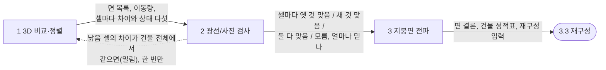
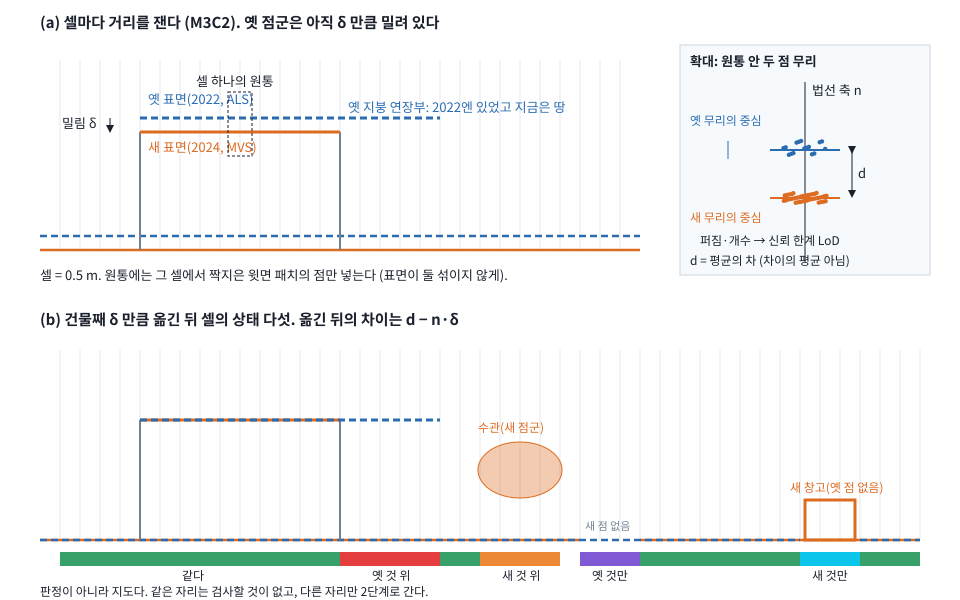
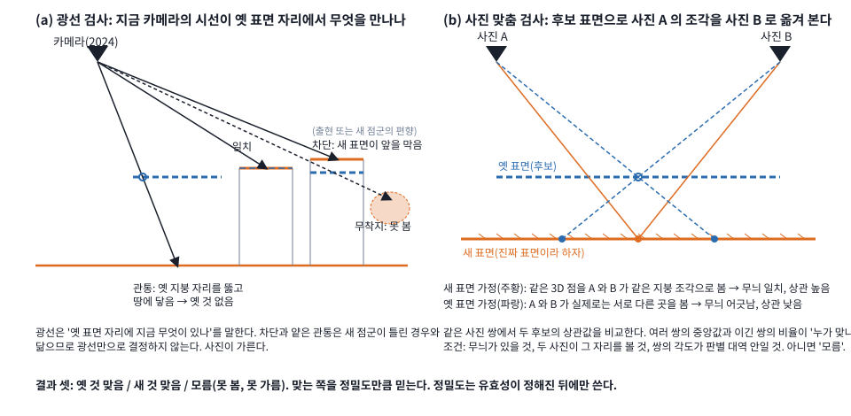
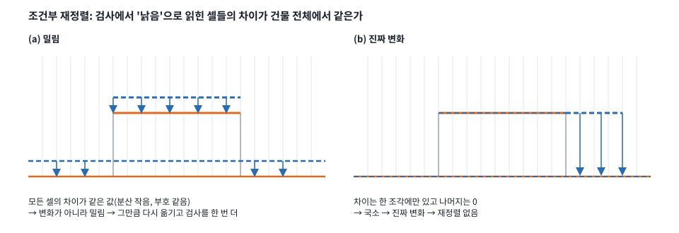
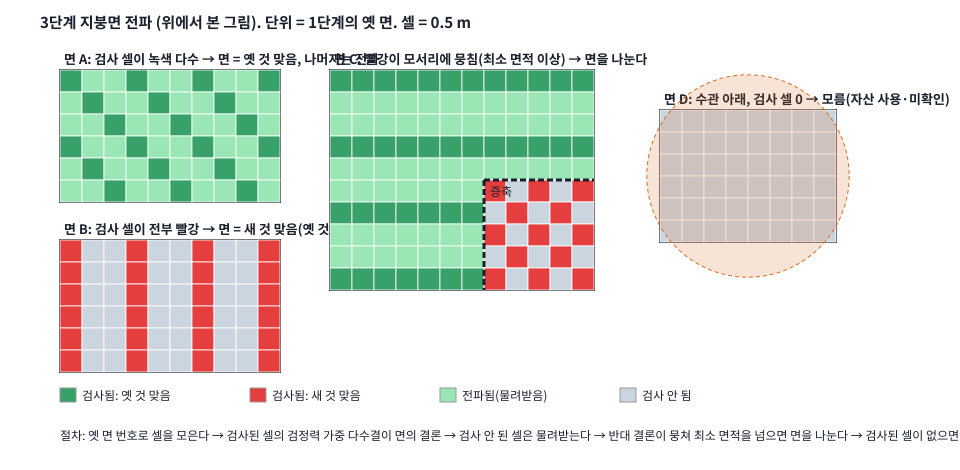

# 박사 연구 주제 재정리 v1 — 3. 제안 방법 (r4)

> 지위: WORKING DRAFT. 실행 권한 없음. `scientific_verdict: null`. 작성 2026-09-04~05. 리뷰어 김휘영.
> 근거 = 1절(`01_NECESSITY_ko_v1.md`) R1~R4, 2절(`02_GAP_ko_v1.md`) §2.7. 재료 = 설계 v2(`../mvs_als_surface_patch_v1/SOURCE_DECISION_METHOD_DESIGN_ko_v2.md`),
> 서베이(`../prior_injection_survey_v1/`), 주입 벤치(`../injection_bench_v1/`), T1·T2 기술 반환.
> 구성: 3.1 원리(명제 넷) → 3.2 판정(세 단계, 그림 1~4) → 3.3 재구성(목차). 유도·세부 규칙·자리표는 별도 파일 `03_METHOD_APPENDIX_ko_v1.md`(부록 3A·3B).
> 서술 규칙: [논리] / [실측] / [예정]. 실측은 전부 단일 장면·통제 주입·비확증 개발 증거. 표현층은 가우시안 스플래팅 장면 표현, 미분 가능 렌더링(gsplat).
> 개정: r1 3.1 → r2 3.2 → r3.x 3.2 를 사용자 문답으로 재작성(세 단계 확정) → **r4 축약·그림·부록 분리**(2026-09-05). 이력은 git 과 메모리.
> 재설계 안내(2026-09-06): 아래 r4는 점검 대상 설계다. [점검 결과](03_METHOD_REDESIGN_AUDIT_ko_v1.md)와 [판단상황표·구성 개편안](03_METHOD_DECISION_SCENARIOS_ko_v1.md)을 후속 설계의 출발점으로 사용한다. 기존 명제·가중식·전파 규칙의 타당성은 재검토 중이다.
> 후속 초안: [방법론 재설계 — 3.1–3.4 판단 설계·대표 상황·의도 점검](03_METHOD_REDESIGN_ko_v1.md). 이번 재설계는 별도 초안에서 진행하며, 아래 r4 본문은 재검토 자료로 보존한다.
> 표현층: [DEC-P1-025](../../../research/06_DECISION_LOG.md)는 gsplat 기반 planar 2D Gaussian 설계를 허용한다. 출력 상세·실행 조건은 별도 설계 대상이다.

## 3.0 1·2절에서 넘어온 것

[논리] 이미 정한 틀 셋. ① 판정은 최적화 루프 밖이고 결과는 가중·제거 마스크·상태로 재구성에 들어간다. ② 판정의 출력은 유효성(자산이 아직
맞나)·관측성(볼 수 있나)·정합(얼마나 어긋났나)이고, 자리별 권위는 유효성 × 정밀도이며 정밀도는 사진 대조로 보정한다. ③ 기하는 판정이 정한
만큼만 움직이고, 판정의 수정은 손실이 아니라 재검정이다. 이 셋은 결정이지 근거가 아니다. 3.1 이 근거를 명제 넷으로 쓴다.

## 3.1 문제의 구조와 설계 원칙

[논리] 방법이 부품의 조합으로 읽히지 않으려면, 부품마다 "왜 표준 부품이면 안 되는가"를 원리가 예측하고 실험이 그 자리에서 실패를 보여야
한다. 명제 넷이 그 예측이다. 기호: 자리 `u` 에서 영상 기하 `M`(잡음 `σ_M`)과 자산 `P`(잡음 `σ_P`, 정합 오차 `δ`), 차이 `d = z_M − z_P`, 자산이
낡았을 확률 `π` 와 그때의 차이 `Δ`, 영상 편향 `β`, 잉여도 `r`(그 자리를 검정할 독립 관측 수), 정밀도비 `ρ = σ_M²/σ_P²`.

**명제 1 승자 고정의 실패.** 차이 `d` 만으로는 "자산이 낡았다"와 "영상이 틀렸다"를 가를 수 없다. 지붕을 낮게 고친 것과 반사 지붕에서 영상이
가라앉은 것은 둘 다 `z_M < z_P` 다. 미지수 하나에 관측 둘이라 잉여도 1 이고, 불일치의 존재는 검출되나 누가 틀렸는지는 국지화되지 않는다(3A.1).
`d` 의 함수인 모든 결합(고정·정밀도·잔차 적응 가중, 강건 커널, prior 손실)은 누가 옳은지를 규칙이 미리 정한 것이다. 적응 가중은 판정 함수와
동치이고(Black–Rangarajan 1996) 그 극한은 이산 기각이다(GNC, Yang 2020). 낡음은 지붕면 단위로 결맞아 면 안 오염이 0 아니면 1 이라 파괴점 1/2 의
다수결도 안 된다(3A.3). 귀결: `d` 와 독립인 셋째 증인(사진·광선)이 필요하고, 증인은 최적화 중인 모델의 함수여서도 안 된다(자기 확증). 영상
기하는 기준이 아니라 후보다. 반증: 사진·광선 게이트를 잔차 게이트로 바꾸면 철거 지붕과 가라앉은 금속 지붕 중 한 곳에서 틀려야 한다.

**명제 2 정밀도 역설.** 정밀도는 측정 당시의 성질이라 지금 유효한지와 무관하다. 정밀도 가중 평균 `ẑ = (z_M + ρ z_P)/(1+ρ)` 에서 낡은 자산의
기대 오염은 `π·Δ·ρ/(1+ρ)` 로 자산이 정밀할수록 커지고, 보고 분산 `σ_M²/(1+ρ)` 는 작아진다. 영상 기하가 없는 자리(`ρ → ∞`)에서 오염은 `π·Δ`,
표기 정밀도는 `σ_P` 다. 강건 대칭형은 정밀한 쪽에 머물러 낡은 자산을 채택하고, 영상 기준 비대칭형은 오염은 없으나 자산이 이길 수 없어
가라앉은 지붕을 구제하지 못한다(3A.2). 조건은 `π > 0`, `ρ > 1` 이며 동시 취득 prior 에는 역설이 없다. 귀결: 권위 = 유효성 × 정밀도. 유효성은
현재 관측 검정에서, 정밀도는 사진 대조로 보정한 잡음에서, 신뢰도 표기는 유효성에서 온다. 반증: 낡은 자산의 `σ_P` 를 줄이며 주입하면 가중
가족은 오염이 늘고 제안은 불변이어야 한다.

**명제 3 식별과 유보.** 판정은 검정할 관측이 있는 자리와 규모에서만 정의된다. (a) 잉여도 0 이면 낡음이 검출되지 않으므로(Baarda 1968) 결과가
둘뿐인 규칙은 임의로 하나를 고른다. "모름"은 필수 출력이고, 잉여도는 영상 기하가 아니라 사진·광선에서 온다. (b) 정합 오차 `δ` 와 국소 변화는
셀에서 같은 서명을 내고 건물 단위 결맞음에서만 갈린다. (c) `δ` 는 양립 자리에서만 잴 수 있고 양립은 `δ` 를 알아야 정해지므로 얽혀 있다. 변화
면적이 파괴점 안이면 강건 정합 한 번으로 족하고, 넘으면 검사가 준 밀림 신호로 한 번 더 한다(3A.4). 귀결: 결과 셋, `δ` 는 건물 단위 공유 변수,
정합은 강건 1회 + 조건부 재정렬. 반증: 세 결과를 둘로 바꾸면 수관 아래 낡은 자산이 통과해야 하고, 재정렬을 없애면 변화 면적이 클수록 오류가
커져야 한다.

**명제 4 규모 한정 권위.** 한 소스의 권위는 그 소스가 정보를 가진 규모까지다. 자산은 점 간격·추상화 규모 `s_P` 아래에 정보가 없고(보간·평면
가정), 영상은 사진이 구별하는 규모까지만 있다. 전 규모 같은 가중은 두 방향으로 틀린다. 자산 가중이 `s_P` 아래로 내려가면 사진이 지지하는 세부를
누르고(GS4Buildings 의 세부 손실, 원문 확인 필요), 영상 자유가 `s_P` 위로 올라가면 자산 권위 자리에 영상의 거친 오류가 돌아온다. 귀결: 자산은
거친 대역 제약(패치 평면·법선·거친 깊이)으로 들어가고, 영상은 구별력 있는 자리·규모에서만 세부를 이끌며, 구별력이 없으면 자산 규모에서
멈춘다. 같은 구별력 지도가 판정과 세부 게이트에 쓰인다. 반증: 전역 가중 대 규모 한정 가중 절제에서 규모 한정이 모서리·윤곽 세부를 회복하며 거친
정확도를 잃지 않아야 한다.

[실측] 명제의 실물. 단일 장면과 통제 주입이며 확증이 아니다.

| 명제 | 실측 |
|---|---|
| 1 | 영상 편향 +1 m 주입(V7): 차단 0.99, 사진 P 지지(Δ −0.44). 옛 표면 소실 +2 m 주입(V8): 관통 0.96, 사진 M 지지(Δ +0.51). 잔차 크기로는 한 규칙이 같은 처방을 낼 자리. 금속 지붕(prism 3): 차이 0.3~0.8 m, σ_M 0.51 대 σ_P 0.08, 사진 P 지지. 3D 단독은 미세 오차에 AUC 0.57. 렌더 잔차를 증인으로 쓰면 색이 기하 오류를 5~15 스텝 안에 덮음(r17) |
| 2 | 영상 10.0 m, 낡은 자산 14.0 m: σ_P 1.0 / 0.3 / 0.03 m → 10.3 / 12.0 / 13.96 m. 초기 E4/E5: 강한 가중은 오염 전파, 약한 가중은 불활성. 재설계 E5 의 잔차 게이트는 영상 기하 없는 자리에서 신호 0 |
| 3 | 영상 기하를 지운 자리(V5): 영상 쌍 0, 무착지 우세, 사진은 자산 표면을 기준과 같이 설명(S_P 0.94). 수관 아래 자산만: r ≤ 1. 정합 없이 0.5 / 1 / 2 m 밀림(V1~V3): 셀 판독이 양립의 90 % 를 오독, 건물 결맞음(분산 0.010·부호 일치 1.00)만이 변화(조각 밖 ≤ 0.15 m)와 가름. 수평 1 m 는 수평면에서 비관측(V4) |
| 4 | 채움 지대 합성 증축의 사진 검정력 0.77(저텍스처 꼬리). prism 3 = 자산이 영상보다 정밀한 거친 규모의 실물 |

[논리] 네 명제가 요구하는 원칙 여섯. 3.2·3.3 의 장치는 이 원칙의 구현이고 원칙에 없는 장치는 넣지 않는다.

| 원칙 | 요구 | 명제 | 위치 |
|---|---|---|---|
| A 독립 증인 | 판정 증거는 3D 잔차의 함수도 모델 상태의 함수도 아니다. 사진·광선을 후보 표면에 직접 댄다 | 1 | 3.2 2단계 |
| B 후보 경쟁 | 영상 기하도 후보, 옮긴 자산도 후보. 기준은 없다 | 1, 3 | 3.2 |
| C 권위의 두 인자 | 권위 = 유효성 × 정밀도. 신뢰도 표기는 유효성에서 | 2 | 3.2 출력, 3.3 가중 |
| D 세 결과와 규모 맞는 변수 | 모름은 출력이다. `δ` 는 건물 단위, 결맞음으로 변화와 가른다. 정합은 강건 1회 + 조건부 재정렬 | 3 | 3.2 |
| E 규모 대역 | 자산은 거친 대역 제약, 영상은 구별력 대역, 나머지는 미주장 | 4 | 3.3 |
| F 기하는 판정이 정한 만큼만 | 자산 권위 자리는 묶고 영상 시드를 지운다. 영상 권위 자리는 열화되지 않는다. 유보 자리는 만들지도 옮기지도 않는다. 외관은 판정 기하 위에서만. 판정 수정은 손실이 아니라 재검정 | 1, 2, 4 | 3.3 |

한 문장으로: 낡을 수 있는 자산과 현재 영상의 결합은 얼마나 섞느냐의 가중 문제가 아니라, 어느 자리에서 어느 규모까지 누가 옳은지를 현재
관측으로 가려내는 식별 문제다. 주장하지 않는 것: 조건 밖(동시 취득, 차이가 잡음 안, 자산이 영상만큼 세밀)에서는 가중 가족이 옳다. 근거의
정리들은 기존 결과의 재진술이다. 반복 최적화의 이득과 낡음의 시간 모형은 주장하지 않는다.

## 3.2 판정

**정본 한 문단.** 셀마다 M3C2 로 두 소스의 차이 `d`, 법선 `n`, 신뢰 한계 `LoD` 를 잰다. 옛 점군을 건물째 `δ` 만큼 옮기면 셀의 차이는 `d − n·δ` 가
되므로, 변한 셀은 이상치로 견디는 강건 최소제곱으로 모든 셀의 `d − n·δ` 가 0 에 가깝도록 `δ` 를 푼다(수평은 기운 면·벽이 있을 때만). 옮긴 뒤
`|d| ≤ LoD` 면 같다, 아니면 다르다, 한쪽 점이 없으면 옛 것만·새 것만. 다른 자리는 옛 표면과 새 표면을 광선과 사진에 대 보아 옛 것 맞음·새 것
맞음·모름을 정하고 맞는 쪽을 정밀도만큼 믿는다. 셀 결론을 옛 면 단위로 모아 못 본 셀에 물려주고, 갈리면 면을 나눈다. 낡음으로 읽힌 셀의 차이가
건물 전체에서 같은 값이면 밀림이므로 그만큼 다시 옮기고 검사를 한 번 더 한다.

| 단계 | 무엇을 하나 | 무엇이 나오나 | 실행 여부 | 그림 |
|---|---|---|---|---|
| 1 3D 비교·정렬 | 면 나누기, 셀마다 윗면 짝, M3C2 셀 거리, 건물째 강건 정렬, 옮긴 뒤 상태 다섯 | 면 목록, 이동량, 셀마다 `d`·`n`·`LoD` 와 상태 | 정렬만 설계, 나머지 실행 | 1 |
| 2 광선/사진 검사 | 다른 자리마다 옛 표면·새 표면을 광선과 사진에 대 본다 | 셀마다 옛 것 맞음 / 새 것 맞음 / 둘 다 맞음 / 모름, 가중치 | 증거 은행 실행, 규칙 설계 | 2 |
| 재정렬(조건부) | 낡음 셀의 차이가 건물 전체에서 같으면 그만큼 다시 옮기고 2 를 한 번 더 | 갱신된 이동량·결론 | 설계(벤치 V1~V3 근거) | 4 |
| 3 지붕면 전파 | 셀 결론을 옛 면으로 모아 물려주고 갈리면 나눈다. 성적표를 쓰고 넘긴다 | 면 결론, 성적표, 재구성 입력 세 형식 | 설계 | 3 |

### 3.2.1 1단계 3D 비교·정렬

[논리] 두 점군을 각각 면으로 나눈다. 곡률이 낮은 점에서 시작해 이웃이 영역 평면과 각 15° 안, 거리 0.15 m 안이면 붙이고 남는 점은 군집으로
묶는다(파일럿: 옛 면 57, 새 면 267). 0.5 m 셀마다 각 소스의 윗면을 짝짓고(1 m 넘게 떨어진 아래층은 둘째 짝, 벽은 3D 근접) 그 셀에서 어느 옛
면·새 면에 속하는지 적는다. 그다음 셀마다 M3C2 거리를 잰다. 셀 주변 원통 안의 옛 점 전부와 새 점 전부를 국소 법선 축에 투영해 두 무리의 중심을
구하고 그 차를 `d` 로 삼는다. 차이의 평균이 아니라 평균의 차이이며(점 대 점 대응은 없다) 원통에는 짝지은 윗면 패치의 점만 넣어 표면이 둘 섞이지
않게 한다. 두 무리의 퍼짐과 개수가 `LoD` 다(원통 지름 2 m 에 옛 점 약 70, 새 점 약 480).

옛 점군은 다른 좌표계에서 왔으니 통째로 밀려 있을 수 있고, 밀린 채 검사하면 모든 옛 셀이 틀린 것으로 읽힌다(벤치: 0.5 m 밀림에 양립 셀 90 %
오독). 그래서 검사 전에 옮긴다. 옛 점군을 `δ` 만큼 옮기면 셀의 차이는 `d − n·δ` 가 되므로 모든 셀에서 그 값이 0 에 가깝도록 `δ` 를 강건 최소제곱으로
푼다. 평지붕·지면 셀은 `n = (0,0,1)` 이라 `δz` 를 주고, 동향 30° 경사(`n = (0.5, 0, 0.87)`)와 서향 경사가 함께 있으면 `δx` 가 갈리며, 벽은 `δy` 를 준다.
식이 없는 성분은 초기값 0 에 묶는다(항공 라이다는 벽이 드물어 수평은 주로 경사 지붕에서 오고, 평지붕 안쪽의 순수 수평 차이는 어떤 3D 척도로도
보이지 않는다). 철거된 지붕 셀(`d ≈ +2.3 m`)과 나무는 어떤 `δ` 로도 0 이 안 되므로 강건 손실이 이상치로 밀어낸다. 파일럿에서는 이미 맞아 있어
이동량이 거의 0 이었다. 옮긴 뒤 `|d| ≤ LoD` 면 같다, 넘으면 부호에 따라 옛 것 위·새 것 위, 한쪽 점이 없으면 옛 것만·새 것만이다. 이 지도는 판정이
아니라 어디를 볼지다.

### 3.2.2 2단계 광선/사진 검사

[논리] 차이만 보면 "옛 지붕이 철거됐다"와 "금속 지붕이라 새 점군이 가라앉았다"가 똑같이 보인다. 둘 다 옛 것이 높다. 그래서 3D 로는 못 가리고
사진에 묻는다. 광선 검사: 지금 카메라의 시선이 옛 표면 자리를 뚫고 그 아래 땅에 닿으면 옛 표면은 없어진 것이다(관통). 새 표면이 앞을 막으면
차단인데, 차단과 얕은 관통은 새 점군이 틀린 경우와 닮으므로 광선만으로 결정하지 않는다. 사진 맞춤 검사: 후보 표면(옛 또는 새 점군의 높이장)을
두 실제 사진의 대응 규칙으로 쓴다. 셀 주변 2 m 창의 표면 위 3D 점들을 사진 A 와 B 에 투영해 색을 읽는다. 표면이 진짜면 같은 3D 점이 두 사진에서
같은 지붕 조각이라 무늬가 일치하고, 높이가 틀리면 B 가 엉뚱한 곳을 읽어 어긋난다. 일치 정도는 정규화 상관이고, 같은 사진 쌍에서 두 후보의
상관값을 비교해 여러 쌍의 중앙값과 이긴 쌍의 비율로 "누가 맞나"를 정한다. 조건 셋: 창에 무늬가 있을 것, 두 사진이 그 자리를 볼 것, 쌍의 각도가
판별 대역 안일 것.

결과는 셋이다. 옛 것 맞음, 새 것 맞음, 모름. 모름은 둘이다. 나무 아래처럼 못 보는 경우(자산 사용·미확인), 무늬 없는 면 안쪽처럼 두 표면이 비슷하게
맞아 못 가르는 경우(판단 불가). 결론이 나면 맞는 쪽을 정밀도만큼 믿는다. 옛 것이 맞으면 옛 것의 정밀도, 새 것이 맞으면 영상의 정밀도, 둘 다
맞으면 정밀도 비율로 섞는다. 정밀도는 유효성이 정해진 뒤에만 쓴다. 낡았다고 가려진 자리는 정밀도가 아무리 높아도 가중치 0 이다. 영상
정밀도는 셀 안 점의 퍼짐에 사진 결과를 반영한 값이라, 사진이 새 표면을 부정하면 그 자리의 영상 정밀도를 낮춘다.

재정렬(조건부). 변화가 건물의 큰 부분을 덮으면 1단계의 맞춤이 변화 쪽으로 끌리고 검사는 멀쩡한 자리를 낡음으로 읽는다. 낡음으로 읽힌 셀들의
차이가 건물 전체에서 같은 값이면 변화가 아니라 밀림이다(벤치: 밀림 주입은 분산 0.010·부호 일치 1.00, 진짜 변화는 조각 밖 ≤ 0.15 m). 그만큼
다시 옮기고 검사를 한 번만 다시 한다.

### 3.2.3 3단계 지붕면 전파

[논리] 검사는 무늬와 가시성이 있는 셀에서만 된다(파일럿: 옛 지붕 자리의 27~53 %, 광장의 10~15 %). 지붕면은 한 덩어리라 반은 낡고 반은 멀쩡할 수
없으므로, 셀 결론을 면으로 모은다. 단위는 1단계의 옛 면이다(옛 것이 없는 자리는 새 면). 절차 넷. ① 옛 면 번호로 셀을 모아 검사된 셀과 안 된 셀로
나눈다. ② 검사된 셀의 결론을 검정력(사진 쌍 수, 상관값 차이) 가중 다수결로 면의 결론으로 삼고, 안 된 셀은 물려받아 "전파"로 표시한다. ③ 반대
결론이 뭉쳐 최소 면적(자리표)을 넘으면 면을 나눈다(증축). 흩어져 있으면 잡음이다. ④ 검사된 셀이 없으면 면 전체가 모름이고 옛 기하는 묶어 둔 채
미확인으로 표시한다. 마지막으로 건물마다 성적표를 쓴다. 옛 자산을 쓴 자리 중 확인된 면적, 확인 못 한 면적, 낡아서 뺀 면적. 신뢰도 표기는 이
검정 결과이지 `σ_P` 가 아니다.

재구성에 넘기는 것 셋. 가중(셀·면별 옛 것과 새 것의 가중치 = 유효성 × 정밀도), 마스크(낡은 옛 점 / 옛 것이 맞는 자리의 새 점 / 모름 자리),
상태(셀·면·건물 태그, 이동량, 구별력 지도). 3.3 은 이것만 받는다.

### 3.2.4 네 자리의 실제 흐름

[실측+예정] 파일럿의 세 자리(짝 상태별 중앙값)와 통제 주입 한 자리. 1단계의 비교와 2단계의 증거는 실측이고 나머지는 설계가 내는 결과다.

| 단계 | 옛 지붕 자리(파일럿, 1,229 셀) | 광장 지면(파일럿, 1,140 셀) | 수관 아래(파일럿, 34 셀) | 위로 치우친 영상(벤치 V7, 540 셀) |
|---|---|---|---|---|
| 1 비교·정렬 | 옛 면 5. 옛 것 위, 차이 1.6~3.8 m. 국소라 이동량에 영향 없음 | 같다(`d` −0.03, LoD 0.033). 정렬 참여 | 옛 것만 | 새 것 위, 차이 1.0 m. 강건 맞춤이 이상치로 견딤 |
| 2 광선 | 관통 0.91 | 일치 0.81 | 검정 광선 2,626 대 무착지 8,722 | 차단 0.99 |
| 2 사진 | 새 표면(Δ +0.29, 새 것이 이긴 쌍 100 %) | 같음(Δ 0.00) | 유효 쌍 0 | 옛 표면(Δ −0.44, 옛 것이 이긴 쌍 84 %) |
| 2 결론·믿음 | 새 것 맞음, 옛 것 가중 0 | 둘 다 맞음, 정밀도 비로 섞음 | 모름(못 봄, r ≤ 1) | 옛 것 맞음, 영상 정밀도 낮춤 |
| 재정렬 | 국소(조각 밖 차이 ≈ 0) → 없음 | — | — | 없음 |
| 3 전파·성적표·넘김 | 옛 면 5 전부 새 것 맞음 → 제거됨 375 m² → 옛 점 제거 마스크 | 면 확인됨 → 정밀도 융합 가중 | 검사 셀 없음 → 자산 사용·미확인 8.5 m² → 옛 기하 묶고 표시 | 면 옛 것 맞음 → 확인됨 → 그 자리 새 점 제거 마스크 |

첫째 열과 넷째 열이 명제 1 의 자리다. 차이의 크기는 같은 급인데 광선 방향과 사진의 편이 반대다. 세부 규칙(우도, 정밀도 함수, 유보 문턱, 전파·분할,
자리표)과 산출물 표의 열 이름은 부록 3B.

## 3.3 재구성 (목차)

3.1 이 넘기는 것: 원칙 C·E·F. 판정 출력을 가중·제거 마스크·상태로 소비하는 가우시안 스플래팅 장면 표현. 비교자 = 잔차 게이트(E5) / 고정
가중(E4) / 자산 없음(E3) / 합집합(E8) / 영상 단독(E2).

- 3.3.1 입력: 판정 출력 세 형식이 무엇을 바꾸나(가중 → 손실, 마스크 → 시드·밀집화·가지치기, 상태 → 자유도·태그)
- 3.3.2 시드 규칙: 자산 권위 자리의 영상 시드 제거, 자산 시드, 유보 자리
- 3.3.3 규모 한정 손실: 자산은 패치 평면·법선·거친 깊이, 영상은 구별력 대역
- 3.3.4 자유도: 권위 자리별 묶기·풀기, 영상 권위 자리 비열화 고정
- 3.3.5 외관: 판정 기하 위에서만, 판정 중 색 동결, 자산 권위 자리로 외관 전이, 반사면·바뀐 자리 예외
- 3.3.6 상태 태그와 산출물: 표현층(상태가 붙은 장면)과 파생층(텍스처 표면 모델·LoD2)
- 3.3.7 재검정(가설): 재구성 표면을 셋째 후보로 3.2 에 되돌리는 시험의 형식

## 부록

별도 파일 `03_METHOD_APPENDIX_ko_v1.md`. 3A 유도 메모(3A.1 잉여도 1 의 비식별, 3A.2 결합 형식별 오염·구제, 3A.3 파괴점과 판정 단위, 3A.4 `δ`
고정점), 3B 판정의 세부 규칙(3B.0 기존 설계 대비 차이, 3B.1 분기 순서도·열 단계 데이터 표, 3B.2~3B.8 단계별 규칙과 수식, 3B.9 자리표).
