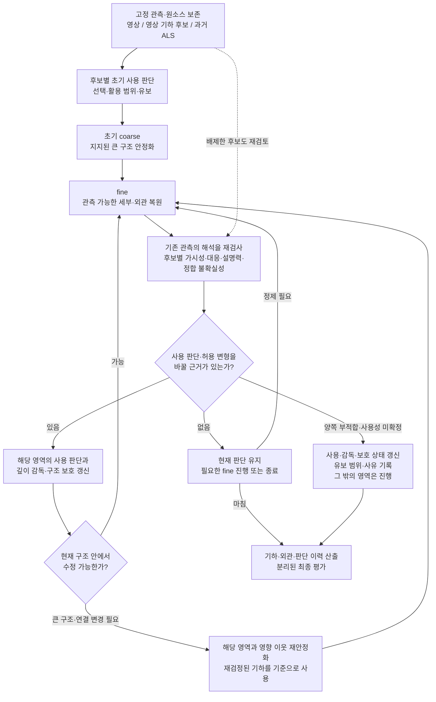

# 방법 구조 후보 — 초기 안정화와 증거 기반 재판단

> 2026-09-08 · `WORKING DRAFT / DESIGN CANDIDATE` · `scientific_verdict: null`
> 작업: `PHD-METHOD-STRUCTURE-DISCUSSION-v1`. 문서 설계만 수행하며 실행 권한을 만들지 않는다.
> 기존 [필요성](01_NECESSITY_ko_v1.md), [공백](02_GAP_ko_v1.md), [재설계 r3.7](03_METHOD_REDESIGN_ko_v1.md), [인계문](04_NEXT_SESSION_HANDOFF_ko_v1.md), [GeoGS 감사](../geogs_contribution_v1/CONTRIBUTION_AUDIT_ko_v1.md)를 보존한 추가 기록이다.

## 1. 이번에 검토할 안

**복원 상태는 이어가되, 소스 활용의 근거가 달라진 영역에서는 판단과 구조 제약을 다시 정할 수 있게 한다.** 큰 구조의 변경이 필요할 때만 그 영역과 영향을 받는 이웃을 재안정화한다. 이 안을 우선 논의하되, 초기 판단을 고정하는 순차법과 한 번의 후반 재판단으로 충분할 가능성을 함께 남긴다.

| 지위 | 내용 |
|---|---|
| 사용자와 합의된 요구 | 과거 ALS와 현재 영상으로 사용 가능한 구조를 유지하고 현재 기하·관측 가능한 세부·외관을 복원한다. 초기 오판은 양방향 수정 가능해야 하며, 사용성을 확인할 수 없거나 양쪽이 부적합하면 유보가 필요하다. |
| 이번 구조 후보 | 초기 판단 → coarse → fine → 근거 변화에 따른 재판단 → 필요한 국소 제약·구조 갱신. 매 반복의 전체 재초기화를 뜻하지 않는다. |
| 미결 | 판단 계산, coarse/fine 경계, 갱신 영역과 연산, 재판단 시점, 후보 보존 표현, 정합 재추정 범위. 수치 문턱·손실·반복 횟수는 정하지 않는다. |

**과거 설명과의 관계.** r3.7의 ‘판단 확정 → 판단을 고정한 GS 반복’은 보존하고 이번 안의 순차 비교 후보로 둔다. 이번 문서가 채택된 새 정본이라는 뜻은 아니다. 인계문의 GeoGS 전문 미확보는 과거 상태다. 이번에는 제공된 전문을 확인했으며, GeoGS는 기여 탐색의 중심 비교 연구다. 전체 문제의 SOTA라는 판정과 Wu–Vallet 결과의 재해석은 하지 않는다.

[연구헌장 §0.1](../../../research/00_RESEARCH_CHARTER.md)과 [DEC-P1-025](../../../research/06_DECISION_LOG.md#dec-p1-025--불확실성-인지형-cross-temporal-prior-guided-reconstruction-상위-문제정의)에 따라 E1–E6 및 역사적 C 계보를 유지한다. 평가 전용 UAS·LoD2 Z/RoofSurface 등은 판단·정합·학습에 넣지 않으며, GroundSurface XY·stable ID는 기존 공통 통제 범위만 따른다. 구현을 구체화할 때의 표현 기반은 gsplat의 평면 2D Gaussian이다. GeoGS 공식 구현을 읽는 것은 이 계약의 변경이 아니다.

## 2. 전체 흐름과 단계별 상태

여기서 재검사는 매 최적화 step의 별도 학습이 아니다. 추정 변화가 판단에 영향을 줄 만한 시점에 수행하는 후보이며, 근거가 바뀌지 않으면 같은 판단을 반복할 이유가 없다. 유보 영역도 이후 다른 영역의 복원으로 관련 근거가 달라지면 다시 검토할 수 있다. 최종 평가 결과를 보고 판단 루프로 돌아가지는 않는다.

| 단계 | 입력 → 출력 | 단계 안에서 고정 | 갱신할 것 |
|---|---|---|---|
| 초기 판단 | 원영상·영상 기하·ALS·정합/오류 근거 → 후보별 지지·반대·미확정, 사용할 기하·성분·범위 | 원자료·출처·대상 영역과 자료 역할 | 후보별 사용 가능성, 필요한 정합 상태, 관측 가능성, 선택/유보 |
| coarse | 선택 기하·허용 범위 → 안정화된 큰 표면과 가림 관계의 추정 | 해당 판단 버전과 보호 기준, 원소스 | 표면 위치·방향·범위·큰 경계와 필요한 연결. 표현을 위한 Gaussian 구성도 대상이 될 수 있음 |
| fine | 현재 장면·현재 영상 → 세부 기하·외관이 정제된 장면 | 지지된 큰 구조와 허용 변형·유보 경계 | 관측 가능한 국소 형상과 색/외관. 크기·방향·불투명도·증감은 표면 영향까지 검사 |
| 재판단 | 보존 후보·새 복원 상태·같은 원영상 → 변경/유지/유보와 이유 | 원관측·후보 계보, 후보 비교 중의 공통 오차 모형·검사 규칙 | 후보별 가시성·대응·설명력과 사용 상태. 정합은 별도 근거가 생긴 경우에만 갱신 |
| 국소 갱신 | 새 판단·현재 장면 → 수정된 제약과 필요한 국소 기하 | 영향 밖의 지지된 구조, 변경 전 기록 | 감독 대상/강도, 구조 보호, 기준 기하·허용 변형, 필요한 기하 연산 |
| 산출·평가 | 최종 장면·이력 → 기하·실제 렌더·채택/유보 결과 | 평가 자료·범위·출력 정의 | 평가값만 계산. 평가 참조로 판단이나 학습을 수정하지 않음 |

**coarse/fine은 무엇을 바꿀 수 있는가의 구분이다.** coarse는 표면의 큰 위치·방향·존재 범위와 경계/연결을 안정화하고, fine은 그 구조 안에서 관측이 지지하는 작은 형상과 외관을 복원한다. 영상 해상도나 Gaussian 크기만으로 둘을 정의하지 않는다. 작은 돌출부도 앞뒤 가림이나 표면 연결을 바꾸면 구조 갱신 문제가 될 수 있다. 불일치 처리는 초기 감독의 적합 범위를 정하고, coarse의 구조 보존으로 연결되며, fine 중 남은 충돌이 재판단 대상으로 돌아온다.

## 3. 어떤 경우에 다시 coarse가 필요한가

| 재판단 결과 | 이어갈 처리 | 안정화의 기준 |
|---|---|---|
| 같은 표면·큰 위치/방향/연결을 유지하고 감독 강도나 작은 오차만 바뀜 | 해당 성분의 감독을 갱신하고 국소 보정 + fine | 현재도 관측 지지가 유지된 기준 기하 |
| 같은 큰 구조·연결을 유지하면서 연속 보정으로 지지된 대안에 도달할 수 있음 | 국소 이동 + fine을 검토. 소스 이름 변경만으로 coarse 복귀하지 않음. 연속 이동이어도 큰 위치·방향을 바꾸면 재안정화 대상 | 새로 검정한 후보와 남은 변형 범위 |
| 다른 높이/층을 채택하거나, 표면 추가·제거·연결 변경이 필요함 | 해당 영역과 영향을 받는 이웃의 큰 구조를 재안정화한 뒤 fine | 새로 검정한 영상/정합 ALS/조건부 결합 후보 |
| 원인은 공통 정합 오류이며 이를 분리할 안정 근거가 있음 | 정합과 관련 후보·투영 증거를 갱신하고 영향 범위 재검사 | 새 정합 버전의 후보. 국소 형상 변형으로 정합 오류를 흡수하지 않음 |
| 기존 후보의 사용은 반박됐지만 대체 후보는 지지되지 않음 | 해당 현재 기하 사용을 유보 | 새 anchor를 강제로 만들지 않음. 기각은 빈 공간 확인이 아님 |

이미 양호한 영역은 현재 지지되는 구조 기준을 유지하며 필요한 외관 정제를 이어간다. 수정 영역과 같은 면·경계·가림 광선으로 연결된 이웃은 영향 범위에 포함한다. 화면상 가까움만으로 범위를 정하지 않는다. 전역 정합을 바꾸면 영향도 전역일 수 있으므로 ‘항상 작은 국소 수정’이라고 보장하지 않는다.

현재 GS는 갱신의 출발 상태이고 **재검정된 기하가 구조 제약의 기준**이다. GS가 움직일 때마다 기준도 따라 움직이면 누적 이탈을 막을 수 없다. 기준을 교체할 때에는 새 근거와 버전을 남긴다. 국소 갱신이 이웃을 악화시키면 되돌리는 경로를 검토하되, 이미 반박된 옛 표면으로 돌아간 것을 현재 기하의 회복으로 표시하지 않는다.

## 4. 재판단 근거는 무엇이 달라지는가

아래는 **설계 설명용 예시이며 실행 결과가 아니다.** 새 영상이 생기는 대신 기존 영상의 대응·가림·오차 설명이 달라질 가능성을 보여 준다. 추정이 좋아졌는지는 따로 검사해야 한다.

| 초기 상태 | 복원 중 달라질 수 있는 추정 | 같은 관측에서 다시 검사할 것 → 가능한 판단 변화 |
|---|---|---|
| 영상 기하가 부족해 큰 지붕에 ALS를 사용 | 주변의 잘못된 가림 표면이 현재 영상 근거로 수정되어 지붕 경계의 대응 가능성이 달라짐 | 보존된 ALS와 영상 후보 각각에서 원영상 간 대응·경계 위치 검사 → ALS 사용 축소/중단, 지지된 현재 후보로 변경 |
| 초기 영상 오류와 불일치한다는 이유로 ALS를 배제 | 표면 방향·가림 설명이 개선되어 초기 비교가 다른 층이나 가려진 픽셀을 대조했음을 발견 | ALS 자체의 현재 위치·방향 지지와 정합 오차를 다시 검사 → ALS 재채택. 단순 잔차 감소만으로 채택하지 않음 |
| ALS 전체의 위치 차이를 국소 형상 오류로 읽음 | 여러 안정 영역의 대응이 개선되어 공유 정합 성분과 남은 불확실성을 더 잘 제한 | 같은 변환을 관련 후보에 적용해 모두 재검정 → 불필요한 배제 철회 또는 잔여 국소 차이 유지 |
| 작은 구조를 별도 표면으로 설명하지 못함 | 큰 면 안정화 뒤 경계·국소 형상 대안을 시험할 수 있는 표현과 대응이 마련됨 | 다중시점에서 형상 변화와 외관 무늬를 구별 → 지지되는 세부만 복원 |
| 낮은 시차·무텍스처로 여러 높이가 같은 사진을 설명 | 외관 손실은 줄지만 기하를 구별할 관측은 계속 부족 | 설명 가능한 높이 대안이 남는지 검사 → 유보 유지 |

**자기확증을 줄이는 비교 원칙.** 현재 GS–ALS 일치는 prior가 옳다는 증거가 아니다. 원영상끼리 후보 표면을 경유해 대조하고, 후보별 가시성을 따로 계산한다. 후보마다 자신에게 유리한 시점만 남겨 평균 점수를 경쟁시키지 않으며, 공통으로 비교 가능한 관측과 후보 고유의 가시성/모순/결측을 함께 기록한다. 가려짐은 반대 증거가 아니고, 빈 공간 모순에는 신뢰할 수 있는 최초 착지 근거가 필요하다.

기하·외관을 갱신한 영상과 별도로 판단용 영상을 두는 안을 검토한다. 판단용 영상은 선택에 쓰이므로 최종 평가 영상이 아니다. 후보 생성/MVS/DA3/카메라 추정에 이미 쓰인 사진과 공유 오차도 기록해야 하며, 뷰를 나눴다는 이유만으로 완전한 독립성을 주장하지 않는다. 후보 비교에는 공통의 카메라·정합 불확실성 설명을 적용하고, 후보별로 유리한 정합을 자유롭게 허용하지 않는다. 현재 GS가 제안한 가림을 그대로 정답으로 쓰지 않고 경쟁 후보에서도 검사하는 계산은 핵심 미결이다.

## 5. prior 중단·재채택과 세 제어의 연결

**보존할 것은 원소스와 다시 시험할 경로다.** 영상 후보와 ALS 후보, 조건이 성립한 결합 후보를 각각 유지한다. 충돌/불확실 영역에서는 후보 기하·원자료 소속·정합·반대/지지 근거를 남긴다. 전체 장면의 여러 GS를 항상 병렬 학습할 필요성은 미결이며, 원후보 보존과 필요한 때의 국소 후보 재구성으로 충분한지 먼저 검토한다. 후보를 정제하면 원소스를 덮어쓰지 않고 파생 계보를 남기며, 경쟁 후보 모두를 같은 prior 쪽으로 끌어당기지 않는다.

| 경로 | 판단과 재구성에서 필요한 일 |
|---|---|
| `PRIOR → IMAGE` | 영상 후보 자체의 사용 지지를 확인한다. prior가 반박됐거나, 두 후보 모두 유효하되 영상 후보의 활용 이득이 지지될 때 변경을 검토한다. prior 감독과 필요한 구조 보호를 새 판단에 맞춰 갱신하고 대체 기하로 갈 연산을 제공한다. 유효 prior의 활용 축소를 기각으로 기록하지 않는다. |
| `IMAGE/ABSTAIN → PRIOR` | 저장된 prior를 원영상·가시성·정합 불확실성으로 재검정한다. 사용이 지지되면 감독을 복원하고, 해당 표면이 장면에서 소실됐다면 필요한 국소 기하 복원 경로를 검토한다. |
| `단일 소스 → FUSION` | 양쪽 후보가 각각 사용 가능하고 같은 현재 표면·성분의 대응과 결합 이득이 있을 때만 검토한다. 충돌하는 두 높이의 평균을 자동 채택하지 않는다. |
| `어떤 선택 → ABSTAIN` | 양쪽 부적합, 사용성을 확인할 수 없는 중요한 대안, 후보 없음, 계산 미완료를 구분한다. 기존의 현재 기하 채택 권한과 해당 감독·보호를 재설정한다. 미확인 prior를 표현해도 현재 복원 성공 범위로 세지 않는다. |

MVS가 없거나 사용 불가이면 **`PRIOR / ABSTAIN`**이다. 새 영상 기하 후보를 실제로 만들고 따로 검정하기 전에는 사진이나 prior에 맞춘 현재 GS를 `IMAGE` 후보로 재명명하지 않는다. 원 prior의 현재 사용과 현재 영상이 지지하는 prior 파생 형상의 보정도 이력에서 구분한다.

두 후보가 각각 사용 가능하고 남은 차이가 요구한 성분의 허용 범위 안이면, 소스를 유일하게 구별하지 못한다는 이유만으로 유보하지 않는다. 지지된 한 후보를 유지하거나 조건부 결합을 검토할 수 있다. 유보가 필요한 것은 현재 사용 가능성을 정할 수 없는 경우다.

| 제어 | 정하는 것 | 이것만 바꿔서는 남을 수 있는 문제 |
|---|---|---|
| 소스 사용 판단 | 어느 후보의 어느 기하 성분을 사용할 수 있는가, 유보할 것인가 | 판단이 바뀌어도 학습 제약과 기하가 따라 바뀌지 않을 수 있음 |
| 활용 강도 | 사용 가능한 깊이·법선 등에 얼마나 강하게 맞출 것인가 | prior 감독을 약하게 해도 구조 보호나 초기 형상 때문에 표면이 남을 수 있음 |
| 구조 보호·기하 연산 | 움직일 성분과 범위, 분할·복제·제거·복원 가능성 | 자유도를 열어도 목표 기하·관측 근거가 부족하면 양호 구조까지 훼손할 수 있음 |

정합/기하 보정은 그 판단을 구현하는 별도 변화다. 정합 오류에는 지지된 공유 변환을, 국소 형상 오류에는 해당 표면 수정을 검토한다. 오류를 설명하지 않고 어느 쪽이든 자유 변형시키지 않는다.

**현재 GS 하나의 잔차 가중만으로 양방향 회복을 보장할 수 없다.** 살아 있는 prior 감독의 가중을 다시 높이는 것은 가능하지만, 삭제된 표면·배제 후보·대체 기하로 갈 경로가 없으면 실제 재채택이 되지 않는다. 반대로 후보와 경로가 남아 있고 연속 보정만으로 충분하다면, 여러 GS나 강제적인 이산 교체 없이 가역적인 연속 가중으로 해결할 수 있다. 행동 이름은 그 사용 상태의 기록으로 둘 수 있으며, 모든 지점에서 강제적인 이산 선택을 요구하지 않는다.

## 6. 선행연구가 제공하는 원리와 추가 설계

다음은 **문헌·코드 확인**이며 마지막 열은 **본 연구의 설계 해석**이다. 각 원리의 존재를 전체 후보 구조나 과거 ALS–현재 영상의 효과 검증으로 확대하지 않는다.

| 연구 | 실제 갱신과 판단 근거 | 고정 정보와 다시 포함할 경로 | 가져올 원리 / 추가로 필요한 것 |
|---|---|---|---|
| **GeoGS** | anchor 단계에서 LoD2 깊이로 큰 구조를 안정화. 전환 시 LoD2 근접 Gaussian을 보호하고 refinement에서 GS 기하·외관 및 DA3 깊이 가중을 갱신. DA3/RGB 손실 추세가 적응 가중의 근거 | 카메라·LoD2·사전 계산 깊이 유지. 기본 전환 후 작은 LoD2 가중과 구조 보호 membership 유지. 이 경로는 LoD2 후보의 현재 사용 철회·재채택을 판단하지 않음 | 초기 안정성 위에서 세부 복원. 보호할 구조 자체의 재검정, 판단 변경에 따른 보호·기하 갱신이 추가 설계 대상. [전문 §3.4](https://doi.org/10.1016/j.isprsjprs.2026.07.011), [고정 코드](https://github.com/zqlin0521/GeoGS/blob/db40c95c657ec03ff21c83cb99cf39f4e90247a6/train.py#L873) |
| **Semantic MVS** | voxel 점유·외관, 객체 존재·자세 belief와 pose 제안, octree 해상도를 갱신. 현재 점유 추정에서 shape 자세를 제안하고 shape/영상 ray 메시지를 반복 | 원영상·카메라·입력 shape는 고정. 모든 입력 shape를 다시 다루므로 낮은 존재 belief를 영구 삭제하는 구조는 아니지만 유한 자세 탐색의 복귀 보장은 없음 | 구조 추정 개선으로 자유공간·가시성 해석이 달라지는 선례. 해상도 세분화는 표현 갱신이며 anchor 보호 갱신과 다름. ALS의 시간차 판단은 추가 문제. [본문 §4–5](https://openaccess.thecvf.com/content_cvpr_2017/papers/Ulusoy_Semantic_Multi-View_Stereo_CVPR_2017_paper.pdf), [보충 §1.3, Algorithm 1–4](https://www.cvlibs.net/publications/Ulusoy2017CVPR_supplementary.pdf) |
| **SRDM** | 약한 LiDAR 유도 stereo → 영상 disparity와 불일치하는 LiDAR 제거 → 남은 LiDAR로 탐색 범위·강한 매칭 비용을 구성하여 고해상도 disparity 복원. 잔여 prior 비용도 절단 | 영상·정합 및 후단의 제거 후 LiDAR 집합. 기술된 절차에 제거 후보 재채택 단계는 없음. 후단 깊이 결과를 LiDAR에 무조건 고정하지는 않음 | 상보성·오류 제거·세부 복원을 연결하는 강한 순차 처리. 제거 뒤 후보 재검토의 필요성과 이득은 따로 검증. [저자 원문 §3.2.3–3.2.4·§4.3](https://cpb-us-w2.wpmucdn.com/u.osu.edu/dist/4/28638/files/2018/07/LiDAR_and_Image_paper-V3_close_to_final-28lqxo6.pdf) |
| **AGS-Mesh** | DNC는 깊이 유래 법선과 외부 법선 불일치로 깊이 감독을 사전 필터링. ANR은 초기 감독 이후 현재 GS 깊이 유래 법선과 고정 외부 법선의 불일치로 법선 감독을 갱신 | RGB·센서 깊이·외부 법선과 DNC 전처리 맵은 고정. 공식 코드 ANR은 sampled view마다 마스크를 새 계산하므로 제외한 법선도 다시 감독에 포함될 수 있음 | 감독 재검토·재포함 자체는 선례. 현재 GS와의 일치만으로 과거 기하의 사용을 판정할 때 생길 자기확증·정합 문제와 대체 표면 복원은 별도. [논문 §4](https://arxiv.org/html/2411.19271v1#S4), [공식 train.py](https://github.com/XuqianRen/AGS_Mesh/blob/93fda851a20cf0bd5fce642c46da0c83c637165e/train.py#L127) |
| **SpotLessSplats** | GS와 영상 관측 마스크를 갱신. 고정 특징의 cluster에 현재 잔차를 집계하거나, 잔차로 만든 학습 신호로 특징 분류기를 GS와 교대 갱신. 점진적 masking으로 초기 학습 기회 보존 | 원영상·사전 추출 특징은 고정. 마스크를 영구 누적하지 않아 재포함 경로가 있음. 후반 회복 보장은 아님 | 초기 오판으로 관측을 너무 일찍 닫지 않는 원리. 영상 방해물의 채택과 과거 ALS 대체 기하 선택은 다르며, GS 잔차 의존성을 줄일 판단 근거는 추가 설계. [논문 §4.1–4.2.2](https://arxiv.org/html/2406.20055v2#S4), [공식 프로젝트의 gsplat 재현 코드](https://github.com/lilygoli/SpotLessSplats/blob/0caae3cc45bb1fddf86bd47e4a521888f5c49889/examples/spotless_trainer.py#L605) |

**GeoGS 전문 확인에 따른 보완.** [제공된 PDF](/home/innopam/.codex/attachments/74f36af2-99b5-411a-93e5-7fa2ce39fe8d/1-s2.0-S0924271626003588-main.pdf) §5.5/Table 7(인쇄 p.199)은 LoD2 높이 편향·수평 이동·부분 결손과 카메라 자세 교란을 평가한다. §6(p.200)은 큰 자세 오류·강한 LoD2 오정합의 한계와 joint pose refinement/adaptive LoD2 correction을 후속 과제로 명시한다. 따라서 ‘GeoGS는 prior 오류를 고려하지 않았다’는 공백은 성립하지 않는다. 이 교란 평가는 초기 오판의 양방향 수정이나 실제 시간차 소스 판단을 입증한 실험과 구별한다.

GeoGS의 구조 보호는 완전한 동결이 아니다. 위치·회전·크기 gradient 감쇠와 [분할·복제·삭제 제한](https://github.com/zqlin0521/GeoGS/blob/db40c95c657ec03ff21c83cb99cf39f4e90247a6/scene/gaussian_model.py#L372)이 핵심이며, 외관·불투명도 갱신은 남는다. gradient 감쇠율은 실제 이동 비율과 같지 않다. [고정 코드의 DA3 제어](https://github.com/zqlin0521/GeoGS/blob/db40c95c657ec03ff21c83cb99cf39f4e90247a6/train.py#L925)는 depth guard 실패 뒤 `PHASE_LOCKED`로 현재 가중을 유지한다. 논문의 감쇠 중단 설명과 구별하여 구현 범위를 기록한다. 이 차이만으로 장면 실패를 주장하지 않는다.

Semantic MVS와 SRDM은 이번 확인 범위에서 공식 실행 코드를 확보하지 못했으므로 원문의 절차까지만 확인했다. SpotLessSplats 코드 링크는 공식 프로젝트가 제공한 gsplat 기반 재현이며 원 논문의 결과 구현과 같은 것으로 합치지 않는다. 코드의 재포함 경로와 실제 오판 회복 성능도 구별한다.

이 비교에서 **coarse/fine, 불일치 배제, 적응 가중, 교대 최적화, 감독 재포함, GS 사용 자체는 기여가 아니다.** 검증할 추가 효과는 §7의 근거 변화·양방향 판단 교정·구조 갱신·최종 품질의 연결이다. 기존 Wu–Vallet 재현·평가 및 다른 선행연구 검토는 그 비교 기반으로 보존한다.

## 7. 최소 검증 질문과 단순화 조건

별도 GeoGS 실험 세션의 P1/P2/P3 비교에는 다음 질문만 전달하면 된다. 이 문서는 질문을 준비한 것이며 다른 세션에 메시지를 전송하거나 실험을 지시한 기록이 아니다.

1. prior 깊이 가중만 낮춰도 잘못된 표면이 현재 표면으로 회복되는가?
2. 구조 보호까지 풀어야 회복되는가? 이동과 분할·복제·제거 중 무엇이 달라졌는가?
3. 그 수정 때문에 원래 유효했던 구조가 악화되거나 소실되는가?
4. 같은 제약 변경을 후반에 적용할 때 초기 anchor의 영향으로 회복이 더 어려운가?

실제로 수행한 조건에 한해서 답을 받아야 한다. 특히 4번에 해당하는 시점 비교가 없다면 기존 최종 결과만으로 답하지 않는다. 공통 입력·초기화·코드/설정·prior 변환·자료 역할·평가 범위와 실제 렌더/표면 결과가 확인된 기록을 설계 가설과 분리한다. 원 LoD2 입력의 공식 GeoGS와 ALS를 표면/깊이로 바꾼 입력 변경 비교를 구분한다.

**제약 변경의 효과와 재판단의 추가 효과는 다른 비교다.** 후속 설계에는 같은 초기 판단·장면·관측·판단법·재구성 연산을 두고 다음을 구분한다.

| 비교 후보 | 확인할 질문 |
|---|---|
| 초기 판단을 한 번 적용하고 고정 | 강한 순차 처리와 구조/깊이 제약 조절만으로 충분한가? |
| 같은 초기 안정화 뒤 한 번만 재판단 | 초기 판단을 후반에 한 번 고치면 충분한가? |
| 복원 중 근거 변화에 따라 다시 판단 | 한 번의 교정 이후에도 필요한 양방향 수정이 생기며 최종 이득으로 이어지는가? |

판단 시점 외에 후보 생성/보존·보정 능력·허용 연산이 동시에 유리해지지 않게 맞춘다. 재판단 비용을 포함한 총 계산량 비교와 같은 재구성 갱신량 비교를 구별한다. 더 오래 최적화한 효과나 후보 복원 기능을 추가한 효과를 반복 재판단의 효과로 세지 않는다.

같은 영역 ID로 **근거 변화 → 판단 변화 → 감독/구조 변화 → 최종 기하·외관 변화**를 연결한다. 잘못된 prior의 사용 중단과 유효 prior의 재채택을 각각 평가하고, 유지해야 할 구조의 열화·유보/채택 범위·기하 소실·실제 평가 영상 품질을 함께 본다. 결정이 바뀐 것과 그 결정이 옳아진 것은 다른 결과다. 평균 렌더 오차 감소만으로 현재 기하 개선을 인정하지 않는다.

**추가 효과 후보:** 강한 기존 처리 뒤에도 남는 초기 오채택/오배제를 개선된 관측 해석으로 수정하고, 그 변경을 구조 보호와 실제 기하 갱신에 연결하여 유효 구조의 손실 없이 현재 기하·세부·외관을 개선하는가. 아직 입증된 기여가 아니다.

순차법으로 충분하면 순차법을, 한 번의 후반 재판단으로 충분하면 그 구조를 채택한다. 판단 근거가 계속 부족하면 반복 횟수 대신 유보를 유지한다. 재판단이 진동하거나 양호 구조의 열화가 늘면 갱신·보호 설계를 재검토한다. 정량 문턱과 종료 규칙은 별도 설계 대상이다.

## 8. 다음 논의에서 먼저 정할 것

첫 논의 대상은 **한 영역의 큰 표면을 바꾸는 판단과, 같은 표면 안의 세부 보정을 어떻게 구별할 것인가**다. 이를 정해야 새 판단이 깊이 감독만 바꾸는지, 구조 보호까지 바꾸는지, 국소 기하 복원이 필요한지 연결된다.

남은 핵심은 세 가지다. ① 후보별 가시성·대응 개선을 현재 GS의 자기확증과 구별하는 계산, ② 새 기준 기하의 채택과 영향을 받는 이웃의 범위, ③ 후보를 다시 시험하고 필요한 표면을 복원하는 최소 표현. 이들이 정해지기 전에는 ‘재판단 루프 구현만 남음’으로 표시하지 않는다.

이 세션에서 수행한 저장소 변경은 이 추가 문서뿐이다. 기존 코드·문서·산출물·진행 중 작업을 덮어쓰지 않았으며 새 학습·실험·렌더·표면 추출을 실행하지 않았다. 과학적 결론은 `scientific_verdict: null`로 남긴다.
