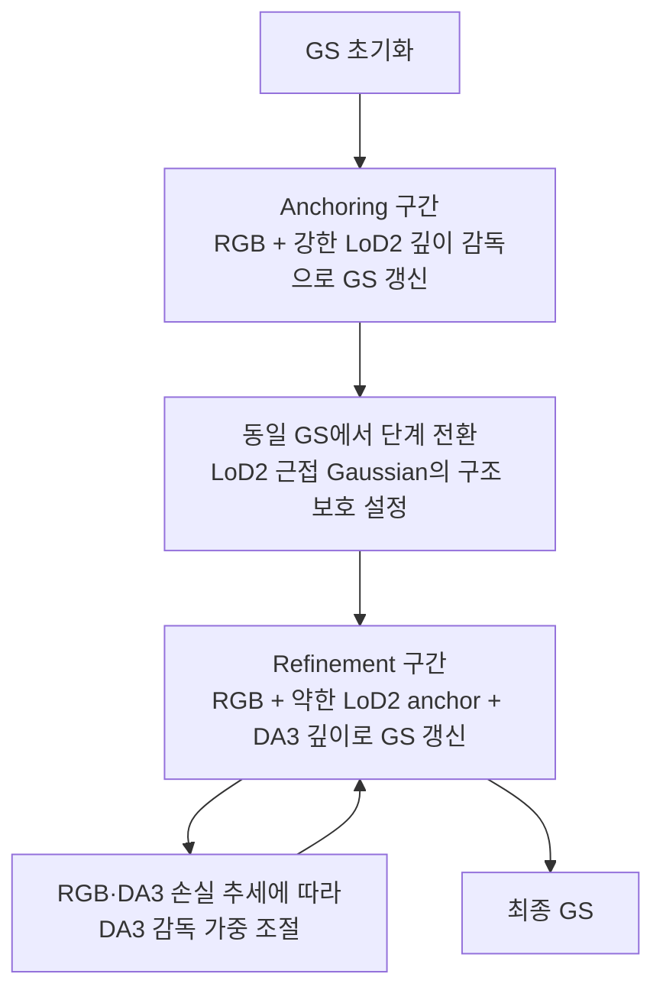
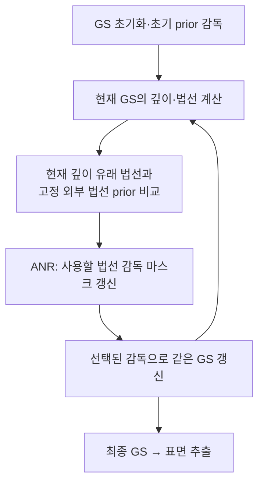
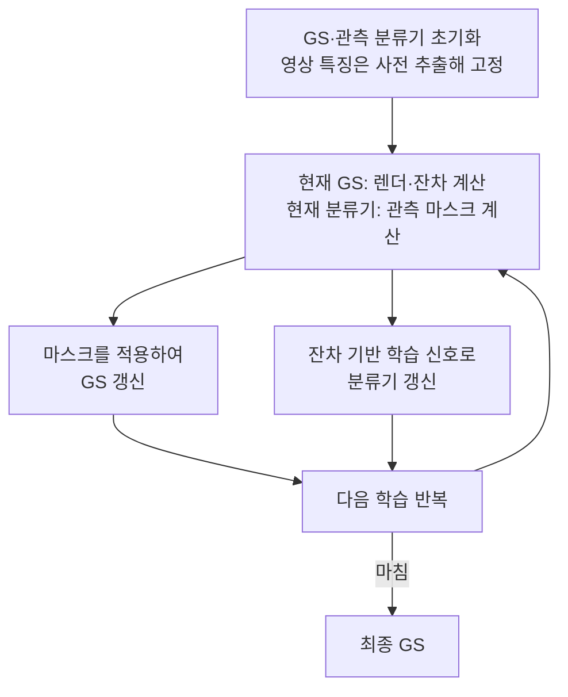

# GeoGS · AGS-Mesh · SpotLessSplats 흐름 비교

> 2026-09-08 · `LITERATURE CHECK / DESIGN DISCUSSION` · `scientific_verdict: null`
> 작업: `PHD-METHOD-FLOW-COMPARISON-v1`. 코드 읽기와 문서 정리만 수행했다.
> [앞선 구조 후보](05_METHOD_STRUCTURE_CANDIDATE_ko_v1.md)를 보존하며, 연구 계약·기존 코드·산출물·진행 중 실험을 변경하지 않는다.

## 1. coarse GS와 fine GS의 정확한 의미

**GeoGS는 하나의 GS 장면을 이어 최적화하면서 anchoring과 refinement의 감독·보호 설정을 바꾼다.** coarse에서 GS를 완성하고 fine에서 새 GS를 초기화해 다시 학습하는 구조가 아니다. 두 단계 모두 여러 번의 파라미터 갱신을 포함한다.

따라서 표현은 **‘하나의 GS 최적화: 구조 안정화 구간 → 세부 정제 구간’**이 가장 명확하다. `coarse GS / fine GS`는 이 두 구간의 설명용 이름으로 사용할 수 있지만, 서로 다른 모델이나 두 번의 독립 학습을 뜻하지 않는다. 동일 장면이라는 말도 Gaussian 개수·소속이 영구 고정된다는 뜻은 아니다. 학습 중 분할·복제·삭제 등이 가능하다.

공식 GeoGS `db40c95c657ec03ff21c83cb99cf39f4e90247a6`의 [train.py:681](https://github.com/zqlin0521/GeoGS/blob/db40c95c657ec03ff21c83cb99cf39f4e90247a6/train.py#L681)은 모델·Scene·optimizer를 설정하고, [775행의 단일 반복문](https://github.com/zqlin0521/GeoGS/blob/db40c95c657ec03ff21c83cb99cf39f4e90247a6/train.py#L775) 안에서 두 단계를 진행한다. [865행](https://github.com/zqlin0521/GeoGS/blob/db40c95c657ec03ff21c83cb99cf39f4e90247a6/train.py#L865) 부근은 손실 구성을, [1081행](https://github.com/zqlin0521/GeoGS/blob/db40c95c657ec03ff21c83cb99cf39f4e90247a6/train.py#L1081) 부근은 보호 설정을 바꾼다. 전환 시 모델 재초기화·checkpoint 재로딩·optimizer 전체 재설정은 없다.

아래 그림의 각 상자는 별도 학습 실행이 아니라 **연속 학습 안의 단계 또는 정보 흐름**이다. 반복 횟수·수치 문턱은 그림에서 생략했다. GeoGS의 stage 전환과 다른 방법들의 감독 갱신을 동일한 coarse/fine 알고리즘으로 간주하지 않는다.

## 2. GeoGS — 같은 GS에서 단계별 감독과 보호를 변경

고정된 LoD2 기하와 사전 계산한 깊이를 사용하며, refinement에서도 LoD2 anchor를 유지한다. 구조 보호는 기하 gradient 감쇠와 분할·복제·삭제 제한이며 완전한 기하 동결이 아니다. 기본 흐름에는 LoD2의 현재 사용 가능성을 재판단해 anchoring으로 돌아가는 경로가 없다. 적응 제어의 대상은 DA3 감독 강도다.

근거: [제공된 전문 §3.4](/home/innopam/.codex/attachments/74f36af2-99b5-411a-93e5-7fa2ce39fe8d/1-s2.0-S0924271626003588-main.pdf), [공식 손실·가중 제어](https://github.com/zqlin0521/GeoGS/blob/db40c95c657ec03ff21c83cb99cf39f4e90247a6/train.py#L873). 위는 공식 구현의 흐름 확인이며 P1/P2/P3의 실행 결과가 아니다.

## 3. AGS-Mesh — 같은 GS에서 사용할 prior 감독을 재검사

그림은 ANR의 반복 의존관계를 강조한다. 깊이 감독에는 별도로 **DNC 전처리 필터**가 있으며, 학습 일정에 따라 원 깊이 또는 필터링한 깊이를 사용한다. 초기 감독과 필터 적용 시점이 있다는 사실을 GeoGS와 동일한 두 단계 설계로 해석하지 않는다.

공식 코드에서 ANR은 sampled view마다 현재 GS의 `surf_depth → surf_normal`과 고정 `gt_normal`을 비교한다. 이 법선 감독 마스크는 누적 삭제가 아니므로, 이후 차이가 줄면 해당 감독이 다시 포함될 수 있다. GS 내부의 렌더 법선–깊이 유래 법선 일관성 항과 외부 prior 선택은 별개다. GS와 prior의 일치를 이용하는 이 갱신이 과거 ALS의 현재 사용 가능성을 독립적으로 검증하는 것은 아니다.

근거: [논문 §4.1–4.3](https://arxiv.org/html/2411.19271v1#S4), [공식 train.py:127](https://github.com/XuqianRen/AGS_Mesh/blob/93fda851a20cf0bd5fce642c46da0c83c637165e/train.py#L127). 원영상·센서 깊이·외부 법선은 고정 입력이며 GS 상태를 이어 최적화한다.

## 4. SpotLessSplats — GS와 관측 채택 판단을 함께 갱신

아래는 학습하는 분류기를 사용하는 **SLS-mlp**의 개념적 정보 흐름이다.

화살표는 반복 중 정보 의존성을 나타낸다. GS를 완전히 수렴시킨 뒤 분류기를 별도로 학습한다는 뜻은 아니다. 공식 프로젝트의 gsplat 재현에서는 현재 마스크로 GS 손실을 만들고, 현재 잔차에서 얻은 학습 신호로 분류기 손실을 만든 뒤 각 optimizer를 같은 iteration에서 갱신한다. 마스크를 통해 GS 손실이 분류기를 직접 바꾸는 경로는 분리한다. 초기에는 마스킹을 점진적으로 적용하여 잘못 제외한 관측의 학습 기회를 남긴다.

**SLS-agg**는 학습 분류기 대신 고정된 특징 cluster에 잔차 기반 판단을 집계하는 변형이다. 두 변형을 혼합한 하나의 구현으로 설명하지 않는다. 이 논문의 판단 대상은 영상의 방해물·유효 관측이며 과거 ALS 기하의 사용 권한이 아니다.

근거: [논문 §4.1.2·§4.2.1](https://arxiv.org/html/2406.20055v2#S4), [공식 프로젝트의 gsplat 재현 코드](https://github.com/lilygoli/SpotLessSplats/blob/0caae3cc45bb1fddf86bd47e4a521888f5c49889/examples/spotless_trainer.py#L605). 이 재현 구현과 원논문 결과의 구현 계보는 구분한다.

## 5. 비교에서 정리되는 설계 방향

| 방법 | 학습 중 다시 정하는 것 | GS 상태 |
|---|---|---|
| GeoGS | 단계별 감독·보호 설정, DA3 가중 | 같은 장면을 이어 최적화 |
| AGS-Mesh | 어떤 외부 법선 prior를 감독에 사용할지 | 같은 장면을 이어 최적화 |
| SpotLessSplats | 어떤 영상 관측을 GS 학습에 사용할지 | 같은 장면과 관측 판단을 함께 갱신 |

**설계 해석:** 세 방법 모두 ‘판단할 때마다 새 GS를 학습’하는 근거가 아니다. GeoGS는 단계별 구조 안정화·정제의 근거를, AGS-Mesh와 SpotLessSplats는 복원 상태와 감독·관측 판단을 반복 연결하는 근거를 제공한다. 이들을 조합했다는 사실만으로 새로운 효과가 입증되는 것은 아니다.

JointBuildGS 후보는 **‘현재 GS 상태와 보존된 소스 후보 → 원관측 근거로 소스 사용 재판단 → 제약·필요한 기하 갱신 → 같은 GS 최적화 지속’**으로 읽는다. 소스 판단은 사용할 기하·범위를 정하고, 이후 필요한 기하 변화가 큰지에 따라 구조 안정화 또는 세부 정제의 갱신 범위를 정한다. 판단 자체가 ‘fine 가중치를 올려라’를 출력한다고 정하지 않는다. 소스 판단이 유지되면 GS의 계속/종료는 별도의 복원 진행 기준에 따른다.

아직 미결인 것은 과거 ALS의 사용 중단·재채택을 정당화할 증거, 기존 구조에서 새 구조로 가는 경로, 유효한 이웃 구조의 보존이다. 현재 GS 하나의 잔차만으로 이를 충족했다고 보지 않으며 배제 후보를 재검사할 경로를 보존한다. 전체 재초기화가 필요하다고 가정하지 않지만, 같은 장면을 유지하는 것만으로 소실된 대체 표면의 회복이 보장되지도 않는다.

이번 작업에서는 이 비교 문서만 추가했다. 새 학습·실험·렌더·표면 추출은 실행하지 않았으며 기존 기록과 E1–E6/C 계보를 유지한다. `scientific_verdict: null`.
