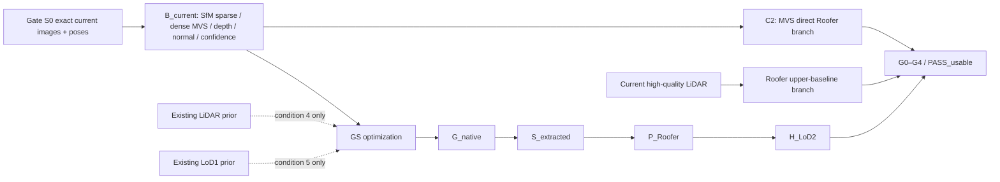

# JointBuildGS 연구 헌장

- Document status: `USER_APPROVED_RESEARCH_CANON`
- 문서 버전: `C1C5_CANON_v2`
- 프로그램 workstream: `P2 — pre-result Gate S0 freeze drafting`
- 저장소 유효 단계: `C1–C5 PROGRAM / GATE S0 FREEZE DRAFT / PERFORMANCE BLOCKED`
- 작성일: 2026-07-31
- 승인 상태: `USER APPROVED AS CURRENT RESEARCH CANON — 2026-07-31`
- 효력: **현재 C1–C5 연구·실행 정본**. `docs/evidence/archive/pre_c1c5_research/`의
  기존 4조건 context/plan은 역사 기록이며 새 작업의 실행
  authority가 아니다. 기존 Fusion W1 artifact와 lock은 보호·보존하지만 현재
  C1–C5 프로그램을 지시하지 않는다.

관련 계약: [Master Roadmap](01_MASTER_ROADMAP.md) ·
[Data and Baseline Scope](03_DATA_AND_BASELINE_SCOPE.md) ·
[Result and Acceptance Contract](04_RESULT_AND_ACCEPTANCE_CONTRACT_v0.md) ·
[Handoff Protocol](05_HANDOFF_PROTOCOL.md)

## 0. 연구 앵커

> 불완전하지만 재사용 가능한 기구축 3D 자산의 구조적 안정성과 최신 항공영상의
> 현재성 및 세부 관측을 상보적으로 결합하여, 자동 LoD2 생성이 가능한 건물의
> 범위를 확대한다.

이 문서에서 “확대”는 평균 렌더링 품질의 향상이 아니라, 동일한 평가계약 아래
`C3` no-external-prior GS 대비 `PASS_usable`로 전환되는 건물의 순증가로 판정한다.

각 prior arm `m ∈ {C4, C5}`의 primary estimand는 같은 eligible paired set에서
`ΔN_pass(m) = N_pass(m) − N_pass(C3) = N_fail→pass(m) − N_pass→fail(m)`이다.
두 방향 transition은 반드시 함께 보고한다. C4-vs-C3와 C5-vs-C3는 미리 지정된
두 primary contrasts이며 multiplicity/uncertainty 보고 방식은 P2에서 동결한다.

## 1. 상태와 적용 경계

이 문서는 사용자가 채택한 C1–C5 연구 프로그램의 현재 계약이다. 연구 목적, 다섯
reconstruction conditions, 주요 endpoint와 P1–P4 관계를 실행 기준으로 동결한다.
완료된 P1 감사와 Gate S0 preparation v1은 이 프로그램의 입력 증거다. Gate S0
evidence의 제안 상태는 `BLOCKED_FOR_GATE_S0_REVIEW`, scientific verdict는 null이며
human Gate decision은 pending이다. Remediation R1은 technical closed됐고 다음 작업은
첫 baseline 결과 전 Gate S0 freeze evidence를 완결하는 것이다.
기존 P2/Fusion W1은 삭제·재해석하지 않고 보호된 역사적 capability evidence로 유지한다.

| 항목 | 현재 유효 근거 | 이 초안 | 상태 |
|---|---|---|---|
| 현재 프로그램 | C1–C5 v2 정본 채택, Gate S0 remediation R1 technical closed | P2 pre-result Gate S0 freeze draft | `FROZEN; PERFORMANCE BLOCKED` |
| 기존 Fusion W1 | 기존 lock·artifact·결과 보존 | 새 프로그램 authority 아님; 실행·수정 금지 | `PROTECTED HISTORICAL` |
| Stage 3 roofprint | `AGENTS.md`와 이 charter: 외부 roofprint 없는 read-out | `R_derived`만 primary; `R_ext`는 비실행 후속안 | `FROZEN` |
| 핵심 비교 | 기존 4조건 손실 ablation 및 Stage 3 E0–E4는 역사 증거 | 다섯 evidence configurations | `FROZEN` |
| 주 데이터 | 기존 데이터·결과는 capability/lineage 증거 | TUM2TWIN 중심 C1–C5 | `FROZEN; INPUTS TO VERIFY` |

이 파일의 `FROZEN`은 새 C1–C5 작업이 임의 변경하지 못하는 연구 기준을 뜻한다.
기존 P2/Fusion W1의 완료 artifact를 변경하거나 그 결과를 새 실험 결과로 재라벨했다는
뜻은 아니다.

## 2. 연구 배경과 문제 정의

항공영상 기반 MVS 또는 GS가 만든 geometry는 point density와 coverage가 충분해도
다음 구조 요소에서 불안정할 수 있다.

- 지붕 평면의 위치·방향과 surface normal 일관성
- eave, ridge, hip, roof boundary
- 지붕면 사이의 높이 관계와 adjacency
- roof와 ground 분리
- roof-plane fragmentation, oversegmentation, undersegmentation
- roof topology와 building 외부 floaters
- 실제 Roofer 입력으로서의 적합성

사진측량 point cloud에서 한 평면이 잡음 때문에 여러 부분으로 분할되고 roof topology
해석이 어려워질 수 있다는 문제는 선행연구에서도 보고되었다
([Xiong et al., 2014](https://doi.org/10.5194/isprsannals-II-3-197-2014)).
다만 그 사실이 JointBuildGS의 대상 데이터에서도 같은 크기와 원인으로 재현된다는
결론은 아니다. 본 연구는 density/coverage와 구조적 surface evidence를 분리 측정한다.

`dense_baseline_qualitative_v5.pdf`는 문제 제기용 pilot evidence 후보이다. 2026-07-31
tracked-file 빠른 검색에서는 PDF 자체를 찾지 못했다. 외부 artifact manifest, 생성
script/config 및 정확한 payload는 Gate S0 evidence에서 확인하며, 그 전에는 내용을 통계적
결론이나 재현된 사실로 사용하지 않는다. 상태는 `TO VERIFY`이다.

## 3. 연구 목적

본 연구의 목적은 다음 세 질문을 하나의 paired building-level 실험으로 연결하는 것이다.

1. current-image MVS와 no-external-prior GS가 어디에서 구조 evidence를 잃는가?
2. Existing ALS와 existing LoD1이라는 서로 다른 coarse prior가 그 실패를 각각
   회복할 수 있는가?
3. 회복이 `G_native → S_extracted → P_Roofer → H_LoD2`를 따라 전파되어 실제로
   usable LoD2.2 건물 집합을 넓히는가?

## 4. 핵심 인과 구조

LiDAR prior와 LoD1 prior는 동시에 투입하지 않는다. `L_upper`는 실험적 상한
기준선이지 이론적 상한이나 평가 ground truth가 아니다. prior 입력과 evaluation
reference는 계보와 시점까지 분리한다.

## 5. 연구질문

### RQ1 — MVS 실패의 구조적 원인

Current-image MVS의 LoD2 생성 실패는 point density/coverage 부족만으로 설명되는가,
아니면 plane, normal, boundary, height, topology의 structural inconsistency가
추가 설명력을 갖는가?

### RQ2 — No-external-prior GS의 gap 축소

No-external-prior GS는 MVS와 current high-quality LiDAR 사이의 building-level
`PASS_usable` gap을 얼마나 줄이며, 어느 실패 gate를 해결하지 못하는가?

### RQ3 — 두 prior의 상보성

Existing LiDAR prior와 LoD1 prior는 영상 기반 GS의 서로 다른 구조적 실패를
회복하는가?

여기서 “상보성”은 LiDAR와 LoD1을 한 arm에 동시에 넣는 joint-fusion synergy가
아니다. C4와 C5의 rescue-set overlap/discordance와 failure-mode별 회복 차이를 뜻한다.
두 prior의 interaction을 주장하려면 현재 다섯 조건 밖의 별도 결합 arm과 승인이 필요하다.

### RQ4 — downstream 전파

Prior-guided GS의 개선이 rendering metric에 머무르지 않고 `S_extracted`,
`P_Roofer`, 최종 LoD2.2의 validity, roof structure fidelity, geometric
accuracy로 전파되는가?

### RQ5 — 생성 가능 영역의 순변화

각 prior condition은 no-external-prior GS 대비 fail-to-pass 건물을 몇 개 만들고,
pass-to-fail 악화를 몇 개 만들며, usable PASS 건물 집합을 순증가시키는가?

### RQ6 — image–prior conflict

기구축 prior와 최신 영상이 충돌할 때 prior에 끌려가기보다 최신 영상 evidence를
보존하는가? 실제 T0–T1 변화와 시점 차이가 확인될 때만 temporal currentness
연구질문으로 유지한다.

## 6. 가설

가설은 문헌 사실이 아니라 향후 검증할 `PROPOSED HYPOTHESIS`이다.

- **H1:** density와 coverage를 통제해도 structural evidence 지표는 Roofer 실패와
  `PASS_usable`을 추가로 설명한다.
- **H2:** No-external-prior GS는 MVS보다 usable PASS를 늘리지만 `L_upper`와의 gap을
  완전히 닫지 못한다.
- **H3a:** Existing LiDAR prior는 절대 높이, 국소 위치, normal/plane 안정성과
  관련된 실패에 상대적으로 강하다.
- **H3b:** LoD1 prior는 building extent, height envelope, vertical wall 및
  building/non-building 분리 실패에 상대적으로 강하며 실제 roof slope나 topology를
  제공하지 않는다.
- **H4:** prior의 효과가 유효하다면 G-native 지표뿐 아니라 downstream gate와
  fail-to-pass 전이에도 같은 방향으로 나타난다.
- **H5:** 각 prior arm은 no-external-prior GS 대비 양의 net transition
  (`fail-to-pass − pass-to-fail`)을 보인다. 값의 크기와 허용 가능한 회귀율은
  `DEFERRED`이다.
- **H6:** 실제 변화 사례가 확인되면 conflict-aware prior weighting은 바뀐 영역에서
  current-image evidence를 보존한다. 변화 사례가 부족하면 이 가설은 misregistration
  또는 synthetic conflict robustness로 축소한다.

## 7. 다섯 reconstruction conditions

| ID | Reconstruction condition | 학습 여부 | 핵심 역할 |
|---|---|---:|---|
| `C1_L_upper` | Current high-quality LiDAR → Roofer | 아니오 | 동일 Roofer 조건에서 고품질 sensor evidence의 실험적 상한 |
| `C2_MVS` | Gate S0 common current-image/pose base에서 파생한 MVS → Roofer | 아니오 | image-derived geometry를 GS 없이 직접 사용하는 사진측량 baseline |
| `C3_GS_image` | 같은 image-derived common base → no-external-prior GS → surface extraction → Roofer | 예 | 외부 기구축 prior 없는 GS 기준선 |
| `C4_GS_lidar_prior` | C3 common base + Existing ALS prior → GS → extraction → Roofer | 예 | 불완전 ALS 자산 활용 |
| `C5_GS_lod1_prior` | C3 common base + independent existing LoD1 prior → GS → extraction → Roofer | 예 | coarse building envelope 활용 |

이를 “five learning experiments”라고 부르지 않는다. `C1`과 `C2`는 baseline branches이며,
전체는 “five reconstruction conditions” 또는 “five evidence configurations”이다.
`C3_GS_image` ID는 기존 계보와 결과 schema의 연속성을 위해 유지하지만, canonical
condition name은 **no-external-prior GS**이다. 이는 RGB-only나 SfM-sparse-only를
뜻하지 않는다. `C5`는 common base + **LoD1-prior** GS이며 LoD2-prior GS가 아니다.
DSM과 두 external prior의 동시 결합은 본 비교에서 제외한다.

### 7.1 왜 LiDAR가 두 개인가

두 자산은 같은 LiDAR를 중복 비교하는 것이 아니라, 취득 시점과 연구 역할이 다른
두 evidence regime이다.

| Canonical name | 의미 | 연구 역할 | 사용하지 않는 역할 |
|---|---|---|---|
| **Current UAS/Drone LiDAR** (`LIDAR_UAS_CURRENT`) | target image campaign과 시간적으로 가까운 고품질 drone-borne laser 후보 | `C1_L_upper`의 Roofer 직접입력, geometry reference 후보 | C4의 existing prior가 아님 |
| **Existing ALS** (`ALS_EXISTING`) | 이미 보유한 regional airborne laser-scanning 자산; 과거·저밀도·불완전 가능 | `P_LiDAR`로서 `C4_GS_lidar_prior`의 initialization/regularization 후보 | `L_upper` 또는 독립 ground truth가 아님 |

`Current UAS/Drone LiDAR`와 `Existing ALS`가 실제로 다른 취득 시점·밀도·coverage·품질
regime인지 Gate S0 evidence에서 입증해야 한다. 구분이 입증되지 않으면 C1/C4의 과학적 contrast는
성립하지 않으며 `TO VERIFY` 또는 설계 변경 대상으로 남긴다.

## 8. 데이터 역할 계약

### 8.1 `L_upper`

- current high-quality UAS/Drone LiDAR를 우선 후보로 검토한다.
- 선택된 roofprint protocol·Roofer adapter에서 센서 evidence가 도달하는 실험적 상한이다.
- 이론적 상한, 완전한 ground truth 또는 final reference가 아니다.
- TUM2TWIN UAS laser scanning의 실제 시점·정확도·coverage와 로컬 파일은 `TO VERIFY`.

### 8.2 Current-image MVS

- 최신 항공영상에서 전통 사진측량으로 얻은 dense geometry이다.
- LiDAR 상한과의 gap을 정의하는 핵심 baseline이다.
- TUM2TWIN에는 UAS 영상과 Pix4Dmatic photogrammetric point cloud가 공식적으로
  기술되어 있으나, 본 저장소의 입력과 재생성 가능성은 `TO VERIFY`.

### 8.3 No-external-prior GS와 common image-derived base

- Gate S0에서 exact current image member와 camera/pose ID를 `B_current`로 동결한다.
- `B_current`만으로 파생한 SfM sparse, dense MVS, depth, normal, confidence는
  C3–C5가 공유하는 image-derived geometry/support로 허용한다. 각 component의
  producer/version, code/config, source-member IDs, coordinate frame, role, bytes와
  hash를 동결하고 세 GS arm에 동일하게 적용한다.
- 이 공통 support는 current images에서 파생한 것이므로 external prior가 아니다.
  Current UAS LiDAR, Existing ALS, LoD1, evaluation reference, scored LoD2와 외부
  roofprint는 `B_current`에 포함하지 않는다.
- C3는 `B_current`의 image-derived geometry를 GS representation 안에서 재최적화한 뒤
  surface extraction과 Roofer를 거친다. C4와 C5는 동일한 C3 base에 각각 Existing
  ALS 하나 또는 독립 LoD1 하나만 추가한다.
- C2는 Gate S0에서 동결한 같은 image/pose base의 MVS geometry를 GS 재최적화 없이
  Roofer branch로 직접 전달한다. 따라서 C2–C3 contrast는 direct MVS와 GS-reoptimized
  image-derived geometry의 차이다.
- 기존 1,104-image vendor MVS는 exact image/pose member·hash·derivation이
  `B_current`와 일치한다고 입증되기 전에는 공통 base나 primary C2로 자동 채택하지
  않는다. 필요하면 별도 sensor-processing-bundle context baseline으로만 보존한다.
- prior-guided arm을 보기 전에 공통 base의 생성·GS·추출·평가 안정성을 확정한다.

### 8.4 `P_LiDAR`

- 기본 후보는 existing ALS이며, 과거 시점, 낮은 밀도, 부분 coverage 등 불완전성을
  가질 수 있는 재사용 자산이다.
- 절대 높이, 국소 surface position, normal 또는 plane evidence를 제공할 수 있다.
- Current UAS/Drone LiDAR인 `L_upper`와 동일한 파일·시점이라고 가정하지 않는다.
- TUM2TWIN real ALS의 시점과 UAS와의 관계는 `TO VERIFY`.

### 8.5 `P_LoD1`

- footprint/building extent, 대략적 height envelope, vertical wall structure,
  building/non-building 공간 범위만 제공하는 coarse prior이다.
- 실제 roof slope, ridge, hip, roof-plane 수·adjacency·topology는 제공하지 않는다.
- top plane을 실제 roof surface 정답으로 취급하지 않는다.
- TUM2TWIN 공식 페이지에서 직접 배포되는 LoD1을 이번 조사로 확인하지 못했다.
  실제 LoD1 파일과 생성 계보는 `TO VERIFY`. Evaluation LoD2를 단순화해 만든
  LoD1/height envelope는 LoD2 Z를 사용하므로 현행 GT-separation 정책상 primary
  honest arm에 사용할 수 없다.
- `DEC-P1-011`에 따라 LoD2를 footprint와 단일 높이 envelope로 단순화한 LoD1은
  **reference-derived diagnostic**으로 생성·검사할 수 있다. 같은 LoD2로 평가하면
  `C5` primary estimand나 `E_paired` eligibility에 사용하지 않고 자기참조 진단으로
  별도 보고한다. 독립 reference로 평가할 수 있을 때만 primary C5 후보 승격을 다시
  검토한다.

### 8.6 Evaluation reference

- positional geometry reference와 roof-structure reference는 다를 수 있다.
- current UAS LiDAR는 geometry reference 후보, 검수된 LoD2/LoD3 roof surfaces는
  structure reference 후보이다.
- prior, roofprint, reference 사이의 공유 정보와 시점 정합을 문서화한다.
- LoD2 Z, RoofSurface, roof type, semantic class 또는 final roof model을 honest-arm
  입력으로 전달하지 않는다. 기존 승인잠금의 `GroundSurface` XY 예외는 지정된
  C001/E5 범위를 넘어 일반화하지 않는다.

### 8.7 Common roofprint

모든 condition에는 evaluation reference와 독립적인 `R_derived` protocol을
적용한다. 동일 derivation algorithm/parameter를 사용하되 실제 polygon은 각
method evidence에서 생성하고 method별 polygon/hash를 보존한다. 이는
`AGENTS.md`의 “외부 roofprint 없는 Stage 3”를 유지한다.

공통 external roofprint인 `R_ext`는 P1 audit과 후속 P2–P4 실행 범위 밖의
비실행 대안이다. Root agent policy에 대한 별도 명시적 사용자 승인과 정본 변경
없이는 입력, crop, reconstruction 또는 primary evaluation에 사용할 수 없다.

### 8.8 Core terminology

- **Current:** target current-image campaign을 가리키는 역할명이다. 실제 acquisition
  date가 검증되기 전에는 시간적으로 최신임을 주장하는 사실 label이 아니다.
- **LoD2.2:** Roofer가 사용하는 refined LoD output label이며 serialization
  version이나 CityGML version을 뜻하지 않는다. 실제 output은 Roofer version과
  CityJSONSeq/CityJSON serialization을 따로 기록한다
  ([Roofer official docs](https://innovation.3dbag.nl/roofer/)).
- **Roofer manufacturability:** 사전 동결된 roofprint protocol/terrain/adapter/Roofer/criterion
  계약에서 surface evidence가 `PASS_usable` LoD2.2로 변환될 수 있는 성질이다.
  보기 좋은 mesh 또는 process exit 0만을 뜻하지 않는다.
- **PASS_usable:** [Result and Acceptance Contract](04_RESULT_AND_ACCEPTANCE_CONTRACT_v0.md)의
  G0–G4를 모두 만족한 building-level verdict이다.
- **Held-out building/test:** 방법·loss·threshold·대표사례 규칙을 만드는 동안 접근하지
  않고 별도 보관한 building group이다. P4에서 동결된 C1–C5를 이 test group의 모든
  건물에 적용한다. “P4 전체 실험”은 전체 후보 모집단이 아니라 **held-out test set
  전체 × C1–C5**를 뜻한다.
- **Held-out view:** 같은 development/validation building 안에서 GS 학습에 사용하지
  않은 camera image이다. rendering fidelity 진단용이며 held-out building과 다르다.
  P2/P3에서도 사용할 수 있다.
- **Target building universe (`U_target`):** 선택 AOI에서 current imagery와 stable
  building ID를 가진 사전 결과 독립적 모집단이다.
- **Paired eligible universe (`E_paired`):** `U_target` 중 C1–C5를 모두 시도할 수
  있고 reference scoring과 coordinate 검증이 가능한 건물 집합이다. 포함·제외는
  method outcome을 보기 전에 정하며, 제외 사유와 `U_target` 대비 coverage를 보고한다.
- **Exhaustive partition:** 계산 가능하면 `E_paired` 전체를 development, validation,
  held-out으로 분할한다. P2/P3는 앞의 두 split, P4는 남겨 둔 held-out split을
  담당하므로 P4 종료 시 세 phase 결과의 합집합은 `E_paired` 전 건물 × C1–C5가 된다.
- **Sampled fallback:** 전수실험이 불가능할 때만 P2에서 비-GT metadata 기반
  stratified spatial group sample과 표본 수 근거를 사용자 승인으로 동결한다. 이
  경우 P4 primary는 동결 표본에만 일반화된다. “`E_paired` 전체로 확장”을
  주장하려면 primary 잠금 뒤 별도 all-eligible census coverage run을 완료해야
  하며, 그 결과로 primary held-out 결론이나 threshold를 바꿀 수 없다.

## 9. 예상 기여

아래는 `PROPOSED CONTRIBUTION`이며 선행연구 검토와 실험 전에는 신규성 주장으로
사용하지 않는다.

1. No-external-prior GS, Existing ALS-prior GS, LoD1-prior GS를 같은 building-level
   Roofer/LoD2 계약에서 비교한다.
2. GS-native부터 LoD2까지 failure location을 단계별로 분리한다.
3. 평균 geometry/rendering metric뿐 아니라 usable PASS의 fail-to-pass와
   pass-to-fail 전이를 primary endpoint로 제시한다.
4. detailed LoD2 roof prior가 아닌 coarse LoD1 envelope의 가치와 한계를 분리한다.
5. current high-quality LiDAR와 existing/incomplete LiDAR의 역할을 분리한다.

## 10. 비목표

- P1에서 학습 코드, loss 식, loss weight, schedule을 구현·결정하지 않는다.
- DSM 또는 LiDAR+LoD1 동시 prior를 핵심 arm으로 만들지 않는다.
- 렌더링 지표만으로 LoD2 성공을 주장하지 않는다.
- `L_upper`를 ground truth로 부르지 않는다.
- 실제 직렬화를 확인하기 전에 결과를 모두 “CityGML 파일”이라고 부르지 않는다.
- pilot PDF를 전체 모집단 결론으로 확장하지 않는다.
- P4 held-out-building 결과를 본 뒤 threshold, 대표 건물 선택 규칙, 방법을 변경하지 않는다.

## 11. 주장 가능한 범위

안전한 기본 출력 명칭은 “Roofer-generated LoD2.2 semantic building model”이다.
다음 조건을 모두 충족한 뒤에만 “자동 LoD2 생성 가능 영역이 확대되었다”고 주장한다.

- 동일 eligible building set과 사전 동결한 adapter/roofprint protocol
- 사전 동결한 criterion version
- no-external-prior GS 대비 usable PASS 순증가
- fail-to-pass와 pass-to-fail 동시 보고
- geometry와 structure reference의 명시
- method별 결측과 fallback의 공개

Temporal currentness는 실제 acquisition date와 change cases가 확인될 때만 주장한다.
그렇지 않으면 coarse-prior 보완, structural incompleteness, registration/conflict
robustness로 표현을 제한한다.

## 12. 동결 항목

다음은 `DEC-P1-008`과 `DEC-P1-010`의 사용자 채택으로 연구 규칙이 `FROZEN`이다.
여기서 common-base **규칙**이 frozen이라는 말은 exact `B_current` member와 payload가
이미 정해졌다는 뜻이 아니다. 그 IDs/hashes는 Gate S0 human freeze 전까지 `BLOCKED`다.

- 연구 앵커와 목적
- TUM2TWIN 사용
- 다섯 reconstruction conditions와 각 데이터 역할
- exact common image/pose base를 Gate S0에서 동결해야 한다는 규칙과 C3–C5에 허용된
  공통 image-derived component family
- C2 direct MVS와 C3 GS-reoptimized image-derived geometry의 구분
- Current UAS/Drone LiDAR `L_upper`와 Existing ALS `P_LiDAR`의 분리 및 비교 감사
- LiDAR prior와 LoD1 prior의 분리
- `C5`가 LoD1 prior이며 LoD2 roof prior가 아니라는 점
- 개별 건물 paired comparison
- `G_native → S_extracted → P_Roofer → H_LoD2` chain
- Sheet A–D와 building × method 결과 구조
- G0–G4와 `PASS_usable`
- usable PASS, fail-to-pass, pass-to-fail primary endpoint
- P1–P4 순서와 사용자 phase gate
- Work/Codex가 목적·비교군·reference·threshold를 임의 변경하지 못한다는 원칙

## 13. 의도적으로 연기한 항목

- G3/G4 numerical threshold와 final criterion version: `DEFERRED TO P2`
- final surface adapter: `DEFERRED TO P2`
- LiDAR-prior/LoD1-prior loss equation과 weights: `DEFERRED TO P3`
- confidence equation/threshold와 training schedule: `DEFERRED TO P3 PILOT`
- 대표 building ID: `DEFERRED TO P4`
- `U_target`/`E_paired` exact manifest, 전수/표본 mode, split IDs: `P1 AUDIT → P2 PRE-RESULT FREEZE`
- temporal currentness 최종 주장: `DEFERRED UNTIL DATA/CHANGE AUDIT`

## 14. Open questions

1. TUM2TWIN에 연구계약을 만족하는 독립 LoD1 prior가 실제로 존재하는가?
2. UAS LiDAR, UAS images/MVS, real ALS, LoD 모델의 정확한 취득 시점과 currentness는?
3. geometry reference와 structure reference의 독립성을 어떻게 확보하는가?
4. common building ID와 공통 eligible set을 어떤 계보로 만드는가?
5. `dense_baseline_qualitative_v5.pdf`의 canonical payload, script, config는 어디인가?
6. 기존 결과와 새 다섯 조건을 재사용·격리하는 연구 lineage는 무엇인가?

## 15. Consistency review

- **Resolved by DEC-P1-008:** 00–06이 현재 C1–C5 정본이며
  `docs/evidence/archive/pre_c1c5_research/`의 기존 context/plan은 역사 기록이다.
- **Resolved by DEC-P1-008:** 기존 P2/Fusion W1은 보호된 capability evidence이며
  현재 실행 authority가 아니다.
- **Resolved for P1:** 외부 roofprint는 범위 밖이며 `R_derived`만 primary다.
- **Major:** bootstrap의 논리적 `results/metrics/...` 경로는 현재 top-level directory
  contract와 맞지 않는다. 외부 artifact root 및 `docs/` promoted summary로 매핑해야 한다.
- **TO VERIFY:** pilot PDF는 tracked 파일로 확인되지 않았다.

남은 `MAJOR`/`TO VERIFY` 항목은 Gate S0 evidence와 후속 phase가 판정하며 기존 Fusion
artifact나 lock을 변경하지 않는다.
