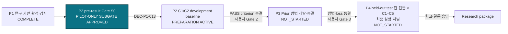
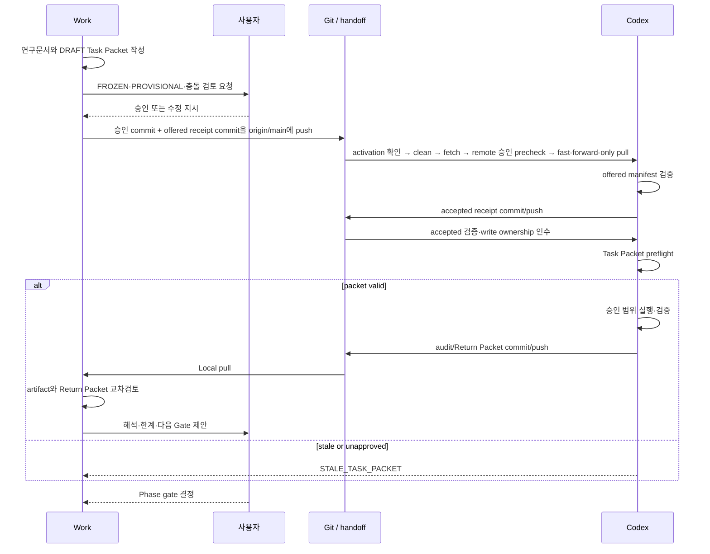

# JointBuildGS Master Roadmap

- 문서 버전: `C1C5_CANON_v2`
- 작성일: 2026-07-31
- 현재 workstream: `P2 C1/C2 DEVELOPMENT FEASIBILITY PILOT ACTIVATION`
- 저장소 유효 상태: `C1/C2 DEVELOPMENT PILOT SUBGATE APPROVED / CONFIRMATORY PERFORMANCE BLOCKED`
- 승인 상태: `USER APPROVED AS CURRENT RESEARCH CANON — 2026-07-31`
- 역할: C1–C5 프로그램의 phase, split, gate와 실행 순서를 통제하는 roadmap

> Research anchor: 불완전하지만 재사용 가능한 기구축 3D 자산과 최신 항공영상을
> 상보적으로 결합하여 자동 LoD2 생성이 가능한 건물 범위를 확대한다.

## 상태 패널

```text
[✓] P1 연구 기반 확정·감사       — COMPLETE / READY_FOR_REVIEW evidence received
[✓] S0 입력·AOI·split 기술동결 증거 — PILOT-ONLY SCOPE / CONFIRMATORY BLOCKED
[●] P2 C1/C2 development pilot   — EXACT IMPLEMENTATION APPROVED / OFFER PENDING
[ ] P3 Prior 방법 개발·동결       — NOT_STARTED
[ ] P4 최종 실험·저널 작성        — NOT_STARTED
```

Current task: `P2-C1-C2-FEASIBILITY-PILOT-v1 APPROVED_FOR_EXECUTION / SOURCE@d5265d9a / OFFER PENDING`

Next: direct-child offered/accepted handoff → development 51-building C1/C2 execution → C3 strategy
DRAFT. Validation 11 and held-out 10 remain unopened.

Gate S0는 P2의 **entry substate**다. `DEC-P1-013`은 전체 Gate 또는 confirmatory
performance를 승인한 것이 아니라 exact development split의 C1/C2 feasibility만
승인했다. C3--C5, validation, held-out과 final acceptance verdict는 계속 차단된다.

> **중요:** 위 패널이 현재 C1–C5 프로그램의 유효 흐름이다. 기존
> `phases/p2-gsjso`/Fusion W1은 보호된 역사적 capability evidence이며 새 프로그램의
> 실행 정본이 아니다. 파일·결과·lock은 명시적 legacy task 없이는 수정·실행하지 않는다.
> P1 v1 handoff는 technical `BLOCKED`로 보존하고, P1 R2 감사 결과는 Gate S0의 입력
> 증거로만 사용한다.

## P1–P4 전체 흐름



P2의 평가 criterion은 prior-guided held-out-building 결과를 보기 전에 동결한다.
P3의 최종 방법과 loss는 P4 held-out-building 실행 전에 동결한다.

여기서 held-out은 방법·threshold 개발 중 보지 않은 **건물 test group**이다.
“P4 전체 실험”은 전체 후보 건물이 아니라, held-out test에 배정된 모든 건물에
동결된 C1–C5 전체 condition matrix를 실행한다는 뜻이다. 같은 건물에서 학습에 쓰지
않은 camera view를 뜻하는 held-out view와 구분한다.

## Work–Codex–사용자 왕복 흐름



OpenAI 공식 설명은 Codex app이 task별 thread/worktree와 변경 검토를 지원한다고
설명한다. 이 저장소의 Task Packet 상태기계, two-host manifest, 과학적 승인권은
OpenAI 제품 기능이 아니라 본 프로젝트가 제안한 별도 governance이다
([OpenAI, Codex app](https://openai.com/index/introducing-the-codex-app/)).

## Evidence-to-acceptance chain

정식 artifact, Sheet A–D, table schema와 G0–G4 정의는
[Result and Acceptance Contract](04_RESULT_AND_ACCEPTANCE_CONTRACT_v0.md)를 따른다.

```mermaid
flowchart LR
    GN["G_native<br/>Gaussian/surfel"] --> SX["S_extracted<br/>surface/mesh"]
    SX --> PR["P_Roofer<br/>exact classified point set"]
    PR --> HL["H_LoD2<br/>Roofer LoD2.2"]
    HL --> G0["G0 generated"]
    G0 --> G1["G1 schema/semantic"]
    G1 --> G2["G2 geometry/topology"]
    G2 --> G3["G3 roof structure"]
    G3 --> G4["G4 geometric accuracy"]
    G4 --> PASS["PASS_usable"]
```



| 최초 실패 위치 | 기본 귀속 | 후속 진단 |
|---|---|---|
| `G_native` | GS training/regularization | native primitive와 fixed-view diagnostics |
| `S_extracted` | surface extraction | direct fusion vs TSDF, hole/ridge/boundary |
| `P_Roofer` | adapter | filtering, sampling, class 2/6, density, crop/buffer |
| `H_LoD2` | Roofer/roofprint/terrain/parameter | process, semantic shell, topology |
| `G0–G4` | acceptance dimension | criterion version과 reference audit |

## Phase 계약

| Phase | 목적 | Entry criteria | Work 산출물 | Codex 산출물 | Exit gate | 상태 |
|---|---|---|---|---|---|---|
| P1 | 무엇을 연구하고 현재 repo/data가 지원하는지 확정 | bootstrap 요청, 현행 정본 확인 | charter, roadmap, novelty, data/result/handoff contracts, audit packet | read-only audit 9종, Return Packet | C1–C5 정본 전환과 audit integration | `COMPLETE` |
| P2 | Gate S0 뒤 LiDAR/MVS/no-external-prior GS 기준선과 acceptance 동결 | `DEC-P1-013`이 exact development 51동의 C1/C2 feasibility만 승인; confirmatory Gate blocked | bounded C1/C2 protocol, 후속 C3 strategy와 threshold 결정안 | 먼저 development C1/C2, 다음 별도 승인된 C3, 이후 validation의 protocol-matched C1–C3 | held-out building 결과 전 criterion 동결 | `C1/C2 DEVELOPMENT PILOT PREPARATION / OTHER PERFORMANCE BLOCKED` |
| P3 | 관찰된 실패에 맞춘 두 prior 방법 개발·동결 | P2 criterion 동결 | loss/method 설계와 ablation 계약 | pilot+validation의 frozen C3 control 및 C4/C5 구현·ablation, Return Packet | held-out building 접근 전 사용자 최종 방법·schedule 동결 | `NOT_STARTED` |
| P4 | held-out test 전 건물 × C1–C5 최종 실험과 원고 | P3 method freeze, data/reference/split freeze | 결과 해석, manuscript | held-out 전 건물 runs, metrics, case sheets, receipts | 사용자 결론·원고 승인 | `NOT_STARTED` |

### Phase별 building 접근 범위

| Phase | 접근 가능한 building | 허용 목적 | held-out building |
|---|---|---|---|
| P1 | manifest와 파일 목록만 감사 | 가용성·계보·split 가능성 확인 | 결과 접근·실행 금지 |
| P2 | spatial pilot + validation | C1–C3 baseline, adapter, threshold/criterion 동결 | 접근 금지 |
| P3 | spatial pilot + validation | C3는 동결 control로만 재실행/재사용; C4/C5 개발·ablation·schedule 동결 | 접근 금지 |
| P4 primary | held-out test의 모든 building | 동결된 C1–C5 최종 비교 | 최초 접근 |
| P4 supplementary, sampled fallback일 때 선택 | 모든 `E_paired` building | primary 잠금 후 census coverage atlas·보조 기술통계 | primary 결론 변경 금지 |

따라서 P3까지 모든 eligible building을 실험하는 설계가 아니다. 정확한 building 수와
공간 경계는 P1 감사 결과를 바탕으로 P2에서 결과를 보기 전에 동결한다.

### P4 확장과 전수/표본 결정 계획

현재 exact building 수와 split ID는 아직 안정화되지 않은 `PROVISIONAL` 항목이다.
임의로 P4에서 성공 사례를 추가하는 방식으로 확장하지 않는다.

1. **P1 audit:** `U_target`과 `E_paired`의 후보 수, asset/reference coverage,
   후보 AOI별 공통 footprint·연속성·면적, 공간 group, 결측 사유, C1–C5 예상
   compute/storage 비용을 산출한다. 성능 결과는 실행하거나 열지 않는다.
2. **P2 pre-result Gate S0:** 첫 baseline 결과를 보기 전에 사용자가 다음 중 하나를
   승인한다. 이때 exact AOI boundary도 공통 data footprint, stable-ID coverage,
   연구 대상 지역의 연속성·면적과 비용만으로 먼저 동결한다.
   - `EXHAUSTIVE_PARTITION` — 기본 우선안. `E_paired` 전 건물을
     development/validation/held-out으로 나눈다.
   - `STRATIFIED_SAMPLE` — 전수가 비용·시간·데이터 가용성상 불가능할 때만 사용한다.
     spatial block과 비-GT input-side metadata로 group-stratified sample을 만들고,
     paired PASS 차이의 목표 정밀도/검정력과 attrition을 근거로 표본 수를 정한다.
3. **Split freeze:** building IDs, split, seed/algorithm, strata, source manifest hash,
   eligibility/exclusion reasons, sample-size rationale와 비용 상한을 immutable
   split manifest로 동결한다. roof type, LoD2 RoofSurface 또는 method 결과를
   split 변수로 쓰지 않는다.
4. **P2/P3:** 동일한 development+validation pool을 사용한다. P3는 development에서
   C4/C5를 개발하고 validation에서 방법을 선택·동결한다. 동결 후 C4/C5를
   development+validation 전 건물에 final coverage run으로 적용한다. C1/C2는
   exact-compatible P2 결과를 재사용하고, C3는 hash가 맞는 frozen result를
   재사용하거나 protocol-matched rerun하여 C1–C5 matrix를 완성한다.
5. **P4:** 사전에 동결된 held-out building 전부에 C1–C5를 실행한다.

`EXHAUSTIVE_PARTITION`이면 P4 자체는 held-out remainder만 실행하지만, P2/P3 결과와
합치면 프로그램 종료 시 `E_paired` 전체에 대한 C1–C5 matrix가 완성된다.
`STRATIFIED_SAMPLE`이면 primary inference는 동결 표본에 한정하고, 전수 확장은 P4
primary 잠금 뒤 별도 census로 수행한다. 이 census를 완료하지 않으면
“`E_paired` 전체로 확장”을 주장하지 않는다.

## P1 감사 결과와 Gate S0 작업 보드

| 항목 | Owner | 상태 | 산출물/근거 | Blocker 또는 next |
|---|---|---|---|---|
| C1–C5 research canon | Work | `USER_APPROVED / CURRENT` | `00_*.md`–`06_*.md`, through `DEC-P1-013` | bounded C1/C2 development approval 유지 |
| P1 repository audit v1 | Codex | `TECHNICAL_BLOCKED / SUPERSEDED` | `200-blocked.json` | 재개 금지 |
| P1 repository audit v2 | Codex | `READY_FOR_REVIEW / TECHNICAL CLOSED` | `c1c66396`, closed `8a6b5e61` | Gate S0 input evidence |
| P1 audit integration | Work | `COMPLETE` | `0716c925` | Gate S0 evidence에 반영 |
| Gate S0 evidence preparation | Work→Codex | `BLOCKED_FOR_GATE_S0_REVIEW / TECHNICAL CLOSED` | output `380cc891`, closed `1cf0db33` | R1 remediation evidence로 후속 |
| Gate S0 Work cross-review | Work + independent agents | `PASS WITH MATERIAL FOLLOW-UPS` | `WORK_HOST_CROSS_REVIEW_v1.md` | C3 sparse-init와 reference/self-reference 누락 보완 |
| Gate S0 remediation R1 | Work→Codex | `BLOCKED_FOR_GATE_S0_REMEDIATION_REVIEW / TECHNICAL CLOSED` | output `032f7bc1`, closed `052f7d5c` | evidence로 보존; 재실행 금지 |
| Gate S0 freeze packet v1/v2 | Work / human review | `HISTORICAL DRAFTS / SUPERSEDED BY LATER EVIDENCE` | freeze recovery + R1 promoted evidence | confirmatory Gate remains blocked |
| `B_current` source membership | Work + independent agents | `USER-FROZEN 962/937/25 / FIRST-WAVE COMPONENTS BOUND` | `DEC-P1-012`, freeze recovery manifest | reuse exact derivatives; no regeneration |
| Gate S0 evidence R2A | Work→Codex | `BLOCKED_FOR_GATE_S0_EVIDENCE_REVIEW / TECHNICAL CLOSED@00181afc` | `P2_C2W_GATE_S0_EVIDENCE_R2A_RETURN_v1.md` | evidence로 보존; 재실행 금지 |
| Gate S0 common-base lineage R2B | Work→Codex | `TECHNICAL CLOSED@b5532e6d` | R2B Return/receipts | evidence로 보존; 재실행 금지 |
| Gate S0 freeze recovery | Work→Codex | `BLOCKED ROOFER SMOKE / TECHNICAL CLOSED` | freeze recovery Return/manifest | C1/C2 task의 새 writable wrapper에서만 결함 수정 |
| UAS reference coverage R1 recovery/promote | Work→Codex | `TECHNICAL COMPLETE@4ac2b809` | 72 candidates, 9 groups, 51/11/10 split | pilot-only claim evidence |
| C1/C2 development feasibility pilot | Work→Codex | `APPROVED_FOR_EXECUTION / OFFER PENDING` | `DEC-P1-013`, source `d5265d9a` | exact implementation independently approved; 000/100 required |

## Decision Status Register

### FROZEN — C1–C5 current canon

| ID | 항목 | 변경 권한 |
|---|---|---|
| F-01 | 연구 목적과 TUM2TWIN 사용 | 사용자 |
| F-02 | 다섯 reconstruction conditions와 각 역할 | 사용자 |
| F-03 | LiDAR prior와 LoD1 prior는 별도 arm | 사용자 |
| F-04 | LoD1 prior는 LoD2 roof prior가 아님 | 사용자 |
| F-05 | 개별 건물 paired comparison | 사용자 |
| F-06 | `G_native → S_extracted → P_Roofer → H_LoD2` | 사용자 |
| F-07 | Sheet A–D, building × method 결과 | 사용자 |
| F-08 | G0–G4와 `PASS_usable` | 사용자 |
| F-09 | usable PASS, fail-to-pass, pass-to-fail endpoint | 사용자 |
| F-10 | P1–P4 순서와 사용자 phase gate | 사용자 |
| F-11 | Current UAS/Drone LiDAR `L_upper`와 Existing ALS `P_LiDAR`는 별도 asset·역할이며 비교 감사 필수 | 사용자 |
| F-12 | C3는 no-external-prior GS; C3–C5는 Gate S0 exact common image/pose-derived base를 공유하고 C4/C5만 ALS/LoD1을 각각 추가 | 사용자 |

### PROVISIONAL

| ID | 현재 기본안 | 이유 | 변경 증거 조건 | 최종 Phase |
|---|---|---|---|---|
| P-01 | TUM2TWIN Current UAS/Drone LiDAR를 `L_upper` 후보 | 영상과 동시 campaign의 고품질 sensor 후보 | 실제 date, density, accuracy, coverage와 alignment 감사 | P2 |
| P-02 | Existing/real ALS를 `P_LiDAR` 후보 | 기구축 자산 재사용 시나리오 | UAS LiDAR와 파일·시점·platform·density·coverage·quality regime이 다름을 비교표로 입증하고 overlap 확보 | P1/P2 |
| P-03 | TUM2TWIN LoD1을 `P_LoD1` 후보 | coarse building prior 필요 | 실제 LoD1 파일과 LoD2 roof 정보 비포함 계보 확인 | P2 |
| P-04 | UAS LiDAR를 geometry reference 후보 | 정밀 3D sensor 후보 | independent uncertainty/currentness 검증 | P2 |
| P-05 | 검수 LoD2/LoD3를 structure reference 후보 | roof semantics/plane 필요 | 시점·ID·leakage audit | P2 |
| P-06 | direct depth-to-point fusion을 main diagnostic adapter 후보 | depth evidence를 직접 추적 가능 | 재현성·completeness·boundary artifact 비교 | P2 |
| P-07 | TSDF mesh sampling을 robustness adapter 후보 | 2DGS 계열에서 널리 쓰이는 surface extraction 경로 | 공정한 parameter protocol과 sensitivity | P2 |
| P-08 | `R_derived` reference-independent roofprint protocol; `R_ext` 비실행 | 현행 no-external-roofprint와 end-to-end 목적 유지 | 동일 derivation rule/config와 method별 polygon/hash 검증 | P1/P2 |
| P-09 | P1 audit 뒤 P2 pre-result Gate S0에서 `EXHAUSTIVE_PARTITION` 우선, 불가능할 때만 `STRATIFIED_SAMPLE` | leakage·tuning 억제와 최종 coverage 명확화 | `U_target`/`E_paired` 수, C1–C5 비용, 공간 group, 목표 정밀도/검정력 | P1/P2 |
| P-10 | 각 phase의 접근 허용 split 전체에 경량 sheet, 대표 subset에 mechanism sheet | 투명성과 지면 효율 절충 | 자동생성 비용·가독성 검증 | P2/P3/P4 |

### TO VERIFY

- TUM2TWIN image/camera/trajectory, Current UAS/Drone LiDAR, photogrammetric point cloud,
  Existing/real ALS
- UAS LiDAR–ALS의 파일·취득일·platform/sensor·density·accuracy·coverage·classification·
  CRS/vertical datum·registration·temporal change·building overlap 비교
- LoD1, LoD2/LoD3 reference, common building ID와 roofprint
- acquisition date, accuracy, density, coverage, CRS, vertical datum
- LoD1 생성 계보와 evaluation reference 공유정보
- current GS backbone, training/renderer/export
- RGB/depth/normal/alpha/distortion/expected/median depth
- native position/rotation/scale/opacity/normal/semantic export
- direct fusion, TSDF, mesh/point export
- Roofer LAS class 2/6, crop/buffer/terrain/roofprint adapter
- Roofer version/parameters, CityJSONSeq handling, cjval/val3dity/roof-plane metrics
- 기존 9-case와 `dense_baseline_qualitative_v5.pdf`의 script/config/artifact
- runtime, memory, storage, Docker reproduction risk

### DEFERRED

| 항목 | 결정 시점 |
|---|---|
| G3/G4 numerical threshold, final PASS criterion | P2 |
| final surface adapter | P2 |
| prior loss equations, weights, schedule | P3 |
| confidence equation/threshold | P3 pilot |
| final representative building IDs | P4 |
| temporal currentness 최종 주장 | data/change audit 후 |

## Handoff status

| Handoff ID | 방향 | 버전 | 상태 | 실행 가능 |
|---|---|---:|---|---|
| `P1-W2C-REPO-AUDIT` | Work→Codex | v1 | `SUPERSEDED / TECHNICAL_BLOCKED` | 아니오 |
| `P1-W2C-REPO-AUDIT-R2` | Work→Codex | v2 | `READY_FOR_REVIEW / TECHNICAL CLOSED@8a6b5e61` | 완료 작업; 재실행 아님 |
| `P2-W2C-GATE-S0-PREP-v1` | Work→Codex | v1 | `BLOCKED_FOR_GATE_S0_REVIEW / TECHNICAL CLOSED@1cf0db33` | 완료 작업; 재실행 아님 |
| `P2-W2C-GATE-S0-REMEDIATION-R1-v1` | Work→Codex | v1 | `BLOCKED_FOR_GATE_S0_REMEDIATION_REVIEW / TECHNICAL CLOSED@052f7d5c` | 완료 작업; 재실행 아님 |
| `P2-W2C-GATE-S0-EVIDENCE-R2A-v1` | Work→Codex | v1 | `BLOCKED_FOR_GATE_S0_EVIDENCE_REVIEW / TECHNICAL CLOSED@00181afc` | 완료 작업; 재실행 아님 |
| `P2-W2C-GATE-S0-COMMON-BASE-LINEAGE-R2B-v1` | Work→Codex | v1 | `BLOCKED_FOR_GATE_S0_TECHNICAL_AND_HUMAN_FREEZE / TECHNICAL CLOSED@b5532e6d` | 완료 작업; 성능 아님 |
| `P2-W2C-GATE-S0-INTEGRATED-FREEZE-CLOSURE-v1` | Work→Codex | v1 | `TECHNICAL CLOSED / SUPERSEDED BY FREEZE RECOVERY` | 완료 작업; 재실행 아님 |
| `P2-W2C-C1-C2-FEASIBILITY-PILOT-v1` | Work→Codex | v1 | `APPROVED_FOR_EXECUTION / OFFER PENDING` | source `d5265d9a`; 100-accepted 전 scientific 실행 금지 |

다음 P2 진행 순서:

1. C1/C2 development runner/config/schema/tests를 frozen derivatives와 exact 51-ID
   roster에 결속하고 독립 검토한다.
2. activation commit과 direct-child 000-offered를 push한 뒤 Experiment Host가
   artifact-verified 100-accepted로 writer를 인수한다.
3. synthetic Roofer/writer/validator chain이 먼저 통과한 경우에만 development
   51동의 C1/C2를 실행한다.
4. Return/200/300 뒤 Work Host가 quantitative/qualitative evidence를 교차검토하고 C3
   strategy DRAFT를 작성한다.
5. 별도 승인 전에는 validation, held-out 또는 C3--C5를 실행하지 않는다.

## Current constraints

1. C1/C2 development execution needs an exact pre-offer runner/config/result schema and
   a full synthetic Roofer/writer/validator pass; the historical permission failure is
   not itself a scientific blocker.
2. Development has 51 buildings but only five independent groups with sizes
   47/1/1/1/1. Results are descriptive and group-balanced, not confirmatory.
3. Validation 11 and held-out 10 remain inaccessible until later separately approved
   stages.
4. LoD2-derived LoD1 remains diagnostic/self-conditioned and cannot make primary C5
   READY. C3--C5 execution is not authorized by `DEC-P1-013`.
5. G3/G4 numerical thresholds, final Stage-3 adapter and `PASS_usable` remain deferred
   to later P2 criterion freeze.

기존 4조건과 새 C1–C5의 정본 충돌은 `DEC-P1-008`로 해소했다. Numerical acceptance
threshold와 final surface adapter는 설계대로 P2로 연기되며 Gate S0 evidence preparation
자체의 blocker가 아니다. `R_derived`만 primary이고 `R_ext`는 비실행 범위다.

## Future scientific gate decisions

Gate S0 evidence는 제출됐지만 현재 packet은 freezeable하지 않다. 아래 결정은 remediation
evidence가 충족된 뒤에만 사용자 scientific gate 대상으로 올린다.

- exact AOI와 `U_target`/`E_paired`
- `EXHAUSTIVE_PARTITION` 또는 근거 있는 `STRATIFIED_SAMPLE`
- split IDs/groups/seed/algorithm과 input freeze
- frozen 962/937/25 membership에 대한 SfM sparse/dense MVS/depth/normal/confidence/
  segmentation/gravity derivative 및 enablement manifest

## Completed artifacts

| Artifact | Status |
|---|---|
| `docs/research/00_*.md`–`06_*.md` | `C1C5_CANON_v2 / USER APPROVED` |
| `docs/research/preregistration/gate_s0/GATE_S0_FREEZE_PACKET_v1.md` | `DRAFT / NOT GATE APPROVAL` |
| `docs/evidence/archive/pre_c1c5_research/RESEARCH_CONTEXT.md` | `ARCHIVED HISTORICAL / NOT EXECUTION AUTHORITY` |
| `docs/evidence/archive/pre_c1c5_research/EXPERIMENT_PLAN.md` | `ARCHIVED HISTORICAL / NOT EXECUTION AUTHORITY` |
| P1 audit bundle `docs/audit/*.md` | `READY_FOR_REVIEW evidence` |
| `docs/handoffs/returns/P1_C2W_REPO_AUDIT_RETURN_v2.md` | `READY_FOR_REVIEW @ c1c66396` |
| Work→Codex/Codex→Work templates | `APPROVED TEMPLATE / INSTANCES DEFAULT TO DRAFT` |
| `docs/handoffs/P1_W2C_REPO_AUDIT_v1.md` | `SUPERSEDED / TECHNICAL_BLOCKED` |
| `docs/handoffs/P1_W2C_REPO_AUDIT_v2.md` | `HISTORICAL EXECUTED PACKET` |
| `docs/handoffs/P2_W2C_GATE_S0_PREPARATION_v1.md` | `APPROVED_FOR_EXECUTION / SOURCE 0716c925` |
| `docs/handoffs/P2_W2C_GATE_S0_REMEDIATION_R1_v1.md` | `APPROVED_FOR_EXECUTION / SOURCE 09282015` |
| `docs/handoffs/returns/P2_C2W_GATE_S0_PREPARATION_RETURN_v1.md` | `BLOCKED_FOR_GATE_S0_REVIEW @ 380cc891` |
| `artifacts/manifests/handoffs/P2-W2C-GATE-S0-PREP-v1/300-closed.json` | `TECHNICAL CLOSED @ 1cf0db33` |
| `docs/research/preregistration/gate_s0/WORK_HOST_CROSS_REVIEW_v1.md` | `WORK REVIEW / scientific_verdict null` |

P1 감사는 문서 준비도를 완료했지만 data READY, Gate S0 승인 또는 과학적 판정은 아니다.

## Direction alignment check

| 질문 | 답 |
|---|---|
| 연구 목적이 현재 정본 문서에서 같은가? | 예; 역사 문서는 비실행 배너로 격리 |
| 다섯 조건이 같은 순서·명칭인가? | `C1`–`C5` canonical IDs 사용 |
| `L_upper ≠ P_LiDAR`인가? | 예 |
| `P_LoD1`이 roof topology를 주는가? | 아니오 |
| threshold/loss가 동결되었는가? | 아니오, `DEFERRED` |
| 현재 실행 정본은 무엇인가? | 00–06 C1–C5 contract set; legacy plan은 역사 기록 |
| 지금 성능실험이 가능한가? | exact activated handoff 뒤 development 51동의 C1/C2 feasibility만 가능; 그 외는 금지 |
| 기존 Gate S0 준비 packet을 다시 실행 가능한가? | 아니오; technical closed이며 새 remediation packet이 필요 |

## Change history

| Date | Version | Change | Approval |
|---|---|---|---|
| 2026-07-31 | `DRAFT_v0` | bootstrap 요구를 구조화하고 현행 정본 충돌을 병기 | 미승인 |
| 2026-07-31 | `P1_AUDIT_v1` | 사용자 요구, P1 audit authority, no-external-roofprint 범위와 handoff gate 동결 | 사용자 승인 |
| 2026-07-31 | `P1_AUDIT_v2` | v1 blocked 원인을 교정하고 P1 감사 시작과 데이터 READY 검증 gate를 분리 | 기존 과학 범위 유지; R2 운영 교정 |
| 2026-07-31 | `C1C5_CANON_v1` | 00–06을 현행 정본으로 채택하고 legacy 4조건 계획과 Fusion W1을 역사·보호 범위로 분리 | 사용자 승인; `DEC-P1-008` |
| 2026-07-31 | `C1C5_CANON_v2` | C3를 no-external-prior GS로 교정하고 C3–C5 common image-derived base와 C2 direct-vs-GS contrast를 동결 | 사용자 승인; `DEC-P1-010` |
